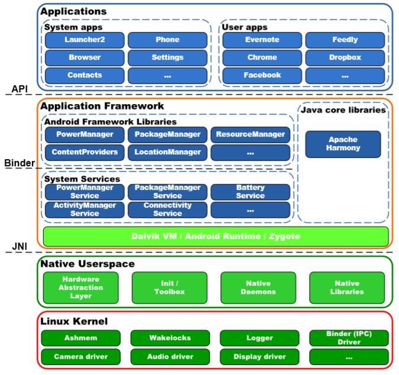
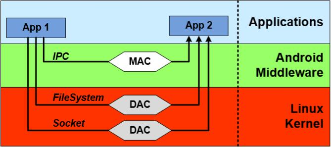
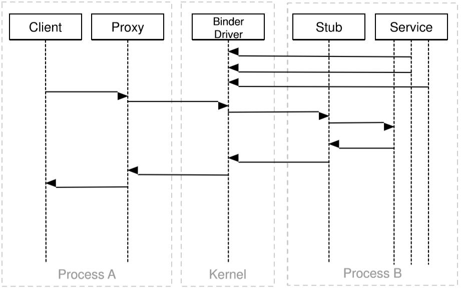
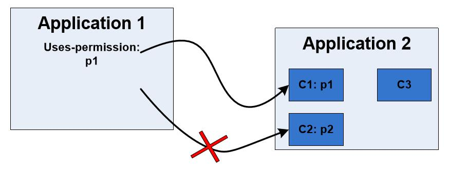

# 浅入浅出 Android 安全中文版

作者：[Yury Zhauniarovich](http://www.zhauniarovich.com)

译者：[飞龙](https://github.com/wizardforcel)

来源：[Yury Zhauniarovich | Publications](http://www.zhauniarovich.com/pubs.html)

+ [在线阅读](https://www.gitbook.com/book/wizardforcel/asani/details)
+ [PDF格式](https://www.gitbook.com/download/pdf/book/wizardforcel/asani)
+ [EPUB格式](https://www.gitbook.com/download/epub/book/wizardforcel/asani)
+ [MOBI格式](https://www.gitbook.com/download/mobi/book/wizardforcel/asani)

### 赞助我


### 协议

[CC BY-NC-SA 4.0](http://creativecommons.org/licenses/by-nc-sa/4.0/)

## 第一章 Android

> 来源：[Yury Zhauniarovich | Publications](http://www.zhauniarovich.com/pubs.html)

> 译者：[飞龙](https://github.com/)

> 协议：[CC BY-NC-SA 4.0](http://creativecommons.org/licenses/by-nc-sa/4.0/)

Android 安全架构的理解不仅帮助我了解 Android 的工作原理，而且为我开启了如何构建移动操作系统和 Linux 的眼界。 本章从安全角度讲解 Android 架构的基础知识。 在第 1.1 节中，我们会描述 Android 的主要层级，而第 1.2 节给出了在此操作系统中实现的安全机制的高级概述。

### 1.1 Android 技术栈

Android 是一个用于各种移动设备的软件栈，以及由 Google 领导的相应开源项目[9]。 Android 由四个层组成：Linux 内核，本地用户空间，应用程序框架和应用程序层。 有时本地用户空间和应用程序框架层被合并到一个层中，称为 Android 中间件层。 图 1.1 表示 Android 软件栈的层级。 粗略地说，在这个图中，绿色块对应在 C/C++ 中开发的组件，而蓝色对应在 Java 中实现的组件。 Google 在 Apache 2.0 许可证下分发了大部分 Android 代码。 此规则最值得注意的例外是 Linux 内核中的更改，这些更改在 GNU GPL V2 许可证下。



图 1.1：Android 软件栈

Linux 内核层。在 2005 年被 Google 认识之前，Android 是 Android Inc. 公司的初创产品。创业公司的特点之一是，他们倾向于最大限度地重复利用已经存在的组件，以减少其产品的时间和成本。 Android 公司选择 Linux 内核作为他们新平台的核心。在 Android 中，Linux 内核负责进程，内存，通信，文件系统管理等。虽然 Android 主要依赖于“vanilla" Linux 内核功能，但是已经做出了系统操作所需的几个自定义更改。其中 Binder（一个驱动程序，提供对 Android 中的自定义 RPC / IPC 机制的支持），Ashmem（替代标准的 Linux 共享内存功能），Wakelocks（一种防止系统进入睡眠的机制）是最值得注意的更改[19]。虽然这些变化被证明在移动操作系统中非常有用，但它们仍然在 Linux 内核的主要分支之外。


本地用户空间层。通过本地用户空间，我们可了解在 Dalvik 虚拟机之外运行的所有用户空间组件，并且不属于 Linux Kernel 层。这个层的第一个组件是硬件抽象层（HAL），它与 Linux 内核和本地用户空间层之间实际上是模糊的。在 Linux 中，硬件驱动程序嵌入到内核中或作为模块动态加载。虽然 Android 是建立在 Linux 内核之上，它利用了一种非常不同的方法来支持新的硬件。相反，对于每种类型的硬件，Android 定义了一个 API，它由上层使用并用于与这种类型的硬件交互。硬件供应商必须提供一个软件模块，负责实现在 Android 中为这种特定类型的硬件定义的API。因此，此解决方案不再允许 Android 将所有可能的驱动程序嵌入内核，并禁用动态模块加载内核机制。提供此功能的组件在 Android 中称为硬件抽象层。此外，这样的架构解决方案允许硬件供应商选择许可证，在其下分发它们的驱动程序[18,19]。

内核通过启动一个名为 init 的用户空间进程来完成其启动。 此过程负责启动 Android 中的所有其他进程和服务，以及在操作系统中执行一些操作。 例如，如果关键服务在 Android 中停止应答，init 进程可以重新启动它。 该进程根据`init.rc`配置文件执行操作。 工具箱包括基本的二进制文件，在 Android [19]中提供`shell`工具的功能。


Android 还依赖于一些关键的守护进程。 它在系统启动时启动，并在系统工作时保持它们运行。 例如，`rild`（无线接口层守护进程，负责基带处理器和其他系统之间的通信），`servicemanager`（一个守护进程，它包含在 Android 中运行的所有 Binder 服务的索引），`adbd`（Android Debug Bridge 守护进程，作为主机和目标设备之间的连接管理器）等。

本地用户空间中最后一个组件是本地库。 有两种类型的本地库：来自外部项目的本地库，以及在 Android 自身中开发的本地库。 这些库被动态加载并为 Android 进程提供各种功能[19]。

应用程序框架层。 Dalvik 是 Android 的基于寄存器的虚拟机。它允许操作系统执行使用 Java 语言编写的 Android 应用程序。在构建过程中，Java 类被编译成由 Dalvik VM 解释的`.dex`文件。 Dalvik VM 特别设计为在受限环境中运行。此外，Dalvik VM 提供了与系统其余部分交互的功能，包括本地二进制和库。为了加速进程初始化过程，Android 利用了一个名为 Zygote 的特定组件。这是一个将所有核心库链接起来的特殊“预热"过程。当新应用程序即将运行时，Android 会从 Zygote 分配一个新进程，并根据已启动的应用程序的规范设置该进程的参数。该解决方案允许操作系统不将链接库复制到新进程中，从而加快应用程序启动操作。在 Android 中使用的 Java 核心库，是从 Apache Harmony 项目借用的。

系统服务是 Android 的最重要的部分之一。 Android 提供了许多系统服务，它们提供了基本的移动操作系统功能，供 Android 应用开发人员在其应用中使用。 例如，`PackageManagerService`负责管理（安装，更新，删除等）操作系统中的 Android 包。 使用 JNI 接口系统服务可以与本地用户空间层的守护进程，工具箱二进制文件和本地库进行交互。 公共 API 到系统服务都是通过 Android 框架库提供的。 应用程序开发人员使用此 API 与系统服务进行交互。

Android 应用程序层。 Android 应用程序是在 Android 上运行的软件应用程序，并为用户提供大多数功能。 Stock Android 操作系统附带了一些称为系统应用程序的内置应用程序。 这些是作为 AOSP 构建过程的一部分编译的应用程序。 此外，用户可以从许多应用市场安装用户应用，来扩展基本功能并向操作系统引入新的功能。

### 1.2 Android 一般安全说明

Android 的核心安全原则是，对手应用程序不应该损害操作系统资源，用户和其他应用程序。 为了促使这个原则的执行，Android 是一个分层操作系统，利用了所有级别提供的安全机制。 专注于安全性，Android 结合了两个层级的组件[？，？]：Linux 内核层和应用程序框架层（参见图 1.2）。

在 Linux 内核层级，每个应用程序都在特殊的应用程序沙箱中运行。 内核通过使用标准 Linux 设施（进程分离，以及通过网络套接字和文件系统的任意访问控制）来强制隔离应用程序和操作系统组件。 这种隔离的实现是，为每个应用程序分配单独的 Unix 用户（UID）和组（GID）标识符。 这种架构决策强制在单独的 Linux 进程中运行每个应用程序。 因此，由于在 Linux 中实现的进程隔离，在默认情况下，应用程序不能相互干扰，并且对操作系统提供的设施具有有限的访问。 因此，应用程序沙盒确保应用程序不能耗尽操作系统资源，并且不能与其他应用程序交互[3]。



图 1.2：Android 内核实施中的两个层级

Linux 内核层提供的强制机制，有效地使用沙箱，将应用程序与其他应用程序和系统组件隔离。 同时，需要有效的通信协议来允许开发人员重用应用组件并与操作系统单元交互。 该协议称为进程间通信（IPC），因为它能够促进不同进程之间的交互。 在 Android 中，此协议在 Android 中间件层实现（在 Linux 内核层上发布的特殊驱动程序）。 此层级的安全性由 IPC 引用监控器提供。 引用监控器调解进程之间的所有通信，并控制应用程序如何访问系统的组件和其他应用程序。 在 Android 中，IPC 引用监控器遵循强制访问控制（MAC）访问控制类型。

默认情况下，所有 Android 应用都在低特权应用程序沙箱中运行。 因此，应用程序只能访问一组有限的系统功能。 Android 操作系统控制应用程序对系统资源的访问，这可能会对用户体验造成不利影响[3]。 该控制以不同的形式实现，其中一些在以下章节中详细描述。 还有一部分受保护的系统功能（例如，摄像头，电话或 GPS 功能），其访问权限应该提供给第三方应用程序。 然而，这种访问应以受控的方式提供。 在 Android 中，这种控制使用权限来实现。 基本上，每个提供受保护系统资源的访问的敏感 API 都被分配有一个权限（Permission）- 它是唯一的安全标签。 此外，受保护特性还可能包括其他应用的组件。

为了使用受保护的功能，应用程序的开发者必须在文件`AndroidManifest.xml`中请求相应的权限。 在安装应用程序期间，Android 操作系统将解析此文件，并向用户提供此文件中声明的权限列表。 应用程序的安装根据“全有或全无"原则进行，这意味着仅当接受所有权限时才安装应用程序。 否则，将不会安装应用程序。 权限仅在安装时授予，以后无法修改。 作为权限的示例，我们考虑需要监控 SMS 传入消息的应用程序。 在这种情况下，`AndroidManifest.xml`文件必须在`<uses-permission>`标签中包含以下声明：`android.permission.RECEIVE SMS`。

应用程序尝试使用某个功能，并且该功能尚未在 Android 清单文件中声明，通常会产生安全性异常。 在下面几节中我们会讲解权限实现机制的细节。

## 第二章 Android Linux 内核层安全

> 来源：[Yury Zhauniarovich | Publications](http://www.zhauniarovich.com/pubs.html)

> 译者：[飞龙](https://github.com/)

> 协议：[CC BY-NC-SA 4.0](http://creativecommons.org/licenses/by-nc-sa/4.0/)

作为最广为人知的开源项目之一，Linux 已经被证明是一个安全，可信和稳定的软件，全世界数千人对它进行研究，攻击和打补丁。 不出所料，Linux 内核是 Android 操作系统的基础[3]。 Android 不仅依赖于 Linux 的进程，内存和文件系统管理，它也是 Android 安全架构中最重要的组件之一。 在 Android 中，Linux 内核负责配置应用沙盒，以及规范一些权限。

### 2.1 应用沙盒

让我们考虑一个 Android 应用安装的过程。 Android 应用以 Android 软件包（`.apk`）文件的形式分发。 一个包由 Dalvik 可执行文件，资源，本地库和清单文件组成，并由开发者签名来签名。 有三个主要媒介可以在 Android 操作系统的设备上安装软件包：

+   Google Play
+   软件包安装程序
+   adb install 工具

Google Play 是一个特殊的应用，它为用户提供查找由第三方开发人员上传到市场的应用，以及安装该应用的功能。虽然它也是第三方应用，但 Google Play 应用（因为使用与操作系统相同的签名进行签名）可访问 Android 的受保护组件，而其他第三方应用则缺少这些组件。如果用户从其他来源安装应用，则通常隐式使用软件包安装程序。此系统应用提供了用于启动软件包安装过程的界面。由 Android 提供的`adb install`工具主要由第三方应用开发人员使用。虽然前两个媒介需要用户在安装过程中同意权限列表，但后者会安静地安装应用。这就是它主要用于开发工具的原因，旨在将应用安装在设备上进行测试。该过程如图 2.1 的上半部分所示。此图显示了 Android 安全体系结构的更详细的概述。我们将在本文中参考它来解释这个操作系统的特性。

在 Linux 内核层配置应用沙箱的过程如下。 在安装过程中，每个包都会被分配一个唯一的用户标识符（UID）和组标识符（GID），在设备的应用生命周期内不会更改。 因此，在 Android 中每个应用都有一个相应的 Linux 用户。 用户名遵循格式`app_x`，并且该用户的 UID 等于`Process.FIRST_APPLICATION_UID + x`，其中`Process.FIRST_APPLICATION_UID`常量对应于`10000`。例如，在图 2.1 中，`ex1.apk`包在安装期间获得了用户名`app 1`，UID 等于 `10001`。


图 2.1：Android 安全架构

在 Linux 中，内存中的所有文件都受 Linux 自定义访问控制（DAC）的约束。访问权限由文件的创建者或所有者为三种用户类型设置：文件的所有者，与所有者在同一组中的用户和所有其他用户。对于每种类型的用户，分配读，写和执行（`r-w-x`）权限的元组。因此，因为每个应用都有自己的 UID 和 GID，Linux 内核强制应用在自己的隔离地址空间内执行。除此之外，应用唯一的 UID 和 GID 由 Linux 内核使用，以实现不同应用之间的设备资源（内存，CPU 等）的公平分离。安装过程中的每个应用也会获得自己的主目录，例如`/data/data/package_name`，其中`package_name`是 Android 软件包的名称，例如`com.ex.ex1`，在 Android 中，这个文件夹是内部存储目录，其中应用将私有数据放在里面。分配给此目录的 Linu x 权限只允许“所有者"应用写入并读取此目录。有一些例外应该提到。使用相同证书签名的应用能够在彼此之间共享数据，可以拥有相同的 UID 或甚至可以在相同的进程中运行。

这些架构决策在 Linux 内核层上建立了高效的应用沙箱。 这种类型的沙箱很简单，并基于 Linux 可选访问控制模型（DAC）的验证。 幸运的是，因为沙盒在 Linux 内核层上执行，本地代码和操作系统应用也受到本章[3]中所描述的这些约束的约束。

### 2.2 Linux 内核层上的权限约束

通过将 Linux 用户和组所有者分配给实现此功能的组件，可以限制对某些系统功能的访问。 这种类型的限制可以应用于系统资源，如文件，驱动程序和套接字。 Android 使用文件系统权限和特定的内核补丁（称为 Paranoid Networking）[13]来限制低级系统功能的访问，如网络套接字，摄像机设备，外部存储器，日志读取能力等。

使用文件系统权限访问文件和设备驱动程序，可以限制进程对设备某些功能的访问。例如，这种技术被应用于限制应用对设备相机的访问。 `/dev/ cam`设备驱动程序的权限设置为`0660`，属于`root`所有者和摄像机所有者组。这意味着只有以`root`身份运行或包含在摄像机组中的进程才能读取和写入此设备驱动程序。因此，仅包括在相机组中的应用程序可以与相机交互。权限标签和相应组之间的映射在文件框架`/base/data/etc/platform.xml`中定义，摘录如清单 2.1 所示。因此，在安装过程中，如果应用程序已请求访问摄像机功能，并且用户已批准该应用程序，则还会为此应用程序分配一个摄像机 Linux 组 GID（请参阅清单 2.1 中的第 8 行和第 9 行）。因此，此应用程序可以从`/dev/cam`设备驱动程序读取信息。

```xml
 1 ...
 2 <permissions> 
 3 ...
 4 <permission name="android.permission.INTERNET" > 
 5 <group gid="inet" /> 
 6 </permission> 
 7 
 8 <permission name="android.permission.CAMERA" > 
 9 <group gid="camera" /> 
10 </permission> 
11 
12 <permission name="android.permission.READ_LOGS" > 
13 <group gid="log" />
14 </permission> 
15 ...
16 </permissions>
```

代码 2.1：权限标签和 Linux 组之间的映射

Android 中有一些地方可以用于设置文件、驱动和 Unix 套接字的文件系统权限：`init`程序，`init.rc`配置文件，`ueventd.rc`配置文件和系统 ROM 文件系统配置文件。 它们在第 3 章中会详细讨论。

在传统的 Linux 发行版中，允许所有进程启动网络连接。 同时，对于移动操作系统，必须控制对网络功能的访问。 为了在 Android 中实现此控制，需要添加特殊的内核补丁，将网络设施的访问限制于属于特定 Linux 组或具有特定 Linux 功能的进程。 这些针对 Android 的 Linux 内核补丁已经获得了 Paranoid 网络的名称。 例如，对于负责网络通信的`AF_INET`套接字地址族，此检查在`kernel/net/ipv4/af_inet.c`文件中执行（参见清单 2.2 中的代码片段）。 Linux 组和 Paranoid 网络的权限标签之间的映射也在`platform.xml`文件中设置（例如，参见清单 2.1 中的第 4 行）。

```c
 1 ...
 2 #ifdef CONFIG_ANDROID_PARANOID_NETWORK 
 3 #include <linux/android_aid.h> 
 4 
 5 static inline int current_has_network ( void ) 
 6 { 
 7   return in_egroup_p (AID_INET) || capable (CAP_NET_RAW) ; 
 8 } 
 9 #else 
10 static inline int current_has_network ( void ) 
11 { 
12   return 1; 
13 } 
14 #endif 
15 ... 
16 
17 /* 
18 * Create an inet socket . 
19 */ 
20 
21 static int inet create ( struct net *net , struct socket *sock , int protocol , 
22                          int kern ) 
23 { 
24   ...
25   if (!current_has_network() ) 
26     return −EACCES; 
27   ...
28 }
```

代码 2.2：Paranoid 网络补丁

类似的 Paranoid 网络补丁也适用于限制访问 IPv6 和蓝牙[19]。 

这些检查中使用的常量在内核中硬编码，并在`kernel/include/linux/android_aid.h`文件中规定（参见清单 2.3）。

```c
 1 ...
 2 #ifndef LINUX_ANDROID_AID_H 
 3 #define LINUX_ANDROID_AID_H 
 4 
 5 /* AIDs that the kernel treats differently */ 
 6 #define AID_OBSOLETE_000 3001 /* was NET_BT_ADMIN */ 
 7 #define AID_OBSOLETE_001 3002 /* was NET_BT */ 
 8 #define AID_INET 3003 
 9 #define AID_NET_RAW 3004 
10 #define AID_NET_ADMIN 3005 
11 #define AID_NET_BW_STATS 3006 /* read bandwidth statistics */ 
12 #define AID_NET_BW_ACCT 3007 /* change bandwidth statistics accounting */ 
13 
14 #endif
```

代码 2.3：硬编码在 Linux 内核中的 Android ID 常量

因此，在 Linux 内核层，通过检查应用程序是否包含在特殊预定义的组中来实现 Android 权限。 只有此组的成员才能访问受保护的功能。 在应用程序安装期间，如果用户已同意所请求的权限，则该应用程序包括在相应的 Linux 组中，因此获得对受保护功能的访问。

## 第三章 Android 本地用户空间层安全

> 来源：[Yury Zhauniarovich | Publications](http://www.zhauniarovich.com/pubs.html)

> 译者：[飞龙](https://github.com/)

> 协议：[CC BY-NC-SA 4.0](http://creativecommons.org/licenses/by-nc-sa/4.0/)

本地用户空间层在 Android 操作系统的安全配置中起到重要作用。 不理解在该层上发生了什么，就不可能理解在系统中如何实施安全架构决策。 在本章中，我们的主题是 Android 引导过程和文件系统特性的，并且描述了如何在本地用户空间层上保证安全性。

### 3.1 Android 引导过程

要了解在本地用户空间层上提供安全性的过程，首先应考虑 Android 设备的引导顺序。 要注意，在第一步中，这个顺序可能会因不同的设备而异，但是在 Linux 内核加载之后，过程通常是相同的。 引导过程的流程如图 3.1 所示。


图 3.1：Android 启动顺序

当用户打开智能手机时，设备的 CPU 处于未初始化状态。在这种情况下，处理器从硬连线地址开始执行命令。该地址指向 Boot ROM 所在的 CPU 的写保护存储器中的一段代码（参见图 3.1 中的步骤 1）。代码驻留在 Boot ROM 上的主要目的是检测 Boot Loader（引导加载程序）所在的介质[17]。检测完成后，Boot ROM 将引导加载程序加载到内存中（仅在设备通电后可用），并跳转到引导 Boot Loader 的加载代码。反过来，Boot Loader 建立了外部 RAM，文件系统和网络的支持。之后，它将 Linux 内核加载到内存中，并将控制权交给它。 Linux 内核初始化环境来运行 C 代码，激活中断控制器，设置内存管理单元，定义调度，加载驱动程序和挂载根文件系统。当内存管理单元初始化时，系统为使用虚拟内存以及运行用户空间进程[17]做准备。实际上，从这一步开始，该过程就和运行 Linux 的台式计算机上发生的过程没什么区别了。

第一个用户空间进程是`init`，它是 Android 中所有进程的祖先。 该程序的可执行文件位于 Android 文件系统的根目录中。 清单 3.1 包含此可执行文件的主要部分。 可以看出，`init`二进制负责创建文件系统基本条目（7 到 16 行）。 之后（第 18 行），程序解析`init.rc`配置文件并执行其中的命令。

```c
 1 int main( int argc, char **argv ) 
 2 { 
 3   ...
 4   if (!strcmp (basename( argv[0] ), "ueventd") ) 
 5     return ueventd_main ( argc, argv ) ; 
 6   ...
 7   mkdir("/dev", 0755) ; 
 8   mkdir("/proc", 0755) ; 
 9   mkdir("/sys", 0755) ; 
10 
11   mount("tmpfs", "/dev", "tmpfs", MS_NOSUID, "mode=0755") ; 
12   mkdir("/dev/pts", 0755) ; 
13   mkdir("/dev/socket", 0755) ; 
14   mount("devpts", "/dev/pts", "devpts", 0, NULL) ; 
15   mount("proc", "/proc", "proc", 0, NULL) ; 
16   mount("sysfs", "/sys", "sysfs", 0, NULL) ; 
17   ... 
18   init_parseconfig_file("/init.rc") ; 
19   ... 
20 }
```

代码 3.1：`init`程序源码

`init.rc`配置文件使用一种称为 Android Init Language 的语言编写，位于根目录下。 这个配置文件可以被想象为一个动作列表（命令序列），其执行由预定义的事件触发。 例如，在清单 3.2 中，`fs`（行 1）是一个触发器，而第 4 - 7 行代表动作。 在`init.rc`配置文件中编写的命令定义系统全局变量，为内存管理设置基本内核参数，配置文件系统等。从安全角度来看，更重要的是它还负责基本文件系统结构的创建，并为创建的节点分配所有者和文件系统权限。

```
1 on fs 
2   # mount mtd partitions 
3   # Mount /system rw first to give the filesystem a chance to save a checkpoint 
4   mount yaffs2 mtd@system /system 
5   mount yaffs2 mtd@system /system ro remount 
6   mount yaffs2 mtd@userdata /data nosuid nodev 
7   mount yaffs2 mtd@cache /cache nosuid nodev
```

代码 3.2：模拟器中的`fs`触发器上执行的动作列表

此外，`init`程序负责在 Android 中启动几个基本的守护进程和进程（参见图 3.1 中的步骤 5），其参数也在`init.rc`文件中定义。 默认情况下，在 Linux 中执行的进程以与祖先相同的权限（在相同的 UID下）运行。 在 Android 中，`init`以 root 权限（`UID == 0`）启动。 这意味着所有后代进程应该使用相同的 UID 运行。 幸运的是，特权进程可以将其 UID 改变为较少特权的进程。 因此，`init`进程的所有后代可以使用该功能来指定派生进程的 UID 和 GID（所有者和组也在`init.rc`文件中定义）。

第一个守护进程派生于`init`进程，它是`ueventd`守护进程。 这个服务运行自己的`main`函数（参见清单 3.1 中的第 5 行），它读取`ueventd.rc`和`ueventd.[device name].rc`配置文件，并重放指定的内核`uevent_hotplug`事件。 这些事件设置了不同设备的所有者和权限（参见清单 3.3）。 例如，第 5 行显示了如何设置文件系统对`/ dev/cam`设备的权限，2.2 节中会涉及这个例子。 之后，守护进程等待监听所有未来的热插拔事件。

ueventd.rc

```
1 ...
2 /dev/ashmem 0666 root root 
3 /dev/binder 0666 root root 
4 ...
5 /dev/cam 0660 root camera 
6 ...
```

代码 3.3：`ueventd.rc`文件

由`init`程序启动的核心服务之一是`servicemanager`（请参阅图 3.1 中的步骤 5）。 此服务充当在 Android 中运行的所有服务的索引。 它必须在早期阶段可用，因为以后启动的所有系统服务都应该有可能注册自己，从而对操作系统的其余部分可见[19]。

`init`进程启动的另一个核心进程是 Zygote。 Zygote 是一个热身完毕的特殊进程。 这意味着该进程已经被初始化并且链接到核心库。 Zygote 是所有进程的祖先。 当一个新的应用启动时，Zygote 会派生自己。 之后，为派生子进程设置对应于新应用的参数，例如 UID，GID，`nice-name`等。 它能够加速新进程的创建，因为不需要将核心库复制到新进程中。 新进程的内存具有“写时复制"（COW）保护，这意味着只有当后者尝试写入受保护的内存时，数据才会从 zygote 进程复制到新进程。 从而，核心库不会改变，它们只保留在一个地方，减少内存消耗和应用启动时间。

使用 Zygote 运行的第一个进程是 System Server（图 3.1 中的步骤 6）。 这个进程首先运行本地服务，例如 SurfaceFlinger 和 SensorService。 在服务初始化之后，调用回调，启动剩余的服务。 所有这些服务之后使用 servicemanager 注册。

### 3.2 Android 文件系统

虽然 Android 基于 Linux 内核，它的文件系统层次不符合文件系统层次标准[10]，它了定义类 Unix 系统的文件系统布局（见清单 3.4）。 Android 和 Linux 中的某些目录是相同的，例如`/dev`，`/proc`，`/sys`，`/etc`，`/mnt`等。这些文件夹的用途与 Linux 中的相同。 同时，还有一些目录，如`/system`，`/data`和`/cache`，它们不存在于 Linux 系统中。这些文件夹是 Android 的核心部分。 在 Android 操作系统的构建期间，会创建三个映像文件：`system.img`，`userdata.img`和`cache.img`。 这些映像提供 Android 的核心功能，是在设备的闪存上存储的。 在系统引导期间，`init`程序将这些映像安装到预定义的安装点，如`/system`，`/data`和`/cache`（参见清单 3.2）。

```
 1 drwxr−xr−x root root 2013−04−10 08 : 13 acct 
 2 drwxrwx−−− system cache 2013−04−10 08 : 13 cache 
 3 dr−x−−−−−− root root 2013−04−10 08 : 13 config 
 4 lrwxrwxrwx root root 2013−04−10 08 : 13 d −> /sys/kernel/debug 
 5 drwxrwx−−x system system 2013−04−10 08 : 14 data 
 6 −rw−r−−r−− root root 116 1970−01−01 00 : 00 default . prop 
 7 drwxr−xr−x root root 2013−04−10 08 : 13 dev 
 8 lrwxrwxrwx root root 2013−04−10 08 : 13 etc −> /system/etc 
 9 −rwxr−x−−− root root 244536 1970−01−01 00 : 00 init 
10 −rwxr−x−−− root root 2487 1970−01−01 00 : 00 init . goldfish . rc 
11 −rwxr−x−−− root root 18247 1970−01−01 00 : 00 init . rc 
12 −rwxr−x−−− root root 1795 1970−01−01 00 : 00 init . trace . rc 
13 −rwxr−x−−− root root 3915 1970−01−01 00 : 00 init . usb . rc 
14 drwxrwxr−x root system 2013−04−10 08 : 13 mnt 
15 dr−xr−xr−x root root 2013−04−10 08 : 13 proc 
16 drwx−−−−−− root root 2012−11−15 05 : 31 root 
17 drwxr−x−−− root root 1970−01−01 00 : 00 sbin 
18 lrwxrwxrwx root root 2013−04−10 08 : 13 sdcard −> /mnt/sdcard 
19 d−−−r−x−−− root sdcard r 2013−04−10 08 : 13 storage 
20 drwxr−xr−x root root 2013−04−10 08 : 13 sys 
21 drwxr−xr−x root root 2012−12−31 03 : 20 system 
22 −rw−r−−r−− root root 272 1970−01−01 00 : 00 ueventd . goldfish . rc 
23 −rw−r−−r−− root root 4024 1970−01−01 00 : 00 ueventd . rc 
24 lrwxrwxrwx root root 2013−04−10 08 : 13 vendor −> /system/vendor
```

代码 3.4：Android 文件系统

`/system`分区包含整个 Android 操作系统，除了 Linux 内核，它本身位于`/boot`分区上。 此文件夹包含子目录`/system/bin`和`/system/lib`，它们相应包含核心本地可执行文件和共享库。 此外，此分区包含由系统映像预先构建的所有系统应用。 映像以只读模式安装（参见清单 3.2 中的第 5 行）。 因此，此分区的内容不能在运行时更改。

因此，`/system`分区被挂载为只读，它不能用于存储数据。 为此，单独的分区`/data`负责存储随时间改变的用户数据或信息。 例如，`/data/app`目录包含已安装应用程序的所有 apk 文件，而`/data/data`文件夹包含应用程序的`home`目录。

`/cache`分区负责存储经常访问的数据和应用程序组件。 此外，操作系统无线更新（卡刷）也在运行之前存储在此分区上。

因此，在 Android 的编译期间生成`/system`，`/data`和`/cache`，这些映像上包含的文件和文件夹的默认权限和所有者必须在编译时定义。 这意味着在编译此操作系统期间，用户和组 UID 和 GID 应该可用。 Android 文件系统配置文件（见清单 3.5）包含预定义的用户和组的列表。 应该提到的是，一些行中的值（例如，参见第 10 行）对应于在 Linux 内核层上定义的值，如第 2.2 节所述。

此外，文件和文件夹的默认权限，所有者和所有者组定义在该文件中（见清单 3.6）。 这些规则由`fs_config()`函数解析并应用，它在这个文件的末尾定义。 此函数在映像组装期间调用。

```c
 1 #define AID_ROOT 0 /* traditional unix root user */ 
 2 #define AID_SYSTEM 1000 /* system server */ 
 3 #define AID_RADIO 1001 /* telephony subsystem , RIL */ 
 4 #define AID_BLUETOOTH 1002 /* bluetooth subsystem */ 
 5 #define AID_GRAPHICS 1003 /* graphics devices */ 
 6 #define AID_INPUT 1004 /* input devices */ 
 7 #define AID_AUDIO 1005 /* audio devices */ 
 8 #define AID_CAMERA 1006 /* camera devices */ 
 9 ... 
10 #define AID_INET 3003 /* can create AF_INET and AF_INET6 sockets */ 
11 ... 
12 #define AID_APP 10000 /* first app user */ 
13 ... 
14 static const struct android_id_info android_ids [ ] = { 
15   { "root" , AID_ROOT, }, 
16   { "system" , AID_SYSTEM, }, 
17   { "radio" , AID_RADIO, }, 
18   { "bluetooth" , AID_BLUETOOTH, }, 
19   { "graphics" , AID_GRAPHICS, }, 
20   { "input" , AID_INPUT, }, 
21   { "audio" , AID_AUDIO, }, 
22   { "camera" , AID_CAMERA, }, 
23   ... 
24   { "inet" , AID_INET, }, 
25   ... 
26 }; 
```

代码 3.5：Android 中硬编码的 UID 和 GID，以及它们到用户名称的映射

### 3.2.1 本地可执行文件的保护

在清单 3.6 中可以看到一些二进制文件分配有`setuid`和`setgid`访问权限标志。例如，`su`程序设置了它们。这个众所周知的工具允许用户运行具有指定的 UID 和 GID 的程序。在 Linux 中，此功能通常用于运行具有超级用户权限的程序。根据列表 3.6，二进制`/system/xbin/su`的访问权限分配为“06755"（见第 21 行）。第一个非零数“6"意味着该二进制具有`setuid`和`setgid`（`4 + 2`）访问权限标志集。通常，在Linux中，可执行文件以与启动它的进程相同的权限运行。这些标签允许用户使用可执行所有者或组的权限运行程序[11]。因此，在我们的例子中，`binary/system/xbin/su`将以 root 用户身份运行。这些 root 权限允许程序将其 UID 和 GID 更改为用户指定的 UID 和 GID（见清单 3.7 中的第 15 行）。之后，`su`可以使用指定的 UID 和 GID 启动提供的程序（例如，参见行 22）。因此，程序将以所需的 UID 和 GID 启动。

在特权程序的情况下，需要限制可访问这些工具的应用程序的范围。 在我们的这里，没有这样的限制，任何应用程序可以运行`su`程序并获得 root 级别的权限。 在 Android 中，通过将调用程序的 UID 与允许运行它的 UID 列表进行比较，来对本地用户空间层实现这种限制。 因此，在第 9 行中，`su`可执行文件获得进程的当前 UID，它等于调用它的进程的 UID，在第`10`行，它将这个 UID 与允许的 UID 的预定列表进行比较。 因此，只有在调用进程的 UID 等于`AID_ROOT`或`AID_SHELL`时，`su`工具才会启动。 为了执行这样的检查，`su`导入在 Android 中定义的 UID 常量（见第 1 行）。

```c
 1 /* Rules for directories .*/
 2 static struct fs_path_config android_dirs [ ] = { 
 3   { 00770 , AID_SYSTEM, AID_CACHE, "cache" } , 
 4   { 00771 , AID_SYSTEM, AID_SYSTEM, "data/app" } , 
 5   ... 
 6   { 00777 , AID_ROOT, AID_ROOT, "sdcard" } , 
 7   { 00755 , AID_ROOT, AID_ROOT, 0 } , 
 8 }; 
 9 
10 /* Rules for files .*/ 
11 static struct fs_path_config android_files [ ] = { 
12   ... 
13   { 00644 , AID_SYSTEM, AID_SYSTEM, "data/app/*" } , 
14   { 00644 , AID_MEDIA_RW, AID_MEDIA_RW, "data/media/*" } , 
15   { 00644 , AID_SYSTEM, AID SYSTEM, "data/app−private /*" } , 
16   { 00644 , AID_APP, AID_APP, "data/data/*" } , 
17   ... 
18   { 02755 , AID_ROOT, AID_NET_RAW, "system/bin/ping" } , 
19   { 02750 , AID_ROOT, AID_INET, "system/bin/netcfg" } , 
20   ... 
21   { 06755 , AID_ROOT, AID_ROOT, "system/xbin/su" } , 
22   ... 
23   { 06750 , AID_ROOT, AID_SHELL, "system/bin/run−as" } , 
24   { 00755 , AID_ROOT, AID_SHELL, "system/bin/*" } , 
25   ... 
26   { 00644 , AID_ROOT, AID_ROOT, 0 } , 
27 };
```

代码 3.6：默认权限和所有者

此外，在较新的版本（从 4.3 开始），Android 核心开发人员开始使用 Capabilities Linux 内核系统[4]。 这允许它们额外限制需要以 root 权限运行的程序的权限。 例如，对于`su`程序来说，它不需要具有 root 用户的所有特权。 对于这个程序，它足以有能力修改当前的 UID 和 GID。 因此，此工具只需要`CAP_SETUID`和`CAP_SETGID` root 权限来正常运行。

```c
 1 #include <private/android_filesystem_config.h>
 2 ... 
 3 int main( int argc, char **argv ) 
 4 { 
 5   struct passwd *pw; 
 6   int uid, gid, myuid ; 
 7 
 8 /* Until we have something better , only root and the shell can use su . */ 
 9 myuid = getuid () ; 
10 if (myuid != AID_ROOT && myuid != AID_SHELL) { 
11   fprintf ( stderr, "su : uid %d not allowed to su\n", myuid) ; 
12   return 1; 
13 } 
14 ... 
15 if ( setgid ( gid ) || setuid ( uid ) ) { 
16   fprintf ( stderr, "su : permission denied\n") ; 
17   return 1; 
18 } 
19 
20 /* User specified command for exec . */ 
21 if ( argc == 3 ) { 
22   if ( execlp ( argv[2], argv[2], NULL) < 0) { 
23     fprintf ( stderr , "su : exec failed for %s Error:%s\n" , argv [2] , 
24     strerror ( errno ) ) ; 
25     return −errno ; 
26   } 
27   ... 
28 }
```

代码 3.7：`su`程序的源代码

## 第四章 Android 框架层安全

> 来源：[Yury Zhauniarovich | Publications](http://www.zhauniarovich.com/pubs.html)

> 译者：[飞龙](https://github.com/)

> 协议：[CC BY-NC-SA 4.0](http://creativecommons.org/licenses/by-nc-sa/4.0/)

如我们在第1.2节中所描述的那样，应用程序框架级别上的安全性由 IPC 引用监视器实现。 在 4.1 节中，我们以 Android 中使用的进程间通信系统的描述开始，讲解这个级别上的安全机制。 之后，我们在 4.2 节中引入权限，而在 4.3 节中，我们描述了在此级别上实现的权限实施系统。

### 4.1 Android Binder 框架 

如 2.1 节所述，所有 Android 应用程序都在应用程序沙箱中运行。粗略地说，应用程序的沙箱通过在带有不同 Linux 身份的不同进程中运行所有应用程序来保证。此外，系统服务也在具有更多特权身份的单独进程中运行，允许它们使用 Linux Kernel DAC 功能，访问受保护的系统不同部分（参见第 2.1, 2.2 和 1.2 节）。因此，需要进程间通信（IPC）框架来管理不同进程之间的数据和信号交换。在 Android 中，一个称为 Binder 的特殊框架用于进程间通信[12]。标准的 Posix System V IPC 框架不支持由 Android 实现的 Bionic libc 库（参见[这里](https://android.googlesource.com/platform/ndk/+/android-4.2.2_r1.2/docs/system/ libc/SYSV-IPC.html)）。此外，除了用于一些特殊情况的 Binder 框架，也会使用 Unix 域套接字（例如，用于与 Zygote 守护进程的通信），但是这些机制不在本文的考虑范围之内。

Binder 框架被特地重新开发来在 Android 中使用。 它提供了管理此操作系统中的进程之间的所有类型的通信所需的功能。 基本上，甚至应用程序开发人员熟知的机制，例如`Intents`和`ContentProvider`，都建立在 Binder 框架之上。 这个框架提供了多种功能，例如可以调用远程对象上的方法，就像本地对象那样，以及同步和异步方法调用，Link to Death（某个进程的 Binder 终止时的自动通知），跨进程发送文件描述符的能力等等[12,16] 。

根据由客户端 - 服务器同步模型组织的进程之间的通信。客户端发起连接并等待来自服务端的回复。 因此，客户端和服务器之间的通信可以被想象为在相同的进程线程中执行。 这为开发人员提供了调用远程对象上的方法的可能性，就像它们是本地的一样。 通过 Binder 的通信模型如图 4.1 所示。 在这个图中，客户端进程 A 中的应用程序想要使用进程 B  [12]中运行的服务的公开行为。



使用 Binder 框架的客户端和服务之间的所有通信，都通过 Linux 内核驱动程序`/dev/binder`进行。此设备驱动程序的权限设置为全局可读和可写（见 3.1 节中的清单 3.3 中的第 3 行）。因此，任何应用程序可以写入和读取此设备。为了隐藏 Binder 通信协议的特性，`libbinder`库在 Android 中使用。它提供了一种功能，使内核驱动程序的交互过程对应用程序开发人员透明。尤其是，客户端和服务器之间的所有通信通过客户端侧的代理和服务器侧的桩进行。代理和桩负责编码和解码数据和通过 Binder 驱动程序发送的命令。为了使用代理和桩，开发人员只需定义一个 AIDL 接口，在编译应用程序期间将其转换为代理和桩。在服务端，调用单独的 Binder 线程来处理客户端请求。

从技术上讲，使用Binder机制的每个公开服务（有时称为 Binder 服务）都分配有标识。内核驱动程序确保此 32 位值在系统中的所有进程中是唯一的。因此，此标识用作 Binder 服务的句柄。拥有此句柄可以与服务交互。然而，为了开始使用服务，客户端首先必须找到这个值。服务句柄的发现通过 Binder 的上下文管理器（`servicemanager`是 Android Binder 的上下文管理器的实现，在这里我们互换使用这些概念）来完成。上下文管理器是一个特殊的 Binder 服务，其预定义的句柄值等于 0（指代清单 4.1 的第 8 行中获得的东西）。因为它有一个固定的句柄值，任何一方都可以找到它并调用其方法。基本上，上下文管理器充当名称服务，通过服务的名称提供服务句柄。为了实现这个目的，每个服务必须注册上下文管理器（例如，使用第 26 行中的`ServiceManager`类的`addService`方法）。因此，客户端可以仅知道与其通信的服务名称。使用上下文管理器来解析此名称（请参阅`getService`第 12 行），客户端将收到稍后用于与服务交互的标识。 Binder 驱动程序只允许注册单个上下文管理器。因此，`servicemanager`是由 Android 启动的第一个服务之一（见第 3.1 节）。`servicemanager`组件确保了只允许特权系统标识注册服务。

Binder 框架本身不实施任何安全性。 同时，它提供了在 Android 中实施安全性的设施。 Binder 驱动程序将发送者进程的 UID 和 PID 添加到每个事务。 因此，由于系统中的每个应用具有其自己的 UID，所以该值可以用于识别调用方。 调用的接收者可以检查所获得的值并且决定是否应该完成事务。 接收者可以调用`android.os.Binder.getCallingUid()`和`android.os.Binder.getCallingPid()`[12]来获得发送者的 UID 和 PID。 另外，由于 Binder 句柄在所有进程中的唯一性和其值的模糊性[14]，它也可以用作安全标识。

```java
 1 public final class ServiceManager { 
 2   ... 
 3   private static IServiceManager getIServiceManager() { 
 4     if ( sServiceManager != null ) { 
 5       return sServiceManager ; 
 6     } 
 7     // Find the service manager 
 8     sServiceManager = ServiceManagerNative.asInterface( BinderInternal.getContextObject() ); 
 9     return sServiceManager ; 
10   } 
11 
12   public static IBinder getService ( String name) { 
13     try { 
14       IBinder service = sCache . get (name) ; 
15       if ( service != null ) { 
16         return service ; 
17       } else { 
18         return getIServiceManager().getService(name); 
19       } 
20     } catch (RemoteException e) { 
21       Log.e(TAG, "error in getService", e); 
22     } 
23     return null; 
24   } 
25 
26   public static void addService( String name, IBinder service, boolean allowIsolated ) { 
27     try { 
28       getIServiceManager().addService(name, service, allowIsolated ); 
29     } catch (RemoteException e) { 
30       Log.e(TAG, "error in addService" , e); 
31     } 
32   } 
33   ... 
34 }
```

代码 4.1：`ServiceManager`的源码

### 4.2 Android 权限

如我们在 2.1 节中所设计的那样，在 Android 中，每个应用程序默认获得其自己的 UID 和 GID 系统标识。 此外，在操作系统中还有一些硬编码的标识（参见清单 3.5）。 这些身份用于使用在 Linux 内核级别上实施的 DAC，分离 Android 操作系统的组件，从而提高操作系统的整体安全性。 在这些身份中，`AID SYSTEM`最为显著。 此 UID 用于运行系统服务器（`system server`），这个组件统一了由 Android 操作系统提供的服务。 系统服务器具有访问操作系统资源，以及在系统服务器内运行的每个服务的特权，这些服务提供对其他 OS 组件和应用的特定功能的受控访问。 此受控访问基于权限系统。

正如我们在 4.1 节中所提及的，Binder 框架向接收方提供了获得发送方 UID 和 PID 的能力。在一般情况下，该功能可以由服务利用来限制想要连接到服务的消费者。这可以通过将消费者的 UID 和 PID 与服务所允许的 UID 列表进行比较来实现。然而，在 Android 中，这种功能以略微不同的方式来实现。服务的每个关键功能（或简单来说是服务的方法）被称为权限的特殊标签保护。粗略地说，在执行这样的方法之前，会检查调用进程是否被分配了权限。如果调用进程具有所需权限，则允许调用服务。否则，将抛出安全检查异常（通常，`SecurityException`）。例如，如果开发者想要向其应用程序提供发送短信的功能，则必须将以下行添加到应用程序的`AndroidManifest.xml`文件中：`<uses-permission android:name ="android.permission.SEND_SMS"/>` 。Android 还提供了一组特殊调用，允许在运行时检查服务使用者是否已分配权限。

到目前为止所描述的权限模型提供了一种强化安全性的有效方法。 同时，这个模型是无效的，因为它认为所有的权限是相等的。 在移动操作系统的情况下，所提供的功能在安全意义上并不总是相等。 例如，安装应用程序的功能比发送 SMS 的功能更重要，相反，发送 SMS 的功能比设置警告或振动更危险。

这个问题在 Android 中通过引入权限的安全级别来解决。有四个可能的权限级别：`normal`，`dangerous`，`signature`和`signatureOrSystem`。权限级别要么硬编码到 Android 操作系统（对于系统权限），要么由自定义权限声明中的第三方应用程序的开发者分配。此级别影响是否决定向请求的应用程序授予权限。为了被授予权限，正常的权限可以只在应用程序的`AndroidManifest.xml`文件中请求。危险权限除了在清单文件中请求之外，还必须由用户批准。在这种情况下，安装应用程序期间，安装包所请求的权限集会显示给用户。如果用户批准它们，则安装应用程序。否则，安装将被取消。如果请求权限的应用与声明它的应用拥有相同签名，（6.1 中提到了 Android 中的应用程序签名的用法），系统将授予`signature`权限。如果请求的权限应用和声明权限的使用相同证书签名，或请求应用位于系统映像上，则授予`signatureOrSystem`权限。因此，对于我们的示例，振动功能被正常级别的权限保护，发送 SMS 的功能被危险级别的权限保护，以及软件包安装功能被`signatureOrSystem`权限级别保护。

### 4.2.1 系统权限定义

用于保护 Android 操作系统功能的系统权限在框架的`AndroidManifest.xml`文件中定义，位于 Android 源的`frameworks/base/core/res`文件夹中。 这个文件的一个摘录包含一些权限定义的例子，如代码清单 4.2 所示。 在这些示例中，展示了用于保护发送 SMS，振动器和包安装功能的权限声明。

```xml
 1 <manifest xmlns:android=" http://schemas.android.com/apk/res/android" 
 2   package="android" coreApp="true" android:sharedUserId="android.uid.system" 
 3   android:sharedUserLabel="@string/android_system_label "> 
 4   ... 
 5   <!−− Allows an application to send SMS messages. −−> 
 6   <permission android:name="android.permission.SEND_SMS" 
 7     android:permissionGroup="android.permission−group.MESSAGES" 
 8     android:protectionLevel="dangerous"
 9     android:permissionFlags="costsMoney" 
10     android:label="@string/permlab_sendSms" 
11     android:description="@string/permdesc _sendSms" /> 
12   ... 
13   <!−− Allows access to the vibrator −−> 
14   <permission android:name="android.permission.VIBRATE" 
15     android:permissionGroup="android.permission−group.AFFECTS_BATTERY" 
16     android:protectionLevel="normal" 
17     android:label="@string/permlab_vibrate" 
18     android:description="@string/permdesc_vibrate" /> 
19   ... 
20   <!−− Allows an application to install packages. −−> 
21   <permission android:name="android.permission.INSTALL_PACKAGES" 
22     android:label="@string/permlab_installPackages" 
23     android:description="@string/permdesc_installPackages" 
24     android:protectionLevel="signature|system" /> 
25   ... 
26 </manifest>
```

代码 4.2：系统权限的定义

默认情况下，第三方应用程序的开发人员无法访问受`signature`和`signatureOrSystem`级别的系统权限保护的功能。 这种行为以以下方式来保证：应用程序框架包使用平台证书签名。 因此，需要使用这些级别的权限保护的功能的应用程序必须使用相同的平台证书进行签名。 然而，仅有操作系统的构建者才可以访问该证书的私钥，通常是硬件生产者（他们自己定制 Android）或电信运营商（使用其修改的操作系统映像来分发设备）。

### 4.2.2 权限管理

系统服务`PackageManagerService`负责 Android 中的应用程序管理。 此服务有助于在操作系统中安装，卸载和更新应用程序。 此服务的另一个重要作用是权限管理。 基本上，它可以被认为是一个策略管理的要素。 它存储了用于检查 Android 包是否分配了特定权限的信息。 此外，在应用程序安装和升级期间，它执行一堆检查，来确保在这些过程中不违反权限模型的完整性。 此外，它还作为一个策略判定的要素。 此服务的方法（我们将在后面展示）是权限检查链中的最后一个元素。 我们不会在这里考虑`PackageManagerService`的操作。 然而，感兴趣的读者可以参考[15,19]来获得如何执行应用安装的更多细节。

`PackageManagerService`将所有第三方应用程序的权限的相关信息存储在`/data/system/packages.xml `[7]中。 该文件用作系统重新启动之间的永久存储器。 但是，在运行时，所有有关权限的信息都保存在 RAM 中，从而提高系统的响应速度。 在启动期间，此信息使用存储在用于第三方应用程序的`packages.xml`文件中的数据，以及通过解析系统应用程序来收集。

### 4.2.3 Android 框架层的权限实施

为了了解 Android 如何在应用程序框架层强制实施权限，我们考虑 Vibrator 服务用法。 在清单 4.3 的第 6 行中，展示了振动器服务如何保护其方法`vibrate `的示例。 这一行检查了调用组件是否分配有由常量`android.Manifest.permission.VIBRATE`定义的标签`android.permission.VIBRATE`。 Android 提供了几种方法来检查发送者（或服务使用者）是否已被分配了权限。 在我们这个库，这些设施由方法`checkCallingOrSelfPermission`表示。 除了这种方法，还有许多其他方法可以用于检查服务调用者的权限。

```java
 1 public class VibratorService extends IVibratorService.Stub 
 2   implements InputManager.InputDeviceListener { 
 3   ... 
 4   public void vibrate ( long milliseconds, IBinder token ) { 
 5     if (mContext.checkCallingOrSelfPermission(android.Manifest.permission.VIBRATE) 
 6             != PackageManager.PERMISSION_GRANTED) { 
 7       throw new SecurityException("Requires VIBRATE permission"); 
 8     } 
 9     ... 
10   } 
11   ... 
12 }
```

代码 4.3：权限的检查

方法`checkCallingOrSelfPermission`的实现如清单 4.4 所示。 在第 24 行中，方法`checkPermission`被调用。 它接收`uid`和`pid`作为 Binder 框架提供的参数。

```java
 1 class ContextImpl extends Context { 
 2   ... 
 3   @Override 
 4   public int checkPermission ( String permission, int pid, int uid ) { 
 5     if ( permission == null ) { 
 6       throw new IllegalArgumentException ("permission is null ") ; 
 7     } 
 8 
 9     try { 
10       return ActivityManagerNative.getDefault().checkPermission( 
11         permission, pid, uid ); 
12       } catch (RemoteException e) { 
13       return PackageManager.PERMISSION_DENIED; 
14     } 
15   } 
16 
17   @Override 
18   public int checkCallingOrSelfPermission ( String permission ) { 
19     if ( permission == null ) { 
20       throw new IllegalArgumentException("permission is null"); 
21     } 
22 
23     return checkPermission( permission, Binder. getCallingPid(), 
24       Binder.getCallingUid() ); 
25   } 
26   ... 
27 }
```

代码 4.4：`ContextImpl `类的摘录


在第 11 行中，检查被重定向到`ActivityManagerService`类，继而在`ActivityManager`组件的方法`checkComponentPermission`中执行实际检查。 此方法的代码如清单 4.5 所示。 在第 4 行中它检查调用者 UID 是否拥有特权。 具有 root 和系统 UID 的组件由具有所有权限的系统授予。

```java
 1 public static int checkComponentPermission ( String permission, int uid, 
 2   int owningUid, boolean exported ) { 
 3   // Root , system server get to do everything . 
 4   if ( uid == 0 || uid == Process.SYSTEM_UID) { 
 5     return PackageManager.PERMISSION_GRANTED; 
 6   } 
 7   // Isolated processes don ’ t get any permissions . 
 8   if ( UserId.isIsolated ( uid ) ) { 
 9     return PackageManager.PERMISSION_DENIED; 
10   } 
11   // If there is a uid that owns whatever is being accessed , it has 
12   // blanket access to it regardless of the permissions it requires . 
13   if (owningUid >= 0 && UserId.isSameApp(uid, owningUid) ) { 
14     return PackageManager.PERMISSION_GRANTED; 
15   } 
16   // If the target is not exported , then nobody else can get to it . 
17   if (!exported) { 
18     Slog.w(TAG, "Permission denied: checkComponentPermission() owningUid=" + owningUid) ; 
19     return PackageManager.PERMISSION_DENIED; 
20   } 
21   if ( permission == null ) { 
22     return PackageManager.PERMISSION_GRANTED; 
23   } 
24   try { 
25     return AppGlobals.getPackageManager() 
26       .checkUidPermission ( permission , uid ) ; 
27   } catch (RemoteException e) { 
28     // Should never happen , but if it does . . . deny !
29     Slog.e(TAG, "PackageManager is dead ?!?" , e) ; 
30   } 
31   return PackageManager.PERMISSION_DENIED;
32 }
```

代码 4.5：`ActivityManager`的`checkComponentPermission`方法。

在清单 4.5 的第 26 行中，权限检查被重定向到包管理器，将其转发到`PackageManagerService`。 正如我们前面解释的，这个服务知道分配给 Android 包的权限。 执行权限检查的`PackageManagerService`方法如清单 4.6 所示。 在第 7 行中，如果将权限授予由其 UID 定义的 Android 应用程序，则会执行精确检查。

```java
 1 public int checkUidPermission ( String permName, int uid ) { 
 2  final boolean enforcedDefault = isPermissionEnforcedDefault(permName); 
 3  synchronized (mPackages) { 
 4    Object obj = mSettings.getUserIdLPr( UserHandle.getAppId( uid ) ); 
 5    if ( obj != null ) { 
 6      GrantedPermissions gp = ( GrantedPermissions ) obj ; 
 7      if (gp.grantedPermissions.contains (permName) ) { 
 8        return PackageManager.PERMISSION_GRANTED; 
 9      } 
10    } else { 
11      HashSet<String> perms = mSystemPermissions.get ( uid ) ; 
12      if (perms != null && perms.contains (permName) ) { 
13        return PackageManager.PERMISSION_GRANTED; 
14      } 
15    } 
16    if (!isPermissionEnforcedLocked (permName, enforcedDefault ) ) { 
17      return PackageManager.PERMISSION_GRANTED; 
18    } 
19  } 
20  return PackageManager .PERMISSION DENIED; 
21 }
```

代码 4.6：`PackageManagerService`的`checkUidPermission `方法

## 第五章 Android 应用层安全

> 来源：[Yury Zhauniarovich | Publications](http://www.zhauniarovich.com/pubs.html)

> 译者：[飞龙](https://github.com/)

> 协议：[CC BY-NC-SA 4.0](http://creativecommons.org/licenses/by-nc-sa/4.0/)


虽然在这一节中我们描述了应用层的安全性，但是实际的安全实施通常出现在到目前为止描述的底层。 但是，在介绍应用层之后，我们更容易解释 Android 的一些安全功能。

### 5.1 应用组件

Android 应用以 Android 软件包（`.apk`）文件的形式分发。 一个包由 Dalvik 可执行文件，资源文件，清单文件和本地库组成，并由应用的开发人员使用自签名证书签名。 每个 Android 应用由四个组件类型的几个组件组成：活动（Activity），服务（Service），广播接收器（Boardcast Reciver）和内容供应器（Content Provider）。 将应用分离为组件有助于应用的一部分在应用之间重用。

活动。 活动是用户界面的元素之一。 一般来说，一个活动通常代表一个界面。

服务。 服务是 Android 中的后台工作装置。 服务可以无限期运行。 最知名的服务示例是在后台播放音乐的媒体播放器，即使用户离开已启动此服务的活动。

广播接收器。 广播接收器是应用的组件，它接收广播消息并根据所获得的消息启动工作流。

内容供应器。 内容供应器是为应用提供存储和检索数据的能力的组件。 它还可以与另一应用共享一组数据。

因此，Android 应用由不同的组件组成，没有中央入口点，不像 Java 程序和`main`方法那样。 由于没有入口点，所有组件（广播接收器除外，它也可以动态定义）需要由应用的开发人员在`AndroidManifest.xml`文件中声明。 分离成组件使得我们可以在其它应用中使用组件。 例如，在清单 5.1 中，显示了一个应用的`AndroidManifest.xml`文件的示例。 此应用包含第 21 行中声明的一个`Activity`。其他应用可能会调用此活动，将此组件的功能集成到其应用中。

```xml
 1 <?xml version="1.0" encoding="utf−8"?> 
 2 <manifest xmlns:android="http://schemas.android.com/apk/res/android" 
 3   package="com.testpackage.testapp" 
 4   android:versionCode="1" 
 5   android:versionName="1.0" 
 6   android:sharedUserId="com.testpackage.shareduid" 
 7   android:sharedUserLabel="@string/sharedUserId" >
 8 
 9   <uses−sdk android:minSdkVersion="10" /> 
10 
11   <permission android:name="com.testpackage.permission.mypermission" 
12     android:label="@string/mypermission_string" 
13     android:description="@string/mypermission_descr_string" 
14     android:protectionLevel="dangerous" /> 
15 
16   <uses−permission android:name="android.permission.SEND_SMS"/> 
17 
18   <application 
19     android:icon="@drawable/ic_launcher" 
20     android:label="@string/app_name" > 
21     <activity android:name=".TestActivity" 
22       android:label="@string/app_name" 
23       android:permission="com.testpackage.permission.mypermission" > 
24       <intent−filter> 
25         <action android:name="android.intent.action.MAIN" /> 
26         <category android:name="android.intent.category.LAUNCHER" /> 
27       </intent−filter> 
28       <intent−filter> 
29         <action android:name="com.testpackage.testapp.MY_ACTION" /> 
30         <category android:name="android.intent.category.DEFAULT" /> 
31       </intent−filter> 
32     </activity> 
33   </application> 
34 </manifest>
```

代码 5.1：`AndroidManifest.xml`文件示例

Android 提供了各种方式来调用应用的组件。 我们可以通过使用方法`startActivity`和`startActivityForResult`启动新的活动。 服务通过`startService`方法启动。 在这种情况下，被调用的服务调用其方法`onStart`。 当开发人员要在组件和服务之间建立连接时，它调用`bindService`方法，并在被调用的服务中调用`onBind`方法。 当应用或系统组件使用`sendBroadcast`，`sendOrderedBroadcast`和`sendStickyBroadcast`方法发送特殊消息时，将启动广播接收器。

内容供应器由来自内容解析器的请求调用。所有其他组件类型通过`Intent`（意图）激活。 意图是 Android 中基于`Binder`框架的特殊通信手段。意图被传递给执行组件调用的方法。被调用的组件可以被两种不同类型的意图调用。为了显示这些类型的差异，让我们考虑一个例子。例如，用户想要在应用中选择图片。应用的开发人员可以使用显式意图或隐式意图来调用选择图片的组件。对于第一种意图类型，开发人员可以在他的应用的组件中实现挑选功能，并使用带有组件名称数据字段的显式意图调用此组件。当然，开发人员可以调用其他应用的组件，但是在这种情况下，他必须确保该应用安装在系统中。一般来说，从开发人员的角度来看，一个应用中的组件或不同应用的组件之间的交互不存在差异。对于第二种意图类型，开发人员将选择适当组件的权利转移给操作系统。 `intent`对象在其`Action`，`Data`和`Category`字段中包含一些信息。根据这个信息，使用意图过滤器，操作系统选择可以处理意图的适当组件。意图过滤器定义了组件可以处理的意图的“模板"。当然，相同的应用可以定义一个意图过滤器，它将处理来自其他组件的意图。

### 5.2 应用层的权限

权限不仅用于保护对系统资源的访问。 第三方应用的开发人员还可以使用自定义权限来保护对其应用的组件的访问。 自定义权限声明的示例如清单 5.1 中第 11 行所示。自定义权限的声明类似于系统权限之一。

为了说明自定义权限的用法，请参考图 5.1。由 3 个组件组成的应用 2 希望保护对其中两个的访问：C1 和 C2。为了实现这个目标，应用 2 的开发者必须声明两个权限标签`p1`，`p2`，并相应地将它们分配给受保护的组件。如果应用 1 的开发者想要访问应用 2 的组件 C1 ，则他必须定义他的应用需要权限`p1`。在这种情况下，应用 1 就可以使用应用 2 的组件 C1。如果应用没有指定所需的权限，则禁止访问受此权限保护的组件（参见图 5.1 中组件 C2 的情况）。回头看看我们在代码 5.1 中的`AndroidManifest.xml`文件的例子，活动`TestActivity`被权限`com.testpackage.permission.mypermission`保护，它在同一个应用清单文件中声明。如果另一个应用想要使用`TestActivity`提供的功能，它必须请求使用此权限，类似于第 16 行中的操作。



图 5.1：保护第三方应用组件的权限实施

`ActivityManagerService`负责调用应用的组件。 为了保证应用组件的安全性，在用于调用组件的框架方法（例如，5.1 节中描述的`startActivity`）中，放置特殊的钩子。 这些钩子检查应用是否有权调用组件。 这些检查以`PackageManagerServer`类的`CheckUidPermission`方法结束（参见清单 4.6）。 因此，发生在 Android 框架层的实际的权限实施，可以看做 Android 操作系统的受信任部分。 因此，应用不能绕过检查。 有关如何调用组件和权限检查的更多信息，请参见[8]。

## 第六章 Android 安全的其它话题

> 来源：[Yury Zhauniarovich | Publications](http://www.zhauniarovich.com/pubs.html)

> 译者：[飞龙](https://github.com/)

> 协议：[CC BY-NC-SA 4.0](http://creativecommons.org/licenses/by-nc-sa/4.0/)

在本章中，我们会涉及到与 Android 安全相关的其他主题，这些主题不直接属于已经涉及的任何主题。

### 6.1 Android 签名过程

Android 应用程序以 Android 应用包文件（`.apk`文件）的形式分发到设备上。 由于这个平台的程序主要是用 Java 编写的，所以这种格式与 Java 包的格式 -- `jar`（Java Archive）有很多共同点，它用于将代码，资源和元数据（来自可选的`META-INF`目录 ）文件使用 zip 归档算法转换成一个文件。 `META-INF`目录存储软件包和扩展配置数据，包括安全性，版本控制，扩展和服务[5]。 基本上，在 Android 的情况中，`apkbuilder`工具将构建的项目文件压缩到一起[1]，使用标准的 Java 工具`jarsigner`对这个归档文件签名[6]。 在应用程序签名过程中，`jarsigner`创建`META-INF`目录，在 Android 中通常包含以下文件：清单文件（`MANIFEST.MF`），签名文件（扩展名为`.SF`）和签名块文件（`.RSA`或`.DSA`） 。

清单文件（`MANIFEST.MF`）由主属性部分和每个条目属性组成，每个包含在未签名的`apk`中文件拥有一个条目。 这些每个条目中的属性存储文件名称信息，以及使用 base64 格式编码的文件内容摘要。 在 Android 上，SHA1 算法用于计算摘要。 清单 6.1 中提供了清单文件的摘录。

```
1 Manifest−Version : 1.0 
2 Created−By: 1.6.0 41 (Sun Microsystems Inc. ) 
3 
4 Name: res/layout/main . xml 
5 SHA1−Digest : NJ1YLN3mBEKTPibVXbFO8eRCAr8= 
6 
7 Name: AndroidManifest . xml 
8 SHA1−Digest : wBoSXxhOQ2LR/pJY7Bczu1sWLy4=
```

代码 6.1：清单文件的摘录

包含被签名数据的签名文件（`.SF`）的内容类似于`MANIFEST.MF`的内容。 这个文件的一个例子如清单 6.2 所示。 主要部分包含清单文件的主要属性的摘要（`SHA1-Digest-Manifest-Main-Attributes`）和内容摘要（`SHA1-Digest-Manifest`）。 每个条目包含清单文件中的条目的摘要以及相应的文件名。

```
 1 Signature−Version : 1.0 
 2 SHA1−Digest−Manifest−Main−Attributes : nl/DtR972nRpjey6ocvNKvmjvw8= 
 3 Created−By: 1.6.0 41 (Sun Microsystems Inc. ) 
 4 SHA1−Digest−Manifest : Ej5guqx3DYaOLOm3Kh89ddgEJW4= 
 5 
 6 Name: res/layout/main.xml 
 7 SHA1−Digest : Z871jZHrhRKHDaGf2K4p4fKgztk= 
 8 
 9 Name: AndroidManifest.xml 
10 SHA1−Digest : hQtlGk+tKFLSXufjNaTwd9qd4Cw= 
11 ...
```

代码 6.2：签名文件的摘录

最后一部分是签名块文件（`.DSA`或`.RSA`）。 这个二进制文件包含签名文件的签名版本; 它与相应的`.SF`文件具有相同的名称。 根据所使用的算法（RSA 或 DSA），它有不同的扩展名。 

相同的apk文件有可能签署几个不同的证书。 在这种情况下，在`META-INF`目录中将有几个`.SF`和`.DSA`或`.RSA`文件（它们的数量将等于应用程序签名的次数）。

### 6.1.1 Android 中的应用签名检查

大多数 Android 应用程序都使用开发人员签名的证书（注意 Android 的“证书”和“签名”可以互换使用）。 此证书用于确保原始应用程序的代码及其更新来自同一位置，并在同一开发人员的应用程序之间建立信任关系。 为了执行这个检查，Android 只是比较证书的二进制表示，它用于签署一个应用程序及其更新（第一种情况）和协作应用程序（第二种情况）。

这种对证书的检查通过`PackageManagerService`中的方法`int compareSignatures(Signature[] s1，Signature[] s2)`来实现，代码如清单 6.3 所示。在上一节中，我们注意到在 Android 中，可以使用多个不同的证书签署相同的应用程序。这解释了为什么该方法使用两个签名数组作为参数。尽管该方法在 Android 安全规定中占有重要地位，但其行为强烈依赖于平台的版本。在较新版本中（从 Android 2.2 开始），此方法比较两个`Signature`数组，如果两个数组不等于`null`，并且如果所有`s2`签名都包含在`s1`中，则返回`SIGNATURE MATCH`值，否则为`SIGNATURE_NOT_MATCH`。在版本 2.2 之前，此方法检查数组`s1`是否包含在`s2`中。这种行为允许系统安装升级，即使它们已经使用原始应用程序的证书子集签名[2]。

在几种情况下，需要同一开发人员的应用程序之间的信任关系。 第一种情况与`signature`和`signatureOrSystem`的权限相关。 要使用受这些权限保护的功能，声明权限和请求它的包必须使用同一组证书签名。 第二种情况与 Android 运行具有相同 UID 或甚至在相同 Linux 进程中运行不同应用程序的能力有关。 在这种情况下，请求此类行为的应用程序必须使用相同的签名进行签名。

```java
 1 static int compareSignatures ( Signature[] s1 , Signature[] s2 ) { 
 2   if ( s1 == null ) { 
 3     return s2 == null 
 4       ? PackageManager.SIGNATURE_NEITHER_SIGNED 
 5       : PackageManager.SIGNATURE_FIRST_NOT_SIGNED; 
 6   } 
 7   if ( s2 == null ) { 
 8     return PackageManager.SIGNATURE_SECOND_NOT_SIGNED; 
 9   } 
10   HashSet<Signature> set1 = new HashSet<Signature>() ; 
11   for ( Signature sig : s1 ) { 
12     set1.add( sig ) ; 
13   } 
14   HashSet<Signature> set2 = new HashSet<Signature>() ; 
15   for ( Signature sig : s2 ) { 
16     set2.add( sig ) ; 
17   } 
18   // Make sure s2 contains all signatures in s1 . 
19   if ( set1.equals ( set2 ) ) { 
20     return PackageManager.SIGNATURE_MATCH; 
21   } 
22   return PackageManager.SIGNATURE_NO_MATCH; 
23 }
```

代码 6.3：`PackageManagerService`中的`compareSignatures`方法

## 参考书目

[1] Android application: Building and Running. Available Online. http://developer.android.com/tools/building/index.html .

[2] Android Security Discussions: Multiple Certi?cates and Upgrade process. Available Online. https://groups.google.com/forum/?fromgroups#!topic/android-security-discuss/sY7Ormv3uWk .

[3] Android Security Overview. Available Online. http://source.android.com/devices/tech/security/index.html .

[4] capabilities(7) - Linux man page. Available Online. http://linux.die.net/man/7/capabilities .

[5] Jar File Speci?cation. Available Online. http://docs.oracle.com/javase/6/docs/technotes/guides/jar/jar.html .

[6] jarsigner - JAR Signing and Veri?cation Tool. Available Online. http://docs.oracle.com/javase/6/docs/technotes/tools/windows/jarsigner.html .

[7] Permissions for System Apps (not in /data/system/packages.xml?). Forum Discussion. https://groups.google.com/forum/#!topic/android-developers/ZOrtSBG5_XA .

[8] System Permissions. Available Online. http://developer.android.com/guide/topics/security/permissions.html .

[9] The Android Open Source Project. Available Online. http://source.android.com/index.html .

[10] Filesystem Hierarchy Standard, version 2.3. Available Online, January 2004. http://www.pathname.com/fhs/pub/fhs-2.3.html .

[11] Hao Chen, David Wagner, and Drew Dean. Setuid Demysti?ed. In Proceedings of the 11th USENIX Security Symposium, pages 171–190, 2002.

[12] Aleksandar Gargenta. Deep Dive into Android IPC/Binder Framework. Available Online. https://thenewcircle.com/s/post/1340/Deep_Dive_Into_Binder_Presentation.htm .

[13] Marko Gargenta. Android Security Underpinnings. Available Online. https://thenewcircle.com/s/post/1518/Android_Security_Underpinnings.htm .

[14] Alex Lockwood. Binders & Window Tokens. Available Online, July 2013. http://www.androiddesignpatterns.com/2013/07/binders-window-tokens.html .

[15] Ketan Parmar. In Depth: Android Package Manager and Package Installer. Available Online, October 2012. http://www.kpbird.com/2012/10/in-depth-android-package-manager-and.html .

[16] Thorsten Schreiber. Android Binder. Android Interprocess Communication. Master’s thesis, Ruhr University Bochum, 2011.

[17] Enea Android team. The Android boot process from power on. http://www.androidenea.com/2009/06/android-boot-process-from-power-on.html , June 2009. Available Online.

[18] Karim Yaghmour. Extending Android HAL. Available Online, September 2012. http://www.opersys.com/blog/extending-android-hal .

[19] Karim Yaghmour. Embedded Android. O’Reilly Media, Inc., 2013.

[20] Yury Zhauniarovich. Improving the security of the Android ecosystem. PhD thesis, University of Trento, April 2014. To appear in April 2015.