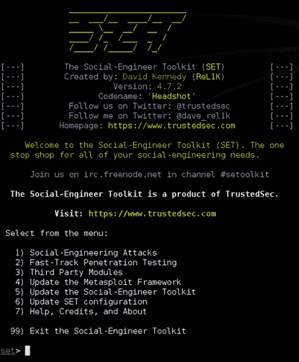
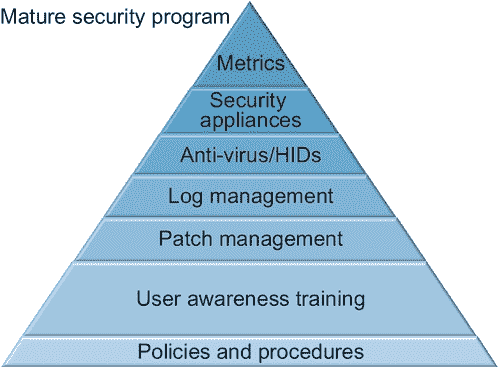

# 第一章：什么是安全意识计划？

比尔·加德纳（美国西弗吉尼亚州亨廷顿市马歇尔大学）

## 摘要

不是所有的攻击都是技术性的。现在我们在网络周围建立了技术防御，社会工程术被用于大多数最近的违规事件中。对抗社会工程术的唯一防御就是一个引人入胜的安全意识计划。安全意识计划有助于制定和执行政策，同时帮助确定组织计算机和通信服务用户行为的可接受和不可接受的界限。安全意识计划有助于限制对组织敏感和机密数据的违规风险。安全意识计划被定义为一个正式计划，旨在培训组织信息的潜在威胁，并教导如何避免可能使组织数据处于风险中的情况。

关键词

安全性

意识

政策

政策制定

政策执行

成本节约

生产增加

正式计划

## 引言

安全意识计划是一个正式计划，旨在培训组织信息的潜在威胁，并教导如何避免可能使组织数据处于风险中的情况。

安全意识计划的目标是降低组织的攻击面，使用户能够对保护组织信息承担个人责任，并执行组织为保护其数据制定的政策和程序。政策和程序可能包括但不限于计算机使用政策、互联网使用政策、远程访问政策和其他旨在管理和保护组织数据的政策。

在信息安全领域，人是最薄弱的一环。人们希望帮助。人们希望做好工作。人们希望向他们的同事、客户和供应商提供良好的客户服务。人们充满好奇心。社会工程师试图利用人类的这些特性。“社会工程被定义为欺骗人们泄露访问或机密信息的过程”[1]。对抗社会工程攻击的唯一已知防御是一个有效的安全意识计划。除非用户了解社会工程师的战术和技巧，否则他们将成为牺牲品，并将组织的数据置于风险中。

最近一项调查显示，绝大多数违规行为都利用了对人的攻击。其中一个例子是 RSA 泄露事件[2]，其中复杂的攻击者使用有针对性的钓鱼攻击窃取了 RSA SecurID 认证令牌，导致了美国国防承包商洛克希德·马丁公司的进一步被侵入[3]。另一个例子是针对谷歌和其他大型软件公司的“极光”攻击，该攻击利用了一种将用户发送到一个网站的攻击，该网站感染用户的零日漏洞利用。其结果是，大量的知识产权，包括源代码，被从包括谷歌和 Adobe 在内的公司窃取[4]。

如今，网络上的坏人不再试图通过防火墙进行入侵。坏人绕过防火墙。组织已经花费了数十亿美元开发分层防御，以抵御网络攻击者。有诸如防病毒软件、入侵检测系统、入侵预防系统和其他技术解决方案来保护信息。有了这些复杂的解决方案，攻击者现在转而采取更加有针对性的攻击，专注于诱使用户点击链接或打开附件。

戴夫·肯尼迪的社会工程师工具包在模拟网站、附件、人机接口设备（HID）和 QR 攻击等社会工程攻击方面做得非常出色，供防御者用来测试自己的环境[5]。这听起来可能很简单，但如果用户收到一封看似来自 HR 部门的附件，看起来像是组织中每个人的加薪表格，他们会做什么呢？（参见图 1.1）好奇心可能不仅会害死猫，也可能使您的数据面临风险。

图 1.1 社会工程师工具包（SET）。

虽然 SET 是一个技术工具，但其目标是利用非技术手段来利用人类，而这些人类又利用计算机，从而导致数据泄露 [6]。SET 可以轻松克隆一个网站到攻击者的机器上，然后在网站中插入攻击。在这一点上，攻击者将尝试将用户引导到克隆的网站上。这可能通过钓鱼邮件来实现，发送给用户的链接经过了伪装，或者通过购买一个看起来合法的域来托管克隆的网站。一旦用户进入克隆的网站，攻击者就可以使用多种不同的攻击向量来窃取信息或安装后门，以使攻击者能够像合法用户一样访问系统。SET 还具有对这些攻击进行编码的能力，因此它们不会被用于检测恶意软件和入侵的杀毒软件等软件检测到。通过 SET 完成的凭证窃取攻击是通过克隆 Twitter、Facebook，甚至是银行或信用卡网站的网站以及一个用户名和密码文件来实现的。当用户尝试登录网站时，SET 会窃取用户名和密码，并将用户登录到合法网站。我们将在本书的后面更详细地讨论 SET。

安全意识计划也是成熟安全计划的基石之一。政策和程序是第一个基石。下一层是安全意识计划，也称为用户意识培训。只有当这两个要素到位后，我们才会转向补丁管理、日志管理、防病毒/HIDS、安全设备，最后是指标等下一步。多年来，组织一直在向安全方面投入资金，而这些资金本应更好地用于培训他们的用户 (图 1.2)。本书的重点是逐步构建一个安全意识计划，最终目标是建立一个成熟的安全计划。

图 1.2 成熟安全计划的要素。

## 政策制定

政策制定确定了组织用户的目标、限制和期望。根据组织的大小，这些政策可以是一系列文件，涉及组织的 IT 和 HR 结构的特定部门，或者在较小的组织中，它可能是一份单一的文件，概述了使用组织电话、计算机、电子邮件和其他数字资产的人员的限制和职责。

最常见的政策是计算机使用政策。其他可在单独文件中处理的单独政策包括电子邮件使用、互联网使用、电话使用和传真使用。计算机使用，有时也称为可接受使用政策，定义了用户对计算机和电信资源的访问级别，以及他们对这些资源使用的权利和限制。可接受使用的最大目标是界定使用何时结束，滥用何时开始。例如，在大多数组织中，如果用户花费工作时间访问色情和赌博网站，将被视为滥用。如果员工在工作日过度使用电话和电子邮件服务进行个人沟通，也将被视为滥用。大多数组织都明白一些个人使用是必要的，并通过可接受使用政策来界定何为组织设备和服务的可接受使用，何为不可接受使用。

一些组织的使用政策是基于在互联网上找到的模板[7]。虽然这些模板很有用，但重要的是要记住，它们需要根据您组织的需求和任务进行定制。

组织的人力资源部门也需要参与其中。在许多情况下，政策的具体部分将受到人力资源部门的处罚。在大多数情况下，政策和程序将必须考虑到法规。那些处理健康数据的组织可能受到 HIPAA/HITECH 的覆盖。处理信用卡交易的组织可能受 PCI DSS 的覆盖。具体而言，HIPAA/HITECH 安全规则的物理标准解决了工作站使用、164.310(b)；工作站安全、164.310(c)；以及设备和媒体控制，164.310(d)(1)等问题。HIPAA/HITECH 还要求对不遵守政策的人员进行惩罚，特别是根据安全规则的行政标准，特别是授权和/或监督、工作人员清理程序和终止程序，164.308(a)(3)。

## 政策执行

没有执行力的政策是浪费时间和对组织的损害。有效安全意识计划的一个目标是通过向用户教育政策和组织的期望来执行政策。

没有强制执行的政策比任何东西都更无用。许多组织花费大量时间制定政策。很多时候，这些政策最终只是放在某人办公室的书架上。

将可接受使用和其他政策副本提供给用户是一个很好的第一步，但大多数时候，用户不会花时间阅读信息。安全意识计划应用于审查这些政策，特别是适用于组织通信和信息技术基础设施使用、滥用及其惩罚的政策。

本书的目标是阐明如何从获得管理层支持到使用有效的指标衡量程序构建有效的安全意识计划。它也适用于从管理层到数字一线的 IT 经理，他们对启动安全意识计划感兴趣。虽然本书将涵盖很多内容，但最终目标是让您能够开发出一个引人入胜的安全意识计划，帮助您的组织在面对在线威胁时管理风险。

## 成本节约

数据泄露会造成金钱损失。如果您是受到《HIPAA/HITECH》或《PCI DSS》等法规覆盖的组织，数据泄露可能会导致数百万美元的罚款，具体数额取决于泄露的规模。此外，许多州现在都有泄露通知法，要求失去数据的组织通知受影响的人失去了什么，并在某些情况下为受影响者提供信用保护。波尼蒙研究所和赛门铁克在 2013 年 6 月发布的一份报告发现，2012 年的泄露全球平均每个记录造成了 136 美元的损失[8]。

2012 年 5 月，美国卫生与人类服务部民权办公室对爱达荷州立大学因健康数据泄露而罚款 40 万美元[9]。2012 年 6 月，阿拉斯加州卫生与人类服务部（DHHS）同意支付 170 万美元，以解决可能违反《HIPAA/HITECH》法规的问题[10]。

支付卡行业已经针对数据泄露设立了高达每起事件 50 万美元的罚款[11]。2010 年，位于田纳西州纳什维尔的体育用品公司 Genesco 因未遵守 PCI DSS 法规而被罚款超过 1300 万美元，公司发现自己被黑客入侵，监管机构发现公司不合规[12]。

## 产量增加

较少的恶意软件和计算机问题可能会导致较少的停产时间和组织产量的增加。IT 和安全团队实际上可以花时间积极主动地推动组织的使命，而不是对病毒和其他恶意软件感染做出反应，并调查可能的实际数据泄露[13]。

一些感染和泄露可能导致数天甚至可能数周的停产时间。这些中断会导致组织利润减少，并在某些情况下使组织面临民事诉讼、可能的监管行动以及可能失去客户和业务伙伴的风险。

一些数据泄露并不是外部行为者造成的，而是员工的错误，比如关闭防火墙[14]或者没有正确配置网站以不向公众显示机密数据[15]。没有正确完成工作所需的知识，员工们会继续犯错误。

安全意识计划的最终目标是管理组织的风险。大多数组织都有安全计划来确保员工在工作中安全。安全意识计划的目标应该是确保组织的数据安全。

## 管理支持

建立安全意识计划的第一步，也是最重要的一步，是获得组织管理结构的批准和支持。如果没有管理支持，政策将不会得到制定，政策将不会得到执行，管理层和员工将反抗任何对他们在保护组织信息方面施加的结构、规则或限制。即使面对像 HIPAA/HITECH 和 PCI DSS 这样的法规，如果没有组织管理层的支持，安全意识计划也将失败。

管理支持始于向管理层展示风险，然后说明安全意识计划如何帮助他们管理这种风险。第二步是向管理层展示这样一个计划如何支持组织的业务目标，包括政策制定、政策执行、成本节约和生产增加。

展示风险包括针对组织行业的案例研究。例如，如果您的组织是一家律师事务所，使用案例研究和律师事务所因用户错误而遭受侵犯的案例和例子。同时，说明攻击者的狡猾也很重要。大多数人在考虑安全问题时会想到日常的非定向病毒感染，而最危险的攻击者是技术先进的黑客，他们试图窃取知识产权、财务信息和商业机密。

管理层并不总是愿意接受变化，特别是当他们认为这些变化会妨碍组织的业务目标时。用非技术术语与管理层进行适当沟通是获得管理支持的关键。当自上而下的管理层了解安全意识计划的目的和目标，并且这样一个计划符合组织的业务目标，主要是赚钱时，他们将更愿意实施安全意识计划。

在本书的其余部分，我们将继续从零开始以很少或没有资金的方式查看安全意识计划的具体步骤。常识性方法是应对大量现代信息威胁的最佳途径。虽然一些组织提供付费的、通常是现成的安全意识计划，但本书的重点是赋予理由在他们自己的组织内建立自己的计划，无论这些组织是小型、中型还是大型企业或公司，或者是非营利组织，甚至是学校。大部分信息也可供家庭用户使用，以更好地管理他们在面对在线威胁时的风险，但家庭用户不在本书的范围之内。

## 注意

[1] 社会工程框架。[`www.social-engineer.org/framework/Social_Engineering_Defined`](http://www.social-engineer.org/framework/Social_Engineering_Defined) [于 13 年 6 月 2 日访问]。

[2] 《Digital Dao》：全球网络空间中不断演变的敌意。[`jeffreycarr.blogspot.com/2011/06/18-days-from-0day-to-8k-rsa-attack.html`](http://jeffreycarr.blogspot.com/2011/06/18-days-from-0day-to-8k-rsa-attack.html) [于 13 年 6 月 3 日访问]。

[3] 《InformationWeek 安全》：RSA 遭受攻击八个月后。[`www.informationweek.com/security/attacks/rsa-breach-eight-months-later/231903048`](http://www.informationweek.com/security/attacks/rsa-breach-eight-months-later/231903048) [于 13 年 6 月 3 日访问]。

[4] 《Wired》：谷歌黑客攻击极为复杂，新细节揭示。[`www.wired.com/threatlevel/2010/01/operation-aurora/`](http://www.wired.com/threatlevel/2010/01/operation-aurora/) [于 13 年 6 月 3 日访问]。

[5] TrustedSec：社会工程师工具包。[`www.trustedsec.com/downloads/social-engineer-toolkit/`](https://www.trustedsec.com/downloads/social-engineer-toolkit/) [于 13 年 6 月 4 日访问]。

[6] 社会工程框架：基于计算机的社会工程工具：社会工程师工具包（SET）。[`www.social-engineer.org/framework/Computer_Based_Social_Engineering_Tools:_Social_Engineer_Toolkit_(SET)`](http://www.social-engineer.org/framework/Computer_Based_Social_Engineering_Tools:_Social_Engineer_Toolkit_(SET)) [于 13 年 6 月 4 日访问]。

[7] SANS：信息安全政策模板。[`www.sans.org/security-resources/policies/`](http://www.sans.org/security-resources/policies/) [于 13 年 6 月 4 日访问]。

[8] Ponemon 和 Symantec 发现大多数数据泄露是由人为和系统错误造成的。[`www.symantec.com/about/news/release/article.jsp?prid=20130605_01&om_ext_cid=biz_socmed_twitter_facebook_marketwire_linkedin_2013Jun_worldwide_CostofaDataBreach`](http://www.symantec.com/about/news/release/article.jsp?prid=20130605_01&om_ext_cid=biz_socmed_twitter_facebook_marketwire_linkedin_2013Jun_worldwide_CostofaDataBreach) [于 13 年 6 月 5 日访问]。

[9] HHS 因健康数据泄露罚款爱达荷州立大学 40 万美元。[`healthitsecurity.com/2013/05/22/hhs-fines-idaho-state-university-400k-for-data-breach/`](http://healthitsecurity.com/2013/05/22/hhs-fines-idaho-state-university-400k-for-data-breach/) [于 13 年 6 月 6 日访问]。

[10] 阿拉斯加州卫生和社会服务部因违反 HIPAA 安全案例达成 170 万美元的和解。[`www.hhs.gov/ocr/privacy/hipaa/enforcement/examples/alaska-agreement.html`](http://www.hhs.gov/ocr/privacy/hipaa/enforcement/examples/alaska-agreement.html) [于 13 年 6 月 6 日访问]。

[11] PCI-DSS：安全—处罚。[`financial.ucsc.edu/Pages/Security_Penalties.aspx`](https://financial.ucsc.edu/Pages/Security_Penalties.aspx) [于 13 年 6 月 6 日访问]。

[12] 遭受违规罚款后，零售商起诉 Visa。[`www.scmagazine.com/retailer-fights-pci-fines-for-noncompliance-after-breach-sues-visa/article/284088/`](http://www.scmagazine.com/retailer-fights-pci-fines-for-noncompliance-after-breach-sues-visa/article/284088/) [于 06.06.13 访问]。

[13] 数据泄露的最高风险是停机时间。[`www.informationweek.com/security/management/downtime-rated-top-risk-of-data-breaches/228201056`](http://www.informationweek.com/security/management/downtime-rated-top-risk-of-data-breaches/228201056) [于 07.06.13 访问]。

[14] HHS 对爱达荷州立大学进行 $400 K 的医疗数据泄露罚款。[`healthitsecurity.com/2013/05/22/hhs-fines-idaho-state-university-400k-for-data-breach/`](http://healthitsecurity.com/2013/05/22/hhs-fines-idaho-state-university-400k-for-data-breach/) [于 07.06.13 访问]。

[15] 布鲁克黑文数据泄露“是文员错误”，官员称。[`www.newsday.com/long-island/towns/brookhaven-data-breach-was-clerical-error-officials-say-1.5426405`](http://www.newsday.com/long-island/towns/brookhaven-data-breach-was-clerical-error-officials-say-1.5426405) [于 07.06.13 访问]。
