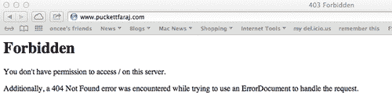

第四章

# 大多数攻击都是有针对性的

Bill Gardner    ^(美国西弗吉尼亚州亨廷顿市马歇尔大学)

## 摘要

在过去的几年里，一些行业成为了针对性攻击的目标，试图从大型跨国公司、非营利组织和政府中窃取知识产权。这些攻击有些是针对从大型国防公司到小型律师事务所的一切。这些针对性攻击通常利用鱼叉式网络钓鱼进行初始入侵。攻击者然后利用在初始攻击中获得的立足点进一步渗透组织，窃取特权、机密数据和知识产权。攻击者的资金和人员配备比被攻击的组织更好，并且通过使用鱼叉式网络钓鱼和其他社会工程攻击来绕过传统的网络防御，如防火墙和防病毒软件。针对鱼叉式网络钓鱼和其他社会工程攻击的最佳防御是安全意识培训项目。

关键词

针对性攻击

社会工程

匿名

Shady RAT

极光

夜龙

## 针对性攻击

大多数攻击都是有针对性的。它们通过应用程序、端口、平台、职业或行业进行针对。在构建信息安全意识培训项目时，包括特定于你组织的信息和示例是很重要的。如果你的组织是一家律师事务所，指出坏人是如何针对律师事务所和律师的。如果你的组织是一个非营利组织，举例说明坏人过去是如何针对非营利组织的。这些例子在打破“没有人想要我们的东西”的神话方面起到了很大的作用。

攻击者通过定位用户使用的日常工作和娱乐应用程序和服务来定位用户，比如社交网络。攻击者定位用户的一种方式是通过电子邮件。鱼叉式网络钓鱼攻击采取了针对特定用户或一组用户的电子邮件形式，诱使用户点击电子邮件中包含的链接或打开随电子邮件发送的附件。精准网络钓鱼电子邮件的制作第一步是攻击者使用你组织的网站、社交媒体网站以及在线公共网站和目录中的其他开源信息来研究他们的目标。一旦攻击者弄清楚被定位用户的兴趣是什么，他们就会利用这些兴趣来构建针对性的电子邮件。

例如，如果一个被定位的用户，此时我们假设是组织的首席执行官，说他们对集邮感兴趣，攻击者将向被定位的用户发送一封关于集邮的网络钓鱼电子邮件，其中包含一个链接或附件，允许攻击者控制被定位用户的计算机。一旦首席执行官的计算机被利用了这种方法，攻击者将把注意力转向将攻击转向渗透和利用网络的其他部分以及窃取数据。

## 最近的有针对性的攻击

攻击者最近开始瞄准与国防和政府承包相关的行业。 2011 年，为美国政府和美国政府承包商提供两因素身份验证令牌的 RSA 发现了传输和存储令牌的数据库遭到入侵。在同一时期，国防承包商雷神公司、通用动力公司和 L-3 通讯公司也报告了入侵事件。行业内的一些人将 RSA 的入侵事件与其他入侵事件联系起来[1]。虽然一些人继续争论这些入侵是否以某种方式相互关联，但它们都是定向攻击的例子。国防承包商持有从最新战斗机/轰炸机设计到核研究的宝贵信息。他们绝对持有对黑客、间谍和其他政府有价值的数据。

## 针对律师事务所的定向攻击

2009 年，FBI 警告律师事务所和公关公司它们成为网络钓鱼攻击的目标。网络钓鱼邮件包含“zip”、“jpeg”或其他看起来安全的附件，当打开时尝试从域名[`d.ueopen.com`](http://d.ueopen.com)下载和执行文件“srhost.exe”。FBI 网络司法部门的部门负责人布拉德福德·布莱尔告诉美联社：“律师事务所拥有大量真正关键的私人信息。”侵入这些计算机系统“是获得经济、个人和个人安全相关信息的一种非常理想的方式”[2]。

2010 年 9 月开始，中国的黑客侵入了加拿大的律师事务所，以阻止对澳大利亚钾肥矿业公司价值 400 亿美元的收购：

…黑客依次侵入了一个又一个安全的计算机网络，最终击中了七家不同的律师事务所，以及加拿大的财政部和财政部，据多伦多数字智慧总裁丹尼尔·托博克称。他的网络安全公司受雇于律师事务所协助调查。

调查将入侵事件与中国试图挫败彭博彭博顿股份有限公司被 BHP Billiton 有限公司收购的努力联系在一起，这是全球自然资源竞争的一部分，托博克说。他说，这样偷来的数据可能价值数千万美元，并使持有该数据的一方在交易谈判中占有不公平的优势。

尽管最终由于无关原因而破裂，但此事件说明了律师事务所的脆弱性。随着这种攻击不断升级，如果他们不能展示改进的安全性，他们将面临客户业务的丧失[3]。

通常，律师事务所的安全性低于其他高调目标，如银行和其他金融机构。虽然许多律师意识到他们在网络上拥有敏感和机密信息，但从历史上看，律师事务所并没有花时间和金钱来加强他们的安全性，以防止攻击者针对他们的网络。

根据安全公司 Mandiant 的说法，2012 年有 80 家总部位于美国的律师事务所遭到了入侵。FBI 表示，随着金融公司在信息安全方面变得更加重视，律师事务所成为了更大的目标。2011 年秋季，FBI 在纽约市与 200 家顶级律师事务所会面，就威胁问题和不断增加的律师事务所入侵进行了交流。该机构警告说，“黑客认为律师是其公司客户宝贵数据的后门。”

玛丽·加利根（Mary Galligan）是 FBI 纽约市办事处网络部门的负责人，当时她说：“每个人都想要网络管理员权限……这很时尚。”她说，合伙人坚持要移动性，包括在周末度假屋或在路上查看案件文件的灵活性，这意味着高度敏感的文件经常通过电子邮件传输[4]。

2010 年 1 月，FBI 的互联网犯罪投诉中心（IC3）发出了一份警告，称针对美国律师事务所的伪造支票方案值得警惕：

FBI 继续收到针对美国律师事务所的伪造支票方案的报告。与先前报道的一样，骗子向律师发送电子邮件，声称自己在海外，并寻求法律代理以从美国的第三方那里收取拖欠款项。律师事务所收到保证金协议书、反映所欠金额的发票以及一张支付给律师事务所的支票。公司被指示提取保证金费用，包括与交易相关的任何其他费用，并将剩余资金汇至韩国、中国、爱尔兰或加拿大的银行。当支票被确定为伪造时，资金已经被汇往海外。

在一个新的变化中，寻求法律代理的欺诈客户是一个在亚洲国家“执行任务”的前妻，她声称正在追讨她在美国前夫那里的离婚协议款项。律师事务所同意代表前妻，向前夫发送电子邮件，并通过交付服务收到了结算款的“认证”支票。前妻指示该公司将资金减去保证金费用后汇至海外银行账户。当欺诈成功执行时，律师事务所在发现支票是伪造的之前就已经汇出了资金。

所有互联网用户在收到未经请求的电子邮件时都需要保持警惕。建议律师事务所在与完全通过电子邮件处理业务的各方进行交易之前尽可能进行尽职调查，尤其是那些声称居住在海外的各方[5]。

2012 年 2 月，匿名组织攻击了帕克特与法拉吉律师事务所。这家总部位于华盛顿特区的律师事务所成为了黑客集团的目标，因为他们为 2005 年 11 月在哈迪斯杀害 24 名手无寸铁的伊拉克平民的美国海军陆战队员辩护。美国海军陆战队员的审判以无罪释放结束。匿名组织谴责这一裁决不公正，于是对该公司的网站和内部网络发动了攻击，导致该公司网站遭到篡改，电子邮件被盗取了 2.6 GB。该公司的电子邮件后来被发布在 Pastebin 和海盗湾上[6]。

尤其令人尴尬的是，该公司直到被网站《Gawker》联系后才意识到自己已经遭受到了入侵，“我们无法立即联系到帕克特进行评论；我们几分钟前打电话给他时，他正在开会，接待员根本不知道公司已经被黑客攻击了”[7]。截至目前，该公司的网站在遭受攻击近两年后仍然处于离线状态[8]。

毫无疑问，律师和律师事务所成为了攻击目标（图 4.1）。为了自卫，他们的一部分工作是确保律师和员工知道他们面临的威胁的严重性和类型，包括针对他们数据的社交工程攻击，以降低其数据受到的风险。

图 4.1 帕克特与法拉吉网站。

## 影子老鼠行动

“影子老鼠行动”是有史以来最大的有针对性的攻击之一，目标包括政府、国防承包商、保险公司、国际非营利组织、会计公司、媒体机构和专门从事高技术产品和智库的企业。根据揭露这一行动的麦克菲公司，这些入侵事件追溯到 2006 年中旬。RAT 代表“远程访问工具”：

麦克菲公司不愿透露谁是这次行动的幕后黑手，但却表示这些攻击是由一个“国家行动者”组织的。大多数专家认为黑客的支持者是中国。据路透社报道，国际奥委会和世界反兴奋剂机构是遭受入侵的非营利组织之一。

NPQ 查看了麦克菲公司的报告，该报告似乎表明，在受到黑客攻击的受害者中包括五个“国际体育”组织、两个智库、一个“政治非营利组织”和一个“美国国家安全非营利组织”。其中 49 家被黑客攻击的实体位于美国。这些并不都是快速的“砸砸抢”行动。尽管其中一些入侵只持续了一个月，但在另一个未公开具体名称的（亚洲）奥林匹克委员会，黑客在过去 28 个月里一直出没。

麦克菲公司的威胁研究副总裁兼麦克菲报告的作者德米特里·阿尔佩罗维奇写道，公司对受害组织的多样性感到“惊讶”，同时也对加宽者的大胆行为感到“震惊”[9]。

麦克菲报告还提到了其他的有针对性的攻击：

经过调查诸如极光行动和夜龙（西方石油和天然气行业的系统性长期侵入），以及许多其他尚未公开披露的入侵，我确信每个拥有相当规模和有价值的知识产权和商业机密的可能产业中的每家公司都已经遭受了（或将很快遭受）侵入，其中绝大多数受害者很少发现入侵或其影响。事实上，我将整个《财富》全球 2000 强公司划分为两类：那些知道自己受到了侵犯的，以及那些尚不知道的[10]。

McAfee 拒绝公开标识受害者，并表示许多受害者在面对 McAfee 报告中的证据时拒绝相信自己已经被侵入[10]。

## 极光行动

2009 年，Google、Adobe 以及其他一些备受关注的公司成为了一个被称为“极光行动”的攻击目标。这次攻击源自中国，针对目标公司的知识产权，包括控制主要系统的源代码，例如 Google 的 Gmail 服务。攻击者随后利用通过侵入获得的信息来访问人权活动人士的 Gmail 账户。“在国防工业之外，我们从未见过商业工业公司受到如此高级别的攻击，”McAfee 的威胁研究副总裁德米特里·阿尔佩罗维奇说。“这完全改变了威胁模式”[11]。

## 夜龙

归因于中国的夜龙攻击针对能源公司。这些攻击发生在四年的时间里，针对知识产权[12]。2011 年由 McAfee 揭露的还有：

从 2009 年 11 月开始，针对全球石油、能源和石化公司进行了协调的秘密和有针对性的网络攻击。这些攻击涉及社会工程、针对性钓鱼攻击、利用 Microsoft Windows 操作系统漏洞、Microsoft Active Directory 受损以及使用远程管理工具（RATs）来针对和收集有关油气田招标和运营的敏感竞争性专有操作和项目融资信息。我们已经确认这些持续攻击中使用的工具、技术和网络活动——我们将其命名为夜龙——主要起源于中国[13]。

## 水坑攻击

RSA 高级威胁情报团队于 2012 年首次定义了水坑攻击。

根据 RSA，水坑攻击有三个阶段：

在我们所发现的新攻击中，我们称之为“VOHO”的攻击方法依赖于对特定地理区域的合法网站进行木马植入，攻击者相信这些网站会被他们希望渗透的组织的终端用户访问。这导致企业网络内的多个主机全面受损，因为终端用户继续日常业务，就像狮子在水坑里埋伏等待猎物一样。

攻击的详细信息仍在发展中，但我们目前所了解的情况如下：

1. 受害者访问了一个被入侵的“水坑”网站。

2. 该网站通过注入的 JavaScript 元素，将访问的浏览器重定向到一个利用站点。

3. 该利用站点检查访问机器是否运行 Windows 操作系统和 Internet Explorer 版本，然后利用访问主机上的 Java 客户端，安装“gh0st RAT” 变种[14]。

最近的一个水坑攻击的例子是利用一个被入侵的网站，其中包含一个中餐馆的菜单，向针对的石油公司提供攻击。攻击的结果是攻击者能够规避公司付费实施的许多复杂的防御措施和产品。

“无法攻破一家大型石油公司的计算机网络，黑客们通过恶意软件感染了一家深受员工欢迎的中餐馆的在线菜单。当工人们浏览菜单时，他们不经意间下载了代码，使攻击者在企业广阔的计算机网络中立足。”[15]。

尽管水坑攻击不像钓鱼攻击那样流行，但在过去几年里数量逐渐增加，因为用户在发现钓鱼攻击方面越来越娴熟。水坑攻击可能永远不会超越鱼叉式网络钓鱼攻击，因为它们需要入侵目标定期使用的网站，这增加了执行攻击的复杂性。钓鱼活动的执行要简单得多。

## 常见攻击向量：常见结果

Operation Aurora、Operating Shady RAT 和针对 RSA 和国防承包商的有针对性攻击中的常见攻击向量都使用高度针对性的鱼叉式网络钓鱼，感染组织以前未知的恶意软件，然后从每个组织中泄漏机密信息和知识产权。另一个共同点是，这些组织花费了数百万甚至数千万美元购买了防病毒软件、入侵检测系统、指令预防系统和其他信息安全防御措施，但它们都被组织内的某人绕过了，只需简单地打开电子邮件中包含的链接或附件，就导致了整个企业网络的受损。

所有组织，无论大小，都包含攻击者感兴趣的信息，攻击者将使用任何可能的手段来获取这些信息。较小的侵犯行为没有报告，因为组织不知道它们已经被侵犯，或者他们不愿意承认他们已经丢失了数据给业务伙伴和客户。国家违规通知法的目标是解决未报告问题的一部分。你的组织可能很小或中等规模，但这并不意味着你没有有价值的信息。事实上，像大多数组织一样，很可能你的安全计划预算不足，人手不足，而攻击者则得到了充分资助，并由高度训练有素的员工全力支持。你被定为目标。实施安全意识计划是你最好的防御手段，抵御这些资金充足、意志坚定的攻击者。

## 注释

[1] [DarkReading.com](http://DarkReading.com)：美国国防承包商的定向攻击：RSA 漏洞的后果？[`www.darkreading.com/attacks-breaches/targeted-attacks-on-us-defense-contracto/229700229`](http://www.darkreading.com/attacks-breaches/targeted-attacks-on-us-defense-contracto/229700229) [于 13 年 7 月 27 日访问]。

[2] [Law.com](http://Law.com)：黑客针对法律公司，FBI 警告。[`legalblogwatch.typepad.com/legal_blog_watch/2009/11/hackers-targeting-law-firms-fbi-warns.html`](http://legalblogwatch.typepad.com/legal_blog_watch/2009/11/hackers-targeting-law-firms-fbi-warns.html) [于 13 年 7 月 27 日访问]。

[3] 彭博社：中国黑客以获取机密交易数据为目标攻击律师事务所。[`www.bloomberg.com/news/2012-01-31/china-based-hackers-target-law-firms.html`](http://www.bloomberg.com/news/2012-01-31/china-based-hackers-target-law-firms.html) [于 13 年 7 月 29 日访问]。

[4] 彭博社：中国黑客以获取机密交易数据为目标攻击律师事务所。[`www.bloomberg.com/news/2012-01-31/china-based-hackers-target-law-firms.html`](http://www.bloomberg.com/news/2012-01-31/china-based-hackers-target-law-firms.html) [于 13 年 7 月 29 日访问]。

[5] 互联网犯罪和投诉中心：针对美国律师事务所的伪造支票计划的新变种。[`www.ic3.gov/media/2010/100121.aspx`](http://www.ic3.gov/media/2010/100121.aspx) [于 13 年 7 月 29 日访问]。

[6] NMissCommentor：匿名人士针对代表 Hadditha 大屠杀的士兵的国防法律公司。[`nmisscommentor.com/law/anonymous-targets-defense-law-firm-representing-srgt-who-led-hadditha-massacre/`](http://nmisscommentor.com/law/anonymous-targets-defense-law-firm-representing-srgt-who-led-hadditha-massacre/) [于 13 年 7 月 30 日访问]。

[7] [Gawker.com](http://Gawker.com)：匿名人士泄露了涉及伊拉克战争罪行案件的大量电子邮件。[`gawker.com/5882063/anonymous-releases-huge-cache-of-emails-related-to-iraq-war-crimes-case`](http://gawker.com/5882063/anonymous-releases-huge-cache-of-emails-related-to-iraq-war-crimes-case) [于 13 年 7 月 30 日访问]。

[8] [`www.puckettfaraj.com/`](http://www.puckettfaraj.com/) [访问日期：13.07.30]。

[9] NonProfit Quarterly：非营利组织成为全球最大黑客攻击活动的目标。[`www.nonprofitquarterly.org/index.php?option=com_content&view=article&id=14686:nonprofits-targeted-in-the-worlds-biggest-hacking-campaign&catid=155:nonprofit-newswire&Itemid=986`](http://www.nonprofitquarterly.org/index.php?option=com_content&view=article&id=14686:nonprofits-targeted-in-the-worlds-biggest-hacking-campaign&catid=155:nonprofit-newswire&Itemid=986) [访问日期：13.08.03]。

[10] McAfee：揭示：Shady RAT 行动。[`www.mcafee.com/us/resources/white-papers/wp-operation-shady-rat.pdf`](http://www.mcafee.com/us/resources/white-papers/wp-operation-shady-rat.pdf) [访问日期：13.08.04]。

[11] Wired：威胁级别：谷歌黑客攻击非常复杂，新细节显示。[`www.wired.com/threatlevel/2010/01/operation-aurora/`](http://www.wired.com/threatlevel/2010/01/operation-aurora/) [访问日期：13.08.04]。

[12] NetworkWorld：中国“夜龙”攻击能源公司。[`www.networkworld.com/news/2011/021011-night-dragon-attacks-from-china.html`](http://www.networkworld.com/news/2011/021011-night-dragon-attacks-from-china.html) [访问日期：13.08.04]。

[13] McAfee：全球能源网络攻击：“夜龙”。[`www.mcafee.com/us/resources/white-papers/wp-global-energy-cyberattacks-night-dragon.pdf`](http://www.mcafee.com/us/resources/white-papers/wp-global-energy-cyberattacks-night-dragon.pdf) [访问日期：13.08.04]。

[14] McAfee：水坑中的狮子 - “VOHO”事件。[`blogs.rsa.com/lions-at-the-watering-hole-the-voho-affair/`](http://blogs.rsa.com/lions-at-the-watering-hole-the-voho-affair/) [访问日期：14.09.04]。

[15] 黑客潜伏在通风口和饮料机中。[`www.nytimes.com/2014/04/08/technology/the-spy-in-the-soda-machine.html?_r=0`](http://www.nytimes.com/2014/04/08/technology/the-spy-in-the-soda-machine.html?_r=0) [访问日期：14.09.04]。
