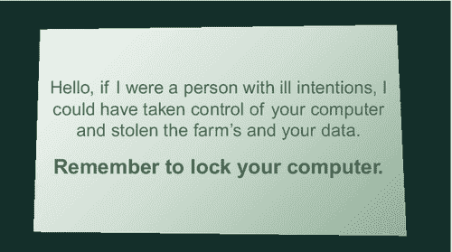

第六章

# 为什么当前的课程不起作用

比尔·加德纳（美国西弗吉尼亚州亨廷顿市马歇尔大学）

## 摘要

作为教学工具的讲座已经过时。当前的课程不起作用，因为我们依赖于旧的教学模式。人们以不同的方式学习。有些人是视觉学习者，而其他人更喜欢阅读或讨论来学习。我们需要摆脱预先录制的网络培训，转向互动、动手学习，以建立更有效的安全意识计划。

关键词

视觉

音频

动手

培训

学习

内容传递

同侪教学

## 讲座作为教学工具已经过时

除了可能是讲课的人之外，没有人喜欢听讲座。对于讲课者来说，讲课是一种积极的锻炼。对于听讲座的人来说，讲座是一种被动的锻炼。研究表明，传达信息时，被动学习不如积极学习有效。事实上，许多高等教育工作者表示，几个世纪以来��讲座这种教学技术已经过时[1]。

研究表明，我们应该采取过去几年大学一直在朝着的方向：用积极学习取代被动学习。积极学习，取决于如何实施，已经被称为“同侪教学”或“互动学习”。这些技术使学生对自己的学习负责，并促进与其他学生互动，以与要学习的材料互动[2]。

“同侪教学”和“互动学习”采取了给学生阅读作业或观看视频的形式，然后将学生分成小组与材料互动。这些互动包括写作业、小组讨论、团队完成指定任务，有时还有小组评分[3]。有时，学生们会根据流行的游戏节目格式进行问答游戏，以吸引他们对材料的兴趣。分数可以用糖果或用于小组评分[4]。

我们知道我们现在所做的事情并不奏效，因为我们几乎每天都看到利用人类来获取数据访问权限的违规行为的例子。用户也表现出信息疲劳的迹象。大多数用户认为他们永远不会被诱使点击链接或打开附件，因为他们认为自己是精明的互联网用户。

BT 首席安全技术官布鲁斯·施奈尔（Bruce Schneier）在 2013 年 3 月为网站[Darkreading.com](http://Darkreading.com)撰写了一篇观点文章，称在用户意识培训上花费的钱最好用于改进系统设计[5]。这篇文章在信息安全圈引起了轩然大波。有些人同意他的观点，但大多数人不同意[6,7]。每个人都同意我们必须采取行动，即使施奈尔也说：“安全是一个过程，而不是一个产品”[8]。如果我们从不告知最终用户存在的威胁，他们将永远不会知道。

安全意识与其他意识运动有很多共同之处。其他意识运动使用了像“烟熊”和“犯罪狗”这样令人难忘的代言人。他们还有像“只有你才能防止森林火灾”和“为犯罪咬一口”这样的难忘口号。在信息安全意识领域，我们未能达到这两个简单目标，因为我们继续就安全意识计划的有效性进行辩论。

正如 Bruce Schneier 所说，“安全是一个过程，而不是一个产品”[8]。安全的过程是一条漫长而艰难的道路，从获得管理层的支持开始，起草并执行给用户对组织技术资源的使用期望的政策，建立有效的安全意识计划，然后使用有意义的指标来衡量该计划的有效性。

一旦收集并处理了指标，循环就会重新开始，审核政策、意识计划和指标，并根据组织的需求进行更改。

做点什么总比什么都不做好。这本书的主要目的是给人们提供工具，让他们做点什么而不是什么都不做。虽然确保你的组织拥有最新的安全产品，而且你的 IT 人员接受了适当的安全培训是有价值的，但是如果你忽视了人的因素，这就是浪费时间和金钱。下一代防火墙、防病毒软件、入侵检测系统、入侵防御系统和 Web 应用程序防火墙都是很好的产品，但这些产品无法防范员工对点击链接、打开附件等社会工程师使用的非技术攻击做出糟糕决定。

人们根据世代和教育背景有不同的学习风格。当前进入职场的这一代人学习方式与三十年前进入职场的人有很大不同。有些人通过阅读学得更好，其他人是视觉学习者，还有些人最喜欢通过听觉学习。

七种学习风格

■ 视觉（空间）：你更喜欢使用图片、图像和空间理解。

■ 听觉（听觉-音乐）：你更喜欢使用声音和音乐。

■ 语言（语言）：你更喜欢使用言语，无论是口语还是书面语。

■ 身体（运动）：你更喜欢使用身体、手和触觉。

■ 逻辑（数学）：你更喜欢使用逻辑、推理和系统。

■ 社交（人际关系）：你更喜欢在团体或与其他人一起学习。

■ 孤独（个人内省）：你更喜欢独自工作并进行自我学习。

为什么要了解学习风格？了解学习风格的基础

你的学习风格比你意识到的更有影响力。你偏爱的风格指导了你学习的方式。它们还会改变你内部表达经验的方式，你回忆信息的方式，甚至你选择的词语。我们在本章中更多地探讨了这些特征。

研究向我们展示每种学习风格使用不同的大脑部分。通过在学习过程中涉及更多的大脑，我们记住了更多我们学到的东西。利用大脑成像技术的研究人员已经能够找出每种学习风格所负责的大脑关键区域。

例如：

■ 视觉：位于大脑后部的枕叶管理视觉感知。枕叶和顶叶都管理空间定位。

■ 听觉：颞叶处理听觉内容。右颞叶对音乐尤为重要。

■ 口语：颞叶和额叶，特别是两个被称为布罗卡区和沃尼克区的专门区域（位于这两个叶叶的左半球）。

■ 身体：小脑和运动皮层（位于额叶后面）管理我们的大部分身体运动。

■ 逻辑：特别是左侧的顶叶驱动我们的逻辑思维。

■ 社交：额叶和颞叶管理我们的大部分社交活动。边缘系统（除了海马体之外没有显示）也影响社交和孤独两种风格。边缘系统与情绪、心情和攻击性有很大关系。

■ 孤独：额叶、顶叶以及边缘系统也是这种风格的活跃部分[9]。

最佳策略是针对不同学习风格进行教学，以确定对你的组织最有效的方法。研究表明，动手学习比其他类型的学习更易记住[10,11]。动手学习是积极学习。传统的安全意识项目由幻灯片展示、讲座和视频组成。如果幻灯片展示、讲座和视频是由人员亲自进行而不是通过网站传递，那么这是迈向更积极学习的一步，因为它为培训师和参与者提供了互动的机会。

“积极学习”被定义为“…通过谈话、写作、阅读、反思或质疑——换句话说，通过积极参与，参与课堂教学的一种方法。”积极学习摒弃了简单地向员工讲授安全最佳实践的老方法。该方法通过谈话、阅读、写作、反思和质疑的练习将安全意识项目提升到了一个新的水平[12]。

例如，与其告诉用户什么是一个好的密码策略，不如问问他们能否解释密码的最佳实践，并讨论什么构成了一个好的密码。另一个例子是让培训者讨论他们过去遇到过的恶意软件类型，以及他们认为是如何进入他们的计算机的，以及他们认为攻击者的目的是什么。这将有助于向用户说明恶意软件不仅仅是减慢计算机速度的不便，而是在线罪犯企图从他们的计算机上窃取数据，使用他们的计算机作为僵尸网络的一部分，使用他们的计算机隐藏儿童色情和其他违禁品，或使用他们的计算机在组织网络上进一步发动攻击并窃取更多数据的企图。这两个例子都涉及讨论，但如果你让他们写下他们的答案然后讨论它们，这两个例子都可以成为一个好的写作和讨论练习。另一个练习是让培训者阅读一项或多项组织的安全政策，然后反思为什么该政策存在以及为什么组织需要这样的政策。

正如你所见，当员工开始或每年进行安全意识日时，这可能需要超过几分钟的时间或一小时的时间。积极学习的练习将需要组织实施持续学习的范式（参见图 6.1）。一个个人的例子是，当人们没有锁定计算机屏幕时，我在他们的桌子上留下了提醒卡。

图 6.1 屏幕锁定提醒卡。

尽管用户觉得提醒很烦人，但随着时间推移，我们发现人们对政策变得更加遵守。如果组织在安全意识计划中投入更多的时间、金钱和价值，安全意识计划将会变得更加有效。一年一次是不够的。只需快速查看由于社会工程攻击而持续发生的违规行为的新闻或快速查看[`www.ponemon.org/`](http://www.ponemon.org/)上数据泄露持续造成的费用就足以说明，尽管安全意识计划正在变得更好，但我们做得还不够。组织每年在安全产品上花费数百万美元来保护他们的网络边缘。组织还需要开始为安全意识计划投入时间和金钱，以保护自己、他们的业务伙伴和他们的客户免受社会工程攻击。

建立安全意识计划是一个过程。人们可以做的最重要的事情是以终为始开始这个过程。没有组织会完全安全，也没有安全意识计划会完全保护您免受违规行为。违规行为仍然会发生，但通过正确的努力，您可以使您的组织更加安全，希望更不容易受到来自社会工程的违规行为的影响。

## 注：

[1] 讲座已死？ [`www.theatlantic.com/health/archive/2013/01/is-the-lecture-dead/272578/`](http://www.theatlantic.com/health/archive/2013/01/is-the-lecture-dead/272578/) [2013 年 10 月 24 日访问].

[2] 讲座的黄昏。[`harvardmagazine.com/2012/03/twilight-of-the-lecture`](http://harvardmagazine.com/2012/03/twilight-of-the-lecture) [2013 年 10 月 24 日访问].

[3] 物理套件：点对点指导问题。[`www.physics.umd.edu/perg/role/PIProbs/`](http://www.physics.umd.edu/perg/role/PIProbs/) [2013 年 10 月 24 日访问].

[4] 如何通过游戏激发点对点学习 [`www.quora.com/Michelle-Jaramilla/Posts/How-to-Ignite-Peer-to-Peer-Learning-with-GamesHow-to-Ignite-Peer-to-Peer-Learning-with-Games`](http://www.quora.com/Michelle-Jaramilla/Posts/How-to-Ignite-Peer-to-Peer-Learning-with-GamesHow-to-Ignite-Peer-to-Peer-Learning-with-Games) [2013 年 10 月 24 日访问].

[5] 关于安全意识培训 [`www.darkreading.com/hacked-off/on-security-awareness-training/240151108`](http://www.darkreading.com/hacked-off/on-security-awareness-training/240151108) [2013 年 11 月 29 日访问].

[6] 安全意识培训是否真的能提高企业安全性 [`www.safelightsecurity.com/does-security-awareness-training-actually-improve-enterprise-security/`](http://www.safelightsecurity.com/does-security-awareness-training-actually-improve-enterprise-security/) [2013 年 11 月 29 日访问].

[7] 安全教育和意识的辩论 [`www.trustedsec.com/march-2013/the-debate-on-security-education-and-awareness/`](https://www.trustedsec.com/march-2013/the-debate-on-security-education-and-awareness/) [2013 年 11 月 29 日访问].

[8] 安全过程 [`www.schneier.com/essay-062.html`](https://www.schneier.com/essay-062.html) [2013 年 11 月 29 日访问].

[9] 学习风格概述 [`www.learning-styles-online.com/overview/`](http://www.learning-styles-online.com/overview/) [2014 年 5 月 24 日访问].

[10] 利用学习风格创新来提高保留率 [`ieeexplore.ieee.org/xpl/login.jsp?tp=&arnumber=483166&url=http%3A%2F%2Fieeexplore.ieee.org%2Fxpls%2Fabs_all.jsp%3Farnumber%3D483166`](http://ieeexplore.ieee.org/xpl/login.jsp?tp=&arnumber=483166&url=http%3A%2F%2Fieeexplore.ieee.org%2Fxpls%2Fabs_all.jsp%3Farnumber%3D483166) [2014 年 5 月 24 日访问].

[11] 通过动手、技术为基础的活动增强学习，加强认知知识和记忆？ [`files.eric.ed.gov/fulltext/EJ458788.pdf`](http://files.eric.ed.gov/fulltext/EJ458788.pdf) [2014 年 5 月 24 日访问].

[12] 明尼苏达大学教学与学习中心 [`www1.umn.edu/ohr/teachlearn/tutorials/active/`](http://www1.umn.edu/ohr/teachlearn/tutorials/active/) [2014 年 5 月 24 日访问].
