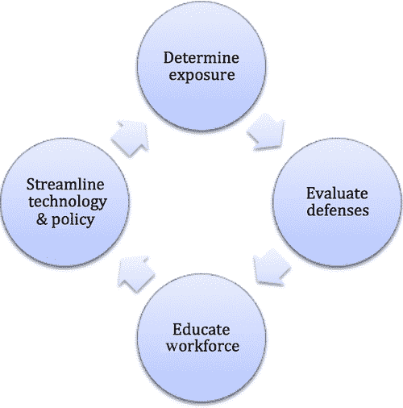

第七章

# 社会工程学

瓦莱丽·托马斯（Securicon，弗吉尼亚州洛顿，美国）

## 摘要

一个常见的误解是所有攻击都是纯技术性质的。社会工程学是一种获取信任或接受的艺术，以说服某人提供信息或执行行动以使攻击者受益。攻击者然后将新获得的信息与技术攻击结合起来，通常通过研究和多次攻击获得，以产生对目标灾难性的结果。

关键词

社会工程学

钓鱼

钓鱼邮件

垃圾倒卖

欺骗

## 什么是社会工程学？

“我们这天气真不错，”马克一边笑着，一边用打火机点燃了嘴里的香烟，同时还挣扎着撑着他的雨伞。“是啊，确实很好，”杰瑞同意道，一边往办公楼的窗户吐出一团烟雾。杰瑞再次抽了一口烟，问道：“昨晚你看球赛了吗？” 马克把一些烟灰丢到地上，“没有啊，老婆想去尝尝一家新的塔帕斯餐厅。花了 70 块钱，我还是饿。” 杰瑞冷笑着，两个男人熄灭了烟。 “是啊，我知道那是什么感觉，”他点了点头，马克刷了一下他的门禁卡，然后把门拉开，杰瑞从他的夹克衫上摇掉雨水，然后走进了大楼。 两人在走廊上朝相反的方向走去。马克回到他的办公桌接听电话。杰瑞找了一个空的会议室，打开他的笔记本电脑，然后开始窃取公司的数据。

你看，杰瑞不是一名雇员；他是一名攻击者。

社会工程学是一种获取信任或接受的艺术，以说服某人提供信息或执行行动以使攻击者受益。尽管大多数社会工程攻击是非技术性的，但与技术攻击相结合时，对目标的结果可能是灾难性的。著名黑客凯文·米特尼克在他的第一本书《欺骗的艺术》中创造了社会工程学这个术语。米特尼克利用说服和欺骗与技术攻击相结合，成功渗透了太平洋贝尔和北电公司等组织，在 1995 年被捕之前。在 2000 年获释后，米特尼克成立了米特尼克安全咨询公司，现在是世界上最受追捧的计算机专家之一。

## 谁是社会工程师？

并非所有的黑客都符合一个生活在妈妈地下室的反社会青少年的刻板印象；社会工程师也是如此。大多数社会工程师非常外向，对与陌生人聊天毫不犹豫。为了操纵人们的信任，一个人必须愿意与他们交谈。通常，他们穿着以融入环境，但偶尔也会穿着突出，如果情况合适的话。也不能认为所有的社会工程师和黑客都是男性。女性被认为比男性更不具威胁性，这使她们成为非常有效的攻击者。最重要的是，他们是讨人喜欢的人，让他们接触的人感觉良好。

## 为什么会奏效？

从小我们就被教导“黄金法则：待人如己”。当我们看到有人在挣扎时，我们的第一反应是帮助他或她。特别是如果这个人表示如果目标不帮助他或她就会陷入麻烦，这一点尤为真实。社会工程利用我们的心理构造来对抗我们，通过努力获得目标的同情心。同情心是识别另一个人的情绪和/或思想并以适当的情绪做出回应的动力。最后，这些类型的攻击是有效的，因为许多人不了解社会工程攻击是什么以及它们构成的威胁。

## 它是如何工作的？

并非所有的社会工程攻击都旨在获取敏感信息，比如密码。有些是为了获取目标看似微不足道的信息，比如他们清洁公司的名称。攻击者利用这些较小的信息来编造一个掩护故事，或借口，以执行攻击。借口的目标是通过古老的“鸭子测试”：如果看起来像鸭子，游泳像鸭子，嘎嘎叫像鸭子，那么它很可能就是鸭子。

攻击周期可以分为三个阶段：

■ 信息收集

■ 攻击计划

■ 攻击执行

为了讨论，我们将攻击计划和执行合并在一起，因为我们将列举许多例子，不想让它们混淆。

## 信息收集

欺骗是一项非常细致的业务，涉及到最微小的细节，有时甚至包括天气。为了让社会工程师成功，他们必须融入目标环境。

融入不仅仅是外表上的，一个人还必须能够说出组织的行话并了解其关键人物。信息来自多种互联网来源。我们将讨论最流行的资源以及社会工程师如何使用它们。

### 公司网站

社会工程师仔细检查目标网站的原因有一些显而易见的，比如识别他们的行业和产品/服务。一些不那么明显的项目包括以下内容：

■ 员工人数—在每个人都以名字相称的组织中进行社会工程更加困难，但并非不可能。

■ 地点 - 了解目标公司的办公地点至关重要。如果攻击者要冒充工程部的员工，他们需要确保目标不是坐在隔壁的隔间里。

■ 职位空缺 - 详细的职位发布提供了关于目标可能正在使用的特定技术的见解，比如防病毒和入侵检测系统（IDS）。职位发布还提供了关于公司部门位置的高层次细节。例如，有三个会计工作岗位在达拉斯发布。

■ 高管和经理的姓名 - 这些信息可以用来起草组织结构图。

■ 电子邮件地址格式 - 一旦攻击者知道目标的电子邮件方案，比如 john.smith@abc.com，他们可以创建包含从其他来源发现的姓名的电子邮件列表。用户在他们的电子邮件地址中的命名方案有时可能与他们的登录用户名的格式相同。

■ 当前事件 - 目标公司最近是否与另一家公司合并？冒充来自新收购公司的员工可能是一个可能的攻击向量。他们是否有任何对公众开放的活动？这些活动可以是学习公司行话和观察他们安全意识水平的机会。

最终，攻击者需要对目标有一个细致的了解，以便冒充成员工或信任的内部人员。公司网站是一个宝贵的情报来源，但不是唯一的来源。

### 社交媒体

虽然社交媒体网站非常适合与朋友和同事保持联系，但它们也是攻击者的肥沃猎场。Facebook 和 Twitter 提供了对潜在目标个人生活的深入了解。除了对个人活动的几乎实时更新外，通常还包括其他有用的信息。一些例子包括

■ 家庭成员的姓名

■ 就读的高中

■ 生日

■ 宠物的名字

■ 最喜欢的颜色

■ 爱好或兴趣

上述所有项目提供了重置密码或其他与安全相关问题的潜在答案。这些个人信息还为攻击者提供了感染受害者计算机的潜在攻击向量，稍后会详细介绍。

对于社会工程师来说，LinkedIn 是一个目标的购物清单。细致的搜索选项允许使用过滤器，如当前雇主、以前的雇主、实际位置、行业等。想知道谁在你目标公司的工程部工作吗？没问题。通过一个高级的 LinkedIn 账户和一些定制的搜索，你可以在几分钟内得到一个名单。更好的是，大多数个人资料包括部分简历，详细介绍工作职责和技术技能，这提供了目标组织所采用的防御技术的概述。

### 搜索引擎

使用您选择的搜索引擎，可能可以获取“爆炸性”文件。这些文件可能包含内部信息，如常见首字母缩写、财务细节、网络图表等感兴趣的内容。有些人称之为“Google 黑客”，但任何搜索引擎都可以。以下示例适用于 Google 搜索：

■ “公司名称” 内部 文件类型：doc

■ “公司名称” 敏感 文件类型：xls

■ “公司名称” 机密 文件类型：ppt

■ “公司名称” “不得传播” 文件类型：pdf

### 垃圾箱

垃圾箱潜水是一种古老而流行的信息收集方法。虽然不是很愉快，但通常会产生很好的结果。在红队评估期间，我的团队发现了从标有“敏感-请勿打印”标记的文件到可以打开设施门的身份证的一切。你会惊讶于垃圾箱可能包含的信息量……只是不要忘记戴手套。

### 受欢迎的午餐地点

听过“泄露的嘴唇会沉船”这句话吗？通常情况下，如果攻击者（或其他任何人）想要了解组织内部发生的事情，他们只需去吃午餐。在目标位置周围流行的餐馆和咖啡馆是收集数据的无风险方法。如果两个或更多的同事在一起一段时间，他们几乎不可避免地会“谈论工作”。团体越大，谈话就越详细。当我培训安全专业人员进行社会工程方面的工作时，其中一个任务就是出去吃午餐，什么都不做，只是倾听周围的谈话并做笔记。通常会有一个奖品等着那些带回最爆炸性故事的人。下次你在餐厅或咖啡店时，试试自己做一下，看看仅仅通过倾听可以获得什么样的知识。目标公司的员工通常很容易辨认，可以根据他们脖子上挂着的遗忘的身份证或公司衬衫和夹克。这也是学习公司行话的绝佳机会。

<hgroup>

## 攻击规划与执行

### 攻击者杰瑞

</hgroup>

让我们重新审视本章开头的人物。在到达现场之前，杰瑞已经收集了多张目标位置的航拍地图，试图找到潜在的吸烟区域。一般来说，吸烟区域位于建筑物的侧面或后面，远离主入口和大多数安保人员。杰瑞到达现场后，在街对面的一家咖啡馆吃了早餐，并从远处观察了建筑物。当侍者端上他的汉堡和薯条时，杰瑞看到马克和另外两个男人在吸烟区域。杰瑞通过 LinkedIn 的个人资料照片认出了马克，这证实了目标位置的正确性。他吃了几根薯条，看着这些男人交谈，然后看到马克为大家开门，让大家在雨中回到建筑物内。

尽管上述示例看起来简单明了，但攻击者花费了大量时间研究目标公司的潜在攻击向量。杰瑞不仅需要一个计划来获取建筑物访问权限，还需要计划进入后的目标，并在被发现时制定退出策略。

### 鱼叉式网络钓邮件

在信息收集阶段，攻击者发现他们的目标公司正在使用思科 VPN 客户端。员工可以在他们的工作笔记本电脑上安装客户端，通过适当的身份验证连接到公司网络。攻击者随后创建了一个恶意版本的 VPN 客户端软件，该软件将为他们提供对受害者计算机的访问权限，但仍将作为正常的 VPN 客户端运行。一旦恶意 VPN 客户端完全功能，攻击者执行以下操作来进行攻击：

■ 购买了一个类似目标公司的域名。

■ 通过审查收集的姓名和职位来选择目标员工。他们从市场部门中频繁出差（因此非常依赖 VPN）的“丹”中进行选择。丹还因为在公司的非技术职位而被选中。非技术员工不太可能质疑公司网络团队的同事要求安装软件。

■ 选择了要发送攻击邮件的员工。根据他的 LinkedIn 个人资料，乔伊是公司的首席网络工程师。选择一个有资历的人更好，因为人们更有可能遵从来自权威人士而不是低级或中级员工的请求。

■ 为乔伊在他们新购买的域名上配置了一个电子邮件地址。

■ 然后，他们等待。记住，在社会工程攻击中，时机至关重要。他们等到乔伊在 Twitter 上宣布他将在本周剩余时间出州参加会议。

■ 星期五上午晚些时候，攻击者从乔伊的虚构账户向丹发送了电子邮件：

“为了提高连接速度和可用性，我们已升级了 VPN 基础设施。需要进行客户端软件更新以使用。今天下班前未更新的用户将不再拥有 VPN 访问权限。

所有 VPN 用户必须通过运行附加的安装程序来更新他们的客户端软件。

不需要系统重新启动。如需额外帮助，请联系用户支持。”

敬上，

乔伊·史密斯

网络运营

分机 1402

■ 团队监视了虚构的电子邮件账户的活动。几分钟后，丹回复说他已安装了软件。攻击者随后获得了对丹的系统和公司网络的完全访问权限。

一个攻击者花费几周时间研究和准备一次攻击只为发送一封电子邮件可能看起来不切实际，但这是一个现实世界社会工程攻击的典型例子。从多个来源获取小段数据并编造一个可信的故事是社会工程的核心。另一个角度来看，几周的情报收集、一封电子邮件和一款软件就已经挫败了公司数十万美元的安全基础设施。

### 你好，技术支持？

Sarah 的目标是一家遍布美国各地的大型保险公司。使用一些定制的搜索词很容易找到他们的基于 Web 的电子邮件和 VPN 站点。这些网站不需要基于证书的身份验证，并且据 Sarah 所知，没有有效的登录凭据，双因素身份验证也没有设置。这意味着她只需要一个有效的用户名和密码就能访问公司的资源。使用工具 FOCA，Sarah 检查了位于公司网站上的各种文档和演示文稿中的元数据。元数据搜索结果显示了十个用户名，使用了姓氏首字母和姓氏的方案。现在，Sarah 了解了用户名的格式，她可以轻松推断出仅凭员工姓名的用户名。然后，Sarah 在 Facebook 上搜索了目标公司的员工，并发现了 43 个。其中 43 个档案中，有 20 个是完全向公众开放的。开放的档案显示了 Facebook 中输入的所有数据，包括用户的状态更新。Sarah 列出了拥有公开 Facebook 档案的女性员工，并开始搜索其他信息，如签名框和办公电话号码。

那是圣诞节的一周，假期季节正酣。Sarah 监视着女性员工名单，直到 Natalie Green 发布了合适的状态更新。"前往夏威夷度过美好的十天，远离雪和冰！"这对 Sarah 来说是个好消息！现在，Sarah 可以尝试控制 Natalie 的账户，而几乎不会被发现。Sarah 整理了她对 Natalie 的笔记，包括生日、家乡、办公室和手机号码、家庭地址、部门名称、工作职称和主管姓名。

在圣诞前夕晚上 7:00，萨拉使用一个来电者 ID 欺骗程序联系了帮助台，使她的号码显示为娜塔莉的手机。一个听起来很愉快的年轻人接听了电话。“帮助台，我是保罗。有什么我可以帮你的吗？”使用她最好的“哭丧声音”，萨拉回答说。“嗨，保罗。我是来自丹佛办事处的娜塔莉·格林。我本周早些时候更改了我的密码，现在我忘记了。如果我这周没有值班，那就不是什么大事了。”她叹了口气说。保罗知道地笑了笑。“太了解了。让我帮你恢复在线状态，娜塔莉。我只需要你的办公室电话号码来验证你的身份。”萨拉惊讶地眨了眨眼。这真的这么容易吗？她咬住舌头，克制住兴奋。“当然，保罗。”她回答，并继续从笔记中读取电话号码。电话那边安静了下来，但萨拉能听到打字声和背景中低低的圣诞音乐旋律。“你已经设置好了，娜塔莉。我将你的密码设置为‘2013Denver$’，但你登录后必须立即更改它。”萨拉微笑着，发出了一声明显的宽慰。“保罗，谢谢你的帮助。我今晚非常感激你。希望明天你也不会被困在那里。”保罗回答说：“幸运的是，不会，但如果你遇到任何问题，我今晚都会在这里。”萨拉开始输入娜塔莉的用户名和新密码，以验证它们是否正常工作。“看起来我没问题了。再次感谢你，保罗。圣诞快乐！”萨拉现在在整个星期内可以不受限制地访问娜塔莉的账户。在娜塔莉预定回归之前，萨拉安装了一个后门，允许她即使在密码更改后也能访问娜塔莉的账户。

服务台是攻击者的主要目标，因为它们的整个目的就是帮助人们。攻击是在假日的晚上进行的，因为有很大可能是一名经验较少的员工在值班。这是一个防止萨拉缺少关键信息来验证她身份的安全措施。新员工更有可能违反程序，以帮助别人避免麻烦。

## 社会工程防御框架（SEDF）

作为一名安全顾问，我为众多客户执行了社会工程评估——从电子商务到政府，各个领域都有。每次参与都是独一无二的，但几乎总是会引发管理层同样的问题：“我们如何阻止社会工程攻击？”我发现我没有一个明确的资源可以参考，甚至没有一个高级别的指导方针可以让他们开始。

简单的事实是，社会工程攻击不能仅仅通过技术来阻止，也不能仅仅通过培训来阻止。我创建了社会工程防御框架（SEDF），以帮助组织在企业级别防止社会工程攻击。 SEDF 概述了攻击防范的基本阶段：

■ 确定曝光

■ 评估防御

■ 教育劳动力

■ 简化现有技术和政策

SEDF 阶段彼此独立，可以按照组织优先级的顺序执行。如果你刚刚完成了一次大规模的培训活动，那么也许评估防御就是你的下一步。

### 确定曝光

这个阶段的重点是以社会工程师的视角看待网站和其他可用资源。Web 暴露评估是一种非侵入式的方法，用于收集客户信息，以便清楚地了解暴露在互联网上的数据。

一个主要的关注领域是公司网站。你是否提供了过多的信息？在线员工目录，虽然对客户有帮助，但对社会工程师来说是一座金矿。在大多数情况下，列出关键的面向客户的员工，为客户提供联系点，而不是列出公司的所有员工。过多的职位发布可以提供有关你的环境中部署的软件的详细信息。向世界宣布你的防病毒品牌和其他部署的安全技术，就像为攻击者铺设了欢迎地毯一样。元数据分析是评估的关键部分，以确定是否在发布在你的网站上的文档中暴露了用户名、密码和操作系统详细信息。

评估的另一部分是搜索泄露的文件。并非所有这些文件都是通过谷歌发现的。点对点网络、社交媒体和其他信息共享网站可能是极好的资源。每当我执行这些评估并附上发现的文件时，客户总是问：“你从哪里得到这个！？”

关注的另一些领域如下：

■ 技术支持论坛——你会惊讶地发现有多少人注册这些论坛时使用的是他们公司的电子邮件地址。在规划技术攻击时，代码片段和文件路径可能非常有帮助。

■ 社交媒体——这些资源提供了对员工生活的洞察，是攻击者的肥沃猎场。个人细节，如他们上过的高中或宠物名字，通常用作密码重置问题。此外，了解某人是否将要休假一周，为攻击者提供了冒充该员工的机会，而又极少被发现。

■ 流行的黑客网站——类似于[`pastebin.com`](http://pastebin.com)的网站是攻击者的常用倾倒场所，可能包含从账户数据到知识产权的所有内容。

一旦研究完成，就会制作一份报告，总结发现的信息和最可能的攻击向量。除了列出攻击向量外，还包括降低发现数据曝光的建议。

### 评估防御

这个阶段可以用来评估员工对模拟攻击的抵抗力和反应。组织也可以选择评估检测技术的有效性和适当的应对团队。模拟攻击的类型包括钓鱼、电话和实体。通常情况下，将这些评估外包给专门的供应商是一种常见做法，但并非必须。

钓鱼评估组织对恶意电子邮件内容的抵抗力。内容可以是超链接、附件，或者 HTML 表单，用于收集员工信息或获取他们的计算机访问权限。钓鱼攻击在攻击者中很受欢迎，应该是您组织网络威胁清单中的重点。如果您的组织尚未执行过这种类型的评估，模拟钓鱼攻击应该是这个过程中首先评估的防御措施。有关创建模拟钓鱼攻击的详细过程，请参阅第十章。

电话攻击，又称为 vishing，通过电话或短信欺骗个人透露信息。攻击者进行来电显示欺骗，使他们的电话看起来来自一个已知的电话号码。在美国，来电显示欺骗并不违法，可以使用商业服务或个人设备进行。虽然 vishing 可能看起来过时，但对攻击者来说仍然是一个极其有用的工具，因为他们的目标没有时间在向攻击者提供信息之前仔细考虑情况。将初始模拟电话攻击重点放在主要与公众打交道的员工身上。帮助台人员、销售、公共关系和人力资源应该包括在初始评估中。

在意识计划中，物理安全教育经常被忽视。尽管物理安全和网络安全通常归不同部门负责，但它们都致力于保护相同的资产。完成物理安全评估对于物理安全和网络安全都是一次启发性的经历。物理渗透测试通过获取对指定设施或房间的访问来评估安全控制。团队成员经常利用电子控制并利用社会工程学来获取访问权限。通常，物理安全评估与网络渗透测试同时进行。物理安全基础知识和评估在第八章中有详细介绍。

本阶段的结果应该回答以下问题：

员工

■ 是否获得访问或信息？

■ 工作站

■ 服务器

■ 物理

■ 有多少员工提供信息或访问权限？

■ 利用了哪些弱点或漏洞来获取信息或访问权限？

■ 技术

■ 人类

■ 物理屏障，如围栏

■ 有多少员工报告了可疑活动？

■ 正确地

■ 不正确地

防御者

■ 检测到多少次攻击？

■ 平均检测时间是多少？

■ 如何检测到攻击？

■ 员工报告了可疑活动

■ 来自入侵检测系统/防病毒软件/代理的技术警报

■ 安全摄像头或门禁系统的警报

■ 巡逻中保安队发现

■ 攻击发生时是否有适当的响应程序？

■ 是否遵循了响应程序？

■ 事件是否得到适当升级？

■ 门禁警报是否得到调查？

上述问题的答案可用于评估您当前的意识计划的有效性。评估结果还可用于更新现有政策并修改物理和网络机制的检测设备配置。为了最大限度地提高效果，应定期评估防御措施。至少每两年应进行钓鱼和电话评估。如果预算允许，物理评估应每年进行一次。

### 员工教育

描述一次攻击可能很有启发性，但展示一次攻击的影响更大。我参加过的最好的培训课程是为一个政府机构举办的，开始时播放了一个视频，其中一名机构员工向对手透露了关键防御项目的敏感细节。除了“对手”实际上是一名卧底特工试图通过社会工程获取信息；而且成功了。视频结束后，礼堂里一片寂静。这段简短的自制视频对观众产生了真正的启发作用。它清楚地传达了信息“这些威胁是真实存在的，你可能是下一个目标。” 会议的其余部分继续详细介绍这些攻击是如何进行的，以及如果怀疑自己被针对时该怎么做。

在社会工程教育中，分解攻击场景是一个重要步骤。向受众展示每个获取的信息以及如何在攻击中使用它建立了对过程的真正理解。接下来，您需要讨论防止数据泄漏和其他攻击的策略。讨论的几个方面包括以下内容：

■ 元数据 - 确保您的受众了解元数据及其如何被利用对他们的影响。提供关于如何在发布前删除文档中的元数据的教程。许多微软办公软件都内置了此功能，但未启用。

■ 钓鱼攻击 - 员工了解如何识别和报告钓鱼消息至关重要。演示链接可以伪装以及如何伪造电子邮件地址是传达信息的一种方式。

■ 社交媒体安全 - 教育您的受众如何设置社交媒体的隐私设置。逐步指导他们如何限制 Facebook 个人资料，禁用位置服务，并使材料不特定于公司，以便员工可以与家人分享。

■ 您公司的电子邮件地址——绝不能低估您公司电子邮件地址的重要性。它绝不能用于订阅论坛、邮件列表或其他特殊兴趣小组。这不仅会暴露公司技术，还可能被用来制作冒充邮件列表更新的钓鱼攻击。

■ 电话攻击——演示来电号码欺诈以强调电话号码可以轻松伪造。讨论员工收到可疑电话时应该怎么办。他们如何报告？

■ 物理攻击——正如我们在本章前面讨论过的，有时，进入目标环境的最简单方法就是直接通过门。强调尾随攻击的影响以及访客程序。

防止社会工程攻击的最重要步骤是教育您的员工，提问是可以的。如果有人试图尾随进门，员工可以问：“您可以扫描您的工作证吗？”在联系其经理进行验证时，可以把电话接通等待。每个意识计划的目标应该是教育员工向安全团队报告可疑行为，而不是让他们成为安全专家。对于许多组织来说，这将需要文化转变。如果他们了解威胁，管理层更有可能批准这种范式转变，因此准备好向管理层介绍这些类型的攻击。

### 简化现有技术和政策

尽管单靠技术不能防止社会工程攻击，但它可以最小化成功攻击的影响。您的环境中可能存在有效的防御技术，但通过配置更改可能会有所改善。与其逐行审查配置，不如通过头脑风暴会议聚焦于大局，从涉及网络安全团队关键技术成员的高级场景开始。这种策略在防御工业中被广泛使用，术语为桌面演练，通常涉及多个军种和民用机构。桌面演练是在非正式环境中对脚本场景进行讨论的活动。通常由主持人引导，这些演练使安全团队能够逐步地走过攻击场景，以进行审查。

■ 当前的事件响应政策

■ 业务连续性（COOP）计划

■ 预防性技术

■ 检测能力

■ 一旦发生利用事件，最小化影响的方法

场景旨在鼓励建设性讨论并突出需要在一个非威胁环境中完善的领域。桌面练习可以涵盖广泛的范围，包括许多审查领域，或者聚焦于特定领域，例如已部署技术的检测和预防能力。桌面练习费用低廉，还可以作为新员工的在职培训。不要忘记从实际执行工作的员工那里获得一些意见。因为有些任务在纸上看起来很好，但可能需要其他组的几个相关任务，并依赖于完全支持其工作职能的其他任务。

#### 计划桌面练习

桌面练习的三个阶段是设计、执行和事后。设计阶段对练习的成功至关重要，根据练习的规模和复杂性，设计阶段可能需要花费几天到几周的时间才能完成。

##### 设计阶段

如果您的组织尚未进行过桌面练习，最好从包括网络安全团队的狭窄重点练习开始。对于 SEDF，主要关注的领域包括识别

■ 网络和主机操作系统中基于钓鱼攻击的潜在检测点

■ 使用当前部署的技术来最小化成功攻击的影响的方法

■ 社交工程攻击和事件响应的响应策略

建议每个桌面练习都有一个重点领域。这样可以使参与者更有效地集中精力。确定了焦点之后，可以创建场景。场景是一个连续的、叙事性的假设事件描述，为练习提供催化剂，旨在引入激发响应的情况[1]。每个场景应包含一个讨论主题和讨论要点，以便将小组集中在所需的讨论上。一些样本场景包括以下内容：

■ 钓鱼攻击—一组攻击者正在使用一封看似来自您人力资源部门的钓鱼邮件针对您的组织进行攻击。该电子邮件指出员工必须完成隐私政策确认，以便获得本年度的保险福利。电子邮件中显示的链接似乎将员工引导至公司网站；然而，一旦点击，员工就会被引导至恶意网站，该网站试图捕获输入到网站中的信息。

■ 检测讨论—目前已经部署了哪些机制来检测主机和网络层的可疑电子邮件和/或可疑链接？它们能否被配置为阻止包含伪装链接的电子邮件？

■ 减少影响讨论—一旦网络安全团队收到恶意电子邮件的通知，是否可能确定哪些员工收到了该电子邮件？可以从收件人邮箱中删除电子邮件以防止进一步攻击吗？是否可能使用代理或网络上的其他设备阻止恶意网站（URL 和 IP 地址）？

■ 政策讨论—当员工向网络安全团队报告可疑消息时会采取什么行动？如何阻止对恶意网站的访问？这次攻击中可以利用哪些信息进一步教育员工？

■ 恶意文档—在网络上发现了一个被感染的 PDF。一旦打开 PDF，后门软件就会安装在机器上，使攻击者能够访问机器和企业网络。企业防病毒软件无法检测到后门软件或恶意 PDF。尚未确定 PDF 的来源，网络上感染的机器数量也未知。

■ 检测讨论—如何识别受损机器？是否可能检测后门软件与其命令和控制地址之间的通信？

■ 减少影响讨论—代理或其他网络设备是否可以阻止命令和控制流量？有哪些选项可以用来移除感染的 PDF 和后门软件？是否可能确定从感染机器中删除了数据？

■ 政策讨论—当发现可疑文件时会执行哪些分析步骤？在端点和/或代理策略中修改检测签名需要哪些授权？这次攻击中可以利用哪些信息进一步教育员工？应通知哪些部门有关攻击的情况？

桌面演练需要以下角色：

■ 主持人—主持人的角色是营造一个鼓励对话并引导讨论以达到演练目标的环境[2]。考虑聘请一位经验丰富的顾问来主持演练，因为主持是一种专业技能。顾问将对参与者持中立意见，使演练能够在没有偏袒的情况下进行。最后，对公司网络的外部视角可以激发新的讨论思路。

■ 数据收集者—数据收集者的目的是记录每个场景的主要讨论点以及在桌面演练期间达成的任何决定。数据收集者还将制作总结演练的事后报告。

■ 参与者——选择与演练重点相关的工作责任的参与者，而不仅仅是经理们。对于检测和最小化影响的演练，除了网络和终端实施的关键员工外，还包括了信息安全团队。基于政策的演练应该包括每个部门的代表，这些代表在当前政策中有指定的角色。

同时也应将后勤、设备和文件纳入设计阶段。一些组织选择在会议空间或酒店会议室外举行演习，以消除参与者在办公室日常环境中的干扰，从而使参与者能够专注。演练地点应该是一个足够大的空间，可以舒适地容纳演习参与者的数量，并包括一台投影仪、白板和足够的电源资源供参与者使用笔记本电脑。到达时，每个参与者都应该收到一个参与者指南。参与者指南应包括

■ 演练目的

■ 范围和目标

■ 演练场景

■ 支持材料（网络图或政策）

主持人指南应包括与参与者指南相同的材料，以及在每个场景中应该提出的主持人问题。数据收集表应包括以下列：

■ 问题或目标

■ 受影响的部门

■ 当前的应对行动或技术

■ 决议或建议

##### 执行阶段

在引入主持人之前，演练应以信息安全管理层的评论开始。主持人应要求每个参与者介绍自己和在组织中的角色。虽然大多数员工都熟悉个人的角色和责任，但主持人不是。然后主持人提供演练日程安排和基本规则的概述。基本规则旨在促进思想交流的中立环境。一些示例性的基本规则如下：

■ 没有对错答案。所有的想法都受欢迎，并且会根据需要被记录和采纳。

■ 保持无过错、无压力的环境。讨论应该由团体决策和问题解决来推动，因此环境必须保持开放、积极和鼓励性。

■ 使用场景提供背景并激发创造性思维。所有的想法和思考都应基于场景提供的信息，但这不应限制你的思维。

■ 不要把讨论限制在官方立场或政策上。在思考所呈现的情况时，不要害怕超越你的头衔/职位。

主持人应介绍第一个情节。如果参与者对情节事件没有问题，主持人应问第一个列出的情节问题，然后退后一步，让参与者讨论。如果组开始关注与演练范围无关的主题，主持人将引导讨论回到情节上。在每个情节结束时，组应进行热洗。热洗是对情节、讨论要点和结论的高层次概述。热洗不仅确保参与者对结论达成一致，还验证数据收集者是否保留了正确的信息。

在演练时间表中包括休息时间，让参与者补充咖啡因并呼吸新鲜空气。如果情节过于拖沓，注意力会逐渐减弱，导致讨论减少。典型的时间表包括 90 分钟的会议，中间有 20 分钟的休息时间。午餐应尽可能在室外地点提供，以提供参与者一个环境变化。

一旦参与者完成最后一个情节，对整个演练进行热洗。一些可问的示例问题如下：

■ 今天演练的一些关键收获是什么？

■ 有关改善此演练质量的建议是什么？

■ 场地

■ 参与者

■ 支持文件

■ 下次演练应包括哪些目标？

##### 演练后阶段

从数据收集器那里分析和编制信息，制作详细的演练事件报告。接下来是演练最关键的部分，从演练报告中创建和分配行动项目。如果组织没有采取行动，演练中的信息将毫无用处。因此，分配和跟踪行动项目对演练过程的成功至关重要。演练组织者应召开后续会议，讨论以下内容：

■ 演练是否成功？

■ 是否包括适当的人员？

■ 主持人是否足够？

■ 场地是否提供足够的空间和电力资源？

■ 有哪些措施可采取以改进未来的演练？

存在许多演练计划资源。联邦紧急事务管理局（FEMA）提供了完整的网络演练包，可在[`www.fema.gov/media-library/assets/documents/26845`](http://www.fema.gov/media-library/assets/documents/26845)获取。

### 预防提示

除了头脑风暴和桌面演练的结果外，以下是一些建议，可加强您的环境抵御社会工程攻击：

■ 用户名改头换面 — 攻击者可以轻松枚举用户名，利用本章前面讨论过的策略，比如通过社交媒体收集名字。基于名字或任何其他可识别特征的用户名会使社会工程攻击复杂化，因为攻击者无法快速确定与他们希望攻击的员工相关联的用户名。与其使用 vthomas 作为用户名，考虑使用一个唯一标识符，比如 HN90346283。这种改变不仅会使攻击者的行动变得更加困难，还会使网络安全团队的威胁检测和日志分析变得更容易。来自与唯一标识符不符的用户名的登录尝试将是明显的攻击尝试，使网络安全团队能够适当地调查涉及的机器。由于这种类型的改变会影响组织中的每个人，部署的初始阶段可能会产生负面影响，比如来自忘记新用户名的员工的帮助台呼叫增加。用户名改头换面还需要高级管理支持，因为这将需要组织文化变革以利用新的格式。

■ 域购买 — 社会工程师利用受害者无法察觉攻击中的细微细节。钓鱼攻击的一个常用策略是购买一个类似目标主要域的域。例如，如果你的主要域是[www.myorganization.com](http://www.myorganization.com)，攻击者将购买[www.myogranization.com](http://www.myogranization.com)或[www.my-organization.com](http://www.my-organization.com)，这样恶意链接乍一看会显得合法。如果用户误输入您的网站地址并意外访问攻击者的网站，这些恶意域也可以用来攻击您组织的客户。从恶意域注册电子邮件帐户会增加钓鱼消息的可信度，因为电子邮件地址看起来来自您的组织内部。购买与您组织相似的域将降低攻击者使用虚构网站和电子邮件地址来诱骗目标的风险。在购买时包括流行的域扩展名，如.org 和.net，以实现最大的预防效果。

■ 网页邮件地址 — 注册网页邮件地址，如 myorganizationadmin@yahoo.com，可以降低攻击者利用网页邮件提供商发起钓鱼攻击的可能性。如果攻击者无法购买一个令人信服的域或创建一个令人信服的网页邮件帐户，他们的攻击被垃圾邮件过滤器检测到的机会就会增加。

### 综合起来

安全工程防御框架（SEDF）提供了一个高层次的路线图，帮助组织确定需要改进的领域，以防止、检测或应对社会工程攻击（图 7.1）。这些阶段没有先决条件，可以按任意顺序执行。

图 7.1 社会工程防御框架的阶段。

成功实施该框架的关键在于根据每个阶段的结果创建环境变化。环境变化可以包括技术、政策、员工教育、组织文化或对物理安全控制的修改。预防社会工程攻击是一个持续的过程，将需要定期重复每个 SEDF 阶段。

## 我在哪里可以了解更多关于社会工程的信息？

在这一简短章节中，我只是浅尝辄止地介绍了社会工程学及其工作原理。我强烈推荐以下书籍：

■ 《欺骗的艺术》、《入侵的艺术》和《鬼影缠身》 by Kevin Mitnick

■ 《逮捕我如果你能》 by Frank W. Abagnale

■ 《无技术黑客》 by Johnny Long

## 注释

[1] 《事件响应计划桌面演练》 [`ics-cert.us-cert.gov/sites/default/files/ICSJWG-Archive/F2010/Simon%20-%20Tabletop%20Exercise%20Webinar.pdf`](https://ics-cert.us-cert.gov/sites/default/files/ICSJWG-Archive/F2010/Simon%20-%20Tabletop%20Exercise%20Webinar.pdf) [于 2014 年 5 月 22 日访问]。

[2] 《网络安全桌面演练》 [`www.fema.gov/media-library-data/20130726-1834-25045-1623/nle_12_ttx___facilitator_s_notes_5.10.12_final__508.pdf`](http://www.fema.gov/media-library-data/20130726-1834-25045-1623/nle_12_ttx___facilitator_s_notes_5.10.12_final__508.pdf)。
