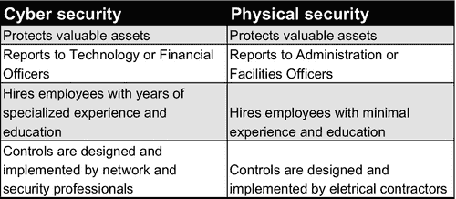
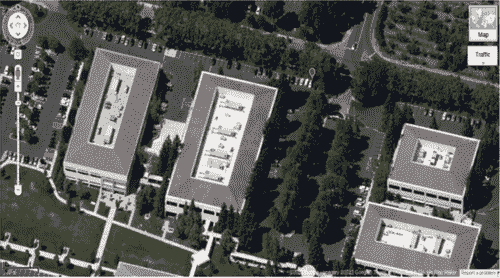
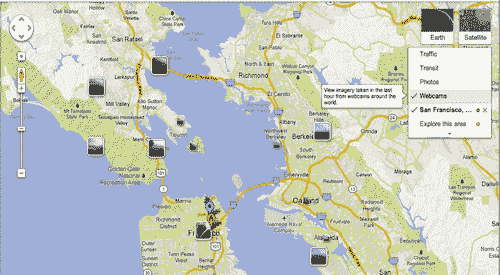
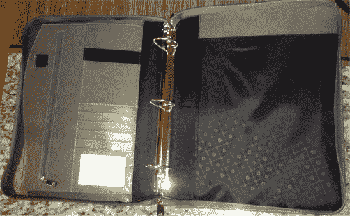
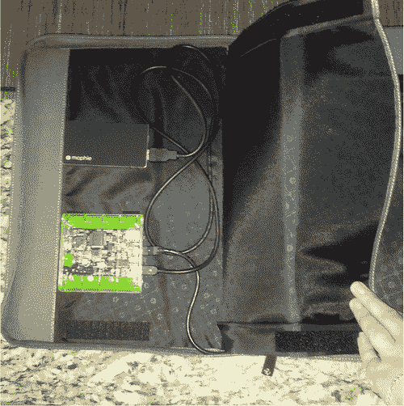
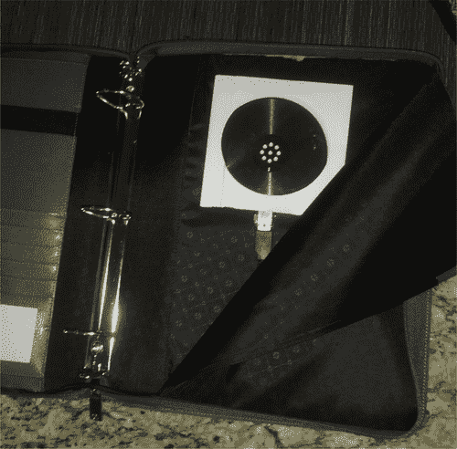
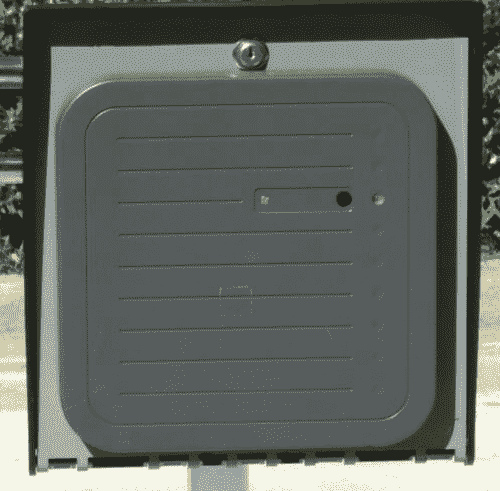
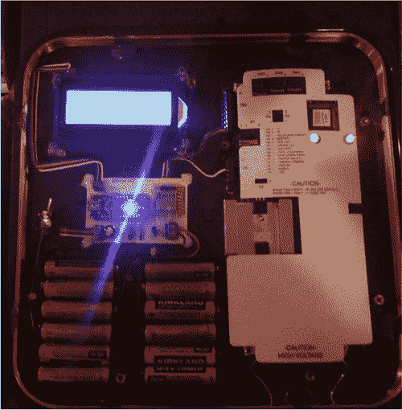

# 第八章：物理安全

瓦莱丽·托马斯（美国弗吉尼亚州洛顿 Securicon）

## 摘要

当有人提到物理安全时，通常会想到围栏和保安。虽然这些是组成部分，但还有许多其他元素构成了物理安全计划。在本章中，我们将讨论建筑物安全、数据中心安全、物理安全评估以及物理安全对员工意味着什么。

关键词

物理安全

自然威胁

非故意的威胁

人为威胁

红队

侦察

## 什么是物理安全？

物理安全描述了旨在控制未经授权人员进入建筑物、设施或资源的安全措施。未经授权的人员包括希望对受保护环境造成伤害的攻击者和意外入侵者，例如可能不知道受限区域的员工[1]。物理安全可以分为三个基本级别：外围安全、内部围栏安全和内部安全。

### 外围安全

财产边界定义了外围。对于一些组织来说，这包括一个建筑物；对于其他组织来说，这是一个由多个建筑物和停车设施组成的校园。保护外围的目标是控制谁可以步行或驾驶进入财产[2]。

### 内部围栏安全

内部围栏由建筑物外部的门、窗户和墙壁组成。控制谁进入和离开建筑物（以及何时进入和离开）是保护内部围栏的目标。

### 内部安全

建筑物内部形成内部安全级别。内部安全的目标是仅为授权的员工提供对建筑物部分的适当访问权限。这不仅是为了安全，还为了在包含有害化学品或工作条件的环境中保障员工的安全。

## 物理安全层

物理安全层包括各种方法和工具，以支持它们的目的。这些层的部分将包含在上述所有三个物理安全级别中。

### 遏制

遏制层包括可以阻碍或阻止攻击发生的环境结构。这些的例子如下：

■ 围栏

■ 大门

■ 刺刀网

■ 减速带

■ 检查站

■ 车辆阻隔

■ 车辆高度限制

■ 沟渠

■ 照明

■ 警示标志

这些结构可以结合起来，引导外围的入口和出口点数量，并创建多个检查点。

### 控制

物理安全控制指的是限制进入受限区域的能力。控制功能在所有安全级别上都被使用。控制可以是机械的、程序的或电子的。例如：

■ 旋转门或人防

■ 电子卡系统

■ 机械钥匙

■ 组合保险柜和门

■ 由警卫队授权

■ 签到簿

■ 由安全护送访问

除了访问控制外，许多这些项目还提供责任追究。电子或纸质签到和签出日志可用作进入受控建筑物或房间的凭证。

### 检测

检测和警报系统在检测到未经授权的访问时触发响应。检测设备的目标是向物理安全人员发出可能有入侵的警报。一些示例包括以下内容：

■ 报警系统或灯光的运动传感器

■ 电子卡系统的报警功能

■ 玻璃破碎检测器

如果您的组织雇用保安队伍，这些设备将向他们发出警报，以便进行进一步调查。有些组织没有保安队伍，而是依靠警方对报警系统的响应。

### 标识

标识层专注于视频监控。虽然视频摄像头可以用作威慑和检测设备，但其主要目的是进行历史分析。如果检测设备发出警报，视频摄像机可用于验证该区域的活动。如果已经发生了攻击，视频录像可用于识别攻击者和他们攻击造成的损害。

## 对物理安全的威胁

攻击者并不是对物理安全的唯一威胁。物理安全威胁的三种主要类型如下：

■ 外部——通常被称为自然威胁。这包括火灾，洪水，地震，飓风和龙卷风。

■ 内部——该类别包括意外的破坏行为，如糟糕的管道或电线，溢出的饮料，操作错误和设备掉落。

■ 人为——被视为有意的破坏行为。这些威胁包括盗窃，破坏，蓄意破坏和间谍活动。黑客可以根据攻击者的目标融合其中一个或多个这些威胁[3]。

## 为什么物理安全对意识计划至关重要

物理安全通常与网络安全分开管理；但是，两个部门都在保护同样的使命：关键项目，公司基础设施和知识产权。尽管两个部门保护相同的资产，但网络安全被认为是更专业化的职业道路。这种看法创造了安全的分裂个性，如图 8.1 所示。

图 8.1 安全的分裂个性。

组织可能拥有一个价值数百万美元的网络安全计划，配备最新技术和专业人员，但如果攻击者可以轻易进入他们的建筑物并获得网络访问权限，那么安全实施就存在缺陷。正如第七章所提到的，物理安全漏洞和社会工程学密切相关。员工对物理安全的意识对于保护组织的信息和员工安全的成功至关重要。为了正确地教育员工防范物理攻击，我们详细说明了红队或物理评估团队通常会采取的步骤，以获取对建筑物或校园的未经授权访问。

## 物理攻击的工作原理

组织通常聘请安全公司执行物理渗透评估。物理渗透测试评估目标设施的入侵防止、延迟入侵以及在某些情况下安全部队的响应时间的控制。评估目标可能因组织的最大物理安全关切而异。一些示例目标包括以下内容：

■ 进入内部边界

■ 获取对建筑物任意部分或所有部分的访问权限

■ 获取对数据中心或其他高价值目标的访问权限

■ 通过技术或非技术手段获取敏感信息

■ 获得网络和/或计算机访问权限

物理安全评估的基本流程包括三个阶段：侦察、攻击规划和攻击执行。与社会工程攻击类似，评估团队大部分时间都花在侦察和规划阶段。

### 侦察

优质的侦察对物理攻击的成功至关重要。把自己放在评估团队成员的位置上。如果你要未经授权地进入一栋建筑，你不会想在攻击之前尽可能多地获取信息吗？评估团队很可能不是物理上就在目标设施附近。大多数组织不会为评估团队进行数周的旅行而提供资金，因此需要进行远程和现场侦察。

#### 远程侦察

利用各种互联网资源可以获取大量关于组织的信息。在此阶段尽可能多地收集有关目标位置、周围环境、平面图、日常运作和安全控制的信息将增加评估团队成功的机会。下面讨论了远程侦察的主要领域。 

##### 地图

远程侦察的第一步是了解情况。多亏了 Google 和 Bing 地图，这比以往任何时候都更容易（图 8.2）。这两个地图程序提供了美国地点的航拍图和大多数情况下的街景图。

图 8.2 谷歌地图的航拍图像。

理解目标设施和周边区域是离场侦察阶段的主要焦点。在线地图和街道级别图像用于

■ 确定周边安全机制，包括围栏、大门和检查站

■ 查找建筑停车场或车库

■ 确定潜在的入口点，包括门、装卸区和地下停车场

■ 确定垃圾箱的位置

■ 查看周围区域

古老的房地产谚语“位置，位置，位置”也适用于物理评估领域。目标周围的区域在评估动态中起着重要作用。离场侦察阶段最重要的目标之一是找到潜在的现场侦察区域。如果目标位于被办公大楼、咖啡店和餐馆环绕的人口稠密地区，评估团队将有许多现场侦察区域。然而，如果目标位于农村地区，则现场侦察选择可能极为有限。在一些人口稠密地区，您可以利用互联网交通和天气摄像头几乎实时地查看目标区域（图 8.3）。谷歌地图为特定地点提供网络摄像头选项。

图 8.3 通过谷歌地图查看摄像头位置。

除了谷歌地图之外，搜索城市赞助的交通和天气摄像头也可能提供有价值的结果。

##### 公司网站

尽管公司网站上列出的信息可能被视为平凡，但它可以为物理评估团队提供大量信息。公司网站上的关键信息包括以下内容：

■ 营业时间——通常与客户服务和公共关系电话号码一起列出，营业时间可以提供目标建筑可能空无一人或雇员数量极少的时间段。如果公司网站指示提供 24/7 客户服务，则呼叫中心员工可能整晚都在现场。

■ 地址具体信息——在此阶段，物理评估团队可能无法获得楼层平面图。然而，通过检查邮寄地址或员工目录细节，团队可能能够创建楼层地图的路线估计。例如，如果客户服务的地址列为东主街 145 号，2 楼，则评估团队可以开始创建粗略的建筑楼层平面图。

■ 来自照片的信息- 照片可以成为评估团队的宝贵信息来源。公司经常包含他们建筑大堂区域、健身中心、杂货店和建筑其他公共区域的照片。这些照片可以组合起来为评估团队提供建筑物前门后面的基本布局。此外，可以通过定位公司照片背景中的安全摄像头、报警面板、ID 卡读卡器和员工 ID 卡来收集组织的安全态势信息。

##### 附加来源

公司网站和地图程序并不是攻击者唯一有用的信息来源。通常，可以从房地产公司、建筑许可证和社交媒体获取信息：

■ 税务记录- 分析目标建筑物的税务记录，以确定该物业是由公司还是由房地产公司拥有。除了所有权外，还可以从税务记录中获取有关总平方英尺和物业线的详细信息。

■ 房地产公司- 如果目标建筑物由房地产公司拥有，他们的网站可能提供有关建筑物特点的详细信息，包括健身中心、地下停车场、现场安全监控和租车服务。房地产公司通常有多张建筑物内部和外部的照片，以吸引潜在客户。这些照片被分析以获取类似公司网站照片的信息。此外，可能可以确定目标组织是租赁整栋建筑还是部分建筑。通过电话迅速与房地产经纪人联系，可以确认建筑物的可用性。评估团队成员经常作为一个虚构的公司接触房地产公司，该公司有意在目标建筑物租用空间，并安排在现场侦察阶段参观可用办公空间。

■ 社交媒体- 社交媒体用于为评估团队提供员工名单。搜索流行的社交网站，如 LinkedIn，可以为团队成员提供目标公司员工的姓名、职位和照片。此外，其他社交媒体网站用于收集和分析员工上传的照片，这些照片可能提供 ID 卡照片或其他有用的信息。

完成了现场外侦察阶段后，评估团队对以下内容有了了解

■ 评估范围内的建筑物

■ 建筑物周围环境

■ 可能的现场侦察地点

■ 基本周边安全知识

■ 建筑物的所有权或租赁情况

■ 营业时间

■ 大厅区域的基本视图

■ 使用中的 ID 卡读卡器

■ 可以提供进入建筑物的公共活动

■ 入口的街头视图

■ 可能的吸烟区域

#### 现场侦察

尽管大部分研究工作是在场外侦察期间进行的，但现场侦察侧重于观察建筑运营情况和员工意识。现场侦察阶段的目标是收集足够的信息来计划攻击。

##### 监视

到达目标位置后，团队成员将驾驶或步行经过建筑物，观察活动水平和观察时间。目标是确定白天和夜晚不同时间建筑物的活动水平。首次夜间监视更为理想，因为建筑物不太可能被高度占用。夜间监视的目标包括以下内容：

■ 确认警卫人员是否在场。

■ 记录建筑物特定区域是否有灯光亮着。

■ 确定清洁人员是否在工作时间之后出现。

■ 找到垃圾箱并评估其周围的安全控制措施。

■ 记录员工是否进出建筑物。

如果垃圾箱看起来没有受到监护，评估团队可以进行垃圾潜水以检索丢弃的敏感信息。

白天监视可以在一天中的多个地点进行。团队成员将分散开来，以观察建筑物的各个方面。并不是所有的监视都是在车里用望远镜进行的。在人口稠密的地区，最好的监视地点通常是在咖啡店、餐厅、人行道上的长凳上或者徒步绕行该区域。评估团队成员经常改变自己的外貌，包括服装、帽子和配饰，以避免引起对一个人在建筑物附近长时间处于近距离的怀疑。白天监视的目标包括以下内容：

■ 确定吸烟区域，因为它们是收集信息或进入建筑物的理想地点。

■ 记录每个入口的进出观察情况。员工是否互相为对方开门？

■ 记录大多数员工早上报到和晚上离开工作的时间。

■ 确定停车区是否通过无线射频识别（RFID）标签进行控制。

■ 如果建筑物通过 Zipcar 或 Hertz 等公司提供每小时租车服务，请预订车辆并记录是否存在 RFID 标签。

■ 获取员工身份证的照片。大多数员工会在公共区域佩戴，比如咖啡店。

■ 记录警卫人员是否在设施内，并确定其位置。

■ 记录员工着装情况。如果团队成员计划冒充员工，他们需要相应地着装。

正如你所看到的，简单观察和记录建筑物周围的活动可以为攻击者提供大量关于其安全状况的信息。

##### 房地产会议

如果评估团队能够在到达之前安排与建筑房地产经纪人的会议，只有一两名团队成员会参加会议，以防引起怀疑。 对建筑进行导览是团队成员观察建筑运营并询问与建筑和办公空间相关问题的理想机会。 如果可能的话，团队将选择与目标公司同一楼层的可用办公空间以及另一楼层的额外空间。 评估团队将提出的一些问题包括以下内容：

■ 建筑物是否需要门禁卡进入？

■ 个人办公空间需要相同的门禁卡还是单独的门禁卡？

■ 是否提供全天候访问？

■ 建筑物是否有现场保安人员？

■ 办公室清洁是否包含在月租中？

■ 清洁人员何时进入办公空间？

■ 办公空间是否有报警系统？

除了列出的问题外，团队成员还应该询问办公空间的其他细节（与安全无关），以避免引起怀疑。

##### RFID 凭证窃取

许多组织利用 RFID 门禁系统防止未经授权进入其设施。 这些门禁系统依赖于 ID 卡和读卡器来验证人员的访问级别。 大多数 ID 卡是基于近距离的。 当 ID 卡被放在读卡器上时，它会从读卡器那里接收电源以验证其内容。 门控制器和服务器随后确定所呈现的凭证是否被允许进入受保护区域。 读取和复制 ID 卡的内容可能会危及某些 RFID 门禁卡系统。 用于 RFID 凭证捕获的两种流行设备是 Proxmark3 和 Bishop Fox 长距离 RFID 窃取者。 这些设备可以读取和存储在读取范围内的 RFID 卡的内容。 这些设备的两个主要挑战是在不引起怀疑的情况下靠近目标人员以及运输必要的电源和天线硬件。 一些设计包括使用 Velcro 将硬件固定在文件夹内部。 乍一看，文件夹看起来未经修改。 但是，隔间隐藏了 Proxmark3、电源和天线（图 8.4–8.6）。

图 8.4 用于隐藏 Proxmark3 硬件的文件夹。

图 8.5 Proxmark3 和电源在文件夹内部。

图 8.6 文件夹内的天线。

Proxmark3 的另一种移动设计包括使用弹性带将组件固定在组织者上（图 8.7）。 这些组织者在市面上有多种尺寸可供选择。

图 8.7 带有组织者的 Proxmark3。

组织者在移动时将所需的组件和电缆固定在一个位置。评估团队成员然后将组织者插入基本的笔记本袋中携带，以免引起怀疑。

尽管 Proxmark3 容易携带，但其能读取 ID 卡内容的范围约为 6 英寸。在高度人口密集的区域中，将伪装的 Proxmark3 放置在距离一个人的 ID 卡不到 6 英寸的地方相当困难。为解决这个问题，Bishop Fox 的员工创建了一个长程 RFID 偷窃器[4]。该设计采用了长程 RFID 卡读取器，如 图 8.8 所示。

图 8.8 商用长程 RFID 读卡器。

设计师修改了设备，加入了独立供电、数据存储和显示功能（见 图 8.9）。

图 8.9 Bishop Fox 长程 RFID 偷窃器。

修改后的读卡器首先读取卡的内容，将数据显示在液晶屏上，然后将卡的内容写入微型 SD 卡以供在计算机上进行分析。评估团队在现场侦察期间利用 RFID 凭证窃取技术收集 ID 卡信息。一旦卡信息被收集并分析，团队将适当的电子内容写入 ID 卡。最后，团队成员将创建一个虚构的 ID 卡打印品，包括团队成员的照片；将其附加到程序化的 ID 卡上；并将成品覆膜。这个过程产生的 ID 卡很可能通过基本的视觉检查和访问控制系统。

### 攻击规划

在规划阶段，评估团队分析收集到的数据，确定执行攻击的最佳方案。规划攻击的关键决策点包括以下内容：

■ 何时是最佳攻击时间？

■ 在工作时间内

■ 在清洁人员在场时，工作时间结束后

■ 在工作时间结束后，建筑物空无一人时

■ 主要方法是什么？

■ 假扮成一名员工

■ 在非工作时间进入，无需伪装身份

■ 自称来自电信提供商或供应商

■ 假扮成清洁工作人员

■ 如果主要方法失败，那么次要方法是什么？

■ 团队成员在完成任务时需要哪些配件？

■ 适当的服装（清洁人员制服或公司 polo 衫）

■ 与任务相关的工具

■ ID 卡

■ 名片

■ 在封锁情况下，目标公司的授权信

### 攻击执行

攻击执行阶段是物理攻击过程中最短的阶段。在攻击过程中，评估小组成员之间的联系至关重要。如果主要攻击失败，小组可以立即执行次要攻击。蓝牙耳机和手持无线电是评估小组最流行的通信机制。一旦攻击成功并且小组进入内部，典型步骤包括以下内容：

■ 拍摄照片以证明小组的成功。

■ 如果小组还在执行网络渗透测试，则将自定义恶意后门上传到具有提升权限的员工的台式机上。这些员工是在物理攻击之前使用社交网络发现的。

■ 获取对服务器房或数据中心的访问权限。

■ 收集在桌面上、键盘下和文件柜中公开显示的敏感数据。

■ 获取对高级管理人员办公室的访问权限。

评估小组通常会根据安全监控日程在现场停留大约 20 分钟。通常情况下，评估小组尽量减少在现场停留的时间，以避免被发现。

## 最小化物理攻击的风险

如上所述，物理攻击需要密集和耗时的研究。然而，用于规划攻击的大部分信息都是公开可用的。评估您组织的物理攻击风险最流行的方法是执行物理安全评估或物理渗透测试。通常由专业顾问执行，物理渗透测试可以突出显示潜在的弱点。

### 准备进行物理评估

如果您过去没有进行过物理安全评估，则需要采取特定的计划步骤以确保取得满意的结果。

#### 设定目标

清晰的目标是物理安全评估中最关键的规划项目之一。你物理安全方案中最担心的是哪些方面？常见的目标包括以下内容：

■ 获取对受控区域的访问权限，例如数据中心

■ 绕过周边安全控制

■ 评估电子安全控制

一些组织选择执行零知识物理安全评估。这种类型的评估不提供评估小组任何背景信息，并允许小组破坏任何安全控制以获得尽可能多的设施访问权限。

#### 宣布禁止进入的区域

列出评估小组未被授权进入的特定区域。一些组织使用可能会危害评估小组的危险材料。通常情况下，公司总裁办公室被宣布为物理安全评估的禁区。

#### 日程安排

选择一系列可接受的日期和时间，以便评估团队执行攻击。确保关键人员，如物理安全主管和首席信息官，随时可用于确认评估团队的目标并在评估团队被发现时进行身份确认。

#### 授权信

授权信通常被称为“免责通行证”，列出团队成员的姓名以及他们的评估目标摘要。应列出员工姓名，例如物理安全主管，并应提供保安部队联系并核实授权活动的电话号码。

即使是最复杂的组织，物理安全评估也可能是一次令人大开眼界的经历。最重要的是，这是一次实际的学习经验，将为改进您组织的物理安全姿态提供宝贵的见解。

### 无法支付物理安全评估费用？

尽管物理安全评估为当前部署的防御机制提供了价值和洞见，但其代价不菲。如果你的组织无法支付外部供应商进行物理安全评估的费用，可以采取一些预防步骤而无需外部协助：

■ 进行自己的侦察——您组织的网络或物理安全团队可以执行侦察阶段列出的步骤。这种非侵入式评估可以揭示物理安全计划中的几个漏洞。

■ 完成安全巡视——安全巡视是另一种非侵入式评估，涉及审查放在桌子或公共场所的信息。找到被处理不当的多个敏感信息可能表明员工意识不足。

■ 注意门的情况——简单地观察员工如何进入和离开建筑物可以提供有关物理安全意识状况的宝贵信息。如果员工为身后的人开门，执行严格的身份证扫描政策可能会消除搭便车行为。

物理安全远不止于围墙和保安人员。将物理安全威胁纳入您的意识计划将提高您组织的整体安全性。

## 注释

[1] 物理安全 [`www.police.psu.edu/physical-security/what-is-physical-security.cfm`](http://www.police.psu.edu/physical-security/what-is-physical-security.cfm) [上次访问时间：2014 年 5 月 25 日]。

[2] 如何保护你的建筑和财产 [`bizsecurity.about.com/od/physicalsecurity/a/What_is_physical_security.htm`](http://bizsecurity.about.com/od/physicalsecurity/a/What_is_physical_security.htm) [上次访问时间：2014 年 5 月 25 日]。

[3] 保护您的系统：物理安全 [`nces.ed.gov/pubs98/safetech/chapter5.asp`](http://nces.ed.gov/pubs98/safetech/chapter5.asp) [上次访问时间：2014 年 4 月 29 日]。

[4] RFID 攻击工具 [`www.bishopfox.com/resources/tools/rfid-hacking/attack-tools/`](http://www.bishopfox.com/resources/tools/rfid-hacking/attack-tools/) [最后访问于 2014 年 5 月 26 日]。
