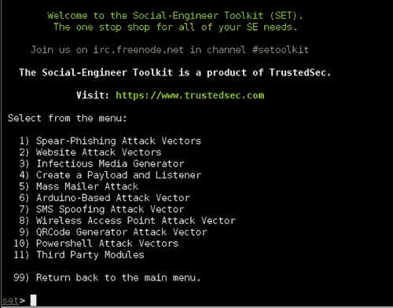
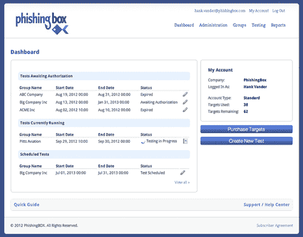
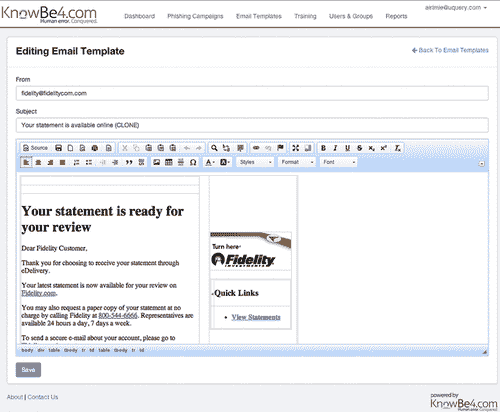
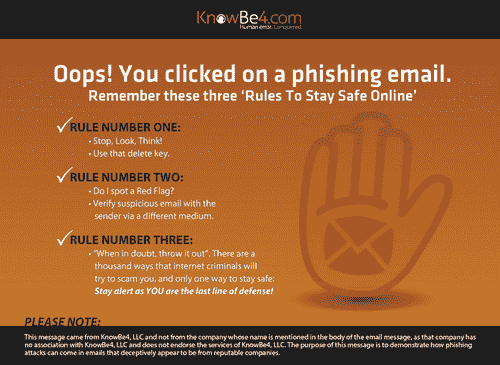

第十一章

# 创建模拟钓鱼攻击

瓦莱丽·托马斯（美国弗吉尼亚州洛顿市 Securicon）

## 摘要

执行模拟钓鱼评估可能是一个令人畏惧的过程。本章详细介绍了逐步进行评估的过程，以解开该过程的神秘面纱。讨论了各种工具和技术，使读者能够为其组织选择最佳的工具和方法。尽管工具和技术是该过程的重要组成部分，但还必须协调其他元素才能执行成功的评估。本章还讨论了模拟钓鱼评估的规划和协调要素。

关键词

钓鱼攻击

模拟钓鱼评估

攻击

协调

报告

## 模拟钓鱼攻击

模拟钓鱼攻击由于多种原因在组织中日益受到欢迎。当正确实施时，模拟钓鱼攻击可以用作培训工具，测试对攻击的抵抗力，并向管理层提供指标。尽管模拟钓鱼攻击很有用，但如果你之前没有创建过，可能会有点吓人。在本章中，我们将逐步介绍这个过程，并讨论一些有助于这一过程的工具。开始进行模拟钓鱼活动可能会让人感到不知所措。请记住，你不是一次测试你组织中的所有人。这些活动或评估可以轻松地分成小组。

## 理解人的因素

钓鱼电子邮件利用各种人类情绪来达到期望的行动[1]。通常，钓鱼电子邮件制造紧迫感，声称如果不立即采取行动，收件人的账户将被禁用。另一种常见的攻击是电子贺卡电子邮件。这种攻击表示有人向用户发送了一张电子贺卡，他们必须点击链接来检索它。诱使员工成为攻击目标的其他策略包括使用他们的名字或发送一封看起来是来自同事的电子邮件。

## 方法论

如果你希望将模拟钓鱼演习纳入你的意识计划中，这是一个高层次的方法论[2]：

■ 建立基准，通过测试所有员工

■ 对所有员工进行培训（使用您选择的技术）

■ 继续测试员工

■ 使用嵌入式或持续的培训向员工进行教育

■ 向管理层报告结果

■ 根据需要进行调整

如果你的组织规模较小，可能需要数周，如果你的组织有数百到数千名员工，则可能需要数月来完成这一系列事件。

## 开源工具、商业工具或供应商执行？

在选择评估工具时有许多因素需要考虑，包括

■ 成本

■ 员工人数

■ 内置培训选项

■ 使用频率

■ 技术要求

■ 使用便利性

■ 长期度量报告

尽管所有这些因素都很重要，但你组织中的员工人数和预算分配通常是最重要的决定因素。

### 开源工具

开源软件/工具是“其源代码可用并获得了版权持有者授权的许可证，使得任何人都可以研究、修改和分发该软件以及任何目的。”简而言之，它几乎是免费的。因此，通常不会保证软件及其对环境的影响。此外，支持通常限于软件/开发者/用户论坛和有限的电子邮件回复。尽管单凭阅读文本可能会令人感到不安，但大多数渗透测试人员、漏洞分析人员和其他网络社区的技术人员使用一个或多个开源工具来完成工作。这些技术人员需要的大多数功能都不是由盈利公司制作的，因此依赖于开源社区。

开源工具中最流行的钓鱼活动工具是由 TrustedSec 的 Dave Kennedy 开发的 Social-Engineer Toolkit (SET)。它被认为是社会工程的“事实标准”(Figure 11.1)。SET 可以安装在网络内或外的机器上，具体取决于您的社会工程场景。

图 11.1 Social-Engineer Toolkit 的主菜单。

优点

除了免费之外，SET 还为钓鱼活动提供了各种资源，包括

■ 克隆现有网站以用作落地页（员工将从钓鱼消息进入/访问的页面）

■ 捕获输入到落地页的密码和其他信息

■ 提示用户从落地页运行程序

■ 配置以利用您组织的电子邮件服务器以便于传递

■ 创建要包含在电子邮件中的附件的能力

■ 与 Metasploit Framework 集成以获取高级测试选项

更新定期发布，广泛的文档可帮助您入门。总的来说，对于技术娴熟的用户来说，SET 是一个非常灵活的工具，可用于开发定制的钓鱼活动。

缺点

尽管 SET 是一个强大的工具，但由于以下几个原因，它可能不适用于所有环境：

■ 必须在 Linux 机器上安装

■ 基于命令行

■ 需要基本的 Apache web 服务器和 Metasploit Framework 知识

■ 工具本身不存储长期指标。必须从报告中记录并保存在其他地方

■ 电子邮件组不存储在工具中，必须单独维护

■ 没有专门的支持中心提供帮助

SET 为用户提供了许多基本和高级的钓鱼活动选项。不熟悉 Linux、Apache 和 Metasploit Framework 的用户可能会发现该工具难以使用。长期用户需要分别跟踪指标、电子邮件组和活动历史。有关 SET 的更多信息，请访问 TrustedSec 的网站[`www.trustedsec.com`](http://www.trustedsec.com)。

### 商业工具

如果您更喜欢基于图形的工具，商业产品可能更适合您。这些产品主要是基于网络的，通过供应商的基础架构进行托管。换句话说，您不需要任何硬件或 Linux 知识即可开始使用。钓鱼活动工具市场正在迅速扩展。一些最受欢迎的供应商包括 KnowBe4、PhishingBox 和 PhishMe。

优点

■ 预配置的电子邮件和着陆页模板。

■ 使用图形工具而不是修改页面源代码来更改着陆页外观的能力。

■ 大多数产品包含为未通过评估的员工提供的内置培训。

■ 产品基于网络，无需安装软件。

■ 许多产品允许您利用您组织的邮件服务器。

■ 提供用户指南和其他文档。

■ 供应商提供问题支持。

缺点

■ 订阅费用

■ 有些产品需要长期合同

■ 通常每年需要最低数量的电子邮件

商业工具还使得同时管理多个评估变得容易。图 11.2 是 PhishingBox 的仪表板。仪表板突出显示正在进行、已计划或等待授权的评估。选择正在进行的评估将为您提供有关已打开多少封电子邮件等最新信息。

图 11.2 PhishingBox 仪表板界面。

使用供应商工具的最大障碍是导入目标电子邮件地址。大多数工具需要电子邮件地址、姓名和部门的特定格式。如果选择使用供应商的电子邮件服务器执行测试，则可能需要与您的电子邮件团队进一步协调，以确保白名单上的供应商服务器以确保邮件传递。

#### 选择商业工具

为了选择最适合您组织的工具，您应该对以下问题（或估计值）有答案：

■ 您的年度预算是多少？

■ 您希望发送多少封电子邮件，以及多频繁？

■ 是否希望为未通过评估的员工提供即时培训材料？

■ 您是否希望在电子邮件中包含附件？

许多供应商提供免费试用许可证和现场演示。考虑抽出时间参加现场演示。这不仅可以让你了解工具的概况，还是你问有关特定功能和功能的问题的机会。在选择之前评估几种不同的工具是很重要的。一些评估标准需要牢记的是

■ 创建活动的简易性

■ 电子邮件和着陆页模板的质量和数量

■ 修改模板的简便性

■ 自动将名字和部门插入电子邮件的能力

■ 创建您自己的电子邮件和着陆页的简易性

■ 报告生成和导出选项

■ 长期指标跟踪

■ 电子邮件组管理

■ 安排电子邮件发送的能力

■ 可用的用户指南和文档

### 由供应商执行

制作钓鱼活动并不适合所有人。如果您的预算支持更昂贵的解决方案，则可以雇佣供应商执行评估。几乎所有宣传钓鱼活动工具的供应商都提供专业服务的钓鱼评估。通常只进行一两次钓鱼评估的组织通常选择此方法。

优点

■ 易于实施。

■ 不需要购买或订阅软件。

■ 许多供应商不需要长期合同。

缺点

■ 最昂贵的解决方案。

■ 长期的度量追踪可能不可用。

■ 取决于供应商的可用性。

尽管供应商将在评估的大部分方面承担大部分工作，但作为客户，您必须提供一些项目，包括目标电子邮件地址列表和电子邮件发送时间表。最重要的是，您的组织必须内部协调，为评估做好准备，以避免安全团队和组织中其他关键职位之间的混淆。

## 准备工作

在这个过程中，运营协调是至关重要的。组织中的关键人员必须在执行钓鱼演习之前得到通知，以防将钓鱼演习误认为是真实攻击。您的首席信息安全官（CISO）必须了解所有计划和活动中的演习。公司的事件响应团队（IRT）的经理/处理程序在执行演习之前应该被通知。经理可以选择通知他们的团队，以防止花费时间和资源进行演习。经理也可以选择不通知他们的团队，以评估他们对攻击的响应。

向公司网络的黑客/渗透报告是非常敏感的事情。大多数人不想承认发生了入侵，并试图保持沉默。尽管这可能会“挽回面子”给公司，但它并不帮助所有公司，因为攻击数据/向量可能会传递给其他行业以防止其他入侵。除非另有明确要求的法律、法规或政策，否则最终的权限通常由公司的首席执行官和/或董事会成员，与公司的法律团队和公共关系办公室合作给出。如果要向外部机构报告事件，请确保高级管理人员参与，并遵守适用的法律/政策。

通知帮助台经理也是一个好的做法，因为他们可能会收到来自目标员工的电话。尽管帮助台经理通知员工进行潜在演习不太常见，但他们可以确保处理可疑电子邮件的程序对员工来说是最新的参考资料。对于帮助台经理报告在演习期间收到的电话和电子邮件数量也很重要。

创建一个带有相关方信息的联系人列表。确保每个主要联系人也有备用联系人。通知可能会因您选择的钓鱼邮件类型而变化。例如，如果您创建了一封看似来自人力资源部的电子邮件，则在进行钓鱼演练之前应该通知人力资源经理。此管理级别通知可以防止员工开始联系原始部门时出现混乱和恐慌。

## 确定攻击目标

模拟攻击可以简单也可以复杂，取决于你的意愿。它们可以设计用来衡量许多结果，包括

■ 仅点击，

■ 点击并在登陆页面输入信息，

■ 点击并在登陆页面输入密码，

■ 打开附件。

如果您的组织尚未进行模拟攻击，则仅点击目标是一个很好的起点。

## 选择收件人

首先选择要评估的员工将有助于确定您想要执行的攻击类型。员工可以分成组以便管理。如果您的组织跨越多个时区，请确保将员工分组在相似的时区内。非工作时间收到的电子邮件可能被视为可疑。对于非技术性员工，一般或公司特定类型的攻击最有可能导致点击。对于更有技术性的员工，针对性的钓鱼攻击更有可能导致点击。

## 选择钓鱼攻击类型

正如前面讨论的那样，钓鱼邮件利用人类情感欺骗受害者。这基本上意味着在选择电子邮件主题时可以做到百花齐放。

### 一般

一般的钓鱼攻击可以用来针对组织中的任何人。这些类型的电子邮件是您的前几封电子邮件的一个很好的起点。一些主题如下：

■ 您的包裹已发货！点击此处跟踪交付进度。

■ 任何寻求捐款的慈善机构。

■ 有人给您发送了一张电子卡！点击此处检索。

这些示例中的许多示例可以在全年利用，但最适合用于使用卡片的假期，例如情人节和十一月至十二月。许多购买的解决方案都有内置的通用消息，以帮助您入门。

### 公司特定

当进行组织网络的渗透测试时，道德黑客通常使用这些类型的攻击。原因很简单，这些攻击易于构建，并且大部分时间都有效。它们不仅在渗透测试中有效，在现实生活中也有效。攻击者可以在最短的时间内定位公司的网站或关联合作伙伴，例如

■ 计时软件供应商或网站，

■ 基于网页的电子邮件网站，

■ 基于网页的 VPN 网站，

■ 健康福利提供商。

这些网站的信息可以被用来模仿合法的电子邮件。此外，这些网站本身也可以被复制，以诱使员工在点击钓鱼邮件中的链接后输入信息，比如他们的用户名和密码。

### 针对性钓鱼

据软件公司趋势科技称，91% 的网络攻击都始于针对单个人或组织内的少数员工的钓鱼邮件[3]。钓鱼邮件的目标是单个人或组织内的小群体。攻击者会从多个来源搜索信息，以推断员工的工作职能以及他们与哪些公司、个人或团体有关联，从而制造一个可信的攻击。一封钓鱼邮件

■ 以收件人姓名称呼，

■ 看起来是由收件人熟悉的人或供应商发送的，

■ 包含带有商标和联系信息的适当签名块，

■ 通常包含一个被感染的附件，

■ 可以包含一个类似发送者的网站链接（[abcbank.com](http://abcbank.com) 而不是 [abc-bank.com](http://abc-bank.com)）

虽然其他钓鱼邮件是大量发送的，但针对少数员工的钓鱼邮件通常少于五封。然而，额外的研究时间通常会产生回报，因为钓鱼邮件的成功率最高。

## 撰写电子邮件

一旦您选择了目标群体和电子邮件类型，就该开始创建电子邮件内容了。以下是创建逼真钓鱼邮件的一些关键要素：

■ 使用引人注目的主题。

■ 在消息正文中营造紧急感，以激励收件人采取行动。

■ 包含商标和其他适用的图片。

■ 确保发件人的姓名和电子邮件地址与您的电子邮件主题相匹配。

■ 如果您的电子邮件看起来来自某个人，请包含完整的签名块。

■ 对于看起来是自动生成的电子邮件，在电子邮件结尾包含隐私声明。

如果您使用供应商工具，可以在图形编辑器中编辑电子邮件外观。图 11.3 是供应商 KnowBe4 的撰写工具的屏幕截图。此特定模板包含一个登陆页面（链接被点击后浏览器会跳转到该页面），显示在右侧。如果您使用 SET，电子邮件内容需要是带有适当 HTML 标签格式的纯文本。

图 11.3 KnowBe4 的电子邮件撰写界面。

### 格式化链接

除非您在发送附件的攻击，否则您的电子邮件将包含一个供员工点击的链接。链接的外观或统一资源定位符（URL）在评估中扮演着重要角色。如果 URL 看起来可疑或拼写错误，员工就不太可能点击。

图形编辑工具允许您轻松修改 URL 的显示文本，使其显示为[`abc.com`](http://abc.com)，但一旦点击就会转到[`cba.com`](http://cba.com)。使用此技术将教育您的员工如何修改 URL 以及如何在点击之前验证链接的真实目的地。

## 创建着陆页

如果员工点击了附带的链接（图 11.4），他们将被引导到着陆页。如果您的评估目标是记录点击的员工人数，则这是一个理想的机会，可以显示一条消息，通知员工进行了模拟钓鱼评估，并提供培训材料。

图 11.4 KnowBe4 的基本着陆页。

如果攻击的目标是确定员工是否会点击并输入信息，则着陆页必须有可接受输入的区域。最常见的输入是帐户密码；但是，您可以自定义着陆页以适应攻击目标。所有商业工具都有接受输入的着陆页选择。如果您想使用属于您组织的网页，则大多数工具都有导入功能。提供了 URL 后，SET 将克隆一个网站。

## 发送电子邮件

现在您已经创建了收件人列表、电子邮件和着陆页，还有一些质量控制步骤需要在按下发送按钮之前执行：

■ 通过将钓鱼电子邮件发送给自己，测试电子邮件在您的电子邮件客户端和网络客户端（如果适用）中的外观。

■ 点击附带的链接以测试着陆页。如果您的组织使用多个浏览器，则在所有批准的浏览器中进行测试。

■ 如前文所述，通知联系人列表中的相关方。包括电子邮件、着陆页和培训页面（如果适用）的屏幕截图。还包括发送电子邮件的日期和时间。

### 时间就是一切

当发送电子邮件时，它们将极大地影响您评估的结果。理想情况下，电子邮件应在员工可能在上午或下午在办公桌前的时间发送。此外，当安排电子邮件交付时，请记住您的收件人处于哪个时区。

每个人偶尔都需要度假。如果联系人列表中有任何人在评估期间度假，请务必在发送任何电子邮件之前让他们的备用联系人参与。此外，负责发送电子邮件并跟踪其进度的人员需要提供帮助。不要在开始练习后的第二天就不在办公室。

## 跟踪结果

所有工具，商业和开源，都具有跟踪功能，以帮助您监控评估的状态。虽然个别跟踪功能可能有所不同，但大多数工具都会指示

■ 电子邮件是否被打开，

■ 接收者是否点击了链接，

■ 是否在着陆页中输入了信息，

■ 如果链接被点击超过一次。

商业工具将为每次评估存储结果信息，以便在额外评估后进行比较报告。SET 不存储结果信息，因此记录将需要单独跟踪，很可能是在电子表格中。在向管理层和其他相关方报告结果时，比较报告是关键，以表明后续培训的有效性。

结果跟踪不仅包括点击次数。其他重要的跟踪结果包括

■ 帮助台电话报告电子邮件，

■ 收到的报告电子邮件报告给安全部门，

■ 向安全部门的电话，

■ 涉及部门的电话，如人力资源

不当的报告表明员工不熟悉在收到可疑消息后应遵循的程序。培训程序可以进行调整以强化正确的程序。

## 评估后跟进

一旦评估完成并记录了所有结果，请与联系列表中的人员进行事后会议。讨论评估结果以及是否有任何意外结果。利用这些信息对程序和未来评估的联系列表进行更改。

## 注意

[1] 开源软件定义 [`en.wikipedia.org/wiki/Open-source_software`](http://en.wikipedia.org/wiki/Open-source_software) [于 2014 年 5 月 26 日访问]。

[2] 高效员工钓鱼培训的七个习惯 [`threatsim.com/resources/whitepaper-seven-habits-phishing`](http://threatsim.com/resources/whitepaper-seven-habits-phishing) [于 2014 年 2 月 12 日访问]。

[3] 令人震惊：失败点钓鱼培训无效 [`blog.knowbe4.com/bid/371048/SHOCKER-Point-Of-Failure-Phishing-Training-Does-Not-Work`](http://blog.knowbe4.com/bid/371048/SHOCKER-Point-Of-Failure-Phishing-Training-Does-Not-Work) [于 2014 年 2 月 17 日访问]。

[4] 91%的网络攻击始于针对特定目标的钓鱼邮件 [`news.techworld.com/security/3413574/91-of-cyberattacks-begin-with-spear-phishing-email/`](http://news.techworld.com/security/3413574/91-of-cyberattacks-begin-with-spear-phishing-email/) [于 2014 年 2 月 17 日访问]。
