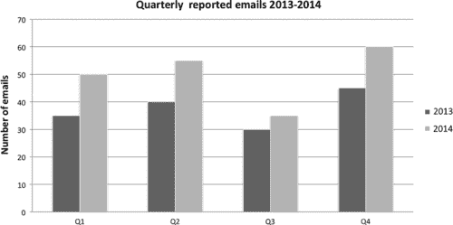
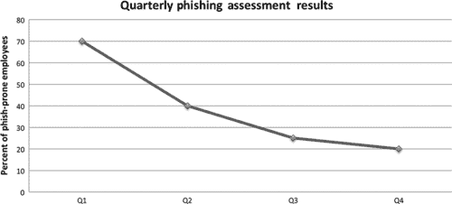
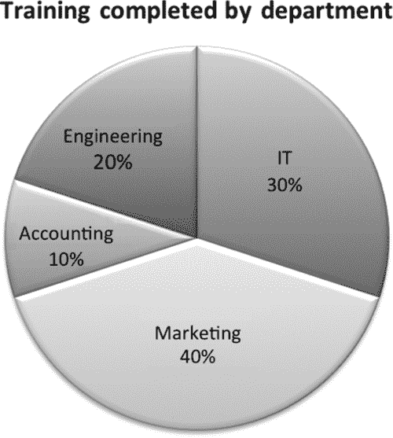

# 第十三章：评估有效性

瓦莱丽·托马斯（美国弗吉尼亚州洛顿 Securicon）

## 摘要

评估意识计划的有效性可能具有挑战性，特别是对于那些没有风险管理背景的人。本章涵盖了选择有价值的测量和创建可用指标。详细讨论了正确报告和呈现指标，因为这对于获得高级管理层的理解和支持至关重要。

关键词

测量

指标

指标计划

图表

报告

## 评估有效性

意识计划经常被忽视的一个部分是跟踪进展和衡量影响的方法。这些指标应该用作调整计划和向高级管理层报告进展的指南。如果您的组织有一个风险管理团队，请与他们就他们当前的指标计划进行咨询。很可能他们收集的部分数据可以用于意识培训指标。

## 测量 vs. 指标

这些信息类型经常可以互换使用；然而，它们并不相同。

测量是在特定时间确定的数值，由计数生成[1]。一个测量的例子是上个月报告的感染计算机数量。

指标是通过对测量进行分析生成的。指标是对比在一定时间内进行的两个或多个测量，并与预定基线进行比较[1]。例如，感染计算机数量在第二季度比第一季度增加了 5%。可用的指标取决于准确的测量。

## 创建指标

成功的指标计划包括定义明确的测量和获取这些测量所需的步骤。记录所需测量和负责人员是关键。以下示例来自 SANS 社区网站[2]。许多意识计划资源可供使用，包括一个样本指标矩阵，网址为[`www.securingthehuman.org/resources/security-awareness-roadmap/`](https://www.securingthehuman.org/resources/security-awareness-roadmap/)。每个指标至少应包含以下部分。

### 指标名称

指标名称应该是可以从一个或多个类型的测量中计算出来的高级主题。在这个例子中，我们将使用钓鱼检测。

### 什么被测量

测量是客观原始数据，意味着不需要人类解释来获得测量值。钓鱼检测的一个测量是报告给安全团队的可疑电子邮件数量。这个测量旨在评估遵循适当程序报告可疑消息的员工数量。虽然这个测量本身就足够了，但额外的测量可以提供更多见解。测量关于可疑电子邮件的帮助台电话或电子邮件的数量也可能有用，因为它可以指示未遵循适当程序的员工数量。

收集的测量数据数量没有限制。与评估相关的钓鱼检测的一些附加测量数据包括

■ 发送的电子邮件数量

■ 打开的电子邮件数量

■ 点击链接的员工人数

■ 输入信息的员工人数

### 测量方式

获得钓鱼检测测量数据的常见方法是进行评估。继续以钓鱼检测为例，应在每次钓鱼评估结束时收集报告给安全部门的可疑电子邮件数量（图 13.1）。如果您使用商业工具，则每次评估发送的电子邮件数量可从报告屏幕中获取。

图 13.1 PhishingBox 的报告菜单。

### 测量时间

钓鱼演习的测量数据应该在每次评估结束时获得。如果您的组织进行半年度评估，则应每半年收集数据。然而，并非所有报告的电子邮件都与评估相关。因此，非评估数据应每月收集一次。

### 谁来衡量

此指标存在多个信息来源。安全团队收集收到的可疑电子邮件数量。评估联系点收集与钓鱼评估相关的数据。帮助台收集有关钓鱼电子邮件的电子邮件和电话数量。

## 附加测量

现在我们已经介绍了一个示例，这里是一些其他有用的测量数据：

■ 感染机器的数量

■ 完成意识培训的员工人数

■ 午餐和学习参与者人数

■ 安全意识网站的点击量

■ 发送给安全组的一般问题电子邮件数量

■ 一年中员工的测试成绩

■ 在公共区域留下的敏感文件数量

■ 未锁定的未监视计算机数量

■ 在建筑外佩戴徽章的员工人数

如果您的意识计划是新的，那么您的测量可能更多地关注部署。即使您的意识计划尚未完全实施，收集运营测量数据也很重要，以展示随时间的改进。

## 报告指标

指标旨在为观众提供做出决策所需的信息。然而，如果指标呈现不当，它们将被视为无效，并对意识计划产生负面影响。正确呈现指标的秘诀在于了解目标受众。

一个受欢迎的演示风格是分层方法[3]。在顶层，高级管理层对提供有关程序成熟度、成本和效益的高层信息感兴趣。向他们展示，认知计划对组织整体安全文化产生了积极影响是至关重要的。中间层，中层管理层，需要部门级别的信息来评估绩效水平和潜在的业务影响。最低层由认知计划经理和人员组成。该层需要详细的信息以调整节目内容以获得更好的性能。

### 建立您的演示

一旦确定了您的观众并选择了合适的度量标准，就该建立您的演示文稿了。演示指标的一些关键要素包括以下内容：

#### 介绍

提供该程序的简短介绍。如果该程序正在部署中，请简要介绍部署计划、关键里程碑和迄今取得的成就。

#### 指标的来源

在高层次解释获得了哪些测量值以及它们是如何收集的。时间是决策的重要因素，因此还要包括测量值是多频繁获得的。

#### 指标

如上所述，只包括对您的观众相关的指标。图表是最受欢迎的指标报告样式。但是，只有在图表以有意义的方式描述数据时才有用。选择适合您数据的正确类型的图表是必不可少的。图表的三个主要类别是比较、转换和构成[4]。

比较图表最适合识别数字的高低点。过去两年每个季度报告的可疑电子邮件数量最好以这种格式表示（图 13.2）。聚类柱状图和柱状图是最受欢迎的表示方式。

图 13.2 聚类柱状图。

转换图表非常适合基于时间的数据以了解变化速率。安全意识网站的访问次数以及陷入钓鱼演习的员工数量都是转换图表的优秀候选者（图 13.3）。线形图和面积图最适合表示这种类型的数据。

图 13.3 带数据点的折线图。

组成图表表示数据值如何分解为各个部分。每个部门完成的意识培训最好以组成图表的形式表示。许多钓鱼评估细节也可以以这种方式呈现。打开钓鱼邮件的员工比例，点击附件链接的员工比例以及未打开邮件的员工比例可以在组成图表中表示(图 13.4)。饼图是这种数据类型的最流行的表示形式；然而，也可以使用堆积条形图。

图 13.4 百分比饼图。

使用基本的颜色，在彩色和灰度模式下都易于识别。虽然充满活力的颜色选择很诱人，但如果投影出去往往很难看清楚。最重要的是，保持幻灯片和报告部分简单。一张幻灯片应该只讨论一个主题。在一张幻灯片上混合不同的主题和指标经常会分散观众的注意力，使演示变得难以理解。

## 注意

[1] 安全度量指南 [`www.docstoc.com/docs/7264928/Guide-to-Security-Metrics-SHIRLEY-C-PAYNE-DIRECTOR-IT/`](http://www.docstoc.com/docs/7264928/Guide-to-Security-Metrics-SHIRLEY-C-PAYNE-DIRECTOR-IT/).

[2] 安全意识路线图 [`www.securingthehuman.org/resources/security-awareness-roadmap/`](https://www.securingthehuman.org/resources/security-awareness-roadmap/).

[3] 为有效的信息安全治理制定指标 [`www.isaca.org/Journal/Past-Issues/2007/Volume-2/Pages/Developing-Metrics-for-Effective-Information-Security-Governance1.aspx`](http://www.isaca.org/Journal/Past-Issues/2007/Volume-2/Pages/Developing-Metrics-for-Effective-Information-Security-Governance1.aspx).

[4] 选择适合您数据的正确图表类型，[`www.tutorial9.net/tutorials/web-tutorials/selecting-the-right-chart-type-for-your-data/`](http://www.tutorial9.net/tutorials/web-tutorials/selecting-the-right-chart-type-for-your-data/).
