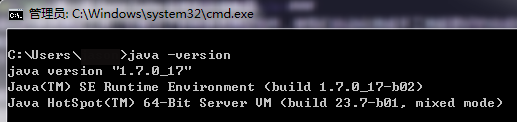

# 第一章 Burp Suite 安装和环境配置

### 第一章 Burp Suite 安装和环境配置

Burp Suite 是一个集成化的渗透测试工具，它集合了多种渗透测试组件，使我们自动化地或手工地能更好的完成对 web 应用的渗透测试和攻击。在渗透测试中，我们使用 Burp Suite 将使得测试工作变得更加容易和方便，即使在不需要娴熟的技巧的情况下，只有我们熟悉 Burp Suite 的使用，也使得渗透测试工作变得轻松和高效。

Burp Suite 是由 Java 语言编写而成，而 Java 自身的跨平台性，使得软件的学习和使用更加方便。Burp Suite 不像其他的自动化测试工具，它需要你手工的去配置一些参数，触发一些自动化流程，然后它才会开始工作。

Burp Suite 可执行程序是 java 文件类型的 jar 文件，免费版的可以从[免费版下载地址](https://portswigger.net/burp/downloadfree.html)进行下载。免费版的 Burp Suite 会有许多限制，很多的高级工具无法使用，如果您想使用更多的高级功能，需要付费购买专业版。专业版与免费版的主要区别有

1.  Burp Scanner
2.  工作空间的保存和恢复
3.  拓展工具，如 Target Analyzer, Content Discovery 和 Task Scheduler

本章主要讲述 Burp Suite 的基本配置，包含如下内容：

*   如何从命令行启动 Burp Suite</br>
*   如何设置 JVM 内存 大小</br>
*   IPv6 问题调试

#### 如何从命令行启动 Burp Suite

Burp Suite 是一个无需安装软件，下载完成后，直接从命令行启用即可。但 Burp Suite 是用 Java 语言开发的，运行时依赖于 JRE，需要提前 Java 可运行环境。如果没有配置 Java 环境或者不知道如何配置的童鞋请参考[win7 电脑上的 Java 环境配置](http://jingyan.baidu.com/article/925f8cb836b26ac0dde0569e.html) 配置完 Java 环境之后，首先验证 Java 配置是否正确，如果输入 java -version 出现下图的结果，证明配置正确且已完成。  这时，你只要在 cmd 里执行 java -jar /your_burpsuite_path/burpSuite.jar 即可启动 Burp Suite,或者，你将 Burp Suite 的 jar 放入 class_path 目录下，直接执行 java -jar burpSuite.jar 也可以启动。

==注意：your_burpsuite_path 为你 Burp Suite 所在路径，burpSuite.jar 文件名必须跟你下载的 jar 文件名称一致==

#### 如何设置 JVM 内存 大小

如果 Java 可运行环境配置正确的话，当你双击 burpSuite.jar 即可启动软件，这时，Burp Suite 自己会自动分配最大的可用内存，具体实际分配了多少内存，默认一般为 64M。当我们在渗透测试过程，如果有成千上万个请求通过 Burp Suite，这时就可能会导致 Burp Suite 因内存不足而崩溃，从而会丢失渗透测试过程中的相关数据，这是我们不希望看到的。因此，当我们启动 Burp Suite 时，通常会指定它使用的内存大小。 一般来说，我们通常会分配 2G 的内存供 Burp Suite 使用，如果你的电脑内存足够，可以分配 4G；如果你的电脑内存足够小，你也可以分配 128M。当你给 Burp Suite 分配足够多的内存时，它能做的工作也会更多。指定 Burp Suite 占用内存大小的具体配置方法是在启动脚本里添加如下命令行参数： 假设启动脚本的名称为 burp_suite_start.bat，则该 bat 脚本的内容为

```
java -jar -Xmx2048M  /your_burpsuite_path/burpsuite.jar 
```

其中参数-Xmx 指定 JVM 可用的最大内存，单位可以是 M，也可以是 G，如果是 G 为单位的话，则脚本内容为：

```
java -jar -Xmx2G  /your_burpsuite_path/burpsuite.jar 
```

*更多关于 JVM 性能调优的知识请阅读 [Oracle JVM Tuning](https://docs.oracle.com/cd/E13222_01/wls/docs81/perform/JVMTuning.html)*

#### IPv6 问题调试

Burp Suite 是不支持 IPv6 地址进行数据通信的，这时在 cmd 控制台里就会抛出如下异常

```
java.net.SocketException: Permission denied 
```

同时，浏览器访问时，也会出现异常

```
Burp proxy error: Permission denied: connect 
```

当出现如上问题时，我们需要修改启动脚本，添加对 IPv4 的指定后，重启 Burp Suite 即可。

```
java -jar -Xmx2048M  -Djava.net.preferIPv4Stack=true  /your_burpsuite_path/burpsuite.jar 
```

通过 -Djava.net.preferIPv4Stack=true 参数的设置，告诉 Java 运行环境，使用 IPv4 协议栈进行数据通信，IPv6 协议将会被禁止使用。 这个错误最常见于 64 位的 windows 操作系统上，使用了 32 位的 JDK