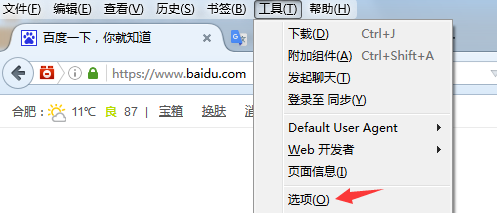

# 第二章 Burp Suite 代理和浏览器设置

### 第二章 Burp Suite 代理和浏览器设置

Burp Suite 代理工具是以拦截代理的方式，拦截所有通过代理的网络流量，如客户端的请求数据、服务器端的返回信息等。Burp Suite 主要拦截 http 和 https 协议的流量，通过拦截，Burp Suite 以中间人的方式，可以对客户端请求数据、服务端返回做各种处理，以达到安全评估测试的目的。

在日常工作中，我们最常用的 web 客户端就是的 web 浏览器，我们可以通过代理的设置，做到对 web 浏览器的流量拦截，并对经过 Burp Suite 代理的流量数据进行处理。

下面我们就分别看看 IE、Firefox、Google Chrome 下是如何配置 Burp Suite 代理的。

#### IE 设置

当 Burp Suite 启动之后，默认分配的代理地址和端口是 127.0.0.1 ：8080,我们可以从 Burp Suite 的 proxy 选项卡的 options 上查看。如图：  现在，我们通过如下步骤的设置即可完成 IE 通过 Burp Suite 代理的相关配置。

1.  启动 IE 浏览器
2.  点击【工具】菜单，选择【Internet】选项 
3.  打开【连接】选项卡，点击【局域网设置】，进行代理设置。 
4.  在代理服务器设置的地址输入框中填写 127.0.0.1,端口填写 8080，点击【确定】，完成代理服务器的设置。 
5.  这时，IE 的设置已经完成，你可以访问 [`burp`](http://burp) 将会看到 Burp Suite 的欢迎界面。 

#### FireFox 设置

与 IE 的设置类似，在 FireFox 中，我们也要进行一些参数设置，才能将 FireFox 浏览器的通信流量，通过 Burp Suite 代理进行传输。详细的步骤如下：

1.  启动 FireFox 浏览器，点击【工具】菜单，点击【选项】。 
2.  在新打开的 about:preferences#advanced 窗口中，依次点击【高级】-【网络】，我们将会看到 FireFox 连接网络的设置选项。 
3.  点击【设置】，在弹出的【连接设置】对话框中，找到“http 代理”，填写 127.0.0.1，端口填写 8080，最后点击【确认】保存参数设置，完成 FireFox 的代理配置。  当然，FireFox 浏览器中，可以添加 FireFox 的扩展组件，对代理服务器进行管理。例如 FireX Proxy、Proxy Swither 都是很好用的组件，感兴趣的读者可以自己下载试用一下。

#### Google Chrome 设置

Google Chrome 使用 Burp Suite 作为代理服务器的配置步骤如下：

1.  启动 Google Chrome 浏览器，在地址栏输入 chrome://settings/，回车后即显示 Google Chrome 浏览器的配置界面 
2.  点击底部的【显示高级设置】，将显示 Google Chrome 浏览器的高级设置。 
3.  当然，你也可以直接在搜索框中输入“代理”，回车后将自动定位到代理服务器设置功能。 
4.  点击【更改代理服务器设置】，windows 系统下将会弹出 IE 浏览器的代理设置，此时，按照 IE 浏览器的设置步骤，完成代理服务器的配置即可。

除了上述的三种常用的浏览器外，还有 Safari 浏览器也有不少的用户在使用，其代理配置请[点击阅读](http://jingyan.baidu.com/article/a378c960849144b3282830dc.html)进行查看。