# 第三章 如何使用 Burp Suite 代理

### 第三章 如何使用 Burp Suite 代理

Burp Proxy 是 Burp Suite 以用户驱动测试流程功能的核心，通过代理模式，可以让我们拦截、查看、修改所有在客户端和服务端之间传输的数据。

本章主要讲述以下内容：

*   Burp Proxy 基本使用
*   数据拦截与控制
*   可选项配置 Options
*   历史记录 History

* * *

#### Burp Proxy 基本使用

通过上一章的学习，我们对 Burp Suite 代理模式和浏览器代理设置有了基本的了解。Burp Proxy 的使用是一个循序渐进的过程，刚开始使用时，可能并不能很快就获取你所期望的结果，慢慢地当你熟悉了它的功能和使用方法，你就可以用它很好地对一个产品系统做安全能力评估。 一般使用 Burp Proxy 时，大体涉及环节如下：

1.  首先，确认 JRE 已经安装好，Burp Suite 可以启动并正常运行，且已经完成浏览器的代理服务器配置。
2.  打开 Proxy 功能中的 Intercept 选项卡，确认拦截功能为“Interception is on”状态，如果显示为“Intercept is off”则点击它，打开拦截功能。 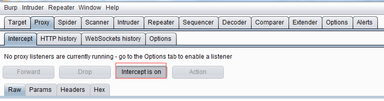
3.  打开浏览器，输入你需要访问的 URL（以[`baike.baidu.com/`](http://baike.baidu.com/)为例）并回车，这时你将会看到数据流量经过 Burp Proxy 并暂停，直到你点击【Forward】，才会继续传输下去。如果你点击了【Drop】，则这次通过的数据将会被丢失，不再继续处理。
4.  当我们点击【Forward】之后，我们将看到这次请求返回的所有数据。 
5.  当 Burp Suite 拦截的客户端和服务器交互之后，我们可以在 Burp Suite 的消息分析选项卡中查看这次请求的实体内容、消息头、请求参数等信息。消息分析选项视图主要包括以下四项： 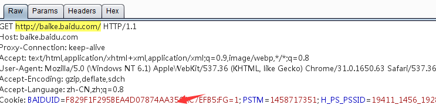
6.  Raw 这是视图主要显示 web 请求的 raw 格式，包含请求地址、http 协议版本、主机头、浏览器信息、Accept 可接受的内容类型、字符集、编码方式、cookie 等。你可以通过手工修改这些信息，对服务器端进行渗透测试。
7.  params 这个视图主要显示客户端请求的参数信息、包括 GET 或者 POST 请求的参数、Cookie 参数。渗透人员可以通过修改这些请求参数来完成对服务器端的渗透测试。
8.  headers 这个视图显示的信息和 Raw 的信息类似，只不过在这个视图中，展示得更直观、友好。
9.  Hex 这个视图显示 Raw 的二进制内容，你可以通过 hex 编辑器对请求的内容进行修改。

默认情况下，Burp Proxy 只拦截请求的消息，普通文件请求如 css、js、图片是不会被拦截的，你可以修改默认的拦截选项来拦截这些静态文件，当然，你也可以通过修改拦截的作用域、参数或者服务器端返回的关键字来控制 Burp Proxy 的消息拦截，这些在后面的章节中我们会进一步的学习。 所有流经 Burp Proxy 的消息，都会在 http history 记录下来，我们可以通过历史选项卡，查看传输的数据内容，对交互的数据进行测试和验证。同时，对于拦截到的消息和历史消息，都可以通过右击弹出菜单，发送到 Burp 的其他组件，如 Spider、Scanner、Repeater、Intruder、Sequencer、Decoder、Comparer、Extender，进行进一步的测试。如下图所示： 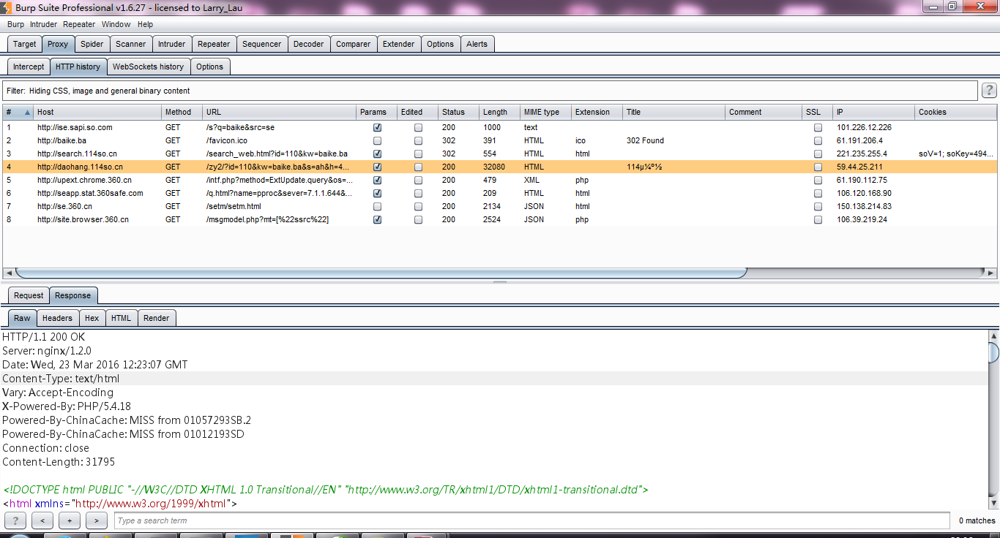

* * *

#### 数据拦截与控制

Burp Proxy 的拦截功能主要由 Intercept 选项卡中的 Forward、Drop、Interception is on/off、Action、Comment 以及 Highlight 构成，它们的功能分别是： **Forward**的功能是当你查看过消息或者重新编辑过消息之后，点击此按钮，将发送消息至服务器端。 **Drop**的功能是你想丢失当前拦截的消息，不再 forward 到服务器端。 **Interception is on**表示拦截功能打开，拦截所有通过 Burp Proxy 的请求数据；**Interception is off**表示拦截功能关闭，不再拦截通过 Burp Proxy 的所有请求数据。 **Action**的功能是除了将当前请求的消息传递到 Spider、Scanner、Repeater、Intruder、Sequencer、Decoder、Comparer 组件外，还可以做一些请求消息的修改，如改变 GET 或者 POST 请求方式、改变请求 body 的编码，同时也可以改变请求消息的拦截设置，如不再拦截此主机的消息、不再拦截此 IP 地址的消息、不再拦截此种文件类型的消息、不再拦截此目录的消息，也可以指定针对此消息拦截它的服务器端返回消息。 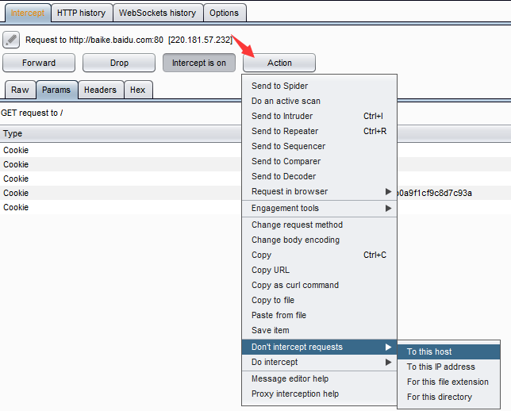 **Comment**的功能是指对拦截的消息添加备注，在一次渗透测试中，你通常会遇到一连串的请求消息，为了便于区分，在某个关键的请求消息上，你可以添加备注信息。 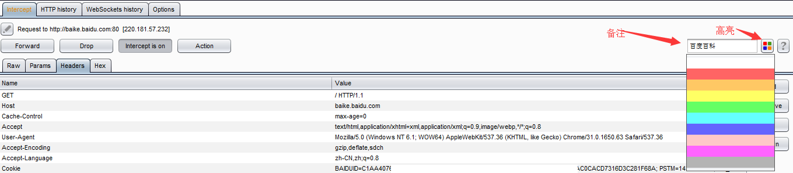 **Highlight**的功能与 Comment 功能有点类似，即对当前拦截的消息设置高亮，以便于其他的请求消息相区分。 

除了 Intercept 中可以对通过 Proxy 的消息进行控制外，在可选项设置选项卡 Options 中也有很多的功能设置也可以对流经的消息进行控制和处理。

#### 可选项配置 Options

当我们打开可选项设置选项卡 Options，从界面显示来看，主要包括以下几大板块（涉及 https 的功能不包含在本章内容里，后面会一章专门叙述）：

*   客户端请求消息拦截
*   服务器端返回消息拦截
*   服务器返回消息修改
*   正则表达式配置
*   其他配置项

##### 客户端请求消息拦截

客户端请求消息拦截是指拦截客户端发送到服务器端消息的相关配置选项，其界面如下： 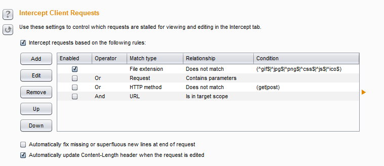 主要包含拦截规则配置、错误消息自动修复、自动更新 Content-Length 消息头三个部分。

1.  如果 intercept request based on the follow rules 的 checkbox 被选中，则拦截所有符合勾选按钮下方列表中的请求规则的消息都将被拦截，拦截时，对规则的过滤是自上而下进行的。当然，我们可以根据自己的需求，通过【Up】和【Down】按钮，调节规则所在位置和排序。同时，我们可以点击【Add】添加一条规则，也可以选中一条规则，通过点击【Edit】进行编辑、点击【Remove】进行删除。当我们点击【Add】按钮时，会弹出规则添加的输入对话框，如下图： 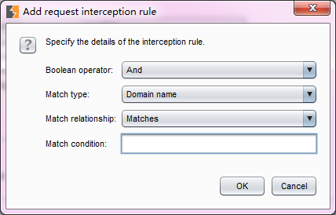 拦截规则添加时，共包含 4 个输入项。Boolean opertor 表示当前的规则与其他规则是与的方式（And）还是或的方式（Or）共存；Match type 表示匹配类型，此处匹配类型可以基于域名、IP 地址、协议、请求方法、URL、文件类型、参数, cookies, 头部或者内容, 状态码, MIME 类型, HTML 页面的 title 等。Match relationship 表示此条规则是匹配还是不匹配 Match condition 输入的关键字。当我们输入这些信息，点击【OK】按钮，则规则即被保存。
2.  如果 Automatically fix missing 的 checkbox 被选中，则表示在一次消息传输中，Burp Suite 会自动修复丢失或多余的新行。比如说，一条被修改过的请求消息，如果丢失了头部结束的空行，Burp Suite 会自动添加上；如果一次请求的消息体中，URl 编码参数中包含任何新的换行，Burp Suite 将会移除。此项功能在手工修改请求消息时，为了防止错误，有很好的保护效果。
3.  如果 Automatically update Content-Length 的 checkbox 被选中，则当请求的消息被修改后，Content-Length 消息头部也会自动被修改，替换为与之相对应的值。

##### 服务器端返回消息拦截

服务器端返回消息拦截顾名思义是指拦截服务器端返回的消息的相关配置项，其界面如下： 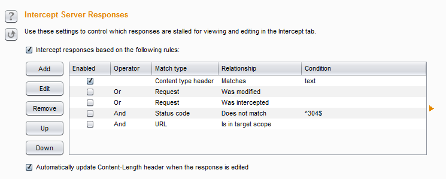 它的功能主要包含 intercept response based on the follow rules 和 Automatically update Content-Length header when the response edited 两个选项，其功能分别与客户端请求消息拦截中的 intercept request based on the follow rules、Automatically update Content-Length header when the request edited 相对应，就不在赘述，请参上一节的内容。

##### 服务器返回消息修改

服务器返回消息修改是指自动修改服务器端返回消息的相关设置项。其界面如下： 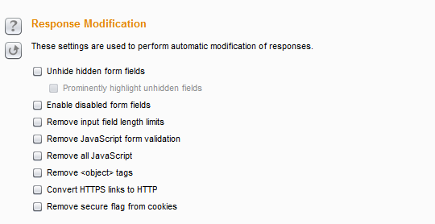 自上而下，每一个选择项分别对应的功能是

*   显示 form 表单中隐藏字段
*   高亮显示 form 表单中隐藏字段
*   使 form 表单中的 disable 字段生效，变成可输入域
*   移除输入域长度限制
*   移动 JavaScript 验证
*   移动所有的 JavaScript
*   移除
*   转换 https 超链接为 http 链接
*   移除所有 cookie 中的安全标志

通过服务器返回消息修改可选择项的设置，可以方便渗透测试人员在安全评估过程中突破原有的数据限制，更好、更快地检测服务器端的安全性。

#### 正则表达式配置

此项配置主要用来自动替换请求消息和服务器端返回消息中的某些值和文本，它与前文的规则的不同之处还在于支持正则表达式语言。 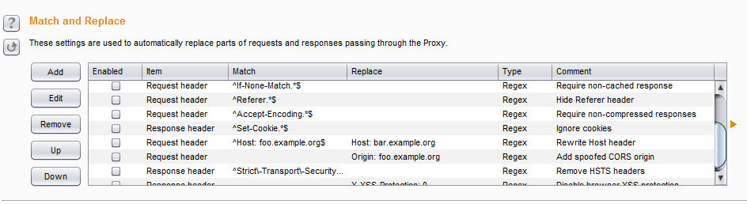 当点击【Add】按钮时，在弹出的匹配或替换规则输入对话框中我们可以看到，它可以对请求和返回消息的消息头，消息体、请求参数名、请求参数值、请求的第一行进行匹配和替换。例如，当我们要替换所有返回消息中的邮箱地址为 t0data@burpsuite.com 时，可以参考下图的设置填写输入项并保存验证。 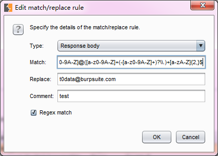

#### 其他配置项

其他配置项主要是杂项设置。其界面如下： 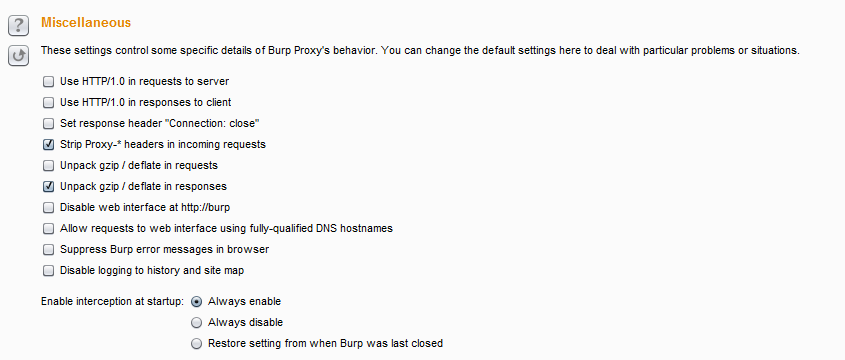 自上而下依次的功能是

*   指定使用 HTTP/1.0 协议与服务器进行通信 这项设置用于强制客户端采用 HTTP/1.0 协议与服务器进行通信，一般客户端使用的 HTTP 协议版本依赖于客户端浏览器，但某些服务器或者应用，必须使用 HTTP/1.0 协议，此时可勾选此项

*   指定使用 HTTP/1.0 协议反馈消息给客户端 目前所有的浏览器均支持 HTTP/1.0 协议和 HTTP/1.1 协议，强制指定 HTTP/1.0 协议主要用于显示浏览器的某些方面的特征，比如，阻止 HTTP 管道攻击。

*   设置返回消息头中的“Connection：close” 可用于某些情况下的阻止 HTTP 管道攻击。

*   请求消息头中脱掉 Proxy-* 浏览器请求消息中，通常会携带代理服务器的相关信息，此选项主要用于清除消息头中的代理服务器信息。

*   解压请求消息中的压缩文件 某些应用在与服务器端进行交互时，会压缩消息体，勾选此选项，则 Burp Suite 会自动解压消息体

*   解压返回消息中的压缩文件 大多数浏览器支持压缩的消息体，勾选此选项，则 Burp Suite 会自动解压被服务器端压缩的消息体

*   禁用[`burp`](http://burp)

*   允许通过 DNS 和主机名访问 web 接口 即允许通过域名或主机名访问 Burp Suite

*   不在浏览器中显示 Burp Suite 错误 在我们使用 Burp Suite 时，如果发生了 Burp Suite 自身的错误，会在浏览器中显示，如果勾选了此项，则不会在浏览器中显示此类错误。

*   禁用日志到历史和网站地图中 此选项的作用是阻止记录日志到历史和网站地图，在某些情况下可能有用，比如说，通过上游服务器进行认证或者做正则表达式替换时，为了降低内存的消耗，减少日志的储存，你可以勾选此项。

*   拦截功能开始设置
    这个选项主要用来配置 intercept 功能的生效方式，分为总是生效、 总是失效 、从上一次的 Burp Suite 中恢复设置 3 种方式。

#### 历史记录 History

* * *

Burp Proxy 的历史记录由 HTTP 历史和 WebSockets 历史两个部分组成。 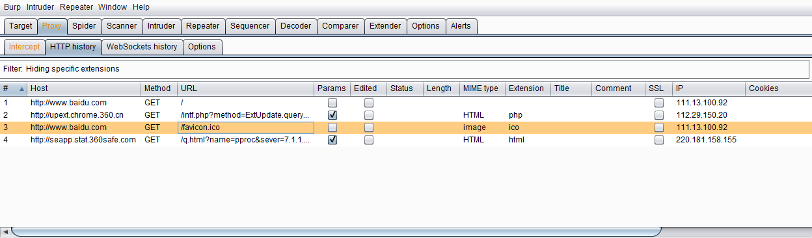 HTTP 历史界面由筛选过滤器、历史记录列表、消息详情 3 个部分组成。 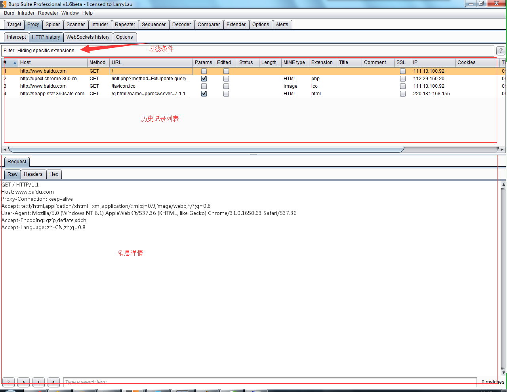 当我们在某一条历史记录上单击，会在下方的消息详解块显示此条消息的文本详细信息。当我们在某条消息上双击，则会弹出此条消息的详细对话框。 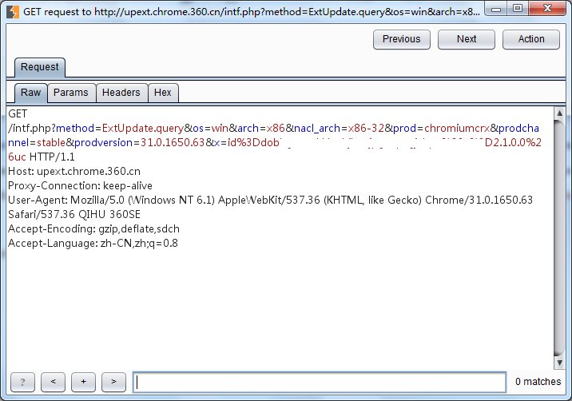 我们可以点击对话框右上方的【Previous】、【Next】按钮，浏览上一条或下一条消息的内容，也可以修改 Raw 的请求参数，然后执行多种【Action】操作。 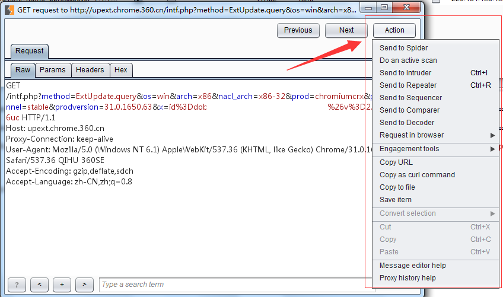

历史消息列表中主要包含请求序列号、请求协议和主机名、请求的方式、URL 路径、请求参数、Cookie、是否用户编辑过消息、服务器端返回的 HTTP 状态码等信息。通过这些信息，我们可以对一次客户端与服务器端交互的 HTTP 消息详情做出准确的分析，同时，在下方的详情视图中，也提供基于正则表达式方式的匹配查找功能，更好的方便渗透测试人员查找消息体中的相关信息。 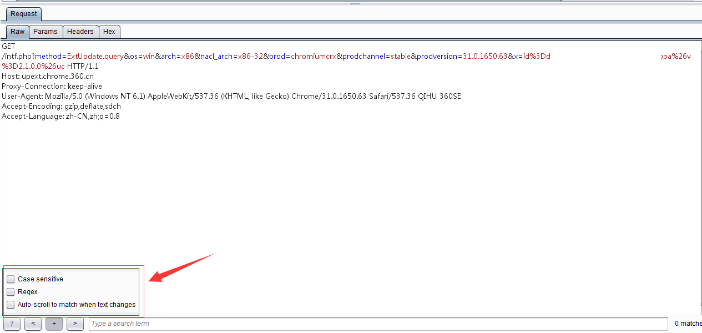

当我们在做产品系统的安全评估过程中，会在 HTTP 历史中保存了大量的日志记录，为了更友好的消息管理，Burp 提供了筛选过滤器功能。当我们点击 HTTP 历史标签下发的 Filter 时，将弹出筛选过滤器界面。 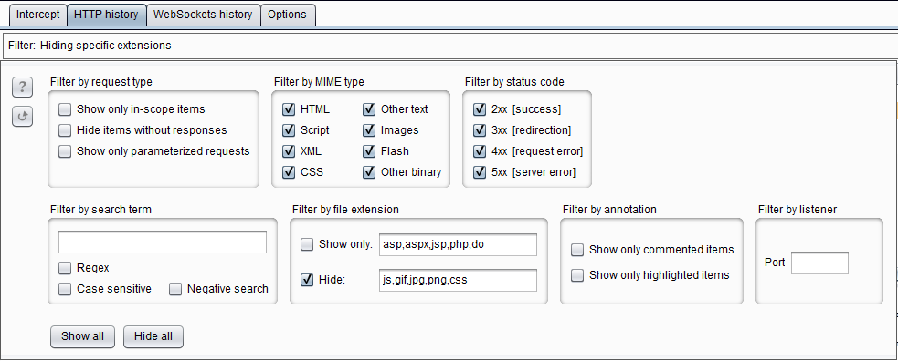 按照过滤条件的不同，筛选过滤器划分出 7 个子板块，分别是

*   按照请求类型过滤 你可以选择仅显示当前作用域的、仅显示有服务器端响应的和仅显示带有请求参数的消息。当你勾选“仅显示当前作用域”时，此作用域需要在 Burp Target 的 Scope 选项中进行配置，详细请阅读 Burp Target 相关章节。

*   按照 MIME 类型过滤 你可以控制是否显示服务器端返回的不同的文件类型的消息，比如只显示 HTML、css 或者图片。此过滤器目前支持 HTML、Script、XML、CSS、其他文本、图片、Flash、二进制文件 8 种形式。

*   按照服务器返回的 HTTP 状态码过滤 Burp 根据服务器的状态码，按照 2XX,3XX,4XX,5XX 分别进行过滤。比如，如果你只想显示返回状态码为 200 的请求成功消息，则勾选 2XX。

*   按照查找条件过滤 此过滤器是针对服务器端返回的消息内容，与输入的关键字进行匹配，具体的匹配方式，你可以选择 1.正则表达式 2.大小写敏感 3.否定查找 3 种方式的任何组合，前面两种匹配方式容易理解，第 3 种匹配方式是指与关键字匹配上的将不再显示。

*   按照文件类型过滤 通过文件类型在过滤消息列表，这里有两个选择可供操作。一是仅仅显示哪些，另一个是不显示哪些。如果是仅仅显示哪些，在 show only 的输入框中填写显示的文件类型，同样，如果不显示哪些文件类型，只要在 hide 的输入框中填写不需要显示的文件类型即可。

*   按照注解过滤 此过滤器的功能是指，根据每一个消息拦截时候的备注或者是否高亮来作为筛选条件控制哪些消息在历史列表中显示。

*   按照监听端口过滤 此过滤器通常使用于当我们在 Proxy Listeners 中多个监听端口时，仅仅显示某个监听端口通信的消息，一般情况下，我们很少用到。

现在，我们再看看 WebSockets 历史选项的功能，从界面上我们可以看出，WebSockets 历史所提供的功能和选项是 HTTP 历史的一个子集，只是因为采用的通信方式的不同，而被独立出来成为一个专门的视图。其功能的使用方式与 HTTP 历史雷同，此处就不在赘述。

通过本章的学习，你对 Burp Suite 的代理模式有了更深入的理解，知道了作为中间人的 Burp Proxy 在消息拦截过程中，可以对请求消息、应答消息做多方面的修改，并可以把消息传递给 Burp 的其他组件做进一步的测试。同时，Burp Proxy 的历史日志功能和多种筛选过滤器让我们在使用中，能快速地查找需要的数据和关键信息，这些，都极大地帮助你提高了工作效率。