# 第四章 SSL 和 Proxy 高级选项

### 第四章 SSL 和 Proxy 高级选项

在前一章，我们已经学习了 HTTP 消息如何通过 Burp Proxy 进行拦截和处理，本章我们将继续学习 HTTPS 协议消息的拦截和处理。

HTTPS 协议是为了数据传输安全的需要，在 HTTP 原有的基础上，加入了安全套接字层 SSL 协议，通过 CA 证书来验证服务器的身份，并对通信消息进行加密。基于 HTTPS 协议这些特性，我们在使用 Burp Proxy 代理时，需要增加更多的设置，才能拦截 HTTPS 的消息。

本章包含的主要内容有

*   CA 证书的安装
*   CA 证书的卸载
*   Proxy 监听设置
*   SSL 直连和隐形代理设置

我们都知道，在 HTTPS 通信过程中，一个很重要的介质是 CA 证书，下面就我们一起来看看 Burp Suite 中 CA 证书的安装。

##### CA 证书的安装

* * *

一般来说，Burp Proxy 代理过程中的 CA 主要分为如下几个步骤（以 win7 下 IE9 为例）：

1.  首先，根据前三章内容的学习，你已配置好 Burp Proxy 监听端口和 IE 的代理服务器设置。其次，你的 IE 浏览器中没有安装过 Burp Suite 的 CA 证书，如果已经安装，请先卸载证书。详细的卸载方法请参考 CA 证书的卸载章节。
2.  以管理员身份，启动 IE 浏览器，在地址栏输入[`burp`](http://burp)并回车，进入证书下载页面 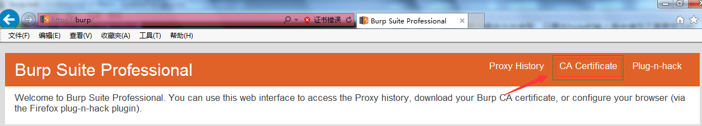
3.  点击上图所示的证书下载，另存为到本地目录。
4.  点击浏览器上的【工具】菜单，打开【Internet 选项】。 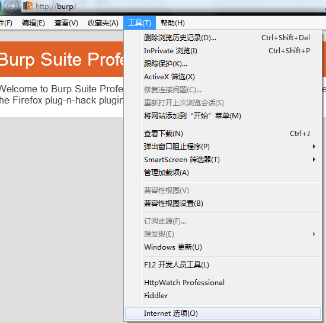
5.  在弹出的证书对话框中，点击【内容】-【证书】。 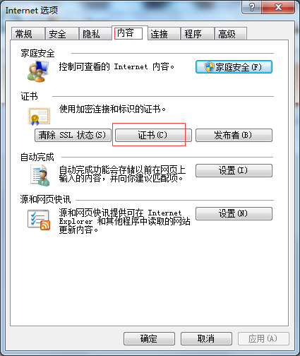
6.  在弹出的证书对话框中，选中【受信任的根证书颁发机构】，点击【导入】。 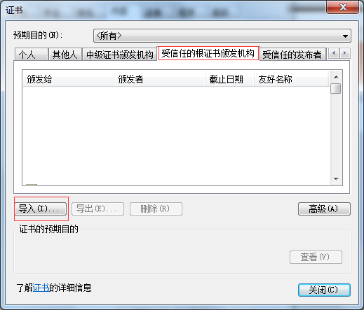
7.  点击【下一步】，选择步骤 3 保存的证书文件，进行下一步操作。 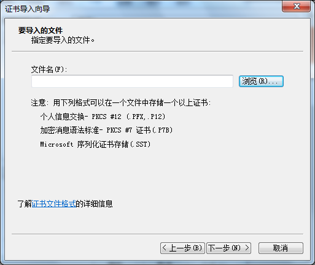
8.  指定证书的存储位置，如图 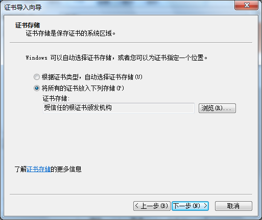
9.  点击【下一步】，直至完成。这时，会提示安全警告，点击【是】，提示导入完成。 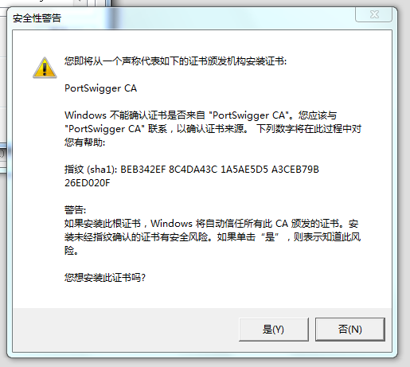
10.  关闭 IE，重启浏览器，CA 证书即配置完成。

#### CA 证书的卸载

* * *

CA 证书的卸载的通常有两种方式，第一种方式在上一章节 CA 证书安装中的第 6 步，找到需要卸载的证书，点击【删除】即可。我们这里主要描述第二种删除方式，主要是为了解决在第一种方式的基础上删除按钮失效或者证书列表里看不到的证书也一起删除的方法。

1.  首先，我们打开 cmd，输入 mmc，或者你在运行输入框里直接输入 mmc 回车，会弹出管理控制台。 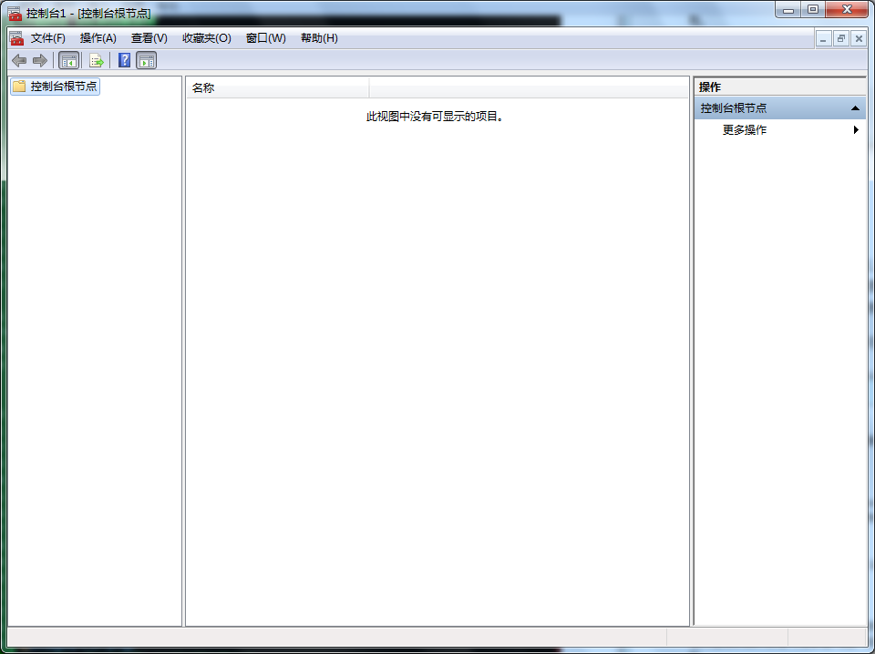
2.  点击【文件】菜单，打开【添加/删除管理单元】 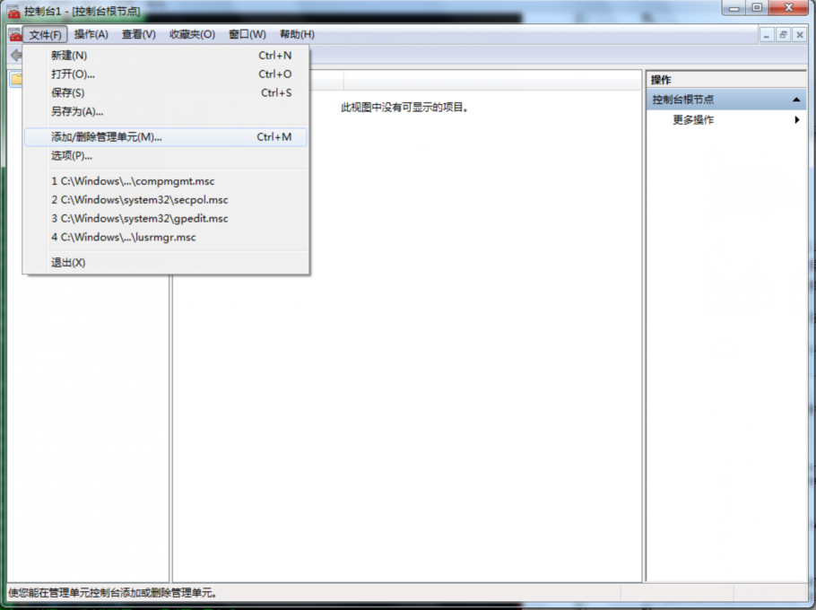
3.  找到证书，如下图 1，点击【添加】按钮，如下图 2 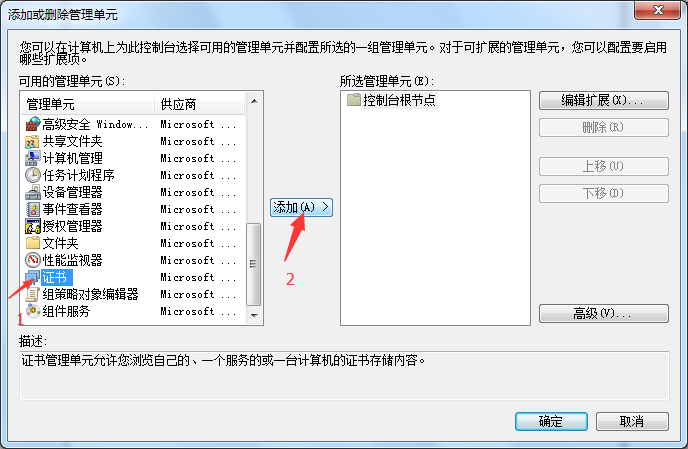
4.  在弹出的对话框中默认选中【我当前的用户】，点击【完成】，一直到结束，这是会在控制台跟节点下多了一个证书的节点。 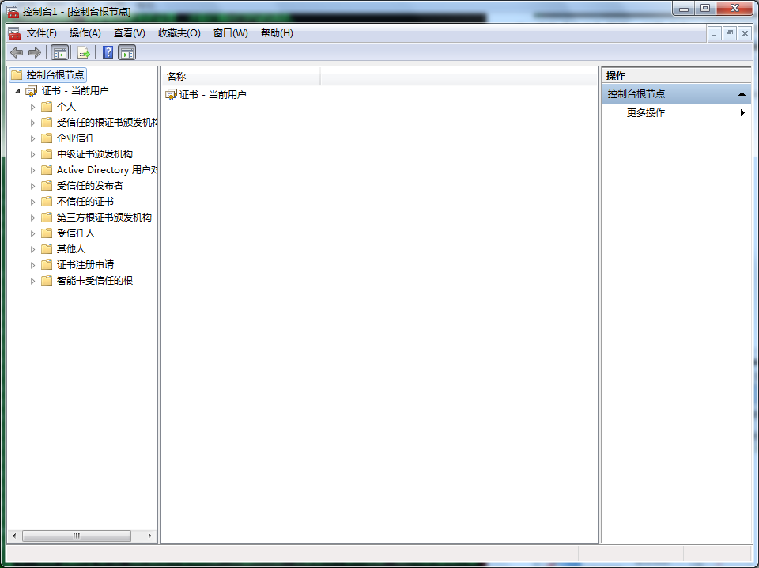
5.  打开 CA 证书所在的位置，选择删除即可。 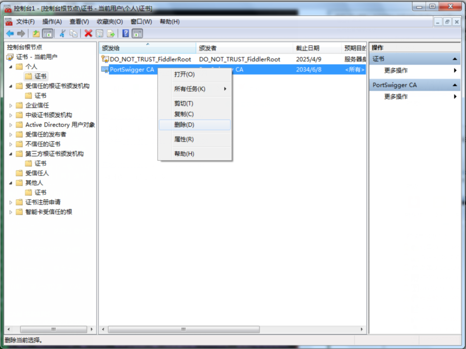
6.  这时，你再返回到 IE 浏览器的证书列表里，则不会再看到被删除的证书了。

除了 IE 之外，其他的浏览器如 FireFox、Chrome、Sarifa 等都证书的安装和卸载基本类似，操作时可以以 IE 的 CA 证书安装作为参考。

#### Proxy 监听设置

* * *

当我们启动 Burp Suite 时，默认会监听本地回路地址的 8080 端口，除此之外，我们也可以在默认监听的基础上，根据我们自己的需求，对监听端口和地址等参数进行自由设置。特别是当我们测试非浏览器应用时，无法使用浏览器代理的方式去拦截客户端与服务器端通信的数据流量，这种情况下，我们会使用自己的 Proxy 监听设置，而不会使用默认设置。

*   Proxy 监听设置

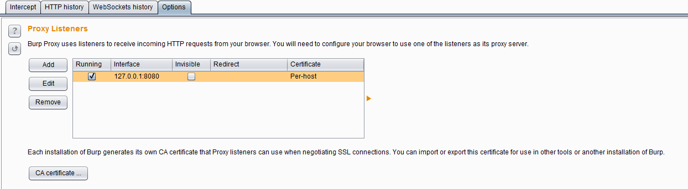 当我们在实际使用中，可能需要同时测试不同的应用程序时，我们可以通过设置不同的代理端口，来区分不同的应用程序，Proxy 监听即提供这样的功能设置。点击图中的【Add】按钮，会弹出 Proxy 监听设置对话框，里面有更丰富的设置，满足我们不同的测试需求。 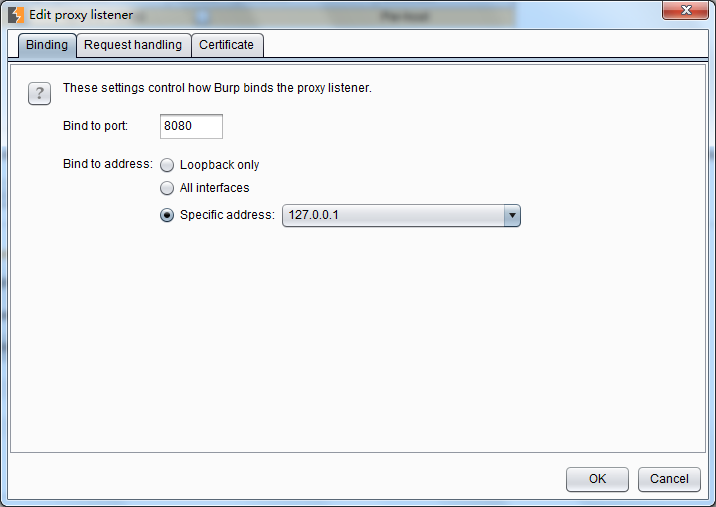 Proxy 监听设置主要包含 3 块功能：

1.  端口和 IP 绑定设置 Binding 绑定的端口 port 是指 Burp Proxy 代理服务监听的端口，绑定 IP 地址分仅本地回路、所有接口、指定地址三种模式，在渗透测试中，无论你选择哪种模式，你需要明白一点，当你选择的非本地回路 IP 地址时，同局域网内的其他电脑也可以访问你的监听地址。

2.  请求处理 Request Handling 请求处理主要是用来控制接受到 Burp Proxy 监听端口的请求后，如果对请求进行处理的。 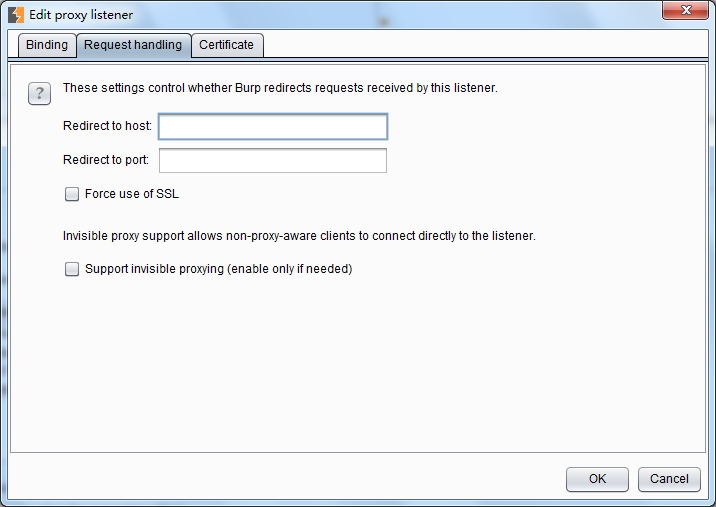 其具体配置可分为：端口的转发、主机名/域名的转发、强制使用 SSL 和隐形代理 4 个部分。当我们配置了端口的转发时，所有的请求都会被转发到这个端口上；如果我们配置了主机或域名的转发，则所有的请求会转发到指定的主机或域名上。同时，我们可以指定，通过 Burp Proxy 的消息是否强制使用 SSL，如果设置了此项，则请求若是 http 协议，经 Burp proxy 代理后将转换为 https 协议。隐形代理主要是用于测试富客户端应用或者是非浏览器代理方式的应用，当我们设置了它,访问这些应用时，将通过非代理的方式，直接连接 Burp Proxy 的监听端口。

3.  SSL 证书 这些设置控制呈现给 SSL 客户端的服务器 SSL 证书。可以解决使用拦截代理时出现的一些 SSL 问题： 1.您可以消除您的浏览器的 SSL 警报，并需要建立 SSL 例外。其中，网页加载来自其他域的 SSL 保护的项目，可以确保这些正确的加载到浏览器，而不需要为每个域手动接受代理的 SSL 证书。 2.可以与该拒绝无效的 SSL 证书连接到服务器胖客户机应用程序的工作。 它有下列选项可供设置：

4.  使用自签名证书（Use a self-signed certificate ） —— 一个简单的自签名 SSL 证书呈现给您的浏览器，它总是会导致 SSL 警告。
5.  生成每个主机的 CA 签名证书（Generate CA-signed per-host certificates）—— 这是默认选项。在安装时，Burp 创造了一个独特的自签名的证书颁发机构（CA）证书，并将此计算机上使用。当你的浏览器发出的 SSL 连接指定主机，Burp 生成该主机的 SSL 证书，由 CA 证书签名。您可以安装 Burp 的 CA 证书作为浏览器中的受信任的根，从而使每个主机证书没有任何警报接受。
6.  生成与特定的主机名 CA 签发的证书（Generate a CA-signed certificate with a specific hostname）—— -是类似于前面的选项;不同的是，Burp 会生成一个主机证书与每一个 SSL 连接使用，使用指定的主机名。
7.  使用自定义证书（Use a custom certificate）—— 此选项可以加载一个特定的证书（在 PKCS＃12 格式）呈现给浏览器。如果应用程序使用这需要一个特定的服务器证书（例如，与给定的序列号或证书链）的客户端应该使用这个选项。

* * *

#### SSL 直连和隐形代理

SSL 直连的设置主要用于指定的目的服务器直接通过 SSL 连接，而通过这些连接的请求或响应任何细节将在 Burp 代理拦截视图或历史日志中可见。通过 SSL 连接传递可以并不是简单地消除在客户机上 SSL 错误的情况下有用。比如说，在执行 SSL 证书的移动应用。如果应用程序访问多个域，或使用 HTTP 和 HTTPS 连接的混合，然后通过 SSL 连接到特定的主机问题仍然使您能够以正常的方式使用 Burp 的其他方式进行通信。如果启用自动添加客户端 SSL 协商失败的选项，当客户端失败的 SSL 协议检测（例如，由于不承认 Burp 的 CA 证书），并会自动将相关的服务器添加到 SSL 直通通过列表中去。其设置界面如下图所示： 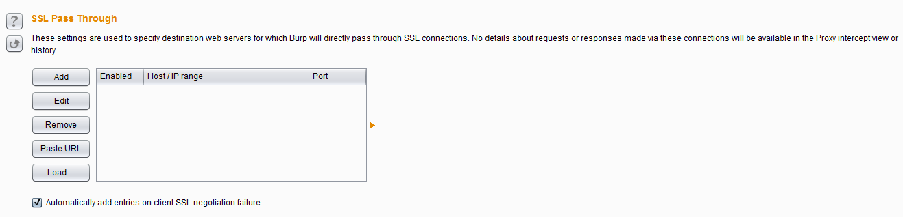

有时候，在拦截富客户端软件时，我们通常需要使用隐形代理。富客户端软件通常是指运行在浏览器之外的客户端软件，这就意味着它本身不具有 HTTP 代理是属性。当它进行网络通信时，客户端将无法使代理感知或者无法由代理进行通信。在 Burp 中，我们可以使用隐形代理的方式，对通信内容进行代理或拦截，从而对通信的请求和响应消息进行分析。使用隐形代理通常需要做如下设置（以[`example.com 为例）：`](https://example.com 为例）：) 1.配置 hosts 文件，Windows 操作系统下的目录位置 Windows/System32/drivers/etc/hosts，而 Linux 或者 Unix 下的目录为/etc/hosts，添加如下行：

```
127.0.0.1 example.com 
```

2.第一步设置完成之后，我们需要添加一个新的监听来运行在 HTTP 默认的 80 端口，如果通信流量使用 HTTPS 协议，则端口为 443。 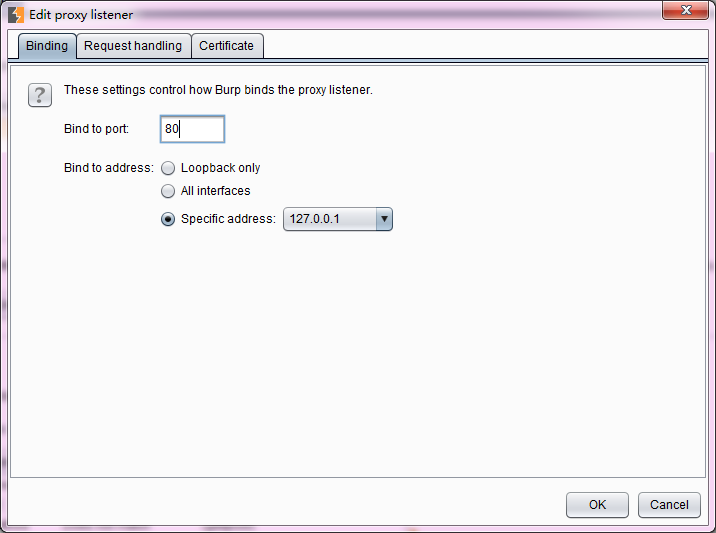 3.如果是 HTTPS 协议的通信方式，我们需要一个指定域名的 CA 证书。 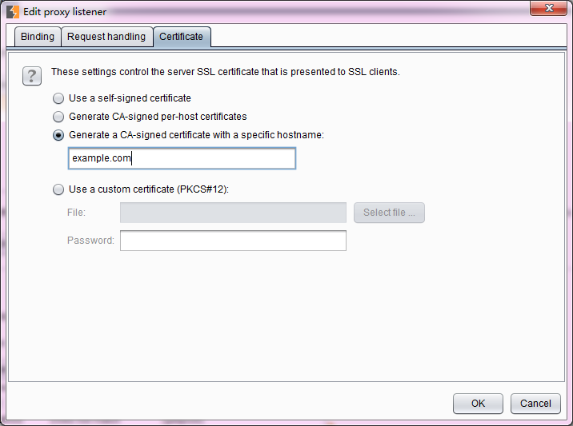 4.接着，我们需要把 Burp 拦截的流量转发给原始请求的服务器。这需要在 Options->Connections->Hostname Resolution 进行设置。因为我们已经告诉了操作系统，example.com 的监听地址在 127.0.0.1 上，所以我们必须告诉 Burp，将 example.com 的流量转发到真实的服务器那里去。 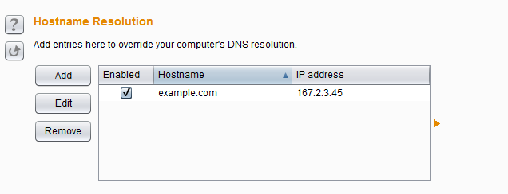 5.通过这样的配置，我们就可以欺骗富客户端软件，将流量发送到 Burp 监听的端口上，再由 Burp 将流量转发给真实的服务器。