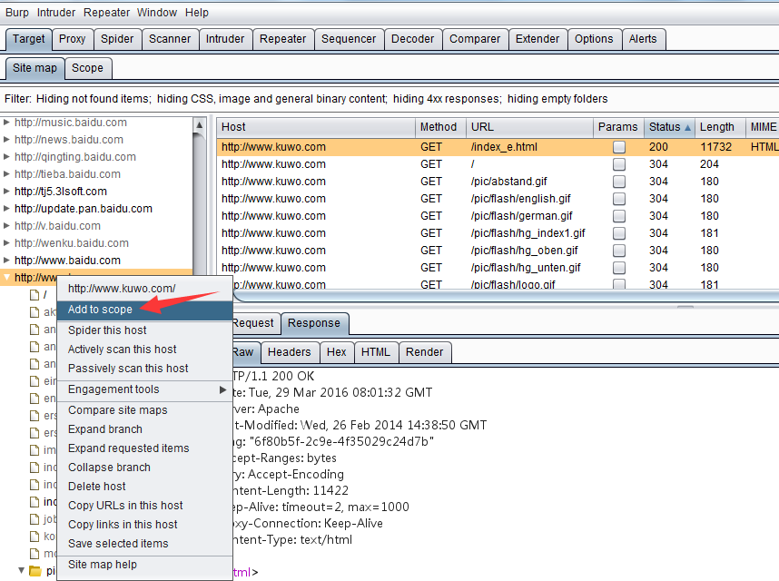
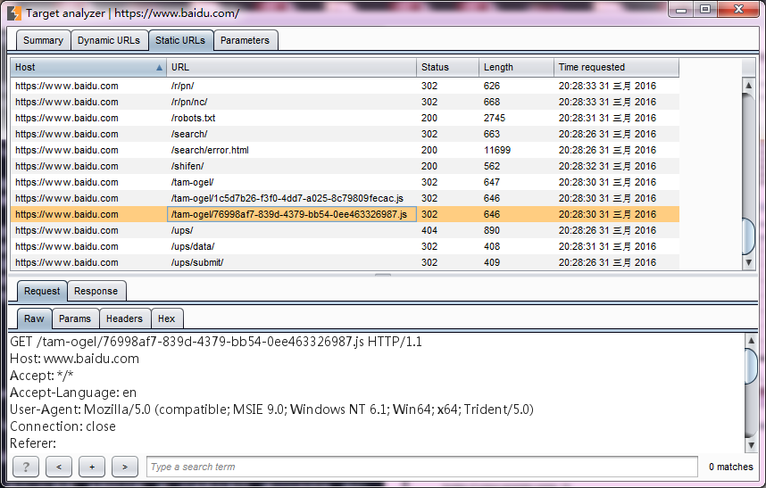

# 第五章 如何使用 Burp Target

### 第五章 如何使用 Burp Target

Burp Target 组件主要包含站点地图、目标域、Target 工具三部分组成，他们帮助渗透测试人员更好地了解目标应用的整体状况、当前的工作涉及哪些目标域、分析可能存在的攻击面等信息，下面我们就分别来看看 Burp Target 的三个组成部分。

本章的主要内容有：

*   目标域设置 Target Scope
*   站点地图 Site Map
*   Target 工具的使用

#### 目标域设置 Target Scope

Target Scope 中作用域的定义比较宽泛，通常来说，当我们对某个产品进行渗透测试时，可以通过域名或者主机名去限制拦截内容，这里域名或主机名就是我们说的作用域；如果我们想限制得更为细粒度化，比如，你只想拦截 login 目录下的所有请求，这时我们也可以在此设置，此时，作用域就是目录。总体来说，Target Scope 主要使用于下面几种场景中：

*   限制站点地图和 Proxy 历史中的显示结果
*   告诉 Burp Proxy 拦截哪些请求
*   Burp Spider 抓取哪些内容
*   Burp Scanner 自动扫描哪些作用域的安全漏洞
*   在 Burp Intruder 和 Burp Repeater 中指定 URL

通过 Target Scope 我们能方便地控制 Burp 的拦截范围、操作对象，减少无效的噪音。在 Target Scope 的设置中，主要包含两部分功能：允许规则和去除规则。  其中允许规则顾名思义，即包含在此规则列表中的，视为操作允许、有效。如果此规则用于拦截，则请求消息匹配包含规则列表中的将会被拦截；反之，请求消息匹配去除列表中的将不会被拦截。  从上图的添加规则对话框中我们可以看出，规则主要由协议、域名或 IP 地址、端口、文件名 4 个部分组成，这就意味着我们可以从协议、域名或 IP 地址、端口、文件名 4 个维度去控制哪些消息出现在允许或去除在规则列表中。

* * *

当我们设置了 Target Scope （默认全部为允许），使用 Burp Proxy 进行代理拦截，在渗透测试中通过浏览器代理浏览应用时，Burp 会自动将浏览信息记录下来，包含每一个请求和应答的详细信息，保存在 Target 站点地图中。

### 站点地图 Site Map

下图所示站点地图为一次渗透测试中，通过浏览器浏览的历史记录在站点地图中的展现结果。  从图中我们可以看出，Site Map 的左边为访问的 URL，按照网站的层级和深度，树形展示整个应用系统的结构和关联其他域的 url 情况；右边显示的是某一个 url 被访问的明细列表，共访问哪些 url，请求和应答内容分别是什么，都有着详实的记录。 基于左边的树形结构，我们可以选择某个分支，对指定的路径进行扫描和抓取。  同时，我们也可以将某个域直接加入 Target Scope 中.  除了加入 Target Scope 外，从上图中，我们也可以看到，对于站点地图的分层，可以通过折叠和展开操作，更好的分析站点结构。

* * *

#### Target 工具的使用

Target 工具的使用的使用主要包括以下部分：

*   手工获取站点地图
*   站点比较
*   攻击面分析

当我们手工获取站点地图时，需要遵循以下操作步骤： 1.设置浏览器代理和 Burp Proxy 代理，并使之能正常工作。 2.关闭 Burp Proxy 的拦截功能。 3.手工浏览网页，这时，Target 会自动记录站点地图信息。 手工获取站点地图的方式有一个好处就是，我们可以根据自己的需要和分析，自主地控制访问内容，记录的信息比较准确。与自动抓取相比，则需要更长的时间，如果需要渗透测试的产品系统是大型的系统，则对于系统的功能点依次操作一遍所需要的精力和时间对渗透测试人员来说付出都是很大的。

站点比较是一个 Burp 提供给渗透测试人员对站点进行动态分析的利器，我们在比较帐号权限时经常使用到它。当我们登陆应用系统，使用不同的帐号，帐号本身在应用系统中被赋予了不同的权限，那么帐号所能访问的功能模块、内容、参数等都是不尽相同的，此时使用站点比较，能很好的帮助渗透测试人员区分出来。一般来说，主要有以下 3 种场景： 1.同一个帐号，具有不同的权限，比较两次请求结果的差异。 2.两个不同的帐号，具有不同的权限，比较两次请求结果的差异。 3.两个不同的帐号，具有相同的权限，比较两次请求结果的差异。

下面我们就一起来看看如何进行站点比较。 1.首先我们在需要进行比较的功能链接上右击，找到站点比较的菜单，点击菜单进入下一步。  2.由于站点比较是在两个站点地图之间进行的，所以我们在配置过程中需要分别指定 Site Map 1 和 Site Map2。通常情况下，Site Map 1 我们默认为当前会话。如图所示，点击【Next】。  3.这时我们会进入 Site Map 1 设置页面，如果是全站点比较我们选择第一项，如果仅仅比较我们选中的功能，则选择第二项。如下图，点击【Next】。如果全站点比较，且不想加载其他域时，我们可以勾选只选择当前域。  4.接下来就是 Site Map 2 的配置，对于 Site Map 2 我们同样有两种方式，第一种是之前我们已经保存下来的 Burp Suite 站点记录，第二种是重新发生一次请求作为 Site Map2.这里，我们选择第二种方式。  5.如果上一步选择了第二种方式，则进入请求消息设置界面。在这个界面，我们需要指定通信的并发线程数、失败重试次数、暂停的间隙时间。  6.设置完 Site Map 1 和 Site Map 2 之后，将进入请求消息匹配设置。在这个界面，我们可以通过 URL 文件路径、Http 请求方式、请求参数、请求头、请求 Body 来对匹配条件进行过滤。  7..设置请求匹配条件，接着进入应答比较设置界面。在这个界面上，我们可以设置哪些内容我们指定需要进行比较的。从下图我们可以看出，主要有响应头、form 表单域、空格、MIME 类型。点击【Next】。  8.如果我们之前是针对全站进行比较，且是选择重新发生一次作为 Site Map2 的方式，则界面加载过程中会不停提示你数据加载的进度，如果涉及功能请求的链接较少，则很快进入比较界面。如下图。  9.从上图我们可以看到，站点比较的界面上部为筛选过滤器（这个过滤器与其他过滤器使用雷同，此处不再赘述），下部由左、中、右三块构成。左边为请求的链接列表，中间为 Site Map 1 和 Site Map 2 的消息记录，右边为消息详细信息。当我们选择 Site Map 1 某条消息记录时，默认会自动选择 Site Map 2 与之对应的记录，这是有右上角的【同步选择】勾选框控制的，同时，在右边的消息详细区域，会自动展示 Site Map 1 与 Site Map 2 通信消息的差异，包含请求消息和应答消息，存在差异的地方用底色标注出来。 

* * *

攻击面分析是 Burp Suite 交互工具（Engagement tools）中的功能，这里我们先看看 Analyze Target 使用，其他的功能会在高级使用相关章节讲述。 1.首先，我们通过站点地图，打开 Analyze Target，如图所示。  2.在弹出的分析界面中，我们能看到概况、动态 URL、静态 URL、参数 4 个视图。  3.概况视图主要展示当前站点动态 URL 数量、静态 URL 数量、参数的总数、唯一的参数名数目，通过这些信息，我们对当前站点的总体状况有粗线条的了解。 4.动态 URL 视图展示所有动态的 URL 请求和应答消息，跟其他的工具类似，当你选中某一条消息时，下方会显示此消息的详细信息。  5.静态 URL 视图与动态 URL 视图类似，如图.  6.参数视图有上中下三部分组成，上部为参数和参数计数统计区，你可以通过参数使用的次数进行排序，对使用频繁的参数进行分析；中部为参数对于的使用情况列表，记录对于的参数每一次的使用记录；下部为某一次使用过程中，请求消息和应答消息的详细信息。 

在使用攻击面分析功能时，需要注意，此功能主要是针对站点地图中的请求 URL 进行分析，如果某些 URL 没有记录，则不会被分析到。同时，在实际使用中，存在很点站点使用伪静态，如果请求的 URL 中不带有参数，则分析时无法区别，只能当做静态 URL 来分析。