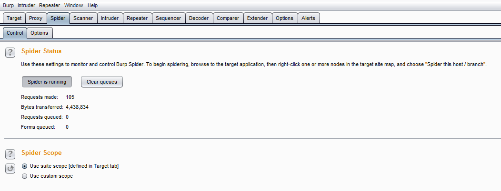
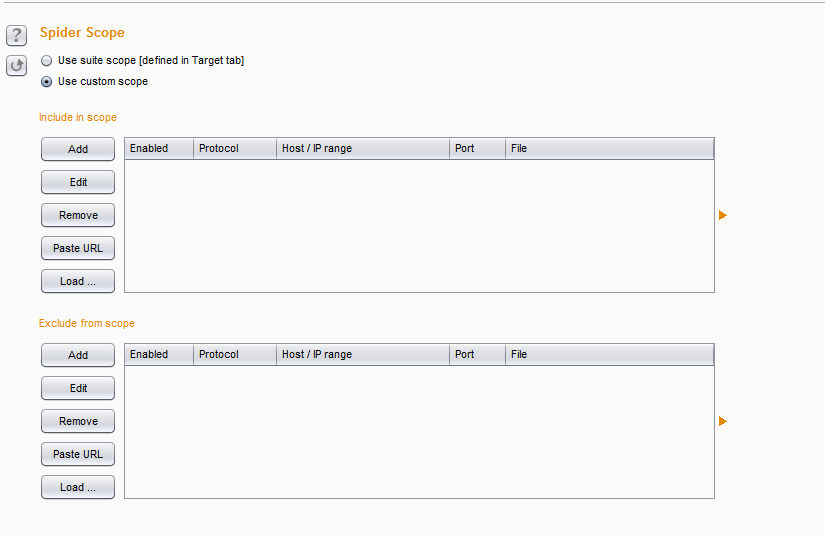
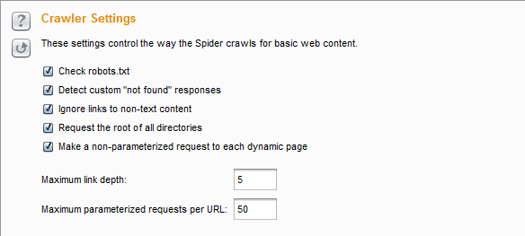
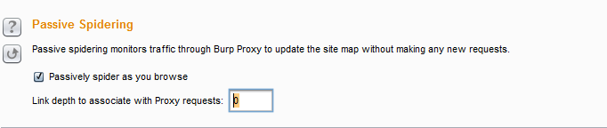
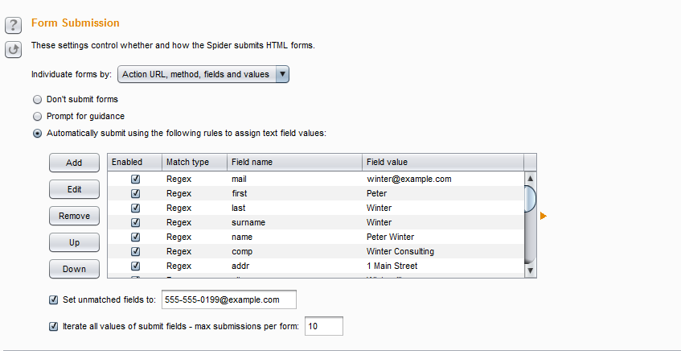
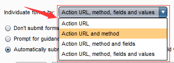
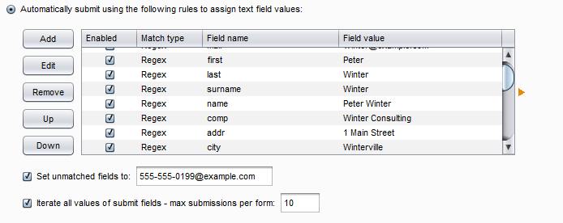
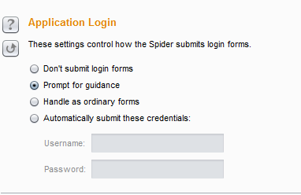
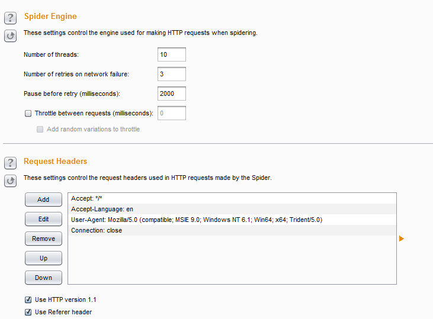

# 第六章 如何使用 Burp Spider

### 第六章 如何使用 Burp Spider

通过前一章的学习，我们了解到，存在于 Burp Target 中的站点信息，我们可以直接传送到 Burp Spider 中进行站点信息的爬取。这一章我们重点来学习 Burp Spider 的使用，主要包含两个方面：

*   Spider 控制（Control）
*   Spider 可选项设置（Options）

Burp Spider 的功能主要使用于大型的应用系统测试，它能在很短的时间内帮助我们快速地了解系统的结构和分布情况，下面我们就先来看看 Spider 控制，

### Spider 控制

* * *

Spider 控制界面由 Spider 状态和 Spider 作用域两个功能组成。  Spider 状态除了显示当前进度、传输情况、请求队列等统计信息外，还有 Spider 运行/暂停按钮与清空队列按钮，分别用来控制 Spider 是否运行和队列中的数据管理。而 Spider 作用域是用来控制 Spider 的抓取范围，从图中我们可以看到有两种控制方式，一种是使用上一章讲的 Target Scope，另一种是用户自定义。当我们选中用户自定义按钮，界面改变成下面的样子，如下图所示。  此处用户自定义作用域的配置与 Target Scope 的配置完全一致，具体使用方法请参数上一章 Target Scope 的配置。

#### Spider 可选项设置

Spider 可选项设置由抓取设置、抓取代理设置、表单提交设置、应用登陆设置、蜘蛛引擎设置、请求消息头设置六个部分组成。

*   抓取设置（Crawls Settings） -此项是用来控制蜘蛛抓取网页内容的方式  自上而下依次是：检查 robots.txt 文件、检测 404 应答、忽略内容为空的链接、爬取根目录下所有文件和目录、对每一个动态页面发送无参数请求、最大链接深度、最大请求 URL 参数数目
*   抓取代理设置（Passive Spidering ）  这个设置比较简单，第一个如果勾选，则爬取时通过 Burp Proxy，反之则不通过。第二个设置是控制代理的链接深度。默认为 0，表示无限深度，即无论有多少层级的 URL 均需要爬取。
*   表单提交设置（Form Submission） 表单提交设置主要是用来控制在蜘蛛抓取过程中，对于 form 表单的处理方式，其界面如下图：  第一个下拉选项中，是对 form 表单域的处理内容做控制，默认选择 Action URL、method、fields、values，即同时处理请求的 url、请求方式 GET 或者 POST、包含哪些属性名以及属性值。点击下拉选项，可以选择其中一个或者几个。如下图：  接下来的设置的控制 form 表单的处理方式：不提交表单、需要手工确认、使用默认值自动填写三种方式。 不提交表单的含义是抓取时候不提交表单数据，这个非常好理解；需要手工确认是指当抓取表单时，弹出界面，让渗透测试人员自己手工确认表单数据；使用默认值自动填写是对表单的内容，使用下方的各个配置项进行匹配（匹配时可以使用完全匹配和正则表达式匹配两种方式其一），默认填写这些值，然后自动进行提交。其界面如下图所示：  从上图我们可以看出，对于表单的输入域我们可以添加和修改以满足实际情况的需要，如果还有其他的属性输入域我们不想每一个都录入，可以勾选“设置不匹配的属性值”，统一指定输入的值。如图中的 555-555-0199@example.com
*   应用登陆（Application Login） 此选择项主要用来控制抓取时，登陆页面的处理方式。  选择项依次是：不提交登陆信息、手工确认登陆信息、作为普通表单处理（如果选择此项，则把登陆表单的 form 当作其他表单一样处理，对于登陆表单将使用"表单提交设置" 中的具体配置）、自动提交登陆（选择此项，需要在下方的输入框中指定用户名和密码）
*   蜘蛛引擎设置（Spider Engine)和 HTTP 消息头设置（Requests Header）  其中蜘蛛引擎设置主要是用来控制蜘蛛抓取的线程数、网络失败时重试的次数、重试暂停间隙等，而 HTTP 消息头设置是用来设置 Http 请求的消息头自定义，比如说，我们可以编辑消息头信息，可以指定请求为移动设备，或者不同的手机型号，或者指定为 Safari 浏览器，指定 HTTP 协议版本为 1.1、使用 referer 等。