# 第七章 如何使用 Burp Scanner

### 第七章 如何使用 Burp Scanner

Burp Scanner 的功能主要是用来自动检测 web 系统的各种漏洞，我们可以使用 Burp Scanner 代替我们手工去对系统进行普通漏洞类型的渗透测试，从而能使得我们把更多的精力放在那些必须要人工去验证的漏洞上。

在使用 Burp Scanner 之前，我们除了要正确配置 Burp Proxy 并设置浏览器代理外，还需要在 Burp Target 的站点地图中存在需要扫描的域和 URL 模块路径。如下图所示： 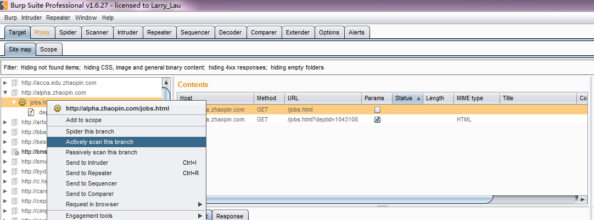 当 Burp Target 的站点地图中存在这些域或 URL 路径时，我们才能对指定的域或者 URL 进行全扫描或者分支扫描。下面我们就来整体的学习一下，一次完整的 Burp Scanner 使用大概需要哪些步骤。

本章的主要内容有：

*   Burp Scanner 基本使用步骤
*   Burp Scanner 扫描方式
*   Burp Scanner 扫描报告
*   Burp Scanner 扫描控制
*   Burp Scanner 可选项设置

* * *

#### Burp Scanner 基本使用步骤

Burp Scanner 基本使用主要分为以下 15 个步骤，在实际使用中可能会有所改变，但大体的环节主要就是下面的这些。 1.确认 Burp Suite 正常启动并完成浏览器代理的配置。 2.进入 Burp Proxy，关闭代理拦截功能，快速的浏览需要扫描的域或者 URL 模块。 3.当我们浏览时，默认情况下，Burp Scanner 会扫描通过代理服务的请求，并对请求的消息进行分析来辨别是非存在系统漏洞。同时，当我们打开 Burp Target 时，也会在站点地图中显示请求的 URL 树。 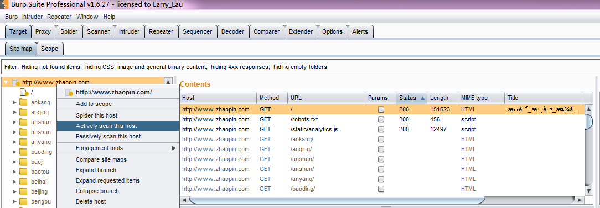 4.我们可以有针对性的选择 Burp Target 站点地图下的某个节点上链接 URL 上，弹出右击菜单，进行 Active Scan。然后在弹出的确认框中，点击【YES】即进行扫描整个域。 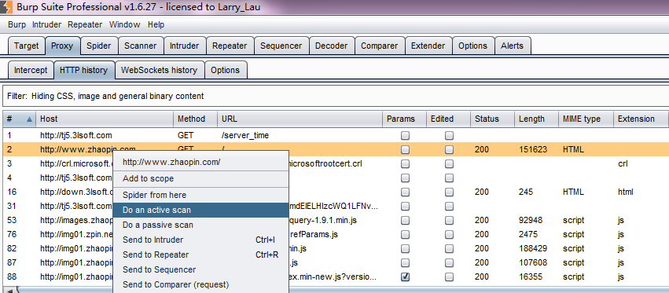 6.这时，我们打开 Burp Scanner 选项卡，在队列子选项卡中，会看到当前扫描的进度。如果我们双击 URL，则弹出扫描结果的提示信息。 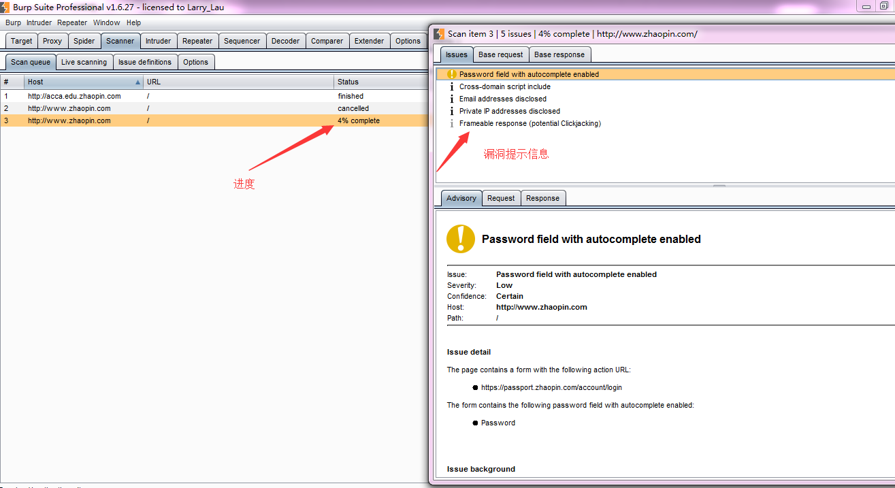 7.如果我们在 Burp Target 站点地图下选择某个子目录进行扫描，则会弹出更优化的扫描选项，我们可以对选项进行设置，指定哪些类型的文件不再扫描范围之内。 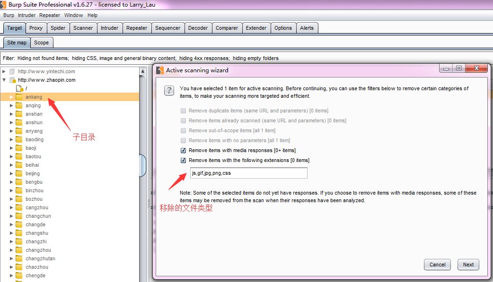 8.当我们再次返回到 Burp Scanner 选项卡界面时，选择的子目录已经开始在扫描中，其扫描的进度依赖于需要扫描内容的多少。 9.如果我们没有定义了目标作用域（Target Scope），最简单的方式就是在 Burp Target 站点地图上右击弹出菜单中添加到作用域，然后自动进行扫描。 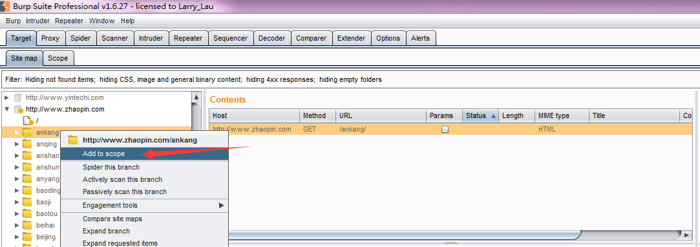 10.然后进入 Burp Scanner 的 Live scanning 子选项卡，在 Live Active Scanning 控制块中，选择 Use suite scope，这样，Burp Scanner 将自动扫描经过 Burp Proxy 的交互信息。 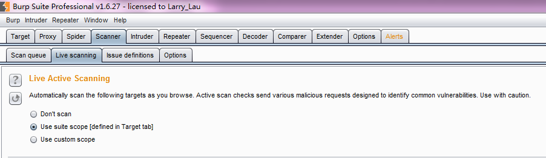 11.当我们再次使用浏览器对需要测试的系统进行浏览时，Burp Scanner 不会发送额外的请求信息，自动在浏览的交互信息的基础上，完成对请求消息的漏洞分析。 12.此时，当我再返回到 Burp Target 站点地图界面，将提示系统可能存在的漏洞情况，以及处理这些漏洞的建议。 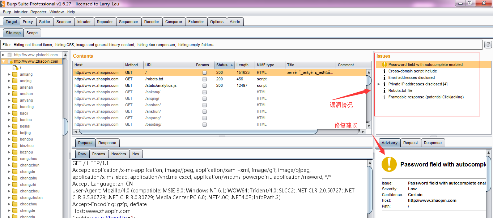 13.同时，我们也可以在漏洞提示的请求信息上，将消息发送到 Burp Repeater 模块，对漏洞进行分析和验证。 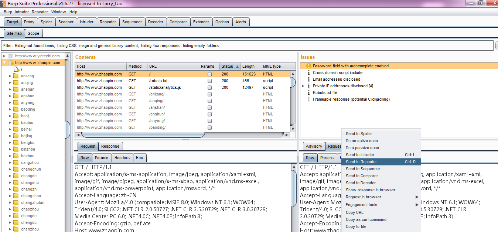 14.随着 Burp Scanner 扫描的进度，在 Burp Target 站点地图界面上的 issues 模块中的漏洞信息也会不断的更新。 15.当 Burp Scanner 扫描完成之后，我们在 Burp Target 站点地图的选择链接右击，依次选择 issues-->report issues for this host 即可导出漏洞报告。 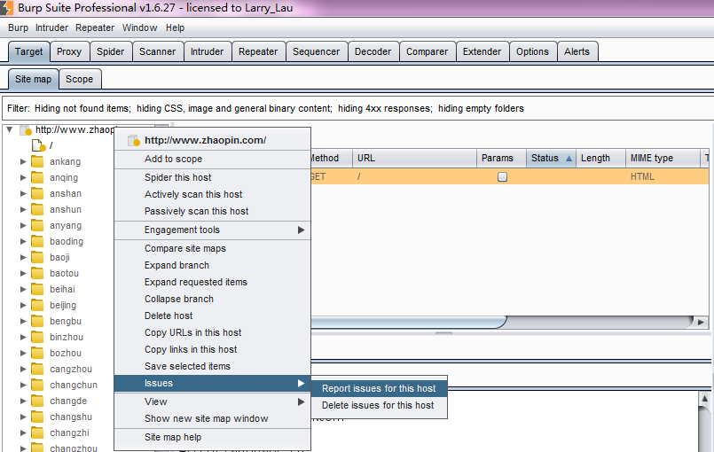

* * *

#### Burp Scanner 扫描方式

通过以上的操作步骤我们可以学习到，Burp Scanner 扫描方式主要有两种：主动扫描和被动扫描

*   主动扫描（Active Scanning）

当使用主动扫描模式时，Burp 会向应用发送新的请求并通过 payload 验证漏洞。这种模式下的操作，会产生大量的请求和应答数据，直接影响系统的性能，通常使用在非生产环境。它对下列的两类漏洞有很好的扫描效果：

1.  客户端的漏洞，像 XSS、Http 头注入、操作重定向；
2.  服务端的漏洞，像 SQL 注入、命令行注入、文件遍历。

对于第一类漏洞，Burp 在检测时，会提交一下 input 域，然后根据应答的数据进行解析。在检测过程中，Burp 会对基础的请求信息进行修改，即根据漏洞的特征对参数进行修改，模拟人的行为，以达到检测漏洞的目的。 对于第二类漏洞，一般来说检测比较困难，因为是发生在服务器侧。比如说 SQL 注入，有可能是返回数据库错误提示信息，也有可能是什么也不反馈。Burp 在检测过程中，采用各个技术来验证漏洞是否存在，比如诱导时间延迟、强制修改 Boolean 值，与模糊测试的结果进行比较，已达到高准确性的漏洞扫描报告。

*   被动扫描（Passive Scanning）

当使用被动扫描模式时，Burp 不会重新发送新的请求，它只是对已经存在的请求和应答进行分析，这对系统的检测比较安全，尤其在你授权访问的许可下进行的，通常适用于生成环境的检测。一般来说，下列这些漏洞在被动模式中容易被检测出来：

1.  提交的密码为未加密的明文。
2.  不安全的 Cookie 的属性，比如缺少的 HttpOnly 和安全标志。
3.  cookie 的范围缺失。
4.  跨域脚本包含和站点引用泄漏。
5.  表单值自动填充，尤其是密码。
6.  SSL 保护的内容缓存。
7.  目录列表。
8.  提交密码后应答延迟。
9.  session 令牌的不安全传输。
10.  敏感信息泄露，像内部 IP 地址，电子邮件地址，堆栈跟踪等信息泄漏。
11.  不安全的 ViewState 的配置。
12.  错误或者不规范的 Content-type 指令。

虽然被动扫描模式相比于主动模式有很多的不足，但同时也具有主动模式不具备的优点，除了前文说的对系统的检测在我们授权的范围内比较安全外，当某种业务场景的测试，每测试一次都会导致业务的某方面问题时，我们也可以使用被动扫描模式，去验证问题是否存在，减少测试的风险。

#### Burp Scanner 扫描报告

当我们对一个系统进行扫描完毕后，通常需要生成扫描报告，Burp Scanner 支持的报告类型有 HTML 和 XML 两种格式。无法何种格式的扫描报告，其内容基本一致，主要由以下部分组成。报告样例可以点击[Burp Scanner report](https://portswigger.net/burp/samplereport/BurpScannerSampleReport.html)查看.

除了头部的综述和目录外，每一个漏洞的章节通常包含： 1.序号 表示漏洞的序号，如果有多个同样的漏洞，报告中只会有一个序号。 2.漏洞的类型，可以近似地理解与 OWASP 的类型相对应。 3.漏洞名称，具体可参考 Issue Definitions 子选项卡。 4.漏洞路径，漏洞对应的多个 URL 链接。 5.漏洞的发生点，通常为参数名。 6.问题的描述（Issue background） 描述漏洞发生的成因 7.解决建议（Remediation background）提供解决的思路和建议 8.请求消息和应答消息的详细信息。

如果我们想对某次的扫描结果进行保存，需要 Burp Target 的站点地图子选项卡的问题面板（Issue）上右击，在弹出的菜单中选择 report Issues 进行设置并保存即可。（注意，如果想导出所有的漏洞，需要选中所有的问题列表） 具体导出漏洞报告的步骤如下： 1.选中需要保存的漏洞，右击弹出菜单，如下图： 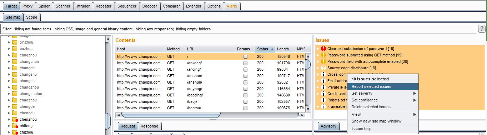 2.在弹出的对话框中选择需要保存的漏洞报告格式。 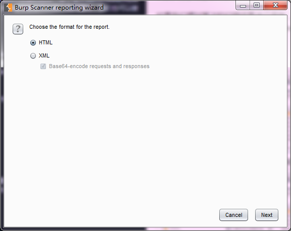 3.选择漏洞明细包含内容。 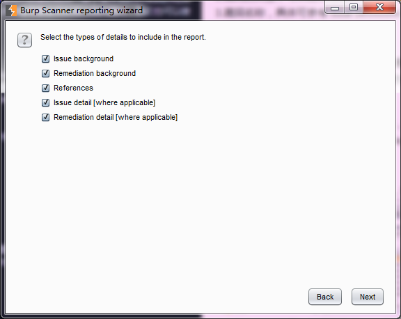 4.请求消息和应答消息设置。 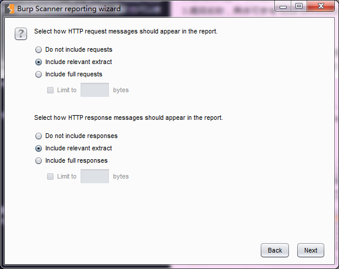 5.选择报告包含的哪些漏洞。 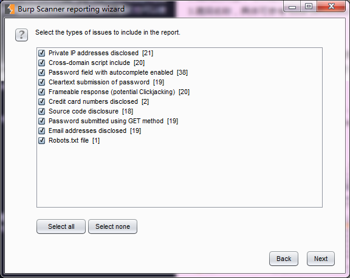 6.最后，指定报告存放位置、报告名称等属性。 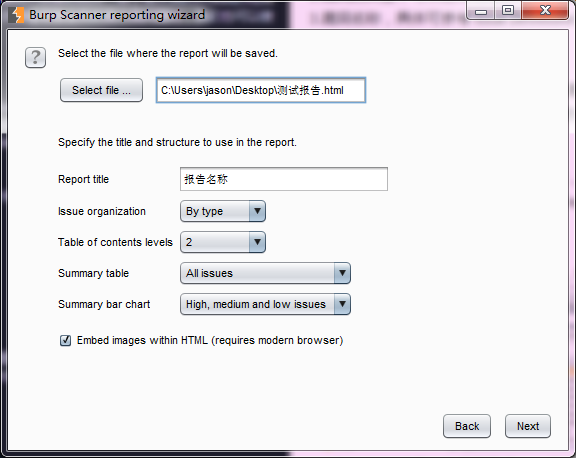

#### Burp Scanner 扫描控制

在对系统做主动扫描时，当我们激活 Burp Scanner，扫描控制的相关设置也同时开始了。如下图所示，当我们在 Burp Target 的站点地图上的某个 URL 执行 Actively scan this host 时，会自动弹出过滤设置。 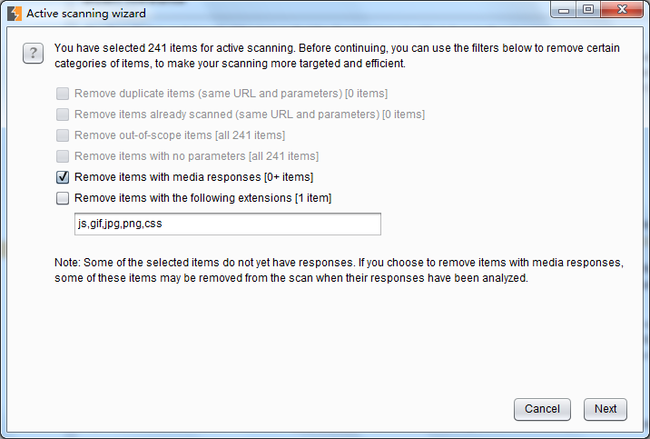 在这里，我们可以设置扫描时过滤多媒体类型的应答、过滤 js、css、图片等静态资源文件。当我们点击【next】按钮，进入扫描路径分支的选择界面。如下图： 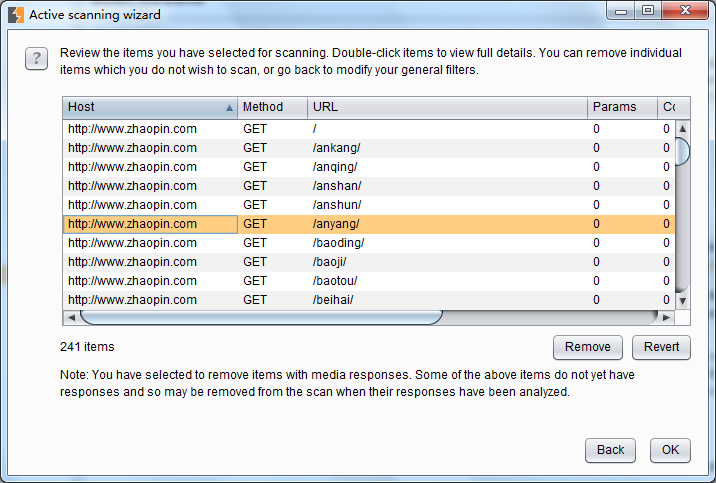

以上是 Burp Scanner 开始扫描前的控制，当我们设置完这些之后，将正式进入扫描阶段。此时，在 Scan queue 队列界面，会显示扫描的进度、问题总数、请求数和错误统计等信息。 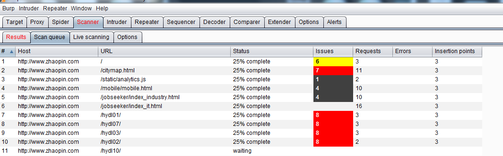 在此界面上，我们可以选中某个记录，在右击的弹出菜单中，对扫描进行控制。比如取消扫描、暂停扫描、恢复扫描、转发其他 Burp 组件等。如下图： 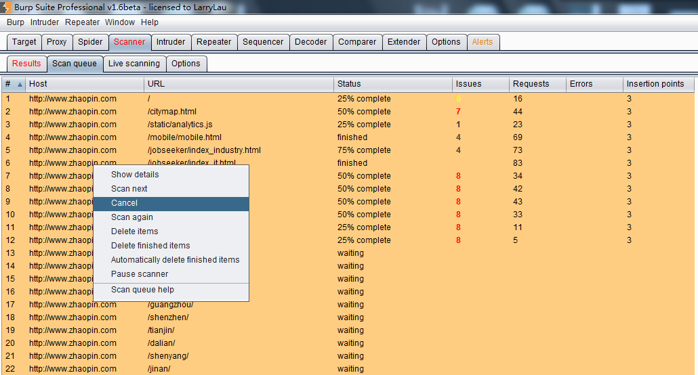 同时，在 Results 界面，自动显示队列中已经扫描完成的漏洞明细。 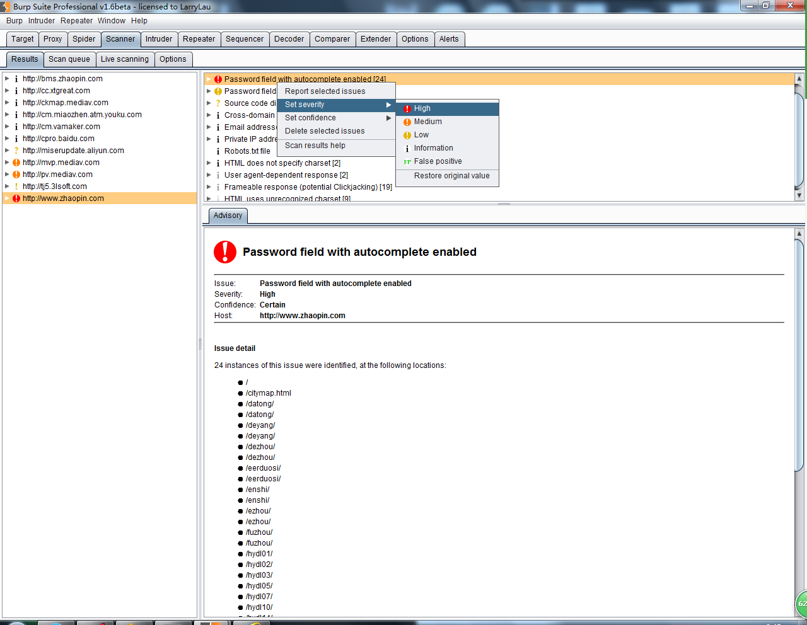 在每一个漏洞的条目上，我们可以选中漏洞。在弹出的右击菜单中，依次选择 Set severity，对漏洞的等级进行标识。也可以选择 Set confidence，对漏洞是否存在或误报进行标注。

另外，在 Live Scanning 选项卡中，我们也可以对请求的域、路径、IP 地址、端口、文件类型进行控制，如下图： 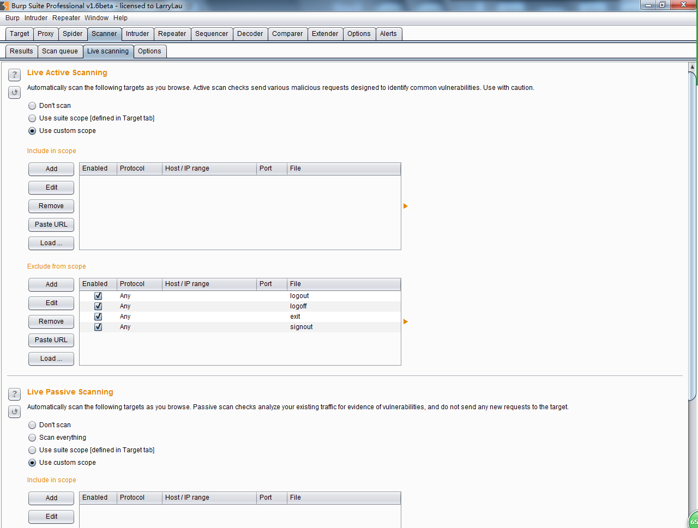 如果你选中了 Use suite Scope，则指定条件与你在 Burp Target 中的 Scope 配置完全一致，如果你选择了 Use customs scope，则可以自己定义 Scope，对于 Scope 的详细配置，请参考 Burp Target 中的 Scope 配置相关章节。

#### Burp Scanner 可选项设置

通过前几节的学习，我们已经知道 Burp Scanner 有主动扫描和被动扫描两个扫描方式，在 Options 子选项卡中，主要是针对这两种扫描方式在实际扫描中的扫描动作进行设置。具体的设置包含以下部分：

1.  攻击插入点设置（Attack Insertion Points）  Burp Scanner 在扫描中，基于原始的请求消息，在每一个插入点构造参数，对原数据进行替换，从而去验证系统漏洞的存在性。通常，以下位置都会被 Burp Scanner 选择为插入点。
2.  URL 请求参数
3.  Body 参数（比如 form 表单的值，上传文件、XML 参数、JSON 参数）
4.  Cookie 参数
5.  参数的名称和个数（通过增加参数个数或者增加参数来验证漏洞）
6.  Http Header 信息（通过对 header 信息的篡改来验证漏洞）
7.  AFM 编码（对 flash 通信漏洞的验证）
8.  REST 风格的参数

对于以上的攻击插入点，Burp Scanner 还是可以通过改变参数的位置来验证漏洞，Burp Scanner 中共有 URL to body 、URL to cookie、Body to URL、Body to cookie、Cookie to URL、Cookie to body 六种方式。当我们在扫描验证中，可以根据实际请求，灵活选择位置改变的组合，高效快速地验证漏洞。但我们也应该明白，当我们选中了位置改变来验证漏洞，即选择了 Burp 发送更多的请求，如果是在生成系统中的测试需要慎重。

另外，Burp 的攻击插入点也支持嵌套的方式，这意思是指，如果一个请求的参数值是 JSON 对象或者 XML 文本，Burp Scanner 在扫描时，可以对 JSON 对象或 XML 文本中的属性、属性值进行验证，这会极大地提高了 Burp Scanner 对漏洞扫描的涉及面。这是由上图中的 use nested insertion points 的 checkbox 是否选中去控制的，默认情况下是选中生效的。

当我们设置攻击插入点的同时，我们也可以指定哪些参数进行跳过，不需要进行漏洞验证。在设置时，Burp 是按照服务器端参数跳过和所有参数均跳过两种方式来管理的，界面如下图： 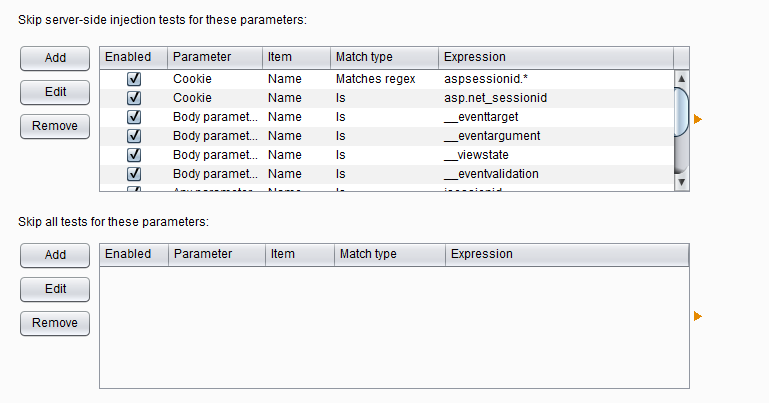

2 主动扫描引擎设置（Active Scanning Engine） 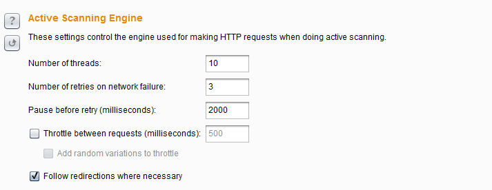 主动扫描引擎设置主要是用来控制主动扫描时的线程并发数、网络失败重试间隔、网络失败重试次数、请求延迟、是否跟踪重定向。其中请求延迟设置（Throttle between requests）和其子选项延迟随机数 （Add random variations to throttle）在减少应用负荷，模拟人工测试，使得扫描更加隐蔽，而不易被网络安全设备检测出来。 至于这些参数的具体设置，需要你根据服务器主机的性能、网络带宽、客户端测试机的性能做相应的调整。一般来说，如果您发现该扫描运行缓慢，但应用程序表现良好，你自己的 CPU 利用率较低，可以增加线程数，使您的扫描进行得更快。如果您发现发生连接错误，应用程序正在放缓，或你自己的电脑很卡，你应该减少线程数，加大对网络故障的重试次数和重试之间的间隔。

3.主动扫描优化设置（Active Scanning Optimization） 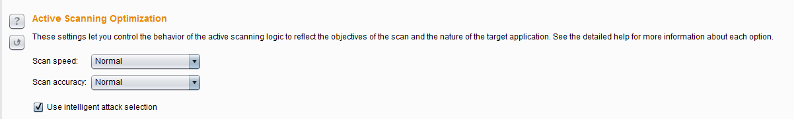 此选项的设置主要是为了优化扫描的速度和准确率，尽量地提高扫描速度的同时降低漏洞的误报率。 扫描速度（Scan speed）分快速、普通、彻底三个选项，不同的选项对应于不同的扫描策略，当选择彻底扫描（Thorough）时，Burp 会发送更多的请求，对漏洞的衍生类型会做更多的推导和验证。而当你选择快速扫描（Fast），Burp 则只会做一般性的、简单的漏洞验证。 扫描精准度（Scan accuracy）也同样分为三个选项：最小化假阴性（Minimize false negatives）、普通、最小化假阳性（Minimize false positives）。扫描精准度主要是用来控制 Burp 的扫描过程中针对漏洞的测试次数。当我们选择最小化假阳性时，Burp 会做更多的验证测试，来防止假阳性漏洞的存在，但也是恰恰基于此，当 Burp 做更多的验证测试时，可能存在恰好无法获取应答的误报，增加了漏洞的噪音。 智能攻击选择（Use intelligent attack selection ）这个选项通过智能地忽略一些攻击插入点基值的检查，比如说一个参数值包含不正常出现在文件名中的字符，Burp 将跳过文件路径遍历检查此参数，使用此选项可加速扫描，并降低在提升扫描速度的同时会导致漏报率上升的风险。

4.主动扫描范围设置（Active Scanning Areas） 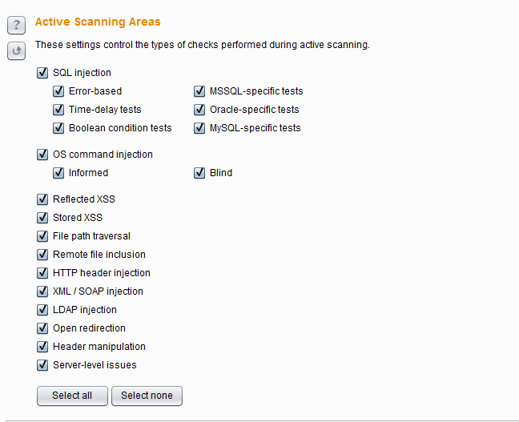 在主动扫描过程中，你可以根据你的扫描时间、关注的重点、可能性存在的漏洞类型等情况，选择不同的扫描范围。这里可选择的扫描范围有：

*   SQL 注入 -可以使不同的测试技术（基于误差，时间延迟测试和布尔条件测试），并且也使检查所特有的单独的数据库类型（MSSQL，Oracle 和 MySQL 的）。
*   操作系统命令注入 - （信息通知和盲注）。
*   反射式跨站点脚本
*   存储的跨站点脚本
*   文件路径遍历
*   HTTP 头注入
*   XML/ SOAP 注入
*   LDAP 注入
*   URL 重定向
*   http 消息头可操纵
*   服务器的问题

5.被动扫描范围设置（Passive Scanning Areas） 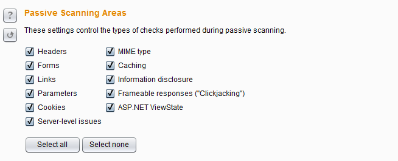 因为被动扫描不会发送新的请求，只会对原有数据进行分析，其扫描范围主要是请求和应答消息中的如下参数或漏洞类型：Headers、Forms、Links、Parameters、Cookies、MIME type、Caching、敏感信息泄露、Frame 框架点击劫持、ASP.NET ViewState 。