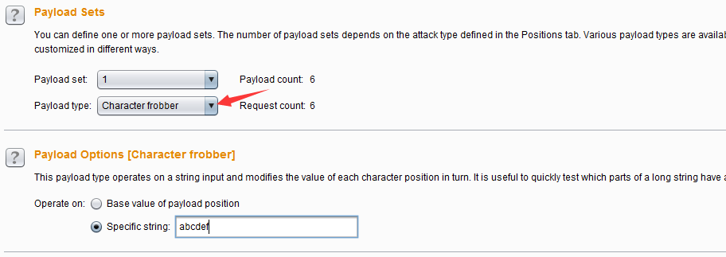

# 第八章 如何使用 Burp Intruder

### 第八章 如何使用 Burp Intruder

Burp Intruder 作为 Burp Suite 中一款功能极其强大的自动化测试工具，通常被系统安全渗透测试人员被使用在各种任务测试的场景中。本章我们主要学习的内容有：

*   Intruder 使用场景和操作步骤
*   Payload 类型与处理
*   Payload 位置和攻击类型
*   可选项设置（Options）
*   Intruder 攻击和结果分析

* * *

#### Intruder 使用场景和操作步骤

在渗透测试过程中，我们经常使用 Burp Intruder，它的工作原理是：Intruder 在原始请求数据的基础上，通过修改各种请求参数，以获取不同的请求应答。每一次请求中，Intruder 通常会携带一个或多个有效攻击载荷（Payload),在不同的位置进行攻击重放，通过应答数据的比对分析来获得需要的特征数据。Burp Intruder 通常被使用在以下场景：

1.  标识符枚举 Web 应用程序经常使用标识符来引用用户、账户、资产等数据信息。例如，用户名，文件 ID 和账户号码。
2.  提取有用的数据 在某些场景下，而不是简单地识别有效标识符，你需要通过简单标识符提取一些其他的数据。比如说，你想通过用户的个人空间 id，获取所有用户在个人空间标准的昵称和年龄。
3.  模糊测试 很多输入型的漏洞，如 SQL 注入，跨站点脚本和文件路径遍历可以通过请求参数提交各种测试字符串，并分析错误消息和其他异常情况，来对应用程序进行检测。由于的应用程序的大小和复杂性，手动执行这个测试是一个耗时且繁琐的过程。这样的场景，您可以设置 Payload，通过 Burp Intruder 自动化地对 Web 应用程序进行模糊测试。

通常来说，使用 Burp Intruder 进行测试，主要遵循以下步骤：

1.  确认 Burp Suite 安装正确并正常启动，且完成了浏览器的代理设置。
2.  进入 Burp Proxy 选项卡，关闭代理拦截功能。
3.  进行历史日志（History）子选项卡，查找可能存在问题的请求日志，并通过右击菜单，发送到 Intruder。 
4.  进行 Intruder 选项卡，打开 Target 和 Positions 子选项卡。这时，你会看到上一步发送过来的请求消息。 
5.  因为我们了解到 Burp Intruder 攻击的基础是围绕刚刚发送过来的原始请求信息，在原始信息指定的位置上设置一定数量的攻击载荷 Payload，通过 Payload 来发送请求获取应答消息。默认情况下，Burp Intruder 会对请求参数和 Cookie 参数设置成 Payload position，前缀添加 $符合，如上图红色标注位置所示。当发送请求时，会将$标识的参数替换为 Payload。
6.  在 Position 界面的右边，有【Add $】、【Clear $】、【Auto $】、【Refersh $】四个按钮，是用来控制请求消息中的参数在发送过程中是否被 Payload 替换，如果不想被替换，则选择此参数，点击【Clear $】,即将参数前缀$去掉。
7.  当我们打开 Payload 子选项卡，选择 Payload 的生成或者选择策略，默认情况下选择“Simple list",当然你也可以通过下拉选择其他 Payload 类型或者手工添加。 
8.  此时，我们再回到 Position 界面，在界面的右上角，点击【Start attack】，发起攻击。 
9.  此时，Burp 会自动打开一个新的界面，包含攻击执行的情况、Http 状态码、长度等结果信息。 
10.  我们可以选择其中的某一次通信信息，查看请求消息和应答消息的详细。 
11.  很多时候，为了更好的标明应答消息中是否包含有我们需要的信息，通常在进行攻击前，会进行 Options 选项的相关配置，使用最多的为正则表达式匹配（Grep - Match）。 
12.  或者，我们使用结果选项卡中的过滤器，对结果信息进行筛选。 
13.  同时，结果选项卡中所展示的列我们是可以进行指定的，我们可以在菜单 Columns 进行设置。 
14.  最后，选择我们需要的列，点击【Save】按钮，对攻击结果进行保存。 
15.  当然，保存之前我们也可以对保存的内容进行设置。 

以上这些，是 Burp Intruder 一次完成的操作步骤，在实际使用中，根据每一个人的使用习惯，会存在或多或少的变动。而每一个环节中涉及的更详细的配置，将在接下来的章节中做更细致的阐述。

* * *

#### Payload 类型与处理

在 Burp Intruder 的 Payload 选项卡中，有 Payload 集合的设置选项，包含了经常使用的 Payload 类型，共 18 种。 

他们分别是：

*   简单列表（Simple list） ——最简单的 Payload 类型，通过配置一个字符串列表作为 Payload，也可以手工添加字符串列表或从文件加载字符串列表。其设置界面如下图  在此操作界面上，选择的 Payload 列表中，已经预定义了一组简单 Payload 列表，包括 XSS 脚本、CGI 脚本、SQL 注入脚本、数字、大写字母、小写字母、用户名、密码、表单域的字段名、IIS 文件名和目录名等等，极大地方便了渗透测试人员的使用。

*   运行时文件（Runtime file） ——指定文件，作为相对应 Payload 位置上的 Payload 列表。其设置界面如下图：  当我们如上图所示，指定 Payload set 的位置 1 使用的 Payload 类型为 Runtime file 时，下方的 Payload Options 将自动改变为文件选择按钮和输入框，当我们点击【select file】选择文件时，将弹出图中所示的对话框，选择指定的 Payload 文件。运行时，Burp Intruder 将读取文件的每一行作为一个 Payload。

*   自定义迭代器（Custom iterator）——这是一款功能强大的 Payload，它共有 8 个占位，每一个占位可以指定简单列表的 Payload 类型，然后根据占位的多少，与每一个简单列表的 Payload 进行笛卡尔积，生成最终的 Payload 列表。例如，某个参数的值格式是 username@@password，则设置此 Payload 的步骤是：位置 1，选择 Usernames  接着，指定位置 2，输入值@@  最后指定位置 3，选择 Passwords  当我们开始攻击时，生成的 Payload 值如图所示 

*   字符串替换（Character substitution）——顾名思义，此种 Payload 的类型是对预定义的字符串进行替换后生成新的 Payload。比如说，预定义字符串为 ABCD，按照下图的替换规则设置后，将对 AB 的值进行枚举后生成新的 Payload。  生成的 Payload 如下图所示，分别替换了上图中的 a 和 b 的值为 4 与 8 

*   大小写替换（Case modification）——对预定义的字符串，按照大小写规则，进行替换。比如说，预定义的字符串为 Peter Wiener，则按照下图的设置后，会生成新的 Payload。  生成的 Payload 如下  生成规则由上而下依次是：No change（不改变，使用原始字符串）、To lower case（转为小写字母）、To upper case（转为大写字母）、To Propername（首字母大写，其他小写）、To ProperName（首字母大写，其他不改变），在实际使用中，可以根据自己的使用规则进行勾选设置。

*   递归 grep （Recursive grep）——此 Payload 类型主要使用于从服务器端提取有效数据的场景，需要先从服务器的响应中提取数据作为 Payload，然后替换 Payload 的位置，进行攻击。它的数据来源了原始的响应消息，基于原始响应，在 Payload 的可选项设置（Options）中配置 Grep 规则，然后根据 grep 去提取数据才能发生攻击。比如，我在 grep extract 中设置取服务器端的 EagleId 作为新的 Payload 值。  点击上图的【OK】按钮之后，完成了 Payload 的设置。  当我发起攻击时，Burp 会对每一次响应的消息进行分析，如果提取到了 EagleId 的值，则作为 Payload 再发生一次请求。操作图如下：  上图中请求序号为偶数的消息的 Payload 都是上一次服务器端响应的报文中的 EagleId 的值。

*   不合法的 Unicode 编码（Illegal Unicode）—— 在 payloads 里用指定的不合法 Unicode 编码替换字符本身，从这些 Payload 列表里产生出一个或者多个有效负荷。在尝试回避基于模式匹配的输入验证时，这个有效负荷会有用的，例如，在防御目录遍历攻击时../和..序列的期望编码的匹配。其配置界面如下：  上图中的配置选项主要用来控制不合法编码的生成，各项的含义如下： **maximum overlong UTF-8 length** Unicode 编码允许最多使用 6 字节表示一个字符。使用一种类型就可以正确地表示出(0x00-0x7F) Basic ASCII 字符。然而，使用多字节的 Unicode 方案也能表示出它们(如， ”overlong”编码)。下拉菜单用来指定是否使用超长编码，以及应该设定的最大使用长度。 **Illegal UTF-8 continuation bytes ** 当选择的最大超长 UTF-8 长度为 2 字节以上，这个选项是可用的。 **Do illegal UTF-8 ** 当使用多字节编码一个字符时，第一个字节后面的字节应该用 10XXXXXX 这样的二进制格式，来指出后续的字节。然而，第一个字节里最有意义的位会指出后面还有多少后续字节。因此，Unicode 编码例程会安全地忽略掉后续字节的前 2 位。这就意味着每个后续字节可能有 3 个非法变种，格式为 00XXXXXX， 01XXXXXX 和 11XXXXXX。如果选中这个选项，则非法 Unicode 有效负荷源会为每个后续字节生成 3 个附加编码。 **Maximize permutations in multi-byte encodings ** 如果选择的最大超长 UTF-8 长度为 3 字节以上，并且选中” illegal UTF-8 ”这个选项可用。如果”Maximize permutations in multi-byte encodings”没被选中，则在生产非法变种时，不合法 Unicode 有效负荷源会按顺序处理每个后续字节，为每个后续字节产生 3 个非法变种，并且其他的后续字节不会改变。如果”Maximize permutations in multi-byte encodings”被选中了，不合法 的 Unicode 有效负荷源会为后续字节生成所有的非法变种排序 。 如，多个后续字节会同时被修改。在目标系统上回避高级模式匹配控制时，这个功能就会很有用。 **Illegal hex** 这个选择基本上一直可用。当使用超长编码和后续字节的非法变种(如果选中)生成非法编码项列表时，通过修改由此产生的十六进制编码可能会迷惑到某种模式匹配控制。十六进制编码使用字符 A—F 代表十进制 10—15 的值。然而有些十六进制编码会把 G 解释为 16， H 为 17，等等。因此 0x1G 会被解释为 32。另外，如果非法的十六进制字符使用在一个 2 位数的十六进制编码的第一个位置，则由此产生的编码就会溢出单个字节的大小，并且有些十六进制编码只使用了结果数字的后 8 个有效位，因此 0x1G 会被解码为 257，而那时会被解释为 1。每个合法的 2 位数的十六进制编码有 4—6 种相关的非法十六进制表示，如果使用的是上面的编码，则这些表示会被解释为同一种十六进制编码。如果”illegal hex”被选中，则非法 Unicode 有效负荷源会在非法编码项列表里，生成每个字节的所有可能的非法十六进制编码。 **Maximize permutations in multi-byte encodings** 如果选中的最大超长 UTF-8 长度为 2 字节以上并且“illegal hex”也被选中，则这个选项可用。如果 Maximize permutations in multi-byte encodings”没被选中，在生成非法十六进制编码时，非法 Unicode 有效负荷源会按顺序处理每个字节。对于每个字节，会生成 4—6 个非法十六进制编码，其他的字节不变。如果 Maximize permutations in multi-byte encodings”被选中，则非法 Unicode 有效负荷源会为所有的字节，生成非法十六进制的所有排序。如，多个字节会被同时修改。在目标系统上回避高级模式匹配控制时，这个功能会非常有用。 **add % prefix** 如果选中这个选项，在产生的有效负荷里的每个 2 位数十六进制编码前面，都会插入一个%符号。 **Use lower case alpha characters ** 这个选项决定了是否在十六进制编码里使用大小写字母。 **Total encodings** 这个选项为会产生的非法编码数量放置了一个上界，如果大量使用超长编码或者选中了最大列表，这个选项会很有用，因为那会生成大量的非法编码。 **Match / replace in list items ** 这个选项用户控制 Payload 列表中的字符串，它是由匹配字符（Match character）和替换字符编码（Replace with encodings of ）来成对的控制 Payload 的生成。

    当攻击执行时，这个有效负荷源会迭代所有预设项列表，在非法编码集合里，每个预设 项替换每个项里的指定字符的所有实例。

*   字符块（Character blocks）——这种类型的 Payload 是指使用一个给出的输入字符串，根据指定的设置产生指定大小的字符块，表现形式为生成指定长度的字符串。它通常使用了边界测试或缓冲区溢出。  Base string 是指设置原始字符串，Min length 是指 Payload 的最小长度，Max length 是指 Payload 的最大长度，Step 是指生成 Payload 时的步长。如上图的配置后，生成的 Payload 如下图所示： 

*   数字类型（Number）——这种类型的 Payload 是指根据配置，生成一系列的数字作为 Payload。它的设置界面如下：  **Type**表示使用序列还是随机数，**From**表示从什么数字开始，**To**表示到什么数字截止，**Step**表示步长是多少，如果是随机数，则**How many**被激活，表示一共生成多少个随机数。**Base**表示数字使用十进制还是十六进制形式，**Min integer digits** 表示最小的整数是多少，**Max integer digits**表示最大的整数是多少，如果是 10 进制，则**Min fraction digits** 表示小数点后最少几位数，**Max fraction digits**表示小数点后最多几位数。

*   日期类型（Dates）——这种类型的 Payload 是指根据配置，生成一系列的日期。界面如下  其设置选项比较简单，没有什么特别复杂的，不再赘述。至于日期格式，可以选择 Burp 自己提供的样例格式，也可以自定义，自定义的时候，格式的填写形式如下表所示 | 格式 | 样例| |--------|--------| | E | Sat | | EEEE | Saturday | | d | 7 | | dd | 07 | | M | 6 | | MM | 06 | | MMM | Jun | | MMMM| June | | yy| 16 | | yyyy| 2016 |

*   暴力字典（Brute forcer）——此类 Payload 生成包含一个指定的字符集的所有排列特定长度的有效载荷，通常用于枚举字典的生成，其设置界面如下：  **Character set** 表示生成字典的数据集，从此数据集中抽取字符进行生成。**Min length**表示生成 Payload 的最小长度，**Max length**表示生成 Payload 的最大长度。

*   空类型（Null payloads）——这种负载类型产生的 Payload，其值是一个空字符串。在攻击时，需要同样的请求反复被执行，在没有任何修改原始请求的场景下此 Payload 是非常有用的。它可用于各种攻击，例如 cookie 的序列分析、应用层 Dos、或保活会话令牌是在其它的间歇试验中使用。  在配置 Payload 生成方式时，它有两个选项，我们可以指定生成（Generate）多少 Payload，也可以设置为一直持续攻击（Continue indefinitely）

*   字符 frobber（Character frobber）——这种类型的 Payload 的生成规律是：依次修改指定字符串在每个字符位置的值，每次都是在原字符上递增一个该字符的 ASCII 码。它通常使用于测试系统使用了复杂的会话令牌的部件来跟踪会话状态，当修改会话令牌中的单个字符的值之后，您的会话还是进行了处理，那么很可能是这个令牌实际上没有被用来追踪您的会话。其配置界面如图：  执行后生成的 Payload 如下图所示： 

*   Bit 翻转（Bit flipper）——这种类型的 Payload 的生成规律是：对预设的 Payload 原始值，按照比特位，依次进行修改。它的设置界面如下图：  其设置选项主要有：**Operate on** 指定是对 Payload 位置的原始数据进行 Bit 翻转还是指定值进行 Bit 翻转，**Format of original data** 是指是否对原始数据的文本意义进行操作，还是应该把它当作 ASCII 十六进制，**Select bits to flip**是指选择翻转的 Bit 位置。 您可以配置基于文本意义进行操作，或基于 ASCII 十六进制字符串进行翻转。例如，如果原始值是“ab”，基于文本意义的翻转结果是：

    ```
    `b
    cb
    eb
    ib
    qb
    Ab
    !b
    ¡b
    ac
    a`
    af
    aj
    ar
    aB
    a"
    a¢ 
    ```

    如果是基于 ASCII 十六进制字符串进行翻转，则结果是：

    ```
    aa
    a9
    af
    a3
    bb
    8b
    eb
    2b 
    ```

    这种类型的 Payload 类似于字符 frobber，但在你需要更细粒度的控制时是有用的。例如，会话令牌或其他参数值使用 CBC 模式的块密码加密，有可能系统地由前一密码块内修改 Bit 位以改变解密后的数据。在这种情况下，你可以使用的 Bit 翻转的 Payload 来确定加密值内部修改了个别 bit 位后是否对应用程序产生影响，并了解应用程序是否容易受到攻击。关于加密模式可以[点击阅读这篇文章](http://blog.chinaunix.net/uid-20606164-id-3208475.html)做进一步的了解。

*   用户名生成器（Username generator）这种类型的 Payload 主要用于用户名和 email 帐号的自动生成，其设置界面如下图：  如上图所示，我设置了原始值为 t0data@hotmail.com,然后执行此 Payload 生成器，其生成的 Payload 值如图所示 

*   ECB 加密块洗牌（ECB block shuffler）——这种类型的 Payload 是基于 ECB 加密模式的 Payload 生成器，关于加密模式可以[点击阅读这篇文章](http://blog.chinaunix.net/uid-20606164-id-3208475.html)做进一步的了解。其原理是因为 ECB 加密模式中每组 64 位的数据之间相互独立，通过改变分组数据的位置方式来验证应用程序是否易受到攻击。其设置界面如下图，Payload 的配置参数同上一个 Payload 类型雷同，就不再赘述。如图： 

*   Burp Payload 生成插件（Extension-generated）——这种类型的 Payload 是基于 Burp 插件来生成 Payload 值，因此使用前必须安装配置 Burp 插件，在插件里注册一个 Intruder payload 生成器，供此处调用。其基本设置和使用步骤如下图所示，因后续章节将重点叙述 Burp 插件，此处不再展开。 

*   Payload 复制（Copy other payload）——这种类型的 Payload 是将其他位置的参数复制到 Payload 位置上，作为新的 Payload 值，通常适用于多个参数的请求消息中，它的使用场景可能是： 1.两个不同的参数需要使用相同的值，比如说，用户注册时，密码设置会输入两遍，其值也完全一样，可以使用此 Payload 类型。 2.在一次请求中，一个参数的值是基于另一个参数的值在前端通过脚本来生成的值，可以使用此 Payload 类型。 它的设置界面和参数比较简单，如下图所示，其中 Payload 位置的索引值就是指向图中 Payload set 的值。 

* * *

#### Payload 位置和攻击类型

首先我们来看看 Payload 位置（Payload positions）选项卡的设置界面：  从上图中我们可以看出，Payload 位置的设置是基于 Http 请求的原始消息作为母板，使用一对 §字符来标记出 Payload 的位置，在这两个号直接包含了母板文本内容。 当我们已经把一个 Payload 在请求消息的特殊位置上时标明后，发起攻击时，Burp Intruder 就把一个 Payload 值放置到给出的特殊位置上，替换 §符号标示的整个位置。如上图中的参数 id 后面的 §符号之间的标明的是 Payload 位置 1，name 后面的 §符号之间标明的是 Payload 位置 2，这个值对应于 Payload 设置中的 Payload set 的值。 我们可以在消息编辑器中间对 Payload 位置进行编辑，它主要是由右侧的四个按钮来控制的。

*   【Add §】——在当前光标的位置添加一个 Payload 位置标志
*   【Clear §】——清除所有 Payload 位置标志或者清除选中的 Payload 位置标志
*   【Auto §】——对消息内容中可能需要标志的参数做一个猜测，标志为 Payload 位置，自动设置完之后再做人工的选择，确定哪些位置是需要传入 Payload 的。目前 Burp 支持自动选择的参数类型有： 1.URL 请求参数 2.Body 参数 3.cookie 参数 4.复合型参数属性，比如文件上传时候的文件名 5.XML 数据 6.JSON 数据 虽然 Burp 默认是支持自动标志这些类型的参数作为 Payload 位置，但如果是针对于像 XML 或 JSON 的节点属性值的，还是需要手工指定。

*   【Refresh】——刷新消息内容中带有颜色的部分。

*   【Clear】——清除消息编辑器中所有内容。

在消息编辑器的上方，有一个下拉选择框，攻击类型（Attack Type）。Burp Intruder 支持使用 Payload 进行多种方式的模拟攻击，目前只要有以下 4 种。

*   狙击手模式（Sniper）——它使用一组 Payload 集合，依次替换 Payload 位置上（一次攻击只能使用一个 Payload 位置）被§标志的文本（而没有被§标志的文本将不受影响），对服务器端进行请求，通常用于测试请求参数是否存在漏洞。

*   攻城锤模式（Battering ram）——它使用单一的 Payload 集合，依次替换 Payload 位置上被§标志的文本（而没有被§标志的文本将不受影响），对服务器端进行请求，与狙击手模式的区别在于，如果有多个参数且都为 Payload 位置标志时，使用的 Payload 值是相同的，而狙击手模式只能使用一个 Payload 位置标志。

*   草叉模式（Pitchfork ）——它可以使用多组 Payload 集合，在每一个不同的 Payload 标志位置上（最多 20 个），遍历所有的 Payload。举例来说，如果有两个 Payload 标志位置，第一个 Payload 值为 A 和 B，第二个 Payload 值为 C 和 D，则发起攻击时，将共发起**两**次攻击，第一次使用的 Payload 分别为 A 和 C，第二次使用的 Payload 分别为 B 和 D。

*   集束炸弹模式（Cluster bomb） 它可以使用多组 Payload 集合，在每一个不同的 Payload 标志位置上（最多 20 个），依次遍历所有的 Payload。它与草叉模式的主要区别在于，执行的 Payload 数据 Payload 组的乘积。举例来说，如果有两个 Payload 标志位置，第一个 Payload 值为 A 和 B，第二个 Payload 值为 C 和 D，则发起攻击时，将共发起**四**次攻击，第一次使用的 Payload 分别为 A 和 C，第二次使用的 Payload 分别为 A 和 D，第三次使用的 Payload 分别为 B 和 C，第四次使用的 Payload 分别为 B 和 D。

* * *

##### 可选项设置（Options）

可选项设置主要包括请求消息头设置、请求引擎设置、攻击结果设置、grep match, grep extract, grep payloads,以及重定向设置。在使用中，你可以在攻击前进行设置，也可以在攻击过程中做这些选项的调整。

*   请求消息头设置（Request Headers）——这个设置主要用来控制请求消息的头部信息，它由**Update Content-Length header**和**Set Connection: close**两个选项组成。其中**Update Content-Length header**如果被选中，Burp Intruder 在每个请求添加或更新 Content-Length 头为该次请求的 HTTP 体的长度正确的值。这个功能通常是为插入可变长度的 Payload 到模板的 HTTP 请求的主体的攻击中，如果没有指定正确的值，则目标服务器可能会返回一个错误，可能会到一个不完整的请求做出响应，或者可能会无限期地等待请求继续接收数据。**Set Connection: close**如果被选中，表示 Burp Intruder 在每个请求消息中添加或更新值为“关闭”的连接头，这将更迅速地执行。在某些情况下（当服务器本身并不返回一个有效的 Content-Length 或 Transfer-Encoding 头），选中此选项可能允许攻击。 
*   请求引擎设置（Request Engine）——这个设置主要用来控制 Burp Intruder 攻击，合理地使用这些参数能更加有效地完成攻击过程。它有如下参数：**Number of threads**并发的线程数，**Number of retries on network failure** 网络失败时候重试次数，**Pause before retry**重试前的暂停时间间隔（毫秒），**Throttle between requests** 请求延时（毫秒），**Start time**开始时间，启动攻击之后多久才开始执行。 

*   攻击结果设置（Attack Results）——这个设置主要用来控制从攻击结果中抓取哪些信息。它的参数有：**Store requests / responses** 保存请求/应答消息，**Make unmodified baseline request** 记录请求母板的消息内容，**Use denial-of-service mode**使用 Dos 方式，**tore full payloads**存储所有的 Payload 值。 

*   Grep Match——这个设置主要用来从响应消息中提取结果项，如果匹配，则在攻击结果中添加的新列中标明，便于排序和数据提取。比如说，在密码猜测攻击，扫描诸如“密码不正确”或“登录成功”，可以找到成功的登录;在测试 SQL 注入漏洞，扫描包含“ODBC”，“错误”等消息可以识别脆弱的参数。  其选项有**Match type**表示匹配表达式还是简单的字符串，**Case sensitive match**是否大小写敏感，**Exclude HTTP headers**匹配的时候，是否包含 http 消息头。

*   Grep Extract——这些设置可用于提取响应消息中的有用信息。对于列表中配置的每个项目，Burp 会增加包含提取该项目的文本的新结果列。然后，您可以排序此列（通过单击列标题）命令所提取的数据。此选项是从应用数据挖掘有用的，能够支持广泛的攻击。例如，如果你是通过一系列文档 ID 的循环，可以提取每个文档寻找有趣的项目的页面标题。如果您发现返回的其他应用程序用户详细信息的功能，可以通过用户 ID 重复和检索有关用户寻找管理帐户，甚至密码。如果“遗忘密码”的功能需要一个用户名作为参数，并返回一个用户配置的密码提示，您可以通过共同的用户名列表运行和收获的所有相关密码的提示，然后直观地浏览列表寻找容易被猜到密码。 

*   Grep Payloads——这些设置可用于提取响应消息中是否包含 Payload 的值，比如说，你想验证反射性的 XSS 脚本是否成功，可以通过此设置此项。当此项设置后，会在响应的结果列表中，根据 Payload 组的数目，添加新的列，显示匹配的结果，你可以通过点击列标题对结果集进行排序和查找。  其设置项跟上一个类似，需要注意的是**Match against pre-URL-encoded payloads**，如果你在请求消息时配置了 URL-encode payloads ，则这里表示匹配未编码之前的 Payload 值，而不是转码后的值。

*   重定向（Redirections）——这些设置主要是用来控制执行攻击时 Burp 如何处理重定向，在实际使用中往往是必须遵循重定向，才能实现你的攻击目的。例如，在密码猜测攻击，每次尝试的结果可能是密码错误会重定向响应到一个错误消息提示页面，如果密码正确会重定向到用户中心的首页。 但设置了重定向也可能会遇到其他的问题，比如说，在某些情况下，应用程序存储您的会话中初始请求的结果，并提供重定向响应时检索此值，这时可能有必要在重定向时只使用一个单线程攻击。也可能会遇到，当你设置重定向，应用程序响应会重定向到注销页面，这时候，按照重定向可能会导致您的会话被终止时。 因其设置选项跟其他模块的重定向设置基本一致，此处就不再重叙。 

* * *

##### Intruder 攻击和结果分析

一次攻击的发起，通常有两种方式。一种是你在 Burp Intruder 里设置了 Target, Positions, Payloads and Options ，然后点击【Start attack】启动攻击；另一种是你打开一个之前保存的预攻击文件，然后点击【Start attack】启动攻击。无论是哪种方式的攻击发起，Burp 都将弹出攻击结果界面。在攻击的过程中，你也可以修改攻击配置，或者做其他的操作。攻击结果的界面如下图所示： 

从上图我们可以看出，其界面主要又菜单区、过滤器、Payload 执行结果消息记录区、请求/响应消息区四大部分组成。

*   菜单区 包含 Attack 菜单、Save 菜单、Columns 菜单。 **Attack 菜单**主要用来控制攻击行为的，你可以暂停攻击（**pause**）、恢复攻击（**resume**）、再次攻击（**repeat**）。 **Save 菜单**主要用来保存攻击的各种数据，**Attack** 保存当前攻击的副本，下次可以从此文件进行再次攻击；**Results table**保存攻击的结果列表，相当于图中的 Payload 执行结果消息记录区数据，当然你可以选择行和列进行保存，只导出你需要的数据；**Server responses** 保存所有的服务器响应消息；**Attack configuration**保存当前的攻击配置信息。 **Columns 菜单**主要用来控制消息记录区的显示列。如果某个列被选中，则在 Payload 执行结果消息记录区显示，反之则不显示。

*   过滤器 ——可以通过查询条件、服务器响应的状态码、注释过 Payload 执行结果消息记录区的信息进行过滤。

*   Payload 执行结果消息记录区，又称结果列表（Results Table），记录 Payload 执行时请求和响应的所有信息，它包含的列有： **请求序列**——显示请求的序列号，如果配置了记录未修改的请求消息母板，则会在第一个进行记录。 **Payload 位置**——狙击手模式下会记录 **Payload 值**——如果有多个 Payload，则存在多个列 **HTTP 状态码**——服务器响应状态码 **请求时间**——执行攻击的时间 **响应时间**——开始接受到响应时间，单位为毫秒。 **响应完成时间**——响应完成的时间，单位为毫秒。 **网络错误**——Payload 执行时是否发生网络问题 **超时情况**——等待应答响应过程中，是否发生网络超时 **长度**——响应消息的长度 **Cookie**——任何的 Cookie 信息 **Grep**——如果设置了 Grep 匹配、Grep 提取、Grep Payload，则会有多个列显示匹配的信息 **重定向**——如果配置了重定向，则显示 **注释**——消息记录的注释信息

*   请求/响应消息区——参考 Proxy 章节的相关叙述。

在对攻击结果的分析中，你可以通过单击任一列标题（单击标题循环通过升序排序，降序排序和未排序）重新排序表的内容。有效地解释攻击的结果的一个关键部分是定位有效的或成功的服务器响应，并确定生成这些请求。有效的应答通常可以通过以下中的至少一个存在差异： 1.不同的 HTTP 状态代码 2.不同长度的应答 3.存在或不存在某些表达式 4.错误或超时的发生 5.用来接收或完成响应时间的差异 比如说，在 URL 路径扫描过程中，对不存在的资源的请求可能会返回“404 未找到”的响应，或正确的 URL 会反馈的“200 OK”响应。或者在密码猜测攻击，失败的登录尝试可能会产生一个包含“登录失败”关键字“200 OK”响应，而一个成功的登录可能会生成一个“302 对象移动”的反应，或不同的“200 OK”响应页面。

每一个渗透测试人员，对 Burp Intruder 攻击结果的分析方式可能会存在差异，这主要源于个人水平的不同和经验的不同。在实战中，只有慢慢尝试，积累，才能通过快速地对攻击结果的分析获取自己关注的重要信息。