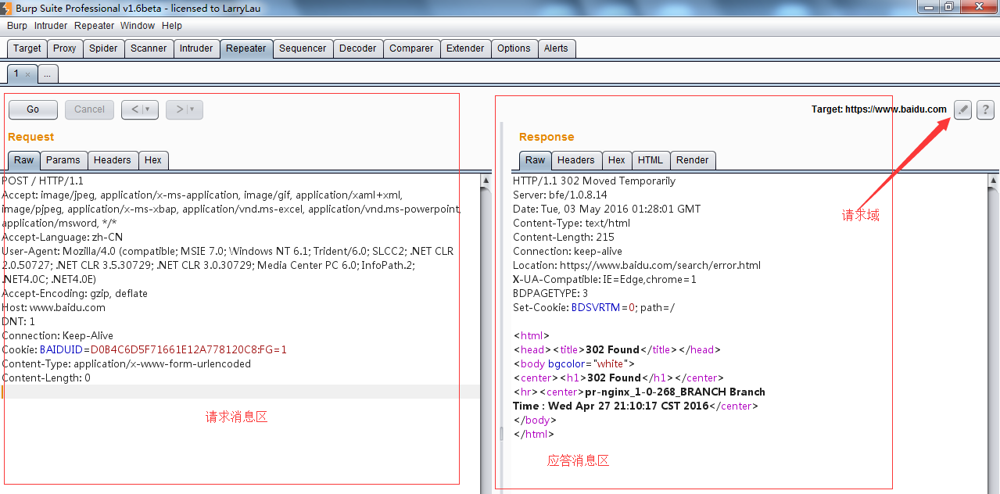
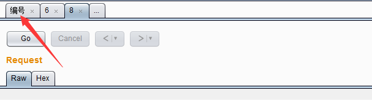
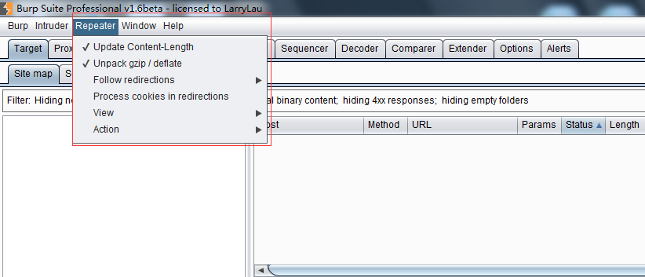

# 第九章 如何使用 Burp Repeater

### 第九章 如何使用 Burp Repeater

Burp Repeater 作为 Burp Suite 中一款手工验证 HTTP 消息的测试工具，通常用于多次重放请求响应和手工修改请求消息的修改后对服务器端响应的消息分析。本章我们主要学习的内容有：

*   Repeater 的使用
*   可选项设置（Options）

* * *

##### Repeater 的使用

在渗透测试过程中，我们经常使用 Repeater 来进行请求与响应的消息验证分析，比如修改请求参数，验证输入的漏洞；修改请求参数，验证逻辑越权；从拦截历史记录中，捕获特征性的请求消息进行请求重放。Burp Repeater 的操作界面如下图所示：

请求消息区为客户端发送的请求消息的详细信息，Burp Repeater 为每一个请求都做了请求编号，当我们在请求编码的数字上双击之后，可以修改请求的名字，这是为了方便多个请求消息时，做备注或区分用的。在编号的下方，有一个【GO】按钮，当我们对请求的消息编辑完之后，点击此按钮即发送请求给服务器端。服务器的请求域可以在 target 处进行修改，如上图所示。 

应答消息区为对应的请求消息点击【GO】按钮后，服务器端的反馈消息。通过修改请求消息的参数来比对分析每次应答消息之间的差异，能更好的帮助我们分析系统可能存在的漏洞。

在我们使用 Burp Repeater 时，通常会结合 Burp 的其他工具一起使用，比如 Proxy 的历史记录，Scanner 的扫描记录、Target 的站点地图等，通过其他工具上的右击菜单，执行【Send to Repeater】，跳转到 Repeater 选项卡中，然后才是对请求消息的修改以及请求重放、数据分析与漏洞验证。

* * *

##### 可选项设置（Options）

与 Burp 其他工具的设置不同，Repeater 的可选项设置菜单位于整个界面顶部的菜单栏中，如图所示：  其设置主要包括以下内容：

*   更新 Content-Length
    这个选项是用于控制 Burp 是否自动更新请求消息头中的 Content-Length

*   解压和压缩（Unpack gzip / deflate ） 这个选项主要用于控制 Burp 是否自动解压或压缩服务器端响应的内容

*   跳转控制（Follow redirections） 这个选项主要用于控制 Burp 是否自动跟随服务器端作请求跳转，比如服务端返回状态码为 302，是否跟着应答跳转到 302 指向的 url 地址。 它有 4 个选项，分别是永不跳转（Never），站内跳转（On-site only ）、目标域内跳转（In-scope only）、始终跳转（Always），其中永不跳转、始终跳转比较好理解，站内跳转是指当前的同一站点内跳转；目标域跳转是指 target scope 中配置的域可以跳转；

*   跳转中处理 Cookie（Process cookies in redirections ） 这个选项如果选中，则在跳转过程中设置的 Cookie 信息，将会被带到跳转指向的 URL 页面，可以进行提交。

*   视图控制（View） 这个选项是用来控制 Repeater 的视图布局

*   其他操作（Action） 通过子菜单方式，指向 Burp 的其他工具组件中。