# 第十章 如何使用 Burp Sequencer

### 第十章 如何使用 Burp Sequencer

Burp Sequencer 作为 Burp Suite 中一款用于检测数据样本随机性质量的工具，通常用于检测访问令牌是否可预测、密码重置令牌是否可预测等场景，通过 Sequencer 的数据样本分析，能很好地降低这些关键数据被伪造的风险。本章我们主要学习的内容有：

*   Sequencer 使用步骤
*   可选项设置（Options）

* * *

##### Sequencer 使用步骤

Burp Sequencer 作为一款随机数分析的工具，在分析过程中，可能会对系统造成不可预测的影响，在你不是非常熟悉系统的情况下，建议不要在生产环境进行数据分析。它的使用步骤大体如下： 1.首先，确认 Burp Suite 安装正确，并配置好浏览器代理，正常运行。 2.从 Burp Proxy 的历史日志记录中，寻找 token 或类似的参数，返回右击弹出上下文菜单，点击【Send to Sequencer】。 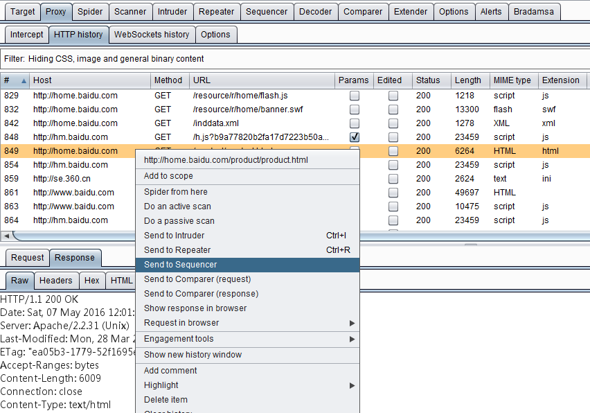 3.进入 Burp Sequencer 的 Live Capture 面板，选中刚才发送过来的记录，点击【Configure】配置需要分析的 token 或者参数。 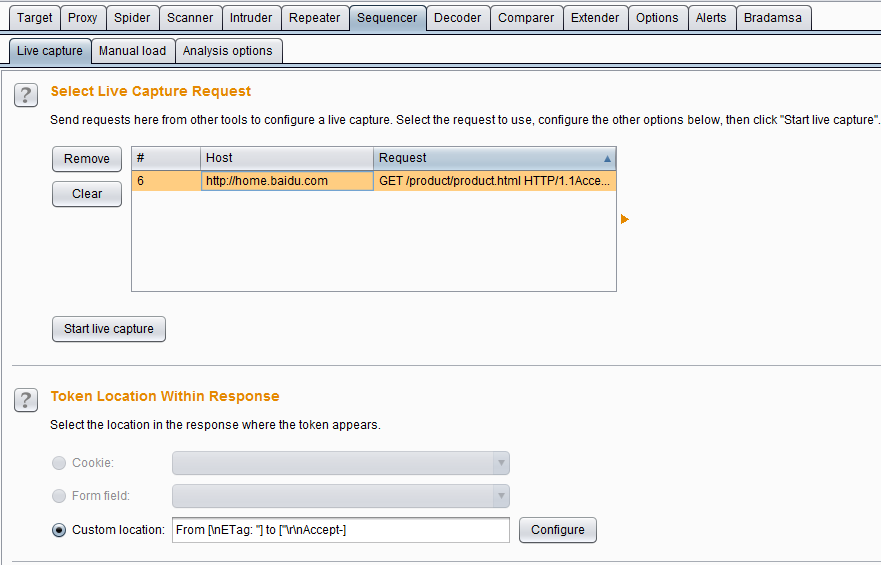 4.在弹出的参数配置对话框中，选中参数的值，点击【OK】按钮，完成参数设置。 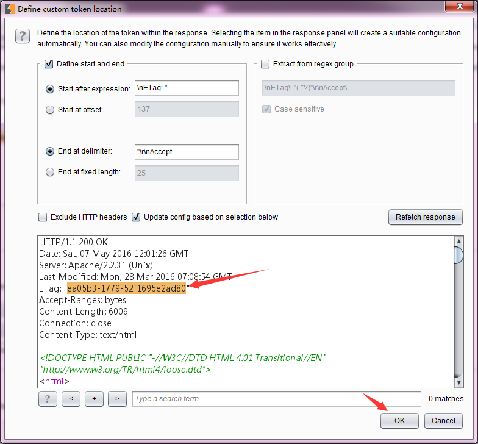 5.点击【Select Live Capture】，开始进行参数值的获取。 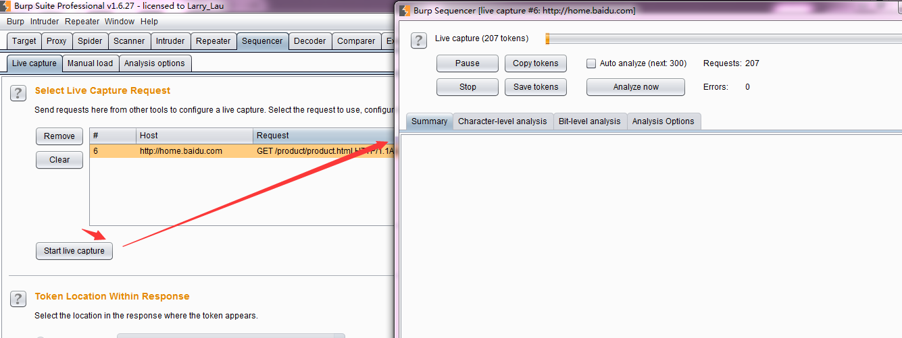 6.当抓取的参数值总数大于 100 时，点击【pause】或者【stop】，这时可以进行数据分析，点击【Analyze now】即进行数据的随机性分析。 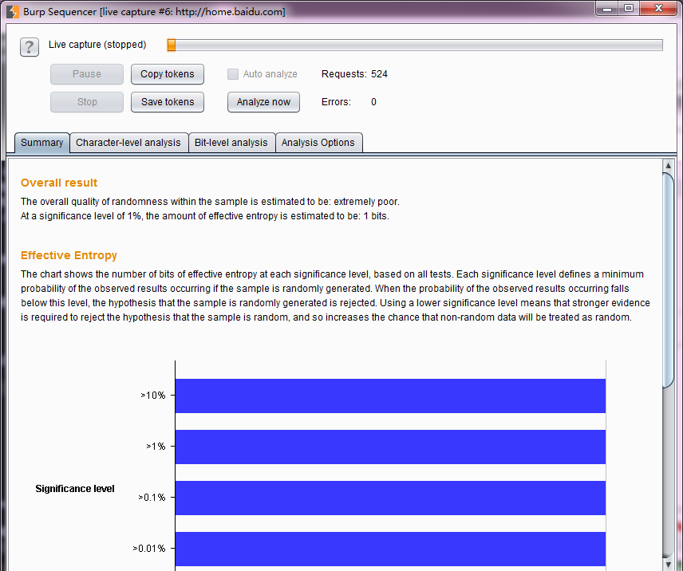 7.等分析结束，则可以看到分析结果的各种图表。 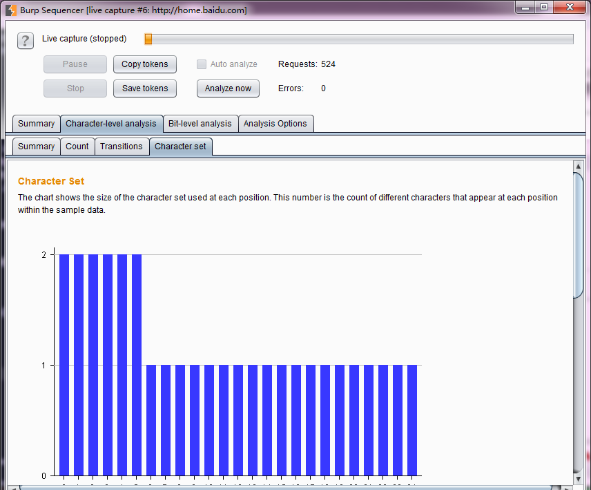 8.当然，我们也可以把获取的数据保存起来，下一次使用的时候，从文件加载参数，进行数据分析。如下图保存数据。 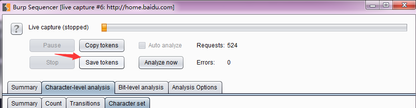 9.当我再次使用时，直接加载数据进行分析即可。 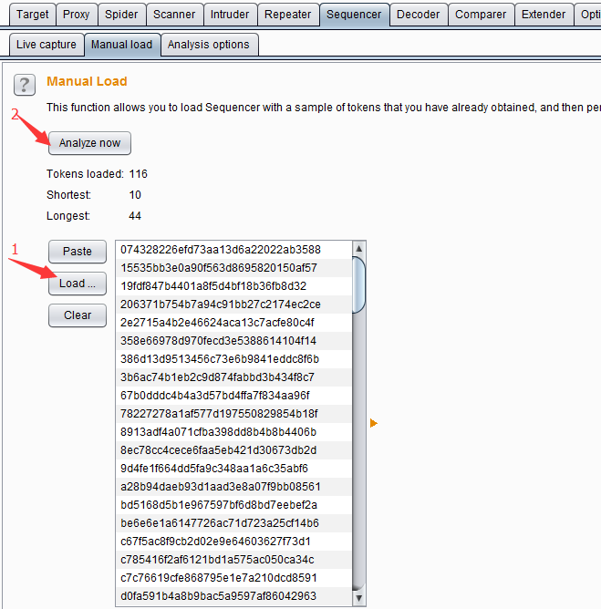

##### 可选项设置（Analysis Options）

分析可选项设置的目的主要是为了控制 token 或者参数，在进行数据分析过程中，需要做什么样的处理，以及做什么类型的随机性分析。它主要由令牌处理（**Token Handling**）和令牌分析（**Token Analysis**）两部分构成。

*   令牌处理**Token Handling**主要控制令牌在数据分析中如何被处理，它的设置界面如下图所示： 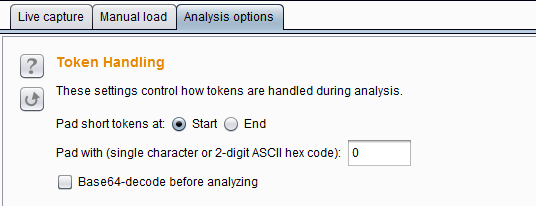 其中**Pad short tokens at start / end** 表示如果应用程序产生的令牌是具有可变长度的，那么这些令牌在数据分析前都需要被填充，以便于进行的统计检验。你可以选择是否填充在开始位置或每个令牌的结束位置。在大多数情况下，在开始位置填充是最合适。 **Pad with** 表示你可以指定将用于填充的字符。在大多数情况下，数字或 ASCII 十六进制编码的令牌，用“0”填充是最合适的。 **Base64-decode before analyzing**表示在数据分析是否进行 base64 解码，如果令牌使用了 base64 编码的话，则需要勾选此项。

*   令牌分析**Token Analysis**主要用来控制对数据进行随机性分析的类型，我们可以选择多个分析类型，也可以单独启用或禁用每个字符类型级和字节级测试。有时候，执行与启用所有分析类型进行初步分析后，再禁用某些分析类型，以便更好地了解令牌的特点，或隔离由样品表现任何不寻常的特性。其设置界面如下： 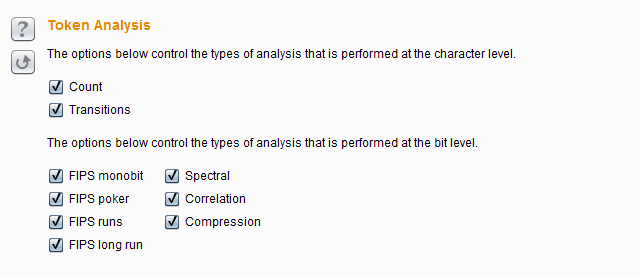

其中上面两个选项是控制数据分析的字符类型级，它包含**Count**和**Transitions**。 **Count**是指分析在令牌内的每个位置使用的字符的分布，如果是随机生成的样本，所用字符的分布很可能是大致均匀的。在每个位置上分析统计令牌是随机产生的分布的概率。其分析结果图表如下所示： 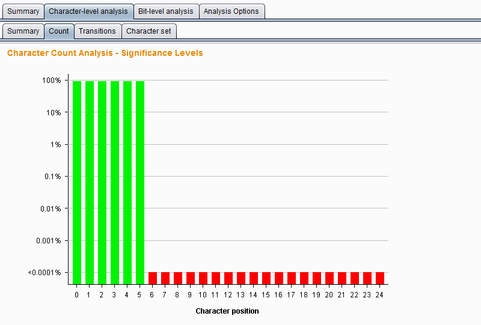

**Transitions**是指分析样品数据中的连续符号之间的变化。如果是随机生成的样品，出现在一个给定的位置上的字符是同样可能通过在该位置使用的字符中的任一项中的下一个标志的改变。在每个位置上统计分析令牌随机产生到变化的概率。其分析结果图表如下所示： 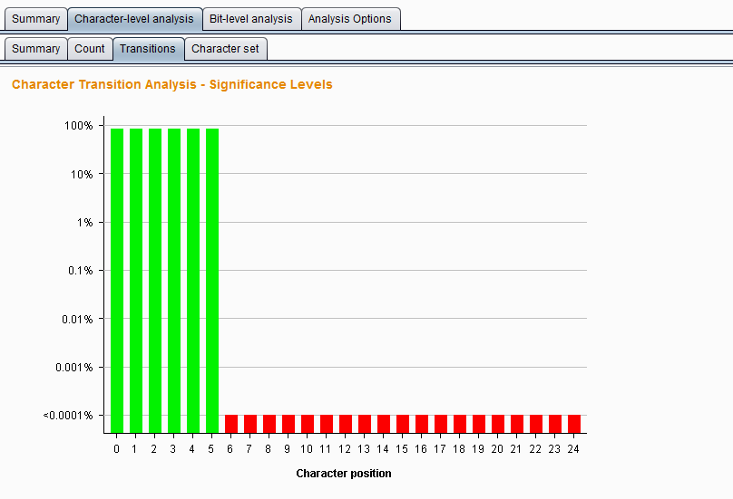

下面的几项设置是用于控制数据分析的字节级测试，它比字符级测试功能更强大。启用字节级分析中，每个令牌被转换成一组字节，与设置在每个字符位置的字符的大小决定的比特的总数。它包含的测试类型有以下七种。

**FIPS monobit test**——它测试分析 0 和 1 在每个比特位置的分配，如果是随机生成的样本，1 和 0 的数量很可能是大致相等。Burp Sequencer 记录每个位是通过还是没通过 FIPS 试验观测。值得注意的是，FIPS 测试正式规范假定样本总数为 20000 个时。如果你希望获得的结果与该 FIPS 规范一样严格的标准，你应该确保达到 20000 个令牌的样本。 其分析结果图表如下所示： 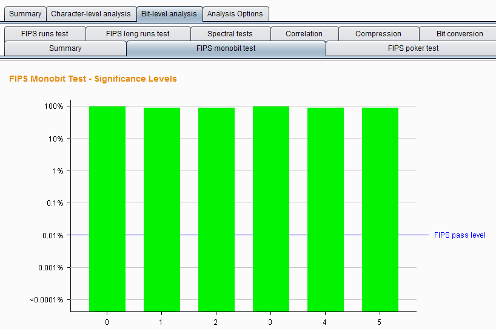

**FIPS poker test**—— 该测试将 j 比特序列划分为四个连续的、非重叠的分组，然后导出 4 个数，计算每个数字出现 16 个可能数字的次数，并采用卡方校验来评估数字的分布。如果样品是随机生成的，这个数字的分布可能是近似均匀的。在每个位置上，通过该测试方式，分析令牌是随机产生的分布的概率。其分析结果图表如下所示： 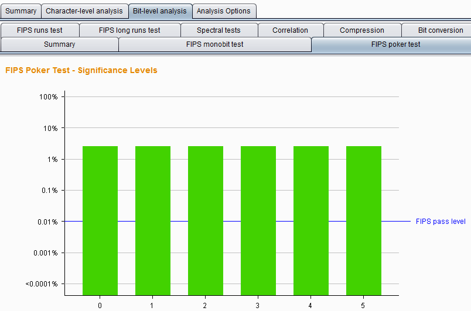

**FIPS runs tests** —— 该测试将具有相同值的连续的比特序列在每一个位置进行划分成段，然后计算每一个段的长度为 1，2，3，4，5，和 6 以及 6 以上。如果样品是随机生成的，那么这些段的长度很可能是由样本集的大小所确定的范围之内。在每个位置上，使用该分析方法，观察令牌是随机生成的概率。其分析结果图表如下所示： 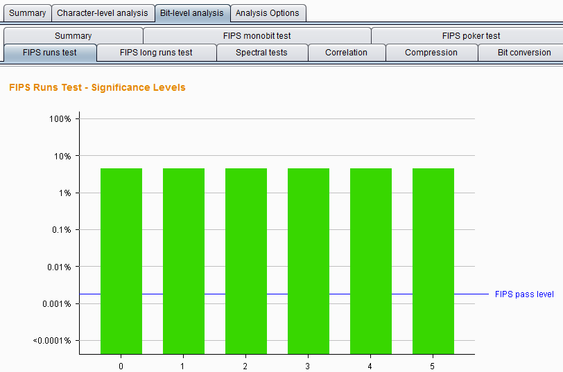

**FIPS long runs test** —— 这个测试将有相同值的连续的比特序列在每一个位置进行划分成段，统计最长的段。如果样品是随机生成的，最长的段的数量很可能是由样本集的大小所确定的范围之内。在每个位置上，使用此分析方法，观察令牌是随机产生的最长段的概率。其分析结果图表如下所示： 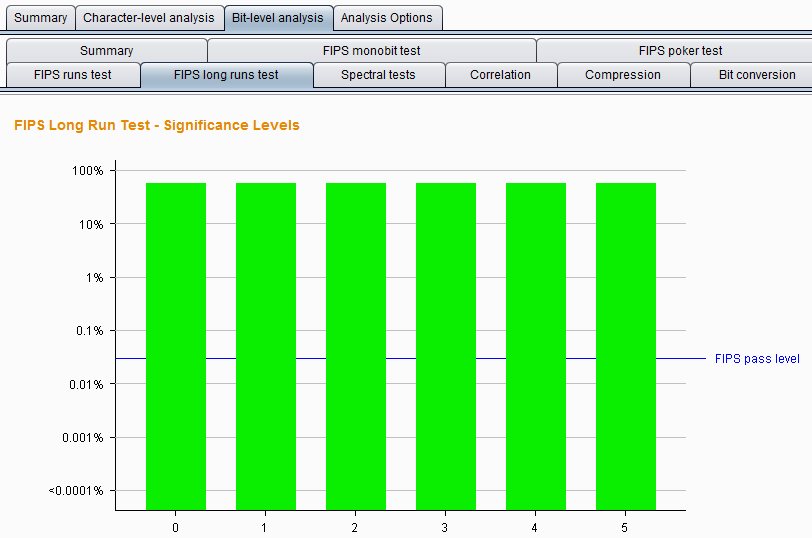

**Spectral tests** —— 该测试是在比特序列的每个位置上做一个复杂的分析，并且能够识别某些样品是通过其他统计检验的非随机性证据。样本试验通过比特序列和将每个系列的连续的数字作为多维空间的坐标并通过它绘制在这些坐标来确定每个位置这个空间的一个点。如果是随机生成的样本，点的此空间中的分布可能是大致均匀;在该空间内的簇的外观表示数据很可能是非随机的。在每个位置，使用此种分析方法，观察令牌是随机发生的概率。其分析结果图表如下所示： 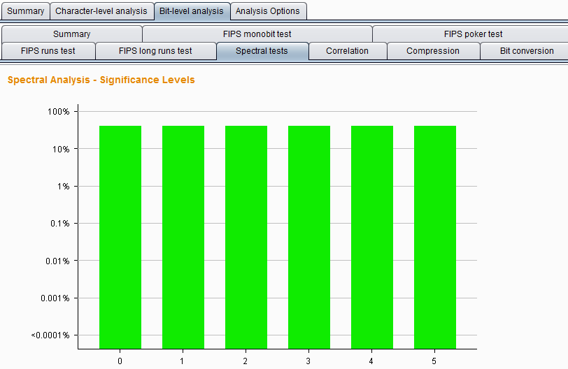

**Correlation test** ——比较每个位置具有相同值的令牌样本与每一个位置具有不同值的短令牌样本之间的熵，以测试在令牌内部的不同的比特位置中的值之间的任何统计学显著关系。如果样品是随机生成的，在给定的比特位置处的值是同样可能伴随着一个或一个零在任何其它位的位置。在每个位置上，使用此种分析方法，观察令牌是随机生成的可能性。为了防止任意的结果，当两个比特之间观察到一定程度的相关性，该测试调整，其显着性水平下是基于所有其他比特级测试的位的显着性水平。其分析结果图表如下所示： 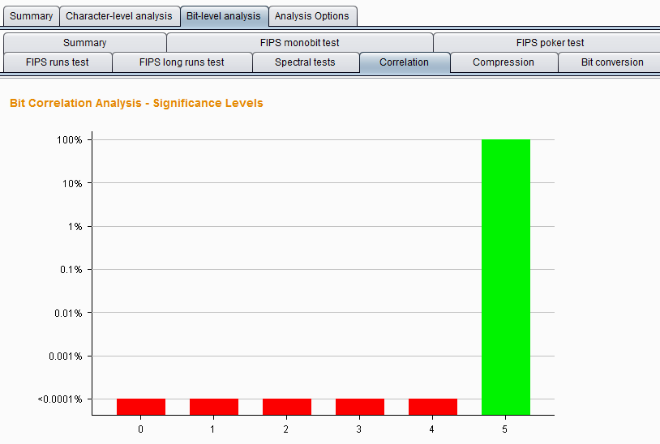

**Compressoion test** —— 这种测试不使用其他测试中使用的统计方法，而是通过简单直观的指标统计比特序列中每个位置熵的数量。该分析方法尝试使用标准 ZLIB 压缩比特序列的每个位置，结果表明，当它被压缩在比特序列的大小的比例减少，较高压缩程度表明数据是不太可能被随机产生的。其分析结果图表如下所示： 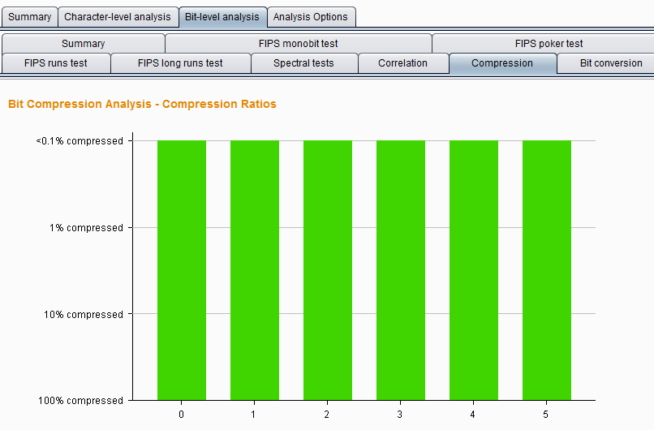

*本章涉及诸多数学统计分析的知识，在表述或理解过程中由于知识水平的限制可能会存在错误，如果有问题的地方，欢迎发送邮件到 t0data@hotmail.com,先感谢您的批评指正。*

* * *