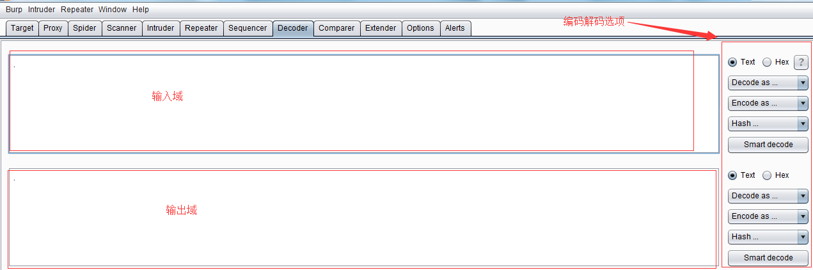
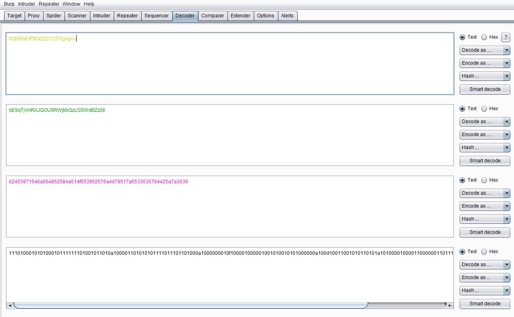

# 第十一章 如何使用 Burp Decoder

### 第十一章 如何使用 Burp Decoder

Burp Decoder 的功能比较简单，作为 Burp Suite 中一款编码解码工具，它能对原始数据进行各种编码格式和散列的转换。其界面如下图，主要由输入域、输出域、编码解码选项三大部分组成。  输入域即输入需要解码的原始数据，此处可以直接填写或粘贴，也可以通过其他 Burp 工具的上下文菜单中【Send to Decoder】；输出域即对输入域进行解码的结果显示出来。无论是输入域还是输出域都支持文本与 Hex 两种格式，其中编码解码选项中，由解码选项（Decode as)、编码选项（Encode as)、散列（Hash）三个构成。实际使用中，可以根据场景的需要进行设置。对于编码解码选项，目前支持 URL、HTML、Base64、ASCII、16 进制、8 进制、2 进制、GZIP 共八种形式的格式转换，Hash 散列支持 SHA、SHA-224、SHA-256、SHA-384、SHA-512、MD2、MD5 格式的转换，更重要的是，对于同一个数据，我们可以在 Decoder 的界面，进行多次编码解码的转换。如下图所示： 

* * *