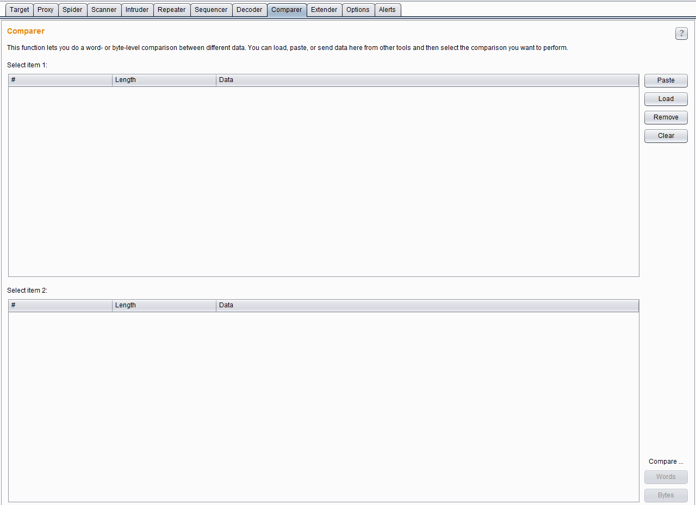
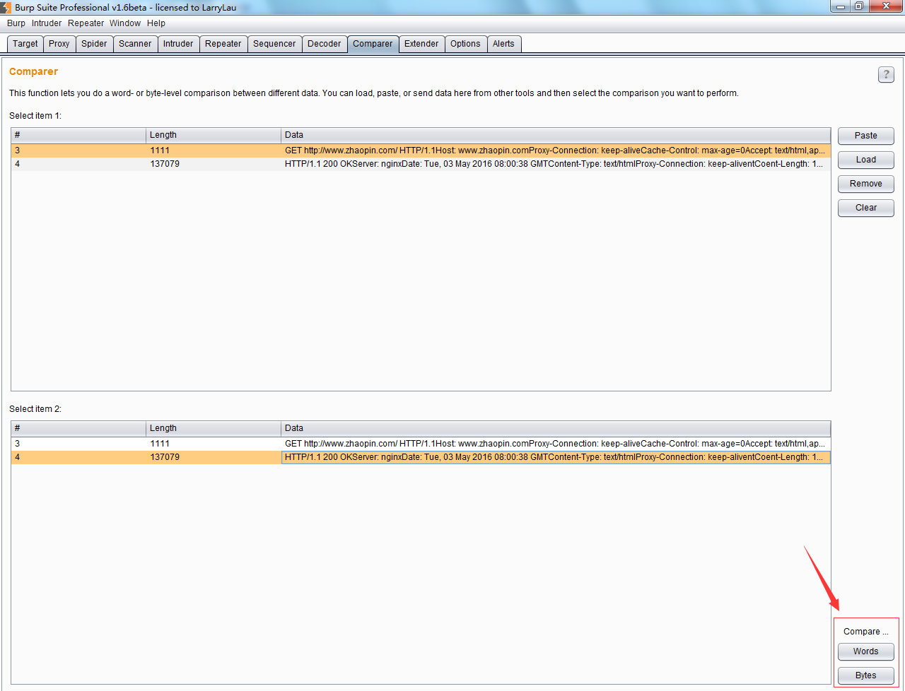
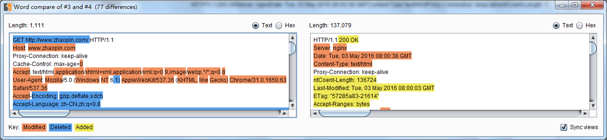
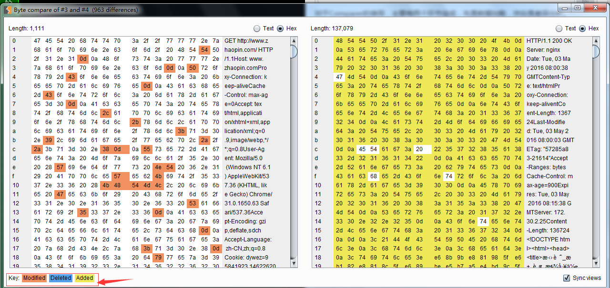

# 第十二章 如何使用 Burp Comparer

### 第十二章 如何使用 Burp Comparer

Burp Comparer 在 Burp Suite 中主要提供一个可视化的差异比对功能，来对比分析两次数据之间的区别。使用中的场景可能是： 1.枚举用户名过程中，对比分析登陆成功和失败时，服务器端反馈结果的区别。 2.使用 Intruder 进行攻击时，对于不同的服务器端响应，可以很快的分析出两次响应的区别在哪里。 3.进行 SQL 注入的盲注测试时，比较两次响应消息的差异，判断响应结果与注入条件的关联关系。 其界面如下图：  对于 Comparer 的使用，主要有两个环节组成，先是数据加载，然后是差异分析。 Comparer 数据加载的方式常用的有：从其他 Burp 工具通过上下文菜单转发过来、直接粘贴、从文件加载三种方式。当加载完毕后，如果你选择了两次不同的请求或应答消息，则下发的比较按钮将被激活，可以选择文本比较或者字节比较。如下图：  如果点击了【words】或者【bytes】，则进入比对界面，页面自动通过背景颜色显示数据的差异。如下图：  其中，文本比较（words）是指通过文本的方式，比如说以 HTML 的方式，比较两个数据的差异；而字节比较（bytes）是指通过 16 进制的形式，比较两次内容的差异。如下图,注意下发不同内容的颜色标注。 

* * *