# 第十三章 数据查找和拓展功能的使用

### 第十三章 数据查找和拓展功能的使用

通过第一部分十二个章节的学习，我们对 BurpSuite 的基本使用已经非常熟悉，从这一章开始，我们进入 BurpSuite 高级功能的使用。

BurpSuite 高级功能在界面布局上主要集中在两大块，一是菜单栏，另一个是右击菜单的 Engagement tools。 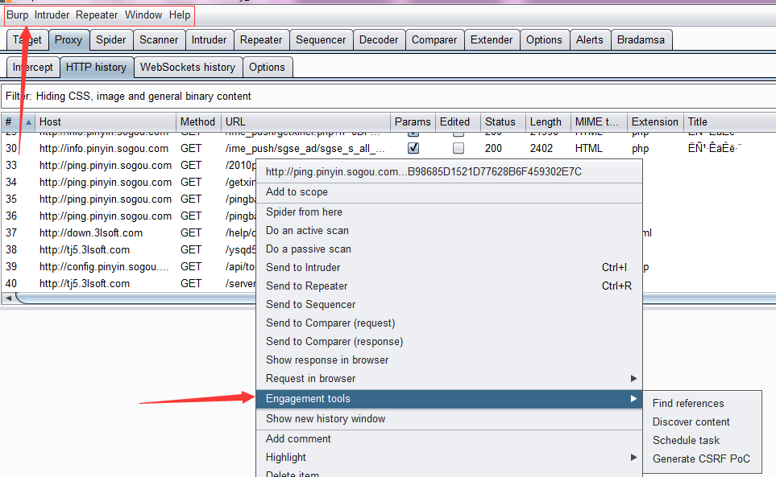

* * *

我们先来看看菜单栏，与日常使用相关的主要功能菜单是 Burp、Intruder、Repeater.下面我们就逐一学习各个菜单的功能。

#### Burp

Burp 菜单下包含的数据查找（Search）、组件状态存储、组件状态恢复三部分。 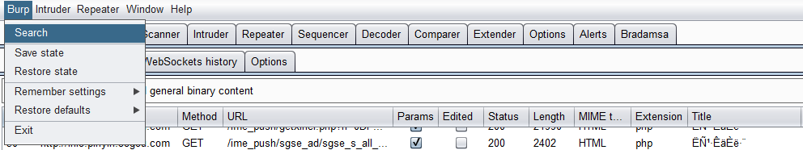

*   数据查找（Search） 数据查找功能主要用来快速搜索 Target、Proxy、Repeater 三个组件中的请求和应答消息的内容，其界面如图： 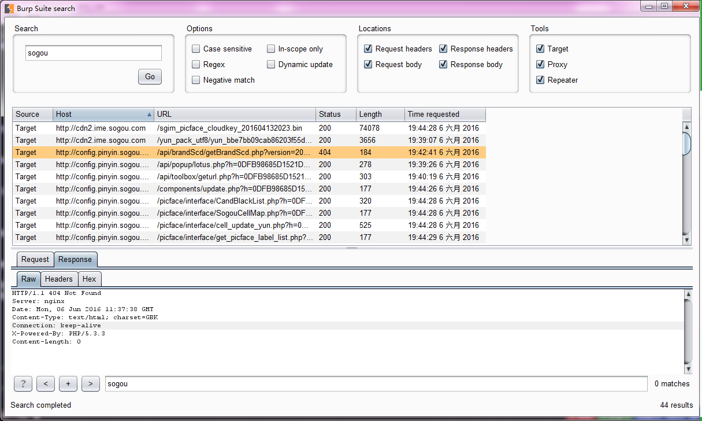 默认情况下，当我们打开功能界面时，都是空的。如果我们在搜索框输入关键字，点击【Go】之后，下面的列表中将自动显示匹配到的所有消息。默认匹配时，是从 HTTP 消息中的 Host、url、请求消息头，请求消息 Body、应答消息头、应答消息 Body 中搜索匹配字段。 在整个 Search 面板中，有三大块设置项用于我们控制对数据的查询。 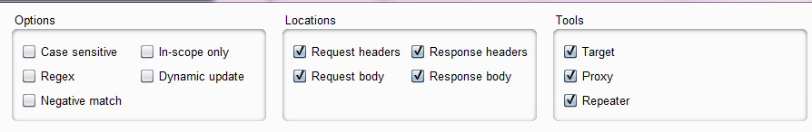 Options 主要控制关键字匹配的方式：大小写敏感、域内搜索、正则表达式匹配、动态更新、反向匹配 Locations 主要用于控制关键字查找的范围：请求消息头、请求消息 Body、应答消息头、应答消息 Body
    Tools 主要用于控制关键字搜索的 Burp 工具组件的范围：Target、Proxy、Repeater 我们通过 Options、Locations、Tools 三者的组合，能准确的搜索我们关注的字符、脚本、referer、备注等信息。 当然，Search 面板也集成了 Burp 的横向传递功能，当我们找到或发现关心的 HTTP 消息后，直接可传递到其他的工具组件中。 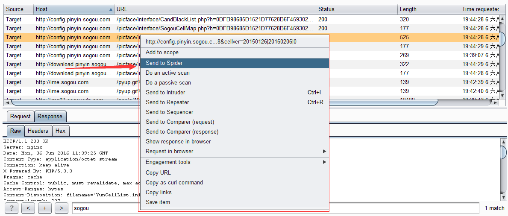

*   组件状态存储和恢复，与组件状态和恢复相关的子菜单比较多，分别是： **Save state** 保存当前 Burp 的状态，主要保存站点地图、Proxy 历史日志、扫描的结果和正在扫描的队列、Repeater 当前和历史记录、Suite 其他工具组件的所有配置信息。当我们点击【Save state】时，Burp 将会提示我们是否只保存 Scope 中的数据 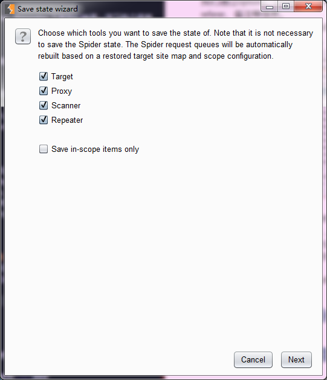 同时，也会提示我们，是否对存储文件的存在的密码进行保存。你可以选择不保存、明文保存、使用主密码进行加密保存三种的任何一种。如果使用主密码加密，当你在恢复设置时，Burp 将提示密码没有保存或者输入主密码。 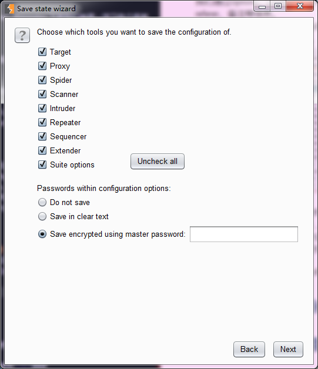 **Restore state**从之前的文件中恢复 Burp 之前保存的数据，与上面的**Save state**操作相对应。

使用组件状态存储和恢复的功能，能够帮助我们在渗透测试中带来极大的帮助。它主要体现在：

1.  保存你每一天的工作空间和进度以及问题的状态，以便于第二天查看。
2.  当系统发生故障或无法测试时，通过存储的 Burp 状态查看之前的问题和消息内容。
3.  通过归档的文件，你能跟踪已经修复的问题。
4.  通过所有的归档文件，对整个应用系统安全问题分布情况有总体的分析和评估。
5.  通过 Burp 状态文件作为模板，在团队间共享 Burp 配置和相关测试内容。

#### Intruder

Intruder 菜单主要用于自动化攻击的相关配置。它的菜单和对应的功能如下： 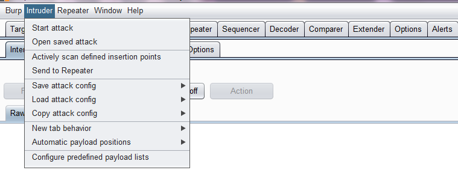 **Start attack** 开始发起攻击 **Open save attack** 重新加载之前保存的 Intruder 攻击文件 **Save attack config**、**Locd attack config**、**Copy attack config**，主要控制 Intruder 的攻击配置信息 **Automatic payload position**主要用于控制 payload 的使用方式：替换参数值或者追加参数值 **Configure predefined payload lists**用于控制 Burp 默认的 payload 字典值，当我们点击此菜单时，会弹出 payload 字典配置文件的界面，如下图所示： 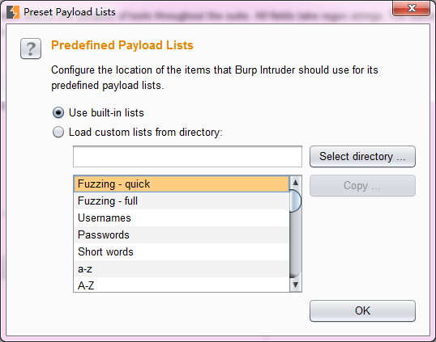 我们可以选择一个 payload 子类型，对字典值进行修改。需要注意的事，这里选择的是 payload 文件存放的目录，当选择目录后，会自动加载目录下的 payload 文件。

#### Repeater

Intruder 菜单主要用于 Repeater 工具的控制，它的子菜单有： 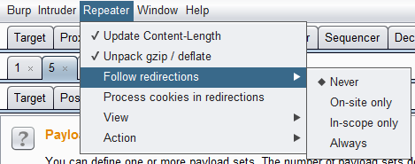 **Update Content-Length** 当执行 Repeater 操作时，自动更新消息头中的 Content-Length **Unpack gzip /deflate** 解压压缩文件 **Follow redirections** 跳转控制，可以选择从不跳转、同一站点内跳转、Scope 内跳转、始终跳转四种的其中之一 **Process cookie in redirections** 跳转的同时是否处理 Cookie **View**主要控制 Repeater 面板整个布局

* * *

熟悉完菜单栏之后，我们来看看 Engagement tools。 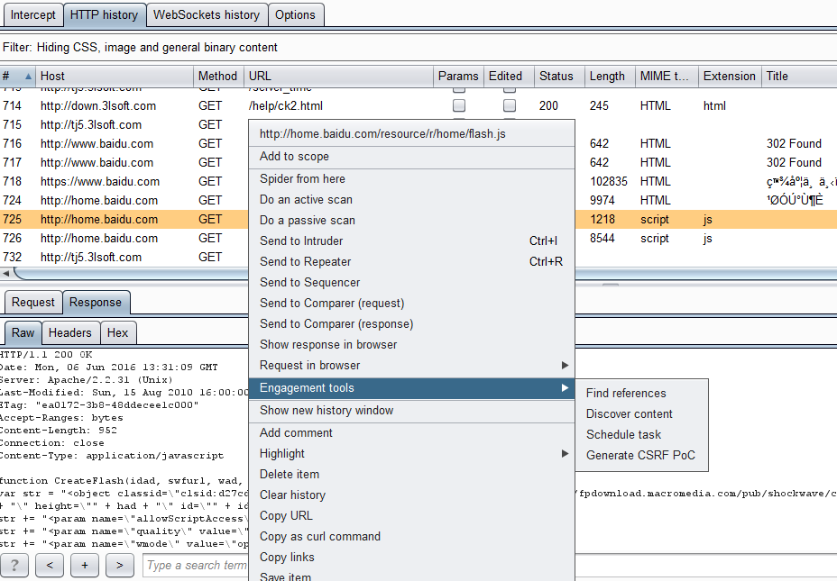 从上图中我们知道，此功能位于右击菜单中，它包含**Find references**、**Discover content**、**Schedule task**、**Generate CSRF Poc**四个子菜单。

* * *

*   **Find references**是指对选中的某条 Http 消息获取其 referer 信息 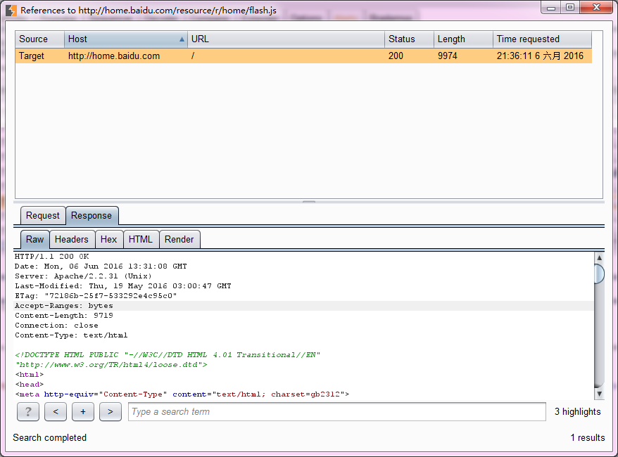

* * *

*   **Discover content**是指对选中的某条 Http 消息，根据其 url 路径，进行目录枚举和文件枚举操作。当我们点击后，将弹出其配置界面。 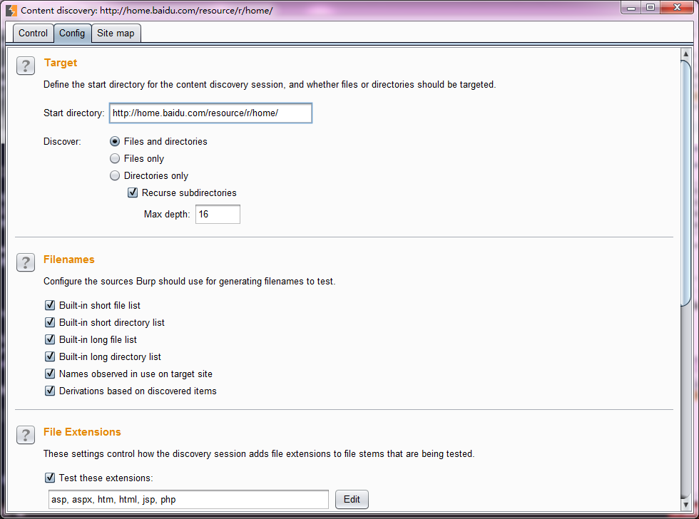

*   其 Discover 选项有：挖掘文件和目录、仅仅挖掘文件、仅仅挖掘目录（递归遍历子目录，可指定其层级或深度）

*   挖掘的文件名（filenames）选项有：**Built-in short file list**内联的短文件列表 、**Built-in short directory list**内联的短目录列表、**Built-in long file list**内联的长文件列表、**Built-in long directory list**内联的长目录列表、**Names discovered in use on the target site**网站内发现的名称、**Derivations based on discovered item**基于已有名称进行猜测。

*   同时，如上图所示，我们也可以根据文件的拓展名对文件类型进行管理。 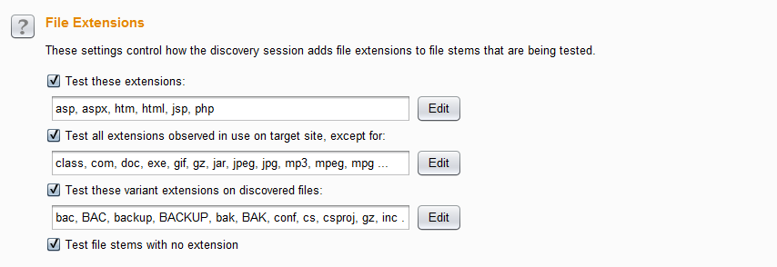 从上而下依次的含义是： **Test these extensions** 测试这些扩展名文件 **Test all extensions observed on target site**不测试这些扩展名文件，这个选项在我们不知道站点的大体情况下，我们可以去除那些我们熟悉的文件扩展名，然后去挖掘未知的扩展名文件 **Test these variant extensions on discovered files**测试发现这些文件扩展名的变体，从图中我们可以看出，在测试备份文件的时候，这个选项会非常有用 **Test file stems with no extension**测试没有扩展名的文件

*   挖掘引擎配置选项有： 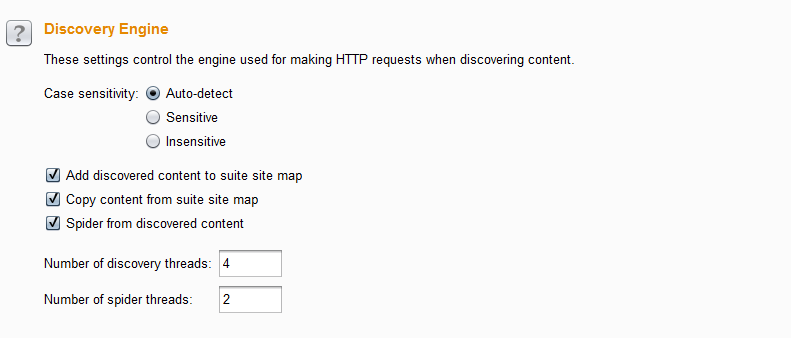 主要有**Case sensitivity** 大小写敏感、**Add discovered content to suite site map** 添加挖掘结果到站点地图中、**Copy content from suite site map**复制 Target 站点地图到挖掘的站点地图中、**Spider from discovered content** 爬取挖掘到文件的内容、**Number of discovery threads**挖掘的线程并发数目、**Number of spider threads** 爬取的线程并发数目。

*   **Schedule task**任务时间表 任务时间表的功能主要是把当前选中的 url 作为初始路径，然后进行多种任务的选择，进入任务时间表进行执行。  从图中我们可以看出，依据初始的 url，我们可以做扫描、爬取、状态保存的相关操作。

*   **Generate CSRF Poc**生成 CSRF 的 POC 此功能的作用是，依据选中的 http 消息，自动生成 CSRF 的 POC 内容。当我们把 POC 的内容保存为 HTML 即可执行。 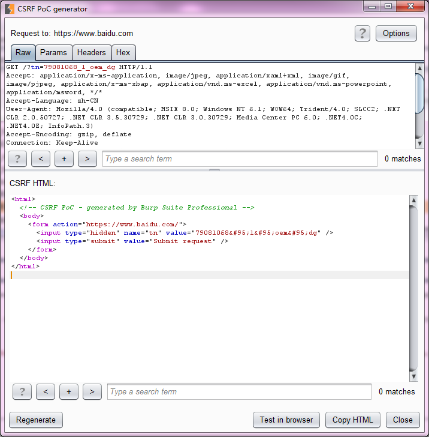 在生成 POC 时，我们可以对生成的参数进行设置，如图中右上角的【options】所示。 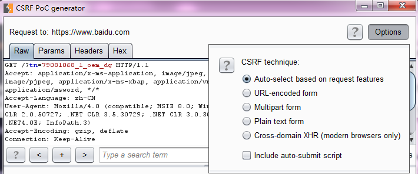 我们可以选择根据 http 特性自动生成、url 编码的 form 表单、Mutipart 类型的 form 表单、普通文本的 form 表单、跨域的异步请求以及自动提交，这些选项中一个或两个，当我们设置好之后，点击左下角的【Regenerate】重新生成即可。需要注意的是，Mutipart 类型的 form 表单和普通文本的 form 表单的选择是由 http 消息中包含的 content-type 决定的。 如果修改了 POC 的生成设置，则需要点击左下角的【Regenerate】按钮，重新生成 POC。当 POC 生成之后，你可以使用【CopyHTML】文本，放入 html 文件中进行浏览执行，也可以点击【Test in Brower】，在浏览器中直接预览执行，进行测试。 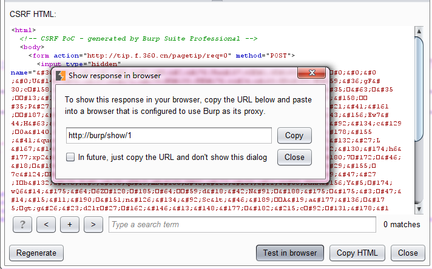 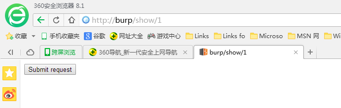