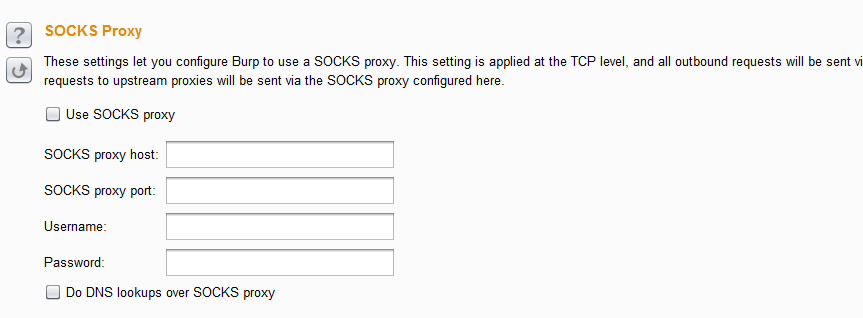
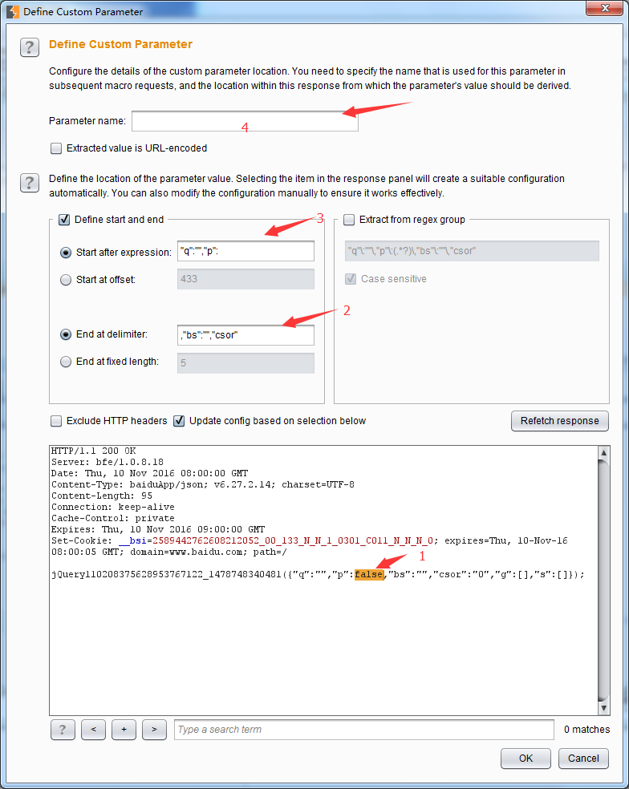

# 第十四章 BurpSuite 全局参数设置和使用

### 第十四章 BurpSuite 全局参数设置和使用

在 Burp Suite 中，存在一些粗粒度的设置，这些设置选项，一旦设置了将会对 Burp Suite 的整体产生效果，这就是 Burp Suite 中 Options 面板。当我们打开 Options 面板即可看到，它是由 Connections、HTTP、SSL、Sessions、Display、Misc 六个选项卡组成。 

本章的内容主要包括：

*   Burp 网络连接设置（Connections）
*   HTTP 应答消息处理设置（HTTP）
*   SSL 连接和加密设置（SSL）
*   会话设置（Sessions）
*   显示设置（Display）
*   其它工具设置（Misc）

下面我们就依次来看看每一个选项卡包含哪些详细的功能设置。

#### Burp 网络连接设置（Connections）

Connections 选项卡主要用来控制 Burp 如何来处理平台认证、上游代理服务器、Socks 代理、超时设置、主机名或域名解析以及 Scope 之外的请求六个方面的相关配置。当我们打开 Connections 选项卡，从上往下拖动，首先看到的设置将是平台身份认证（Platform Authentication）。

*   平台身份认证（Platform Authentication）  这些设置允许你配置 Burp 自动执行到目标 Web 服务器的平台身份验证，不同的主机可以配置不同的认证方式和证书。目前支持的身份验证类型有：BASIC，NTLMv1，NTLMv2 和“摘要”式认证( Digest authentication)。其设置界面截图如下：  其中域名和主机名字段只用于 NTLMv1，NTLMv2 身份验证。 在平台身份认证（Platform Authentication）设置的最下方有一个 Checkbox 选项（Prompt for credentials on platform authentication failure），如果此项选中，则表示当遇到身份验证失败时，Burp 会显示一个交互式的弹窗，提示验证失败的信息。

* * *

*   上游代理服务器（Upstream Proxy Servers）  这些设置主要是控制 Burp 是否会发送请求到上游代理服务器，或直转向目标 Web 服务器。从代理服务器配置的图中我们可以看出，这是一个列表，那就表明我们可以配置多个匹配规则。当我们配置了多个规则时，可以针对不同的目标主机或主机组指定不同的代理服务器设置。这些规则将按照顺序，并将与目标 Web 服务器相匹配的第一个规则作为生效规则。如果列表没有规则匹配，Burp 默认采取直连、非代理的方式进行连接。 针对每一个配置，其界面截图如下：  我们可以使用在目标主机输入框中采用正则表达式，使用通配符（*零个或多个字符匹配？与任何字符相匹配，除了一个点）。来指定将所有请求发送到一个代理服务器。而对于配置的每个上游代理服务器，我们可以根据需要指定认证方式和认证凭据。它支持的身份认证类型有：BASIC，NTLMv1，NTLMv2 和“摘要式”身份验证。同样，域名和主机名字段只用于 NTLM 身份认证。 当我们每配置完成一条匹配规则之后，它将出现在上游代理服务器的列表中，我们可以在列表中对其进行内容的编辑和上下顺序的调整。

* * *

*   Socks 代理  这些设置允许我们配置 Burp 使用 SOCKS 代理的方式进行所有传出的通信，但此设置只在 TCP 层生效，所有出站请求将通过这个代理发送。如果我们同时设置了已游 HTTP 代理服务器配置的规则，则请求上游代理将通过这里配置的 SOCKS 代理发送。其请求的匹配路径依次是：本地-->上游代理-->SOCKS 代理。 在使用 SOCKS 代理时，我们需要勾选【Use SOCKS proxy】，并提供代理的 ip 或者主机名、端口、认证的用户名和口令（如上图所示）。 如果我们勾选了【Do DNS lookups over SOCKS proxy】，则进行域名解析时，将通过 SOCKS 代理去查询，而不会使用本地缓存。

* * *

*   超时设置（Timeouts）  这些设置主要用于指定 Burp 各种网络任务的超时。我们可以对以下超时项进行设置：
*   正常（Normal ） - 此设置用于大多数网络通信，并确定 Burp 怎样放弃请求和记录已发生超时前等待。
*   开放式应答（Open-ended responses） - 该设置只用在一个响应正在处理不包含内容长度或传输编码 HTTP 标头。在这种情况下，Burp 确定传输已经完成之前等待指定的时间间隔。 3.域名解析（Domain name resolution ） - 此设置确定 Burp 如何重新进行成功的域名查找，如果目标主机地址频繁变化时需要设定为一个适当的低的值。
*   失败的域名解析（Failed domain name resolution ） - 此设置确定 Burp 多久会重新尝试不成功的域名查找。

以上的选项设置的值都是以秒为时间单位，如果一个选项留空，那么表示 Burp 永远不会超时。

* * *

*   主机名或域名解析 

此项配置比较简单，通过这些设置，我们可以指定主机名映射到 IP 地址，来覆盖本地计算机提供的 DNS 解析。每个主机名解析规则需要指定主机名，并与主机名相关联的 IP 地址。同时，每一个规则可以单独启用或禁用来控制其是否生效。当我们在渗透测试中，如果使用了隐形代理来测试富客户端组件，此功能可以确保请求正确转发。

* * *

*   Scope 之外的请求  这一特性可用于防止 Burp 发送任何超出 Target 面板中设置的 Scope 范围之外的请求，当我们需要保证没有请求到不在 Scope 范围内为它是有用的。例如，如果我们勾选了【Drop all out-of-scope requests】，即使你的浏览器使得超出范围的目标请求，这些请求也会被 Burp 被丢弃。 当然，我们可以启用此功能为当前的目标范围，如图，选中【Use suite scope】。或者，可以使用 URL 匹配规则定义自定义范围，选中【Use custom scope】。 当我们选中【Use custom scope】时，界面将会显示其相关 URL 匹配规则的详细设置。如下图：  和 Target Scope 配置类似，它也分包含域和排除域，因其配置方式与 Scope 一致，此处就不在赘述。如果配置中有不明白的地方，请参数 Target Scope 配置章节

* * *

#### Session 设置

##### 会话处理规则（Session Handling Rules）

 如上图所示，Burp 允许你自定义会话处理规则的列表，这能让我们细粒度地控制 Burp 如何处理应用程序的会话处理机制和相关功能。对于处理规则，Burp 中规则的构成包括**范围**（规则适用于）和**动作**（规则做什么），当我们点击【Add】按钮，弹出的规则配置界面如下图所示，其中**Details**和**Scope**两个面板的设置分别对于于上文的动作和范围。

*   动作（Rules Action） 

每个规则可以执行一个或多个操作，例如： 从 Burp 的 cookie jar 中更新 cookies、验证当前会话、 运行宏（预定义的请求序列）等等。通过创建具有不同范围和操作的多个规则，您可以定义 Burp 将应用于不同应用程序和函数的行为的层次结构。例如，在特定测试中，您可以定义以下规则：对于所有请求，从 Burp 的 cookie jar 添加 cookie；对于对特定域的请求，请验证与该应用程序的当前会话是否仍处于活动状态，如果没有，请运行宏以重新登录到应用程序，然后使用生成的会话令牌更新 cookie jar；对于包含 csrftoken 参数的特定 URL 的请求，首先运行宏以获取有效的 csrftoken 值，并在发出请求时使用此值。 在 Details 面板中，Burp 已经预制了七类规则动作，他们分别是：

1.  **Use Cookies From the Session Handling Cookie Jar** 这个配置的动作是通过 Burp 的 Cookie.jar 用来更新请求的 cookie 信息，当然，你可以设置更新全部的 cookie 还是有选择性的更新。
2.  **Set a Specific Cookie or Parameter Value** 这个配置的动作是指定 cookie 或者某个参数的值，如果没有设置的话，则在会话中添加此参数或者 cookie。
3.  **Check Session Is Valid** 此动作是检查当前会话是否有效，如果无效，则可选择地执行下一步的动作以获得新的有效会话。或者，我们可以将 Burp 配置为仅每 X 个请求验证会话，这有助于避免在应用程序发出多余的请求（==下图中 2 部分所示==）。 为了确定当前会话的有效性，Burp 通常会发出一个或多个请求。这些请求可能是（==下图中 1 部分所示==）： a）当前的会话请求 b）执行宏脚本  当 Burp 发出请求，并验证了会话的有效性之后，将不再做下一步动作；如果运行了宏，则 Burp 将进一步检查请求的应答消息。为了准确地确定会话有效性，我们通常将 Burp 检查响应配置为搜索表达式，其搜索范围为（==上图中 3 部分所示==）： a)HTTP 响应头 b)HTTP 响应体 c)任何重定向目标的 URL 除了范围外，在设置正则匹配/字符匹配的字符串同时，我们也可以匹配大小写是否敏感、会话是否有效、如果会话失效，需要做的下一步动作是什么等操作。 关于会话失效后的下一步操作，Burp 中预制了两个类型，如下图所示：  a)运行宏 b)从浏览器内部恢复会话 针对于这两类操作，会在接下来的章节中描述，此处不再赘述。
4.  **Prompt For In-Browser Session Recovery** 这个配置的动作是针对于会话失效后，从浏览器内部进行会话恢复的。在会话恢复时，需要使用 Proxy 代理的请求记录信息，如果使用此动作，则浏览器的代理设置与 Burp 需要一致。
5.  **Run a Macro** 在 Burp 中，宏是一系列顺序操作的 Burp 操作的总和，预先定义好的，在 Session 中被运行，用于会话规则的处理。宏运行后，Burp 根据最终的宏响应报文来选择更新当前正在处理的请求中的参数和 Cookie。至于宏的定义和设置在接下来的章节中会专门描述,此处仅做简要介绍。 当我们在添加 Rules Action 时选择了“Run a Macro”项，则弹出的宏配置界面如下图所示：  点击【Add】则添加一个宏，选择某个宏记录，点击【Edit】则可以对宏配置进行编辑。其设置界面如下图：  上图中宏的名称、items、请求和应答消息等简单关注即可，需要重点关注的是【configure item】按钮中对参数的设置。当我们点击此按钮，打开宏参数的配置界面：  此界面上已经对请求报文中的参数和 cookie 自动提取出来，按照元素分别展示，同时，界面下半部分为客户化参数设置，可以自定义自己想要的参数，并从应答报文中提取参数的值。  在上图中，当我们鼠标双击 1 处时，2 和 3 处会自动设置提取数据的段，我们只要在 4 处简单填写参数的名字即可完成常用的宏参数设置。 设置完宏之后，当宏运行时，其作用的范围依赖于 Session Scope 的设置。
6.  **Run a Post-Request Macro** Post-Request 宏通常使用于多步骤测试的场景，例如：后一步的测试数据依赖于上一步的请求结果。在这些场景下，Post-Request 宏的使用会帮助你完成参数值的自动化地填充、fuzz、scan 等。
7.  **Invoke a Burp Extension** 这个配置的动作是 Burp 的拓展插件，来对当前会话数据进行处理。此处调用的插件，必须要先在 Burp 的插件中心进行注册。关于 Burp 插件，请阅读《Burp Suite 应用商店插件的使用》章节。
8.  范围（Scope）  而对于 Burp 做出的每个请求，它在 Scope 中定义规则在哪些请求的范围内，并且按顺序执行所有这些规则的动作（除非条件检查动作确定不应该对请求）。 每个规则的范围可以基于正在处理的请求的以下特征来定义，在 Scope 面板中共分为以下三类： 1.**正在发送请求的 Burp 工具（Tools Scope）**，包含 Burp 的各个常用工具组件，例如：Target、Scanner、Proxy、Intruder 等。 2.**请求的网址（Urls Scope）**，包含所有的 URL 地址、指定的作用于、自定义作用域三种方式，其配置与 Target 类似。  3.**请求中的参数名称（Paramters Scope）**，当选中此项时，点击【Edit】按钮即可对参数进行配置，如下图所示例： 

配置完毕后的 Scope 截图大体如下图所示：  配置完成后，会话处理规则将对作用域的 Burp 工具组件中的会话进行处理，例如，如何配置了 Proxy，则通过 Proxy 的会话，可以通过此面板下方的【open sessions tracer】进行会话跟踪。如下图： 

* * *

##### Cookie Jar

Burp 通过维护 Cookie jar 来维护你访问过得所有 web 站点的 cookie 信息，Cookie jar 的信息在 Burp 的所有工具组件之间是数据共享的。  我们可以通过上图中的勾选项配置，来指定 Cookie jar 在哪些工具组件之间生效。当设置完毕后，这些工具组件的流量数据更新，会保证 Cookie jar 的数据也一致性的更新。同时，我们也可以点击下方的【Open cookie jar】按钮，来做 cookie 信息的手工维护。 

* * *

##### 宏(Macros)

在会话处理规则章节中，我们队宏的定义已经做了初步的描述，现在我们就来讲一讲 Burp 的宏的使用。 Burp 中宏的定义是：一个或者多个请求的预定义序列，其本质是一个或者多个请求，按照一定的顺序组成并按照顺序执行的操作集合的总称。典型的宏的使用场景有： **a)**检测用户登录页面，判断当前会话是否仍然有效。 **b)**模拟登录操作，以获取一个新的会话令牌。 **c)**在多步骤测试过程中，获取前一步骤的反馈数据，作为后面测试的输入数据。 **d)**在多步骤测试过程中，完成测试目的后，用于结果的验证。 除了基本的请求序列外，宏还包含每一个请求相关的 cookie、请求参数、数据依赖等配置项。 **1\. 宏的维护**  上图为宏的维护界面，通过【Add】、【Edit】、【Remove】按钮，我们可以对宏进行新建、修改和删除操作。当有多个宏的时候，我们可以通过【Up】和【Down】按钮来调节宏的位置，来控制宏执行的先后顺序。 **2\. 宏的新建和修改** 新建是新增一个宏，修改是对宏列表中已有宏的信息进行修改，其界面和操作类似。此处仅以新建为例，来讲述宏的使用。当我们点击【Add】按钮来新建一个宏，则 Burp 将弹出宏信息录入界面。  宏信息的录入界面为图中的 Macros Editor，而图中的 Macros Recorder 界面为请求的记录。当我们新建宏操作时，可以选择一条或一组的请求记录，做为宏的基础。  如上图所示，选择序列 18~22 的记录作为宏的序列，点击【OK】保存序列后，配置参数信息。  当我们点击【configure Item】按钮时，即弹出参数配置界面（如上图）。其配置界面分上下两个部分，上部为图中 1 所示，主要是对已有参数值的设置，下部为图中 2 所示，我们可以根据实际场景的需要，添加自定义参数和参数值。 完成了如上的设置之后，我们点击【OK】按钮，则一个宏已经被正确的创建。 **3\. 宏的使用** 完成宏的设置之后，下面我们就看看宏在渗透测试中通常是被如何使用的。在会话处理规则（Session Handling Rules）章节中我们知道，配置【Rule Actions】时有**Run a Macro**、**Run a Post-Request Macro**两个选项，当我们设置了其中的选项，针对于当前会话，在作用域的范围内，宏就会生效。无论你设置了哪种类型的宏，其使用的数据处理逻辑大体如下图所示：  其中图中 1 所示为**通过宏应答的响应更新参数的值**，我们可以全量更新参数值也可以部分更新参数值；图中 2 所示为更新 cookie 的值，同样，我们也可以全量更新参数值也可以部分更新参数值；图中 3 所示为执行宏之后，还可以执行 Burp 的插件，需要执行的插件即在此处配置。

* * *

#### 显示设置（Display）

和其他的软件一样，Burp 也存在显示设置，作为软件与用户习惯交互的接口。 Burp 的显示设置主要包含：用户界面（User Interface）、Http 消息显示（HTTP Message Display）、字符集设置（Character Sets）以及页面渲染（HTML Rendering）

*   用户界面主要用来设置字体和界面风格  常用的有 Windows 风格、Windows 经典风格、Nimbus 等，修改配置后，需要重启 Burp 才会生效。
*   Http 消息显示主要用来设置其他 Burp 工具组件中 http 消息的显示字体、高亮等形式。 
*   字符集设置主要用来设置 http 消息显示时使用的字符集编码，正确的使用字符集是防止消息显示乱码的基础，默认情况下会自动获取系统字符集。 
*   页面渲染是指 http 消息进行渲染时，是否也显示图片等信息，如果显示图片，可能会增加新的 http 请求消息。

* * *

#### 杂项设置（Misc）

Burp 的杂项主要包含以下七个部分内容：

*   快捷键设置（Hotkeys）  Burp 的快捷键设置遵循了系统软件的设置习惯，比如 Ctrl+V、Ctrl+C、Ctrl+Z 都是和操作系统一样，同时，在各个工具组件之间的切换和消息传递时，Burp 的快捷键基本遵循了 Ctrl+组件的首字母，例如： send to Repeater 是 Ctrl+R send to Intruder 是 Ctrl+I 详细的快捷键读者自己在使用过程中，会慢慢熟悉，而且，Burp 也提供了自定义快捷键的功能，只有点击下方的【Edit hotkeys】按钮，进行修改即可。
*   日志设置（Logging）  用来控制 Burp 中的哪些工具组件需要记录日志，记录时，也可以单独记录请求或者应答消息。
*   临时文件位置（Temporary Files Location）  默认情况下，burp 会在用户的系统目录作为临时文件的目录，同样，我们也可以修改这个目录，指定其他的盘符目录作为临时文件目录，burp 在工作过程中，产生的临时数据会存放在此目录中。如果修改了此设置，需重启 Burp 后方可生效。
*   自动备份设置（Automatic Backup）  此设置用于保存 Burp 的状态和配置，设置完成后，会在后台定时地保存 Burp 的当前配置参数和运行状态。
*   任务队列（Scheduled Tasks）  我们可以通过任务队列的管理，来控制任务的开始和结束以及周期性运行。目前 Burp 的任务控制主要为以下几类（如下图），点击【Add】按钮，按照操作向导一步步的执行即可。 
*   性能反馈（Performance Feedback） 主要用于 Burp 的使用问题或 bug 反馈。 