# 第十五章 BurpSuite 应用商店插件的使用

### Burp Suite 应用商店插件的使用

Burp 在软件中提供了支持第三方拓展插件的功能，方便使用者编写自己的自定义插件或从插件商店中安装拓展插件。Burp 扩展程序可以以多种方式支持自定义 Burp 的行为，例如：修改 HTTP 请求和响应，自定义 UI，添加自定义扫描程序检查以及访问关键运行时信息，包括代理历史记录，目标站点地图和扫描程序问题等。 本章讲述的主要内容有：

*   应用商店插件的安装使用（BApp Store）
*   管理和加载 Burp 插件（Extension）
*   其他选项设置（Options）

##### 应用商店插件的安装使用

在 Burp Extender 面板中，有一个 BApp Store 的 Tab 页，这就是 Burp 的应用商店，内容是提供各种 Burp 的插件。 默认情况下，当你点击【BApp Store】的 Tab 页时，界面列表会显示插件明细，若你的环境是通过代理访问外网的，则需要在【Options】->【Connections】->【Upstream Proxy Servers】进行设置，具体如下图所示： 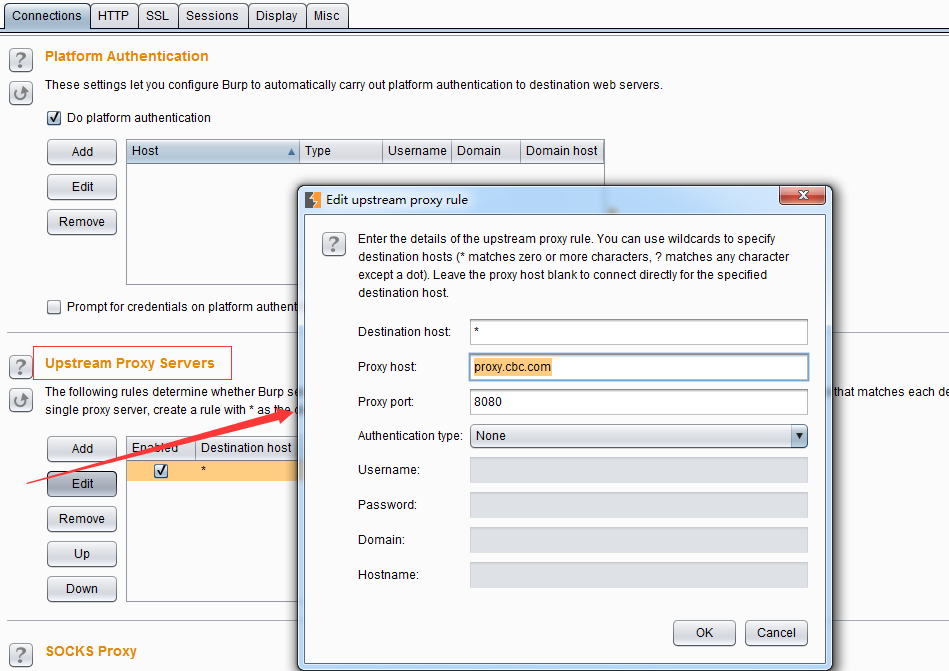 其中代理服务器的 host 和 port 为你本地的网络环境访问外网的代理主机和端口，更详细的设置请参加 Connections 章节相关内容。

如果你的网络设置没有问题，则应用商店的界面显示大体如下： 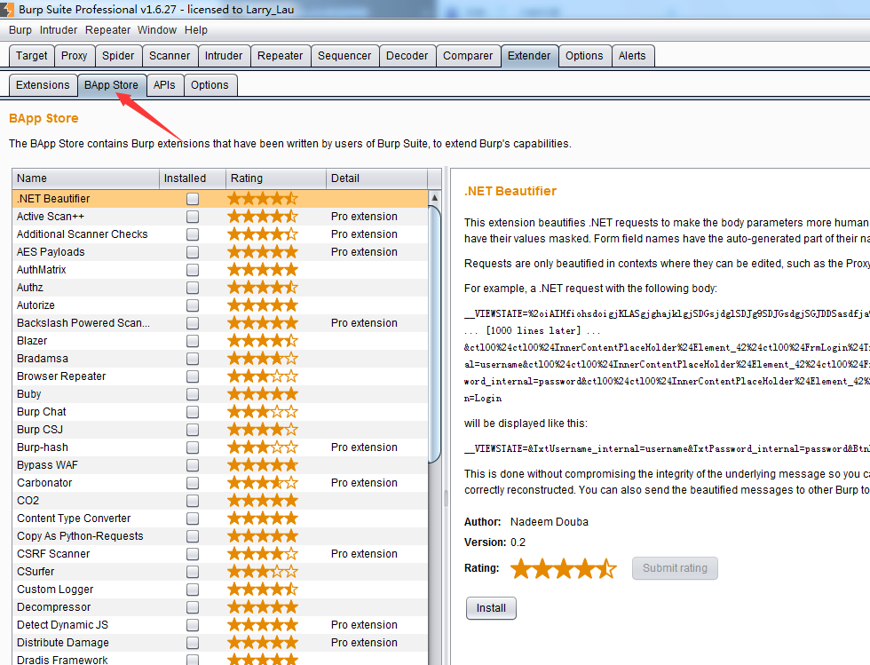 从图中我们可以看出，左边为各个插件的应用列表，当选中某个插件后，右侧显示的为该插件的描述信息和安装信息。 如果我们需要使用某个插件，则点击右侧下方的【install】按钮，进行安装。 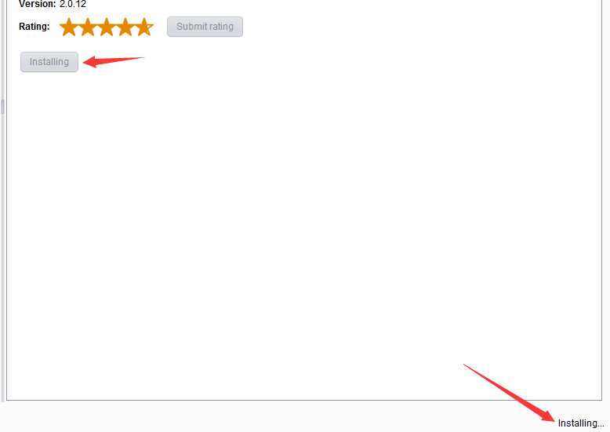 此时，安装按钮置为灰色，同时显示为【installing】，右下角也显示安装中，如上图。安装完成后，界面会显示重新安装【Reinstall】和插件评分按钮【Submit rating】，作为插件商店的用户推荐。  安装完毕后，在 Burp Extender 的 Extension 的 Tab 页面中，会自动显示已加载的插件列表。通过插件列表的管理，我们可以对插件进行后期的维护。 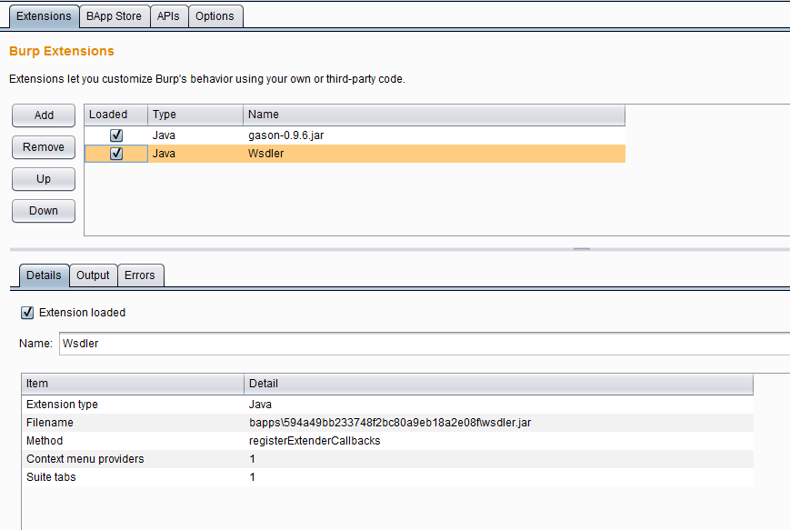 当然，除了从应用商店自动安装插件外，我们也可以下载插件，进行手工安装。如下图： 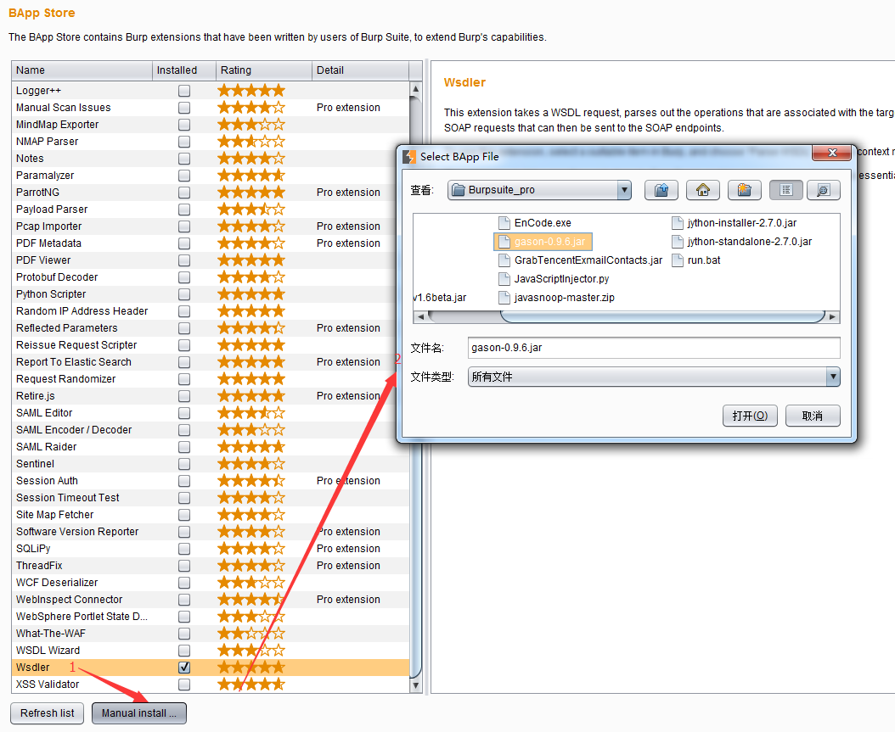 当我们点击图中 1 处的手工安装按钮，则弹出插件安装文件存储的盘符，选择指定的插件文件，点击打开即可进行安装。

* * *

##### 管理和加载 Burp 插件（Extension）

从上一章节我们已经了解到，安装完成的插件，都会显示在插件列表中。  如果我们想对某个插件的配置信息进行编辑，则如上图中所示，选中插件，其下方的【Details】标签页会显示插件的拓展信息，如：拓展的插件类型（java/Python/Ruby）、插件的文件名、存储的位置。 除了【Details】标签页外，【Output】和【Errors】两个页面分别可以设置此插件的标准输出和错误信息输出信息。 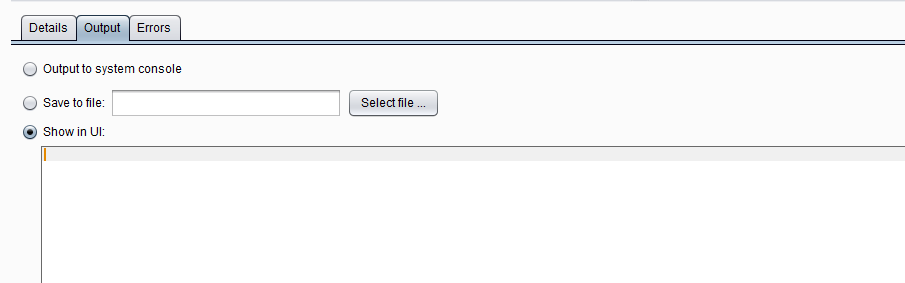 从上图中我们可以看出，日志信息的输出有三种方式： a)系统控制台输出 b)存储到指定的文件中 c)Burp 的界面输出 默认情况下，会选择 Burp 的界面输出。在实际应用中，我们可以根据自己的需要，对日志的存储方式进行调整。

* * *

##### 其他选项设置

Burp 插件的其他选项设置主要是指 Options 的 Tab 页中的相关设置。 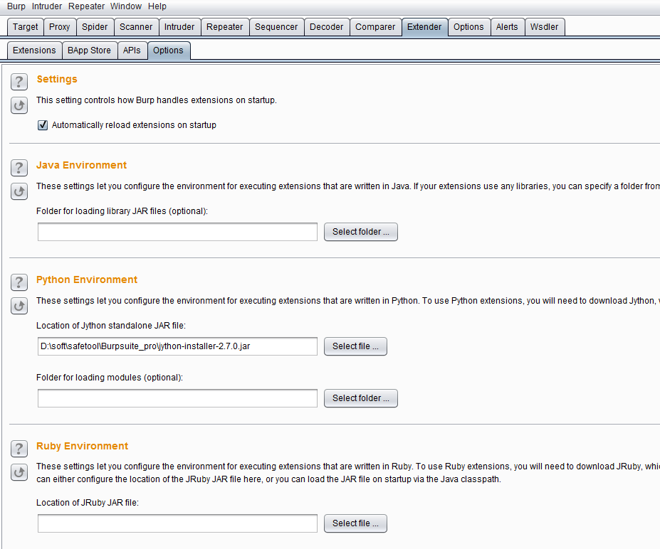 从图中我们可以看出，【Setting】的设置是指：是否启动时自动重新加载 burp 插件，当我们选择此项时，Burp 在重启时，会自动加载 Burp 在上次关闭时加载的插件内容；而剩下的三项设置是根据插件类型的不同时所需要的运行环境的配置。我们先来看第一个运行环境【Java Environment】。 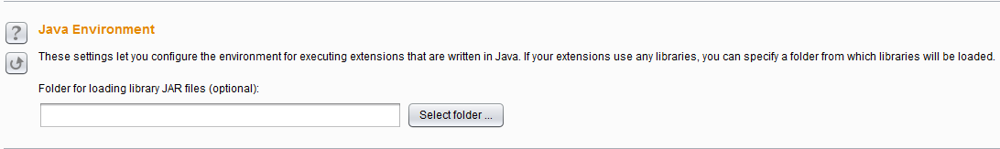 Burp Suite 是基于 Java 语言开发的软件，通常情况下，当你运行此软件时，系统中的 JAVA_HOME、CLASS_PATH、LIB_PATH 变量均已正确地配置完成，否则你是难以运行 Burp Suite 的，所以，通常情况下你是无须再配置此参数；如果实在需要配置，你的插件需要特殊的 jdk 版本要求或者其他 ja，则选择将 jar 添加即可。 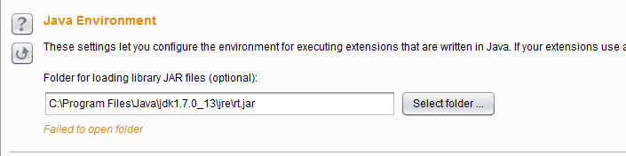 而【Python Environment】和【Ruby Environment】是 Burp 插件的 Python 运行环境和 Ruby 运行环境的配置。前文我们已经知道，Burp 是 java 语言编写的软件，所以运行 Python 和 Ruby 需要配置兼容 Java 与 Python、Java 与 Ruby 的 jar,默认情况下，Burp 支持的为 JPython 和 JRuby，这两个软件的地址分别是 ：[`www.jython.org/`](http://www.jython.org/)、[`jruby.org`](http://jruby.org/).其安装方式非常简单，此处以 JPython 为例： **1.**下载 JPython 的安装包，Jpython 的安装分 jython-installer-2.7.0.jar 和 jython-standalone-2.7.0.jar 两个。如果使用 jython-installer，则下载完毕后，双击此 jar，按照安装向导，一路【Next】到如下图的界面，记录安装路径。然后一直默认，直至安装结束。 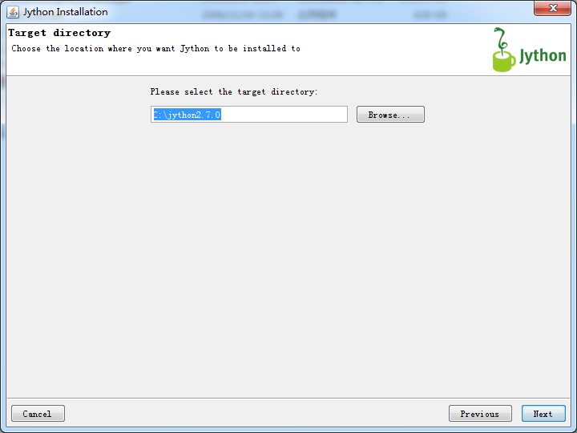 如果使用 jython-standalone-2.7.0.jar，则直接进行第 2 步。 **2.**在 Burp 的 Python Environment 环境中配置 Jpython，如果使用的 jython-standalone-2.7.0.jar，则如下图指定 jar 存放的位置即可；如果是使用 jython-installer 方式，则指定安装的文件夹，由软件自己加载（此处为了说明使用的方式，两个输入域均输入了，实际使用时，Jpython 之输入其中之一即可）。 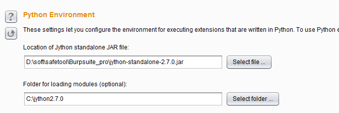 至于 JRuby 的配置与 JPython 类似，此处就不再赘述。配置完插件运行的可依赖环境之后，当我们使用插件时就能正常使用，否则，在插件的【Errors】标签页中会有错误的提示信息，我们可以根据错误提示来修改自己的配置。 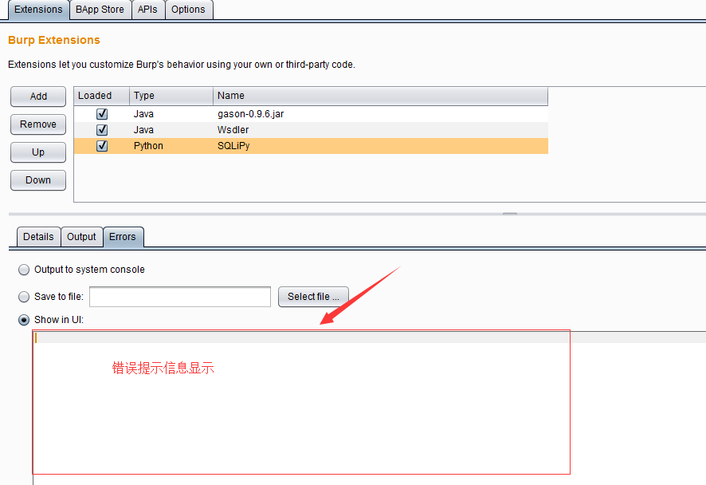 *++值得注意的是，当我们使用 Burp 插件功能，对于 Burp 运行时所需要的 JVM 内存占用比较大，一般建议设置为 1G，具体设置请参考第一章节。++*

* * *