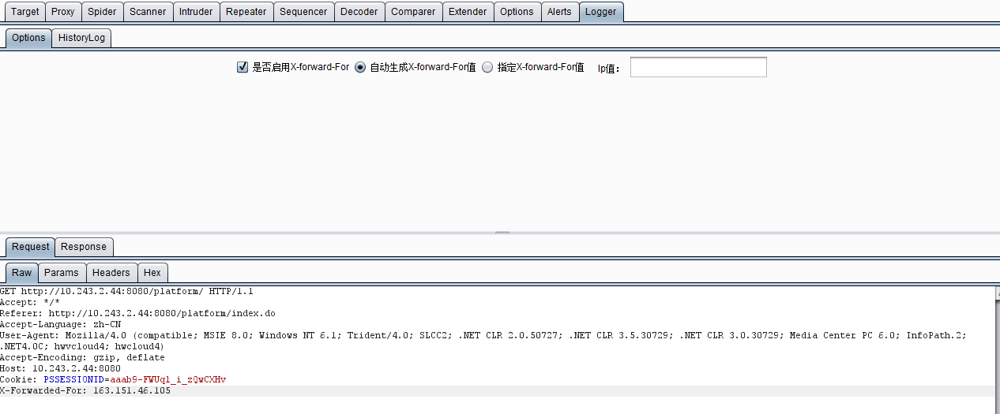

# 第十六章 如何编写自己的 BurpSuite 插件

### 如何编写自己的 Burp Suite 插件

Burp Suite 的强大除了自身提供了丰富的可供测试人员使用的功能外，其提供的支持第三方拓展插件的功能也极大地方便使用者编写自己的自定义插件。从上一章节我们已经了解到，Burp Suite 支持的插件类型有 Java、Python、Ruby 三种。无论哪种语言的实现，开发者只要选择自己熟悉的语言，按照接口规范去实现想要的功能即可。下面我们就来看看如何开发一个 Burp Extender 的插件。 本章讲述的主要内容有：

*   API 简述
*   Burp 插件的编写前准备
*   Burp 插件的编写（Java 语言版）

##### API 简述

打开 Burp Extender 的 APIs 的 Tab 页，看到的界面如下图所示：  界面由左边的接口类和右边的接口定义和描述构成，其中左边的最下端有两个按钮，图中 1 按钮为保存接口类，当我们点击保存后，在指定的存储目录下，会生成一系列的 java 文件，如下图：  这些文件的内容即为前一张图中右边所示的内容，按照 java 语言的源文件格式存放的，在编写插件时，可直接将 burp 包引入 Project 中使用。而前一张图中 2 按钮为保存 Javadocs,点击保存后，会在存储目录中存放与 API 相对应的 JavaDocs 文件。用浏览器打开则如下图所示： 

除了上文说的，我们能导出 JavaDocs 到本地外，Burp 官方也提供了一份在线文档，地址为：[`portswigger.net/burp/extender/api/index.html`](https://portswigger.net/burp/extender/api/index.html) 下面我们根据接口功能的不同对 API 进行分类。

1.  插件入口和帮助接口类：IBurpExtender、IBurpExtenderCallbacks、IExtensionHelpers、IExtensionStateListener

    > IBurpExtender 接口类是 Burp 插件的入口，所有 Burp 的插件均需要实现此接口，并且类命名为 BurpExtender。 IBurpExtenderCallbacks 接口类是 IBurpExtender 接口的实现类与 Burp 其他各个组件（Scanner、Intruder、Spider......）、各个通信对象（HttpRequestResponse、HttpService、SessionHandlingAction）之间的纽带。 IExtensionHelpers、IExtensionStateListener 这两个接口类是插件的帮助和管理操作的接口定义。

2.  UI 相关接口类：IContextMenuFactory、IContextMenuInvocation、ITab、ITextEditor、IMessageEditor、IMenuItemHandler

    > 这类接口类主要是定义 Burp 插件的 UI 显示和动作的处理事件，主要是软件交互中使用。

3.  Burp 工具组件接口类：IInterceptedProxyMessage、IIntruderAttack、IIntruderPayloadGenerator、IIntruderPayloadGeneratorFactory、IIntruderPayloadProcessor、IProxyListener、IScanIssue、IScannerCheck、IScannerInsertionPoint、IScannerInsertionPointProvider、IScannerListener、IScanQueueItem、IScopeChangeListener

    > 这些接口类的功能非常好理解，Burp 在接口定义的命名中使用了的见名知意的规范，看到接口类的名称，基本就能猜测出来这个接口是适用于哪个工具组件。

4.  HTTP 消息处理接口类：ICookie、IHttpListener、IHttpRequestResponse、IHttpRequestResponsePersisted、IHttpRequestResponseWithMarkers、IHttpService、IRequestInfo、IParameter、IResponseInfo

    > 这些接口的定义主要是围绕 HTTP 消息通信过程中涉及的 Cookie、Request、Response、Parameter 几大消息对象，通过对通信消息头、消息体的数据处理，来达到控制 HTTP 消息传递的目的。

通过对 Burp 插件 API 的功能划分，我们对 API 的接口有一个初步的认知，知道在使用某个功能时，可以去哪个接口类中寻找相应的接口定义来做自己的实现。例如。我们想显示一个 Tab 页界面，那么肯定是要实现 ITab 接口；如果需要对消息进行编辑修改，则需要实现 IMessageEditor 接口；需要使用 payload 生成器，则需要实现 IIntruderPayloadGenerator 接口。通过接口分类后再找具体的接口定义的方法，可以帮助我们在不太熟悉 Burp 插件 API 的情况下，更快地开发出自己需要的插件。

* * *

##### Burp 插件的编写前准备

编写一个完整的 Burp 插件的大体过程可分为如下三步：

**1\. 导入 Burp 插件接口**，即通过 APIs 界面上的【save interface files】的保存动作，将生成的文件连同 burp 目录一下添加你自己的 Java Project 中。

**2\. 编写 Burp 插件**，即通过自己的代码编写，完成自己想实现的功能插件的编码过程。

**3\. 加载 Burp 插件**，即将上一步编写完成的插件，打包后导入 Burp Extensions 中，进行试用测试的过程。

其中第一步和第三步对大多数来说，没有难度，主要难度在于如何编码实现 Burp 的插件。在 Burp Suite 的官方网站上，插件编写网址：[`portswigger.net/burp/extender/`](https://portswigger.net/burp/extender/)。当我们打开这个网页，会发现网站上有一系列 Demo，包含各个编程语言的实现的源代码，这些 Demo，按照开发的难度逐步增加的，我们可以点击【Download】链接下载源码进行分析和学习（网页截图如下所示）。 

除了这些 Demo 外，网站还有一篇插件编写入门的文章。网址：[`blog.portswigger.net/2012/12/writing-your-first-burp-extension.html`](http://blog.portswigger.net/2012/12/writing-your-first-burp-extension.html)。文章中以 Java 和 Python 语言为例，编写一个最简单的 Burp 插件来熟悉插件的编写流程，阅读这些文章，会给我们编写 Burp 插件带来极大的帮助。阅读完这篇文章之后，接着官方的归档文件中，会有一些由浅入深讲解插件编写的文章，E 文好的同学也可以自己看看，网址点击：[`blog.portswigger.net/2012_12_01_archive.html`](http://blog.portswigger.net/2012_12_01_archive.html)

如果你没法读懂这些文章，那么我们一起先来看看编写 Burp 插件的准备工作有哪些，下一章以实例学习如何编写一个 Burp 插件。通常编写 Burp 插件的准备工作有：

1.  安装 JDK------我相信会使用 Burp Suite 软件的同学都已经安装过 JDK 了，如果没有安装，请阅读此书的第一章第二章相关章节。
2.  安装 IDE------一款好的 IDE 能使得开发效率得到极大的提升，Java 语言推荐使用 Eclipse 或者 IntelliJ，Python 推荐使用 Pycharm 或者 PyDev，具体每一个 IDE 软件的安装，请读者自己查找学习。
3.  熟悉编程语言的语法-----这是编写插件的基础，如果连基本的语法都不熟悉，编写 Burp 代码是有一定难度的，接下来的文章中，编者默认为阅读者对语法的掌握程度是熟悉的。

具备了以上三点，把你自己想要实现的插件功能按照软件需求分析的流程在图纸上简单地画出来，我们即可以进入插件开发环节。

* * *

##### Burp 插件的编写（Java 语言版）

Burp 插件的编写语言有 Java、Python、Ruby，此处我们以 Java 为例，来学习编写一个插件。插件要实现的功能是：在 http 和 https 请求的 header 部分添加一个 X-Forward-For 字段，而字段中的 IP 地址是随机生成或者指定的，用于绕过使用该字段来防护暴力破解等的场景。插件代码的编写是基于网友 bit4woo 的 Burp 插件源码进行二次开发的。源项目 github 地址：[`github.com/bit4woo/Burp_Extender_random_X-Forward-For`](https://github.com/bit4woo/Burp_Extender_random_X-Forward-For)，在此向网友 bit4woo 致谢！

bit4woo 网友的源码中实现的插件中仅有 X-Forward-For 的消息头添加，无插件的 UI 界面，我们无控制插件是否生效和跟踪 http 消息通信的直观查看。因此，我们需要实现的插件的功能如下：

1.  对使用插件的 HTTP 请求消息头中添加 X-Forward-For 字段
2.  添加 UI 界面，直观地感受插件的使用。
3.  跟踪 HTTP 消息，在 Burp 中使用了哪些组件，请求的 URL 是什么,请求后的 http 状态码是否多少。
4.  能在插件中控制本插件是否拦截所有的 HTTP 请求消息，即是否对请求消息头添加 X-Forward-For 字段。
5.  添加的 X-Forward-For 字段是随机生成还是自己指定的值。

插件编写完成的消息跟踪界面（HistoryLog）如下图：  插件的设置界面（Options）如下： 

下面我们就来看看具体的编码实现（此处仅仅谈 Burp 插件的编写，Swing 组件的使用不涉及，默认编写者对 Swing 已熟练掌握）。

1.首先在 burp 包中定义了一个名称为 BurpExtender 的 java 类，必须继承 IBurpExtender 接口。这个上一个章节已经阐述过了。  2.因为要在 Burp 中添加一个 tab 页作为我们自定义的 UI，所以我们需要实现 ITab 接口；因为要显示请求和响应消息，所以需要实现 IMessageEditorController 接口；因为要拦截请求的报文，添加 X-Forward-For，所以需要实现 IHttpListener 接口。如上图所示。类定义完成后，导入未实现的方法，则类的 UML 图如下：  3.接着就是对接口类的方法实现，在 UML 中，下面两个是需要实现的主要函数：

> **registerExtenderCallbacks(final IBurpExtenderCallbacks callbacks)** 这个函数是 Burp 插件的入口，在这里主要做了如下工作：1）初始化插件和组件对象 2）设置自定义的 UI 界面原型。  其中创建自定义 UI 的**run**函数代码如下：  其次是**processHttpMessage(int toolFlag, boolean messageIsRequest, IHttpRequestResponse messageInfo)** 这个函数的功能主要是对 HTTP 消息的处理和添加 HTTP 消息到 History 列表中。其代码如下：  除了这两个函数，其他函数的功能主要是为了 UI 展示做的各种逻辑操作，此处就不再叙述了，想要了解的同学可以下载本章后面附的源码进行阅读。

4.完成了主要函数的编码之后，插件开发的部分就已经结束了，这时候，我们只需要把代码导出成 jar 把，加载到 Burp Extensions 中测试运行即可。 

5.本插件和其源码下载地址

点击下载插件 jar

点击下载源码

下载完毕后，你可以把 src 中的两个 java 类放入从 APIs 标签页中导入的接口类所在的 burp 包中，编译后打包 jar 运行；也可以直接把下载的 X-forward-For.jar 导入 Burp 拓展插件中，即可看到插件的运行界面。