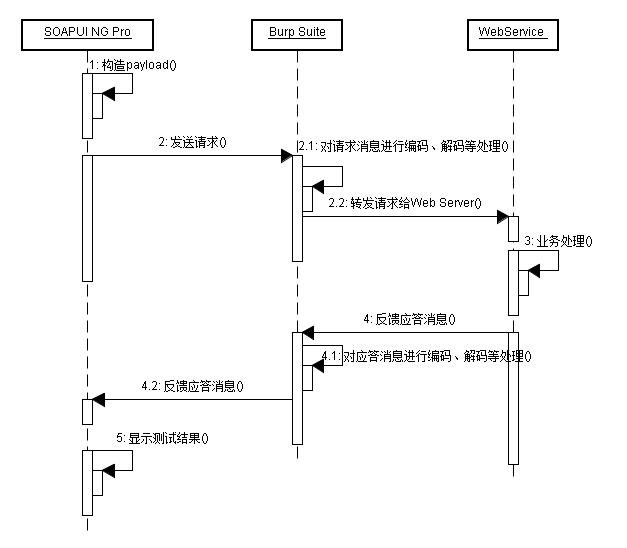
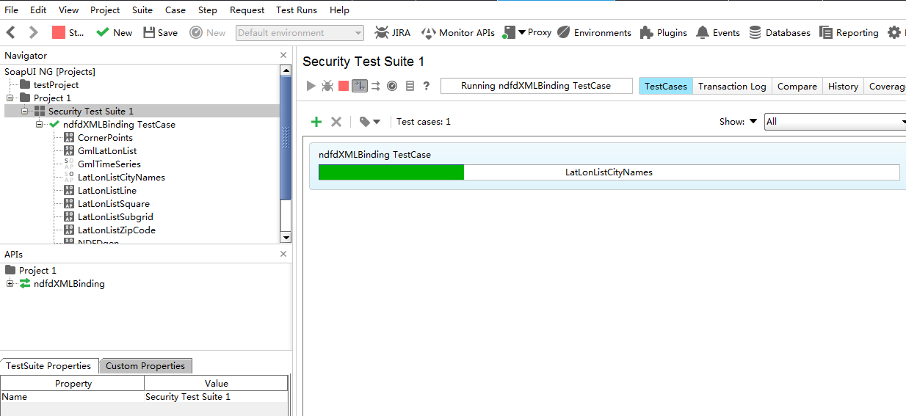
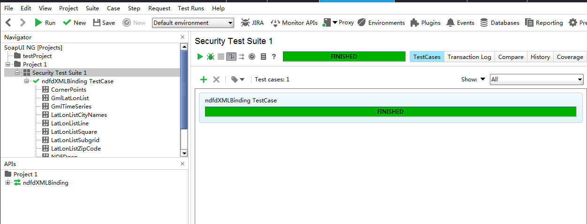

# 第十七章 使用 Burp Suite 测试 Web Services 服务

### 使用 Burp Suite 测试 Web Services 服务

从这一章开始，我们进入了 Burp 的综合使用。通过一系列的使用场景的简单学习，逐渐熟悉 Burp 在渗透测试中，如何结合其他的工具，组合使用，提高工作效率。本章主要讲述在测试 Web Services 服务中，如何使用 Burp Suite 和 SoapUI NG Pro 的组合，对服务接口进行安全测试。 本章讲述的主要内容有：

*   使用场景和渗透测试环境配置
*   渗透测试过程中组合软件的使用

* * *

##### 使用场景和渗透测试环境配置

在日常的 web 测试过程中，除了基于浏览器展现技术的客户端应用程序外，基于 SOAP 协议进行通信的 WebService 服务也很常见。WebService 的出现是为了解决分布式、跨平台、低耦合而实现的不同编程语言之间采用统一的数据通信的技术规范，在应用程序中，常作为独立的业务模块对外提供具体的业务功能或者为前段提供数据处理的业务接口。因 SAOP 协议中的接口定义使用 XML 作为描述性语言，这与 php、jsp 之类的通信交互在渗透测试上还是有很大的差异。如果使用 Burp 对通信消息进行拦截抓包，一次典型的消息内容如下图所示：  其 http 消息头中包含 SOAPAction 字段，且消息体为`<soapenv:Envelope>`封装的 xml 文本（更多关于 WebService 的文章请阅读者自行搜索）。正因为 WebService 这些特征，所以在渗透测试中我们也需要选择能解析 SOAP 协议和 WSDL 描述的软件。这里，我们使用的是 SoapUI NG Pro 和 Burp Suite。他们各自的作用分别是：

*   **SoapUI NG Pro：** 渗透测试流程的发起，通信报文的解析、集合 payload 之后通信报文的重新组装等。
*   **Burp Suite：** 代理拦截，跟踪通信过程和结果，对通信进行重放和二次处理等。

如果按照时序图来展现，他们在通信过程中，各自的时序位置如下：  从图中我们可以看出，作为代理服务 Burp 起着通信中间人的作用，可以对消息进行拦截后的编码、解码、转发、丢弃等各种操作，并记录原始消息。而 SoapUI NG Pro 作为 WebService 的测试工具，通过构造不同类型的 payload 来测试、验证漏洞的存在。他们组合在一起，共同完成复杂场景下 WebService 服务的渗透测试过程中的安全性验证。

* * *

SoapUI NG Pro 是 SmartBear 公司继 SoapUI Pro 之后推出的企业应用级收费软件，其试用版下载地址为：[`smartbear.com/product/ready-api/soapui-ng/free-trial/`](https://smartbear.com/product/ready-api/soapui-ng/free-trial/)。下载安装完毕后，打开软件的主界面大体如下图所示（其中图中 1 部分为不同功能视图之间的切换项，图中 2 部分为菜单栏，图中 3 部分为常用功能菜单，图中 4 为 Project 视图区，图中 5 为主工作区，图中 6 部分为属性设置区）：  安装完毕后，我们首先要做的是将 SoapUI NG Pro 的代理服务指向 Burp Suite。假设我的 Burp Proxy 设置为 127.0.0.1:8080。则 SoapUI NG Pro 的配置是：

1.  点击上图中 3 部分的**Preferences**，或者上图中 2 部分的**【File】**>>**【Preferences】**
2.  在弹出的界面中打开**proxy**选项卡，录入代理地址和端口。

    

完成以上的配置后，我们对 WebService 的渗透测试环境已经基本具备，可以开始对一个具体的 WebService 服务进行渗透测试了。

* * *

##### 渗透测试过程中组合软件的使用

渗透测试环境配置后，我们就可以开始测试。这里我们可以自己编写 WebService 服务端，也可以通过搜索引擎选择互联网上公开的 WebService，我这里使用的是：[`graphical.weather.gov/xml/SOAP_server/ndfdXMLserver.php?wsdl`](http://graphical.weather.gov/xml/SOAP_server/ndfdXMLserver.php?wsdl)

**一次简单的渗透测试过程大体包含如下环节**： 1.首先，我们通过 SoapUI NG Pro 创建安全测试用例。如下图：

2.在弹出的界面中，选择通过 WSDL 创建，接着输入 WSDL 地址。如下图：

3.当 SoapUI NG Pro 对 WSDL 解析完成后，会自动生成一系列的安全测试项：

4.我们可以对上图中的安全测试项进行增加和删除，默认情况下，这些安全测试项都是选中的。比如，如果我们只需要测试是否存在 XPath 注入，则只要上图中的勾选最下面的一项即可。 当 SoapUI NG Pro 根据安全测试项，完成不同的测试用例的创建之后，主操作界面如下图所示：

5.我们可以选择指定的 SOAPAction 或者某个 SOAPAction 下的某个安全项进行单一测试，也可以直接点击 run 运行所有的安全测试项。如果测试项过多的话，此操作执行时间会比较长，同时，如果并发数过多，会给服务器端造成压力，这是测试时候需要注意的。如下图所示，图中 WebService 接口正在安全测试中，进度条中显示调用的 SOAPAction 名称。 

6.如果出现下图的状态，则表示测试进程已经执行完毕。 

7.7\. 此时，我们可以在 Burp 的 Http history 面板中查询到刚才发生的所有请求消息，通过不同的过滤条件查找我们关心的请求或响应消息，并发送到 Burp 的其他工具组件进行消息重放和处理、验证。 

[更多关于 SOAPUI 的使用请阅读这里](https://www.soapui.org/security-testing/working-with-security-tests.html)

* * *

**SoapUI NG Pro 的安全测试项包括以下内容：**

*   边界扫描
*   SQL 注入
*   XPath/XQuery 注入
*   模糊测试
*   无效的参数类型
*   XML 格式畸形
*   XML 炸弹
*   跨站脚本
*   上传附件安全
*   自定义扫描

下面就以 SQL 注入为例，我们看看 SoapUI NG Pro 的安全测试配置参数。  对于每一个安全测试项，其基本配置主要分三部分： 1.配置项（Configuration）

> 主要是指协议描述中定义的输入参数、编码类型、SOAP 协议中的特定参数（namespace、import....)

2.自动化测试策略（Straegy）

> 主要设置测试过程中的请求延时、选择策略、运行方式等

3.高级选项（Advanced）

> 通常是指测试时所需要的 payload 值，或者生成 payload 的策略。通过上图我们也可以看出，payload 的值是可以自定义添加的。在 github 上，fuzzdb 是被广泛使用的字典库，我们可以使用它作为测试的 payload 字典。项目地址为：[`github.com/fuzzdb-project/fuzzdb`](https://github.com/fuzzdb-project/fuzzdb)

* * *

当我们配置完毕后，运行安全测试项时，可以在 Burp 中查看到发送的 payload 值，如下图（阴影选中部分）所示的 XSS 脚本测试的 payload：  同时，我们根据 http 状态码，对应答进行排序，跟踪可疑的响应消息，获取服务器的敏感信息。如下图获取的服务器 Banner 信息：  被 Burp 拦截到的消息记录，我们可以发送到 Intruder，使用 fuzzdb 进行指定的 fuzz 测试；也可以发送到 Repeater 进行手工的消息内容修改和漏洞是否存在性的验证。具体到某个方面的漏洞，比如说 Xpath 注入漏洞，在测试过程中，需要测试人员理解 Xpath 的注入原理，理解 Xpath 的语法，根据服务器端的响应消息，自己手工构造特定的 payload 才能获得更重要的信息。这些都是在平时的工作中慢慢积累的，而不是光靠一款工具软件就作为万能的解决方案，希望读者能明白这个道理。

* * *

**使用 Wsdler 测试 WebService 接口：**

除了前面我们说的使用 SOAPUI NG Pro 测试 WebService 外，在 Burp 里也有一个通过 WSDL 解析接口定义，手工测试 WebService 的插件：Wsdler

如果你安装了此插件，则在 Burp 的 Proxy >> History 中，可以直接使用【Parse WSDL】功能。

确认使用【Parse WSDL】解析功能后，此插件自动解析出服务的 Operation、Binding、Endpoint。当选中某个 Operation 之后，可以查看 SOAP 消息文本。同时，可以发送到 Burp 的其他组件进行进一步操作。

比如，我们将上图中的消息发送到 Intruder，使用字符块（Character blocks）的对参数进行边界测试。

发送 Intruder 后的截图如下：

使用的 payload 为字符串 1，从 1 到 50，即 1,11,111,1111......直到 50 个 1，来测试参数的边界长度：

生成 payload 并执行后的结果如下图所示：

上面仅仅简单地叙述了 Wsdler 的使用，在实际的安全测试中，你可以使用 Fuzzdb 的字典，进行更复杂的渗透测试和功能验证。无论你使用什么样的工具，只要能通过一系列的自动化测试或者手工测试，完成 WebService 应用程序的安全脆弱性验证，保障应用程序的安全性，提供了应用程序的安全系统，这就达到我们做渗透测试的目的了。

* * *