# 第十八章 使用 Burp, Sqlmap 进行自动化 SQL 注入渗透测试

### 使用 Burp, Sqlmap 进行自动化 SQL 注入渗透测试

在 OWSAP Top 10 中，注入型漏洞是排在第一位的，而在注入型漏洞中，SQL 注入是远比命令行注入、Xpath 注入、Ldap 注入更常见。这就是本章要讲述的主要内容：在 web 应用程序的渗透测试中，如何使用 Burp 和 Sqlmap 的组合来进行 SQL 注入漏洞的测试。在讲述本章内容之前，默认为读者熟悉 SQL 的原理和 SqlMap 的基本使用，如果有不明白的同学，请先阅读《[SQL 注入攻击与防御](https://www.baidu.com/s?wd=SQL%E6%B3%A8%E5%85%A5%E6%94%BB%E5%87%BB%E4%B8%8E%E9%98%B2%E5%BE%A1.pdf)》一书和[SqlMap 手册](https://www.secpulse.com/archives/4213.html)（最好是阅读官方文档）。

本章包含的内容有：

1.  使用 gason 插件+SqlMap 测试 SQL 注入漏洞
2.  使用加强版 sqlmap4burp 插件+SqlMap 批量测试 SQL 注入漏洞

* * *

##### 使用 gason 插件+SqlMap 测试 SQL 注入漏洞

在正式开始本章的内容之前，我们先做如下两点约定：

*   你已经安装配置好了 python 可运行环境
*   你已经熟悉 sqlmap 的基本命令行的使用并正确安装

如果你已经做到了上面的两点，那么，我们正式开始进入本章的内容。

Burp Suite 与 SqlMap 整合的插件除了 BApp Store 中的 SQLiPy 外（如图），

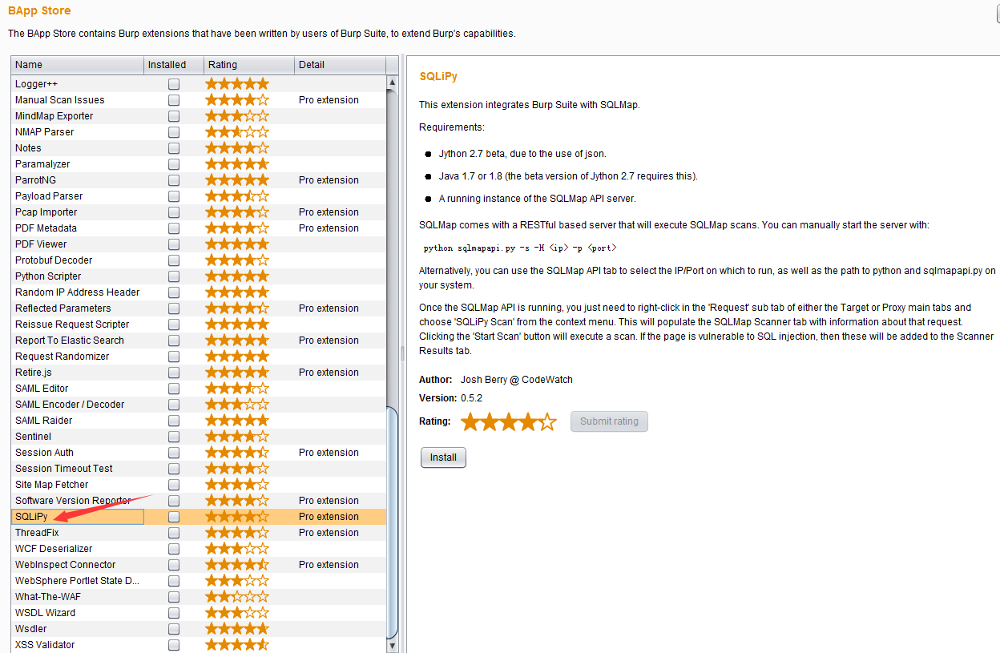

还有[gason](https://code.google.com/p/gason/)和[sqlmap4burp](https://github.com/difcareer/sqlmap4burp)。不同的插件之间的功能大同小异，其目的都是使用命令行调用 SqlMap 的 API 接口进行 SQL 注入的测试，这里，我们主要以 gason 为例，讲述具体配置安装和功能使用。

gason 插件安装使用大体分以下几个步骤：

1.  首先是下载 gason 插件。你可以从这个地址进行下载（点击下载），也可以从[官方下载](https://code.google.com/p/gason/)源码自己编译，总之就是获取到插件的安装文件 gason-version.jar

2.  打开 Burp Extensions 进行安装，点击【Add】按钮，按照图中所示操作即可。安装过程很简单，如果不明白的话，可参考《Burp Suite 应用商店插件的使用》章节的内容。 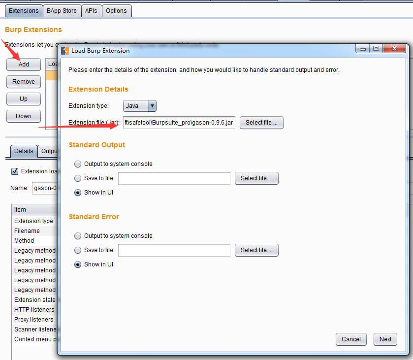 如果出现了下图中所示结果，且【Output】和【Errors】两个 tab 页面中没有错误的提示信息，表示插件已安装成功。 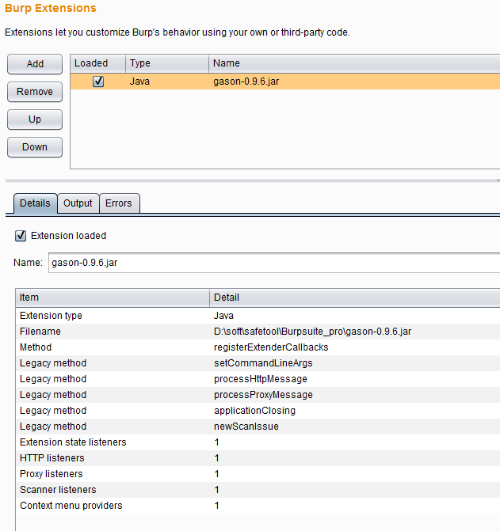

3.  安装完成后，当 Burp 的 Proxy 中拦截到消息记录时，可直接发送到 sqlmap。如下图所示： 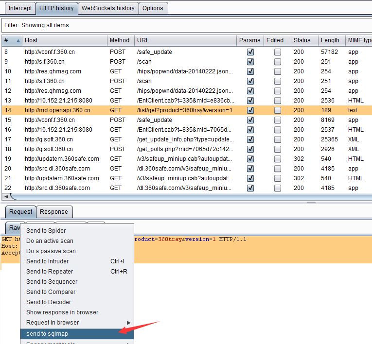

4.  如果没有出现如上图所示的【send to sqlmap】菜单，则表示插件没正确安装成功，需要读者自己排查一下安装失败的原因。

5.  当我们在 Burp 拦截的请求消息上选择【send to sqlmap】后，则自动弹出 sqlmap 选项设置对话框。 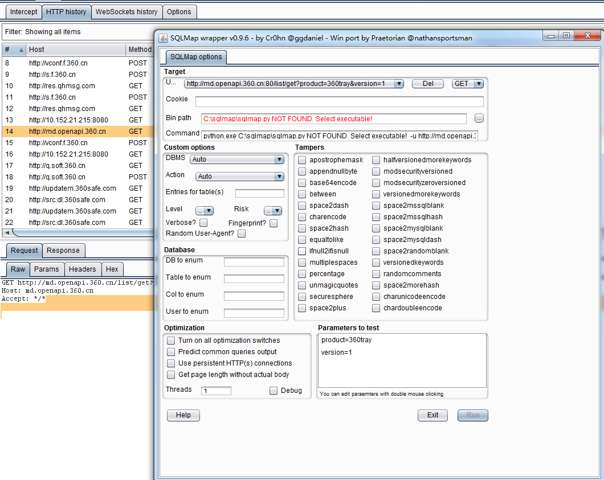 从图中我们可以看出，插件会自动抓取消息内容并解析后填充到相关参数设置的选项里去。例如：参数和参数值，请求方式（GET/POST），url 地址等。同时，还有许多与 Sqlmap 本身测试使用的选项值仍需要我们自己指定，其中最主要的两个是：

**bin 目录**：这里是指 sqlmap.py 的路径

**Command**：sqlmap 运行时执行的命令行

6.设置 bin 目录的方式很简单，点击【....】按钮，选择到 sqlmap.py 的存储路径即可。当 bin path 配置正确后，下方的 Command 会自动更新，随着设置参数的不同，自动调整需要执行的 sqlmap 命令行（如果不理解界面操作各个设置的含义，可以比较设置前后 Command 值的变化，即可以知道某个设置对应于 sqlmap 参数的哪一个选项）。 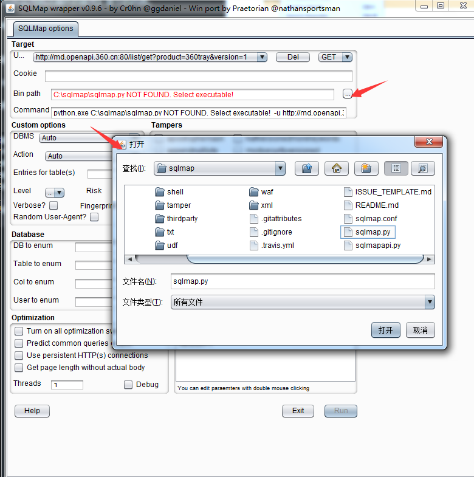

7.所有的配置正确之后，【run】按钮将被激活，点击【run】，系统自动进入 sqlmap 扫描阶段。

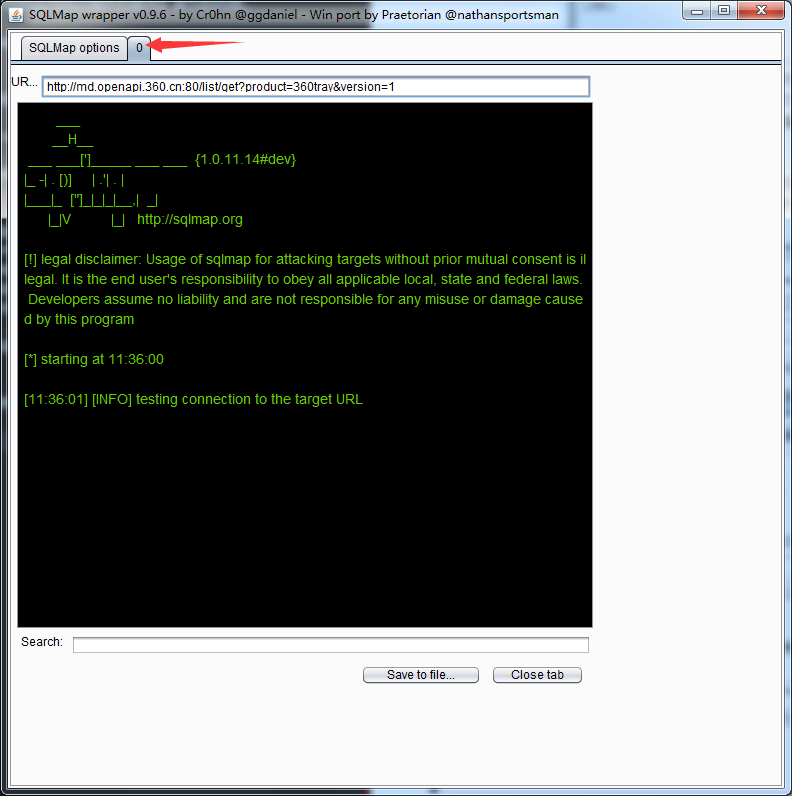 当进入 sqlmap 扫描阶段时，插件会新增一个 tab 页面，显示执行进度，即如上图的箭头所指。

8.我们可以通过进度跟踪的界面上的【save to file】和【close tab】来保存扫描结果和关闭、终止扫描。

使用 gason 插件，与命令行方式执行 sqlmap 脚本相比，操作变得更加方便。比如说，在命令行环境中，我们需要先抓取 cookie 信息，才能放入到命令行里执行；亦或者，我们需要手工录入一个个参数进行命令行操作，而在 gason 插件环境中，这些都不需要。当我们点击【send to sqlmap】时，插件自动帮我们完成了这些操作。且与 sqlmap 个性设置的选项，我们也可以通过界面操作，自动完成，比命令行下更直观、更高效。

* * *

##### 使用加强版 sqlmap4burp 插件+SqlMap 批量测试 SQL 注入漏洞

如果你只想执行一次 sqlmap 的操作，即能完成多个链接地址的 SQL 注入漏洞测试，使用 gason 插件的方式操作起来会比较麻烦。那么，是否存在批量检测的使用方法呢？ 国内比较著名的安全网站 freebuf 上有两篇类似的文章，感兴趣的同学可以自己阅读看看。

1.  【优化 SQLMAP 的批量测试能】[`www.freebuf.com/sectool/75296.html`](http://www.freebuf.com/sectool/75296.html)
2.  【我是如何打造一款自动化 SQL 注入工具】[`www.freebuf.com/sectool/74445.html`](http://www.freebuf.com/sectool/74445.html)

通过上面的两篇文章，我们可以看出，批量操作在实际应用中非常常见，如果能解决批量问题，则大大地提高了我们的工作效率，下面我们一起来研究一下如何解决这个问题。

在 Sqlmap 的官方文档中有这样的介绍： 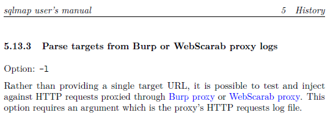

从这段话中我们可以看出，sqlmap 可以通过 -l 参数，一次检测多个 url 的注入问题，这个参数的值是 Burp proxy 或者 WebScarab proxy 的日志文件。那么，我们是否可以通过插件的方式，自动生成类似的日志文件，然后调用 sqlmap，解决批量检测的问题？答案当然也是肯定的。

在 github 上，网友 difcareer 公开了一个 Burp 插件 sqlmap4burp，源文件地址为：[`github.com/difcareer/sqlmap4burp`](https://github.com/difcareer/sqlmap4burp)。我们就基于此插件的功能拓展，来完成自动化批量 SQL 测试的功能。

首先，我们来规划一下这个插件的使用场景：

> 当通过 Burp 代理的 HTTP 流量消息都记录在 HTTP History 列表中，我们可以批量地选中多个 url，由插件自动生成类似 Burp proxy 的日志文件，然后调用 sqlmap 进行检测。

插件整个使用过程的流程图如下： 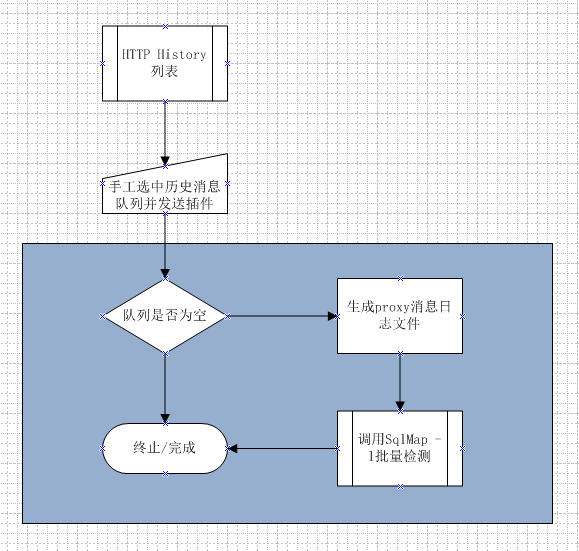

上图中浅蓝色背景标示的部分，均为插件所执行的动作。其主要做了这些事情：

1.  判断选中数据是否为空，不为空则获取 History 列表的已选中数据，无论一条还是多条记录。
2.  将获取的 HTTP 消息按照 proxy 日志的格式，生成日志文件。
3.  调用 sqlmap.py 脚本，传递生成的日志文件作为参数值进行检测。

明白了这些，接着我们来看 proxy 的日志文件格式。

如上图所示，我们通过【Options】>>【Misc】>>【Logging】选中 Proxy 的 Requests 选项，自动弹出保存日志文件的路径和文件名，点击【保存】按钮后，则文件生成并开始记录 Proxy 的请求消息。 我们把生成的日志文件用记事本打开后发现，日志格式如下：

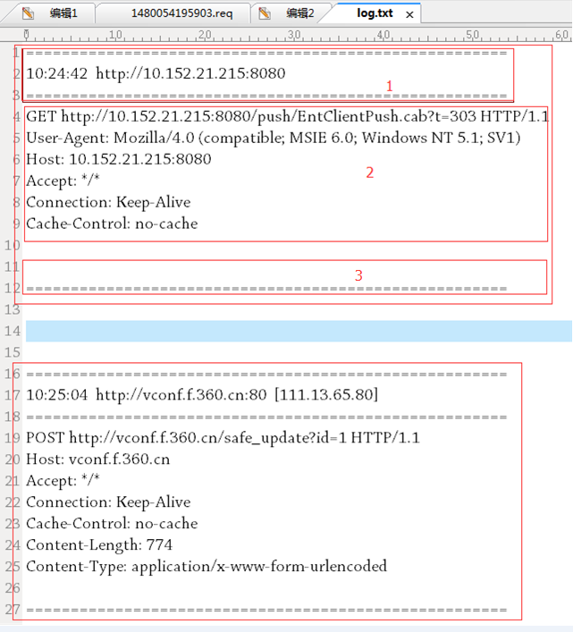

上图一共两条消息，每一条消息内容又包含图中 1 的头部，图中 2 的消息内容和图中 3 的尾部构成，而图中 2 的部分即是消息请求的详细内容，则我们按照此格式手工构造日志文件，通过修改 sqlmap4burp 的源码（Windows 环境下）从而来完成这个功能。

在源码 SnifferContextMenuFactory.java 的我们找到了日志获取的入口 createMenuItems 函数内部的 actionPerformed 函数，遂修改此段代码为：  而创建日志头部和尾部的代码主要是拼写同格式的字符串，详细如下： 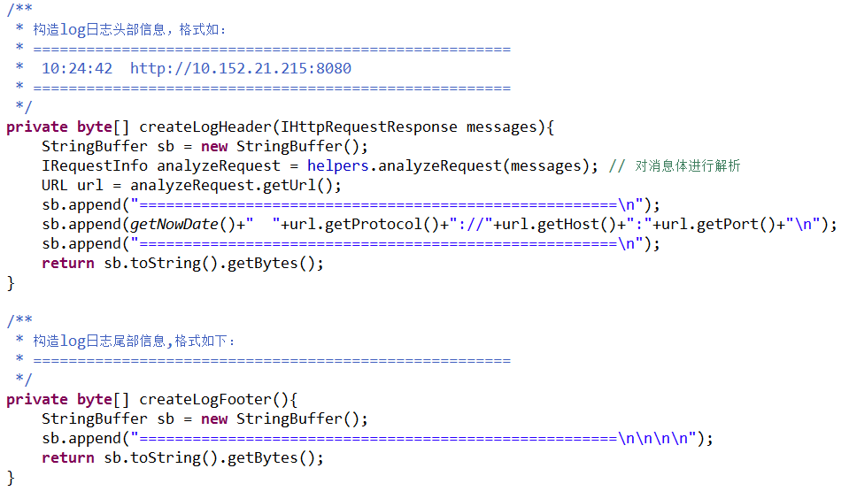

同时，修改 sqlmap 参数的调用方式，修改 SqlmapStarter.java 的第 21 行为： 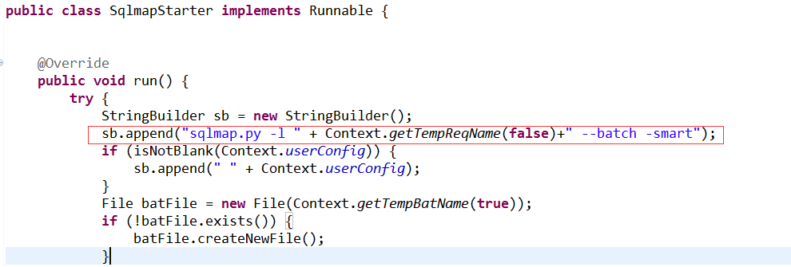

这样，我们可以实现批量操作的功能了。

插件和源码可以通过如下地址进行下载： 插件下载 源码下载

下载完毕后，请参考 sqlmap4burp 的[readme](https://github.com/difcareer/sqlmap4burp/blob/master/README.md)完成基本的配置放可以使用，否则 sqlmap 调用将会失败，无法完成批量检测。

插件安装完毕后显示跟原来的插件并无多大区别，如下图是发送多条 url 到 SqlMap 的截图：

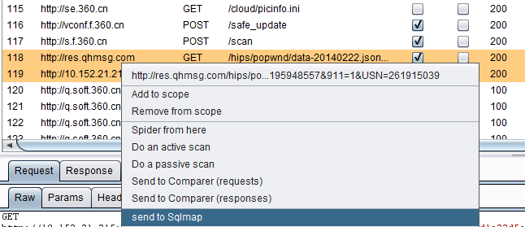

生成的日志文件的截图：

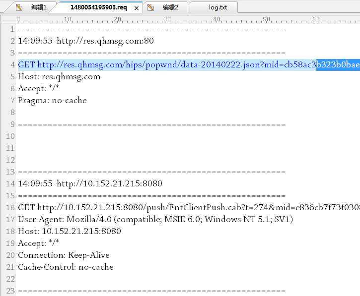

sqlmap 窗口中一次可以检测多个 ur 截图：

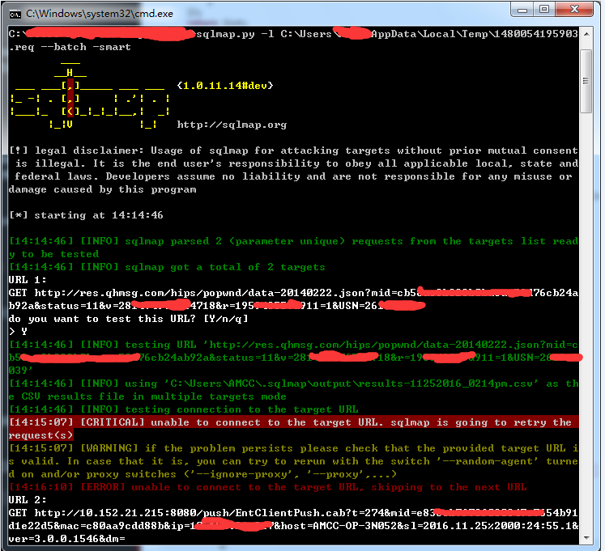