# 第十九章 使用 Burp、PhantomJS 进行 XSS 检测

### 使用 Burp、PhantomJS 进行 XSS 检测

XSS（跨站脚本攻击）漏洞是 Web 应用程序中最常见的漏洞之一，它指的是恶意攻击者往 Web 页面里插入恶意 html 代码，当用户浏览该页之时，嵌入其中 Web 里面的 html 代码会被执行，从而达到恶意攻击用户的特殊目的，比如获取用户的 cookie，导航到恶意网站，携带木马等。根据其触发方式的不同，通常分为**反射型 XSS、存储型 XSS 和 DOM-base 型 XSS**。漏洞“注入理论”认为，**所有的可输入参数，都是不可信任的**。大多数情况下我们说的不可信任的数据是指来源于 HTTP 客户端请求的 URL 参数、form 表单、Headers 以及 Cookies 等，但是，与 HTTP 客户端请求相对应的，来源于数据库、WebServices、其他的应用接口数据也同样是不可信的。根据请求参数和响应消息的不同，在 XSS 检测中使用最多的就是动态检测技术：以编程的方式，分析响应报文，模拟页面点击、鼠标滚动、DOM 处理、CSS 选择器等操作，来验证是否存在 XSS 漏洞。

本章包含的内容有：

1.  XSS 漏洞的基本原理
2.  PhantomJS 在 XSS 检测中的使用原理
3.  使用 XSS Validator 插件进行 XSS 漏洞检测

* * *

##### XSS 漏洞的基本原理

一般来说，我们可以通过 XSS 漏洞的表现形式来区分漏洞是反射型、存储型、DOM-base 三种中的哪一种类型。

1.  **反射型 XSS**是指通过给别人发送带有恶意脚本代码参数的 URL，当 URL 地址被打开时，带有恶意代码参数被 HTML 解析、执行。它的特点是非持久化，必须用户点击带有特定参数的链接才能引起。它的连接形式通常如下：

    ```
    http://localhost/vulnerabilities/xss_r/?name=<script>alert(1);</script> 
    ```

    其 name 参数的值为`<script>alert(1);</script>`，这样的参数值进入程序代码后未做任何处理，从而被执行。其类似的源代码如下图：
    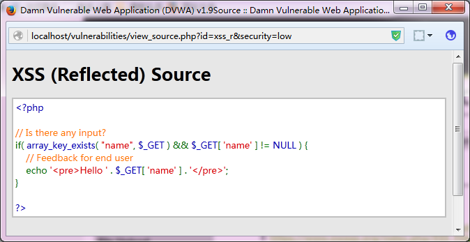

2.  **存储型 XSS**是指恶意脚本代码被存储进数据库，当其他用户正常浏览网页时，站点从数据库中读取了非法用户存储的非法数据，导致恶意脚本代码被执行。通常代码结构如下图：
    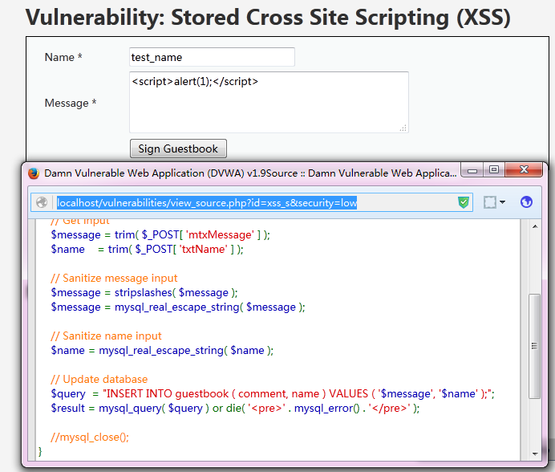
    其发生 XSS 的根本原因是服务器端对写入数据库中的内容未做 javascript 脚本过滤。
3.  **DOM-base 型 XSS**是指在前端页面进行 DOM 操作时，带有恶意代码的片段被 HTML 解析、执行，从而导致 XSS 漏洞。

##### PhantomJS 在 XSS 检测中的使用原理

PhantomJS 的官网地址：[`phantomjs.org`](http://phantomjs.org/)，目前最新版本 2.1。它是一个基于 WebKit 的服务器端 JavaScript API，即在无需浏览器的支持的情况下可实现 Web 浏览器功能的支持，例如 DOM 处理、JavaScript、CSS 选择器、JSON、Canvas 和可缩放矢量图形 SVG 等功能。基于它具有的功能，通常被用于以下场景：

1.  无需浏览器的 Web 测试：支持很多测试框架，如 YUI Test、Jasmine、WebDriver、Capybara、QUnit、Mocha
2.  页面自动化操作：使用标准的 DOM API 或一些 JavaScript 框架（如 jQuery）访问和操作 Web 页面。
3.  屏幕捕获：以编程方式抓起 CSS、SVG 和 Canvas 等页面内容，即可实现网络爬虫应用。构建服务端 Web 图形应用，如截图服务、矢量光栅图应用。
4.  网络监控：自动进行网络性能监控、跟踪页面加载情况以及将相关监控的信息

我们这里使用的主要是利用 PhantomJS 提供的 JavaScript API 调用监控和触发接口，方便地操作 html 页面 DOM 节点并模拟用户操作。

在 Burp Extender 的 BApp Store 中有一个 XSS 的检测的插件 XSS Validator，就是利用 phantomJS 和 slimerJS 的这些特性，来完成漏洞验证的。下面我们一起来看看它的原理。

在插件安装目录的 xss-detector 子目录下有一个 xss.js 的文件，就是 phantomJS 检测的具体实现。在代码中我们看到，默认情况下，在本地主机的 8093 端口启动了一个监听服务，并充当中间人代理的功能。

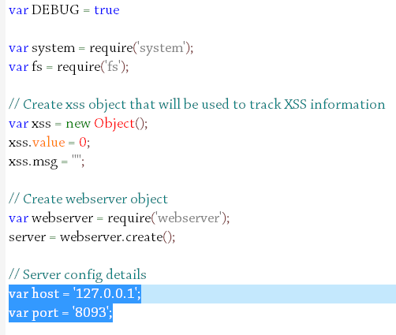

当 phantomJS 服务启动，拦截到请求后即通过 API 接口请求页面并初始化。在初始化过程中，设置了启用 web 安全检测、XSS 审计、js 操作等。

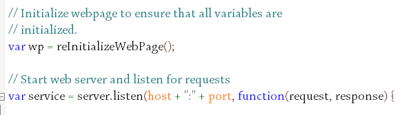

同时，自定义 alert、confirm、prompt 处理，记录 XSS 检测信息。

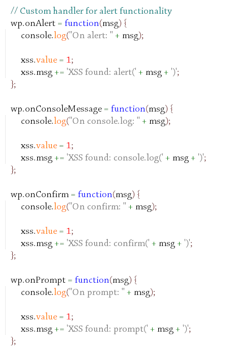

而对于 js 事件检测的处理，主要是通过事件分发函数去做的。


理解了这些过程，基本上 XSS Validator 使用 phantomJS 对 XSS 检测的原理已经掌握了。关于这个原理的类似分析，新浪微博网友@吃瓜群众-Fr1day 的文章说得很清楚，传送门地址：[`www.tuicool.com/articles/3emU7n`](http://www.tuicool.com/articles/3emU7n)

用图例来描述其交互过程，如下图：

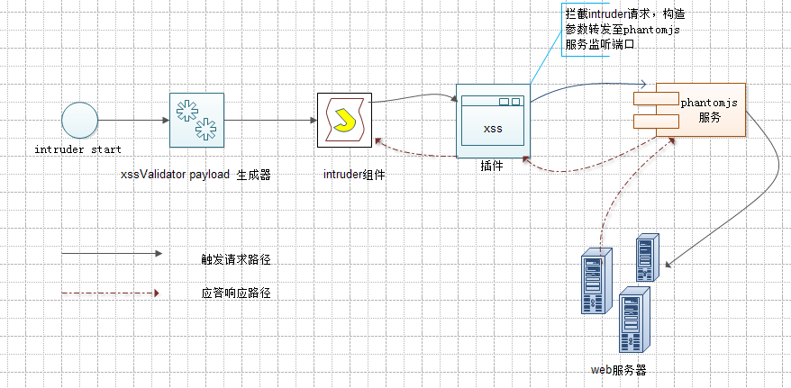

在插件处理中几个关键点是需要我们特别关注的：

1.  Intruder 使用了 XSS Validator 的 payload 生成器，将插件与 Intruder 两者联动合起来。
2.  插件对 Intruder 发送的消息进行拦截处理，转交 phantomjs 服务监听端口处理。
3.  xss.js 请求真实的 web 服务器，并对消息进行处理，添加 Grep Phrase 标志
4.  Intruder 组件根据 Grep Phrase 标志区分是否存在漏洞

只有理解了 phantomJS 在检测 XSS 中的原理，我们才可以在工作中，根据实际情况，对诸如 xss.js 文件进行修改，来达到满足我们自己业务需求的目的，而不仅仅拘泥了插件使用的本身功能。

* * *

##### 使用 XSS Validator 插件进行 XSS 漏洞检测

上一节我们熟悉了 phantomJS 检测 xss 的基本原理，现在我们一起来看看 XSS Validator 插件的使用。

XSS Validator 插件的安装依旧是可以通过 BApp Store 安装和手工安装两种方式，手工安装需要下载源码进行编译，这里提供项目的 github 地址，[`github.com/nVisium/xssValidator`](https://github.com/nVisium/xssValidator)。安装过程由读者自己完成，如果不明白安装，请阅读 Burp 插件使用相关章节。安装完毕后，插件的界面如下图所示：

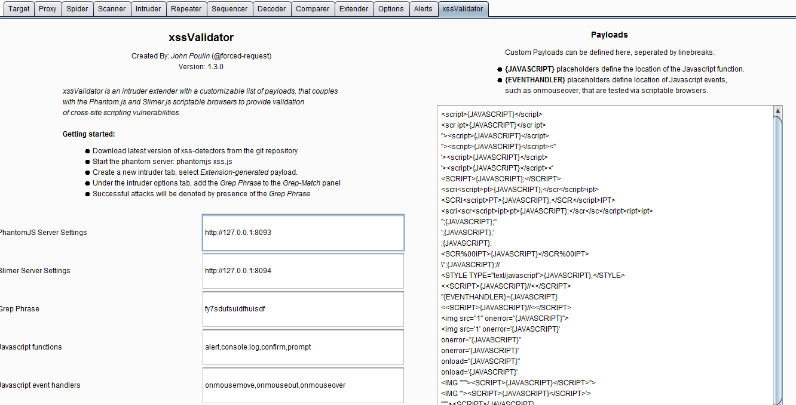

上图中的左侧为插件运行时需要配置的参数，右侧为验证 XSS 漏洞的 payload。在使用插件前，有一些关于 phantomjs 的具体配置需要我们关注。这也是我们在通过应用商店进行插件安装时，安装界面上提供了的使用说明里的。

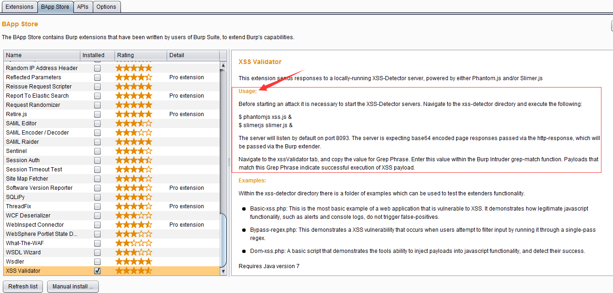

在执行 Intruder 之前，必须通过命令行 phantomjs xss.js 启动 xss 检测服务，也是 phantomjs 的服务监听端口。这就使得我们在执行命令行之前，需要将 phantomjs 安装好，并加入到环境变量里，否则无法执行。至于 phantomjs 的安装非常简单，如果你实在不会，建议你阅读此文章。传递地址：[`www.mincoder.com/article/4795.shtml`](http://www.mincoder.com/article/4795.shtml)

安装完之后，执行 phantomjs xss.js，控制台界面显示如下，并无其他提示信息。

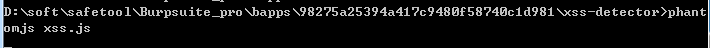

为了简单地说明使用方法，其他的参数我们都采取默认配置，只修改 Grep Phrase 和 JavaScript functions 两个参数： Grep Phrase 修改为 xxs_result,作为检测标志和列表头。 JavaScript functions 中我们仅使用 alert，其他的都暂时去掉。便于我们从控制台观察结果。我们最终的配置结果如截图所示：

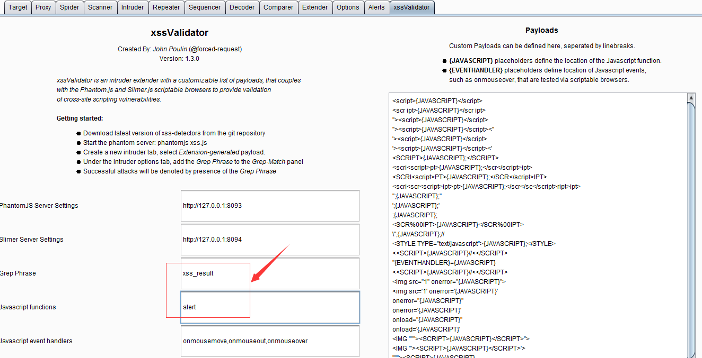

配置完插件之后，我们需要配置 Intruder。 首先，指定 Grep Phrase 的值。

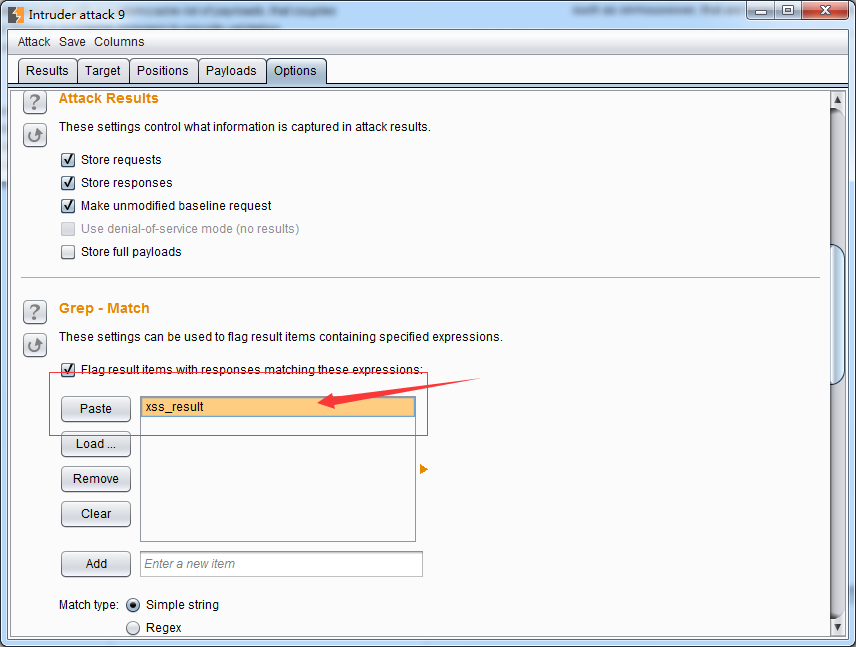

接着，Intruder 的 payload 生成器需要设置为 xssValidator 的。 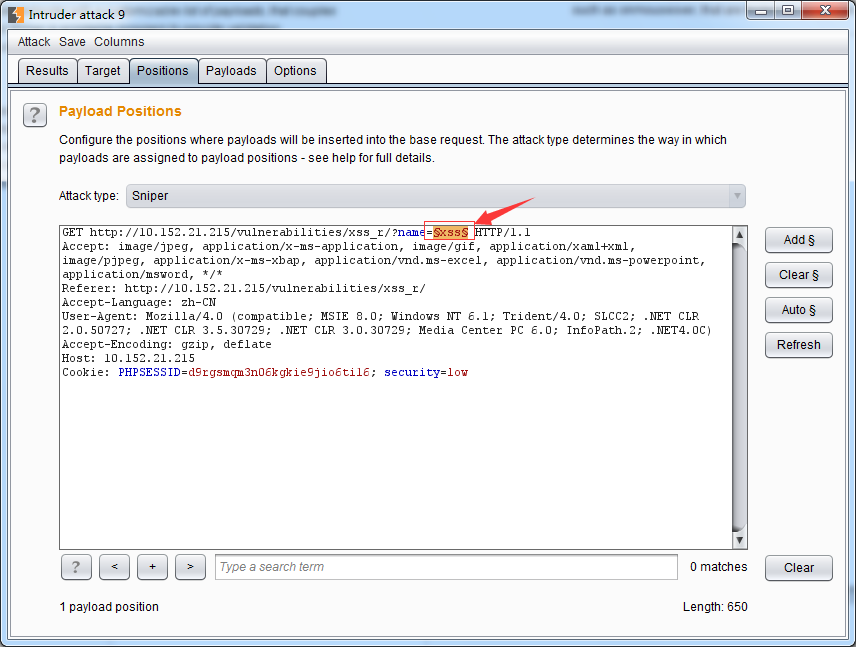 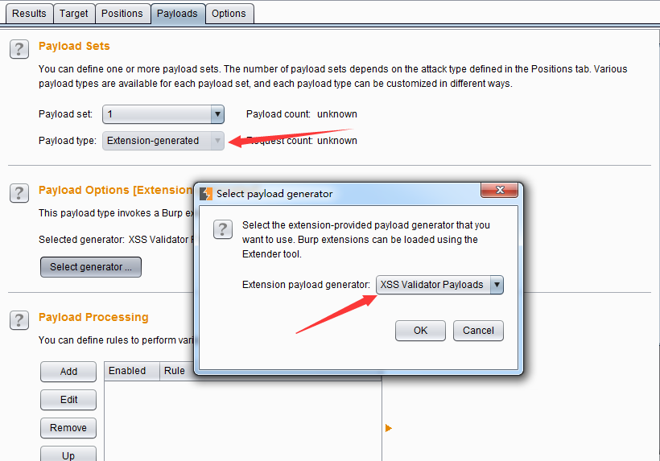

如果你如上图中所示的设置，则可以启动 Intruder 进行检测了。在检测过程中，我们会看到控制台输出很多日志信息，根据我们的配置，输出 alert 信息的表示 payload 检测出存在 xss 漏洞。如下图中 2 所示：

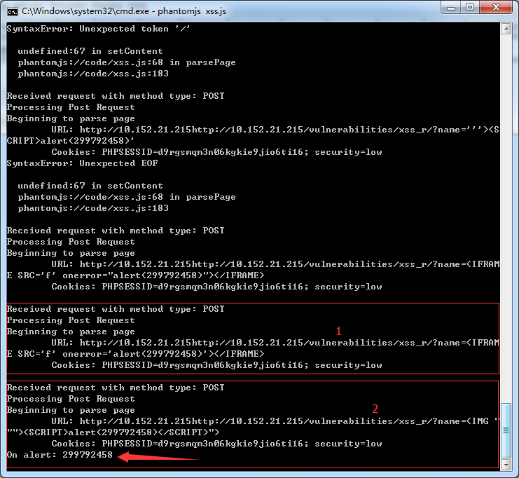

同时，在 Intruder 的执行界面上，我们可以通过 xss_result 来查看 payload 的检测情况，那些响应报文中存在漏洞标志的均被标出，便于我们对消息的区分和处理。

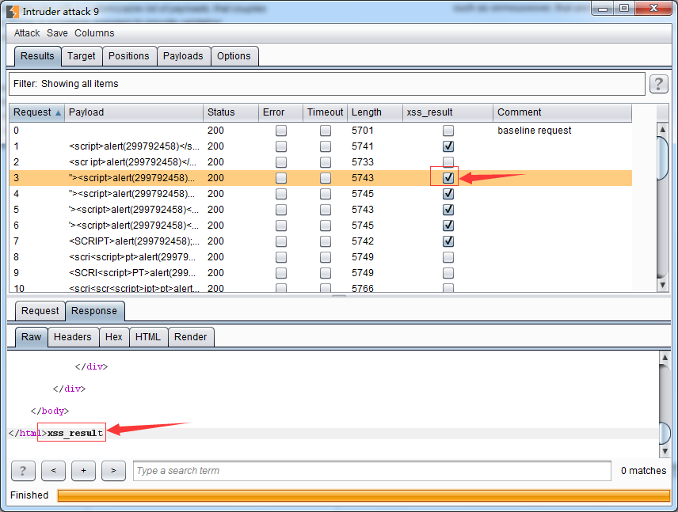

* * *

通过以上内容的学习，我们对 PhantomJS 和 xssValidator 在 XSS 漏洞检测方面的使用有了更深入的了解。在实际应用中，由于 xss 漏洞的复杂性，不是靠插件默认的 payload 就能检测出来的，还是需要读者自己去分析和思考，找到具体的解决办法，本章内容仅仅起着抛砖引玉的作用。文章后的延伸阅读内容，感兴趣的读者可以进一步分析、实践。同时，如果有更好的此类文章，欢迎发邮件给我 t0data@hotmail.com，我会添加到延伸阅读里。

> 延伸阅读：[1.Server-Side-XSS-Attack-Detection-with-ModSecurity-and-PhantomJS](https://www.trustwave.com/Resources/SpiderLabs-Blog/Server-Side-XSS-Attack-Detection-with-ModSecurity-and-PhantomJS/)

[2.如何使用开源组件解决 web 应用中的 XSS 漏洞](https://t0data.gitbooks.io/mysecuritybook/content/chapter1.html)

* * *