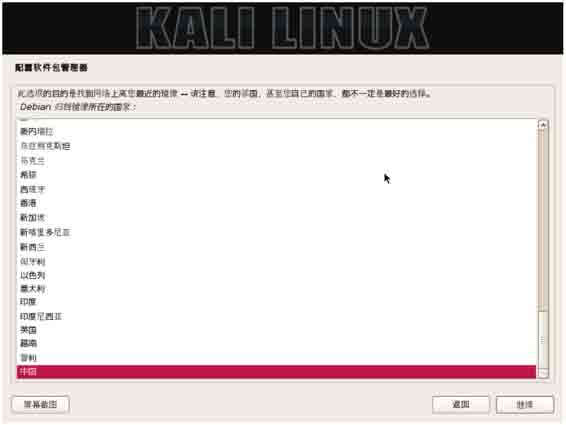

# 第一章　Linux 安全渗透简介

渗透测试是对用户信息安全措施积极评估的过程。通过系统化的操作和分析，积极发现系统和网络中存在的各种缺陷和弱点，如设计缺陷和技术缺陷。本章将简要介绍 Linux 安全渗透及安全渗透工具的相关内容。其主要知识点如下：

*   什么是安全渗透；
*   安全渗透所需的工具；
*   Kali Linux 简介；
*   安装 Kali Linux；
*   Kali 更新与升级；
*   基本设置。

# 1.1 什么是安全渗透

## 1.1 什么是安全渗透

渗透测试并没有一个标准的定义。国外一些安全组织达成共识的通用说法是，渗透测试是通过模拟恶意黑客的攻击方法，来评估计算机网络系统安全的一种评估方法，这个过程包括对系统的任何弱点、技术缺陷或漏洞的主动分析。这个分析是从一个攻击者可能存在的位置来进行的，并且从这个位置有条件主动利用安全漏洞。

渗透测试与其他评估方法不同。通常的评估方法是根据已知信息资源或其他被评估对象，去发现所有相关的安全问题。渗透测试是根据已知可利用的安全漏洞，去发现是否存在相应的信息资源。相比较而言，通常评估方法对评估结果更具有全面性，而渗透测试更注重安全漏洞的严重性。

渗透测试有黑盒和白盒两种测试方法。黑盒测试是指在对基础设施不知情的情况下进行测试。白盒测试是指在完全了解结构的情况下进行测试。不论测试方法是否相同，渗透测试通常具有两个显著特点：

*   渗透测试是一个渐进的且逐步深入的过程。
*   渗透测试是选择不影响业务系统正常运行的攻击方法进行的测试。

# 1.2 安全渗透所需的工具

## 1.2 安全渗透所需的工具

了解了渗透测试的概念后，接下来就要学习进行渗透测试所使用的各种工具。在做渗透测试之前，需要先了解渗透所需的工具。渗透测试所需的工具如表 1-1 所示。

表 1-1　渗透所需的工具

| splint | unhide | scrub |
| --- | --- | --- |
| pscan | examiner | ht |
| flawfinder | srm | driftnet |
| rats | nwipe | binwalk |
| ddrescue | firstaidkit-gui | scalpel |
| gparted | xmount | pdfcrack |
| testdisk | dc3dd | wipe |
| foremost | afftools | safecopy |
| sectool-gui | scanmem | hfsutils |
| unhide | sleuthkit | cmospwd |
| examiner | macchanger | secuirty-menus |
| srm | ngrep | nc6 |
| nwipe | ntfs-3g | mc |
| firstaidkit-gui | ntfsprogs | screen |
| net-snmp | pcapdiff | openvas-scanner |
| hexedit | netsed | rkhunter |
| irssi | dnstop | labrea |
| powertop | sslstrip | nebula |
| mutt | bonesi | tripwire |
| nano | proxychains | prelude-lml |
| vim-enhanced | prewikka | iftop |
| wget | prelude-manager | scamper |
| yum-utils | picviz-gui | iptraf-ng |
| mcabber | telnet | iperf |
| firstaidkit-plugin-all | onenssh | nethogs |
| vnstat | dnstracer | uperf |
| aircrack-ng | chkrootkit | nload |
| airsnort | aide | ntop |
| kismet | pads | trafshow |
| weplab | cowpatty | wavemon |

由于篇幅原因，这里只列了一部分工具。渗透测试所需的工具可以在各种 Linux 操作系统中找到，然后手动安装这些工具。由于工具繁杂，安装这些工具，会变成一个浩大的工程。为了方便用户进行渗透方面的工作，有人将所有的工具都预装在一个 Linux 系统。其中，典型的操作系统就是本书所使用的 Kali Linux。

该系统主要用于渗透测试。它预装了许多渗透测试软件，包括 nmap 端口扫描器、Wireshark（数据包分析器）、John the Ripper（密码破解）及 Aircrack-ng（一套用于对无线局域网进行渗透测试的软件）。用户可通过硬盘、Live CD 或 Live USB 来运行 Kali Linux。

# 1.3 Kali Linux 简介

## 1.3 Kali Linux 简介

Kali Linux 的前身是 BackTrack Linux 发行版。Kali Linux 是一个基于 Debian 的 Linux 发行版，包括很多安全和取证方面的相关工具。它由 Offensive Security Ltd 维护和资助，最先由 Offensive Security 的 MatiAharoni 和 Devon Kearns 通过重写 Back Track 来完成。Back Track 是基于 Ubuntu 的一个 Linux 发行版。

Kali Linux 有 32 位和 64 位的镜像，可用于 x86 指令集。同时它还有基于 ARM 架构的镜像，可用于树莓派和三星的 ARM Chromebook。用户可通过硬盘、Live CD 或 Live USB 来运行 Kali Linux 操作系统。

# 1.4 安装 Kali Linux

## 1.4 安装 Kali Linux

如今 Linux 的安装过程已经非常“傻瓜”化，只需要轻点几下鼠标，就能够完成整个系统的安装。Kali Linux 操作系统的安装也非常简单。本节将分别介绍安装 Kali Linux 至硬盘、USB 驱动器、树莓派、VMware Workstation 和 Womuare Tods 的详细过程。

### 1.4.1 安装至硬盘

安装到硬盘是最基本的操作之一。该工作的实现可以让用户不使用 DVD，而正常的运行 Kali Linux。在安装这个全新的操作系统之前，需要做一些准备工作。例如，从哪里得到 Linux？对电脑配置有什么要求？……下面将逐一列出这些要求。

*   Kali Linux 安装的磁盘空间的最小值是 8GB。为了便于使用，这里推荐至少 25GB 去保存附加程序和文件。
*   内存最好为 512MB 以上。
*   Kali Linux 的下载地址[`www.kali.org/downloads/，下载界面如图 1.1 所示。`](http://www.kali.org/downloads/，下载界面如图 1.1 所示。)


图 1.1 下载 Kali Linux 界面

该官方网站提供了 32 位和 64 位 ISO 文件。本书中以 32 位为例来讲解安装和使用。下载完 ISO 文件后，将该映像文件刻录到一张 DVD 光盘上。接下来就可以着手将 KaliLinux 安装至硬盘中了。

（1）将安装光盘 DVD 插入到用户计算机的光驱中，重新启动系统，将看到如图 1.2 所示的界面。


图 1.2 启动界面

（2）该界面是 Kali 的引导界面，在该界面选择安装方式。这里选择 Graphical Install（图形界面安装），将显示如图 1.3 所示的界面。


图 1.3 选择语言

（3）在该界面选择安装系统的默认语言为 Chinese（Simplified），然后单击 Continue 按钮，将显示如图 1.4 所示的界面。


图 1.4 选择您的区域

（4）在该界面选择区域为“中国”，然后单击“继续”按钮，将显示如图 1.5 所示的界面。


图 1.5 配置键盘

（5）在该界面选择键盘模式为“汉语”，然后单击“继续”按钮，将显示如图 1.6 所示的界面。


图 1.6 配置网络

（6）该界面用来设置系统的主机名，这里使用默认的主机名 Kali（用户也可以输入自己系统的名字）。然后单击“继续”按钮，将显示如图 1.7 所示的界面。


图 1.7 配置网络

（7）该界面用来设置计算机所使用的域名，本例中输入的域名为 kali.secureworks.com。如果当前计算机没有连接到网络的话，可以不用填写域名，直接单击“继续”按钮，将显示如图 1.8 所示的界面。


图 1.8 设置用户和密码

（8）在该界面设置 root 用户密码，然后单击“继续”按钮，将显示如图 1.9 所示的界面。


图 1.9 磁盘分区

（9）该界面供用户选择分区。这里选择“使用整个磁盘”，然后单击“继续”按钮，将显示如图 1.10 所示的界面。


图 1.10 磁盘分区

（10）该界面用来选择要分区的磁盘。该系统中只有一块磁盘，所以这里使用默认磁盘就可以了。然后单击“继续”按钮，将显示如图 1.11 所示的界面。


图 1.11 已选择要分区

（11）该界面要求选择分区方案，默认提供了三种方案。这里选择“将所有文件放在同一个分区中（推荐新手使用）”，然后单击“继续”按钮，将显示如图 1.12 所示的界面。


图 1.12 磁盘分区

（12）在该界选择“分区设定结束并将修改写入磁盘”，然后单击“继续”按钮，将显示如图 1.13 所示的界面。如果想要修改分区，可以在该界面选择“撤消对分区设置的修改”，重新分区。


图 1.13 磁盘分区

（13）在该界面选择“是”复选框，然后单击“继续”按钮，将显示如图 1.14 所示的界面。


图 1.14 安装系统

（14）现在就开始安装系统了。在安装过程中需要设置一些信息，如设置网络镜像，如图 1.15 所示。如果安装 Kali Linux 系统的计算机没有连接到网络的话，在该界面选择“否”复选框，然后单击“继续”按钮。这里选择“是”复选框，将显示如图 1.16 所示的界面。


图 1.15 配置软件包管理器


图 1.16 设置 HTTP 代理

（15）在该界面设置 HTTP 代理的信息。如果不需要通过 HTTP 代理来连接到外部网络的话，直接单击“继续”按钮，将显示如图 1.17 所示的界面。


图 1.17 扫描镜像站点

（16）扫描镜像站点完成后，将显示如图 1.18 所示的界面。



图 1.18 镜像所在的国家

（17）在该界面选择镜像所在的国家，这里选择“中国”，然后单击“继续”按钮，将显示如图 1.19 所示的界面。


图 1.19 选择镜像

（18）该界面默认提供了 7 个镜像站点，这里选择一个作为本系统的镜像站点。这里选择 mirrors.163.com，然后单击“继续”按钮，将显示如图 1.20 所示的界面。


图 1.20 将 GRUB 启动引导器安装到主引导记录（MBR）上吗

（19）在该界面选择“是”复选框，然后单击“继续”按钮，将显示如图 1.21 所示的界面。


图 1.21 将 GRUB 安装至硬盘

（20）此时将继续进行安装，结束安装进程后，将显示如图 1.22 所示的界面。


图 1.22 结束安装进程

（21）在该界面单击“继续”按钮，将返回到安装系统过程。安装完成后，将会自动重新启动系统。

### 1.4.2 安装至 USB 驱动器

Kali Linux USB 驱动器提供了一种能力，它能永久的保存系统设置、永久更新及在 USB 设备上安装软件包，并且允许用户运行自己个性化的 Kali Linux。在 Win32 磁盘成像仪上创建 Linux 发行版的一个可引导 Live USB 驱动器，它包括 Kali Linux 的持续存储。本小节将介绍安装 Kali Linux 至 USB 驱动器的操作步骤。

安装一个操作系统到 USB 驱动器上和安装至硬盘有点不同。所以，在安装之前需要做一些准备工作。例如，从哪得到 Linux？USB 驱动器的格式？USB 驱动器的大小？……下面将逐一列出这些要求。

*   一个 FAT32 格式的 USB 驱动器，并且最小有 8GB 的空间。
*   一个 Kali Linux ISO 映像。
*   Win32 磁盘成像仪（映像写入 U 盘）。
*   下载 Kali Linux 从[`www.kali.org/downloads/。`](http://www.kali.org/downloads/。)

前面的准备工作完成之后，就可以来安装系统了。安装 Kali Linux 到一个 USB 驱动器上的操作步骤如下所示。

（1）插入到 Windows 系统一个被格式化并且可写入的 USB 驱动器。插入后，显示界面如图 1.23 所示。


图 1.23 可移动设备

（2）启动 Win32 Disk Imager，启动界面如图 1.24 所示。在 Image File 位置，单击图标选择 Kali Linux DVD ISO 映像所在的位置，选择将要安装 Kali Linux 的 USB 设备，本例中的设备为 K。选择 ISO 映像文件和 USB 设备后，单击 Write 按钮，将 ISO 文件写入到 USB 驱动器上。


图 1.24 Win32 Disk Imager 初始界面

（3）使用 UNetbootin 工具将设备 K 做成一个 USB 启动盘。启动 UNetbootin 工具，将显示如图 1.25 所示的界面。


图 1.25 选择光盘镜像

（4）在该界面选择“光盘镜像”复选框，然后选择 ISO 文件所在的位置，并将 Space used to preserve files across reboots 设置为 4096MB。

（5）选择 USB 驱动器，本例中的 USB 驱动器为 K，然后单击“确定”按钮，将开始创建可引导的 USB 驱动器。

（6）创建完成后，将显示如图 1.26 所示的界面。


图 1.26 UNetbootin 安装完成

（7）此时，USB 驱动器就创建成功了。在该界面单击“现在重启”按钮，进入 BIOS 启动菜单里选择 USB 启动，就可以安装 Kali Linux 操作系统了。

### 1.4.3 安装至树莓派

树莓派（英文名为“Raspberry Pi”，简写为 RPi）是一款基于 ARM 的微型电脑主板，以 SD 卡为内存硬盘。为了方便携带，在树莓派上安装 Kali Linux 是一个不错的选择。本小节将介绍在树莓派上安装 Kali Linux 操作系统。

（1）从[`www.offensive-security.com/kali-linux-vmware-arm-image-download/网站下载树莓派的映像文件，其文件名为 kali-linux-1.0.6a-rpi.img.xz。`](http://www.offensive-security.com/kali-linux-vmware-arm-image-download/网站下载树莓派的映像文件，其文件名为 kali-linux-1.0.6a-rpi.img.xz。)

（2）下载的映像文件是一个压缩包，需要使用 7-Zip 压缩软件解压。解压后其名称为 kali-linux-1.0.6a-rpi.img。

（3）使用 Win32 Disk Imager 工具，将解压后的映像文件写入到树莓派的 SD 卡中。启动 Win32 Disk Imager 工具，将显示如图 1.27 所示的界面。


图 1.27 Win32 Disk Imager 启动界面

（4）在该界面单击图标，选择 kali-linux-1.0.6a-rpi.img，将显示如图 1.28 所示的界面。


图 1.28 添加映像文件

（5）此时在该界面单击 Write 按钮，将显示如图 1.29 所示的界面。


图 1.29 确认写入数据的磁盘

（6）该界面提示是否确定要将输入写入到 G 设备吗？这里选择 Yes，将显示如图 1.30 所示的界面。


图 1.30 开始写入数据

（7）从该界面可以看到正在写入数据。写入完成后，将显示如图 1.31 所示的界面。


图 1.31 完成写入数据

（8）从该界面可以看到写入数据成功。此时单击 OK 按钮，将返回到图 1.28 所示的界面。然后单击 Exit 按钮，关闭 Win32 Disk Imager 工具。

（9）此时从 Windows 系统中弹出 SD 卡，并且将其插入到树莓派中。然后连接到显示器，插上网线、鼠标、键盘和电源，几秒后将启动 Kali Linux 操作系统。使用 Kali 默认的用户名和密码登录，其默认用户名和密码为 root 和 toor。

如果用户觉得使用树莓派上的 Kali 来回插一些设备比较麻烦时，这里可以使用 PuTTY 攻击远程登录到 Kali 的命令行。由于在 Linux 中 SSH 服务默认是启动的，所以用户可以在 PuTTY 中使用 SSH 服务的 22 端口远程连接到 Kali Linux。PuTTY 不仅仅只能远程连接到树莓派上的 Kali 操作系统，它可以连接到安装在任何设备上的 Kali 操作系统。下面将介绍使用 PuTTY 工具，远程连接到 Kali Linux 操作系统。

（1）下载 PuTTY 的 Windows 版本。

（2）启动 PuTTY 工具，将显示如图 1.32 所示的界面。


图 1.32 PuTTY 工具

（3）在该界面，Host Name（or IP address）对应的文本框中输入 Kali 系统的 IP 地址，并且 Connection type 选择 SSH。然后单击 Open 按钮，将显示如图 1.33 所示的界面。如果不知道 Kali 系统 IP 的话，执行 ifconfig 命令查看。


图 1.33 警告信息

（4）该界面显示了一个警告信息，这是为了安全确认是否要连接到该服务器。该对话框只有在第一次连接某台主机时才会弹出。这里单击“是”按钮，将显示如图 1.34 所示的界面。


图 1.34 登录到 Kali 系统

（5）在该界面输入 Kali 系统默认的用户命和密码登录到系统。现在就可以在该系统下，运行任何的命令了。

如果用户不喜欢在命令行下操作的话，也可以远程连接到 Kali Linux 的图形界面。下面将介绍通过安装 Xming 软件，实现在 PuTTY 下连接到 Kali 操作系统的图形界面。

（1）从[`sourceforge.net/projects/xming/网站下载 Xming 软件。`](http://sourceforge.net/projects/xming/网站下载 Xming 软件。)

（2）启动下载的 Xming 软件，将显示如图 1.35 所示的界面。


图 1.35 欢迎界面

（3）该界面显示了 Xming 的欢迎信息。此时单击 Next 按钮，将显示如图 1.36 所示的界面。


图 1.36 选择安装位置

（4）在该界面选择 Xming 的安装位置。这里使用默认的位置，单击 Next 按钮，将显示如图 1.37 所示的界面。


图 1.37 选择组件

（5）在该界面选择安装的组件。这里选择 Don’t install an SSH client 组件，然后单击 Next 按钮，将显示如图 1.38 所示的界面。


图 1.38 选择启动菜单文件夹

（6）在该界面选择启动菜单文件夹。这里默认是 Xming，如果想使用不同的文件夹，单击 Browse 按钮选择新的文件夹。如果使用默认的，则单击 Next 按钮，将显示如图 1.39 所示的界面。


图 1.39 选择额外的任务

（7）在该界面选择 Xming 创建的快捷方式。这里选择 Create a desktop icon for Xming（在桌面上创建快捷方式）复选框，然后单击 Next 按钮，将显示如图 1.40 所示的界面。


图 1.40 准备安装 Xming

（8）通过前面的步骤将 Xming 进行了配置。现在准备安装，单击 Install 按钮，将显示如图 1.41 所示的界面。


图 1.41 安装完成

（9）从该界面可以看到 Xming 软件安装完成。此时单击 Finish 按钮退出设置，并且 Xming 将会运行。如果不想要 Xming 启动的话，将 Launch Xming 前面复选框的对勾去掉。

（10）现在打开 PuTTY 工具，并且输入 Kali 系统的 IP 地址，如图 1.32 所示。然后在 PuTTY 左侧栏 Category 下依次选择 Connection|SSH|X11 命令，将显示如图 1.42 所示的界面。


图 1.42 配置 PuTTY

（11）在该界面选择 Enable X11 forwarding 复选框，并且在 X display location 对应的文本框中输入 localhost:0。然后单击 Open 按钮，启动 PuTTY 会话（一定要确定 Xming 在后台运行）。然后输出 Kali 系统的用户名和密码，成功连接到 Kali 操作系统，如图 1.43 所示。


图 1.43 远程连接成功

（12）从该界面可以看到成功连接到了 Kali 操作系统。现在就可以远程连接到 Kali 的图形界面了，执行命令如下所示：

```
root@kali:~# xfce4-session 
```

执行以上命令后，将远程登录到 Kali 系统的桌面。

注意：在 PuTTY 下，startx 命令不能运行。

### 1.4.4 安装至 VMware Workstation

VMware Workstation 是一款功能强大的桌面虚拟计算机软件。它允许用户在单一的桌面上同时运行不同的操作系统。用户在其中可以进行开发、测试和部署新的应用程序。目前最新版本是 10.0.1，官方下载地址[`my.vmware.com/cn/web/vmware/downloads。本小节将介绍在 VMware`](https://my.vmware.com/cn/web/vmware/downloads。本小节将介绍在 VMware) Workstation 上安装 Kali Linux 操作系统。

（1）启动 VMware Workstation，将显示如图 1.44 所示的界面。


图 1.44 VMware Workstation 10

（2）在该界面单击“创建新的虚拟机”图标，将显示如图 1.45 所示的界面。


图 1.45 新建虚拟机向导

（3）该界面选择安装虚拟机的类型，包括“典型”和“自定义”两种。这里推荐使用“典型”的方式，然后单击“下一步”按钮，将显示如图 1.46 所示的界面。


图 1.46 安装客户机操作系统

（4）该界面用来选择如何安装客户机操作系统。这里选择“稍后安装操作系统”，然后单击“下一步”按钮，将显示如图 1.47 所示的界面。


图 1.47 选择客户机操作系统

（5）在该界面选择要安装的操作系统和版本。这里选择 Linux 操作系统，版本为其他 Linux 2.6.X 内核，然后单击“下一步”按钮，将显示如图 1.48 所示的界面。


图 1.48 命名虚拟机

（6）在该界面为虚拟机创建一个名称，并设置虚拟机的安装位置。设置完成后，单击“下一步”按钮，将显示如图 1.49 所示的界面。


图 1.49 指定磁盘容量

（7）在该界面设置磁盘的容量。如果有足够大的磁盘时，建议设置的磁盘容量大点，避免造成磁盘容量不足。这里设置为 50GB，然后单击“下一步”按钮，将显示如图 1.50 所示的界面。


图 1.50 已准备好创建虚拟机

（8）该界面显示了所创建虚拟机的详细信息，此时就可以创建操作系统了。然后单击“完成”按钮，将显示如图 1.51 所示的界面。


图 1.51 创建虚拟机

（9）该界面显示了新创建的虚拟机的详细信息。现在准备安装 Kali Linux。在安装 Kali Linux 之前需要设置一些信息，在 VMware Workstation 窗口中单击“编辑虚拟机设置”，将显示如图 1.52 所示的界面。


图 1.52 虚拟机设置

（10）在该界面选择“CD/DVD（IDE）”选项，接着在右侧选择“使用 ISO 映像文件”复选框，单击“浏览”按钮，选择 Kali Linux 的映像文件。然后单击“确定”按钮，将返回到图 1.51 所示的界面。

（11）在图 1.51 界面，选择“开启此虚拟机”命令，将显示一个新的窗口，如图 1.53 所示。


图 1.53 安装界面

（12）接下来的安装过程和在第 1.4.1 小节中介绍的过程一样了，这里就不再赘述。

### 1.4.5 安装 VMware Tools

VMware Tools 是 VMware 虚拟机中自带的一种增强工具。它是 VMware 提供的增强虚拟显卡和硬盘性能，以及同步虚拟机与主机时钟的驱动程序。只有在 VMware 虚拟机中安装好 VMware Tools 工具后，才能实现主机与虚拟机之间的文件共享，同时可支持自由拖曳的功能，鼠标也可在虚拟机与主机之间自由移动（不用再按 Ctrl+Alt 组合键）。本小节将介绍 VMware Tools 程序的安装。

（1）在 VMware Workstation 菜单栏中，依次选择“虚拟机”|“安装 VMware Tools…”命令，如图 1.54 所示。


图 1.54 安装 VMware Tools

（2）挂载 VMware Tools 安装程序到/mnt/cdrom/目录。执行命令如下所示：

```
root@kali:~# mkdir /mnt/cdrom/               #创建挂载点
root@kali:~# mount /dev/cdrom /mnt/cdrom/ #挂载安装程序
mount: block device /dev/sr0 is write-protected, mounting read-only 
```

看到以上的输出信息，表示 VMware Tools 安装程序挂载成功了。

（3）切换到挂载位置，解压安装程序 VMwareTools。执行命令如下所示：

```
root@kali:~# cd /mnt/cdrom/                          #切换目录
root@kali:/mnt/cdrom# ls                          查看当前目录下的文件
manifest.txt VMwareTools-9.6.1-1378637.tar.gz vmware-tools-upgrader-64
run_upgrader.sh vmware-tools-upgrader-32
root@kali:/mnt/cdrom# tar zxvf VMwareTools-9.6.1-1378637.tar.gz -C / #解压 VMwareTools 安装程序 
```

执行以上命令后，VMware Tools 程序将被解压到/目录中，并生成一个名为 vmware-tools-distrib 文件夹。

（4）切换到 VMware Tools 的目录，并运行安装程序。执行命令如下所示：

```
root@kali:/mnt/cdrom# cd /vmware-tools-distrib/      #切换目录
root@kali:/vmware-tools-distrib# ./vmware-install.pl #运行安装程序 
```

执行以上命令后，会出现一些问题。这时按下“回车”键，接受默认值。

（5）重新启动计算机。

# 1.5 Kali 更新与升级

## 1.5 Kali 更新与升级

当用户使用一段时间以后，可能对总是在没有任何变化的系统中工作感到不满，而是渴望能像在 Windows 系统中一样，不断对自己的 Linux 进行升级。另外，Linux 本身就是一个开放的系统，每天都会有新的软件出现，Linux 发行套件和内核也在不断更新。在这样的情况下，学会对 Linux 进行升级就显得非常迫切了。本节将介绍 Kali 的更新与升级。

更新与升级 Kali 的具体操作步骤如下所示。

（1）在图形界面依次选择“应用程序”|“系统工具”|“软件更新”命令，将显示如图 1.55 所示的界面。


图 1.55 警告信息

（2）该界面提示确认是否要以特权用户身份运行该应用程序，如果继续，单击“确认继续”按钮，将显示如图 1.56 所示的界面。


图 1.56 软件更新

（3）该界面显示了总共有 345 个软件包需要更新，单击“安装更新”按钮，将显示如图 1.57 所示的界面。


图 1.57 依赖软件包

（4）该界面显示了安装更新软件包依赖的软件包，单击“继续”按钮，将显示如图 1.58 所示的界面。


图 1.58 软件更新过程

（5）从该界面可以看到软件更新的一个进度。在该界面，可以看到各软件包的一个不同状态。其中，软件包后面出现图标，表示该软件包正在下载；如果显示为图标，表示软件包已下载；如果同时出现和图标的话，表示安装完该软件包后，需要重新启动系统；这些软件包安装成功后，将显示为图标。这时候单击“退出”按钮，然后重新启动系统。在更新的过程中，未下载的软件包会自动跳到第一列。此时，滚动鼠标是无用的。

（6）重新启动系统后，登录到系统执行 lsb_release -a 命令查看当前操作系统的所有版本信息。执行命令如下所示：

```
root@kali:~# lsb_release -a
No LSB modules are available.                                              #无效的 LSB 模块
Distributor ID: Debian                                                     #发行版
Description: Debian GNU/Linux Kali Linux 1.0.6                             #描述信息
Release: Kali Linux 1.0.6                                                  #版本信息
Codename: n/a                                                              #代号 
```

从输出的信息中，可以看到当前系统版本为 1.0.6。以上命令适用于所有的 Linux，包括 RedHat、SuSE 和 Debian 等发行版。如果仅查看版本号，可以查看/etc/issue 文件。执行命令如下所示：

```
root@kali:~# cat /etc/issue
Kali GNU/Linux 1.0.6 \n \l 
```

从输出的信息中，可以看到当前系统的版本为 1.0.6。

# 1.6 基本设置

## 1.6 基本设置

在前面学习了 Kali Linux 操作系统的安装，安装成功后就可以登录到系统了。登录系统后，就可以使用各种的渗透工具对计算机做测试。为了方便后面章节内容的学习，本节将介绍一下 Kali Linux 的基本设置。

### 1.6.1 启动默认的服务

Kali Linux 自带了几个网络服务，它们是非常有用的。但是默认是禁用的。在这里，将介绍使用各种方法设置并启动每个服务。

1\. 启动 Apache 服务

启动 Apache 服务。执行命令如下所示：

```
root@kali:~# service apache2 start 
```

输出信息如下所示：

```
[ok] Starting web server: apache2. 
```

输出的信息表示 Apache 服务已经启动。为了确认服务是否正在运行，可以在浏览器中访问本地的地址。在浏览器中访问本地的地址，如果服务器正在运行，将显示如图 1.59 所示的界面。


图 1.59 Apache 服务器访问界面

2\. 启动 Secure Shell（SSH）服务

启动 Secure Shell（SSH）服务。执行命令如下所示：

```
root@kali:~# service ssh start
[ok] Starting OpenBSD Secure Shell server: sshd. 
```

看到以上的输出表示 SSH 服务已经启动。为了确认服务的端口是否被监听，执行如下所示的命令：

```
root@kali:~# netstat -tpan | grep 22
tcp  0   0 0.0.0.0:22     0.0.0.0:*       LISTEN   7658/sshd
tcp6 0   0 :::22           :::*           LISTEN   7658/sshd 
```

3\. 启动 FTP 服务

FTP 服务默认是没有安装的，所以首先需要安装 FTP 服务器。在 Kali Linux 操作系统的软件源中默认没有提供 FTP 服务器的安装包，这里需要配置一个软件源。配置软件源的具体操作步骤如下所示。

（1）设置 APT 源。向软件源文件/etc/apt/sources.list 中添加以下几个镜像网站。执行命令如下所示：

```
root@kali:~# vi /etc/apt/sources.list
deb http://mirrors.neusoft.edu.cn/kali/ kali main non-free contrib
deb-src http://mirrors.neusoft.edu.cn/kali/ kali main non-free contrib
deb http://mirrors.neusoft.edu.cn/kali-security kali/updates main contrib non-free 
```

添加完以上几个源后，将保存 sources.list 文件并退出。在该文件中，添加的软件源是根据不同的软件库分类的。其中，deb 指的是 DEB 包的目录；deb-src 指的是源码目录。如果不自己看程序或者编译的话，可以不用指定 deb-src。由于 deb-src 和 deb 是成对出现的，可以不指定 deb-src，但是当需要 deb-src 的时候，deb 是必须指定的。

（2）添加完软件源，需要更新软件包列表后才可以使用。更新软件包列表，执行命令如下所示：

```
root@kali:~# apt-get update 
```

更新完软件列表后，会自动退出程序。

（3）安装 FTP 服务器。执行命令如下所示：

```
root@kali:~# apt-get install pure-ftpd 
```

安装成功 FTP 服务器，就可以启动该服务了。执行命令如下所示：

```
root@kali:~# service pure-ftpd start 
```

4\. 安装中文输入法

Kali Linux 操作系统默认也没有安装中文输入法，下面将介绍安装小企鹅中文输入法。执行命令如下所示：

```
root@kali:~# apt-get install fcitx-table-wbpy ttf-wqy-microhei ttf-wqy- zenhei 
```

执行以上命令后，小企鹅中文输入法就安装成功了。安装成功后，需要启动该输入法后才可以使用。启动小企鹅中文输入法，执行命令如下所示：

```
root@kali:~# fcitx
root@kali:~#[INFO] /build/buildd-fcitx_4.2.4.1-7-i386-l4w6Z_/fcitx-4.2.4.1 /src/lib/fcitx/addon.c:100-加载附加组件配置文件: fcitx-table.conf
[INFO] /build/buildd-fcitx_4.2.4.1-7-i386-l4w6Z_/fcitx-4.2.4.1/src/lib/fcitx /addon.c:100-加载附加组件配置文件: fcitx-xim.conf
[INFO] /build/buildd-fcitx_4.2.4.1-7-i386-l4w6Z_/fcitx-4.2.4.1/src/lib/fcitx /addon.c:100-加载附加组件配置文件: fcitx-lua.conf
[INFO] /build/buildd-fcitx_4.2.4.1-7-i386-l4w6Z_/fcitx-4.2.4.1/src/lib/fcitx /addon.c:100-加载附加组件配置文件: fcitx-pinyin.conf
[INFO] /build/buildd-fcitx_4.2.4.1-7-i386-l4w6Z_/fcitx-4.2.4.1/src/lib/fcitx /addon.c:100-加载附加组件配置文件: fcitx-autoeng.conf
[INFO] /build/buildd-fcitx_4.2.4.1-7-i386-l4w6Z_/fcitx-4.2.4.1/src/lib/fcitx /addon.c:100-加载附加组件配置文件: fcitx-xkb.conf
[INFO] /build/buildd-fcitx_4.2.4.1-7-i386-l4w6Z_/fcitx-4.2.4.1/src/lib/fcitx /addon.c:100-加载附加组件配置文件: fcitx-ipc.conf
[INFO] /build/buildd-fcitx_4.2.4.1-7-i386-l4w6Z_/fcitx-4.2.4.1/src/lib/fcitx /addon.c:100-加载附加组件配置文件: fcitx-kimpanel-ui.conf
[INFO] /build/buildd-fcitx_4.2.4.1-7-i386-l4w6Z_/fcitx-4.2.4.1/src/lib/fcitx /addon.c:100-加载附加组件配置文件: fcitx-vk.conf
[INFO] /build/buildd-fcitx_4.2.4.1-7-i386-l4w6Z_/fcitx-4.2.4.1/src/lib/fcitx /addon.c:100-加载附加组件配置文件: fcitx-quickphrase.conf
[INFO] /build/buildd-fcitx_4.2.4.1-7-i386-l4w6Z_/fcitx-4.2.4.1/src/lib/fcitx /addon.c:100-加载附加组件配置文件: fcitx-remote-module.conf
[INFO] /build/buildd-fcitx_4.2.4.1-7-i386-l4w6Z_/fcitx-4.2.4.1/src/lib/fcitx /addon.c:100-加载附加组件配置文件: fcitx-punc.conf
[INFO] /build/buildd-fcitx_4.2.4.1-7-i386-l4w6Z_/fcitx-4.2.4.1/src/lib/fcitx /addon.c:100-加载附加组件配置文件: fcitx-dbus.conf
[INFO] /build/buildd-fcitx_4.2.4.1-7-i386-l4w6Z_/fcitx-4.2.4.1/src/lib/fcitx /addon.c:100-加载附加组件配置文件: fcitx-keyboard.conf
[INFO] /build/buildd-fcitx_4.2.4.1-7-i386-l4w6Z_/fcitx-4.2.4.1/src/lib/fcitx /addon.c:100-加载附加组件配置文件: fcitx-chttrans.conf
[INFO] /build/buildd-fcitx_4.2.4.1-7-i386-l4w6Z_/fcitx-4.2.4.1/src/lib/fcitx /addon.c:100-加载附加组件配置文件: fcitx-fullwidth-char.conf
[INFO] /build/buildd-fcitx_4.2.4.1-7-i386-l4w6Z_/fcitx-4.2.4.1/src/lib/fcitx /addon.c:100-加载附加组件配置文件: fcitx-imselector.conf
[INFO] /build/buildd-fcitx_4.2.4.1-7-i386-l4w6Z_/fcitx-4.2.4.1/src/lib/fcitx /addon.c:100-加载附加组件配置文件: fcitx-x11.conf
[INFO] /build/buildd-fcitx_4.2.4.1-7-i386-l4w6Z_/fcitx-4.2.4.1/src/lib/fcitx /addon.c:100-加载附加组件配置文件: fcitx-classic-ui.conf
[INFO] /build/buildd-fcitx_4.2.4.1-7-i386-l4w6Z_/fcitx-4.2.4.1/src/lib/fcitx /addon.c:100-加载附加组件配置文件: fcitx-xkbdbus.conf
[INFO] /build/buildd-fcitx_4.2.4.1-7-i386-l4w6Z_/fcitx-4.2.4.1/src/im/table /table.c:155-加载码表文件: wbpy.conf
[WARN] /build/buildd-fcitx_4.2.4.1-7-i386-l4w6Z_/fcitx-4.2.4.1/src/frontend /xim/xim.c:168-请设置环境变量 XMODIFIERS 
```

输出的信息表示，该输入法在启动时加载的一些配置文件。最后一行提示需要设置环境变量 XMODIFIERS，某些程序往往因为 XMODIFIERS 环境变量设置不正确导致应用程序无法使用。设置 XMODIFIERS 环境变量方法如下（以 Bash 为例）：

```
export XMODIFIERS="@im=YOUR_XIM_NAME" 
```

语法中的 YOUR_XIM_NAME 为 XIM 程序在系统注册的名字。应用程序启动时会增加该变量查找相应的 XIM 服务器。因此，即便系统中同时运行了若干个 XIM 程序，一个应用程序在某个时刻也只能使用一个 XIM 输入法。

fcitx 缺省注册的 XIM 名为 fcitx，但如果 fcitx 启动时 XMODIFIERS 已经设置好，fcitx 会自动以系统的设置来注册合适的名字。如果没有设置好，使用以下方法设置。

一般可以在~/.bashrc 文件中添加以下内容。如下所示：

```
export XMODIFIERS="@im=fcitx"
export XIM=fcitx
export XIM_PROGRAM=fcitx 
```

添加并保存以上内容后，重新登录当前用户，fcitx 输入法将自动运行。如果没有启动，则在终端执行如下命令：

```
root@kali:~# fcitx 
```

执行以上命令后，将会在屏幕的右上角弹出一个键盘，说明该输入法已经启动。小企鹅输入法默认支持汉语、拼音、双拼和五笔拼音四种输入法，这几种输入法默认使用 Ctrl+Shift 组合键切换。

如果想要修改输入法之间的切换键，右击桌面右上角的键盘，将弹出如图 1.60 所示的界面。


图 1.60 fcitx 界面

在该界面选择“配置”命令，将显示如图 1.61 所示的界面。在该界面单击“全局配置”标签，将显示如图 1.62 所示的界面。


图 1.61 Fcitx 配置


图 1.62 全局配置

从该界面可以看到各种快捷键的设置，根据自己习惯用的快捷键进行设置。设置完后，单击“应用”按钮。

5\. 停止服务

停止一个服务的语法格式如下所示：

```
service <servicename> stop 
```

<servicename>表示用户想要停止的服务。

停止 Apache 服务，执行命令如下所示：

```
root@kali:~# service apache2 stop
[ ok ] Stopping web server: apache2 … waiting. 
```

从输出的信息中，可以看到 Apache 服务停止成功。

6．设置服务开机启动

设置服务开机启动的语法格式如下所示：

```
update-rc.d -f <servicename> defaults 
```

<servicename>表示用户想要开机启动的服务。

设置 SSH 服务开启自启动：

```
root@kali:~# update-rc.d -f ssh defaults
update-rc.d: using dependency based boot sequencing
update-rc.d: warning: default stop runlevel arguments (0 1 6) do not match ssh Default-Stop values (none)
insserv: warning: current start runlevel(s) (empty) of script `ssh' overrides LSB defaults (2 3 4 5).
insserv: warning: current stop runlevel(s) (2 3 4 5) of script `ssh' overrides LSB defaults (empty). 
```

从输出的信息中可以看到，SSH 服务默认启动了 2、3、4 和 5 运行级别。则以后系统重启后，SSH 服务将自动运行。

### 1.6.2 设置无线网络

无线网络既包括允许用户建立远距离无线连接的全球语音和数据网络，也包括近距离无线连接进行优化的红外线技术及射频技术。本小节将介绍 Wicd 网络管理器的设置，使用它安全的连接到无线网络。设置无线网络能让用户很好地使用 Kali Linux 无线，做渗透测试，而不需要依赖一个以太网，这样使的用户使用电脑非常的自由。

设置无线网络的具体操作步骤如下所示。

（1）启动 Wicd 网络管理器。有两种方法，一种是命令行，一种是图形界面。在桌面依次选择“应用程序”|“互联网”|Wicd Network Manager 命令，将显示如图 1.63 所示的界面。如果在图形桌面上找不到 WicdNetwork Manager，那说明系统中没有安装 Wicd 软件包。用户可以在添加/删除软件中，找到 Wicd 软件包安装上即可。

或者在终端执行如下命令：

```
wicd-gtk --no-tray 
```

执行以上命令后，将显示如图 1.63 所示的界面。


图 1.63 Wicd 网络管理器

（2）从该界面可以看到所有能搜索到的无线网络，并且很清楚的看到每个无线网络的加密方法、使用的频道及无线信号的强度。本例中选择使用 WEP 加密的无线网络 Test1，单击 Test1 的“属性”按钮，将显示如图 1.64 所示的界面。


图 1.64 属性设置

（3）在该界面选择“使用加密”复选框，然后选择加密方式并输入密码。如果不想显示密码字符时，不要勾选密码文本框前面的复选框。设置完后，单击“确定”按钮，将返回到图 1.63 界面。此时在该界面单击“连接”按钮，就可以连接到 Test1 网络。