# 第二章　配置 Kali Linux

上一章介绍了 Kali Linux 的概念及安装。本章将介绍 Kali 的配置，以便于用户能充分利用它。本章主要介绍如何配置内核头文件、配置额外安全工具和设置 ProxyChains 等。本章主要知识点如下：

*   准备内核头文件；
*   应用更新并配置额外的安全工具；
*   设置 ProxyChains；
*   目录加密。

# 2.1 准备内核头文件

## 2.1 准备内核头文件

内核头文件是 Linux 内核的源代码。有时候，用户需要编译内核头文件代码，为以后使用内核头文件做准备，本节将介绍编译内核头文件的详细步骤。

准备内核头文件的具体操作步骤如下所示。

（1）更新软件包列表。执行命令如下所示：

```
root@Kali:~# apt-get update 
```

输出结果如下所示：

```
Binary 20130905-08:50] kali/non-free Translation-en
获取：1 http://mirrors.neusoft.edu.cn kali Release.gpg [836 B]
获取：2 http://mirrors.neusoft.edu.cn kali/updates Release.gpg [836 B]
命中 http://mirrors.neusoft.edu.cn kali Release
获取：3 http://mirrors.neusoft.edu.cn kali/updates Release [11.0 kB]
命中 http://mirrors.neusoft.edu.cn kali/main i386 Packages
命中 http://mirrors.neusoft.edu.cn kali/non-free i386 Packages
命中 http://mirrors.neusoft.edu.cn kali/contrib i386 Packages
获取：4 http://security.kali.org kali/updates Release.gpg [836 B]
……
获取：5 http://mirrors.neusoft.edu.cn kali/updates/main i386 Packages [205 kB]
获取：6 http://http.kali.org kali Release.gpg [836 B]
命中 http://mirrors.neusoft.edu.cn kali/updates/contrib i386 Packages
命中 http://http.kali.org kali Release
命中 http://mirrors.neusoft.edu.cn kali/updates/non-free i386 Packages
获取：7 http://security.kali.org kali/updates Release [11.0 kB]
命中 http://http.kali.org kali/main Sources
获取：8 http://security.kali.org kali/updates/main i386 Packages [205 kB]
忽略 http://mirrors.neusoft.edu.cn kali/contrib Translation-zh_CN
忽略 http://mirrors.neusoft.edu.cn kali/contrib Translation-zh 
```

输出的信息是在更新软件源中指定的软件下载链接。此过程中需要等待一段时间，如果网速好的话，更新的速度会快一点。由于篇幅的原因，这里只列出了一少部分的输出 信息。

（2）使用 apt-get 命令准备内核头文件。执行命令如下所示：

```
root@Kali:~# apt-get install linux-headers- `uname -r`
正在读取软件包列表… 完成
正在分析软件包的依赖关系树
正在读取状态信息… 完成
Package 'linux-headers' is not installed, so not removed
注意，根据正则表达式 3.12-kali1-686-pae 选中了 nvidia-kernel-3.12-kali1- 686-pae
注意，根据正则表达式 3.12-kali1-686-pae 选中了 linux-image-3.12-kali1-686-pae
注意，根据正则表达式 3.12-kali1-686-pae 选中了 linux-image-3.12-kali1-686- pae-dbg
注意，根据正则表达式 3.12-kali1-686-pae 选中了 linux-modules-3.12-kali1- 686-pae
注意，根据正则表达式 3.12-kali1-686-pae 选中了 linux-latest-modules-3.12- kali1-686-pae
注意，根据正则表达式 3.12-kali1-686-pae 选中了 linux-headers-3.12-kali1- 686-pae
注意，选取 linux-image-3.12-kali1-686-pae 而非 linux-modules-3.12-kali1- 686-pae
注意，选取 linux-image-686-pae 而非 linux-latest-modules-3.12-kali1-686-pae
linux-image-3.12-kali1-686-pae 已经是最新的版本了。
linux-image-3.12-kali1-686-pae 被设置为手动安装。
linux-image-686-pae 已经是最新的版本了。
下列软件包是自动安装的并且现在不需要了：
  libmozjs22d libnfc3 libruby libwireshark2 libwiretap2 libwsutil2 python-apsw
  ruby-crack ruby-diff-lcs ruby-rspec ruby-rspec-core ruby-rspec-
  expectations
  ruby-rspec-mocks ruby-simplecov ruby-simplecov-html xulrunner-22.0
Use 'apt-get autoremove' to remove them.
将会安装下列额外的软件包：
  glx-alternative-mesa glx-alternative-nvidia glx-diversions
  linux-headers-3.12-kali1-common linux-kbuild-3.12 nvidia-alternative
  nvidia-installer-cleanup nvidia-kernel-common
建议安装的软件包：
  nvidia-driver
下列【新】软件包将被安装：
  glx-alternative-mesa glx-alternative-nvidia glx-diversions
  linux-headers-3.12-kali1-686-pae linux-headers-3.12-kali1-common
  linux-image-3.12-kali1-686-pae-dbg linux-kbuild-3.12 nvidia-alternative
  nvidia-installer-cleanup nvidia-kernel-3.12-kali1-686-pae
  nvidia-kernel-common
升级了 0 个软件包，新安装了 11 个软件包，要卸载 0 个软件包，有 5 个软件包未被升级。
需要下载 361 MB 的软件包。
解压缩后会消耗掉 1,812 MB 的额外空间。
您希望继续执行吗？[Y/n]y 
```

输出的信息显示了 linux-headers 相关软件包的一个信息。提示将会安装哪些软件包及软件包的大小等信息。此时输入 y，继续安装。安装完后，将退出程序。

（3）复制 generated 下的所有内容。执行命令如下所示：

```
root@Kali:~# cd /usr/src/linux-headers-3.12-kali1-686-pae/
root@Kali:/usr/src/linux-headers-3.12-kali1-686-pae# cp -rf include/generated/* include/linux/ 
```

（4）编译内核头文件代码。

# 2.2 安装并配置 NVIDIA 显卡驱动

## 2.2 安装并配置 NVIDIA 显卡驱动

显卡驱动程序就是用来驱动显卡的程序，它是硬件所对应的软件。驱动程序即添加到操作系统中的一小块代码，其中包含有关硬件设备的信息。有了此信息，计算机就可以与设备进行通信。驱动程序是硬件厂商根据操作系统编写的配置文件，可以说没有驱动程序，计算机中的硬件就无法工作。操作系统不同，硬件的驱动程序也不同。本节将介绍在 Kali 中安装 NVIDIA 显卡驱动的方法。

安装 NVIDIA 显卡驱动的具体操作步骤如下所示。

（1）将开源的 NVIDIA 驱动 nouveau 加入黑名单。方法如下所示：

```
root@kali:~# vi /etc/modprobe.d/blacklist.conf
blacklist nouveau 
```

以上信息表示在 blacklist.conf 文件中添加了 blacklist nouveau 一行内容。

（2）查看当前的系统信息。执行命令如下所示：

```
root@kali:~# uname -a
Linux kali 3.12-kali1-kali-amd64 #1 SMP Debian 3.12.6-2kali1 (2014-01-06) x86_64 GNU/Linux 
```

从输出的信息中可以看到当前系统安装的是 Kali，其内核版本为 3.12，系统架构是 x86_64 位。

（3）安装 Linux 头文件。执行命令如下所示：

```
root@kali:~# aptitude -r install linux-headers-$(uname -r)
下列“新”软件包将被安装。
  linux-headers-3.12-kali1-686-pae linux-headers-3.12-kali1-common{a}
  linux-kbuild-3.12{a}
下列软件包将被“删除”：
  firmware-mod-kit{u} libadns1{u} libcrypto++9{u} liblzma-dev{u}
  libsmi2-common{u} libwebkit-dev{u} msgpack-python{u} p7zip{u}
  python-adns{u} python-bs4{u} python-easygui{u} python-ipy{u}
  python-levenshtein{u} python-mechanize{u} python-metaconfig{u}
  python-paramiko{u} python-pycryptopp{u} python-pysnmp4{u}
  python-pysnmp4-apps{u} python-pysnmp4-mibs{u} sqlmap{u} unrar-free{u}
0 个软件包被升级，新安装 3 个，22 个将被删除， 同时 206 个将不升级。
需要获取 4,848 kB 的存档。解包后将释放 55.4 MB。
您要继续吗？[Y/n] y 
```

以上输出信息显示了当前要安装的软件包数、将被删除的软件包和升级的软件包等。此时输入 y，继续安装。

（4）安装 NVIDIA 内核。执行命令如下所示：

```
root@kali:~# apt-get install nvidia-kernel-3.12-kali1-adm64 
```

执行以上命令后，将显示安装 nvidia-kernel 包的安装过程。此时不需要手动设置任何信息，将自动安装完成。

（5）安装 NVIDIA 驱动 nvidia-kernel-dkms 包。执行命令如下所示：

```
root@kali:~# aptitude install nvidia-kernel-dkms
下列“新”软件包将被安装。
  dkms{a} glx-alternative-mesa{a} glx-alternative-nvidia{a}
  glx-diversions{a} libgl1-nvidia-glx{a} libvdpau1{a}
  linux-headers-3.12-kali1-686-pae{a} linux-headers-3.12-kali1-common{a}
  linux-headers-686-pae{a} linux-kbuild-3.12{a} nvidia-alternative{a}
  nvidia-driver{a} nvidia-installer-cleanup{a} nvidia-kernel-common{a}
  nvidia-kernel-dkms nvidia-vdpau-driver{a} xserver-xorg-video-nvidia{a}
0 个软件包被升级，新安装 17 个，0 个将被删除， 同时 207 个将不升级。
需要获取 29.4 MB 的存档。解包后将要使用 108 MB。
您要继续吗？[Y/n] y 
```

以上输出信息显示了将安装的软件包及软件包的大小。此时输入 y，继续安装。在安装过程中，会出现如图 2.1 所示的界面。

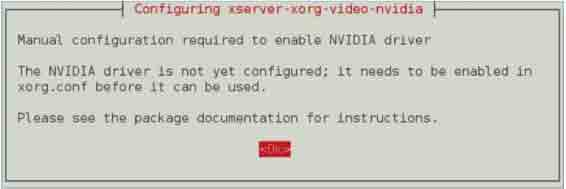

图 2.1 配置 xserver-xorg

该界面提示需要配置 xserver-xorg-video-nvidia。在该界面单击 OK 按钮，后面手动进行配置。

（6）安装 NVIDIA 显卡驱动应用程序 nvidia-xconfig 包。执行命令如下所示：

```
root@kali:~# aptitude install nvidia-xconfig 
```

（7）生成 Xorg 服务配置文件。执行命令如下所示：

```
root@kali:~# nvidia-xconfig 
```

执行以上命令后，将输出如下所示的信息。

```
WARNING: Unable to locate/open X configuration file.
New X configuration file written to '/etc/X11/xorg.conf' 
```

输出的信息，表示重新生成了 xorg.conf 文件。然后，重新启动系统。

（8）检查 NVIDIA 显卡驱动是否成功安装。首先检查 GLX 模块，执行命令如下所示：

```
root@kali:~# glxinfo | grep -i "direct rendering"
direct rendering: Yes 
```

检查 NVIDIA 驱动模块。执行命令如下所示：

```
root@kali:~# lsmod | grep nvidia
nvidia               9442880 29
i2c_core             24129 2 i2c_i801,nvidia
root@kali:~# lsmod | grep nouveau 
```

通过查看以下文件的内容，确定开源的 NVIDIA 驱动 nouveau 是否被加入黑名单，如下所示：

```
root@kali:~# cat /etc/modprobe.d/nvidia.conf
alias nvidia nvidia-current
remove nvidia-current rmmod nvidia
root@kali:~# cat /etc/modprobe.d/nvidia-blacklists-nouveau.conf
# You need to run "update-initramfs -u" after editing this file.
# see #580894
blacklist nouveau
root@kali:~# cat /etc/modprobe.d/nvidia-kernel-common.conf
alias char-major-195* nvidia

options nvidia NVreg_DeviceFileUID=0 NVreg_DeviceFileGID=44 NVreg_Device FileMode=0660
# To enable FastWrites and Sidebus addressing, uncomment these lines
# options nvidia NVreg_EnableAGPSBA=1
# options nvidia NVreg_EnableAGPFW=1 
```

看到以上输出信息，就表示 nouveau 已被加入黑名单。

为了加快用户破解一些大数据文件，需要安装 CUDA（Compute Unified Device Architecture）。CUDA 是一种由 NVIDIA 推出的通用并行计算架构，该架构使 GPU 能够解决复杂的计算问题。

安装 NVIDIA CUDA 工具集和 NVIDIA openCL。执行命令如下所示：

```
root@kali:~# aptitude install nvidia-cuda-toolkit nvidia-opencl-icd 
```

执行以上命令后，如果输出过程中没有出错的话，表示该软件包安装成功。以后就可以使用 CUDA 破解加密的大数据文件。

# 2.3 应用更新和配置额外安全工具

## 2.3 应用更新和配置额外安全工具

本节将介绍更新 Kali 的过程和配置一些额外的工具。这些工具在后面的章节中将是有用的。Kali 软件包不断地更新和发布之间，用户很快发现一套新的工具比最初在 DVD ROM 上下载的软件包更有用。本节将通过更新安装的方法，获取 Nessus 的一个激活码。最后安装 Squid。

应用更新和配置额外安全工具的具体操作步骤如下所示。

（1）更新本地软件包列表库。执行命令如下所示：

```
root@Kali:~# apt-get update 
```

执行以上命令后，需要等待一段时间。执行完后，会自动退出程序。

（2）升级已存在的包。执行命令如下所示：

```
root@Kali:~# apt-get upgrade 
```

（3）升级到最新版本。执行命令如下所示：

```
root@Kali:~# apt-get dist-upgrade 
```

（4）从[`www.nessus.org/products/nessus/nessus-plugins/obtain-an-activation-code 官网获取一个激活码。在浏览器中输入该地址后，将显示如图 2.2 所示的界面。`](http://www.nessus.org/products/nessus/nessus-plugins/obtain-an-activation-code 官网获取一个激活码。在浏览器中输入该地址后，将显示如图 2.2 所示的界面。)

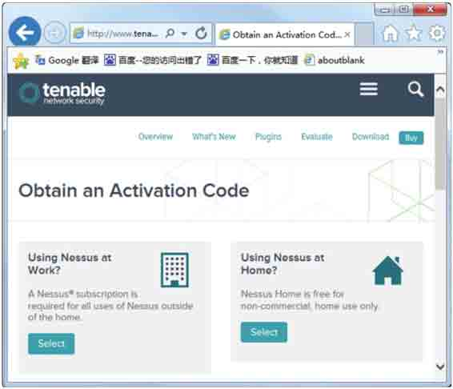

图 2.2 获取激活码

在该界面选择免费版 Using Nessus at Home？选项，单击 Select 按钮，将显示如图 2.3 所示的界面。

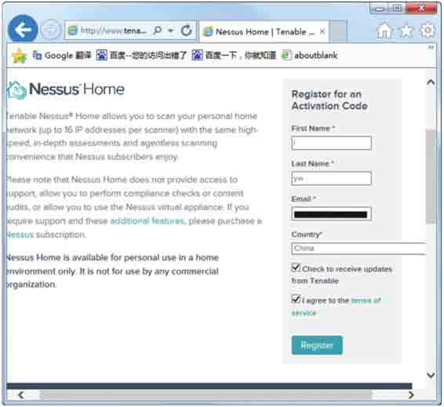

图 2.3 注册信息

在该界面填写一些注册信息，填写完后，单击 Register 按钮，将在注册的邮箱中收到一份邮件。进入邮箱后，可看到该邮件中有一个激活码。

（5）为 Nessus 网络接口创建一个用户账户。执行命令如下所示：

```
root@Kali:~# /opt/nessus/sbin/nessus-adduser 
Login :admin                                 #输入用户名为 admin 
Login pasword :                              #输入用户密码 
Login password (again) :                     #输入确认密码 
Do you want this user to be a Nessus 'admin' user ? (can upload plugins, etc...) (y/n) [n]: y 
User rules                                   #用户规则 
---------- 
nessusd has a rules system which allows you to restrict the hosts 
that admin has the right to test. For instance, you may want 
him to be able to scan his own host only. 
Please see the nessus-adduser manual for the rules syntax 
Enter the rules for this user, and enter a BLANK LINE once you are done :  
(the user can have an empty rules set)     #按下空格键提交输入 
Login            : admin 
Password         : *********** 
This user will have 'admin' privileges within the Nessus server 
Rules            : 
Is that ok ? (y/n) [y] y 
User added                                  #用户被添加 
```

从输出的信息中可以看到 admin 用户被添加成功了。

（6）激活 Nessus。执行命令如下所示：

```
root@Kali:~# /opt/nessus/bin/nessus-fetch --register  XXXX-XXXX-XXXX- XXXX-XXXX 
```

以上命令中的 XXXX-XXXX-XXXX-XXXX-XXXX 指的是在邮件中获取到的激活码。执行以上命令后，输出信息如下所示：

```
Your Activation Code has been registered properly - thank you.
Now fetching the newest plugin set from plugins.nessus.org   #等待一段时间
Could not verify the signature of all-2.0.tar.gz        #不能证实 all-2.0.tar.gz 的签名 
```

（7）启动 Nessus 服务。执行命令如下所示：

```
root@Kali:~# /etc/init.d/nessusd start 
```

在第（6）步骤中激活 Nessus 时，输出和以上相同的信息，表示没有激活 Nessus。这个问题在 RHEL 上不会出现的。不过，这里有方法来解决这个问题。具体操作步骤如下 所示。

（1）删除文件 nessus-fetch.rc。执行命令如下所示：

```
root@Kali:~# rm /opt/nessus/etc/nessus/nessus-fetch.rc 
```

（2）使用 nessus-fetch --challenge 获取挑战码。执行命令如下所示：

```
root@Kali:~# /opt/nessus/bin/nessus-fetch --challenge

Challenge code: xxxxxxxxxxxxxxxxxxxxxxxx

You can copy the challenge code above and paste it alongside your
Activation Code at:
https://plugins.nessus.org/offline.php 
```

其中，xxxxxxxxxxxxxxxxxxxxxxxx 是输出的挑战码。

（3）重新登录[`www.nessus.org/products/nessus/nessus-plugins/obtain-an-activation-`](http://www.nessus.org/products/nessus/nessus-plugins/obtain-an-activation-) code 网站获取激活码。

（4）登录[`plugins.nessus.org/offline.php 网站，在该界面输入生成的挑战码和激活码，如图 2.4 所示的界面。`](https://plugins.nessus.org/offline.php 网站，在该界面输入生成的挑战码和激活码，如图 2.4 所示的界面。)

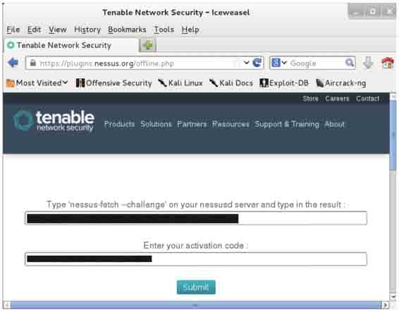

图 2.4 获取插件

此时单击 Submit 按钮，将显示如图 2.5 所示的界面。

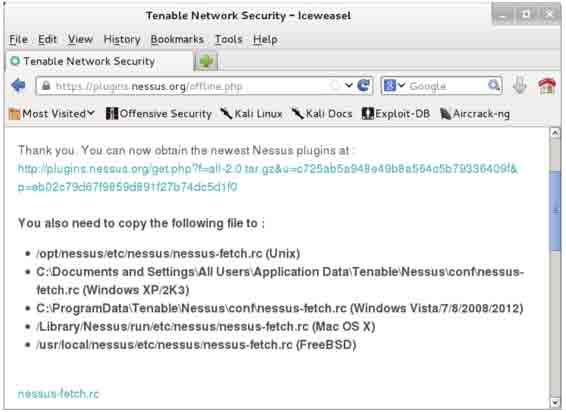

图 2.5 下载插件

从该界面下载 nessus-fetch.rc 和 all-2.0.tar.gz，将其下载到本地。

（5）将下载到的 nessus-fetch.rc 文件复制到/opt/nessus/etc/nessus/目录下。执行命令如下所示：

```
root@Kali:~# cp /root/nessus-fetch.rc /opt/nessus/etc/nessus 
```

执行以上命令后，没有任何输出信息。

（6）使用 nessus-update-plugins 命令将 Nessus 的插件 all-2.0.tar.gz 加载。执行命令如下所示：

```
root@Kali:~# /opt/nessus/sbin/nessus-update-plugins /root/all/all-2.0.tar.gz
Expanding /root/all/all-2.0.tar.gz…
Done. The Nessus server will start processing these plugins within a minute 
```

（7）重新启动 Nessus 服务。执行命令如下所示：

```
root@Kali:~# /etc/init.d/nessusd restart
$Shutting down Nessus : .
$Starting Nessus : . 
```

以上步骤操作完成后，Nessus 就被激活了。如果不激活 Nessus，它是不能使用的。

在 Kali 中安装 Squid 服务。执行命令如下所示：

```
root@Kali:~# apt-get install squid3 
```

设置 Squid 服务开机不自动启动。执行命令如下所示：

```
root@Kali:~# update-rc.d -f squid3 remove 
```

# 2.4 设置 ProxyChains

## 2.4 设置 ProxyChains

ProxyChains 是 Linux 和其他 Unices 下的代理工具。它可以使任何程序通过代理上网，允许 TCP 和 DNS 通过代理隧道，支持 HTTP、SOCKS4 和 SOCKS5 类型的代理服务器，并且可配置多个代理。ProxyChains 通过一个用户定义的代理列表强制连接指定的应用程序，直接断开接收方和发送方的连接。本节将介绍设置 ProxyChains 的方法。

设置 ProxyChains 的具体操作步骤如下所示。

（1）打开 ProxyChains 配置文件。执行命令如下所示：

```
root@Kali:~# vi /etc/proxychains.conf 
```

执行以上命令后，打开文件的内容如下所示：

```
# proxychains.conf VER 3.1
#
# HTTP, SOCKS4, SOCKS5 tunneling proxifier with DNS.
#
# The option below identifies how the ProxyList is treated.
# only one option should be uncommented at time,
# otherwise the last appearing option will be accepted
#
#dynamic_chain
#
# Dynamic - Each connection will be done via chained proxies
# all proxies chained in the order as they appear in the list
# at least one proxy must be online to play in chain
# (dead proxies are skipped)
# otherwise EINTR is returned to the app
#
strict_chain
#
# Strict - Each connection will be done via chained proxies
# all proxies chained in the order as they appear in the list
# all proxies must be online to play in chain
# otherwise EINTR is returned to the app
#
#random_chain
#
# Random - Each connection will be done via random proxy
# (or proxy chain, see chain_len) from the list.
# this option is good to test your IDS :) 
```

输出的信息就是 proxychains.conf 文件的内容。由于篇幅的原因，这里只列出了部分内容。

（2）将 proxychains.conf 文件中的 dynamic_chain 前面的注释符取消。要修改的配置项，是上面加粗的部分，如下所示：

```
dynamic_chain 
```

（3）添加一些代理服务器到列表（proxychains.conf 文件末尾），如下所示：

```
# ProxyList format 
#       type  host  port [user pass] 
#       (values separated by 'tab' or 'blank') 
# 
# 
#        Examples: 
# 
#               socks5  192.168.67.78   1080    lamer   secret 
#               http    192.168.89.3    8080    justu   hidden 
#               socks4  192.168.1.49    1080 
#               http    192.168.39.93   8080 
# 
# 
#       proxy types: http, socks4, socks5 
#        ( auth types supported: "basic"-http  "user/pass"-socks ) 
# 
[ProxyList] 
# add proxy here ... 
# meanwile 
# defaults set to "tor" 
socks4  127.0.0.1 9050 
socks5  98.206.2.3 1893 
socks5 76.22.86.170 1658 
-- 插入 -- 
```

以上信息中加粗的部分为添加的代理服务器。

（4）通过用户的连接代理解析目标主机。执行命令如下所示：

```
root@kali:~# proxyresolv www.target.com 
```

默认情况下，执行 proxyresolv 命令，可能看到该命令没找到错误信息。因为 proxyresolv 保存在/usr/lib/proxychains3/目录中，而不能被执行。proxyresolv 会被 proxychains 调用，所以将这两个文件放在一个目录中，如/usr/bin。执行命令如下所示：

```
root@kali:~# cp /usr/lib/proxychains3/proxyresolv /usr/bin/ 
```

执行完以上命令后，proxyresolv 命令就可以执行了。

（5）通过用户想要使用的应用程序运行 ProxyChains，例如，启动 msfconsole。执行命令如下所示：

```
root@kali:~# proxychains msfconsole 
ProxyChains-3.1 (http://proxychains.sf.net) 
|DNS-request| 0.0.0.0  
|S-chain|-<>-127.0.0.1:9050-<--timeout 
|DNS-response|: 0.0.0.0 is not exist 
     ,           , 
     /             \ 
   ((__---,,,---__)) 
     (_) O O (_)_________ 
          \ _ /             |\ 
          o_o \   M S F   | \ 
                \   _____  |  * 
                 |||    WW ||| 
                 |||        ||| 

Tired of typing 'set RHOSTS'? Click & pwn with Metasploit Pro 
-- type 'go_pro' to launch it now. 

       =[ metasploit v4.7.0-2013082802 [core:4.7 api:1.0] 
+ -- --= 1161 exploits - 641 auxiliary - 180 post 
+ -- --=[ 310 payloads - 30 encoders - 8 nops 

msf > 
```

执行以上命令后，看到 msf>提示符表示 msfconsole 启动成功了。表示 ProxyChains 设置成功。

# 2.5 目录加密

## 2.5 目录加密

在 Kali 中提供了一个目录加密工具 TrueCrypt。该工具是一款开源的绿色加密卷加密软件，不需要生成任何文件即可在硬盘上建立虚拟磁盘。用户可以按照盘符进行访问，所以虚拟磁盘上的文件都被自动加密，访问时需要使用密码解密。TrueCrypt 提供多种加密算法，包括 AES、Serpent、Twofish、AES-Twofish 和 AES-Twofish-Serpent 等。本节将介绍 TrueCrypt 工具的使用。

### 2.5.1 创建加密目录

使用 TrueCrypt 工具加密目录。具体操作步骤如下所示。

（1）启动 TrueCrypt 工具。在终端执行如下所示的命令：

```
root@kali:~# truecrypt 
```

执行以上命令后，将显示如图 2.6 所示的界面。


图 2.7 TrueCrypt Volume Creation Wizard

（3）在该界面选择创建卷容器，这里选择默认的 Create an encrypted file container 选项，单击 Next 按钮，将显示如图 2.8 所示的界面。


图 2.8 Volume Type

（4）该界面选择卷类型，这里选择默认的 Standard TrueCrypt volume，单击 Next 按钮，将显示如图 2.9 所示的界面。


图 2.9 Volume Location

（5）在该界面单击 Select File…按钮，将显示如图 2.10 所示的界面。

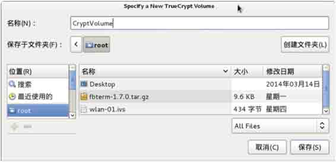

图 2.10 指定一个新 TrueCrypt 卷

（6）在该界面为新卷指定一个名称和位置，这里创建的卷名称为 CryptVolume，保存在/root 目录下。然后单击“保存”按钮，将显示如图 2.11 所示的界面。

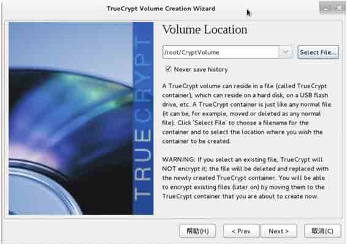

图 2.11 Volume Location

（7）在该界面可以看到前面创建的卷的名称和位置。然后单击 Next 按钮，将显示如图 2.12 所示的界面。


图 2.12 Encryption Options

（8）在该界面选择加密算法，这里选择默认的加密算法 AES，然后单击 Next 按钮，将显示如图 2.13 所示的界面。


图 2.13 Volume Size

（9）在该界面指定卷的大小为 10GB，然后单击 Next 按钮，将显示如图 2.14 所示的 界面。


图 2.14 Volume Password

（10）在该界面输入一个卷的密码，然后单击 Next 按钮，将显示如图 2.15 所示的界面。

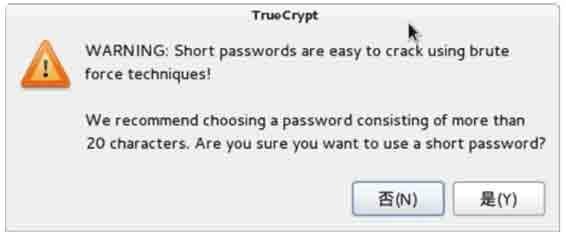

图 2.15 警告信息

（11）该界面提示设置的密码太短，建议大小 20 个字符。如果确认要使用该密码的话，单击“是”按钮，将显示如图 2.16 所示的界面。


图 2.16 Large Files

（12）在该界面选择存储到卷文件的大小，这里选择 I will not store files larger than 4GB on the volume。然后单击 Next 按钮，将显示如图 2.17 所示的界面。

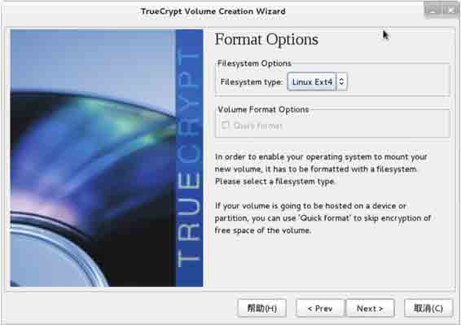

图 2.17 Format Options

（13）在该界面选择文件系统类型，默认是 FAT。该工具还支持 Linux Ext2、Linux EXt3 和 Linux Ext4 文件类型。这里选择 Linux Ext4，单击 Next 按钮，将显示如图 2.18 所示的界面。

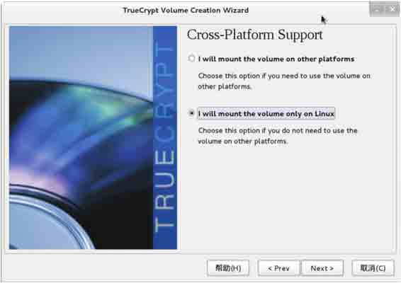

图 2.18 Cross-Platform Support

（14）该界面选择挂载该卷的一个平台，这里选择第二种方式 I will mount the volume only on Linux，单击 Next 按钮，将显示如图 2.19 所示的界面。


图 2.19 Volume Format

（15）现在要格式化前面创建的卷，此时单击 Format 按钮，将显示如图 2.20 所示的 界面。


图 2.20 格式化过程

（16）该界面显示了格式化的进度、速度和时间等信息。该过程运行完后，将显示如图 2.21 所示的界面。

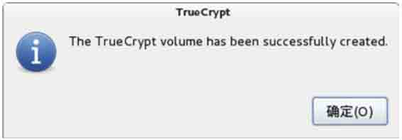

图 2.21 TrueCrypt 卷创建成功

（17）看到上面的窗口，表示 TrueCrypt 卷创建成功了。此时，单击“确定”按钮，将显示如图 2.22 所示的界面。

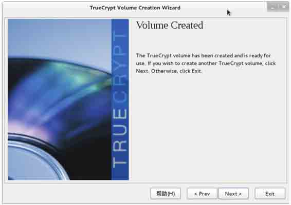

图 2.22 Volume Created

（18）此时 TrueCrypt 卷就创建完成了。如果还想要创建另一个 TrueCrypt 卷的话，单击 Next 按钮。否则单击 Exit 按钮。单击 Exit 按钮后，将返回到图 2.6 所示的界面。

### 2.5.2 文件夹解密

在上一小节中成功创建了加密目录。如果要查看加密的内容，需要将该卷解密后才可访问。为了解密卷，需要从图 2.6 的列表中选择一个槽。然后单击 Select File…按钮，打开刚才创建的 CryptVolume 卷。这时单击 Mount 按钮，将显示如图 2.23 所示的界面。

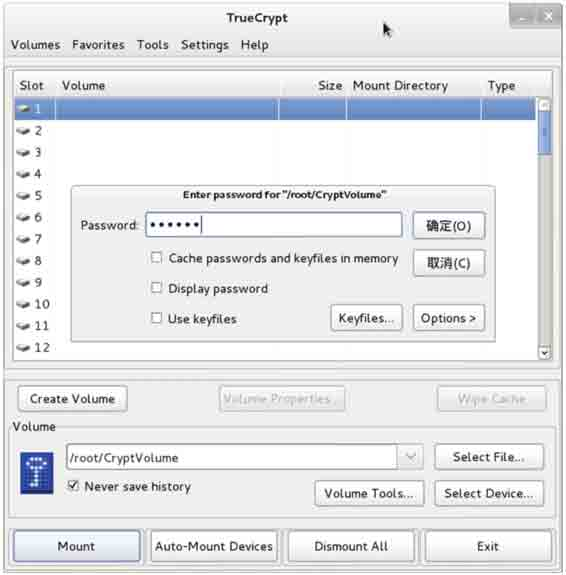

图 2.23 挂载卷

在该界面输入创建 CryptVolume 时设置的密码，单击“确定”按钮，将显示如图 2.24 所示的界面。

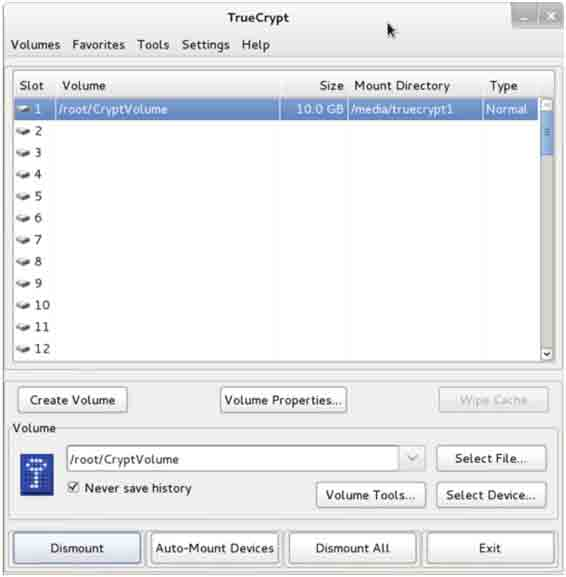

图 2.24 CryptVolume 卷挂载成功

从该界面可以看到 CryptVolume 卷的挂载信息、大小和卷的位置等。此时，用户可以通过双击在槽中的卷或者挂载点来访问这个卷。当对该文件操作完成后，可以单击 Dismount All 按钮卸载该卷。