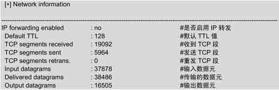
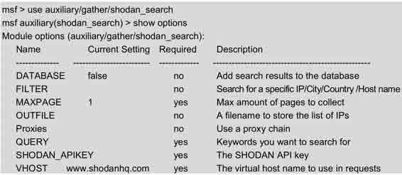
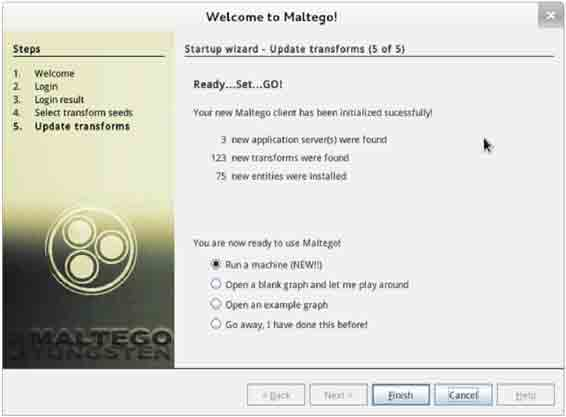

# 第四章　信息收集

渗透测试最重要的阶段之一就是信息收集。为了启动渗透测试，用户需要收集关于目标主机的基本信息。用户得到的信息越多，渗透测试成功的概率也就越高。Kali Linux 操作系统上提供了一些工具，可以帮助用户整理和组织目标主机的数据，使用户得到更好的后期侦察。本章将介绍 Maltego、CaseFile 和 Nmap 工具的使用其主要知识点如下：

*   枚举服务；
*   测试网络范围；
*   识别活跃的主机和查看打开的端口；
*   系统指纹识别；
*   服务指纹识别；
*   其他信息收集手段；
*   使用 Maltego 收集信息；
*   绘制网络图。

# 4.1 枚举服务

## 4.1 枚举服务

枚举是一类程序，它允许用户从一个网络中收集某一类的所有相关信息。本节将介绍 DNS 枚举和 SNMP 枚举技术。DNS 枚举可以收集本地所有 DNS 服务和相关条目。DNS 枚举可以帮助用户收集目标组织的关键信息，如用户名、计算机名和 IP 地址等，为了获取这些信息，用户可以使用 DNSenum 工具。要进行 SNMP 枚举，用户需要使用 SnmpEnum 工具。SnmpEnum 是一个强大的 SNMP 枚举工具，它允许用户分析一个网络内 SNMP 信息传输。

### 4.1.1 DNS 枚举工具 DNSenum

DNSenum 是一款非常强大的域名信息收集工具。它能够通过谷歌或者字典文件猜测可能存在的域名，并对一个网段进行反向查询。它不仅可以查询网站的主机地址信息、域名服务器和邮件交换记录，还可以在域名服务器上执行 axfr 请求，然后通过谷歌脚本得到扩展域名信息，提取子域名并查询，最后计算 C 类地址并执行 whois 查询，执行反向查询，把地址段写入文件。本小节将介绍使用 DNSenum 工具检查 DNS 枚举。在终端执行如下所示的命令：

```
root@kali:~# dnsenum --enum benet.com 
dnsenum.pl VERSION:1.2.3 
 第四章  信息收集 
Warning: can't load Net::Whois::IP module, whois queries disabled. 
-----   benet.com   ----- 
Host's addresses: 
__________________ 
benet.com.                               86400    IN    A       192.168.41.131 
benet.com.                               86400    IN    A       127.0.0.1 
Name Servers: 
______________ 
benet.com.                               86400    IN   A        127.0.0.1 
benet.com.                               86400    IN   A        192.168.41.131 
www.benet.com.                          86400    IN   A        192.168.41.131 
Mail (MX) Servers: 
___________________ 
mail.benet.com.                         86400    IN    A       192.168.41.2 
Trying Zone Transfers and getting Bind Versions: 
```

输出的信息显示了 DNS 服务的详细信息。其中，包括主机地址、域名服务地址和邮件服务地址。如果幸运的话，还可以看到一个区域传输。

使用 DNSenum 工具检查 DNS 枚举时，可以使用 dnsenum 的一些附加选项，如下所示。

*   --threads [number]：设置用户同时运行多个进程数。
*   -r：允许用户启用递归查询。
*   -d：允许用户设置 WHOIS 请求之间时间延迟数（单位为秒）。
*   -o：允许用户指定输出位置。
*   -w：允许用户启用 WHOIS 请求。

### 4.1.2 DNS 枚举工具 fierce

fierce 工具和 DNSenum 工具性质差不多，其 fierce 主要是对子域名进行扫描和收集信息的。使用 fierce 工具获取一个目标主机上所有 IP 地址和主机信息。执行命令如下所示：

```
root@kali:~# fierce -dns baidu.com
DNS Servers for baidu.com:
        ns2.baidu.com
        ns7.baidu.com
        dns.baidu.com
        ns3.baidu.com
        ns4.baidu.com
Trying zone transfer first…
        Testing ns2.baidu.com
                Request timed out or transfer not allowed.
        Testing ns7.baidu.com
                Request timed out or transfer not allowed.
        Testing dns.baidu.com
                Request timed out or transfer not allowed.
        Testing ns3.baidu.com
                Request timed out or transfer not allowed.
        Testing ns4.baidu.com
                Request timed out or transfer not allowed.
Unsuccessful in zone transfer (it was worth a shot)
Okay, trying the good old fashioned way… brute force
Checking for wildcard DNS…
        ** Found 94050052936.baidu.com at 123.125.81.12.
        ** High probability of wildcard DNS.
Now performing 2280 test(s)…
10.11.252.74  accounts.baidu.com
172.22.15.16  agent.baidu.com
180.76.3.56   antivirus.baidu.com
10.81.7.51        ba.baidu.com
172.18.100.200bd.baidu.com
10.36.155.42  bh.baidu.com
10.36.160.22  bh.baidu.com
10.11.252.74  accounts.baidu.com
……省略部分内容
  61.135.163.0-255 : 1 hostnames found.
  61.135.165.0-255 : 1 hostnames found.
  61.135.166.0-255 : 1 hostnames found.
  61.135.185.0-255 : 1 hostnames found.
Done with Fierce scan: http://ha.ckers.org/fierce/
Found 133 entries.
Have a nice day. 
```

输出的信息显示了 baidu.com 下所有的子域。从倒数第 2 行，可以看到总共找到 133 个条目。执行以上命令后，输出的内容较多。但是由于篇幅的原因，部分内容使用省略号（……）取代。

用户也可以通过提供一个单词列表执行相同的操作，执行命令如下所示：

```
root@kali:~# fierce -dns baidu.com -wordlist hosts.txt /tmp/output.txt 
```

### 4.1.3 SNMP 枚举工具 Snmpwalk

Snmpwalk 是一个 SNMP 应用程序。它使用 SNMP 的 GETNEXT 请求，查询指定的所有 OID（SNMP 协议中的对象标识）树信息，并显示给用户。本小节将演示 Snmpwalk 工具的使用。

【实例 4-1】使用 Snmpwalk 命令测试 Windows 主机。执行命令如下所示：

```
root@kali:~# snmpwalk -c public 192.168.41.138 -v 2c
iso.3.6.1.2.1.1.1.0 = STRING: "Hardware: x86 Family 6 Model 42 Stepping 7 AT/AT COMPATIBLE - Software: Windows Version 6.1 (Build 7601 Multiprocessor Free)"
iso.3.6.1.2.1.1.2.0 = OID: iso.3.6.1.4.1.311.1.1.3.1.1
iso.3.6.1.2.1.1.3.0 = Timeticks: (49046) 0:08:10.46
iso.3.6.1.2.1.1.4.0 = ""
iso.3.6.1.2.1.1.5.0 = STRING: "WIN-RKPKQFBLG6C"
iso.3.6.1.2.1.1.6.0 = ""
iso.3.6.1.2.1.1.7.0 = INTEGER: 76
iso.3.6.1.2.1.2.1.0 = INTEGER: 19
iso.3.6.1.2.1.2.2.1.1.1 = INTEGER: 1
iso.3.6.1.2.1.2.2.1.1.2 = INTEGER: 2
iso.3.6.1.2.1.2.2.1.1.3 = INTEGER: 3
iso.3.6.1.2.1.2.2.1.1.4 = INTEGER: 4
iso.3.6.1.2.1.2.2.1.1.5 = INTEGER: 5
iso.3.6.1.2.1.2.2.1.1.6 = INTEGER: 6
……
iso.3.6.1.2.1.2.2.1.1.16 = INTEGER: 16
iso.3.6.1.2.1.2.2.1.1.17 = INTEGER: 17
iso.3.6.1.2.1.2.2.1.1.18 = INTEGER: 18
iso.3.6.1.2.1.2.2.1.1.19 = INTEGER: 19
iso.3.6.1.2.1.2.2.1.2.1 = Hex-STRING: 53 6F 66 74 77 61 72 65 20 4C 6F 6F 70 62 61 63
6B 20 49 6E 74 65 72 66 61 63 65 20 31 00
iso.3.6.1.2.1.2.2.1.2.2 = Hex-STRING: 57 41 4E 20 4D 69 6E 69 70 6F 72 74 20 28 53 53
54 50 29 00
iso.3.6.1.2.1.2.2.1.2.3 = Hex-STRING: 57 41 4E 20 4D 69 6E 69 70 6F 72 74 20 28 4C 32
54 50 29 00
iso.3.6.1.2.1.2.2.1.2.4 = Hex-STRING: 57 41 4E 20 4D 69 6E 69 70 6F 72 74 20 28 50 50
……
iso.3.6.1.2.1.55.1.8.1.5.11.16.254.128.0.0.0.0.0.0.149.194.132.179.177.254.120.40 = INTEGER: 1
iso.3.6.1.2.1.55.1.8.1.5.12.16.254.128.0.0.0.0.0.0.0.0.94.254.192.168.41.138 = INTEGER: 1
iso.3.6.1.2.1.55.1.8.1.5.13.16.32.1.0.0.157.56.106.184.52.243.8.98.63.87.214.117 = INTEGER: 1
iso.3.6.1.2.1.55.1.8.1.5.13.16.254.128.0.0.0.0.0.0.52.243.8.98.63.87.214.117 = INTEGER: 1
iso.3.6.1.2.1.55.1.9.0 = Gauge32: 9
iso.3.6.1.2.1.55.1.10.0 = Counter32: 0 
```

以上输出的信息显示了 Windows 主机 192.168.41.138 上的所有信息。

用户也可以使用 snmpwalk 命令枚举安装的软件。执行命令如下所示：

```
root@kali:~# snmpwalk -c public 192.168.41.138 -v 1 | grep ftp 
```

输出信息如下所示：

```
iso.3.6.1.2.1.25.4.2.1.5.3604 = STRING: "-k ftpsvc" 
```

输出的信息表示 192.168.41.138 主机安装了 ftp 软件包。

使用 Snmpwalk 工具也可以枚举目标主机上打开的 TCP 端口。执行命令如下所示：

```
root@kali:~# snmpwalk -c public 192.168.41.138 -v 1 | grep tcpConnState | cut -d "." -f6 | sort -nu
21
25
80
443 
```

输出信息显示了 192.168.41.138 主机打开的端口。如 21、25、80 和 443，总共打开了 4 个端口号。

### 4.1.4 SNMP 枚举工具 Snmpcheck

Snmpcheck 工具允许用户枚举 SNMP 设备的同时将结果以可读的方式输出。下面将演示该工具的使用。使用 Snmpcheck 工具通过 SNMP 协议获取 192.168.41.138 主机信息。执行命令如下所示：

```
root@kali:~# snmpcheck -t 192.168.41.138 
```

该命令输出信息较多，下面依次讲解每个部分。首先输出的是枚举运行信息。

```
snmpcheck.pl v1.8 - SNMP enumerator
Copyright (c) 2005-2011 by Matteo Cantoni (www.nothink.org)

 [*] Try to connect to 192.168.41.138
 [*] Connected to 192.168.41.138
 [*] Starting enumeration at 2014-04-19 15:28:58 
```

（1）获取系统信息，如主机名、操作系统类型及架构。结果如下所示：


从输出的信息中可以看到该系统的主机名为 WIN-RKPKQFBLG6C、x86 架构和 Windows 系统等信息。

（2）获取设备信息，如设备 ID 号、类型和状态等。结果如下所示：


以上信息显示了该系统中所有设备相关信息，如打印设备、网络设备和处理器等。

（3）获取存储信息，如设备 id、设备类型和文件系统类型等。结果如下所示：


该部分显示了系统中所有磁盘。由于篇幅的原因，这里只贴了 A 和 C 盘的存储信息。这里以 C 盘为例，介绍一下输出的信息，包括设备类型、文件系统类型、空间大小、已用空间大小和剩余空间大小等。

（4）获取用户账户信息。结果如下所示：

```
[*] User accounts
-----------------------------------------------
Administrator
 Guest 
```

输出的信息显示了该系统中的有两个用户，分别是 Administrator 和 Guest。

（5）获取进程信息，如进程 ID、进程名和进程类型等。结果如下所示：


输出信息的第一行表示该系统中共有 44 个进程。由于篇幅的原因，这里只列出了前几个运行的进程。第二行指定了进程类型：1 表示不知名；2 表示操作系统；3 表示设备驱动；4 表示应用程序。第三行指定了进程的状态：1 表示正在运行；2 表示可以运行；3 表示不能运行；4 表示无效的。第四行的内容是以列的形式显示：第一列表示进程 ID；第二列表示进程名；第三列表示进程状态；第四列表示进程路径。

（6）获取网络信息，如 TTL 值、TCP 段和数据元。结果如下所示：



以上信息显示了该目标系统中网络的相关信息，如默认 TTL 值、收到 TCP 段、发送 TCP 段和重发 TCP 段等。

（7）获取网络接口信息，如接口状态、速率、IP 地址和子网掩码等。结果如下所示：


以上信息中显示了 loopback 接口的相关信息。包括它的速率、IP 地址、子网掩码和最大传输单元。

（8）获取路由信息，如目标地址、下一跳地址、子网掩码和路径长度值。结果如下所示：


以上信息表示目标系统的一个路由表信息。该路由表包括目的地址、下一跳地址、子网掩码及路径长度值。

（9）获取网络服务信息，如分布式组件对象模型服务、DHCP 客户端和 DNS 客户端等。结果如下所示：


以上信息显示了目标主机中所安装的服务。由于篇幅的原因，只列出了一少部分服务。

（10）获取监听的 TCP 端口，如监听的 TCP 端口号有 135、495149513 和 139 等。结果如下所示：


以上信息表示两台主机建立 TCP 连接后的信息。包括本地地址、本机端口、远程主机地址、远程主机端口及连接状态。

（11）获取监听 UDP 端口信息，如监听的 UDP 端口有 123、161、4500、500 和 5355 等。结果如下所示：


以上信息表示目标主机中已开启的 UDP 端口号。

（12）获取软件组件信息，如 Visual C++ 2008。显示结果如下所示：


以上信息表示该主机中安装了 Visual C++ 2008 类库。

（13）获取 Web 服务信息，如发送的字节数、文件数和当前匿名用户等。结果如下所示：


以上信息显示了关于 Web 服务的信息。最后显示了枚举主机 192.168.41.138 共用的时间。

### 4.1.5 SMTP 枚举工具 smtp-user-enum

smtp-user-enum 是针对 SMTP 服务器的 25 端口，进行用户名枚举的工具，用以探测服务器已存在的邮箱账户。在 SMTP 服务上启动用户的 SMTP 枚举。执行命令如下所示：


输出的信息显示了扫描 192.168.41.138 主机的详细信息，包括模式、运行进程、用户名文件、用户数和 TCP 端口等。

# 4.2 测试网络范围

## 4.2 测试网络范围

测试网络范围内的 IP 地址或域名也是渗透测试的一个重要部分。通过测试网络范围内的 IP 地址或域名，确定是否有人入侵自己的网络中并损害系统。不少单位选择仅对局部 IP 基础架构进行渗透测试，但从现在的安全形势来看，只有对整个 IT 基础架构进行测试才有意义。这是因为在通常情况下，黑客只要在一个领域找到漏洞，就可以利用这个漏洞攻击另外一个领域。在 Kali 中提供了 DMitry 和 Scapy 工具。其中，DMitry 工具用来查询目标网络中 IP 地址或域名信息；Scapy 工具用来扫描网络及嗅探数据包。本节将介绍使用 DMitry 和 Scapy 工具测试网络范围。

### 4.2.1 域名查询工具 DMitry

DMitry 工具是用来查询 IP 或域名 WHOIS 信息的。WHOIS 是用来查询域名是否已经被注册及已经注册域名的详细信息的数据库（如域名所有人和域名注册商）。使用该工具可以查到域名的注册商和过期时间等。下面将使用 DMitry 工具收集 rzchina.net 域名的信息。执行命令如下所示：


输出的信息显示了 rzchina.net 域名的 IP 地址、WHOIS 信息及开放的端口号等。执行以上命令后输出的信息很多，但是由于篇幅的原因，部分内容使用省略号（……）代替。

虽然使用 DMitry 工具可以查看到 IP 或域名信息，但还是不能判断出这个网络范围。因为一般的路由器和防火墙等并不支持 IP 地址范围的方式，所以工作中经常要把 IP 地址转换成子网掩码的格式、CIDR 格式和思科反向子网掩码格式等。在 Linux 中，netmask 工具可以在 IP 范围、子网掩码、CIDR 和 Cisco 等格式中互相转换，并且提供了 IP 地址的点分十进制、十六进制、八进制和二进制之间的互相转换。使用 netmask 工具将域名 rzchina.net 转换成标准的子网掩码格式。执行命令如下所示：

```
root@kali:~# netmask -s rzchina.net
 180.178.45.123/255.255.255.255 
```

输出的信息显示了 rzchina.net 域名的 IP 地址和子网掩码值。

### 4.2.2 跟踪路由工具 Scapy

Scapy 是一款强大的交互式数据包处理工具、数据包生成器、网络扫描器、网络发现工具和包嗅探工具。它提供多种类别的交互式生成数据包或数据包集合、对数据包进行操作、发送数据包、包嗅探、应答和反馈匹配等功能。下面将介绍 Scapy 工具的使用。

使用 Scapy 实现多行并行跟踪路由功能。具体操作步骤如下所示。

（1）启动 Scapy 工具。执行命令如下所示。

```
root@kali:~# scapy
INFO: Can't import python gnuplot wrapper . Won't be able to plot.
WARNING: No route found for IPv6 destination :: (no default route?)
Welcome to Scapy (2.2.0)
>>> 
```

看到>>>提示符，表示 scapy 命令登录成功。

（2）使用 sr()函数实现发送和接收数据包。执行命令如下所示：

```
>>> ans,unans=sr(IP(dst="www.rzchina.net/30",ttl=(1,6))/TCP())
Begin emission:
.****Finished to send 24 packets.
………***************…………………………………..^C #Ctrl+C 终止
Received 70 packets, got 19 answers, remaining 5 packets 
```

执行以上命令后，会自动与 www.rzchina.net 建立连接。执行几分钟后，使用 Ctrl+C 终止接收数据包。从输出的信息中可以看到收到 70 个数据包，得到 19 个响应包及保留了 5 个包。

（3）以表的形式查看数据包发送情况。执行命令如下所示：

```
>>> ans.make_table(lambda(s,r):(s.dst,s.ttl,r.src)) 
```

执行以上命令后，输出如下所示的信息：


输出的信息显示了该网络中的所有 IP 地址。

（4）使用 scapy 查看 TCP 路由跟踪信息。执行命令如下所示：


输出的信息，显示了与 www.google.com、www.kali.org、www.rzchina.net 三个网站连接后所经过的地址。输出信息中的 RA 表示路由区，SA 表示服务区。其中路由区是指当前系统中移动台当前的位置。RA（Routing Area）的标识符是 RAI，RA 是包含在 LA 内的。服务区是指移动台可获得服务的区域，即不同通信网用户无需知道移动台的实际位置，而可与之通信的区域。

（5）使用 res.graph()函数以图的形式显示路由跟踪结果。执行命令如下所示：

```
>>> res.graph() 
```

执行以上命令后，将显示如图 4.1 所示的界面。


图 4.1 路由跟踪图

如果要想保存该图，执行如下所示的命令：

```
>>> res.graph(target=">/tmp/graph.svg") 
```

执行以上命令后，图 4.1 中的信息将会保存到/tmp/graph.svg 文件中。此时不会有任何信息输出。

（6）退出 scapy 程序，执行命令如下所示：

```
>>> exit() 
```

执行以上命令后，scapy 程序将退出。还可以按下 Ctrl+D 组合键退出 scapy 程序。

# 4.3 识别活跃的主机

## 4.3 识别活跃的主机

尝试渗透测试之前，必须先识别在这个目标网络内活跃的主机。在一个目标网络内，最简单的方法将是执行 ping 命令。当然，它可能被一个主机拒绝，也可能被接收。本节将介绍使用 Nmap 工具识别活跃的主机。

### 4.3.1 网络映射器工具 Nmap

Nmap 是一个免费开放的网络扫描和嗅探工具包，也叫网络映射器（Network Mapper）。该工具其基本功能有三个，一是探测一组主机是否在线；其次是扫描主机端口，嗅探所提供的网络服务；三是可以推断主机所用的操作系统。通常，用户利用 Nmap 来进行网络系统安全的评估，而黑客则用于扫描网络。例如，通过向远程主机发送探测数据包，获取主机的响应，并根据主机的端口开放情况得到网络的安全状态。从中寻找存在漏洞的目标主机，从而实施下一步的攻击。

Nmap 使用 TCP/IP 协议栈指纹准确地判断目标主机的操作系统类型。首先，Nmap 通过对目标主机进行端口扫描，找出有哪些端口正在目标主机上监听。当侦测到目标主机上有多于一个开放的 TCP 端口、一个关闭的 TCP 端口和一个关闭的 UDP 端口时，Nmap 的探测能力是最好的。Nmap 工具的工作原理如表 4-1 所示。

表 4-1 Nmap 工作原理

| 测试 | 描述 |
| --- | --- |
| T1 | 发送 TCP 数据包（Flag=SYN）到开放的 TCP 端口上 |
| T2 | 发送一个空的 TCP 数据包到开放的 TCP 端口上 |
| T3 | 发送 TCP 数据包（Flag=SYN、URG、PSH 和 FIN）到开放的 TCP 端口上 |
| T4 | 发送 TCP 数据包（Flag=ACK）到开放的 TCP 端口上 |
| T5 | 发送 TCP 数据包（Flag=SYN）到关闭的 TCP 端口上 |
| T6 | 发送 TCP 数据包（Flag=ACK）到开放的 TCP 端口上 |
| T7 | 发送 TCP 数据包（Flag=URG、PSH 和 FIN）到关闭的 TCP 端口上 |

Nmap 对目标主机进行一系列测试，如表 4-1 所示。利用得出的测试结果建立相应目标主机的 Nmap 指纹。最后，将此 Nmap 指纹与指纹库中指纹进行查找匹配，从而得出目标主机的操作系统类型。

Nmap 主要扫描类型如表 4-2 所示。

表 4-2 Nmap 主要扫描类型

| Ping 扫描 | 端口扫描 |
| --- | --- |
| TCP SYN 扫描 | UDP 扫描 |
| 操作系统识别 | 隐蔽扫描 |

### 4.3.2 使用 Nmap 识别活跃主机

上一小节介绍了 Nmap 工具概念及功能。现在就使用该工具，测试一个网络中活跃的主机。使用方法如下所示。

使用 Nmap 查看一个主机是否在线。执行命令如下所示：

```
root@kali:~# nmap -sP 192.168.41.136
Starting Nmap 6.40 ( http://nmap.org ) at 2014-04-21 17:54 CST
Nmap scan report for www.benet.com (192.168.41.136)
Host is up (0.00028s latency).
MAC Address: 00:0C:29:31:02:17 (VMware)
Nmap done: 1 IP address (1 host up) scanned in 0.19 seconds 
```

从输出的信息中可以看到 192.168.41.136 主机的域名、主机在线和 MAC 地址等。

用户也可以使用 Nping（Nmap 套具）查看，能够获取更多详细信息。执行命令如下 所示：

```
root@kali:~# nping --echo-client "public" echo.nmap.org
Starting Nping 0.6.40 ( http://nmap.org/nping ) at 2014-04-21 17:53 CST
SENT (1.6030s) ICMP [192.168.41.234 > 74.207.244.221 Echo request (type=8/code=0) id=45896 seq=1] IP [ttl=64 id=1270 iplen=28 ]
RCVD (1.7971s) ICMP [74.207.244.221 > 192.168.41.234 Echo reply (type=0/code=0) id=45896 seq=1] IP [ttl=128 id=64157 iplen=28 ]
SENT (2.6047s) ICMP [192.168.41.234 > 74.207.244.221 Echo request (type=8/code=0) id=45896 seq=2] IP [ttl=64 id=1270 iplen=28 ]
RCVD (2.6149s) ICMP [74.207.244.221 > 192.168.41.234 Echo reply (type=0/code=0) id=45896 seq=1] IP [ttl=128 id=64159 iplen=28 ]
SENT (3.6289s) ICMP [192.168.41.234 > 74.207.244.221 Echo request (type=8/code=0) id=45896 seq=3] IP [ttl=64 id=1270 iplen=28 ]
RCVD (3.6322s) ICMP [74.207.244.221 > 192.168.41.234 Echo reply (type=0/code=0) id=45896 seq=1] IP [ttl=128 id=64161 iplen=28 ]
SENT (4.6429s) ICMP [192.168.41.234 > 74.207.244.221 Echo request (type=8/code=0) id=45896 seq=4] IP [ttl=64 id=1270 iplen=28 ]
RCVD (4.6435s) ICMP [74.207.244.221 > 192.168.41.234 Echo reply (type=0/code=0) id=45896 seq=1] IP [ttl=128 id=64163 iplen=28 ]
SENT (5.6454s) ICMP [192.168.41.234 > 74.207.244.221 Echo request (type=8/code=0) id=45896 seq=5] IP [ttl=64 id=1270 iplen=28 ]
RCVD (5.6455s) ICMP [74.207.244.221 > 192.168.41.234 Echo reply (type=0/code=0) id=45896 seq=1] IP [ttl=128 id=64164 iplen=28 ]
Max rtt: 193.736ms | Min rtt: 0.042ms | Avg rtt: 70.512ms
Raw packets sent: 5 (140B) | Rcvd: 11 (506B) | Lost: 0 (0.00%)| Echoed: 0 (0B)
Nping done: 1 IP address pinged in 6.72 seconds 
```

输出的信息显示了与 echo.nmap.org 网站连接时数据的发送情况，如发送数据包的时间、接收时间、TTL 值和往返时间等。

用户也可以发送一些十六进制数据到指定的端口，如下所示：

```
root@kali:~# nping -tcp -p 445 -data AF56A43D 192.168.41.136
Starting Nping 0.6.40 ( http://nmap.org/nping ) at 2014-04-21 17:58 CST
SENT (0.0605s) TCP 192.168.41.234:14647 > 192.168.41.136:445 S ttl=64 id=54933 iplen=44 seq=3255055782 win=1480
RCVD (0.0610s) TCP 192.168.41.136:445 > 192.168.41.234:14647 RA ttl=64 id=0 iplen=40 seq=0 win=0
SENT (1.0617s) TCP 192.168.41.234:14647 > 192.168.41.136:445 S ttl=64 id=54933 iplen=44 seq=3255055782 win=1480
RCVD (1.0620s) TCP 192.168.41.136:445 > 192.168.41.234:14647 RA ttl=64 id=0 iplen=40 seq=0 win=0
SENT (2.0642s) TCP 192.168.41.234:14647 > 192.168.41.136:445 S ttl=64 id=54933 iplen=44 seq=3255055782 win=1480
RCVD (2.0645s) TCP 192.168.41.136:445 > 192.168.41.234:14647 RA ttl=64 id=0 iplen=40 seq=0 win=0
SENT (3.0667s) TCP 192.168.41.234:14647 > 192.168.41.136:445 S ttl=64 id=54933 iplen=44 seq=3255055782 win=1480
RCVD (3.0675s) TCP 192.168.41.136:445 > 192.168.41.234:14647 RA ttl=64 id=0 iplen=40 seq=0 win=0
SENT (4.0683s) TCP 192.168.41.234:14647 > 192.168.41.136:445 S ttl=64 id=54933 iplen=44 seq=3255055782 win=1480
RCVD (4.0685s) TCP 192.168.41.136:445 > 192.168.41.234:14647 RA ttl=64 id=0 iplen=40 seq=0 win=0
Max rtt: 0.334ms | Min rtt: 0.136ms | Avg rtt: 0.217ms
Raw packets sent: 5 (220B) | Rcvd: 5 (230B) | Lost: 0 (0.00%)
Nping done: 1 IP address pinged in 4.13 seconds 
```

输出的信息显示了 192.168.41.234 与目标系统 192.168.41.136 之间 TCP 传输过程。通过发送数据包到指定端口模拟出一些常见的网络层攻击，以验证目标系统对这些测试的防御情况。

# 4.4 查看打开的端口

## 4.4 查看打开的端口

对一个大范围的网络或活跃的主机进行渗透测试，必须要了解这些主机上所打开的端口号。在 Kali Linux 中默认提供了 Nmap 和 Zenmap 两个扫描端口工具。为了访问目标系统中打开的 TCP 和 UDP 端口，本节将介绍 Nmap 和 Zenmap 工具的使用。

### 4.4.1 TCP 端口扫描工具 Nmap

使用 Nmap 工具查看目标主机 192.168.41.136 上开放的端口号。执行命令如下所示：

```
root@kali:~# nmap 192.168.41.136
Starting Nmap 6.40 ( http://nmap.org ) at 2014-04-19 16:21 CST
Nmap scan report for www.benet.com (192.168.41.136)
Host is up (0.00022s latency).
Not shown: 996 closed ports
PORT     STATE  SERVICE
21/tcp    open   ftp
22/tcp    open   ssh
23/tcp    open   telnet
25/tcp    opne   smtp
53/tcp    open   domain
80/tcp    open   http
111/tcp   open   rpcbind
139/tcp   open   netbios-ssn
445/tcp   open   microsoft-ds
512/tcp   open   exec
513/tcp   open   login
514/tcp   open   shell
1099/tcp  open   rmiregistry
1524/tcp  open   ingreslock
2049/tcp  open   nfs
2121/tcp  open   ccproxy-ftp
3306/tcp  open   mysql
5432/tcp  open   postgresql
5900/tcp  open   vnc
6000/tcp  open   X11
6667/tcp  open   irc
8009/tcp  open   ajp13
8180/tcp  open   unknown
MAC Address: 00:0C:29:31:02:17 (VMware)
Nmap done: 1 IP address (1 host up) scanned in 0.28 seconds 
```

输出的信息显示了主机 192.168.41.136 上开放的所有端口，如 22、53、80 和 111 等。

1\. 指定扫描端口范围

如果目标主机上打开的端口较多时，用户查看起来可能有点困难。这时候用户可以使用 Nmap 指定扫描的端口范围，如指定扫描端口号在 1～1000 之间的端口号，执行命令如下所示：

```
root@kali:~# nmap -p 1-1000 192.168.41.136
Starting Nmap 6.40 ( http://nmap.org ) at 2014-04-19 16:27 CST
Nmap scan report for www.benet.com (192.168.41.136)
Host is up (0.00020s latency).
Not shown: 49 closed ports
PORT        STATE   SERVICE
21/tcp      open      ftp
22/tcp      open      ssh
23/tcp      open      telnet
25/tcp      opne      smtp
53/tcp      open      domain
80/tcp      open      http
111/tcp     open      rpcbind
139/tcp     open      netbios-ssn
445/tcp     open      microsoft-ds
512/tcp     open      exec
513/tcp     open      login
514/tcp     open      shell
MAC Address: 00:0C:29:31:02:17 (VMware)
Nmap done: 1 IP address (1 host up) scanned in 0.35 seconds 
```

输出的信息显示了主机 192.168.41.136 上端口在 1～1000 之间所开放的端口号。

2\. 扫描特定端口

Nmap 工具还可以指定一个特定端口号来扫描。

【实例 4-2】使用 Nmap 工具指定扫描在 192.168.41.*网段内所有开启 TCP 端口 22 的主机。执行命令如下所示：

```
root@kali:~# nmap -p 22 192.168.41.*

Starting Nmap 6.40 ( http://nmap.org ) at 2014-04-21 09:44 CST
Nmap scan report for 192.168.41.1
Host is up (0.00029s latency).
PORT  STATE SERVICE
22/tcp closed ssh
MAC Address: 00:50:56:C0:00:08 (VMware)

Nmap scan report for 192.168.41.2
Host is up (0.00032s latency).
PORT  STATE SERVICE
22/tcp closed ssh
MAC Address: 00:50:56:E9:AF:47 (VMware)

Nmap scan report for www.benet.com (192.168.41.136)
Host is up (0.00056s latency).
PORT  STATE SERVICE
22/tcp open ssh
MAC Address: 00:0C:29:31:02:17 (VMware)

Nmap scan report for 192.168.41.254
Host is up (0.00027s latency).
PORT  STATE  SERVICE
22/tcp filtered ssh
MAC Address: 00:50:56:E1:5E:75 (VMware)

Nmap scan report for 192.168.41.234
Host is up (0.000052s latency).
PORT  STATE SERVICE
22/tcp open ssh

Nmap done: 256 IP addresses (5 hosts up) scanned in 2.81 seconds 
```

输出的结果显示了 192.168.41.*网段内所有开启 22 端口的主机信息。从输出的信息中可以看到，总共有五台主机上打开了 22 号端口。

使用 Nmap 工具还可以指定扫描端口 22 结果的输出格式。执行命令如下所示：

```
root@kali:~# nmap -p 22 192.168.41.* -oG /tmp/nmap-targethost-tcp445.txt 
```

执行以上命令后输出的信息与第三步中输出的结果类似，这里就不再列举。但是执行该命令后，Nmap 会将输出的信息保存到/tmp/ nmap-targethost-tcp445.txt 文件中。

### 4.4.2 图形化 TCP 端口扫描工具 Zenmap

Zenmap 是 Nmap 官方推出的一款基于 Nmap 的安全扫描图形用户界面。它的设计目标是快速地扫描大型网络，当然也可以使用它扫描单个主机。下面将介绍 Zenmap 工具的使用。

启动 Zenmap 工具。在 Kali 图形界面依次选择“应用程序”|Kali Linux|“信息收集”|“DNS 分析”|Zenmap 命令，将打开如图 4.2 所示的界面。


图 4.2 Zenmap 起始界面

在该界面 Target 文本框中输入目标主机地址，在 Profile 文本框中选择扫描类型。设置完后，单击 Scan 按钮，扫描结果如图 4.3 所示。


图 4.3 扫描界面

该界面显示了扫描 192.168.41.*网段内所有主机启动的所有端口信息。在左侧栏中可以切换以主机或服务的形式分别显示详细扫描结果。在右侧栏中，可以分别查看 Namp 输出信息、端口/主机、拓扑结构、主机详细信息和扫描信息等。

# 4.5 系统指纹识别

## 4.5 系统指纹识别

现在一些便携式计算机操作系统使用指纹识别来验证密码进行登录。指纹识别是识别系统的一个典型模式，包括指纹图像获取、处理、特征提取和对等模块。如果要做渗透测试，需要了解要渗透测试的操作系统的类型才可以。本节将介绍使用 Nmap 工具测试正在运行的主机的操作系统。

### 4.5.1 使用 Nmap 工具识别系统指纹信息

使用 Nmap 命令的-O 选项启用操作系统测试功能。执行命令如下所示：

```
root@kali:~# nmap -O 192.168.41.136
Starting Nmap 6.40 ( http://nmap.org ) at 2014-04-19 19:20 CST
Nmap scan report for www.benet.com (192.168.41.136)
Host is up (0.00045s latency).
Not shown: 996 closed ports
PORT     STATE SERVICE
22/tcp  open ssh
53/tcp  open domain
80/tcp  open http
111/tcp open rpcbind
MAC Address: 00:0C:29:31:02:17 (VMware)  //MAC 地址
Device type: general purpose
Running: Linux 2.6.X|3.X
OS CPE: cpe:/o:linux:linux_kernel:2.6 cpe:/o:linux:linux_kernel:3  //操作系统类型
OS details: Linux 2.6.32 - 3.9
Network Distance: 1 hop

OS detection performed. Please report any incorrect results at http://nmap.org/submit/ .
Nmap done: 1 IP address (1 host up) scanned in 2.18 seconds 
```

输出的信息显示了主机 192.168.41.136 的指纹信息，包括目标主机打开的端口、MAC 地址、操作系统类型和内核版本等。

### 4.5.2 指纹识别工具 p0f

p0f 是一款百分之百的被动指纹识别工具。该工具通过分析目标主机发出的数据包，对主机上的操作系统进行鉴别，即使是在系统上装有性能良好的防火墙也没有问题。p0f 主要识别的信息如下：

*   操作系统类型；
*   端口；
*   是否运行于防火墙之后；
*   是否运行于 NAT 模式；
*   是否运行于负载均衡模式；
*   远程系统已启动时间；
*   远程系统的 DSL 和 ISP 信息等。

使用 p0f 分析 Wireshark 捕获的一个文件。执行命令如下所示：


输出的信息是 p0f 分析 targethost.pcap 包的一个结果。该信息中显示了客户端与服务器的详细信息，包括操作系统类型、地址、以太网模式、运行的服务器和端口号等。

注意：p0f 命令的 v2 和 v3 版中所使用的选项有很大的差别。例如，在 p0fv2 版本中，指定文件使用的选项是-s，但是在 v3 版本中是-r。本书中使用的 p0f 版本是 v3。

# 4.6 服务的指纹识别

## 4.6 服务的指纹识别

为了确保有一个成功的渗透测试，必须需要知道目标系统中服务的指纹信息。服务指纹信息包括服务端口、服务名和版本等。在 Kali 中，可以使用 Nmap 和 Amap 工具识别指纹信息。本节将介绍使用 Nmap 和 Amap 工具的使用。

### 4.6.1 使用 Nmap 工具识别服务指纹信息

使用 Nmap 工具查看 192.168.41.136 服务上正在运行的端口。执行命令如下所示：


从输出的信息中可以查看到目标服务器上运行的端口号有 21、22、53、80 和 111。同时，还获取各个端口对应的服务及版本信息。

### 4.6.2 服务枚举工具 Amap

Amap 是一个服务枚举工具。使用该工具能识别正运行在一个指定端口或一个范围端口上的应用程序。下面使用 Amap 工具在指定的 50～100 端口范围内，测试目标主机 192.168.41.136 上正在运行的应用程序。执行命令如下所示：

```
root@kali:~# amap -bq 192.168.41.136 50-100
amap v5.4 (www.thc.org/thc-amap) started at 2014-04-21 11:20:36 - APPLICATION MAPPING mode
Protocol on 192.168.41.136:80/tcp matches http - banner: <!DOCTYPE HTML PUBLIC "-//IETF//DTD HTML 2.0//EN">\n<html><head>\n<title>501 Method Not Implemented</title>\n</head><body>\n<h1>Method Not Implemented</h1>\n<p> to / not supported.<br />\n</p>\n<hr>\n<address>Apache/2.2.15 (Red Hat) Server at www.benet.c
Protocol on 192.168.41.136:80/tcp matches http-apache-2 - banner: <!DOCTYPE HTML PUBLIC "-//IETF//DTD HTML 2.0//EN">\n<html><head>\n<title>501 Method Not Implemented</title>\n</head><body>\n<h1>Method Not Implemented</h1>\n<p> to / not supported.<br />\n</p>\n<hr>\n<address>Apache/2.2.15 (Red Hat) Server at www.benet.c
Protocol on 192.168.41.136:53/tcp matches dns - banner: \f
amap v5.4 finished at 2014-04-21 11:20:48 
```

输出的信息显示了 192.168.41.136 主机在 50～100 端口范围内正在运行的端口。从输出结果的第二段内容中可以了解到主机 192.168.41.136 使用的是 Red Hat 操作系统，并且正在运行着版本为 2.2.15 的 Apache 服务器，其开放的端口是 80。从倒数第二行信息中可以看到该主机还运行了 DNS 服务器，其开放的端口是 53。

# 4.7 其他信息收集手段

## 4.7 其他信息收集手段

上面介绍了使用不同的工具以操作步骤的形式进行了信息收集。在 Kali 中还可以使用一些常规的或非常规方法来收集信息，如使用 Recon-NG 框架、Netdiscover 工具和 Shodan 工具等。本节将介绍使用这些方法，实现信息收集。

### 4.7.1 Recon-NG 框架

Recon-NG 是由 Python 编写的一个开源的 Web 侦查（信息收集）框架。Recon-NG 框架是一个强大的工具，使用它可以自动的收集信息和网络侦查。下面将介绍使用 Recon-NG 侦查工具。

启动 Recon-NG 框架。执行命令如下所示：


以上输出信息显示了 Recon-NG 框架的基本信息。例如，在 Recon-NG 框架下，包括 56 个侦查模块、5 个报告模块、2 个渗透攻击模块、2 个发现模块和 1 个导入模块。看到[recon-ng][default]>提示符，表示成功登录 Recon-NG 框架。现在，就可以在[recon-ng][default] >提示符后面执行各种操作命令了。

首次使用 Recon-NG 框架之前，可以使用 help 命令查看所有可执行的命令。如下所示：

```
[recon-ng][default] > help
Commands (type [help|?] <topic>):
---------------------------------
add          Adds records to the database
back         Exits current prompt level
del          Deletes records from the database
exit         Exits current prompt level
help         Displays this menu
keys         Manages framework API keys
load         Loads specified module
pdb          Starts a Python Debugger session
query        Queries the database
record       Records commands to a resource file
reload       Reloads all modules
resource     Executes commands from a resource file
search       Searches available modules
set          Sets module options
shell        Executes shell commands
show         Shows various framework items
spool        Spools output to a file
unset        Unsets module options
use          Loads specified module
workspaces   Manages workspaces 
```

以上输出信息显示了在 Recon-NG 框架中可运行的命令。该框架和 Metasploit 框架类似，同样也支持很多模块。此时，可以使用 show modules 命令查看所有有效的模块列表。执行命令如下所示：

```
[recon-ng][default] > show modules
 Discovery
 ---------
  discovery/info_disclosure/cache_snoop
  discovery/info_disclosure/interesting_files
 Exploitation
 ------------
  exploitation/injection/command_injector
  exploitation/injection/xpath_bruter
 Import
 ------
  import/csv_file
 Recon
 -----
  recon/companies-contacts/facebook
  recon/companies-contacts/jigsaw
  recon/companies-contacts/jigsaw/point_usage
  recon/companies-contacts/jigsaw/purchase_contact
  recon/companies-contacts/jigsaw/search_contacts
  recon/companies-contacts/linkedin_auth
  recon/contacts-contacts/mangle
  recon/contacts-contacts/namechk
  recon/contacts-contacts/rapportive
  recon/contacts-creds/haveibeenpwned
……
  recon/hosts-hosts/bing_ip
  recon/hosts-hosts/ip_neighbor
  recon/hosts-hosts/ipinfodb
  recon/hosts-hosts/resolve
  recon/hosts-hosts/reverse_resolve
  recon/locations-locations/geocode
  recon/locations-locations/reverse_geocode
  recon/locations-pushpins/flickr
  recon/locations-pushpins/picasa
  recon/locations-pushpins/shodan
  recon/locations-pushpins/twitter
  recon/locations-pushpins/youtube
  recon/netblocks-hosts/reverse_resolve
  recon/netblocks-hosts/shodan_net
  recon/netblocks-ports/census_2012
 Reporting
 ---------
  reporting/csv
  reporting/html
  reporting/list
  reporting/pushpin
  reporting/xml
 [recon-ng][default] > 
```

从输出的信息中，可以看到显示了五部分。每部分包括的模块数，在启动 Recon-NG 框架后可以看到。用户可以使用不同的模块进行各种的信息收集。下面以例子的形式介绍使用 Recon-NG 中的模块进行信息收集。

【实例 4-3】使用 recon/domains-hosts/baidu_site 模块，枚举 baidu 网站的子域。具体操作步骤如下所示。

（1）使用 recon/domains-hosts/baidu_site 模块。执行命令如下所示：

```
[recon-ng][default] > use recon/domains-hosts/baidu_site 
```

（2）查看该模块下可配置选项参数。执行命令如下所示：


从输出的信息中，可以看到有一个选项需要配置。

（3）配置 SOURCE 选项参数。执行命令如下所示：

```
[recon-ng][default][baidu_site] > set SOURCE baidu.com
SOURCE => baidu.com 
```

从输出的信息中，可以看到 SOURCE 选项参数已经设置为 baidu.com。

（4）启动信息收集。执行命令如下所示：

```
[recon-ng][default][baidu_site] > run
---------
BAIDU.COM
---------
[*] URL: http://www.baidu.com/s?pn=0&wd=site%3Abaidu.com
[*] map.baidu.com
[*] 123.baidu.com
[*] jingyan.baidu.com
[*] top.baidu.com
[*] www.baidu.com
[*] hi.baidu.com
[*] video.baidu.com
[*] pan.baidu.com
[*] zhidao.baidu.com
[*] Sleeping to avoid lockout…
-------
SUMMARY
-------
[*] 9 total (2 new) items found. 
```

从输出的信息中，可以看到找到了 9 个子域。枚举到的所有数据将被连接到 Recon-NG 放置的数据库中。这时候，用户可以创建一个报告查看被连接的数据。

【实例 4-4】查看获取的数据。具体操作步骤如下所示。

（1）选择 reporting/csv 模块，执行命令如下所示。

```
[recon-ng][default] > use reporting/csv 
```

（2）生成报告。执行命令如下所示：

```
[recon-ng][default][csv] > run
[*] 9 records added to '/root/.recon-ng/workspaces/default/results.csv'. 
```

从输出的信息中可以看到，枚举到的 9 个记录已被添加到/root/.recon-ng /workspaces/default/results.csv 文件中。打开该文件，如图 4.4 所示。


图 4.4 results.csv 文件

（3）从该界面可以看到，枚举到的所有子域。

用户也可以使用 Dmitry 命令，查询关于网站的信息。下面将介绍 Dmitry 命令的使用。

查看 Dmitry 命令的帮助信息。执行命令如下所示：

```
root@kali:~# dmitry -h
Deepmagic Information Gathering Tool
"There be some deep magic going on"
dmitry: invalid option -- 'h'
Usage: dmitry [-winsepfb] [-t 0-9] [-o %host.txt] host
 -o Save output to %host.txt or to file specified by -o file
 -i  Perform a whois lookup on the IP address of a host
 -w Perform a whois lookup on the domain name of a host
 -n Retrieve Netcraft.com information on a host
 -s Perform a search for possible subdomains
 -e Perform a search for possible email addresses
 -p Perform a TCP port scan on a host
* -f Perform a TCP port scan on a host showing output reporting filtered ports
* -b Read in the banner received from the scanned port
* -t 0-9 Set the TTL in seconds when scanning a TCP port ( Default 2 )
*Requires the -p flagged to be passed 
```

以上信息显示了 dmitry 命令的语法格式和所有可用参数。下面使用 dmitry 命令的-s 选项，查询合理的子域。执行命令如下所示：

```
root@kali:~# dmitry -s google.com
Deepmagic Information Gathering Tool
"There be some deep magic going on"
HostIP:173.194.127.71
HostName:google.com
Gathered Subdomain information for google.com
---------------------------------
Searching Google.com:80…
HostName:www.google.com
HostIP:173.194.127.51
Searching Altavista.com:80…
Found 1 possible subdomain(s) for host google.com, Searched 0 pages containing 0 results
All scans completed, exiting 
```

从输出的信息中，可以看到搜索到了一个子域。该子域名为 www.google.com，IP 地址为 173.194.127.51。该命令默认是从 google.com 网站搜索，如果不能连接 google.com 网站的话，执行以上命令将会出现 Unable to connect: Socket Connect Error 错误信息。

### 4.7.2 ARP 侦查工具 Netdiscover

Netdiscover 是一个主动/被动的 ARP 侦查工具。该工具在不使用 DHCP 的无线网络上非常有用。使用 Netdiscover 工具可以在网络上扫描 IP 地址，检查在线主机或搜索为它们发送的 ARP 请求。下面将介绍 Netdiscover 工具的使用方法。

Netdiscover 命令的语法格式如下所示：

```
netdiscover [-i device] [-r range | -l file | -p] [-s time] [-n node] [-c count] [-f] [-d] [-S] [-P] [-C] 
```

以上语法中，各选项参数含义如下所示。

*   -i device：指定网络设备接口。
*   -r range：指定扫描网络范围。
*   -l file：指定扫描范围列表文件。
*   -p：使用被动模式，不发送任何数据。
*   -s time：每个 ARP 请求之间的睡眠时间。
*   -n node：使用八字节的形式扫描。
*   -c count：发送 ARP 请求的时间次数。
*   -f：使用主动模式。
*   -d：忽略配置文件。
*   -S：启用每个 ARP 请求之间抑制的睡眠时间。
*   -P：打印结果。
*   -L：将捕获信息输出，并继续进行扫描。

【实例 4-5】使用 Netdiscover 工具攻击扫描局域网中所有的主机。执行命令如下所示：

```
root@kali:~# netdiscover 
```

执行以上命令后，将显示如下所示的信息：


从输出的信息中，可以看到扫描到了三台主机。其 IP 地址分别为 192.168.6.102、192.168.6.1 和 192.168.6.110。

### 4.7.3 搜索引擎工具 Shodan

Shodan 是互联网上最强大的一个搜索引擎工具。该工具不是在网上搜索网址，而是直接搜索服务器。Shodan 可以说是一款“黑暗”谷歌，一直不停的在寻找着所有和互联网连接的服务器、摄像头、打印机和路由器等。每个月都会在大约 5 亿个服务器上日夜不停的搜集信息。下面将介绍 Shodan 工具的使用。

Shodan 的官网网址是 www.shodanhq.com。打开该网址界面，如图 4.5 所示。


图 4.5 Shodan 官网

如果要搜索一些东西时，在 Shodan 对应的文本框中输入搜索的内容。然后，单击 Search 按钮开始搜索。例如，用户想要搜索思科路由器，则在搜索框中输入 Cisco，并单击 Search 按钮。搜索到结果后，显示界面如图 4.6 所示。


图 4.6 搜索结果

从该界面可以看到搜索到全球三百多万的 Cisco 路由器。在该界面用户可以单击任何 IP 地址，直接找到该设备。

在使用 Shodan 搜索引擎中，可以使用过滤器通过缩小搜索范围快速的查询需要的东西。如查找运行在美国 IIS 8.0 的所有 IIS 服务，可以使用以下搜索方法，如图 4.7 所示。


图 4.7 搜索的 IIS 服务

在该界面显示了搜索到的一个 IIS 8.0 服务器。从搜索到的设备中，可以看到关于该服务器的标题信息、所在的国家、主机名和文本信息。

在 Shodan 搜索时，需要注意一些过滤器命令的语法。常见的几种情况如下所示。

1\. City 和 Country 命令

使用 City 和 Country 命令可以缩小搜索的地理位置。如下所示。

*   country:US 表示从美国进行搜索。
*   city:Memphis 表示从孟斐斯城市搜索。

City 和 Country 命令也可以结合使用。如下所示。

*   country:US city:Memphis。

2\. HOSTNAME 命令

HOSTNAME 命令通过指定主机名来扫描整个域名。

*   hostname:google 表示搜索 google 主机。

3\. NET 命令

使用 NET 命令扫描单个 IP 或一个网络范围。如下所示。

*   net:192.168.1.10：扫描主机 192.168.1.10。
*   net:192.168.1.0/24：扫描 192.168.1.0/24 网络内所有主机。

4\. Title 命令

使用 Title 命令可以搜索项目。如下所示。

*   title:“Server Room”表示搜索服务器机房信息。

5\. 关键字搜索

Shodan 使用一个关键字搜索是最受欢迎的方式。如果知道目标系统使用的服务器类型或嵌入式服务器名，来搜索一个 Web 页面是很容易的。如下所示。

*   apache/2.2.8 200 ok：表示搜索所有 Apache 服务正在运行的 2.2.8 版本，并且仅搜索打开的站点。
*   apache/2.2.8 -401 -302：表示跳过显示 401 的非法页或 302 删除页。

6．组合搜索

*   IIS/7.0 hostname:YourCompany.com city:Boston 表示搜索在波士顿所有正在运行 IIS/7.0 的 Microsoft 服务器。
*   IIS/5.0 hostname:YourCompany.com country:FR 表示搜索在法国所有运行 IIS/5.0 的系统。
*   Title:camera hostname:YourCompany.com 表示在某台主机中标题为 camera 的信息。
*   geo:33.5,36.3 os:Linux 表示使用坐标轴（经度 33.5，纬度 36.3）的形式搜索 Linux 操作系统。

7．其他搜索术语

*   Port：通过端口号搜索。
*   OS：通过操作系统搜索。
*   After 或 Before：使用时间搜索服务。

【实例 4-6】使用 Metasploit 实现 Shodan 搜索。具体操作步骤如下所示。

（1）在 Shodanhq.com 网站注册一个免费的账户。

（2）从[`www.shodanhq.com/api_doc 网站获取 API`](http://www.shodanhq.com/api_doc 网站获取 API) key，获取界面如图 4.8 所示。获取 API key，为了在后面使用。


图 4.8 获取的 API key

（3）启动 PostgreSQL 服务。执行命令如下所示：

```
root@kali:~# service postgresql start 
```

（4）启动 Metasploit 服务。执行命令如下所示：

```
root@kali:~# service metasploit start 
```

（5）启动 MSF 终端，执行命令如下所示：

```
root@kali:~# msfconsole
msf > 
```

（6）选择 auxiliary/gather/shodan_search 模块，并查看该模块下可配置的选项参数。执行命令如下所示：



从以上输出信息中，可以看到有四个必须配置选项参数。其中有两个选项已经配置，QUERY 和 SHODAN_APIKEY 还没有配置。

（7）配置 QUERY 和 SHODAN_APIKEY 选项参数。执行命令如下所示：

```
msf auxiliary(shodan_search) > set SHODAN_APIKEY duV9vwgCmo0oDfWqfWafax8sj0ZUa5BU
SHODAN_APIKEY => duV9vwgCmo0oDfWqfWafax8sj0ZUa5BU
msf auxiliary(shodan_search) > set QUERY iomega
QUERY => iomega 
```

从输出的信息中，可以看到 QUERY 和 SHODAN_APIKEY 选项成功配置。

（8）启动搜索引擎。执行命令如下所示：


以上输出的信息显示了匹配 iomega 关键字的所有信息。搜索的结果显示了四列，分别表示 IP 地址、城市、国家和主机名。如果想要使用过滤关键字或得到更多的响应页，用户必须要购买一个收费的 APIkey。

# 4.8 使用 Maltego 收集信息

## 4.8 使用 Maltego 收集信息

Maltego 是一个开源的漏洞评估工具，它主要用于论证一个网络内单点故障的复杂性和严重性。该工具能够聚集来自内部和外部资源的信息，并且提供一个清晰的漏洞分析界面。本节将使用 Kali Linux 操作系统中的 Maltego，演示该工具如何帮助用户收集信息。

### 4.8.1 准备工作

在使用 Maltego 工具之前，需要到[`www.paterva.com/web6/community/maltego/网站注册一个账号。注册界面如图 4.9 所示。`](https://www.paterva.com/web6/community/maltego/网站注册一个账号。注册界面如图 4.9 所示。)


图 4.9 注册账号

在该界面填写正确信息后，单击 Register 按钮，将完成注册。此时，注册账号时使用的邮箱将会收到一份邮件，登录邮箱，将用户账户激活。

### 4.8.2 使用 Maltego 工具

使用 Maltego 工具收集信息。具体操作步骤如下所示：

（1）启动 Maltego 工具。依次选择“应用程序”|Kali Linux|“信息收集”|“情报分析”|maltego 命令，将显示如图 4.10 所示的界面。


图 4.10 Maltego 欢迎界面

（2）在该界面单击 Next 按钮，将显示如图 4.11 所示的界面。


图 4.11 登录界面

（3）在该界面输入前面注册用户时的邮箱地址和密码及验证码。然后单击 Next 按钮，将显示如图 4.12 所示的界面。


图 4.12 登录成功

（4）该界面显示了登录结果信息。此时，单击 Next 按钮，将显示如图 4.13 所示的 界面。


图 4.13 选择转换节点

（5）在该界面发现转换节点信息的来源。然后单击 Next 按钮，将显示如图 4.14 所示的界面。



图 4.14 更新转换节点

（6）在该界面选择怎样使用 Maltego，这里选择默认的选项 Run a machine(NEW!!)。然后单击 Finish 按钮，将显示如图 4.15 所示的界面。


图 4.15 选择主机

（7）该界面用来选择运行的主机，这里选择 Company Stalker（组织网）选项。然后单击 Next 按钮，将显示如图 4.16 所示的界面。


图 4.16 指定目标

（8）在该界面输入一个域名。然后单击 Finish 按钮，将显示如图 4.17 所示的界面。


图 4.17 Results Limited

（9）该界面提示信息在 paterva.com 主机中仅限于 12 个实体。在该界面选择 Don't show again，然后单击 OK 按钮，将显示如图 4.18 所示的界面。


图 4.18 运行的主机

（10）该界面显示了刚创建的 paterva.com。如果没显示，在右侧栏 Palette 下选择 Domain，然后用鼠标拖拽域名到 Graph 中。在该界面选择 paterva.com 域名，将会在右侧栏显示 paterva.com 域名的相关信息，如图 4.19 所示。该域名的信息可以修改，如修改域名。单击 Property View 框中的 Domain Name，将鼠标选中当前的域名就可以修改。例如，将这里的域名 paterva.com 修改为 targethost.com，将显示如图 4.20 所示的界面。


图 4.19 paterva.com 信息


图 4.20 targethost.com 信息

（11）一旦目标主机设置成功后，用户就可以启动收集信息。首先右击创建的域实体，并选择 Run Transform 将显示有效的选项，如图 4.21 所示。


图 4.21 启动收集信息

（12）在该界面可以选择寻找 DNS 名，执行 WHOIS 和获取电子邮件地址等等。或者选择运行所有转换，显示结果如图 4.22 所示。


图 4.22 信息收集

（13）从该界面可以看到获取了很多关于 targethost.com 的信息。用户也可以使用同样的方法，单击子节点获取想要查看的信息。

用户可以使用 Maltego 映射网络。Maltego 是由 Paterva 创建的一个开源工具，用于信息收集和取证。前面分别介绍了 Maltego 的安装向导，通过拖曳它到图表中并使用该域实体。现在将学习允许 Maltego 去绘制自己的图表，并检查各种来源完成工作。因为用户可以利用这一点自动化快速地在目标网络内收集信息，如电子邮件地址、服务器和执行 WHOIS 查询等。

用户可以通过 Transform Manager 窗口中 All Transforms 标签，启动和禁用转换节点，如图 4.23 所示。


图 4.23 Transform Manager 界面

在该界面列出了所有转换节点。为了能够使用几个转换节点，必须先接受 disclaimer。接受 disclaimer 的方法，在该界面选择转换节点后，单击最底部的 View disclaimer 按钮，将显示如图 4.24 所示的界面。


图 4.24 Transform Disclaimer

在该界面将 I accept the above disclaimer 复选框勾上，然后单击 Close 按钮就可以了。

# 4.9 绘制网络结构图

## 4.9 绘制网络结构图

CaseFile 工具用来绘制网络结构图。使用该工具能快速添加和连接，并能以图形界面形式灵活的构建网络结构图。本节将介绍 Maltego CaseFile 的使用。

在使用 CaseFile 工具之前，需要修改系统使用的 Java 和 Javac 版本。因为 CaseFile 工具是用 Java 开发的，而且该工具必须运行在 Java1.7.0 版本上。但是在 Kali Linux 中，安装了 JDK6 和 JDK7，而 CaseFile 默认使用的是 JDK6。此时运行 CaseFile 工具后，图形界面无法显示菜单栏。所以就需要改变 JDK 版本，改变 JDK 版本的方法如下所示。

使用 update-alternatives 命令修改 java 命令版本。执行命令如下所示：


从输出的信息中可以看到已经修改为 JDK7 版本，而且是手动模式。或者使用 java 命令查看当前的版本信息，执行命令如下所示：

```
root@kali:~# java -version
java version "1.7.0_25"
OpenJDK Runtime Environment (IcedTea 2.3.10) (7u25-2.3.10-1~deb7u1)
OpenJDK Server VM (build 23.7-b01, mixed mode) 
```

从以上结果中可以确定当前系统的 java 命令版本是 1.7.0。

使用 update-alternatives 命令修改 javac 命令版本。执行命令如下所示：


从输出的信息中可以看到已经修改为 JDK7 版本，而且是手动模式。这时，再使用 javac 命令查看当前的版本信息，执行命令如下所示：

```
root@kali:~# javac -version
java version "1.7.0_25" 
```

从以上结果中可以确定当前系统的 javac 命令版本是 1.7.0。

【实例 4-7】使用 CaseFile 工具绘制一个网络结构图。具体操作步骤如下所示。

（1）启动 CaseFile。依次选择“应用程序”|Kali Linux|“信息收集”|“情报分析”|casefile 命令，将显示如图 4.25 所示的界面。


图 4.25 欢迎界面

（2）该界面是一个欢迎信息，这里单击 Next 按钮，将显示如图 4.26 所示的界面。


图 4.26 设置向导

（3）该界面选择将要进行什么操作。这里选择 Open a blank graph and let me play around，然后单击 Finish 按钮，将显示如图 4.27 所示的界面。


图 4.27 初始界面

（4）从该界面可以看到没有任何信息，因为默认没有选择任何设备。该工具和 Maltego 工具一样，需要从组件 Palette 中拖曳每个实体到图表中。本例中选择拖曳域实体，并且改变域属性，如图 4.28 所示。


图 4.28 域名实体

（5）在该界面可以为域添加一个注释。将鼠标指到域实体上，然后双击注释图标，将显示如图 4.29 所示的界面。


图 4.29 添加注释

（6）在该界面可以看到添加的注释信息，该信息可以修改。将鼠标点到注释信息的位置即可修改。在该界面还可以拖曳其他实体，这里拖另一个实体域名，用来记录来自目标主机的 DNS 信息，如图 4.30 所示。


图 4.30 域名实体

（7）在该界面可以将这两个实体连接起来。只需要拖一个线，从一个实体到另一个实体即可，如图 4.31 所示。


图 4.31 连接两个实体

（8）连接两个实体后，将显示如图 4.32 所示的界面。


图 4.32 线条属性界面

（9）该界面用来设置线条的属性。可以修改线的粗细、格式和颜色等。

（10）重复以上第（5）、（6）、（7）和（8）步骤添加更多信息，来绘制网络图。下面绘制一个简单的组织网络结构图，如图 4.33 所示。


图 4.33 组织网络

（11）从该界面可以看到一个组织网络结构图。此时用户可以保存该图，如果需要的时候，以后可以打开并编辑该图。如果需要重新打开一个 Graph 窗口，可以单击左上角的或者图标，如图 4.34 所示。


图 4.34 新建 Graph

在该界面单击 New 按钮，将会创建一个新的 Graph，此时会命名为 New Graph(2)，如图 4.35 所示。


图 4.35 新建的 New Graph(2)