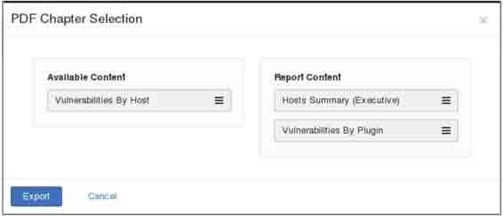
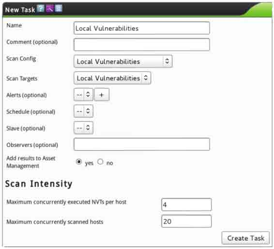

# 第五章　漏洞扫描

漏洞扫描器是一种能够自动在计算机、信息系统、网络及应用软件中寻找和发现安全弱点的程序。它通过网络对目标系统进行探测，向目标系统发生数据，并将反馈数据与自带的漏洞特征库进行匹配，进而列举目标系统上存在的安全漏洞。漏洞扫描是保证系统和网络安全必不可少的手段，面对互联网入侵，如果用户能够根据具体的应用环境，尽可能早的通过网络扫描来发现安全漏洞，并及时采取适当的处理措施进行修补，就可以有效地阻止入侵事件的发生。由于该工作相对枯燥，所以我们可以借助一些便捷的工具来实施，如 Nessus 和 OpenVAS。本章将详细讲解这两个工具的使用。

# 5.1 使用 Nessus

## 5.1 使用 Nessus

Nessus 号称是世界上最流行的漏洞扫描程序，全世界有超过 75000 个组织在使用它。该工具提供完整的电脑漏洞扫描服务，并随时更新其漏洞数据库。Nessus 不同于传统的漏洞扫描软件，Nessus 可同时在本机或远端上遥控，进行系统的漏洞分析扫描。Nessus 也是渗透测试重要工具之一。所以，本章将介绍安装、配置并启动 Nessus。

### 5.1.1 安装和配置 Nessus

为了定位在目标系统上的漏洞，Nessus 依赖 feeds 的格式实现漏洞检查。Nessus 官网提供了两种版本：家庭版和专业版。

*   家庭版：家庭版是供非商业性或个人使用。家庭版比较适合个人使用，可以用于非专业的环境。
*   专业版：专业版是供商业性使用。它包括支持或附加功能，如无线并发连接等。

本小节使用 Nessus 的家庭版来介绍它的安装。具体操作步骤如下所示。

（1）下载 Nessus 软件包。Nessus 的官方下载地址是[`www.tenable.com/products/`](http://www.tenable.com/products/) nessus/select-your-operating-system。在浏览器中输入该地址，将显示如图 5.1 所示的界面。


图 5.1 Nessus 下载界面

（2）在该界面左侧的 Download Nessus 下，单击 Linux，并选择下载 Nessus-5.2.6- debian6_i386.deb 包，如图 5.2 所示。


图 5.2 下载 Linux 系统的 Nessus

（3）单击 Nessus-5.2.6-debian6_i386.deb 包后，将显示如图 5.3 所示的界面。


图 5.3 接收许可证

（4）在该界面单击 Agree 按钮，将开始下载。然后将下载的包，保存到自己想要保存的位置。

（5）下载完 Nessus 软件包，现在就可以来安装该工具。执行命令如下所示：

```
root@kali:~# dpkg -i Nessus-5.2.6-debian6_i386.deb
Selecting previously unselected package nessus.
(正在读取数据库 … 系统当前共安装有 276380 个文件和目录。)
正在解压缩 nessus (从 Nessus-5.2.6-debian6_i386.deb) …
正在设置 nessus (5.2.6) …
nessusd (Nessus) 5.2.6 [build N25116] for Linux
Copyright (C) 1998 - 2014 Tenable Network Security, Inc

Processing the Nessus plugins…
[##################################################]

All plugins loaded

 - You can start nessusd by typing /etc/init.d/nessusd start
 - Then go to https://kali:8834/ to configure your scanner 
```

看到以上类似的输出信息，表示 Nessus 软件包安装成功。Nessus 默认将被安装在/opt/nessus 目录中。

（6）启动 Nessus。执行命令如下所示：

```
root@kali:~# /etc/init.d/nessusd start
$Starting Nessus : . 
```

从输出的信息中可以看到 Nessus 服务已经启动。

注意：使用 Nessus 之前，必须有一个注册码。关于获取激活码的方法在第二章已经介绍过，这里就不再赘述。

（7）激活 Nessus。执行命令如下所示：

```
root@Kali:~# /opt/nessus/bin/nessus-fetch --register 9CC8-19A0-01A7-D4C1- 4521 
```

（8）为 Nessus 创建一个用户。执行命令如下所示：

```
root@Kali:~# /opt/nessus/sbin/nessus-adduser 
```

（9）登录 Nessus。在浏览器中输入地址[`主机 IP:8834 或 https://主机名:8834。`](https://主机 IP:8834 或 https://主机名:8834。)

通过以上步骤的详细介绍，Nessus 就配置好了，现在就可以使用 Nessus 扫描各种的漏洞。使用 Nessus 扫描漏洞之前需要新建扫描策略和扫描任务，为了后面能顺利的扫描各种漏洞，接下来将介绍新建策略和扫描任务的方法。

1\. 添加策略

添加策略的具体操作步骤如下所示。

（1）登录 Nessus。Nessus 是一个安全链接，所以需要添加信任后才允许登录。在浏览器地址栏中输入[`192.168.41.234:8834/，将显示如图 5.4 所示的界面。`](https://192.168.41.234:8834/，将显示如图 5.4 所示的界面。)


图 5.4 连接不被信任

（2）在该界面单击 I Understand the Risks 按钮，将显示如图 5.5 所示的界面。


图 5.5 了解风险

（3）该界面显示了所存在的风险，单击 Add Exception 按钮，将显示如图 5.6 所示的界面。


图 5.6 添加安全例外

（4）在该界面单击 Confirm Security Exception 按钮，将显示如图 5.7 所示的界面。


图 5.7 Nessus 登录界面

（5）在该界面输入前面创建的用户名和密码，然后单击 Sign In 按钮，将显示如图 5.8 所示的界面。


图 5.8 Nessus 主界面

（6）在该界面使用鼠标切换到 Policies 选项卡上，将显示如图 5.9 所示的界面。


图 5.9 策略界面

（7）在该界面单击 New Policy 按钮，将显示如图 5.10 所示的界面。


图 5.10 策略向导

（8）该界面选择创建策略类型。Nessus 默认支持 10 种策略类型，在策略类型上有绿色条的表示订阅。这里选择 Advanced Policy 类型，单击该图标后，将显示如图 5.11 所示的界面。


图 5.11 新建策略

（9）在该界面设置策略名、可见性和描述信息（可选项）。这里设置策略名为 Local VulnerabilityAssessment、可见性为 private。然后单击左侧的 Plugins 标签，将显示如图 5.12 所示的界面。在图 5.11 中 Visibility 有两个选项。


图 5.12 插件程序

*   private：仅自己能使用该策略扫描。
*   shared：其他用户也能使用该策略扫描。

（10）该界面显示了所有插件程序，默认全部是启动的。在该界面可以单击 Disable All 按钮，禁用所有启动的插件程序。然后指定需要启动的插件程序，如启动 Debian Local Security Checks 和 Default Unix Accounts 插件程序，启动后如图 5.13 所示。


图 5.13 启动的插件程序

（11）在该界面单击 Save 按钮，将显示如图 5.14 所示的界面。


图 5.14 新建的策略

（12）从该界面可以看到新建的策略 Local Vulnerability Assessment，表示该策略已创建成功。

2\. 新建扫描任务

策略创建成功后，必须要新建扫描任务才能实现漏洞扫描。下面将介绍新建扫描任务的具体操作步骤。

（1）在图 5.14 中，将鼠标切换到 Scans 选项卡上，将显示如图 5.15 所示的界面。


图 5.15 扫描任务界面

（2）从该界面可以看到当前没有任何扫描任务，所以需要添加扫描任务后才能扫描。在该界面单击 New Scan 按钮，将显示如图 5.16 所示。


图 5.16 新建扫描任务

（3）在该界面设置扫描任务名称、使用策略、文件夹和扫描的目标。这里分别设置为 Sample Scan、Local Vulnerability Assessment（前面新建的策略）、My Scans 和 192.168.41.0/24。然后单击 Launch 按钮，将显示如图 5.17 所示的界面。


图 5.17 运行扫描任务

（4）从该界面可以看到扫描任务的状态为 Running（正在运行），表示 Sample Scan 扫描任务添加成功。如果想要停止扫描，可以单击（停止一下）按钮。如果暂停扫描任务，单击按钮。

### 5.1.2 扫描本地漏洞

在前面介绍了 Nessus 的安装、配置、登录及新建策略和扫描任务，现在可以开始第一次测试组的安全漏洞。对于新建策略和扫描任务这里就不再赘述，本小节中只列出扫描本地漏洞所需添加的插件程序及分析扫描信息。

【实例 5-1】扫描本地漏洞具体操作步骤如下所示。

（1）新建名为 Local Vulnerability Assessment 策略。

（2）添加所需的插件程序。

*   Ubuntu Local Security Checks：扫描本地 Ubuntu 安全检查。
*   Default Unix Accounts：扫描默认 Unix 账户。

（3）新建名为 Sample Scan 扫描任务。

（4）扫描漏洞。扫描任务执行完成后，将显示如图 5.18 所示的界面。


图 5.18 扫描完成

（5）在该界面双击扫描任务名称 Sample Scan，将显示扫描的详细信息，如图 5.19 所示。


图 5.19 扫描的详细信息

（6）从该界面可以看到总共扫描了三台主机。扫描主机的漏洞情况，可以查看 Vulnerability 列，该列中的数字表示扫描到的信息数。右侧显示了扫描的详细信息，如扫描任务名称、状态、策略、目标主机和时间等。右下角以圆形图显示了漏洞的危险情况，分别使用不同颜色显示漏洞的严重性。本机几乎没任何漏洞，所以显示是蓝色（Info）。关于漏洞的信息使用在该界面可以单击 Host 列中的任何一个地址，显示该主机的详细信息，包括 IP 地址、操作系统类型、扫描的起始时间和结束时间等。本例中选择 192.168.41.234 地址，如图 5.20 所示。


图 5.20 漏洞信息

（7）在该界面单击 INFO 按钮，将显示具体的漏洞信息，如图 5.21 所示。


图 5.21 漏洞详细信息

（8）该界面显示了漏洞的描述信息及扫描到的信息。例如，该主机上开启了 68、8834 和 15774 等端口。使用 Nessus 还可以通过导出文件的方式查看漏洞信息，导出的文件格式包括 Nessus、PDF、HTML、CSV 和 Nessus DB。导出文件的方式如下所示：

在图 5.20 中单击 Export 按钮，选择导出文件的格式。这里选择 PDF 格式，单击 PDF 命令，将显示如图 5.22 所示的界面。


图 5.22 可用的内容

（9）该界面分为两部分，包括 Available Content（可用的内容）和 Report Content（报告内容）。该界面显示了导出的 PDF 文件中可包括的内容有主机摘要信息、主机漏洞和插件漏洞。在图 5.22 中将要导出的内容用鼠标拖到 Report Content 框中，拖入内容后将显示如图 5.23 所示的界面。



图 5.23 导出的内容

（10）在该界面显示了将要导出的内容。此时单击 Export 按钮，将显示如图 5.24 所示的界面。


图 5.24 下载界面

（11）在该界面单击 Save File 按钮，指定该文件的保存位置，即 PDF 文件导出成功。

### 5.1.3 扫描网络漏洞

如果用户想要使用 Nessus 攻击一个大范围的漏洞，需要配置评估漏洞列表并指定获取信息的评估列表。本小节将介绍配置 Nessus 在目标主机寻找网络漏洞，这些漏洞指目标主机或其他网络协议。

【实例 5-2】扫描网络漏洞的具体操作步骤如下所示。

（1）新建名为 Internal Network Scan 策略。

（2）添加所需的插件程序，如表 5-1 所示。

表 5-1 所需插件程序

| CISCO | 扫描 CISCO 系统 |
| --- | --- |
| DNS | 扫描 DNS 服务器 |
| Default Unix Accounts | 扫描本地默认用户账户和密码 |
| FTP | 扫描 FTP 服务器 |
| Firewalls | 扫描代理防火墙 |
| Gain a shell remotely | 扫描远程获取的 Shell |
| Geeral | 扫描常用的服务 |
| Netware | 扫描网络操作系统 |
| Peer-To-Peer File Sharing | 扫描共享文件检测 |
| Policy Compliance | 扫描 PCI DSS 和 SCAP 信息 |
| SCADA | 扫描设置管理工具 |
| SMTP Problems | 扫描 SMTP 问题 |
| SNMP | 扫描 SNMP 相关信息 |
| Service Detection | 扫描服务侦察 |
| Settings | 扫描基本设置 |

（3）新建名为 Network Scan 扫描任务。

（4）扫描结果如图 5.25 所示。


图 5.25 网络扫描结果

（5）从该界面可以看到有两个比较严重的漏洞。如果想要详细地分析该漏洞，建议将该信息使用文件的形式导出。

### 5.1.4 扫描指定 Linux 的系统漏洞

本小节将介绍使用 Nessus 扫描指定 Linux 系统上的漏洞。

【实例 5-3】扫描指定 Linux 系统漏洞的具体操作步骤如下所示。

（1）使用 Metasploitable 2.0 作为目标主机。用户也可以使用其他版本的 Linux 系统。

（2）新建名为 Linux Vulnerability Scan 策略。

（3）添加所需的插件程序，如表 5-2 所示。

表 5-2 所需插件程序

| Backdoors | 扫描秘密信息 |
| --- | --- |
| Brute Force Attacks | 暴力攻击 |
| CentOSo Local Security Checks | 扫描 CentOS 系统的本地安全漏洞 |
| DNS | 扫描 DNS 服务器 |
| Debian Local Security Checks | 扫描 Debian 系统的本地安全漏洞 |
| Default Unix Accounts | 扫描默认 Unix 用户账号 |
| Denial of Service | 扫描拒绝的服务 |
| FTP | 扫描 FTP 服务器 |
| Fedora Local Security Checks | 扫描 Fedora 系统的本地安全漏洞 |
| Firewalls | 扫描防火墙 |
| FreeBSD Local Security Checks | 扫描 FreeBSD 系统的本地安全漏洞 |
| Gain a shell remotely | 扫描远程获得的 Shell |
| General | 扫描漏洞 |
| Gentoo Local Security Checks | 扫描 Gentoo 系统的本地安全漏洞 |
| HP-UX Local Security Checks | 扫描 HP-UX 系统的本地安全漏洞 |
| Mandriva Local Security Checks | 扫描 Mandriva 系统的本地安全漏洞 |
| Misc | 扫描复杂的漏洞 |
| Red Hat Local Security Checks | 扫描 Red Hat 系统的本地安全漏洞 |
| SMTP Porblems | 扫描 SMTP 问题 |
| SNMP | 扫描 SNMP 漏洞 |
| Scientific Linux Local Security Checks | 扫描 Scientific Linux 系统的本地安全漏洞 |
| Slackware Local Security Checks | 扫描 Slackware 系统的本地安全漏洞 |
| Solaris Local Security Checks | 扫描 Solaris 系统的本地安全漏洞 |
| SuSE Local Security Checks | 扫描 SuSE 系统的本地安全漏洞 |
| Ubuntu Local Security Checks | 扫描 Ubuntu 系统的本地安全漏洞 |
| Web Servers | 扫描 Web 服务器 |

（4）新建名为 Linux Vulnerability Scan 扫描任务。

（5）扫描漏洞，扫描结果如图 5.26 所示。


图 5.26 指定 Linux 系统扫描结果

（6）从该界面可以看到总共扫描了 6 台主机上的漏洞信息。其中，主机 192.168.41.142 上存在 7 个比较严重的漏洞。关于漏洞的百分比情况，可以从右下角的扇形图中了解到。同样，用户可以使用前面介绍过的两种方法，查看漏洞的详细信息。

### 5.1.5 扫描指定 Windows 的系统漏洞

本节将介绍使用 Nessus 扫描指定 Windows 系统上的漏洞。

【实例 5-4】使用 Nessus 扫描指定 Windows 系统漏洞。本例中使用 Windows 7 系统作为目标主机。具体扫描步骤如下所示。

（1）新建名为 Windows Vulnerability Scan 策略。

（2）添加所需的插件程序，如表 5-3 所示。

表 5-3 所需插件程序

| DNS | 扫描 DNS 服务器 |
| --- | --- |
| Databases | 扫描数据库 |
| Denial of Service | 扫描拒绝的服务 |
| FTP | 扫描 FTP 服务器 |
| SMTP Problems | 扫描 SMTP 问题 |
| SNMP | 扫描 SNMP |
| Settings | 扫描设置信息 |
| Web Servers | 扫描 Web Servers |
| Windows | 扫描 Windows |
| Windows:Microsoft Bulletins | 扫描 Windows 中微软公告 |
| Windows:User management | 扫描 Windows 用户管理 |

（3）开始扫描漏洞。扫描结果如图 5.27 所示。


图 5.27 扫描 Windows 系统的结果

（4）从该界面可以看到主机 192.168.41.1 的漏洞情况，该主机中存在一个比较严重的漏洞。同样用户可以使用前面介绍过的两种方法查看漏洞的详细信息，进而修改主机中存在的漏洞。

# 5.2 使用 OpenVAS

## 5.2 使用 OpenVAS

OpenVAS（开放式漏洞评估系统）是一个客户端/服务器架构，它常用来评估目标主机上的漏洞。OpenVAS 是 Nessus 项目的一个分支，它提供的产品是完全地免费。OpenVAS 默认安装在标准的 Kali Linux 上，本节将介绍配置及启动 OpenVAS。

### 5.2.1 配置 OpenVAS

OpenVAS 默认在 Kali Linux 中已经安装。如果要使用该工具，还需要进行一些配置。配置 OpenVAS 具体操作步骤如下所示。

（1）在终端窗口中切换到 OpenVAS 目录，为 OpenVAS 程序创建 SSL 证书。执行命令如下所示：

```
root@kali:~# cd /usr/share/openvas/
root@kali:/usr/share/openvas# openvas-mkcert 
```

执行以上命令后，将输出如下所示的信息：


以上提示的信息，可以配置也可以不配置。如果不想配置的话，直接按下 Enter 键接收默认值即可。以上信息设置完后，将显示以下信息：

```
-----------------------------------------------
  Creation of the OpenVAS SSL Certificate
-----------------------------------------------
Congratulations. Your server certificate was properly created.
The following files were created:
. Certification authority:
   Certificate = /var/lib/openvas/CA/cacert.pem
   Private key = /var/lib/openvas/private/CA/cakey.pem
. OpenVAS Server :
   Certificate = /var/lib/openvas/CA/servercert.pem
   Private key = /var/lib/openvas/private/CA/serverkey.pem
Press [ENTER] to exit 
```

输出的信息显示了创建的 OpenVAS 证书及位置。此时按下 Enter 键，退出程序。

（2）使用 OpenVAS NVT Feed 同步 OpenVAS NVT 数据库，并且更新最新的漏洞检查。执行命令如下所示：

```
root@kali:/usr/share/openvas# openvas-nvt-sync
[i] This script synchronizes an NVT collection with the 'OpenVAS NVT Feed'.
[i] The 'OpenVAS NVT Feed' is provided by 'The OpenVAS Project'.
[i] Online information about this feed: 'http://www.openvas.org/openvas-nvt-feed.html'.
[i] NVT dir: /var/lib/openvas/plugins
[i] rsync is not recommended for the initial sync. Falling back on http.
[i] Will use wget
[i] Using GNU wget: /usr/bin/wget
[i] Configured NVT http feed: http://www.openvas.org/openvas-nvt-feed-current.tar.bz2
[i] Downloading to: /tmp/openvas-nvt-sync.xAKyyzYVdT/openvas-feed-2014-04-25-8214.tar.bz2
--2014-04-25 14:35:48-- http://www.openvas.org/openvas-nvt-feed-current.tar.bz2
正在解析主机 www.openvas.org (www.openvas.org)… 5.9.98.186
正在连接 www.openvas.org (www.openvas.org)|5.9.98.186|:80… 已连接。
已发出 HTTP 请求，正在等待回应… 200 OK
长度：14771061 (14M) [application/x-bzip2]
正在保存至:“/tmp/openvas-nvt-sync.xAKyyzYVdT/openvas-feed-2014-04-25-8214.tar.bz2”
100%[===============================================================>] 14,771,061 54.0K/s 用时 7m 16s
2014-04-25 14:43:07 (33.1 KB/s) - 已保存“/tmp/openvas-nvt-sync.xAKyyzYVdT/openvas- feed-
2014-04-25-8214.tar.bz2” [14771061/14771061])

12planet_chat_server_xss.nasl
12planet_chat_server_xss.nasl.asc
2013/
2013/secpod_ms13-005.nasl.asc
2013/gb_astium_voip_pbx_51273.nasl
2013/secpod_ms13-001.nasl
2013/deb_2597.nasl
2013/gb_astium_voip_pbx_51273.nasl.asc
2013/secpod_ms13-006.nasl
2013/gb_edirectory_57038.nasl
2013/secpod_ms13-006.nasl.asc
…省略部分内容…
zope_zclass.nasl.asc
zyxel_http_pwd.nasl
zyxel_http_pwd.nasl.asc
zyxel_pwd.nasl
zyxel_pwd.nasl.asc
[i] Download complete
[i] Checking dir: ok
[i] Checking MD5 checksum: ok 
```

输出的信息显示了同步 OpenVAS NVT 数据库的信息，并也更新了所有的漏洞信息。

（3）创建客户端证书库。执行命令如下所示：

```
root@kali:/usr/share/openvas# openvas-mkcert-client -n om -i
Generating RSA private key, 1024 bit long modulus
………………………………++++++
……++++++
e is 65537 (0x10001)
You are about to be asked to enter information that will be incorporated
into your certificate request.
What you are about to enter is what is called a Distinguished Name or a DN.
There are quite a few fields but you can leave some blank
For some fields there will be a default value,
If you enter '.', the field will be left blank.
-----
Country Name (2 letter code) [DE]:State or Province Name (full name) [Some-State]:Locality Name (eg, city) []:Organization Name (eg, company) [Internet Widgits Pty Ltd]:Organizational Unit Name (eg, section) []:Common Name (eg, your name or your server's hostname) []:Email Address []:Using configuration from /tmp/openvas-mkcert-client.16792/stdC.cnf
Check that the request matches the signature
Signature ok
The Subject's Distinguished Name is as follows
countryName    :PRINTABLE:'DE'
localityName   :PRINTABLE:'Berlin'
commonName     :PRINTABLE:'om'
Certificate is to be certified until Apr 25 06:55:05 2015 GMT (365 days)
Write out database with 1 new entries
Data Base Updated
User om added to OpenVAS. 
```

以上输出的信息显示了生成客户端证书的详细过程，并添加了 om 用户。

（4）重建数据库。执行命令如下所示：

```
root@kali:/usr/share/openvas# openvasmd –rebuild 
```

执行以上命令后，没有任何输出信息。

（5）启动 OpenVAS 扫描，并加载所有插件。执行命令如下所示：

```
root@kali:/usr/share/openvas# openvassd
Loading the OpenVAS plugins…base gpgme-Message: Setting GnuPG homedir to '/etc/openvas/ gnupg'
base gpgme-Message: Using OpenPGP engine version '1.4.12'
All plugins loaded 
```

从输出的信息中可以看到所有插件已加载。由于加载的插件比较多，所以执行该命令的时间会长一点。

（6）重建并创建数据库的备份。执行命令如下所示：

```
root@kali:/usr/share/openvas# openvasmd --rebuild
root@kali:/usr/share/openvas# openvasmd –backup 
```

执行以上命令后，没有任何信息输出。

（7）创建一个管理 OpenVAS 的用户。执行命令如下所示：

```
root@kali:/usr/share/openvas# openvasad -c 'add_user' -n openvasadmin -r Admin
Enter password:
ad  main:MESSAGE:2732:2014-04-25 15h25.35 CST: No rules file provided, the new user will have no restrictions.
ad  main:MESSAGE:2732:2014-04-25 15h25.35 CST: User openvasadmin has been successfully created. 
```

从输出的信息中可以看到用户 openvasadmin 被成功创建。

（8）创建一个普通用户。执行命令如下所示：


从输出的信息中看到用户被添加。

（9）为 OpenVAS 配置端口。执行命令如下所示：

```
root@kali:/usr/share/openvas# openvasmd -p 9390 -a 127.0.0.1
root@kali:/usr/share/openvas# openvasad -a 127.0.0.1 -p 9393
root@kali:/usr/share/openvas# gsad --http-only --listen=127.0.0.1 -p 9392 
```

执行以上命令后，OpenVAS 的端口号就被设置为 9392。

注意：9392 是推荐的一个 Web 浏览器端口。用户也可以选择其他端口号。

（10）在浏览器中输入[`127.0.0.1:9392/，打开 OpenVAS 登录界面，如图 5.28 所示。`](http://127.0.0.1:9392/，打开 OpenVAS 登录界面，如图 5.28 所示。)


图 5.28 OpenVAS 登录界面

（11）在该界面输入创建的用户名和密码，然后单击 Login 按钮，将显示如图 5.29 所示的界面。


图 5.29 OpenVAS 初始界面

关于启动 OpenVAS 介绍一些附加信息。每次运行 OpenVAS 时，都必须要做以下工作：

*   同步 NVT Feed（当新的漏洞被发现时，该记录将改变）；
*   启动 OpenVAS 扫描器；
*   重建数据库；
*   备份数据库；
*   配置端口。

为了节约时间，下面将介绍编写一个简单的 Bash 脚本，方便用户启动 OpenVAS。保存脚本文件名为 OpenVAS.sh，并放该文件在/root 文件夹中。脚本文件内容如下所示：

```
#!/bin/bash
openvas-nvt-sync
openvassd
openvasmd --rebuild
openvasmd --backup
openvasmd -p 9390 -a 127.0.0.1
openvasad -a 127.0.0.1 -p 9393
gsad --http-only --listen=127.0.0.1 -p 9392 
```

编写好该脚本时，以后运行 OpenVAS 就不用执行多条命令了，只需要执行一下 OpenVAS.sh 脚本就可以了。

在 Kali 中，OpenVAS 也提供了图形界面。启动 OpenVAS 图形界面的方法如下：

在 Kali 桌面上依次选择“应用程 序”|Kali Linux|“漏洞分析”|OpenVAS| openvas-gsd 命令，将显示如图 5.30 所示的界面。


图 5.30 OpenVAS 图形登录界面

在该界面输入服务器的地址 127.0.0.1、用户名和登录密码。然后单击 Log in 按钮即可登录到 OpenVAS 服务器。

### 5.2.2 创建 Scan Config 和扫描任务

通过以上步骤 OpenVAS 就配置好了，现在使用浏览器的方式登录服务器。在该服务器中新建 Scan Config、创建扫描目标及新建扫描任务才可以进行各种漏洞扫描。设置好这些信息用户就可以进行各种漏洞扫描了，如本地漏洞扫描、网络漏洞扫描和指定操作系统漏洞扫描等。进行这些漏洞扫描之前，都必须要创建 Scan Config 和扫描任务等。这里将分别介绍这些配置，方便后面的使用。

1\. 新建 Scan Config

新建 Scan Config 的具体操作步骤如下所示。

（1）在服务器的菜单栏中依次选择 Configuration|Scan Configs 命令，如图 5.31 所示。单击 Scan Configs 命令后，将显示如图 5.32 所示的界面。


图 5.31 Scan Configs


图 5.32 Scan Configs 界面

（2）从该界面可以看到默认总共有 5 个 Scan Config。在该界面单击（New Scan Config）图标，将显示如图 5.33 所示的界面。


图 5.33 New Scan Config

（3）在该界面设置扫描的名称，这里设置为 Local Vulnerabilities。对于 Base 选择 Empty，static and fast 复选框，该选项允许用户从零开始并创建自己的配置。然后单击 Create Scan Config 按钮，将会看到新建的配置，如图 5.34 所示。


图 5.34 新建的 Local Vulnerabilities

（4）从该界面可以看到新建的 Local Vulnerabilities，要编辑该配置可以单击（Edit Scan Config）图标。创建好 Scan Config 后需选择扫描的内容。此时单击图标选择扫描的内容，如图 5.35 所示。


图 5.35 选择扫描内容

（5）从该界面的 Family 栏看到有很多的可扫描信息，此时将 Select all NVT's 栏中的复选框勾选上即可，设置完后，单击 Save Config 按钮。图 5.35 是经过修改后的一个图，该界面显示的内容较多，由于篇幅的原因，这里只截取了一部分。

2\. 新建目标

在服务器的菜单栏中依次选择 Configuration|Targets 命令，将显示如图 5.36 所示的 界面。


图 5.36 Targets 界面

在该界面单击（New Target）图标，将显示如图 5.37 所示的界面。


图 5.37 新建 Target 界面

在该界面输入 Target 名称及扫描的主机。然后单击 Create Target 按钮，将显示如图 5.38 所示的界面。


图 5.38 新建的目标

从该界面可以看到新建的 Local Vulnerabilities 目标。

3\. 新建任务

在 OpenVAS 的菜单栏中依次选择 Scan Management|New Task 命令，将显示如图 5.39 所示的界面。



图 5.39 新建任务

在该界面设置任务名称、Scan Config 和 Scan Targets，然后单击 Create Task 按钮，将显示如图 5.40 所示的界面。


图 5.40 新建的任务

在该界面单击（Start）图标，将开始漏洞扫描。当启动该扫描任务后，按钮将变为（Pause），单击该按钮可以暂停扫描，也可以单击（Stop）停止扫描。

### 5.2.3 扫描本地漏洞

OpenVAS 允许用户大范围扫描漏洞，并且将限制在用户的评估列表中。目标主机的漏洞指定是从评估中获得的信息。本小节将介绍使用 OpenVAS 来扫描用户指定本地目标系统上的漏洞。扫描本地漏洞的具体操作步骤如下所示。

（1）新建名为 Local Vulnerabilities 的 Scan Config。

（2）添加扫描的类型，所需扫描类型如表 5-4 所示。

表 5-4 扫描的类型

| Compliance | 扫描 Compliance 漏洞 |
| --- | --- |
| Default Accounts | 扫描默认账号漏洞 |
| Denial of Service | 扫描拒绝服务漏洞 |
| FTP | 扫描 FTP 服务器漏洞 |
| Ubuntu Local Security Checks | 扫描 Ubuntu 系统的本地安全漏洞 |

（3）创建目标系统。

（4）创建名为 Local Vulnerabilities 扫描任务。

（5）扫描完本地漏洞的显示界面如图 5.41 所示。


图 5.41 扫描漏洞完成

（6）在该界面单击（Task Details）图标，查看漏洞扫描的详细信息。显示界面如图 5.42 所示。


图 5.42 扫描的详细信息

（7）该界面显示了两个窗口，分别是任务详细信息和本地漏洞扫描报告信息。用户从报告信息中可以了解本地系统是否有漏洞。在该界面单击 Actions 栏下的（Details）图标可以查看详细情况。单击该图标后，将显示如图 5.43 所示的界面。


图 5.43 报告摘要

（8）在该界面显示了所有信息，这些信息可以通过单击（Download）图标下载扫描报告。

### 5.2.4 扫描网络漏洞

本小节将介绍使用 OpenVAS 扫描一个网络漏洞。这些漏洞的信息是指一个目标网络中某个设备的信息。本小节中将 Windows XP、Windows 7、Metasploitable 2.0 和 Linux 系统作为目标测试系统。扫描网络漏洞的具体操作步骤如下所示。

（1）新建名为 Network Vulnerability 的 Scan Config。

（2）添加所需扫描的类型，如表 5-5 所示。

表 5-5 扫描类型

| Brute force attacks | 暴力攻击 |
| --- | --- |
| Buffer overflow | 扫描缓存溢出漏洞 |
| CISCO | 扫描 CISCO 路由器 |
| Compliance | 扫描 Compliance 漏洞 |
| Databases | 扫描数据库漏洞 |
| Default Accounts | 扫描默认账号漏洞 |
| Denial of Service | 扫描拒绝服务漏洞 |
| FTP | 扫描 FTP 服务器漏洞 |
| Finger abuses | 扫描 Finger 滥用漏洞 |
| Firewalls | 扫描防火墙漏洞 |
| Gain a shell remotelly | 扫描获取远程 Shell 的漏洞 |
| General | 扫描漏洞 |
| Malware | 扫描恶意软件 |
| Netware | 扫描网络操作系统 |
| NMAP NSE | 扫描 NMAP NSE 漏洞 |
| Peer-To-Peer File Sharing | 扫描共享文件漏洞 |
| Port Scanners | 扫描端口漏洞 |
| Privilege Escalation | 扫描提升特权漏洞 |
| Product Detection | 扫描产品侦察 |
| RPC | 扫描 RPC 漏洞 |
| Remote File Access | 扫描远程文件访问漏洞 |
| SMTP Problems | 扫描 SMTP 问题 |
| SNMP | 扫描 SNMP 漏洞 |
| Service detection | 扫描服务侦察 |
| Settings | 扫描基本设置漏洞 |

（3）创建名为 Network Vulnerability 目标系统。

（4）创建名为 Network Scan 扫描任务。

（5）扫描结果，如图 5.44 所示。


图 5.44 Network 扫描结果

（6）从该界面可以看到整个网络中漏洞的情况不太严重，漏洞状态为 Medium。查看详细漏洞扫描情况的方法在前面已经介绍，这里就不再赘述。

### 5.2.5 扫描指定 Linux 系统漏洞

本小节将介绍使用 OpenVAS 扫描指定 Linux 系统的漏洞。这些漏洞信息来自在一个目标网络中指定的 Linux 系统。推荐使用的目标 Linux 系统为 Metasploitable 2.0 和其他任何版本 Linux。扫描指定 Linux 系统漏洞的具体操作步骤如下所示。

（1）新建名为 Linux Vulnerabilities 的 Scan Config。

（2）添加所需的扫描类型，如表 5-6 所示。

表 5-6 扫描的类型

| Brute force attacks | 暴力攻击 |
| --- | --- |
| Buffer overflow | 扫描缓存溢出漏洞 |
| Compliance | 扫描 Compliance 漏洞 |
| Databases | 扫描数据库漏洞 |
| Default Accounts | 扫描默认用户账号漏洞 |
| Denial of Service | 扫描拒绝服务的漏洞 |
| FTP | 扫描 FTP 服务器漏洞 |
| Finger abuses | 扫描 Finger 滥用漏洞 |
| Gain a shell remotely | 扫描获取远程 Shell 漏洞 |
| General | 扫描 General 漏洞 |
| Malware | 扫描恶意软件漏洞 |
| Netware | 扫描网络操作系统 |
| NMAP NSE | 扫描 NMAP NSE 漏洞 |
| Port Scanners | 扫描端口漏洞 |
| Privilege Escalation | 扫描提升特权漏洞 |
| Product Detection | 扫描产品侦察漏洞 |
| RPC | 扫描 RPC 漏洞 |
| Remote File Access | 扫描远程文件访问漏洞 |
| SMTP Porblems | 扫描 SMTP 问题 |
| SNMP | 扫描 SNMP 漏洞 |
| Service detection | 扫描服务侦察漏洞 |
| Settings | 扫描基本设置漏洞 |
| Web Servers | 扫描 Web 服务漏洞 |

（3）创建 Linux Vulnerabilities 目标系统。

（4）创建 Linux Scan 扫描任务。

（5）扫描结果，如图 5.45 所示。


图 5.45 Linux 扫描结果

（6）从该界面可以看到目标系统中有非常严重的漏洞。此时单击（Task Details）图标，查看漏洞扫描的详细信息，如图 5.46 所示。


图 5.46 Task Details

（7）从该界面的扫描报告中可以看到有 14 个非常严重的漏洞信息。在该界面的 Actions 中单击（Details）图标查看具体漏洞情况，如图 5.47 所示。


图 5.47 漏洞消息

（8）该界面显示的信息很多，由于篇幅的原因，这里只截取了其中一个较严重的漏洞。从该界面可以看到 192.168.41.142 目标主机上存在非常严重的漏洞。漏洞信息包括目标主机所开发的端口、OID 和解决方法等。关于漏洞的报告可以使用前面介绍过的方法进行下载。

### 5.2.6 扫描指定 Windows 系统漏洞

本小节将介绍使用 OpenVAS 扫描指定 Windows 系统漏洞。这些漏洞信息来自在一个目标网络内指定的 Windows 目标系统。这里推荐的目标系统为 Windows XP 和 Windows 7。

使用 OpenVAS 扫描指定 Windows 系统漏洞的具体操作步骤如下所示。

（1）新建名为 Windows Vulnerabilities 的 Scan Config。

（2）添加所需的扫描类型，如表 5-7 所示。

表 5-7 扫描的类型

| Brute force attacks | 暴力攻击 |
| --- | --- |
| Buffer overflow | 扫描缓存溢出漏洞 |
| Compliance | 扫描 Compliance 漏洞 |
| Databases | 扫描数据库漏洞 |
| Default Accounts | 扫描默认用户账号漏洞 |
| Denial of Service | 扫描拒绝服务漏洞 |
| FTP | 扫描 FTP 服务器漏洞 |
| Gain a shell remotely | 扫描获取远程 Shell 的漏洞 |
| General | 扫描 General 漏洞 |
| Malware | 扫描网络操作系统漏洞 |
| NMAP NSE | 扫描 NMAP NSE 漏洞 |
| Port Scanners | 扫描端口漏洞 |
| Privilege Escalation | 扫描提升特权漏洞 |
| Product Detection | 扫描产品侦察漏洞 |
| RPC | 扫描 RPC 漏洞 |
| Remote File Access | 扫描远程文件访问漏洞 |
| SMTP Problems | 扫描 SMTP 问题漏洞 |
| SNMP | 扫描 SNMP 漏洞 |
| Service detection | 扫描服务侦察漏洞 |
| Web Servers | 扫描 Web 服务漏洞 |
| Windows | 扫描 Windows 系统漏洞 |
| Windows:Microsoft Bulletins | 扫描 Windows 系统微软公告漏洞 |

（3）创建名为 Windows Vulnerabilities 目标系统。

（4）创建名为 Windows Scan 扫描任务。

（5）扫描完成后，结果如图 5.48 所示。


图 5.48 扫描结果

（6）从该界面可以看到 Windows Scan 扫描已完成，漏洞情况为 Medium。可以在该界面单击（Task Details）图标查看详细信息，如图 5.49 所示。


图 5.49 Task Details

（7）从该界面可以了解扫描任务的设置及扫描报告信息，如扫描完成的时间、漏洞情况及日志。如果想查看更详细的报告，使用前面介绍过的方法下载扫描报告。