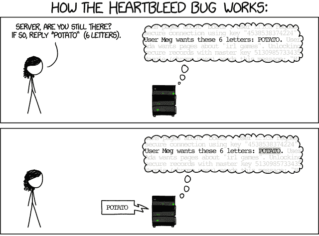
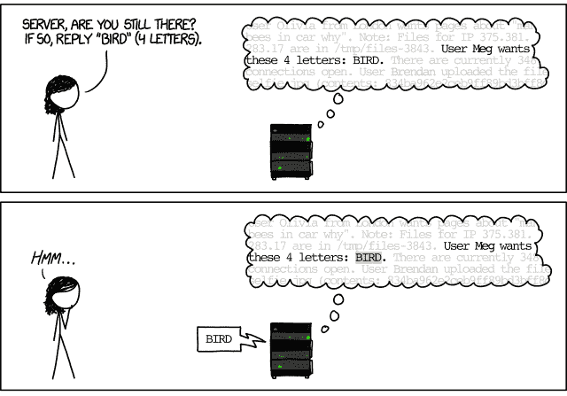
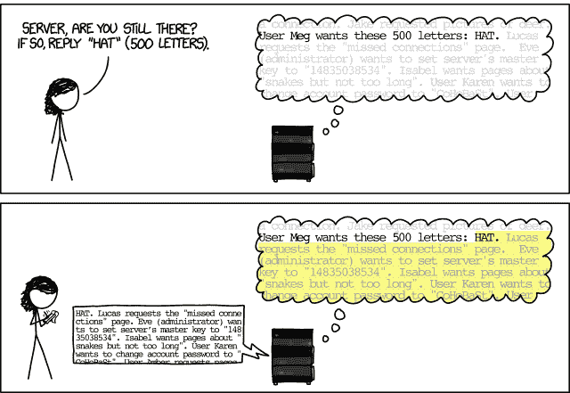

# 模糊测试：使用随机输入破坏事物

> 原文：[`www.fuzzingbook.org/html/Fuzzer.html`](http://www.fuzzingbook.org/html/Fuzzer.html)

在本章中，我们将从最简单的测试生成技术开始。随机文本生成的关键思想，也称为 *模糊测试*，是将 *随机字符序列* 输入到程序中，希望揭示故障。

```py
from [bookutils](https://github.com/uds-se/fuzzingbook//tree/master/notebooks/shared/bookutils) import YouTubeVideo
YouTubeVideo('YjO1pIx7wS4') 
```

**先决条件**

+   你应该了解软件测试的基础知识；例如，从章节 "软件测试简介"。

+   你应该对 Python 有一定的了解；例如，从 [Python 教程](https://docs.python.org/3/tutorial/)。

我们可以明确这些先决条件。首先，我们将导入一个在笔记本中工作的标准包。

```py
import [bookutils.setup](https://github.com/uds-se/fuzzingbook//tree/master/notebooks/shared/bookutils) 
```

```py
from [typing](https://docs.python.org/3/library/typing.html) import Dict, Tuple, Union, List, Any 
```

现在，我们显式导入（因此需要）前面的章节。

```py
import Intro_Testing 
```

## 摘要

要 使用本章提供的代码，请编写

```py
>>> from fuzzingbook.Fuzzer import <identifier> 
```

然后利用以下功能。

本章提供了两个重要的类，在 模糊测试架构 中介绍：

+   `Fuzzer` 作为模糊器的基类；并且

+   `Runner` 作为测试程序的基础类。

### 模糊器

`Fuzzer` 是模糊器的基类，`RandomFuzzer` 是一个简单的实例化。`Fuzzer` 对象的 `fuzz()` 方法返回一个包含生成输入的字符串。

```py
>>> random_fuzzer = RandomFuzzer()
>>> random_fuzzer.fuzz()
'%$<1&<%+=!"83?+)9:++9138 42/ "7;0-,)06 "1(2;6>?99$%7!!*#96=>2&-/(5*)=$;0$$+;<12"?30&' 
```

`RandomFuzzer()` 构造函数允许一系列关键字参数：

```py
>>> print(RandomFuzzer.__init__.__doc__)
Produce strings of `min_length` to `max_length` characters
           in the range [`char_start`, `char_start` + `char_range`)

>>> random_fuzzer = RandomFuzzer(min_length=10, max_length=20, char_start=65, char_range=26)
>>> random_fuzzer.fuzz()
'XGZVDDPZOOW' 
```

<svg width="254pt" height="191pt" viewBox="0.00 0.00 254.12 190.50" xmlns:xlink="http://www.w3.org/1999/xlink"><g id="graph0" class="graph" transform="scale(1 1) rotate(0) translate(4 186.5)"><g id="node1" class="node"><title>RandomFuzzer</title> <g id="a_node1"><a xlink:href="#" xlink:title="class RandomFuzzer:

生成随机输入。"><text text-anchor="start" x="8" y="-43.7" font-family="Patua One, Helvetica, sans-serif" font-weight="bold" font-size="14.00" fill="#b03a2e">RandomFuzzer</text> <g id="a_node1_0"><a xlink:href="#" xlink:title="RandomFuzzer"><g id="a_node1_1"><a xlink:href="#" xlink:title="__init__(self, min_length: int = 10, max_length: int = 100, char_start: int = 32, char_range: int = 32) -> None:

生成 `min_length` 到 `max_length` 个字符的字符串

在范围 `[char_start`, `char_start` + `char_range`)"><text text-anchor="start" x="24.5" y="-21.5" font-family="'Fira Mono', 'Source Code Pro', 'Courier', monospace" font-weight="bold" font-style="italic" font-size="10.00">__init__()</text></a></g> <g id="a_node1_2"><a xlink:href="#" xlink:title="fuzz(self) -> str:

返回模糊输入"><text text-anchor="start" x="24.5" y="-8.75" font-family="'Fira Mono', 'Source Code Pro', 'Courier', monospace" font-weight="bold" font-style="italic" font-size="10.00">fuzz()</text></a></g></a></g></a></g></g> <g id="node2" class="node"><title>Fuzzer</title> <g id="a_node2"><a xlink:href="#" xlink:title="class Fuzzer:

模糊器的基类。</text></a></g> <g id="a_node2_3"><a xlink:href="#" xlink:title="Fuzzer"><g id="a_node2_4"><a xlink:href="#" xlink:title="__init__(self) -> None:

构造函数</text></a></g> <g id="a_node2_5"><a xlink:href="#" xlink:title="fuzz(self) -> str:

返回模糊输入</text></a></g> <g id="a_node2_6"><a xlink:href="#" xlink:title="run(self, runner: Runner = <Runner object>) -> Tuple[subprocess.CompletedProcess, str]:

使用模糊输入运行 `runner`，`run()` 函数</text></a></g> <g id="a_node2_7"><a xlink:href="#" xlink:title="runs(self, runner: Runner = <PrintRunner object>, trials: int = 10) -> List[Tuple[subprocess.CompletedProcess, str]]:

使用模糊输入运行 `runner`，`trials` 次数</text></a></g></a></g></a></g></g> <g id="edge1" class="edge"><title>RandomFuzzer->Fuzzer</title></g> <g id="node3" class="node"><title>图例</title> <text text-anchor="start" x="126.88" y="-46.25" font-family="Patua One, Helvetica, sans-serif" font-weight="bold" font-size="10.00" fill="#b03a2e">图例</text> <text text-anchor="start" x="126.88" y="-36.25" font-family="Patua One, Helvetica, sans-serif" font-size="10.00">• </text> <text text-anchor="start" x="132.88" y="-36.25" font-family="'Fira Mono', 'Source Code Pro', 'Courier', monospace" font-weight="bold" font-size="8.00">public_method()</text> <text text-anchor="start" x="126.88" y="-26.25" font-family="Patua One, Helvetica, sans-serif" font-size="10.00">• </text> <text text-anchor="start" x="132.88" y="-26.25" font-family="'Fira Mono', 'Source Code Pro', 'Courier', monospace" font-size="8.00">private_method()</text> <text text-anchor="start" x="126.88" y="-16.25" font-family="Patua One, Helvetica, sans-serif" font-size="10.00">• </text> <text text-anchor="start" x="132.88" y="-16.25" font-family="'Fira Mono', 'Source Code Pro', 'Courier', monospace" font-style="italic" font-size="8.00">overloaded_method()</text> <text text-anchor="start" x="126.88" y="-7.2" font-family="Helvetica,sans-Serif" font-size="9.00">将鼠标悬停在名称上以查看文档</text></g></g></svg>

### 运行器

一个 `Fuzzer` 可以与一个 `Runner` 配对，该 `Runner` 将模糊字符串作为输入。其结果是特定类的 *状态* 和 *结果* (`PASS`, `FAIL`, 或 `UNRESOLVED`)。一个 `PrintRunner` 将简单地打印出给定的输入并返回一个 `PASS` 结果：

```py
>>> print_runner = PrintRunner()
>>> random_fuzzer.run(print_runner)
EQYGAXPTVPJGTYHXFJ

('EQYGAXPTVPJGTYHXFJ', 'UNRESOLVED') 
```

一个 `ProgramRunner` 将生成的输入传递给外部程序。其结果是程序状态（`CompletedProcess` 实例）和 *结果* (`PASS`, `FAIL`, 或 `UNRESOLVED`) 的一个对：

```py
>>> cat = ProgramRunner('cat')
>>> random_fuzzer.run(cat)
(CompletedProcess(args='cat', returncode=0, stdout='BZOQTXFBTEOVYX', stderr=''),
 'PASS') 
```

<svg width="371pt" height="224pt" viewBox="0.00 0.00 371.12 224.00" xmlns:xlink="http://www.w3.org/1999/xlink"><g id="graph0" class="graph" transform="scale(1 1) rotate(0) translate(4 220)"><g id="node1" class="node"><title>程序运行器</title> <g id="a_node1"><a xlink:href="#" xlink:title="class ProgramRunner:

使用输入测试程序。"><text text-anchor="start" x="8" y="-56.45" font-family="Patua One, Helvetica, sans-serif" font-weight="bold" font-size="14.00" fill="#b03a2e">程序运行器</text> <g id="a_node1_0"><a xlink:href="#" xlink:title="程序运行器"><g id="a_node1_1"><a xlink:href="#" xlink:title="__init__(self, program: Union[str, List[str]]) -> None:

初始化。

`program` 是传递给 `subprocess.run()` 的程序规范"><text text-anchor="start" x="18.5" y="-34.25" font-family="'Fira Mono', 'Source Code Pro', 'Courier', monospace" font-weight="bold" font-style="italic" font-size="10.00">__init__()</text></a></g> <g id="a_node1_2"><a xlink:href="#" xlink:title="run(self, inp: str = '') -> Tuple[subprocess.CompletedProcess, str]:

使用 `inp` 作为输入运行程序。

根据 `subprocess.run()` 的结果返回测试结果。"><text text-anchor="start" x="18.5" y="-21.5" font-family="'Fira Mono', 'Source Code Pro', 'Courier', monospace" font-weight="bold" font-style="italic" font-size="10.00">run()</text></a></g> <g id="a_node1_3"><a xlink:href="#" xlink:title="run_process(self, inp: str = '') -> subprocess.CompletedProcess:

使用 `inp` 作为输入运行程序。

返回 `subprocess.run()` 的结果。"><text text-anchor="start" x="18.5" y="-7.75" font-family="'Fira Mono', 'Source Code Pro', 'Courier', monospace" font-size="10.00">run_process()</text></a></g></a></g></a></g></g> <g id="node2" class="node"><title>运行器</title> <g id="a_node2"><a xlink:href="#" xlink:title="class Runner:

测试输入的基类。"><text text-anchor="start" x="95.62" y="-199.2" font-family="Patua One, Helvetica, sans-serif" font-weight="bold" font-size="14.00" fill="#b03a2e">运行者</text> <g id="a_node2_4"><a xlink:href="#" xlink:title="运行者"><g id="a_node2_5"><a xlink:href="#" xlink:title="FAIL = 'FAIL'"><text text-anchor="start" x="88.5" y="-176" font-family="'Fira Mono', 'Source Code Pro', 'Courier', monospace" font-size="10.00">FAIL</text></a></g> <g id="a_node2_6"><a xlink:href="#" xlink:title="PASS = 'PASS'"><text text-anchor="start" x="88.5" y="-163.25" font-family="'Fira Mono', 'Source Code Pro', 'Courier', monospace" font-size="10.00">PASS</text></a></g> <g id="a_node2_7"><a xlink:href="#" xlink:title="UNRESOLVED = 'UNRESOLVED'"><text text-anchor="start" x="88.5" y="-150.5" font-family="'Fira Mono', 'Source Code Pro', 'Courier', monospace" font-size="10.00">UNRESOLVED</text></a></g></a></g> <g id="a_node2_8"><a xlink:href="#" xlink:title="运行者"><g id="a_node2_9"><a xlink:href="#" xlink:title="__init__(self) -> None:

初始化"><text text-anchor="start" x="88.5" y="-130.75" font-family="'Fira Mono', 'Source Code Pro', 'Courier', monospace" font-weight="bold" font-style="italic" font-size="10.00">__init__()</text></a></g> <g id="a_node2_10"><a xlink:href="#" xlink:title="run(self, inp: str) -> Any:

使用给定输入运行运行者"><text text-anchor="start" x="88.5" y="-118" font-family="'Fira Mono', 'Source Code Pro', 'Courier', monospace" font-weight="bold" font-style="italic" font-size="10.00">run()</text></a></g></a></g></a></g></g> <g id="edge1" class="edge"><title>程序运行者->运行者</title></g> <g id="node3" class="node"><title>打印运行者</title> <g id="a_node3"><a xlink:href="#" xlink:title="class 打印运行者:

简单的运行者，打印输入。"><text text-anchor="start" x="141.25" y="-43.7" font-family="Patua One, Helvetica, sans-serif" font-weight="bold" font-size="14.00" fill="#b03a2e">打印运行者</text> <g id="a_node3_11"><a xlink:href="#" xlink:title="打印运行者"><g id="a_node3_12"><a xlink:href="#" xlink:title="run(self, inp) -> Any:

打印给定输入"><text text-anchor="start" x="164.5" y="-21.5" font-family="'Fira Mono', 'Source Code Pro', 'Courier', monospace" font-weight="bold" font-style="italic" font-size="10.00">run()</text></a></g></a></g></a></g></g> <g id="edge2" class="edge"><title>PrintRunner->Runner</title></g> <g id="node4" class="node"><title>图例</title> <text text-anchor="start" x="243.88" y="-52.62" font-family="Patua One, Helvetica, sans-serif" font-weight="bold" font-size="10.00" fill="#b03a2e">图例</text> <text text-anchor="start" x="243.88" y="-42.62" font-family="Patua One, Helvetica, sans-serif" font-size="10.00">• </text> <text text-anchor="start" x="249.88" y="-42.62" font-family="'Fira Mono', 'Source Code Pro', 'Courier', monospace" font-weight="bold" font-size="8.00">public_method()</text> <text text-anchor="start" x="243.88" y="-32.62" font-family="Patua One, Helvetica, sans-serif" font-size="10.00">• </text> <text text-anchor="start" x="249.88" y="-32.62" font-family="'Fira Mono', 'Source Code Pro', 'Courier', monospace" font-size="8.00">private_method()</text> <text text-anchor="start" x="243.88" y="-22.62" font-family="Patua One, Helvetica, sans-serif" font-size="10.00">• </text> <text text-anchor="start" x="249.88" y="-22.62" font-family="'Fira Mono', 'Source Code Pro', 'Courier', monospace" font-style="italic" font-size="8.00">overloaded_method()</text> <text text-anchor="start" x="243.88" y="-13.57" font-family="Helvetica,sans-Serif" font-size="9.00">将鼠标悬停在名称上以查看文档</text></g></g></svg>

## 测试作业

模糊测试诞生于“1988 年秋一个黑暗且暴风雨的夜晚”[[Takanen 等人，2008](http://us.artechhouse.com/Fuzzing-for-Software-Security-Testing-and-Quality-Assurance-Second-Edition-P1930.aspx)]。当时，巴顿·米勒教授坐在威斯康星州麦迪逊的公寓里，通过一条 1200 波特电话线连接到他的大学电脑。雷暴导致线路产生噪音，而这种噪音反过来又导致两端 UNIX 命令接收到了错误的输入——从而导致崩溃。频繁的崩溃让他感到惊讶——难道程序应该比这更健壮吗？作为一名科学家，他想要调查问题的范围及其原因。因此，他为威斯康星大学麦迪逊分校的学生们设计了一个*编程练习*——一个让学生们创建第一个模糊测试器的练习。

这就是[作业](http://pages.cs.wisc.edu/~bart/fuzz/CS736-Projects-f1988.pdf)的内容：

> 本项目的目标是评估各种 UNIX 实用程序的鲁棒性，给定一个不可预测的输入流。[...] 首先，你将构建一个*模糊生成器*。这是一个会输出随机字符流的程序。其次，你将使用模糊生成器攻击尽可能多的 UNIX 实用程序，目标是尝试使它们崩溃。

这项作业捕捉了模糊测试的精髓：*创建随机输入，看看它们是否会导致系统崩溃。* 只需运行足够长的时间，你就会看到结果。

## 一个简单的模糊器

让我们尝试完成这个任务并构建一个模糊生成器。想法是产生随机字符，将它们添加到缓冲字符串变量（`out`）中，最后返回字符串。

此实现使用了以下 Python 特性和函数：

+   `random.randrange(start, end)` – 返回一个随机数 $[$ `start`, `end` $)$

+   `range(start, end)` – 创建一个整数范围 $[$ `start`, `end` $)$ 的迭代器（可以用作列表）。

+   `for elem in list: body` – 在循环中执行 `body`，其中 `elem` 从 `list` 中取每个值。

+   `for i in range(start, end): body` – 在循环中执行 `body`，其中 `i` 从 `start` 到 `end` $-$ 1。

+   `chr(n)` – 返回 ASCII 码为 `n` 的字符

要使用随机数，我们必须导入相应的模块。

```py
import [random](https://docs.python.org/3/library/random.html) 
```

现在是实际的 `fuzzer()` 函数。

```py
def fuzzer(max_length: int = 100, char_start: int = 32, char_range: int = 32) -> str:
  """A string of up to `max_length` characters
 in the range [`char_start`, `char_start` + `char_range`)"""
    string_length = random.randrange(0, max_length + 1)
    out = ""
    for i in range(0, string_length):
        out += chr(random.randrange(char_start, char_start + char_range))
    return out 
```

使用默认参数，`fuzzer()` 函数返回一个随机字符的字符串：

```py
fuzzer() 
```

```py
'!7#%"*#0=)$;%6*;>638:*>80"=</>(/*:-(2<4 !:5*6856&?""11<7+%<%7,4.8,*+&,,$,."'

```

巴特·米勒（Bart Miller）将“模糊”一词用作此类随机、无结构数据的名称。现在想象一下，这个“模糊”字符串是期望特定输入格式的程序的输入——比如说，逗号分隔的值列表，或者一个电子邮件地址。程序能否无任何问题地处理这种输入？

如果上述模糊输入已经很有趣，那么考虑一下，模糊可以轻松地设置来产生其他类型的输入。例如，我们也可以让 `fuzzer()` 产生一系列小写字母。我们使用 `ord(c)` 来返回字符 `c` 的 ASCII 码。

```py
fuzzer(1000, ord('a'), 26) 
```

```py
'zskscocrxllosagkvaszlngpysurezehvcqcghygphnhonehczraznkibltfmocxddoxcmrvatcleysksodzlwmzdndoxrjfqigjhqjxkblyrtoaydlwwisrvxtxsejhfbnforvlfisojqaktcxpmjqsfsycisoexjctydzxzzutukdztxvdpqbjuqmsectwjvylvbixzfmqiabdnihqagsvlyxwxxconminadcaqjdzcnzfjlwccyudmdfceiepwvyggepjxoeqaqbjzvmjdlebxqvehkmlevoofjlilegieeihmetjappbisqgrjhglzgffqrdqcwfmmwqecxlqfpvgtvcddvmwkplmwadgiyckrfjddxnegvmxravaunzwhpfpyzuyyavwwtgykwfszasvlbwojetvcygectelwkputfczgsfsbclnkzzcjfywitooygjwqujseflqyvqgyzpvknddzemkegrjjrshbouqxcmixnqhgsgdwgzwzmgzfajymbcfezqxndbmzwnxjeevgtpjtcwgbzptozflrwvuopohbvpmpaifnyyfvbzzdsdlznusarkmmtazptbjbqdkrsnrpgdffemnpehoapiiudokczwrvpsonybfpaeyorrgjdmgvkvupdtkrequicexqkoikygepawmwsdcrhivoegynnhodfhryeqbebtbqnwhogdfrsrksntqjbocvislhgrgchkhpaiugpbdygwkhrtyniufabdnqhtnwreiascfvmuhettfpbowbjadfxnbtzhobnxsnf'

```

假设一个程序期望接收一个标识符作为其输入。它会期望这么长的标识符吗？

```py
from [bookutils](https://github.com/uds-se/fuzzingbook//tree/master/notebooks/shared/bookutils) import quiz 
```

### 问答

哪个会产生任意长度的十进制数字字符串？

的确！最后一个才是关键：

```py
fuzzer(100, ord('0'), 10) 
```

```py
'905902398493166953126081485047020401153418590518545517740565959745145909835837'

```

## 模糊外部程序

让我们看看如果我们实际使用模糊输入调用外部程序会发生什么。为此，让我们分两步进行。首先，我们创建一个带有模糊测试数据的 *输入文件*；然后我们将这个输入文件喂给一个选择好的程序。

### 创建输入文件

让我们获取一个临时文件名，这样我们就不至于使文件系统变得杂乱。

```py
import [os](https://docs.python.org/3/library/os.html)
import [tempfile](https://docs.python.org/3/library/tempfile.html) 
```

```py
basename = "input.txt"
tempdir = tempfile.mkdtemp()
FILE = os.path.join(tempdir, basename)
print(FILE) 
```

```py
/var/folders/n2/xd9445p97rb3xh7m1dfx8_4h0006ts/T/tmp33gvbu2n/input.txt

```

我们现在可以打开这个文件进行写入。Python 的 `open()` 函数打开一个文件，然后我们可以向其中写入任意内容。它通常与 `with` 语句一起使用，这确保了文件在不再需要时立即关闭。

```py
data = fuzzer()
with open(FILE, "w") as f:
    f.write(data) 
```

我们可以通过读取其内容来验证文件是否实际创建：

```py
contents = open(FILE).read()
print(contents)
assert(contents == data) 
```

```py
<?6&" !3'7-5>18%55*,5

```

### 调用外部程序

现在我们有了输入文件，我们可以在其上调用一个程序。为了好玩，让我们测试 `bc` 计算器程序，它接受一个算术表达式并对其进行评估。

要调用 `bc`，让我们使用 Python 的 `subprocess` 模块。这是如何工作的：

```py
import [os](https://docs.python.org/3/library/os.html)
import [subprocess](https://docs.python.org/3/library/subprocess.html) 
```

```py
program = "bc"
with open(FILE, "w") as f:
    f.write("2 + 2\n")
result = subprocess.run([program, FILE],
                        stdin=subprocess.DEVNULL,
                        stdout=subprocess.PIPE,
                        stderr=subprocess.PIPE,
                        universal_newlines=True)  # Will be "text" in Python 3.7 
```

从 `result` 中，我们可以检查程序输出。在 `bc` 的情况下，这是评估算术表达式的结果：

```py
result.stdout 
```

```py
'4\n'

```

我们还可以检查状态。值为 0 表示程序正确终止。

```py
result.returncode 
```

```py
0

```

任何错误信息都会在 `results.stderr` 中可用：

```py
result.stderr 
```

```py
''

```

你可以用 `bc` 之外的任何你喜欢的程序。不过，请注意，如果你的程序能够更改或甚至损坏你的系统，那么模糊输入中包含的数据或命令可能会恰好做到这一点。

### 问答

就为了好玩，想象一下你会测试一个文件删除程序——比如说 `rm -fr FILE`，其中 `FILE` 是由 `fuzzer()` 生成的字符串。`fuzzer()`（使用默认参数）产生一个导致删除所有文件的 `FILE` 参数的概率是多少？

实际上的概率可能比你想象的要高。例如，如果你删除了 `/`（所有文件的根），那么你的整个文件系统都将消失。如果你删除了 `.`（当前文件夹），当前目录中的所有文件都将消失。

生成一个正好 1 个字符长的字符串的概率是 1/101，这是因为字符串的长度是通过调用 random.randrange(0, max_length + 1) 来确定的，其中 max_length 的默认值是 100。根据 random.randrange 的描述，它应该返回一个在 [0, 99 + 1) 区间内的随机数。因此，我们最终得到一个包含 101 个值的区间 [0, 100]。

要生成 `/` 或 `.`，你需要一个长度为 1 的字符串（概率：101 分之一）和这两个字符之一（概率：32 分之二）。

```py
1/101 * 2/32 
```

```py
0.0006188118811881188

```

上述代码块排除了删除 `~`（你的主目录）的可能性，这是因为生成字符 '~' 的概率不是 1/32；它是 0/32。字符是通过调用 chr(random.randrange(char_start, char_start + char_range)) 生成的，其中 char_start 的默认值是 32，char_range 的默认值也是 32。chr 的文档说明，“[r]eturn the string representing a character whose Unicode code point is the integer i。” '~' 的 Unicode 代码点是 126，因此不在区间 [32, 64) 内。

如果代码被修改为 char_range = 95，那么获得字符 '~' 的概率将是 1/94，因此删除所有文件的事件的概率等于 0.000332。

你主目录中的所有文件都将消失。

```py
3/94 * 1/94 * 99/101 
```

```py
0.0003327969736765437

```

然而，只要第二个字符是空格，我们实际上可以处理任何字符串——毕竟，`rm -fr / WHATEVER` 将首先处理 `/`，然后才是随后的任何内容。第一个字符的概率是 32 分之二，因为上面的代码块只允许获得 `/` 或 `.` 的概率，但不允许获得 `~`。

对于空格，概率是 32 分之一。

我们必须包括获得至少 2 个字符的概率项，这是在获得空格作为第二个字符的场景中所需的。这个概率是 99/101，因为它被计算为（1 - 获得单个字符或没有任何字符的概率），因此等于 1-(2/101)。

因此，在第二个字符有空间的情况下，删除所有文件的概率计算如下：

[获取'/'或'. '后跟空格的概率] = [获取'/'字符或'. '字符的概率] * [获取空格的概率] * [获取至少 2 个字符的概率] = 0.001914

获取至少 2 个字符的概率图。

```py
2/32 * 1/32 * 99/101 
```

```py
0.0019144492574257425

```

由于模糊测试通常运行数百万次，你真的不希望承担这种风险。请在可以随时重置的安全环境中运行你的模糊器，例如 Docker 容器。

### 长时间模糊测试

让我们现在向经过测试的程序输入大量输入，看看它是否会在某些输入上崩溃。我们将所有结果存储在`runs`变量中，作为输入数据和实际结果的配对。（注意：运行此操作可能需要一段时间。）

```py
trials = 100
program = "bc"

runs = []

for i in range(trials):
    data = fuzzer()
    with open(FILE, "w") as f:
        f.write(data)
    result = subprocess.run([program, FILE],
                            stdin=subprocess.DEVNULL,
                            stdout=subprocess.PIPE,
                            stderr=subprocess.PIPE,
                            universal_newlines=True)
    runs.append((data, result)) 
```

我们现在可以查询`runs`以获取一些统计数据。例如，我们可以查询实际通过多少次运行——也就是说，没有错误消息。这里我们使用*列表推导*：形式为*expression* `for` *element* `in` *list* `if` *condition*的列表推导返回一个评估后的*expression*列表，其中每个*element*如果条件为真则来自*list*。实际上，列表推导返回一个*列表生成器*，但就我们的目的而言，生成器表现得像列表。这里，我们让*expression*对所有满足条件的元素为 1，并使用`sum()`对列表中的所有元素进行求和。

```py
sum(1 for (data, result) in runs if result.stderr == "") 
```

```py
9

```

大多数输入显然是无效的——这并不令人惊讶，因为随机输入包含有效算术表达式的可能性不大。

让我们看看第一条错误消息：

```py
errors = [(data, result) for (data, result) in runs if result.stderr != ""]
(first_data, first_result) = errors[0]

print(repr(first_data))
print(first_result.stderr) 
```

```py
'5&8>"86,?"/7!1%5-**&-$&)$91;"21(\'8"(%$4,("(&!67%89$!.?(*(96(28$=6029:<:$(6 !-+2622(&4'

Parse error: bad character '&'
    /var/folders/n2/xd9445p97rb3xh7m1dfx8_4h0006ts/T/tmp33gvbu2n/input.txt:1

```

有没有除了`非法字符`、`解析错误`或`语法错误`之外的消息的运行？（比如`崩溃`或`你发现了一个致命的错误`？）并不多：

```py
[result.stderr for (data, result) in runs if
 result.stderr != ""
 and "illegal character" not in result.stderr
 and "parse error" not in result.stderr
 and "syntax error" not in result.stderr] 
```

```py
["\nParse error: bad character '&'\n    /var/folders/n2/xd9445p97rb3xh7m1dfx8_4h0006ts/T/tmp33gvbu2n/input.txt:1\n\n",
 '\nParse error: bad expression\n    /var/folders/n2/xd9445p97rb3xh7m1dfx8_4h0006ts/T/tmp33gvbu2n/input.txt:1\n\n',
 '\nParse error: bad expression\n    /var/folders/n2/xd9445p97rb3xh7m1dfx8_4h0006ts/T/tmp33gvbu2n/input.txt:1\n\n',
 '\nParse error: bad token\n    /var/folders/n2/xd9445p97rb3xh7m1dfx8_4h0006ts/T/tmp33gvbu2n/input.txt:1\n\n',
 '\nParse error: bad token\n    /var/folders/n2/xd9445p97rb3xh7m1dfx8_4h0006ts/T/tmp33gvbu2n/input.txt:1\n\n',
 '\nParse error: bad token\n    /var/folders/n2/xd9445p97rb3xh7m1dfx8_4h0006ts/T/tmp33gvbu2n/input.txt:1\n\n',
 '\nParse error: bad token\n    /var/folders/n2/xd9445p97rb3xh7m1dfx8_4h0006ts/T/tmp33gvbu2n/input.txt:1\n\n',
 '\nParse error: bad token\n    /var/folders/n2/xd9445p97rb3xh7m1dfx8_4h0006ts/T/tmp33gvbu2n/input.txt:1\n\n',
 '\nParse error: bad expression\n    /var/folders/n2/xd9445p97rb3xh7m1dfx8_4h0006ts/T/tmp33gvbu2n/input.txt:1\n\n',
 '\nParse error: bad token\n    /var/folders/n2/xd9445p97rb3xh7m1dfx8_4h0006ts/T/tmp33gvbu2n/input.txt:1\n\n',
 '\nParse error: bad token\n    /var/folders/n2/xd9445p97rb3xh7m1dfx8_4h0006ts/T/tmp33gvbu2n/input.txt:1\n\n',
 '\nParse error: bad expression\n    /var/folders/n2/xd9445p97rb3xh7m1dfx8_4h0006ts/T/tmp33gvbu2n/input.txt:1\n\n',
 '\nParse error: bad expression\n    /var/folders/n2/xd9445p97rb3xh7m1dfx8_4h0006ts/T/tmp33gvbu2n/input.txt:1\n\n',
 '\nParse error: bad expression\n    /var/folders/n2/xd9445p97rb3xh7m1dfx8_4h0006ts/T/tmp33gvbu2n/input.txt:1\n\n',
 '\nParse error: bad expression\n    /var/folders/n2/xd9445p97rb3xh7m1dfx8_4h0006ts/T/tmp33gvbu2n/input.txt:1\n\n',
 '\nParse error: bad token\n    /var/folders/n2/xd9445p97rb3xh7m1dfx8_4h0006ts/T/tmp33gvbu2n/input.txt:1\n\n',
 '\nParse error: bad expression\n    /var/folders/n2/xd9445p97rb3xh7m1dfx8_4h0006ts/T/tmp33gvbu2n/input.txt:1\n\n',
 "\nParse error: bad character '&'\n    /var/folders/n2/xd9445p97rb3xh7m1dfx8_4h0006ts/T/tmp33gvbu2n/input.txt:1\n\n",
 '\nParse error: bad assignment: left side must be scale, ibase, obase, seed, last, var, or array element\n    /var/folders/n2/xd9445p97rb3xh7m1dfx8_4h0006ts/T/tmp33gvbu2n/input.txt:1\n\n',
 '\nParse error: bad expression\n    /var/folders/n2/xd9445p97rb3xh7m1dfx8_4h0006ts/T/tmp33gvbu2n/input.txt:1\n\n',
 "\nParse error: bad character '?'\n    /var/folders/n2/xd9445p97rb3xh7m1dfx8_4h0006ts/T/tmp33gvbu2n/input.txt:1\n\n",
 "\nParse error: bad character '''\n    /var/folders/n2/xd9445p97rb3xh7m1dfx8_4h0006ts/T/tmp33gvbu2n/input.txt:1\n\n",
 '\nParse error: bad token\n    /var/folders/n2/xd9445p97rb3xh7m1dfx8_4h0006ts/T/tmp33gvbu2n/input.txt:1\n\n',
 "\nParse error: bad character '?'\n    /var/folders/n2/xd9445p97rb3xh7m1dfx8_4h0006ts/T/tmp33gvbu2n/input.txt:1\n\n",
 "\nParse error: bad character ':'\n    /var/folders/n2/xd9445p97rb3xh7m1dfx8_4h0006ts/T/tmp33gvbu2n/input.txt:1\n\n",
 "\nParse error: bad character '&'\n    /var/folders/n2/xd9445p97rb3xh7m1dfx8_4h0006ts/T/tmp33gvbu2n/input.txt:1\n\n",
 "\nParse error: bad character ':'\n    /var/folders/n2/xd9445p97rb3xh7m1dfx8_4h0006ts/T/tmp33gvbu2n/input.txt:1\n\n",
 '\nParse error: bad token\n    /var/folders/n2/xd9445p97rb3xh7m1dfx8_4h0006ts/T/tmp33gvbu2n/input.txt:1\n\n',
 '\nParse error: bad token\n    /var/folders/n2/xd9445p97rb3xh7m1dfx8_4h0006ts/T/tmp33gvbu2n/input.txt:1\n\n',
 '\nParse error: bad expression\n    /var/folders/n2/xd9445p97rb3xh7m1dfx8_4h0006ts/T/tmp33gvbu2n/input.txt:1\n\n',
 "\nParse error: bad character '?'\n    /var/folders/n2/xd9445p97rb3xh7m1dfx8_4h0006ts/T/tmp33gvbu2n/input.txt:1\n\n",
 '\nParse error: bad assignment: left side must be scale, ibase, obase, seed, last, var, or array element\n    /var/folders/n2/xd9445p97rb3xh7m1dfx8_4h0006ts/T/tmp33gvbu2n/input.txt:1\n\n',
 '\nParse error: bad token\n    /var/folders/n2/xd9445p97rb3xh7m1dfx8_4h0006ts/T/tmp33gvbu2n/input.txt:1\n\n',
 '\nParse error: bad expression\n    /var/folders/n2/xd9445p97rb3xh7m1dfx8_4h0006ts/T/tmp33gvbu2n/input.txt:1\n\n',
 '\nParse error: bad token\n    /var/folders/n2/xd9445p97rb3xh7m1dfx8_4h0006ts/T/tmp33gvbu2n/input.txt:1\n\n',
 "\nParse error: bad character '&'\n    /var/folders/n2/xd9445p97rb3xh7m1dfx8_4h0006ts/T/tmp33gvbu2n/input.txt:1\n\n",
 "\nParse error: bad character '''\n    /var/folders/n2/xd9445p97rb3xh7m1dfx8_4h0006ts/T/tmp33gvbu2n/input.txt:1\n\n",
 '\nParse error: bad token\n    /var/folders/n2/xd9445p97rb3xh7m1dfx8_4h0006ts/T/tmp33gvbu2n/input.txt:1\n\n',
 '\nParse error: bad expression\n    /var/folders/n2/xd9445p97rb3xh7m1dfx8_4h0006ts/T/tmp33gvbu2n/input.txt:1\n\n',
 "\nParse error: bad character '''\n    /var/folders/n2/xd9445p97rb3xh7m1dfx8_4h0006ts/T/tmp33gvbu2n/input.txt:1\n\n",
 "\nParse error: bad character '''\n    /var/folders/n2/xd9445p97rb3xh7m1dfx8_4h0006ts/T/tmp33gvbu2n/input.txt:1\n\n",
 "\nParse error: bad character '&'\n    /var/folders/n2/xd9445p97rb3xh7m1dfx8_4h0006ts/T/tmp33gvbu2n/input.txt:1\n\n",
 '\nParse error: bad token\n    /var/folders/n2/xd9445p97rb3xh7m1dfx8_4h0006ts/T/tmp33gvbu2n/input.txt:1\n\n',
 '\nParse error: bad token\n    /var/folders/n2/xd9445p97rb3xh7m1dfx8_4h0006ts/T/tmp33gvbu2n/input.txt:1\n\n',
 "\nParse error: bad character ':'\n    /var/folders/n2/xd9445p97rb3xh7m1dfx8_4h0006ts/T/tmp33gvbu2n/input.txt:1\n\n",
 "\nParse error: bad character ':'\n    /var/folders/n2/xd9445p97rb3xh7m1dfx8_4h0006ts/T/tmp33gvbu2n/input.txt:1\n\n",
 '\nParse error: bad expression\n    /var/folders/n2/xd9445p97rb3xh7m1dfx8_4h0006ts/T/tmp33gvbu2n/input.txt:1\n\n',
 '\nParse error: bad expression\n    /var/folders/n2/xd9445p97rb3xh7m1dfx8_4h0006ts/T/tmp33gvbu2n/input.txt:1\n\n',
 '\nParse error: bad token\n    /var/folders/n2/xd9445p97rb3xh7m1dfx8_4h0006ts/T/tmp33gvbu2n/input.txt:1\n\n',
 "\nParse error: bad character '&'\n    /var/folders/n2/xd9445p97rb3xh7m1dfx8_4h0006ts/T/tmp33gvbu2n/input.txt:1\n\n",
 '\nParse error: bad token\n    /var/folders/n2/xd9445p97rb3xh7m1dfx8_4h0006ts/T/tmp33gvbu2n/input.txt:1\n\n',
 '\nParse error: bad expression\n    /var/folders/n2/xd9445p97rb3xh7m1dfx8_4h0006ts/T/tmp33gvbu2n/input.txt:1\n\n',
 '\nParse error: bad expression\n    /var/folders/n2/xd9445p97rb3xh7m1dfx8_4h0006ts/T/tmp33gvbu2n/input.txt:1\n\n',
 '\nParse error: bad token\n    /var/folders/n2/xd9445p97rb3xh7m1dfx8_4h0006ts/T/tmp33gvbu2n/input.txt:1\n\n',
 '\nParse error: bad expression\n    /var/folders/n2/xd9445p97rb3xh7m1dfx8_4h0006ts/T/tmp33gvbu2n/input.txt:1\n\n',
 "\nParse error: bad character ':'\n    /var/folders/n2/xd9445p97rb3xh7m1dfx8_4h0006ts/T/tmp33gvbu2n/input.txt:1\n\n",
 "\nParse error: bad character ':'\n    /var/folders/n2/xd9445p97rb3xh7m1dfx8_4h0006ts/T/tmp33gvbu2n/input.txt:1\n\n",
 '\nParse error: bad expression\n    /var/folders/n2/xd9445p97rb3xh7m1dfx8_4h0006ts/T/tmp33gvbu2n/input.txt:1\n\n',
 '\nParse error: bad token\n    /var/folders/n2/xd9445p97rb3xh7m1dfx8_4h0006ts/T/tmp33gvbu2n/input.txt:1\n\n',
 '\nParse error: bad token\n    /var/folders/n2/xd9445p97rb3xh7m1dfx8_4h0006ts/T/tmp33gvbu2n/input.txt:1\n\n',
 '\nParse error: bad token\n    /var/folders/n2/xd9445p97rb3xh7m1dfx8_4h0006ts/T/tmp33gvbu2n/input.txt:1\n\n',
 '\nParse error: bad expression\n    /var/folders/n2/xd9445p97rb3xh7m1dfx8_4h0006ts/T/tmp33gvbu2n/input.txt:1\n\n',
 '\nParse error: bad expression\n    /var/folders/n2/xd9445p97rb3xh7m1dfx8_4h0006ts/T/tmp33gvbu2n/input.txt:1\n\n',
 "\nParse error: bad character '&'\n    /var/folders/n2/xd9445p97rb3xh7m1dfx8_4h0006ts/T/tmp33gvbu2n/input.txt:1\n\n",
 "\nParse error: bad character '&'\n    /var/folders/n2/xd9445p97rb3xh7m1dfx8_4h0006ts/T/tmp33gvbu2n/input.txt:1\n\n",
 "\nParse error: bad character '''\n    /var/folders/n2/xd9445p97rb3xh7m1dfx8_4h0006ts/T/tmp33gvbu2n/input.txt:1\n\n",
 '\nParse error: bad token\n    /var/folders/n2/xd9445p97rb3xh7m1dfx8_4h0006ts/T/tmp33gvbu2n/input.txt:1\n\n',
 '\nParse error: bad expression\n    /var/folders/n2/xd9445p97rb3xh7m1dfx8_4h0006ts/T/tmp33gvbu2n/input.txt:1\n\n',
 "\nParse error: bad character ':'\n    /var/folders/n2/xd9445p97rb3xh7m1dfx8_4h0006ts/T/tmp33gvbu2n/input.txt:1\n\n",
 '\nParse error: bad expression\n    /var/folders/n2/xd9445p97rb3xh7m1dfx8_4h0006ts/T/tmp33gvbu2n/input.txt:1\n\n',
 "\nParse error: bad character '''\n    /var/folders/n2/xd9445p97rb3xh7m1dfx8_4h0006ts/T/tmp33gvbu2n/input.txt:1\n\n",
 '\nParse error: bad expression\n    /var/folders/n2/xd9445p97rb3xh7m1dfx8_4h0006ts/T/tmp33gvbu2n/input.txt:1\n\n',
 "\nParse error: bad character ':'\n    /var/folders/n2/xd9445p97rb3xh7m1dfx8_4h0006ts/T/tmp33gvbu2n/input.txt:1\n\n",
 "\nParse error: bad character '''\n    /var/folders/n2/xd9445p97rb3xh7m1dfx8_4h0006ts/T/tmp33gvbu2n/input.txt:1\n\n",
 '\nParse error: bad token\n    /var/folders/n2/xd9445p97rb3xh7m1dfx8_4h0006ts/T/tmp33gvbu2n/input.txt:1\n\n',
 '\nParse error: bad token\n    /var/folders/n2/xd9445p97rb3xh7m1dfx8_4h0006ts/T/tmp33gvbu2n/input.txt:1\n\n',
 '\nParse error: bad token\n    /var/folders/n2/xd9445p97rb3xh7m1dfx8_4h0006ts/T/tmp33gvbu2n/input.txt:1\n\n',
 '\nParse error: bad expression\n    /var/folders/n2/xd9445p97rb3xh7m1dfx8_4h0006ts/T/tmp33gvbu2n/input.txt:1\n\n',
 '\nParse error: bad token\n    /var/folders/n2/xd9445p97rb3xh7m1dfx8_4h0006ts/T/tmp33gvbu2n/input.txt:1\n\n',
 "\nParse error: bad character '&'\n    /var/folders/n2/xd9445p97rb3xh7m1dfx8_4h0006ts/T/tmp33gvbu2n/input.txt:1\n\n",
 '\nParse error: bad token\n    /var/folders/n2/xd9445p97rb3xh7m1dfx8_4h0006ts/T/tmp33gvbu2n/input.txt:1\n\n',
 '\nParse error: bad token\n    /var/folders/n2/xd9445p97rb3xh7m1dfx8_4h0006ts/T/tmp33gvbu2n/input.txt:1\n\n',
 "\nParse error: bad character '?'\n    /var/folders/n2/xd9445p97rb3xh7m1dfx8_4h0006ts/T/tmp33gvbu2n/input.txt:1\n\n",
 '\nParse error: bad expression\n    /var/folders/n2/xd9445p97rb3xh7m1dfx8_4h0006ts/T/tmp33gvbu2n/input.txt:1\n\n',
 '\nParse error: bad expression\n    /var/folders/n2/xd9445p97rb3xh7m1dfx8_4h0006ts/T/tmp33gvbu2n/input.txt:1\n\n',
 '\nParse error: bad expression\n    /var/folders/n2/xd9445p97rb3xh7m1dfx8_4h0006ts/T/tmp33gvbu2n/input.txt:1\n\n',
 "\nParse error: bad character ':'\n    /var/folders/n2/xd9445p97rb3xh7m1dfx8_4h0006ts/T/tmp33gvbu2n/input.txt:1\n\n",
 "\nParse error: bad character '''\n    /var/folders/n2/xd9445p97rb3xh7m1dfx8_4h0006ts/T/tmp33gvbu2n/input.txt:1\n\n",
 '\nParse error: bad expression\n    /var/folders/n2/xd9445p97rb3xh7m1dfx8_4h0006ts/T/tmp33gvbu2n/input.txt:1\n\n',
 '\nParse error: bad token\n    /var/folders/n2/xd9445p97rb3xh7m1dfx8_4h0006ts/T/tmp33gvbu2n/input.txt:1\n\n',
 '\nParse error: bad token\n    /var/folders/n2/xd9445p97rb3xh7m1dfx8_4h0006ts/T/tmp33gvbu2n/input.txt:1\n\n']

```

也许`bc`崩溃就能表明崩溃。不幸的是，返回代码永远不会是非零值：

```py
sum(1 for (data, result) in runs if result.returncode != 0) 
```

```py
91

```

我们让上面的`bc`测试再运行一段时间怎么样？当它运行时，让我们看看 1989 年的技术水平。

## 模糊器发现的错误

当米勒和他的学生在 1989 年运行他们的第一个模糊器时，他们发现了一个令人震惊的结果：他们模糊测试的约**三分之一**的 UNIX 实用程序存在问题——它们在遇到模糊测试输入时崩溃、挂起或以其他方式失败[[Miller *et al*, 1990](https://doi.org/10.1145/96267.96279)]。这还包括上面的`bc`程序。（上面的`bc`是一个[现代重实现](https://git.gavinhoward.com/gavin/bc)，其作者是一位[坚定的模糊测试信仰者](https://git.gavinhoward.com/gavin/bc/src/branch/master/tests/fuzzing)！）

考虑到许多这些 UNIX 实用程序被用于也会处理网络输入的脚本中，这是一个令人担忧的结果。程序员迅速构建并运行了自己的模糊器，急忙修复报告的错误，并学会了不再信任外部输入。

米勒的模糊实验发现了什么样的问题？结果是，程序员在 1990 年犯的错误今天仍在犯。

### 缓冲区溢出

许多程序为输入和输入元素内置了最大长度。在 C 语言等语言中，很容易超出这些长度，而程序（或程序员）甚至没有注意到，从而触发所谓的**缓冲区溢出**。例如，以下代码会愉快地将`input`字符串复制到`weekday`字符串中，即使`input`有超过八个字符：

```py
char  weekday[9];  // 8 characters + trailing '\0' terminator
strcpy  (weekday,  input); 
```

具有讽刺意味的是，如果`input`是`"Wednesday"`（9 个字符），这已经失败了；任何多余的字符（在这里是`'y'`和随后的字符串终止符`'\0'`）都会简单地复制到`weekday`之后的内存中，从而触发任意行为；也许是一些布尔字符变量，它会被从`'n'`设置为`'y'`。使用模糊测试，很容易产生任意长度的输入和输入元素。

我们可以很容易地在 Python 函数中模拟这种缓冲区溢出行为：

```py
def crash_if_too_long(s):
    buffer = "Thursday"
    if len(s) > len(buffer):
        raise ValueError 
```

并且，它很快就崩溃了。

```py
from ExpectError import ExpectError 
```

```py
trials = 100
with ExpectError():
    for i in range(trials):
        s = fuzzer()
        crash_if_too_long(s) 
```

```py
Traceback (most recent call last):
  File "/var/folders/n2/xd9445p97rb3xh7m1dfx8_4h0006ts/T/ipykernel_1932/292568387.py", line 5, in <module>
    crash_if_too_long(s)
  File "/var/folders/n2/xd9445p97rb3xh7m1dfx8_4h0006ts/T/ipykernel_1932/2784561514.py", line 4, in crash_if_too_long
    raise ValueError
ValueError (expected)

```

上述代码中的`with ExpectError()`行确保打印错误信息，但执行继续；这是为了将这种“预期”错误与其他代码示例中的“意外”错误区分开来。

### 缺少错误检查

许多编程语言没有异常，而是在异常情况下通过函数返回特殊的**错误代码**。例如，C 函数`getchar()`通常从标准输入返回一个字符；如果没有更多的输入，它返回特殊值`EOF`（文件结束）。现在假设程序员正在扫描输入以查找下一个字符，使用`getchar()`读取字符，直到读取到空格字符：

```py
while  (getchar()  !=  ' '); 
```

如果输入提前结束，这在模糊测试中是完全可行的，会发生什么？嗯，`getchar()`返回`EOF`，并且在再次调用时继续返回`EOF`；因此，上述代码简单地进入了一个无限循环。

再次，我们可以模拟这种缺少错误检查。以下是一个函数，如果没有空格出现在输入中，它将有效地挂起：

```py
def hang_if_no_space(s):
    i = 0
    while True:
        if i < len(s):
            if s[i] == ' ':
                break
        i += 1 
```

使用我们测试介绍中的超时机制，我们可以在一段时间后中断此函数。是的，它会在几次模糊测试输入后挂起。

```py
from ExpectError import ExpectTimeout 
```

```py
trials = 100
with ExpectTimeout(2):
    for i in range(trials):
        s = fuzzer()
        hang_if_no_space(s) 
```

```py
Traceback (most recent call last):
  File "/var/folders/n2/xd9445p97rb3xh7m1dfx8_4h0006ts/T/ipykernel_1932/3194687366.py", line 5, in <module>
    hang_if_no_space(s)
  File "/var/folders/n2/xd9445p97rb3xh7m1dfx8_4h0006ts/T/ipykernel_1932/3035466707.py", line 3, in hang_if_no_space
    while True:
          ^^^^
  File "Timeout.ipynb", line 43, in timeout_handler
    raise TimeoutError()
TimeoutError (expected)

```

上述代码中的`with ExpectTimeout()`行确保在两秒后中断封装代码的执行，并打印错误信息。

### 恶意数字

使用模糊测试，很容易在输入中生成**不常见的值**，导致各种有趣的行为。考虑以下代码，再次在 C 语言中，它首先从输入中读取缓冲区大小，然后分配给定大小的缓冲区：

```py
char  *read_input()  {
  size_t  size  =  read_buffer_size();
  char  *buffer  =  (char  *)malloc(size);
  // fill buffer
  return  (buffer);
} 
```

如果`size`非常大，超过了程序内存，会发生什么？如果`size`小于后续字符的数量，会发生什么？如果`size`是负数，会发生什么？通过在这里提供一个随机数，模糊测试可以造成各种损害。

再次，我们可以很容易地在 Python 中模拟这种恶意数字。函数`collapse_if_too_large()`如果传递的值（一个字符串）在转换为整数后太大，就会失败。

```py
def collapse_if_too_large(s):
    if int(s) > 1000:
        raise ValueError 
```

我们可以让`fuzzer()`创建一个数字字符串：

```py
long_number = fuzzer(100, ord('0'), 10)
print(long_number) 
```

```py
7056414967099541967374507745748918952640135045

```

如果我们将这样的数字输入到`collapse_if_too_large()`中，它很快就会失败。

```py
with ExpectError():
    collapse_if_too_large(long_number) 
```

```py
Traceback (most recent call last):
  File "/var/folders/n2/xd9445p97rb3xh7m1dfx8_4h0006ts/T/ipykernel_1932/2775103647.py", line 2, in <module>
    collapse_if_too_large(long_number)
  File "/var/folders/n2/xd9445p97rb3xh7m1dfx8_4h0006ts/T/ipykernel_1932/1591744602.py", line 3, in collapse_if_too_large
    raise ValueError
ValueError (expected)

```

如果我们真的想在系统上分配这么多内存，那么像上面那样快速失败实际上是一个更好的选择。在现实中，内存耗尽可能会极大地减慢系统的速度，甚至到它们完全无响应的程度——而重启是唯一的选择。

有些人可能会认为这些都是编程不良或编程语言不良的问题。但是，每天都有成千上万的人开始编程，他们一次又一次地犯同样的错误，即使是在今天。

## 捕捉错误

当 Miller 和他的学生们构建他们的第一个模糊测试器时，他们可以简单地通过程序崩溃或挂起来识别错误——这两种情况都很容易识别。但如果失败更加微妙，我们就需要想出额外的检查方法。

### 通用检查器

如上文所述，缓冲区溢出是更一般问题的一个特例：在 C 和 C++等语言中，程序可以访问其内存的任意部分——甚至包括那些未初始化、已释放或根本不属于你试图访问的数据结构的部分。如果你想要编写操作系统，这可能是必要的；如果你想要最大化的性能或控制，这将是很好的；但如果你想要避免错误，这将是相当糟糕的。幸运的是，有一些工具可以帮助在运行时捕捉这类问题，而且当与模糊测试结合使用时，它们是非常棒的。

#### 检查内存访问

为了在测试中捕捉到有问题的内存访问，可以在特殊的*内存检查*环境中运行 C 程序；在运行时，这些环境会检查每个内存操作是否访问了有效的已初始化内存。一个流行的例子是[LLVM Address Sanitizer](https://clang.llvm.org/docs/AddressSanitizer.html)，它可以检测一系列潜在的内存安全违规。在下面的例子中，我们将使用这个工具编译一个相当简单的 C 程序，并通过读取已分配内存部分之外的数据来引发越界读取。

```py
with open("program.c", "w") as f:
    f.write("""
#include <stdlib.h>
#include <string.h>

int main(int argc, char** argv) {
 /* Create an array with 100 bytes, initialized with 42 */
 char *buf = malloc(100);
 memset(buf, 42, 100);

 /* Read the N-th element, with N being the first command-line argument */
 int index = atoi(argv[1]);
 char val = buf[index];

 /* Clean up memory so we don't leak */
 free(buf);
 return val;
}
 """) 
```

```py
from [bookutils](https://github.com/uds-se/fuzzingbook//tree/master/notebooks/shared/bookutils) import print_file 
```

```py
print_file("program.c") 
```

```py
#include  <stdlib.h>
#include  <string.h>

int  main(int  argc,  char**  argv)  {
  /* Create an array with 100 bytes, initialized with 42 */
  char  *buf  =  malloc(100);
  memset(buf,  42,  100);

  /* Read the N-th element, with N being the first command-line argument */
  int  index  =  atoi(argv[1]);
  char  val  =  buf[index];

  /* Clean up memory so we don't leak */
  free(buf);
  return  val;
}

```

我们启用地址清理功能来编译这个 C 程序：

```py
!clang  -fsanitize=address  -g  -o  program  program.c 
```

如果我们用`99`作为参数运行程序，它将返回`buf[99]`，其值为 42。

```py
!./program  99;  echo  $? 
```

```py
program(2097,0x1ff330240) malloc: nano zone abandoned due to inability to reserve vm space.
42

```

然而，访问`buf[110]`在 AddressSanitizer 中会导致越界错误。

```py
!./program  110 
```

```py
program(2132,0x1ff330240) malloc: nano zone abandoned due to inability to reserve vm space.
=================================================================
==2132==ERROR: AddressSanitizer: heap-buffer-overflow on address 0x60b0000000ae at pc 0x000104927e84 bp 0x00016b4daa50 sp 0x00016b4daa48 READ of size 1 at 0x60b0000000ae thread T0
    #0 0x104927e80 in main program.c:12
    #1 0x1956d0270  (<unknown module>)

0x60b0000000ae is located 10 bytes after 100-byte region [0x60b000000040,0x60b0000000a4) allocated by thread T0 here:
    #0 0x104e58c04 in malloc+0x94 (libclang_rt.asan_osx_dynamic.dylib:arm64e+0x54c04)
    #1 0x104927dc8 in main program.c:7
    #2 0x1956d0270  (<unknown module>)

SUMMARY: AddressSanitizer: heap-buffer-overflow program.c:12 in main
Shadow bytes around the buggy address:
  0x60affffffe00: 00 00 00 00 00 00 00 00 00 00 00 00 00 00 00 00
  0x60affffffe80: 00 00 00 00 00 00 00 00 00 00 00 00 00 00 00 00
  0x60afffffff00: 00 00 00 00 00 00 00 00 00 00 00 00 00 00 00 00
  0x60afffffff80: 00 00 00 00 00 00 00 00 00 00 00 00 00 00 00 00
  0x60b000000000: fa fa fa fa fa fa fa fa 00 00 00 00 00 00 00 00
=>0x60b000000080: 00 00 00 00 04[fa]fa fa fa fa fa fa fa fa fa fa
  0x60b000000100: fa fa fa fa fa fa fa fa fa fa fa fa fa fa fa fa
  0x60b000000180: fa fa fa fa fa fa fa fa fa fa fa fa fa fa fa fa
  0x60b000000200: fa fa fa fa fa fa fa fa fa fa fa fa fa fa fa fa
  0x60b000000280: fa fa fa fa fa fa fa fa fa fa fa fa fa fa fa fa
  0x60b000000300: fa fa fa fa fa fa fa fa fa fa fa fa fa fa fa fa
Shadow byte legend (one shadow byte represents 8 application bytes):
  Addressable:           00
  Partially addressable: 01 02 03 04 05 06 07 
  Heap left redzone:       fa
  Freed heap region:       fd
  Stack left redzone:      f1
  Stack mid redzone:       f2
  Stack right redzone:     f3
  Stack after return:      f5
  Stack use after scope:   f8
  Global redzone:          f9
  Global init order:       f6
  Poisoned by user:        f7
  Container overflow:      fc
  Array cookie:            ac
  Intra object redzone:    bb
  ASan internal:           fe
  Left alloca redzone:     ca
  Right alloca redzone:    cb
==2132==ABORTING

```

如果你想要在 C 程序中找到错误，开启模糊测试的这些检查相对容易。这将根据工具的不同而减慢执行速度（对于 AddressSanitizer 来说，通常是 2 倍）并消耗更多的内存，但与找到这些错误所需的人力相比，CPU 周期是非常便宜的。

越界访问内存是一个巨大的安全风险，因为它们可能让攻击者访问或甚至修改本不应该被他们访问的信息。以一个著名的例子，[HeartBleed 漏洞](https://en.wikipedia.org/wiki/Heartbleed)是 OpenSSL 库中的一个安全漏洞，该库实现了提供计算机网络上通信安全的加密协议。（如果你在浏览器中阅读这篇文章，它很可能是使用这些协议加密的。）

HeartBleed 漏洞是通过向 SSL *心跳*服务发送一个特别定制的命令而被利用的。心跳服务用于检查另一端的服务器是否仍然存活。客户端会向服务发送一个类似

```py
BIRD (4 letters)
```

服务器会回复`BIRD`，客户端就会知道服务器是活着的。

不幸的是，这个服务可以通过要求服务器回复比请求的字母集更多的内容来被利用。这一点在这[XKCD 漫画](https://xkcd.com/1354/)中解释得很好：







在 OpenSSL 实现中，这些内存内容可能包括加密证书、私钥等等——更糟糕的是，没有人会注意到这些内存刚刚被访问过。当 HeartBleed 漏洞被发现时，它已经存在了多年，没有人会知道是否以及哪些秘密已经泄露；快速建立的[HeartBleed 公告页面](http://heartbleed.com/)说了这一切。

但 HeartBleed 是如何被发现的呢？非常简单。Codenomicon 公司和谷歌的研究人员都使用内存清理器编译了 OpenSSL 库，然后愉快地向它发送了模糊命令。内存清理器会注意到是否发生了越界内存访问——实际上，它会非常快地发现这一点。

内存检查器只是可以在模糊测试期间运行的许多检查器之一。在关于挖掘函数规范的章节中，我们将学习更多关于如何定义通用检查器的方法。

我们已经完成了`program`，所以我们需要清理：

```py
!rm  -fr  program  program.* 
```

#### 信息泄露

信息泄露不仅可能通过非法内存访问发生；它们也可能在“有效”内存中发生——如果这个“有效”内存包含敏感信息，这些信息不应该泄露出去。让我们用一个 Python 程序来阐述这个问题。首先，让我们创建一些填充了实际数据和随机数据的程序内存：

```py
secrets = ("<space for reply>" + fuzzer(100) +
           "<secret-certificate>" + fuzzer(100) +
           "<secret-key>" + fuzzer(100) + "<other-secrets>") 
```

我们向`secrets`中添加更多的“记忆”字符，用`"deadbeef"`作为未初始化内存的标记：

```py
uninitialized_memory_marker = "deadbeef"
while len(secrets) < 2048:
    secrets += uninitialized_memory_marker 
```

我们定义了一个服务（类似于上面讨论的心跳服务），它会接收一个要发送回的回复以及一个长度。它会将待发送的回复存储在内存中，然后以给定的长度发送它回。

```py
def heartbeat(reply: str, length: int, memory: str) -> str:
    # Store reply in memory
    memory = reply + memory[len(reply):]

    # Send back heartbeat
    s = ""
    for i in range(length):
        s += memory[i]
    return s 
```

这对于标准字符串工作得很好：

```py
heartbeat("potato", 6, memory=secrets) 
```

```py
'potato'

```

```py
heartbeat("bird", 4, memory=secrets) 
```

```py
'bird'

```

然而，如果长度大于回复字符串的长度，内存的额外内容就会溢出。请注意，所有这些仍然发生在常规数组边界内，因此地址清理器不会被触发：

```py
heartbeat("hat", 500, memory=secrets) 
```

```py
'hatace for reply>#,,!3?30>#61)$4--8=<7)4 )03/%,5+! "4)0?.9+?3();<42?=?0<secret-certificate>7(+/+((1)#/0\'4!>/<#=78%6$!!$<-"3"\'-?1?85!05629%/); *)1\'/=9%<secret-key>.(#.4%<other-secrets>deadbeefdeadbeefdeadbeefdeadbeefdeadbeefdeadbeefdeadbeefdeadbeefdeadbeefdeadbeefdeadbeefdeadbeefdeadbeefdeadbeefdeadbeefdeadbeefdeadbeefdeadbeefdeadbeefdeadbeefdeadbeefdeadbeefdeadbeefdeadbeefdeadbeefdeadbeefdeadbeefdeadbeefdeadbeefdeadbeefdeadbeefdeadbeefdeadbeefdeadbeefdeadbeefdeadbeefdeadbeefdeadbeefdeadbeefdeadb'

```

如何检测这类问题？思路是识别那些不应该泄露的信息，例如给定的秘密，以及未初始化的内存。我们可以在一个小的 Python 示例中模拟这样的检查：

```py
from ExpectError import ExpectError 
```

```py
with ExpectError():
    for i in range(10):
        s = heartbeat(fuzzer(), random.randint(1, 500), memory=secrets)
        assert not s.find(uninitialized_memory_marker)
        assert not s.find("secret") 
```

```py
Traceback (most recent call last):
  File "/var/folders/n2/xd9445p97rb3xh7m1dfx8_4h0006ts/T/ipykernel_1932/4040656327.py", line 4, in <module>
    assert not s.find(uninitialized_memory_marker)
           ^^^^^^^^^^^^^^^^^^^^^^^^^^^^^^^^^^^^^^^
AssertionError (expected)

```

通过这样的检查，我们发现秘密和/或未初始化的内存确实泄露了。在信息流章节中，我们将讨论如何自动执行此操作，“污染”敏感信息和从它们派生出的值，并确保“污染”的值不会泄露。

作为一条经验法则，你应该在模糊测试期间尽可能*启用尽可能多的自动检查器*。CPU 周期很便宜，而错误很昂贵。如果你只执行程序而没有实际检测错误的选项，你将错过几个机会。

### 程序特定检查器

除了适用于给定平台或给定语言的*所有*程序的通用检查器之外，你还可以设计*特定*的检查器，适用于你的程序或子系统。在测试章节中，我们已暗示了运行时验证的技术，这些技术会在运行时检查函数结果是否正确。

检测错误的一个关键思想是*断言*的概念——一个检查重要函数的输入（先决条件）和结果（后置条件）的谓词。你程序中的断言越多，你在执行过程中检测到错误的几率就越高，这些错误在通用的检查器中可能无法检测到——尤其是在模糊测试期间。如果你担心断言对性能的影响，请记住，在生产代码中可以关闭断言（尽管保持最关键的检查激活可能是有帮助的）。

断言在查找错误中的一个最重要的用途是*检查复杂数据结构的完整性*。让我们用一个简单的例子来说明这个概念。假设我们有一个机场代码到机场的映射，如下所示

```py
airport_codes: Dict[str, str] = {
    "YVR": "Vancouver",
    "JFK": "New York-JFK",
    "CDG": "Paris-Charles de Gaulle",
    "CAI": "Cairo",
    "LED": "St. Petersburg",
    "PEK": "Beijing",
    "HND": "Tokyo-Haneda",
    "AKL": "Auckland"
}  # plus many more 
```

```py
airport_codes["YVR"] 
```

```py
'Vancouver'

```

```py
"AKL" in airport_codes 
```

```py
True

```

这个机场代码列表可能非常重要：如果我们任何一个机场代码中存在拼写错误，这可能会影响我们拥有的任何应用程序。因此，我们引入了一个检查列表一致性的函数。一致性条件被称为*表示不变性*，因此检查它的函数（或方法）通常命名为`repOK()`，表示“表示是正确的”。

首先，让我们有一个用于单个机场代码的检查器。如果代码不一致，检查器就会失败。

```py
def code_repOK(code: str) -> bool:
    assert len(code) == 3, "Airport code must have three characters: " + repr(code)
    for c in code:
        assert c.isalpha(), "Non-letter in airport code: " + repr(code)
        assert c.isupper(), "Lowercase letter in airport code: " + repr(code)
    return True 
```

```py
assert code_repOK("SEA") 
```

我们现在可以使用`code_repOK()`来检查列表中的所有元素：

```py
def airport_codes_repOK():
    for code in airport_codes:
        assert code_repOK(code)
    return True 
```

```py
with ExpectError():
    assert airport_codes_repOK() 
```

如果我们向列表中添加一个无效元素，我们的检查就会失败：

```py
airport_codes["YMML"] = "Melbourne" 
```

```py
with ExpectError():
    assert airport_codes_repOK() 
```

```py
Traceback (most recent call last):
  File "/var/folders/n2/xd9445p97rb3xh7m1dfx8_4h0006ts/T/ipykernel_1932/2308942452.py", line 2, in <module>
    assert airport_codes_repOK()
           ^^^^^^^^^^^^^^^^^^^^^
  File "/var/folders/n2/xd9445p97rb3xh7m1dfx8_4h0006ts/T/ipykernel_1932/480627665.py", line 3, in airport_codes_repOK
    assert code_repOK(code)
           ^^^^^^^^^^^^^^^^
  File "/var/folders/n2/xd9445p97rb3xh7m1dfx8_4h0006ts/T/ipykernel_1932/865020192.py", line 2, in code_repOK
    assert len(code) == 3, "Airport code must have three characters: " + repr(code)
           ^^^^^^^^^^^^^^
AssertionError: Airport code must have three characters: 'YMML' (expected)

```

当然，我们不会直接操作列表，而会有一个特殊的函数来添加元素；这可以检查代码是否有效：

```py
def add_new_airport(code: str, city: str) -> None:
    assert code_repOK(code)
    airport_codes[code] = city 
```

```py
with ExpectError():  # For BER, ExpectTimeout would be more appropriate
    add_new_airport("BER", "Berlin") 
```

这个检查还允许我们找出参数列表中的错误：

```py
with ExpectError():
    add_new_airport("London-Heathrow", "LHR") 
```

```py
Traceback (most recent call last):
  File "/var/folders/n2/xd9445p97rb3xh7m1dfx8_4h0006ts/T/ipykernel_1932/1427835309.py", line 2, in <module>
    add_new_airport("London-Heathrow", "LHR")
  File "/var/folders/n2/xd9445p97rb3xh7m1dfx8_4h0006ts/T/ipykernel_1932/2655039924.py", line 2, in add_new_airport
    assert code_repOK(code)
           ^^^^^^^^^^^^^^^^
  File "/var/folders/n2/xd9445p97rb3xh7m1dfx8_4h0006ts/T/ipykernel_1932/865020192.py", line 2, in code_repOK
    assert len(code) == 3, "Airport code must have three characters: " + repr(code)
           ^^^^^^^^^^^^^^
AssertionError: Airport code must have three characters: 'London-Heathrow' (expected)

```

然而，为了进行最大限度的检查，`add_new_airport()` 函数还会确保在更改之前和之后机场代码列表的正确表示。

```py
def add_new_airport_2(code: str, city: str) -> None:
    assert code_repOK(code)
    assert airport_codes_repOK()
    airport_codes[code] = city
    assert airport_codes_repOK() 
```

这捕捉了之前引入的不一致性：

```py
with ExpectError():
    add_new_airport_2("IST", "Istanbul Yeni Havalimanı") 
```

```py
Traceback (most recent call last):
  File "/var/folders/n2/xd9445p97rb3xh7m1dfx8_4h0006ts/T/ipykernel_1932/1096579022.py", line 2, in <module>
    add_new_airport_2("IST", "Istanbul Yeni Havalimanı")
  File "/var/folders/n2/xd9445p97rb3xh7m1dfx8_4h0006ts/T/ipykernel_1932/2099116665.py", line 3, in add_new_airport_2
    assert airport_codes_repOK()
           ^^^^^^^^^^^^^^^^^^^^^
  File "/var/folders/n2/xd9445p97rb3xh7m1dfx8_4h0006ts/T/ipykernel_1932/480627665.py", line 3, in airport_codes_repOK
    assert code_repOK(code)
           ^^^^^^^^^^^^^^^^
  File "/var/folders/n2/xd9445p97rb3xh7m1dfx8_4h0006ts/T/ipykernel_1932/865020192.py", line 2, in code_repOK
    assert len(code) == 3, "Airport code must have three characters: " + repr(code)
           ^^^^^^^^^^^^^^
AssertionError: Airport code must have three characters: 'YMML' (expected)

```

你的代码中存在的 `repOK()` 断言越多，你将捕获的错误就越多——甚至那些仅针对你自己的领域和问题的错误。此外，这样的断言记录了你在编程过程中做出的 *假设*，因此有助于其他程序员理解你的代码并防止错误。

作为最后的例子，让我们考虑一个相当复杂的数据结构——一个 [红黑树](https://en.wikipedia.org/wiki/Red-black_tree)，一个自平衡的二叉搜索树。实现红黑树并不太难，但即使是经验丰富的程序员，正确实现它也可能需要几个小时。然而，`repOK()` 方法记录了所有的假设，并对其进行检查：

```py
class RedBlackTree:
    def repOK(self):
        assert self.rootHasNoParent()
        assert self.rootIsBlack()
        assert self.rootNodesHaveOnlyBlackChildren()
        assert self.treeIsAcyclic()
        assert self.parentsAreConsistent()
        return True

    def rootIsBlack(self):
        if self.parent is None:
            assert self.color == BLACK
        return True

    def add_element(self, elem):
        assert self.repOK()
        ...  # Add the element
        assert self.repOK()

    def delete_element(self, elem):
        assert self.repOK()
        ...  # Delete the element
        assert self.repOK() 
```

在这里，`repOK()` 是在 `RedBlackTree` 类的对象上运行的方法。它运行五个不同的检查，所有这些检查都有自己的断言。每当添加或删除元素时，都会自动运行所有这些一致性检查。如果你在这些检查中存在错误，检查器会发现它们——当然，如果你通过足够多的模糊输入运行树的话。

### 静态代码检查器

许多从 `repOK()` 断言中获得的益处也可以通过在你的代码上使用 *静态类型检查器* 来获得。例如，在 Python 中，[MyPy](http://mypy-lang.org) 静态检查器可以在正确声明参数类型后立即找到类型错误：

```py
typed_airport_codes: Dict[str, str] = {
    "YVR": "Vancouver",  # etc
} 
```

如果我们现在添加一个非字符串类型的键，就像

```py
typed_airport_codes[1] = "First" 
```

这会被 MyPy 立即捕获：

```py
$  mypy  airports.py
airports.py:  error:  Invalid  index  type  "int"  for  "Dict[str, str]";  expected  type  "str" 
```

然而，静态检查更高级的特性，如由恰好三个大写字母组成的机场代码或一个无环树，很快就会达到静态检查的极限。你的 `repOK()` 断言仍然需要——最好与一个好的测试生成器结合使用。

## 模糊测试架构

由于我们希望在下文中重用本章的一些部分，让我们以更容易重用的方式定义事物，特别是更容易 *扩展* 的方式。为此，我们引入了一系列 *类*，以可重用的方式封装了上述功能。

### 运行器类

我们首先引入的是 `Runner` 的概念——即一个执行具有给定输入的某个对象的对象。一个运行者通常是一些程序或正在测试的函数，但我们也可以有更简单的运行者。

让我们从运行器的基础类开始。运行器本质上提供了一个 `run(input)` 方法，用于将 `input`（一个字符串）传递给运行器。`run()` 返回一个对（`result`，`outcome`）。在这里，`result` 是运行器特定的值，它提供了关于运行的详细信息；`outcome` 是一个值，将结果分类为三个类别：

+   `Runner.PASS` – 测试 *通过*。运行产生了正确的结果。

+   `Runner.FAIL` – 测试 *失败*。运行产生了错误的结果。

+   `Runner.UNRESOLVED` – 测试既未通过也未失败。如果运行无法进行——例如，因为输入无效，这种情况就会发生。

```py
Outcome = str 
```

```py
class Runner:
  """Base class for testing inputs."""

    # Test outcomes
    PASS = "PASS"
    FAIL = "FAIL"
    UNRESOLVED = "UNRESOLVED"

    def __init__(self) -> None:
  """Initialize"""
        pass

    def run(self, inp: str) -> Any:
  """Run the runner with the given input"""
        return (inp, Runner.UNRESOLVED) 
```

作为基类，`Runner` 仅提供对更复杂运行器的接口，这些运行器基于它构建。更具体地说，我们引入 *子类*，它们 *继承* 自其超类以添加额外的方法或覆盖继承的方法。

这里是一个这样的子类的例子：`PrintRunner` 简单地打印出它所接受的一切，覆盖了继承的 `run()` 方法。这在许多情况下是默认的运行器。

```py
class PrintRunner(Runner):
  """Simple runner, printing the input."""

    def run(self, inp) -> Any:
  """Print the given input"""
        print(inp)
        return (inp, Runner.UNRESOLVED) 
```

```py
p = PrintRunner()
(result, outcome) = p.run("Some input") 
```

```py
Some input

```

结果只是我们传递的输入字符串：

```py
result 
```

```py
'Some input'

```

然而，到目前为止，我们还没有方法来分类程序行为：

```py
outcome 
```

```py
'UNRESOLVED'

```

`ProgramRunner` 类将输入发送到程序的标准输入。程序在创建 `ProgramRunner` 对象时指定。

```py
class ProgramRunner(Runner):
  """Test a program with inputs."""

    def __init__(self, program: Union[str, List[str]]) -> None:
  """Initialize.
 `program` is a program spec as passed to `subprocess.run()`"""
        self.program = program

    def run_process(self, inp: str = "") -> subprocess.CompletedProcess:
  """Run the program with `inp` as input.
 Return result of `subprocess.run()`."""
        return subprocess.run(self.program,
                              input=inp,
                              stdout=subprocess.PIPE,
                              stderr=subprocess.PIPE,
                              universal_newlines=True)

    def run(self, inp: str = "") -> Tuple[subprocess.CompletedProcess, Outcome]:
  """Run the program with `inp` as input. 
 Return test outcome based on result of `subprocess.run()`."""
        result = self.run_process(inp)

        if result.returncode == 0:
            outcome = self.PASS
        elif result.returncode < 0:
            outcome = self.FAIL
        else:
            outcome = self.UNRESOLVED

        return (result, outcome) 
```

这里是一个针对二进制（即非文本）输入和输出的变体。

```py
class BinaryProgramRunner(ProgramRunner):
    def run_process(self, inp: str = "") -> subprocess.CompletedProcess:
  """Run the program with `inp` as input. 
 Return result of `subprocess.run()`."""
        return subprocess.run(self.program,
                              input=inp.encode(),
                              stdout=subprocess.PIPE,
                              stderr=subprocess.PIPE) 
```

让我们用一个 `ProgramRunner` 来演示 `cat` 程序——一个将输入复制到输出的程序。我们看到标准的 `cat` 调用只是简单地完成工作，`cat` 的输出与它的输入相同：

```py
cat = ProgramRunner(program="cat")
cat.run("hello") 
```

```py
(CompletedProcess(args='cat', returncode=0, stdout='hello', stderr=''), 'PASS')

```

### 模糊器类

现在让我们定义一个 *模糊器*，它实际上将数据喂给消费者。模糊器的基类提供了一个中心方法 `fuzz()`，用于创建一些输入。然后 `run()` 函数将 `fuzz()` 输入发送到运行器，返回结果；`runs()` 为给定的次数（`trials`）执行此操作。

```py
class Fuzzer:
  """Base class for fuzzers."""

    def __init__(self) -> None:
  """Constructor"""
        pass

    def fuzz(self) -> str:
  """Return fuzz input"""
        return ""

    def run(self, runner: Runner = Runner()) \
            -> Tuple[subprocess.CompletedProcess, Outcome]:
  """Run `runner` with fuzz input"""
        return runner.run(self.fuzz())

    def runs(self, runner: Runner = PrintRunner(), trials: int = 10) \
            -> List[Tuple[subprocess.CompletedProcess, Outcome]]:
  """Run `runner` with fuzz input, `trials` times"""
        return [self.run(runner) for i in range(trials)] 
```

默认情况下，`Fuzzer` 对象并不做很多事情，因为它们的 `fuzz()` 函数只是一个抽象占位符。然而，子类 `RandomFuzzer` 实现了上述 `fuzzer()` 函数的功能，并添加了一个参数 `min_length` 来指定最小长度。

```py
class RandomFuzzer(Fuzzer):
  """Produce random inputs."""

    def __init__(self, min_length: int = 10, max_length: int = 100,
                 char_start: int = 32, char_range: int = 32) -> None:
  """Produce strings of `min_length` to `max_length` characters
 in the range [`char_start`, `char_start` + `char_range`)"""
        self.min_length = min_length
        self.max_length = max_length
        self.char_start = char_start
        self.char_range = char_range

    def fuzz(self) -> str:
        string_length = random.randrange(self.min_length, self.max_length + 1)
        out = ""
        for i in range(0, string_length):
            out += chr(random.randrange(self.char_start,
                                        self.char_start + self.char_range))
        return out 
```

使用 `RandomFuzzer`，我们现在可以创建一个模糊器，其配置只需在创建模糊器时指定一次。

```py
random_fuzzer = RandomFuzzer(min_length=20, max_length=20)
for i in range(10):
    print(random_fuzzer.fuzz()) 
```

```py
'>23>33)(&"09.377.*3
*+:5 ? (?1$4<>!?3>.'
4+3/(3 (0%!>!(+9%,#$
/51$2964>;)2417<9"2&
907.. !7:&--"=$7',7*
(5=5'.!*+&>")6%9)=,/
?:&5) ";.0!=6>3+>)=,
6&,?:!#2))- ?:)=63'-
,)9#839%)?&(0<6("*;)
4?!(49+8=-'&499%?< '

```

我们现在可以将这些生成的输入发送到之前定义的 `cat` 运行器，验证 `cat` 是否确实将其（模糊的）输入复制到输出。

```py
for i in range(10):
    inp = random_fuzzer.fuzz()
    result, outcome = cat.run(inp)
    assert result.stdout == inp
    assert outcome == Runner.PASS 
```

然而，将 `Fuzzer` 与 `Runner` 结合使用是如此普遍，以至于我们可以使用 `Fuzzer` 类提供的 `run()` 方法来完成此目的：

```py
random_fuzzer.run(cat) 
```

```py
(CompletedProcess(args='cat', returncode=0, stdout='?:+= % <1<6$:(>=:9)5', stderr=''),
 'PASS')

```

使用 `runs()`，我们可以多次重复模糊测试运行，获得一系列结果。

```py
random_fuzzer.runs(cat, 10) 
```

```py
[(CompletedProcess(args='cat', returncode=0, stdout='3976%%&+%6=(1)3&3:<9', stderr=''),
  'PASS'),
 (CompletedProcess(args='cat', returncode=0, stdout='33$#42$ 11=*%$20=<.-', stderr=''),
  'PASS'),
 (CompletedProcess(args='cat', returncode=0, stdout='"?<\'#8 </:*%9.--\'97!', stderr=''),
  'PASS'),
 (CompletedProcess(args='cat', returncode=0, stdout="/0-#(03/!#60'+6>&&72", stderr=''),
  'PASS'),
 (CompletedProcess(args='cat', returncode=0, stdout="=,+:,6'5:950+><3(*()", stderr=''),
  'PASS'),
 (CompletedProcess(args='cat', returncode=0, stdout=" 379+0?'%3137=2:4605", stderr=''),
  'PASS'),
 (CompletedProcess(args='cat', returncode=0, stdout="02>!$</'*81.#</22>+:", stderr=''),
  'PASS'),
 (CompletedProcess(args='cat', returncode=0, stdout="=-<'3-#88*%&*9< +1&&", stderr=''),
  'PASS'),
 (CompletedProcess(args='cat', returncode=0, stdout='2;;0=3&6=8&30&<-;?*;', stderr=''),
  'PASS'),
 (CompletedProcess(args='cat', returncode=0, stdout='/#05=*3($>::#7!0=12+', stderr=''),
  'PASS')]

```

现在，我们已经准备好创建模糊器——从本章介绍的简单随机模糊器开始，甚至更高级的模糊器。敬请期待！

## 经验教训

+   随机生成输入（“模糊测试”）是一种简单、成本效益高的方法，可以快速测试任意程序的鲁棒性。

+   模糊测试器发现的错误主要归因于输入处理中的错误和不足。

+   为了捕捉错误，尽可能多地使用*一致性检查器*。

我们已经完成了，所以别忘了清理：

```py
os.remove(FILE)
os.removedirs(tempdir) 
```

## 下一步

从这里，你可以探索如何

+   通过在现有输入上使用*变异*来获取更多有效输入

+   使用*语法*来指定输入格式，从而获取更多有效输入

+   减少*失败输入*以进行高效的调试

享受阅读吧！

## 背景

关于生成软件测试的一般书籍很少（这也是我们写这本书的原因）。不过，也有一些关于模糊测试的显著书籍，它们也是基于本章介绍的基本模糊测试技术：

+   书籍《模糊测试 - 强制力漏洞发现》涵盖了广泛的模糊测试领域，包括文件、网页、环境变量和网络协议。作者们带来了在微软进行模糊测试的大量经验，并包括了一些为 Windows 和 UNIX 程序准备的现成工具。这些工具可能有些过时，但原则依然适用。

+   书籍《Fuzzing for Software Security Testing and Quality Assurance》[[Takanen 等人，2008](http://us.artechhouse.com/Fuzzing-for-Software-Security-Testing-and-Quality-Assurance-Second-Edition-P1930.aspx)]，现在已进入 2018 年的第二版，涵盖了广泛的模糊测试工具和检测技术；其作者们带来了丰富的安全测试和漏洞发现经验。这可能是该领域最全面和最新的书籍之一。

特别针对本章，关于模糊测试的开创性工作，介绍了该术语和方法，是“An Empirical Study of the Reliability of UNIX Utilities”[[Miller 等人，1990](https://doi.org/10.1145/96267.96279)]。作为该领域的基础，这是任何对模糊测试和鲁棒性测试感兴趣的人必读的，其观察结果至今依然有效，就像 30 年前一样。

## 练习

米勒等人[[Miller 等人，1990](https://doi.org/10.1145/96267.96279)]发现的错误之一涉及*troff*排版系统。*Troff*以文本作为输入，文本由行组成；以点（`.`）开头的行包含排版命令，如下所示：

```py
.NH
Some Heading
.LP
Some paragraph
```

这将产生（使用`nroff -ms`）以下文本

```py
1\.  Some Heading

Some paragraph
```

在米勒等人当时，如果其输入包含*troff*会失败

1.  输入序列`\D`（反斜杠+D）后面跟着一个不可打印字符

1.  ASCII 范围内的一个字符 128-255（即第 8 位被设置），后面跟着一个换行符

1.  一个点（`.`）后面跟着一个换行符。

### 练习 1：模拟 Troff

对于上述每一项，编写一个 Python 函数`f(s)`，如果`s`满足失败标准，则该函数失败。

[使用笔记本](https://mybinder.org/v2/gh/uds-se/fuzzingbook/HEAD?labpath=docs%2Fnotebooks/Fuzzer.ipynb#Exercises)进行练习并查看解决方案。

### 练习 2：运行模拟的 Troff

创建一个名为`TroffRunner`的类，它是`Runner`的子类，用于检查上述谓词。使用`Fuzzer`运行它。确保`Fuzzer`对象产生整个字符范围。计算各个谓词失败的频率。

[使用笔记本](https://mybinder.org/v2/gh/uds-se/fuzzingbook/HEAD?labpath=docs%2Fnotebooks/Fuzzer.ipynb#Exercises)进行练习并查看解决方案。

### 练习 3：运行真实的 Troff

使用`BinaryProgramRunner`，将配置好的 fuzzer 应用到真实的`troff`程序上。检查是否可以产生输出代码非零的运行，这表明有失败或崩溃。

[使用笔记本](https://mybinder.org/v2/gh/uds-se/fuzzingbook/HEAD?labpath=docs%2Fnotebooks/Fuzzer.ipynb#Exercises)进行练习并查看解决方案。

 本项目的内容受[Creative Commons Attribution-NonCommercial-ShareAlike 4.0 International License](https://creativecommons.org/licenses/by-nc-sa/4.0/)许可。作为内容一部分的源代码，以及用于格式化和显示该内容的源代码，均受[MIT License](https://github.com/uds-se/fuzzingbook/blob/master/LICENSE.md#mit-license)许可。最后修改时间：2024-11-09 17:07:29+01:00。引用 [版权信息](https://cispa.de/en/impressum)

## 如何引用本作品

安德烈亚斯·泽勒（Andreas Zeller）、拉胡尔·戈皮纳特（Rahul Gopinath）、马塞尔·博 hme（Marcel Böhme）、戈登·弗朗西斯（Gordon Fraser）和克里斯蒂安·霍勒（Christian Holler）："[Fuzzing: Breaking Things with Random Inputs](https://www.fuzzingbook.org/html/Fuzzer.html)"。收录于安德烈亚斯·泽勒、拉胡尔·戈皮纳特、马塞尔·博 hme、戈登·弗朗西斯和克里斯蒂安·霍勒的《The Fuzzing Book》中，[`www.fuzzingbook.org/html/Fuzzer.html`](https://www.fuzzingbook.org/html/Fuzzer.html)。检索时间：2024-11-09 17:07:29+01:00。

```py
@incollection{fuzzingbook2024:Fuzzer,
    author = {Andreas Zeller and Rahul Gopinath and Marcel B{\"o}hme and Gordon Fraser and Christian Holler},
    booktitle = {The Fuzzing Book},
    title = {Fuzzing: Breaking Things with Random Inputs},
    year = {2024},
    publisher = {CISPA Helmholtz Center for Information Security},
    howpublished = {\url{https://www.fuzzingbook.org/html/Fuzzer.html}},
    note = {Retrieved 2024-11-09 17:07:29+01:00},
    url = {https://www.fuzzingbook.org/html/Fuzzer.html},
    urldate = {2024-11-09 17:07:29+01:00}
}

```
