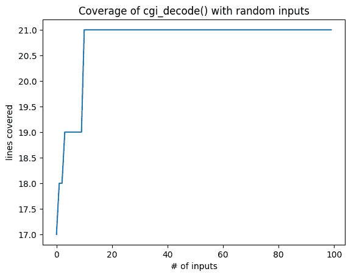
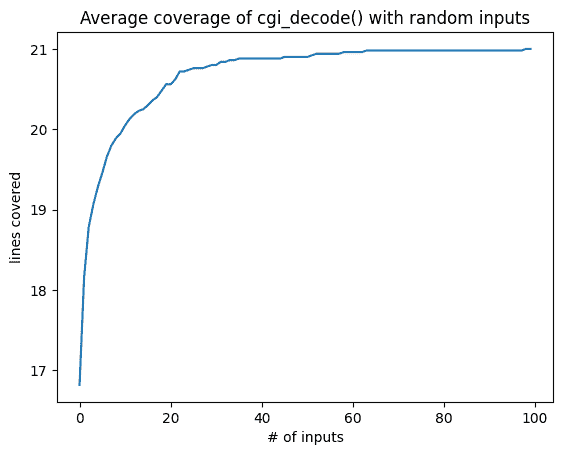

# 代码覆盖率

> 原文：[`www.fuzzingbook.org/html/Coverage.html`](http://www.fuzzingbook.org/html/Coverage.html)

在上一章中，我们介绍了*基本模糊测试*——即生成随机输入来测试程序。我们如何衡量这些测试的有效性呢？一种方法就是检查找到的（数量和严重性）错误；但如果错误很少，我们需要一个*测试发现错误的概率的代理*。在本章中，我们引入了*代码覆盖率*的概念，测量在测试运行期间程序的实际执行部分。测量这种覆盖率对于试图覆盖尽可能多代码的测试生成器来说也非常关键。

```py
from [bookutils](https://github.com/uds-se/fuzzingbook//tree/master/notebooks/shared/bookutils) import YouTubeVideo
YouTubeVideo('8HxW8j9287A') 
```

**先决条件**

+   你需要了解程序是如何执行的。

+   你应该在上一章中学习过基本模糊测试。

## 概述

要使用本章提供的代码，请编写

```py
>>> from fuzzingbook.Coverage import <identifier> 
```

然后利用以下功能。

本章介绍了一个`Coverage`类，允许你测量 Python 程序的覆盖率。在本书的上下文中，我们使用覆盖率信息来引导模糊测试向未覆盖的位置发展。

`Coverage`类的典型用法是与`with`子句结合使用：

```py
>>> with Coverage() as cov:
>>>     cgi_decode("a+b") 
```

打印出覆盖率对象显示了覆盖的函数，未覆盖的行以`#`为前缀：

```py
>>> print(cov)
#  1  def cgi_decode(s: str) -> str:
#  2      """Decode the CGI-encoded string `s`:
#  3         * replace '+' by ' '
#  4         * replace "%xx" by the character with hex number xx.
#  5         Return the decoded string.  Raise `ValueError` for invalid inputs."""
#  6 
#  7      # Mapping of hex digits to their integer values
   8      hex_values = {
   9          '0': 0, '1': 1, '2': 2, '3': 3, '4': 4,
  10          '5': 5, '6': 6, '7': 7, '8': 8, '9': 9,
  11          'a': 10, 'b': 11, 'c': 12, 'd': 13, 'e': 14, 'f': 15,
  12          'A': 10, 'B': 11, 'C': 12, 'D': 13, 'E': 14, 'F': 15,
# 13      }
# 14 
  15      t = ""
  16      i = 0
  17      while i < len(s):
  18          c = s[i]
  19          if c == '+':
  20              t += ' '
  21          elif c == '%':
# 22              digit_high, digit_low = s[i + 1], s[i + 2]
# 23              i += 2
# 24              if digit_high in hex_values and digit_low in hex_values:
# 25                  v = hex_values[digit_high] * 16 + hex_values[digit_low]
# 26                  t += chr(v)
# 27              else:
# 28                  raise ValueError("Invalid encoding")
# 29          else:
  30              t += c
  31          i += 1
  32      return t 
```

`trace()`方法返回*跟踪*——即按顺序执行的代码位置列表。每个位置都作为一对（`函数名`，`行`）出现。

```py
>>> cov.trace()
[('cgi_decode', 8),
 ('cgi_decode', 9),
 ('cgi_decode', 8),
 ('cgi_decode', 9),
 ('cgi_decode', 8),
 ('cgi_decode', 9),
 ('cgi_decode', 8),
 ('cgi_decode', 9),
 ('cgi_decode', 8),
 ('cgi_decode', 9),
 ('cgi_decode', 8),
 ('cgi_decode', 10),
 ('cgi_decode', 8),
 ('cgi_decode', 10),
 ('cgi_decode', 8),
 ('cgi_decode', 10),
 ('cgi_decode', 8),
 ('cgi_decode', 10),
 ('cgi_decode', 8),
 ('cgi_decode', 10),
 ('cgi_decode', 8),
 ('cgi_decode', 11),
 ('cgi_decode', 8),
 ('cgi_decode', 11),
 ('cgi_decode', 8),
 ('cgi_decode', 11),
 ('cgi_decode', 8),
 ('cgi_decode', 11),
 ('cgi_decode', 8),
 ('cgi_decode', 11),
 ('cgi_decode', 8),
 ('cgi_decode', 11),
 ('cgi_decode', 8),
 ('cgi_decode', 12),
 ('cgi_decode', 8),
 ('cgi_decode', 12),
 ('cgi_decode', 8),
 ('cgi_decode', 15),
 ('cgi_decode', 16),
 ('cgi_decode', 17),
 ('cgi_decode', 18),
 ('cgi_decode', 19),
 ('cgi_decode', 21),
 ('cgi_decode', 30),
 ('cgi_decode', 31),
 ('cgi_decode', 17),
 ('cgi_decode', 18),
 ('cgi_decode', 19),
 ('cgi_decode', 20),
 ('cgi_decode', 31),
 ('cgi_decode', 17),
 ('cgi_decode', 18),
 ('cgi_decode', 19),
 ('cgi_decode', 21),
 ('cgi_decode', 30),
 ('cgi_decode', 31),
 ('cgi_decode', 17),
 ('cgi_decode', 32)] 
```

`coverage()`方法返回*覆盖率*，即至少执行一次的跟踪中的位置集合：

```py
>>> cov.coverage()
{('cgi_decode', 8),
 ('cgi_decode', 9),
 ('cgi_decode', 10),
 ('cgi_decode', 11),
 ('cgi_decode', 12),
 ('cgi_decode', 15),
 ('cgi_decode', 16),
 ('cgi_decode', 17),
 ('cgi_decode', 18),
 ('cgi_decode', 19),
 ('cgi_decode', 20),
 ('cgi_decode', 21),
 ('cgi_decode', 30),
 ('cgi_decode', 31),
 ('cgi_decode', 32)} 
```

覆盖集可以受到集合操作的影响，例如*交集*（哪些位置在多次执行中被覆盖）和*差集*（哪些位置在运行*a*中被覆盖，但在*b*中没有）。

本章还讨论了如何从 C 程序中获取此类覆盖率。

<svg width="258pt" height="145pt" viewBox="0.00 0.00 257.62 145.00" xmlns:xlink="http://www.w3.org/1999/xlink"><g id="graph0" class="graph" transform="scale(1 1) rotate(0) translate(4 141)"><g id="node1" class="node"><title>覆盖率</title> <g id="a_node1"><a xlink:href="#" xlink:title="class Coverage:

在`with`块内跟踪覆盖率。使用如下

```py
with Coverage() as cov:
function_to_be_traced()
c = cov.coverage()
```"><text text-anchor="start" x="27.12" y="-120.2" font-family="Patua One, Helvetica, sans-serif" font-weight="bold" font-size="14.00" fill="#b03a2e">覆盖率</text> <g id="a_node1_0"><a xlink:href="#" xlink:title="Coverage"><g id="a_node1_1"><a xlink:href="#" xlink:title="__enter__(self) -> Any:

`with`块的开始。开启跟踪。"><text text-anchor="start" x="8" y="-98" font-family="'Fira Mono', 'Source Code Pro', 'Courier', monospace" font-weight="bold" font-size="10.00">__enter__()</text></a></g> <g id="a_node1_2"><a xlink:href="#" xlink:title="__exit__(self, exc_type: Type, exc_value: BaseException, tb: traceback) -> Optional[bool]:

`with`块结束。关闭跟踪。"><text text-anchor="start" x="8" y="-85.25" font-family="'Fira Mono', 'Source Code Pro', 'Courier', monospace" font-weight="bold" font-size="10.00">__exit__()</text></a></g> <g id="a_node1_3"><a xlink:href="#" xlink:title="__init__(self) -> None:

构造函数"><text text-anchor="start" x="8" y="-72.5" font-family="'Fira Mono', 'Source Code Pro', 'Courier', monospace" font-weight="bold" font-size="10.00">__init__()</text></a></g> <g id="a_node1_4"><a xlink:href="#" xlink:title="__exit__(self) -> None:

返回此对象的字符串表示。

显示覆盖（和未覆盖）的程序代码"><text text-anchor="start" x="8" y="-59.75" font-family="'Fira Mono', 'Source Code Pro', 'Courier', monospace" font-weight="bold" font-size="10.00">__repr__()</text></a></g> <g id="a_node1_5"><a xlink:href="#" xlink:title="coverage(self) -> Set[Location]:

执行的行列表，作为（函数名称，行号）对"><text text-anchor="start" x="8" y="-47" font-family="'Fira Mono', 'Source Code Pro', 'Courier', monospace" font-weight="bold" font-size="10.00">coverage()</text></a></g> <g id="a_node1_6"><a xlink:href="#" xlink:title="function_names(self) -> Set[str]:

在函数名称集合中看到的`function_names()`"><text text-anchor="start" x="8" y="-34.25" font-family="'Fira Mono', 'Source Code Pro', 'Courier', monospace" font-weight="bold" font-size="10.00">function_names()</text></a></g> <g id="a_node1_7"><a xlink:href="#" xlink:title="trace(self) -> List[Location]:

执行的行列表，作为（函数名称，行号）对"><text text-anchor="start" x="8" y="-21.5" font-family="'Fira Mono', 'Source Code Pro', 'Courier', monospace" font-weight="bold" font-size="10.00">trace()</text></a></g> <g id="a_node1_8"><a xlink:href="#" xlink:title="traceit(self, frame: frame, event: str, arg: Any) -> Optional[Callable]:

跟踪函数。在子类中重载。"><text text-anchor="start" x="8" y="-8.75" font-family="'Fira Mono', 'Source Code Pro', 'Courier', monospace" font-style="italic" font-size="10.00">traceit()</text></a></g></a></g></a></g></g> <g id="node2" class="node"><title>图例</title> <text text-anchor="start" x="130.38" y="-84.5" font-family="Patua One, Helvetica, sans-serif" font-weight="bold" font-size="10.00" fill="#b03a2e">图例</text> <text text-anchor="start" x="130.38" y="-74.5" font-family="Patua One, Helvetica, sans-serif" font-size="10.00">• </text> <text text-anchor="start" x="136.38" y="-74.5" font-family="'Fira Mono', 'Source Code Pro', 'Courier', monospace" font-weight="bold" font-size="8.00">public_method()</text> <text text-anchor="start" x="130.38" y="-64.5" font-family="Patua One, Helvetica, sans-serif" font-size="10.00">• </text> <text text-anchor="start" x="136.38" y="-64.5" font-family="'Fira Mono', 'Source Code Pro', 'Courier', monospace" font-size="8.00">private_method()</text> <text text-anchor="start" x="130.38" y="-54.5" font-family="Patua One, Helvetica, sans-serif" font-size="10.00">• </text> <text text-anchor="start" x="136.38" y="-54.5" font-family="'Fira Mono', 'Source Code Pro', 'Courier', monospace" font-style="italic" font-size="8.00">overloaded_method()</text> <text text-anchor="start" x="130.38" y="-45.45" font-family="Helvetica,sans-Serif" font-size="9.00">将鼠标悬停在名称上以查看文档</text></g></g></svg>

```py
import [bookutils.setup](https://github.com/uds-se/fuzzingbook//tree/master/notebooks/shared/bookutils) 
```

## CGI 解码器

我们首先介绍一个简单的 Python 函数，该函数解码 CGI 编码的字符串。CGI 编码用于 URL（即 Web 地址）中，以编码在 URL 中无效的字符，例如空白和某些标点符号：

+   空白将被替换为 `'+'`

+   其他无效字符将被替换为 '`%xx`'，其中 `xx` 是两位十六进制等效值。

在 CGI 编码中，字符串 `"Hello, world!"` 因此会变成 `"Hello%2c+world%21"`，其中 `2c` 和 `21` 分别是 `','` 和 `'!'` 的十六进制等效值。

函数 `cgi_decode()` 接收这样的编码字符串并将其解码回其原始形式。我们的实现复制了来自 [[Pezzè *et al*, 2008](http://ix.cs.uoregon.edu/~michal/book/)] 的代码。（它甚至包括其错误——但我们现在不会透露它们。）

```py
def cgi_decode(s: str) -> str:
  """Decode the CGI-encoded string `s`:
 * replace '+' by ' '
 * replace "%xx" by the character with hex number xx.
 Return the decoded string.  Raise `ValueError` for invalid inputs."""

    # Mapping of hex digits to their integer values
    hex_values = {
        '0': 0, '1': 1, '2': 2, '3': 3, '4': 4,
        '5': 5, '6': 6, '7': 7, '8': 8, '9': 9,
        'a': 10, 'b': 11, 'c': 12, 'd': 13, 'e': 14, 'f': 15,
        'A': 10, 'B': 11, 'C': 12, 'D': 13, 'E': 14, 'F': 15,
    }

    t = ""
    i = 0
    while i < len(s):
        c = s[i]
        if c == '+':
            t += ' '
        elif c == '%':
            digit_high, digit_low = s[i + 1], s[i + 2]
            i += 2
            if digit_high in hex_values and digit_low in hex_values:
                v = hex_values[digit_high] * 16 + hex_values[digit_low]
                t += chr(v)
            else:
                raise ValueError("Invalid encoding")
        else:
            t += c
        i += 1
    return t 
```

下面是 `cgi_decode()` 的工作示例：

```py
cgi_decode("Hello+world") 
```

```py
'Hello world'

```

如果我们要系统地测试 `cgi_decode()`，我们将如何进行？

测试文献区分了两种推导测试的方法：*黑盒测试* 和 *白盒测试*。

## 黑盒测试

黑盒测试的思想是从 *规范* 中推导测试。在上面的情况下，因此我们必须通过指定的和记录的特性来测试 `cgi_decode()`，包括

+   测试 `'+'` 的正确替换；

+   测试正确替换 `"%xx"`；

+   测试其他字符不被替换；

+   测试对非法输入的识别。

这里包含了涵盖这四个特征的四个断言（测试）。我们可以看到它们都通过了：

```py
assert cgi_decode('+') == ' '
assert cgi_decode('%20') == ' '
assert cgi_decode('abc') == 'abc'

try:
    cgi_decode('%?a')
    assert False
except ValueError:
    pass 
```

黑盒测试的优势在于它能够找到指定行为中的错误。它与特定的实现无关，因此可以在实现之前创建测试。缺点是通常实现的行为比指定行为覆盖的范围更广，因此仅基于规格说明的测试通常不会覆盖所有实现细节。

## 白盒测试

与黑盒测试相反，*白盒测试* 从 *实现* 中推导测试，特别是内部结构。白盒测试与代码结构特征的 *覆盖* 概念紧密相关。例如，如果在测试期间代码中的某个语句没有被执行，这意味着这个语句中的错误也无法被触发。因此，白盒测试引入了一系列必须满足的 *覆盖率标准*，在测试被认为足够之前。最常用的覆盖率标准是

+   *语句覆盖率* – 代码中的每个语句都必须至少被一个测试输入执行。

+   *分支覆盖率* – 代码中的每个分支都必须至少被一个测试输入执行。（这相当于每个 `if` 和 `while` 决策至少一次为真，至少一次为假。）

除了这些，还有更多的覆盖率标准，包括分支序列的执行、循环迭代（零次、一次、多次）、变量定义和用法之间的数据流等等；[[Pezzè 等人，2008](http://ix.cs.uoregon.edu/~michal/book/)] 有一个很好的概述。

让我们考虑上面的 `cgi_decode()`，并推理出我们需要做什么才能确保代码中的每个语句至少执行一次。我们需要覆盖

+   `if c == '+'` 后面的代码块

+   `if c == '%'` 后面的两个代码块（一个用于有效输入，一个用于无效输入）

+   所有其他字符的最终 `else` 情况。

这会导致与上面黑盒测试相同的条件；再次强调，上面的断言确实会覆盖代码中的每个语句。这种对应关系实际上是相当常见的，因为程序员倾向于在不同的代码位置实现不同的行为；因此，覆盖这些位置将导致覆盖不同（指定）行为的测试用例。

白盒测试的优势在于它能够找到实现行为中的错误。即使在规格说明没有提供足够细节的情况下也可以进行；实际上，它有助于识别（并因此指定）规格说明中的边缘情况。缺点是它可能会错过未实现的行为：如果某些指定的功能缺失，白盒测试将不会找到它。

## 跟踪执行

白盒测试的一个优点是，可以实际自动评估某个程序特性是否被覆盖。为此，需要对程序的执行进行 *仪器化*，以便在执行过程中，一个特殊的功能能够跟踪执行了哪些代码。测试完成后，这些信息可以传递给程序员，然后程序员可以专注于编写覆盖尚未覆盖代码的测试。

在大多数编程语言中，设置程序以便能够跟踪其执行是非常困难的。但在 Python 中并非如此。`sys.settrace(f)` 函数允许定义一个 *跟踪函数* `f()`，该函数会在每执行一行代码时被调用。更好的是，它还可以访问当前函数及其名称、当前变量内容等。因此，它是一个理想的 *动态分析* 工具——也就是说，分析执行过程中实际发生的事情。

为了说明它是如何工作的，让我们再次查看 `cgi_decode()` 的一个特定执行。

```py
cgi_decode("a+b") 
```

```py
'a b'

```

为了跟踪执行通过 `cgi_decode()` 的过程，我们使用 `sys.settrace()`。首先，我们定义一个 *跟踪函数*，该函数将在每行被调用。它有三个参数：

+   `frame` 参数让你获取当前的 *帧*，允许访问当前位置和变量：

    +   `frame.f_code` 是当前正在执行的代码，其中 `frame.f_code.co_name` 是函数名；

    +   `frame.f_lineno` 保存当前的行号；并且

    +   `frame.f_locals` 保存当前的局部变量和参数。

+   `event` 参数是一个字符串，包含如 `"line"`（到达了新的一行）或 `"call"`（正在调用一个函数）等值。

+   `arg` 参数是某些事件的附加 *参数*；例如，对于 `"return"` 事件，`arg` 包含返回的值。

我们使用跟踪函数仅用于报告当前通过 `frame` 参数访问的执行行。

```py
from [types](https://docs.python.org/3/library/types.html) import FrameType, TracebackType 
```

```py
coverage = [] 
```

```py
def traceit(frame: FrameType, event: str, arg: Any) -> Optional[Callable]:
  """Trace program execution. To be passed to sys.settrace()."""
    if event == 'line':
        global coverage
        function_name = frame.f_code.co_name
        lineno = frame.f_lineno
        coverage.append(lineno)

    return traceit 
```

我们可以使用 `sys.settrace()` 来开启和关闭跟踪：

```py
import [sys](https://docs.python.org/3/library/sys.html) 
```

```py
def cgi_decode_traced(s: str) -> None:
    global coverage
    coverage = []
    sys.settrace(traceit)  # Turn on
    cgi_decode(s)
    sys.settrace(None)    # Turn off 
```

当我们计算 `cgi_decode("a+b")` 时，现在我们可以看到执行是如何通过 `cgi_decode()` 的。在初始化 `hex_values`、`t` 和 `i` 之后，我们看到 `while` 循环被执行了三次——对应输入中的每个字符。

```py
cgi_decode_traced("a+b")
print(coverage) 
```

```py
[8, 9, 8, 9, 8, 9, 8, 9, 8, 9, 8, 10, 8, 10, 8, 10, 8, 10, 8, 10, 8, 11, 8, 11, 8, 11, 8, 11, 8, 11, 8, 11, 8, 12, 8, 12, 8, 15, 16, 17, 18, 19, 21, 30, 31, 17, 18, 19, 20, 31, 17, 18, 19, 21, 30, 31, 17, 32]

```

这些实际上是哪些行？为此，我们获取 `cgi_decode_code` 的源代码并将其编码到一个数组 `cgi_decode_lines` 中，然后我们将添加覆盖率信息。首先，让我们获取 `cgi_encode` 的源代码：

```py
import [inspect](https://docs.python.org/3/library/inspect.html) 
```

```py
cgi_decode_code = inspect.getsource(cgi_decode) 
```

`cgi_decode_code` 是一个包含源代码的字符串。我们可以使用 Python 语法高亮打印它：

```py
from [bookutils](https://github.com/uds-se/fuzzingbook//tree/master/notebooks/shared/bookutils) import print_content, print_file 
```

```py
print_content(cgi_decode_code[:300] + "...", ".py") 
```

```py
def cgi_decode(s: str) -> str:
  """Decode the CGI-encoded string `s`:
 * replace '+' by ' '
 * replace "%xx" by the character with hex number xx.
 Return the decoded string.  Raise `ValueError` for invalid inputs."""

    # Mapping of hex digits to their integer values
    hex_v...

```

使用 `splitlines()`，我们将代码分割成一个按行号索引的行数组。

```py
cgi_decode_lines = [""] + cgi_decode_code.splitlines() 
```

`cgi_decode_lines[L]` 是源代码的第 L 行。

```py
cgi_decode_lines[1] 
```

```py
'def cgi_decode(s: str) -> str:'

```

我们可以看到，实际执行的第一行（9）实际上是 `hex_values` 的初始化...

```py
cgi_decode_lines[9:13] 
```

```py
["        '0': 0, '1': 1, '2': 2, '3': 3, '4': 4,",
 "        '5': 5, '6': 6, '7': 7, '8': 8, '9': 9,",
 "        'a': 10, 'b': 11, 'c': 12, 'd': 13, 'e': 14, 'f': 15,",
 "        'A': 10, 'B': 11, 'C': 12, 'D': 13, 'E': 14, 'F': 15,"]

```

...然后是 `t` 的初始化：

```py
cgi_decode_lines[15] 
```

```py
'    t = ""'

```

要查看哪些行至少执行过一次，我们可以将 `coverage` 转换为一个集合：

```py
covered_lines = set(coverage)
print(covered_lines) 
```

```py
{32, 8, 9, 10, 11, 12, 15, 16, 17, 18, 19, 20, 21, 30, 31}

```

让我们打印出完整的代码，并标注未覆盖的行。这种注释的目的是将开发者的注意力引向未覆盖的行。

```py
for lineno in range(1, len(cgi_decode_lines)):
    if lineno not in covered_lines:
        print("# ", end="")
    else:
        print("  ", end="")
    print("%2d " % lineno, end="")
    print_content(cgi_decode_lines[lineno], '.py')
    print() 
```

```py
#  1  def cgi_decode(s: str) -> str:
#  2      """Decode the CGI-encoded string `s`:
#  3         * replace '+' by '  '
#  4         * replace "%xx" by the character with hex number xx.
#  5         Return the decoded string.  Raise `ValueError` for invalid inputs."""
#  6  
#  7      # Mapping of hex digits to their integer values
   8      hex_values = {
   9          '0': 0, '1': 1, '2': 2, '3': 3, '4': 4,
  10          '5': 5, '6': 6, '7': 7, '8': 8, '9': 9,
  11          'a': 10, 'b': 11, 'c': 12, 'd': 13, 'e': 14, 'f': 15,
  12          'A': 10, 'B': 11, 'C': 12, 'D': 13, 'E': 14, 'F': 15,
# 13      }
# 14  
  15      t = ""
  16      i = 0
  17      while i < len(s):
  18          c = s[i]
  19          if c == '+':
  20              t += '  '
  21          elif c == '%':
# 22              digit_high, digit_low = s[i + 1], s[i + 2]
# 23              i += 2
# 24              if digit_high in hex_values and digit_low in hex_values:
# 25                  v = hex_values[digit_high] * 16 + hex_values[digit_low]
# 26                  t += chr(v)
# 27              else:
# 28                  raise ValueError("Invalid encoding")
# 29          else:
  30              t += c
  31          i += 1
  32      return t

```

我们可以看到，许多行（特别是注释）尚未执行（用`#`标记），仅仅是因为它们不可执行。然而，我们也可以看到，在`elif c == '%'`下的行尚未执行。如果`"a+b"`是我们迄今为止的唯一测试用例，那么现在这个缺失的覆盖率将鼓励我们创建另一个测试用例，实际上覆盖这些`#`标记的行。

## 覆盖率类

在这本书中，我们将反复使用覆盖率——不仅是为了*测量*不同测试生成技术的有效性，而且是为了*引导*测试生成向代码覆盖率方向发展。我们之前的全局`coverage`变量实现有点繁琐。因此，我们实现了一些有助于我们轻松测量覆盖率的功能。

获取覆盖率的关键思想是利用 Python 的`with`语句。一般形式

```py
with OBJECT [as VARIABLE]:
    BODY 
```

使用`BODY`执行时，`OBJECT`被定义（并存储在`VARIABLE`中）。有趣的是，在`BODY`的开始和结束时，特殊方法`OBJECT.__enter__()`和`OBJECT.__exit__()`会自动调用；即使`BODY`抛出异常。这允许我们定义一个`Coverage`对象，其中`Coverage.__enter__()`会自动开启跟踪，而`Coverage.__exit__()`会自动关闭跟踪。跟踪后，我们可以使用特殊方法来访问覆盖率。这是使用时的样子：

```py
with Coverage() as cov:
    function_to_be_traced()
c = cov.coverage() 
```

在这里，跟踪在`function_to_be_traced()`期间自动开启，在`with`块之后再次关闭；之后，我们可以访问已执行的行集。

这是包含所有功能的完整实现。您不必了解所有内容；您只需要知道如何使用它：

```py
Location = Tuple[str, int] 
```

```py
class Coverage:
  """Track coverage within a `with` block. Use as
 ```

with Coverage() as cov:

function_to_be_traced()

c = cov.coverage()

```py
 """

    def __init__(self) -> None:
  """Constructor"""
        self._trace: List[Location] = []

    # Trace function
    def traceit(self, frame: FrameType, event: str, arg: Any) -> Optional[Callable]:
  """Tracing function. To be overloaded in subclasses."""
        if self.original_trace_function is not None:
            self.original_trace_function(frame, event, arg)

        if event == "line":
            function_name = frame.f_code.co_name
            lineno = frame.f_lineno
            if function_name != '__exit__':  # avoid tracing ourselves:
                self._trace.append((function_name, lineno))

        return self.traceit

    def __enter__(self) -> Any:
  """Start of `with` block. Turn on tracing."""
        self.original_trace_function = sys.gettrace()
        sys.settrace(self.traceit)
        return self

    def __exit__(self, exc_type: Type, exc_value: BaseException,
                 tb: TracebackType) -> Optional[bool]:
  """End of `with` block. Turn off tracing."""
        sys.settrace(self.original_trace_function)
        return None  # default: pass all exceptions

    def trace(self) -> List[Location]:
  """The list of executed lines, as (function_name, line_number) pairs"""
        return self._trace

    def coverage(self) -> Set[Location]:
  """The set of executed lines, as (function_name, line_number) pairs"""
        return set(self.trace())

    def function_names(self) -> Set[str]:
  """The set of function names seen"""
        return set(function_name for (function_name, line_number) in self.coverage())

    def __repr__(self) -> str:
  """Return a string representation of this object.
 Show covered (and uncovered) program code"""
        t = ""
        for function_name in self.function_names():
            # Similar code as in the example above
            try:
                fun = eval(function_name)
            except Exception as exc:
                t += f"Skipping {function_name}: {exc}"
                continue

            source_lines, start_line_number = inspect.getsourcelines(fun)
            for lineno in range(start_line_number, start_line_number + len(source_lines)):
                if (function_name, lineno) not in self.trace():
                    t += "# "
                else:
                    t += "  "
                t += "%2d " % lineno
                t += source_lines[lineno - start_line_number]

        return t 
```

让我们将其应用于实际：

```py
with Coverage() as cov:
    cgi_decode("a+b")

print(cov.coverage()) 
```

```py
{('cgi_decode', 8), ('cgi_decode', 11), ('cgi_decode', 17), ('cgi_decode', 30), ('cgi_decode', 20), ('cgi_decode', 10), ('cgi_decode', 16), ('cgi_decode', 19), ('cgi_decode', 9), ('cgi_decode', 32), ('cgi_decode', 12), ('cgi_decode', 31), ('cgi_decode', 15), ('cgi_decode', 21), ('cgi_decode', 18)}

```

如您所见，`Coverage()`类不仅跟踪已执行的行，还跟踪函数名。如果您有一个跨越多个文件的程序，这很有用。

对于交互式使用，我们只需简单地打印覆盖率对象，并获得代码列表，其中未覆盖的行用`#`标记。

```py
print(cov) 
```

```py
#  1  def cgi_decode(s: str) -> str:
#  2      """Decode the CGI-encoded string `s`:
#  3         * replace '+' by ' '
#  4         * replace "%xx" by the character with hex number xx.
#  5         Return the decoded string.  Raise `ValueError` for invalid inputs."""
#  6  
#  7      # Mapping of hex digits to their integer values
   8      hex_values = {
   9          '0': 0, '1': 1, '2': 2, '3': 3, '4': 4,
  10          '5': 5, '6': 6, '7': 7, '8': 8, '9': 9,
  11          'a': 10, 'b': 11, 'c': 12, 'd': 13, 'e': 14, 'f': 15,
  12          'A': 10, 'B': 11, 'C': 12, 'D': 13, 'E': 14, 'F': 15,
# 13      }
# 14  
  15      t = ""
  16      i = 0
  17      while i < len(s):
  18          c = s[i]
  19          if c == '+':
  20              t += ' '
  21          elif c == '%':
# 22              digit_high, digit_low = s[i + 1], s[i + 2]
# 23              i += 2
# 24              if digit_high in hex_values and digit_low in hex_values:
# 25                  v = hex_values[digit_high] * 16 + hex_values[digit_low]
# 26                  t += chr(v)
# 27              else:
# 28                  raise ValueError("Invalid encoding")
# 29          else:
  30              t += c
  31          i += 1
  32      return t

```

## 比较覆盖率

由于我们将覆盖率表示为已执行行的集合，因此我们也可以对这些集合应用*集合操作*。例如，我们可以找出哪些行被单个测试用例覆盖，但未被其他测试用例覆盖：

```py
with Coverage() as cov_plus:
    cgi_decode("a+b")
with Coverage() as cov_standard:
    cgi_decode("abc")

cov_plus.coverage() - cov_standard.coverage() 
```

```py
{('cgi_decode', 20)}

```

这是代码中仅在`'a+b'`输入下执行的单独一行。

我们还可以比较集合，以找出哪些行仍然需要被覆盖。让我们定义`cov_max`为我们能实现的最大覆盖率。（在这里，我们通过执行我们已有的“良好”测试用例来完成此操作。在实践中，人们会静态分析代码结构，我们将在符号测试章节中介绍。）

```py
with Coverage() as cov_max:
    cgi_decode('+')
    cgi_decode('%20')
    cgi_decode('abc')
    try:
        cgi_decode('%?a')
    except Exception:
        pass 
```

然后，我们可以轻松地看到哪些行还没有被测试用例覆盖：

```py
cov_max.coverage() - cov_plus.coverage() 
```

```py
{('cgi_decode', 22),
 ('cgi_decode', 23),
 ('cgi_decode', 24),
 ('cgi_decode', 25),
 ('cgi_decode', 26),
 ('cgi_decode', 28)}

```

再次，这些是处理`"%xx"`的行，我们还没有在输入中遇到。

## 基本模糊测试覆盖率

我们现在可以使用我们的覆盖率跟踪来评估测试方法的有效性——特别是测试生成方法的有效性。我们的挑战是仅通过随机输入在`cgi_decode()`中实现最大覆盖率。原则上，我们最终应该达到那里，因为最终我们将产生宇宙中每一个可能字符串——但具体需要多长时间呢？为此，让我们对`cgi_decode()`运行一次模糊测试迭代：

```py
from Fuzzer import fuzzer 
```

```py
sample = fuzzer()
sample 
```

```py
'!7#%"*#0=)$;%6*;>638:*>80"=</>(/*:-(2<4 !:5*6856&?""11<7+%<%7,4.8,*+&,,$,."'

```

这是调用和获得的覆盖率。我们将`cgi_decode()`包裹在`try...except`块中，这样我们就可以忽略由非法`%xx`格式引发的`ValueError`异常。

```py
with Coverage() as cov_fuzz:
    try:
        cgi_decode(sample)
    except:
        pass
cov_fuzz.coverage() 
```

```py
{('cgi_decode', 8),
 ('cgi_decode', 9),
 ('cgi_decode', 10),
 ('cgi_decode', 11),
 ('cgi_decode', 12),
 ('cgi_decode', 15),
 ('cgi_decode', 16),
 ('cgi_decode', 17),
 ('cgi_decode', 18),
 ('cgi_decode', 19),
 ('cgi_decode', 21),
 ('cgi_decode', 22),
 ('cgi_decode', 23),
 ('cgi_decode', 24),
 ('cgi_decode', 28),
 ('cgi_decode', 30),
 ('cgi_decode', 31)}

```

这已经是最大覆盖率了吗？显然，还有一些行没有覆盖到：

```py
cov_max.coverage() - cov_fuzz.coverage() 
```

```py
{('cgi_decode', 20),
 ('cgi_decode', 25),
 ('cgi_decode', 26),
 ('cgi_decode', 32)}

```

让我们再次尝试，通过 100 个随机输入增加覆盖率。我们使用一个数组`cumulative_coverage`来存储随时间获得的覆盖率；`cumulative_coverage[0]`是在输入 1 后覆盖的行总数，`cumulative_coverage[1]`是在输入 1-2 后覆盖的行数，依此类推。

```py
trials = 100 
```

```py
def population_coverage(population: List[str], function: Callable) \
        -> Tuple[Set[Location], List[int]]:
    cumulative_coverage: List[int] = []
    all_coverage: Set[Location] = set()

    for s in population:
        with Coverage() as cov:
            try:
                function(s)
            except:
                pass
        all_coverage |= cov.coverage()
        cumulative_coverage.append(len(all_coverage))

    return all_coverage, cumulative_coverage 
```

让我们创建一百个输入来确定覆盖率是如何增加的：

```py
def hundred_inputs() -> List[str]:
    population = []
    for i in range(trials):
        population.append(fuzzer())
    return population 
```

每次输入增加覆盖率的方式如下：

```py
all_coverage, cumulative_coverage = \
    population_coverage(hundred_inputs(), cgi_decode) 
```

```py
%matplotlib inline 
```

```py
import [matplotlib.pyplot](https://matplotlib.org/) as plt 
```

```py
plt.plot(cumulative_coverage)
plt.title('Coverage of cgi_decode() with random inputs')
plt.xlabel('# of inputs')
plt.ylabel('lines covered') 
```

```py
Text(0, 0.5, 'lines covered')

```



当然，这只是**一次**运行；所以让我们重复多次并绘制平均值。

```py
runs = 100

# Create an array with TRIALS elements, all zero
sum_coverage = [0] * trials

for run in range(runs):
    all_coverage, coverage = population_coverage(hundred_inputs(), cgi_decode)
    assert len(coverage) == trials
    for i in range(trials):
        sum_coverage[i] += coverage[i]

average_coverage = []
for i in range(trials):
    average_coverage.append(sum_coverage[i] / runs) 
```

```py
plt.plot(average_coverage)
plt.title('Average coverage of cgi_decode() with random inputs')
plt.xlabel('# of inputs')
plt.ylabel('lines covered') 
```

```py
Text(0, 0.5, 'lines covered')

```



我们看到，平均来说，在 40-60 次模糊测试输入后，我们就能获得完整的覆盖率。

## 从外部程序获取覆盖率

当然，并非全世界都在用 Python 编程。好消息是，获取覆盖率的问题无处不在，几乎每种编程语言都有一些工具可以测量覆盖率。因此，让我们以一个例子来展示如何为一个 C 程序获取覆盖率。

我们的 C 程序（再次）实现了`cgi_decode`；这次是一个可以从命令行执行的程序：

```py
$  ./cgi_decode  'Hello+World'
Hello  World 
```

下面是 C 代码，首先作为一个 Python 字符串。我们以常用的 C 头文件开始：

```py
cgi_c_code = """
/* CGI decoding as C program */

#include <stdlib.h>
#include <string.h>
#include <stdio.h>

""" 
```

接下来是`hex_values`的初始化：

```py
cgi_c_code += r"""
int hex_values[256];

void init_hex_values() {
 for (int i = 0; i < sizeof(hex_values) / sizeof(int); i++) {
 hex_values[i] = -1;
 }
 hex_values['0'] = 0; hex_values['1'] = 1; hex_values['2'] = 2; hex_values['3'] = 3;
 hex_values['4'] = 4; hex_values['5'] = 5; hex_values['6'] = 6; hex_values['7'] = 7;
 hex_values['8'] = 8; hex_values['9'] = 9;

 hex_values['a'] = 10; hex_values['b'] = 11; hex_values['c'] = 12; hex_values['d'] = 13;
 hex_values['e'] = 14; hex_values['f'] = 15;

 hex_values['A'] = 10; hex_values['B'] = 11; hex_values['C'] = 12; hex_values['D'] = 13;
 hex_values['E'] = 14; hex_values['F'] = 15;
}
""" 
```

下面是`cgi_decode()`的实际实现，使用指针作为输入源（`s`）和输出目标（`t`）：

```py
cgi_c_code += r"""
int cgi_decode(char *s, char *t) {
 while (*s != '\0') {
 if (*s == '+')
 *t++ = ' ';
 else if (*s == '%') {
 int digit_high = *++s;
 int digit_low = *++s;
 if (hex_values[digit_high] >= 0 && hex_values[digit_low] >= 0) {
 *t++ = hex_values[digit_high] * 16 + hex_values[digit_low];
 }
 else
 return -1;
 }
 else
 *t++ = *s;
 s++;
 }
 *t = '\0';
 return 0;
}
""" 
```

最后，这是一个驱动程序，它接受第一个参数并使用它调用`cgi_decode`：

```py
cgi_c_code += r"""
int main(int argc, char *argv[]) {
 init_hex_values();

 if (argc >= 2) {
 char *s = argv[1];
 char *t = malloc(strlen(s) + 1); /* output is at most as long as input */
 int ret = cgi_decode(s, t);
 printf("%s\n", t);
 return ret;
 }
 else
 {
 printf("cgi_decode: usage: cgi_decode STRING\n");
 return 1;
 }
}
""" 
```

让我们创建 C 源代码：（注意，以下命令将覆盖当前工作目录中已存在的`cgi_decode.c`文件。如果您下载了笔记本并在本地工作，请注意这一点。）

```py
with open("cgi_decode.c", "w") as f:
    f.write(cgi_c_code) 
```

这里是我们带有语法高亮的 C 代码：

```py
from [bookutils](https://github.com/uds-se/fuzzingbook//tree/master/notebooks/shared/bookutils) import print_file 
```

```py
print_file("cgi_decode.c") 
```

```py
/* CGI decoding as C program */

#include  <stdlib.h>
#include  <string.h>
#include  <stdio.h>

int  hex_values[256];

void  init_hex_values()  {
  for  (int  i  =  0;  i  <  sizeof(hex_values)  /  sizeof(int);  i++)  {
  hex_values[i]  =  -1;
  }
  hex_values['0']  =  0;  hex_values['1']  =  1;  hex_values['2']  =  2;  hex_values['3']  =  3;
  hex_values['4']  =  4;  hex_values['5']  =  5;  hex_values['6']  =  6;  hex_values['7']  =  7;
  hex_values['8']  =  8;  hex_values['9']  =  9;

  hex_values['a']  =  10;  hex_values['b']  =  11;  hex_values['c']  =  12;  hex_values['d']  =  13;
  hex_values['e']  =  14;  hex_values['f']  =  15;

  hex_values['A']  =  10;  hex_values['B']  =  11;  hex_values['C']  =  12;  hex_values['D']  =  13;
  hex_values['E']  =  14;  hex_values['F']  =  15;
}

int  cgi_decode(char  *s,  char  *t)  {
  while  (*s  !=  '\0')  {
  if  (*s  ==  '+')
  *t++  =  '  ';
  else  if  (*s  ==  '%')  {
  int  digit_high  =  *++s;
  int  digit_low  =  *++s;
  if  (hex_values[digit_high]  >=  0  &&  hex_values[digit_low]  >=  0)  {
  *t++  =  hex_values[digit_high]  *  16  +  hex_values[digit_low];
  }
  else
  return  -1;
  }
  else
  *t++  =  *s;
  s++;
  }
  *t  =  '\0';
  return  0;
}

int  main(int  argc,  char  *argv[])  {
  init_hex_values();

  if  (argc  >=  2)  {
  char  *s  =  argv[1];
  char  *t  =  malloc(strlen(s)  +  1);  /* output is at most as long as input */
  int  ret  =  cgi_decode(s,  t);
  printf("%s\n",  t);
  return  ret;
  }
  else
  {
  printf("cgi_decode: usage: cgi_decode STRING\n");
  return  1;
  }
}

```

我们现在可以将 C 代码编译成可执行文件。`--coverage`选项指示 C 编译器对代码进行仪器化，以便在运行时收集覆盖率信息。（具体的选项因编译器而异。）

```py
!cc  --coverage  -o  cgi_decode  cgi_decode.c 
```

当我们现在执行程序时，覆盖率信息将自动收集并存储在辅助文件中：

```py
!./cgi_decode  'Send+mail+to+me%40fuzzingbook.org' 
```

```py
Send mail to me@fuzzingbook.org

```

覆盖率信息是由 `gcov` 程序收集的。对于每个提供的源文件，它都会生成一个新的 `.gcov` 文件，其中包含覆盖率信息。这些信息存储在 `cgi_decode...` 或 `cgi_decode-cgi_decode...` 文件中。

```py
!gcov  cgi_decode  cgi_decode-cgi_decode 
```

```py
cgi_decode.gcno: No such file or directory
File 'cgi_decode.c'
Lines executed:92.50% of 40
Creating 'cgi_decode.c.gcov'

```

在 `.gcov` 文件中，每一行都带有被调用的次数（`-` 表示不可执行的行，`#####` 表示零）以及行号。我们可以查看 `cgi_decode()`，例如，并看到唯一尚未执行的代码是非法输入的 `return -1`。

```py
lines = open('cgi_decode.c.gcov').readlines()
for i in range(30, 50):
    print(lines[i], end='') 
```

```py
        1:   26:int cgi_decode(char *s, char *t) {
       32:   27:    while (*s != '\0') {
       31:   28:        if (*s == '+')
        3:   29:            *t++ = ' ';
       28:   30:        else if (*s == '%') {
        1:   31:            int digit_high = *++s;
        1:   32:            int digit_low = *++s;
        1:   33:            if (hex_values[digit_high] >= 0 && hex_values[digit_low] >= 0) {
        1:   34:                *t++ = hex_values[digit_high] * 16 + hex_values[digit_low];
        1:   35:            }
        -:   36:            else
    #####:   37:                return -1;
        1:   38:        }
        -:   39:        else
       27:   40:            *t++ = *s;
       31:   41:        s++;
        -:   42:    }
        1:   43:    *t = '\0';
        1:   44:    return 0;
        1:   45:}

```

让我们在该文件中读取以获取覆盖集：

```py
def read_gcov_coverage(c_file):
    gcov_file = c_file + ".gcov"
    coverage = set()
    with open(gcov_file) as file:
        for line in file.readlines():
            elems = line.split(':')
            covered = elems[0].strip()
            line_number = int(elems[1].strip())
            if covered.startswith('-') or covered.startswith('#'):
                continue
            coverage.add((c_file, line_number))
    return coverage 
```

```py
coverage = read_gcov_coverage('cgi_decode.c') 
```

```py
list(coverage)[:5] 
```

```py
[('cgi_decode.c', 53),
 ('cgi_decode.c', 62),
 ('cgi_decode.c', 16),
 ('cgi_decode.c', 13),
 ('cgi_decode.c', 19)]

```

使用这个集合，我们现在可以执行与我们的 Python 程序相同的覆盖计算。

## 使用基本模糊测试查找错误

给予足够的时间，我们确实可以覆盖 `cgi_decode()` 中的每一行，无论编程语言是什么。但这并不意味着它们会没有错误。由于我们没有检查 `cgi_decode()` 的结果，该函数可以返回任何值，而无需我们检查或注意。为了捕获这样的错误，我们需要设置一个 *结果检查器*（通常称为 *预言机*），它会验证测试结果。在我们的情况下，我们可以比较 `cgi_decode()` 的 C 和 Python 实现，看看它们是否产生相同的结果。

尽管模糊测试在发现 *内部错误* 方面很出色，即使不检查结果也可以检测到这些错误。实际上，如果有人在我们的 `fuzzer()` 上运行 `cgi_decode()`，很快就会找到这样的错误，如下面的代码所示：

```py
from ExpectError import ExpectError 
```

```py
with ExpectError():
    for i in range(trials):
        try:
            s = fuzzer()
            cgi_decode(s)
        except ValueError:
            pass 
```

```py
Traceback (most recent call last):
  File "/var/folders/n2/xd9445p97rb3xh7m1dfx8_4h0006ts/T/ipykernel_2687/2238772797.py", line 5, in <module>
    cgi_decode(s)
  File "/var/folders/n2/xd9445p97rb3xh7m1dfx8_4h0006ts/T/ipykernel_2687/1071239422.py", line 22, in cgi_decode
    digit_high, digit_low = s[i + 1], s[i + 2]
                                      ~^^^^^^^
IndexError: string index out of range (expected)

```

因此，可以导致 `cgi_decode()` 崩溃。为什么是这样呢？让我们看看它的输入：

```py
s 
```

```py
'82 202*&<1&($34\'"/\'.<5/!8"\'5:!4))%;'

```

这里的问题是字符串的末尾。在 `'%'` 字符之后，我们的实现将始终尝试访问两个额外的（十六进制）字符，但如果这些字符不存在，我们将得到一个 `IndexError` 异常。

这个问题也存在于我们的 C 变体中，它是从原始实现继承的 [[Pezzè *et al*, 2008](http://ix.cs.uoregon.edu/~michal/book/)]：

```py
int  digit_high  =  *++s;
int  digit_low  =  *++s; 
```

在这里，`s` 是指向要读取的字符的指针；`++` 通过一个字符增加它。在 C 实现中，问题实际上更严重。如果字符串末尾有 `'%'` 字符，上述代码将首先读取一个终止字符（C 字符串中的 `'\0'`），然后是字符串之后的下一个字符，这可能是字符串之后的任何内存内容，因此可能会使程序无法控制地失败。有些好消息是 `'\0'` 不是一个有效的十六进制字符，因此 C 版本“仅”会读取字符串末尾的一个字符。

令人惊讶的是，我们之前设计的所有手动测试都不会触发这个错误。实际上，无论是语句覆盖率、分支覆盖率，还是文献中常讨论的任何覆盖率标准，都无法找到它。然而，通过简单的模糊测试运行，可以在几次运行中识别出这个错误——*如果*有适当的运行时检查来发现这样的溢出。这确实需要更多的模糊测试！

## 经验教训

+   覆盖率指标是一种简单且完全自动化的方法，可以近似地估算在测试运行期间程序实际执行的功能量。

+   存在许多覆盖率指标，其中最重要的包括语句覆盖率和分支覆盖率。

+   在 Python 中，在执行期间访问程序状态非常容易，包括当前正在执行的代码。

最后，让我们清理一下：（注意以下命令将删除当前工作目录中所有符合模式`cgi_decode.*`的文件。如果你已经下载了笔记本并在本地工作，请注意这一点。）

```py
import [os](https://docs.python.org/3/library/os.html)
import [glob](https://docs.python.org/3/library/glob.html) 
```

```py
for file in (glob.glob("cgi_decode") + 
             glob.glob("cgi_decode.*") + 
             glob.glob("cgi_decode-*")):
    os.remove(file) 
```

## 下一步

覆盖率不仅是一种*测量*测试有效性的工具，而且是一种很好的*指导*测试生成以实现特定目标的工具——特别是未覆盖的代码。我们使用覆盖率来

+   在突变模糊测试章节中指导现有输入的*突变*以获得更好的覆盖率

## 背景

覆盖率是系统化软件测试中的一个核心概念。有关讨论，请参阅测试简介中的书籍。

## 练习

### 练习 1：修复`cgi_decode()`

创建一个适当的测试用例来重现上面讨论的`IndexError`。修复`cgi_decode()`以防止错误。展示你的测试（以及额外的`fuzzer()`运行）不再暴露错误。对于 C 变体也做同样的事情。

[使用笔记本](https://mybinder.org/v2/gh/uds-se/fuzzingbook/HEAD?labpath=docs%2Fnotebooks/Coverage.ipynb#Exercises)来完成练习并查看解决方案。

### 练习 2：分支覆盖率

除了语句覆盖率外，*分支覆盖率*是确定测试质量最常用的标准之一。简而言之，分支覆盖率衡量代码中做出的*控制决策*数量。在以下语句中

```py
if CONDITION:
    do_a()
else:
    do_b() 
```

例如，无论是`CONDITION`为真（分支到`do_a()`）还是`CONDITION`为假（分支到`do_b()`），这两种情况都需要被覆盖。这适用于所有带有条件的控制语句（如`if`、`while`等）。

分支覆盖率与语句覆盖率有何不同？在上面的例子中，实际上没有区别。然而，在这个例子中，确实有：

```py
if CONDITION:
    do_a()
something_else() 
```

使用语句覆盖率，只要有一个测试用例中`CONDITION`为真，就足以覆盖对`do_a()`的调用。然而，使用分支覆盖率，我们还需要创建一个测试用例，其中`do_a()`没有被调用。

使用我们的`Coverage`基础设施，我们可以通过考虑*后续执行的代码行对*来模拟分支覆盖率。`trace()`方法为我们提供了依次执行的代码行列表：

```py
with Coverage() as cov:
    cgi_decode("a+b")
trace = cov.trace()
trace[:5] 
```

```py
[('cgi_decode', 8),
 ('cgi_decode', 9),
 ('cgi_decode', 8),
 ('cgi_decode', 9),
 ('cgi_decode', 8)]

```

#### 第一部分：计算分支覆盖率

定义一个函数 `branch_coverage()`，它接受一个跟踪并返回跟踪中后续行的对集 - 在上述示例中，这将是对

```py
set(
(('cgi_decode', 9), ('cgi_decode', 10)),
(('cgi_decode', 10), ('cgi_decode', 11)),
# more_pairs
) 
```

高级 Python 程序员奖励：将 `BranchCoverage` 定义为 `Coverage` 的子类，并使 `branch_coverage()` 成为 `BranchCoverage` 的 `coverage()` 方法。

[使用笔记本](https://mybinder.org/v2/gh/uds-se/fuzzingbook/HEAD?labpath=docs%2Fnotebooks/Coverage.ipynb#Exercises) 来完成练习并查看解决方案。

#### 第二部分：比较语句覆盖率和分支覆盖率

使用 `branch_coverage()` 重复本章中的实验，使用分支覆盖率而不是语句覆盖率。手动编写的测试用例是否覆盖了所有分支？

[使用笔记本](https://mybinder.org/v2/gh/uds-se/fuzzingbook/HEAD?labpath=docs%2Fnotebooks/Coverage.ipynb#Exercises) 来完成练习并查看解决方案。

#### 第三部分：平均覆盖率

再次，使用分支覆盖率重复上述实验。`fuzzer()` 是否覆盖了所有分支，如果是的话，平均需要多少次测试？

[使用笔记本](https://mybinder.org/v2/gh/uds-se/fuzzingbook/HEAD?labpath=docs%2Fnotebooks/Coverage.ipynb#Exercises) 来完成练习并查看解决方案。

 本项目的内容受 [Creative Commons Attribution-NonCommercial-ShareAlike 4.0 国际许可协议](https://creativecommons.org/licenses/by-nc-sa/4.0/) 的许可。作为内容一部分的源代码，以及用于格式化和显示该内容的源代码，受 [MIT 许可协议](https://github.com/uds-se/fuzzingbook/blob/master/LICENSE.md#mit-license) 的许可。 [最后修改：2024-11-09 17:28:17+01:00](https://github.com/uds-se/fuzzingbook/commits/master/notebooks/Coverage.ipynb) • 引用 • [版权信息](https://cispa.de/en/impressum)

## 如何引用本作品

Andreas Zeller, Rahul Gopinath, Marcel Böhme, Gordon Fraser, and Christian Holler: "[代码覆盖率](https://www.fuzzingbook.org/html/Coverage.html)". In Andreas Zeller, Rahul Gopinath, Marcel Böhme, Gordon Fraser, and Christian Holler, "[模糊测试书](https://www.fuzzingbook.org/)", [`www.fuzzingbook.org/html/Coverage.html`](https://www.fuzzingbook.org/html/Coverage.html). Retrieved 2024-11-09 17:28:17+01:00.

```py
@incollection{fuzzingbook2024:Coverage,
    author = {Andreas Zeller and Rahul Gopinath and Marcel B{\"o}hme and Gordon Fraser and Christian Holler},
    booktitle = {The Fuzzing Book},
    title = {Code Coverage},
    year = {2024},
    publisher = {CISPA Helmholtz Center for Information Security},
    howpublished = {\url{https://www.fuzzingbook.org/html/Coverage.html}},
    note = {Retrieved 2024-11-09 17:28:17+01:00},
    url = {https://www.fuzzingbook.org/html/Coverage.html},
    urldate = {2024-11-09 17:28:17+01:00}
}

```
