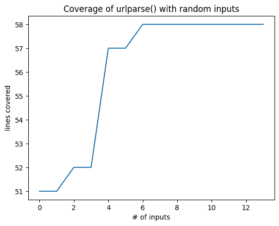
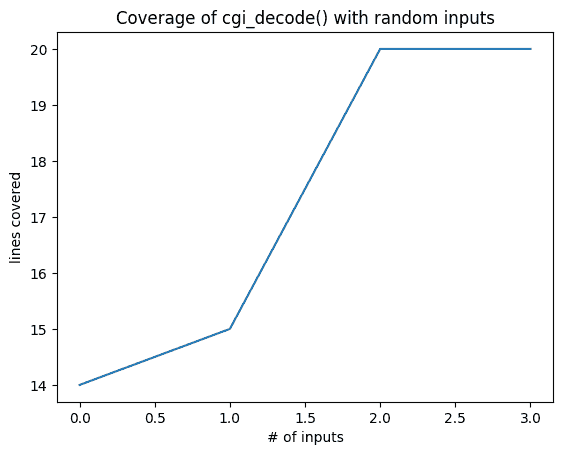

# 基于变异的模糊测试

> 原文：[`www.fuzzingbook.org/html/MutationFuzzer.html`](http://www.fuzzingbook.org/html/MutationFuzzer.html)

大多数 随机生成的输入 在语法上是 *无效的*，因此很快就会被处理程序拒绝。为了在输入处理之外锻炼功能，我们必须增加获得有效输入的机会。一种方法就是所谓的 *变异模糊测试* —— 也就是说，对现有输入进行小的修改，这些修改可能仍然保持输入有效，但可以锻炼新的行为。我们展示了如何创建这样的变异，以及如何引导它们指向尚未覆盖的代码，应用了流行的 AFL 模糊测试器的核心概念。

```py
from [bookutils](https://github.com/uds-se/fuzzingbook//tree/master/notebooks/shared/bookutils) import YouTubeVideo
YouTubeVideo('5ROhc_42jQU') 
```

**先决条件**

+   您应该了解基本模糊测试的工作原理；例如，从 "模糊测试" 章节中。

+   您应该了解 获取覆盖率 的基础知识。

## 概述

要 使用本章提供的代码，请编写

```py
>>> from fuzzingbook.MutationFuzzer import <identifier> 
```

然后利用以下功能。

本章介绍了一个 `MutationFuzzer` 类，它接受一个 *种子输入* 列表，然后对其进行变异：

```py
>>> seed_input = "http://www.google.com/search?q=fuzzing"
>>> mutation_fuzzer = MutationFuzzer(seed=[seed_input])
>>> [mutation_fuzzer.fuzz() for i in range(10)]
['http://www.google.com/search?q=fuzzing',
 ']hTtp://ww,google\x1ecom/searc?q=fuzzig',
 'hppY://www.google.cm/seacH?q=fduzzing',
 'http:&//www.goole.com/sear#h?q=fuzz(ingw',
 'http://vww.googlje.om/{earch?q5fuzzing',
 'http://www.google.com/seach?q=uzzing',
 'hv,tp*//www.ggogle.com/seagrch/q=fuzzing',
 "h(tpy:/wGw.goo'l%.com/searc?q=fuz~ing",
 'hp://www.gooelecom/)search?q=fuz?zing?',
 "httpv//www.goo6gl.#om'search?q=Puzzin"] 
```

`MutationCoverageFuzzer` 维护一个输入的 *种群*，然后通过进化来最大化覆盖率。

```py
>>> mutation_fuzzer = MutationCoverageFuzzer(seed=[seed_input])
>>> mutation_fuzzer.runs(http_runner, trials=10000)
>>> mutation_fuzzer.population[:5]
['http://www.google.com/search?q=fuzzing',
 'http://www.google.com</searc?q=fzzinw',
 'http://twww.google.com/searc`pnu<zzing',
 'http://Btwnww.gIoog|e.cnsearc`pn<zzing',
 'http://www\x0egoogle.com</sea#r#?q=_fdz0zinw'] 
```

<svg width="318pt" height="325pt" viewBox="0.00 0.00 318.38 325.25" xmlns:xlink="http://www.w3.org/1999/xlink"><g id="graph0" class="graph" transform="scale(1 1) rotate(0) translate(4 321.25)"><g id="node1" class="node"><title>MutationCoverageFuzzer</title> <g id="a_node1"><a xlink:href="#" xlink:title="class MutationCoverageFuzzer:

基于覆盖率进行变异输入的模糊测试"><text text-anchor="start" x="8" y="-43.7" font-family="Patua One, Helvetica, sans-serif" font-weight="bold" font-size="14.00" fill="#b03a2e">MutationCoverageFuzzer</text> <g id="a_node1_0"><a xlink:href="#" xlink:title="MutationCoverageFuzzer"><g id="a_node1_1"><a xlink:href="#" xlink:title="run(self, runner: FunctionCoverageRunner) -> Any:

在跟踪覆盖率的同时运行函数(inp)。

如果我们达到新的覆盖率，

将 inp 添加到种群中，并将其覆盖率添加到种群覆盖率中"><text text-anchor="start" x="65.75" y="-21.5" font-family="'Fira Mono', 'Source Code Pro', 'Courier', monospace" font-weight="bold" font-style="italic" font-size="10.00">run()</text></a></g> <g id="a_node1_2"><a xlink:href="#" xlink:title="reset(self) -> None:

将种群设置为初始种子。

在子类中重载。"><text text-anchor="start" x="65.75" y="-8.75" font-family="'Fira Mono', 'Source Code Pro', 'Courier', monospace" font-style="italic" font-size="10.00">reset()</text></a></g></a></g></a></g></g> <g id="node2" class="node"><title>MutationFuzzer</title> <g id="a_node2"><a xlink:href="#" xlink:title="class MutationFuzzer:

变异模糊的基类"><text text-anchor="start" x="36.88" y="-178.45" font-family="Patua One, Helvetica, sans-serif" font-weight="bold" font-size="14.00" fill="#b03a2e">MutationFuzzer</text> <g id="a_node2_3"><a xlink:href="#" xlink:title="MutationFuzzer"><g id="a_node2_4"><a xlink:href="#" xlink:title="__init__(self, seed: List[str], min_mutations: int = 2, max_mutations: int = 10) -> None:

构造函数。

`seed` - 一个包含（输入）字符串的列表，用于变异。

`min_mutations` - 应用变异的最小次数。

`max_mutations` - 应用变异的最大次数。"><text text-anchor="start" x="32.75" y="-156.25" font-family="'Fira Mono', 'Source Code Pro', 'Courier', monospace" font-weight="bold" font-style="italic" font-size="10.00">__init__()</text></a></g> <g id="a_node2_5"><a xlink:href="#" xlink:title="fuzz(self) -> str:

返回模糊输入"><text text-anchor="start" x="32.75" y="-143.5" font-family="'Fira Mono', 'Source Code Pro', 'Courier', monospace" font-weight="bold" font-style="italic" font-size="10.00">fuzz()</text></a></g> <g id="a_node2_6"><a xlink:href="#" xlink:title="create_candidate(self) -> str:

通过变异种群成员创建一个新的候选者。"><text text-anchor="start" x="32.75" y="-129.75" font-family="'Fira Mono', 'Source Code Pro', 'Courier', monospace" font-size="10.00">create_candidate()</text></a></g> <g id="a_node2_7"><a xlink:href="#" xlink:title="mutate(self, inp: str) -> str"><text text-anchor="start" x="32.75" y="-117" font-family="'Fira Mono', 'Source Code Pro', 'Courier', monospace" font-size="10.00">mutate()</text></a></g> <g id="a_node2_8"><a xlink:href="#" xlink:title="reset(self) -> None:

将种群设置为初始种子。

在子类中重载。"><text text-anchor="start" x="32.75" y="-105.25" font-family="'Fira Mono', 'Source Code Pro', 'Courier', monospace" font-style="italic" font-size="10.00">reset()</text></a></g></a></g></a></g></g> <g id="edge1" class="edge"><title>MutationCoverageFuzzer->MutationFuzzer</title></g> <g id="node3" class="node"><title>Fuzzer</title> <g id="a_node3"><a xlink:href="Fuzzer.html" xlink:title="class Fuzzer:

模糊器的基类。"><text text-anchor="start" x="66.12" y="-300.45" font-family="Patua One, Helvetica, sans-serif" font-weight="bold" font-size="14.00" fill="#b03a2e">Fuzzer</text> <g id="a_node3_9"><a xlink:href="#" xlink:title="Fuzzer"><g id="a_node3_10"><a xlink:href="Fuzzer.html" xlink:title="__init__(self) -> None:

构造函数"><text text-anchor="start" x="56.75" y="-278.25" font-family="'Fira Mono', 'Source Code Pro', 'Courier', monospace" font-weight="bold" font-style="italic" font-size="10.00">__init__()</text></a></g> <g id="a_node3_11"><a xlink:href="Fuzzer.html" xlink:title="fuzz(self) -> str:

返回模糊输入<text text-anchor="start" x="56.75" y="-265.5" font-family="'Fira Mono', 'Source Code Pro', 'Courier', monospace" font-weight="bold" font-style="italic" font-size="10.00">fuzz()</text></a></g> <g id="a_node3_12"><a xlink:href="Fuzzer.html" xlink:title="run(self, runner: Fuzzer.Runner = <Fuzzer.Runner object>) -> Tuple[subprocess.CompletedProcess, str]:

使用模糊输入运行 `runner`<text text-anchor="start" x="56.75" y="-252.75" font-family="'Fira Mono', 'Source Code Pro', 'Courier', monospace" font-weight="bold" font-style="italic" font-size="10.00">run()</text></a></g> <g id="a_node3_13"><a xlink:href="Fuzzer.html" xlink:title="runs(self, runner: Fuzzer.Runner = <Fuzzer.PrintRunner object>, trials: int = 10) -> List[Tuple[subprocess.CompletedProcess, str]]:

使用模糊输入运行 `runner`，`trials` 次数<text text-anchor="start" x="56.75" y="-240" font-family="'Fira Mono', 'Source Code Pro', 'Courier', monospace" font-weight="bold" font-size="10.00">runs()</text></a></g></a></g></a></g></g> <g id="edge2" class="edge"><title>MutationFuzzer->Fuzzer</title></g> <g id="node4" class="node"><title>图例</title> <text text-anchor="start" x="191.12" y="-46.25" font-family="Patua One, Helvetica, sans-serif" font-weight="bold" font-size="10.00" fill="#b03a2e">图例</text> <text text-anchor="start" x="191.12" y="-36.25" font-family="Patua One, Helvetica, sans-serif" font-size="10.00">• </text> <text text-anchor="start" x="197.12" y="-36.25" font-family="'Fira Mono', 'Source Code Pro', 'Courier', monospace" font-weight="bold" font-size="8.00">public_method()</text> <text text-anchor="start" x="191.12" y="-26.25" font-family="Patua One, Helvetica, sans-serif" font-size="10.00">• </text> <text text-anchor="start" x="197.12" y="-26.25" font-family="'Fira Mono', 'Source Code Pro', 'Courier', monospace" font-size="8.00">private_method()</text> <text text-anchor="start" x="191.12" y="-16.25" font-family="Patua One, Helvetica, sans-serif" font-size="10.00">• </text> <text text-anchor="start" x="197.12" y="-16.25" font-family="'Fira Mono', 'Source Code Pro', 'Courier', monospace" font-style="italic" font-size="8.00">overloaded_method()</text> <text text-anchor="start" x="191.12" y="-7.2" font-family="Helvetica,sans-Serif" font-size="9.00">将鼠标悬停在名称上以查看文档</text></g></g></svg>

## 使用变异进行模糊测试

2013 年 11 月，[美国模糊跳鼠](http://lcamtuf.coredump.cx/afl/)（AFL）的第一个版本发布。从那时起，AFL 已成为最成功的模糊测试工具之一，并有许多变体，例如[AFLFast](https://github.com/mboehme/aflfast)、[AFLGo](https://github.com/aflgo/aflgo)和[AFLSmart](https://github.com/aflsmart/aflsmart)（本书中将有讨论）。AFL 使模糊测试成为自动化漏洞检测的热门选择。它是第一个证明可以在许多安全关键的实际应用中大规模自动检测漏洞的工具。


**图 1.** 美国模糊跳鼠命令行用户界面

在本章中，我们将介绍突变模糊测试的基础知识；下一章将进一步展示如何将模糊测试引导到特定的代码目标。

## 模糊测试 URL 解析器

许多程序在实际上处理输入之前，期望它们的输入以非常特定的格式到来。作为一个例子，想想一个接受 URL（一个网页地址）的程序。URL 必须是有效的格式（即 URL 格式），这样程序才能处理它。当使用随机输入进行模糊测试时，我们实际上产生一个有效 URL 的可能性有多大？

为了更深入地了解问题，让我们探索一下 URL 由什么组成。一个 URL 由多个元素组成：

```py
scheme://netloc/path?query#fragment 
```

其中

+   `scheme` 是要使用的协议，包括 `http`、`https`、`ftp`、`file`...

+   `netloc` 是要连接的主机名，例如 `www.google.com`

+   `path` 是在特定主机上的路径，例如 `search`

+   `query` 是一组键/值对，例如 `q=fuzzing`

+   `fragment` 是指向检索到的文档中位置的标记，例如 `#result`

在 Python 中，我们可以使用 `urlparse()` 函数来解析和分解一个 URL 到其各个部分。

```py
import [bookutils.setup](https://github.com/uds-se/fuzzingbook//tree/master/notebooks/shared/bookutils) 
```

```py
from [typing](https://docs.python.org/3/library/typing.html) import Tuple, List, Callable, Set, Any 
```

```py
from [urllib.parse](https://docs.python.org/3/library/urllib.parse.html) import urlparse 
```

```py
urlparse("http://www.google.com/search?q=fuzzing") 
```

```py
ParseResult(scheme='http', netloc='www.google.com', path='/search', params='', query='q=fuzzing', fragment='')

```

我们可以看到结果如何将 URL 的各个部分编码在不同的属性中。

现在我们假设我们有一个接受 URL 作为输入的程序。为了简化问题，我们不会让它做很多事情；我们只是让它检查传入的 URL 是否有效。如果 URL 是有效的，它返回 True；否则，它引发异常。

```py
def http_program(url: str) -> bool:
    supported_schemes = ["http", "https"]
    result = urlparse(url)
    if result.scheme not in supported_schemes:
        raise ValueError("Scheme must be one of " + 
                         repr(supported_schemes))
    if result.netloc == '':
        raise ValueError("Host must be non-empty")

    # Do something with the URL
    return True 
```

现在我们来模糊测试 `http_program()`。为了进行模糊测试，我们使用可打印的 ASCII 字符的全范围，包括 `:`, `/` 和小写字母。

```py
from Fuzzer import fuzzer 
```

```py
fuzzer(char_start=32, char_range=96) 
```

```py
'"N&+slk%h\x7fyp5o\'@[3(rW*M5W]tMFPU4\\P@tz%X?uo\\1?b4T;1bDeYtHx #UJ5w}pMmPodJM,_'

```

让我们尝试使用 1000 个随机输入进行模糊测试，看看我们是否有一些成功。

```py
for i in range(1000):
    try:
        url = fuzzer()
        result = http_program(url)
        print("Success!")
    except ValueError:
        pass 
```

实际上得到一个有效 URL 的可能性有多大？我们需要我们的字符串以 `"http://"` 或 `"https://"` 开头。我们先来看一下 `"http://"` 的情况。我们需要以这七个非常具体的字符开始。随机产生这七个字符的概率（字符范围为 96 个不同的字符）是 $1 : 96⁷$，或者说

```py
96 ** 7 
```

```py
75144747810816

```

产生 `"https://"` 前缀的概率甚至更糟，为 $1 : 96⁸$：

```py
96 ** 8 
```

```py
7213895789838336

```

这给我们一个总概率为

```py
likelihood = 1 / (96 ** 7) + 1 / (96 ** 8)
likelihood 
```

```py
1.344627131107667e-14

```

这是我们需要产生一个有效的 URL 方案的平均运行次数：

```py
1 / likelihood 
```

```py
74370059689055.02

```

让我们来测量一下 `http_program()` 的一次运行需要多长时间：

```py
from [Timer import Timer 
```

```py
trials = 1000
with Timer() as t:
    for i in range(trials):
        try:
            url = fuzzer()
            result = http_program(url)
            print("Success!")
        except ValueError:
            pass

duration_per_run_in_seconds = t.elapsed_time() / trials
duration_per_run_in_seconds 
```

```py
1.798770803725347e-05

```

这相当快，不是吗？不幸的是，我们有很多运行要覆盖。

```py
seconds_until_success = duration_per_run_in_seconds * (1 / likelihood)
seconds_until_success 
```

```py
1337746920.3998353

```

这相当于

```py
hours_until_success = seconds_until_success / 3600
days_until_success = hours_until_success / 24
years_until_success = days_until_success / 365.25
years_until_success 
```

```py
42.39064188657678

```

即使我们将事情并行化很多，我们仍然需要等待数月到数年。这是为了得到 *一个* 成功的运行，这将更深入地了解 `http_program()`。

基本模糊测试做得好的是测试 `urlparse()`，如果这个解析函数中存在错误，它有很大的机会揭示出来。但只要我们不能产生一个有效的输入，我们就无法触及任何更深层的功能。

## 突变输入

从头开始生成随机字符串的替代方法是，从一个给定的*有效*输入开始，然后随后对其进行*突变*。在这个上下文中，*突变*是一种简单的字符串操作——比如说，插入一个（随机）字符，删除一个字符，或者在字符表示中翻转一个位。这被称为*突变模糊测试*——与之前讨论的*代际模糊测试*技术相对。

这里有一些突变供您开始：

```py
import [random](https://docs.python.org/3/library/random.html) 
```

```py
def delete_random_character(s: str) -> str:
  """Returns s with a random character deleted"""
    if s == "":
        return s

    pos = random.randint(0, len(s) - 1)
    # print("Deleting", repr(s[pos]), "at", pos)
    return s[:pos] + s[pos + 1:] 
```

```py
seed_input = "A quick brown fox"
for i in range(10):
    x = delete_random_character(seed_input)
    print(repr(x)) 
```

```py
'A uick brown fox'
'A quic brown fox'
'A quick brown fo'
'A quic brown fox'
'A quick bown fox'
'A quick bown fox'
'A quick brown fx'
'A quick brown ox'
'A quick brow fox'
'A quic brown fox'

```

```py
def insert_random_character(s: str) -> str:
  """Returns s with a random character inserted"""
    pos = random.randint(0, len(s))
    random_character = chr(random.randrange(32, 127))
    # print("Inserting", repr(random_character), "at", pos)
    return s[:pos] + random_character + s[pos:] 
```

```py
for i in range(10):
    print(repr(insert_random_character(seed_input))) 
```

```py
'A quick brvown fox'
'A quwick brown fox'
'A qBuick brown fox'
'A quick broSwn fox'
'A quick brown fvox'
'A quick brown 3fox'
'A quick brNown fox'
'A quick brow4n fox'
'A quick brown fox8'
'A equick brown fox'

```

```py
def flip_random_character(s):
  """Returns s with a random bit flipped in a random position"""
    if s == "":
        return s

    pos = random.randint(0, len(s) - 1)
    c = s[pos]
    bit = 1 << random.randint(0, 6)
    new_c = chr(ord(c) ^ bit)
    # print("Flipping", bit, "in", repr(c) + ", giving", repr(new_c))
    return s[:pos] + new_c + s[pos + 1:] 
```

```py
for i in range(10):
    print(repr(flip_random_character(seed_input))) 
```

```py
'A quick bRown fox'
'A quici brown fox'
'A"quick brown fox'
'A quick brown$fox'
'A quick bpown fox'
'A quick brown!fox'
'A 1uick brown fox'
'@ quick brown fox'
'A quic+ brown fox'
'A quick bsown fox'

```

让我们现在创建一个随机突变器，它随机选择要应用的突变：

```py
def mutate(s: str) -> str:
  """Return s with a random mutation applied"""
    mutators = [
        delete_random_character,
        insert_random_character,
        flip_random_character
    ]
    mutator = random.choice(mutators)
    # print(mutator)
    return mutator(s) 
```

```py
for i in range(10):
    print(repr(mutate("A quick brown fox"))) 
```

```py
'A qzuick brown fox'
' quick brown fox'
'A quick Brown fox'
'A qMuick brown fox'
'A qu_ick brown fox'
'A quick bXrown fox'
'A quick brown fx'
'A quick!brown fox'
'A! quick brown fox'
'A quick brownfox'

```

现在的想法是，*如果*我们一开始有一些有效输入，我们可以通过应用上述突变之一来创建更多的输入候选。为了了解这是如何工作的，让我们回到 URL。

## 突变 URL

让我们现在回到我们的 URL 解析问题。让我们创建一个函数`is_valid_url()`，该函数检查`http_program()`是否接受输入。

```py
def is_valid_url(url: str) -> bool:
    try:
        result = http_program(url)
        return True
    except ValueError:
        return False 
```

```py
assert is_valid_url("http://www.google.com/search?q=fuzzing")
assert not is_valid_url("xyzzy") 
```

让我们现在在一个给定的 URL 上应用`mutate()`函数，看看我们获得多少有效输入。

```py
seed_input = "http://www.google.com/search?q=fuzzing"
valid_inputs = set()
trials = 20

for i in range(trials):
    inp = mutate(seed_input)
    if is_valid_url(inp):
        valid_inputs.add(inp) 
```

我们现在可以观察到，通过*突变*原始输入，我们得到了高比例的有效输入：

```py
len(valid_inputs) / trials 
```

```py
0.8

```

通过突变一个`http:`样本种子输入，产生一个`https:`前缀的概率是多少？我们必须插入（$1 : 3$）正确的字符`'s'`（$1 : 96$）到正确的位置（$1 : l$），其中$l$是我们种子输入的长度。这意味着平均来说，我们需要这么多运行：

```py
trials = 3 * 96 * len(seed_input)
trials 
```

```py
10944

```

我们实际上可以承担得起。让我们试试：

```py
from Timer import Timer 
```

```py
trials = 0
with Timer() as t:
    while True:
        trials += 1
        inp = mutate(seed_input)
        if inp.startswith("https://"):
            print(
                "Success after",
                trials,
                "trials in",
                t.elapsed_time(),
                "seconds")
            break 
```

```py
Success after 3656 trials in 0.004294582991860807 seconds

```

当然，如果我们想得到，比如说，一个`"ftp://"`前缀，我们需要更多的突变和更多的运行——最重要的是，我们需要应用*多重*突变。

## 多重突变

到目前为止，我们只在样本字符串上应用了一个单一的突变。然而，我们也可以应用*多重*突变，进一步改变它。例如，如果我们对样本字符串应用 20 次突变会发生什么？

```py
seed_input = "http://www.google.com/search?q=fuzzing"
mutations = 50 
```

```py
inp = seed_input
for i in range(mutations):
    if i % 5 == 0:
        print(i, "mutations:", repr(inp))
    inp = mutate(inp) 
```

```py
0 mutations: 'http://www.google.com/search?q=fuzzing'
5 mutations: 'http:/L/www.googlej.com/seaRchq=fuz:ing'
10 mutations: 'http:/L/www.ggoWglej.com/seaRchqfu:in'
15 mutations: 'http:/L/wwggoWglej.com/seaR3hqf,u:in'
20 mutations: 'htt://wwggoVgle"j.som/seaR3hqf,u:in'
25 mutations: 'htt://fwggoVgle"j.som/eaRd3hqf,u^:in'
30 mutations: 'htv://>fwggoVgle"j.qom/ea0Rd3hqf,u^:i'
35 mutations: 'htv://>fwggozVle"Bj.qom/eapRd[3hqf,u^:i'
40 mutations: 'htv://>fwgeo6zTle"Bj.\'qom/eapRd[3hqf,tu^:i'
45 mutations: 'htv://>fwgeo]6zTle"BjM.\'qom/eaR3hqf,tu^:i'

```

如您所见，原始种子输入几乎无法辨认。通过反复突变输入，我们得到更多样化的输入。

要在一个单独的包中实现这种多重突变，让我们引入一个`MutationFuzzer`类。它接受一个种子（字符串列表）以及突变的最小和最大数量。

```py
from [Fuzzer import Fuzzer 
```

```py
class MutationFuzzer(Fuzzer):
  """Base class for mutational fuzzing"""

    def __init__(self, seed: List[str],
                 min_mutations: int = 2,
                 max_mutations: int = 10) -> None:
  """Constructor.
 `seed` - a list of (input) strings to mutate.
 `min_mutations` - the minimum number of mutations to apply.
 `max_mutations` - the maximum number of mutations to apply.
 """
        self.seed = seed
        self.min_mutations = min_mutations
        self.max_mutations = max_mutations
        self.reset()

    def reset(self) -> None:
  """Set population to initial seed.
 To be overloaded in subclasses."""
        self.population = self.seed
        self.seed_index = 0 
```

在以下内容中，让我们通过向其中添加更多方法来进一步开发`MutationFuzzer`。Python 语言要求我们定义一个包含所有方法的整个类作为一个单一、连续的单位；然而，我们希望一个接一个地引入方法。为了避免这个问题，我们使用一个特殊的技巧：每当我们要向某个类`C`引入一个新方法时，我们使用以下构造：

```py
class C(C):
    def new_method(self, args):
        pass 
```

这似乎将`C`定义为它自己的子类，这毫无意义——但实际上，它引入了一个新的`C`类作为旧`C`类的子类，并覆盖了旧的`C`定义。这给我们的是一个具有`new_method()`方法的`C`类，这正是我们想要的。（尽管如此，之前定义的`C`对象将保留早期的`C`定义，因此必须重建。）

使用这个技巧，我们现在可以添加一个`mutate()`方法，它实际上会调用上面的`mutate()`函数。当我们要在以后扩展`MutationFuzzer`时，将`mutate()`作为一个方法是有用的。

```py
class MutationFuzzer(MutationFuzzer):
    def mutate(self, inp: str) -> str:
        return mutate(inp) 
```

让我们回到我们的策略，最大化种群中的*覆盖率多样性*。首先，让我们创建一个方法`create_candidate()`，它从当前种群（`self.population`）中随机选择一些输入，然后应用`min_mutations`和`max_mutations`之间的突变步骤，返回最终结果：

```py
class MutationFuzzer(MutationFuzzer):
    def create_candidate(self) -> str:
  """Create a new candidate by mutating a population member"""
        candidate = random.choice(self.population)
        trials = random.randint(self.min_mutations, self.max_mutations)
        for i in range(trials):
            candidate = self.mutate(candidate)
        return candidate 
```

`fuzz()`方法首先选择种子；当这些种子用完时，我们进行突变：

```py
class MutationFuzzer(MutationFuzzer):
    def fuzz(self) -> str:
        if self.seed_index < len(self.seed):
            # Still seeding
            self.inp = self.seed[self.seed_index]
            self.seed_index += 1
        else:
            # Mutating
            self.inp = self.create_candidate()
        return self.inp 
```

这里是`fuzz()`方法的实际应用。每次调用`fuzz()`方法时，我们都会得到一个新的变体，其中应用了多个突变。

```py
seed_input = "http://www.google.com/search?q=fuzzing"
mutation_fuzzer = MutationFuzzer(seed=[seed_input])
mutation_fuzzer.fuzz() 
```

```py
'http://www.google.com/search?q=fuzzing'

```

```py
mutation_fuzzer.fuzz() 
```

```py
'http://www.gogl9ecom/earch?qfuzzing'

```

```py
mutation_fuzzer.fuzz() 
```

```py
'htotq:/www.googleom/yseach?q=fzzijg'

```

输入的多样性越高，无效输入的风险就越大。成功的关键在于*引导*这些突变的思想——也就是说，*保留那些特别有价值的突变*。

## 通过覆盖率引导

为了覆盖尽可能多的功能，可以依靠*指定*或*实现*的功能，如["覆盖率"（Coverage.html）]章节中所述。现在，我们不会假设存在程序行为的规范（尽管肯定会有好处！）。然而，我们将假设要测试的程序存在——并且我们可以利用其结构来指导测试生成。

由于测试总是执行当前程序，因此可以始终收集有关其执行的信息——至少是决定测试是否通过所需的最基本信息。由于覆盖率通常也用于确定测试质量，我们假设我们还可以检索测试运行的覆盖率。那么问题是：*我们如何利用覆盖率来指导测试生成？*

一个特别成功的想法被应用于流行的模糊测试工具[美国模糊跳鼠](http://lcamtuf.coredump.cx/afl/)中，简称*AFL*。就像我们上面的例子一样，AFL 会进化那些已经成功的测试用例——但对于 AFL 来说，“成功”意味着*在程序执行中找到一条新的路径*。这样，AFL 可以继续突变那些迄今为止已经找到新路径的输入；如果某个输入找到了另一条路径，它也会被保留。

让我们构建这样的策略。我们首先引入一个`Runner`类，它捕获给定函数的覆盖率。首先，一个`FunctionRunner`类：

```py
from Fuzzer import Runner 
```

```py
class FunctionRunner(Runner):
    def __init__(self, function: Callable) -> None:
  """Initialize.  `function` is a function to be executed"""
        self.function = function

    def run_function(self, inp: str) -> Any:
        return self.function(inp)

    def run(self, inp: str) -> Tuple[Any, str]:
        try:
            result = self.run_function(inp)
            outcome = self.PASS
        except Exception:
            result = None
            outcome = self.FAIL

        return result, outcome 
```

```py
http_runner = FunctionRunner(http_program)
http_runner.run("https://foo.bar/") 
```

```py
(True, 'PASS')

```

我们现在可以扩展`FunctionRunner`类，使其也能测量覆盖率。在调用`run()`之后，`coverage()`方法返回上次运行中实现的覆盖率。

```py
from Coverage import Coverage, population_coverage, Location 
```

```py
class FunctionCoverageRunner(FunctionRunner):
    def run_function(self, inp: str) -> Any:
        with Coverage() as cov:
            try:
                result = super().run_function(inp)
            except Exception as exc:
                self._coverage = cov.coverage()
                raise exc

        self._coverage = cov.coverage()
        return result

    def coverage(self) -> Set[Location]:
        return self._coverage 
```

```py
http_runner = FunctionCoverageRunner(http_program)
http_runner.run("https://foo.bar/") 
```

```py
(True, 'PASS')

```

这里列出了前五个覆盖的位置：

```py
print(list(http_runner.coverage())[:5]) 
```

```py
[('http_program', 11), ('run_function', 7), ('urlparse', 395), ('_coerce_args', 129), ('urlparse', 401)]

```

现在是主要类。我们维护种群和已经实现的覆盖率集合（`coverages_seen`）。`fuzz()`辅助函数接受一个输入并在其上运行给定的`function()`。如果其覆盖率是新的（即不在`coverages_seen`中），则输入被添加到`population`中，覆盖率被添加到`coverages_seen`。

```py
class MutationCoverageFuzzer(MutationFuzzer):
  """Fuzz with mutated inputs based on coverage"""

    def reset(self) -> None:
        super().reset()
        self.coverages_seen: Set[frozenset] = set()
        # Now empty; we fill this with seed in the first fuzz runs
        self.population = []

    def run(self, runner: FunctionCoverageRunner) -> Any:
  """Run function(inp) while tracking coverage.
 If we reach new coverage,
 add inp to population and its coverage to population_coverage
 """
        result, outcome = super().run(runner)
        new_coverage = frozenset(runner.coverage())
        if outcome == Runner.PASS and new_coverage not in self.coverages_seen:
            # We have new coverage
            self.population.append(self.inp)
            self.coverages_seen.add(new_coverage)

        return result 
```

让我们现在将其应用于实际操作：

```py
seed_input = "http://www.google.com/search?q=fuzzing"
mutation_fuzzer = MutationCoverageFuzzer(seed=[seed_input])
mutation_fuzzer.runs(http_runner, trials=10000)
mutation_fuzzer.population 
```

```py
['http://www.google.com/search?q=fuzzing',
 'http://ww.google.co/searc(?q=fuzzin_g',
 'http://ww.google.#o/sarc(?q=fuzzhn_w',
 'Http://www.g/ogle.com/earchq=fuzzing',
 'http://$\x7fw,go0ogle.co/searc(;q=fXzin_g',
 'http://$\x7fw(g\x7f0ogle&@cosWearc(;q3=fXzin_g',
 'Http://www.g/ogle*com;/ea+chq=fuzzing',
 'http://ww.Google.co/saarch?#q=fuzzi|n_o',
 'http://{$H\x7fw,o0ogle.co/sarc(;q=fXzi#n_"g',
 'http://ww.gogle.bm/s;eqrh?q=fuzzi)ng',
 'Http://www.g/ogQle*com;/ea#ch=fu~ring',
 'Http://\x7fww.g/ogle*com;/Yeachq?8fuzzing',
 'Http://wwwd.g/ogQle*com;?ea#ch=fu~ring',
 'Http://www.g/ogQle*com;/1ea?#ch=fu~ring']

```

成功！在我们的种群中，*每个输入*现在都是有效的，并且具有不同的覆盖率，来自各种方案、路径、查询和片段的组合。

```py
all_coverage, cumulative_coverage = population_coverage(
    mutation_fuzzer.population, http_program) 
```

```py
import [matplotlib.pyplot](https://matplotlib.org/) as plt 
```

```py
plt.plot(cumulative_coverage)
plt.title('Coverage of urlparse() with random inputs')
plt.xlabel('# of inputs')
plt.ylabel('lines covered'); 
```



这种策略的好处是，应用于更大的程序时，它会愉快地探索一条路径接着一条路径——覆盖功能后再覆盖功能。所需的一切只是一个捕获覆盖率的方法。

## 经验教训

+   随机生成的输入通常无效——因此练习主要测试输入处理功能。

+   从现有有效输入中产生的变异有更高的可能性是有效的，因此可以超出输入处理的功能进行测试。

## 下一步

在下一章关于 greybox 模糊测试中，我们进一步扩展了基于变异测试的概念，使用*功率调度*，允许在测试“不太可能”的路径和“更接近”目标位置的种子上花费更多精力。

## 练习

### 练习 1：使用变异进行 CGI 解码模糊测试

在"覆盖率"章节中，将上述基于引导变异的模糊测试技术应用于`cgi_decode()`。你需要多少次试验才能覆盖`+`、`%`（有效和无效）以及常规字符的所有变体？

```py
from Coverage import cgi_decode 
```

```py
seed = ["Hello World"]
cgi_runner = FunctionCoverageRunner(cgi_decode)
m = MutationCoverageFuzzer(seed)
results = m.runs(cgi_runner, 10000) 
```

```py
m.population 
```

```py
['Hello World', 'he_<+llo(or<D', 'L}eml &Wol%dD', 'L)q<}aml &cWol%d3D+']

```

```py
cgi_runner.coverage() 
```

```py
{('cgi_decode', 16),
 ('cgi_decode', 17),
 ('cgi_decode', 18),
 ('cgi_decode', 19),
 ('cgi_decode', 20),
 ('cgi_decode', 23),
 ('cgi_decode', 24),
 ('cgi_decode', 25),
 ('cgi_decode', 26),
 ('cgi_decode', 27),
 ('cgi_decode', 29),
 ('cgi_decode', 38),
 ('cgi_decode', 39),
 ('cgi_decode', 40),
 ('run_function', 7)}

```

```py
all_coverage, cumulative_coverage = population_coverage(
    m.population, cgi_decode)

import [matplotlib.pyplot](https://matplotlib.org/) as plt
plt.plot(cumulative_coverage)
plt.title('Coverage of cgi_decode() with random inputs')
plt.xlabel('# of inputs')
plt.ylabel('lines covered'); 
```



经过 10,000 次运行，我们已经成功合成了一个`+`字符和一个有效的`%xx`形式。我们仍然可以做得更好。

### 练习 2：使用变异模糊测试 bc

在"模糊测试介绍"章节中，将上述基于变异的模糊测试技术应用于`bc`。

#### 第一部分：非引导变异

从非引导变异开始。有多少输入是有效的？

[使用笔记本](https://mybinder.org/v2/gh/uds-se/fuzzingbook/HEAD?labpath=docs%2Fnotebooks/MutationFuzzer.ipynb#Exercises)来练习练习并查看解决方案。

#### 第二部分：引导变异

继续进行*引导*变异。为此，你需要找到一种从 C 程序（如`bc`）中提取覆盖率的方法。按照以下步骤进行：

首先，获取[GNU bc](https://www.gnu.org/software/bc/)；下载，例如，`bc-1.07.1.tar.gz`并解压它：

```py
!curl  -O  mirrors.kernel.org/gnu/bc/bc-1.07.1.tar.gz 
```

```py
  % Total    % Received % Xferd  Average Speed   Time    Time     Time  Current
                                 Dload  Upload   Total   Spent    Left  Speed
100  410k  100  410k    0     0   350k      0  0:00:01  0:00:01 --:--:--  350k

```

```py
!tar  xfz  bc-1.07.1.tar.gz 
```

第二，配置软件包：

```py
!cd  bc-1.07.1;  ./configure 
```

```py
checking for a BSD-compatible install... /opt/homebrew/bin/ginstall -c
checking whether build environment is sane... yes
checking for a thread-safe mkdir -p... /opt/homebrew/bin/gmkdir -p
checking for gawk... no
checking for mawk... no
checking for nawk... no
checking for awk... awk
checking whether make sets $(MAKE)... yes
checking whether make supports nested variables... yes
checking for gcc... gcc
checking whether the C compiler works... yes
checking for C compiler default output file name... a.out
checking for suffix of executables... 
checking whether we are cross compiling... no
checking for suffix of object files... o
checking whether we are using the GNU C compiler... yes
checking whether gcc accepts -g... yes
checking for gcc option to accept ISO C89... none needed
checking whether gcc understands -c and -o together... yes
checking for style of include used by make... GNU
checking dependency style of gcc... gcc3
checking how to run the C preprocessor... gcc -E
checking for grep that handles long lines and -e... /usr/bin/grep
checking for egrep... /usr/bin/grep -E
checking for ANSI C header files... yes
checking for sys/types.h... yes
checking for sys/stat.h... yes
checking for stdlib.h... yes
checking for string.h... yes
checking for memory.h... yes
checking for strings.h... yes
checking for inttypes.h... yes
checking for stdint.h... yes
checking for unistd.h... yes
checking minix/config.h usability... no
checking minix/config.h presence... no
checking for minix/config.h... no
checking whether it is safe to define __EXTENSIONS__... yes
checking for flex... flex
checking lex output file root... lex.yy
checking lex library... -ll
checking whether yytext is a pointer... yes
checking for ar... ar
checking the archiver (ar) interface... ar
checking for bison... bison -y
checking for ranlib... ranlib
checking whether make sets $(MAKE)... (cached) yes
checking for stdarg.h... yes
checking for stddef.h... yes
checking for stdlib.h... (cached) yes
checking for string.h... (cached) yes
checking for errno.h... yes
checking for limits.h... yes
checking for unistd.h... (cached) yes
checking for lib.h... no
checking for an ANSI C-conforming const... yes
checking for size_t... yes
checking for ptrdiff_t... yes
checking for vprintf... yes
checking for _doprnt... no
checking for isgraph... yes
checking for setvbuf... yes
checking for fstat... yes
checking for strtol... yes
Adding GCC specific compile flags.
checking that generated files are newer than configure... done
configure: creating ./config.status
config.status: creating Makefile
config.status: creating bc/Makefile
config.status: creating dc/Makefile
config.status: creating lib/Makefile
config.status: creating doc/Makefile
config.status: creating doc/texi-ver.incl
config.status: creating config.h
config.status: executing depfiles commands

```

第三，使用特殊标志编译软件包：

```py
!cd  bc-1.07.1  &&  make  -k  CFLAGS="--coverage" 
```

```py
/Applications/Xcode.app/Contents/Developer/usr/bin/make  all-recursive
Making all in lib
gcc -DHAVE_CONFIG_H  -I. -I..  -I. -I.. -I./../h  -g -O2 -Wall -funsigned-char --coverage -MT getopt.o -MD -MP -MF .deps/getopt.Tpo -c -o getopt.o getopt.c
getopt.c:348:28: warning: passing arguments to 'getenv'
      without a prototype is deprecated in all versions of C and is not
      supported in C2x [-Wdeprecated-non-prototype]
  348 |   posixly_correct = getenv ("POSIXLY_CORRECT");
      | ^ In file included from getopt.c:106:
./../h/getopt.h:144:12: warning: a function declaration
      without a prototype is deprecated in all versions of C and is treated as a
      zero-parameter prototype in C2x, conflicting with a subsequent definition
      [-Wdeprecated-non-prototype]
  144 | extern int getopt ();
      | ^ getopt.c:1135:1: note: conflicting prototype is here
 1135 | getopt (int argc, char *const *argv, const char *optstring)
      | ^ 2 warnings generated.
mv -f .deps/getopt.Tpo .deps/getopt.Po
gcc -DHAVE_CONFIG_H  -I. -I..  -I. -I.. -I./../h  -g -O2 -Wall -funsigned-char --coverage -MT getopt1.o -MD -MP -MF .deps/getopt1.Tpo -c -o getopt1.o getopt1.c
mv -f .deps/getopt1.Tpo .deps/getopt1.Po
gcc -DHAVE_CONFIG_H  -I. -I..  -I. -I.. -I./../h  -g -O2 -Wall -funsigned-char --coverage -MT vfprintf.o -MD -MP -MF .deps/vfprintf.Tpo -c -o vfprintf.o vfprintf.c
mv -f .deps/vfprintf.Tpo .deps/vfprintf.Po
gcc -DHAVE_CONFIG_H  -I. -I..  -I. -I.. -I./../h  -g -O2 -Wall -funsigned-char --coverage -MT number.o -MD -MP -MF .deps/number.Tpo -c -o number.o number.c
mv -f .deps/number.Tpo .deps/number.Po
rm -f libbc.a
ar cru libbc.a getopt.o getopt1.o vfprintf.o number.o 
ranlib libbc.a
Making all in bc
gcc -DHAVE_CONFIG_H -I. -I..  -I. -I./../h  -g -O2 -Wall -funsigned-char --coverage -MT main.o -MD -MP -MF .deps/main.Tpo -c -o main.o main.c
In file included from main.c:34:
./../h/getopt.h:144:12: warning: a function declaration
      without a prototype is deprecated in all versions of C and is treated as a
      zero-parameter prototype in C2x, conflicting with a previous declaration
      [-Wdeprecated-non-prototype]
  144 | extern int getopt ();
      | ^ /Applications/Xcode.app/Contents/Developer/Platforms/MacOSX.platform/Developer/SDKs/MacOSX.sdk/usr/include/unistd.h:509:6: note: 
      conflicting prototype is here
  509 | int      getopt(int, char * const [], const char *) __DARWIN_ALIAS(getopt);
      | ^ 1 warning generated.
mv -f .deps/main.Tpo .deps/main.Po
gcc -DHAVE_CONFIG_H -I. -I..  -I. -I./../h  -g -O2 -Wall -funsigned-char --coverage -MT bc.o -MD -MP -MF .deps/bc.Tpo -c -o bc.o bc.c
mv -f .deps/bc.Tpo .deps/bc.Po
gcc -DHAVE_CONFIG_H -I. -I..  -I. -I./../h  -g -O2 -Wall -funsigned-char --coverage -MT scan.o -MD -MP -MF .deps/scan.Tpo -c -o scan.o scan.c
mv -f .deps/scan.Tpo .deps/scan.Po
gcc -DHAVE_CONFIG_H -I. -I..  -I. -I./../h  -g -O2 -Wall -funsigned-char --coverage -MT execute.o -MD -MP -MF .deps/execute.Tpo -c -o execute.o execute.c
mv -f .deps/execute.Tpo .deps/execute.Po
gcc -DHAVE_CONFIG_H -I. -I..  -I. -I./../h  -g -O2 -Wall -funsigned-char --coverage -MT load.o -MD -MP -MF .deps/load.Tpo -c -o load.o load.c
mv -f .deps/load.Tpo .deps/load.Po
gcc -DHAVE_CONFIG_H -I. -I..  -I. -I./../h  -g -O2 -Wall -funsigned-char --coverage -MT storage.o -MD -MP -MF .deps/storage.Tpo -c -o storage.o storage.c
mv -f .deps/storage.Tpo .deps/storage.Po
gcc -DHAVE_CONFIG_H -I. -I..  -I. -I./../h  -g -O2 -Wall -funsigned-char --coverage -MT util.o -MD -MP -MF .deps/util.Tpo -c -o util.o util.c
mv -f .deps/util.Tpo .deps/util.Po
gcc -DHAVE_CONFIG_H -I. -I..  -I. -I./../h  -g -O2 -Wall -funsigned-char --coverage -MT warranty.o -MD -MP -MF .deps/warranty.Tpo -c -o warranty.o warranty.c
warranty.c:56:1: warning: a function definition without a
      prototype is deprecated in all versions of C and is not supported in C2x
      [-Wdeprecated-non-prototype]
   56 | warranty(prefix)
      | ^ 1 warning generated.
mv -f .deps/warranty.Tpo .deps/warranty.Po
echo '{0}' > libmath.h
/Applications/Xcode.app/Contents/Developer/usr/bin/make global.o
gcc -DHAVE_CONFIG_H -I. -I..  -I. -I./../h  -g -O2 -Wall -funsigned-char --coverage -MT global.o -MD -MP -MF .deps/global.Tpo -c -o global.o global.c
mv -f .deps/global.Tpo .deps/global.Po
gcc -g -O2 -Wall -funsigned-char --coverage   -o libmath.h -o fbc main.o bc.o scan.o execute.o load.o storage.o util.o warranty.o global.o ../lib/libbc.a -ll  
./fbc -c ./libmath.b </dev/null >libmath.h
./fix-libmath_h
2655
2793
rm -f ./fbc ./global.o
gcc -DHAVE_CONFIG_H -I. -I..  -I. -I./../h  -g -O2 -Wall -funsigned-char --coverage -MT global.o -MD -MP -MF .deps/global.Tpo -c -o global.o global.c
mv -f .deps/global.Tpo .deps/global.Po
gcc -g -O2 -Wall -funsigned-char --coverage   -o bc main.o bc.o scan.o execute.o load.o storage.o util.o global.o warranty.o ../lib/libbc.a -ll  
Making all in dc
gcc -DHAVE_CONFIG_H -I. -I..  -I./.. -I./../h  -g -O2 -Wall -funsigned-char --coverage -MT dc.o -MD -MP -MF .deps/dc.Tpo -c -o dc.o dc.c
mv -f .deps/dc.Tpo .deps/dc.Po
gcc -DHAVE_CONFIG_H -I. -I..  -I./.. -I./../h  -g -O2 -Wall -funsigned-char --coverage -MT misc.o -MD -MP -MF .deps/misc.Tpo -c -o misc.o misc.c
mv -f .deps/misc.Tpo .deps/misc.Po
gcc -DHAVE_CONFIG_H -I. -I..  -I./.. -I./../h  -g -O2 -Wall -funsigned-char --coverage -MT eval.o -MD -MP -MF .deps/eval.Tpo -c -o eval.o eval.c
mv -f .deps/eval.Tpo .deps/eval.Po
gcc -DHAVE_CONFIG_H -I. -I..  -I./.. -I./../h  -g -O2 -Wall -funsigned-char --coverage -MT stack.o -MD -MP -MF .deps/stack.Tpo -c -o stack.o stack.c
mv -f .deps/stack.Tpo .deps/stack.Po
gcc -DHAVE_CONFIG_H -I. -I..  -I./.. -I./../h  -g -O2 -Wall -funsigned-char --coverage -MT array.o -MD -MP -MF .deps/array.Tpo -c -o array.o array.c
mv -f .deps/array.Tpo .deps/array.Po
gcc -DHAVE_CONFIG_H -I. -I..  -I./.. -I./../h  -g -O2 -Wall -funsigned-char --coverage -MT numeric.o -MD -MP -MF .deps/numeric.Tpo -c -o numeric.o numeric.c
numeric.c:576:1: warning: a function definition without a
      prototype is deprecated in all versions of C and is not supported in C2x
      [-Wdeprecated-non-prototype]
  576 | out_char (ch)
      | ^ 1 warning generated.
mv -f .deps/numeric.Tpo .deps/numeric.Po
gcc -DHAVE_CONFIG_H -I. -I..  -I./.. -I./../h  -g -O2 -Wall -funsigned-char --coverage -MT string.o -MD -MP -MF .deps/string.Tpo -c -o string.o string.c
mv -f .deps/string.Tpo .deps/string.Po
gcc -g -O2 -Wall -funsigned-char --coverage   -o dc dc.o misc.o eval.o stack.o array.o numeric.o string.o ../lib/libbc.a 
Making all in doc
restore=: && backupdir=".am$$" && \
	am__cwd=`pwd` && CDPATH="${ZSH_VERSION+.}:" && cd . && \
	rm -rf $backupdir && mkdir $backupdir && \
	if (makeinfo --no-split --version) >/dev/null 2>&1; then \
	  for f in bc.info bc.info-[0-9] bc.info-[0-9][0-9] bc.i[0-9] bc.i[0-9][0-9]; do \
	    if test -f $f; then mv $f $backupdir; restore=mv; else :; fi; \
	  done; \
	else :; fi && \
	cd "$am__cwd"; \
	if makeinfo --no-split   -I . \
	 -o bc.info bc.texi; \
	then \
	  rc=0; \
	  CDPATH="${ZSH_VERSION+.}:" && cd .; \
	else \
	  rc=$?; \
	  CDPATH="${ZSH_VERSION+.}:" && cd . && \
	  $restore $backupdir/* `echo "./bc.info" | sed 's|[^/]*$||'`; \
	fi; \
	rm -rf $backupdir; exit $rc
restore=: && backupdir=".am$$" && \
	am__cwd=`pwd` && CDPATH="${ZSH_VERSION+.}:" && cd . && \
	rm -rf $backupdir && mkdir $backupdir && \
	if (makeinfo --no-split --version) >/dev/null 2>&1; then \
	  for f in dc.info dc.info-[0-9] dc.info-[0-9][0-9] dc.i[0-9] dc.i[0-9][0-9]; do \
	    if test -f $f; then mv $f $backupdir; restore=mv; else :; fi; \
	  done; \
	else :; fi && \
	cd "$am__cwd"; \
	if makeinfo --no-split   -I . \
	 -o dc.info dc.texi; \
	then \
	  rc=0; \
	  CDPATH="${ZSH_VERSION+.}:" && cd .; \
	else \
	  rc=$?; \
	  CDPATH="${ZSH_VERSION+.}:" && cd . && \
	  $restore $backupdir/* `echo "./dc.info" | sed 's|[^/]*$||'`; \
	fi; \
	rm -rf $backupdir; exit $rc
make[3]: Nothing to be done for `all-am'.

```

`bc/bc`文件现在应该是可执行的...

```py
!cd  bc-1.07.1/bc;  echo  2  +  2  |  ./bc 
```

```py
4

```

...你应该能够运行`gcov`程序来检索覆盖率信息。

```py
!cd  bc-1.07.1/bc;  gcov  main.c 
```

```py
File 'main.c'
Lines executed:52.55% of 137
Creating 'main.c.gcov'

```

如"覆盖率"章节中所述，文件 bc-1.07.1/bc/main.c.gcov 现在包含了`bc.c`的覆盖率信息。每一行都带有执行次数的前缀。`#####`表示零次；`-`表示不可执行行。

解析`bc`的 GCOV 文件并创建一个`coverage`集合，如`FunctionCoverageRunner`中所示。将其制作成一个`ProgramCoverageRunner`类，该类将使用源文件列表（`bc.c`、`main.c`、`load.c`）构建，以运行`gcov`。

完成后，别忘了清理：

```py
!rm  -fr  bc-1.07.1  bc-1.07.1.tar.gz 
```

### 练习 3

在这篇[博客文章](https://lcamtuf.blogspot.com/2014/08/binary-fuzzing-strategies-what-works.html)中，*American Fuzzy Lop* (AFL)的作者，一个非常流行的基于变异的模糊测试工具，讨论了各种变异算子的效率。如上例所示，实现其中的四个并评估它们的效率。

### 练习 4

当向候选元素列表中添加新元素时，AFL 实际上并不比较*覆盖率*，而是如果它执行了一个新的*分支*，就会添加一个元素。使用"覆盖率"章节中的练习中的分支覆盖率，实现这种"分支"策略，并将其与上面的"覆盖率"策略进行比较。

### 练习 5

设计并实现一个系统，该系统将从网络中收集一组 URL。你能用这些样本实现更高的覆盖率吗？如果你将它们用作进一步变异的初始种群，会怎样？

 本项目的内容受[Creative Commons Attribution-NonCommercial-ShareAlike 4.0 国际许可协议](https://creativecommons.org/licenses/by-nc-sa/4.0/)的许可。作为内容一部分的源代码，以及用于格式化和显示该内容的源代码，受[MIT 许可协议](https://github.com/uds-se/fuzzingbook/blob/master/LICENSE.md#mit-license)的许可。最后修改时间：2024-11-09 17:25:56+01:00。引用 [版权信息](https://cispa.de/en/impressum)

## 如何引用本作品

Andreas Zeller, Rahul Gopinath, Marcel Böhme, Gordon Fraser, and Christian Holler: "[基于变异的模糊测试](https://www.fuzzingbook.org/html/MutationFuzzer.html)"。在 Andreas Zeller, Rahul Gopinath, Marcel Böhme, Gordon Fraser, and Christian Holler 的"[模糊测试书](https://www.fuzzingbook.org/)"中。[`www.fuzzingbook.org/html/MutationFuzzer.html`](https://www.fuzzingbook.org/html/MutationFuzzer.html)。检索时间：2024-11-09 17:25:56+01:00。

```py
@incollection{fuzzingbook2024:MutationFuzzer,
    author = {Andreas Zeller and Rahul Gopinath and Marcel B{\"o}hme and Gordon Fraser and Christian Holler},
    booktitle = {The Fuzzing Book},
    title = {Mutation-Based Fuzzing},
    year = {2024},
    publisher = {CISPA Helmholtz Center for Information Security},
    howpublished = {\url{https://www.fuzzingbook.org/html/MutationFuzzer.html}},
    note = {Retrieved 2024-11-09 17:25:56+01:00},
    url = {https://www.fuzzingbook.org/html/MutationFuzzer.html},
    urldate = {2024-11-09 17:25:56+01:00}
}

```
