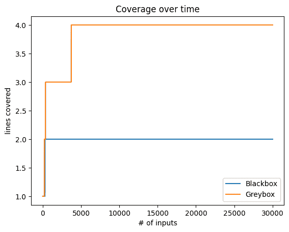
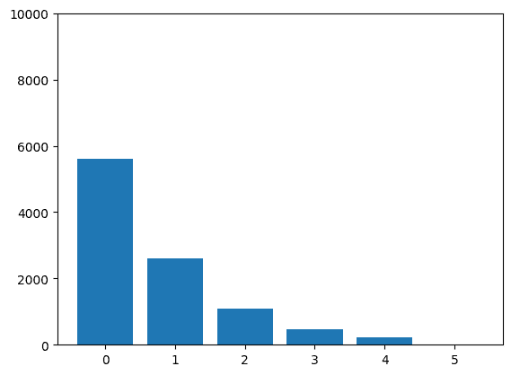
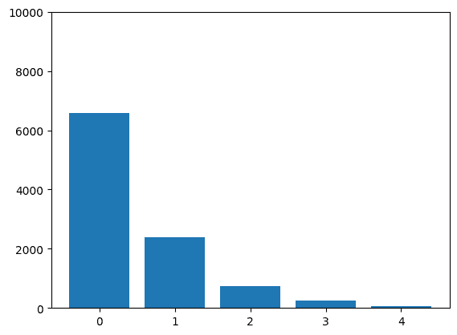
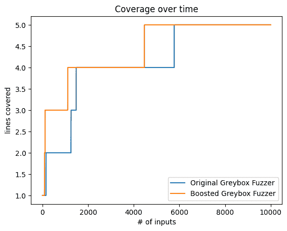
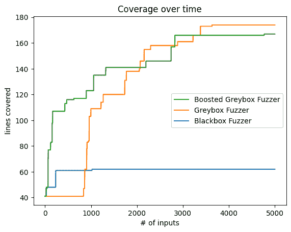
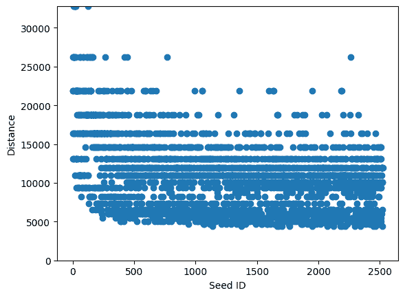

# 灰盒模糊测试

> 原文：[`www.fuzzingbook.org/html/GreyboxFuzzer.html`](http://www.fuzzingbook.org/html/GreyboxFuzzer.html)

在上一章中，我们介绍了基于突变的模糊测试技术，这是一种通过在给定输入上应用小突变来生成模糊输入的技术。在本章中，我们将展示如何*引导*这些突变以实现特定的目标，如覆盖率。本章中的算法源自流行的[American Fuzzy Lop](http://lcamtuf.coredump.cx/afl/) (AFL)模糊器，特别是其[AFLFast](https://github.com/mboehme/aflfast)和[AFLGo](https://github.com/aflgo/aflgo)版本。我们将探索 AFL 背后的灰盒模糊测试算法以及我们如何利用它来解决自动化漏洞检测的各种问题。

```py
from [bookutils](https://github.com/uds-se/fuzzingbook//tree/master/notebooks/shared/bookutils) import YouTubeVideo
YouTubeVideo('vBrNT9q2t1Y') 
```

**先决条件**

+   建议阅读关于基于突变的模糊测试的介绍 mutation-based fuzzing。

## 概述

要使用本章提供的代码，请编写

```py
>>> from fuzzingbook.GreyboxFuzzer import <identifier> 
```

然后利用以下功能。

本章介绍了受流行的 AFL 模糊器启发的灰盒模糊测试的高级方法。`GreyboxFuzzer`类有三个参数。首先，一个种子输入列表：

```py
>>> seed_input = "http://www.google.com/search?q=fuzzing"
>>> seeds = [seed_input] 
```

第二，一个*突变器*，它改变输入的各个部分。

```py
>>> mutator = Mutator() 
```

第三，一个*功率调度*，它将模糊测试努力分配给种群：

```py
>>> schedule = PowerSchedule() 
```

这三个参数进入`GreyboxFuzzer`构造函数：

```py
>>> greybox_fuzzer = GreyboxFuzzer(seeds=seeds, mutator=mutator, schedule=schedule) 
```

`GreyboxFuzzer`类与`FunctionCoverageRunner`一起使用：

```py
>>> http_runner = FunctionCoverageRunner(http_program)
>>> outcomes = greybox_fuzzer.runs(http_runner, trials=10000) 
```

模糊测试后，我们可以检查种群：

```py
>>> greybox_fuzzer.population[:20]
[http://www.google.com/search?q=fuzzing,
 http://ww.gomgle.com/searciq=fuzzing,
 |h>Att&p8?wwnOgle.cooarhl~Cp`uzza',
 http2Ot/*gv-VRgogec:om/rearc h=fu~i
 g,
 http"Ot/*gv-VRgogecom/rearc h=u~i
 f,
 http"Ot/g$vVRgogEecom/#reabc h=u~a
 f,
 httT`2Ot//:7ev^VRgoec:uom/re!6dctKc= hS;=fu-yH
 /,
 http'www&go/le.comm/sea:rh*?q=Ftzzifg,
 h4tpw://w.gomMle.m/weazciq=fuezzi.',
 h~Att&p8?ws_nOge.#ooarhBlw~Cp`uzza',
 ht8P:/wwvgkowcom/eacrh?q=f uzzing,
 httT`Ot//:7evVR"goec:uom/re!dctKc=hS;=fu-yH
 I,
 htp://ww.go/gl%.otm/wearch?q=f5zzing,
 httU`Ot//:7evVR"goec:uo2Jm/re#dctKc=hS;=fu-yH
 I,
 ht4p://ww.gomgle.co.serciq=fuzzing,
 httpp"OtSo*gv'VRgkg;eom/earcR >
 =u|in
 f,
 htP:/wwvgMolwcomeachq=f uzzine,
 htt://[/wwgwC6.]gogleg/lE.bo/_sEarcq9Afqwz"king,
 httT`Ot//:7evVR"goec:uom/re!dctKc=hS;=fu-yH
 I,
 tPK:,wIfvglwvc#omeaBc`9qOin] 
```

除了简单的`PowerSchedule`之外，我们还可以有高级的电源调度。

+   `AFLFastSchedule`将高能量分配给“不寻常”的路径，这些路径不太常被使用。

+   `AFLGoSchedule`将高能量分配给接近未覆盖程序位置的路径。

`AFLGoSchedule`类的构造函数需要一个从每个节点到目标位置的`distance`度量，这是通过分析程序代码确定的。详见本章内容。

<svg width="861pt" height="460pt" viewBox="0.00 0.00 860.88 460.00" xmlns:xlink="http://www.w3.org/1999/xlink"><g id="graph0" class="graph" transform="scale(1 1) rotate(0) translate(4 456)"><g id="node1" class="node"><title>CountingGreyboxFuzzer</title> <g id="a_node1"><a xlink:href="#" xlink:title="class CountingGreyboxFuzzer:">

计算个别路径被执行的频率。"><text text-anchor="start" x="13.25" y="-50.08" font-family="Patua One, Helvetica, sans-serif" font-weight="bold" font-size="14.00" fill="#b03a2e">CountingGreyboxFuzzer</text> <g id="a_node1_0"><a xlink:href="#" xlink:title="CountingGreyboxFuzzer"><g id="a_node1_1"><a xlink:href="#" xlink:title="run(self, runner: MutationFuzzer.FunctionCoverageRunner) -> Tuple[Any, str]:">

通知调度器路径频率"><text text-anchor="start" x="67.25" y="-27.88" font-family="'Fira Mono', 'Source Code Pro', 'Courier', monospace" font-weight="bold" font-style="italic" font-size="10.00">run()</text></a></g> <g id="a_node1_2"><a xlink:href="#" xlink:title="reset(self):">

重置路径频率"><text text-anchor="start" x="67.25" y="-15.12" font-family="'Fira Mono', 'Source Code Pro', 'Courier', monospace" font-style="italic" font-size="10.00">reset()</text></a></g></a></g></a></g></g> <g id="node2" class="node"><title>GreyboxFuzzer</title> <g id="a_node2"><a xlink:href="#" xlink:title="class GreyboxFuzzer:

基于覆盖率的变异模糊测试。"><text text-anchor="start" x="41.75" y="-172.07" font-family="Patua One, Helvetica, sans-serif" font-weight="bold" font-size="14.00" fill="#b03a2e">GreyboxFuzzer</text> <g id="a_node2_3"><a xlink:href="#" xlink:title="GreyboxFuzzer"><g id="a_node2_4"><a xlink:href="#" xlink:title="run(self, runner: MutationFuzzer.FunctionCoverageRunner) -> Tuple[Any, str]:

在跟踪覆盖率的同时运行函数(inp)。

如果我们达到新的覆盖率，

将输入添加到种群及其覆盖率到种群覆盖率"><text text-anchor="start" x="67.25" y="-149.88" font-family="'Fira Mono', 'Source Code Pro', 'Courier', monospace" font-weight="bold" font-style="italic" font-size="10.00">run()</text></a></g> <g id="a_node2_5"><a xlink:href="#" xlink:title="reset(self):

重置初始种群、种子索引、覆盖率信息"><text text-anchor="start" x="67.25" y="-137.12" font-family="'Fira Mono', 'Source Code Pro', 'Courier', monospace" font-style="italic" font-size="10.00">reset()</text></a></g></a></g></a></g></g> <g id="edge1" class="edge"><title>CountingGreyboxFuzzer->GreyboxFuzzer</title></g> <g id="node3" class="node"><title>AdvancedMutationFuzzer</title> <g id="a_node3"><a xlink:href="#" xlink:title="class AdvancedMutationFuzzer:

基于变异的模糊测试的基类。"><text text-anchor="start" x="8" y="-313.2" font-family="Patua One, Helvetica, sans-serif" font-weight="bold" font-size="14.00" fill="#b03a2e">AdvancedMutationFuzzer</text> <g id="a_node3_6"><a xlink:href="#" xlink:title="AdvancedMutationFuzzer"><g id="a_node3_7"><a xlink:href="#" xlink:title="__init__(self, seeds: List[str], mutator: Mutator, schedule: PowerSchedule) -> None:

构造函数。

`seeds` - 要变异的（输入）字符串列表。

`mutator` - 要应用的变异器。

`schedule` - 应用此处的电源调度。

返回每个种子一次，然后生成新的输入"><text text-anchor="start" x="34.25" y="-278.25" font-family="'Fira Mono', 'Source Code Pro', 'Courier', monospace" font-weight="bold" font-style="italic" font-size="10.00">fuzz()</text></a></g> <g id="a_node3_9"><a xlink:href="#" xlink:title="create_candidate(self) -> str:

返回通过在种群中模糊化种子生成的输入"><text text-anchor="start" x="34.25" y="-264.5" font-family="'Fira Mono', 'Source Code Pro', 'Courier', monospace" font-size="10.00">create_candidate()</text></a></g> <g id="a_node3_10"><a xlink:href="#" xlink:title="reset(self) -> None:

重置初始种群和种子索引"><text text-anchor="start" x="34.25" y="-252.75" font-family="'Fira Mono', 'Source Code Pro', 'Courier', monospace" font-style="italic" font-size="10.00">reset()</text></a></g></a></g></a></g></g> <g id="edge2" class="edge"><title>GreyboxFuzzer->AdvancedMutationFuzzer</title></g> <g id="node4" class="node"><title>Fuzzer</title> <g id="a_node4"><a xlink:href="Fuzzer.html" xlink:title="class Fuzzer:

模糊器的基类。"><text text-anchor="start" x="67.62" y="-435.2" font-family="Patua One, Helvetica, sans-serif" font-weight="bold" font-size="14.00" fill="#b03a2e">Fuzzer</text> <g id="a_node4_11"><a xlink:href="#" xlink:title="Fuzzer"><g id="a_node4_12"><a xlink:href="Fuzzer.html" xlink:title="__init__(self) -> None:

构造函数"><text text-anchor="start" x="58.25" y="-413" font-family="'Fira Mono', 'Source Code Pro', 'Courier', monospace" font-weight="bold" font-style="italic" font-size="10.00">__init__()</text></a></g> <g id="a_node4_13"><a xlink:href="Fuzzer.html" xlink:title="reset(self) -> str:

返回模糊输入"><text text-anchor="start" x="58.25" y="-400.25" font-family="'Fira Mono', 'Source Code Pro', 'Courier', monospace" font-weight="bold" font-style="italic" font-size="10.00">fuzz()</text></a></g> <g id="a_node4_14"><a xlink:href="Fuzzer.html" xlink:title="run(self, runner: Fuzzer.Runner = <Fuzzer.Runner object>) -> Tuple[subprocess.CompletedProcess, str]]:

以模糊输入运行`runner`"><text text-anchor="start" x="58.25" y="-387.5" font-family="'Fira Mono', 'Source Code Pro', 'Courier', monospace" font-weight="bold" font-style="italic" font-size="10.00">run()</text></a></g> <g id="a_node4_15"><a xlink:href="Fuzzer.html" xlink:title="__init__(self, runner: Fuzzer.Runner = <Fuzzer.PrintRunner object>, trials: int = 10) -> List[Tuple[subprocess.CompletedProcess, str]]:

以模糊输入运行`runner`，`trials`次"><text text-anchor="start" x="58.25" y="-374.75" font-family="'Fira Mono', 'Source Code Pro', 'Courier', monospace" font-weight="bold" font-size="10.00">runs()</text></a></g></a></g></a></g></g> <g id="edge3" class="edge"><title>AdvancedMutationFuzzer->Fuzzer</title></g> <g id="node5" class="node"><title>AFLFastSchedule</title> <g id="a_node5"><a xlink:href="#" xlink:title="class AFLFastSchedule:

在 AFL 中实现的指数级功率调度方案为 `<text text-anchor="start" x="186.5" y="-172.07" font-family="Patua One, Helvetica, sans-serif" font-weight="bold" font-size="14.00" fill="#b03a2e">AFLFastSchedule</text>` <g id="a_node5_16"><a xlink:href="#" xlink:title="AFLFastSchedule"><g id="a_node5_17"><a xlink:href="#" xlink:title="__init__(self, exponent: float) -> None:

构造函数"><text text-anchor="start" x="196.25" y="-149.88" font-family="'Fira Mono', 'Source Code Pro', 'Courier', monospace" font-weight="bold" font-style="italic" font-size="10.00">__init__()</text></a></g> <g id="a_node5_18"><a xlink:href="#" xlink:title="assignEnergy(self, population: collections.abc.Sequence[Seed]) -> None:

根据路径频率的倒数分配指数能量"><text text-anchor="start" x="196.25" y="-137.12" font-family="'Fira Mono', 'Source Code Pro', 'Courier', monospace" font-style="italic" font-size="10.00">assignEnergy()</text></a></g></a></g></a></g></g> <g id="node6" class="node"><title>PowerSchedule</title> <g id="a_node6"><a xlink:href="#" xlink:title="class PowerSchedule:

定义如何将模糊测试时间分配给种群。"><text text-anchor="start" x="270.38" y="-313.2" font-family="Patua One, Helvetica, sans-serif" font-weight="bold" font-size="14.00" fill="#b03a2e">PowerSchedule</text> <g id="a_node6_19"><a xlink:href="#" xlink:title="PowerSchedule"><g id="a_node6_20"><a xlink:href="#" xlink:title="__init__(self) -> None:

构造函数"><text text-anchor="start" x="263.25" y="-291" font-family="'Fira Mono', 'Source Code Pro', 'Courier', monospace" font-weight="bold" font-style="italic" font-size="10.00">__init__()</text></a></g> <g id="a_node6_21"><a xlink:href="#" xlink:title="assignEnergy(self, population: collections.abc.Sequence[Seed]) -> None:

为每个种子分配相同的能量"><text text-anchor="start" x="263.25" y="-278.25" font-family="'Fira Mono', 'Source Code Pro', 'Courier', monospace" font-style="italic" font-size="10.00">assignEnergy()</text></a></g> <g id="a_node6_22"><a xlink:href="#" xlink:title="choose(self, population: collections.abc.Sequence[Seed]) -> Seed:

根据归一化能量进行选择。"><text text-anchor="start" x="263.25" y="-264.5" font-family="'Fira Mono', 'Source Code Pro', 'Courier', monospace" font-size="10.00">choose()</text></a></g> <g id="a_node6_23"><a xlink:href="#" xlink:title="normalizedEnergy(self, population: collections.abc.Sequence[Seed]) -> List[float]:

归一化能量"><text text-anchor="start" x="263.25" y="-251.75" font-family="'Fira Mono', 'Source Code Pro', 'Courier', monospace" font-size="10.00">normalizedEnergy()</text></a></g></a></g></a></g></g> <g id="edge4" class="edge"><title>AFLFastSchedule->PowerSchedule</title></g> <g id="node7" class="node"><title>AFLGoSchedule</title> <g id="a_node7"><a xlink:href="#" xlink:title="class AFLGoSchedule:

将高能量分配给接近目标的种子"><text text-anchor="start" x="331" y="-43.7" font-family="Patua One, Helvetica, sans-serif" font-weight="bold" font-size="14.00" fill="#b03a2e">AFLGoSchedule</text> <g id="a_node7_24"><a xlink:href="#" xlink:title="AFLGoSchedule"><g id="a_node7_25"><a xlink:href="#" xlink:title="assignEnergy(self, population: collections.abc.Sequence[Seed]):

为每个种子分配与能量成反比的能量

到目标函数的平均距离。"><text text-anchor="start" x="336.25" y="-21.5" font-family="'Fira Mono', 'Source Code Pro', 'Courier', monospace" font-style="italic" font-size="10.00">assignEnergy()</text></a></g></a></g></a></g></g> <g id="node8" class="node"><title>DirectedSchedule</title> <g id="a_node8"><a xlink:href="#" xlink:title="class DirectedSchedule:

将高能量分配给接近某些目标的种子"><text text-anchor="start" x="325.75" y="-178.45" font-family="Patua One, Helvetica, sans-serif" font-weight="bold" font-size="14.00" fill="#b03a2e">DirectedSchedule</text> <g id="a_node8_26"><a xlink:href="#" xlink:title="DirectedSchedule"><g id="a_node8_27"><a xlink:href="#" xlink:title="__init__(self, distance: Dict[str, int], exponent: float) -> None:

构造函数"><text text-anchor="start" x="324.25" y="-156.25" font-family="'Fira Mono', 'Source Code Pro', 'Courier', monospace" font-weight="bold" font-style="italic" font-size="10.00">__init__()</text></a></g> <g id="a_node8_28"><a xlink:href="#" xlink:title="__getFunctions__(self, coverage: Set[Location]) -> Set[str]"><text text-anchor="start" x="324.25" y="-142.5" font-family="'Fira Mono', 'Source Code Pro', 'Courier', monospace" font-size="10.00">__getFunctions__()</text></a></g> <g id="a_node8_29"><a xlink:href="#" xlink:title="assignEnergy(self, population: collections.abc.Sequence[Seed]) -> None:

将每个种子的能量与目标函数的平均距离成反比分配

到目标函数的平均距离。"><text text-anchor="start" x="324.25" y="-130.75" font-family="'Fira Mono', 'Source Code Pro', 'Courier', monospace" font-style="italic" font-size="10.00">assignEnergy()</text></a></g></a></g></a></g></g> <g id="edge5" class="edge"><title>AFLGoSchedule->DirectedSchedule</title></g> <g id="edge6" class="edge"><title>DirectedSchedule->PowerSchedule</title></g> <g id="node9" class="node"><title>DictMutator</title> <g id="a_node9"><a xlink:href="#" xlink:title="class DictMutator:

`Mutator` 的变体，从字典中插入关键字"><text text-anchor="start" x="503.38" y="-50.08" font-family="Patua One, Helvetica, sans-serif" font-weight="bold" font-size="14.00" fill="#b03a2e">DictMutator</text> <g id="a_node9_30"><a xlink:href="#" xlink:title="DictMutator"><g id="a_node9_31"><a xlink:href="#" xlink:title="__init__(self, dictionary: collections.abc.Sequence[str]) -> None:

构造函数。

`dictionary` - 一组字符串列表，可以用作关键字"><text text-anchor="start" x="469.25" y="-27.88" font-family="'Fira Mono', 'Source Code Pro', 'Courier', monospace" font-weight="bold" font-style="italic" font-size="10.00">__init__()</text></a></g> <g id="a_node9_32"><a xlink:href="#" xlink:title="insert_from_dictionary(self, s: str) -> str:

返回插入字典中关键字后的`s`"><text text-anchor="start" x="469.25" y="-14.12" font-family="'Fira Mono', 'Source Code Pro', 'Courier', monospace" font-size="10.00">insert_from_dictionary()</text></a></g></a></g></a></g></g> <g id="node10" class="node"><title>变异器</title> <g id="a_node10"><a xlink:href="#" xlink:title="class Mutator:

变异字符串"><text text-anchor="start" x="515.38" y="-191.2" font-family="Patua One, Helvetica, sans-serif" font-weight="bold" font-size="14.00" fill="#b03a2e">变异器</text> <g id="a_node10_33"><a xlink:href="#" xlink:title="Mutator"><g id="a_node10_34"><a xlink:href="#" xlink:title="__init__(self) -> None:

构造函数"><text text-anchor="start" x="466.25" y="-169" font-family="'Fira Mono', 'Source Code Pro', 'Courier', monospace" font-weight="bold" font-style="italic" font-size="10.00">__init__()</text></a></g> <g id="a_node10_35"><a xlink:href="#" xlink:title="delete_random_character(self, s: str) -> str:

返回随机删除字符后的`s`"><text text-anchor="start" x="466.25" y="-155.25" font-family="'Fira Mono', 'Source Code Pro', 'Courier', monospace" font-size="10.00">delete_random_character()</text></a></g> <g id="a_node10_36"><a xlink:href="#" xlink:title="flip_random_character(self, s: str) -> str:

返回在随机位置翻转随机位的`s`"><text text-anchor="start" x="466.25" y="-142.5" font-family="'Fira Mono', 'Source Code Pro', 'Courier', monospace" font-size="10.00">flip_random_character()</text></a></g> <g id="a_node10_37"><a xlink:href="#" xlink:title="insert_random_character(self, s: str) -> str:

返回插入随机字符后的`s`"><text text-anchor="start" x="466.25" y="-129.75" font-family="'Fira Mono', 'Source Code Pro', 'Courier', monospace" font-size="10.00">insert_random_character()</text></a></g> <g id="a_node10_38"><a xlink:href="#" xlink:title="mutate(self, inp: Any) -> Any:

返回应用随机变异后的`s`。可以在子类中重载。"><text text-anchor="start" x="466.25" y="-118" font-family="'Fira Mono', 'Source Code Pro', 'Courier', monospace" font-style="italic" font-size="10.00">mutate()</text></a></g></a></g></a></g></g> <g id="edge7" class="edge"><title>DictMutator->Mutator</title></g> <g id="node11" class="node"><title>种子</title> <g id="a_node11"><a xlink:href="#" xlink:title="class Seed:

使用附加属性表示输入"><text text-anchor="start" x="663" y="-56.45" font-family="Patua One, Helvetica, sans-serif" font-weight="bold" font-size="14.00" fill="#b03a2e">种子</text> <g id="a_node11_39"><a xlink:href="#" xlink:title="Seed"><g id="a_node11_40"><a xlink:href="#" xlink:title="__init__(self, data: str) -> None:

从种子数据初始化"><text text-anchor="start" x="647.25" y="-34.25" font-family="'Fira Mono', 'Source Code Pro', 'Courier', monospace" font-weight="bold" font-size="10.00">__init__()</text></a></g> <g id="a_node11_41"><a xlink:href="#" xlink:title="__repr__(self) -> str:

返回数据作为种子的字符串表示"><text text-anchor="start" x="647.25" y="-20.5" font-family="'Fira Mono', 'Source Code Pro', 'Courier', monospace" font-size="10.00">__repr__()</text></a></g> <g id="a_node11_42"><a xlink:href="#" xlink:title="__str__(self) -> str:

返回数据作为种子的字符串表示"><text text-anchor="start" x="647.25" y="-7.75" font-family="'Fira Mono', 'Source Code Pro', 'Courier', monospace" font-size="10.00">__str__()</text></a></g></a></g></a></g></g> <g id="node12" class="node"><title>图例</title> <text text-anchor="start" x="733.62" y="-52.62" font-family="Patua One, Helvetica, sans-serif" font-weight="bold" font-size="10.00" fill="#b03a2e">图例</text> <text text-anchor="start" x="733.62" y="-42.62" font-family="Patua One, Helvetica, sans-serif" font-size="10.00">• </text> <text text-anchor="start" x="739.62" y="-42.62" font-family="'Fira Mono', 'Source Code Pro', 'Courier', monospace" font-weight="bold" font-size="8.00">public_method()</text> <text text-anchor="start" x="733.62" y="-32.62" font-family="Patua One, Helvetica, sans-serif" font-size="10.00">• </text> <text text-anchor="start" x="739.62" y="-32.62" font-family="'Fira Mono', 'Source Code Pro', 'Courier', monospace" font-size="8.00">private_method()</text> <text text-anchor="start" x="733.62" y="-22.62" font-family="Patua One, Helvetica, sans-serif" font-size="10.00">• </text> <text text-anchor="start" x="739.62" y="-22.62" font-family="'Fira Mono', 'Source Code Pro', 'Courier', monospace" font-style="italic" font-size="8.00">overloaded_method()</text> <text text-anchor="start" x="733.62" y="-13.57" font-family="Helvetica,sans-Serif" font-size="9.00">将鼠标悬停在名称上以查看文档</text></g></g></svg>

## AFL：一个有效的灰盒模糊测试器

本章中的算法源自流行的[美国模糊跳蚤](http://lcamtuf.coredump.cx/afl/) (AFL) 模糊测试器。

AFL 是一个 *基于变异的模糊测试器*。这意味着，AFL 通过稍微修改种子输入（即变异）或通过将一个输入的前半部分与另一个输入的后半部分连接起来（即拼接）来生成新的输入。

AFL 也是一个 *灰盒模糊测试器*（既不是黑盒也不是白盒）。这意味着，AFL 利用覆盖率反馈来学习如何深入程序。它不是完全的黑盒，因为 AFL 至少利用了 *一些* 程序分析。它也不是完全的白盒，因为 AFL 不会基于重量级的程序分析或约束求解。相反，AFL 使用轻量级程序插装来获取有关生成输入的（分支）覆盖率的一些信息。如果生成的输入增加了覆盖率，它将被添加到种子语料库以进行进一步的模糊测试。

为了对程序进行仪器化，AFL 在每次条件跳转指令之后注入一段代码。当执行时，这个所谓的跳板为执行的分支分配一个唯一的标识符并增加与该分支关联的计数器。为了效率，只维护粗略的分支命中计数。换句话说，对于每个输入，模糊器都知道哪些分支以及它们被大致使用了多少次。仪器化通常在编译时完成，即当程序源代码编译成可执行二进制文件时。然而，可以使用诸如虚拟机（例如，[QEMU](https://github.com/mirrorer/afl/blob/master/qemu_mode)）或动态仪器化工具（例如，[Intel PinTool](https://github.com/vanhauser-thc/afl-pin)）之类的工具在非仪器化二进制文件上运行 AFL。对于 Python 程序，我们可以在没有任何仪器化的情况下收集覆盖率信息（见收集覆盖率章节）。

## 灰盒模糊测试的成分

我们首先讨论在变异测试和目标引导中我们需要的最重要部分。

### 变异器

我们引入了用于变异种子的特定类。

```py
import [bookutils.setup](https://github.com/uds-se/fuzzingbook//tree/master/notebooks/shared/bookutils) 
```

```py
from [typing](https://docs.python.org/3/library/typing.html) import List, Set, Any, Tuple, Dict, Union
from [collections.abc](https://docs.python.org/3/library/collections.abc.html) import Sequence 
```

```py
import [random](https://docs.python.org/3/library/random.html) 
```

```py
from Coverage import population_coverage 
```

首先，我们将介绍`变异器`类。给定一个种子输入`inp`，变异器返回`inp`的一个略微修改的版本。在灰盒语法模糊测试章节中，我们扩展了这个类以考虑输入语法，以便进行智能灰盒模糊测试。

```py
class Mutator:
  """Mutate strings"""

    def __init__(self) -> None:
  """Constructor"""
        self.mutators = [
            self.delete_random_character,
            self.insert_random_character,
            self.flip_random_character
        ] 
```

对于插入操作，我们在随机位置添加一个随机字符。

```py
class Mutator(Mutator):
    def insert_random_character(self, s: str) -> str:
  """Returns s with a random character inserted"""
        pos = random.randint(0, len(s))
        random_character = chr(random.randrange(32, 127))
        return s[:pos] + random_character + s[pos:] 
```

对于删除操作，如果字符串非空，则在随机位置选择一个位置并删除字符。否则，使用插入操作。

```py
class Mutator(Mutator):
    def delete_random_character(self, s: str) -> str:
  """Returns s with a random character deleted"""
        if s == "":
            return self.insert_random_character(s)

        pos = random.randint(0, len(s) - 1)
        return s[:pos] + s[pos + 1:] 
```

对于替换操作，如果字符串非空，则在随机位置选择一个位置并翻转字符中的一个随机位。否则，使用插入操作。

```py
class Mutator(Mutator):
    def flip_random_character(self, s: str) -> str:
  """Returns s with a random bit flipped in a random position"""
        if s == "":
            return self.insert_random_character(s)

        pos = random.randint(0, len(s) - 1)
        c = s[pos]
        bit = 1 << random.randint(0, 6)
        new_c = chr(ord(c) ^ bit)
        return s[:pos] + new_c + s[pos + 1:] 
```

主要方法是`mutate`，它从操作符列表中选择一个随机的变异操作符。

```py
class Mutator(Mutator):
    def mutate(self, inp: Any) -> Any:  # can be str or Seed (see below)
  """Return s with a random mutation applied. Can be overloaded in subclasses."""
        mutator = random.choice(self.mutators)
        return mutator(inp) 
```

让我们尝试一下变异器。实际上，你可以与这样的“单元”进行交互，并通过将此章节作为 Jupyter 笔记本加载来尝试其他输入。打开后，使用“Kernel -> Restart & Run All”运行笔记本中的所有单元。

```py
Mutator().mutate("good") 
```

```py
'cood'

```

### 种子和功率调度

现在我们引入一个新概念；*功率调度*。功率调度将宝贵的模糊测试时间在种群中的种子之间分配。我们的目标是最大化在较短时间内导致覆盖率增加的（最进步的）种子所花费的时间。

我们称从种群中选择种子时出现的概率为种子的*能量*。在整个模糊测试活动中，我们希望优先考虑更有希望的种子。简单来说，我们不希望浪费能量在模糊测试非渐进种子上。我们将决定种子能量的过程称为模糊器的*功率调度*。例如，AFL 的调度会给更短的、执行速度更快且更频繁地增加覆盖率的种子分配更多的能量。

首先，除了种子数据外，我们还需要将一些信息附加到每个种子上。因此，我们定义以下 `Seed` 类。

```py
from Coverage import Location 
```

```py
class Seed:
  """Represent an input with additional attributes"""

    def __init__(self, data: str) -> None:
  """Initialize from seed data"""
        self.data = data

        # These will be needed for advanced power schedules
        self.coverage: Set[Location] = set()
        self.distance: Union[int, float] = -1
        self.energy = 0.0

    def __str__(self) -> str:
  """Returns data as string representation of the seed"""
        return self.data

    __repr__ = __str__ 
```

下面实现的能量调度方案为每个种子分配相同的能量。一旦种子在种群中，它将被模糊测试的次数与种群中的任何其他种子一样多。

在 Python 中，我们可以将长 for 循环压缩成更小的语句。

+   `lambda x: ...` 返回一个以 `x` 作为输入的函数。Lambda 允许快速定义未命名的函数。

+   `map(f, l)` 返回一个列表，其中函数 `f` 被应用于列表 `l` 中的每个元素。

+   `random.choices(l, weights)[0]` 返回元素 `l[i]`，其概率为 `weights[i]`。

```py
class PowerSchedule:
  """Define how fuzzing time should be distributed across the population."""

    def __init__(self) -> None:
  """Constructor"""
        self.path_frequency: Dict = {}

    def assignEnergy(self, population: Sequence[Seed]) -> None:
  """Assigns each seed the same energy"""
        for seed in population:
            seed.energy = 1

    def normalizedEnergy(self, population: Sequence[Seed]) -> List[float]:
  """Normalize energy"""
        energy = list(map(lambda seed: seed.energy, population))
        sum_energy = sum(energy)  # Add up all values in energy
        assert sum_energy != 0
        norm_energy = list(map(lambda nrg: nrg / sum_energy, energy))
        return norm_energy

    def choose(self, population: Sequence[Seed]) -> Seed:
  """Choose weighted by normalized energy."""
        self.assignEnergy(population)
        norm_energy = self.normalizedEnergy(population)
        seed: Seed = random.choices(population, weights=norm_energy)[0]
        return seed 
```

让我们看看这个能量调度方案是否均匀随机地选择种子。我们要求调度 10k 次从三个种子（A、B、C）的种群中选择一个种子，并记录我们看到每个种子的次数。我们应该看到每个种子大约 3.3k 次。

```py
population = [Seed("A"), Seed("B"), Seed("C")]
schedule = PowerSchedule()
hits = {
    "A": 0,
    "B": 0,
    "C": 0
} 
```

```py
for i in range(10000):
    seed = schedule.choose(population)
    hits[seed.data] += 1 
```

```py
hits 
```

```py
{'A': 3387, 'B': 3255, 'C': 3358}

```

看起来不错。每个种子大约有三分之一的时间被选中。

### 运行器和样本程序

我们将从一个小型的六行样本程序开始。为了在执行过程中收集覆盖率信息，我们导入 基于变异的模糊测试章节 中的 `FunctionCoverageRunner` 类。

`FunctionCoverageRunner` 构造函数接受一个 Python `函数` 来执行。`run` 函数接收一个输入，将其传递给 Python `函数`，并收集这次执行的覆盖率信息。`coverage()` 函数返回一个列表，包含 `(函数名, 行号)` 元组，表示 Python `函数` 中每个被覆盖的语句。

```py
from MutationFuzzer import FunctionCoverageRunner, http_program 
```

`crashme()` 函数对输入 "bad!" 抛出异常。让我们看看对于输入 "good"，哪些语句被覆盖。

```py
def crashme(s: str) -> None:
    if len(s) > 0 and s[0] == 'b':
        if len(s) > 1 and s[1] == 'a':
            if len(s) > 2 and s[2] == 'd':
                if len(s) > 3 and s[3] == '!':
                    raise Exception() 
```

```py
crashme_runner = FunctionCoverageRunner(crashme)
crashme_runner.run("good")
list(crashme_runner.coverage()) 
```

```py
[('run_function', 132), ('crashme', 2)]

```

在 `crashme` 中，输入 "good" 只覆盖了第 2 行的 if-语句。分支条件 `len(s) > 0 and s[0] == 'b'` 评估为 False。

## 高级黑盒基于变异的模糊测试

让我们将突变体和能量调度方案整合到一个模糊测试器中。我们将从一个黑盒模糊测试器开始 -- 它不利用任何覆盖率信息。

我们的 `AdvancedMutationFuzzer` 类是 `MutationFuzzer` 类的高级和 *参数化* 版本，后者来自 基于变异的模糊测试章节。它还继承自 Fuzzer 类。目前，我们只需要知道 `fuzz()` 函数，它返回一个生成的输入，以及 `runs()` 函数，它执行 `fuzz()` 指定次数。对于我们的 `AdvancedMutationFuzzer` 类，我们重写了 `fuzz()` 函数。

```py
from Fuzzer import Fuzzer 
```

`AdvancedMutationFuzzer`使用一组初始种子、一个突变器和一个功率计划来构建。在整个模糊测试活动中，它维护一个称为`population`的种子集合。`fuzz`函数返回初始种子中的一个未模糊种子，或者对集合中的种子进行模糊测试的结果。`create_candidate`函数处理后者。它从集合中随机选择一个输入，并应用多个突变。

```py
class AdvancedMutationFuzzer(Fuzzer):
  """Base class for mutation-based fuzzing."""

    def __init__(self, seeds: List[str],
                 mutator: Mutator,
                 schedule: PowerSchedule) -> None:
  """Constructor.
 `seeds` - a list of (input) strings to mutate.
 `mutator` - the mutator to apply.
 `schedule` - the power schedule to apply.
 """
        self.seeds = seeds
        self.mutator = mutator
        self.schedule = schedule
        self.inputs: List[str] = []
        self.reset()

    def reset(self) -> None:
  """Reset the initial population and seed index"""
        self.population = list(map(lambda x: Seed(x), self.seeds))
        self.seed_index = 0

    def create_candidate(self) -> str:
  """Returns an input generated by fuzzing a seed in the population"""
        seed = self.schedule.choose(self.population)

        # Stacking: Apply multiple mutations to generate the candidate
        candidate = seed.data
        trials = min(len(candidate), 1 << random.randint(1, 5))
        for i in range(trials):
            candidate = self.mutator.mutate(candidate)
        return candidate

    def fuzz(self) -> str:
  """Returns first each seed once and then generates new inputs"""
        if self.seed_index < len(self.seeds):
            # Still seeding
            self.inp = self.seeds[self.seed_index]
            self.seed_index += 1
        else:
            # Mutating
            self.inp = self.create_candidate()

        self.inputs.append(self.inp)
        return self.inp 
```

好的，让我们试一下突变 fuzzer。给定一个种子，我们要求它生成三个输入。

```py
seed_input = "good"
mutation_fuzzer = AdvancedMutationFuzzer([seed_input], Mutator(), PowerSchedule())
print(mutation_fuzzer.fuzz())
print(mutation_fuzzer.fuzz())
print(mutation_fuzzer.fuzz()) 
```

```py
good
gDoodC
/

```

让我们看看基于突变的黑盒 fuzzer 在 n=30k 个输入的活动中覆盖了多少条语句。

fuzzer 函数`runs(crashme_runner, trials=n)`生成`n`个输入，并通过`crashme_runner`在`crashme`函数上执行它们。如前所述，`crashme_runner`还收集覆盖率信息。

```py
import [time](https://docs.python.org/3/library/time.html) 
```

```py
n = 30000 
```

```py
blackbox_fuzzer = AdvancedMutationFuzzer([seed_input], Mutator(), PowerSchedule())

start = time.time()
blackbox_fuzzer.runs(FunctionCoverageRunner(crashme), trials=n)
end = time.time()

"It took the blackbox mutation-based fuzzer %0.2f seconds to generate and execute %d inputs." % (end - start, n) 
```

```py
'It took the blackbox mutation-based fuzzer 4.21 seconds to generate and execute 30000 inputs.'

```

为了衡量覆盖率，我们导入 population_coverage 函数。它接受一组输入和一个 Python 函数，在该函数上执行输入并收集覆盖率信息。具体来说，它返回一个元组`(all_coverage, cumulative_coverage)`，其中`all_coverage`是所有输入覆盖的语句集合，`cumulative_coverage`是随着执行输入数量的增加而覆盖的语句数量。我们只对后者感兴趣，以便绘制覆盖率随时间的变化。

我们从黑盒 fuzzer 中提取生成的输入，并随着输入数量的增加来衡量覆盖率。

```py
_, blackbox_coverage = population_coverage(blackbox_fuzzer.inputs, crashme)
bb_max_coverage = max(blackbox_coverage)

"The blackbox mutation-based fuzzer achieved a maximum coverage of %d statements." % bb_max_coverage 
```

```py
'The blackbox mutation-based fuzzer achieved a maximum coverage of 2 statements.'

```

以下生成的输入增加了我们`crashme` 示例的覆盖率。

```py
[seed_input] + \
    [
        blackbox_fuzzer.inputs[idx] for idx in range(len(blackbox_coverage))
        if blackbox_coverage[idx] > blackbox_coverage[idx - 1]
    ] 
```

```py
['good', 'bo']

```

***总结***。这是一个基于黑盒突变的 fuzzer 是如何工作的。我们集成了*突变器*来通过模糊提供的初始种子集生成输入，以及*功率计划*来决定下一个选择哪个种子。

## 灰盒基于突变的模糊测试

与黑盒 fuzzer 相比，像[AFL](http://lcamtuf.coredump.cx/afl/)这样的灰盒 fuzzer *确实*利用覆盖率信息。具体来说，灰盒 fuzzer 将增加代码覆盖率的输入添加到种子集合中。

`run()`方法是从 Fuzzer 类继承的。它被调用以生成并执行恰好一个输入。我们重写这个函数，向`population`添加一个输入以增加覆盖率。灰盒 fuzzer 属性`coverages_seen`维护了之前已覆盖的语句集合。

```py
class GreyboxFuzzer(AdvancedMutationFuzzer):
  """Coverage-guided mutational fuzzing."""

    def reset(self):
  """Reset the initial population, seed index, coverage information"""
        super().reset()
        self.coverages_seen = set()
        self.population = []  # population is filled during greybox fuzzing

    def run(self, runner: FunctionCoverageRunner) -> Tuple[Any, str]:
  """Run function(inp) while tracking coverage.
 If we reach new coverage,
 add inp to population and its coverage to population_coverage
 """
        result, outcome = super().run(runner)
        new_coverage = frozenset(runner.coverage())
        if new_coverage not in self.coverages_seen:
            # We have new coverage
            seed = Seed(self.inp)
            seed.coverage = runner.coverage()
            self.coverages_seen.add(new_coverage)
            self.population.append(seed)

        return (result, outcome) 
```

让我们试一下我们的灰盒 fuzzer。

```py
seed_input = "good"
greybox_fuzzer = GreyboxFuzzer([seed_input], Mutator(), PowerSchedule())

start = time.time()
greybox_fuzzer.runs(FunctionCoverageRunner(crashme), trials=n)
end = time.time()

"It took the greybox mutation-based fuzzer %0.2f seconds to generate and execute %d inputs." % (end - start, n) 
```

```py
'It took the greybox mutation-based fuzzer 4.23 seconds to generate and execute 30000 inputs.'

```

在生成相同数量的测试输入后，灰盒 fuzzer 覆盖了更多的语句吗？

```py
_, greybox_coverage = population_coverage(greybox_fuzzer.inputs, crashme)
gb_max_coverage = max(greybox_coverage)

"Our greybox mutation-based fuzzer covers %d more statements" % (gb_max_coverage - bb_max_coverage) 
```

```py
'Our greybox mutation-based fuzzer covers 2 more statements'

```

我们示例的种子集合现在包含以下种子。

```py
greybox_fuzzer.population 
```

```py
[good, bo, baof, bad4u]

```

覆盖率反馈确实很有帮助。新的种子就像面包屑或里程碑，引导模糊器更快地进入更深的代码区域。以下是一个简单的图表，显示了两个模糊器在简单 示例 上的覆盖率随时间的变化。

```py
%matplotlib inline 
```

```py
import [matplotlib.pyplot](https://matplotlib.org/) as plt 
```

```py
line_bb, = plt.plot(blackbox_coverage, label="Blackbox")
line_gb, = plt.plot(greybox_coverage, label="Greybox")
plt.legend(handles=[line_bb, line_gb])
plt.title('Coverage over time')
plt.xlabel('# of inputs')
plt.ylabel('lines covered'); 
```



***总结***。我们已经看到灰盒模糊器“发现”了可以导致更多进展的有趣种子。从输入 `good` 开始，我们的灰盒模糊器逐渐学会了如何生成输入 `bad!`，这会引发异常。现在，我们如何能更快地做到这一点？

***尝试一下***。使用黑盒 *基于生成* 的模糊器，在一段时间内能实现多少覆盖率？尝试绘制所有三个模糊器的覆盖率图。您可以将黑盒基于生成的模糊器定义为以下内容。

```py
from Fuzzer import RandomFuzzer
blackbox_gen_fuzzer = RandomFuzzer(min_length=4, max_length=4, char_start=32, char_range=96) 
```

您可以通过将此章节作为 Jupyter 笔记本打开来执行自己的代码。

***阅读***。这是 AFL 的工作的高级视图，AFL 是最成功的漏洞检测工具之一。如果您对技术细节感兴趣，请参阅：[`github.com/mirrorer/afl/blob/master/docs/technical_details.txt`](https://github.com/mirrorer/afl/blob/master/docs/technical_details.txt)

## Boosted Greybox Fuzzing

我们的增强灰盒模糊器为承诺实现更多覆盖的种子分配更多能量。我们改变功率计划，使得执行“不寻常”路径的种子有更多能量。我们所说的 *不寻常路径* 是指生成的输入很少执行的路径。

为了确定输入执行了哪个路径，我们利用 跟踪覆盖率 部分的 `getPathID` 函数。

```py
import [pickle](https://docs.python.org/3/library/pickle.html)   # serializes an object by producing a byte array from all the information in the object
import [hashlib](https://docs.python.org/3/library/hashlib.html)  # produces a 128-bit hash value from a byte array 
```

函数 `getPathID` 返回一个覆盖集的唯一哈希值。

```py
def getPathID(coverage: Any) -> str:
  """Returns a unique hash for the covered statements"""
    pickled = pickle.dumps(sorted(coverage))
    return hashlib.md5(pickled).hexdigest() 
```

根据执行路径的异常程度，有几种方法来分配能量。在这种情况下，我们实现了一个 *指数功率计划*，它计算种子 $s$ 的能量 $e(s)$ 如下 $$e(s) = \frac{1}{f(p(s))^a}$$ 其中

+   $p(s)$ 返回由 $s$ 执行的路径的 ID，

+   $f(p)$ 返回路径 $p$ 被生成输入执行的次数，并且

+   $a$ 是一个给定的指数。

```py
class AFLFastSchedule(PowerSchedule):
  """Exponential power schedule as implemented in AFL"""

    def __init__(self, exponent: float) -> None:
        self.exponent = exponent

    def assignEnergy(self, population: Sequence[Seed]) -> None:
  """Assign exponential energy inversely proportional to path frequency"""
        for seed in population:
            seed.energy = 1 / (self.path_frequency[getPathID(seed.coverage)] ** self.exponent) 
```

在灰盒模糊器中，让我们跟踪每个路径 $p$ 被执行 $f(p)$ 的次数，并更新功率计划。

```py
class CountingGreyboxFuzzer(GreyboxFuzzer):
  """Count how often individual paths are exercised."""

    def reset(self):
  """Reset path frequency"""
        super().reset()
        self.schedule.path_frequency = {}

    def run(self, runner: FunctionCoverageRunner) -> Tuple[Any, str]:
  """Inform scheduler about path frequency"""
        result, outcome = super().run(runner)

        path_id = getPathID(runner.coverage())
        if path_id not in self.schedule.path_frequency:
            self.schedule.path_frequency[path_id] = 1
        else:
            self.schedule.path_frequency[path_id] += 1

        return(result, outcome) 
```

好的，让我们在我们的简单 示例 上运行我们的增强灰盒模糊器 $n=10k$ 次。我们将指数功率计划的指数设置为 $a=5$。

```py
n = 10000
seed_input = "good"
fast_schedule = AFLFastSchedule(5)
fast_fuzzer = CountingGreyboxFuzzer([seed_input], Mutator(), fast_schedule)
start = time.time()
fast_fuzzer.runs(FunctionCoverageRunner(crashme), trials=n)
end = time.time()

"It took the fuzzer w/ exponential schedule %0.2f seconds to generate and execute %d inputs." % (end - start, n) 
```

```py
'It took the fuzzer w/ exponential schedule 1.54 seconds to generate and execute 10000 inputs.'

```

```py
import [numpy](https://numpy.org/) as np 
```

```py
x_axis = np.arange(len(fast_schedule.path_frequency))
y_axis = list(fast_schedule.path_frequency.values())

plt.bar(x_axis, y_axis)
plt.xticks(x_axis)
plt.ylim(0, n)
# plt.yscale("log")
# plt.yticks([10,100,1000,10000])
plt; 
```



```py
print("             path id 'p'           : path frequency 'f(p)'")
fast_schedule.path_frequency 
```

```py
             path id 'p'           : path frequency 'f(p)'

```

```py
{'e014b68ad4f3bc2daf207e2498d14cbf': 5615,
 '0a1008773804033d8a4c0e3aba4b96a0': 2597,
 'eae4df5b039511eac56625f47c337d24': 1098,
 'b14f545c3b39716a455034d9a0c61b8c': 454,
 '11529f85aaa30be08110f3076748e420': 235,
 '669903139e4064f7f07bc8b200fd2d26': 1}

```

它与我们的具有经典功率计划的灰盒模糊器相比如何？

```py
seed_input = "good"
orig_schedule = PowerSchedule()
orig_fuzzer = CountingGreyboxFuzzer([seed_input], Mutator(), orig_schedule)
start = time.time()
orig_fuzzer.runs(FunctionCoverageRunner(crashme), trials=n)
end = time.time()

"It took the fuzzer w/ original schedule %0.2f seconds to generate and execute %d inputs." % (end - start, n) 
```

```py
'It took the fuzzer w/ original schedule 1.43 seconds to generate and execute 10000 inputs.'

```

```py
x_axis = np.arange(len(orig_schedule.path_frequency))
y_axis = list(orig_schedule.path_frequency.values())

plt.bar(x_axis, y_axis)
plt.xticks(x_axis)
plt.ylim(0, n)
# plt.yscale("log")
# plt.yticks([10,100,1000,10000])
plt; 
```



```py
print("             path id 'p'           : path frequency 'f(p)'")
orig_schedule.path_frequency 
```

```py
             path id 'p'           : path frequency 'f(p)'

```

```py
{'e014b68ad4f3bc2daf207e2498d14cbf': 6579,
 '0a1008773804033d8a4c0e3aba4b96a0': 2381,
 'eae4df5b039511eac56625f47c337d24': 737,
 'b14f545c3b39716a455034d9a0c61b8c': 241,
 '11529f85aaa30be08110f3076748e420': 62}

```

指数功率计划会从“高频路径”的执行中削减一些，并将它们添加到低频路径中。执行最少的路径要么在传统的功率计划中根本不执行，要么执行得很少。

让我们看看分配给发现种子的能量。

```py
orig_energy = orig_schedule.normalizedEnergy(orig_fuzzer.population)

for (seed, norm_energy) in zip(orig_fuzzer.population, orig_energy):
    print("'%s', %0.5f, %s" % (getPathID(seed.coverage),
                               norm_energy, repr(seed.data))) 
```

```py
'e014b68ad4f3bc2daf207e2498d14cbf', 0.20000, 'good'
'0a1008773804033d8a4c0e3aba4b96a0', 0.20000, 'bgI/d'
'eae4df5b039511eac56625f47c337d24', 0.20000, 'baI/dt'
'b14f545c3b39716a455034d9a0c61b8c', 0.20000, 'badtuS'
'11529f85aaa30be08110f3076748e420', 0.20000, 'bad!`tuS'

```

```py
fast_energy = fast_schedule.normalizedEnergy(fast_fuzzer.population)

for (seed, norm_energy) in zip(fast_fuzzer.population, fast_energy):
    print("'%s', %0.5f, %s" % (getPathID(seed.coverage),
                               norm_energy, repr(seed.data))) 
```

```py
'e014b68ad4f3bc2daf207e2498d14cbf', 0.00000, 'good'
'0a1008773804033d8a4c0e3aba4b96a0', 0.00000, 'bnd'
'eae4df5b039511eac56625f47c337d24', 0.00000, 'ba.'
'b14f545c3b39716a455034d9a0c61b8c', 0.00000, 'bad.'
'11529f85aaa30be08110f3076748e420', 0.00000, 'bad!\\.'
'669903139e4064f7f07bc8b200fd2d26', 1.00000, 'bad!\\.'

```

正确。我们新的指数功率计划将大部分能量分配给练习最低频率路径的种子。

让我们比较它们在时间上达到的覆盖率，以我们的简单示例为例。

```py
_, orig_coverage = population_coverage(orig_fuzzer.inputs, crashme)
_, fast_coverage = population_coverage(fast_fuzzer.inputs, crashme)
line_orig, = plt.plot(orig_coverage, label="Original Greybox Fuzzer")
line_fast, = plt.plot(fast_coverage, label="Boosted Greybox Fuzzer")
plt.legend(handles=[line_orig, line_fast])
plt.title('Coverage over time')
plt.xlabel('# of inputs')
plt.ylabel('lines covered'); 
```



如预期的那样，增强型灰盒模糊器（使用指数功率计划）达到覆盖率的速度更快。

***总结***。通过更频繁地模糊练习低频率路径的种子，我们可以以更有效的方式探索程序路径。

***尝试一下***。你可以尝试快速功率计划的其它指数，或者完全改变功率计划。注意，大的指数可能导致浮点运算中的溢出和不精确，产生意外的结果。你可以通过将此章节作为 Jupyter 笔记本打开来执行自己的代码。

***阅读***。你可以在论文"[基于覆盖率的灰盒模糊作为马尔可夫链](https://mboehme.github.io/paper/CCS16.pdf)"[[Böhme 等人，2018](https://mboehme.github.io/paper/CCS16.pdf)]中了解更多关于模糊器增强的信息，并查看 AFL 中的实现[[`github.com/mboehme/aflfast`](http://github.com/mboehme/aflfast)]。

## 复杂示例：HTMLParser

让我们比较三个模糊器在一个更现实的例子上的表现，Python 的[HTML 解析器](https://docs.python.org/3/library/html.parser.html)。我们在 HTMLParser 上运行所有三个模糊器$n=5k$次，从“空”种子开始。

```py
from [html.parser](https://docs.python.org/3/library/html.parser.html) import HTMLParser 
```

```py
# create wrapper function
def my_parser(inp: str) -> None:
    parser = HTMLParser()  # resets the HTMLParser object for every fuzz input
    parser.feed(inp) 
```

```py
n = 5000
seed_input = " "  # empty seed
blackbox_fuzzer = AdvancedMutationFuzzer([seed_input], Mutator(), PowerSchedule())
greybox_fuzzer = GreyboxFuzzer([seed_input], Mutator(), PowerSchedule())
boosted_fuzzer = CountingGreyboxFuzzer([seed_input], Mutator(), AFLFastSchedule(5)) 
```

```py
start = time.time()
blackbox_fuzzer.runs(FunctionCoverageRunner(my_parser), trials=n)
greybox_fuzzer.runs(FunctionCoverageRunner(my_parser), trials=n)
boosted_fuzzer.runs(FunctionCoverageRunner(my_parser), trials=n)
end = time.time()

"It took all three fuzzers %0.2f seconds to generate and execute %d inputs." % (end - start, n) 
```

```py
'It took all three fuzzers 11.23 seconds to generate and execute 5000 inputs.'

```

模糊器在覆盖率方面的比较如何？

```py
_, black_coverage = population_coverage(blackbox_fuzzer.inputs, my_parser)
_, grey_coverage = population_coverage(greybox_fuzzer.inputs, my_parser)
_, boost_coverage = population_coverage(boosted_fuzzer.inputs, my_parser)
line_black, = plt.plot(black_coverage, label="Blackbox Fuzzer")
line_grey, = plt.plot(grey_coverage, label="Greybox Fuzzer")
line_boost, = plt.plot(boost_coverage, label="Boosted Greybox Fuzzer")
plt.legend(handles=[line_boost, line_grey, line_black])
plt.title('Coverage over time')
plt.xlabel('# of inputs')
plt.ylabel('lines covered'); 
```



两种灰盒模糊器明显优于黑盒模糊器。原因是灰盒模糊器“发现”了沿途的有趣输入。让我们看看灰盒模糊器和黑盒模糊器生成的最后 10 个输入。

```py
blackbox_fuzzer.inputs[-10:] 
```

```py
['2 ', '', 'A ', '', '`', '!', '', '', '', '(']

```

```py
greybox_fuzzer.inputs[-10:] 
```

```py
['\x00',
 '(0<2q$V\x00"jy}Kz',
 '_NrGlffJ%\x14=',
 '2&8,gBa',
 '',
 'W_&k\\<C<hoPqv',
 '*&\x05t4<&d@R%',
 '0aO<4\x06',
 'i:',
 'iFK&</\x06']

```

灰盒模糊器执行更复杂的输入，其中许多包括特殊字符，如开闭括号和箭头（即`<, >, [, ]`）。然而，许多重要关键词，如`<html>`仍然缺失。

为了让模糊器了解这些重要关键词，我们需要语法；在智能灰盒模糊的部分，我们将它们与上述技术结合起来。

***尝试一下***。你可以重新运行这些实验来理解模糊实验的变异性。有时，我们声称优于较差模糊器的模糊器似乎并没有优于较差的模糊器。为了做到这一点，你只需要将此章节作为 Jupyter 笔记本打开。

## 指导灰盒模糊

有时，你只想让模糊器到达源代码中的某些危险位置。这可能是一个你期望缓冲区溢出的位置。或者你想测试代码库中的最近更改。我们如何指导模糊器向这些位置移动？

在本章中，我们将指导灰盒模糊作为优化问题进行介绍。

### 解决迷宫

为了提供一个你可以轻松改变代码复杂度和目标位置的具有意义的示例，我们从提供的字符串形式的迷宫生成迷宫源代码。这个例子大致基于 Felipe Andres Manzano（快速致意！）关于符号执行的旧[博客文章](https://feliam.wordpress.com/2010/10/07/the-symbolic-maze/)。

你只需指定迷宫为一个字符串。就像这样。

```py
maze_string = """
+-+-----+
|X|     |
| | --+ |
| |   | |
| +-- | |
|     |#|
+-----+-+
""" 
```

代码是通过`generate_maze_code()`函数生成的。我们将隐藏实现细节，而是解释它做了什么。如果你对编码感兴趣，请点击这里。

```py
from ControlFlow import generate_maze_code 
```

```py
maze_code = generate_maze_code(maze_string) 
```

```py
exec(maze_code) 
```

目标是通过提供输入`D`（向下），`U`（向上），`L`（向左），`R`（向右）来将“X”移动到“#”。

```py
print(maze("DDDDRRRRUULLUURRRRDDDD"))  # Appending one more 'D', you have reached the target. 
```

```py
SOLVED

+-+-----+
| |     |
| | --+ |
| |   | |
| +-- | |
|     |X|
+-----+-+

```

`maze_string`中的每个字符代表一个瓦片。对于每个瓦片，生成一个瓦片函数。

+   如果当前瓦片是“良性”（`` ` ``），则调用对应于下一个输入字符（D，U，L，R）的瓦片函数。意外的输入字符将被忽略。如果没有更多的输入字符，它将返回“VALID”和当前迷宫状态。

+   如果当前瓦片是“陷阱”（`+`,`|`,`-`），它将返回“INVALID”和当前迷宫状态。

+   如果当前瓦片是“目标”（`#`），它将返回“SOLVED”和当前迷宫状态。

***尝试一下***。你可以测试其他输入字符序列，甚至完全更改迷宫。为了执行自己的代码，你只需要将此章节作为 Jupyter 笔记本打开。

为了了解生成的代码，让我们看看静态[调用图](https://en.wikipedia.org/wiki/Call_graph)。调用图显示了函数可以执行的顺序。

```py
from ControlFlow import callgraph 
```

```py
callgraph(maze_code) 
```

<svg width="3918pt" height="2233pt" viewBox="0.00 0.00 3918.15 2232.72" xmlns:xlink="http://www.w3.org/1999/xlink"><g id="graph0" class="graph" transform="scale(1 1) rotate(0) translate(4 2228.72)"><title>G</title> <g id="clust1" class="cluster"><title>cluster_G</title></g> <g id="clust2" class="cluster"><title>cluster_callgraphX</title> <text text-anchor="middle" x="1913.65" y="-2191.42" font-family="Times,serif" font-size="14.00">callgraph</text></g> <g id="node1" class="node"><title>callgraphX</title> <text text-anchor="middle" x="3852.15" y="-1883.63" font-family="Times,serif" font-size="14.00" fill="#000000">callgraph</text></g> <g id="node2" class="node"><title>callgraphX__maze</title> <text text-anchor="middle" x="1956.15" y="-2153.61" font-family="Times,serif" font-size="14.00" fill="#000000">maze</text> <text text-anchor="middle" x="1956.15" y="-2139.36" font-family="Times,serif" font-size="14.00" fill="#000000">(callgraph.py:84)</text></g> <g id="edge66" class="edge"><title>callgraphX->callgraphX__maze</title></g> <g id="node3" class="node"><title>callgraphX__print_maze</title> <text text-anchor="middle" x="1575.15" y="-50.76" font-family="Times,serif" font-size="14.00" fill="#000000">print_maze</text> <text text-anchor="middle" x="1575.15" y="-36.51" font-family="Times,serif" font-size="14.00" fill="#000000">(callgraph.py:2)</text></g> <g id="edge49" class="edge"><title>callgraphX->callgraphX__print_maze</title></g> <g id="node4" class="node"><title>callgraphX__target_tile</title> <text text-anchor="middle" x="3712.15" y="-2153.61" font-family="Times,serif" font-size="14.00" fill="#000000">target_tile</text> <text text-anchor="middle" x="3712.15" y="-2139.36" font-family="Times,serif" font-size="14.00" fill="#000000">(callgraph.py:358)</text></g> <g id="edge45" class="edge"><title>callgraphX->callgraphX__target_tile</title></g> <g id="node5" class="node"><title>callgraphX__tile_1_0</title> <text text-anchor="middle" x="3543.15" y="-138.38" font-family="Times,serif" font-size="14.00" fill="#000000">tile_1_0</text> <text text-anchor="middle" x="3543.15" y="-124.13" font-family="Times,serif" font-size="14.00" fill="#000000">(callgraph.py:26)</text></g> <g id="edge61" class="edge"><title>callgraphX->callgraphX__tile_1_0</title></g> <g id="node6" class="node"><title>callgraphX__tile_1_1</title> <text text-anchor="middle" x="919.15" y="-1102.18" font-family="Times,serif" font-size="14.00" fill="#000000">tile_1_1</text> <text text-anchor="middle" x="919.15" y="-1087.93" font-family="Times,serif" font-size="14.00" fill="#000000">(callgraph.py:31)</text></g> <g id="edge24" class="edge"><title>callgraphX->callgraphX__tile_1_1</title></g> <g id="node7" class="node"><title>callgraphX__tile_1_2</title> <text text-anchor="middle" x="3716.15" y="-138.38" font-family="Times,serif" font-size="14.00" fill="#000000">tile_1_2</text> <text text-anchor="middle" x="3716.15" y="-124.13" font-family="Times,serif" font-size="14.00" fill="#000000">(callgraph.py:36)</text></g> <g id="edge29" class="edge"><title>callgraphX->callgraphX__tile_1_2</title></g> <g id="node8" class="node"><title>callgraphX__tile_1_3</title> <text text-anchor="middle" x="1120.15" y="-488.85" font-family="Times,serif" font-size="14.00" fill="#000000">tile_1_3</text> <text text-anchor="middle" x="1120.15" y="-474.6" font-family="Times,serif" font-size="14.00" fill="#000000">(callgraph.py:41)</text></g> <g id="edge34" class="edge"><title>callgraphX->callgraphX__tile_1_3</title></g> <g id="node9" class="node"><title>callgraphX__tile_1_4</title> <text text-anchor="middle" x="2113.15" y="-664.09" font-family="Times,serif" font-size="14.00" fill="#000000">tile_1_4</text> <text text-anchor="middle" x="2113.15" y="-649.84" font-family="Times,serif" font-size="14.00" fill="#000000">(callgraph.py:46)</text></g> <g id="edge27" class="edge"><title>callgraphX->callgraphX__tile_1_4</title></g> <g id="node10" class="node"><title>callgraphX__tile_1_5</title> <text text-anchor="middle" x="1160.15" y="-576.47" font-family="Times,serif" font-size="14.00" fill="#000000">tile_1_5</text> <text text-anchor="middle" x="1160.15" y="-562.22" font-family="Times,serif" font-size="14.00" fill="#000000">(callgraph.py:51)</text></g> <g id="edge32" class="edge"><title>callgraphX->callgraphX__tile_1_5</title></g> <g id="node11" class="node"><title>callgraphX__tile_1_6</title> <text text-anchor="middle" x="846.15" y="-488.85" font-family="Times,serif" font-size="14.00" fill="#000000">tile_1_6</text> <text text-anchor="middle" x="846.15" y="-474.6" font-family="Times,serif" font-size="14.00" fill="#000000">(callgraph.py:56)</text></g> <g id="edge37" class="edge"><title>callgraphX->callgraphX__tile_1_6</title></g> <g id="node12" class="node"><title>callgraphX__tile_1_7</title> <text text-anchor="middle" x="1753.15" y="-401.23" font-family="Times,serif" font-size="14.00" fill="#000000">tile_1_7</text> <text text-anchor="middle" x="1753.15" y="-386.98" font-family="Times,serif" font-size="14.00" fill="#000000">(callgraph.py:61)</text></g> <g id="edge42" class="edge"><title>callgraphX->callgraphX__tile_1_7</title></g> <g id="node13" class="node"><title>callgraphX__tile_1_8</title> <text text-anchor="middle" x="552.15" y="-138.38" font-family="Times,serif" font-size="14.00" fill="#000000">tile_1_8</text> <text text-anchor="middle" x="552.15" y="-124.13" font-family="Times,serif" font-size="14.00" fill="#000000">(callgraph.py:66)</text></g> <g id="edge44" class="edge"><title>callgraphX->callgraphX__tile_1_8</title></g> <g id="node14" class="node"><title>callgraphX__tile_2_0</title> <text text-anchor="middle" x="1681.15" y="-1189.8" font-family="Times,serif" font-size="14.00" fill="#000000">tile_2_0</text> <text text-anchor="middle" x="1681.15" y="-1175.55" font-family="Times,serif" font-size="14.00" fill="#000000">(callgraph.py:71)</text></g> <g id="edge6" class="edge"><title>callgraphX->callgraphX__tile_2_0</title></g> <g id="node15" class="node"><title>callgraphX__tile_2_1</title> <text text-anchor="middle" x="436.15" y="-2065.99" font-family="Times,serif" font-size="14.00" fill="#000000">tile_2_1</text> <text text-anchor="middle" x="436.15" y="-2051.74" font-family="Times,serif" font-size="14.00" fill="#000000">(callgraph.py:76)</text></g> <g id="edge2" class="edge"><title>callgraphX->callgraphX__tile_2_1</title></g> <g id="node16" class="node"><title>callgraphX__tile_2_2</title> <text text-anchor="middle" x="2113.15" y="-751.71" font-family="Times,serif" font-size="14.00" fill="#000000">tile_2_2</text> <text text-anchor="middle" x="2113.15" y="-737.46" font-family="Times,serif" font-size="14.00" fill="#000000">(callgraph.py:87)</text></g> <g id="edge63" class="edge"><title>callgraphX->callgraphX__tile_2_2</title></g> <g id="node17" class="node"><title>callgraphX__tile_2_3</title> <text text-anchor="middle" x="1693.15" y="-839.33" font-family="Times,serif" font-size="14.00" fill="#000000">tile_2_3</text> <text text-anchor="middle" x="1693.15" y="-825.08" font-family="Times,serif" font-size="14.00" fill="#000000">(callgraph.py:92)</text></g> <g id="edge59" class="edge"><title>callgraphX->callgraphX__tile_2_3</title></g> <g id="node18" class="node"><title>callgraphX__tile_2_4</title> <text text-anchor="middle" x="1694.15" y="-751.71" font-family="Times,serif" font-size="14.00" fill="#000000">tile_2_4</text> <text text-anchor="middle" x="1694.15" y="-737.46" font-family="Times,serif" font-size="14.00" fill="#000000">(callgraph.py:100)</text></g> <g id="edge56" class="edge"><title>callgraphX->callgraphX__tile_2_4</title></g> <g id="node19" class="node"><title>callgraphX__tile_2_5</title> <text text-anchor="middle" x="1877.15" y="-664.09" font-family="Times,serif" font-size="14.00" fill="#000000">tile_2_5</text> <text text-anchor="middle" x="1877.15" y="-649.84" font-family="Times,serif" font-size="14.00" fill="#000000">(callgraph.py:108)</text></g> <g id="edge53" class="edge"><title>callgraphX->callgraphX__tile_2_5</title></g> <g id="node20" class="node"><title>callgraphX__tile_2_6</title> <text text-anchor="middle" x="1584.15" y="-576.47" font-family="Times,serif" font-size="14.00" fill="#000000">tile_2_6</text> <text text-anchor="middle" x="1584.15" y="-562.22" font-family="Times,serif" font-size="14.00" fill="#000000">(callgraph.py:116)</text></g> <g id="edge51" class="edge"><title>callgraphX->callgraphX__tile_2_6</title></g> <g id="node21" class="node"><title>callgraphX__tile_2_7</title> <text text-anchor="middle" x="1584.15" y="-488.85" font-family="Times,serif" font-size="14.00" fill="#000000">tile_2_7</text> <text text-anchor="middle" x="1584.15" y="-474.6" font-family="Times,serif" font-size="14.00" fill="#000000">(callgraph.py:124)</text></g> <g id="edge47" class="edge"><title>callgraphX->callgraphX__tile_2_7</title></g> <g id="node22" class="node"><title>callgraphX__tile_2_8</title> <text text-anchor="middle" x="1575.15" y="-401.23" font-family="Times,serif" font-size="14.00" fill="#000000">tile_2_8</text> <text text-anchor="middle" x="1575.15" y="-386.98" font-family="Times,serif" font-size="14.00" fill="#000000">(callgraph.py:132)</text></g> <g id="edge43" class="edge"><title>callgraphX->callgraphX__tile_2_8</title></g> <g id="node23" class="node"><title>callgraphX__tile_3_0</title> <text text-anchor="middle" x="175.15" y="-1890.75" font-family="Times,serif" font-size="14.00" fill="#000000">tile_3_0</text> <text text-anchor="middle" x="175.15" y="-1876.5" font-family="Times,serif" font-size="14.00" fill="#000000">(callgraph.py:137)</text></g> <g id="edge38" class="edge"><title>callgraphX->callgraphX__tile_3_0</title></g> <g id="node24" class="node"><title>callgraphX__tile_3_1</title> <text text-anchor="middle" x="377.15" y="-1978.37" font-family="Times,serif" font-size="14.00" fill="#000000">tile_3_1</text> <text text-anchor="middle" x="377.15" y="-1964.12" font-family="Times,serif" font-size="14.00" fill="#000000">(callgraph.py:142)</text></g> <g id="edge28" class="edge"><title>callgraphX->callgraphX__tile_3_1</title></g> <g id="node25" class="node"><title>callgraphX__tile_3_2</title> <text text-anchor="middle" x="1245.15" y="-839.33" font-family="Times,serif" font-size="14.00" fill="#000000">tile_3_2</text> <text text-anchor="middle" x="1245.15" y="-825.08" font-family="Times,serif" font-size="14.00" fill="#000000">(callgraph.py:150)</text></g> <g id="edge19" class="edge"><title>callgraphX->callgraphX__tile_3_2</title></g> <g id="node26" class="node"><title>callgraphX__tile_3_3</title> <text text-anchor="middle" x="1245.15" y="-926.95" font-family="Times,serif" font-size="14.00" fill="#000000">tile_3_3</text> <text text-anchor="middle" x="1245.15" y="-912.7" font-family="Times,serif" font-size="14.00" fill="#000000">(callgraph.py:155)</text></g> <g id="edge14" class="edge"><title>callgraphX->callgraphX__tile_3_3</title></g> <g id="node27" class="node"><title>callgraphX__tile_3_4</title> <text text-anchor="middle" x="1694.15" y="-664.09" font-family="Times,serif" font-size="14.00" fill="#000000">tile_3_4</text> <text text-anchor="middle" x="1694.15" y="-649.84" font-family="Times,serif" font-size="14.00" fill="#000000">(callgraph.py:163)</text></g> <g id="edge12" class="edge"><title>callgraphX->callgraphX__tile_3_4</title></g> <g id="node28" class="node"><title>callgraphX__tile_3_5</title> <text text-anchor="middle" x="2049.15" y="-576.47" font-family="Times,serif" font-size="14.00" fill="#000000">tile_3_5</text> <text text-anchor="middle" x="2049.15" y="-562.22" font-family="Times,serif" font-size="14.00" fill="#000000">(callgraph.py:168)</text></g> <g id="edge7" class="edge"><title>callgraphX->callgraphX__tile_3_5</title></g> <g id="node29" class="node"><title>callgraphX__tile_3_6</title> <text text-anchor="middle" x="1666.15" y="-313.62" font-family="Times,serif" font-size="14.00" fill="#000000">tile_3_6</text> <text text-anchor="middle" x="1666.15" y="-299.37" font-family="Times,serif" font-size="14.00" fill="#000000">(callgraph.py:173)</text></g> <g id="edge3" class="edge"><title>callgraphX->callgraphX__tile_3_6</title></g> <g id="node30" class="node"><title>callgraphX__tile_3_7</title> <text text-anchor="middle" x="1971.15" y="-401.23" font-family="Times,serif" font-size="14.00" fill="#000000">tile_3_7</text> <text text-anchor="middle" x="1971.15" y="-386.98" font-family="Times,serif" font-size="14.00" fill="#000000">(callgraph.py:178)</text></g> <g id="edge65" class="edge"><title>callgraphX->callgraphX__tile_3_7</title></g> <g id="node31" class="node"><title>callgraphX__tile_3_8</title> <text text-anchor="middle" x="1204.15" y="-313.62" font-family="Times,serif" font-size="14.00" fill="#000000">tile_3_8</text> <text text-anchor="middle" x="1204.15" y="-299.37" font-family="Times,serif" font-size="14.00" fill="#000000">(callgraph.py:186)</text></g> <g id="edge60" class="edge"><title>callgraphX->callgraphX__tile_3_8</title></g> <g id="node32" class="node"><title>callgraphX__tile_4_0</title> <text text-anchor="middle" x="255.15" y="-1803.14" font-family="Times,serif" font-size="14.00" fill="#000000">tile_4_0</text> <text text-anchor="middle" x="255.15" y="-1788.89" font-family="Times,serif" font-size="14.00" fill="#000000">(callgraph.py:191)</text></g> <g id="edge57" class="edge"><title>callgraphX->callgraphX__tile_4_0</title></g> <g id="node33" class="node"><title>callgraphX__tile_4_1</title> <text text-anchor="middle" x="377.15" y="-1890.75" font-family="Times,serif" font-size="14.00" fill="#000000">tile_4_1</text> <text text-anchor="middle" x="377.15" y="-1876.5" font-family="Times,serif" font-size="14.00" fill="#000000">(callgraph.py:196)</text></g> <g id="edge55" class="edge"><title>callgraphX->callgraphX__tile_4_1</title></g> <g id="node34" class="node"><title>callgraphX__tile_4_2</title> <text text-anchor="middle" x="943.15" y="-926.95" font-family="Times,serif" font-size="14.00" fill="#000000">tile_4_2</text> <text text-anchor="middle" x="943.15" y="-912.7" font-family="Times,serif" font-size="14.00" fill="#000000">(callgraph.py:204)</text></g> <g id="edge52" class="edge"><title>callgraphX->callgraphX__tile_4_2</title></g> <g id="node35" class="node"><title>callgraphX__tile_4_3</title> <text text-anchor="middle" x="1385.15" y="-1014.57" font-family="Times,serif" font-size="14.00" fill="#000000">tile_4_3</text> <text text-anchor="middle" x="1385.15" y="-1000.32" font-family="Times,serif" font-size="14.00" fill="#000000">(callgraph.py:209)</text></g> <g id="edge48" class="edge"><title>callgraphX->callgraphX__tile_4_3</title></g> <g id="node36" class="node"><title>callgraphX__tile_4_4</title> <text text-anchor="middle" x="2088.15" y="-1102.18" font-family="Times,serif" font-size="14.00" fill="#000000">tile_4_4</text> <text text-anchor="middle" x="2088.15" y="-1087.93" font-family="Times,serif" font-size="14.00" fill="#000000">(callgraph.py:217)</text></g> <g id="edge46" class="edge"><title>callgraphX->callgraphX__tile_4_4</title></g> <g id="node37" class="node"><title>callgraphX__tile_4_5</title> <text text-anchor="middle" x="2211.15" y="-1189.8" font-family="Times,serif" font-size="14.00" fill="#000000">tile_4_5</text> <text text-anchor="middle" x="2211.15" y="-1175.55" font-family="Times,serif" font-size="14.00" fill="#000000">(callgraph.py:225)</text></g> <g id="edge41" class="edge"><title>callgraphX->callgraphX__tile_4_5</title></g> <g id="node38" class="node"><title>callgraphX__tile_4_6</title> <text text-anchor="middle" x="2028.15" y="-226" font-family="Times,serif" font-size="14.00" fill="#000000">tile_4_6</text> <text text-anchor="middle" x="2028.15" y="-211.75" font-family="Times,serif" font-size="14.00" fill="#000000">(callgraph.py:233)</text></g> <g id="edge36" class="edge"><title>callgraphX->callgraphX__tile_4_6</title></g> <g id="node39" class="node"><title>callgraphX__tile_4_7</title> <text text-anchor="middle" x="2211.15" y="-313.62" font-family="Times,serif" font-size="14.00" fill="#000000">tile_4_7</text> <text text-anchor="middle" x="2211.15" y="-299.37" font-family="Times,serif" font-size="14.00" fill="#000000">(callgraph.py:238)</text></g> <g id="edge31" class="edge"><title>callgraphX->callgraphX__tile_4_7</title></g> <g id="node40" class="node"><title>callgraphX__tile_4_8</title> <text text-anchor="middle" x="2211.15" y="-226" font-family="Times,serif" font-size="14.00" fill="#000000">tile_4_8</text> <text text-anchor="middle" x="2211.15" y="-211.75" font-family="Times,serif" font-size="14.00" fill="#000000">(callgraph.py:246)</text></g> <g id="edge23" class="edge"><title>callgraphX->callgraphX__tile_4_8</title></g> <g id="node41" class="node"><title>callgraphX__tile_5_0</title> <text text-anchor="middle" x="2552.15" y="-1715.52" font-family="Times,serif" font-size="14.00" fill="#000000">tile_5_0</text> <text text-anchor="middle" x="2552.15" y="-1701.27" font-family="Times,serif" font-size="14.00" fill="#000000">(callgraph.py:251)</text></g> <g id="edge40" class="edge"><title>callgraphX->callgraphX__tile_5_0</title></g> <g id="node42" class="node"><title>callgraphX__tile_5_1</title> <text text-anchor="middle" x="457.15" y="-1803.14" font-family="Times,serif" font-size="14.00" fill="#000000">tile_5_1</text> <text text-anchor="middle" x="457.15" y="-1788.89" font-family="Times,serif" font-size="14.00" fill="#000000">(callgraph.py:256)</text></g> <g id="edge35" class="edge"><title>callgraphX->callgraphX__tile_5_1</title></g> <g id="node43" class="node"><title>callgraphX__tile_5_2</title> <text text-anchor="middle" x="1886.15" y="-1540.28" font-family="Times,serif" font-size="14.00" fill="#000000">tile_5_2</text> <text text-anchor="middle" x="1886.15" y="-1526.03" font-family="Times,serif" font-size="14.00" fill="#000000">(callgraph.py:264)</text></g> <g id="edge26" class="edge"><title>callgraphX->callgraphX__tile_5_2</title></g> <g id="node44" class="node"><title>callgraphX__tile_5_3</title> <text text-anchor="middle" x="1446.15" y="-926.95" font-family="Times,serif" font-size="14.00" fill="#000000">tile_5_3</text> <text text-anchor="middle" x="1446.15" y="-912.7" font-family="Times,serif" font-size="14.00" fill="#000000">(callgraph.py:269)</text></g> <g id="edge20" class="edge"><title>callgraphX->callgraphX__tile_5_3</title></g> <g id="node45" class="node"><title>callgraphX__tile_5_4</title> <text text-anchor="middle" x="1778.15" y="-1014.57" font-family="Times,serif" font-size="14.00" fill="#000000">tile_5_4</text> <text text-anchor="middle" x="1778.15" y="-1000.32" font-family="Times,serif" font-size="14.00" fill="#000000">(callgraph.py:274)</text></g> <g id="edge17" class="edge"><title>callgraphX->callgraphX__tile_5_4</title></g> <g id="node46" class="node"><title>callgraphX__tile_5_5</title> <text text-anchor="middle" x="2211.15" y="-1277.42" font-family="Times,serif" font-size="14.00" fill="#000000">tile_5_5</text> <text text-anchor="middle" x="2211.15" y="-1263.17" font-family="Times,serif" font-size="14.00" fill="#000000">(callgraph.py:279)</text></g> <g id="edge30" class="edge"><title>callgraphX->callgraphX__tile_5_5</title></g> <g id="node47" class="node"><title>callgraphX__tile_5_6</title> <text text-anchor="middle" x="2046.15" y="-138.38" font-family="Times,serif" font-size="14.00" fill="#000000">tile_5_6</text> <text text-anchor="middle" x="2046.15" y="-124.13" font-family="Times,serif" font-size="14.00" fill="#000000">(callgraph.py:287)</text></g> <g id="edge22" class="edge"><title>callgraphX->callgraphX__tile_5_6</title></g> <g id="node48" class="node"><title>callgraphX__tile_5_7</title> <text text-anchor="middle" x="2433.15" y="-226" font-family="Times,serif" font-size="14.00" fill="#000000">tile_5_7</text> <text text-anchor="middle" x="2433.15" y="-211.75" font-family="Times,serif" font-size="14.00" fill="#000000">(callgraph.py:292)</text></g> <g id="edge21" class="edge"><title>callgraphX->callgraphX__tile_5_7</title></g> <g id="node49" class="node"><title>callgraphX__tile_5_8</title> <text text-anchor="middle" x="2229.15" y="-138.38" font-family="Times,serif" font-size="14.00" fill="#000000">tile_5_8</text> <text text-anchor="middle" x="2229.15" y="-124.13" font-family="Times,serif" font-size="14.00" fill="#000000">(callgraph.py:300)</text></g> <g id="edge16" class="edge"><title>callgraphX->callgraphX__tile_5_8</title></g> <g id="node50" class="node"><title>callgraphX__tile_6_0</title> <text text-anchor="middle" x="1157.15" y="-1452.66" font-family="Times,serif" font-size="14.00" fill="#000000">tile_6_0</text> <text text-anchor="middle" x="1157.15" y="-1438.41" font-family="Times,serif" font-size="14.00" fill="#000000">(callgraph.py:305)</text></g> <g id="edge11" class="edge"><title>callgraphX->callgraphX__tile_6_0</title></g> <g id="node51" class="node"><title>callgraphX__tile_6_1</title> <text text-anchor="middle" x="1565.15" y="-1715.52" font-family="Times,serif" font-size="14.00" fill="#000000">tile_6_1</text> <text text-anchor="middle" x="1565.15" y="-1701.27" font-family="Times,serif" font-size="14.00" fill="#000000">(callgraph.py:310)</text></g> <g id="edge9" class="edge"><title>callgraphX->callgraphX__tile_6_1</title></g> <g id="node52" class="node"><title>callgraphX__tile_6_2</title> <text text-anchor="middle" x="1635.15" y="-1627.9" font-family="Times,serif" font-size="14.00" fill="#000000">tile_6_2</text> <text text-anchor="middle" x="1635.15" y="-1613.65" font-family="Times,serif" font-size="14.00" fill="#000000">(callgraph.py:318)</text></g> <g id="edge4" class="edge"><title>callgraphX->callgraphX__tile_6_2</title></g> <g id="node53" class="node"><title>callgraphX__tile_6_3</title> <text text-anchor="middle" x="1685.15" y="-1540.28" font-family="Times,serif" font-size="14.00" fill="#000000">tile_6_3</text> <text text-anchor="middle" x="1685.15" y="-1526.03" font-family="Times,serif" font-size="14.00" fill="#000000">(callgraph.py:326)</text></g> <g id="edge64" class="edge"><title>callgraphX->callgraphX__tile_6_3</title></g> <g id="node54" class="node"><title>callgraphX__tile_6_4</title> <text text-anchor="middle" x="1685.15" y="-1452.66" font-family="Times,serif" font-size="14.00" fill="#000000">tile_6_4</text> <text text-anchor="middle" x="1685.15" y="-1438.41" font-family="Times,serif" font-size="14.00" fill="#000000">(callgraph.py:334)</text></g> <g id="edge62" class="edge"><title>callgraphX->callgraphX__tile_6_4</title></g> <g id="node55" class="node"><title>callgraphX__tile_6_5</title> <text text-anchor="middle" x="2211.15" y="-1365.04" font-family="Times,serif" font-size="14.00" fill="#000000">tile_6_5</text> <text text-anchor="middle" x="2211.15" y="-1350.79" font-family="Times,serif" font-size="14.00" fill="#000000">(callgraph.py:342)</text></g> <g id="edge58" class="edge"><title>callgraphX->callgraphX__tile_6_5</title></g> <g id="node56" class="node"><title>callgraphX__tile_6_6</title> <text text-anchor="middle" x="2451.15" y="-1014.57" font-family="Times,serif" font-size="14.00" fill="#000000">tile_6_6</text> <text text-anchor="middle" x="2451.15" y="-1000.32" font-family="Times,serif" font-size="14.00" fill="#000000">(callgraph.py:350)</text></g> <g id="edge54" class="edge"><title>callgraphX->callgraphX__tile_6_6</title></g> <g id="node57" class="node"><title>callgraphX__tile_6_7</title> <text text-anchor="middle" x="2431.15" y="-138.38" font-family="Times,serif" font-size="14.00" fill="#000000">tile_6_7</text> <text text-anchor="middle" x="2431.15" y="-124.13" font-family="Times,serif" font-size="14.00" fill="#000000">(callgraph.py:355)</text></g> <g id="edge50" class="edge"><title>callgraphX->callgraphX__tile_6_7</title></g> <g id="node58" class="node"><title>callgraphX__tile_6_8</title> <text text-anchor="middle" x="2633.15" y="-138.38" font-family="Times,serif" font-size="14.00" fill="#000000">tile_6_8</text> <text text-anchor="middle" x="2633.15" y="-124.13" font-family="Times,serif" font-size="14.00" fill="#000000">(callgraph.py:361)</text></g> <g id="edge39" class="edge"><title>callgraphX->callgraphX__tile_6_8</title></g> <g id="node59" class="node"><title>callgraphX__tile_7_0</title> <text text-anchor="middle" x="2816.15" y="-138.38" font-family="Times,serif" font-size="14.00" fill="#000000">tile_7_0</text> <text text-anchor="middle" x="2816.15" y="-124.13" font-family="Times,serif" font-size="14.00" fill="#000000">(callgraph.py:366)</text></g> <g id="edge33" class="edge"><title>callgraphX->callgraphX__tile_7_0</title></g> <g id="node60" class="node"><title>callgraphX__tile_7_1</title> <text text-anchor="middle" x="1197.15" y="-1627.9" font-family="Times,serif" font-size="14.00" fill="#000000">tile_7_1</text> <text text-anchor="middle" x="1197.15" y="-1613.65" font-family="Times,serif" font-size="14.00" fill="#000000">(callgraph.py:371)</text></g> <g id="edge25" class="edge"><title>callgraphX->callgraphX__tile_7_1</title></g> <g id="node61" class="node"><title>callgraphX__tile_7_2</title> <text text-anchor="middle" x="1217.15" y="-1365.04" font-family="Times,serif" font-size="14.00" fill="#000000">tile_7_2</text> <text text-anchor="middle" x="1217.15" y="-1350.79" font-family="Times,serif" font-size="14.00" fill="#000000">(callgraph.py:376)</text></g> <g id="edge18" class="edge"><title>callgraphX->callgraphX__tile_7_2</title></g> <g id="node62" class="node"><title>callgraphX__tile_7_3</title> <text text-anchor="middle" x="2653.15" y="-1189.8" font-family="Times,serif" font-size="14.00" fill="#000000">tile_7_3</text> <text text-anchor="middle" x="2653.15" y="-1175.55" font-family="Times,serif" font-size="14.00" fill="#000000">(callgraph.py:381)</text></g> <g id="edge15" class="edge"><title>callgraphX->callgraphX__tile_7_3</title></g> <g id="node63" class="node"><title>callgraphX__tile_7_4</title> <text text-anchor="middle" x="1137.15" y="-1102.18" font-family="Times,serif" font-size="14.00" fill="#000000">tile_7_4</text> <text text-anchor="middle" x="1137.15" y="-1087.93" font-family="Times,serif" font-size="14.00" fill="#000000">(callgraph.py:386)</text></g> <g id="edge13" class="edge"><title>callgraphX->callgraphX__tile_7_4</title></g> <g id="node64" class="node"><title>callgraphX__tile_7_5</title> <text text-anchor="middle" x="2451.15" y="-1277.42" font-family="Times,serif" font-size="14.00" fill="#000000">tile_7_5</text> <text text-anchor="middle" x="2451.15" y="-1263.17" font-family="Times,serif" font-size="14.00" fill="#000000">(callgraph.py:391)</text></g> <g id="edge10" class="edge"><title>callgraphX->callgraphX__tile_7_5</title></g> <g id="node65" class="node"><title>callgraphX__tile_7_6</title> <text text-anchor="middle" x="2999.15" y="-138.38" font-family="Times,serif" font-size="14.00" fill="#000000">tile_7_6</text> <text text-anchor="middle" x="2999.15" y="-124.13" font-family="Times,serif" font-size="14.00" fill="#000000">(callgraph.py:396)</text></g> <g id="edge8" class="edge"><title>callgraphX->callgraphX__tile_7_6</title></g> <g id="node66" class="node"><title>callgraphX__tile_7_7</title> <text text-anchor="middle" x="3182.15" y="-138.38" font-family="Times,serif" font-size="14.00" fill="#000000">tile_7_7</text> <text text-anchor="middle" x="3182.15" y="-124.13" font-family="Times,serif" font-size="14.00" fill="#000000">(callgraph.py:401)</text></g> <g id="edge5" class="edge"><title>callgraphX->callgraphX__tile_7_7</title></g> <g id="node67" class="node"><title>callgraphX__tile_7_8</title> <text text-anchor="middle" x="3365.15" y="-138.38" font-family="Times,serif" font-size="14.00" fill="#000000">tile_7_8</text> <text text-anchor="middle" x="3365.15" y="-124.13" font-family="Times,serif" font-size="14.00" fill="#000000">(callgraph.py:406)</text></g> <g id="edge1" class="edge"><title>callgraphX->callgraphX__tile_7_8</title></g> <g id="edge83" class="edge"><title>callgraphX__maze->callgraphX__tile_2_1</title></g> <g id="edge67" class="edge"><title>callgraphX__tile_1_0->callgraphX__print_maze</title></g> <g id="edge68" class="edge"><title>callgraphX__tile_1_1->callgraphX__print_maze</title></g> <g id="edge69" class="edge"><title>callgraphX__tile_1_2->callgraphX__print_maze</title></g> <g id="edge70" class="edge"><title>callgraphX__tile_1_3->callgraphX__print_maze</title></g> <g id="edge71" class="edge"><title>callgraphX__tile_1_4->callgraphX__print_maze</title></g> <g id="edge72" class="edge"><title>callgraphX__tile_1_5->callgraphX__print_maze</title></g> <g id="edge73" class="edge"><title>callgraphX__tile_1_6->callgraphX__print_maze</title></g> <g id="edge74" class="edge"><title>callgraphX__tile_1_7->callgraphX__print_maze</title></g> <g id="edge75" class="edge"><title>callgraphX__tile_1_8->callgraphX__print_maze</title></g> <g id="edge76" class="edge"><title>callgraphX__tile_2_0->callgraphX__print_maze</title></g> <g id="edge82" class="edge"><title>callgraphX__tile_2_1->callgraphX__print_maze</title></g> <g id="edge80" class="edge"><title>callgraphX__tile_2_1->callgraphX__tile_1_1</title></g> <g id="edge79" class="edge"><title>callgraphX__tile_2_1->callgraphX__tile_2_0</title></g> <g id="edge78" class="edge"><title>callgraphX__tile_2_1->callgraphX__tile_2_1</title></g> <g id="edge77" class="edge"><title>callgraphX__tile_2_1->callgraphX__tile_2_2</title></g> <g id="edge81" class="edge"><title>callgraphX__tile_2_1->callgraphX__tile_3_1</title></g> <g id="edge84" class="edge"><title>callgraphX__tile_2_2->callgraphX__print_maze</title></g> <g id="edge88" class="edge"><title>callgraphX__tile_2_3->callgraphX__print_maze</title></g> <g id="edge90" class="edge"><title>callgraphX__tile_2_3->callgraphX__tile_1_3</title></g> <g id="edge85" class="edge"><title>callgraphX__tile_2_3->callgraphX__tile_2_2</title></g> <g id="edge87" class="edge"><title>callgraphX__tile_2_3->callgraphX__tile_2_3</title></g> <g id="edge86" class="edge"><title>callgraphX__tile_2_3->callgraphX__tile_2_4</title></g> <g id="edge89" class="edge"><title>callgraphX__tile_2_3->callgraphX__tile_3_3</title></g> <g id="edge96" class="edge"><title>callgraphX__tile_2_4->callgraphX__print_maze</title></g> <g id="edge94" class="edge"><title>callgraphX__tile_2_4->callgraphX__tile_1_4</title></g> <g id="edge93" class="edge"><title>callgraphX__tile_2_4->callgraphX__tile_2_3</title></g> <g id="edge92" class="edge"><title>callgraphX__tile_2_4->callgraphX__tile_2_4</title></g> <g id="edge91" class="edge"><title>callgraphX__tile_2_4->callgraphX__tile_2_5</title></g> <g id="edge95" class="edge"><title>callgraphX__tile_2_4->callgraphX__tile_3_4</title></g> <g id="edge100" class="edge"><title>callgraphX__tile_2_5->callgraphX__print_maze</title></g> <g id="edge101" class="edge"><title>callgraphX__tile_2_5->callgraphX__tile_1_5</title></g> <g id="edge98" class="edge"><title>callgraphX__tile_2_5->callgraphX__tile_2_4</title></g> <g id="edge97" class="edge"><title>callgraphX__tile_2_5->callgraphX__tile_2_5</title></g> <g id="edge102" class="edge"><title>callgraphX__tile_2_5->callgraphX__tile_2_6</title></g> <g id="edge99" class="edge"><title>callgraphX__tile_2_5->callgraphX__tile_3_5</title></g> <g id="edge107" class="edge"><title>callgraphX__tile_2_6->callgraphX__print_maze</title></g> <g id="edge104" class="edge"><title>callgraphX__tile_2_6->callgraphX__tile_1_6</title></g> <g id="edge103" class="edge"><title>callgraphX__tile_2_6->callgraphX__tile_2_5</title></g> <g id="edge108" class="edge"><title>callgraphX__tile_2_6->callgraphX__tile_2_6</title></g> <g id="edge106" class="edge"><title>callgraphX__tile_2_6->callgraphX__tile_2_7</title></g> <g id="edge105" class="edge"><title>callgraphX__tile_2_6->callgraphX__tile_3_6</title></g> <g id="edge113" class="edge"><title>callgraphX__tile_2_7->callgraphX__print_maze</title></g> <g id="edge109" class="edge"><title>callgraphX__tile_2_7->callgraphX__tile_1_7</title></g> <g id="edge114" class="edge"><title>callgraphX__tile_2_7->callgraphX__tile_2_6</title></g> <g id="edge112" class="edge"><title>callgraphX__tile_2_7->callgraphX__tile_2_7</title></g> <g id="edge110" class="edge"><title>callgraphX__tile_2_7->callgraphX__tile_2_8</title></g> <g id="edge111" class="edge"><title>callgraphX__tile_2_7->callgraphX__tile_3_7</title></g> <g id="edge115" class="edge"><title>callgraphX__tile_2_8->callgraphX__print_maze</title></g> <g id="edge116" class="edge"><title>callgraphX__tile_3_0->callgraphX__print_maze</title></g> <g id="edge122" class="edge"><title>callgraphX__tile_3_1->callgraphX__print_maze</title></g> <g id="edge118" class="edge"><title>callgraphX__tile_3_1->callgraphX__tile_2_1</title></g> <g id="edge117" class="edge"><title>callgraphX__tile_3_1->callgraphX__tile_3_0</title></g> <g id="edge121" class="edge"><title>callgraphX__tile_3_1->callgraphX__tile_3_1</title></g> <g id="edge119" class="edge"><title>callgraphX__tile_3_1->callgraphX__tile_3_2</title></g> <g id="edge120" class="edge"><title>callgraphX__tile_3_1->callgraphX__tile_4_1</title></g> <g id="edge123" class="edge"><title>callgraphX__tile_3_2->callgraphX__print_maze</title></g> <g id="edge128" class="edge"><title>callgraphX__tile_3_3->callgraphX__print_maze</title></g> <g id="edge126" class="edge"><title>callgraphX__tile_3_3->callgraphX__tile_2_3</title></g> <g id="edge124" class="edge"><title>callgraphX__tile_3_3->callgraphX__tile_3_2</title></g> <g id="edge129" class="edge"><title>callgraphX__tile_3_3->callgraphX__tile_3_3</title></g> <g id="edge127" class="edge"><title>callgraphX__tile_3_3->callgraphX__tile_3_4</title></g> <g id="edge125" class="edge"><title>callgraphX__tile_3_3->callgraphX__tile_4_3</title></g> <g id="edge130" class="edge"><title>callgraphX__tile_3_4->callgraphX__print_maze</title></g> <g id="edge131" class="edge"><title>callgraphX__tile_3_5->callgraphX__print_maze</title></g> <g id="edge132" class="edge"><title>callgraphX__tile_3_6->callgraphX__print_maze</title></g> <g id="edge136" class="edge"><title>callgraphX__tile_3_7->callgraphX__print_maze</title></g> <g id="edge134" class="edge"><title>callgraphX__tile_3_7->callgraphX__tile_2_7</title></g> <g id="edge133" class="edge"><title>callgraphX__tile_3_7->callgraphX__tile_3_6</title></g> <g id="edge138" class="edge"><title>callgraphX__tile_3_7->callgraphX__tile_3_7</title></g> <g id="edge135" class="edge"><title>callgraphX__tile_3_7->callgraphX__tile_3_8</title></g> <g id="edge137" class="edge"><title>callgraphX__tile_3_7->callgraphX__tile_4_7</title></g> <g id="edge139" class="edge"><title>callgraphX__tile_3_8->callgraphX__print_maze</title></g> <g id="edge140" class="edge"><title>callgraphX__tile_4_0->callgraphX__print_maze</title></g> <g id="edge146" class="edge"><title>callgraphX__tile_4_1->callgraphX__print_maze</title></g> <g id="edge145" class="edge"><title>callgraphX__tile_4_1->callgraphX__tile_3_1</title></g> <g id="edge144" class="edge"><title>callgraphX__tile_4_1->callgraphX__tile_4_0</title></g> <g id="edge143" class="edge"><title>callgraphX__tile_4_1->callgraphX__tile_4_1</title></g> <g id="edge141" class="edge"><title>callgraphX__tile_4_1->callgraphX__tile_4_2</title></g> <g id="edge142" class="edge"><title>callgraphX__tile_4_1->callgraphX__tile_5_1</title></g> <g id="edge147" class="edge"><title>callgraphX__tile_4_2->callgraphX__print_maze</title></g> <g id="edge152" class="edge"><title>callgraphX__tile_4_3->callgraphX__print_maze</title></g> <g id="edge153" class="edge"><title>callgraphX__tile_4_3->callgraphX__tile_3_3</title></g> <g id="edge148" class="edge"><title>callgraphX__tile_4_3->callgraphX__tile_4_2</title></g> <g id="edge151" class="edge"><title>callgraphX__tile_4_3->callgraphX__tile_4_3</title></g> <g id="edge150" class="edge"><title>callgraphX__tile_4_3->callgraphX__tile_4_4</title></g> <g id="edge149" class="edge"><title>callgraphX__tile_4_3->callgraphX__tile_5_3</title></g> <g id="edge159" class="edge"><title>callgraphX__tile_4_4->callgraphX__print_maze</title></g> <g id="edge158" class="edge"><title>callgraphX__tile_4_4->callgraphX__tile_3_4</title></g> <g id="edge157" class="edge"><title>callgraphX__tile_4_4->callgraphX__tile_4_3</title></g> <g id="edge156" class="edge"><title>callgraphX__tile_4_4->callgraphX__tile_4_4</title></g> <g id="edge155" class="edge"><title>callgraphX__tile_4_4->callgraphX__tile_4_5</title></g> <g id="edge154" class="edge"><title>callgraphX__tile_4_4->callgraphX__tile_5_4</title></g> <g id="edge165" class="edge"><title>callgraphX__tile_4_5->callgraphX__print_maze</title></g> <g id="edge162" class="edge"><title>callgraphX__tile_4_5->callgraphX__tile_3_5</title></g> <g id="edge163" class="edge"><title>callgraphX__tile_4_5->callgraphX__tile_4_4</title></g> <g id="edge161" class="edge"><title>callgraphX__tile_4_5->callgraphX__tile_4_5</title></g> <g id="edge160" class="edge"><title>callgraphX__tile_4_5->callgraphX__tile_4_6</title></g> <g id="edge164" class="edge"><title>callgraphX__tile_4_5->callgraphX__tile_5_5</title></g> <g id="edge166" class="edge"><title>callgraphX__tile_4_6->callgraphX__print_maze</title></g> <g id="edge168" class="edge"><title>callgraphX__tile_4_7->callgraphX__print_maze</title></g> <g id="edge172" class="edge"><title>callgraphX__tile_4_7->callgraphX__tile_3_7</title></g> <g id="edge167" class="edge"><title>callgraphX__tile_4_7->callgraphX__tile_4_6</title></g> <g id="edge171" class="edge"><title>callgraphX__tile_4_7->callgraphX__tile_4_7</title></g> <g id="edge170" class="edge"><title>callgraphX__tile_4_7->callgraphX__tile_4_8</title></g> <g id="edge169" class="edge"><title>callgraphX__tile_4_7->callgraphX__tile_5_7</title></g> <g id="edge173" class="edge"><title>callgraphX__tile_4_8->callgraphX__print_maze</title></g> <g id="edge174" class="edge"><title>callgraphX__tile_5_0->callgraphX__print_maze</title></g> <g id="edge180" class="edge"><title>callgraphX__tile_5_1->callgraphX__print_maze</title></g> <g id="edge177" class="edge"><title>callgraphX__tile_5_1->callgraphX__tile_4_1</title></g> <g id="edge176" class="edge"><title>callgraphX__tile_5_1->callgraphX__tile_5_0</title></g> <g id="edge175" class="edge"><title>callgraphX__tile_5_1->callgraphX__tile_5_1</title></g> <g id="edge179" class="edge"><title>callgraphX__tile_5_1->callgraphX__tile_5_2</title></g> <g id="edge178" class="edge"><title>callgraphX__tile_5_1->callgraphX__tile_6_1</title></g> <g id="edge181" class="edge"><title>callgraphX__tile_5_2->callgraphX__print_maze</title></g> <g id="edge182" class="edge"><title>callgraphX__tile_5_3->callgraphX__print_maze</title></g> <g id="edge183" class="edge"><title>callgraphX__tile_5_4->callgraphX__print_maze</title></g> <g id="edge189" class="edge"><title>callgraphX__tile_5_5->callgraphX__print_maze</title></g> <g id="edge185" class="edge"><title>callgraphX__tile_5_5->callgraphX__tile_4_5</title></g> <g id="edge184" class="edge"><title>callgraphX__tile_5_5->callgraphX__tile_5_4</title></g> <g id="edge188" class="edge"><title>callgraphX__tile_5_5->callgraphX__tile_5_5</title></g> <g id="edge186" class="edge"><title>callgraphX__tile_5_5->callgraphX__tile_5_6</title></g> <g id="edge187" class="edge"><title>callgraphX__tile_5_5->callgraphX__tile_6_5</title></g> <g id="edge190" class="edge"><title>callgraphX__tile_5_6->callgraphX__print_maze</title></g> <g id="edge194" class="edge"><title>callgraphX__tile_5_7->callgraphX__print_maze</title></g> <g id="edge195" class="edge"><title>callgraphX__tile_5_7->callgraphX__tile_4_7</title></g> <g id="edge193" class="edge"><title>callgraphX__tile_5_7->callgraphX__tile_5_6</title></g> <g id="edge192" class="edge"><title>callgraphX__tile_5_7->callgraphX__tile_5_7</title></g> <g id="edge191" class="edge"><title>callgraphX__tile_5_7->callgraphX__tile_5_8</title></g> <g id="edge196" class="edge"><title>callgraphX__tile_5_7->callgraphX__tile_6_7</title></g> <g id="edge197" class="edge"><title>callgraphX__tile_5_8->callgraphX__print_maze</title></g> <g id="edge198" class="edge"><title>callgraphX__tile_6_0->callgraphX__print_maze</title></g> <g id="edge204" class="edge"><title>callgraphX__tile_6_1->callgraphX__print_maze</title></g> <g id="edge199" class="edge"><title>callgraphX__tile_6_1->callgraphX__tile_5_1</title></g> <g id="edge203" class="edge"><title>callgraphX__tile_6_1->callgraphX__tile_6_0</title></g> <g id="edge201" class="edge"><title>callgraphX__tile_6_1->callgraphX__tile_6_1</title></g> <g id="edge200" class="edge"><title>callgraphX__tile_6_1->callgraphX__tile_6_2</title></g> <g id="edge202" class="edge"><title>callgraphX__tile_6_1->callgraphX__tile_7_1</title></g> <g id="edge209" class="edge"><title>callgraphX__tile_6_2->callgraphX__print_maze</title></g> <g id="edge208" class="edge"><title>callgraphX__tile_6_2->callgraphX__tile_5_2</title></g> <g id="edge207" class="edge"><title>callgraphX__tile_6_2->callgraphX__tile_6_1</title></g> <g id="edge205" class="edge"><title>callgraphX__tile_6_2->callgraphX__tile_6_2</title></g> <g id="edge210" class="edge"><title>callgraphX__tile_6_2->callgraphX__tile_6_3</title></g> <g id="edge206" class="edge"><title>callgraphX__tile_6_2->callgraphX__tile_7_2</title></g> <g id="edge215" class="edge"><title>callgraphX__tile_6_3->callgraphX__print_maze</title></g> <g id="edge213" class="edge"><title>callgraphX__tile_6_3->callgraphX__tile_5_3</title></g> <g id="edge212" class="edge"><title>callgraphX__tile_6_3->callgraphX__tile_6_2</title></g> <g id="edge216" class="edge"><title>callgraphX__tile_6_3->callgraphX__tile_6_3</title></g> <g id="edge214" class="edge"><title>callgraphX__tile_6_3->callgraphX__tile_6_4</title></g> <g id="edge211" class="edge"><title>callgraphX__tile_6_3->callgraphX__tile_7_3</title></g> <g id="edge220" class="edge"><title>callgraphX__tile_6_4->callgraphX__print_maze</title></g> <g id="edge217" class="edge"><title>callgraphX__tile_6_4->callgraphX__tile_5_4</title></g> <g id="edge221" class="edge"><title>callgraphX__tile_6_4->callgraphX__tile_6_3</title></g> <g id="edge219" class="edge"><title>callgraphX__tile_6_4->callgraphX__tile_6_4</title></g> <g id="edge218" class="edge"><title>callgraphX__tile_6_4->callgraphX__tile_6_5</title></g> <g id="edge222" class="edge"><title>callgraphX__tile_6_4->callgraphX__tile_7_4</title></g> <g id="edge228" class="edge"><title>callgraphX__tile_6_5->callgraphX__print_maze</title></g> <g id="edge226" class="edge"><title>callgraphX__tile_6_5->callgraphX__tile_5_5</title></g> <g id="edge227" class="edge"><title>callgraphX__tile_6_5->callgraphX__tile_6_4</title></g> <g id="edge224" class="edge"><title>callgraphX__tile_6_5->callgraphX__tile_6_5</title></g> <g id="edge223" class="edge"><title>callgraphX__tile_6_5->callgraphX__tile_6_6</title></g> <g id="edge225" class="edge"><title>callgraphX__tile_6_5->callgraphX__tile_7_5</title></g> <g id="edge229" class="edge"><title>callgraphX__tile_6_6->callgraphX__print_maze</title></g> <g id="edge230" class="edge"><title>callgraphX__tile_6_7->callgraphX__print_maze</title></g> <g id="edge231" class="edge"><title>callgraphX__tile_6_8->callgraphX__print_maze</title></g> <g id="edge232" class="edge"><title>callgraphX__tile_7_0->callgraphX__print_maze</title></g> <g id="edge233" class="edge"><title>callgraphX__tile_7_1->callgraphX__print_maze</title></g> <g id="edge234" class="edge"><title>callgraphX__tile_7_2->callgraphX__print_maze</title></g> <g id="edge235" class="edge"><title>callgraphX__tile_7_3->callgraphX__print_maze</title></g> <g id="edge236" class="edge"><title>callgraphX__tile_7_4->callgraphX__print_maze</title></g> <g id="edge237" class="edge"><title>callgraphX__tile_7_5->callgraphX__print_maze</title></g> <g id="edge238" class="edge"><title>callgraphX__tile_7_6->callgraphX__print_maze</title></g> <g id="edge239" class="edge"><title>callgraphX__tile_7_7->callgraphX__print_maze</title></g> <g id="edge240" class="edge"><title>callgraphX__tile_7_8->callgraphX__print_maze</title></g></g></svg>

### 第一次尝试

我们引入了一个`DictMutator`类，该类通过从给定字典中插入关键字来突变字符串：

```py
class DictMutator(Mutator):
  """Variant of `Mutator` inserting keywords from a dictionary"""

    def __init__(self, dictionary: Sequence[str]) -> None:
  """Constructor.
 `dictionary` - a list of strings that can be used as keywords
 """
        super().__init__()
        self.dictionary = dictionary
        self.mutators.append(self.insert_from_dictionary)

    def insert_from_dictionary(self, s: str) -> str:
  """Returns `s` with a keyword from the dictionary inserted"""
        pos = random.randint(0, len(s))
        random_keyword = random.choice(self.dictionary)
        return s[:pos] + random_keyword + s[pos:] 
```

为了模糊迷宫，我们将`DictMutator`类扩展为将字典关键字追加到种子末尾，并从种子末尾删除一个字符。

```py
class MazeMutator(DictMutator):
    def __init__(self, dictionary: Sequence[str]) -> None:
        super().__init__(dictionary)
        self.mutators.append(self.delete_last_character)
        self.mutators.append(self.append_from_dictionary)

    def append_from_dictionary(self, s: str) -> str:
  """Returns s with a keyword from the dictionary appended"""
        random_keyword = random.choice(self.dictionary)
        return s + random_keyword

    def delete_last_character(self, s: str) -> str:
  """Returns s without the last character"""
        if len(s) > 0:
            return s[:-1]
        return s 
```

让我们尝试一个标准的灰盒模糊器，使用经典的功率调度和我们的扩展迷宫突变器（n=20k）。

```py
n = 20000
seed_input = " "  # empty seed

maze_mutator = MazeMutator(["L", "R", "U", "D"])
maze_schedule = PowerSchedule()
maze_fuzzer = GreyboxFuzzer([seed_input], maze_mutator, maze_schedule)

start = time.time()
maze_fuzzer.runs(FunctionCoverageRunner(maze), trials=n)
end = time.time()

"It took the fuzzer %0.2f seconds to generate and execute %d inputs." % (end - start, n) 
```

```py
'It took the fuzzer 8.27 seconds to generate and execute 20000 inputs.'

```

我们将需要为几个模糊器打印统计数据。我们为什么不定义一个函数来做这件事呢？

```py
def print_stats(fuzzer: GreyboxFuzzer) -> None:
    total = len(fuzzer.population)
    solved = 0
    invalid = 0
    valid = 0
    for seed in fuzzer.population:
        s = maze(str(seed.data))
        if "INVALID" in s:
            invalid += 1
        elif "VALID" in s:
            valid += 1
        elif "SOLVED" in s:
            solved += 1
            if solved == 1:
                print("First solution: %s" % repr(seed))
        else:
            print("??")

    print("""Out of %d seeds,
* %4d solved the maze,
* %4d were valid but did not solve the maze, and
* %4d were invalid""" % (total, solved, valid, invalid)) 
```

我们的好老灰盒模糊器表现如何？

```py
print_stats(maze_fuzzer) 
```

```py
Out of 1275 seeds,
*    0 solved the maze,
*  319 were valid but did not solve the maze, and
*  956 were invalid

```

它可能一次也没有解决迷宫。我们如何让模糊器知道种子“离目标有多远”？如果我们知道这一点，我们就可以给那个种子分配更多的能量。

***尝试一下***。使用`AFLFastSchedule`和`CountingGreyboxFuzzer`打印增强模糊器的统计数据。它可能比未增强的灰盒模糊器表现得更好：最不可能的路径恰好是到达目标的路径。你可以通过将此章节作为 Jupyter 笔记本打开来执行自己的代码。

### 计算函数级距离

使用迷宫代码和目标函数的静态调用图，我们可以计算每个函数$f$到目标$t$的距离，即$f$和$t$之间最短路径的长度。

幸运的是，生成的迷宫代码包括一个名为 `target_tile` 的函数，该函数返回目标函数的名称。

```py
target = target_tile()
target 
```

```py
'tile_6_7'

```

现在，我们需要在调用图中找到相应的函数。函数 `get_callgraph` 返回迷宫代码的 [networkx](https://networkx.github.io/) 图。Networkx 提供了一些用于图分析的有用函数。

```py
import [networkx](https://networkx.org/) as nx 
```

```py
from ControlFlow import get_callgraph 
```

```py
cg = get_callgraph(maze_code)
for node in cg.nodes():
    if target in node:
        target_node = node
        break 
```

```py
target_node 
```

```py
'callgraphX__tile_6_7'

```

我们现在可以生成函数级别的距离。字典 `distance` 包含每个函数到目标函数的距离。如果没有通往目标的路径，我们分配一个最大距离（`0xFFFF`）。

函数 `nx.shortest_path_length(CG, node, target_node)` 返回从函数 `node` 到调用图 `CG` 中函数 `target_node` 的最短路径长度。

```py
distance = {}
for node in cg.nodes():
    if "__" in node:
        name = node.split("__")[-1]
    else:
        name = node
    try:
        distance[name] = nx.shortest_path_length(cg, node, target_node)
    except:
        distance[name] = 0xFFFF 
```

这些是通往目标函数路径上所有分片函数的距离值。

```py
{k: distance[k] for k in list(distance) if distance[k] < 0xFFFF} 
```

```py
{'callgraphX': 1,
 'maze': 23,
 'tile_2_1': 22,
 'tile_2_3': 8,
 'tile_2_4': 7,
 'tile_2_5': 6,
 'tile_2_6': 5,
 'tile_2_7': 4,
 'tile_3_1': 21,
 'tile_3_3': 9,
 'tile_3_7': 3,
 'tile_4_1': 20,
 'tile_4_3': 10,
 'tile_4_4': 11,
 'tile_4_5': 12,
 'tile_4_7': 2,
 'tile_5_1': 19,
 'tile_5_5': 13,
 'tile_5_7': 1,
 'tile_6_1': 18,
 'tile_6_2': 17,
 'tile_6_3': 16,
 'tile_6_4': 15,
 'tile_6_5': 14,
 'tile_6_7': 0}

```

***总结***。使用静态调用图和目标函数 $t$，我们已经展示了如何计算每个函数 $f$ 到目标 $t$ 的函数级别距离。

***尝试一下***。你可以通过将此章节作为 Jupyter 笔记本打开来尝试并执行自己的代码。

+   如果有多个目标，我们如何计算距离？（提示：[几何平均](https://en.wikipedia.org/wiki/Geometric_mean)）。

+   对于每个函数 $f$ 的调用图（CG）和控制流图（CFG$_f$），我们如何计算基本块（BB）级别的距离？（提示：在 CFG$_f$ 中，测量通往目标函数路径上函数的调用基本块级别的距离。记住，在函数级别距离较高的函数中，基本块级别的距离也较高。）

***阅读***。如果你对搜索的其他方面感兴趣，可以通过阅读关于 基于搜索的模糊测试 的章节来跟进。如果你对解决上述问题感兴趣，可以查看我们关于 "[有向灰盒模糊测试](https://mboehme.github.io/paper/CCS17.pdf)" 的论文。

### 有向功率调度

既然我们已经知道了如何计算函数级别的距离，那么让我们尝试实现一个功率调度方案，该方案将**更多能量分配给与目标函数平均距离较低的种子**。请注意，距离值都是**预先计算的**。这些值被注入到程序二进制中，就像覆盖率工具一样。在实践中，这使得计算平均距离**极其高效**。

如果你真的想知道。给定函数 $s$ 到调用图 $CG$ 中函数 $t$ 的函数级别距离 $d_f(s,t)$，我们的有向功率调度计算种子 $i$ 到函数 $t$ 的种子距离 $d(i,t)$ 为 $d(i,t)=\dfrac{\sum_{s\in CG} d_f(s,t)}{|CG|}$，其中 $|CG|$ 是调用图 $CG$ 中的节点数。

```py
class DirectedSchedule(PowerSchedule):
  """Assign high energy to seeds close to some target"""

    def __init__(self, distance: Dict[str, int], exponent: float) -> None:
        self.distance = distance
        self.exponent = exponent

    def __getFunctions__(self, coverage: Set[Location]) -> Set[str]:
        functions = set()
        for f, _ in set(coverage):
            functions.add(f)
        return functions

    def assignEnergy(self, population: Sequence[Seed]) -> None:
  """Assigns each seed energy inversely proportional
 to the average function-level distance to target."""
        for seed in population:
            if seed.distance < 0:
                num_dist = 0
                sum_dist = 0
                for f in self.__getFunctions__(seed.coverage):
                    if f in list(self.distance):
                        sum_dist += self.distance[f]
                        num_dist += 1
                seed.distance = sum_dist / num_dist
                seed.energy = (1 / seed.distance) ** self.exponent 
```

让我们看看有向调度与老式的灰盒模糊器相比的表现如何。

```py
directed_schedule = DirectedSchedule(distance, 3)
directed_fuzzer = GreyboxFuzzer([seed_input], maze_mutator, directed_schedule)

start = time.time()
directed_fuzzer.runs(FunctionCoverageRunner(maze), trials=n)
end = time.time()

"It took the fuzzer %0.2f seconds to generate and execute %d inputs." % (end - start, n) 
```

```py
'It took the fuzzer 10.55 seconds to generate and execute 20000 inputs.'

```

```py
print_stats(directed_fuzzer) 
```

```py
Out of 2524 seeds,
*    0 solved the maze,
*  916 were valid but did not solve the maze, and
* 1608 were invalid

```

它可能也没有解决任何一个迷宫，但我们有更多的有效解决方案。所以，肯定有进步。

让我们看看每个种子的距离值。

```py
y = [seed.distance for seed in directed_fuzzer.population]
x = range(len(y))
plt.scatter(x, y)
plt.ylim(0, max(y))
plt.xlabel("Seed ID")
plt.ylabel("Distance"); 
```



让我们归一化 y 轴并提高小距离种子的权重。

### 改进的定向功率调度

改进的定向调度将种子距离在最小和最大距离之间进行归一化。再次，如果你真的想了解的话。对于一个种子 $i$ 到函数 $t$ 的种子距离 $d(i,t)$，我们的改进功率调度计算新的种子距离 $d'(i,t)$ 如下：$$ d'(i,t)=\begin{cases} 1 & \text{if } d(i,t) = \text{minD} = \text{maxD}\\ \text{maxD} - \text{minD} & \text{if } d(i,t) = \text{minD} \neq \text{maxD}\\ \frac{\text{maxD} - \text{minD}}{d(i,t)-\text{minD}} & \text{otherwise} \end{cases} $$ 其中 $$\text{minD}=\min_{i\in T}[d(i,t)]$$ 和 $$\text{maxD}=\max_{i\in T}[d(i,t)]$$ 其中 $T$ 是种子集（即，种群）。

```py
class AFLGoSchedule(DirectedSchedule):
  """Assign high energy to seeds close to the target"""

    def assignEnergy(self, population: Sequence[Seed]):
  """Assigns each seed energy inversely proportional
 to the average function-level distance to target."""
        min_dist: Union[int, float] = 0xFFFF
        max_dist: Union[int, float] = 0

        for seed in population:
            if seed.distance < 0:
                num_dist = 0
                sum_dist = 0
                for f in self.__getFunctions__(seed.coverage):
                    if f in list(self.distance):
                        sum_dist += self.distance[f]
                        num_dist += 1
                seed.distance = sum_dist / num_dist
            if seed.distance < min_dist:
                min_dist = seed.distance
            if seed.distance > max_dist:
                max_dist = seed.distance

        for seed in population:
            if seed.distance == min_dist:
                if min_dist == max_dist:
                    seed.energy = 1
                else:
                    seed.energy = max_dist - min_dist
            else:
                seed.energy = (max_dist - min_dist) / (seed.distance - min_dist) 
```

让我们看看改进的功率调度表现如何。

```py
aflgo_schedule = AFLGoSchedule(distance, 3)
aflgo_fuzzer = GreyboxFuzzer([seed_input], maze_mutator, aflgo_schedule)

start = time.time()
aflgo_fuzzer.runs(FunctionCoverageRunner(maze), trials=n)
end = time.time()

"It took the fuzzer %0.2f seconds to generate and execute %d inputs." % (end - start, n) 
```

```py
'It took the fuzzer 16.13 seconds to generate and execute 20000 inputs.'

```

```py
print_stats(aflgo_fuzzer) 
```

```py
First solution: lMDD+D4DM69WGR>PR?RRqUUVLJLGUURRRRDDDD
Out of 4071 seeds,
*  649 solved the maze,
*  438 were valid but did not solve the maze, and
* 2984 were invalid

```

与所有之前的功率调度相比，这个生成数百个解决方案。它已经生成了许多解决方案。

让我们从第一个解决方案中过滤掉所有忽略的输入字符。函数 `filter(f, seed.data)` 返回 `seed.data` 中元素 `e` 的列表，其中函数 `f` 应用在 `e` 上返回 True。

```py
for seed in aflgo_fuzzer.population:
    s = maze(str(seed.data))
    if "SOLVED" in s:
        filtered = "".join(list(filter(lambda c: c in "UDLR", seed.data)))
        print(filtered)
        break 
```

```py
DDDDRRRRUULLUURRRRDDDD

```

这绝对是对开始时指定的迷宫的解决方案！

***摘要***. 在预先计算到目标函数级距离之后，我们可以开发一个功率调度方案，为平均函数级距离到目标较小的种子分配更多能量。通过在最小和最大种子距离之间归一化种子距离值，我们可以进一步增强定向功率调度。

***尝试一下***。实现并评估一个使用最小（而不是平均）函数级距离的简单定向功率。使用最小距离的缺点是什么？为了执行你的代码，你只需要将此章节作为 Jupyter 笔记本打开。

***阅读***。你可以在同名的论文 "[定向灰盒模糊](https://mboehme.github.io/paper/CCS17.pdf)" [[Böhme 等人，2017](https://mboehme.github.io/paper/CCS17.pdf)] 中了解更多关于定向灰盒模糊的信息，并在 [`github.com/aflgo/aflgo`](http://github.com/aflgo/aflgo) 查看 AFL 的实现。

## 经验教训

+   一个 *灰盒模糊器* 每秒生成数千个输入。预处理和轻量级仪器

    +   允许在模糊测试活动期间保持效率，并且

    +   仍然提供了足够的信息来控制进度并稍微引导模糊器。

+   *功率调度* 允许 *引导和控制* 模糊器。例如，

    +   我们的增强灰盒模糊器在执行“不太可能”路径的种子上花费更多能量。希望生成的输入能执行更多不太可能的路径。这反过来又增加了每单位时间内探索的路径数量。

    +   我们的定向灰盒模糊器在“更接近”目标位置的种子上花费更多能量。希望生成的输入能更接近目标。

+   *变异器*定义了模糊测试器的搜索空间。为给定程序自定义变异器可以减少搜索空间，仅包含相关输入。在接下来的几章中，我们将学习关于基于字典和基于语法的变异器的内容，以增加生成有效输入的比例。

## 背景

+   **了解更多关于 AFL 的信息**：[`lcamtuf.coredump.cx/afl/`](http://lcamtuf.coredump.cx/afl/)

+   **了解 LibFuzzer**（另一个著名的灰盒模糊测试器）：[`llvm.org/docs/LibFuzzer.html`](http://llvm.org/docs/LibFuzzer.html)

+   **白盒模糊测试器必须多快地执行每个路径才能比灰盒模糊测试器更有效率？** Marcel Böhme 和 Soumya Paul. 2016\. [自动软件测试效率的概率分析](https://mboehme.github.io/paper/TSE15.pdf)，IEEE TSE，42:345-360 [[Böhme 等人，2016](https://doi.org/10.1109/TSE.2015.2487274)]

## 下一步

我们的目标仍然是充分覆盖功能，以便我们可以触发尽可能多的错误。为此，我们专注于两类技术：

1.  尽可能覆盖尽可能多的*指定*功能。在这里，我们需要一个*输入格式规范*，区分个体输入元素，例如（在我们的案例中）数字、运算符、注释和字符串，并尝试覆盖尽可能多的这些元素。我们将随着基于语法的测试的展开来探讨这一点，尤其是在基于语法的变异中。

1.  尽可能覆盖尽可能多的*实现*功能。在讨论基于搜索的测试时，将深入探讨“通过变异系统性地进化”的“种群”概念。此外，符号测试介绍了如何通过解决位于其路径上的条件来系统地到达程序位置。

这两种技术构成了本书的核心；当然，它们也可以相互结合。像往常一样，我们为所有内容提供可运行的代码。享受吧！

我们已经完成了，所以我们要清理：

```py
import [os](https://docs.python.org/3/library/os.html) 
```

```py
if os.path.exists('callgraph.dot'):
    os.remove('callgraph.dot')

if os.path.exists('callgraph.py'):
    os.remove('callgraph.py') 
```

## 兼容性

在本章的早期版本中，`AdvancedMutationFuzzer`类被简单地命名为`MutationFuzzer`，这导致了与基于变异的模糊测试介绍中的`MutationFuzzer`类名称混淆。以下声明引入了一个向后兼容的别名。

```py
class MutationFuzzer(AdvancedMutationFuzzer):
    pass 
```

## 练习

待补充。 \todo{}

 本项目的内容受 [Creative Commons Attribution-NonCommercial-ShareAlike 4.0 国际许可协议](https://creativecommons.org/licenses/by-nc-sa/4.0/) 的许可。作为内容一部分的源代码，以及用于格式化和显示该内容的源代码，受 [MIT 许可协议](https://github.com/uds-se/fuzzingbook/blob/master/LICENSE.md#mit-license) 的许可。 [最后更改：2023-11-11 18:18:06+01:00](https://github.com/uds-se/fuzzingbook/commits/master/notebooks/GreyboxFuzzer.ipynb) • 引用 • [印记](https://cispa.de/en/impressum)

## 如何引用此作品

Andreas Zeller, Rahul Gopinath, Marcel Böhme, Gordon Fraser 和 Christian Holler: "[灰盒模糊测试](https://www.fuzzingbook.org/html/GreyboxFuzzer.html)". 在 Andreas Zeller, Rahul Gopinath, Marcel Böhme, Gordon Fraser 和 Christian Holler 的 "[模糊测试书籍](https://www.fuzzingbook.org/)" 中，[`www.fuzzingbook.org/html/GreyboxFuzzer.html`](https://www.fuzzingbook.org/html/GreyboxFuzzer.html). 2023-11-11 18:18:06+01:00 获取。

```py
@incollection{fuzzingbook2023:GreyboxFuzzer,
    author = {Andreas Zeller and Rahul Gopinath and Marcel B{\"o}hme and Gordon Fraser and Christian Holler},
    booktitle = {The Fuzzing Book},
    title = {Greybox Fuzzing},
    year = {2023},
    publisher = {CISPA Helmholtz Center for Information Security},
    howpublished = {\url{https://www.fuzzingbook.org/html/GreyboxFuzzer.html}},
    note = {Retrieved 2023-11-11 18:18:06+01:00},
    url = {https://www.fuzzingbook.org/html/GreyboxFuzzer.html},
    urldate = {2023-11-11 18:18:06+01:00}
}

```
