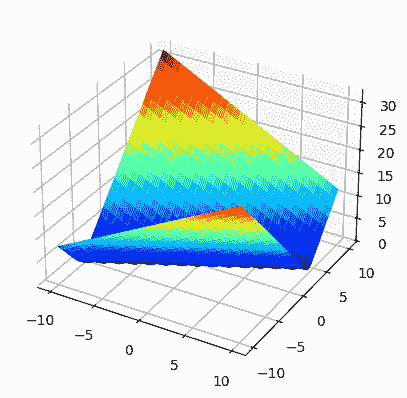
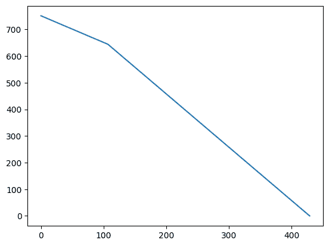
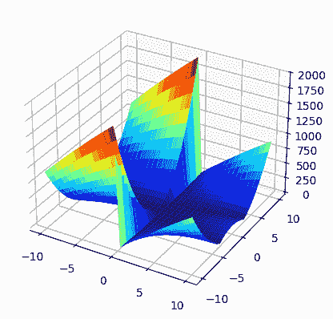
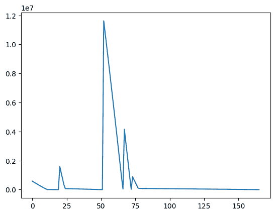
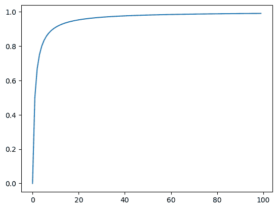

# 基于搜索的模糊测试

> 原文：[`www.fuzzingbook.org/html/SearchBasedFuzzer.html`](http://www.fuzzingbook.org/html/SearchBasedFuzzer.html)

有时我们不仅对模糊测试尽可能多的不同程序输入感兴趣，还希望推导出*特定*的测试输入，以实现某些目标，例如到达程序中的特定语句。当我们对我们要找的东西有一个想法时，我们就可以*搜索*它。搜索算法是计算机科学的核心，但将经典搜索算法如广度优先搜索或深度优先搜索应用于搜索测试是不切实际的，因为这些算法可能需要我们查看所有可能的输入。然而，领域知识可以用来克服这个问题。例如，如果我们能估计几个程序输入中哪一个更接近我们要找的，那么这些信息就可以引导我们更快地达到目标——这种信息被称为*启发式方法*。启发式方法系统地应用的方式被捕获在*元启发式*搜索算法中。"Meta"表示这些算法是通用的，并且可以根据不同的问题实例化。元启发式通常从自然界观察到的过程中获得灵感。例如，有一些算法模仿进化过程、群体智能或化学反应。总的来说，它们比穷举搜索方法更有效，因此可以应用于庞大的搜索空间——对于它们来说，程序输入领域的庞大搜索空间不是问题。

**先决条件**

+   您应该了解代码覆盖率是如何工作的，例如从覆盖率章节中了解。

## 概述

要使用本章提供的代码（导入代码），请编写

```py
>>> from fuzzingbook.SearchBasedFuzzer import <identifier> 
```

然后利用以下功能。

本章演示了如何使用元启发式搜索算法来寻找达到源代码中特定位置的输入。最简单的搜索算法是爬山法，它应用于简单的`test_me`示例，如下所示：

```py
>>> hillclimber()
Initial value: -67005, 8742 at fitness 84491.0000
New value: -67006, 8741 at fitness 84490.0000
New value: -67007, 8740 at fitness 84489.0000
New value: -67008, 8739 at fitness 84488.0000
New value: -67009, 8738 at fitness 84487.0000
New value: -67010, 8737 at fitness 84486.0000
New value: -67011, 8736 at fitness 84485.0000
New value: -67012, 8735 at fitness 84484.0000
New value: -67013, 8734 at fitness 84483.0000
New value: -67014, 8733 at fitness 84482.0000
New value: -67015, 8732 at fitness 84481.0000
New value: -67016, 8731 at fitness 84480.0000
New value: -67017, 8730 at fitness 84479.0000
New value: -67018, 8729 at fitness 84478.0000
New value: -67019, 8728 at fitness 84477.0000
New value: -67020, 8727 at fitness 84476.0000
New value: -67021, 8726 at fitness 84475.0000
New value: -67022, 8725 at fitness 84474.0000
New value: -67023, 8724 at fitness 84473.0000
New value: -67024, 8723 at fitness 84472.0000
New value: -67025, 8722 at fitness 84471.0000
...
Found optimum after 58743 iterations at -100000, -50001 
```

不同的方面和挑战需要此算法的不同变体，例如`steepest_ascent_hillclimber`或`restarting_hillclimber`。

搜索可以由不同优化目标在适应度函数中捕获的优化目标来引导。一个用于测量我们接近达到源代码中位置的距离的适应度函数使用源代码插桩。要生成`cgi_decode`的插桩版本，请使用：

```py
>>> cgi_decode_instrumented = create_instrumented_function(cgi_decode)
/var/folders/n2/xd9445p97rb3xh7m1dfx8_4h0006ts/T/ipykernel_7394/942233608.py:15: DeprecationWarning: ast.Num is deprecated and will be removed in Python 3.14; use ast.Constant instead
  args=[ast.Num(self.branch_num),
/var/folders/n2/xd9445p97rb3xh7m1dfx8_4h0006ts/T/ipykernel_7394/942233608.py:16: DeprecationWarning: ast.Str is deprecated and will be removed in Python 3.14; use ast.Constant instead
  ast.Str(node.ops[0].__class__.__name__), 
```

通过执行`cgi_decode_instrumented`来获得适应度值，这是通过`get_fitness_cgi`函数完成的：

```py
>>> get_fitness_cgi("Foo")
5.0 
```

复杂的函数如`cgi_decode`会导致搜索空间大大增加，可以使用诸如遗传算法之类的进化搜索算法来探索：

```py
>>> genetic_algorithm()
Best fitness of initial population: '䫪Ʝ\uf42b 铺뿱ጻ䗷䌮肵篭' - 5.0000000000
Best fitness at generation 1: '\u19cdꥁ캖蝻ⅹ\uf37f 功ᰲ\ued7eᱨ' - 5.00000000
Best fitness at generation 2: '绑䀕\u20c5֜적\udfaeᇒ툧痮Ꮶ' - 5.00000000
Best fitness at generation 3: '끍碼ߝ䣅쾜\u0b7b죅ᦜ\uf1fd䈕' - 5.00000000
Best fitness at generation 4: '甚ᇆꏭ貰꾵訴྿ꙩᏃด' - 5.00000000
Best fitness at generation 5: '\uf644ᇆꏭ貰虀ꎍ\uf6f9 嫛ሎ㺁' - 5.00000000
Best fitness at generation 6: '빫\uf61a\ud85c 熆꾵訴ဍꙩᑓ\ue8e0' - 5.00000000
Best fitness at generation 7: '닅\uf307Ɗ\uefc5 筂鐞嚂ᡥ⃫㺤' - 5.00000000
Best fitness at generation 8: '漻㺅揝䄩薽턫轼\u0dcc\udb87 胮' - 5.00000000
Best fitness at generation 9: '甚ᇩ護㿦腄ꑗ\uf6f9 嫛ም凂' - 5.00000000
Best fitness at generation 10: '끍ᇆ⁔峤羘䶦Ⓛ巖桿\ue8ac' - 5.00000000
Best fitness at generation 11: '㞮械ꏭഡ鰴勂ᇒ툧䧱㺡' - 5.00000000
Best fitness at generation 12: '닅\uf307Ɗ䣅筂鐮\uf697 媭ም凂' - 5.00000000
Best fitness at generation 13: '췵㪈쾟⢥筂鐇勨憣并ꓹ' - 5.00000000
Best fitness at generation 14: '睾\uf2aaﾒ\uef8b 鰴⥢邹坅櫼砳' - 5.00000000
Best fitness at generation 15: '盾㩭譂䅎웱勂ᇒ텬䧱㺡' - 5.00000000
Best fitness at generation 16: '끍ᇆ₩豻畕傞ᅢ툧䧱Ａ' - 5.00000000
Best fitness at generation 17: '뀳硺ߝ\uefdb 笧勂ᇒ텬桘．' - 5.00000000
Best fitness at generation 18: '㴄ᅕ큕谉畕傞ᅢ툧䧱Ａ' - 5.00000000
Best fitness at generation 19: '滴㪈㹮䣻羘䷴⒲嵟\udc02㺤' - 5.00000000
Best fitness at generation 20: '矖㪈㺂䢶羘䶦ᇒ䙗뭜탤' - 5.00000000
...
Best individual: '쩴篊㬍鍵糄䧱﬩廁\ude21 萇', fitness 5.0000000000 
```

## 测试生成作为搜索问题

如果我们想要将元启发式搜索算法应用于生成程序的测试数据，那么我们必须做出几个选择：首先，我们需要决定我们的*搜索空间*究竟是什么。搜索空间是由我们如何*表示*我们正在寻找的内容来定义的。我们是在寻找单个整数值吗？值的元组？对象？XML 文档？

### 将程序输入表示为搜索问题

表示高度依赖于我们正在解决的特定测试问题——我们知道我们正在测试哪个程序，因此表示需要编码目标程序的所有输入。让我们以示例函数`test_me()`作为我们的测试函数：

```py
import [bookutils.setup](https://github.com/uds-se/fuzzingbook//tree/master/notebooks/shared/bookutils) 
```

```py
import Fuzzer 
```

```py
from [bookutils](https://github.com/uds-se/fuzzingbook//tree/master/notebooks/shared/bookutils) import unicode_escape, terminal_escape 
```

```py
def test_me(x, y):
    if x == 2 * (y + 1):
        return True
    else:
        return False 
```

`test_me()`函数有两个输入参数，根据这两个参数之间的关系返回`True`或`False`。`test_me()`的测试输入由一对值组成，一个用于`x`，一个用于`y`。例如：

```py
test_me(0, 0) 
```

```py
False

```

```py
test_me(4, 2) 
```

```py
False

```

```py
test_me(22, 10) 
```

```py
True

```

我们的搜索空间只关注输入，因此测试数据的一个简单表示将是输入元组`(x, y)`。这个输入空间中的每个点都有八个*邻居*：

+   `x-1, y-1`

+   `x-1, y`

+   `x-1, y+1`

+   `x, y+1`

+   `x+1, y+1`

+   `x+1, y`

+   `x+1, y-1`

+   `x, y-1`

为了使事情简单起见，让我们先限制搜索空间的大小（我们稍后会改变这一点）。例如，让我们假设我们只想在-1000 到 1000 的范围内寻找值：

```py
MAX = 1000
MIN = -MAX 
```

为了检索搜索空间中任何点的邻居，我们定义了函数`neighbors()`，它实现了一个基本的摩尔邻域。也就是说，我们查看所有 8 个直接邻居，同时考虑我们刚刚用`MAX`和`MIN`定义的边界：

```py
def neighbors(x, y):
    return [(x + dx, y + dy) for dx in [-1, 0, 1]
            for dy in [-1, 0, 1]
            if (dx != 0 or dy != 0)
            and ((MIN <= x + dx <= MAX)
                 and (MIN <= y + dy <= MAX))] 
```

```py
print(neighbors(10, 10)) 
```

```py
[(9, 9), (9, 10), (9, 11), (10, 9), (10, 11), (11, 9), (11, 10), (11, 11)]

```

这完全定义了我们的搜索空间：我们有一个表示，并且我们知道个体之间通过其邻域是如何相互关联的。现在我们只需要找到一个算法来探索这个邻域，以及一个指导算法的启发式方法。

### 定义搜索景观：适应度函数

所有元启发式算法都是基于使用启发式函数来估计给定候选解的好坏；这种“好坏”通常被称为个体的*适应度*，估计适应度的启发式函数是*适应度函数*。适应度函数是一个将搜索空间中的任何点映射到数值的函数，即适应度值。在搜索空间中，与最优解相比，候选解越好，其适应度值就越高。因此，如果你将每个点在搜索空间中的适应度值作为高度绘制出来，你将得到一个景观，其中最优解表示为最高的山峰。

适应度函数取决于生成测试数据时想要达到的目标。假设我们感兴趣的是覆盖`test_me()`函数中 if 条件的真实分支，即`x == 2 * (y + 1)`。

给定输入元组与该函数的目标分支有多接近？让我们考虑搜索空间中的一个任意点，例如 `(274, 153)`。if 条件比较以下值：

```py
x = 274
y = 153
x, 2 * (y + 1) 
```

```py
(274, 308)

```

为了使分支为真，两个值必须相同。因此，它们差异越大，我们离使比较为真就越远，它们差异越小，我们离使比较为真就越近。因此，我们可以通过计算 `x` 和 `2 * (y + 1)` 之间的差异来量化“比较有多假”。因此，我们可以计算这个距离为 `abs(x - 2 * (y + 1))`：

```py
def calculate_distance(x, y):
    return abs(x - 2 * (y + 1)) 
```

```py
calculate_distance(274, 153) 
```

```py
34

```

我们可以使用这个距离值作为我们的适应度函数，因为我们可以很好地衡量我们离最优解有多近。然而，请注意，在这种情况下，“更好”并不意味着“更大”；距离越小越好。这不是问题，因为任何可以最大化值的算法也可以被修改为最小化它。

对于整数元组的搜索空间中的每个值，这个距离值定义了我们在搜索景观中的高度。由于我们的示例搜索空间是二维的，搜索景观是三维的，我们可以绘制它以查看其外观：

```py
import [matplotlib.pyplot](https://matplotlib.org/) as plt 
```

```py
import [numpy](https://numpy.org/) as np 
```

```py
%matplotlib inline

xx = np.outer(np.linspace(-10, 10, 30), np.ones(30))
yy = xx.copy().T
zz = calculate_distance(xx, yy)

fig = plt.figure()
ax = plt.axes(projection='3d')

ax.plot_surface(xx, yy, zz, cmap=plt.cm.jet, rstride=1, cstride=1, linewidth=0); 
```



最优值，即使 if 条件为真的值，适应度值为 0，在图表的底部可以清楚地看到。离最优值越远，搜索空间中的点就越高。

### 仪器化

适应度函数应该计算具体测试执行的距离值。也就是说，我们想要运行程序，然后学习这次执行的距离值。然而，分支条件隐藏在目标函数的源代码中，其值原则上可能是到达该条件执行路径上的各种计算的结果。尽管在我们的例子中，条件是一个直接使用函数输入值的等式，但在一般情况下可能不是这样；它也可能是导出值。因此，我们需要直接在条件语句中观察到的值来计算我们的距离度量。

这通常是通过**仪器**来完成的：我们在分支条件之前或之后立即添加新代码，以跟踪观察到的值并使用这些值计算距离。以下是我们正在测试的程序的一个仪器化版本，它在执行时会打印出距离值：

```py
def test_me_instrumented(x, y):
    print("Instrumentation: Input = (%d, %d), distance = %d" %
          (x, y, calculate_distance(x, y)))
    if x == 2 * (y + 1):
        return True
    else:
        return False 
```

让我们尝试几个示例值：

```py
test_me_instrumented(0, 0) 
```

```py
Instrumentation: Input = (0, 0), distance = 2

```

```py
False

```

```py
test_me_instrumented(5, 2) 
```

```py
Instrumentation: Input = (5, 2), distance = 1

```

```py
False

```

```py
test_me_instrumented(22, 10) 
```

```py
Instrumentation: Input = (22, 10), distance = 0

```

```py
True

```

在计算适应度值时，我们将执行仪器化程序版本，但我们需要某种方法来访问在执行期间计算的距离值。作为这个问题的简单初始解决方案，我们可以在全局变量中添加一个并存储距离计算值。

```py
distance = 0 
```

```py
def test_me_instrumented(x, y):
    global distance
    distance = calculate_distance(x, y)
    if x == 2 * (y + 1):
        return True
    else:
        return False 
```

使用这个`test_me()`的仪器版本，我们现在可以最终定义我们的适应度函数，该函数简单地运行仪器化的`test_me_instrumented()`函数，然后检索全局`distance`变量的值：

```py
def get_fitness(x, y):
    global distance
    test_me_instrumented(x, y)
    fitness = distance
    return fitness 
```

让我们在一些示例输入上尝试一下：

```py
get_fitness(0, 0) 
```

```py
2

```

```py
get_fitness(1, 2) 
```

```py
5

```

```py
get_fitness(22, 10) 
```

```py
0

```

### 爬山示例实现

在确定了表示方法（整数对的二元组）和适应度函数（到目标分支的距离）之后，我们现在可以最终实施我们的搜索算法。让我们使用最简单的元启发式算法：爬山法来探索这个搜索空间。这个隐喻恰当地捕捉了正在发生的事情：该算法试图在我们定义的表示方法定义的搜索空间中爬上一座山。但是，在我们的搜索景观中，最佳值不是那些高处的，而是低处的，所以技术上我们是在下降到山谷中。

爬山算法本身非常简单：

1.  选择一个随机的起点

1.  确定所有相邻点的适应度值

1.  移动到具有最佳适应度值的相邻点

1.  如果未找到解决方案，则继续步骤 2

爬山者从一个随机的测试输入开始，即`x`和`y`的随机值。对于任何一对随机整数，它们满足条件`x == 2 * (y + 1)`的可能性相当小。假设随机值是`(274, 153)`。等式的右侧，`2 * (y + 1)`计算为 308，所以条件显然是错误的。爬山者现在应该去哪里？让我们看看这个测试输入及其邻居的适应度值：

```py
x, y = 274, 153
print("Origin %d, %d has fitness %d" % (x, y, get_fitness(x, y)))
for nx, ny in neighbors(x, y):
    print("neighbor %d, %d has fitness %d" % (nx, ny, get_fitness(nx, ny))) 
```

```py
Origin 274, 153 has fitness 34
neighbor 273, 152 has fitness 33
neighbor 273, 153 has fitness 35
neighbor 273, 154 has fitness 37
neighbor 274, 152 has fitness 32
neighbor 274, 154 has fitness 36
neighbor 275, 152 has fitness 31
neighbor 275, 153 has fitness 33
neighbor 275, 154 has fitness 35

```

将`y`增加一个单位会增加等式右侧的值到`310`。因此，等式左侧的值与等式右侧的值相比，差异更大！所以，增加`y`似乎不是一个好主意。另一方面，将`x`增加一个单位改善了情况：等式的左侧和右侧变得更加相似；它们是“不那么不平等”。因此，在`(274, 153)`的八个可能邻居中，增加`x`并减少`y`的邻居(`(275, 152)`)似乎最好直观上——条件的输出仍然是错误的，但比原始值“不那么错误”。

现在我们来实现爬山算法。

```py
import [random](https://docs.python.org/3/library/random.html) 
```

```py
LOG_VALUES = 20  # Number of values to log 
```

```py
def hillclimber():
    # Create and evaluate starting point
    x, y = random.randint(MIN, MAX), random.randint(MIN, MAX)
    fitness = get_fitness(x, y)
    print("Initial value: %d, %d at fitness %.4f" % (x, y, fitness))
    iterations = 0
    logs = 0

    # Stop once we have found an optimal solution
    while fitness > 0:
        iterations += 1
        # Move to first neighbor with a better fitness
        for (nextx, nexty) in neighbors(x, y):
            new_fitness = get_fitness(nextx, nexty)

            # Smaller fitness values are better
            if new_fitness < fitness:
                x, y = nextx, nexty
                fitness = new_fitness
                if logs < LOG_VALUES:
                    print("New value: %d, %d at fitness %.4f" % (x, y, fitness))
                elif logs == LOG_VALUES:
                    print("...")
                logs += 1
                break

    print("Found optimum after %d iterations at %d, %d" % (iterations, x, y)) 
```

```py
hillclimber() 
```

```py
Initial value: 201, -956 at fitness 2111.0000
New value: 200, -956 at fitness 2110.0000
New value: 199, -956 at fitness 2109.0000
New value: 198, -956 at fitness 2108.0000
New value: 197, -956 at fitness 2107.0000
New value: 196, -956 at fitness 2106.0000
New value: 195, -956 at fitness 2105.0000
New value: 194, -956 at fitness 2104.0000
New value: 193, -956 at fitness 2103.0000
New value: 192, -956 at fitness 2102.0000
New value: 191, -956 at fitness 2101.0000
New value: 190, -956 at fitness 2100.0000
New value: 189, -956 at fitness 2099.0000
New value: 188, -956 at fitness 2098.0000
New value: 187, -956 at fitness 2097.0000
New value: 186, -956 at fitness 2096.0000
New value: 185, -956 at fitness 2095.0000
New value: 184, -956 at fitness 2094.0000
New value: 183, -956 at fitness 2093.0000
New value: 182, -956 at fitness 2092.0000
New value: 181, -956 at fitness 2091.0000
...
Found optimum after 1656 iterations at -1000, -501

```

爬山者首先为`x`和`y`选择随机值。我们使用范围在`-1000`到`1000`之间的低值（我们之前定义了`MIN`和`MAX`），以减少在示例中玩耍时搜索所需的时间。然后，我们通过调用`get_fitness()`来确定这个起始点的适应度值。回想一下，我们正在尝试找到最小的适应度值，因此我们现在循环，直到我们找到一个适应度值为`0`（即最优值）。

在这个循环中，我们遍历所有邻居(`neighbors`)，并评估每个邻居的适应度值。一旦我们找到一个具有更好（更小）适应度的邻居，爬山算法就会退出循环，并使用这个邻居作为新的起点。这个简单爬山算法的另一种变体是移除`break`语句：通过这样做，*所有*邻居都会被评估，并选择最好的邻居。这被称为*最速上升爬山法*。你会发现达到最优解所需的迭代次数更少，尽管对于每次迭代，需要执行更多的测试。

```py
def steepest_ascent_hillclimber():
    # Create and evaluate starting point
    x, y = random.randint(MIN, MAX), random.randint(MIN, MAX)
    fitness = get_fitness(x, y)
    print("Initial value: %d, %d at fitness %.4f" % (x, y, fitness))
    iterations = 0
    logs = 0

    # Stop once we have found an optimal solution
    while fitness > 0:
        iterations += 1
        # Move to first neighbor with a better fitness
        for (nextx, nexty) in neighbors(x, y):
            new_fitness = get_fitness(nextx, nexty)
            if new_fitness < fitness:
                x, y = nextx, nexty
                fitness = new_fitness
                if logs < LOG_VALUES:
                    print("New value: %d, %d at fitness %.4f" % (x, y, fitness))
                elif logs == LOG_VALUES:
                    print("...")
                logs += 1

    print("Found optimum after %d iterations at %d, %d" % (iterations, x, y)) 
```

```py
steepest_ascent_hillclimber() 
```

```py
Initial value: -258, 645 at fitness 1550.0000
New value: -259, 644 at fitness 1549.0000
New value: -258, 644 at fitness 1548.0000
New value: -257, 644 at fitness 1547.0000
New value: -258, 643 at fitness 1546.0000
New value: -257, 643 at fitness 1545.0000
New value: -256, 643 at fitness 1544.0000
New value: -257, 642 at fitness 1543.0000
New value: -256, 642 at fitness 1542.0000
New value: -255, 642 at fitness 1541.0000
New value: -256, 641 at fitness 1540.0000
New value: -255, 641 at fitness 1539.0000
New value: -254, 641 at fitness 1538.0000
New value: -255, 640 at fitness 1537.0000
New value: -254, 640 at fitness 1536.0000
New value: -253, 640 at fitness 1535.0000
New value: -254, 639 at fitness 1534.0000
New value: -253, 639 at fitness 1533.0000
New value: -252, 639 at fitness 1532.0000
New value: -253, 638 at fitness 1531.0000
New value: -252, 638 at fitness 1530.0000
...
Found optimum after 517 iterations at 258, 128

```

我们的示例程序有一个非常好的适应度景观——有一个完美的梯度，爬山算法总是会找到一个解。如果我们绘制观察到的适应度值随时间的变化，我们可以看到这个好的梯度：

```py
def plotting_hillclimber(fitness_function):
    data = []

    # Create and evaluate starting point
    x, y = random.randint(MIN, MAX), random.randint(MIN, MAX)
    fitness = fitness_function(x, y)
    data += [fitness]
    iterations = 0

    # Stop once we have found an optimal solution
    while fitness > 0:
        iterations += 1
        # Move to first neighbor with a better fitness
        for (nextx, nexty) in neighbors(x, y):
            new_fitness = fitness_function(nextx, nexty)
            if new_fitness < fitness:
                x, y = nextx, nexty
                fitness = new_fitness
                data += [fitness]
                break

    print("Found optimum after %d iterations at %d, %d" % (iterations, x, y))
    return data 
```

```py
data = plotting_hillclimber(get_fitness) 
```

```py
Found optimum after 429 iterations at -1000, -501

```

```py
fig = plt.figure()
ax = plt.axes()

xs = range(len(data))
ax.plot(xs, data); 
```



这个梯度是理想适应度景观的结果。在实践中，我们不会总是拥有这样的好梯度。特别是，我们的爬山算法只有在至少有一个邻居具有更好的适应度值时才能很好地工作。如果我们达到一个所有邻居实际上都没有更好的适应度值的位置怎么办？考虑以下函数`test_me2`：

```py
def test_me2(x, y):
    if(x * x == y * y * (x % 20)):
        return True
    else:
        return False 
```

如果我们想要再次覆盖`test_me2`中的 if 条件的 true 分支，我们可以像之前一样计算距离，即通过计算比较两边的差异。让我们对`test_me2()`函数进行测试：

```py
def test_me2_instrumented(x, y):
    global distance
    distance = abs(x * x - y * y * (x % 20))
    if(x * x == y * y * (x % 20)):
        return True
    else:
        return False 
```

使用这个测试版本，我们只需要一个适应度函数，它调用测试版本并读取全局`distance`变量。

```py
def bad_fitness(x, y):
    global distance
    test_me2_instrumented(x, y)
    fitness = distance
    return fitness 
```

在我们对这个示例运行爬山算法之前，让我们再次通过绘制来查看搜索景观：

```py
xx = np.outer(np.linspace(-10, 10, 30), np.ones(30))
yy = xx.copy().T
zz = abs(xx * xx - yy * yy * (xx % 20)) 
```

```py
fig = plt.figure()
ax = plt.axes(projection='3d')

ax.plot_surface(xx, yy, zz, cmap=plt.cm.jet, rstride=1, cstride=1, linewidth=0); 
```



在这个阶段，运行使用新适应度函数的爬山算法会很理想，但有一个问题：使用这个适应度函数运行我们的爬山算法不是一个好主意，因为它可能永远不会终止。假设我们已经到达一个所有邻居都具有相同或更差适应度值的位置。爬山算法无法移动，并且永远卡在那里！在搜索景观中，这样的点被称为*局部最优解*。如果达到这样的点，最简单的方法就是放弃并从新的随机点重新开始。这就是我们在具有*随机重启*的爬山算法中将要做的。

```py
def restarting_hillclimber(fitness_function):
    data = []

    # Create and evaluate starting point
    x, y = random.randint(MIN, MAX), random.randint(MIN, MAX)
    fitness = fitness_function(x, y)
    data += [fitness]
    print("Initial value: %d, %d at fitness %.4f" % (x, y, fitness))
    iterations = 0

    # Stop once we have found an optimal solution
    while fitness > 0:
        changed = False
        iterations += 1
        # Move to first neighbor with a better fitness
        for (nextx, nexty) in neighbors(x, y):
            new_fitness = fitness_function(nextx, nexty)
            if new_fitness < fitness:
                x, y = nextx, nexty
                fitness = new_fitness
                data += [fitness]
                changed = True
                break
        if not changed:
            x, y = random.randint(MIN, MAX), random.randint(MIN, MAX)
            fitness = fitness_function(x, y)
            data += [fitness]

    print("Found optimum after %d iterations at %d, %d" % (iterations, x, y))
    return data 
```

变化是微不足道的：我们只需使用布尔标志跟踪是否发生了任何移动，如果我们没有移动到任何邻居，我们就选择一个新的随机位置重新开始。为了方便起见，我们还使爬山算法可以通过适应度函数进行参数化。让我们用我们的`bad_fitness`试一试，并绘制我们观察到的结果适应度值：

```py
MAX = 1000
MIN = -MAX 
```

```py
data = restarting_hillclimber(bad_fitness) 
```

```py
Initial value: 333, 231 at fitness 582804.0000
Found optimum after 165 iterations at 521, 521

```

```py
import [matplotlib.pyplot](https://matplotlib.org/) as plt 
```

```py
fig = plt.figure()
ax = plt.axes()

xs = range(len(data))
ax.plot(xs, data); 
```



运行示例几次。有时，我们很幸运，存在一个梯度直接将其带到最优解。但有时在达到最优值之前，你会在搜索过程中看到重启。

我们将`x`和`y`的初始值限制在较小的范围`[MIN, MAX]`内。这在测试生成中是一个常见的技巧，因为在*大多数*情况下，解决方案往往由小值组成，使用小值开始搜索在很多情况下会使搜索更快。然而，如果所需的解决方案位于我们的搜索空间中的完全不同的地方呢？我们偏向于较小解决方案的偏见意味着爬山者将花费很长时间才能找到解决方案，并且给定固定的搜索预算，它实际上找到解决方案的可能性会更小。为了看看这会产生什么影响，我们可以简单地将`1000`替换为，比如说，`1000000`或更多。我们可以调整范围，看看我们简单搜索问题的性能。

```py
MAX = 100000
MIN = -MAX 
```

```py
from Timer import Timer 
```

```py
with Timer() as t:
    restarting_hillclimber(get_fitness)
    print("Search time: %.2fs" % t.elapsed_time()) 
```

```py
Initial value: 64543, -55357 at fitness 175255.0000
Found optimum after 169899 iterations at -100000, -50001
Search time: 0.27s

```

在大多数情况下，现在搜索将需要更长的时间才能找到解决方案——可能比我们为这样一个简单示例函数准备的等待时间要长！（尽管有时我们会很幸运，随机击中一个好的起始位置）。这如何在“真实”示例中工作呢？不要想象如果还有更多的参数和更大的邻域！

## 测试一个更复杂的程序

让我们转向一个稍微复杂一点的程序：你已经在覆盖率章节中了解过的 CGI 解码器。

```py
def cgi_decode(s):
  """Decode the CGI-encoded string `s`:
 * replace "+" by " "
 * replace "%xx" by the character with hex number xx.
 Return the decoded string.  Raise `ValueError` for invalid inputs."""

    # Mapping of hex digits to their integer values
    hex_values = {
        '0': 0, '1': 1, '2': 2, '3': 3, '4': 4,
        '5': 5, '6': 6, '7': 7, '8': 8, '9': 9,
        'a': 10, 'b': 11, 'c': 12, 'd': 13, 'e': 14, 'f': 15,
        'A': 10, 'B': 11, 'C': 12, 'D': 13, 'E': 14, 'F': 15,
    }

    t = ""
    i = 0
    while i < len(s):
        c = s[i]
        if c == '+':
            t += ' '
        elif c == '%':
            digit_high, digit_low = s[i + 1], s[i + 2]
            i += 2
            if digit_high in hex_values and digit_low in hex_values:
                v = hex_values[digit_high] * 16 + hex_values[digit_low]
                t += chr(v)
            else:
                raise ValueError("Invalid encoding")
        else:
            t += c
        i += 1
    return t 
```

### 将 CGI 解码器作为一个搜索问题

`cgi_decode()`函数有一个字符串类型的输入，定义字符串邻域的一种可能方式是所有具有 1 个编辑距离的可能的字符串。例如，字符串`test`的每个字符都有四个邻居：

+   `uest`

+   `tfst`

+   `tett`

+   `tesu`

+   `sest`

+   `tdst`

+   `tert`

+   `tess`

此外，添加任何字符或附加任何字符也会有一个编辑距离为 1，也可以被认为是邻居。为了使事情简单，让我们将输入字符串的长度固定在一个合理的值（例如 10）。在这种情况下，每个个体有 20 个邻居（即每个字符有两个邻居）。

让我们实现一个新的`neighbor_strings()`函数，它生成这些相邻字符串：

```py
def neighbor_strings(x):
    n = []
    for pos in range(len(x)):
        c = ord(x[pos])
        if c < 126:
            n += [x[:pos] + chr(c + 1) + x[pos + 1:]]
        if c > 32:
            n += [x[:pos] + chr(c - 1) + x[pos + 1:]]
    return n 
```

`neighbor_strings()`函数获取输入字符串中每个字符的数值，并创建一个新的字符串，该字符串将字符替换为字母表中该字符的前一个和后一个字符。起初，我们只考虑可打印的 ASCII 字符，其范围在 32-126 之间。

```py
print(neighbor_strings("Hello")) 
```

```py
['Iello', 'Gello', 'Hfllo', 'Hdllo', 'Hemlo', 'Heklo', 'Helmo', 'Helko', 'Hellp', 'Helln']

```

因此，我们已经为`cgi_decode()`函数定义了搜索空间。在这个搜索空间中寻找个体的下一个要素是一个适应度函数。

### 分支距离

`test_me()`函数由一个 if 条件组成，其中比较了两个整数。在`cgi_decode()`函数中，我们有三个 if 条件和一条 while 循环，它们都用于比较字符。幸运的是，正如我们已经看到的，我们可以将字符视为数字，因此我们可以使用与`test_me()`示例中相同的距离估计。然而，也有两个条件检查一个字符是否包含在集合中，例如`digit_high in hex_values`。一个值接近包含在集合中的程度如何？一个明显的解决方案是将距离到集合中最接近的值的估计作为估计。

```py
import [sys](https://docs.python.org/3/library/sys.html) 
```

```py
def distance_character(target, values):

    # Initialize with very large value so that any comparison is better
    minimum = sys.maxsize

    for elem in values:
        distance = abs(target - elem)
        if distance < minimum:
            minimum = distance
    return minimum 
```

```py
distance_character(10, [1, 5, 12, 100]) 
```

```py
2

```

```py
distance_character(10, [0, 50, 80, 200]) 
```

```py
10

```

我们到目前为止所做的进一步简化是假设我们总是希望条件评估为真。在实践中，我们可能也希望 if 条件评估为假。因此，每个 if 条件实际上有两个距离估计，一个用于估计它有多接近为真，另一个用于估计它有多接近为假。如果条件为真，则真距离为 0；如果条件为假，则假距离为 0。也就是说，在比较`a == b`时，如果`a`小于`b`，则根据定义，假距离为`0`。

当`a`等于`b`时，`a == b`为假的情况下的距离是多少？对`a`或`b`的任何改变都会使条件评估为假，因此在这种情况下，我们可以简单地将距离定义为 1。

更一般地，可能有其他类型的比较，例如使用关系运算符。考虑`cgi_decode()`中的循环条件：`i < len(s)`，即它使用小于比较运算符。将分支距离的概念扩展到覆盖不同类型的比较，并计算真距离和假距离是非常直接的。以下表格显示了如何计算不同类型比较的距离：

| 条件 | 距离（真） | 距离（假） |
| --- | --- | --- |
| a == b | abs(a - b) | 1 |
| a != b | 1 | abs(a - b) |
| a < b | b - a + 1 | a - b |
| a <= b | b - a | a - b + 1 |
| a > b | a - b + 1 | b - a |

注意，几个计算中添加了一个常数`1`。这样做的原因相当简单：假设我们希望`a < b`评估为真，并令`a = 27`和`b = 27`。这个条件不是真的，但简单地取差值会得到`0`的结果。为了避免这种情况，我们必须添加一个常数。这个值是`1`并不重要——任何正数常数都行。

### 处理复杂条件

在`cgi_decode()`函数中，我们还可以找到一个稍微复杂一些的谓词，它由两个通过逻辑`and`连接的条件组成：

`if digit_high in hex_values and digit_low in hex_values:`

原则上，分支距离被定义为使合取 `A and B` 为真的距离等于 `A` 和 `B` 的分支距离之和，因为两个条件都需要为真。同样，使 `A or B` 为真的分支距离将是 `A` 和 `B` 的两个分支距离中的最小值，因为只要其中一个条件为真，整个表达式就为真。

然而，在实践中并不像那样简单：谓词可以包含嵌套条件和否定，并且需要在应用此计算之前将表达式转换为规范形式。此外，大多数现代编程语言使用 *短路求值*：如果有一个条件 `A or B`，并且 `A` 为真，则 `B` 不会被评估。如果 `B` 是一个有副作用的表达式，那么即使短路求值会避免其执行，我们可能会改变程序的行为（通过调用在正常行为中不会执行的副作用），这是不可接受的。

此外，如果分支条件有副作用怎么办？例如，假设分支条件是 `x == 2 * foo(y)`，其中 `foo()` 是一个接受整数作为输入的函数。天真地添加监控会导致以下代码：

```py
 distance = abs(x - 2 * foo(y))
    if x == 2 * foo(y):
    ...
```

因此，监控会导致 `foo()` 被执行 *两次*。假设 `foo()` 改变了系统的状态（例如，通过打印某些内容，访问文件系统，改变一些状态变量等），那么显然再次调用 `foo()` 是一个坏主意。克服这个问题的方法之一是 *转换* 条件，而不是 *添加* 跟踪调用。例如，可以创建临时变量来保存距离计算所需的价值，然后在这些变量中使用它们作为分支条件：

```py
 tmp1 = x
    tmp2 = 2 * foo(y)
    distance = abs(tmp1 - tmp2)
    if tmp1 == tmp2:
    ...
```

除了这些问题之外，向程序添加全局变量和方法调用的方法似乎是一种相当笨拙的方法——我们当然不能单独考虑我们程序中的每个分支，并手动监控我们想要测试的程序，特别是如果程序有多个分支，如 `cgi_decode()` 函数。相反，我们应该考虑如何 *自动* 监控程序，以便包含必要的附加语句，这样我们就可以计算适应度值。

### 原子条件的监控

使用全局和临时变量的另一种方法是，用对辅助函数的调用替换实际比较，其中原始表达式作为参数评估，运算符作为额外的参数。假设我们有一个名为 `evaluate_condition()` 的函数，它接受四个参数：

+   `num` 是一个唯一标识符，用于识别条件；

+   `op` 是比较运算符；

+   `lhs` 和 `rhs` 是操作数。

函数计算两个距离，对于条件：到条件评估为真的距离，以及到条件评估为假的距离。两个结果中总有一个是正确的，因此其中一个总是有距离 `0`。由于函数替换了原始的比较，它返回真或假，取决于哪个距离是 `0`。这意味着，示例表达式

```py
 if x == 2 * foo(y)
```

将被替换为

```py
 if evaluate_condition(0, "Eq", x, 2 * foo(y))
```

这样，参数只计算一次，因此可以正确处理副作用。以下是 `evaluate_condition()` 函数的形态：

```py
def evaluate_condition(num, op, lhs, rhs):
    distance_true = 0
    distance_false = 0
    if op == "Eq":
        if lhs == rhs:
            distance_false = 1
        else:
            distance_true = abs(lhs - rhs)

    # ... code for other types of conditions

    if distance_true == 0:
        return True
    else:
        return False 
```

注意，我们用 `0` 初始化 `distance_true` 和 `distance_false`。因此，如果 `lhs` 等于 `rhs`，那么变量 `distance_true` 保持为 `0`，反之亦然。

```py
evaluate_condition(1, "Eq", 10, 20) 
```

```py
False

```

```py
evaluate_condition(2, "Eq", 20, 20) 
```

```py
True

```

`evaluate_condition()` 函数尚未执行的操作是存储观察到的距离。显然，我们需要将值存储在某个地方，以便我们可以从我们的适应度函数中访问它。由于 `cgi_decode()` 程序由多个条件组成，并且对于每个条件，我们可能对真值和假值距离都感兴趣，我们简单地使用两个全局字典 `distances_true` 和 `distances_false`，并定义一个辅助函数，该函数将观察到的距离值存储在字典中：

```py
def update_maps(condition_num, d_true, d_false):
    global distances_true, distances_false

    if condition_num in distances_true.keys():
        distances_true[condition_num] = min(
            distances_true[condition_num], d_true)
    else:
        distances_true[condition_num] = d_true

    if condition_num in distances_false.keys():
        distances_false[condition_num] = min(
            distances_false[condition_num], d_false)
    else:
        distances_false[condition_num] = d_false 
```

变量 `condition_num` 是我们刚刚评估的条件的唯一标识符。如果这是我们第一次执行这个特定的条件，那么真值和假值距离将简单地存储在相应的字典中。然而，同一个测试可能多次执行同一个条件。例如，`cgi_decode()` 函数中的循环条件 `i < len(s)` 在每次循环迭代之前都会被评估。然而，最终我们希望测试有一个单一的适应度值。因为覆盖一个分支只需要至少一次执行达到分支，所以我们只考虑最近的那个。因此，如果 `distances_true` 和 `distances_false` 字典已经包含从之前的执行中得到的距离，我们只替换那个值，如果新的执行更接近达到分支；这是通过使用 `min()` 函数实现的。

现在，我们需要在 `evaluate_condition()` 内部调用这个函数。让我们也添加对 `in` 运算符和 `<` 比较的距离计算，因为我们需要这两个运算符来为 `cgi_decode()` 示例。此外，`cgi_decode()` 实际上比较字符和数字。为了确保我们使用正确的类型，我们首先必须将字符转换为数字来计算距离。这是通过 Python 的 `ord()` 函数完成的。

```py
def evaluate_condition(num, op, lhs, rhs):
    distance_true = 0
    distance_false = 0

    # Make sure the distance can be calculated on number and character
    # comparisons
    if isinstance(lhs, str):
        lhs = ord(lhs)
    if isinstance(rhs, str):
        rhs = ord(rhs)

    if op == "Eq":
        if lhs == rhs:
            distance_false = 1
        else:
            distance_true = abs(lhs - rhs)

    elif op == "Lt":
        if lhs < rhs:
            distance_false = rhs - lhs
        else:
            distance_true = lhs - rhs + 1
    # ...
    # handle other comparison operators
    # ...

    elif op == "In":
        minimum = sys.maxsize
        for elem in rhs.keys():
            distance = abs(lhs - ord(elem))
            if distance < minimum:
                minimum = distance

        distance_true = minimum
        if distance_true == 0:
            distance_false = 1

    update_maps(num, distance_true, distance_false)

    if distance_true == 0:
        return True
    else:
        return False 
```

以下展示了从 `cgi_decode()` 到使用 `evaluate_condition()` 函数的联合仪器配置。对应于两个条件，有两个对 `evaluate_condition` 的调用，以及将它们连接起来的运算符 `and` 确保保留了原始的短路行为：

`if (evaluate_condition(4, 'In', digit_high, hex_values) and evaluate_condition(5, 'In', digit_low, hex_values))`

当然，我们希望自动生成这个配置后的版本。

### 自动化源代码的配置

在 Python 中，自动替换比较实际上相当简单，使用程序的抽象语法树（AST）。在 AST 中，比较通常是一个具有操作符属性和两个子节点（左侧和右侧操作符）的树节点。要替换这样的比较为`evaluate_condition()`的调用，只需将 AST 中的比较节点替换为函数调用节点即可，这正是`BranchTransformer`类使用 Python 的`ast`模块中的`NodeTransformer`所做的事情：

```py
import [ast](https://docs.python.org/3/library/ast.html) 
```

```py
class BranchTransformer(ast.NodeTransformer):

    branch_num = 0

    def visit_FunctionDef(self, node):
        node.name = node.name + "_instrumented"
        return self.generic_visit(node)

    def visit_Compare(self, node):
        if node.ops[0] in [ast.Is, ast.IsNot, ast.In, ast.NotIn]:
            return node

        self.branch_num += 1
        return ast.Call(func=ast.Name("evaluate_condition", ast.Load()),
                        args=[ast.Num(self.branch_num),
                              ast.Str(node.ops[0].__class__.__name__),
                              node.left,
                              node.comparators[0]],
                        keywords=[],
                        starargs=None,
                        kwargs=None) 
```

`BranchTransformer`使用内置解析器`ast.parse()`解析目标 Python 程序，该解析器返回 AST。Python 提供了一个 API 来遍历和修改这个 AST。为了用函数调用替换比较，我们使用`ast.NodeTransformer`，它使用访问者模式，其中 AST 中的每个节点类型都有一个`visit_*`函数。由于我们感兴趣的是替换比较，我们覆盖了`visit_Compare`，在那里我们返回一个新节点，其类型为`ast.Func`，这是一个函数调用节点。该节点的第一个参数是函数`evaluate_condition()`的名称，参数是`evaluate_condition()`函数期望的四个参数：

+   分支的数量（我们将其计数保存在`branch_num`中），

+   操作符（我们简单地使用类名），

+   左侧，以及

+   右侧。

注意，Python 允许比较多个表达式（例如`1 < x < 10`）；为了保持代码简单，我们在这里只处理单个比较，但通过为每个比较调用`evaluate_condition`函数，代码的扩展是直接的。您会注意到我们还覆盖了`visit_FunctionDef`；这只是为了通过添加`_instrumented`来更改方法名，这样我们就可以继续使用原始函数和配置后的函数。

以下代码将`cgi_decode()`函数的源代码解析为 AST，然后对其进行转换，并再次打印出来（使用`ast`库中的`unparse()`函数）：

```py
import [inspect](https://docs.python.org/3/library/inspect.html)
import [ast](https://docs.python.org/3/library/ast.html) 
```

```py
from [bookutils](https://github.com/uds-se/fuzzingbook//tree/master/notebooks/shared/bookutils) import print_content 
```

```py
source = inspect.getsource(cgi_decode)
node = ast.parse(source)
BranchTransformer().visit(node)

# Make sure the line numbers are ok before printing
node = ast.fix_missing_locations(node)
print_content(ast.unparse(node), '.py') 
```

```py
def cgi_decode_instrumented(s):
  """Decode the CGI-encoded string `s`:
 * replace "+" by " "
 * replace "%xx" by the character with hex number xx.
 Return the decoded string.  Raise `ValueError` for invalid inputs."""
    hex_values = {'0': 0, '1': 1, '2': 2, '3': 3, '4': 4, '5': 5, '6': 6, '7': 7, '8': 8, '9': 9, 'a': 10, 'b': 11, 'c': 12, 'd': 13, 'e': 14, 'f': 15, 'A': 10, 'B': 11, 'C': 12, 'D': 13, 'E': 14, 'F': 15}
    t = ''
    i = 0
    while evaluate_condition(1, 'Lt', i, len(s)):
        c = s[i]
        if evaluate_condition(2, 'Eq', c, '+'):
            t += '  '
        elif evaluate_condition(3, 'Eq', c, '%'):
            digit_high, digit_low = (s[i + 1], s[i + 2])
            i += 2
            if evaluate_condition(4, 'In', digit_high, hex_values) and evaluate_condition(5, 'In', digit_low, hex_values):
                v = hex_values[digit_high] * 16 + hex_values[digit_low]
                t += chr(v)
            else:
                raise ValueError('Invalid encoding')
        else:
            t += c
        i += 1
    return t

```

```py
/var/folders/n2/xd9445p97rb3xh7m1dfx8_4h0006ts/T/ipykernel_7394/942233608.py:15: DeprecationWarning: ast.Num is deprecated and will be removed in Python 3.14; use ast.Constant instead
  args=[ast.Num(self.branch_num),
/var/folders/n2/xd9445p97rb3xh7m1dfx8_4h0006ts/T/ipykernel_7394/942233608.py:16: DeprecationWarning: ast.Str is deprecated and will be removed in Python 3.14; use ast.Constant instead
  ast.Str(node.ops[0].__class__.__name__),

```

要使用配置后的版本计算适应度值，我们需要再次编译配置后的抽象语法树（AST），这通过 Python 的`compile()`函数完成。然后我们需要使编译后的函数可访问，为此我们首先从`sys.modules`中检索当前模块，然后使用`exec`将配置后的函数的编译代码添加到当前模块的函数列表中。之后，`cgi_decode_instrumented()`函数就可以访问了。

```py
from [typing](https://docs.python.org/3/library/typing.html) import Dict, cast 
```

```py
def create_instrumented_function(f):
    source = inspect.getsource(f)
    node = ast.parse(source)
    node = BranchTransformer().visit(node)

    # Make sure the line numbers are ok so that it compiles
    node = ast.fix_missing_locations(node)

    # Compile and add the instrumented function to the current module
    current_module = sys.modules[__name__]
    code = compile(cast(ast.Module, node), filename="<ast>", mode="exec")
    exec(code, current_module.__dict__) 
```

```py
# Set up the global maps
distances_true: Dict[int, int] = {}
distances_false: Dict[int, int] = {} 
```

```py
# Create instrumented function
# cgi_decode_instrumented = 
create_instrumented_function(cgi_decode) 
```

```py
/var/folders/n2/xd9445p97rb3xh7m1dfx8_4h0006ts/T/ipykernel_7394/942233608.py:15: DeprecationWarning: ast.Num is deprecated and will be removed in Python 3.14; use ast.Constant instead
  args=[ast.Num(self.branch_num),
/var/folders/n2/xd9445p97rb3xh7m1dfx8_4h0006ts/T/ipykernel_7394/942233608.py:16: DeprecationWarning: ast.Str is deprecated and will be removed in Python 3.14; use ast.Constant instead
  ast.Str(node.ops[0].__class__.__name__),

```

```py
assert cgi_decode("Hello+Reader") == cgi_decode_instrumented("Hello+Reader") 
```

```py
cgi_decode_instrumented("Hello+Reader") 
```

```py
'Hello Reader'

```

```py
distances_true 
```

```py
{1: 0, 2: 0, 3: 35}

```

```py
distances_false 
```

```py
{1: 0, 2: 0, 3: 0}

```

如我们从 `distances_true` 和 `distances_false` 映射中可以看出，条件 1 和 2 评估为真和假，而条件 3 在执行 `cgi_decode_instrumented` 时只评估为假。这是预期的，因为 while 循环被进入并离开，输入字符串中有一个空格但没有 `%` 字符。

### 创建有效十六进制输入的适应度函数

例如，让我们以测试 `cgi_decode()` 中解码有效十六进制代码的部分为目标。这意味着我们希望使条件 1 为真，2 为假，3 为真，4 为真。为了表示这样的路径，我们可以简单地累加这些分支的分支距离。然而，简单地累加分支距离存在一个潜在问题：如果一个条件的距离取决于非常大的值的比较，而另一个条件的距离计算取决于小值，那么对大值的改进很可能导致更好的适应度改进，从而偏差搜索。为了避免这种情况，我们需要在累加之前对分支距离进行归一化。

对于范围 `[a, b]` 的归一化函数，它接受一个数字作为输入，并返回一个值，该值满足 `>=a` 和 `<=b`。关于这个函数的重要之处在于，对于任何两个数字 `x` 和 `y`，归一化必须保持它们的顺序。也就是说，如果 `x<y`，那么也必须满足 `normalize(x) < normalize(y)`。有许多不同的函数可以实现这个结果；一个简单的是 `normalize(x) = x/(x+k)`：它计算成本低，并将范围 `[0,1]` 内的任何正数值归一化（要将此转换为 `[0,b]`，只需乘以 `b`）。如果我们使用这个归一化函数，我们也知道最大值：它是 `1.0`。该函数假设要归一化的值是正数。因子 `k` 的值定义了曲线的陡峭程度。例如，对于 `k=1`（这是一个很好的默认值），曲线非常陡峭，值迅速接近但永远不会达到 `1`。

```py
def normalize(x):
    return x / (1.0 + x) 
```

要了解这个归一化函数是如何工作的，我们可以绘制一系列的值。x 轴包含原始值，y 轴显示相应的归一化值：

```py
import [matplotlib.pyplot](https://matplotlib.org/) as plt 
```

```py
fig = plt.figure()
ax = plt.axes()

xs = range(100)
ys = [value / (value + 1.0) for value in xs]
ax.plot(xs, ys); 
```



使用这个归一化函数，我们可以通过在测试的仪器程序下运行来计算一个适应度值，然后累加相关分支的归一化值。然而，并非每个 if 语句都会被每个测试用例执行。对于一个甚至没有被执行的分支，其分支距离是多少？我们需要确保未被执行的分支的分支距离高于执行过程中观察到的任何分支距离。根据我们的归一化，我们知道这个最大值是 1。因此，适应度函数可能看起来像这样：

```py
def get_fitness_cgi(x):
    # Reset any distance values from previous executions
    global distances_true, distances_false
    distances_true = {}
    distances_false = {}

    # Run the function under test
    try:
        cgi_decode_instrumented(x)
    except BaseException:
        pass

    # Sum up branch distances
    fitness = 0.0
    for branch in [1, 3, 4, 5]:
        if branch in distances_true:
            fitness += normalize(distances_true[branch])
        else:
            fitness += 1.0

    for branch in [2]:
        if branch in distances_false:
            fitness += normalize(distances_false[branch])
        else:
            fitness += 1.0

    return fitness 
```

为了看到我们的工具的实际效果，让我们计算几个示例输入的适应度值，逐步接近目标。

```py
# Empty string does not even enter the loop
get_fitness_cgi("") 
```

```py
4.5

```

```py
# String contains no percentage character
get_fitness_cgi("Hello+Reader") 
```

```py
2.9722222222222223

```

```py
# String contains a percentage character, but no valid hex char
get_fitness_cgi("%UU") 
```

```py
1.9230769230769231

```

```py
# String contains a percentage character, but only one valid hex char
get_fitness_cgi("%AU") 
```

```py
0.9230769230769231

```

```py
# String contains a percentage character and two valid hex chars
get_fitness_cgi("%AA") 
```

```py
0.0

```

### 递增搜索有效十六进制输入

我们现在已经通过`neighbor_strings()`函数定义了搜索空间，并且我们已经推导出一个新的适应度函数，所以在我们可以将递增搜索应用于寻找包含有效两位十六进制代码的字符串的问题之前，唯一剩下的点就是推导出一个随机起点，这你已经在之前的变异模糊器章节中做过：

```py
def random_string(l):
    s = ""
    for i in range(l):
        random_character = chr(random.randrange(32, 127))
        s = s + random_character
    return s 
```

现在我们可以把它们全部放在一起，再次使用相同的递增搜索算法，只是让它生成随机字符串而不是数字，并使用新的适应度函数：

```py
def hillclimb_cgi():
    x = random_string(10)
    fitness = get_fitness_cgi(x)
    print("Initial input: %s at fitness %.4f" % (x, fitness))

    while fitness > 0:
        changed = False
        for (nextx) in neighbor_strings(x):
            new_fitness = get_fitness_cgi(nextx)
            if new_fitness < fitness:
                x = nextx
                fitness = new_fitness
                changed = True
                print("New value: %s at fitness %.4f" % (x, fitness))
                break

        # Random restart if necessary
        if not changed:
            x = random_string(10)
            fitness = get_fitness_cgi(x)

    print("Optimum at %s, fitness %.4f" % (x, fitness)) 
```

```py
hillclimb_cgi() 
```

```py
Initial input: o'@[3(rW*M at fitness 2.6667
New value: o&@[3(rW*M at fitness 2.5000
New value: o%@[3(rW*M at fitness 1.5000
New value: o%A[3(rW*M at fitness 0.8571
New value: o%A\3(rW*M at fitness 0.8333
New value: o%A]3(rW*M at fitness 0.8000
New value: o%A³(rW*M at fitness 0.7500
New value: o%A_3(rW*M at fitness 0.6667
New value: o%A`3(rW*M at fitness 0.5000
New value: o%Aa3(rW*M at fitness 0.0000
Optimum at o%Aa3(rW*M, fitness 0.0000

```

运行几次递增搜索，看看它生成的字符串是否包含有效的十六进制字符。有时只需要几步，有时需要更长的时间，但最终它总是解决问题并生成我们想要的字符串。

## 进化搜索

如果邻域相对较小，递增搜索效果很好。到目前为止，在`cgi_decode()`示例中就是这样，因为我们限制了自己使用固定数量的字符（10）并限制了字符范围到可打印的 ASCII 字符。但想象一下，如果我们不是在寻找 ASCII 字符，而是在寻找 UTF-16 Unicode 字符会发生什么？这些字符实际上不允许出现在 URL 中，但让我们看看如果我们改变搜索空间会发生什么：

```py
def random_unicode_string(l):
    s = ""
    for i in range(l):
        # Limits to reflect range of UTF-16
        random_character = chr(random.randrange(0, 65536))
        s = s + random_character
    return s 
```

```py
def unicode_string_neighbors(x):
    n = []
    for pos in range(len(x)):
        c = ord(x[pos])
        # Limits to reflect range of UTF-16
        if c < 65536:
            n += [x[:pos] + chr(c + 1) + x[pos + 1:]]
        if c > 0:
            n += [x[:pos] + chr(c - 1) + x[pos + 1:]]

    return n 
```

UTF-16 字符使用 16 位表示，这给我们提供了 65536 个可能的字符范围。上述函数已适应这些边界。在我们再次运行递增搜索之前，让我们再进行一个更改：我们将添加一个迭代限制，这样我们就可以放弃搜索，而不是永远等待它完成。

```py
def terminal_repr(s):
    return terminal_escape(repr(s)) 
```

```py
def hillclimb_cgi_limited(max_iterations):
    x = random_unicode_string(10)
    fitness = get_fitness_cgi(x)
    print("Initial input: %s at fitness %.4f" % (terminal_repr(x), fitness))

    iteration = 0
    logs = 0
    while fitness > 0 and iteration < max_iterations:
        changed = False
        for (nextx) in unicode_string_neighbors(x):
            new_fitness = get_fitness_cgi(nextx)
            if new_fitness < fitness:
                x = nextx
                fitness = new_fitness
                changed = True
                if logs < LOG_VALUES:
                    print("New value: %s at fitness %.4f" %
                          (terminal_repr(x), fitness))
                elif logs == LOG_VALUES:
                    print("...")
                logs += 1
                break

        # Random restart if necessary
        if not changed:
            x = random_string(10)
            fitness = get_fitness_cgi(x)
        iteration += 1

    print("Optimum at %s, fitness %.4f" % (terminal_repr(x), fitness)) 
```

```py
hillclimb_cgi_limited(100) 
```

```py
Initial input: '埂\udf19\uf67c듵騛쁥핡勸\uf172싕' at fitness 3.0000
New value: '埂\udf19\uf67c듵騛쁥핡勷\uf172싕' at fitness 3.0000
New value: '埂\udf19\uf67c듵騛쁥핡勶\uf172싕' at fitness 3.0000
New value: '埂\udf19\uf67c듵騛쁥핡勵\uf172싕' at fitness 3.0000
New value: '埂\udf19\uf67c듵騛쁥핡勴\uf172싕' at fitness 3.0000
New value: '埂\udf19\uf67c듵騛쁥핡勳\uf172싕' at fitness 3.0000
New value: '埂\udf19\uf67c듵騛쁥핡勲\uf172싕' at fitness 3.0000
New value: '埂\udf19\uf67c듵騛쁥핡勱\uf172싕' at fitness 3.0000
New value: '埂\udf19\uf67c듵騛쁥핡勰\uf172싕' at fitness 3.0000
New value: '埂\udf19\uf67c듵騛쁥핡勯\uf172싕' at fitness 3.0000
New value: '埂\udf19\uf67c듵騛쁥핡勮\uf172싕' at fitness 3.0000
New value: '埂\udf19\uf67c듵騛쁥핡勭\uf172싕' at fitness 3.0000
New value: '埂\udf19\uf67c듵騛쁥핡勬\uf172싕' at fitness 3.0000
New value: '埂\udf19\uf67c듵騛쁥핡勫\uf172싕' at fitness 3.0000
New value: '埂\udf19\uf67c듵騛쁥핡勪\uf172싕' at fitness 3.0000
New value: '埂\udf19\uf67c듵騛쁥핡勩\uf172싕' at fitness 3.0000
New value: '埂\udf19\uf67c듵騛쁥핡勨\uf172싕' at fitness 3.0000
New value: '埂\udf19\uf67c듵騛쁥핡勧\uf172싕' at fitness 3.0000
New value: '埂\udf19\uf67c듵騛쁥핡勦\uf172싕' at fitness 3.0000
New value: '埂\udf19\uf67c듵騛쁥핡勥\uf172싕' at fitness 3.0000
New value: '埂\udf19\uf67c듵騛쁥핡勤\uf172싕' at fitness 3.0000
...
Optimum at '埂\udf19\uf67c듵騛쁥핡劔\uf172싕', fitness 3.0000

```

你可以调整迭代限制，看看在这个搜索空间中找到解决方案需要多长时间。除非你随机起点很幸运，否则这通常需要非常不合理的时间。

### 全局搜索

递增搜索在搜索的每一步中探索个体的局部邻域，如果邻域太大，那么这会花费太长时间。一种替代策略是不限制搜索到局部邻域，而是全局搜索。也就是说，搜索算法被允许在搜索空间周围进行更大的步骤。对递增搜索的一个简单修改就可以将其从局部搜索算法转换为全局搜索算法：不是查看所有直接邻居，而是以允许更大修改的方式对个体进行*变异*。

一种 *变异* 是表示在搜索空间中更大步骤的改变。在实现变异时，一个重要的决策是理论上应该能够通过连续应用变异来达到搜索空间中的任何一点。然而，变异通常不应该完全用随机的一个来替换个体。为了使搜索有效，变异应该构成对个体合理的改变，同时仍然保持其大部分特征。对于我们的 10 字符字符串搜索问题，一种可能的变异是将 10 个字符中的 *1* 个替换，如下所示：

```py
def flip_random_character(s):
    pos = random.randint(0, len(s) - 1)
    new_c = chr(random.randrange(0, 65536))
    return s[:pos] + new_c + s[pos + 1:] 
```

爬山法的一个简单修改是用变异替换对邻域的探索。在每次迭代中，当前个体被变异。产生的后代个体与其父代进行比较，两者中较好者成为搜索空间中的新点，并用于下一次变异迭代。这被称为“随机爬山法”。

```py
def randomized_hillclimb():
    x = random_unicode_string(10)
    fitness = get_fitness_cgi(x)
    print("Initial value: %s at fitness %.4f" %
          (terminal_repr(x), fitness))

    iterations = 0
    while fitness > 0:
        mutated = flip_random_character(x)
        new_fitness = get_fitness_cgi(mutated)
        if new_fitness <= fitness:
            x = mutated
            fitness = new_fitness
            #print("New value: %s at fitness %.4f" %(terminal_repr(x), fitness))
        iterations += 1

    print("Optimum at %s after %d iterations" %
          (terminal_repr(x), iterations)) 
```

```py
randomized_hillclimb() 
```

```py
Initial value: '舨ᑆ\uec4f\ue27f 羏\uf314䖗繣厪킨' at fitness 2.9998
Optimum at 'ጤ〆撟%e5 匸㗵暠ᴌ' after 34356 iterations

```

这个算法通常比标准的爬山法找到解决方案更快，尽管它仍然相当慢！

爬山法和随机版本之间存在一个微妙但至关重要的变化，值得指出：注意比较 `new_fitness <= fitness`，而在爬山法中我们使用了 `new_fitness < fitness`。这很重要，因为搜索景观可能存在具有相等适应度值的区域（平台），我们需要以某种方式克服这些区域。在标准的爬山法中，我们通过随机重启来实现这一点。如果随机爬山法拒绝具有相同适应度的后代，它将不断变异相同的个体，并可能难以逃离平台。如果我们用具有相等适应度的替换，我们允许搜索在平台上移动，从而增加最终逃离平台的机会。

随机爬山法也被称为 *1+1 进化算法* （*(1+1)EA*）。进化算法是一种元启发式搜索算法，试图模仿自然进化的过程。自然进化基于种群，环境压力导致自然选择：只有最适应的个体能够生存，而不适应的个体将死亡，因此种群的整体适应度逐渐提高。（1+1）EA 是一种非常具体的进化算法，种群大小为 1，它正好产生 1 个后代。然而，在实践中最常见的搜索算法是遗传算法。

### 遗传算法

最著名的进化算法之一是*遗传算法*（GA）。GA 基于这样的想法，即问题解决方案可以遗传编码：染色体由一系列基因组成，其中每个基因编码个体的一个特征（例如，眼睛颜色、头发颜色等）。适应度函数可以评估包含在这个描述中的信息，即所谓的基因型，并评估由此产生的表型的属性，即由这种遗传编码表示的实际解决方案。个体的适应度值是在表型上测量的。

对于我们的`cgi_decode()`示例，我们可以考虑单个字符是基因，然后染色体是一系列字符。换句话说，遗传编码正是我们迄今为止已经使用过的！然而，对于 GA，表示需要不同于枚举邻域的操作。

遗传算法（GA）通过以下过程模拟自然进化：

+   创建一个随机的染色体初始种群

+   选择适合繁殖的个体

+   通过选择个体的繁殖来生成新种群

+   继续这样做，直到找到最优解或达到某些其他限制。

第一步，创建初始种群，是微不足道的：

```py
def create_population(size):
    return [random_unicode_string(10) for i in range(size)] 
```

```py
create_population(10) 
```

```py
['㛇莜戹豔㮝\ue008 力ᒐᱯꊎ',
 '\ue295쁉陵ꯃ赖蟽⍬꺲緥㲱',
 '\u2e77 騬⊳铁땕\uf189\ue663쌯幆艆',
 '龚筓\uf3a9욀놷䓒隯迌쀐∑',
 '쓛唁뗌蹽\udcd5 偏躝娒鸭赌',
 '蹤⪖ឺ웳ఫ䓻䤷溸ᰒﵘ',
 '㲒혋Ꮘ\uea95\udf7b䢶裕㖬눹庑',
 '\u2d9d 鼓咝笩窻ꨔ铺扄\ueb57\uf1bf',
 '\udd26Ч甄ꃢ\udcb0㼁튰㣋ช봼',
 '닇軬欴鞛㈓Ẫ住畿ꔪ칀']

```

选择过程优先考虑适应性更强的个体，因此我们需要为我们种群中的所有个体确定适应度值。由于我们将在算法的几个地方需要每个个体的适应度值，我们将通过将适应度存储为包含个体的元组的列表来存储它。

```py
def evaluate_population(population):
    fitness = [get_fitness_cgi(x) for x in population]
    return list(zip(population, fitness)) 
```

```py
population = create_population(10) 
```

```py
for (individual, fitness) in evaluate_population(population):
    print("%s: %.4f" % (terminal_repr(individual), fitness)) 
```

```py
'\ue46fت팣㘇ธ漅ೇ↪䜭㎮': 2.9994
'\ua7e9\ue9e0\ue7de턤댪囿厠‐\ue0c5ﴌ': 2.9999
'䇯Ꜩ잣\ua9ce㙦\uf4aa 歿蘸ཎ㫜': 2.9997
'ⱳ콾哇\uef1f\uf6a8⾃䣖坤Ꮾ둰': 2.9998
'າ伫螉\ue110㝎겱괼䆵喞\u18ac': 2.9997
'ས婎쥤䇉韤\udd06䕮춵磒露': 2.9997
'辺緢噑粲\uf400 嚳寬\x87ꐂ쑹': 2.9899
'뉫㻑\u1fd4㈖鬒樼\u0dcc 朏\ue57eማ': 2.9997
'얨㐁皭់멄\ud97b\ueac9㢂ቅ뮜': 2.9998
'⒃⍜㈪㊷\udbdb 乑蓍\udc48 鱲뻜': 2.9999

```

在搜索中使用适应度值通常用“适者生存”来解释，但达尔文对进化的一个关键洞察是，选择不仅由生存来定义——个体通过有性繁殖，性选择描述了繁殖过程中的选择压力。这种选择通常受以下两种影响：战斗：竞争雌性的雄性之间的斗争，更强壮（更适应）的雄性获胜；选择还受展示的影响。达尔文的例子是孔雀：孔雀有长长的美丽尾羽，看起来似乎没有作用，也不支持自然选择的概念。然而，孔雀在选择性伴侣时受到雄性外观的影响。令人印象深刻的装饰表明，雄性在遗传上特别健康，这将导致健康的后代。这在遗传算法（GA）中得到了反映：个体的适应度值越好，它与其他个体交配的可能性就越大。一个反映这一概念的简单选择算法是*锦标赛选择*：少数随机选择的个体竞争被选中，最好的被选中：

```py
def selection(evaluated_population, tournament_size):
    competition = random.sample(evaluated_population, tournament_size)
    winner = min(competition, key=lambda individual: individual[1])[0]

    # Return a copy of the selected individual
    return winner[:] 
```

`tournament_size` 参数指定了从种群中随机选择的个体数量参与锦标赛。这是一个重要的选择，因为它决定了**选择压力**：锦标赛规模越大，非常好个体的被选中概率就越大。这反过来又增加了这些非常好个体在下一代中占据主导地位的概率，从而减少了多样性并导致过早收敛。相反，如果锦标赛规模太小，那么这会抑制进化。锦标赛的最佳值取决于种群大小，但通常它相当小（例如，5）。让我们运行一个使用示例种群中所有个体的锦标赛，以查看最佳个体是如何被选中的：

```py
population = create_population(10)
fitness = evaluate_population(population)
selected = selection(fitness, 10) 
```

```py
for (individual, fitness_value) in fitness:
    print("%s: %.4f" % (terminal_repr(individual), fitness_value)) 
```

```py
'둚䘣蹸붢騒ꋎỺ觉\ued2a 焊': 2.9999
'닔㶐ꡡ\udca4 贕굇᳆\ueccd윘赉': 2.9999
'笁깉ရ豴\uea60ᛰ滒鶵）Ⰴ': 2.9998
'㠒㵄\ue14cᤃᇚ\udebe\uf851쿛鏆闊': 2.9998
'ࠝ\udd53ᶂ㮍訬廘랦铘뫘출': 2.9995
'ꡩၔ玤姨乪药汏䗫汔悔': 2.9998
'\uef2a 潦ﳠ鹉卼㴐Ṭ\uf4b0˅얓': 2.9985
'❱\u0ff7╇塐䲫琭煸ᮤឋ퇃': 2.9998
'ڮ焈㱉煉ꅿᦗ툍혐خ꧓': 2.9994
'ἂጋ\uddcc\ue3d7 粖\ude2c⮌鮓讃\ueab6': 2.9998

```

```py
print("Winner: %s" % terminal_repr(selected)) 
```

```py
Winner: '\uef2a 潦ﳠ鹉卼㴐Ṭ\uf4b0˅얓'

```

就像在自然进化中一样，根据其适应度选择的个体繁殖，以形成新一代。在这次繁殖过程中，就像在自然繁殖中一样，所选父母的遗传物质会结合。这通常是通过一个称为**交叉**的过程来完成的，其中通过父母的基因产生后代染色体。在我们的情况下，染色体是一系列字符，通过选择一个随机的截止点，并基于该截止点结合父母染色体的两半来产生后代。

```py
def crossover(parent1, parent2):
    pos = random.randint(1, len(parent1))

    offspring1 = parent1[:pos] + parent2[pos:]
    offspring2 = parent2[:pos] + parent1[pos:]

    return (offspring1, offspring2) 
```

```py
parent1 = "Hello World"
parent2 = "Goodbye Book"

crossover(parent1, parent2) 
```

```py
('Hello W Book', 'Goodbyeorld')

```

遗传进化的另一个重要组成部分是突变的概念：有时，后代基因中会有小的变化，这代表了新的遗传物质和新的生理特征。如果突变引入了代表有用特征并导致更好的适应度值的新的遗传物质，那么这种遗传物质将得以生存。如果突变引入了无用的遗传物质，那么产生的个体可能具有较差的适应度值并迅速死亡。

一个重要方面是，突变和交叉都是概率性操作。它们并不总是发生，并且每次发生时效果都不同。对于序列遗传编码，一种常见的方法是首先使用一个概率来决定是否应用突变，然后选择一个基因并对其进行一点修改。或者，我们可以概率性地突变基因，使得平均来说只有一个基因被改变。我们通过计算每个基因突变的概率 `P` 为 1/(基因数量) 来做到这一点。然后，如果基因发生突变，我们不仅用随机字符替换它，而且使其只有小变化的可能性更大。这是通过从以当前值作为均值的高斯分布中进行采样来实现的。我们任意使用标准差为 100 来使小变化比大变化更可能。

```py
def mutate(chromosome):
    mutated = chromosome[:]
    P = 1.0 / len(mutated)

    for pos in range(len(mutated)):
        if random.random() < P:
            new_c = chr(int(random.gauss(ord(mutated[pos]), 100) % 65536))
            mutated = mutated[:pos] + new_c + mutated[pos + 1:]
    return mutated 
```

现在我们终于有了构建完整算法的所有成分：

```py
def genetic_algorithm():
    # Generate and evaluate initial population
    generation = 0
    population = create_population(100)
    fitness = evaluate_population(population)
    best = min(fitness, key=lambda item: item[1])
    best_individual = best[0]
    best_fitness = best[1]
    print("Best fitness of initial population: %s - %.10f" %
        (terminal_repr(best_individual), best_fitness))
    logs = 0

    # Stop when optimum found, or we run out of patience
    while best_fitness > 0 and generation < 1000:

        # The next generation will have the same size as the current one
        new_population = []
        while len(new_population) < len(population):
            # Selection
            offspring1 = selection(fitness, 10)
            offspring2 = selection(fitness, 10)

            # Crossover
            if random.random() < 0.7:
                (offspring1, offspring2) = crossover(offspring1, offspring2)

            # Mutation
            offspring1 = mutate(offspring1)
            offspring2 = mutate(offspring2)

            new_population.append(offspring1)
            new_population.append(offspring2)

        # Once full, the new population replaces the old one
        generation += 1
        population = new_population
        fitness = evaluate_population(population)

        best = min(fitness, key=lambda item: item[1])
        best_individual = best[0]
        best_fitness = best[1]
        if logs < LOG_VALUES:
            print(
                "Best fitness at generation %d: %s - %.8f" %
                (generation, terminal_repr(best_individual), best_fitness))
        elif logs == LOG_VALUES:
            print("...")
        logs += 1

    print(
        "Best individual: %s, fitness %.10f" %
        (terminal_repr(best_individual), best_fitness)) 
```

让我们看看这在我们的 Unicode 示例中是如何工作的。

```py
genetic_algorithm() 
```

```py
Best fitness of initial population: '俴\x8a 辰燄펧䬍缯檒㤢⦡' - 2.9901960784
Best fitness at generation 1: 'ཬə쫯ὼ酟剺鬈{Ż\ue313' - 2.98850575
Best fitness at generation 2: '俴\x82 辰燄酟剺鬢\x1bŻ\ue313' - 2.90909091
Best fitness at generation 3: 'ྂɵ쫕ὼ酟剺鬈%Ŧ\ue384' - 1.99610895
Best fitness at generation 4: 'ྂɵ쬆ὼ酟剺鬈%ŋ\ue384' - 1.99565217
Best fitness at generation 5: '俴ʐ쫕ἶ酟剺髺%¼\ue384' - 1.98850575
Best fitness at generation 6: 'ྂɵ쫪ὼ酟剒鬈%\x9e\ue37f' - 1.98245614
Best fitness at generation 7: '俴̗쪕ἶ酟剺髱%4\ue378' - 0.99998280
Best fitness at generation 8: '侪\x86쪕ἶ酟剺髱%4\ue378' - 0.99998280
Best fitness at generation 9: '俆ǫ쪸ἶ醿剺髱%4\ue2b5' - 0.99998274
Best fitness at generation 10: '俆ǫ쪸ἶ釘剺髧%4\ue2b5' - 0.99998274
Best fitness at generation 11: '俆ɫ쫕Ồ酟剺髱%4\ue256' - 0.99998271
Best fitness at generation 12: '侪\x86쪕ἶ醿剺髱%4\ue1f9' - 0.99998268
Best fitness at generation 13: '侪ï쪕ἶ醿剺髱%4\ue1f9' - 0.99998268
Best fitness at generation 14: '俆\x86쪕ἶ醿剺髱%4\ue1f9' - 0.99998268
Best fitness at generation 15: '俆Ǩ쪸ἂ醿剺髱%4\ue150' - 0.99998263
Best fitness at generation 16: '俴ʓ쫕ớ鄞务髱%e\ue0f0' - 0.99998260
Best fitness at generation 17: '侪ï쪵ớ酟刖髱%F\ue0a9' - 0.99998258
Best fitness at generation 18: '佺ģ쪵ớ鄞劐髱%e\ue05c' - 0.99998256
Best fitness at generation 19: '侪ï쪵ớ酟刖髱%e\ue05c' - 0.99998256
Best fitness at generation 20: '侪ï쪵ί酃劐髝%e\ue00c' - 0.99998253
...
Best individual: '予ß쥇᳗轐咆隭%2A', fitness 0.0000000000

```

## 经验教训

+   元启发式搜索问题由一个算法、一个表示和一个适应度函数组成。

+   对于测试生成，适应度函数通常估计执行接近目标位置的程度。为了确定这个距离，我们在测试执行期间使用仪器来计算距离。

+   当邻域定义良好且不是太大时，像爬山这样的局部搜索算法效果很好。

+   像遗传算法这样的全局搜索算法非常灵活，并且很好地扩展到更大的测试问题。

## 下一步行动

在本章中，我们研究了相当简单的程序输入。我们也可以将相同的搜索算法应用于进化复杂的测试输入，特别是语法输入。

## 背景

\todo{添加更多}

搜索的目标通常与覆盖率相关。有关讨论，请参阅测试入门中的书籍。

## 练习

\todo{稍后添加}

 本项目的内容受[Creative Commons Attribution-NonCommercial-ShareAlike 4.0 国际许可协议](https://creativecommons.org/licenses/by-nc-sa/4.0/)的许可。内容的一部分源代码，以及用于格式化和显示该内容的源代码，受[MIT 许可协议](https://github.com/uds-se/fuzzingbook/blob/master/LICENSE.md#mit-license)的许可。最后更改日期：2023-11-11 18:18:06+01:00 引用 [印记](https://cispa.de/en/impressum)

## 如何引用此作品

安德烈亚斯·泽勒，拉胡尔·戈皮纳特，马塞尔·博姆，戈登·弗朗西斯，克里斯蒂安·霍勒："[基于搜索的模糊测试](https://www.fuzzingbook.org/html/SearchBasedFuzzer.html)"。在安德烈亚斯·泽勒，拉胡尔·戈皮纳特，马塞尔·博姆，戈登·弗朗西斯，克里斯蒂安·霍勒的《[模糊测试书](https://www.fuzzingbook.org/)[`www.fuzzingbook.org/html/SearchBasedFuzzer.html`](https://www.fuzzingbook.org/html/SearchBasedFuzzer.html)]中。检索日期：2023-11-11 18:18:06+01:00。

```py
@incollection{fuzzingbook2023:SearchBasedFuzzer,
    author = {Andreas Zeller and Rahul Gopinath and Marcel B{\"o}hme and Gordon Fraser and Christian Holler},
    booktitle = {The Fuzzing Book},
    title = {Search-Based Fuzzing},
    year = {2023},
    publisher = {CISPA Helmholtz Center for Information Security},
    howpublished = {\url{https://www.fuzzingbook.org/html/SearchBasedFuzzer.html}},
    note = {Retrieved 2023-11-11 18:18:06+01:00},
    url = {https://www.fuzzingbook.org/html/SearchBasedFuzzer.html},
    urldate = {2023-11-11 18:18:06+01:00}
}

```
