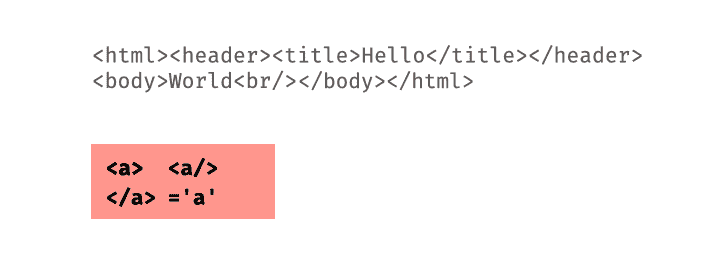
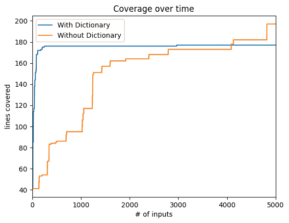
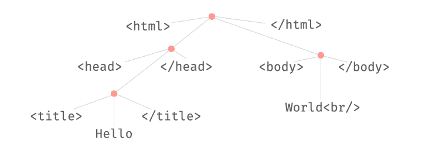
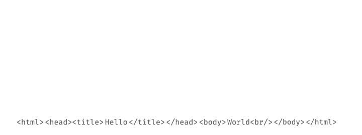

# 基于语法的灰盒模糊测试

> 原文：[`www.fuzzingbook.org/html/GreyboxGrammarFuzzer.html`](http://www.fuzzingbook.org/html/GreyboxGrammarFuzzer.html)

在本章中，我们介绍了对我们句法模糊测试技术的扩展，所有这些扩展都利用了 *现有输入的* 句法部分。

1.  我们展示了如何在模糊测试期间利用输入片段的 *字典*。想法是将这样的字典集成到 *变异器* 中，然后注入这些片段（通常是关键字和其他重要项）到种群中。

1.  我们展示了如何将 解析 和 模糊测试 与语法结合。这允许在保持句法正确性的同时 *变异* 现有输入，并在生成新输入的同时 *重用* 现有输入的片段。正如本章所展示的，基于语言的解析和生成组合在实践中取得了高度成功：*LangFuzz* 模糊器为 JavaScript 解释器找到了超过 2,600 个漏洞。

1.  在前面的章节中，我们以 *黑盒* 方式使用语法——也就是说，我们使用它们来生成输入，而不考虑正在测试的程序。在本章中，我们介绍了基于变异的 *语法灰盒模糊测试*：利用 *正在测试的程序反馈* 来引导测试生成向特定目标的技术。正如 词汇灰盒模糊测试 一样，这种反馈主要是 *覆盖率*，允许我们引导基于语法的测试向未覆盖的代码部分。这部分灵感来自 *AFLSmart* 模糊器，它结合了解析和变异模糊测试。

```py
from [bookutils](https://github.com/uds-se/fuzzingbook//tree/master/notebooks/shared/bookutils) import YouTubeVideo
YouTubeVideo('hSGzcjUj7Vs') 
```

**先决条件**

+   我们基于 关于灰盒模糊测试（无语法）的章节 的几个概念。

+   如标题所示，你应该知道如何使用语法进行模糊测试 语法章节。

## 概述

要 使用本章提供的代码，请编写

```py
>>> from fuzzingbook.GreyboxGrammarFuzzer import <identifier> 
```

然后利用以下功能。

本章介绍了受 *LangFuzz* 和 *AFLSmart* 模糊器启发的基于语言的灰盒模糊测试的高级方法。

### 使用字典进行模糊测试

与随机变异字符串不同，`DictMutator` 类允许从字典中插入标记，从而提高模糊测试器的性能。字典以字符串列表的形式提供，从中随机选择元素并插入，除了给定的变异，如删除或插入单个字节。

```py
>>> dict_mutator = DictMutator(["<a>", "</a>", "<a/>", "='a'"])
>>> seeds = ["<html><head><title>Hello</title></head><body>World<br/></body></html>"]
>>> for i in range(10):
>>>     print(dict_mutator.mutate(seeds[0]))
<html><head><title>Hello</title></head><body>World<br/>>/body></html>
<html><head><title>Hello</title></head><body>World<br/></body></ht7ml>
<html><head><title>Hello</title></hgad><body>World<br/></body></html>
<html><head><title>Hello</title></head><body>World<br/<a/>></body></html>
<html><head><title>Hello</title></head><body>World<br+></body></html>
<html><head><title>Hello</title></qhead><body>World<br/></body></html>
<html><head><title>Hello</title></head><body>World<br='a'/></body></html>
<html><head><title>Hello</title></head><body>Wormd<br/></body></html>
<html><head><title>Hello</title></head><body>Wyorld<br/></body></html>
<html><head><title>Hello<</a>/title></head><body>World<br/></body></html> 
```

这个 `DictMutator` 可以作为 `GreyboxFuzzer` 的参数使用：

```py
>>> runner = FunctionCoverageRunner(my_parser)
>>> dict_fuzzer = GreyboxFuzzer(seeds, dict_mutator, PowerSchedule())
>>> dict_fuzzer_outcome = dict_fuzzer.runs(runner, trials=5) 
```

<svg width="306pt" height="152pt" viewBox="0.00 0.00 305.62 152.25" xmlns:xlink="http://www.w3.org/1999/xlink"><g id="graph0" class="graph" transform="scale(1 1) rotate(0) translate(4 148.25)"><g id="node1" class="node"><title>DictMutator</title> <g id="a_node1"><a xlink:href="#" xlink:title="class DictMutator:

使用字典中的关键字变换字符串"><text text-anchor="start" x="42.12" y="-43.7" font-family="Patua One, Helvetica, sans-serif" font-weight="bold" font-size="14.00" fill="#b03a2e">字典变换器</text> <g id="a_node1_0"><a xlink:href="#" xlink:title="字典变换器"><g id="a_node1_1"><a xlink:href="#" xlink:title="__init__(self, dictionary: List[str]) -> None: 

构造函数。`dictionary` 是要使用的关键字列表。"><text text-anchor="start" x="8" y="-21.5" font-family="'Fira Mono', 'Source Code Pro', 'Courier', monospace" font-weight="bold" font-style="italic" font-size="10.00">__init__()</text></a></g> <g id="a_node1_2"><a xlink:href="#" xlink:title="insert_from_dictionary(self, s: str) -> str: 

返回插入字典中关键字后的字符串</text> <text text-anchor="start" x="8" y="-7.75" font-family="'Fira Mono', 'Source Code Pro', 'Courier', monospace" font-size="10.00">insert_from_dictionary()</text></a></g></a></g></a></g></g> <g id="node2" class="node"><title>变换器</title> <g id="a_node2"><a xlink:href="GreyboxFuzzer.html" xlink:title="class Mutator:

变换字符串"><text text-anchor="start" x="54.12" y="-127.45" font-family="Patua One, Helvetica, sans-serif" font-weight="bold" font-size="14.00" fill="#b03a2e">变换器</text> <g id="a_node2_3"><a xlink:href="#" xlink:title="变换器"><g id="a_node2_4"><a xlink:href="GreyboxFuzzer.html" xlink:title="class Mutator: 

构造函数"><text text-anchor="start" x="50" y="-105.25" font-family="'Fira Mono', 'Source Code Pro', 'Courier', monospace" font-weight="bold" font-style="italic" font-size="10.00">__init__()</text></a></g></a></g></a></g></g> <g id="edge1" class="edge"><title>DictMutator->Mutator</title></g> <g id="node3" class="node"><title>图例</title> <text text-anchor="start" x="178.38" y="-46.25" font-family="Patua One, Helvetica, sans-serif" font-weight="bold" font-size="10.00" fill="#b03a2e">图例</text> <text text-anchor="start" x="178.38" y="-36.25" font-family="Patua One, Helvetica, sans-serif" font-size="10.00">• </text> <text text-anchor="start" x="184.38" y="-36.25" font-family="'Fira Mono', 'Source Code Pro', 'Courier', monospace" font-weight="bold" font-size="8.00">public_method()</text> <text text-anchor="start" x="178.38" y="-26.25" font-family="Patua One, Helvetica, sans-serif" font-size="10.00">• </text> <text text-anchor="start" x="184.38" y="-26.25" font-family="'Fira Mono', 'Source Code Pro', 'Courier', monospace" font-size="8.00">private_method()</text> <text text-anchor="start" x="178.38" y="-16.25" font-family="Patua One, Helvetica, sans-serif" font-size="10.00">• </text> <text text-anchor="start" x="184.38" y="-16.25" font-family="'Fira Mono', 'Source Code Pro', 'Courier', monospace" font-style="italic" font-size="8.00">overloaded_method()</text> <text text-anchor="start" x="178.38" y="-7.2" font-family="Helvetica,sans-Serif" font-size="9.00">将鼠标悬停在名称上以查看文档</text></g></g></svg>

### 使用输入片段进行模糊测试

`LangFuzzer` 类引入了一个 *语言感知* 模糊器，可以重新组合现有输入中的片段——灵感来源于高效的 `LangFuzz` 模糊器。其核心是一个 `FragmentMutator` 类，该类将一个 *解析器* 作为参数：

```py
>>> parser = EarleyParser(XML_GRAMMAR, tokens=XML_TOKENS)
>>> mutator = FragmentMutator(parser) 
```

模糊器本身使用种子列表、上述 `FragmentMutator` 和一个功率计划进行初始化：

```py
>>> seeds = ["<html><head><title>Hello</title></head><body>World<br/></body></html>"]
>>> schedule = PowerSchedule()
>>> lang_fuzzer = LangFuzzer(seeds, mutator, schedule)
>>> for i in range(10):
>>>     print(lang_fuzzer.fuzz())
<html><head><title>Hello</title></head><body>World<br/></body></html>
<html><head><title>Hello</title></head>World<br/></body></html>
<html>World<body>World<br/></body></html>
<html><title>Hello</title></head><title>World<br/></body></html>
<html><head><title><head>World</head></title></head>World<br/></body></html>
<html><body>World<br/></body><body>World<br/></body></html>

Exception ignored in: <bound method IPythonKernel._clean_thread_parent_frames of <ipykernel.ipkernel.IPythonKernel object at 0x103912720>>
Traceback (most recent call last):
  File "/Users/zeller/.local/lib/python3.12/site-packages/ipykernel/ipkernel.py", line 775, in _clean_thread_parent_frames
    def _clean_thread_parent_frames(

  File "Timeout.ipynb", line 43, in timeout_handler
    }

TimeoutError: 

<html><body>WorldHello</body>

Exception ignored in: <bound method IPythonKernel._clean_thread_parent_frames of <ipykernel.ipkernel.IPythonKernel object at 0x103912720>>
Traceback (most recent call last):
  File "/Users/zeller/.local/lib/python3.12/site-packages/ipykernel/ipkernel.py", line 775, in _clean_thread_parent_frames
    def _clean_thread_parent_frames(

  File "Timeout.ipynb", line 43, in timeout_handler
    }

TimeoutError: 

<html><head><title>Hello</title></head><body><head><head>World</head></title></head><body>World<br/></body><br/></body></html>
<html><head><title></title></head><body>World<br/></body></html>
<html><head><title>Hello</title></head><body><head><title><head>World</head></title></head><body>World<br/></body><br/><br/></body></html> 
```

<svg width="462pt" height="389pt" viewBox="0.00 0.00 461.88 389.00" xmlns:xlink="http://www.w3.org/1999/xlink"><g id="graph0" class="graph" transform="scale(1 1) rotate(0) translate(4 385)"><g id="node1" class="node"><title>LangFuzzer</title> <g id="a_node1"><a xlink:href="#" xlink:title="class LangFuzzer:

黑盒模糊器正在变异输入片段。大致基于 `LangFuzz`。"><text text-anchor="start" x="52.62" y="-88.33" font-family="Patua One, Helvetica, sans-serif" font-weight="bold" font-size="14.00" fill="#b03a2e">LangFuzzer</text> <g id="a_node1_0"><a xlink:href="#" xlink:title="LangFuzzer"><g id="a_node1_1"><a xlink:href="#" xlink:title="create_candidate(self) -> GreyboxFuzzer.Seed:

返回由模糊种群中的种子生成的输入"><text text-anchor="start" x="34.25" y="-66.12" font-family="'Fira Mono', 'Source Code Pro', 'Courier', monospace" font-style="italic" font-size="10.00">create_candidate()</text></a></g></a></g></a></g></g> <g id="node2" class="node"><title>AdvancedMutationFuzzer</title> <g id="a_node2"><a xlink:href="GreyboxFuzzer.html" xlink:title="class AdvancedMutationFuzzer:

基于变异的模糊的基础类。"><text text-anchor="start" x="8" y="-242.2" font-family="Patua One, Helvetica, sans-serif" font-weight="bold" font-size="14.00" fill="#b03a2e">AdvancedMutationFuzzer</text> <g id="a_node2_2"><a xlink:href="#" xlink:title="AdvancedMutationFuzzer"><g id="a_node2_3"><a xlink:href="GreyboxFuzzer.html" xlink:title="__init__(self, seeds: List[str], mutator: GreyboxFuzzer.Mutator, schedule: GreyboxFuzzer.PowerSchedule) -> None:

构造函数。

`seeds` - 要变异的（输入）字符串列表。

`mutator` - 要应用的变异器。

`schedule` - 要应用的功率计划。"><text text-anchor="start" x="58.25" y="-220" font-family="'Fira Mono', 'Source Code Pro', 'Courier', monospace" font-weight="bold" font-style="italic" font-size="10.00">__init__()</text></a></g> <g id="a_node2_4"><a xlink:href="GreyboxFuzzer.html" xlink:title="fuzz(self) -> str:

返回每个种子一次，然后生成新的输入"><text text-anchor="start" x="58.25" y="-207.25" font-family="'Fira Mono', 'Source Code Pro', 'Courier', monospace" font-weight="bold" font-style="italic" font-size="10.00">fuzz()</text></a></g></a></g></a></g></g> <g id="edge1" class="edge"><title>LangFuzzer->AdvancedMutationFuzzer</title></g> <g id="node3" class="node"><title>Fuzzer</title> <g id="a_node3"><a xlink:href="Fuzzer.html" xlink:title="class Fuzzer:

模糊器的基类"><text text-anchor="start" x="67.62" y="-364.2" font-family="Patua One, Helvetica, sans-serif" font-weight="bold" font-size="14.00" fill="#b03a2e">Fuzzer</text> <g id="a_node3_5"><a xlink:href="#" xlink:title="Fuzzer"><g id="a_node3_6"><a xlink:href="Fuzzer.html" xlink:title="__init__(self) -> None:

构造函数"><text text-anchor="start" x="58.25" y="-342" font-family="'Fira Mono', 'Source Code Pro', 'Courier', monospace" font-weight="bold" font-style="italic" font-size="10.00">__init__()</text></a></g> <g id="a_node3_7"><a xlink:href="Fuzzer.html" xlink:title="fuzz(self) -> str:

返回模糊输入"><text text-anchor="start" x="58.25" y="-329.25" font-family="'Fira Mono', 'Source Code Pro', 'Courier', monospace" font-weight="bold" font-style="italic" font-size="10.00">fuzz()</text></a></g> <g id="a_node3_8"><a xlink:href="Fuzzer.html" xlink:title="run(self, runner: Fuzzer.Runner = <Fuzzer.Runner object>) -> Tuple[subprocess.CompletedProcess, str]:

使用模糊输入运行`runner`"><text text-anchor="start" x="58.25" y="-316.5" font-family="'Fira Mono', 'Source Code Pro', 'Courier', monospace" font-weight="bold" font-size="10.00">run()</text></a></g> <g id="a_node3_9"><a xlink:href="Fuzzer.html" xlink:title="runs(self, runner: Fuzzer.Runner = <Fuzzer.PrintRunner object>, trials: int = 10) -> List[Tuple[subprocess.CompletedProcess, str]]:

使用模糊输入，运行`runner`，共`trials`次"><text text-anchor="start" x="58.25" y="-303.75" font-family="'Fira Mono', 'Source Code Pro', 'Courier', monospace" font-weight="bold" font-size="10.00">runs()</text></a></g></a></g></a></g></g> <g id="edge2" class="edge"><title>AdvancedMutationFuzzer->Fuzzer</title></g> <g id="node4" class="node"><title>片段突变器</title> <g id="a_node4"><a xlink:href="#" xlink:title="class FragmentMutator:

使用来自池的输入片段突变输入"><text text-anchor="start" x="186.38" y="-145.7" font-family="Patua One, Helvetica, sans-serif" font-weight="bold" font-size="14.00" fill="#b03a2e">片段突变器</text> <g id="a_node4_10"><a xlink:href="#" xlink:title="FragmentMutator"><g id="a_node4_11"><a xlink:href="#" xlink:title="__init__(self, parser):

初始化突变器"><text text-anchor="start" x="176.25" y="-123.5" font-family="'Fira Mono', 'Source Code Pro', 'Courier', monospace" font-weight="bold" font-style="italic" font-size="10.00">__init__()</text></a></g> <g id="a_node4_12"><a xlink:href="#" xlink:title="add_to_fragment_pool(self, seed: SeedWithStructure) -> None:

将种子的所有片段添加到片段池中"><text text-anchor="start" x="176.25" y="-110.75" font-family="'Fira Mono', 'Source Code Pro', 'Courier', monospace" font-weight="bold" font-size="10.00">add_to_fragment_pool()</text></a></g> <g id="a_node4_13"><a xlink:href="#" xlink:title="add_fragment(self, fragment: DerivationTree) -> None:

递归地将片段添加到片段池中"><text text-anchor="start" x="176.25" y="-97" font-family="'Fira Mono', 'Source Code Pro', 'Courier', monospace" font-size="10.00">add_fragment()</text></a></g> <g id="a_node4_14"><a xlink:href="#" xlink:title="count_nodes(self, fragment: DerivationTree) -> int:

返回片段中的节点数"><text text-anchor="start" x="176.25" y="-84.25" font-family="'Fira Mono', 'Source Code Pro', 'Courier', monospace" font-size="10.00">count_nodes()</text></a></g> <g id="a_node4_15"><a xlink:href="#" xlink:title="delete_fragment(self, seed: SeedWithStructure) -> SeedWithStructure:

删除一个随机片段"><text text-anchor="start" x="176.25" y="-71.5" font-family="'Fira Mono', 'Source Code Pro', 'Courier', monospace" font-size="10.00">delete_fragment()</text></a></g> <g id="a_node4_16"><a xlink:href="#" xlink:title="is_excluded(self, symbol: str) -> bool:

如果一个片段以特定内容开始，则返回 true

符号及其所有后代可以被排除"><text text-anchor="start" x="176.25" y="-58.75" font-family="'Fira Mono', 'Source Code Pro', 'Courier', monospace" font-size="10.00">is_excluded()</text></a></g> <g id="a_node4_17"><a xlink:href="#" xlink:title="mutate(self, seed: SeedWithStructure) -> SeedWithStructure:

实现结构感知的变异。缓存种子。"><text text-anchor="start" x="176.25" y="-47" font-family="'Fira Mono', 'Source Code Pro', 'Courier', monospace" font-style="italic" font-size="10.00">mutate()</text></a></g> <g id="a_node4_18"><a xlink:href="#" xlink:title="recursive_delete(self, fragment: DerivationTree) -> DerivationTree:

递归查找要删除的片段"><text text-anchor="start" x="176.25" y="-33.25" font-family="'Fira Mono', 'Source Code Pro', 'Courier', monospace" font-size="10.00">recursive_delete()</text></a></g> <g id="a_node4_19"><a xlink:href="#" xlink:title="recursive_swap(self, fragment: DerivationTree) -> DerivationTree:

递归查找要交换的片段。"><text text-anchor="start" x="176.25" y="-20.5" font-family="'Fira Mono', 'Source Code Pro', 'Courier', monospace" font-size="10.00">recursive_swap()</text></a></g> <g id="a_node4_20"><a xlink:href="#" xlink:title="swap_fragment(self, seed: SeedWithStructure) -> SeedWithStructure:

用具有相同符号的另一个片段替换随机片段"><text text-anchor="start" x="176.25" y="-7.75" font-family="'Fira Mono', 'Source Code Pro', 'Courier', monospace" font-size="10.00">swap_fragment()</text></a></g></a></g></a></g></g> <g id="node5" class="node"><title>Mutator</title> <g id="a_node5"><a xlink:href="GreyboxFuzzer.html" xlink:title="class Mutator:

变异字符串"><text text-anchor="start" x="216.38" y="-235.82" font-family="Patua One, Helvetica, sans-serif" font-weight="bold" font-size="14.00" fill="#b03a2e">Mutator</text> <g id="a_node5_21"><a xlink:href="#" xlink:title="Mutator"><g id="a_node5_22"><a xlink:href="GreyboxFuzzer.html" xlink:title="__init__(self) -> None:

Constructor"><text text-anchor="start" x="212.25" y="-213.62" font-family="'Fira Mono', 'Source Code Pro', 'Courier', monospace" font-weight="bold" font-style="italic" font-size="10.00">__init__()</text></a></g></a></g></g></g></g> <g id="edge3" class="edge"><title>FragmentMutator->Mutator</title></g> <g id="node6" class="node"><title>图例</title> <text text-anchor="start" x="334.62" y="-97.25" font-family="Patua One, Helvetica, sans-serif" font-weight="bold" font-size="10.00" fill="#b03a2e">图例</text> <text text-anchor="start" x="334.62" y="-87.25" font-family="Patua One, Helvetica, sans-serif" font-size="10.00">• </text> <text text-anchor="start" x="340.62" y="-87.25" font-family="'Fira Mono', 'Source Code Pro', 'Courier', monospace" font-weight="bold" font-size="8.00">公共方法()</text> <text text-anchor="start" x="334.62" y="-77.25" font-family="Patua One, Helvetica, sans-serif" font-size="10.00">• </text> <text text-anchor="start" x="340.62" y="-77.25" font-family="'Fira Mono', 'Source Code Pro', 'Courier', monospace" font-size="8.00">私有方法()</text> <text text-anchor="start" x="334.62" y="-67.25" font-family="Patua One, Helvetica, sans-serif" font-size="10.00">• </text> <text text-anchor="start" x="340.62" y="-67.25" font-family="'Fira Mono', 'Source Code Pro', 'Courier', monospace" font-style="italic" font-size="8.00">重载方法()</text> <text text-anchor="start" x="334.62" y="-58.2" font-family="Helvetica,sans-Serif" font-size="9.00">将鼠标悬停在名称上以查看文档</text></g></g></svg>

### 基于输入区域的模糊测试

`GreyboxGrammarFuzzer` 类使用两个突变体：

+   一个 *树突变体*（一个 `RegionMutator` 对象），它可以解析现有字符串以识别该字符串中的 *区域* 以进行交换或删除。

+   一个 *字节突变体* 用于应用位和字符级别的突变。

```py
>>> tree_mutator = RegionMutator(parser)
>>> byte_mutator = Mutator() 
```

`GreyboxGrammarFuzzer` 类的 *调度* 可以是一个常规的 `PowerSchedule` 对象。然而，`AFLSmartSchedule` 提供了一个更复杂的调度，它将更多 能量 分配给具有更高有效性的种子。

```py
>>> schedule = AFLSmartSchedule(parser) 
```

`GreyboxGrammarFuzzer` 构造函数接受一组种子以及两个突变体和调度：

```py
>>> aflsmart_fuzzer = GreyboxGrammarFuzzer(seeds, byte_mutator, tree_mutator, schedule) 
```

由于它依赖于代码覆盖率，它通常与 `FunctionCoverageRunner` 结合使用：

```py
>>> runner = FunctionCoverageRunner(my_parser)
>>> aflsmart_outcome = aflsmart_fuzzer.runs(runner, trials=5) 
```

<svg width="638pt" height="511pt" viewBox="0.00 0.00 637.88 511.00" xmlns:xlink="http://www.w3.org/1999/xlink"><g id="graph0" class="graph" transform="scale(1 1) rotate(0) translate(4 507)"><g id="node1" class="node"><title>GreyboxGrammarFuzzer</title> <g id="a_node1"><a xlink:href="#" xlink:title="class GreyboxGrammarFuzzer:

使用语法的灰盒模糊测试器。"><text text-anchor="start" x="12.5" y="-56.45" font-family="Patua One, Helvetica, sans-serif" font-weight="bold" font-size="14.00" fill="#b03a2e">GreyboxGrammarFuzzer</text> <g id="a_node1_0"><a xlink:href="#" xlink:title="GreyboxGrammarFuzzer"><g id="a_node1_1"><a xlink:href="#" xlink:title="__init__(self, seeds: List[str], byte_mutator: GreyboxFuzzer.Mutator, tree_mutator: FragmentMutator, schedule: GreyboxFuzzer.PowerSchedule) -> None:

构造函数。

`seeds` - 要变异的输入集合。

`byte_mutator` - 字节级别的变异器。

`tree_mutator` = 树级别的变异器。

`schedule` - 功率调度。"><text text-anchor="start" x="34.25" y="-34.25" font-family="'Fira Mono', 'Source Code Pro', 'Courier', monospace" font-weight="bold" font-style="italic" font-size="10.00">__init__()</text></a></g> <g id="a_node1_2"><a xlink:href="#" xlink:title="create_candidate(self) -> str:

返回由结构变异生成的输入。

种子在种群中的变异。"><text text-anchor="start" x="34.25" y="-21.5" font-family="'Fira Mono', 'Source Code Pro', 'Courier', monospace" font-style="italic" font-size="10.00">create_candidate()</text></a></g></a></g></a></g></g> <g id="node2" class="node"><title>GreyboxFuzzer</title> <g id="a_node2"><a xlink:href="GreyboxFuzzer.html" xlink:title="class GreyboxFuzzer:

覆盖率引导的变异模糊测试。"><text text-anchor="start" x="41.75" y="-210.32" font-family="Patua One, Helvetica, sans-serif" font-weight="bold" font-size="14.00" fill="#b03a2e">GreyboxFuzzer</text> <g id="a_node2_3"><a xlink:href="#" xlink:title="GreyboxFuzzer"><g id="a_node2_4"><a xlink:href="GreyboxFuzzer.html" xlink:title="run(self, runner: MutationFuzzer.FunctionCoverageRunner) -> Tuple[Any, str]:

在跟踪覆盖率的同时运行函数(inp)。">

如果达到新的覆盖率，

将输入添加到种群并添加其覆盖率到种群覆盖率。"><text text-anchor="start" x="73.25" y="-188.12" font-family="'Fira Mono', 'Source Code Pro', 'Courier', monospace" font-weight="bold" font-style="italic" font-size="10.00">run()</text></a></g></a></g></a></g></g> <g id="edge1" class="edge"><title>GreyboxGrammarFuzzer->GreyboxFuzzer</title></g> <g id="node3" class="node"><title>AdvancedMutationFuzzer</title> <g id="a_node3"><a xlink:href="GreyboxFuzzer.html" xlink:title="class AdvancedMutationFuzzer:

基于变异的模糊测试的基础类。"><text text-anchor="start" x="8" y="-364.2" font-family="Patua One, Helvetica, sans-serif" font-weight="bold" font-size="14.00" fill="#b03a2e">AdvancedMutationFuzzer</text> <g id="a_node3_5"><a xlink:href="#" xlink:title="AdvancedMutationFuzzer"><g id="a_node3_6"><a xlink:href="GreyboxFuzzer.html" xlink:title="__init__(self, seeds: List[str], mutator: GreyboxFuzzer.Mutator, schedule: GreyboxFuzzer.PowerSchedule) -> None:

构造函数。

`seeds` - 要变异的（输入）字符串列表。

`mutator` - 要应用的变异器。

`schedule` - 要应用的动力计划。"><text text-anchor="start" x="58.25" y="-342" font-family="'Fira Mono', 'Source Code Pro', 'Courier', monospace" font-weight="bold" font-style="italic" font-size="10.00">__init__()</text></a></g> <g id="a_node3_7"><a xlink:href="GreyboxFuzzer.html" xlink:title="fuzz(self) -> str:

返回每个种子一次，然后生成新的输入"><text text-anchor="start" x="58.25" y="-329.25" font-family="'Fira Mono', 'Source Code Pro', 'Courier', monospace" font-weight="bold" font-style="italic" font-size="10.00">fuzz()</text></a></g></a></g></a></g></g> <g id="edge2" class="edge"><title>GreyboxFuzzer->AdvancedMutationFuzzer</title></g> <g id="node4" class="node"><title>Fuzzer</title> <g id="a_node4"><a xlink:href="Fuzzer.html" xlink:title="class Fuzzer:

模糊器的基类。"><text text-anchor="start" x="67.62" y="-486.2" font-family="Patua One, Helvetica, sans-serif" font-weight="bold" font-size="14.00" fill="#b03a2e">Fuzzer</text> <g id="a_node4_8"><a xlink:href="#" xlink:title="Fuzzer"><g id="a_node4_9"><a xlink:href="Fuzzer.html" xlink:title="__init__(self) -> None:

构造函数"><text text-anchor="start" x="58.25" y="-464" font-family="'Fira Mono', 'Source Code Pro', 'Courier', monospace" font-weight="bold" font-style="italic" font-size="10.00">__init__()</text></a></g> <g id="a_node4_10"><a xlink:href="Fuzzer.html" xlink:title="fuzz(self) -> str:

返回模糊输入"><text text-anchor="start" x="58.25" y="-451.25" font-family="'Fira Mono', 'Source Code Pro', 'Courier', monospace" font-weight="bold" font-style="italic" font-size="10.00">fuzz()</text></a></g> <g id="a_node4_11"><a xlink:href="Fuzzer.html" xlink:title="run(self, runner: Fuzzer.Runner = <Fuzzer.Runner object>) -> Tuple[subprocess.CompletedProcess, str]:

使用模糊输入运行`runner`"><text text-anchor="start" x="58.25" y="-438.5" font-family="'Fira Mono', 'Source Code Pro', 'Courier', monospace" font-weight="bold" font-style="italic" font-size="10.00">run()</text></a></g> <g id="a_node4_12"><a xlink:href="Fuzzer.html" xlink:title="runs(self, runner: Fuzzer.Runner = <Fuzzer.PrintRunner object>, trials: int = 10) -> List[Tuple[subprocess.CompletedProcess, str]]:

使用模糊输入运行`runner`，`trials`次"><text text-anchor="start" x="58.25" y="-425.75" font-family="'Fira Mono', 'Source Code Pro', 'Courier', monospace" font-weight="bold" font-size="10.00">runs()</text></a></g></a></g></a></g></g> <g id="edge3" class="edge"><title>AdvancedMutationFuzzer->Fuzzer</title></g> <g id="node5" class="node"><title>AFLSmartSchedule</title> <g id="a_node5"><a xlink:href="#" xlink:title="class AFLSmartSchedule:

定义如何将模糊测试时间分配给种群。"><text text-anchor="start" x="200.5" y="-69.2" font-family="Patua One, Helvetica, sans-serif" font-weight="bold" font-size="14.00" fill="#b03a2e">AFLSmartSchedule</text> <g id="a_node5_13"><a xlink:href="#" xlink:title="AFLSmartSchedule"><g id="a_node5_14"><a xlink:href="#" xlink:title="__init__(self, parser: Parser.EarleyParser, exponent: float = 1.0):

构造函数"><text text-anchor="start" x="198.25" y="-47" font-family="'Fira Mono', 'Source Code Pro', 'Courier', monospace" font-weight="bold" font-style="italic" font-size="10.00">__init__()</text></a></g> <g id="a_node5_15"><a xlink:href="#" xlink:title="assignEnergy(self, population: Sequence[GreyboxFuzzer.Seed]):

按有效性程度分配指数能量"><text text-anchor="start" x="198.25" y="-34.25" font-family="'Fira Mono', 'Source Code Pro', 'Courier', monospace" font-style="italic" font-size="10.00">assignEnergy()</text></a></g> <g id="a_node5_16"><a xlink:href="#" xlink:title="degree_of_validity(self, seed: GreyboxFuzzer.Seed) -> float:

返回可解析的种子比例"><text text-anchor="start" x="198.25" y="-20.5" font-family="'Fira Mono', 'Source Code Pro', 'Courier', monospace" font-size="10.00">degree_of_validity()</text></a></g> <g id="a_node5_17"><a xlink:href="#" xlink:title="parsable(self, seed: GreyboxFuzzer.Seed) -> str:

返回可解析的子串"><text text-anchor="start" x="198.25" y="-7.75" font-family="'Fira Mono', 'Source Code Pro', 'Courier', monospace" font-size="10.00">parsable()</text></a></g></a></g></a></g></g> <g id="node6" class="node"><title>PowerSchedule</title> <g id="a_node6"><a xlink:href="GreyboxFuzzer.html" xlink:title="class PowerSchedule:

定义如何将模糊测试时间分配给种群。"><text text-anchor="start" x="211.38" y="-210.32" font-family="Patua One, Helvetica, sans-serif" font-weight="bold" font-size="14.00" fill="#b03a2e">PowerSchedule</text> <g id="a_node6_18"><a xlink:href="#" xlink:title="PowerSchedule"><g id="a_node6_19"><a xlink:href="GreyboxFuzzer.html" xlink:title="__init__(self) -> None:

构造函数"><text text-anchor="start" x="228.25" y="-188.12" font-family="'Fira Mono', 'Source Code Pro', 'Courier', monospace" font-weight="bold" font-style="italic" font-size="10.00">__init__()</text></a></g></a></g></a></g></g> <g id="edge4" class="edge"><title>AFLSmartSchedule->PowerSchedule</title></g> <g id="node7" class="node"><title>RegionMutator</title> <g id="a_node7"><a xlink:href="#" xlink:title="class RegionMutator:

使用来自池的输入片段突变输入"><text text-anchor="start" x="371" y="-62.83" font-family="Patua One, Helvetica, sans-serif" font-weight="bold" font-size="14.00" fill="#b03a2e">RegionMutator</text> <g id="a_node7_20"><a xlink:href="#" xlink:title="RegionMutator"><g id="a_node7_21"><a xlink:href="#" xlink:title="add_to_fragment_pool(self, seed: SeedWithRegions) -> None:

在种子文件中标记片段和区域"><text text-anchor="start" x="352.25" y="-40.62" font-family="'Fira Mono', 'Source Code Pro', 'Courier', monospace" font-style="italic" font-size="10.00">add_to_fragment_pool()</text></a></g> <g id="a_node7_22"><a xlink:href="#" xlink:title="delete_fragment(self, seed: SeedWithRegions) -> SeedWithRegions:

删除一个随机区域"><text text-anchor="start" x="352.25" y="-27.88" font-family="'Fira Mono', 'Source Code Pro', 'Courier', monospace" font-style="italic" font-size="10.00">delete_fragment()</text></a></g> <g id="a_node7_23"><a xlink:href="#" xlink:title="swap_fragment(self, seed: SeedWithRegions) -> SeedWithRegions:

选择一个随机区域并将其与片段交换

以相同的符号开始"><text text-anchor="start" x="352.25" y="-15.12" font-family="'Fira Mono', 'Source Code Pro', 'Courier', monospace" font-style="italic" font-size="10.00">swap_fragment()</text></a></g></a></g></a></g></g> <g id="node8" class="node"><title>FragmentMutator</title> <g id="a_node8"><a xlink:href="#" xlink:title="class FragmentMutator:

使用池中的输入片段突变输入"><text text-anchor="start" x="362.38" y="-267.7" font-family="Patua One, Helvetica, sans-serif" font-weight="bold" font-size="14.00" fill="#b03a2e">FragmentMutator</text> <g id="a_node8_24"><a xlink:href="#" xlink:title="FragmentMutator"><g id="a_node8_25"><a xlink:href="#" xlink:title="__init__(self, parser):

初始化突变体"><text text-anchor="start" x="352.25" y="-245.5" font-family="'Fira Mono', 'Source Code Pro', 'Courier', monospace" font-weight="bold" font-style="italic" font-size="10.00">__init__()</text></a></g> <g id="a_node8_26"><a xlink:href="#" xlink:title="add_to_fragment_pool(self, seed: SeedWithStructure) -> None:

将种子片段的所有片段添加到片段池中"><text text-anchor="start" x="352.25" y="-232.75" font-family="'Fira Mono', 'Source Code Pro', 'Courier', monospace" font-weight="bold" font-style="italic" font-size="10.00">add_to_fragment_pool()</text></a></g> <g id="a_node8_27"><a xlink:href="#" xlink:title="add_fragment(self, fragment: DerivationTree) -> None:

递归地将片段添加到片段池中"><text text-anchor="start" x="352.25" y="-219" font-family="'Fira Mono', 'Source Code Pro', 'Courier', monospace" font-size="10.00">add_fragment()</text></a></g> <g id="a_node8_28"><a xlink:href="#" xlink:title="count_nodes(self, fragment: DerivationTree) -> int:

返回片段中的节点数"><text text-anchor="start" x="352.25" y="-206.25" font-family="'Fira Mono', 'Source Code Pro', 'Courier', monospace" font-size="10.00">count_nodes()</text></a></g> <g id="a_node8_29"><a xlink:href="#" xlink:title="delete_fragment(self, seed: SeedWithStructure) -> SeedWithStructure:

删除一个随机片段"><text text-anchor="start" x="352.25" y="-194.5" font-family="'Fira Mono', 'Source Code Pro', 'Courier', monospace" font-style="italic" font-size="10.00">delete_fragment()</text></a></g> <g id="a_node8_30"><a xlink:href="#" xlink:title="is_excluded(self, symbol: str) -> bool:

如果一个片段以特定的开头返回 true

符号及其所有后代可以被排除"><text text-anchor="start" x="352.25" y="-180.75" font-family="'Fira Mono', 'Source Code Pro', 'Courier', monospace" font-size="10.00">is_excluded()</text></a></g> <g id="a_node8_31"><a xlink:href="#" xlink:title="mutate(self, seed: SeedWithStructure) -> SeedWithStructure:

实现结构感知变异。缓存种子。"><text text-anchor="start" x="352.25" y="-169" font-family="'Fira Mono', 'Source Code Pro', 'Courier', monospace" font-style="italic" font-size="10.00">mutate()</text></a></g> <g id="a_node8_32"><a xlink:href="#" xlink:title="recursive_delete(self, fragment: DerivationTree) -> DerivationTree:

递归查找要删除的片段"><text text-anchor="start" x="352.25" y="-155.25" font-family="'Fira Mono', 'Source Code Pro', 'Courier', monospace" font-size="10.00">recursive_delete()</text></a></g> <g id="a_node8_33"><a xlink:href="#" xlink:title="recursive_swap(self, fragment: DerivationTree) -> DerivationTree:

递归查找要交换的片段。"><text text-anchor="start" x="352.25" y="-142.5" font-family="'Fira Mono', 'Source Code Pro', 'Courier', monospace" font-size="10.00">recursive_swap()</text></a></g> <g id="a_node8_34"><a xlink:href="#" xlink:title="swap_fragment(self, seed: SeedWithStructure) -> SeedWithStructure:

用具有相同符号的另一个随机片段替换"><text text-anchor="start" x="352.25" y="-130.75" font-family="'Fira Mono', 'Source Code Pro', 'Courier', monospace" font-style="italic" font-size="10.00">swap_fragment()</text></a></g></a></g></a></g></g> <g id="edge5" class="edge"><title>RegionMutator->FragmentMutator</title></g> <g id="node9" class="node"><title>Mutator</title> <g id="a_node9"><a xlink:href="GreyboxFuzzer.html" xlink:title="class Mutator:

修改字符串"><text text-anchor="start" x="392.38" y="-357.82" font-family="Patua One, Helvetica, sans-serif" font-weight="bold" font-size="14.00" fill="#b03a2e">Mutator</text> <g id="a_node9_35"><a xlink:href="#" xlink:title="Mutator"><g id="a_node9_36"><a xlink:href="GreyboxFuzzer.html" xlink:title="__init__(self) -> None:

构造函数"><text text-anchor="start" x="388.25" y="-335.62" font-family="'Fira Mono', 'Source Code Pro', 'Courier', monospace" font-weight="bold" font-style="italic" font-size="10.00">__init__()</text></a></g></a></g></a></g></g> <g id="edge6" class="edge"><title>FragmentMutator->Mutator</title></g> <g id="node10" class="node"><title>图例</title> <text text-anchor="start" x="510.62" y="-59" font-family="Patua One, Helvetica, sans-serif" font-weight="bold" font-size="10.00" fill="#b03a2e">图例</text> <text text-anchor="start" x="510.62" y="-49" font-family="Patua One, Helvetica, sans-serif" font-size="10.00">• </text> <text text-anchor="start" x="516.62" y="-49" font-family="'Fira Mono', 'Source Code Pro', 'Courier', monospace" font-weight="bold" font-size="8.00">public_method()</text> <text text-anchor="start" x="510.62" y="-39" font-family="Patua One, Helvetica, sans-serif" font-size="10.00">• </text> <text text-anchor="start" x="516.62" y="-39" font-family="'Fira Mono', 'Source Code Pro', 'Courier', monospace" font-size="8.00">private_method()</text> <text text-anchor="start" x="510.62" y="-29" font-family="Patua One, Helvetica, sans-serif" font-size="10.00">• </text> <text text-anchor="start" x="516.62" y="-29" font-family="'Fira Mono', 'Source Code Pro', 'Courier', monospace" font-style="italic" font-size="8.00">overloaded_method()</text> <text text-anchor="start" x="510.62" y="-19.95" font-family="Helvetica,sans-Serif" font-size="9.00">将鼠标悬停在名称上以查看文档</text></g></g></svg>

## 背景

首先，我们 回忆 一些用于变异模糊器的基本成分。

+   **Seed**。一个 *种子* 是一个输入，模糊器通过应用一系列变异来生成新的输入。

+   **Mutator**。一个 *变异器* 实现了一组变异操作，这些操作应用于输入产生略微修改后的输入。

+   **PowerSchedule**。一个 *功率计划* 将 *能量* 分配给一个种子。具有更高能量的种子在整个模糊测试活动中被模糊测试的频率更高。

+   **AdvancedMutationFuzzer**。我们的 *变异黑盒模糊器* 通过对输入群体中的种子进行变异来生成输入。

+   **GreyboxFuzzer**。我们的 *灰盒模糊器* 动态地向种子群体中添加输入，以增加覆盖率。

+   **FunctionCoverageRunner**。我们的 *功能覆盖率运行器* 收集给定 Python 函数执行的覆盖率信息。

让我们尝试对这些概念有一个感觉。

```py
import [bookutils.setup](https://github.com/uds-se/fuzzingbook//tree/master/notebooks/shared/bookutils) 
```

```py
from [typing](https://docs.python.org/3/library/typing.html) import List, Set, Dict, Sequence, cast 
```

```py
from Fuzzer import Fuzzer
from GreyboxFuzzer import Mutator, Seed, PowerSchedule
from GreyboxFuzzer import AdvancedMutationFuzzer, GreyboxFuzzer
from MutationFuzzer import FunctionCoverageRunner 
```

以下命令对输入 "Hello World" 应用了变异。

```py
Mutator().mutate("Hello World") 
```

```py
'Lello World'

```

默认功率计划将能量均匀分配到所有种子。让我们检查这是否有效。

我们从三个种子中选择了 10k 次。正如我们在 `hits` 计数器中看到的那样，每个种子大约有三分之一的概率被选中。

```py
population = [Seed("A"), Seed("B"), Seed("C")]
schedule = PowerSchedule()
hits = {
    "A": 0,
    "B": 0,
    "C": 0
}

for i in range(10000):
    seed = schedule.choose(population)
    hits[seed.data] += 1

hits 
```

```py
{'A': 3387, 'B': 3255, 'C': 3358}

```

在解释功能覆盖率运行器之前，让我们以 Python 的 HTML 解析器为例导入...

```py
from [html.parser](https://docs.python.org/3/library/html.parser.html) import HTMLParser 
```

...并创建一个 *包装函数*，将每个输入传递给一个新的解析器对象。

```py
def my_parser(inp: str) -> None:
    parser = HTMLParser()
    parser.feed(inp) 
```

`FunctionCoverageRunner` 构造函数接受一个 Python `function` 来执行。`run()` 函数接受一个输入，将其传递给 Python `function`，并收集这次执行的覆盖率信息。`coverage()` 函数返回一个包含元组 `(function name, line number)` 的列表，表示 Python `function` 中每个已覆盖的语句。

```py
runner = FunctionCoverageRunner(my_parser)
runner.run("Hello World")
cov = runner.coverage()

list(cov)[:5]  # Print 5 statements covered in HTMLParser 
```

```py
[('my_parser', 3),
 ('goahead', 163),
 ('updatepos', 47),
 ('goahead', 245),
 ('reset', 100)]

```

我们的灰盒模糊器需要一个种子种群、突变器和功率计划。让我们从一个“空”的种子语料库开始生成 5000 个模糊输入。

```py
import [time](https://docs.python.org/3/library/time.html)
import [random](https://docs.python.org/3/library/random.html) 
```

```py
n = 5000
seed_input = " "  # empty seed
runner = FunctionCoverageRunner(my_parser)
fuzzer = GreyboxFuzzer([seed_input], Mutator(), PowerSchedule()) 
```

```py
start = time.time()
fuzzer.runs(runner, trials=n)
end = time.time() 
```

```py
"It took the fuzzer %0.2f seconds to generate and execute %d inputs." % (end - start, n) 
```

```py
'It took the fuzzer 0.98 seconds to generate and execute 5000 inputs.'

```

```py
"During this fuzzing campaign, we covered %d statements." % len(runner.coverage()) 
```

```py
'During this fuzzing campaign, we covered 79 statements.'

```

## 使用字典进行模糊测试

为了模糊我们的 HTML 解析器，可能有必要向突变模糊器告知输入中的重要关键词——即重要的 HTML 关键词。一般思路是拥有一个 *预定义的有用输入字典*，然后在突变输入时插入这些输入。

这个概念在以下图中得到了说明。在突变输入时，我们可能会插入字典中给出的关键词（红色）。



为了实现这个概念，我们将我们的突变器扩展到考虑字典中的关键词。

```py
class DictMutator(Mutator):
  """Mutate strings using keywords from a dictionary"""

    def __init__(self, dictionary: List[str]) -> None:
  """Constructor. `dictionary` is the list of keywords to use."""
        super().__init__()
        self.dictionary = dictionary
        self.mutators.append(self.insert_from_dictionary)

    def insert_from_dictionary(self, s: str) -> str:
  """Returns s with a keyword from the dictionary inserted"""
        pos = random.randint(0, len(s))
        random_keyword = random.choice(self.dictionary)
        return s[:pos] + random_keyword + s[pos:] 
```

让我们尝试添加一些 HTML 标签和属性，看看使用 `DictMutator` 的覆盖率是否增加。

```py
runner = FunctionCoverageRunner(my_parser)
dict_mutator = DictMutator(["<a>", "</a>", "<a/>", "='a'"])
dict_fuzzer = GreyboxFuzzer([seed_input], dict_mutator, PowerSchedule())

start = time.time()
dict_fuzzer.runs(runner, trials=n)
end = time.time()

"It took the fuzzer %0.2f seconds to generate and execute %d inputs." % (end - start, n) 
```

```py
'It took the fuzzer 2.78 seconds to generate and execute 5000 inputs.'

```

显然，这需要更长的时间。根据我们的经验，这意味着覆盖了更多的代码：

```py
"During this fuzzing campaign, we covered %d statements." % len(runner.coverage()) 
```

```py
'During this fuzzing campaign, we covered 108 statements.'

```

模糊器在覆盖率的比较方面如何？

```py
from Coverage import population_coverage 
```

```py
import [matplotlib.pyplot](https://matplotlib.org/) as plt 
```

```py
_, dict_cov = population_coverage(dict_fuzzer.inputs, my_parser)
_, fuzz_cov = population_coverage(fuzzer.inputs, my_parser)
line_dict, = plt.plot(dict_cov, label="With Dictionary")
line_fuzz, = plt.plot(fuzz_cov, label="Without Dictionary")
plt.legend(handles=[line_dict, line_fuzz])
plt.xlim(0, n)
plt.title('Coverage over time')
plt.xlabel('# of inputs')
plt.ylabel('lines covered'); 
```



***总结。*** 通知模糊器关于重要关键词的信息已经大大有助于快速实现大量覆盖率。

***试试看。*** 打开这一章作为 Jupyter notebook，并将其他与 HTML 相关的关键词添加到字典中，以查看覆盖率的差异是否实际上增加了（在相同的 5k 生成测试输入预算下）。

***阅读。*** AFL 的作者 Michał Zalewski 写了几篇关于 [使用字典制作语法](https://lcamtuf.blogspot.com/2015/01/afl-fuzz-making-up-grammar-with.html) 和 [从空气中拉出 JPEG](https://lcamtuf.blogspot.com/2014/11/pulling-jpegs-out-of-thin-air.html) 的优秀博客文章！

## 使用输入片段进行模糊测试

虽然字典有助于将重要关键词注入种子输入，但它们不允许保持生成输入的结构完整性。相反，我们需要让模糊器意识到 *输入结构*。我们可以使用 语法 来做到这一点。我们的第一个方法

1.  解析 种子输入，

1.  将它们反汇编成输入片段，并

1.  根据语法的规则重新组装这些片段以生成新的文件。

这种 *解析* 和 *模糊测试* 的组合可以非常强大。例如，我们可以 *交换* 输入中现有的子结构：



我们还可以用新生成的子结构 *替换* 现有的子结构：


所有这些操作都在 推导树 上进行，这些树可以随时解析成字符串并生成字符串。

### 解析和重新组合 JavaScript，或如何在四周内赚取 50,000 美元

在“使用代码片段进行模糊测试”[[Holler *et al*, 2012](https://www.usenix.org/system/files/conference/usenixsecurity12/sec12-final73.pdf)]中，Holler、Herzig 和 Zeller 将这些步骤应用于模糊测试 JavaScript 解释器。他们使用 JavaScript 语法来

1.  *解析*（有效的）JavaScript 输入到解析树，

1.  *将它们反汇编*成片段（子树），

1.  *重新组合*这些片段，使其再次成为有效的 JavaScript 程序，

1.  *将这些程序输入到 JavaScript 解释器中进行执行*。

与大多数模糊测试场景一样，目标是使 JavaScript 解释器崩溃。以下是一个 LangFuzz 生成的 JavaScript 代码示例（来自[[Holler *et al*, 2012](https://www.usenix.org/system/files/conference/usenixsecurity12/sec12-final73.pdf)]），它导致 Mozilla JavaScript 解释器崩溃：

```py
var  haystack  =  "foo";
var  re_text  =  "^foo";
haystack  +=  "x";
re_text  +=  "(x)";
var  re  =  new  RegExp(re_text);
re.test(haystack);
RegExp.input  =  Number();
print(RegExp.$1); 
```

从 JavaScript 解释器的崩溃中，通常可以构建一个*利用*，不仅会使解释器崩溃，而且会在攻击者的控制下执行代码。因此，这样的崩溃是严重的缺陷，这也是为什么如果你报告它们，你会得到漏洞赏金。

在运行他的*LangFuzz*工具的前四周内，该论文的第一作者 Christian Holler 获得了*超过 50,000 美元的漏洞赏金*。到目前为止，LangFuzz 已经在 Mozilla Firefox、Google Chrome 和 Microsoft Edge 的 JavaScript 浏览器中发现了超过 2,600 个漏洞。如果你使用这些浏览器中的任何一个（比如在你的 Android 手机上），解析和模糊测试的组合在使你的浏览会话更安全方面做出了重大贡献。

（请注意，这些是 Holler 和 Zeller，他们是这本书的共同作者。如果你曾经想知道为什么我们会在基于语法的模糊测试上花费几章内容，那是因为我们在它上面有一些很好的经验。）

### 解析和重新组合 HTML

在这本书中，让我们先专注于 HTML 输入。为了为我们的 Python `HTMLParser`生成有效的 HTML 输入，我们首先应该定义一个简单的语法。它允许定义带有属性的 HTML 标签。我们的上下文无关语法不要求开标签和闭标签必须匹配。然而，我们将看到这样的上下文相关特性可以在派生的输入片段中保持，因此也在生成的输入中。

```py
import [string](https://docs.python.org/3/library/string.html) 
```

```py
from Grammars import is_valid_grammar, srange, Grammar 
```

```py
XML_TOKENS: Set[str] = {"<id>", "<text>"} 
```

```py
XML_GRAMMAR: Grammar = {
    "<start>": ["<xml-tree>"],
    "<xml-tree>": ["<text>",
                   "<xml-open-tag><xml-tree><xml-close-tag>",
                   "<xml-openclose-tag>",
                   "<xml-tree><xml-tree>"],
    "<xml-open-tag>":      ["<<id>>", "<<id> <xml-attribute>>"],
    "<xml-openclose-tag>": ["<<id>/>", "<<id> <xml-attribute>/>"],
    "<xml-close-tag>":     ["</<id>>"],
    "<xml-attribute>":     ["<id>=<id>", "<xml-attribute> <xml-attribute>"],
    "<id>":                ["<letter>", "<id><letter>"],
    "<text>":              ["<text><letter_space>", "<letter_space>"],
    "<letter>":            srange(string.ascii_letters + string.digits +
                                  "\"" + "'" + "."),
    "<letter_space>":      srange(string.ascii_letters + string.digits +
                                  "\"" + "'" + " " + "\t"),
} 
```

```py
assert is_valid_grammar(XML_GRAMMAR) 
```

为了将输入解析成推导树，我们使用 Earley 解析器。

```py
from Parser import EarleyParser, Parser
from GrammarFuzzer import display_tree, DerivationTree 
```

让我们在一个简单的 HTML 输入上运行解析器，并显示所有可能的解析树。*解析树*表示根据给定语法的输入结构。

```py
from [IPython.display](https://ipython.readthedocs.io/en/stable/api/generated/IPython.display.html) import display 
```

```py
parser = EarleyParser(XML_GRAMMAR, tokens=XML_TOKENS)

for tree in parser.parse("<html>Text</html>"):
    display(display_tree(tree)) 
```

<svg width="337pt" height="223pt" viewBox="0.00 0.00 336.50 223.25" xmlns:xlink="http://www.w3.org/1999/xlink"><g id="graph0" class="graph" transform="scale(1 1) rotate(0) translate(4 219.25)"><g id="node1" class="node"><title>0</title> <text text-anchor="middle" x="167.25" y="-201.95" font-family="Times,serif" font-size="14.00"><start></text></g> <g id="node2" class="node"><title>1</title> <text text-anchor="middle" x="167.25" y="-151.7" font-family="Times,serif" font-size="14.00"><xml-tree></text></g> <g id="edge1" class="edge"><title>0->1</title></g> <g id="node3" class="node"><title>2</title> <text text-anchor="middle" x="70.25" y="-101.45" font-family="Times,serif" font-size="14.00"><xml-open-tag></text></g> <g id="edge2" class="edge"><title>1->2</title></g> <g id="node8" class="node"><title>7</title> <text text-anchor="middle" x="167.25" y="-101.45" font-family="Times,serif" font-size="14.00"><xml-tree></text></g> <g id="edge7" class="edge"><title>1->7</title></g> <g id="node11" class="node"><title>10</title> <text text-anchor="middle" x="262.25" y="-101.45" font-family="Times,serif" font-size="14.00"><xml-close-tag></text></g> <g id="edge10" class="edge"><title>1->10</title></g> <g id="node4" class="node"><title>3</title> <text text-anchor="middle" x="17.25" y="-51.2" font-family="Times,serif" font-size="14.00">< (60)</text></g> <g id="edge3" class="edge"><title>2->3</title></g> <g id="node5" class="node"><title>4</title> <text text-anchor="middle" x="66.25" y="-51.2" font-family="Times,serif" font-size="14.00"><id></text></g> <g id="edge4" class="edge"><title>2->4</title></g> <g id="node7" class="node"><title>6</title> <text text-anchor="middle" x="115.25" y="-51.2" font-family="Times,serif" font-size="14.00">> (62)</text></g> <g id="edge6" class="edge"><title>2->6</title></g> <g id="node6" class="node"><title>5</title> <text text-anchor="middle" x="66.25" y="-0.95" font-family="Times,serif" font-size="14.00">html</text></g> <g id="edge5" class="edge"><title>4->5</title></g> <g id="node9" class="node"><title>8</title> <text text-anchor="middle" x="169.25" y="-51.2" font-family="Times,serif" font-size="14.00"><text></text></g> <g id="edge8" class="edge"><title>7->8</title></g> <g id="node10" class="node"><title>9</title> <text text-anchor="middle" x="169.25" y="-0.95" font-family="Times,serif" font-size="14.00">Text</text></g> <g id="edge9" class="edge"><title>8->9</title></g> <g id="node12" class="node"><title>11</title> <text text-anchor="middle" x="224.25" y="-51.2" font-family="Times,serif" font-size="14.00"></</text></g> <g id="edge11" class="edge"><title>10->11</title></g> <g id="node13" class="node"><title>12</

如我们所见，输入从一个开标签开始，包含一些文本，并以一个闭标签结束。非常好。这是一个我们可以工作的结构。

### 构建片段池

我们现在准备实现我们的第一个输入结构感知变异器。让我们用表示空片段池的字典 `fragments` 来初始化变异器。它包含语法中每个符号的键（以及空集作为值）。

```py
class FragmentMutator(Mutator):
  """Mutate inputs with input fragments from a pool"""

    def __init__(self, parser: EarleyParser) -> None:
  """Initialize empty fragment pool and add parser"""
        self.parser = parser
        self.fragments: Dict[str, List[DerivationTree]] = \
            {k: [] for k in self.parser.cgrammar}
        super().__init__() 
```

`FragmentMutator` 递归地添加片段。一个 *片段* 是解析树中的一个子树，由当前节点的符号和子节点（即子片段）组成。我们可以排除以标记、终结符或不是语法一部分的符号开始的片段。

```py
from Parser import terminals 
```

```py
class FragmentMutator(FragmentMutator):
    def add_fragment(self, fragment: DerivationTree) -> None:
  """Recursively adds fragments to the fragment pool"""
        (symbol, children) = fragment
        if not self.is_excluded(symbol):
            self.fragments[symbol].append(fragment)
            assert children is not None
            for subfragment in children:
                self.add_fragment(subfragment)

    def is_excluded(self, symbol: str) -> bool:
  """Returns true if a fragment starting with a specific
 symbol and all its decendents can be excluded"""
        return (symbol not in self.parser.grammar() or
                symbol in self.parser.tokens or
                symbol in terminals(self.parser.grammar())) 
```

解析可能需要很长时间，尤其是在解析过程中存在太多歧义时。为了保持突变模糊测试的效率，我们将解析时间限制在 200 毫秒。

```py
from Timeout import Timeout 
```

函数 `add_to_fragment_pool()` 解析一个种子（不超过 200 毫秒）并将所有片段添加到片段池中。如果 `seed` 的解析成功，则将属性 `seed.has_structure` 设置为 `True`。否则，设置为 `False`。

```py
class SeedWithStructure(Seed):
  """Seeds augmented with structure info"""

    def __init__(self, data: str) -> None:
        super().__init__(data)
        self.has_structure = False
        self.structure: DerivationTree = ("<empty>", []) 
```

```py
class FragmentMutator(FragmentMutator):
    def add_to_fragment_pool(self, seed: SeedWithStructure) -> None:
  """Adds all fragments of a seed to the fragment pool"""
        try:  # only allow quick parsing of 200ms max
            with Timeout(0.2):
                seed.structure = next(self.parser.parse(seed.data))
                self.add_fragment(seed.structure)
            seed.has_structure = True
        except (SyntaxError, TimeoutError):
            seed.has_structure = False 
```

让我们看看 `FragmentMutator` 如何为一个简单的 HTML 种子输入填充片段池。我们用 `EarleyParser` 初始化变异器，它本身是用我们的 `XML_GRAMMAR` 初始化的。

```py
from GrammarFuzzer import tree_to_string 
```

```py
valid_seed = SeedWithStructure(
    "<html><head><title>Hello</title></head><body>World<br/></body></html>")
fragment_mutator = FragmentMutator(EarleyParser(XML_GRAMMAR, tokens=XML_TOKENS))
fragment_mutator.add_to_fragment_pool(valid_seed)

for key in fragment_mutator.fragments:
    print(key)
    for f in fragment_mutator.fragments[key]:
        print("|-%s" % tree_to_string(f)) 
```

```py
<start>
|-<html><head><title>Hello</title></head><body>World<br/></body></html>
<xml-tree>
|-<html><head><title>Hello</title></head><body>World<br/></body></html>
|-<head><title>Hello</title></head><body>World<br/></body>
|-<head><title>Hello</title></head>
|-<title>Hello</title>
|-Hello
|-<body>World<br/></body>
|-World<br/>
|-World
|-<br/>
<xml-open-tag>
|-<html>
|-<head>
|-<title>
|-<body>
<xml-openclose-tag>
|-<br/>
<xml-close-tag>
|-</title>
|-</head>
|-</body>
|-</html>
<xml-attribute>
<id>
<text>
<letter>
<letter_space>

```

对于语法中的许多符号，我们已经收集了许多片段。有几个开闭标签和几个以 `xml-tree` 符号开始的有趣片段。

**总结**。对于语法中的每个有趣符号，`FragmentMutator` 都有一组片段。这些片段是通过首先解析要变异的输入提取出来的。

### 基于片段的变异

我们可以使用片段池中的片段来生成新的输入。每个正在变异的种子都被分解成片段，并进行了记忆化——即只分解一次。

```py
class FragmentMutator(FragmentMutator):
    def __init__(self, parser: EarleyParser) -> None:
  """Initialize mutators"""
        super().__init__(parser)
        self.seen_seeds: List[SeedWithStructure] = []

    def mutate(self, seed: SeedWithStructure) -> SeedWithStructure:
  """Implement structure-aware mutation. Memoize seeds."""
        if seed not in self.seen_seeds:
            self.seen_seeds.append(seed)
            self.add_to_fragment_pool(seed)

        return super().mutate(seed) 
```

我们的第一个结构变异操作符是 `swap_fragments()`，它选择种子中的随机片段，并用池中的随机片段替换它。我们确保两个片段都以相同的符号开始。例如，我们可能用片段池中的另一个闭标签替换种子 HTML 中的闭标签。

为了选择一个随机的片段，变异器计算与起始符号关联的根片段下的所有片段（`n_count`）。

```py
class FragmentMutator(FragmentMutator):
    def count_nodes(self, fragment: DerivationTree) -> int:
  """Returns the number of nodes in the fragment"""
        symbol, children = fragment
        if self.is_excluded(symbol):
            return 0

        assert children is not None
        return 1 + sum(map(self.count_nodes, children)) 
```

为了交换选定的片段——使用“全局”变量 `self.to_swap` 识别——种子解析树被递归遍历。

```py
class FragmentMutator(FragmentMutator):
    def recursive_swap(self, fragment: DerivationTree) -> DerivationTree:
  """Recursively finds the fragment to swap."""
        symbol, children = fragment
        if self.is_excluded(symbol):
            return symbol, children

        self.to_swap -= 1
        if self.to_swap == 0: 
            return random.choice(list(self.fragments[symbol]))

        assert children is not None
        return symbol, list(map(self.recursive_swap, children)) 
```

我们的结构变异器选择介于 2（即排除 `start` 符号）和总片段数（`n_count`）之间的随机数，并使用递归交换来生成新的片段。新的片段被序列化为字符串并作为新的种子返回。

```py
class FragmentMutator(FragmentMutator):
    def __init__(self, parser: EarleyParser) -> None:
        super().__init__(parser)
        self.mutators = [self.swap_fragment]

    def swap_fragment(self, seed: SeedWithStructure) -> SeedWithStructure:
  """Substitutes a random fragment with another with the same symbol"""
        if seed.has_structure:
            n_nodes = self.count_nodes(seed.structure)
            self.to_swap = random.randint(2, n_nodes)
            new_structure = self.recursive_swap(seed.structure)

            new_seed = SeedWithStructure(tree_to_string(new_structure))
            new_seed.has_structure = True
            new_seed.structure = new_structure
            return new_seed

        return seed 
```

```py
valid_seed = SeedWithStructure(
    "<html><head><title>Hello</title></head><body>World<br/></body></html>")
lf_mutator = FragmentMutator(parser)
print(valid_seed)
lf_mutator.mutate(valid_seed) 
```

```py
<html><head><title>Hello</title></head><body>World<br/></body></html>

```

```py
<title><head><title>Hello</title></head><body>World<br/></body></html>

```

如我们所见，一个片段已被另一个片段替换。

我们可以使用类似的递归遍历来 *移除* 一个随机的片段。

```py
class FragmentMutator(FragmentMutator):
    def recursive_delete(self, fragment: DerivationTree) -> DerivationTree:
  """Recursively finds the fragment to delete"""
        symbol, children = fragment
        if self.is_excluded(symbol):
            return symbol, children

        self.to_delete -= 1
        if self.to_delete == 0:
            return symbol, []

        assert children is not None
        return symbol, list(map(self.recursive_delete, children)) 
```

我们也应该定义相应的结构删除操作符。

```py
class FragmentMutator(FragmentMutator):
    def __init__(self, parser):
        super().__init__(parser)
        self.mutators.append(self.delete_fragment)

    def delete_fragment(self, seed: SeedWithStructure) -> SeedWithStructure:
  """Delete a random fragment"""
        if seed.has_structure:
            n_nodes = self.count_nodes(seed.structure)
            self.to_delete = random.randint(2, n_nodes)
            new_structure = self.recursive_delete(seed.structure)

            new_seed = SeedWithStructure(tree_to_string(new_structure))
            new_seed.has_structure = True
            new_seed.structure = new_structure
            # do not return an empty new_seed
            if not new_seed.data:
                return seed
            else:
                return new_seed

        return seed 
```

**摘要**. 我们现在拥有了结构感知模糊的所有成分。我们的变异器将所有种子分解成片段，然后将这些片段添加到片段池中。我们的变异器在给定的种子中随机交换相同类型的片段。我们的变异器还会删除给定种子中的随机片段。这允许在生成的输入与给定语法之间保持高度的合法性。

**尝试一下**。尝试添加其他结构变异操作符。一个*添加操作符*如何知道在给定的种子文件中，从某个特定符号开始的片段可以添加的位置？

### 基于片段的模糊测试

我们现在可以定义一个结构感知模糊器，这是在 LangFuzz 中首创的。为了实现 LangFuzz，我们修改了我们的黑盒变异模糊器，使其能够堆叠多达四个结构变异。

```py
class LangFuzzer(AdvancedMutationFuzzer):
  """Blackbox fuzzer mutating input fragments. Roughly based on `LangFuzz`."""

    def create_candidate(self) -> Seed:
  """Returns an input generated by fuzzing a seed in the population"""
        candidate = self.schedule.choose(self.population)
        trials = random.randint(1, 4)
        for i in range(trials):
            candidate = self.mutator.mutate(candidate)

        return candidate 
```

好的，让我们先试一下我们的第一个结构感知模糊器。我们谨慎地设置 n=300。

```py
n = 300
runner = FunctionCoverageRunner(my_parser)
mutator = FragmentMutator(EarleyParser(XML_GRAMMAR, tokens=XML_TOKENS))
schedule = PowerSchedule()

lang_fuzzer = LangFuzzer([valid_seed.data], mutator, schedule)

start = time.time()
lang_fuzzer.runs(runner, trials=n)
end = time.time()

"It took LangFuzzer %0.2f seconds to generate and execute %d inputs." % (end - start, n) 
```

```py
Exception ignored in: <bound method IPythonKernel._clean_thread_parent_frames of <ipykernel.ipkernel.IPythonKernel object at 0x103912720>>
Traceback (most recent call last):
  File "/Users/zeller/.local/lib/python3.12/site-packages/ipykernel/ipkernel.py", line 775, in _clean_thread_parent_frames
    def _clean_thread_parent_frames(

  File "Timeout.ipynb", line 43, in timeout_handler
    }

TimeoutError: 
Exception ignored in: <bound method IPythonKernel._clean_thread_parent_frames of <ipykernel.ipkernel.IPythonKernel object at 0x103912720>>
Traceback (most recent call last):
  File "/Users/zeller/.local/lib/python3.12/site-packages/ipykernel/ipkernel.py", line 775, in _clean_thread_parent_frames
    def _clean_thread_parent_frames(

  File "Timeout.ipynb", line 43, in timeout_handler
    }

TimeoutError: 
Exception ignored in: <bound method IPythonKernel._clean_thread_parent_frames of <ipykernel.ipkernel.IPythonKernel object at 0x103912720>>
Traceback (most recent call last):
  File "/Users/zeller/.local/lib/python3.12/site-packages/ipykernel/ipkernel.py", line 775, in _clean_thread_parent_frames
    def _clean_thread_parent_frames(

  File "Timeout.ipynb", line 43, in timeout_handler
    }

TimeoutError: 
Exception ignored in: <bound method IPythonKernel._clean_thread_parent_frames of <ipykernel.ipkernel.IPythonKernel object at 0x103912720>>
Traceback (most recent call last):
  File "/Users/zeller/.local/lib/python3.12/site-packages/ipykernel/ipkernel.py", line 775, in _clean_thread_parent_frames
    def _clean_thread_parent_frames(

  File "Timeout.ipynb", line 43, in timeout_handler
    }

TimeoutError: 
Exception ignored in: <bound method IPythonKernel._clean_thread_parent_frames of <ipykernel.ipkernel.IPythonKernel object at 0x103912720>>
Traceback (most recent call last):
  File "/Users/zeller/.local/lib/python3.12/site-packages/ipykernel/ipkernel.py", line 775, in _clean_thread_parent_frames
    def _clean_thread_parent_frames(

  File "Timeout.ipynb", line 43, in timeout_handler
    }

TimeoutError: 
Exception ignored in: <bound method IPythonKernel._clean_thread_parent_frames of <ipykernel.ipkernel.IPythonKernel object at 0x103912720>>
Traceback (most recent call last):
  File "/Users/zeller/.local/lib/python3.12/site-packages/ipykernel/ipkernel.py", line 775, in _clean_thread_parent_frames
    def _clean_thread_parent_frames(

  File "Timeout.ipynb", line 43, in timeout_handler
    }

TimeoutError: 
Exception ignored in: <bound method IPythonKernel._clean_thread_parent_frames of <ipykernel.ipkernel.IPythonKernel object at 0x103912720>>
Traceback (most recent call last):
  File "/Users/zeller/.local/lib/python3.12/site-packages/ipykernel/ipkernel.py", line 775, in _clean_thread_parent_frames
    def _clean_thread_parent_frames(

  File "Timeout.ipynb", line 43, in timeout_handler
    }

TimeoutError: 
Exception ignored in: <bound method IPythonKernel._clean_thread_parent_frames of <ipykernel.ipkernel.IPythonKernel object at 0x103912720>>
Traceback (most recent call last):
  File "/Users/zeller/.local/lib/python3.12/site-packages/ipykernel/ipkernel.py", line 775, in _clean_thread_parent_frames
    def _clean_thread_parent_frames(

  File "Timeout.ipynb", line 43, in timeout_handler
    }

TimeoutError: 

```

```py
'It took LangFuzzer 94.94 seconds to generate and execute 300 inputs.'

```

我们观察到结构变异非常慢。尽管我们的解析时间预算为 200ms，但情况如此。相比之下，我们的黑盒模糊器本身每秒可以生成大约 10k 个输入！

```py
runner = FunctionCoverageRunner(my_parser)
mutator = Mutator()
schedule = PowerSchedule()

blackFuzzer = AdvancedMutationFuzzer([valid_seed.data], mutator, schedule)

start = time.time()
blackFuzzer.runs(runner, trials=n)
end = time.time()

"It took a blackbox fuzzer %0.2f seconds to generate and execute %d inputs." % (end - start, n) 
```

```py
'It took a blackbox fuzzer 0.10 seconds to generate and execute 300 inputs.'

```

的确，我们的黑盒模糊器几乎在一瞬间就完成了。

**尝试一下**。我们可以通过[延迟解析](https://arxiv.org/abs/1811.09447)来处理这种开销。在模糊测试活动的开始阶段，字节级变异器可以高效地取得进展时，延迟解析建议我们只在模糊测试活动后期，当结构变异变得可行时才投入时间。

```py
blackbox_coverage = len(runner.coverage())
"During this fuzzing campaign, the blackbox fuzzer covered %d statements." % blackbox_coverage 
```

```py
'During this fuzzing campaign, the blackbox fuzzer covered 94 statements.'

```

让我们打印一些模糊测试活动的统计数据。由于我们以后需要更频繁地打印统计数据，我们应该将其封装成一个函数。为了测量覆盖率，我们导入 population_coverage 函数。它接受一组输入和一个 Python 函数，在函数上执行输入并收集覆盖率信息。具体来说，它返回一个元组`(all_coverage, cumulative_coverage)`，其中`all_coverage`是所有输入覆盖的语句集合，`cumulative_coverage`是随着执行输入数量的增加而覆盖的语句数量。我们只对后者感兴趣，以便绘制覆盖率随时间的变化。

```py
from Coverage import population_coverage 
```

```py
def print_stats(fuzzer, parser: Parser) -> None:
    coverage, _ = population_coverage(fuzzer.inputs, my_parser)

    has_structure = 0
    for seed in fuzzer.inputs:
        # reuse memoized information
        if hasattr(seed, "has_structure"):
            if seed.has_structure: 
                has_structure += 1
        else:
            if isinstance(seed, str):
                seed = Seed(seed)
            try:
                with Timeout(0.2):
                    next(parser.parse(seed.data))
                has_structure += 1
            except (SyntaxError, TimeoutError):
                pass

    print("From the %d generated inputs, %d (%0.2f%%) can be parsed.\n"
          "In total, %d statements are covered." % (
            len(fuzzer.inputs),
            has_structure,
            100 * has_structure / len(fuzzer.inputs),
            len(coverage))) 
```

对于 LangFuzzer，让我们看看 LangFuzzer 生成的输入中有多少是有效的（即可解析的），以及覆盖了多少条语句。

```py
print_stats(lang_fuzzer, EarleyParser(XML_GRAMMAR, tokens=XML_TOKENS)) 
```

```py
From the 300 generated inputs, 172 (57.33%) can be parsed.
In total, 93 statements are covered.

```

仅使用字节级变异（没有语法）的变异模糊器的统计数据是什么？

```py
print_stats(blackFuzzer, EarleyParser(XML_GRAMMAR, tokens=XML_TOKENS)) 
```

```py
Exception ignored in: <bound method IPythonKernel._clean_thread_parent_frames of <ipykernel.ipkernel.IPythonKernel object at 0x103912720>>
Traceback (most recent call last):
  File "/Users/zeller/.local/lib/python3.12/site-packages/ipykernel/ipkernel.py", line 775, in _clean_thread_parent_frames
    def _clean_thread_parent_frames(

  File "Timeout.ipynb", line 43, in timeout_handler
    }

TimeoutError: 

```

```py
From the 300 generated inputs, 34 (11.33%) can be parsed.
In total, 167 statements are covered.

```

**摘要**. 我们生成的片段级黑盒模糊器（LangFuzzer）比我们的字节级模糊器生成的有效输入更多，但代码覆盖率却更低。因此，生成不严格遵循提供语法的输入是有价值的。

### 与 Greybox Fuzzing 集成

在以下内容中，我们将片段级黑盒模糊（LangFuzz 风格）与字节级灰色盒模糊（AFL 风格）相结合。额外的覆盖率反馈可能允许我们更快地提高代码覆盖率。

灰色盒模糊器将所有增加代码覆盖率的生成输入添加到种子种群中。输入在两个阶段生成，最多堆叠四个结构突变和最多 32 个字节级突变。

```py
class GreyboxGrammarFuzzer(GreyboxFuzzer):
  """Greybox fuzzer using grammars."""

    def __init__(self, seeds: List[str],
                 byte_mutator: Mutator, tree_mutator: FragmentMutator,
                 schedule: PowerSchedule) -> None:
  """Constructor.
 `seeds` - set of inputs to mutate.
 `byte_mutator` - a byte-level mutator.
 `tree_mutator` = a tree-level mutator.
 `schedule` - a power schedule.
 """
        super().__init__(seeds, byte_mutator, schedule)
        self.tree_mutator = tree_mutator

    def create_candidate(self) -> str:
  """Returns an input generated by structural mutation 
 of a seed in the population"""
        seed = cast(SeedWithStructure, self.schedule.choose(self.population))

        # Structural mutation
        trials = random.randint(0, 4)
        for i in range(trials):
            seed = self.tree_mutator.mutate(seed)

        # Byte-level mutation
        candidate = seed.data
        if trials == 0 or not seed.has_structure or random.randint(0, 1) == 1:
            dumb_trials = min(len(seed.data), 1 << random.randint(1, 5))
            for i in range(dumb_trials):
                candidate = self.mutator.mutate(candidate)

        return candidate 
```

让我们使用标准字节级突变器和上面介绍过的基于片段的结构突变器来运行我们的集成模糊器。

```py
runner = FunctionCoverageRunner(my_parser)
byte_mutator = Mutator()
tree_mutator = FragmentMutator(EarleyParser(XML_GRAMMAR, tokens=XML_TOKENS))
schedule = PowerSchedule()

gg_fuzzer = GreyboxGrammarFuzzer([valid_seed.data], byte_mutator, tree_mutator, schedule)

start = time.time()
gg_fuzzer.runs(runner, trials=n)
end = time.time()

"It took the greybox grammar fuzzer %0.2f seconds to generate and execute %d inputs." % (end - start, n) 
```

```py
'It took the greybox grammar fuzzer 0.69 seconds to generate and execute 300 inputs.'

```

```py
print_stats(gg_fuzzer, EarleyParser(XML_GRAMMAR, tokens=XML_TOKENS)) 
```

```py
From the 300 generated inputs, 2 (0.67%) can be parsed.
In total, 171 statements are covered.

```

**总结**。我们的结构灰色盒模糊器

+   运行速度比基于片段的 LangFuzzer 快，

+   比基于片段的 LangFuzzer 和普通的黑盒突变模糊器都实现了更多的覆盖率，并且

+   生成有效的输入比普通的黑盒突变模糊器还要少。

## 基于输入区域的模糊

在上一节中，我们已经看到，大多数作为种子添加的输入与我们的给定语法相比是*无效的*。然而，为了应用基于片段的突变器，我们需要成功解析种子。否则，整个基于片段的方法就变得毫无用处。问题随之而来：*如何从（无法成功解析的）种子中推导出结构？*

为了达到这个目的，我们引入了基于区域的突变的概念，这一概念最初是在[AFLSmart](https://github.com/aflsmart/aflsmart)结构灰色盒模糊器中探索的[[范-全·潘*等人*, 2018](https://arxiv.org/abs/1811.09447)]。AFLSmart 实现了基于字节、基于片段和基于区域的突变，以及基于有效性的功率调度。我们定义了*基于区域的突变器*，其中*区域*是输入中可以与语法中的符号相关联的连续字节序列。

基于输入区域的模糊的基本思想在以下图中展示。在*解析*输入（到推导树）之后，我们可以识别与推导树特定子树相关的*区域*。然后，这些区域可以被删除或交换。



即使输入不完整或不有效，也可以确定这样的区域，从而实现鲁棒的解析。

### 确定符号区域

我们如何为给定的输入获得区域？Earley 解析器的`chart_parse()`函数为字符串生成一个*解析表*。对于字符串中的每个字母，此表给出潜在的符号以及可能属于同一符号的相邻字母的*区域*。

```py
invalid_seed = Seed("<html><body><i>World</i><br/>>/body></html>")
parser = EarleyParser(XML_GRAMMAR, tokens=XML_TOKENS)
table = parser.chart_parse(invalid_seed.data, parser.start_symbol())
for column in table:
    print(column)
    print("---") 
```

```py
None chart[0]

---
< chart[1]

---
h chart[2]
<letter>:= h |(1,2)
<id>:= <letter> |(1,2)
---
t chart[3]
<letter>:= t |(2,3)
<id>:= <id> <letter> |(1,3)
---
m chart[4]
<letter>:= m |(3,4)
<id>:= <id> <letter> |(1,4)
---
l chart[5]
<letter>:= l |(4,5)
<id>:= <id> <letter> |(1,5)
---
> chart[6]
<xml-open-tag>:= < <id> > |(0,6)
---
< chart[7]

---
b chart[8]
<letter>:= b |(7,8)
<id>:= <letter> |(7,8)
---
o chart[9]
<letter>:= o |(8,9)
<id>:= <id> <letter> |(7,9)
---
d chart[10]
<letter>:= d |(9,10)
<id>:= <id> <letter> |(7,10)
---
y chart[11]
<letter>:= y |(10,11)
<id>:= <id> <letter> |(7,11)
---
> chart[12]
<xml-open-tag>:= < <id> > |(6,12)
---
< chart[13]

---
i chart[14]
<letter>:= i |(13,14)
<id>:= <letter> |(13,14)
---
> chart[15]
<xml-open-tag>:= < <id> > |(12,15)
---
W chart[16]
<letter_space>:= W |(15,16)
<text>:= <letter_space> |(15,16)
<xml-tree>:= <text> |(15,16)
---
o chart[17]
<letter_space>:= o |(16,17)
<text>:= <text> <letter_space> |(15,17)
<text>:= <letter_space> |(16,17)
<xml-tree>:= <text> |(15,17)
<xml-tree>:= <text> |(16,17)
<xml-tree>:= <xml-tree> <xml-tree> |(15,17)
---
r chart[18]
<letter_space>:= r |(17,18)
<text>:= <text> <letter_space> |(15,18)
<text>:= <text> <letter_space> |(16,18)
<text>:= <letter_space> |(17,18)
<xml-tree>:= <text> |(15,18)
<xml-tree>:= <text> |(16,18)
<xml-tree>:= <text> |(17,18)
<xml-tree>:= <xml-tree> <xml-tree> |(15,18)
<xml-tree>:= <xml-tree> <xml-tree> |(16,18)
---
l chart[19]
<letter_space>:= l |(18,19)
<text>:= <text> <letter_space> |(15,19)
<text>:= <text> <letter_space> |(16,19)
<text>:= <text> <letter_space> |(17,19)
<text>:= <letter_space> |(18,19)
<xml-tree>:= <text> |(15,19)
<xml-tree>:= <text> |(16,19)
<xml-tree>:= <text> |(17,19)
<xml-tree>:= <text> |(18,19)
<xml-tree>:= <xml-tree> <xml-tree> |(15,19)
<xml-tree>:= <xml-tree> <xml-tree> |(16,19)
<xml-tree>:= <xml-tree> <xml-tree> |(17,19)
---
d chart[20]
<letter_space>:= d |(19,20)
<text>:= <text> <letter_space> |(15,20)
<text>:= <text> <letter_space> |(16,20)
<text>:= <text> <letter_space> |(17,20)
<text>:= <text> <letter_space> |(18,20)
<text>:= <letter_space> |(19,20)
<xml-tree>:= <text> |(15,20)
<xml-tree>:= <text> |(16,20)
<xml-tree>:= <text> |(17,20)
<xml-tree>:= <text> |(18,20)
<xml-tree>:= <text> |(19,20)
<xml-tree>:= <xml-tree> <xml-tree> |(15,20)
<xml-tree>:= <xml-tree> <xml-tree> |(16,20)
<xml-tree>:= <xml-tree> <xml-tree> |(17,20)
<xml-tree>:= <xml-tree> <xml-tree> |(18,20)
---
< chart[21]

---
/ chart[22]

---
i chart[23]
<letter>:= i |(22,23)
<id>:= <letter> |(22,23)
---
> chart[24]
<xml-close-tag>:= < / <id> > |(20,24)
<xml-tree>:= <xml-open-tag> <xml-tree> <xml-close-tag> |(12,24)
---
< chart[25]

---
b chart[26]
<letter>:= b |(25,26)
<id>:= <letter> |(25,26)
---
r chart[27]
<letter>:= r |(26,27)
<id>:= <id> <letter> |(25,27)
---
/ chart[28]

---
> chart[29]
<xml-openclose-tag>:= < <id> / > |(24,29)
<xml-tree>:= <xml-openclose-tag> |(24,29)
<xml-tree>:= <xml-tree> <xml-tree> |(12,29)
---
> chart[30]

---
/ chart[31]

---
b chart[32]

---
o chart[33]

---
d chart[34]

---
y chart[35]

---
> chart[36]

---
< chart[37]

---
/ chart[38]

---
h chart[39]

---
t chart[40]

---
m chart[41]

---
l chart[42]

---
> chart[43]

---

```

本表中与潜在符号相关联的列数对应于可以成功解析的字母数量。换句话说，我们可以使用这个表来计算最长可解析子串。

```py
cols = [col for col in table if col.states]
parsable = invalid_seed.data[:len(cols)-1]

print("'%s'" % invalid_seed)
parsable 
```

```py
'<html><body><i>World</i><br/>>/body></html>'

```

```py
'<html><body><i>World</i><br/>'

```

从这个角度，我们可以计算输入的*有效性程度*。

```py
validity = 100 * len(parsable) / len(invalid_seed.data)

"%0.1f%% of the string can be parsed successfully." % validity 
```

```py
'67.4% of the string can be parsed successfully.'

```

***总结***。与输入片段不同，即使解析器无法生成整个解析树，也可以推导出输入区域。

### 基于区域的变异

为了模糊无效种子，基于区域的变异器将语法中的符号与种子中的区域（即索引子字符串）相关联。首先尝试从种子中挖掘片段的 `add_to_fragment_pool()` 方法。如果失败，区域变异器使用 Earley 解析器来推导解析表。对于每一列（即字母），它提取符号和相应的区域。这允许变异器为每个符号存储区域集。

```py
class SeedWithRegions(SeedWithStructure):
  """Seeds augmented with structure info"""

    def __init__(self, data: str) -> None:
        super().__init__(data)
        self.has_regions = False
        self.regions: Dict[str, Set] = {} 
```

```py
class RegionMutator(FragmentMutator):
    def add_to_fragment_pool(self, seed: SeedWithRegions) -> None:
  """Mark fragments and regions in a seed file"""
        super().add_to_fragment_pool(seed)
        if not seed.has_structure:
            try:
                with Timeout(0.2):
                    seed.regions = {k: set() for k in self.parser.cgrammar}
                    for column in self.parser.chart_parse(seed.data,
                                                          self.parser.start_symbol()):
                        for state in column.states:
                            if (not self.is_excluded(state.name) and
                                    state.e_col.index - state.s_col.index > 1 and
                                    state.finished()):
                                seed.regions[state.name].add((state.s_col.index,
                                                              state.e_col.index))
                seed.has_regions = True
            except TimeoutError:
                seed.has_regions = False
        else:
            seed.has_regions = False 
```

这就是我们的无效种子中这些区域的外观。一个区域由种子字符串中的起始和结束索引组成。

```py
invalid_seed = SeedWithRegions("<html><body><i>World</i><br/>>/body></html>")
mutator = RegionMutator(parser)
mutator.add_to_fragment_pool(invalid_seed)
for symbol in invalid_seed.regions:
    print(symbol)
    for (s, e) in invalid_seed.regions[symbol]:
        print("|-(%d,%d) : %s" % (s, e, invalid_seed.data[s:e])) 
```

```py
<start>
<xml-tree>
|-(16,20) : orld
|-(12,24) : <i>World</i>
|-(17,20) : rld
|-(18,20) : ld
|-(16,19) : orl
|-(15,17) : Wo
|-(12,29) : <i>World</i><br/>
|-(17,19) : rl
|-(15,20) : World
|-(24,29) : <br/>
|-(15,19) : Worl
|-(16,18) : or
|-(15,18) : Wor
<xml-open-tag>
|-(6,12) : <body>
|-(12,15) : <i>
|-(0,6) : <html>
<xml-openclose-tag>
|-(24,29) : <br/>
<xml-close-tag>
|-(20,24) : </i>
<xml-attribute>
<id>
<text>
<letter>
<letter_space>

```

现在我们知道种子中的哪些区域属于哪个符号，我们可以定义基于区域的交换和删除操作符。

```py
class RegionMutator(RegionMutator):
    def swap_fragment(self, seed: SeedWithRegions) -> SeedWithRegions:
  """Chooses a random region and swaps it with a fragment
 that starts with the same symbol"""
        if not seed.has_structure and seed.has_regions:
            regions = [r for r in seed.regions
                       if (len(seed.regions[r]) > 0 and
                           len(self.fragments[r]) > 0)]
            if len(regions) == 0:
                return seed

            key = random.choice(list(regions))
            s, e = random.choice(list(seed.regions[key]))
            swap_structure = random.choice(self.fragments[key])
            swap_string = tree_to_string(swap_structure)
            new_seed = SeedWithRegions(seed.data[:s] + swap_string + seed.data[e:])
            new_seed.has_structure = False
            new_seed.has_regions = False
            return new_seed
        else:
            return super().swap_fragment(seed) 
```

```py
class RegionMutator(RegionMutator):
    def delete_fragment(self, seed: SeedWithRegions) -> SeedWithRegions:
  """Deletes a random region"""
        if not seed.has_structure and seed.has_regions:
            regions = [r for r in seed.regions
                       if len(seed.regions[r]) > 0]
            if len(regions) == 0:
                return seed

            key = random.choice(list(regions))
            s, e = (0, 0)
            while (e - s < 2):
                s, e = random.choice(list(seed.regions[key]))

            new_seed = SeedWithRegions(seed.data[:s] + seed.data[e:])
            new_seed.has_structure = False
            new_seed.has_regions = False
            return new_seed
        else:
            return super().delete_fragment(seed) 
```

让我们尝试我们的新区域变异器。我们将一个简单、有效的种子添加到片段池中，并尝试变异无效种子。

```py
simple_seed = SeedWithRegions("<b>Text</b>")
mutator = RegionMutator(parser)
mutator.add_to_fragment_pool(simple_seed)

print(invalid_seed)
mutator.mutate(invalid_seed) 
```

```py
<html><body><i>World</i><br/>>/body></html>

```

```py
<html><body>>/body></html>

```

***总结***。我们可以使用 Earley 解析器生成解析表，并将输入中的区域分配到语法中的符号。我们的区域变异器可以用来自片段池的以相同符号开始的片段替换这些区域，或者完全删除这些区域。

***试试看***。实现一个区域池（类似于片段池）和一个 `swap_region()` 变异器。你可以通过将此章节作为 Jupyter notebook 打开来执行自己的代码。

### 与 Greybox Fuzzing 集成

让我们通过将其与我们的结构感知灰盒模糊器集成来尝试我们闪亮的新区域变异器。

```py
runner = FunctionCoverageRunner(my_parser)
byte_mutator = Mutator()
tree_mutator = RegionMutator(EarleyParser(XML_GRAMMAR, tokens=XML_TOKENS))
schedule = PowerSchedule()

regionFuzzer = GreyboxGrammarFuzzer([valid_seed.data], byte_mutator, tree_mutator, schedule)

start = time.time()
regionFuzzer.runs(runner, trials = n)
end = time.time()

"""
It took the structural greybox fuzzer with region mutator
%0.2f seconds to generate and execute %d inputs.
""" % (end - start, n) 
```

```py
'\nIt took the structural greybox fuzzer with region mutator\n6.83 seconds to generate and execute 300 inputs.\n'

```

我们可以看到，具有基于区域变异器的结构灰盒模糊器比仅基于片段的变异器慢。这是因为基于区域的结构变异适用于*所有种子*。相比之下，基于片段的变异器仅适用于极少数可解析的种子。否则，仅应用（非常高效的）字节级变异器。

让我们打印出种群中种子的平均有效性度数。

```py
def print_more_stats(fuzzer: GreyboxGrammarFuzzer, parser: EarleyParser):
    print_stats(fuzzer, parser)
    validity = 0.0
    total = 0
    for seed in fuzzer.population:
        if not seed.data: continue
        table = parser.chart_parse(seed.data, parser.start_symbol())
        cols = [col for col in table if col.states]
        parsable = invalid_seed.data[:len(cols)-1]
        validity += len(parsable) / len(seed.data)
        total += 1

    print("On average, %0.1f%% of a seed in the population can be successfully parsed." % (100 * validity / total)) 
```

```py
print_more_stats(regionFuzzer, parser) 
```

```py
From the 300 generated inputs, 11 (3.67%) can be parsed.
In total, 168 statements are covered.
On average, 18.2% of a seed in the population can be successfully parsed.

```

***总结***。与基于片段的变异相比，基于区域的灰盒模糊器在变异上实现了*更高的覆盖率*，但生成的*有效输入数量较少*。更高的覆盖率是通过利用至少*一些*结构来解释无法成功解析的种子。

### 关注有效种子

在上一节中，我们有一个问题：低（有效性度数）。为了解决这个问题，基于有效性的功率计划将更多的能量分配给具有更高有效性度的种子。换句话说，模糊器*花费更多的时间模糊更有效的种子*。

```py
import [math](https://docs.python.org/3/library/math.html) 
```

```py
class AFLSmartSchedule(PowerSchedule):
    def __init__(self, parser: EarleyParser, exponent: float = 1.0):
        self.parser = parser
        self.exponent = exponent

    def parsable(self, seed: Seed) -> str:
  """Returns the substring that is parsable"""
        table = self.parser.chart_parse(seed.data, self.parser.start_symbol())
        cols = [col for col in table if col.states]
        return seed.data[:len(cols)-1]

    def degree_of_validity(self, seed: Seed) -> float:
  """Returns the proportion of a seed that is parsable"""
        if not hasattr(seed, 'validity'):
            seed.validity = (len(self.parsable(seed)) / len(seed.data)
                             if len(seed.data) > 0 else 0)
        return seed.validity

    def assignEnergy(self, population: Sequence[Seed]):
  """Assign exponential energy proportional to degree of validity"""
        for seed in population:
            seed.energy = ((self.degree_of_validity(seed) / math.log(len(seed.data))) ** self.exponent
                           if len(seed.data) > 1 else 0) 
```

让我们通过传递一个有效种子来玩玩有效性度数...

```py
smart_schedule = AFLSmartSchedule(parser)
print("%11s: %s" % ("Entire seed", simple_seed))
print("%11s: %s" % ("Parsable", smart_schedule.parsable(simple_seed)))

"Degree of validity: %0.2f%%" % (100 * smart_schedule.degree_of_validity(simple_seed)) 
```

```py
Entire seed: <b>Text</b>
   Parsable: <b>Text</b>

```

```py
'Degree of validity: 100.00%'

```

...以及一个无效的种子。

```py
print("%11s: %s" % ("Entire seed", invalid_seed))
print("%11s: %s" % ("Parsable", smart_schedule.parsable(invalid_seed)))

"Degree of validity: %0.2f%%" % (100 * smart_schedule.degree_of_validity(invalid_seed)) 
```

```py
Entire seed: <html><body><i>World</i><br/>>/body></html>
   Parsable: <html><body><i>World</i><br/>

```

```py
'Degree of validity: 67.44%'

```

很好。我们可以计算有效性度数作为可解析字符串的比例。

让我们将基于有效性的功率调度方案插入到结构感知灰盒模糊器中。

```py
runner = FunctionCoverageRunner(my_parser)
byte_mutator = Mutator()
tree_mutator = RegionMutator(EarleyParser(XML_GRAMMAR, tokens=XML_TOKENS))
schedule = AFLSmartSchedule(parser)

aflsmart_fuzzer = GreyboxGrammarFuzzer([valid_seed.data], byte_mutator, 
                                       tree_mutator, schedule)

start = time.time()
aflsmart_fuzzer.runs(runner, trials=n)
end = time.time()

"It took AFLSmart %0.2f seconds to generate and execute %d inputs." % (end - start, n) 
```

```py
Exception ignored in: <bound method IPythonKernel._clean_thread_parent_frames of <ipykernel.ipkernel.IPythonKernel object at 0x103912720>>
Traceback (most recent call last):
  File "/Users/zeller/.local/lib/python3.12/site-packages/ipykernel/ipkernel.py", line 775, in _clean_thread_parent_frames
    def _clean_thread_parent_frames(

  File "Timeout.ipynb", line 43, in timeout_handler
    }

TimeoutError: 
Exception ignored in: <bound method IPythonKernel._clean_thread_parent_frames of <ipykernel.ipkernel.IPythonKernel object at 0x103912720>>
Traceback (most recent call last):
  File "/Users/zeller/.local/lib/python3.12/site-packages/ipykernel/ipkernel.py", line 775, in _clean_thread_parent_frames
    def _clean_thread_parent_frames(

  File "Timeout.ipynb", line 43, in timeout_handler
    }

TimeoutError: 
Exception ignored in: <bound method IPythonKernel._clean_thread_parent_frames of <ipykernel.ipkernel.IPythonKernel object at 0x103912720>>
Traceback (most recent call last):
  File "/Users/zeller/.local/lib/python3.12/site-packages/ipykernel/ipkernel.py", line 775, in _clean_thread_parent_frames
    def _clean_thread_parent_frames(

  File "Timeout.ipynb", line 43, in timeout_handler
    }

TimeoutError: 

```

```py
'It took AFLSmart 26.16 seconds to generate and execute 300 inputs.'

```

```py
print_more_stats(aflsmart_fuzzer, parser) 
```

```py
From the 300 generated inputs, 9 (3.00%) can be parsed.
In total, 159 statements are covered.
On average, 22.6% of a seed in the population can be successfully parsed.

```

***总结***。确实，通过花费更多时间对具有更高有效性的种子进行模糊测试，我们也生成了具有更高有效性的输入。更多的输入在给定的语法中是完全有效的。

***阅读更多内容***。在原始的 AFLSmart 论文中了解更多关于基于区域的模糊、延迟解析和基于有效性的调度信息：“[智能灰盒模糊](https://arxiv.org/abs/1811.09447)”由 Pham 及其合作者撰写。下载并改进 AFLSmart：[`github.com/aflsmart/aflsmart`](https://github.com/aflsmart/aflsmart)。

## 矿化种子

到现在为止，应该已经很清楚，**种子的选择**在很大程度上会影响模糊测试的成功。一方面是**可变性**——我们的种子应该尽可能覆盖尽可能多的不同特征，以增加覆盖率。然而，另一方面是**种子诱导错误的可能性**——也就是说，如果一个种子之前参与了导致失败，那么这个种子的变异可能再次导致失败。这是因为对过去失败的修复通常能够成功地让具体的失败不再发生，但有时可能无法捕捉到所有可能导致失败的条件。因此，即使原始的失败被修复，原始导致失败的输入周围的错误可能性仍然较高。因此，使用已知之前导致失败的**输入**作为种子是有益的。

为了使事情更有背景，Holler 的*LangFuzz*模糊器使用 CVE 报告中的 JavaScript 输入作为种子。这些是在错误已经被修复时发布的导致失败的输入；因此，它们已经不再造成伤害。然而，通过使用这些输入作为种子，LangFuzz 会创建大量所有特征的变异和重组，其中许多会（并且确实）一次又一次地找到错误。

## 经验教训

+   **字典**有助于将重要关键词注入生成的输入中。

+   **基于片段的变异**首先将种子分解成片段，然后将这些片段重新组装以生成新的输入。**片段**是种子解析树中的子树。然而，基于片段的变异要求种子可以成功解析，这可能对于由基于覆盖率的灰盒模糊器发现的种子来说并不成立。

+   **基于区域的变异**将输入中的区域标记为属于语法中的某个符号。例如，它可能将子串`</a>`识别为闭合标签。然后，这些区域可以被删除或替换为属于同一符号的片段或区域。与基于片段的变异不同，基于区域的变异适用于**所有**种子——即使是那些只能部分解析的种子。然而，生成的输入的有效性程度仍然相当低。

+   **基于有效性的功率调度**将更多能量投入到具有更高有效性的种子上。生成的输入也具有更高的有效性。

+   从先前导致失败的输入的存储库中**挖掘种子**会导致与过去失败相关的输入片段，从而增加了在附近找到更多失败的可能性。

## 背景

本章基于以下两个作品：

+   *LangFuzz* 模糊器 [[Holler 等人，2012](https://www.usenix.org/system/files/conference/usenixsecurity12/sec12-final73.pdf)] 是一个高效的（并且有效的！）基于语法的模糊器，主要用于（主要是）JavaScript。它使用语法来解析种子，并将生成的部分与它们的输入重新组合，迄今为止在 JavaScript 解释器中发现了 2,600 个错误。

+   智能灰盒模糊（[AFLSmart](https://github.com/aflsmart/aflsmart)）将基于覆盖率的模糊和基于语法的（结构化）模糊结合起来，如[[范全权等人，2018](https://arxiv.org/abs/1811.09447)]所述。结果产生的 AFLSMART 工具在广泛使用、经过良好测试的工具和库中发现了 42 个零日漏洞；迄今为止已分配了 17 个 CVE 编号。

最近的工作也将基于语法的模糊和覆盖率结合起来。

+   *Superion* [[王军杰等人，2019](https://2019.icse-conferences.org/event/icse-2019-technical-papers-superion-grammar-aware-greybox-fuzzing)] 等同于我们上面提到的“与灰盒模糊结合”的部分——也就是说，LangFuzz 和灰盒模糊的结合，但没有 AFL 风格的字节级变异。Superion 可以提升代码覆盖率（即行覆盖率和函数覆盖率分别为 16.7%和 8.8%），以及超过 AFL 和 jsfunfuzz 的漏洞发现能力。根据作者的说法，他们发现了 30 个新的错误，其中他们发现了 21 个新的漏洞，分配了 16 个 CVE 编号，并获得了 3.2K 美元的漏洞赏金。

+   *Nautilus* [[阿舍尔曼等人，2019](https://www.ndss-symposium.org/ndss-paper/nautilus-fishing-for-deep-bugs-with-grammars/)] 也结合了基于语法的模糊和覆盖率反馈。它维护所有种子和生成输入的解析树。为了允许 AFL 风格的字节级变异，它“折叠”子树回到字节级表示。这有一个优点，就是不需要重新解析生成的种子；然而，随着时间的推移，Nautilus 退化到无结构意识的灰盒模糊，因为它不会重新解析折叠的子树来重建后续种子（其中大多数解析树已折叠）的输入结构。Nautilus 在 mruby、PHP、ChakraCore 和 Lua 中识别了错误；报告这些错误获得了 2600 美元的奖金，并分配了 6 个 CVE 编号。

+   [FormatFuzzer](https://uds-se.github.io/FormatFuzzer/)是一个用于高效、高质量生成和解析二进制输入的框架。它接受一个描述二进制输入格式的二进制模板，并生成一个可执行文件，该文件可以生成并解析给定的二进制格式。例如，从 GIF 的二进制模板中，FormatFuzzer 可以生成一个 GIF 生成器——也称为 GIF fuzzer。FormatFuzzer 生成的生成器效率极高，每秒可以生成数千个有效的测试输入。FormatFuzzer 在黑盒设置中运行，但也可以与 AFL 集成，生成旨在实现最大覆盖率的有效输入。

## 下一步

本章结束了我们对语法模糊技术的讨论。

+   在下一章中，我们讨论了在发生故障后如何*减少导致故障的输入*，只保留那些对于重现故障必要的输入部分。

+   下一部分将从语法模糊转向*语义*模糊，考虑代码语义进行目标测试生成。

## 练习

### 练习 1：大型灰盒模糊器对决

使用我们实现的灰盒技术，并在基准测试中评估它们。哪种技术（以及哪种子技术）有什么影响，为什么？同时考虑 Superion [[Junjie Wang *et al*, 2019](https://2019.icse-conferences.org/event/icse-2019-technical-papers-superion-grammar-aware-greybox-fuzzing)] 和 Nautilus [[Cornelius Aschermann *et al*, 2019](https://www.ndss-symposium.org/ndss-paper/nautilus-fishing-for-deep-bugs-with-grammars/)]的具体方法，甚至可能在这些方法使用的基准测试中。

[使用笔记本](https://mybinder.org/v2/gh/uds-se/fuzzingbook/HEAD?labpath=docs%2Fnotebooks/GreyboxGrammarFuzzer.ipynb#Exercises)来练习并查看解决方案。

本项目的内内容根据[Creative Commons Attribution-NonCommercial-ShareAlike 4.0 International License](https://creativecommons.org/licenses/by-nc-sa/4.0/)授权。作为内容一部分的源代码，以及用于格式化和显示该内容的源代码，根据[MIT License](https://github.com/uds-se/fuzzingbook/blob/master/LICENSE.md#mit-license)授权。[最后更改：2024-01-21 13:07:50+01:00](https://github.com/uds-se/fuzzingbook/commits/master/notebooks/GreyboxGrammarFuzzer.ipynb) • 引用 • [印记](https://cispa.de/en/impressum)

## 如何引用这篇作品

Andreas Zeller, Rahul Gopinath, Marcel Böhme, Gordon Fraser, 和 Christian Holler: "[使用语法的灰盒模糊测试](https://www.fuzzingbook.org/html/GreyboxGrammarFuzzer.html)". 在 Andreas Zeller, Rahul Gopinath, Marcel Böhme, Gordon Fraser, 和 Christian Holler 的 "[模糊测试书籍](https://www.fuzzingbook.org/)", [`www.fuzzingbook.org/html/GreyboxGrammarFuzzer.html`](https://www.fuzzingbook.org/html/GreyboxGrammarFuzzer.html). 获取时间：2024-01-21 13:07:50+01:00.

```py
@incollection{fuzzingbook2024:GreyboxGrammarFuzzer,
    author = {Andreas Zeller and Rahul Gopinath and Marcel B{\"o}hme and Gordon Fraser and Christian Holler},
    booktitle = {The Fuzzing Book},
    title = {Greybox Fuzzing with Grammars},
    year = {2024},
    publisher = {CISPA Helmholtz Center for Information Security},
    howpublished = {\url{https://www.fuzzingbook.org/html/GreyboxGrammarFuzzer.html}},
    note = {Retrieved 2024-01-21 13:07:50+01:00},
    url = {https://www.fuzzingbook.org/html/GreyboxGrammarFuzzer.html},
    urldate = {2024-01-21 13:07:50+01:00}
}

```
