# 测试图形用户界面

> 原文：[`www.fuzzingbook.org/html/GUIFuzzer.html`](http://www.fuzzingbook.org/html/GUIFuzzer.html)

在本章中，我们探讨如何为图形用户界面（GUI）生成测试，从我们之前的 Web 测试示例中抽象出来。基于提取用户界面元素和激活它们的一般方法，我们的技术可以推广到任意图形用户界面，从富 Web 应用程序到移动应用，并通过表单和导航元素系统地探索用户界面。

```py
from [bookutils](https://github.com/uds-se/fuzzingbook//tree/master/notebooks/shared/bookutils) import YouTubeVideo
YouTubeVideo('79-HRgFot4k') 
```

**先决条件**

+   我们基于 Web 测试章节中介绍的 Web 服务器构建。

## 概述

要使用本章提供的代码（导入代码），请编写

```py
>>> from fuzzingbook.GUIFuzzer import <identifier> 
```

然后利用以下功能。

本章演示了如何使用 Selenium 在 Web 浏览器中编程式地与用户界面交互。它提供了一个实验性的`GUICoverageFuzzer`类，该类通过系统地与所有可用的用户界面元素交互来自动探索用户界面。

函数`start_webdriver()`在后台启动一个无头 Web 浏览器，并返回一个*GUI 驱动程序*作为进一步通信的句柄。

```py
>>> gui_driver = start_webdriver()
The geckodriver version (0.34.0) detected in PATH at /Users/zeller/bin/geckodriver might not be compatible with the detected firefox version (135.03); currently, geckodriver 0.35.0 is recommended for firefox 135.*, so it is advised to delete the driver in PATH and retry 
```

我们让浏览器打开我们想要调查的服务器的 URL（在这种情况下，来自 Web 模糊测试章节的易受攻击的服务器）并获取屏幕截图。

```py
>>> gui_driver.get(httpd_url)
>>> Image(gui_driver.get_screenshot_as_png()) 
```


`GUICoverageFuzzer`类探索用户界面，并构建一个*语法*，该语法编码了所有状态以及从一种状态移动到另一种状态所需的用户交互。它与一个`GUIRunner`配对，该`GUIRunner`与 GUI 驱动程序进行交互。

```py
>>> gui_fuzzer = GUICoverageFuzzer(gui_driver)
>>> gui_runner = GUIRunner(gui_driver) 
```

`explore_all()`方法从 Web 用户界面中提取所有状态和所有转换。

```py
>>> gui_fuzzer.explore_all(gui_runner) 
```

语法嵌入了一个有限状态自动化，最好将其可视化为此。

```py
>>> fsm_diagram(gui_fuzzer.grammar) 
```

<svg width="604pt" height="348pt" viewBox="0.00 0.00 604.13 347.50" xmlns:xlink="http://www.w3.org/1999/xlink"><g id="graph0" class="graph" transform="scale(1 1) rotate(0) translate(4 343.5)"><g id="node1" class="node"><title>start</title> <text text-anchor="middle" x="316.33" y="-315.32" font-family="Times,serif" font-size="14.00"><start></text></g> <g id="node2" class="node"><title>state</title> <text text-anchor="middle" x="316.33" y="-242.32" font-family="Times,serif" font-size="14.00"><state></text></g> <g id="edge1" class="edge"><title>start->state</title></g> <g id="node3" class="node"><title>state-1</title> <text text-anchor="middle" x="194.33" y="-84.83" font-family="Times,serif" font-size="14.00"><state-1></text></g> <g id="edge2" class="edge"><title>state->state-1</title> <text text-anchor="start" x="18.58" y="-163.57" font-family="Times,serif" font-size="14.00">click('terms and conditions')</text></g> <g id="node4" class="node"><title>state-2</title> <text text-anchor="middle" x="399.33" y="-84.83" font-family="Times,serif" font-size="14.00"><state-2></text></g> <g id="edge3" class="edge"><title>state->state-2</title> <text text-anchor="start" x="317.83" y="-199.2" font-family="Times,serif" font-size="14.00">fill('city', '<text>')</text> <text text-anchor="start" x="317.83" y="-184.95" font-family="Times,serif" font-size="14.00">fill('email', '<email>')</text> <text text-anchor="start" x="317.83" y="-170.7" font-family="Times,serif" font-size="14.00">fill('name', '<text>')</text> <text text-anchor="start" x="317.83" y="-156.45" font-family="Times,serif" font-size="14.00">check('terms', <boolean>)</text> <text text-anchor="start" x="317.83" y="-142.2" font-family="Times,serif" font-size="14.00">fill('zip', '<number>')</text> <text text-anchor="start" x="317.83" y="-127.95" font-family="Times,serif" font-size="14.00">submit('submit')</text></g> <g id="node5" class="node"><title>end</title> <text text-anchor="middle" x="399.33" y="-11.82" font-family="Times,serif" font-size="14.00"><end></text></g> <g id="edge4" class="edge"><title>state->end</title></g> <g id="edge5" class="edge"><title>state-1->state</title> <text text-anchor="start" x="201.33" y="-163.57" font-family="Times,serif" font-size="14.00">click('order form')</text></g> <g id="edge6" class="edge"><title>state-1->end</title></g> <g id="edge7" class="edge"><title>state-2->state</title> <text text-anchor="start" x="476.32" y="-163.57" font-family="Times,serif" font-size="14.00">click('order form')</text></g> <g id="edge8" class="edge"><title>state-2->end</title></g></g></svg>

GUI Fuzzer 的`fuzz()`方法产生一系列交互，这些交互通过有限状态机（FSM）的路径进行。由于`GUICoverageFuzzer`是从`CoverageFuzzer`派生出来的（见基于覆盖的语法模糊测试章节），它自动覆盖（a）尽可能多的状态之间的转换以及（b）尽可能多的表单元素。在我们的例子中，第一组操作通过“订单表单”链接探索转换；第二组操作然后继续到“<end>”状态。</end>

```py
>>> gui_driver.get(httpd_url)
>>> actions = gui_fuzzer.fuzz()
>>> print(actions)
fill('city', 'U')
fill('email', 'r@z')
fill('name', 'H')
check('terms', True)
fill('zip', '3')
submit('submit')
click('order form')
fill('city', 'q')
fill('email', 'v@p')
fill('name', 's')
check('terms', True)
fill('zip', '4')
submit('submit') 
```

这些操作可以输入到 GUI 运行器中，它将在给定的 GUI 驱动程序上执行它们。

```py
>>> gui_driver.get(httpd_url)
>>> result, outcome = gui_runner.run(actions)
>>> Image(gui_driver.get_screenshot_as_png()) 
```

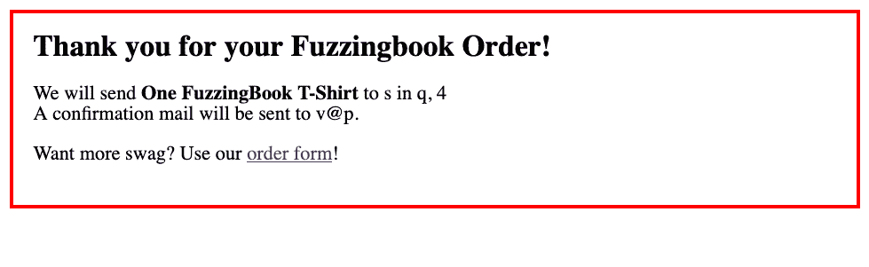

`fuzz()`的进一步调用将进一步覆盖模型——例如，探索条款和条件。

内部，`GUIFuzzer`和`GUICoverageFuzzer`使用一个子类`GUIGrammarMiner`，该子类实现了 GUI 及其所有状态的分析。通过子类化`GUIGrammarMiner`可以扩展 GUI 的解释；`GUIFuzzer`构造函数允许通过`miner`关键字参数传递一个挖掘器。

类似于`GUICoverageFuzzer`的工具将提供对用户界面的“深度”探索，甚至填写表单以探索其背后的内容。但请注意，`GUICoverageFuzzer`是实验性的：它只支持 HTML 表单和链接功能的一个子集，并且不考虑 JavaScript。

<svg width="846pt" height="848pt" viewBox="0.00 0.00 845.62 847.50" xmlns:xlink="http://www.w3.org/1999/xlink"><g id="graph0" class="graph" transform="scale(1 1) rotate(0) translate(4 843.5)"><g id="node1" class="node"><title>GUIFuzzer</title> <g id="a_node1"><a xlink:href="#" xlink:title="class GUIFuzzer:

使用 Selenium 的 GUI 模糊测试工具。"><text text-anchor="start" x="45.12" y="-507.7" font-family="Patua One, Helvetica, sans-serif" font-weight="bold" font-size="14.00" fill="#b03a2e">GUIFuzzer</text> <g id="a_node1_0"><a xlink:href="#" xlink:title="GUIFuzzer"><g id="a_node1_1"><a xlink:href="#" xlink:title="__init__(self, driver, *, miner: Optional[GUIGrammarMiner] = None, stay_on_host: bool = True, log_gui_exploration: bool = False, disp_gui_exploration: bool = False, **kwargs) -> None:

构造函数。

`driver` - 要使用的 Selenium 驱动器。

`miner` - 要使用的挖掘器（默认：`GUIGrammarMiner(driver)`）

`stay_on_host` - 如果为 True（默认），则不探索外部链接。

`log_gui_exploration` - 如果设置，打印出探索步骤。

`disp_gui_exploration` - 如果设置，显示当前网页的截图

以及在探索过程中的 FSM 图。

其他关键字参数传递给`GrammarFuzzer`超类。"><text text-anchor="start" x="8" y="-485.5" font-family="'Fira Mono', 'Source Code Pro', 'Courier', monospace" font-weight="bold" font-style="italic" font-size="10.00">__init__()</text></a></g> <g id="a_node1_2"><a xlink:href="#" xlink:title="restart(self) -> None:

返回原始 URL"><text text-anchor="start" x="8" y="-472.75" font-family="'Fira Mono', 'Source Code Pro', 'Courier', monospace" font-weight="bold" font-size="10.00">restart()</text></a></g> <g id="a_node1_3"><a xlink:href="#" xlink:title="run(self, runner: GUIRunner) -> Tuple[str, str]:

在给定的 GUIRunner `runner` 上运行模糊测试器。"><text text-anchor="start" x="8" y="-460" font-family="'Fira Mono', 'Source Code Pro', 'Courier', monospace" font-weight="bold" font-style="italic" font-size="10.00">run()</text></a></g> <g id="a_node1_4"><a xlink:href="#" xlink:title="fsm_last_state_symbol(self, tree: DerivationTree) -> str:

返回当前（预期）状态符号"><text text-anchor="start" x="8" y="-446.25" font-family="'Fira Mono', 'Source Code Pro', 'Courier', monospace" font-size="10.00">fsm_last_state_symbol()</text></a></g> <g id="a_node1_5"><a xlink:href="#" xlink:title="fsm_path(self, tree: DerivationTree) -> List[str]:

返回状态符号的序列。"><text text-anchor="start" x="8" y="-433.5" font-family="'Fira Mono', 'Source Code Pro', 'Courier', monospace" font-size="10.00">fsm_path()</text></a></g> <g id="a_node1_6"><a xlink:href="#" xlink:title="set_grammar(self, new_grammar: Dict[str, List[Expansion]]) -> None:

将语法设置为`new_grammar`。"><text text-anchor="start" x="8" y="-420.75" font-family="'Fira Mono', 'Source Code Pro', 'Courier', monospace" font-size="10.00">set_grammar()</text></a></g> <g id="a_node1_7"><a xlink:href="#" xlink:title="update_existing_state(self) -> None:

更新现有状态的动作。"><text text-anchor="start" x="8" y="-408" font-family="'Fira Mono', 'Source Code Pro', 'Courier', monospace" font-size="10.00">update_existing_state()</text></a></g> <g id="a_node1_8"><a xlink:href="#" xlink:title="update_new_state(self) -> None:

找到新的状态；相应地扩展语法。"><text text-anchor="start" x="8" y="-395.25" font-family="'Fira Mono', 'Source Code Pro', 'Courier', monospace" font-size="10.00">update_new_state()</text></a></g> <g id="a_node1_9"><a xlink:href="#" xlink:title="update_state(self) -> None:

从当前网页确定当前状态。"><text text-anchor="start" x="8" y="-382.5" font-family="'Fira Mono', 'Source Code Pro', 'Courier', monospace" font-size="10.00">update_state()</text></a></g></a></g></a></g></g> <g id="node2" class="node"><title>GrammarFuzzer</title> <g id="a_node2"><a xlink:href="GrammarFuzzer.html" xlink:title="class GrammarFuzzer:

使用推导树高效地从语法生成字符串。"><text text-anchor="start" x="128.12" y="-700.7" font-family="Patua One, Helvetica, sans-serif" font-weight="bold" font-size="14.00" fill="#b03a2e">GrammarFuzzer</text> <g id="a_node2_10"><a xlink:href="#" xlink:title="GrammarFuzzer"><g id="a_node2_11"><a xlink:href="GrammarFuzzer.html" xlink:title="__init__(self, grammar: Dict[str, List[Expansion]], start_symbol: str = '<start>', min_nonterminals: int = 0, max_nonterminals: int = 10, disp: bool = False, log: Union[bool, int] = False) -> None:

从`grammar`生成字符串，从`start_symbol`开始。

如果提供了`min_nonterminals`或`max_nonterminals`，则使用它们作为限制。

用于生成非终结符的数量。

如果设置了`disp`，则显示中间推导树。

如果设置了`log`，则将中间步骤作为文本输出到标准输出。"><text text-anchor="start" x="145" y="-678.5" font-family="'Fira Mono', 'Source Code Pro', 'Courier', monospace" font-weight="bold" font-style="italic" font-size="10.00">__init__()</text></a></g> <g id="a_node2_12"><a xlink:href="GrammarFuzzer.html" xlink:title="fuzz(self) -> str:

从语法生成字符串。"><text text-anchor="start" x="145" y="-665.75" font-family="'Fira Mono', 'Source Code Pro', 'Courier', monospace" font-weight="bold" font-style="italic" font-size="10.00">fuzz()</text></a></g> <g id="a_node2_13"><a xlink:href="GrammarFuzzer.html" xlink:title="fuzz_tree(self) -> DerivationTree:

从语法中生成一个推导树。"><text text-anchor="start" x="145" y="-653" font-family="'Fira Mono', 'Source Code Pro', 'Courier', monospace" font-weight="bold" font-size="10.00">fuzz_tree()</text></a></g></a></g></a></g></g> <g id="edge1" class="edge"><title>GUIFuzzer->GrammarFuzzer</title></g> <g id="node3" class="node"><title>Fuzzer</title> <g id="a_node3"><a xlink:href="Fuzzer.html" xlink:title="class Fuzzer:

模糊器的基类。"><text text-anchor="start" x="157.38" y="-822.7" font-family="Patua One, Helvetica, sans-serif" font-weight="bold" font-size="14.00" fill="#b03a2e">Fuzzer</text> <g id="a_node3_14"><a xlink:href="#" xlink:title="Fuzzer"><g id="a_node3_15"><a xlink:href="Fuzzer.html" xlink:title="__init__(self) -> None:

构造函数"><text text-anchor="start" x="148" y="-800.5" font-family="'Fira Mono', 'Source Code Pro', 'Courier', monospace" font-weight="bold" font-style="italic" font-size="10.00">__init__()</text></a></g> <g id="a_node3_16"><a xlink:href="Fuzzer.html" xlink:title="fuzz(self) -> str:

返回模糊输入"><text text-anchor="start" x="148" y="-787.75" font-family="'Fira Mono', 'Source Code Pro', 'Courier', monospace" font-weight="bold" font-style="italic" font-size="10.00">fuzz()</text></a></g> <g id="a_node3_17"><a xlink:href="Fuzzer.html" xlink:title="run(self, runner: Fuzzer.Runner = <Fuzzer.Runner object>) -> Tuple[subprocess.CompletedProcess, str]:

使用模糊输入运行 `runner`"><text text-anchor="start" x="148" y="-775" font-family="'Fira Mono', 'Source Code Pro', 'Courier', monospace" font-weight="bold" font-style="italic" font-size="10.00">run()</text></a></g> <g id="a_node3_18"><a xlink:href="Fuzzer.html" xlink:title="runs(self, runner: Fuzzer.Runner = <Fuzzer.PrintRunner object>, trials: int = 10) -> List[Tuple[subprocess.CompletedProcess, str]]:

使用模糊输入运行 `runner`，`trials` 次数"><text text-anchor="start" x="148" y="-762.25" font-family="'Fira Mono', 'Source Code Pro', 'Courier', monospace" font-weight="bold" font-size="10.00">runs()</text></a></g></a></g></a></g></g> <g id="edge2" class="edge"><title>GrammarFuzzer->Fuzzer</title></g> <g id="node4" class="node"><title>GUICoverageFuzzer</title> <g id="a_node4"><a xlink:href="#" xlink:title="class GUICoverageFuzzer:

系统性地探索当前网页的所有状态"><text text-anchor="start" x="166.25" y="-111.45" font-family="Patua One, Helvetica, sans-serif" font-weight="bold" font-size="14.00" fill="#b03a2e">GUICoverageFuzzer</text> <g id="a_node4_19"><a xlink:href="#" xlink:title="GUICoverageFuzzer"><g id="a_node4_20"><a xlink:href="#" xlink:title="__init__(self, *args, **kwargs):

构造函数。所有参数都传递给 `GUIFuzzer` 超类。<text text-anchor="start" x="188" y="-89.25" font-family="'Fira Mono', 'Source Code Pro', 'Courier', monospace" font-weight="bold" font-style="italic" font-size="10.00">__init__()</text></a></g> <g id="a_node4_21"><a xlink:href="#" xlink:title="explore_all(self, runner: GUIRunner, max_actions=100) -> None:

探索 GUI 的所有状态，直到 `max_actions`（默认 100）。"><text text-anchor="start" x="188" y="-76.5" font-family="'Fira Mono', 'Source Code Pro', 'Courier', monospace" font-weight="bold" font-size="10.00">explore_all()</text></a></g></a></g></a></g></g> <g id="edge3" class="edge"><title>GUICoverageFuzzer->GUIFuzzer</title></g> <g id="node5" class="node"><title>GrammarCoverageFuzzer</title> <g id="a_node5"><a xlink:href="GrammarCoverageFuzzer.html" xlink:title="class GrammarCoverageFuzzer:

从语法生成，旨在覆盖所有扩展。"><text text-anchor="start" x="178.25" y="-282.07" font-family="Patua One, Helvetica, sans-serif" font-weight="bold" font-size="14.00" fill="#b03a2e">GrammarCoverageFuzzer</text></a></g></g> <g id="edge4" class="edge"><title>GUICoverageFuzzer->GrammarCoverageFuzzer</title></g> <g id="node6" class="node"><title>SimpleGrammarCoverageFuzzer</title> <g id="a_node6"><a xlink:href="GrammarCoverageFuzzer.html" xlink:title="class SimpleGrammarCoverageFuzzer:

在选择扩展时，优先选择未被覆盖的扩展。"><text text-anchor="start" x="179.62" y="-446.32" font-family="Patua One, Helvetica, sans-serif" font-weight="bold" font-size="14.00" fill="#b03a2e">SimpleGrammarCoverageFuzzer</text></a></g></g> <g id="edge5" class="edge"><title>GrammarCoverageFuzzer->SimpleGrammarCoverageFuzzer</title></g> <g id="node7" class="node"><title>TrackingGrammarCoverageFuzzer</title> <g id="a_node7"><a xlink:href="GrammarCoverageFuzzer.html" xlink:title="class TrackingGrammarCoverageFuzzer:

在生成过程中跟踪语法覆盖。<text text-anchor="start" x="157.88" y="-591.45" font-family="Patua One, Helvetica, sans-serif" font-weight="bold" font-size="14.00" fill="#b03a2e">TrackingGrammarCoverageFuzzer</text> <g id="a_node7_22"><a xlink:href="#" xlink:title="TrackingGrammarCoverageFuzzer"><g id="a_node7_23"><a xlink:href="GrammarCoverageFuzzer.html" xlink:title="__init__(self, *args, **kwargs) -> None:

从 `grammar` 生成字符串，从 `start_symbol` 开始。

如果提供了 `min_nonterminals` 或 `max_nonterminals`，则使用它们作为限制。

对于生成的非终结符数量。

如果 `disp` 被设置，显示中间推导树。

如果 `log` 已设置，则将中间步骤作为文本显示在标准输出上。"><text text-anchor="start" x="234" y="-569.25" font-family="'Fira Mono', 'Source Code Pro', 'Courier', monospace" font-weight="bold" font-style="italic" font-size="10.00">__init__()</text></a></g></a></g></a></g></g> <g id="edge6" class="edge"><title>SimpleGrammarCoverageFuzzer->TrackingGrammarCoverageFuzzer</title></g> <g id="edge7" class="edge"><title>TrackingGrammarCoverageFuzzer->GrammarFuzzer</title></g> <g id="node8" class="node"><title>GUIRunner</title> <g id="a_node8"><a xlink:href="#" xlink:title="class GUIRunner:

执行给定的动作字符串中的动作"><text text-anchor="start" x="395.88" y="-172.82" font-family="Patua One, Helvetica, sans-serif" font-weight="bold" font-size="14.00" fill="#b03a2e">GUIRunner</text> <g id="a_node8_24"><a xlink:href="#" xlink:title="GUIRunner"><g id="a_node8_25"><a xlink:href="#" xlink:title="DELAY_AFTER_CHECK = 0.1"><text text-anchor="start" x="376" y="-149.62" font-family="'Fira Mono', 'Source Code Pro', 'Courier', monospace" font-size="10.00">DELAY_AFTER_CHECK</text></a></g> <g id="a_node8_26"><a xlink:href="#" xlink:title="DELAY_AFTER_CLICK = 1.5"><text text-anchor="start" x="376" y="-136.88" font-family="'Fira Mono', 'Source Code Pro', 'Courier', monospace" font-size="10.00">DELAY_AFTER_CLICK</text></a></g> <g id="a_node8_27"><a xlink:href="#" xlink:title="DELAY_AFTER_FILL = 0.1"><text text-anchor="start" x="376" y="-124.12" font-family="'Fira Mono', 'Source Code Pro', 'Courier', monospace" font-size="10.00">DELAY_AFTER_FILL</text></a></g> <g id="a_node8_28"><a xlink:href="#" xlink:title="DELAY_AFTER_SUBMIT = 1.5"><text text-anchor="start" x="376" y="-111.38" font-family="'Fira Mono', 'Source Code Pro', 'Courier', monospace" font-size="10.00">DELAY_AFTER_SUBMIT</text></a></g></a></g> <g id="a_node8_29"><a xlink:href="#" xlink:title="GUIRunner"><g id="a_node8_30"><a xlink:href="#" xlink:title="__init__(self, driver) -> None:

构造函数。`driver` 是一个 Selenium 网页驱动器"><text text-anchor="start" x="388" y="-91.62" font-family="'Fira Mono', 'Source Code Pro', 'Courier', monospace" font-weight="bold" font-style="italic" font-size="10.00">__init__()</text></a></g> <g id="a_node8_31"><a xlink:href="#" xlink:title="run(self, inp: str) -> Tuple[str, str]:

在当前网站上执行动作字符串 `inp`。

返回一对 (`inp`, `outcome`)"><text text-anchor="start" x="388" y="-78.88" font-family="'Fira Mono', 'Source Code Pro', 'Courier', monospace" font-weight="bold" font-style="italic" font-size="10.00">run()</text></a></g> <g id="a_node8_32"><a xlink:href="#" xlink:title="do_check(self, name: str, state: bool) -> None:

设置检查元素 `name` 为 `state`"><text text-anchor="start" x="388" y="-65.12" font-family="'Fira Mono', 'Source Code Pro', 'Courier', monospace" font-size="10.00">do_check()</text></a></g> <g id="a_node8_33"><a xlink:href="#" xlink:title="do_click(self, name: str) -> None:

点击元素 `name`"><text text-anchor="start" x="388" y="-52.38" font-family="'Fira Mono', 'Source Code Pro', 'Courier', monospace" font-size="10.00">do_click()</text></a></g> <g id="a_node8_34"><a xlink:href="#" xlink:title="do_fill(self, name: str, value: str) -> None:

使用 `value` 填充文本元素 `name`"><text text-anchor="start" x="388" y="-39.62" font-family="'Fira Mono', 'Source Code Pro', 'Courier', monospace" font-size="10.00">do_fill()</text></a></g> <g id="a_node8_35"><a xlink:href="#" xlink:title="do_submit(self, name: str) -> None:

点击提交元素 `name`"><text text-anchor="start" x="388" y="-26.88" font-family="'Fira Mono', 'Source Code Pro', 'Courier', monospace" font-size="10.00">do_submit()</text></a></g> <g id="a_node8_36"><a xlink:href="#" xlink:title="find_element(self, name: str) -> Any:

在当前网站上搜索名为 `name` 的元素。

匹配可以通过名称或链接文本进行。"><text text-anchor="start" x="388" y="-14.12" font-family="'Fira Mono', 'Source Code Pro', 'Courier', monospace" font-size="10.00">find_element()</text></a></g></a></g></a></g></g> <g id="node9" class="node"><title>Runner</title> <g id="a_node9"><a xlink:href="Fuzzer.html" xlink:title="class Runner:

测试输入的基类。"><text text-anchor="start" x="407.12" y="-321.95" font-family="Patua One, Helvetica, sans-serif" font-weight="bold" font-size="14.00" fill="#b03a2e">Runner</text> <g id="a_node9_37"><a xlink:href="#" xlink:title="Runner"><g id="a_node9_38"><a xlink:href="Fuzzer.html" xlink:title="FAIL = 'FAIL'"><text text-anchor="start" x="400" y="-298.75" font-family="'Fira Mono', 'Source Code Pro', 'Courier', monospace" font-size="10.00">FAIL</text></a></g> <g id="a_node9_39"><a xlink:href="Fuzzer.html" xlink:title="PASS = 'PASS'"><text text-anchor="start" x="400" y="-286" font-family="'Fira Mono', 'Source Code Pro', 'Courier', monospace" font-size="10.00">PASS</text></a></g> <g id="a_node9_40"><a xlink:href="Fuzzer.html" xlink:title="UNRESOLVED = 'UNRESOLVED'"><text text-anchor="start" x="400" y="-273.25" font-family="'Fira Mono', 'Source Code Pro', 'Courier', monospace" font-size="10.00">UNRESOLVED</text></a></g></a></g> <g id="a_node9_41"><a xlink:href="#" xlink:title="Runner"><g id="a_node9_42"><a xlink:href="Fuzzer.html" xlink:title="__init__(self) -> None:

Initialize"><text text-anchor="start" x="400" y="-253.5" font-family="'Fira Mono', 'Source Code Pro', 'Courier', monospace" font-weight="bold" font-style="italic" font-size="10.00">__init__()</text></a></g> <g id="a_node9_43"><a xlink:href="Fuzzer.html" xlink:title="run(self, inp: str) -> Any:

运行带有给定输入的运行者"><text text-anchor="start" x="400" y="-240.75" font-family="'Fira Mono', 'Source Code Pro', 'Courier', monospace" font-weight="bold" font-style="italic" font-size="10.00">run()</text></a></g></a></g></a></g></g> <g id="edge8" class="edge"><title>GUIRunner->Runner</title></g> <g id="node10" class="node"><title>GUIGrammarMiner</title> <g id="a_node10"><a xlink:href="#" xlink:title="class GUIGrammarMiner:

获取可能的 GUI 交互序列的语法"><text text-anchor="start" x="546.12" y="-179.2" font-family="Patua One, Helvetica, sans-serif" font-weight="bold" font-size="14.00" fill="#b03a2e">GUIGrammarMiner</text> <g id="a_node10_44"><a xlink:href="#" xlink:title="GUIGrammarMiner"><g id="a_node10_45"><a xlink:href="#" xlink:title="FINAL_STATE = '<end>'"><text text-anchor="start" x="557" y="-156" font-family="'Fira Mono', 'Source Code Pro', 'Courier', monospace" font-size="10.00">FINAL_STATE</text></a></g> <g id="a_node10_46"><a xlink:href="#" xlink:title="GUI_GRAMMAR = {'<start>': ['<state>'], '<unexplored>': [''], '<end>': [''], '<text>': ['<string>'], '<string>': ['<character>', '<string>'], '<character>': ['<letter>', '<digit>', '<special>'], '<letter>': ['a', 'b', 'c', 'd', 'e', 'f', 'g', 'h', 'i', 'j', 'k', 'l', 'm', 'n', 'o', 'p', 'q', 'r', 's', 't', 'u', 'v', 'w', 'x', 'y', 'z', 'A', 'B', 'C', 'D', 'E', 'F', 'G', 'H', 'I', 'J', 'K', 'L', 'M', 'N', 'O', 'P', 'Q', 'R', 'S', 'T', 'U', 'V', 'W', 'X', 'Y', 'Z'], '<number>': ['<digits>'], '<digits>': ['<digit>', '<digits><digit>'], '<digit>': ['0', '1', '2', '3', '4', '5', '6', '7', '8', '9'], '<special>': ['.', ' ', '!'], '<email>': ['<letters>@<letters>'], '<letters>': ['<letter>', '<letters><letter>'], '<boolean>': ['True', 'False'], '<password>': ['abcABC.123'], '<hidden>': ['<string>']}"></a></g> <g id="a_node10_47"><a xlink:href="#" xlink:title="START_STATE = '<state>'"><text text-anchor="start" x="557" y="-130.5" font-family="'Fira Mono', 'Source Code Pro', 'Courier', monospace" font-size="10.00">START_STATE</text></a></g> <g id="a_node10_48"><a xlink:href="#" xlink:title="UNEXPLORED_STATE = '<unexplored>'"><text text-anchor="start" x="557" y="-117.75" font-family="'Fira Mono', 'Source Code Pro', 'Courier', monospace" font-size="10.00">UNEXPLORED_STATE</text></a></g></a></g> <g id="a_node10_49"><a xlink:href="#" xlink:title="GUIGrammarMiner"><g id="a_node10_50"><a xlink:href="#" xlink:title="__init__(self, driver, stay_on_host: bool = True) -> None:

构造函数。

`driver` - 由 Selenium 产生的网页驱动程序。

`stay_on_host` - 如果为 True（默认），则不跟随指向其他主机的链接。《__init__()`</text></a></g> <g id="a_node10_51"><a xlink:href="#" xlink:title="follow_link(self, link: str) -> bool:

如果允许我们跟随 `link` URL"><text text-anchor="start" x="518" y="-84.25" font-family="'Fira Mono', 'Source Code Pro', 'Courier', monospace" font-size="10.00">follow_link()</text></a></g> <g id="a_node10_52"><a xlink:href="#" xlink:title="mine_a_element_actions(self) -> Set[str]:

确定当前网页上的所有链接动作"><text text-anchor="start" x="518" y="-71.5" font-family="'Fira Mono', 'Source Code Pro', 'Courier', monospace" font-size="10.00">mine_a_element_actions()</text></a></g> <g id="a_node10_53"><a xlink:href="#" xlink:title="mine_button_element_actions(self) -> Set[str]:

确定当前网页上的所有按钮动作"><text text-anchor="start" x="518" y="-58.75" font-family="'Fira Mono', 'Source Code Pro', 'Courier', monospace" font-size="10.00">mine_button_element_actions()</text></a></g> <g id="a_node10_54"><a xlink:href="#" xlink:title="mine_input_element_actions(self) -> Set[str]:

确定当前网页上的所有输入动作"><text text-anchor="start" x="518" y="-46" font-family="'Fira Mono', 'Source Code Pro', 'Courier', monospace" font-size="10.00">mine_input_element_actions()</text></a></g> <g id="a_node10_55"><a xlink:href="#" xlink:title="mine_state_actions(self) -> FrozenSet[str]:

返回当前网站上所有可能动作的集合。

可在子类中重载。"><text text-anchor="start" x="518" y="-34.25" font-family="'Fira Mono', 'Source Code Pro', 'Courier', monospace" font-style="italic" font-size="10.00">mine_state_actions()</text></a></g> <g id="a_node10_56"><a xlink:href="#" xlink:title="mine_state_grammar(self, grammar: Dict[str, List[Expansion]] = {}, state_symbol: Optional[str] = None) -> Dict[str, List[Expansion]]:

返回当前网站上动作的状态语法。

可在子类中重载。"><text text-anchor="start" x="518" y="-21.5" font-family="'Fira Mono', 'Source Code Pro', 'Courier', monospace" font-style="italic" font-size="10.00">mine_state_grammar()</text></a></g> <g id="a_node10_57"><a xlink:href="#" xlink:title="new_state_symbol(self, grammar: Dict[str, List[Expansion]]) -> str:

为 `grammar` 中的某些状态返回一个新的符号`"><text text-anchor="start" x="518" y="-7.75" font-family="'Fira Mono', 'Source Code Pro', 'Courier', monospace" font-size="10.00">new_state_symbol()</text></a></g></a></g></a></g></g> <g id="node11" class="node"><title>图例</title> <text text-anchor="start" x="718.38" y="-114" font-family="Patua One, Helvetica, sans-serif" font-weight="bold" font-size="10.00" fill="#b03a2e">图例</text> <text text-anchor="start" x="718.38" y="-104" font-family="Patua One, Helvetica, sans-serif" font-size="10.00">• </text> <text text-anchor="start" x="724.38" y="-104" font-family="'Fira Mono', 'Source Code Pro', 'Courier', monospace" font-weight="bold" font-size="8.00">public_method()</text> <text text-anchor="start" x="718.38" y="-94" font-family="Patua One, Helvetica, sans-serif" font-size="10.00">• </text> <text text-anchor="start" x="724.38" y="-94" font-family="'Fira Mono', 'Source Code Pro', 'Courier', monospace" font-size="8.00">private_method()</text> <text text-anchor="start" x="718.38" y="-84" font-family="Patua One, Helvetica, sans-serif" font-size="10.00">• </text> <text text-anchor="start" x="724.38" y="-84" font-family="'Fira Mono', 'Source Code Pro', 'Courier', monospace" font-style="italic" font-size="8.00">overloaded_method()</text> <text text-anchor="start" x="718.38" y="-74.95" font-family="Helvetica,sans-Serif" font-size="9.00">将鼠标悬停在名称上以查看文档</text></g></g></svg>

## 自动化 GUI 交互

在 Web 测试章节 中，我们展示了如何通过直接使用 HTTP 协议与 Web 服务器交互，并处理检索到的 HTML 页面来识别用户界面元素。虽然这些技术对于仅基于 HTML 的用户界面效果良好，但一旦存在使用 JavaScript 在浏览器中执行代码并生成和更改用户界面而不需要与浏览器交互的交互元素，它们就会失效。

在本章中，我们因此采用了一种不同的用户界面测试方法。而不是使用 HTTP 和 HTML 作为交互机制，我们利用一个专门的 *UI 测试框架*，这使得我们能够

+   查询待测试程序中的可用用户界面元素，并且

+   查询 UI 元素如何进行交互。

尽管我们再次使用 Web 服务器来展示我们的方法，但这种方法很容易推广到 *任意用户界面*。实际上，我们使用的 UI 测试框架 *Selenium* 也提供了适用于 Android 应用程序的变体。

### 我们的 Web 服务器，再次

与 Web 测试章节 中的情况一样，我们运行一个 Web 服务器，允许我们订购产品。

```py
import [bookutils.setup](https://github.com/uds-se/fuzzingbook//tree/master/notebooks/shared/bookutils) 
```

```py
from [typing](https://docs.python.org/3/library/typing.html) import Set, FrozenSet, List, Optional, Tuple, Any 
```

```py
import [os](https://docs.python.org/3/library/os.html)
import [sys](https://docs.python.org/3/library/sys.html) 
```

```py
from WebFuzzer import init_db, start_httpd, webbrowser, print_httpd_messages
from WebFuzzer import print_url, ORDERS_DB 
```

```py
import [html](https://docs.python.org/3/library/html.html) 
```

```py
db = init_db() 
```

这是我们的 Web 服务器地址：

```py
httpd_process, httpd_url = start_httpd()
print_url(httpd_url) 
```

```py
http://127.0.0.1:8800
```

使用 `webbrowser()`，我们可以检索主页的 HTML，并使用 `HTML()` 来渲染它。

```py
from [IPython.display](https://ipython.readthedocs.io/en/stable/api/generated/IPython.display.html) import display, Image 
```

```py
from [bookutils](https://github.com/uds-se/fuzzingbook//tree/master/notebooks/shared/bookutils) import HTML, rich_output 
```

```py
HTML(webbrowser(httpd_url)) 
```

```py
127.0.0.1 - - [16/Jan/2025 11:12:35] "GET / HTTP/1.1" 200 -

```

### 使用 Selenium 进行远程控制

让我们看看上面的 GUI。与 Web 测试章节不同，我们不假设我们可以访问当前页面的 HTML 源代码。我们假设的是，有一组*用户界面元素*我们可以与之交互。

[Selenium](https://www.seleniumhq.org)是一个通过*自动化浏览器交互*来测试 Web 应用的框架。Selenium 提供了一个 API，允许用户启动 Web 浏览器，查询用户界面的状态，并与单个用户界面元素交互。Selenium API 在多种语言中可用；我们使用[Selenium Python API](https://selenium-python.readthedocs.io/index.html)。

Selenium *网络驱动程序*是程序与由程序控制的浏览器之间的接口。以下代码在后台启动一个 Web 浏览器，然后我们通过网络驱动程序来控制它。

```py
from [selenium](https://selenium-python.readthedocs.io/) import webdriver 
```

我们支持 Firefox 和 Google Chrome。

```py
BROWSER = 'firefox'  # Set to 'chrome' if you prefer Chrome 
```

#### 设置 Firefox

对于 Firefox，您必须确保[geckodriver 程序](https://github.com/mozilla/geckodriver/releases)在您的路径中。

```py
import [shutil](https://docs.python.org/3/library/shutil.html) 
```

```py
if BROWSER == 'firefox':
    assert shutil.which('geckodriver') is not None, \
        "Please install the 'geckodriver' executable " \
        "from https://github.com/mozilla/geckodriver/releases" 
```

#### 设置 Chrome

对于 Chrome，您可能需要确保[chromedriver 程序](https://chromedriver.chromium.org)在您的路径中。

```py
if BROWSER == 'chrome':
    assert shutil.which('chromedriver') is not None, \
        "Please install the 'chromedriver' executable " \
        "from https://chromedriver.chromium.org" 
```

#### 运行无头浏览器

浏览器是*无头*的，这意味着它不会显示在屏幕上。

```py
HEADLESS = True 
```

**注意**：如果笔记本服务器在本地运行（即在您看到此处的同一台机器上），您也可以将`HEADLESS`设置为`False`，并在执行笔记本单元时直接在屏幕上看到结果。这对于交互式会话非常推荐。

#### 启动 Web 驱动程序

此代码启动 Selenium 网络驱动程序。

```py
def start_webdriver(browser=BROWSER, headless=HEADLESS, zoom=1.4):
    # Set headless option
    if browser == 'firefox':
        options = webdriver.FirefoxOptions()
        if headless:
            # See https://www.browserstack.com/guide/firefox-headless
            options.add_argument("--headless")
    elif browser == 'chrome':
        options = webdriver.ChromeOptions()
        if headless:
            # See https://www.selenium.dev/blog/2023/headless-is-going-away/
            options.add_argument("--headless=new")
    else:
        assert False, "Select 'firefox' or 'chrome' as browser"

    # Start the browser, and obtain a _web driver_ object such that we can interact with it.
    if browser == 'firefox':
        # For firefox, set a higher resolution for our screenshots
        options.set_preference("layout.css.devPixelsPerPx", repr(zoom))
        gui_driver = webdriver.Firefox(options=options)

        # We set the window size such that it fits our order form exactly;
        # this is useful for not wasting too much space when taking screen shots.
        gui_driver.set_window_size(700, 300)

    elif browser == 'chrome':
        gui_driver = webdriver.Chrome(options=options)
        gui_driver.set_window_size(700, 210 if headless else 340)

    return gui_driver 
```

```py
gui_driver = start_webdriver(browser=BROWSER, headless=HEADLESS) 
```

```py
The geckodriver version (0.34.0) detected in PATH at /Users/zeller/bin/geckodriver might not be compatible with the detected firefox version (135.03); currently, geckodriver 0.35.0 is recommended for firefox 135.*, so it is advised to delete the driver in PATH and retry

```

我们现在可以以编程方式与浏览器交互。首先，我们让它导航到我们的 Web 服务器的 URL：

```py
gui_driver.get(httpd_url) 
```

我们看到实际上访问了主页，以及一个（失败的）获取页面图标的请求：

```py
print_httpd_messages() 
```

```py
127.0.0.1 - - [16/Jan/2025 11:12:38] "GET / HTTP/1.1" 200 -

```

```py
127.0.0.1 - - [16/Jan/2025 11:12:38] "GET /favicon.ico HTTP/1.1" 404 -

```

要查看“无头”浏览器显示的内容，我们可以获取一个屏幕截图。我们看到它实际上显示了主页。

```py
Image(gui_driver.get_screenshot_as_png()) 
```


### 填写表格

要通过 Selenium 和浏览器与网页交互，我们可以查询 Selenium 以获取单个元素。例如，我们可以访问具有`name`属性（如 HTML 中定义）的 UI 元素，其值为`"name"`。

```py
from [selenium.webdriver.common.by](https://selenium-python.readthedocs.io/) import By 
```

```py
name = gui_driver.find_element(By.NAME, "name") 
```

一旦我们有了元素，我们就可以与之交互。由于`name`是一个文本字段，我们可以使用`send_keys()`方法发送一个字符串；该字符串将被转换为适当的按键。

```py
name.send_keys("Jane Doe") 
```

在屏幕截图中，我们可以看到`name`字段现在已填写：

```py
Image(gui_driver.get_screenshot_as_png()) 
```

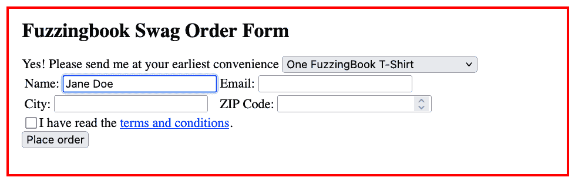

同样，我们可以填写电子邮件、城市和邮政编码字段：

```py
email = gui_driver.find_element(By.NAME, "email")
email.send_keys("j.doe@example.com") 
```

```py
city = gui_driver.find_element(By.NAME, 'city')
city.send_keys("Seattle") 
```

```py
zip = gui_driver.find_element(By.NAME, 'zip')
zip.send_keys("98104") 
```

```py
Image(gui_driver.get_screenshot_as_png()) 
```

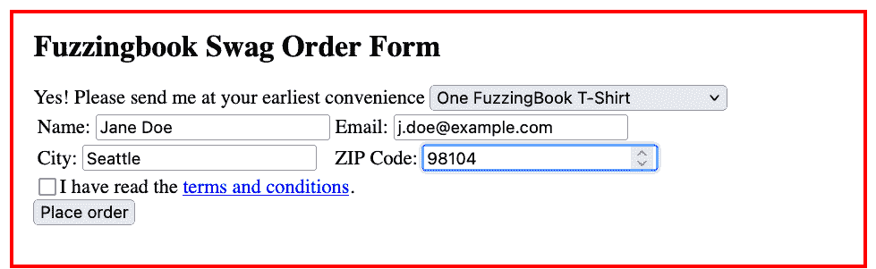

条款和条件复选框未填写，而是使用`click()`方法进行点击。

```py
terms = gui_driver.find_element(By.NAME, 'terms')
terms.click() 
```

```py
Image(gui_driver.get_screenshot_as_png()) 
```


表单现在已完全填写。通过点击`提交`按钮，我们可以下订单：

```py
submit = gui_driver.find_element(By.NAME, 'submit')
submit.click() 
```

我们看到订单正在处理中，并且 Web 浏览器已经切换到了确认页面。

```py
print_httpd_messages() 
```

```py
127.0.0.1 - - [16/Jan/2025 11:12:39] INSERT INTO orders VALUES ('tshirt', 'Jane Doe', 'j.doe@example.com', 'Seattle', '98104')

```

```py
127.0.0.1 - - [16/Jan/2025 11:12:39] "GET /order?item=tshirt&name=Jane+Doe&email=j.doe%40example.com&city=Seattle&zip=98104&terms=on&submit=Place+order HTTP/1.1" 200 -

```

```py
Image(gui_driver.get_screenshot_as_png()) 
```

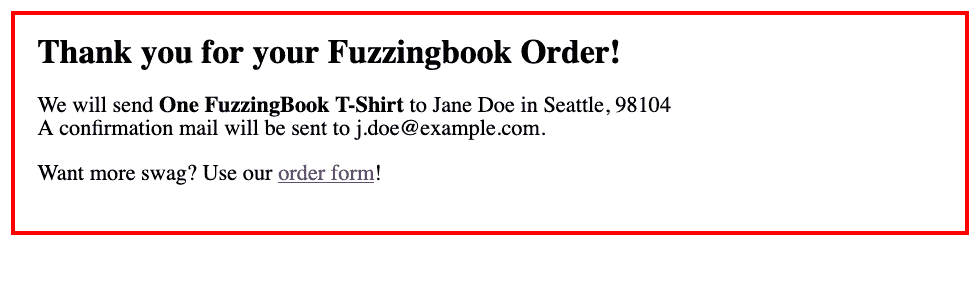

### 导航

正如我们填写表单一样，我们也可以通过点击链接来浏览网站。让我们回到主页：

```py
gui_driver.back() 
```

```py
Image(gui_driver.get_screenshot_as_png()) 
```

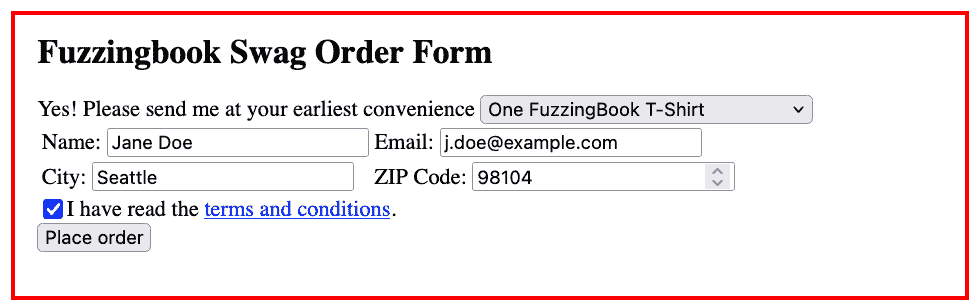

我们可以查询 Web 驱动程序以获取特定类型的所有元素。例如，查询 HTML 锚点元素（`<a>`）会给我们页面上的所有链接。

```py
links = gui_driver.find_elements(By.TAG_NAME, "a") 
```

我们可以查询 UI 元素的属性——例如，页面第一个锚点链接到的 URL：

```py
links[0].get_attribute('href') 
```

```py
'http://127.0.0.1:8800/terms'

```

点击它会发生什么？非常简单：我们会切换到被引用的 Web 页面。

```py
links[0].click() 
```

```py
print_httpd_messages() 
```

```py
127.0.0.1 - - [16/Jan/2025 11:12:39] "GET /terms HTTP/1.1" 200 -

```

```py
Image(gui_driver.get_screenshot_as_png()) 
```

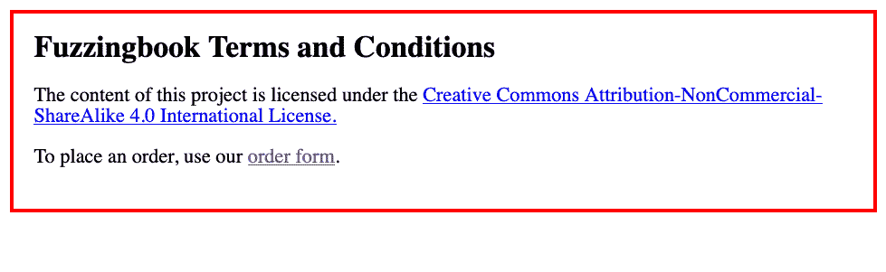

好的。让我们再次回到我们的主页。

```py
gui_driver.back() 
```

```py
print_httpd_messages() 
```

```py
Image(gui_driver.get_screenshot_as_png()) 
```

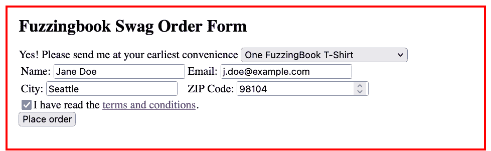

### 编写测试用例

上述调用，与用户界面自动交互，通常用于*Selenium 测试*——即与网站交互的代码片段，偶尔检查是否一切如预期工作。以下代码，例如，就像上面那样下订单。然后它检索`title`元素并检查标题是否包含“谢谢”消息，表示成功。

```py
def test_successful_order(driver, url):
    name = "Walter White"
    email = "white@jpwynne.edu"
    city = "Albuquerque"
    zip_code = "87101"

    driver.get(url)
    driver.find_element(By.NAME, "name").send_keys(name)
    driver.find_element(By.NAME, "email").send_keys(email)
    driver.find_element(By.NAME, 'city').send_keys(city)
    driver.find_element(By.NAME, 'zip').send_keys(zip_code)
    driver.find_element(By.NAME, 'terms').click()
    driver.find_element(By.NAME, 'submit').click()

    title = driver.find_element(By.ID, 'title')
    assert title is not None
    assert title.text.find("Thank you") >= 0

    confirmation = driver.find_element(By.ID, "confirmation")
    assert confirmation is not None

    assert confirmation.text.find(name) >= 0
    assert confirmation.text.find(email) >= 0
    assert confirmation.text.find(city) >= 0
    assert confirmation.text.find(zip_code) >= 0

    return True 
```

```py
test_successful_order(gui_driver, httpd_url) 
```

```py
True

```

类似地，我们可以为失败的订单、取消订单、更改订单等设置自动测试用例。所有这些测试用例都会在程序代码的任何更改后自动运行，确保 Web 应用程序仍然正常工作。

当然，编写这样的测试需要相当多的努力。因此，在本章的剩余部分，我们再次探讨如何自动生成它们。

## 获取用户界面操作

要自动与用户界面交互，我们首先需要找出有哪些元素，以及它们支持哪些用户交互（或简称为*操作*）。

### 用户界面元素

我们从查找可用的用户元素开始。让我们回到订单表单。

```py
gui_driver.get(httpd_url) 
```

```py
Image(gui_driver.get_screenshot_as_png()) 
```

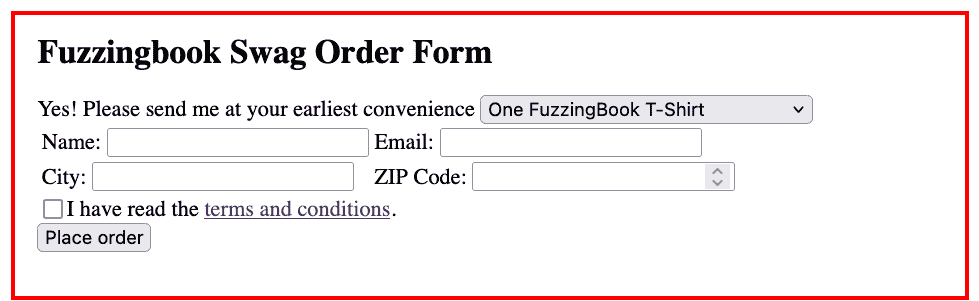

使用`find_elements(By.TAG_NAME, )`（和其他类似的`find_elements_...()`函数），我们可以检索特定类型的所有元素，例如 HTML `input`元素。

```py
ui_elements = gui_driver.find_elements(By.TAG_NAME, "input") 
```

对于每个元素，我们可以使用`get_attribute()`检索其 HTML 属性。因此，我们可以检索每个输入元素的`name`和`type`（如果已定义）。

```py
for element in ui_elements:
    print("Name: %-10s | Type: %-10s | Text: %s" %
          (element.get_attribute('name'),
           element.get_attribute('type'),
           element.text)) 
```

```py
Name: name       | Type: text       | Text: 
Name: email      | Type: email      | Text: 
Name: city       | Type: text       | Text: 
Name: zip        | Type: number     | Text: 
Name: terms      | Type: checkbox   | Text: 
Name: submit     | Type: submit     | Text: 

```

```py
ui_elements = gui_driver.find_elements(By.TAG_NAME, "a") 
```

```py
for element in ui_elements:
    print("Name: %-10s | Type: %-10s | Text: %s" %
          (element.get_attribute('name'),
           element.get_attribute('type'),
           element.text)) 
```

```py
Name:            | Type:            | Text: terms and conditions

```

### 用户界面操作

类似于我们在关于 Web 模糊测试的章节中所做的那样，我们的想法现在是为用户界面挖掘一个*语法*——首先是一个单独的用户界面*页面*（即单个 Web 页面），然后是应用程序提供的所有页面。这个想法是，语法定义了*合法的操作序列*——点击和按键——这些可以在应用程序上应用。

我们假设以下操作：

1.  `fill(<name>, <text>)` – 使用文本`<text>`填充名为`<name>`的 UI 输入元素。

1.  `check(<name>, <value>)` – 将 UI 复选框`<name>`设置为给定的值`<value>`（True 或 False）

1.  `submit(<name>)` – 通过点击 UI 元素 `<name>` 提交表单。

1.  `click(<name>)` – 点击 UI 元素 `<name>`，通常用于跟随链接。

例如，这个动作序列会填写订单表单：

```py
fill('name', "Walter White")
fill('email', "white@jpwynne.edu")
fill('city', "Albuquerque")
fill('zip', "87101")
check('terms', True)
submit('submit') 
```

我们故意将操作集合定义得较小 – 对于真实用户界面，还必须定义如滑动、双击、长按、右键点击、修饰键等交互。Selenium 支持所有这些；但为了简单起见，我们专注于最重要的交互集合。

### 获取操作

在挖掘动作语法的第一步中，我们需要能够检索可能的交互。我们引入了一个名为 `GUIGrammarMiner` 的类，它被设置为精确执行此操作。

```py
class GUIGrammarMiner:
  """Retrieve a grammar of possible GUI interaction sequences"""

    def __init__(self, driver, stay_on_host: bool = True) -> None:
  """Constructor.
 `driver` - a web driver as produced by Selenium.
 `stay_on_host` - if True (default), no not follow links to other hosts.
 """
        self.driver = driver
        self.stay_on_host = stay_on_host
        self.grammar: Grammar = {} 
```

<details id="Excursion:-Implementing-Retrieving-Actions"><summary>实现检索操作</summary>

我们的首要任务是获取可能的交互集合。给定单个 UI 页面，`GUIGrammarMiner` 的 `mine_input_actions()` 方法返回一个如上定义的操作集合。它首先获取所有 `input` 元素，然后是 `button` 元素，最后是链接（`a` 元素），并将它们合并到一个集合中。（我们在这里使用 `frozenset`，因为我们想稍后使用这个集合作为索引。）

```py
class GUIGrammarMiner(GUIGrammarMiner):
    def mine_state_actions(self) -> FrozenSet[str]:
  """Return a set of all possible actions on the current Web site.
 Can be overloaded in subclasses."""
        return frozenset(self.mine_input_element_actions()
                         | self.mine_button_element_actions()
                         | self.mine_a_element_actions())

    def mine_input_element_actions(self) -> Set[str]:
        return set()  # to be defined later

    def mine_button_element_actions(self) -> Set[str]:
        return set()  # to be defined later

    def mine_a_element_actions(self) -> Set[str]:
        return set()  # to be defined later 
```

##### 输入元素操作

挖掘输入操作会遍历输入元素集合，并根据输入类型返回一个操作。例如，如果输入字段是文本，则相关操作是 `fill()`；对于复选框，操作是 `check()`。

相应的值取决于类型；例如，如果输入字段是数字，则值变为 `<number>`。由于这些操作后来成为语法的一部分，它们将在语法扩展期间扩展为实际值。

```py
from [selenium.common.exceptions](https://selenium-python.readthedocs.io/) import StaleElementReferenceException 
```

```py
class GUIGrammarMiner(GUIGrammarMiner):
    def mine_input_element_actions(self) -> Set[str]:
  """Determine all input actions on the current Web page"""

        actions = set()

        for elem in self.driver.find_elements(By.TAG_NAME, "input"):
            try:
                input_type = elem.get_attribute("type")
                input_name = elem.get_attribute("name")
                if input_name is None:
                    input_name = elem.text

                if input_type in ["checkbox", "radio"]:
                    actions.add("check('%s', <boolean>)" % html.escape(input_name))
                elif input_type in ["text", "number", "email", "password"]:
                    actions.add("fill('%s', '<%s>')" % (html.escape(input_name), html.escape(input_type)))
                elif input_type in ["button", "submit"]:
                    actions.add("submit('%s')" % html.escape(input_name))
                elif input_type in ["hidden"]:
                    pass
                else:
                    # TODO: Handle more types here
                    actions.add("fill('%s', <%s>)" % (html.escape(input_name), html.escape(input_type)))
            except StaleElementReferenceException:
                pass

        return actions 
```

在我们的订单表单上应用此方法，我们看到该方法为我们提供了所有输入操作：

```py
gui_grammar_miner = GUIGrammarMiner(gui_driver)
gui_grammar_miner.mine_input_element_actions() 
```

```py
{"check('terms', <boolean>)",
 "fill('city', '<text>')",
 "fill('email', '<email>')",
 "fill('name', '<text>')",
 "fill('zip', '<number>')",
 "submit('submit')"}

```

##### 按钮元素操作

按钮挖掘的工作原理类似：

```py
class GUIGrammarMiner(GUIGrammarMiner):
    def mine_button_element_actions(self) -> Set[str]:
  """Determine all button actions on the current Web page"""

        actions = set()

        for elem in self.driver.find_elements(By.TAG_NAME, "button"):
            try:
                button_type = elem.get_attribute("type")
                button_name = elem.get_attribute("name")
                if button_name is None:
                    button_name = elem.text
                if button_type == "submit":
                    actions.add("submit('%s')" % html.escape(button_name))
                elif button_type != "reset":
                    actions.add("click('%s')" % html.escape(button_name))
            except StaleElementReferenceException:
                pass

        return actions 
```

我们的订单表单没有 `button` 元素。（提交按钮是一个 `input` 元素，已在上面处理过）。

```py
gui_grammar_miner = GUIGrammarMiner(gui_driver)
gui_grammar_miner.mine_button_element_actions() 
```

```py
set()

```

##### 链接元素操作

在跟随链接时，我们需要确保我们保持在当前主机上 – 我们只想探索单个网站，而不是整个互联网。为此，我们检查链接的 `href` 属性，以检查它是否仍然指向同一主机。如果它不指向同一主机，我们将给它一个特殊操作 `ignore()`，正如其名所示，在执行这些操作时将被忽略。尽管如此，我们仍然返回一个操作，因为我们使用操作集合来表征应用程序中的状态。

```py
from [urllib.parse](https://docs.python.org/3/library/urllib.parse.html) import urljoin, urlsplit 
```

```py
class GUIGrammarMiner(GUIGrammarMiner):
    def mine_a_element_actions(self) -> Set[str]:
  """Determine all link actions on the current Web page"""

        actions = set()

        for elem in self.driver.find_elements(By.TAG_NAME, "a"):
            try:
                a_href = elem.get_attribute("href")
                if a_href is not None:
                    if self.follow_link(a_href):
                        actions.add("click('%s')" % html.escape(elem.text))
                    else:
                        actions.add("ignore('%s')" % html.escape(elem.text))
            except StaleElementReferenceException:
                pass

        return actions 
```

要检查我们是否可以跟随链接，`follow_link()` 方法会检查 URL：

```py
class GUIGrammarMiner(GUIGrammarMiner):
    def follow_link(self, link: str) -> bool:
  """Return True iff we are allowed to follow the `link` URL"""

        if not self.stay_on_host:
            return True

        current_url = self.driver.current_url
        target_url = urljoin(current_url, link)
        return urlsplit(current_url).hostname == urlsplit(target_url).hostname 
```

在我们的应用程序中，我们不允许跟随到 `foo.bar` 的链接：

```py
gui_grammar_miner = GUIGrammarMiner(gui_driver) 
```

```py
gui_grammar_miner.follow_link("ftp://foo.bar/") 
```

```py
False

```

然而，通过 `localhost` 的链接工作良好：

```py
gui_grammar_miner.follow_link("https://127.0.0.1/") 
```

```py
True

```

当将此应用于其他用户界面时，我们会采取类似措施以确保我们保持在同一应用程序中。

在我们的页面上运行此方法会得到链接集合：

```py
gui_grammar_miner = GUIGrammarMiner(gui_driver)
gui_grammar_miner.mine_a_element_actions() 
```

```py
{"click('terms and conditions')"}

```

让我们看看`GUIGrammarMiner`的实际应用，使用它的`mine_state_actions()`方法来检索我们当前页面上的所有元素。我们看到我们获得了输入元素动作、按钮元素动作和链接元素动作。

```py
gui_grammar_miner = GUIGrammarMiner(gui_driver)
gui_grammar_miner.mine_state_actions() 
```

```py
frozenset({"check('terms', <boolean>)",
           "click('terms and conditions')",
           "fill('city', '<text>')",
           "fill('email', '<email>')",
           "fill('name', '<text>')",
           "fill('zip', '<number>')",
           "submit('submit')"})

```

我们假设我们可以从包含的交互元素集合中识别用户界面**状态**——也就是说，上述集合确定了当前的 Web 页面。这与 Web 模糊测试形成对比，在那里我们假设 URL 可以唯一地描述一个页面——但是随着 JavaScript 的出现，URL 可以保持不变，尽管页面内容发生变化，而且除了 Web 之外的用户界面可能没有唯一 URL 的概念。因此，我们说，UI 可以被唯一交互的方式定义了其状态。

## 用户界面模型

### 用户界面作为有限状态机

现在我们已经能够从页面中检索 UI 元素了，让我们去系统地探索用户界面。想法是将用户界面表示为一个**有限状态机**——也就是说，通过与单个用户界面元素交互可以到达的一系列**状态**。

让我们通过查看我们的 Web 服务器来展示这样一个有限状态机的例子。以下图表显示了我们的服务器可能处于的状态：

<svg width="510pt" height="218pt" viewBox="0.00 0.00 510.11 217.50" xmlns:xlink="http://www.w3.org/1999/xlink"><g id="graph0" class="graph" transform="scale(1 1) rotate(0) translate(4 213.5)"><g id="node1" class="node"><title>\<start\></title> <text text-anchor="middle" x="247.3" y="-185.32" font-family="Times,serif" font-size="14.00"><start></text></g> <g id="node2" class="node"><title>\<Order Form\></title> <text text-anchor="middle" x="247.3" y="-112.33" font-family="Times,serif" font-size="14.00"><Order Form></text></g> <g id="edge1" class="edge"><title>\<start\>->\<Order Form\></title></g> <g id="node3" class="node"><title>\<Terms and Conditions\></title> <text text-anchor="middle" x="126.3" y="-11.82" font-family="Times,serif" font-size="14.00"><Terms and Conditions></text></g> <g id="edge2" class="edge"><title>\<Order Form\>->\<Terms and Conditions\></title> <text text-anchor="middle" x="85.17" y="-62.08" font-family="Times,serif" font-size="14.00">click('Terms and conditions')</text></g> <g id="node4" class="node"><title>\<Thank You\></title> <text text-anchor="middle" x="364.3" y="-11.82" font-family="Times,serif" font-size="14.00"><Thank You></text></g> <g id="edge3" class="edge"><title>\<Order Form\>->\<Thank You\></title> <text text-anchor="start" x="309.8" y="-69.2" font-family="Times,serif" font-size="14.00">fill(...)</text> <text text-anchor="middle" x="354.05" y="-54.95" font-family="Times,serif" font-size="14.00">submit('submit')</text></g> <g id="edge4" class="edge"><title>\<Terms and Conditions\>->\<Order Form\></title> <text text-anchor="middle" x="232.8" y="-62.08" font-family="Times,serif" font-size="14.00">click('order form')</text></g> <g id="edge5" class="edge"><title>\<Thank You\>->\<Order Form\></title> <text text-anchor="middle" x="452.61" y="-62.08" font-family="Times,serif" font-size="14.00">click('order form')</text></g></g></svg>

初始时，我们处于`<Order Form>`状态。从这里，我们可以点击`Terms and Conditions`，然后我们会进入`Terms and Conditions`状态，显示具有相同标题的页面。我们还可以填写表单并下订单，最终进入`Thank You`状态（再次显示具有相同标题的页面）。从`<Terms and Conditions>`和`<Thank You>`，我们可以通过点击`order form`链接返回订单表单。

### 状态机作为语法

为了系统地探索用户界面，我们必须检索其有限状态机，并最终覆盖所有状态和转换。在存在表单的情况下，这种探索是困难的，因为我们需要一个特殊的机制来填写表单并提交值以到达下一个状态。不过，有一个技巧，它允许我们为状态和（表单）值提供单一表示。我们可以将**有限状态机嵌入到语法中**，然后它被用于状态和表单值。

要将有限状态机嵌入到语法中，我们按以下步骤进行：

1.  有限状态机中的每一个**状态** $\langle s \rangle$ 变成语法中的**符号** $\langle s \rangle$。

1.  有限状态机中从$\langle s \rangle$到$\langle t \rangle$的每一个**转换**和动作$a_1, a_2, \dots$成为语法中$\langle s \rangle$的**选择**，形式为$a_1, a_2, dots$ $\langle t \rangle$。

上述有限状态机因此被编码到语法中

```py
<start> ::= <Order Form>
<Order Form> ::= click('Terms and Conditions') <Terms and Conditions> | 
                 fill(...) submit('submit') <Thank You>
<Terms and Conditions> ::= click('order form') <Order Form>
<Thank You> ::= click('order form') <Order Form>
```

扩展这个语法会得到一系列动作，导航通过用户界面：

```py
fill(...) submit('submit') click('order form') click('Terms and Conditions') click('order form') ...
```

这个流实际上是 *无限的*（因为人们可以永远与 UI 交互）；为了使其结束，可以引入一个替代的 `<end>`，它简单地扩展为空字符串，没有任何扩展（状态）跟随。

### 获取状态语法

让我们扩展 `GUIGrammarMiner`，使其能够从用户界面在其 *当前状态* 中检索语法。

<details id="Excursion:-Implementing-Extracting-State-Grammars"><summary>实现提取状态语法</summary>

我们首先定义一个常量 `GUI_GRAMMAR`，作为所有输入类型的模板。我们将使用它来填写表格。

\todo{}：拥有一个公共基类 `GrammarMiner`，带有 `__init__()` 和 `mine_grammar()` 方法

```py
from Grammars import new_symbol 
```

```py
from Grammars import nonterminals, START_SYMBOL
from Grammars import extend_grammar, unreachable_nonterminals, crange, srange
from Grammars import syntax_diagram, is_valid_grammar, Grammar 
```

```py
class GUIGrammarMiner(GUIGrammarMiner):
    START_STATE = "<state>"
    UNEXPLORED_STATE = "<unexplored>"
    FINAL_STATE = "<end>"

    GUI_GRAMMAR: Grammar = ({
        START_SYMBOL: [START_STATE],
        UNEXPLORED_STATE: [""],
        FINAL_STATE: [""],

        "<text>": ["<string>"],
        "<string>": ["<character>", "<string><character>"],
        "<character>": ["<letter>", "<digit>", "<special>"],
        "<letter>": crange('a', 'z') + crange('A', 'Z'),

        "<number>": ["<digits>"],
        "<digits>": ["<digit>", "<digits><digit>"],
        "<digit>": crange('0', '9'),

        "<special>": srange(". !"),

        "<email>": ["<letters>@<letters>"],
        "<letters>": ["<letter>", "<letters><letter>"],

        "<boolean>": ["True", "False"],

        # Use a fixed password in case we need to repeat it
        "<password>": ["abcABC.123"],

        "<hidden>": ["<string>"],
    }) 
```

```py
syntax_diagram(GUIGrammarMiner.GUI_GRAMMAR) 
```

```py
start

```

<svg class="railroad-diagram" height="62" viewBox="0 0 182.5 62" width="182.5"><g transform="translate(.5 .5)"><g><g><g class="non-terminal"><text x="91.25" y="35">state</text></g></g></g></g></svg>

```py
unexplored

```

```py
end

```

```py
text

```

<svg class="railroad-diagram" height="62" viewBox="0 0 191.0 62" width="191.0"><g transform="translate(.5 .5)"><g><g><g class="non-terminal"><text x="95.5" y="35">string</text></g></g></g></g></svg>

```py
string

```

<svg class="railroad-diagram" height="92" viewBox="0 0 307.5 92" width="307.5"><g transform="translate(.5 .5)"><g><g><g class="non-terminal"><text x="153.75" y="35">character</text></g></g> <g><g class="non-terminal"><text x="95.5" y="65">string</text></g> <g class="non-terminal"><text x="199.25" y="65">character</text></g></g></g></g></svg>

```py
character

```

<svg class="railroad-diagram" height="122" viewBox="0 0 199.5 122" width="199.5"><g transform="translate(.5 .5)"><g><g><g class="non-terminal"><text x="99.75" y="35">letter</text></g></g> <g><g class="non-terminal"><text x="99.75" y="65">digit</text></g></g> <g><g class="non-terminal"><text x="99.75" y="95">special</text></g></g></g></g></svg>

```py
letter

```

<svg class="railroad-diagram" height="348" viewBox="0 0 611.0 348" width="611.0"><g transform="translate(.5 .5)"><g><g><g><g class="terminal"><text x="84.25" y="163">e</text></g></g> <g><g class="terminal"><text x="84.25" y="133">d</text></g></g> <g><g class="terminal"><text x="84.25" y="103">c</text></g></g> <g><g class="terminal"><text x="84.25" y="73">b</text></g></g> <g><g class="terminal"><text x="84.25" y="43">a</text></g></g> <g><g class="terminal"><text x="84.25" y="193">f</text></g></g> <g><g class="terminal"><text x="84.25" y="223">g</text></g></g> <g><g class="terminal"><text x="84.25" y="253">h</text></g></g> <g><g class="terminal"><text x="84.25" y="283">i</text></g></g> <g><g class="terminal"><text x="84.25" y="313">j</text></g></g></g> <g><g><g class="terminal"><text x="172.75" y="163">o</text></g></g> <g><g class="terminal"><text x="172.75" y="133">n</text></g></g> <g><g class="terminal"><text x="172.75" y="103">m</text></g></g> <g><g class="terminal"><text x="172.75" y="73">l</text></g></g> <g><g class="terminal"><text x="172.75" y="43">k</text></g></g> <g><g class="terminal"><text x="172.75" y="193">p</text></g></g> <g><g class="terminal"><text x="172.75" y="223">q</text></g></g> <g><g class="terminal"><text x="172.75" y="253">r</text></g></g> <g><g class="terminal"><text x="172.75" y="283">s</text></g></g> <g><g class="terminal"><text x="172.75" y="313">t</text></g></g></g> <g><g><g class="terminal"><text x="261.25" y="163">y</text></g></g> <g><g class="terminal"><text x="261.25" y="133">x</text></g></g> <g><g class="terminal"><text x="261.25" y="103">w</text></g></g> <g><g class="terminal"><text x="261.25" y="73">v</text></g></g> <g><g class="terminal"><text x="261.25" y="43">u</text></g></g> <g><g class="terminal"><text x="261.25" y="193">z</text></g></g> <g><g class="terminal"><text x="261.25" y="223">A</text></g></g> <g><g class="terminal"><text x="261.25" y="253">B</text></g></g> <g><g class="terminal"><text x="261.25" y="283">C</text></g></g> <g><g class="terminal"><text x="261.25" y="313">D</text></g></g></g> <g><g><g class="terminal"><text x="349.75" y="163">I</text></g></g> <g><g class="terminal"><text x="349.75" y="133">H</text></g></g> <g><g class="terminal"><text x="349.75" y="103">G</text></g></g> <g><g class="terminal"><text x="349.75" y="73">F</text></g></g> <g><g class="terminal"><text x="349.75" y="43">E</text></g></g> <g><g class="terminal"><text x="349.75" y="193">J</text></g></g> <g><g class="terminal"><text x="349.75" y="223">K</text></g></g> <g><g class="terminal"><text x="349.75" y="253">L</text></g></g> <g><g class="terminal"><text x="349.75" y="283">M</text></g></g> <g><g class="terminal"><text x="349.75" y="313">N</text></g></g></g> <g><g><g class="terminal"><text x="438.25" y="163">S</text></g></g> <g><g class="terminal"><text x="438.25" y="133">R</text></g></g> <g><g class="terminal"><text x="438.25" y="103">Q</text></g></g> <g><g class="terminal"><text x="438.25" y="73">P</text></g></g> <g><g class="terminal"><text x="438.25" y="43">O</text></g></g> <g><g class="terminal"><text x="438.25" y="193">T</text></g></g> <g><g class="terminal"><text x="438.25" y="223">U</text></g></g> <g><g class="terminal"><text x="438.25" y="253">V</text></g></g> <g><g class="terminal"><text x="438.25" y="283">W</text></g></g> <g><g class="terminal"><text x="438.25" y="313">X</text></g></g></g> <g><g><g class="terminal"><text x="526.75" y="163">Y</text></g></g> <g><g class="terminal"><text x="526.75" y="193">Z</text></g></g></g></g></g></svg>

```py
number

```

<svg class="railroad-diagram" height="62" viewBox="0 0 191.0 62" width="191.0"><g transform="translate(.5 .5)"><g><g><g class="non-terminal"><text x="95.5" y="35">digits</text></g></g></g></g></svg>

```py
digits

```

<svg class="railroad-diagram" height="92" viewBox="0 0 273.5 92" width="273.5"><g transform="translate(.5 .5)"><g><g><g class="non-terminal"><text x="136.75" y="35">digit</text></g></g> <g><g class="non-terminal"><text x="95.5" y="65">digits</text></g> <g class="non-terminal"><text x="182.25" y="65">digit</text></g></g></g></g></svg>

```py
digit

```

<svg class="railroad-diagram" height="109" viewBox="0 0 522.5 109" width="522.5"><g transform="translate(.5 .5)"><g><g><g><g class="terminal"><text x="84.25" y="43">0</text></g></g> <g><g class="terminal"><text x="84.25" y="73">1</text></g></g></g> <g><g><g class="terminal"><text x="172.75" y="43">2</text></g></g> <g><g class="terminal"><text x="172.75" y="73">3</text></g></g></g> <g><g><g class="terminal"><text x="261.25" y="43">4</text></g></g> <g><g class="terminal"><text x="261.25" y="73">5</text></g></g></g> <g><g><g class="terminal"><text x="349.75" y="43">6</text></g></g> <g><g class="terminal"><text x="349.75" y="73">7</text></g></g></g> <g><g><g class="terminal"><text x="438.25" y="43">8</text></g></g> <g><g class="terminal"><text x="438.25" y="73">9</text></g></g></g></g></g></svg>

```py
special

```

<svg class="railroad-diagram" height="122" viewBox="0 0 148.5 122" width="148.5"><g transform="translate(.5 .5)"><g><g><g class="terminal"><text x="74.25" y="35">.</text></g></g><g><g class="terminal"><text x="74.25" y="95">!</text></g></g></g></g></svg>

```py
email

```

<svg class="railroad-diagram" height="62" viewBox="0 0 347.5 62" width="347.5"><g transform="translate(.5 .5)"><g><g><g class="non-terminal"><text x="99.75" y="35">letters</text></g> <g class="terminal"><text x="173.75" y="35">@</text></g> <g class="non-terminal"><text x="247.75" y="35">letters</text></g></g></g></g></svg>

```py
letters

```

<svg class="railroad-diagram" height="92" viewBox="0 0 290.5 92" width="290.5"><g transform="translate(.5 .5)"><g><g><g class="non-terminal"><text x="145.25" y="35">letter</text></g></g> <g><g class="non-terminal"><text x="99.75" y="65">letters</text></g> <g class="non-terminal"><text x="195.0" y="65">letter</text></g></g></g></g></svg>

```py
boolean

```

<svg class="railroad-diagram" height="92" viewBox="0 0 182.5 92" width="182.5"><g transform="translate(.5 .5)"><g><g><g class="terminal"><text x="91.25" y="35">True</text></g></g> <g><g class="terminal"><text x="91.25" y="65">False</text></g></g></g></g></svg>

```py
password

```

<svg class="railroad-diagram" height="62" viewBox="0 0 225.0 62" width="225.0"><g transform="translate(.5 .5)"><g><g><g class="terminal"><text x="112.5" y="35">abcABC.123</text></g></g></g></g></svg>

```py
hidden

```

<svg class="railroad-diagram" height="62" viewBox="0 0 191.0 62" width="191.0"><g transform="translate(.5 .5)"><g><g><g class="non-terminal"><text x="95.5" y="35">string</text></g></g></g></g></svg>

方法 `mine_state_grammar()` 会遍历从页面中挖掘出的操作（使用 `mine_state_actions()`），并为当前状态创建一个语法。对于每个 `click()` 和 `submit()` 操作，它假设会跟随一个新的状态，并将适当的状态符号引入语法中——这个状态符号现在会被标记为 `<unexplored>`，但稍后会在看到适当的状态时进行扩展。

```py
class GUIGrammarMiner(GUIGrammarMiner):
    def new_state_symbol(self, grammar: Grammar) -> str:
  """Return a new symbol for some state in `grammar`"""
        return new_symbol(grammar, self.START_STATE)

    def mine_state_grammar(self, grammar: Grammar = {},
                           state_symbol: Optional[str] = None) -> Grammar:
  """Return a state grammar for the actions on the current Web site.
 Can be overloaded in subclasses."""

        grammar = extend_grammar(self.GUI_GRAMMAR, grammar)

        if state_symbol is None:
            state_symbol = self.new_state_symbol(grammar)
            grammar[state_symbol] = []

        alternatives = []
        form = ""
        submit = None

        for action in self.mine_state_actions():
            if action.startswith("submit"):
                submit = action

            elif action.startswith("click"):
                link_target = self.new_state_symbol(grammar)
                grammar[link_target] = [self.UNEXPLORED_STATE]
                alternatives.append(action + '\n' + link_target)

            elif action.startswith("ignore"):
                pass

            else:  # fill(), check() actions
                if len(form) > 0:
                    form += '\n'
                form += action

        if submit is not None:
            if len(form) > 0:
                form += '\n'
            form += submit

        if len(form) > 0:
            form_target = self.new_state_symbol(grammar)
            grammar[form_target] = [self.UNEXPLORED_STATE]
            alternatives.append(form + '\n' + form_target)

        alternatives += [self.FINAL_STATE]

        grammar[state_symbol] = alternatives

        # Remove unused parts
        for nonterminal in unreachable_nonterminals(grammar):
            del grammar[nonterminal]

        assert is_valid_grammar(grammar)

        return grammar 
```

为了更好地查看状态结构，函数 `fsm_diagram()` 将结果状态语法显示为有限状态机。（这假设语法实际上编码了一个状态机。）

```py
from [collections](https://docs.python.org/3/library/collections.html) import deque 
```

```py
from [bookutils](https://github.com/uds-se/fuzzingbook//tree/master/notebooks/shared/bookutils) import unicode_escape 
```

```py
def fsm_diagram(grammar: Grammar, start_symbol: str = START_SYMBOL) -> Any:
  """Produce a FSM diagram for the state grammar `grammar`.
 `start_symbol` - the start symbol (default: START_SYMBOL)"""

    from [graphviz](https://graphviz.readthedocs.io/) import Digraph
    from [IPython.display](https://ipython.readthedocs.io/en/stable/api/generated/IPython.display.html) import display

    def left_align(label: str) -> str:
  """Render `label` as left-aligned in dot"""
        return dot_escape(label.replace('\n', r'\l')).replace(r'\\l', '\\l')

    dot = Digraph(comment="Grammar as Finite State Machine")

    symbols = deque([start_symbol])
    symbols_seen = set()

    while len(symbols) > 0:
        symbol = symbols.popleft()
        symbols_seen.add(symbol)
        dot.node(symbol, dot_escape(unicode_escape(symbol)))

        for expansion in grammar[symbol]:
            assert type(expansion) == str  # no opts() here

            nts = nonterminals(expansion)
            if len(nts) > 0:
                target_symbol = nts[-1]
                if target_symbol not in symbols_seen:
                    symbols.append(target_symbol)

                label = expansion.replace(target_symbol, '')
                dot.edge(symbol, target_symbol, left_align(unicode_escape(label)))

    return display(dot) 
```</details>

让我们展示 `GUIGrammarMiner()` 的实际应用。它的方法 `mine_state_grammar()` 提取当前网页的语法：

```py
gui_grammar_miner = GUIGrammarMiner(gui_driver)
state_grammar = gui_grammar_miner.mine_state_grammar() 
```

```py
state_grammar 
```

```py
{'<start>': ['<state>'],
 '<unexplored>': [''],
 '<end>': [''],
 '<text>': ['<string>'],
 '<string>': ['<character>', '<string><character>'],
 '<character>': ['<letter>', '<digit>', '<special>'],
 '<letter>': ['a',
  'b',
  'c',
  'd',
  'e',
  'f',
  'g',
  'h',
  'i',
  'j',
  'k',
  'l',
  'm',
  'n',
  'o',
  'p',
  'q',
  'r',
  's',
  't',
  'u',
  'v',
  'w',
  'x',
  'y',
  'z',
  'A',
  'B',
  'C',
  'D',
  'E',
  'F',
  'G',
  'H',
  'I',
  'J',
  'K',
  'L',
  'M',
  'N',
  'O',
  'P',
  'Q',
  'R',
  'S',
  'T',
  'U',
  'V',
  'W',
  'X',
  'Y',
  'Z'],
 '<number>': ['<digits>'],
 '<digits>': ['<digit>', '<digits><digit>'],
 '<digit>': ['0', '1', '2', '3', '4', '5', '6', '7', '8', '9'],
 '<special>': ['.', ' ', '!'],
 '<email>': ['<letters>@<letters>'],
 '<letters>': ['<letter>', '<letters><letter>'],
 '<boolean>': ['True', 'False'],
 '<state>': ["click('terms and conditions')\n<state-1>",
  "fill('city', '<text>')\nfill('email', '<email>')\nfill('name', '<text>')\ncheck('terms', <boolean>)\nfill('zip', '<number>')\nsubmit('submit')\n<state-2>",
  '<end>'],
 '<state-1>': ['<unexplored>'],
 '<state-2>': ['<unexplored>']}

```

为了更好地查看状态语法的结构，我们可以将其可视化为状态机。我们看到它很好地反映了我们可以从我们的 Web 服务器主页看到的内容：

```py
fsm_diagram(state_grammar) 
```

<svg width="402pt" height="348pt" viewBox="0.00 0.00 401.64 347.50" xmlns:xlink="http://www.w3.org/1999/xlink"><g id="graph0" class="graph" transform="scale(1 1) rotate(0) translate(4 343.5)"><g id="node1" class="node"><title>start</title> <text text-anchor="middle" x="202.57" y="-315.32" font-family="Times,serif" font-size="14.00"><start></text></g> <g id="node2" class="node"><title>state</title> <text text-anchor="middle" x="202.57" y="-242.32" font-family="Times,serif" font-size="14.00"><state></text></g> <g id="edge1" class="edge"><title>start->state</title></g> <g id="node3" class="node"><title>state-1</title> <text text-anchor="middle" x="43.57" y="-84.83" font-family="Times,serif" font-size="14.00"><state-1></text></g> <g id="edge2" class="edge"><title>state->state-1</title> <text text-anchor="start" x="22.82" y="-163.57" font-family="Times,serif" font-size="14.00">click('terms and conditions')</text></g> <g id="node4" class="node"><title>state-2</title> <text text-anchor="middle" x="166.57" y="-84.83" font-family="Times,serif" font-size="14.00"><state-2></text></g> <g id="edge3" class="edge"><title>state->state-2</title> <text text-anchor="start" x="198.05" y="-199.2" font-family="Times,serif" font-size="14.00">fill('city', '<text>')</text> <text text-anchor="start" x="198.05" y="-184.95" font-family="Times,serif" font-size="14.00">fill('email', '<email>')</text> <text text-anchor="start" x="198.05" y="-170.7" font-family="Times,serif" font-size="14.00">fill('name', '<text>')</text> <text text-anchor="start" x="198.05" y="-156.45" font-family="Times,serif" font-size="14.00">check('terms', <boolean>)</text> <text text-anchor="start" x="198.05" y="-142.2" font-family="Times,serif" font-size="14.00">fill('zip', '<number>')</text> <text text-anchor="start" x="198.05" y="-127.95" font-family="Times,serif" font-size="14.00">submit('submit')</text></g> <g id="node5" class="node"><title>end</title> <text text-anchor="middle" x="360.57" y="-84.83" font-family="Times,serif" font-size="14.00"><end></text></g> <g id="edge4" class="edge"><title>state->end</title></g> <g id="node6" class="node"><title>unexplored</title> <text text-anchor="middle" x="95.57" y="-11.82" font-family="Times,serif" font-size="14.00"><unexplored></text></g> <g id="edge5" class="edge"><title>state-1->unexplored</title></g> <g id="edge6" class="edge"><title>state-2->unexplored</title></g></g></svg>

从起始状态 (`<state>`)，我们可以点击“条款和条件”，结束于 `<state-1>`，或者填写表格，结束于 `<state-2>`。

```py
state_grammar[GUIGrammarMiner.START_STATE] 
```

```py
["click('terms and conditions')\n<state-1>",
 "fill('city', '<text>')\nfill('email', '<email>')\nfill('name', '<text>')\ncheck('terms', <boolean>)\nfill('zip', '<number>')\nsubmit('submit')\n<state-2>",
 '<end>']

```

这两个状态都尚未探索：

```py
state_grammar['<state-1>'] 
```

```py
['<unexplored>']

```

```py
state_grammar['<state-2>'] 
```

```py
['<unexplored>']

```

```py
state_grammar['<unexplored>'] 
```

```py
['']

```

给定语法，我们可以使用我们的任何语法模糊器来创建有效的输入序列：

```py
from GrammarFuzzer import GrammarFuzzer 
```

```py
gui_fuzzer = GrammarFuzzer(state_grammar)
while True:
    action = gui_fuzzer.fuzz()
    if action.find('submit(') > 0:
        break
print(action) 
```

```py
fill('city', '.')
fill('email', 'EB@iYN')
fill('name', '.')
check('terms', True)
fill('zip', '3')
submit('submit')

```

然而，这些操作还必须被执行，以便我们可以探索用户界面。这就是我们在下一节要做的事情。

### 执行用户界面操作

为了执行操作，我们引入了一个名为 `GUIRunner` 的 `Runner` 类。它的 `run()` 方法执行在操作字符串中给出的操作。

```py
from Fuzzer import Runner 
```

```py
class GUIRunner(Runner):
  """Execute the actions in a given action string"""

    def __init__(self, driver) -> None:
  """Constructor. `driver` is a Selenium Web driver"""
        self.driver = driver 
```

<details id="Excursion:-Implementing-Executing-UI-Actions"><summary>实现执行 UI 操作</summary>

我们实现 `run()` 的方式相当简单：我们引入了四个名为 `fill()`、`check()`、`submit()` 和 `click()` 的方法，并在操作字符串上运行 `exec()`，以便让 Python 解释器调用这些方法。

在第三方输入上运行`exec()`是危险的，因为 UI 元素的名称可能包含有效的 Python 代码。我们限制对上面定义的四个函数的访问，并将`__builtins__`设置为空字典，这样在`exec()`期间内置的 Python 函数不可用。这将防止意外发生，但正如我们将在信息流章节中看到的那样，仍然可能注入 Python 代码。为了防止此类注入攻击，我们使用`html.escape()`在所有第三方字符串中引用角度和引号字符。

```py
class GUIRunner(GUIRunner):
    def run(self, inp: str) -> Tuple[str, str]:
  """Execute the action string `inp` on the current Web site.
 Return a pair (`inp`, `outcome`)."""

        def fill(name, value):
            self.do_fill(html.unescape(name), html.unescape(value))

        def check(name, state):
            self.do_check(html.unescape(name), state)

        def submit(name):
            self.do_submit(html.unescape(name))

        def click(name):
            self.do_click(html.unescape(name))

        exec(inp, {'__builtins__': {}},
                  {
                      'fill': fill,
                      'check': check,
                      'submit': submit,
                      'click': click,
                  })

        return inp, self.PASS 
```

要在动作中识别元素，我们首先通过其名称搜索它们，然后通过显示的链接文本搜索。

```py
from [selenium.common.exceptions](https://selenium-python.readthedocs.io/) import NoSuchElementException
from [selenium.common.exceptions](https://selenium-python.readthedocs.io/) import ElementClickInterceptedException, ElementNotInteractableException 
```

```py
class GUIRunner(GUIRunner):
    def find_element(self, name: str) -> Any:
  """Search for an element named `name` on the current Web site.
 Matches can occur by name or by link text."""

        try:
            return self.driver.find_element(By.NAME, name)
        except NoSuchElementException:
            return self.driver.find_element(By.LINK_TEXT, name) 
```

动作的实现只是简单地委托给适当的 Selenium 方法，引入显式延迟，以便页面可以重新加载和刷新。

```py
from [selenium.webdriver.support.ui](https://selenium-python.readthedocs.io/) import WebDriverWait 
```

```py
class GUIRunner(GUIRunner):
    # Delays (in seconds)
    DELAY_AFTER_FILL = 0.1
    DELAY_AFTER_CHECK = 0.1
    DELAY_AFTER_SUBMIT = 1.5
    DELAY_AFTER_CLICK = 1.5 
```

```py
class GUIRunner(GUIRunner):
    def do_fill(self, name: str, value: str) -> None:
  """Fill the text element `name` with `value`"""

        element = self.find_element(name)
        element.send_keys(value)
        WebDriverWait(self.driver, self.DELAY_AFTER_FILL) 
```

```py
class GUIRunner(GUIRunner):
    def do_check(self, name: str, state: bool) -> None:
  """Set the check element `name` to `state`"""

        element = self.find_element(name)
        if bool(state) != bool(element.is_selected()):
            element.click()
        WebDriverWait(self.driver, self.DELAY_AFTER_CHECK) 
```

```py
class GUIRunner(GUIRunner):
    def do_submit(self, name: str) -> None:
  """Click on the submit element `name`"""

        element = self.find_element(name)
        element.click()
        WebDriverWait(self.driver, self.DELAY_AFTER_SUBMIT) 
```

```py
class GUIRunner(GUIRunner):
    def do_click(self, name: str) -> None:
  """Click on the element `name`"""

        element = self.find_element(name)
        element.click()
        WebDriverWait(self.driver, self.DELAY_AFTER_CLICK) 
```</details>

让我们尝试`GUIRunner`及其`run()`方法。我们在 Web 服务器上创建一个运行器，并让它执行一个`fill()`动作：

```py
gui_driver.get(httpd_url) 
```

```py
gui_runner = GUIRunner(gui_driver) 
```

```py
gui_runner.run("fill('name', 'Walter White')") 
```

```py
("fill('name', 'Walter White')", 'PASS')

```

```py
Image(gui_driver.get_screenshot_as_png()) 
```

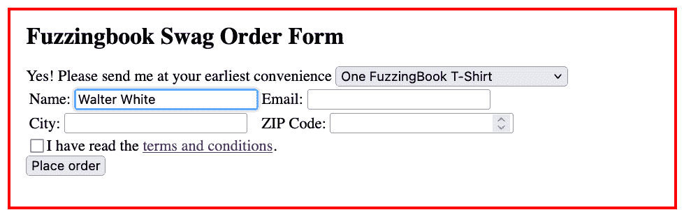

`submit()` 动作提交订单。（注意，我们的 Web 服务器根本不努力验证表单。）

```py
gui_runner.run("submit('submit')") 
```

```py
("submit('submit')", 'PASS')

```

```py
Image(gui_driver.get_screenshot_as_png()) 
```

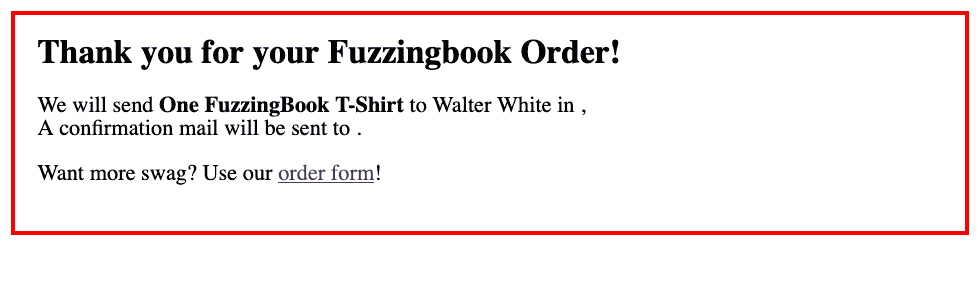

当然，我们也可以执行从语法生成的动作序列。这允许我们再次填写表单，使用与表单中给出的类型匹配的值。

```py
gui_driver.get(httpd_url) 
```

```py
gui_fuzzer = GrammarFuzzer(state_grammar) 
```

```py
while True:
    action = gui_fuzzer.fuzz()
    if action.find('submit(') > 0:
        break 
```

```py
print(action) 
```

```py
fill('city', 'S0.')
fill('email', 'o@i')
fill('name', 'MF')
check('terms', False)
fill('zip', '7')
submit('submit')

```

```py
gui_runner.run(action) 
```

```py
("fill('city', 'S0.')\nfill('email', 'o@i')\nfill('name', 'MF')\ncheck('terms', False)\nfill('zip', '7')\nsubmit('submit')\n",
 'PASS')

```

```py
Image(gui_driver.get_screenshot_as_png()) 
```

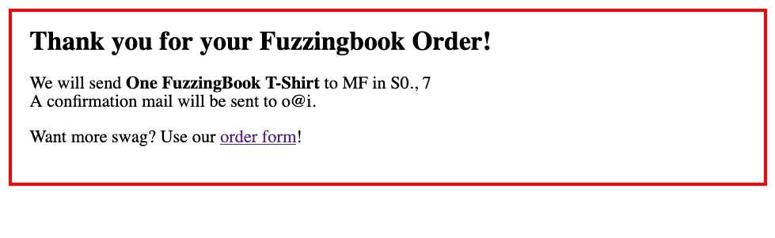

## 探索用户界面

到目前为止，我们的语法检索和动作执行仅限于当前用户界面状态（即当前显示的页面）。为了系统地探索用户界面，我们必须探索所有状态，特别是以`<unexplored>`结尾的状态——并且每次我们达到新状态时，再次检索其语法，这样我们才能到达其他状态。由于某些状态只能通过生成输入来访问，因此测试生成和用户界面探索*同时进行*。

因此，我们引入了一个`GUIFuzzer`类，它为所有表单生成输入，并跟随所有链接，每次遇到新状态时都会更新其语法（即其作为有限状态机的用户界面模型）。

<details id="Excursion:-Implementing-GUIFuzzer"><summary>实现 GUIFuzzer</summary>

同时探索状态和更新语法是一个相当复杂的操作，因此在我们能够使用它之前，我们需要引入相当多的方法。`GUIFuzzer`构造函数设置了三个重要的属性：

1.  `state_symbol`：这保存了当前状态的符号（例如`<state-1>`）。

1.  `state`：这保存了当前状态的动作集合，由`GUIGrammarMiner`方法的`mine_state_actions()`返回。

1.  `states_seen`：这将看到的（如`state`所示）状态映射到相应的符号。

让我们在初始化后展示这三个属性。

```py
from Grammars import is_nonterminal 
```

```py
from GrammarFuzzer import GrammarFuzzer 
```

```py
class GUIFuzzer(GrammarFuzzer):
  """A fuzzer for GUIs, using Selenium."""

    def __init__(self, driver, *,
                 miner: Optional[GUIGrammarMiner] = None,
                 stay_on_host: bool = True,
                 log_gui_exploration: bool = False,
                 disp_gui_exploration: bool = False,
                 **kwargs) -> None:
  """Constructor.
 `driver` - the Selenium driver to use.
 `miner` - the miner to use (default: `GUIGrammarMiner(driver)`)
 `stay_on_host` - if True (default), do not explore external links.
 `log_gui_exploration` - if set, print out exploration steps.
 `disp_gui_exploration` - if set, display screenshot of current Web page
 as well as FSM diagrams during exploration.
 Other keyword arguments are passed to the `GrammarFuzzer` superclass.
 """

        self.driver = driver

        if miner is None:
            miner = GUIGrammarMiner(driver)

        self.miner = miner
        self.stay_on_host = True
        self.log_gui_exploration = log_gui_exploration
        self.disp_gui_exploration = disp_gui_exploration
        self.initial_url = driver.current_url

        self.states_seen = {}  # Maps states to symbols
        self.state_symbol = self.miner.START_STATE
        self.state: FrozenSet[str] = self.miner.mine_state_actions()
        self.states_seen[self.state] = self.state_symbol

        grammar = self.miner.mine_state_grammar()
        super().__init__(grammar, **kwargs) 
```

```py
gui_driver.get(httpd_url) 
```

初始状态符号始终是`<state>`：

```py
gui_fuzzer = GUIFuzzer(gui_driver)
gui_fuzzer.state_symbol 
```

```py
'<state>'

```

当前状态由可用的 UI 动作来表征：

```py
gui_fuzzer.state 
```

```py
frozenset({"check('terms', <boolean>)",
           "click('terms and conditions')",
           "fill('city', '<text>')",
           "fill('email', '<email>')",
           "fill('name', '<text>')",
           "fill('zip', '<number>')",
           "submit('submit')"})

```

`states_seen` 将此状态映射到其符号：

```py
gui_fuzzer.states_seen[gui_fuzzer.state] 
```

```py
'<state>'

```

`restart()`方法将我们带回到初始 URL 并重置状态。这是我们每次新探索时使用的。

```py
class GUIFuzzer(GUIFuzzer):
    def restart(self) -> None:
  """Get back to original URL"""

        self.driver.get(self.initial_url)
        self.state = frozenset(self.miner.START_STATE) 
```

当从语法中生成一系列动作时，我们想知道我们将处于哪个最终状态。我们可以从生成的*推导树*中检索这个路径——它是最后被扩展的符号。

```py
while True:
    action = gui_fuzzer.fuzz()
    if action.find('click(') >= 0:
        break 
```

```py
from GrammarFuzzer import display_tree, DerivationTree 
```

```py
tree = gui_fuzzer.derivation_tree
display_tree(tree) 
```

<svg width="255pt" height="209pt" viewBox="0.00 0.00 254.75 209.00" xmlns:xlink="http://www.w3.org/1999/xlink"><g id="graph0" class="graph" transform="scale(1 1) rotate(0) translate(4 205)"><g id="node1" class="node"><title>0</title> <text text-anchor="middle" x="145.12" y="-187.7" font-family="Times,serif" font-size="14.00"><start></text></g> <g id="node2" class="node"><title>1</title> <text text-anchor="middle" x="145.12" y="-137.45" font-family="Times,serif" font-size="14.00"><state></text></g> <g id="edge1" class="edge"><title>0->1</title></g> <g id="node3" class="node"><title>2</title> <text text-anchor="middle" x="82.12" y="-87.2" font-family="Times,serif" font-size="14.00">click('terms and conditions')\n</text></g> <g id="edge2" class="edge"><title>1->2</title></g> <g id="node4" class="node"><title>3</title> <text text-anchor="middle" x="208.12" y="-87.2" font-family="Times,serif" font-size="14.00"><state-1></text></g> <g id="edge3" class="edge"><title>1->3</title></g> <g id="node5" class="node"><title>4</title> <text text-anchor="middle" x="208.12" y="-36.95" font-family="Times,serif" font-size="14.00"><unexplored></text></g> <g id="edge4" class="edge"><title>3->4</title></g> <g id="node6" class="node"><title>5</title></g> <g id="edge5" class="edge"><title>4->5</title></g></g></svg>

```py
class GUIFuzzer(GUIFuzzer):
    def fsm_path(self, tree: DerivationTree) -> List[str]:
  """Return sequence of state symbols."""

        (node, children) = tree
        if node == self.miner.UNEXPLORED_STATE:
            return []
        elif children is None or len(children) == 0:
            return [node]
        else:
            return [node] + self.fsm_path(children[-1]) 
```

这是有限状态机中通向“模糊”状态的路径：

```py
gui_fuzzer = GUIFuzzer(gui_driver)
gui_fuzzer.fsm_path(tree) 
```

```py
['<start>', '<state>', '<state-1>']

```

这是它的最后一个元素：

```py
class GUIFuzzer(GUIFuzzer):
    def fsm_last_state_symbol(self, tree: DerivationTree) -> str:
  """Return current (expected) state symbol"""

        for state in reversed(self.fsm_path(tree)):
            if is_nonterminal(state):
                return state

        assert False 
```

```py
gui_fuzzer = GUIFuzzer(gui_driver)
gui_fuzzer.fsm_last_state_symbol(tree) 
```

```py
'<state-1>'

```

当我们运行（`run()`）fuzzer 时，我们创建一个动作（通过`fuzz()`），检索并更新我们在运行此动作后应该处于的状态符号（`state_symbol`）。在实际上在给定的`GUIRunner`中运行动作后，我们检索并更新当前状态，使用`update_state()`。

```py
class GUIFuzzer(GUIFuzzer):
    def run(self, runner: GUIRunner) -> Tuple[str, str]:
  """Run the fuzzer on the given GUIRunner `runner`."""
        assert isinstance(runner, GUIRunner)

        self.restart()
        action = self.fuzz()
        self.state_symbol = self.fsm_last_state_symbol(self.derivation_tree)

        if self.log_gui_exploration:
            print("Action", action.strip(), "->", self.state_symbol)

        result, outcome = runner.run(action)

        if self.state_symbol != self.miner.FINAL_STATE:
            self.update_state()

        return self.state_symbol, outcome 
```

当更新当前状态时，我们检查我们是否处于一个新状态或之前见过的状态，并分别调用`update_new_state()`或`update_existing_state()`。

```py
class GUIFuzzer(GUIFuzzer):
    def update_state(self) -> None:
  """Determine current state from current Web page"""

        if self.disp_gui_exploration:
            display(Image(self.driver.get_screenshot_as_png()))

        self.state = self.miner.mine_state_actions()
        if self.state not in self.states_seen:
            self.states_seen[self.state] = self.state_symbol
            self.update_new_state()
        else:
            self.update_existing_state() 
```

找到新状态意味着我们为这个新找到的状态挖掘一个新的语法，并用它更新我们的现有语法。

```py
class GUIFuzzer(GUIFuzzer):
    def set_grammar(self, new_grammar: Grammar) -> None:
  """Set grammar to `new_grammar`."""

        self.grammar = new_grammar

        if self.disp_gui_exploration and rich_output():
            display(fsm_diagram(self.grammar)) 
```

```py
class GUIFuzzer(GUIFuzzer):
    def update_new_state(self) -> None:
  """Found new state; extend grammar accordingly"""

        if self.log_gui_exploration:
            print("In new state", unicode_escape(self.state_symbol),
                                  unicode_escape(repr(self.state)))

        state_grammar = self.miner.mine_state_grammar(grammar=self.grammar, 
                                                      state_symbol=self.state_symbol)
        del state_grammar[START_SYMBOL]
        del state_grammar[self.miner.START_STATE]
        self.set_grammar(extend_grammar(self.grammar, state_grammar))

    def update_existing_state(self) -> None:
        pass  # See below 
```

如果我们找到一个现有状态，我们需要*合并*这两个状态。例如，如果我们发现我们处于现有的`<state-1>`而不是预期的`<state-3>`，我们将语法中所有`<state-3>`的实例替换为`<state-1>`。`replace_symbol()`方法负责重命名；`update_existing_state()`相应地设置语法。

```py
from Grammars import exp_string, exp_opts 
```

```py
def replace_symbol(grammar: Grammar, 
                   old_symbol: str, new_symbol: str) -> Grammar:
  """Return a grammar in which all occurrences of `old_symbol` are replaced by `new_symbol`"""

    new_grammar: Grammar = {}

    for symbol in grammar:
        new_expansions = []
        for expansion in grammar[symbol]:
            new_expansion_string = exp_string(expansion).replace(old_symbol, new_symbol)
            if len(exp_opts(expansion)) > 0:
                new_expansion = (new_expansion_string, exp_opts(expansion))
            else:
                new_expansion = new_expansion_string
            new_expansions.append(new_expansion)

        new_grammar[symbol] = new_expansions

    # Remove unused parts
    for nonterminal in unreachable_nonterminals(new_grammar):
        del new_grammar[nonterminal]

    return new_grammar 
```

```py
class GUIFuzzer(GUIFuzzer):
    def update_existing_state(self) -> None:
  """Update actions of existing state"""

        if self.log_gui_exploration:
            print("In existing state", self.states_seen[self.state])

        if self.state_symbol != self.states_seen[self.state]:
            if self.log_gui_exploration:
                print("Replacing expected state %s by %s" %
                      (self.state_symbol, self.states_seen[self.state]))

            new_grammar = replace_symbol(self.grammar, self.state_symbol, 
                                         self.states_seen[self.state])
            self.state_symbol = self.states_seen[self.state]
            self.set_grammar(new_grammar) 
```

这就结束了我们对`GUIFuzzer`的定义。</details>

让我们使用`GUIFuzzer`，启用其日志机制来查看它在做什么。

```py
gui_driver.get(httpd_url) 
```

```py
gui_fuzzer = GUIFuzzer(gui_driver, log_gui_exploration=True, disp_gui_exploration=True) 
```

第一次运行它会产生一个新的状态：

```py
gui_fuzzer.run(gui_runner) 
```

```py
Action click('terms and conditions') -> <state-1>

```


```py
In new state <state-1> frozenset({"ignore('Creative Commons Attribution-NonCommercial-ShareAlike 4.0 International License.')", "click('order form')"})

```

<svg width="371pt" height="456pt" viewBox="0.00 0.00 371.22 455.50" xmlns:xlink="http://www.w3.org/1999/xlink"><g id="graph0" class="graph" transform="scale(1 1) rotate(0) translate(4 451.5)"><g id="node1" class="node"><title>start</title> <text text-anchor="middle" x="182.57" y="-423.32" font-family="Times,serif" font-size="14.00"><start></text></g> <g id="node2" class="node"><title>state</title> <text text-anchor="middle" x="182.57" y="-350.32" font-family="Times,serif" font-size="14.00"><state></text></g> <g id="edge1" class="edge"><title>start->state</title></g> <g id="node3" class="node"><title>state-1</title> <text text-anchor="middle" x="43.57" y="-192.82" font-family="Times,serif" font-size="14.00"><state-1></text></g> <g id="edge2" class="edge"><title>state->state-1</title> <text text-anchor="start" x="14.82" y="-271.57" font-family="Times,serif" font-size="14.00">click('terms and conditions')</text></g> <g id="node4" class="node"><title>state-2</title> <text text-anchor="middle" x="241.57" y="-138.82" font-family="Times,serif" font-size="14.00"><state-2></text></g> <g id="edge3" class="edge"><title>state->state-2</title> <text text-anchor="start" x="220.72" y="-307.2" font-family="Times,serif" font-size="14.00">fill('city', '<text>')</text> <text text-anchor="start" x="220.72" y="-292.95" font-family="Times,serif" font-size="14.00">fill('email', '<email>')</text> <text text-anchor="start" x="220.72" y="-278.7" font-family="Times,serif" font-size="14.00">fill('name', '<text>')</text> <text text-anchor="start" x="220.72" y="-264.45" font-family="Times,serif" font-size="14.00">check('terms', <boolean>)</text> <text text-anchor="start" x="220.72" y="-250.2" font-family="Times,serif" font-size="14.00">fill('zip', '<number>')</text> <text text-anchor="start" x="220.72" y="-235.95" font-family="Times,serif" font-size="14.00">submit('submit')</text></g> <g id="node5" class="node"><title>end</title> <text text-anchor="middle" x="163.57" y="-84.83" font-family="Times,serif" font-size="14.00"><end></text></g> <g id="edge4" class="edge"><title>state->end</title></g> <g id="edge6" class="edge"><title>state-1->end</title></g> <g id="node6" class="node"><title>state-3</title> <text text-anchor="middle" x="59.57" y="-84.83" font-family="Times,serif" font-size="14.00"><state-3></text></g> <g id="edge5" class="edge"><title>state-1->state-3</title> <text text-anchor="start" x="44.57" y="-138.82" font-family="Times,serif" font-size="14.00">click('order form')</text></g> <g id="node7" class="node"><title>unexplored</title> <text text-anchor="middle" x="147.57" y="-11.82" font-family="Times,serif" font-size="14.00"><unexplored></text></g> <g id="edge7" class="edge"><title>state-2->unexplored</title></g> <g id="edge8" class="edge"><title>state-3->unexplored</title></g></g></svg>

```py
None

```

```py
('<state-1>', 'PASS')

```

下一个动作填写订单表单。

```py
gui_fuzzer.run(gui_runner) 
```

```py
Action click('terms and conditions') -> <end>

```

```py
('<end>', 'PASS')

```

```py
gui_fuzzer.run(gui_runner) 
```

```py
Action click('terms and conditions') -> <end>

```

```py
('<end>', 'PASS')

```

到目前为止，我们的 GUI 模型已经相当完整了。为了系统地覆盖*所有*状态，随机探索并不足够高效。

## 覆盖状态

在探索以及测试期间，我们希望*覆盖*所有状态以及状态之间的转换。我们如何实现这一点？

结果表明*我们已经有这个了*。我们的`GrammarCoverageFuzzer`来自基于覆盖的语法测试章节，它努力系统地*覆盖语法中的所有扩展选项*。在有限状态模型中，这些扩展选项转化为状态之间的转换。因此，将`GrammarCoverageFuzzer`的覆盖策略应用到我们的状态语法中会自动覆盖一个转换接着另一个。

我们如何将这些特性应用到`GUIFuzzer`中？使用*多重继承*，我们可以创建一个`GUICoverageFuzzer`类，它结合了`GUIFuzzer`的`run()`方法和`GrammarCoverageFuzzer`的覆盖选择。

```py
from GrammarCoverageFuzzer import GrammarCoverageFuzzer 
```

```py
from [bookutils](https://github.com/uds-se/fuzzingbook//tree/master/notebooks/shared/bookutils) import inheritance_conflicts 
```

由于`__init__()`构造函数在两个超类中都已定义，我们需要定义自己的构造函数，使其同时服务：

```py
inheritance_conflicts(GUIFuzzer, GrammarCoverageFuzzer) 
```

```py
['__init__']

```

```py
class GUICoverageFuzzer(GUIFuzzer, GrammarCoverageFuzzer):
  """Systematically explore all states of the current Web page"""

    def __init__(self, *args, **kwargs):
  """Constructor. All args are passed to the `GUIFuzzer` superclass."""
        GUIFuzzer.__init__(self, *args, **kwargs)
        self.reset_coverage() 
```

使用`GUICoverageFuzzer`，我们可以设置一个`explore_all()`方法，它会持续运行 fuzzer，直到没有未探索的状态为止：

```py
class GUICoverageFuzzer(GUICoverageFuzzer):
    def explore_all(self, runner: GUIRunner, max_actions=100) -> None:
  """Explore all states of the GUI, up to `max_actions` (default 100)."""

        actions = 0
        while (self.miner.UNEXPLORED_STATE in self.grammar and 
               actions < max_actions):
            actions += 1
            if self.log_gui_exploration:
                print("Run #" + repr(actions))
            try:
                self.run(runner)
            except ElementClickInterceptedException:
                pass
            except ElementNotInteractableException:
                pass
            except NoSuchElementException:
                pass 
```

让我们利用这个来全面探索我们的 Web 服务器：

```py
gui_driver.get(httpd_url) 
```

```py
gui_fuzzer = GUICoverageFuzzer(gui_driver) 
```

```py
gui_fuzzer.explore_all(gui_runner) 
```

成功！我们已经覆盖了所有状态：

```py
fsm_diagram(gui_fuzzer.grammar) 
```

<svg width="604pt" height="348pt" viewBox="0.00 0.00 604.13 347.50" xmlns:xlink="http://www.w3.org/1999/xlink"><g id="graph0" class="graph" transform="scale(1 1) rotate(0) translate(4 343.5)"><g id="node1" class="node"><title>start</title> <text text-anchor="middle" x="316.33" y="-315.32" font-family="Times,serif" font-size="14.00"><start></text></g> <g id="node2" class="node"><title>state</title> <text text-anchor="middle" x="316.33" y="-242.32" font-family="Times,serif" font-size="14.00"><state></text></g> <g id="edge1" class="edge"><title>start->state</title></g> <g id="node3" class="node"><title>state-1</title> <text text-anchor="middle" x="194.33" y="-84.83" font-family="Times,serif" font-size="14.00"><state-1></text></g> <g id="edge2" class="edge"><title>state->state-1</title> <text text-anchor="start" x="18.58" y="-163.57" font-family="Times,serif" font-size="14.00">click('terms and conditions')</text></g> <g id="node4" class="node"><title>state-2</title> <text text-anchor="middle" x="399.33" y="-84.83" font-family="Times,serif" font-size="14.00"><state-2></text></g> <g id="edge3" class="edge"><title>state->state-2</title> <text text-anchor="start" x="317.83" y="-199.2" font-family="Times,serif" font-size="14.00">fill('city', '<text>')</text> <text text-anchor="start" x="317.83" y="-184.95" font-family="Times,serif" font-size="14.00">fill('email', '<email>')</text> <text text-anchor="start" x="317.83" y="-170.7" font-family="Times,serif" font-size="14.00">fill('name', '<text>')</text> <text text-anchor="start" x="317.83" y="-156.45" font-family="Times,serif" font-size="14.00">check('terms', <boolean>)</text> <text text-anchor="start" x="317.83" y="-142.2" font-family="Times,serif" font-size="14.00">fill('zip', '<number>')</text> <text text-anchor="start" x="317.83" y="-127.95" font-family="Times,serif" font-size="14.00">submit('submit')</text></g> <g id="node5" class="node"><title>end</title> <text text-anchor="middle" x="399.33" y="-11.82" font-family="Times,serif" font-size="14.00"><end></text></g> <g id="edge4" class="edge"><title>state->end</title></g> <g id="edge5" class="edge"><title>state-1->state</title> <text text-anchor="start" x="201.33" y="-163.57" font-family="Times,serif" font-size="14.00">click('order form')</text></g> <g id="edge6" class="edge"><title>state-1->end</title></g> <g id="edge7" class="edge"><title>state-2->state</title> <text text-anchor="start" x="476.32" y="-163.57" font-family="Times,serif" font-size="14.00">click('order form')</text></g> <g id="edge8" class="edge"><title>state-2->end</title></g></g></svg>

我们可以检索到目前为止覆盖的扩展，当然这覆盖了所有状态。

```py
gui_fuzzer.covered_expansions 
```

```py
{'<boolean> -> False',
 '<boolean> -> True',
 '<character> -> <digit>',
 '<character> -> <letter>',
 '<character> -> <special>',
 '<digit> -> 0',
 '<digit> -> 1',
 '<digit> -> 2',
 '<digit> -> 3',
 '<digit> -> 4',
 '<digit> -> 5',
 '<digit> -> 6',
 '<digit> -> 7',
 '<digit> -> 8',
 '<digit> -> 9',
 '<digits> -> <digit>',
 '<digits> -> <digits><digit>',
 '<email> -> <letters>@<letters>',
 '<end> -> ',
 '<letter> -> A',
 '<letter> -> B',
 '<letter> -> D',
 '<letter> -> H',
 '<letter> -> J',
 '<letter> -> K',
 '<letter> -> L',
 '<letter> -> M',
 '<letter> -> P',
 '<letter> -> Q',
 '<letter> -> W',
 '<letter> -> Y',
 '<letter> -> b',
 '<letter> -> g',
 '<letter> -> h',
 '<letter> -> l',
 '<letter> -> m',
 '<letter> -> n',
 '<letter> -> q',
 '<letter> -> t',
 '<letter> -> v',
 '<letter> -> y',
 '<letters> -> <letter>',
 '<letters> -> <letters><letter>',
 '<number> -> <digits>',
 '<special> -> .',
 '<start> -> <state>',
 '<state-1> -> <end>',
 '<state-1> -> <unexplored>',
 "<state-1> -> click('order form')\n<state-3>",
 '<state-2> -> <end>',
 '<state-2> -> <unexplored>',
 "<state-2> -> click('order form')\n<state-4>",
 '<state-3> -> <unexplored>',
 '<state-4> -> <unexplored>',
 '<state> -> <end>',
 "<state> -> click('terms and conditions')\n<state-1>",
 "<state> -> fill('city', '<text>')\nfill('email', '<email>')\nfill('name', '<text>')\ncheck('terms', <boolean>)\nfill('zip', '<number>')\nsubmit('submit')\n<state-2>",
 '<string> -> <character>',
 '<string> -> <string><character>',
 '<text> -> <string>',
 '<unexplored> -> '}

```

尽管如此，我们还没有看到所有覆盖的扩展。一些数字和字母尚未使用。

```py
gui_fuzzer.missing_expansion_coverage() 
```

```py
{'<letter> -> C',
 '<letter> -> E',
 '<letter> -> F',
 '<letter> -> G',
 '<letter> -> I',
 '<letter> -> N',
 '<letter> -> O',
 '<letter> -> R',
 '<letter> -> S',
 '<letter> -> T',
 '<letter> -> U',
 '<letter> -> V',
 '<letter> -> X',
 '<letter> -> Z',
 '<letter> -> a',
 '<letter> -> c',
 '<letter> -> d',
 '<letter> -> e',
 '<letter> -> f',
 '<letter> -> i',
 '<letter> -> j',
 '<letter> -> k',
 '<letter> -> o',
 '<letter> -> p',
 '<letter> -> r',
 '<letter> -> s',
 '<letter> -> u',
 '<letter> -> w',
 '<letter> -> x',
 '<letter> -> z',
 '<special> ->  ',
 '<special> -> !',
 "<state-1> -> click('order form')\n<state>",
 "<state-2> -> click('order form')\n<state>"}

```

重复运行 fuzzer 最终也会覆盖这些扩展，导致订单表单中的字母和数字覆盖率。

## 探索大型网站

我们的 GUI fuzzer 足够健壮，可以处理探索非平凡网站，例如[fuzzingbook.org](https://www.fuzzingbook.org)。让我们演示这一点：

```py
gui_driver.get("https://www.fuzzingbook.org/html/Fuzzer.html") 
```

```py
Image(gui_driver.get_screenshot_as_png()) 
```

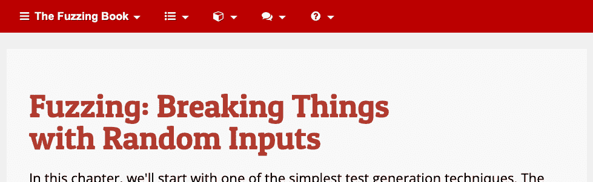

```py
book_runner = GUIRunner(gui_driver) 
```

```py
book_fuzzer = GUICoverageFuzzer(gui_driver, log_gui_exploration=True)  # , disp_gui_exploration=True) 
```

我们探索了该网站的前几个状态，这些状态在`ACTIONS`中定义：

```py
ACTIONS = 5 
```

```py
book_fuzzer.explore_all(book_runner, max_actions=ACTIONS) 
```

```py
Run #1
Action click('discussed above') -> <state-7>
In existing state <state>
Replacing expected state <state-7> by <state>
Run #2
Action click('use the code provided in this chapter') -> <state-11>
In new state <state-11> frozenset({"ignore('installation instructions')", "click('the chapter on fuzzers')", "click('')", "click('Fuzzer')", "ignore('official instructions')", "click('Cite')", "ignore('apt.txt file in the binder/ folder')", "ignore('Last change: 2023-11-11 18:18:06+01:00')", "ignore('Creative Commons Attribution-NonCommercial-ShareAlike 4.0 International License')", "ignore('Pipenv')", "ignore('')", "ignore('bookutils')", "click('fuzzingbook.Fuzzer')", "click('The Fuzzing Book')", "ignore('requirements.txt file within the project root folder')", "ignore('MIT License')", "ignore('the project page')", "ignore('Imprint')", "ignore('pyenv-win')", "ignore('bookutils.setup')", "click('fuzzingbook.')"})
Run #3
Action click('Intro_Testing') -> <state-10>
In existing state <state>
Replacing expected state <state-10> by <state>
Run #4
Action click('chapter on mining function specifications') -> <state-5>
In new state <state-5> frozenset({"click('ExpectError')", "ignore('Last change: 2024-11-09 17:07:29+01:00')", "ignore('itertools')", "ignore('showast')", "ignore('curated list')", "click('symbolic fuzzing')", "click('Cite')", "ignore('tempfile')", "click('part on semantic fuzzing techniques')", "ignore('Ernst et al, 2001')", "ignore('Use the notebook')", "click('symbolic')", "ignore('MonkeyType')", "ignore('DAIKON dynamic invariant detector')", "click('introduction to testing')", "click('Grammars')", "click('The Fuzzing Book')", "click('GrammarFuzzer')", "click('symbolic interpretation')", "click('domain-specific fuzzing techniques')", "click('Intro_Testing')", "ignore('subprocess')", "click('fuzzingbook.DynamicInvariants')", "click('our chapter with the same name')", "click('concolic fuzzer')", "click('concolic')", "click('chapter on testing')", "ignore('code snippet from StackOverflow')", "ignore('Pacheco et al, 2005')", "ignore('sys')", "ignore('ast')", "ignore('&quot;The state of type hints in Python&quot;')", "click('chapter on coverage')", "ignore('functools')", "ignore('Ammons et al, 2002')", "ignore('Mypy')", "click('the next part')", "ignore('')", "ignore('Creative Commons Attribution-NonCommercial-ShareAlike 4.0 International License')", "click('chapter on information flow')", "ignore('typing')", "ignore('bookutils.setup')", "ignore('bookutils')", "ignore('MIT License')", "ignore('PyAnnotate')", "ignore('Imprint')", "click('')", "ignore('inspect')", "click('use the code provided in this chapter')", "click('Coverage')"})
Run #5
Action click('chapter on testing') -> <state-14>
In new state <state-14> frozenset({"click('ExpectError')", "check('11b29b38-9eb5-11ef-9f1d-6298cf1a578f', <boolean>)", "ignore('Beizer et al, 1990')", "click('Timer')", "click('Cite')", "click('Timer module')", "check('1251ba2e-9eb5-11ef-9f1d-6298cf1a578f', <boolean>)", "ignore('random')", "ignore('Use the notebook')", "click('use fuzzing to test programs with random inputs')", "ignore('Shellsort')", "click('The Fuzzing Book')", "click('import it')", "ignore('Newton\xe2\x80\x93Raphson method')", "click('00_Table_of_Contents.ipynb')", "ignore('Python tutorial')", "submit('')", "ignore('math.isclose()')", "click('Web Page')", "ignore('Pezz\xc3\xa8 et al, 2008')", "ignore('&quot;Effective Software Testing: A Developer&#x27;s Guide&quot;')", "click('Background')", "ignore('Maur\xc3\xadcio Aniche, 2022')", "ignore('Last change: 2023-11-11 18:18:06+01:00')", "check('119cfd32-9eb5-11ef-9f1d-6298cf1a578f', <boolean>)", "ignore('Creative Commons Attribution-NonCommercial-ShareAlike 4.0 International License')", "ignore('')", "ignore('bookutils')", "ignore('bookutils.setup')", "ignore('MIT License')", "ignore('Myers et al, 2004')", "ignore('Imprint')", "click('')", "click('Guide for Authors')"})

```

在执行了第一个`ACTIONS`动作之后，我们可以看到有限状态模型相当复杂，仍有数十个转换等待探索。大多数尚未探索的状态最终将与现有状态合并，每个章节对应一个状态。尽管如此，遍历所有页面上的所有链接仍需要相当长的时间。

```py
# Inspect this graph in the notebook to see it in full glory
fsm_diagram(book_fuzzer.grammar) 
```

<svg width="8571pt" height="434pt" viewBox="0.00 0.00 8571.22 433.75" xmlns:xlink="http://www.w3.org/1999/xlink"><g id="graph0" class="graph" transform="scale(1 1) rotate(0) translate(4 429.75)"><g id="node1" class="node"><title>start</title> <text text-anchor="middle" x="1832.41" y="-401.57" font-family="Times,serif" font-size="14.00"><start></text></g> <g id="node2" class="node"><title>state</title> <text text-anchor="middle" x="1832.41" y="-328.57" font-family="Times,serif" font-size="14.00"><state></text></g> <g id="edge1" class="edge"><title>start->state</title></g> <g id="edge8" class="edge"><title>state->state</title> <text text-anchor="start" x="1886.82" y="-328.57" font-family="Times,serif" font-size="14.00">click('discussed above')</text></g> <g id="edge11" class="edge"><title>state->state</title> <text text-anchor="start" x="2014.32" y="-328.57" font-family="Times,serif" font-size="14.00">click('Intro_Testing')</text></g> <g id="node3" class="node"><title>state-1</title> <text text-anchor="middle" x="117.41" y="-149.32" font-family="Times,serif" font-size="14.00"><state-1></text></g> <g id="edge2" class="edge"><title>state->state-1</title> <text text-anchor="start" x="11.91" y="-271.2" font-family="Times,serif" font-size="14.00">click('A Fuzzing Architecture')</text></g> <g id="node4" class="node"><title>state-2</title> <text text-anchor="middle" x="208.41" y="-213.82" font-family="Times,serif" font-size="14.00"><state-2></text></g> <g id="edge3" class="edge"><title>state->state-2</title> <text text-anchor="start" x="189.66" y="-271.2" font-family="Times,serif" font-size="14.00">click('ExpectError')</text></g> <g id="node5" class="node"><title>state-3</title> <text text-anchor="middle" x="325.41" y="-213.82" font-family="Times,serif" font-size="14.00"><state-3></text></g> <g id="edge4" class="edge"><title>state->state-3</title> <text text-anchor="start" x="306.66" y="-271.2" font-family="Times,serif" font-size="14.00">click('runtime verification')</text></g> <g id="node6" class="node"><title>state-4</title> <text text-anchor="middle" x="503.41" y="-213.82" font-family="Times,serif" font-size="14.00"><state-4></text></g> <g id="edge5" class="edge"><title>state->state-4</title> <text text-anchor="start" x="466.16" y="-271.2" font-family="Times,serif" font-size="14.00">click('Cite')</text></g> <g id="node7" class="node"><title>state-5</title> <text text-anchor="middle" x="3405.41" y="-213.82" font-family="Times,serif" font-size="14.00"><state-5></text></g> <g id="edge6" class="edge"><title>state->state-5</title> <text text-anchor="start" x="3292.33" y="-271.2" font-family="Times,serif" font-size="14.00">click('chapter on mining function specifications')</text></g> <g id="node8" class="node"><title>state-6</title> <text text-anchor="middle" x="792.41" y="-213.82" font-family="Times,serif" font-size="14.00"><state-6></text></g> <g id="edge7" class="edge"><title>state->state-6</title> <text text-anchor="start" x="545.16" y="-271.2" font-family="Times,serif" font-size="14.00">click('use grammars to specify the input format and thus get many more valid inputs')</text></g> <g id="node9" class="node"><title>state-8</title> <text text-anchor="middle" x="949.41" y="-213.82" font-family="Times,serif" font-size="14.00"><state-8></text></g> <g id="edge9" class="edge"><title>state->state-8</title> <text text-anchor="start" x="1042.41" y="-271.2" font-family="Times,serif" font-size="14.00">click('The Fuzzing Book')</text></g> <g id="node10" class="node"><title>state-9</title> <text text-anchor="middle" x="929.41" y="-149.32" font-family="Times,serif" font-size="14.00"><state-9></text></g> <g id="edge10" class="edge"><title>state->state-9</title> <text text-anchor="start" x="1202.91" y="-271.2" font-family="Times,serif" font-size="14.00">click('"Introduction to Software Testing"')</text></g> <g id="node11" class="node"><title>state-11</title> <text text-anchor="middle" x="5855.41" y="-213.82" font-family="Times,serif" font-size="14.00"><state-11></text></g> <g id="edge12" class="edge"><title>state->state-11</title> <text text-anchor="start" x="4867.72" y="-271.2" font-family="Times,serif" font-size="14.00">click('use the code provided in this chapter')</text></g> <g id="node12" class="node"><title>state-12</title> <text text-anchor="middle" x="1025.41" y="-149.32" font-family="Times,serif" font-size="14.00"><state-12></text></g> <g id="edge13" class="edge"><title>state->state-12</title> <text text-anchor="start" x="1455.41" y="-271.2" font-family="Times,serif" font-size="14.00">click('Introduction to Testing')</text></g> <g id="node13" class="node"><title>state-13</title> <text text-anchor="middle" x="1126.41" y="-149.32" font-family="Times,serif" font-size="14.00"><state-13></text></g> <g id="edge14" class="edge"><title>state->state-13</title> <text text-anchor="start" x="1643.16" y="-271.2" font-family="Times,serif" font-size="14.00">click('use mutations on existing inputs to get more valid inputs')</text></g> <g id="node14" class="node"><title>state-14</title> <text text-anchor="middle" x="7280.41" y="-213.82" font-family="Times,serif" font-size="14.00"><state-14></text></g> <g id="edge15" class="edge"><title>state->state-14</title> <text text-anchor="start" x="6966.52" y="-271.2" font-family="Times,serif" font-size="14.00">click('chapter on testing')</text></g> <g id="node15" class="node"><title>state-15</title> <text text-anchor="middle" x="1227.41" y="-149.32" font-family="Times,serif" font-size="14.00"><state-15></text></g> <g id="edge16" class="edge"><title>state->state-15</title> <text text-anchor="start" x="2006.51" y="-271.2" font-family="Times,serif" font-size="14.00">click('')</text></g> <g id="node16" class="node"><title>state-16</title> <text text-anchor="middle" x="1328.41" y="-149.32" font-family="Times,serif" font-size="14.00"><state-16></text></g> <g id="edge17" class="edge"><title>state->state-16</title> <text text-anchor="start" x="2074.7" y="-271.2" font-family="Times,serif" font-size="14.00">click('reduce failing inputs for efficient debugging')</text></g> <g id="node17" class="node"><title>state-17</title> <text text-anchor="middle" x="1429.41" y="-149.32" font-family="Times,serif" font-size="14.00"><state-17></text></g> <g id="edge18" class="edge"><title>state->state-17</title> <text text-anchor="start" x="2372.79" y="-271.2" font-family="Times,serif" font-size="14.00">click('chapter on information flow')</text></g> <g id="node18" class="node"><title>state-18</title> <text text-anchor="middle" x="1530.41" y="-149.32" font-family="Times,serif" font-size="14.00"><state-18></text></g> <g id="edge19" class="edge"><title>state->state-18</title> <text text-anchor="start" x="2588.59" y="-271.2" font-family="Times,serif" font-size="14.00">click('fuzzingbook.Fuzzer')</text></g> <g id="node19" class="node"><title>state-19</title> <text text-anchor="middle" x="1631.41" y="-149.32" font-family="Times,serif" font-size="14.00"><state-19></text></g> <g id="edge20" class="edge"><title>state->state-19</title> <text text-anchor="start" x="2759.37" y="-285.45" font-family="Times,serif" font-size="14.00">check('19b2920c-9eb5-11ef-aaff-6298cf1a578f', <boolean>)</text> <text text-anchor="start" x="2759.37" y="-271.2" font-family="Times,serif" font-size="14.00">check('19bb868c-9eb5-11ef-aaff-6298cf1a578f', <boolean>)</text> <text text-anchor="start" x="2759.37" y="-256.95" font-family="Times,serif" font-size="14.00">submit('')</text></g> <g id="node20" class="node"><title>end</title> <text text-anchor="middle" x="6373.41" y="-84.83" font-family="Times,serif" font-size="14.00"><end></text></g> <g id="edge21" class="edge"><title>state->end</title></g> <g id="node21" class="node"><title>unexplored</title> <text text-anchor="middle" x="3873.41" y="-11.82" font-family="Times,serif" font-size="14.00"><unexplored></text></g> <g id="edge22" class="edge"><title>state-1->unexplored</title></g> <g id="edge23" class="edge"><title>state-2->unexplored</title></g> <g id="edge24" class="edge"><title>state-3->unexplored</title></g> <g id="edge25" class="edge"><title>state-4->unexplored</title></g> <g id="edge49" class="edge"><title>state-5->end</title></g> <g id="node22" class="node"><title>state-10</title> <text text-anchor="middle" x="2850.41" y="-84.83" font-family="Times,serif" font-size="14.00"><state-10></text></g> <g id="edge26" class="edge"><title>state-5->state-10</title> <text text-anchor="start" x="2689.66" y="-149.32" font-family="Times,serif" font-size="14.00">click('ExpectError')</text></g> <g id="node23" class="node"><title>state-26</title> <text text-anchor="middle" x="3007.41" y="-84.83" font-family="Times,serif" font-size="14.00"><state-26></text></g> <g id="edge27" class="edge"><title>state-5->state-26</title> <text text-anchor="start" x="2812.16" y="-149.32" font-family="Times,serif" font-size="14.00">click('symbolic fuzzing')</text></g> <g id="node24" class="node"><title>state-27</title> <text text-anchor="middle" x="3143.41" y="-84.83" font-family="Times,serif" font-size="14.00"><state-27></text></g> <g id="edge28" class="edge"><title>state-5->state-27</title> <text text-anchor="start" x="2963.16" y="-149.32" font-family="Times,serif" font-size="14.00">click('Cite')</text></g> <g id="node25" class="node"><title>state-28</title> <text text-anchor="middle" x="3268.41" y="-84.83" font-family="Times,serif" font-size="14.00"><state-28></text></g> <g id="edge29" class="edge"><title>state-5->state-28</title> <text text-anchor="start" x="3042.16" y="-149.32" font-family="Times,serif" font-size="14.00">click('part on semantic fuzzing techniques')</text></g> <g id="node26" class="node"><title>state-29</title> <text text-anchor="middle" x="3387.41" y="-84.83" font-family="Times,serif" font-size="14.00"><state-29></text></g> <g id="edge30" class="edge"><title>state-5->state-29</title> <text text-anchor="start" x="3293.41" y="-149.32" font-family="Times,serif" font-size="14.00">click('symbolic')</text></g> <g id="node27" class="node"><title>state-30</title> <text text-anchor="middle" x="3504.41" y="-84.83" font-family="Times,serif" font-size="14.00"><state-30></text></g> <g id="edge31" class="edge"><title>state-5->state-30</title> <text text-anchor="start" x="3406.66" y="-149.32" font-family="Times,serif" font-size="14.00">click('introduction to testing')</text></g> <g id="node28" class="node"><title>state-31</title> <text text-anchor="middle" x="3619.41" y="-84.83" font-family="Times,serif" font-size="14.00"><state-31></text></g> <g id="edge32" class="edge"><title>state-5->state-31</title> <text text-anchor="start" x="3589.16" y="-149.32" font-family="Times,serif" font-size="14.00">click('Grammars')</text></g> <g id="node29" class="node"><title>state-32</title> <text text-anchor="middle" x="3734.41" y="-84.83" font-family="Times,serif" font-size="14.00"><state-32></text></g> <g id="edge33" class="edge"><title>state-5->state-32</title> <text text-anchor="start" x="3710.41" y="-149.32" font-family="Times,serif" font-size="14.00">click('The Fuzzing Book')</text></g> <g id="node30" class="node"><title>state-33</title> <text text-anchor="middle" x="3873.41" y="-84.83" font-family="Times,serif" font-size="14.00"><state-33></text></g> <g id="edge34" class="edge"><title>state-5->state-33</title> <text text-anchor="start" x="3874.39" y="-149.32" font-family="Times,serif" font-size="14.00">click('GrammarFuzzer')</text></g> <g id="node31" class="node"><title>state-34</title> <text text-anchor="middle" x="4007.41" y="-84.83" font-family="Times,serif" font-size="14.00"><state-34></text></g> <g id="edge35" class="edge"><title>state-5->state-34</title> <text text-anchor="start" x="4017.92" y="-149.32" font-family="Times,serif" font-size="14.00">click('symbolic interpretation')</text></g> <g id="node32" class="node"><title>state-35</title> <text text-anchor="middle" x="4168.41" y="-84.83" font-family="Times,serif" font-size="14.00"><state-35></text></g> <g id="edge36" class="edge"><title>state-5->state-35</title> <text text-anchor="start" x="4197.54" y="-149.32" font-family="Times,serif" font-size="14.00">click('domain-specific fuzzing techniques')</text></g> <g id="node33" class="node"><title>state-36</title> <text text-anchor="middle" x="4377.41" y="-84.83" font-family="Times,serif" font-size="14.00"><state-36></text></g> <g id="edge37" class="edge"><title>state-5->state-36</title> <text text-anchor="start" x="4445.73" y="-149.32" font-family="Times,serif" font-size="14.00">click('Intro_Testing')</text></g> <g id="node34" class="node"><title>state-37</title> <text text-anchor="middle" x="4549.41" y="-84.83" font-family="Times,serif" font-size="14.00"><state-37></text></g> <g id="edge38" class="edge"><title>state-5->state-37</title> <text text-anchor="start" x="4573.36" y="-149.32" font-family="Times,serif" font-size="14.00">click('fuzzingbook.DynamicInvariants')</text></g> <g id="node35" class="node"><title>state-38</title> <text text-anchor="middle" x="4754.41" y="-84.83" font-family="Times,serif" font-size="14.00"><state-38></text></g> <g id="edge39" class="edge"><title>state-5->state-38</title> <text text-anchor="start" x="4803.04" y="-149.32" font-family="Times,serif" font-size="14.00">click('our chapter with the same name')</text></g> <g id="node36" class="node"><title>state-39</title> <text text-anchor="middle" x="4976.41" y="-84.83" font-family="Times,serif" font-size="14.00"><state-39></text></g> <g id="edge40" class="edge"><title>state-5->state-39</title> <text text-anchor="start" x="5033.4" y="-149.32" font-family="Times,serif" font-size="14.00">click('concolic fuzzer')</text></g> <g id="node37" class="node"><title>state-40</title> <text text-anchor="middle" x="5157.41" y="-84.83" font-family="Times,serif" font-size="14.00"><state-40></text></g> <g id="edge41" class="edge"><title>state-5->state-40</title> <text text-anchor="start" x="5172.39" y="-149.32" font-family="Times,serif" font-size="14.00">click('concolic')</text></g> <g id="node38" class="node"><title>state-41</title> <text text-anchor="middle" x="5305.41" y="-84.83" font-family="Times,serif" font-size="14.00"><state-41></text></g> <g id="edge42" class="edge"><title>state-5->state-41</title> <text text-anchor="start" x="5297.7" y="-149.32" font-family="Times,serif" font-size="14.00">click('chapter on testing')</text></g> <g id="node39" class="node"><title>state-42</title> <text text-anchor="middle" x="1804.41" y="-84.83" font-family="Times,serif" font-size="14.00"><state-42></text></g> <g id="edge43" class="edge"><title>state-5->state-42</title> <text text-anchor="start" x="1748.16" y="-149.32" font-family="Times,serif" font-size="14.00">click('chapter on coverage')</text></g> <g id="node40" class="node"><title>state-43</title> <text text-anchor="middle" x="1961.41" y="-84.83" font-family="Times,serif" font-size="14.00"><state-43></text></g> <g id="edge44" class="edge"><title>state-5->state-43</title> <text text-anchor="start" x="1912.41" y="-149.32" font-family="Times,serif" font-size="14.00">click('the next part')</text></g> <g id="node41" class="node"><title>state-44</title> <text text-anchor="middle" x="2096.41" y="-84.83" font-family="Times,serif" font-size="14.00"><state-44></text></g> <g id="edge45" class="edge"><title>state-5->state-44</title> <text text-anchor="start" x="2035.66" y="-149.32" font-family="Times,serif" font-size="14.00">click('chapter on information flow')</text></g> <g id="node42" class="node"><title>state-45</title> <text text-anchor="middle" x="2221.41" y="-84.83" font-family="Times,serif" font-size="14.00"><state-45></text></g> <g id="edge46" class="edge"><title>state-5->state-45</title> <text text-anchor="start" x="2272.66" y="-149.32" font-family="Times,serif" font-size="14.00">click('')</text></g> <g id="node43" class="node"><title>state-46</title> <text text-anchor="middle" x="2361.41" y="-84.83" font-family="Times,serif" font-size="14.00"><state-46></text></g> <g id="edge47" class="edge"><title>state-5->state-46</title> <text text-anchor="start" x="2326.41" y="-149.32" font-family="Times,serif" font-size="14.00">click('use the code provided in this chapter')</text></g> <g id="node44" class="node"><title>state-47</title> <text text-anchor="middle" x="2649.41" y="-84.83" font-family="Times,serif" font-size="14.00"><state-47></text></g> <g id="edge48" class="edge"><title>state-5->state-47</title> <text text-anchor="start" x="2581.91" y="-149.32" font-family="Times,serif" font-size="14.00">click('Coverage')</text></g> <g id="edge50" class="edge"><title>state-6->unexplored</title></g> <g id="edge51" class="edge"><title>state-8->unexplored</title></g> <g id="edge52" class="edge"><title>state-9->unexplored</title></g> <g id="edge60" class="edge"><title>state-11->end</title></g> <g id="node45" class="node"><title>state-7</title> <text text-anchor="middle" x="6141.41" y="-84.83" font-family="Times,serif" font-size="14.00"><state-7></text></g> <g id="edge53" class="edge"><title>state-11->state-7</title> <text text-anchor="start" x="6140.86" y="-149.32" font-family="Times,serif" font-size="14.00">click('the chapter on fuzzers')</text></g> <g id="node46" class="node"><title>state-20</title> <text text-anchor="middle" x="6264.41" y="-84.83" font-family="Times,serif" font-size="14.00"><state-20></text></g> <g id="edge54" class="edge"><title>state-11->state-20</title> <text text-anchor="start" x="6314.93" y="-149.32" font-family="Times,serif" font-size="14.00">click('')</text></g> <g id="node47" class="node"><title>state-21</title> <text text-anchor="middle" x="5437.41" y="-84.83" font-family="Times,serif" font-size="14.00"><state-21></text></g> <g id="edge55" class="edge"><title>state-11->state-21</title> <text text-anchor="start" x="5496.91" y="-149.32" font-family="Times,serif" font-size="14.00">click('Fuzzer')</text></g> <g id="node48" class="node"><title>state-22</title> <text text-anchor="middle" x="5560.41" y="-84.83" font-family="Times,serif" font-size="14.00"><state-22></text></g> <g id="edge56" class="edge"><title>state-11->state-22</title> <text text-anchor="start" x="5603.16" y="-149.32" font-family="Times,serif" font-size="14.00">click('Cite')</text></g> <g id="node49" class="node"><title>state-23</title> <text text-anchor="middle" x="5679.41" y="-84.83" font-family="Times,serif" font-size="14.00"><state-23></text></g> <g id="edge57" class="edge"><title>state-11->state-23</title> <text text-anchor="start" x="5681.66" y="-149.32" font-family="Times,serif" font-size="14.00">click('fuzzingbook.Fuzzer')</text></g> <g id="node50" class="node"><title>state-24</title> <text text-anchor="middle" x="5824.41" y="-84.83" font-family="Times,serif" font-size="14.00"><state-24></text></g> <g id="edge58" class="edge"><title>state-11->state-24</title> <text text-anchor="start" x="5847.16" y="-149.32" font-family="Times,serif" font-size="14.00">click('The Fuzzing Book')</text></g> <g id="node51" class="node"><title>state-25</title> <text text-anchor="middle" x="5979.41" y="-84.83" font-family="Times,serif" font-size="14.00"><state-25></text></g> <g id="edge59" class="edge"><title>state-11->state-25</title> <text text-anchor="start" x="6001.05" y="-149.32" font-family="Times,serif" font-size="14.00">click('fuzzingbook.')</text></g> <g id="edge61" class="edge"><title>state-12->unexplored</title></g> <g id="edge62" class="edge"><title>state-13->unexplored</title></g> <g id="edge76" class="edge"><title>state-14->end</title></g> <g id="node52" class="node"><title>state-48</title> <text text-anchor="middle" x="6472.41" y="-84.83" font-family="Times,serif" font-size="14.00"><state-48></text></g> <g id="edge63" class="edge"><title>state-14->state-48</title> <text text-anchor="start" x="6496.66" y="-149.32" font-family="Times,serif" font-size="14.00">click('ExpectError')</text></g> <g id="node53" class="node"><title>state-49</title> <text text-anchor="middle" x="6586.41" y="-84.83" font-family="Times,serif" font-size="14.00"><state-49></text></g> <g id="edge64" class="edge"><title>state-14->state-49</title> <text text-anchor="start" x="6626.91" y="-149.32" font-family="Times,serif" font-size="14.00">click('Timer')</text></g> <g id="node54" class="node"><title>state-50</title> <text text-anchor="middle" x="6700.41" y="-84.83" font-family="Times,serif" font-size="14.00"><state-50></text></g> <g id="edge65" class="edge"><title>state-14->state-50</title> <text text-anchor="start" x="6734.16" y="-149.32" font-family="Times,serif" font-size="14.00">click('Cite')</text></g> <g id="node55" class="node"><title>state-51</title> <text text-anchor="middle" x="6814.41" y="-84.83" font-family="Times,serif" font-size="14.00"><state-51></text></g> <g id="edge66" class="edge"><title>state-14->state-51</title> <text text-anchor="start" x="6811.91" y="-149.32" font-family="Times,serif" font-size="14.00">click('Timer module')</text></g> <g id="node56" class="node"><title>state-52</title> <text text-anchor="middle" x="6942.41" y="-84.83" font-family="Times,serif" font-size="14.00"><state-52></text></g> <g id="edge67" class="edge"><title>state-14->state-52</title> <text text-anchor="start" x="6949.91" y="-149.32" font-family="Times,serif" font-size="14.00">click('use fuzzing to test programs with random inputs')</text></g> <g id="node57" class="node"><title>state-53</title> <text text-anchor="middle" x="7170.41" y="-84.83" font-family="Times,serif" font-size="14.00"><state-53></text></g> <g id="edge68" class="edge"><title>state-14->state-53</title> <text text-anchor="start" x="7275.44" y="-149.32" font-family="Times,serif" font-size="14.00">click('The Fuzzing Book')</text></g> <g id="node58" class="node"><title>state-54</title> <text text-anchor="middle" x="7364.41" y="-84.83" font-family="Times,serif" font-size="14.00"><state-54></text></g> <g id="edge69" class="edge"><title>state-14->state-54</title> <text text-anchor="start" x="7432.97" y="-149.32" font-family="Times,serif" font-size="14.00">click('import it')</text></g> <g id="node59" class="node"><title>state-55</title> <text text-anchor="middle" x="7518.41" y="-84.83" font-family="Times,serif" font-size="14.00"><state-55></text></g> <g id="edge70" class="edge"><title>state-14->state-55</title> <text text-anchor="start" x="7534.95" y="-149.32" font-family="Times,serif" font-size="14.00">click('00_Table_of_Contents.ipynb')</text></g> <g id="node60" class="node"><title>state-56</title> <text text-anchor="middle" x="7690.41" y="-84.83" font-family="Times,serif" font-size="14.00"><state-56></text></g> <g id="edge71" class="edge"><title>state-14->state-56</title> <text text-anchor="start" x="7748.23" y="-149.32" font-family="Times,serif" font-size="14.00">click('Web Page')</text></g> <g id="node61" class="node"><title>state-57</title> <text text-anchor="middle" x="7833.41" y="-84.83" font-family="Times,serif" font-size="14.00"><state-57></text></g> <g id="edge72" class="edge"><title>state-14->state-57</title> <text text-anchor="start" x="7857.16" y="-149.32" font-family="Times,serif" font-size="14.00">click('Background')</text></g> <g id="node62" class="node"><title>state-58</title> <text text-anchor="middle" x="7961.41" y="-84.83" font-family="Times,serif" font-size="14.00"><state-58></text></g> <g id="edge73" class="edge"><title>state-14->state-58</title> <text text-anchor="start" x="7978.56" y="-149.32" font-family="Times,serif" font-size="14.00">click('')</text></g> <g id="node63" class="node"><title>state-59</title> <text text-anchor="middle" x="8082.41" y="-84.83" font-family="Times,serif" font-size="14.00"><state-59></text></g> <g id="edge74" class="edge"><title>state-14->state-59</title> <text text-anchor="start" x="8068.29" y="-149.32" font-family="Times,serif" font-size="14.00">click('Guide for Authors')</text></g> <g id="node64" class="node"><title>state-60</title> <text text-anchor="middle" x="8224.41" y="-84.83" font-family="Times,serif" font-size="14.00"><state-60></text></g> <g id="edge75" class="edge"><title>state-14->state-60</title> <text text-anchor="start" x="8229.47" y="-170.7" font-family="Times,serif" font-size="14.00">check('11b29b38-9eb5-11ef-9f1d-6298cf1a578f', <boolean>)</text> <text text-anchor="start" x="8229.47" y="-156.45" font-family="Times,serif" font-size="14.00">check('1251ba2e-9eb5-11ef-9f1d-6298cf1a578f', <boolean>)</text> <text text-anchor="start" x="8229.47" y="-142.2" font-family="Times,serif" font-size="14.00">check('119cfd32-9eb5-11ef-9f1d-6298cf1a578f', <boolean>)</text> <text text-anchor="start" x="8229.47" y="-127.95" font-family="Times,serif" font-size="14.00">submit('')</text></g> <g id="edge77" class="edge"><title>state-15->unexplored</title></g> <g id="edge78" class="edge"><title>state-16->unexplored</title></g> <g id="edge79" class="edge"><title>state-17->unexplored</title></g> <g id="edge80" class="edge"><title>state-18->unexplored</title></g> <g id="edge81" class="edge"><title>state-19->unexplored</title></g> <g id="edge82" class="edge"><title>state-10->unexplored</title></g> <g id="edge83" class="edge"><title>state-26->unexplored</title></g> <g id="edge84" class="edge"><title>state-27->unexplored</title></g> <g id="edge85" class="edge"><title>state-28->unexplored</title></g> <g id="edge86" class="edge"><title>state-29->unexplored</title></g> <g id="edge87" class="edge"><title>state-30->unexplored</title></g> <g id="edge88" class="edge"><title>state-31->unexplored</title></g> <g id="edge89" class="edge"><title>state-32->unexplored</title></g> <g id="edge90" class="edge"><title>state-33->unexplored</title></g> <g id="edge91" class="edge"><title>state-34->unexplored</title></g> <g id="edge92" class="edge"><title>state-35->unexplored</title></g> <g id="edge93" class="edge"><title>state-36->unexplored</title></g> <g id="edge94" class="edge"><title>state-37->unexplored</title></g> <g id="edge95" class="edge"><title>state-38->unexplored</title></g> <g id="edge96" class="edge"><title>state-39->unexplored</title></g> <g id="edge97" class="edge"><title>state-40->unexplored</title></g> <g id="edge98" class="edge"><title>state-41->unexplored</title></g> <g id="edge99" class="edge"><title>state-42->unexplored</title></g> <g id="edge100" class="edge"><title>state-43->unexplored</title></g> <g id="edge101" class="edge"><title>state-44->unexplored</title></g> <g id="edge102" class="edge"><title>state-45->unexplored</title></g> <g id="edge103" class="edge"><title>state-46->unexplored</title></g> <g id="edge104" class="edge"><title>state-47->unexplored</title></g> <g id="edge105" class="edge"><title>state-7->unexplored</title></g> <g id="edge106" class="edge"><title>state-20->unexplored</title></g> <g id="edge107" class="edge"><title>state-21->unexplored</title></g> <g id="edge108" class="edge"><title>state-22->unexplored</title></g> <g id="edge109" class="edge"><title>state-23->unexplored</title></g> <g id="edge110" class="edge"><title>state-24->unexplored</title></g> <g id="edge111" class="edge"><title>state-25->unexplored</title></g> <g id="edge112" class="edge"><title>state-48->unexplored</title></g> <g id="edge113" class="edge"><title>state-49->unexplored</title></g> <g id="edge114" class="edge"><title>state-50->unexplored</title></g> <g id="edge115" class="edge"><title>state-51->unexplored</title></g> <g id="edge116" class="edge"><title>state-52->unexplored</title></g> <g id="edge117" class="edge"><title>state-53->unexplored</title></g> <g id="edge118" class="edge"><title>state-54->unexplored</title></g> <g id="edge119" class="edge"><title>state-55->unexplored</title></g> <g id="edge120" class="edge"><title>state-56->unexplored</title></g> <g id="edge121" class="edge"><title>state-57->unexplored</title></g> <g id="edge122" class="edge"><title>state-58->unexplored</title></g> <g id="edge123" class="edge"><title>state-59->unexplored</title></g> <g id="edge124" class="edge"><title>state-60->unexplored</title></g></g></svg>

我们现在拥有了所有需要的基礎能力：我们可以自动探索大型网站；我们可以通过填写表单来探索“深层”功能；并且我们可以让基于覆盖率的 fuzzer 自动关注尚未探索的状态。尽管如此，还有更多的事情可以做；练习将给你一些想法。

```py
gui_driver.quit() 
```

## 经验教训

+   *Selenium*是一个用于与用户界面交互的强大框架，特别是 Web 用户界面。

+   一个**有限状态模型**可以编码用户界面状态和转换。

+   将用户界面模型编码到**语法**中，整合了生成文本（用于表单）和生成用户交互（用于导航）。

+   要系统地探索用户界面，覆盖所有**状态转换**，这相当于覆盖等价语法中的所有**扩展选择**。

我们已经完成了，所以我们需要清理。我们关闭了 Web 服务器，退出了 Web 驱动程序（以及相关的浏览器），并最终清理了 Selenium 留下的临时文件。

```py
httpd_process.terminate() 
```

```py
gui_driver.quit() 
```

```py
import [os](https://docs.python.org/3/library/os.html) 
```

```py
for temp_file in [ORDERS_DB, "geckodriver.log", "ghostdriver.log"]:
    if os.path.exists(temp_file):
        os.remove(temp_file) 
```

## 下一步

从这里，你可以学习如何

+   在大规模中进行模糊测试。在同一系统上运行无数 fuzzer

## 背景

图形用户界面的自动测试是一个丰富的领域——无论是在研究还是在实践中。

GUI 的覆盖率标准以及如何实现它们首先在[[Memon 等人，2001](https://doi.org/10.1145/503209.503244)]中讨论。Memon 还介绍了**GUI Ripping**的概念[[Memon 等人，2003](http://dl.acm.org/citation.cfm?id=950792.951350)]——这是一个软件 GUI 通过与其所有用户界面元素交互而自动遍历的过程。

CrawlJax 工具[[Mesbah 等人，2012](https://doi.org/10.1145/2109205.2109208)]使用 Web 用户界面的动态状态变化来识别候选交互元素。与我们的方法类似，它使用可交互的用户界面元素集合作为有限状态模型中的一个状态。

[Alex 框架](https://learnlib.github.io/alex/) 使用类似的方法来学习 Web 应用程序的自动机。从一个测试输入集合开始，它生成一个应用程序的混合模式行为模型。

## 练习

尽管我们的 GUI 模糊器目前功能强大，但仍有一些可能性可以进一步优化和扩展。以下是一些启动想法。享受用户界面模糊测试！

### 练习 1：保持本地状态

而不是让每个 `run()` 都从非常开始，让挖掘器从当前状态开始，并探索从那里可达的状态。

### 练习 2：返回

利用网络驱动程序的 `back()` 方法回到早期状态，然后我们可以再次开始探索。（注意，在非 Web 用户界面中可能没有“后退”功能。）

### 练习 3：避免不良表单值

检测某些表单值是 *无效的*，这样挖掘器就不会再次生成它们。

### 练习 4：保存表单值

保存 *成功的* 表单值，这样测试者就不必一次又一次地推断它们。

### 练习 5：相同名称，相同状态

当挖掘器找到一个它已经见过的名称的链接时，它很可能也会导致一个已经见过的状态；因此，可以降低其探索的优先级。

### 练习 6：组合覆盖

扩展语法挖掘器，以便对于每个布尔值，都有一个单独的值需要覆盖。

### 练习 7：隐式延迟

而不是使用 *显式*（给定）的延迟，使用 *隐式* 延迟并等待特定元素出现。这些元素可能来自对状态的先前探索。

### 练习 8：预言机

扩展语法挖掘器，使其也能生成 *预言机* —— 例如，检查特定 UI 元素的存在。

### 练习 9：更多 UI 元素

在你选择的网站上运行挖掘器。找出还需要支持哪些其他类型的用户界面元素和操作。

 本项目的内容根据 [Creative Commons Attribution-NonCommercial-ShareAlike 4.0 国际许可协议](https://creativecommons.org/licenses/by-nc-sa/4.0/) 许可。作为内容一部分的源代码，以及用于格式化和显示该内容的源代码，根据 [MIT 许可协议](https://github.com/uds-se/fuzzingbook/blob/master/LICENSE.md#mit-license) 许可。 [最后更改：2024-01-31 17:32:50+01:00](https://github.com/uds-se/fuzzingbook/commits/master/notebooks/GUIFuzzer.ipynb) • 引用 • [印记](https://cispa.de/en/impressum)

## 如何引用这项工作

安德烈亚斯·策勒，拉胡尔·戈皮纳特，马塞尔·博 hme，戈登·弗莱泽，以及克里斯蒂安·霍勒："[测试图形用户界面](https://www.fuzzingbook.org/html/GUIFuzzer.html)"。收录于安德烈亚斯·策勒，拉胡尔·戈皮纳特，马塞尔·博 hme，戈登·弗莱泽，以及克里斯蒂安·霍勒所著的"[模糊测试书籍](https://www.fuzzingbook.org/)"中。[`www.fuzzingbook.org/html/GUIFuzzer.html`](https://www.fuzzingbook.org/html/GUIFuzzer.html)。检索时间：2024-01-31 17:32:50+01:00.

```py
@incollection{fuzzingbook2024:GUIFuzzer,
    author = {Andreas Zeller and Rahul Gopinath and Marcel B{\"o}hme and Gordon Fraser and Christian Holler},
    booktitle = {The Fuzzing Book},
    title = {Testing Graphical User Interfaces},
    year = {2024},
    publisher = {CISPA Helmholtz Center for Information Security},
    howpublished = {\url{https://www.fuzzingbook.org/html/GUIFuzzer.html}},
    note = {Retrieved 2024-01-31 17:32:50+01:00},
    url = {https://www.fuzzingbook.org/html/GUIFuzzer.html},
    urldate = {2024-01-31 17:32:50+01:00}
}

```
