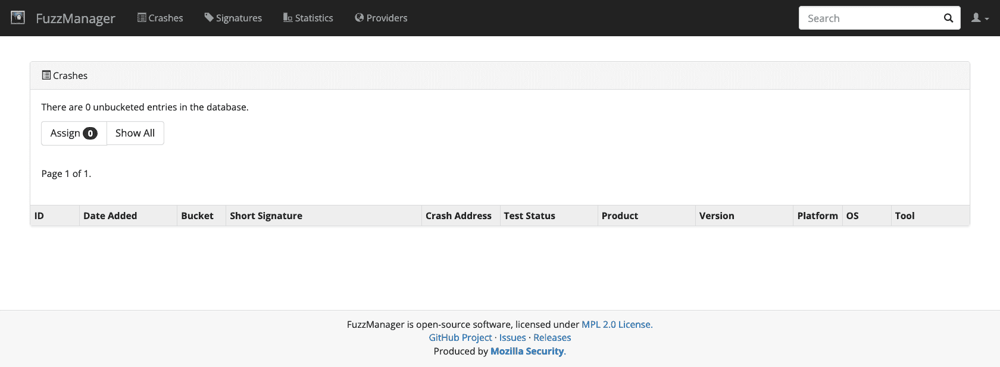
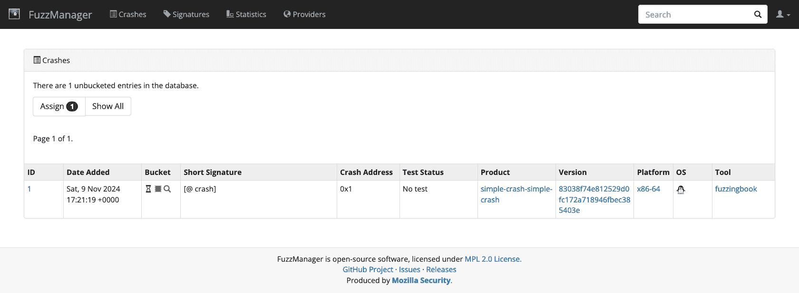
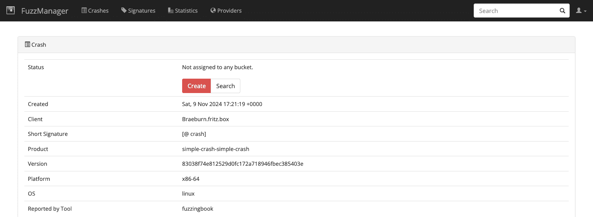
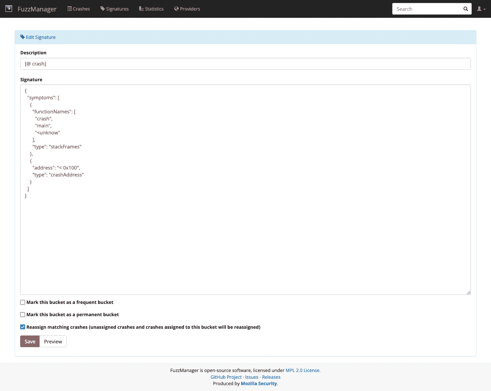
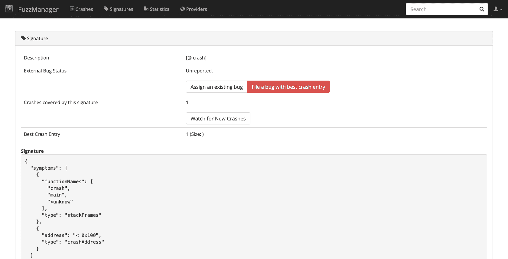
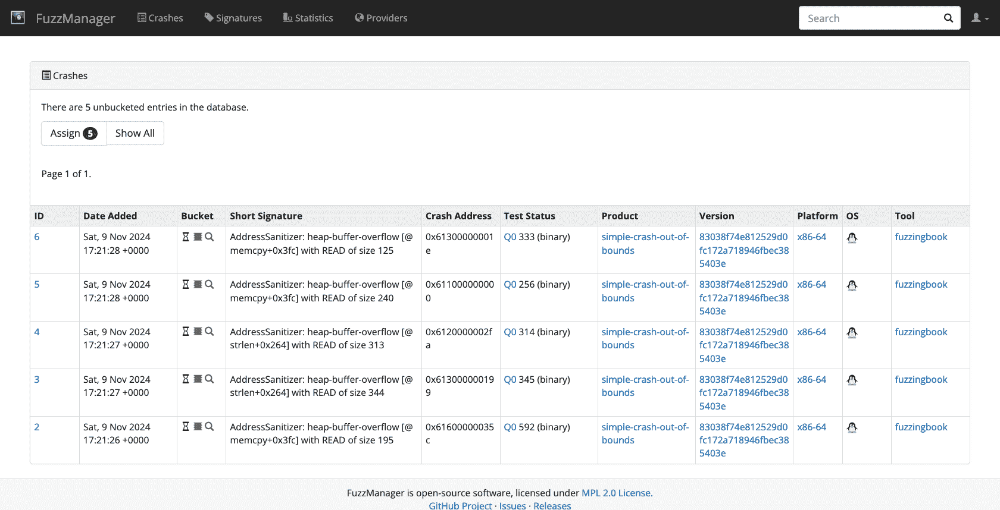
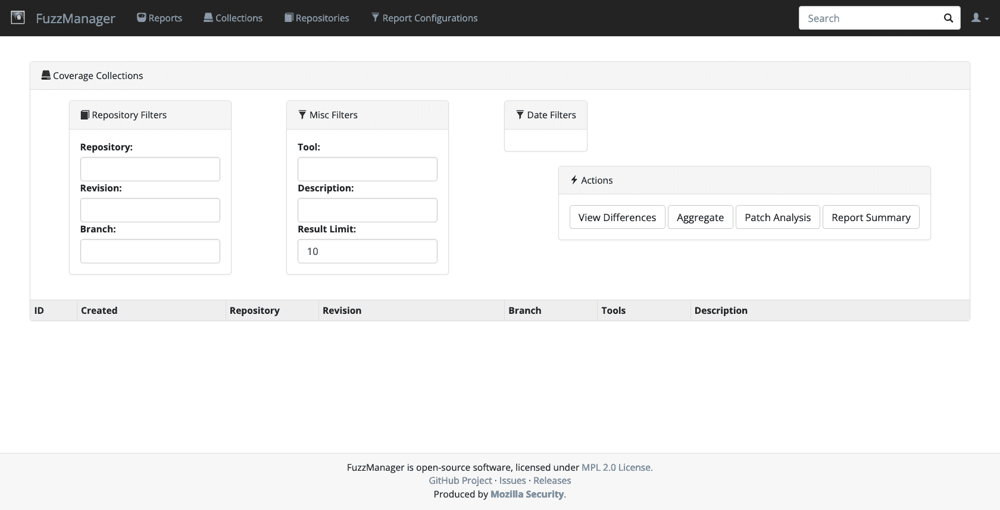
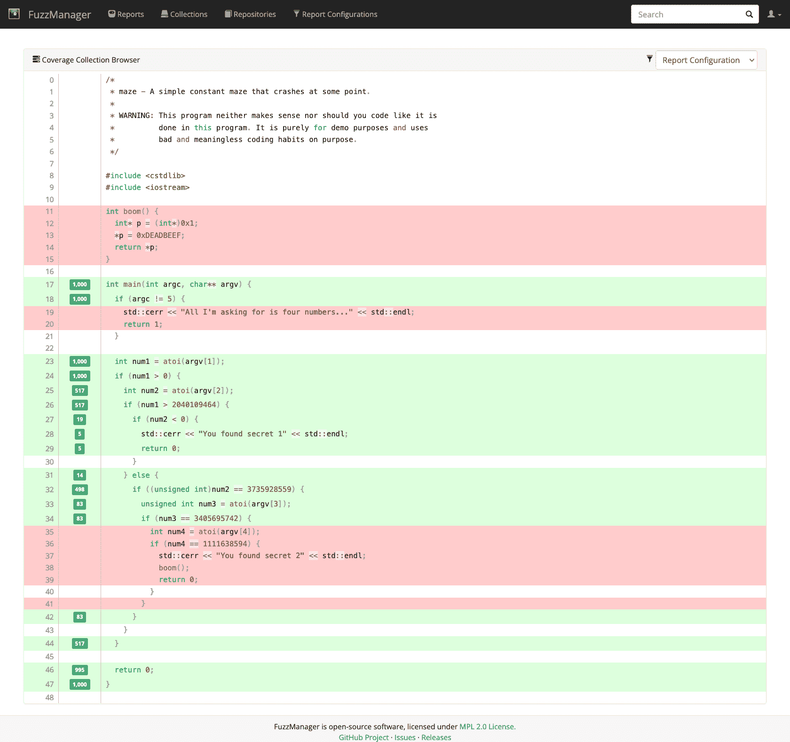

# 大规模模糊测试

> [`www.fuzzingbook.org/html/FuzzingInTheLarge.html`](http://www.fuzzingbook.org/html/FuzzingInTheLarge.html)

在过去的章节中，我们总是关注仅在一台机器上持续几秒钟的模糊测试。然而，在现实世界中，模糊器在数十台甚至数千台机器上运行；持续数小时、数天甚至数周；针对一个程序或数十个程序。在这种情况下，需要一种基础设施来从单个模糊器运行中收集失败数据，并在中央存储库中聚合这些数据。在本章中，我们将检查这样的基础设施，即 Mozilla 的*FuzzManager*框架。

**先决条件**

+   本章需要基本的测试知识，例如来自测试简介。

+   本章需要基本的模糊器分叉知识，例如来自模糊测试简介。

```py
import [bookutils.setup](https://github.com/uds-se/fuzzingbook//tree/master/notebooks/shared/bookutils) 
```

```py
import Fuzzer 
```

## 摘要

要使用本章提供的代码（导入），请编写

```py
>>> from fuzzingbook.FuzzingInTheLarge import <identifier> 
```

然后利用以下功能。

Python `FuzzManager` 包允许从大量（模糊测试的）程序中程序性地提交失败。可以查询崩溃及其详细信息，将它们收集到桶中以确保它们将得到相同的处理，还可以检索程序及其测试的覆盖率信息以进行调试。

## 从多个模糊器收集崩溃

到目前为止，我们所有的模糊测试场景都只有一个模糊器在一台机器上测试一个程序。失败会立即显示，并由启动模糊器的人快速诊断。然而，现实世界的测试是不同的。模糊测试仍然是完全自动化的；但现在，我们谈论的是多个模糊器在多台机器上测试多个程序（及其版本），产生多个必须由多个人处理的失败。这引发了如何管理所有这些活动和它们之间相互作用的问题。

协调多个模糊器的一种常见方法是拥有一个中央*存储库*，该存储库收集所有崩溃及其崩溃信息。每当模糊器检测到失败时，它通过网络连接到*崩溃服务器*，然后在该数据库中存储崩溃信息。

<svg width="578pt" height="188pt" viewBox="0.00 0.00 578.46 188.00" xmlns:xlink="http://www.w3.org/1999/xlink"><g id="graph0" class="graph" transform="scale(1 1) rotate(0) translate(4 184)"><g id="node1" class="node"><title>Crash Database</title> <text text-anchor="middle" x="285.23" y="-11.82" font-family="Times,serif" font-size="14.00">Crash Database</text></g> <g id="node2" class="node"><title>Fuzzer 1</title> <text text-anchor="middle" x="40.23" y="-155.82" font-family="Times,serif" font-size="14.00">Fuzzer 1</text></g> <g id="node3" class="node"><title>Crash Server</title> <text text-anchor="middle" x="285.23" y="-83.83" font-family="Times,serif" font-size="14.00">Crash Server</text></g> <g id="edge1" class="edge"><title>Fuzzer 1->Crash Server</title></g> <g id="edge7" class="edge"><title>Crash Server->Crash Database</title></g> <g id="node4" class="node"><title>Fuzzer 2</title> <text text-anchor="middle" x="138.23" y="-155.82" font-family="Times,serif" font-size="14.00">Fuzzer 2</text></g> <g id="edge2" class="edge"><title>Fuzzer 2->Crash Server</title></g> <g id="node5" class="node"><title>Fuzzer 3</title> <text text-anchor="middle" x="236.23" y="-155.82" font-family="Times,serif" font-size="14.00">Fuzzer 3</text></g> <g id="edge3" class="edge"><title>Fuzzer 3->Crash Server</title></g> <g id="node6" class="node"><title>Fuzzer 4</title> <text text-anchor="middle" x="334.23" y="-155.82" font-family="Times,serif" font-size="14.00">Fuzzer 4</text></g> <g id="edge4" class="edge"><title>Fuzzer 4->Crash Server</title></g> <g id="node7" class="node"><title>Fuzzer 5</title> <text text-anchor="middle" x="432.23" y="-155.82" font-family="Times,serif" font-size="14.00">Fuzzer 5</text></g> <g id="edge5" class="edge"><title>Fuzzer 5->Crash Server</title></g> <g id="node8" class="node"><title>Fuzzer 6</title> <text text-anchor="middle" x="530.23" y="-155.82" font-family="Times,serif" font-size="14.00">Fuzzer 6</text></g> <g id="edge6" class="edge"><title>Fuzzer 6->Crash Server</title></g></g></svg>

结果的崩溃数据库可以查询以找出哪些失败已发生——通常使用 Web 界面。它还可以与其他流程活动集成。最重要的是，崩溃数据库中的条目可以链接到*错误数据库*，反之亦然，这样错误（=崩溃）可以分配给个别开发者。

在这样的基础设施中，收集崩溃不仅限于模糊器。野外发生的崩溃和故障也可以自动报告给崩溃服务器。在工业界，拥有收集生产运行中数千个崩溃的崩溃数据库并不罕见——特别是如果涉及的软件每天被数百万人所使用。

这样的数据库中存储了哪些信息？

+   最重要的是产品的*标识符*——即产品名称、版本信息以及平台和操作系统。没有这些信息，开发者无法判断该错误是否仍然存在于最新版本中，或者它是否已经被修复。

+   对于调试，对开发者最有帮助的信息是*重现步骤*——在模糊测试场景中，这将是对相关程序的*输入*。（在生产场景中，出于明显的隐私原因，不会收集用户的输入。）

+   对于调试来说，第二有用的工具是*堆栈跟踪*，这样开发者可以检查在失败时刻哪些内部功能正在运行。一个*覆盖率图*也同样有用，因为开发者可以查询哪些函数被执行了，哪些没有。

+   如果收集了通用故障，开发者还需要知道预期的行为是什么；对于崩溃，这很简单，因为用户不会期望他们的软件崩溃。

如果模糊器（或相关程序）相应设置，所有这些信息都可以自动收集。

在本章中，我们将探讨一个自动化所有这些步骤的平台。*FuzzManager* 平台允许

1.  *收集*失败运行中的失败数据，

1.  *将此数据输入到集中式服务器中，并*

1.  *通过 Web 界面查询*服务器。

在本章中，我们将展示如何使用 FuzzManager 进行基本步骤，包括崩溃提交和分类以及覆盖率测量任务。

## 运行崩溃服务器

[FuzzManager](https://github.com/MozillaSecurity/FuzzManager) 是一个用于管理大规模模糊测试过程的工具链。它在某种程度上是*模块化的*，这意味着你可以使用你需要的部分；它在某种程度上是*灵活的*，因为它不强制特定的流程。它包括一个*服务器*，其任务是收集崩溃数据，以及各种*收集工具*，它们收集崩溃数据并发送到服务器。

<details id="Excursion:-Setting-up-the-Server"><summary>设置服务器</summary>

要运行这个笔记本中的示例，我们需要运行一个*崩溃服务器*——也就是说，*FuzzManager* 服务器。你可以

1.  运行你自己的服务器。为此，你需要遵循[FuzzManager](https://github.com/MozillaSecurity/FuzzManager) 页面上“服务器设置”部分列出的安装步骤。`FuzzManager` 文件夹应该与这个笔记本在同一文件夹中。

1.  让笔记本启动（并停止）服务器。以下命令会自动执行这些操作。尽管这些命令仅适用于这个笔记本，但如果你想要在自己的服务器上进行实验，请手动运行，如上所述。

```py
import [os](https://docs.python.org/3/library/os.html)
import [sys](https://docs.python.org/3/library/sys.html)
import [shutil](https://docs.python.org/3/library/shutil.html) 
```

我们首先从仓库获取最新的服务器代码。

```py
if os.path.exists('FuzzManager'):
    shutil.rmtree('FuzzManager') 
```

基础仓库是 `https://github.com/MozillaSecurity/FuzzManager`，但我们使用 `uds-se` 仓库，因为这个仓库有 FuzzManager 的 `0.4.1` 稳定版本。

```py
!git  clone  https://github.com/uds-se/FuzzManager 
```

```py
Cloning into 'FuzzManager'...
remote: Enumerating objects: 11755, done.
remote: Counting objects: 100% (11755/11755), done.
remote: Compressing objects: 100% (3726/3726), done.
remote: Total 11755 (delta 7943), reused 11674 (delta 7862), pack-reused 0 (from 0)
Receiving objects: 100% (11755/11755), 5.33 MiB | 9.57 MiB/s, done.
Resolving deltas: 100% (7943/7943), done.

```

```py
WARNING: Ignoring version 4.2.2 of celery since it has invalid metadata:
Requested celery<4.3,>=4.1.1 from https://files.pythonhosted.org/packages/24/e9/9741a5a8b83253e27293e77bd4319c84306019dfbfa4cc43fa250243c12f/celery-4.2.2-py2.py3-none-any.whl (from -r FuzzManager/server/requirements.txt (line 9)) has invalid metadata: Expected matching RIGHT_PARENTHESIS for LEFT_PARENTHESIS, after version specifier
    pytz (>dev)
         ~^
Please use pip<24.1 if you need to use this version.  WARNING: Ignoring version 4.2.1 of celery since it has invalid metadata:
Requested celery<4.3,>=4.1.1 from https://files.pythonhosted.org/packages/e8/58/2a0b1067ab2c12131b5c089dfc579467c76402475c5231095e36a43b749c/celery-4.2.1-py2.py3-none-any.whl (from -r FuzzManager/server/requirements.txt (line 9)) has invalid metadata: Expected matching RIGHT_PARENTHESIS for LEFT_PARENTHESIS, after version specifier
    pytz (>dev)
         ~^
Please use pip<24.1 if you need to use this version.  WARNING: Ignoring version 4.2.0 of celery since it has invalid metadata:
Requested celery<4.3,>=4.1.1 from https://files.pythonhosted.org/packages/ea/75/d7d1eaeb6c90c7442f7b96242a6d4ebcf1cf075f9c51957d061fb8264d24/celery-4.2.0-py2.py3-none-any.whl (from -r FuzzManager/server/requirements.txt (line 9)) has invalid metadata: Expected matching RIGHT_PARENTHESIS for LEFT_PARENTHESIS, after version specifier
    pytz (>dev)
         ~^
Please use pip<24.1 if you need to use this version.  WARNING: Ignoring version 4.1.1 of celery since it has invalid metadata:
Requested celery<4.3,>=4.1.1 from https://files.pythonhosted.org/packages/99/fa/4049b26bfe71992ecf979acd39b87e55b493608613054089d975418015b7/celery-4.1.1-py2.py3-none-any.whl (from -r FuzzManager/server/requirements.txt (line 9)) has invalid metadata: Expected matching RIGHT_PARENTHESIS for LEFT_PARENTHESIS, after version specifier
    pytz (>dev)
         ~^
Please use pip<24.1 if you need to use this version.  ERROR: Ignored the following yanked versions: 5.0.6, 5.2.5  ERROR: Could not find a version that satisfies the requirement celery<4.3,>=4.1.1 (from versions: 0.1.2, 0.1.4, 0.1.6, 0.1.7, 0.1.8, 0.1.10, 0.1.11, 0.1.12, 0.1.13, 0.1.14, 0.1.15, 0.2.0, 0.3.0, 0.3.7, 0.3.20, 0.4.0, 0.4.1, 0.6.0, 0.8.0, 0.8.1, 0.8.2, 0.8.3, 0.8.4, 1.0.0, 1.0.1, 1.0.2, 1.0.3, 1.0.4, 1.0.5, 1.0.6, 2.0.0, 2.0.1, 2.0.2, 2.0.3, 2.1.0, 2.1.1, 2.1.2, 2.1.3, 2.1.4, 2.2.0, 2.2.1, 2.2.2, 2.2.3, 2.2.4, 2.2.5, 2.2.6, 2.2.7, 2.2.8, 2.2.9, 2.2.10, 2.3.0, 2.3.1, 2.3.2, 2.3.3, 2.3.4, 2.3.5, 2.4.0, 2.4.1, 2.4.2, 2.4.3, 2.4.4, 2.4.5, 2.4.6, 2.4.7, 2.5.0, 2.5.1, 2.5.2, 2.5.3, 2.5.5, 3.0.0, 3.0.1, 3.0.2, 3.0.3, 3.0.4, 3.0.5, 3.0.6, 3.0.7, 3.0.8, 3.0.9, 3.0.10, 3.0.11, 3.0.12, 3.0.13, 3.0.14, 3.0.15, 3.0.16, 3.0.17, 3.0.18, 3.0.19, 3.0.20, 3.0.21, 3.0.22, 3.0.23, 3.0.24, 3.0.25, 3.1.0, 3.1.1, 3.1.2, 3.1.3, 3.1.4, 3.1.5, 3.1.6, 3.1.7, 3.1.8, 3.1.9, 3.1.10, 3.1.11, 3.1.12, 3.1.13, 3.1.14, 3.1.15, 3.1.16, 3.1.17, 3.1.18, 3.1.19, 3.1.20, 3.1.21, 3.1.22, 3.1.23, 3.1.24, 3.1.25, 3.1.26.post1, 3.1.26.post2, 4.0.0rc3, 4.0.0rc4, 4.0.0rc5, 4.0.0rc6, 4.0.0rc7, 4.0.0, 4.0.1, 4.0.2, 4.1.0, 4.1.1, 4.2.0rc1, 4.2.0rc2, 4.2.0rc3, 4.2.0rc4, 4.2.0, 4.2.1, 4.2.2, 4.3.0rc1, 4.3.0rc2, 4.3.0rc3, 4.3.0, 4.3.1, 4.4.0rc1, 4.4.0rc2, 4.4.0rc3, 4.4.0rc4, 4.4.0rc5, 4.4.0, 4.4.1, 4.4.2, 4.4.3, 4.4.4, 4.4.5, 4.4.6, 4.4.7, 5.0.0a1, 5.0.0a2, 5.0.0b1, 5.0.0rc1, 5.0.0rc2, 5.0.0rc3, 5.0.0, 5.0.1, 5.0.2, 5.0.3, 5.0.4, 5.0.5, 5.1.0b1, 5.1.0b2, 5.1.0rc1, 5.1.0, 5.1.1, 5.1.2, 5.2.0b1, 5.2.0b2, 5.2.0b3, 5.2.0rc1, 5.2.0rc2, 5.2.0, 5.2.1, 5.2.2, 5.2.3, 5.2.4, 5.2.6, 5.2.7, 5.3.0a1, 5.3.0b1, 5.3.0b2, 5.3.0rc1, 5.3.0rc2, 5.3.0, 5.3.1, 5.3.4, 5.3.5, 5.3.6, 5.4.0rc1, 5.4.0rc2, 5.4.0, 5.5.0b1, 5.5.0b2, 5.5.0b3, 5.5.0b4, 5.5.0rc1)  ERROR: No matching distribution found for celery<4.3,>=4.1.1  

```

```py
!cd  FuzzManager;  {sys.executable}  server/manage.py  migrate  >  /dev/null 
```

我们使用[这个实用的技巧](https://stackoverflow.com/questions/6244382/how-to-automate-createsuperuser-on-django)创建了一个名为`demo`的用户，密码也是`demo`。

```py
!(cd  FuzzManager;  echo  "from django.contrib.auth import get_user_model; User = get_user_model(); User.objects.create_superuser('demo', 'demo@fuzzingbook.org', 'demo')"  |  {sys.executable}  server/manage.py  shell) 
```

我们为这个用户创建了一个令牌。这个令牌将后来被用于自动命令进行身份验证。

```py
import [subprocess](https://docs.python.org/3/library/subprocess.html)
import [sys](https://docs.python.org/3/library/sys.html) 
```

```py
os.chdir('FuzzManager')
result = subprocess.run(['python', 
                         'server/manage.py',
                         'get_auth_token',
                         'demo'], 
                        stdout=subprocess.PIPE,
                        stderr=subprocess.PIPE)
os.chdir('..')

err = result.stderr.decode('ascii')
if len(err) > 0:
    print(err, file=sys.stderr, end="") 
```

```py
token = result.stdout
token = token.decode('ascii').strip()
token 
```

```py
'5371d2409244c4a7ad22874ffab40c9c4d2b4883'

```

令牌存储在我们主目录下的`~/.fuzzmanagerconf`中。这是完整的配置：

```py
[Main]
sigdir  =  /home/example/fuzzingbook
serverhost  =  127.0.0.1
serverport  =  8000
serverproto  =  http
serverauthtoken  =  5371d2409244c4a7ad22874ffab40c9c4d2b4883
tool  =  fuzzingbook

``` <details> <details id="Excursion:-Starting-the-Server"><summary>启动服务器</summary>

服务器设置好后，我们可以启动它。在命令行中，我们使用

```py
$  cd  FuzzManager;  python  server/manage.py  runserver 
```

在我们的笔记本中，我们可以使用为模糊测试 Web 服务器引入的`Process`框架来程序化地完成这个操作。我们让 FuzzManager 服务器在自己的进程中运行，我们在后台启动它。

对于多进程，我们使用`multiprocess`模块——这是标准 Python `multiprocessing`模块的一个变体，它也可以在笔记本中使用。如果你在笔记本之外运行此代码，你也可以使用`multiprocessing`。

```py
from [multiprocess](https://pypi.org/project/multiprocess/) import Process 
```

```py
import [subprocess](https://docs.python.org/3/library/subprocess.html) 
```

```py
def run_fuzzmanager():
    def run_fuzzmanager_forever():
        os.chdir('FuzzManager')
        proc = subprocess.Popen(['python', 'server/manage.py',
                                 'runserver'],
                                stdout=subprocess.PIPE,
                                stdin=subprocess.PIPE,
                                stderr=subprocess.STDOUT,
                                universal_newlines=True)

        while True:
            line = proc.stdout.readline()
            print(line, end='')

    fuzzmanager_process = Process(target=run_fuzzmanager_forever)
    fuzzmanager_process.start()

    return fuzzmanager_process 
```

当服务器运行时，你将能够在下面看到它的输出。

```py
fuzzmanager_process = run_fuzzmanager() 
```

```py
import [time](https://docs.python.org/3/library/time.html) 
```

```py
# wait a bit after interactions
DELAY_AFTER_START = 3
DELAY_AFTER_CLICK = 1.5 
```

```py
time.sleep(DELAY_AFTER_START) 
``` <details>

### 登录

现在服务器已经启动并运行，可以通过这个 URL 在本地主机上访问*FuzzManager*。

```py
fuzzmanager_url = "http://127.0.0.1:8000" 
```

要登录，请使用用户名`demo`和密码`demo`。在这个笔记本中，我们通过使用在关于 GUI 模糊测试的章节中引入的*Selenium*接口来程序化地完成这个操作。

```py
from [IPython.display](https://ipython.readthedocs.io/en/stable/api/generated/IPython.display.html) import display, Image 
```

```py
from [bookutils](https://github.com/uds-se/fuzzingbook//tree/master/notebooks/shared/bookutils) import HTML, rich_output 
```

```py
from GUIFuzzer import start_webdriver  # minor dependency 
```

对于交互式会话，将`headless`设置为`False`；然后你可以在与这个笔记本交互的同时与`FuzzManager`交互。

```py
gui_driver = start_webdriver(headless=True, zoom=1.2) 
```

```py
gui_driver.set_window_size(1400, 600) 
```

```py
gui_driver.get(fuzzmanager_url) 
```

这是`FuzzManager`的起始屏幕：


我们现在通过发送`demo`作为用户名和密码进行登录，然后点击`登录`按钮。

登录后，我们发现数据库是空的。一旦我们收集了崩溃，崩溃就会出现在这里。



## 收集崩溃

要填充我们的数据库，我们需要一些崩溃。让我们看看`simply-buggy`，这是一个包含用于说明目的的简单 C++程序的示例仓库。

```py
!git  clone  https://github.com/uds-se/simply-buggy 
```

```py
Cloning into 'simply-buggy'...
remote: Enumerating objects: 22, done.
remote: Total 22 (delta 0), reused 0 (delta 0), pack-reused 22 (from 1)
Receiving objects: 100% (22/22), 4.90 KiB | 4.90 MiB/s, done.
Resolving deltas: 100% (9/9), done.

```

`make`命令编译我们的目标程序，包括我们的第一个目标，即*simple-crash*示例。与程序一起，还有一个生成的配置文件。

```py
!(cd  simply-buggy  &&  make) 
```

```py
clang++ -fsanitize=address -g -o maze maze.cpp
clang++ -fsanitize=address -g -o out-of-bounds out-of-bounds.cpp
clang++ -fsanitize=address -g -o simple-crash simple-crash.cpp

```

让我们看看`simple-crash`的源代码，它在`simple-crash.cpp`中。如你所见，源代码相当简单：通过写入一个(near)-NULL 指针强制崩溃。这应该在大多数机器上立即崩溃。

```py
/*
 * simple-crash - A simple NULL crash.
 *
 * WARNING: This program neither makes sense nor should you code like it is
 *          done in this program. It is purely for demo purposes and uses
 *          bad and meaningless coding habits on purpose.
 */

int  crash()  {
  int*  p  =  (int*)0x1;
  *p  =  0xDEADBEEF;
  return  *p;
}

int  main(int  argc,  char**  argv)  {
  return  crash();
}

```

为生成的二进制文件生成的配置文件`simple-crash.fuzzmanagerconf`也包含一些直接的信息，例如程序的版本和其他在提交崩溃时需要或至少有用的元数据。

```py
[Main]
platform  =  x86-64
product  =  simple-crash-simple-crash
product_version  =  83038f74e812529d0fc172a718946fbec385403e
os  =  linux

[Metadata]
pathPrefix  =  /Users/zeller/Projects/fuzzingbook/notebooks/simply-buggy/
buildFlags  =  -fsanitize=address -g

```

让我们运行这个程序！正如预期的那样，我们立即得到了一个崩溃跟踪：

```py
!simply-buggy/simple-crash 
```

```py
simple-crash(47892,0x1fd223840) malloc: nano zone abandoned due to inability to reserve vm space.
AddressSanitizer:DEADLYSIGNAL
=================================================================
==47892==ERROR: AddressSanitizer: SEGV on unknown address 0x000000000001 (pc 0x0001005c3e0c bp 0x00016f83ea10 sp 0x00016f83e9d0 T0) ==47892==The signal is caused by a WRITE memory access.
==47892==Hint: address points to the zero page.
    #0 0x1005c3e0c in crash() simple-crash.cpp:11
    #1 0x1005c3e94 in main simple-crash.cpp:16
    #2 0x197d8c270  (<unknown module>)

==47892==Register values:
 x[0] = 0x0000000000000001   x[1] = 0x000000016f83ec98   x[2] = 0x000000016f83eca8   x[3] = 0x000000016f83ef08  
 x[4] = 0x0000000000000001   x[5] = 0x0000000000000000   x[6] = 0x0000000000000000   x[7] = 0x00000000000004a0  
 x[8] = 0x0000007000020000   x[9] = 0x00000000deadbeef  x[10] = 0x0000000000000001  x[11] = 0x000000016f83e9d0  
x[12] = 0x0000000000001170  x[13] = 0x0000000100008000  x[14] = 0x0000000000004000  x[15] = 0x00000001a5bcef55  
x[16] = 0x0000000198141344  x[17] = 0x0000000205482578  x[18] = 0x0000000000000000  x[19] = 0x00000001fcf8c050  
x[20] = 0x00000001fcf8c0a0  x[21] = 0x00000001fcf8c050  x[22] = 0x000000016f83eb28  x[23] = 0x000000016f83eb28  
x[24] = 0x0000000197d86000  x[25] = 0x0000000000000000  x[26] = 0x0000000000000000  x[27] = 0x0000000000000000  
x[28] = 0x0000000000000000     fp = 0x000000016f83ea10     lr = 0x00000001005c3e98     sp = 0x000000016f83e9d0  
AddressSanitizer can not provide additional info.
SUMMARY: AddressSanitizer: SEGV simple-crash.cpp:11 in crash()
==47892==ABORTING

```

现在，我们实际上想做的就是从 Python 运行这个二进制文件，检测它是否崩溃，收集跟踪信息并将其提交到服务器。让我们从一个简单的脚本开始，这个脚本只会运行我们给它提供的程序并检测 ASan 跟踪的存在：

```py
import [subprocess](https://docs.python.org/3/library/subprocess.html) 
```

```py
cmd = ["simply-buggy/simple-crash"] 
```

```py
result = subprocess.run(cmd, stderr=subprocess.PIPE)
stderr = result.stderr.decode().splitlines()
crashed = False

for line in stderr:
    if "ERROR: AddressSanitizer" in line:
        crashed = True
        break

if crashed:
    print("Yay, we crashed!")
else:
    print("Move along, nothing to see...") 
```

```py
Yay, we crashed!

```

使用这个脚本，我们现在可以运行二进制文件，并且确实检测到它崩溃了。但是，我们如何将这条信息发送到崩溃服务器呢？让我们从 *FuzzManager* 工具箱中添加一些功能。

### 程序配置

一个 `ProgramConfiguration` 主要是一个容器类，存储着程序的各种属性，例如产品名称、平台、版本和运行时选项。默认情况下，它从为测试程序创建的 `.fuzzmanagerconf` 文件中读取信息。

```py
sys.path.append('FuzzManager') 
```

```py
from FTB.ProgramConfiguration import ProgramConfiguration 
```

```py
configuration = ProgramConfiguration.fromBinary('simply-buggy/simple-crash')
(configuration.product, configuration.platform) 
```

```py
('simple-crash-simple-crash', 'x86-64')

```

### 崩溃信息

一个 `CrashInfo` 对象存储了有关崩溃的所有必要数据，包括

+   你的程序的 stdout 输出

+   你的程序的 stderr 输出

+   由 GDB 或 AddressSanitizer 生成的崩溃信息

+   一个 `ProgramConfiguration` 实例

```py
from FTB.Signatures.CrashInfo import CrashInfo 
```

让我们收集 `simply-crash` 运行的信息：

```py
cmd = ["simply-buggy/simple-crash"]
result = subprocess.run(cmd, stderr=subprocess.PIPE, stdout=subprocess.PIPE) 
```

```py
stderr = result.stderr.decode().splitlines()
stderr[0:3] 
```

```py
['AddressSanitizer:DEADLYSIGNAL',
 '=================================================================',
 '==47914==ERROR: AddressSanitizer: SEGV on unknown address 0x000000000001 (pc 0x000102897e0c bp 0x00016d56aab0 sp 0x00016d56aa70 T0)']

```

```py
stdout = result.stdout.decode().splitlines()
stdout 
```

```py
[]

```

这将读取并解析我们的 ASan 跟踪到更通用的格式，返回给我们一个通用的 `CrashInfo` 对象，我们可以检查并将其提交到服务器：

```py
crashInfo = CrashInfo.fromRawCrashData(stdout, stderr, configuration)
print(crashInfo) 
```

```py
Crash trace:

# 00    crash
# 01    main
# 02    <unknow

Crash address: 0x1

Last 5 lines on stderr:
x[24] = 0x0000000197d86000  x[25] = 0x0000000000000000  x[26] = 0x0000000000000000  x[27] = 0x0000000000000000  
x[28] = 0x0000000000000000     fp = 0x000000016d56aab0     lr = 0x0000000102897e98     sp = 0x000000016d56aa70  
AddressSanitizer can not provide additional info.
SUMMARY: AddressSanitizer: SEGV simple-crash.cpp:11 in crash()
==47914==ABORTING

```

### 收集器

最后一步是将崩溃信息发送到我们的崩溃管理器。`Collector` 是一个与崩溃管理器服务器通信的功能。Collector 提供了一个简单的客户端接口，允许你的客户端提交崩溃以及下载和匹配现有签名以避免重复报告频繁的问题。

```py
from Collector.Collector import Collector 
```

我们实例化了收集器实例；这将是我们与服务器通信的入口点。

```py
collector = Collector() 
```

要提交崩溃信息，我们使用收集器的 `submit()` 方法：

```py
collector.submit(crashInfo) 
```

```py
{'rawStdout': '',
 'rawStderr': 'AddressSanitizer:DEADLYSIGNAL\n=================================================================\n==47914==ERROR: AddressSanitizer: SEGV on unknown address 0x000000000001 (pc 0x000102897e0c bp 0x00016d56aab0 sp 0x00016d56aa70 T0)\n==47914==The signal is caused by a WRITE memory access.\n==47914==Hint: address points to the zero page.\n    #0 0x102897e0c in crash() simple-crash.cpp:11\n    #1 0x102897e94 in main simple-crash.cpp:16\n    #2 0x197d8c270  (<unknown module>)\n\n==47914==Register values:\n x[0] = 0x0000000000000001   x[1] = 0x000000016d56ad30   x[2] = 0x000000016d56ad40   x[3] = 0x000000016d56af90  \n x[4] = 0x0000000000000001   x[5] = 0x0000000000000000   x[6] = 0x0000000000000000   x[7] = 0x00000000000004a0  \n x[8] = 0x0000007000020000   x[9] = 0x00000000deadbeef  x[10] = 0x0000000000000001  x[11] = 0x000000016d56aa70  \nx[12] = 0x0000000000001170  x[13] = 0x0000000100008000  x[14] = 0x0000000000004000  x[15] = 0x00000001a5bcef55  \nx[16] = 0x0000000198141344  x[17] = 0x0000000205482578  x[18] = 0x0000000000000000  x[19] = 0x00000001fcf8c050  \nx[20] = 0x00000001fcf8c0a0  x[21] = 0x00000001fcf8c050  x[22] = 0x000000016d56abc8  x[23] = 0x000000016d56abc8  \nx[24] = 0x0000000197d86000  x[25] = 0x0000000000000000  x[26] = 0x0000000000000000  x[27] = 0x0000000000000000  \nx[28] = 0x0000000000000000     fp = 0x000000016d56aab0     lr = 0x0000000102897e98     sp = 0x000000016d56aa70  \nAddressSanitizer can not provide additional info.\nSUMMARY: AddressSanitizer: SEGV simple-crash.cpp:11 in crash()\n==47914==ABORTING',
 'rawCrashData': '',
 'metadata': '{"pathPrefix": "/Users/zeller/Projects/fuzzingbook/notebooks/simply-buggy/", "buildFlags": "-fsanitize=address -g"}',
 'testcase_size': 0,
 'testcase_quality': 0,
 'testcase_isbinary': False,
 'platform': 'x86-64',
 'product': 'simple-crash-simple-crash',
 'product_version': '83038f74e812529d0fc172a718946fbec385403e',
 'os': 'linux',
 'client': 'Braeburn.fritz.box',
 'tool': 'fuzzingbook',
 'env': '',
 'args': '',
 'bucket': None,
 'id': 1,
 'shortSignature': '[@ crash]',
 'crashAddress': '0x1'}

```

### 检查崩溃

我们现在已向本地的 FuzzManager 演示实例提交了一些内容。如果你在本地机器上运行崩溃服务器，你可以访问 [`127.0.0.1:8000/crashmanager/crashes/`](http://127.0.0.1:8000/crashmanager/crashes/)，你应该能看到刚刚提交的崩溃信息。你可以查询产品、版本、操作系统以及进一步的崩溃详情。



如果你点击崩溃 ID，你可以进一步检查提交的数据。



由于 `Collector` 可以从任何程序中调用（只要它们配置为与正确的服务器通信），你现在可以从任何地方收集崩溃——远程机器上的模糊器、测试期间发生的崩溃，甚至生产期间的崩溃。

## 崩溃桶

收集崩溃的一个挑战是*相同的崩溃会多次发生*。如果一个产品掌握在数百万用户手中，那么成千上万的用户可能会遇到相同的错误，因此相同的崩溃。因此，数据库将包含成千上万的条目，它们都是由同一个错误引起的。因此，有必要识别那些*相似*的失败，并将它们分组在一个称为*崩溃桶*或简称为*桶*的集合中。

在*FuzzManager*中，一个桶是通过一个*崩溃签名*定义的，这是一个匹配一组错误的谓词列表。这样的谓词可以引用许多功能，其中最重要的是

+   当前的*程序计数器*，报告崩溃时刻执行的指令；

+   来自*堆栈跟踪*的元素，显示在崩溃时刻哪些函数是活动的。

我们可以在查看单个崩溃时立即创建这样的签名：


点击红色`创建`按钮为这个崩溃创建一个桶。一个*崩溃签名*将被提出以匹配这个和未来相同类型的崩溃：



通过点击*保存*来接受它。

您将被重定向到新创建的桶，它显示了大小（包含多少个崩溃）、其错误报告状态（桶可以链接到像 Bugzilla 这样的外部错误跟踪器）以及许多其他有用的信息。

### 崩溃签名

如果您点击顶部菜单中的*签名*条目，您也应该看到您新创建的条目。



您可以看到这个签名指的是在从`main()`调用时（duh！）在`start()`（一个内部 OS 函数）中发生的函数`crash()`的崩溃。我们还看到了当前的崩溃地址。

桶和它们的签名是 FuzzManager 中的一个核心概念。如果您从多个来源收到大量的崩溃报告，桶化可以轻松地对崩溃进行分组并过滤重复项。

### 粗粒度签名

灵活的签名系统最初从一个最初提出的细粒度签名开始，但可以根据需要调整以捕获相同错误的*变体*并使跟踪更容易。

在下一个示例中，我们将查看一个更复杂的示例，该示例从文件中读取数据并创建多个崩溃签名 - 一个名为`out-of-bounds.cpp`的文件：

```py
/*
 * out-of-bounds - A simple multi-signature out-of-bounds demo.
 *
 * WARNING: This program neither makes sense nor should you code like it is
 *          done in this program. It is purely for demo purposes and uses
 *          bad and meaningless coding habits on purpose.
 */
#include  <cstring>
#include  <fstream>
#include  <iostream>

void  printFirst(char*  data,  size_t  count)  {
  std::string  first(data,  count);
  std::cout  <<  first  <<  std::endl;
}

void  printLast(char*  data,  size_t  count)  {
  std::string  last(data  +  strlen(data)  -  count,  count);
  std::cout  <<  last  <<  std::endl;
}

int  validateAndPerformAction(char*  buffer,  size_t  size)  {
  if  (size  <  2)  {
  std::cerr  <<  "Buffer is too short."  <<  std::endl;
  return  1;
  }

  uint8_t  action  =  buffer[0];
  uint8_t  count  =  buffer[1];
  char*  data  =  buffer  +  2;

  if  (!count)  {
  std::cerr  <<  "count must be non-zero."  <<  std::endl;
  return  1;
  }

  // Forgot to check count vs. the length of data here, doh!

  if  (!action)  {
  std::cerr  <<  "Action can't be zero."  <<  std::endl;
  return  1;
  }  else  if  (action  >=  128)  {
  printLast(data,  count);
  return  0;
  }  else  {
  printFirst(data,  count);
  return  0;
  }
}

int  main(int  argc,  char**  argv)  {
  if  (argc  <  2)  {
  std::cerr  <<  "Usage is: "  <<  argv[0]  <<  " <file>"  <<  std::endl;
  exit(1);
  }

  std::ifstream  input(argv[1],  std::ifstream::binary);
  if  (!input)  {
  std::cerr  <<  "Error opening file."  <<  std::endl;
  exit(1);
  }

  input.seekg(0,  input.end);
  int  size  =  input.tellg();
  input.seekg(0,  input.beg);

  if  (size  <  0)  {
  std::cerr  <<  "Error seeking in file."  <<  std::endl;
  exit(1);
  }

  char*  buffer  =  new  char[size];
  input.read(buffer,  size);

  if  (!input)  {
  std::cerr  <<  "Error while reading file."  <<  std::endl;
  exit(1);
  }

  int  ret  =  validateAndPerformAction(buffer,  size);

  delete[]  buffer;
  return  ret;
}

```

与上一个程序相比，这个程序看起来更复杂，但不用担心，它实际上并没有做很多：

+   `main()`函数中的代码只是读取命令行上提供的文件，并将内容放入传递给`validateAndPerformAction()`的缓冲区中。

+   `validateAndPerformAction()`函数从缓冲区中提取两个字节（`action`和`count`），并将剩余的部分视为`data`。根据`action`的值，它随后调用`printFirst()`或`printLast()`，分别打印`data`的前`count`个字节或最后一个`count`个字节。

如果这听起来毫无意义，那是因为它确实如此。这个程序的全部想法是，在`validateAndPerformAction()`中缺少安全检查（即`count`不大于`data`的长度），但非法访问发生在两个打印函数中的任何一个之后。因此，我们预计这个程序将生成至少两个（略有不同）的崩溃签名——一个使用`printFirst()`，另一个使用`printLast()`。

让我们尝试使用基于最后一个 Python 脚本的非常简单的模糊测试来测试它。

由于*FuzzManager*在处理输入中的 8 位字符时可能会遇到问题，我们引入了一个`escapelines()`函数，该函数将文本转换为可打印的 ASCII 字符。

<details id="Excursion:-escapelines()-implementatipn"><summary>`escapelines()`实现</summary>

```py
def isascii(s):
    return all([0 <= ord(c) <= 127 for c in s]) 
```

```py
isascii('Hello,') 
```

```py
True

```

```py
def escapelines(bytes):
    def ascii_chr(byte):
        if 0 <= byte <= 127:
            return chr(byte)
        return r"\x%02x" % byte

    def unicode_escape(line):
        ret = "".join(map(ascii_chr, line))
        assert isascii(ret)
        return ret

    return [unicode_escape(line) for line in bytes.splitlines()] 
```

```py
escapelines(b"Hello,\nworld!") 
```

```py
['Hello,', 'world!']

```

```py
escapelines(b"abc\xffABC") 
```

```py
['abc\\xffABC']

```</details>

现在来看实际的脚本。如上所述，我们设置了一个收集器，每当发生崩溃时，它都会收集并发送崩溃信息。

```py
cmd = ["simply-buggy/out-of-bounds"]

# Connect to crash server
collector = Collector()

random.seed(2048)

crash_count = 0
TRIALS = 20

for itnum in range(0, TRIALS):
    rand_len = random.randint(1, 1024)
    rand_data = bytes([random.randrange(0, 256) for i in range(rand_len)])

    (fd, current_file) = tempfile.mkstemp(prefix="fuzztest", text=True)
    os.write(fd, rand_data)
    os.close(fd)

    current_cmd = []
    current_cmd.extend(cmd)
    current_cmd.append(current_file)

    result = subprocess.run(current_cmd,
                            stdout=subprocess.PIPE,
                            stderr=subprocess.PIPE)
    stdout = []   # escapelines(result.stdout)
    stderr = escapelines(result.stderr)
    crashed = False

    for line in stderr:
        if "ERROR: AddressSanitizer" in line:
            crashed = True
            break

    print(itnum, end=" ")

    if crashed:
        sys.stdout.write("(Crash) ")

        # This reads the simple-crash.fuzzmanagerconf file
        configuration = ProgramConfiguration.fromBinary(cmd[0])

        # This reads and parses our ASan trace into a more generic format,
        # returning us a generic "CrashInfo" object that we can inspect
        # and/or submit to the server.
        crashInfo = CrashInfo.fromRawCrashData(stdout, stderr, configuration)

        # Submit the crash
        collector.submit(crashInfo, testCase = current_file)

        crash_count += 1

    os.remove(current_file)

print("")
print("Done, submitted %d crashes after %d runs." % (crash_count, TRIALS)) 
```

```py
0 (Crash) 1 2 (Crash) 3 4 5 6 7 8 (Crash) 9 10 11 12 (Crash) 13 14 (Crash) 15 16 17 18 19 
Done, submitted 5 crashes after 20 runs.

```

如果您运行此脚本，您将看到其进度并注意到它产生了相当多的崩溃。确实，如果您访问[FuzzManager 崩溃页面](http://127.0.0.1:8000/crashmanager/crashes/)，您将注意到已经积累了许多不同类型的崩溃：



选择第一个崩溃并为它创建一个桶，就像您上次做的那样。保存后，您会注意到并非所有的崩溃都进入了桶。原因是我们的程序创建了几个不同的堆栈，它们在某种程度上相似但并不完全相同。这在模糊测试现实世界应用程序时是一个常见问题。

幸运的是，有一种简单的方法来处理这个问题。当您在桶页面上时，点击桶的*优化*按钮。FuzzManager 将自动建议您更改签名。通过点击`Edit with Changes`然后`Save`来接受更改。重复这些步骤，直到所有崩溃都成为桶的一部分。经过 3 到 4 次迭代后，您的签名可能看起来像这样：

```py
{
  "symptoms":  [
  {
  "type":  "output",
  "src":  "stderr",
  "value":  "/ERROR: AddressSanitizer: heap-buffer-overflow/"
  },
  {
  "type":  "stackFrames",
  "functionNames":  [
  "?",
  "?",
  "?",
  "validateAndPerformAction",
  "main",
  "__libc_start_main",
  "_start"
  ]
  },
  {
  "type":  "crashAddress",
  "address":  "> 0xFF"
  }
  ]
} 
```

如您在`stackFrames`签名症状中看到的，`validateAndPerformAction`函数仍然存在于堆栈帧中，因为此函数在所有崩溃的所有堆栈跟踪中都是通用的；实际上，这就是错误所在。但是，较低的堆栈部分已经被泛化为任意函数（`?`），因为它们在提交的崩溃集中各不相同。

`Optimize` 函数旨在尽可能自动化这个过程：它尝试通过适应未分类的崩溃来扩展签名，然后检查修改后的签名是否会触及其他现有桶。这个假设是其他桶确实是其他错误，即如果您首先从崩溃中创建了两个桶，优化将不再工作。此外，如果现有的桶数据稀疏，并且您有很多未分类的崩溃，算法可能会提出包含同一桶中不同错误崩溃的更改。无法完全自动检测和防止这种情况，因此该过程是半自动化的，需要您审查所有建议的更改。

## 收集代码覆盖率

在 覆盖率章节中，我们看到了如何测量代码覆盖率可以有助于评估模糊器性能。代码覆盖率中的漏洞可以揭示特别难以到达的位置以及模糊器本身的错误。因为这是整体模糊操作的重要部分，FuzzManager 支持可视化存储库的 *每个模糊覆盖率* – 即，我们可以交互式地 *检查* 在模糊过程中哪些代码被覆盖了，哪些没有被覆盖。

为了说明在 *FuzzManager* 中的覆盖率收集和可视化，我们来看一个简单的 C++ 程序，`maze.cpp` 示例：

```py
/*
 * maze - A simple constant maze that crashes at some point.
 *
 * WARNING: This program neither makes sense nor should you code like it is
 *          done in this program. It is purely for demo purposes and uses
 *          bad and meaningless coding habits on purpose.
 */

#include  <cstdlib>
#include  <iostream>

int  boom()  {
  int*  p  =  (int*)0x1;
  *p  =  0xDEADBEEF;
  return  *p;
}

int  main(int  argc,  char**  argv)  {
  if  (argc  !=  5)  {
  std::cerr  <<  "All I'm asking for is four numbers..."  <<  std::endl;
  return  1;
  }

  int  num1  =  atoi(argv[1]);
  if  (num1  >  0)  {
  int  num2  =  atoi(argv[2]);
  if  (num1  >  2040109464)  {
  if  (num2  <  0)  {
  std::cerr  <<  "You found secret 1"  <<  std::endl;
  return  0;
  }
  }  else  {
  if  ((unsigned  int)num2  ==  3735928559)  {
  unsigned  int  num3  =  atoi(argv[3]);
  if  (num3  ==  3405695742)  {
  int  num4  =  atoi(argv[4]);
  if  (num4  ==  1111638594)  {
  std::cerr  <<  "You found secret 2"  <<  std::endl;
  boom();
  return  0;
  }
  }
  }
  }
  }

  return  0;
}

```

如您所见，这个程序所做的只是从命令行读取一些数字，将它们与一些魔法常数和任意标准进行比较，如果一切顺利，您就会达到程序中的两个秘密之一。达到这些秘密之一也会触发一个失败。

在我们开始这个程序的工作之前，我们重新编译程序以支持覆盖率。为了使用 Clang 或 GCC 生成代码覆盖率，程序通常需要使用特殊的 `CFLAGS`，如 `--coverage` 来构建和链接。在我们的例子中，Makefile 会为我们完成这项工作：

```py
!(cd  simply-buggy  &&  make  clean  &&  make  coverage) 
```

```py
rm -f ./maze ./out-of-bounds ./simple-crash
clang++ -fsanitize=address -g --coverage -o maze maze.cpp
clang++ -fsanitize=address -g --coverage -o out-of-bounds out-of-bounds.cpp
clang++ -fsanitize=address -g --coverage -o simple-crash simple-crash.cpp

```

此外，如果我们想使用 FuzzManager 来查看我们的代码，我们需要进行初始的仓库设置（本质上是为服务器提供其自己的工作副本，以便从我们的 *git* 仓库中拉取源代码）。通常，客户端和服务器运行在不同的机器上，因此这涉及到在服务器上检出仓库并告诉它在哪里可以找到它（以及它使用的版本控制系统）：

```py
!git  clone  https://github.com/uds-se/simply-buggy  simply-buggy-server 
```

```py
Cloning into 'simply-buggy-server'...
remote: Enumerating objects: 22, done.
remote: Total 22 (delta 0), reused 0 (delta 0), pack-reused 22 (from 1)
Receiving objects: 100% (22/22), 4.90 KiB | 4.90 MiB/s, done.
Resolving deltas: 100% (9/9), done.

```

```py
!cd  FuzzManager;  {sys.executable}  server/manage.py  setup_repository  simply-buggy  GITSourceCodeProvider  ../simply-buggy-server 
```

```py
Successfully created repository 'simply-buggy' with provider 'GITSourceCodeProvider' located at ../simply-buggy-server

```

我们现在假设我们知道一些魔法常数（在实践中，我们有时会了解一些关于目标的信息，但可能遗漏了一些细节）并使用这些常数模糊化程序：

```py
import [random](https://docs.python.org/3/library/random.html)
import [subprocess](https://docs.python.org/3/library/subprocess.html) 
```

```py
random.seed(0)
cmd = ["simply-buggy/maze"]

constants = [3735928559, 1111638594]

TRIALS = 1000

for itnum in range(0, TRIALS):
    current_cmd = []
    current_cmd.extend(cmd)

    for _ in range(0, 4):
        if random.randint(0, 9) < 3:
            current_cmd.append(str(constants[
                random.randint(0, len(constants) - 1)]))
        else:
            current_cmd.append(str(random.randint(-2147483647, 2147483647)))

    result = subprocess.run(current_cmd, stderr=subprocess.PIPE)
    stderr = result.stderr.decode().splitlines()
    crashed = False

    if stderr and "secret" in stderr[0]:
        print(stderr[0])

    for line in stderr:
        if "ERROR: AddressSanitizer" in line:
            crashed = True
            break

    if crashed:
        print("Found the bug!")
        break

print("Done!") 
```

```py
You found secret 1
You found secret 1
You found secret 1
You found secret 1
You found secret 1
Done!

```

如您所见，通过 1000 次运行，我们几次发现了秘密 1，但秘密 2（以及崩溃）仍然缺失。为了确定如何改进这一点，我们现在将查看 *覆盖率数据*。

我们使用 [Mozilla 的 `grcov` 工具](https://github.com/mozilla/grcov)来捕获图形覆盖率信息。

```py
!export  PATH=$HOME/.cargo/bin:$PATH;  grcov  simply-buggy/  -t  coveralls+  --commit-sha  $(cd  simply-buggy  &&  git  rev-parse  HEAD)  --token  NONE  -p  `pwd`/simply-buggy/  >  coverage.json 
```

```py
!cd  FuzzManager;  {sys.executable}  -mCovReporter  --repository  simply-buggy  --description  "Test1"  --submit  ../coverage.json 
```

我们现在可以转到 [FuzzManager 覆盖率页面](http://127.0.0.1:8000/covmanager/)来查看我们的源代码及其覆盖率。



点击第一个 ID 来浏览您刚刚提交的覆盖率数据。


您首先会看到`simply-buggy`存储库中所有文件的完整列表，除了`maze.cpp`文件外，其他所有文件都显示 0%覆盖率（因为我们没有对这些二进制文件做任何操作，自从我们用覆盖率支持重新构建它们以来）。现在点击`maze.cpp`并逐行检查覆盖率：



突出显示为绿色的行已被执行；左侧绿色条上的数字表示执行次数。突出显示为红色的行*尚未*执行。有两个观察结果：

1.  第 34 行的 if 语句仍然被覆盖，但随后的行是红色的。这是因为我们的模糊器错过了该语句中检查的常量，所以很明显我们需要向我们的常量列表中添加。

1.  从第 26 行到第 27 行，覆盖率突然下降。这两行都被覆盖了，但计数器显示我们在这超过 95%的情况下失败了。这解释了为什么我们很少找到秘密 1。如果这是一个真实程序，我们现在将试图找出那个分支后面有多少额外的代码，并在必要时调整概率，以便更频繁地触碰到它。

当然，`maze`程序如此之小，以至于可以用肉眼看到这些问题。但在现实中，对于复杂的程序，模糊工具卡住的地方往往不明显。识别这些情况可以极大地帮助提高模糊测试的结果。

为了完整性，现在让我们添加缺失的常量后重新运行程序：

```py
random.seed(0)
cmd = ["simply-buggy/maze"]

# Added the missing constant here
constants = [3735928559, 1111638594, 3405695742]

for itnum in range(0,1000):
    current_cmd = []
    current_cmd.extend(cmd)

    for _ in range(0,4):
        if random.randint(0, 9) < 3:
            current_cmd.append(str(
                constants[random.randint(0, len(constants) - 1)]))
        else:
            current_cmd.append(str(random.randint(-2147483647, 2147483647)))

    result = subprocess.run(current_cmd, stderr=subprocess.PIPE)
    stderr = result.stderr.decode().splitlines()
    crashed = False

    if stderr:
        print(stderr[0])

    for line in stderr:
        if "ERROR: AddressSanitizer" in line:
            crashed = True
            break

    if crashed:
        print("Found the bug!")
        break

print("Done!") 
```

```py
You found secret 1
You found secret 2
Found the bug!
Done!

```

如预期的那样，我们现在找到了包括我们的崩溃在内的秘密 2。

## 经验教训

+   当使用多台机器（a）、多个程序（b）或多个模糊器（c）进行模糊测试时，使用*崩溃服务器*如*FuzzManager*来收集和存储崩溃。

+   可能由相同失败引起的崩溃应该收集在*桶*中，以确保它们都能得到相同的处理。

+   中心收集*模糊器覆盖率*可以帮助揭示模糊器的问题。

## 下一步

在下一章中，我们将学习如何

+   估计代码中剩余多少个错误以及何时测试足够。

## 背景

本章基于[FuzzManager](https://github.com/MozillaSecurity/FuzzManager)的实现。它的[GitHub 页面](https://github.com/MozillaSecurity/FuzzManager)包含了大量有关如何使用它的额外信息。

博客文章["Mozilla 的浏览器模糊测试"](https://blog.mozilla.org/attack-and-defense/2021/05/20/browser-fuzzing-at-mozilla/)讨论了 FuzzManager 在 Mozilla 进行大规模浏览器测试中的应用背景。

论文“什么是一个好的错误报告？”[[Bettenburg 等人，2008](https://doi.org/10.1145/1453101.1453146)]列出了开发者期望从错误报告中获得的基本信息，他们如何使用这些信息，以及用于哪些目的。

## 练习

### 练习 1：自动崩溃报告

创建一个 Python 函数，可以在程序开始时调用，以便自动向*FuzzManager*服务器报告崩溃和异常。它将自动跟踪程序名称（如果可能，输出）；崩溃（引发的异常）应转换为 ASan 格式，以便*FuzzManager*可以读取它们。

[使用笔记本](https://mybinder.org/v2/gh/uds-se/fuzzingbook/HEAD?labpath=docs%2Fnotebooks/FuzzingInTheLarge.ipynb#Exercises)进行练习并查看解决方案。

 本项目的内容受[Creative Commons Attribution-NonCommercial-ShareAlike 4.0 International License](https://creativecommons.org/licenses/by-nc-sa/4.0/)许可。作为内容一部分的源代码，以及用于格式化和显示该内容的源代码，均受[MIT License](https://github.com/uds-se/fuzzingbook/blob/master/LICENSE.md#mit-license)许可。最后修改时间：2024-01-17 22:03:36+01:00。引用 [版权信息](https://cispa.de/en/impressum)

## 如何引用本作品

Andreas Zeller, Rahul Gopinath, Marcel Böhme, Gordon Fraser, and Christian Holler: "[Fuzzing in the Large](https://www.fuzzingbook.org/html/FuzzingInTheLarge.html)". In Andreas Zeller, Rahul Gopinath, Marcel Böhme, Gordon Fraser, and Christian Holler, "[The Fuzzing Book](https://www.fuzzingbook.org/)", [`www.fuzzingbook.org/html/FuzzingInTheLarge.html`](https://www.fuzzingbook.org/html/FuzzingInTheLarge.html). Retrieved 2024-01-17 22:03:36+01:00.

```py
@incollection{fuzzingbook2024:FuzzingInTheLarge,
    author = {Andreas Zeller and Rahul Gopinath and Marcel B{\"o}hme and Gordon Fraser and Christian Holler},
    booktitle = {The Fuzzing Book},
    title = {Fuzzing in the Large},
    year = {2024},
    publisher = {CISPA Helmholtz Center for Information Security},
    howpublished = {\url{https://www.fuzzingbook.org/html/FuzzingInTheLarge.html}},
    note = {Retrieved 2024-01-17 22:03:36+01:00},
    url = {https://www.fuzzingbook.org/html/FuzzingInTheLarge.html},
    urldate = {2024-01-17 22:03:36+01:00}
}

```
