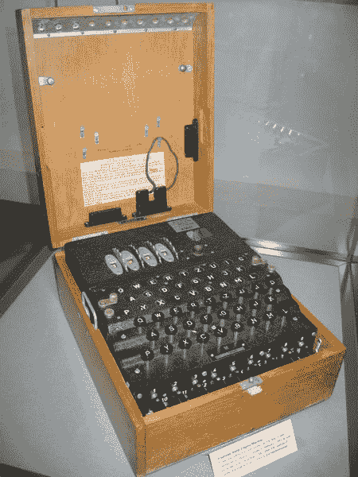
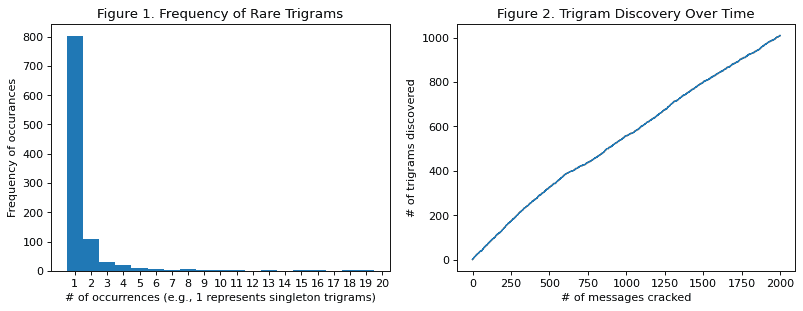
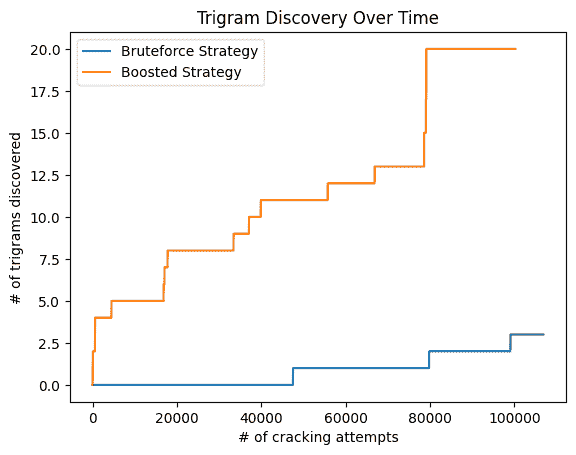
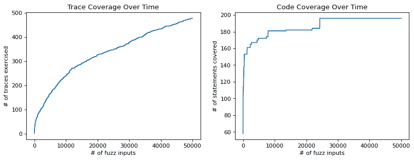
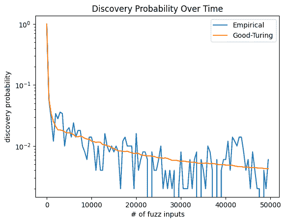
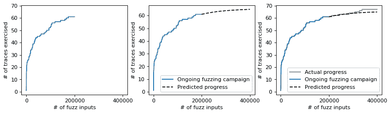

# 何时停止模糊测试

> 原文：[`www.fuzzingbook.org/html/WhenToStopFuzzing.html`](http://www.fuzzingbook.org/html/WhenToStopFuzzing.html)

在前面的章节中，我们讨论了几种模糊测试技术。知道*做什么*很重要，但知道何时*停止*做事情也同样重要。在本章中，我们将学习何时*停止模糊测试*——并使用一个突出的例子来说明这一点：在第二次世界大战中，纳粹德国海军使用的用于加密通信的*Enigma*机器，以及艾伦·图灵和 I.J. Good 如何使用*模糊测试技术*来破解海军 Enigma 机器的密码。

图灵不仅发展了计算机科学的基础——图灵机，他还与他的助手 I.J. Good 一起发明了用于从未发生过的事件的概率估计器。我们展示了 Good-Turing 估计器如何用于量化没有发现漏洞的模糊测试活动的*剩余风险*。这意味着我们展示了如何估计在整个模糊测试活动中没有观察到漏洞时发现漏洞的概率。

我们讨论了加快基于覆盖率的模糊器的方法，并介绍了一系列估计和外推方法来评估和预测模糊测试的进度和剩余风险。

```py
from [bookutils](https://github.com/uds-se/fuzzingbook//tree/master/notebooks/shared/bookutils) import YouTubeVideo
YouTubeVideo('od3DcJcr0d4') 
```

**先决条件**

+   *覆盖这一章节讨论了如何使用执行测试输入的覆盖信息来指导基于覆盖率的突变灰盒模糊器*。

+   一定的统计学知识是有帮助的。

```py
import [bookutils.setup](https://github.com/uds-se/fuzzingbook//tree/master/notebooks/shared/bookutils) 
```

```py
from [typing](https://docs.python.org/3/library/typing.html) import Dict, List 
```

## Enigma Machine

1938 年秋天。图灵刚刚在普林斯顿大学完成他的博士学位，展示了计算的极限并为计算机科学理论奠定了基础。纳粹德国正在重新武装。它重新占领了莱茵兰，违反了凡尔赛条约，并吞并了奥地利。它刚刚吞并了捷克斯洛伐克的苏台德地区，并开始准备接管捷克斯洛伐克的其余部分，尽管在慕尼黑刚刚签署了一项协议。

同时，英国情报机构正在增强他们破解德国用于军事和海军信息通信的加密信息的能力。德国人使用[Enigma 机器](https://en.wikipedia.org/wiki/Enigma_machine)进行加密。Enigma 机器使用一系列机电式转子加密机来保护军事通信。以下是 Enigma 机器的图片：



当图灵加入英国布莱切利公园时，波兰情报机构已经逆向工程了 Enigma 机器的逻辑结构，并建造了一台名为*Bomba*的解密机（可能是因为它们发出的滴答声）。Bomba 可以同时模拟六个 Enigma 机器，并尝试不同的解密密钥，直到密码被破解。波兰的 Bomba 可能是非常早期的*模糊器*。

图灵承担了破解海军恩尼格玛机密码的任务，这些密码因其难以破解而闻名。海军恩尼格玛机作为其加密密钥的一部分，使用了一个称为*三元组*的三个字母序列。这些三元组是从一本书中选出的，这本书称为《肯尼格鲁本》，其中包含了随机顺序的所有三元组。

### 《肯尼格鲁本》

让我们从《肯尼格鲁本》（K-Book）开始。

我们将使用以下 Python 函数。

+   `random.shuffle(elements)` - 打乱`elements`并随机排列项目。

+   `random.choices(elements, weights)` - 从`elements`中随机选择一个项目。如果一个元素具有两倍的`weight`，那么它被选中的概率是两倍。

+   `log(a)` - 返回`a`的自然对数。

+   `a ** b` - 表示`a`的`b`次幂（也称为[幂运算符](https://docs.python.org/3/reference/expressions.html#the-power-operator)）

```py
import [string](https://docs.python.org/3/library/string.html) 
```

```py
import [numpy](https://numpy.org/)
from [numpy](https://numpy.org/) import log 
```

```py
import [random](https://docs.python.org/3/library/random.html) 
```

我们首先创建三元组的集合：

```py
letters = list(string.ascii_letters[26:])  # upper-case characters
trigrams = [str(a + b + c) for a in letters for b in letters for c in letters] 
```

```py
random.shuffle(trigrams) 
```

```py
trigrams[:10] 
```

```py
['TJK', 'NWV', 'LBM', 'AZC', 'GZP', 'ADE', 'DNO', 'OQL', 'FGK', 'IPT']

```

这些现在将进入《肯尼格鲁本》。然而，观察到某些三元组比其他三元组更有可能被选中。例如，任何页面左上角的三元组，或者第一页或最后几页上的三元组，比书中或页面中间的某个地方的三元组更有可能。我们通过为每个三元组分配一个*概率*来反映这种分布差异，使用在概率模糊测试中介绍的贝福特定律。

回想一下，本福特定律将第`i`位数字分配给概率$\log_{10}\left(1 + \frac{1}{i}\right)$，其中以 10 为底是因为有 10 个数字$i\in [0,9]$。然而，本福特定律适用于任意数量的“数字”。因此，我们将第`i`个三元组分配给概率$\log_b\left(1 + \frac{1}{i}\right)$，其中底数$b$是所有可能的三元组的数量$b=26³$。

```py
k_book = {}  # Kenngruppenbuch

for i in range(1, len(trigrams) + 1):
    trigram = trigrams[i - 1]
    # choose weights according to Benford's law
    k_book[trigram] = log(1 + 1 / i) / log(26**3 + 1) 
```

这里是一个来自《肯尼格鲁本》的随机三元组：

```py
random_trigram = random.choices(list(k_book.keys()), weights=list(k_book.values()))[0]
random_trigram 
```

```py
'PSK'

```

这是它的概率：

```py
k_book[random_trigram] 
```

```py
np.float64(0.0008284144853894445)

```

### 模糊恩尼格玛

在以下内容中，我们将介绍基于 K-Book 中的三元组的海军恩尼格玛的极其简化的实现。当然，实际恩尼格玛机的加密机制要复杂得多，值得进行更详细的研究。我们鼓励感兴趣的读者继续阅读背景部分中列出的进一步阅读材料。

布莱切利公园的工作人员只能检查一个编码消息是否使用了一个（猜测的）三元组。我们的实现`naval_enigma()`接受一个`message`和一个`key`（即猜测的三元组）。如果给定的密钥与消息的（先前计算出的）密钥匹配，`naval_enigma()`返回`True`。

```py
from Fuzzer import RandomFuzzer
from Fuzzer import Runner 
```

```py
class EnigmaMachine(Runner):
    def __init__(self, k_book):
        self.k_book = k_book
        self.reset()

    def reset(self):
  """Resets the key register"""
        self.msg2key = {}
        self.cur_msg = ""

    def internal_msg2key(self, message):
  """Internal helper method. 
 Returns the trigram for an encoded message."""
        if message not in self.msg2key:
            # Simulating how an officer chooses a key from the Kenngruppenbuch
            # to encode the message.
            self.msg2key[message] = \
                random.choices(list(self.k_book.keys()),
                               weights=list(self.k_book.values()))[0]
        trigram = self.msg2key[message]
        return trigram

    def naval_enigma(self, message, key):
  """Returns true if 'message' is encoded with 'key'"""
        if key == self.internal_msg2key(message):
            return True
        else:
            return False 
```

为了“模糊”`naval_enigma()`，我们的任务将是找到一个与给定（加密）消息匹配的密钥。由于密钥只有三个字符，我们有很大的机会在不到一秒的时间内完成这项任务。（当然，更长的密钥通过随机模糊测试将更难找到。）

```py
class EnigmaMachine(EnigmaMachine):
    def run(self, tri):
  """PASS if cur_msg is encoded with trigram tri"""
        if self.naval_enigma(self.cur_msg, tri):
            outcome = self.PASS
        else:
            outcome = self.FAIL

        return (tri, outcome) 
```

现在我们可以使用`EnigmaMachine`来检查某个消息是否使用特定的三元组进行编码。

```py
enigma = EnigmaMachine(k_book)
enigma.cur_msg = "BrEaK mE. L0Lzz"
enigma.run("AAA") 
```

```py
('AAA', 'FAIL')

```

破解编码消息的最简单方法是暴力破解。假设在 Bletchley park，他们会尝试随机的三元组，直到一条消息被破解。

```py
class BletchleyPark:
    def __init__(self, enigma):
        self.enigma = enigma
        self.enigma.reset()
        self.enigma_fuzzer = RandomFuzzer(
            min_length=3,
            max_length=3,
            char_start=65,
            char_range=26)

    def break_message(self, message):
  """Returning the trigram for an encoded message"""
        self.enigma.cur_msg = message
        while True:
            (trigram, outcome) = self.enigma_fuzzer.run(self.enigma)
            if outcome == self.enigma.PASS:
                break
        return trigram 
```

使用这种暴力破解方法，Bletchley park 需要多长时间才能找到密钥？

```py
from Timer import Timer 
```

```py
enigma = EnigmaMachine(k_book)
bletchley = BletchleyPark(enigma)

with Timer() as t:
    trigram = bletchley.break_message("BrEaK mE. L0Lzz") 
```

这是当前消息的密钥：

```py
trigram 
```

```py
'XQC'

```

并且，这并没有花费很长时间：

```py
'%f seconds' % t.elapsed_time() 
```

```py
'0.079044 seconds'

```

```py
'Bletchley cracks about %d messages per second' % (1/t.elapsed_time()) 
```

```py
'Bletchley cracks about 12 messages per second'

```

### 图灵的观察

好的，让我们破解几条消息并计算每个三元组被观察到的次数。

```py
from [collections](https://docs.python.org/3/library/collections.html) import defaultdict 
```

```py
n = 100  # messages to crack 
```

```py
observed: Dict[str, int] = defaultdict(int)
for msg in range(0, n):
    trigram = bletchley.break_message(msg)
    observed[trigram] += 1

# list of trigrams that have been observed
counts = [k for k, v in observed.items() if int(v) > 0]

t_trigrams = len(k_book)
o_trigrams = len(counts) 
```

```py
"After cracking %d messages, we observed %d out of %d trigrams." % (
    n, o_trigrams, t_trigrams) 
```

```py
'After cracking 100 messages, we observed 72 out of 17576 trigrams.'

```

```py
singletons = len([k for k, v in observed.items() if int(v) == 1]) 
```

```py
"From the %d observed trigrams, %d were observed only once." % (
    o_trigrams, singletons) 
```

```py
'From the 72 observed trigrams, 63 were observed only once.'

```

给定一组之前使用的条目样本，图灵想要*估计当前未知条目之前已被使用的可能性，并且进一步估计之前使用条目的概率分布。这导致了缺失质量估计器和样本中发生项集的真实概率质量的估计的发展。古德在战争期间与图灵合作，并在图灵的许可下，于 1953 年发表了这些估计器偏差的分析。

假设我们在找到 n=100 条消息的密钥之后，已经观察到三元组"ABC"恰好$X_\text{ABC}=10$次。那么"ABC"是下一条消息密钥的概率$p_\text{ABC}$是多少？从经验上讲，我们会估计$\hat p_\text{ABC}=\frac{X_\text{ABC}}{n}=0.1$。我们可以推导出所有其他观察到的三元组的经验估计。然而，很快就会很明显，整个概率质量都分布在*观察到的*三元组上。这留给*未观察到的*三元组没有质量，即发现新三元组的概率。这被称为缺失的概率质量或发现概率。

图灵和古德推导出了*发现概率* $p_0$ 的估计，即发现一个未观察到的三元组的概率，作为观察到的三元组数量$f_1$与破解的总消息数量$n$的比值：$$ p_0 = \frac{f_1}{n} $$ 其中$f_1$是单例的数量，$n$是破解的消息数量。

让我们稍微探讨一下这个想法。我们将扩展`BletchleyPark`以破解`n`条消息，并记录随着破解消息数量的增加观察到的三元组数量。

```py
class BletchleyPark(BletchleyPark):
    def break_message(self, message):
  """Returning the trigram for an encoded message"""
        # For the following experiment, we want to make it practical
        #   to break a large number of messages. So, we remove the
        #   loop and just return the trigram for a message.
        #
        # enigma.cur_msg = message
        # while True:
        #     (trigram, outcome) = self.enigma_fuzzer.run(self.enigma)
        #     if outcome == self.enigma.PASS:
        #         break
        trigram = enigma.internal_msg2key(message)
        return trigram

    def break_n_messages(self, n):
  """Returns how often each trigram has been observed, 
 and #trigrams discovered for each message."""
        observed = defaultdict(int)
        timeseries = [0] * n

        # Crack n messages and record #trigrams observed as #messages increases
        cur_observed = 0
        for cur_msg in range(0, n):
            trigram = self.break_message(cur_msg)

            observed[trigram] += 1
            if (observed[trigram] == 1):
                cur_observed += 1
            timeseries[cur_msg] = cur_observed

        return (observed, timeseries) 
```

让我们破解 2000 条消息并计算 GT 估计。

```py
n = 2000        # messages to crack 
```

```py
bletchley = BletchleyPark(enigma)
(observed, timeseries) = bletchley.break_n_messages(n) 
```

让我们确定下一个三元组之前未被观察到的 Good-Turing 概率估计：

```py
singletons = len([k for k, v in observed.items() if int(v) == 1])
gt = singletons / n
gt 
```

```py
0.401

```

我们可以通过经验验证 Good-Turing 估计，并计算下一个三元组之前未被观察到的经验概率。为此，我们重复以下实验`repeats=1000`次，报告平均值：如果下一条消息是一个新的三元组，则返回 1，否则返回 0。注意，在这里，我们不记录新发现的元组为已观察到的。

```py
repeats = 1000  # experiment repetitions 
```

```py
newly_discovered = 0
for cur_msg in range(n, n + repeats):
    trigram = bletchley.break_message(cur_msg)
    if(observed[trigram] == 0):
        newly_discovered += 1

newly_discovered / repeats 
```

```py
0.412

```

看起来相当准确，对吧？估计值之间的差异相对较小，可能低于 0.03。然而，Good-Turing 估计并不需要像经验估计那样多的计算资源。与经验估计不同，Good-Turing 估计可以在战役期间进行计算。与经验估计不同，Good-Turing 估计不需要额外的、冗余的重复。

事实上，Good-Turing (GT) 估计器通常在任意分布的估计中表现接近最佳估计器（在这里尝试！）。当然，*发现* 的概念并不仅限于三元组。GT 估计器也用于自然语言的研究，以估计我们遇到下一个单词时，我们没有听过或阅读过该单词的可能性。GT 估计器在生态学中用于估计在我们对地球上的所有*物种*进行编目时发现新、未见物种的可能性。稍后，我们将看到它如何被用来估计在尚未观察到的情况下发现漏洞的概率（即残余风险）。

阿兰·图灵对*补集* $(1-GT)$ 感兴趣，它给出了所有消息中，英国人已经观察到用于解密的三元组的比例。因此，补集也被称为样本覆盖率。*样本覆盖率* 量化了在只有少量已解密消息的情况下，我们对所有消息解密了解的程度。

下一个消息可以使用先前发现的三元组进行解密的概率是：

```py
1 - gt 
```

```py
0.599

```

GT-估计的*倒数*（1/GT）是使用先前观察到的三元组解密预期消息数量的*最大似然估计*。在我们的设置中，在需要发现新的三元组来解密消息之前，我们可以期望重用先前三元组的消息数量是：

```py
1 / gt 
```

```py
2.4937655860349124

```

但为什么 GT 是如此准确的？直观上，尽管进行了大量的采样工作（即破解 $n$ 条消息），仍有 $f_1$ 个三元组只被观察到一次。我们可以说这样的“单例”是非常罕见的三元组。因此，下一个消息使用这种罕见但已观察到的三元组进行编码的概率，为下一个消息使用明显更罕见、未观察到的三元组进行编码的概率提供了一个良好的上限。自从图林 80 年前的观察以来，围绕稀有的、已观察到的“物种”是未观察到的物种的良好预测者的假设，已经发展出整个统计理论。

让我们来看看罕见三元组的分布。

```py
%matplotlib inline 
```

```py
import [matplotlib.pyplot](https://matplotlib.org/) as plt 
```

```py
frequencies = [v for k, v in observed.items() if int(v) > 0]
frequencies.sort(reverse=True)
# Uncomment to see how often each discovered trigram has been observed
# print(frequencies)

# frequency of rare trigrams
plt.figure(num=None, figsize=(12, 4), dpi=80, facecolor='w', edgecolor='k')
plt.subplot(1, 2, 1)
plt.hist(frequencies, range=[1, 21], bins=numpy.arange(1, 21) - 0.5)
plt.xticks(range(1, 21))
plt.xlabel('# of occurrences (e.g., 1 represents singleton trigrams)')
plt.ylabel('Frequency of occurances')
plt.title('Figure 1\. Frequency of Rare Trigrams')

# trigram discovery over time
plt.subplot(1, 2, 2)
plt.plot(timeseries)
plt.xlabel('# of messages cracked')
plt.ylabel('# of trigrams discovered')
plt.title('Figure 2\. Trigram Discovery Over Time'); 
```



```py
# Statistics for most and least often observed trigrams
singletons = len([v for k, v in observed.items() if int(v) == 1])
total = len(frequencies)

print("%3d of %3d trigrams (%.3f%%) have been observed   1 time (i.e., are singleton trigrams)."
      % (singletons, total, singletons * 100 / total))

print("%3d of %3d trigrams ( %.3f%%) have been observed %d times."
      % (1, total, 1 / total, frequencies[0])) 
```

```py
802 of 1009 trigrams (79.485%) have been observed   1 time (i.e., are singleton trigrams).
  1 of 1009 trigrams ( 0.001%) have been observed 152 times.

```

大多数三角词*只被观察到一次*，如图 1（左）所示。换句话说，大多数观察到的三角词是“罕见”的单个词。在图 2（右）中，我们可以看到发现正处于全速进行。轨迹似乎几乎是线性的。然而，由于三角词的数量是有限的（26³ = 17,576），三角词的发现速度将放缓，并最终接近一个渐近线（三角词的总数）。

### 提升 BletchleyPark 的性能

一些三角词被观察到的频率非常高。我们称这些为“丰富”的三角词。

```py
print("Trigram : Frequency")
for trigram in sorted(observed, key=observed.get, reverse=True):
    if observed[trigram] > 10:
        print(" %s : %d" % (trigram, observed[trigram])) 
```

```py
Trigram : Frequency
    TJK : 152
    LBM : 69
    NWV : 64
    AZC : 43
    GZP : 41
    ADE : 37
    DNO : 27
    OQL : 26
    TCO : 20
    BDA : 19
    ARO : 18
    IPT : 16
    FGK : 16
    MSV : 15
    ONO : 15
    EOR : 13
    JTV : 11
    IBT : 11
    PWN : 11

```

我们将通过*首先尝试丰富的三角词*来加快密码破解的速度。

首先，我们将找出在 Bledgley park 使用最大尝试次数的情况下，现有暴力破解策略可以破解多少信息。我们还将跟踪随时间破解的信息数量（`timeseries`）。

```py
class BletchleyPark(BletchleyPark):
    def __init__(self, enigma):
        super().__init__(enigma)
        self.cur_attempts = 0
        self.cur_observed = 0
        self.observed = defaultdict(int)
        self.timeseries = [None] * max_attempts * 2

    def break_message(self, message):
  """Returns the trigram for an encoded message, and
 track #trigrams observed as #attempts increases."""
        self.enigma.cur_msg = message
        while True:
            self.cur_attempts += 1                                 # NEW
            (trigram, outcome) = self.enigma_fuzzer.run(self.enigma)
            self.timeseries[self.cur_attempts] = self.cur_observed # NEW
            if outcome == self.enigma.PASS: 
                break
        return trigram

    def break_max_attempts(self, max_attempts):
  """Returns #messages successfully cracked after a given #attempts."""
        cur_msg = 0
        n_messages = 0

        while True:
            trigram = self.break_message(cur_msg)

            # stop when reaching max_attempts
            if self.cur_attempts >= max_attempts:
                break

            # update observed trigrams
            n_messages += 1
            self.observed[trigram] += 1
            if (self.observed[trigram] == 1):
                self.cur_observed += 1
                self.timeseries[self.cur_attempts] = self.cur_observed
            cur_msg += 1

        return n_messages 
```

`original`是在 100k 次尝试下，通过暴力破解策略破解的信息数量。我们能打败这个记录吗？

```py
max_attempts = 100000 
```

```py
bletchley = BletchleyPark(enigma)
original = bletchley.break_max_attempts(max_attempts)
original 
```

```py
3

```

现在，我们将通过首先尝试之前观察到的最频繁的三角词来创建一个增强策略。

```py
class BoostedBletchleyPark(BletchleyPark):
    def __init__(self, enigma, prior):
        super().__init__(enigma)
        self.prior = prior

    def break_message(self, message):
  """Returns the trigram for an encoded message, and
 track #trigrams observed as #attempts increases."""
        self.enigma.cur_msg = message

        # boost cracking by trying observed trigrams first
        for trigram in sorted(self.prior, key=self.prior.get, reverse=True):
            self.cur_attempts += 1
            (_, outcome) = self.enigma.run(trigram)
            self.timeseries[self.cur_attempts] = self.cur_observed
            if outcome == self.enigma.PASS:
                return trigram

        # else fall back to normal cracking
        return super().break_message(message) 
```

`boosted`是通过增强策略破解的信息数量。

```py
boostedBletchley = BoostedBletchleyPark(enigma, prior=observed)
boosted = boostedBletchley.break_max_attempts(max_attempts)
boosted 
```

```py
23

```

我们看到，增强技术破解了大量的信息。记录每个三角词作为密钥被使用的频率并按其出现的顺序尝试它们是值得的。

***试试看***。*出于实际原因，我们使用大量之前的观察作为先验（`boostedBletchley.prior = observed`）。你可以尝试修改代码，使策略使用在活动期间观察到的三角词频率（`self.observed`）来增强活动。你需要增加`max_attempts`并等待一段时间。*

让我们比较随时间发现的三角词数量。

```py
# print plots
line_old, = plt.plot(bletchley.timeseries, label="Bruteforce Strategy")
line_new, = plt.plot(boostedBletchley.timeseries, label="Boosted Strategy")
plt.legend(handles=[line_old, line_new])
plt.xlabel('# of cracking attempts')
plt.ylabel('# of trigrams discovered')
plt.title('Trigram Discovery Over Time'); 
```



我们看到，增强模糊器始终优于随机模糊器。

## 估计路径发现概率

那么，图灵对海军恩尼格玛机的观察与模糊化*任意*程序有什么关系？图灵的助手 I.J. Good 在《生物统计学》杂志上扩展并发表了图灵关于估计程序的工作，这是一本至今仍存在的理论生物统计学期刊。Good 没有谈论三角词。相反，他称它们为“物种”。因此，GT 估计器被提出，以估计在给定现有个体样本（每个个体恰好属于一个物种）的情况下发现新物种的可能性。

现在，我们也可以将程序输入与物种关联起来。例如，我们可以定义输入执行的路径为该输入的物种。这将使我们能够*估计模糊化发现新路径的概率*。稍后，我们将看到这种发现概率估计也估计了在尚未看到的情况下发现漏洞的可能性（残余风险）。

让我们这样做。我们通过计算输入执行的语句集合的哈希-id 来识别输入的种类。在覆盖率章节中，我们学习了关于覆盖率类的内容，该类收集执行 Python 函数的覆盖率信息。例如，介绍了函数`[cgi_decode()]`(Coverage.html#A-CGI-Decoder)。函数`cgi_decode()`接受为网站 URL 编码的字符串，并将其解码回原始形式。

这里是`cgi_decode()`的功能以及覆盖率是如何计算的。

```py
from Coverage import Coverage, cgi_decode 
```

```py
encoded = "Hello%2c+world%21"
with Coverage() as cov:
    decoded = cgi_decode(encoded) 
```

```py
decoded 
```

```py
'Hello, world!'

```

```py
print(cov.coverage()); 
```

```py
{('cgi_decode', 18), ('cgi_decode', 24), ('cgi_decode', 27), ('cgi_decode', 33), ('cgi_decode', 30), ('cgi_decode', 39), ('cgi_decode', 17), ('cgi_decode', 20), ('cgi_decode', 26), ('cgi_decode', 23), ('cgi_decode', 29), ('cgi_decode', 32), ('cgi_decode', 38), ('cgi_decode', 19), ('cgi_decode', 16), ('cgi_decode', 25), ('cgi_decode', 31), ('cgi_decode', 28), ('cgi_decode', 34), ('cgi_decode', 40)}

```

### 跟踪覆盖率

首先，我们将介绍执行跟踪的概念，它是输入执行路径的粗略抽象。与路径的定义相比，跟踪忽略了语句执行的顺序或每个语句被执行的频率。

+   `pickle.dumps()` - 通过从对象的所有信息生成字节数组来序列化对象

+   `hashlib.md5()` - 从字节数组生成 128 位哈希值

```py
import [pickle](https://docs.python.org/3/library/pickle.html)
import [hashlib](https://docs.python.org/3/library/hashlib.html) 
```

```py
def getTraceHash(cov):
    pickledCov = pickle.dumps(cov.coverage())
    hashedCov = hashlib.md5(pickledCov).hexdigest()
    return hashedCov 
```

记得我们海军恩尼格玛机的模型吗？每条信息必须使用恰好一个三元组进行解密，而多条信息可能由同一个三元组解密。同样，我们需要每个输入产生恰好一个跟踪哈希，而多个输入可以产生相同的跟踪哈希。

让我们看看这在我们`getTraceHash()`函数中是否成立。

```py
inp1 = "a+b"
inp2 = "a+b+c"
inp3 = "abc"

with Coverage() as cov1:
    cgi_decode(inp1)
with Coverage() as cov2:
    cgi_decode(inp2)
with Coverage() as cov3:
    cgi_decode(inp3) 
```

输入`inp1`和`inp2`执行了相同的语句：

```py
inp1, inp2 
```

```py
('a+b', 'a+b+c')

```

```py
cov1.coverage() - cov2.coverage() 
```

```py
set()

```

两个覆盖率集之间的差异为空。因此，跟踪哈希应该相同：

```py
getTraceHash(cov1) 
```

```py
'2b4ac7d0fe0c21a377a594f1a3ec1be2'

```

```py
getTraceHash(cov2) 
```

```py
'2b4ac7d0fe0c21a377a594f1a3ec1be2'

```

```py
assert getTraceHash(cov1) == getTraceHash(cov2) 
```

相比之下，输入`inp1`和`inp3`执行了不同的语句：

```py
inp1, inp3 
```

```py
('a+b', 'abc')

```

```py
cov1.coverage() - cov3.coverage() 
```

```py
{('cgi_decode', 28)}

```

因此，跟踪哈希也应该不同：

```py
getTraceHash(cov1) 
```

```py
'2b4ac7d0fe0c21a377a594f1a3ec1be2'

```

```py
getTraceHash(cov3) 
```

```py
'17f0b5cb3f5ca871198dc25635d631f9'

```

```py
assert getTraceHash(cov1) != getTraceHash(cov3) 
```

### 随时间测量跟踪覆盖率

为了测量执行一个`population`模糊输入的`function`的跟踪覆盖率，我们稍微修改了来自覆盖率章节的`population_coverage()`函数。

```py
def population_trace_coverage(population, function):
    cumulative_coverage = []
    all_coverage = set()
    cumulative_singletons = []
    cumulative_doubletons = []
    singletons = set()
    doubletons = set()

    for s in population:
        with Coverage() as cov:
            try:
                function(s)
            except BaseException:
                pass
        cur_coverage = set([getTraceHash(cov)])

        # singletons and doubletons -- we will need them later
        doubletons -= cur_coverage
        doubletons |= singletons & cur_coverage
        singletons -= cur_coverage
        singletons |= cur_coverage - (cur_coverage & all_coverage)
        cumulative_singletons.append(len(singletons))
        cumulative_doubletons.append(len(doubletons))

        # all and cumulative coverage
        all_coverage |= cur_coverage
        cumulative_coverage.append(len(all_coverage))

    return all_coverage, cumulative_coverage, cumulative_singletons, cumulative_doubletons 
```

让我们看看我们的新函数是否真的只包含针对`cgi_decode`的三个输入中的两个跟踪的覆盖率信息。

```py
all_coverage = population_trace_coverage([inp1, inp2, inp3], cgi_decode)[0]
assert len(all_coverage) == 2 
```

不幸的是，`cgi_decode()`函数太简单了。因此，我们将使用原始 Python [HTMLParser](https://docs.python.org/3/library/html.parser.html)作为我们的测试对象。

```py
from Coverage import population_coverage
from [html.parser](https://docs.python.org/3/library/html.parser.html) import HTMLParser 
```

```py
trials = 50000  # number of random inputs generated 
```

让我们运行一个随机模糊器，重复次数为$n=50000$，并绘制跟踪覆盖率随时间的变化。

```py
# create wrapper function
def my_parser(inp):
    parser = HTMLParser()  # resets the HTMLParser object for every fuzz input
    parser.feed(inp) 
```

```py
# create random fuzzer
fuzzer = RandomFuzzer(min_length=1, max_length=100,
                      char_start=32, char_range=94)

# create population of fuzz inputs
population = []
for i in range(trials):
    population.append(fuzzer.fuzz())

# execute and measure trace coverage
trace_timeseries = population_trace_coverage(population, my_parser)[1]

# execute and measure code coverage
code_timeseries = population_coverage(population, my_parser)[1]

# plot trace coverage over time
plt.figure(num=None, figsize=(12, 4), dpi=80, facecolor='w', edgecolor='k')
plt.subplot(1, 2, 1)
plt.plot(trace_timeseries)
plt.xlabel('# of fuzz inputs')
plt.ylabel('# of traces exercised')
plt.title('Trace Coverage Over Time')

# plot code coverage over time
plt.subplot(1, 2, 2)
plt.plot(code_timeseries)
plt.xlabel('# of fuzz inputs')
plt.ylabel('# of statements covered')
plt.title('Code Coverage Over Time'); 
```



在上面，我们可以看到随时间变化的跟踪覆盖率（左侧）和代码覆盖率（右侧）。以下是我们的观察结果。

1.  **跟踪覆盖率更稳健**。 与代码覆盖率相比，图中跳跃更少。

1.  **跟踪覆盖率更细粒度。** 最终覆盖的跟踪比语句多（y 轴）。

1.  **跟踪覆盖率增长更稳定**。 代码覆盖率在 50k 个输入后，第一次输入执行了超过一半的语句。相反，覆盖的跟踪数量缓慢而稳定地增长，因为每个输入只能产生一个执行跟踪。

正是因为这个原因，今天最突出和最成功的模糊测试工具之一，美国模糊跳蚤（AFL），使用了一个类似的*进度衡量标准*（对输入执行的分支计算出的哈希值）。

### 评估发现概率估计

让我们来看看当我们在模糊测试中寻找执行轨迹而不是三元组时，Good-Turing 估计器作为发现概率估计的表现如何。

为了测量经验概率，我们执行相同的输入种群（n=50000）并在常规间隔（`measurements=100`间隔）内进行测量。在每次测量中，我们重复以下实验`repeats=500`次，报告平均值：如果下一个输入产生新的轨迹，则返回 1，否则返回 0。注意，在这些重复中，我们不记录新发现的轨迹。

```py
repeats = 500      # experiment repetitions
measurements = 100  # experiment measurements 
```

```py
emp_timeseries = []
all_coverage = set()
step = int(trials / measurements)

for i in range(0, trials, step):
    if i - step >= 0:
        for j in range(step):
            inp = population[i - j]
            with Coverage() as cov:
                try:
                    my_parser(inp)
                except BaseException:
                    pass
            all_coverage |= set([getTraceHash(cov)])

    discoveries = 0
    for _ in range(repeats):
        inp = fuzzer.fuzz()
        with Coverage() as cov:
            try:
                my_parser(inp)
            except BaseException:
                pass
        if getTraceHash(cov) not in all_coverage:
            discoveries += 1
    emp_timeseries.append(discoveries / repeats) 
```

现在，我们计算 Good-Turing 估计随时间的变化。

```py
gt_timeseries = []
singleton_timeseries = population_trace_coverage(population, my_parser)[2]
for i in range(1, trials + 1, step):
    gt_timeseries.append(singleton_timeseries[i - 1] / i) 
```

让我们继续绘制这两个时间序列。

```py
line_emp, = plt.semilogy(emp_timeseries, label="Empirical")
line_gt, = plt.semilogy(gt_timeseries, label="Good-Turing")
plt.legend(handles=[line_emp, line_gt])
plt.xticks(range(0, measurements + 1, int(measurements / 5)),
           range(0, trials + 1, int(trials / 5)))
plt.xlabel('# of fuzz inputs')
plt.ylabel('discovery probability')
plt.title('Discovery Probability Over Time'); 
```



再次，Good-Turing 估计似乎非常准确。事实上，经验估计器的精度要低得多，如大幅波动所示。你可以尝试增加重复次数（`repeats`）以获得更精确的经验估计，然而，这会以等待更长的时间为代价。

### 发现概率量化残余风险

好吧。你已经掌握了几台强大的机器，并使用它们对软件系统进行了几个月的模糊测试，但没有发现任何漏洞。系统有漏洞吗？

好吧，谁知道呢？我们无法肯定；总是存在一些残余风险。测试不是验证。也许下一个生成的测试输入会揭示一个漏洞。

假设*残余风险*是下一次测试输入揭示尚未发现的漏洞的概率。Böhme [[B\"{o}hme *et al*, 2018](https://doi.org/10.1145/3210309)] 已经表明，Good-Turing 发现概率的估计也是最大残余风险的估计。

**证明草图（残余风险）**。这里有一个证明草图，它表明对于任意物种定义的发现概率估计给出了在尚未发现任何漏洞的情况下发现漏洞概率的上界：假设对于每个“旧”物种 A（在这里，执行轨迹），我们推导出两个“新”物种：一些属于 A 的输入暴露了漏洞，而其他属于 A 的输入没有。我们知道*只有*未暴露漏洞的物种已经被发现。因此，*所有*暴露漏洞的物种和*一些*未暴露漏洞的物种仍然未被发现。因此，发现新物种的概率给出了发现（暴露漏洞的）物种概率的上界。**QED**。

发现概率的估计在许多其他方面都很有用。

1.  **发现概率**。我们可以在模糊测试活动的任何时刻估计下一个输入属于之前未见物种的概率（在这里，它产生新的执行轨迹，即执行了一组新的语句）。

1.  **发现概率的补数**。我们可以估计模糊器可以生成的所有输入中，我们已经看到物种（在这里，是执行轨迹）的比例。在某种意义上，这使我们能够量化模糊测试活动向完成的**进度**：如果发现新物种的概率太低，我们可能最好终止活动。

1.  **发现概率的倒数**。我们可以预测需要多少测试输入，以便我们可以期望发现新的物种（在这里，执行轨迹）。

## 我们如何知道何时停止模糊测试？

在模糊测试中，我们有进度指标，如代码覆盖率或语法覆盖率。假设我们感兴趣的是覆盖程序中的所有语句。已经覆盖的语句的**百分比**量化了我们离完成模糊测试活动的“距离”。然而，有时我们只知道在生成$n$个模糊输入后发现的物种数量$S(n)$（在这里，是语句）。只有当我们知道物种的总数$S$时，才能计算百分比$S(n)/S$。即使如此，并非所有物种都是可行的。

### 成功率估计器

如果我们不知道物种的总数，那么至少让我们**估计**它：正如我们之前所看到的，物种发现会随着时间的推移而减慢。一开始，会发现许多新的物种。后来，在发现下一个物种之前需要生成许多输入。事实上，给定足够的时间，模糊测试活动会接近一个**渐近线**。正是这个渐近线我们可以进行估计。

在 1984 年，著名的理论生物统计学家 Anne Chao 开发了一个估计器$\hat S$，它估计渐近总物种数$S$：\begin{align} \hat S_\text{Chao1} = \begin{cases} S(n) + \frac{f_1²}{2f_2} & \text{if $f_2>0$}\\ S(n) + \frac{f_1(f_1-1)}{2} & \text{otherwise} \end{cases} \end{align}

+   其中$f_1$和$f_2$分别是单例和双例物种的数量（分别被观察过一次或两次），并且

+   其中$S(n)$是在生成$n$个模糊输入后发现的物种数量。

那么，Chao 的估计表现如何？为了调查这一点，我们使用一个模糊器设置生成`trials=400000`个模糊输入，这个设置允许我们在几秒钟内看到渐近线：我们测量轨迹覆盖率。在我们的模糊测试活动进行到一半时（`trials`/2=100000），我们生成 Chao 的渐近总物种数估计$\hat S$。然后，我们继续剩余的活动以看到“经验”渐近线。

```py
trials = 400000
fuzzer = RandomFuzzer(min_length=2, max_length=4,
                      char_start=32, char_range=32)
population = []
for i in range(trials):
    population.append(fuzzer.fuzz())

_, trace_ts, f1_ts, f2_ts = population_trace_coverage(population, my_parser) 
```

```py
time = int(trials / 2)
time 
```

```py
200000

```

```py
f1 = f1_ts[time]
f2 = f2_ts[time]
Sn = trace_ts[time]
if f2 > 0:
    hat_S = Sn + f1 * f1 / (2 * f2)
else:
    hat_S = Sn + f1 * (f1 - 1) / 2 
```

执行`time`个模糊输入（所有输入的一半）后，我们已经覆盖了这么多轨迹：

```py
time 
```

```py
200000

```

```py
Sn 
```

```py
61

```

我们可以估计总共有这么多轨迹：

```py
hat_S 
```

```py
65.5

```

因此，我们达到了这个估计的百分比：

```py
100 * Sn / hat_S 
```

```py
93.12977099236642

```

执行`trials`个模糊输入后，我们覆盖了这么多轨迹：

```py
trials 
```

```py
400000

```

```py
trace_ts[trials - 1] 
```

```py
67

```

潮的估计器的准确性相当合理。它并不总是准确的——尤其是在模糊测试活动的开始阶段，当发现概率仍然非常高时。尽管如此，它展示了报告一个百分比来评估模糊测试活动完成进度的主要好处。

***尝试一下***。*尝试将`trials`设置为 100 万，将`time`设置为`int(trials / 4)`.*

### 外推模糊测试成功

假设你已经运行了模糊测试器一周，生成了$n$个模糊输入并发现了$S(n)$个物种（在这里，覆盖了$S(n)$个执行轨迹）。而不是再运行一周的模糊测试器，你希望*预测*你将发现多少更多物种。在 2003 年，安妮·潮和她的团队开发了一种外推方法来做到这一点。我们感兴趣的是，如果生成了$m^*$更多模糊输入，发现的物种数量$S(n+m^*)$是多少：

\begin{align} \hat S(n + m^*) = S(n) + \hat f_0 \left[1-\left(1-\frac{f_1}{n\hat f_0 + f_1}\right)^{m^*}\right] \end{align}

+   其中$\hat f_0=\hat S - S(n)$是未发现物种数量$f_0$的估计，并且

+   其中$f_1$是单种物种的数量，即我们恰好观察过一次的那些。

单个物种的数量$f_1$，我们可以在模糊测试活动本身中跟踪。未发现物种的数量$\hat f_0$的估计，我们可以简单地使用潮的估计$\hat S$和观察到的物种数量$S(n)$来推导。

让我们通过比较预测的物种数量与经验物种数量来查看潮的外推器表现如何。

```py
prediction_ts: List[float] = [None] * time
f0 = hat_S - Sn

for m in range(trials - time):
    assert (time * f0 + f1) != 0 , 'time:%s f0:%s f1:%s' % (time, f0,f1)
    prediction_ts.append(Sn + f0 * (1 - (1 - f1 / (time * f0 + f1)) ** m)) 
```

```py
plt.figure(num=None, figsize=(12, 3), dpi=80, facecolor='w', edgecolor='k')
plt.subplot(1, 3, 1)
plt.plot(trace_ts, color='white')
plt.plot(trace_ts[:time])
plt.xticks(range(0, trials + 1, int(time)))
plt.xlabel('# of fuzz inputs')
plt.ylabel('# of traces exercised')

plt.subplot(1, 3, 2)
line_cur, = plt.plot(trace_ts[:time], label="Ongoing fuzzing campaign")
line_pred, = plt.plot(prediction_ts, linestyle='--',
                      color='black', label="Predicted progress")
plt.legend(handles=[line_cur, line_pred])
plt.xticks(range(0, trials + 1, int(time)))
plt.xlabel('# of fuzz inputs')
plt.ylabel('# of traces exercised')

plt.subplot(1, 3, 3)
line_emp, = plt.plot(trace_ts, color='grey', label="Actual progress")
line_cur, = plt.plot(trace_ts[:time], label="Ongoing fuzzing campaign")
line_pred, = plt.plot(prediction_ts, linestyle='--',
                      color='black', label="Predicted progress")
plt.legend(handles=[line_emp, line_cur, line_pred])
plt.xticks(range(0, trials + 1, int(time)))
plt.xlabel('# of fuzz inputs')
plt.ylabel('# of traces exercised'); 
```



潮的预测器从预测看起来相当准确。我们在`time=trials/4`时做出预测。尽管进行了 3 倍的预测（即在试验时），我们可以看到预测值（黑色，虚线）与经验值（灰色，实线）非常接近。

***尝试一下***。再次，尝试将`trials`设置为 100 万，将`time`设置为`int(trials / 4)`。

## 经验教训

+   可以测量模糊测试活动的*进度*（即物种随时间的变化，即$S(n)$）。

+   可以测量模糊测试活动的*有效性*（即渐近总物种数$S$）。

+   可以使用 Chao1-估计器$\hat S$来估计模糊测试活动的*有效性*。

+   可以外推模糊测试活动的*进度*，$\hat S(n+m^*)$。

+   可以使用物种发现概率的 Good-Turing 估计器$GT$来估计*残余风险*（即存在尚未发现的漏洞的概率）。

## 下一步

这本书的最后一章！如果你想继续阅读，请查看附录。否则，*利用你所学的知识，去创造伟大的模糊测试器和测试生成器！*

## 背景

+   一个受生态学启发的**模糊测试统计框架**。Marcel Böhme。[STADS：将软件测试视为物种发现](https://mboehme.github.io/paper/TOSEM18.pdf)。ACM TOSEM 27(2):1--52

+   估计**发现概率**：I.J. Good。1953 年。[物种的种群频率和种群参数的估计](https://www.jstor.org/stable/2333344)。Biometrika 40:237–264。

+   当每个输入恰好属于一个物种时，估计**渐近总物种数量**：Anne Chao。1984 年。[对人口中类别的非参数估计](https://www.jstor.org/stable/4615964)。斯堪的纳维亚统计杂志 11:265–270

+   当每个输入可以属于一个或多个物种时，估计**渐近总物种数量**：Anne Chao。1987 年。[使用不等捕捞能力估计捕获-重捕数据的种群大小](https://www.jstor.org/stable/2531532)。生物计量学 43:783–791

+   **外推**已发现物种的数量：Tsung-Jen Shen，Anne Chao，和 Chih-Feng Lin。2003 年。[预测进一步分类采样中新物种的数量](http://chao.stat.nthu.edu.tw/wordpress/paper/2003_Ecology_84_P798.pdf)。生态学 84，3 (2003)，798–804。

## 练习

I.J. Good 和 Alan Turing 为每个输入恰好属于一个物种的情况开发了一个估计器。例如，每个输入产生一个精确的执行跟踪（见函数`getTraceHash`）。然而，这并不普遍。例如，每个输入在源代码中执行多个语句和分支。一般来说，每个输入可以属于一个*或多个*物种。

在这个扩展模型中，基础统计相当不同。然而，我们在本章讨论的所有估计器最终都几乎与简单单物种模型的估计器相同。例如，Good-Turing 估计器$C$定义为$$C=\frac{Q_1}{n}$$其中$Q_1$是单例物种的数量，$n$是生成的测试用例数量。在整个模糊测试活动中，我们记录每个物种的*发生频率*，即属于该物种的输入数量。再次，如果我们恰好看到一个属于物种$i$的输入，我们定义物种$i$为*单例物种*。

### 练习 1：估计和评估语句覆盖率的发现概率

在这个练习中，我们为简单的模糊器创建一个 Good-Turing 估计器。

[使用笔记本](https://mybinder.org/v2/gh/uds-se/fuzzingbook/HEAD?labpath=docs%2Fnotebooks/WhenToStopFuzzing.ipynb#Exercises)进行练习并查看解决方案。

#### 第一部分：种群覆盖率

实现一个名为`population_stmt_coverage()`的函数，如在估计发现概率的章节中所述，该函数监控随时间变化的单例和双例数量，即随着测试输入数量$i$的增加。

[使用笔记本](https://mybinder.org/v2/gh/uds-se/fuzzingbook/HEAD?labpath=docs%2Fnotebooks/WhenToStopFuzzing.ipynb#Exercises)进行练习并查看解决方案。

```py
from Coverage import population_coverage
... 
```

[使用笔记本](https://mybinder.org/v2/gh/uds-se/fuzzingbook/HEAD?labpath=docs%2Fnotebooks/WhenToStopFuzzing.ipynb#Exercises)进行练习并查看解决方案。

#### 第二部分：种群

使用来自模糊器章节的随机`fuzzer(min_length=1, max_length=1000, char_start=0, char_range=255)`生成一个包含$n=10000$模糊输入的种群。

[使用笔记本](https://mybinder.org/v2/gh/uds-se/fuzzingbook/HEAD?labpath=docs%2Fnotebooks/WhenToStopFuzzing.ipynb#Exercises)进行练习并查看解决方案。

```py
from Fuzzer import RandomFuzzer
from [html.parser](https://docs.python.org/3/library/html.parser.html) import HTMLParser
...; 
```

[使用笔记本](https://mybinder.org/v2/gh/uds-se/fuzzingbook/HEAD?labpath=docs%2Fnotebooks/WhenToStopFuzzing.ipynb#Exercises)进行练习并查看解决方案。

#### 第三部分：估计概率

在 Python HTML 解析器（`from html.parser import HTMLParser`）上执行生成的输入，并使用 Good-Turing 估计器估计下一个输入覆盖先前未覆盖语句的概率（即发现概率）。

[使用笔记本](https://mybinder.org/v2/gh/uds-se/fuzzingbook/HEAD?labpath=docs%2Fnotebooks/WhenToStopFuzzing.ipynb#Exercises)进行练习并查看解决方案。

#### 第四部分：经验评估

通过实验方法评估 Good-Turing 估计器（使用$10000$次重复）覆盖新语句的概率的准确性，实验方法见估计发现概率部分的结尾。

[使用笔记本](https://mybinder.org/v2/gh/uds-se/fuzzingbook/HEAD?labpath=docs%2Fnotebooks/WhenToStopFuzzing.ipynb#Exercises)进行练习并查看解决方案。

### 练习 2：外推和评估语句覆盖率

在这个练习中，我们使用 Chao 的外推方法来估计模糊测试的成功率。

[使用笔记本](https://mybinder.org/v2/gh/uds-se/fuzzingbook/HEAD?labpath=docs%2Fnotebooks/WhenToStopFuzzing.ipynb#Exercises)进行练习并查看解决方案。

#### 第一部分：创建种群

使用随机`fuzzer(min_length=1, max_length=1000, char_start=0, char_range=255)`生成一个包含$n=400000$模糊输入的种群。

[使用笔记本](https://mybinder.org/v2/gh/uds-se/fuzzingbook/HEAD?labpath=docs%2Fnotebooks/WhenToStopFuzzing.ipynb#Exercises)进行练习并查看解决方案。

#### 第二部分：计算估计值

在生成$n/4=100000$模糊输入后，计算语句总数$\hat S$的估计值。在扩展模型中，$\hat S$的计算如下：

+   其中 $Q_1$ 和 $Q_2$ 分别表示单例和双例语句的数量（即被恰好一个或两个模糊输入测试过的语句），以及

+   其中 $S(n)$ 是在生成 $n$ 个模糊输入后发现的（或未发现的）语句数量。

[使用笔记本](https://mybinder.org/v2/gh/uds-se/fuzzingbook/HEAD?labpath=docs%2Fnotebooks/WhenToStopFuzzing.ipynb#Exercises) 来完成练习并查看解决方案。

#### 第三部分：计算和评估外推器

通过比较预测的语句数量与经验性的语句数量来计算和评估赵的外推器。

[使用笔记本](https://mybinder.org/v2/gh/uds-se/fuzzingbook/HEAD?labpath=docs%2Fnotebooks/WhenToStopFuzzing.ipynb#Exercises) 来完成练习并查看解决方案。

 本项目的内容受[Creative Commons Attribution-NonCommercial-ShareAlike 4.0 International License](https://creativecommons.org/licenses/by-nc-sa/4.0/)许可。内容的一部分源代码，以及用于格式化和显示该内容的源代码受[MIT License](https://github.com/uds-se/fuzzingbook/blob/master/LICENSE.md#mit-license)许可。最后更改日期：2024-11-09 17:07:29+01:00。[`github.com/uds-se/fuzzingbook/commits/master/notebooks/WhenToStopFuzzing.ipynb`](https://github.com/uds-se/fuzzingbook/commits/master/notebooks/WhenToStopFuzzing.ipynb) • 引用 • [印记](https://cispa.de/en/impressum)

## 如何引用本作品

安德烈亚斯·泽勒（Andreas Zeller）、拉胡尔·戈皮纳特（Rahul Gopinath）、马塞尔·博姆（Marcel Böhme）、戈登·弗朗西斯（Gordon Fraser）和克里斯蒂安·霍勒（Christian Holler）："[何时停止模糊测试](https://www.fuzzingbook.org/html/WhenToStopFuzzing.html)"。在安德烈亚斯·泽勒（Andreas Zeller）、拉胡尔·戈皮纳特（Rahul Gopinath）、马塞尔·博姆（Marcel Böhme）、戈登·弗朗西斯（Gordon Fraser）和克里斯蒂安·霍勒（Christian Holler）的《模糊测试书》（[The Fuzzing Book](https://www.fuzzingbook.org/)）中。[`www.fuzzingbook.org/html/WhenToStopFuzzing.html`](https://www.fuzzingbook.org/html/WhenToStopFuzzing.html)。检索日期：2024-11-09 17:07:29+01:00。

```py
@incollection{fuzzingbook2024:WhenToStopFuzzing,
    author = {Andreas Zeller and Rahul Gopinath and Marcel B{\"o}hme and Gordon Fraser and Christian Holler},
    booktitle = {The Fuzzing Book},
    title = {When To Stop Fuzzing},
    year = {2024},
    publisher = {CISPA Helmholtz Center for Information Security},
    howpublished = {\url{https://www.fuzzingbook.org/html/WhenToStopFuzzing.html}},
    note = {Retrieved 2024-11-09 17:07:29+01:00},
    url = {https://www.fuzzingbook.org/html/WhenToStopFuzzing.html},
    urldate = {2024-11-09 17:07:29+01:00}
}

```
