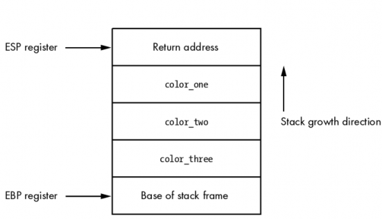
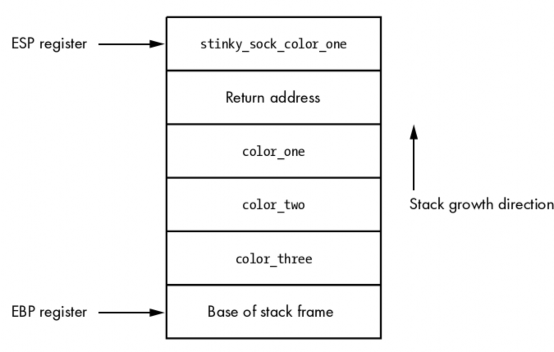
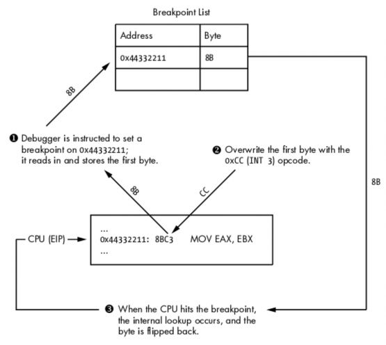
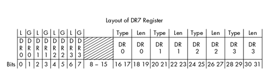
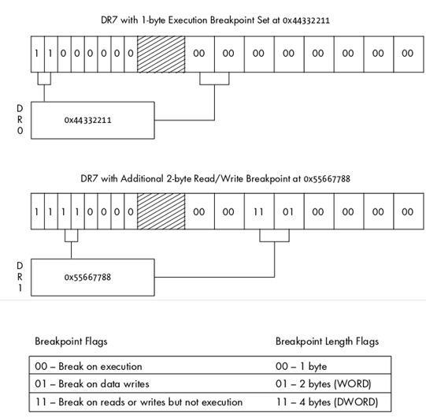
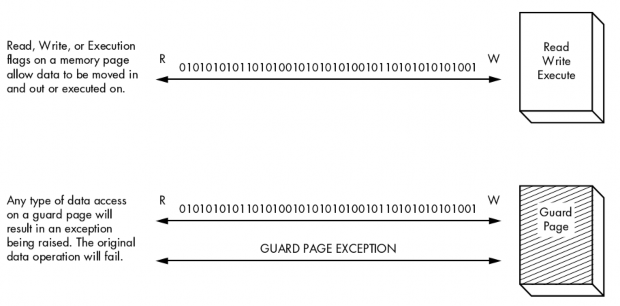

# 二、调试器设计

# 2 调试器设计

调试器就是黑客的眼睛。你能够使用它对程序进行动态跟 踪和分析。特别是当涉及到 exploit ,fuzzer 和病毒分析的时候， 动态分析的能力决定你的技术水平。对于调试器的使用大家都再熟悉不过 了，但是对调试器的实现原理，估计就不是那么熟悉了。当我们对软件缺陷进行评估的时候，

调试器提供了非常多的便利和优点。比如运行，暂停，步进，一个进程；设置断点；操作寄存器和内存；捕捉内部异常，这些底层操作的细节，正是我这章要详细探讨的。

在深入学习之前，先让我们先了解下白盒调试和黑盒调试的不同。许多的开发平台都会 包含一个自带的调试器，允许开发工具结合源代码对程序进行精确的跟踪测试。这就是白盒 调试。当我们很难得到源代码的时候，开发者，逆向工程师， Hacker 就会应用黑盒调试跟 踪目标程序。黑盒调试中，被测试的软件对黑客来说是不透明的，唯一能看到的就是反汇编 代码。这时候要分析出程序的运作流程，找出程序的错误将变得更复杂，花费的时间也会更 多。但是高超的逆向技术集合优秀的逆向工具将使这个过程变得简单，轻松，有时候善于此 道的黑客，甚至比开发者更了解软件:)。

黑盒测试分成两种不同的模式：用户模式 和 内核模式。用户模式（通常指的是 ring3 级的程序）是你平时运行用户程序的一般模式（普通的程序）。用户模式的权限是最低的。 当你运行“运算器（cacl.exe）”的时候，就会产生一个用户级别的进程；对这个进程的调试 就是用户模式调试。核心模式的权限是最高的。这里运行着操作系统内核，驱动程序，底层 组件。当运行 Wireshark 嗅探数据包的时候，就是和一个工作在内核的网络驱动交互。如果 你想暂停驱动或者检测驱动状态，就需要使用支持内核模式的调试器了。

下面的这些用户模式的调试器大家应该再熟悉不过了：WinDbg（微软生产），OllyDbg（一个免费的调试器 作者是 Oleh Yuschuk）。当你在 Linux 下调试程序的时候，就需要使用 标准的 GNU 调试器（gdb）。以上的三个调试器相当的强大，都有各自的特色和优点。

最近几年，调试器的智能调试技术也取得了长足的发展，特别是在 Windows 平台。 智能调试体现在强大可扩展性上，常常通过脚本或者别的方式对调试器进行进一步的开发利 用，比如安装钩子函数，以及其他的专门为 Hacker 和逆向工程师专门定制的各种功能。在 这 方 面 出 现 了 两 个 新 的 具 有 代 表 性 的 作 品 分 别 是 PyDbg (byPedram Amini) 和 Immunity Debugger (from Immunity, Inc.)。

PyDbg 是一个纯 Python 实现的调试器，让黑客能够用 Python 语言全面的控制一个进程， 实现自动化调试。Immunity 调试器则是一个会让你眼前一亮的调试器，界面相当的友好， 类似 OllyDbg，但是拥有更强大的功能以及更多的 Python 调试库。这两个调试器在本书的 后面章节将会详细的介绍。现在先让我们深入了解调试器的一般原理。

在这章，我们将把注意力集中在 x86 平台下的用户模式，通过对 CPU 体系结构，(堆) 栈以及调试器的底层操作细节的深入探究，理解调试器的工作原理，为实现我们自己的调试 器打下基础。

# 2.1 通用 CPU 寄存器

## 2.1 通用 CPU 寄存器

CPU 的寄存器能够对少量的数据进行快速的存取访问。在 x86 指令集里，一个 CPU 有 八个通用寄存器：EAX, EDX, ECX, ESI, EDI, EBP, ESP 和 EBX。还有很多别的寄存器，遇 到的时候具体讲解。这八个通用寄存器各有不同的用途，了解它们的作用对于我们设计调试 器是至关重要的。让我们先简略的看一看每个寄存器和功能。最后我们将通过一个简单的实 验来说明他它们的使用方法。

EAX 寄存器也叫做累加寄存器，除了用于存储函数的返回值外也用于执行计算的 操作。许多优化的 x86 指令集都专门设计了针对 EAX 寄存器的读写和计算指令。列如从最 基本的加减,比较到特殊的乘除操作都有专门的 EAX 优化指令。

前面我们说了，函数的返回值也是存储在 EAX 寄存器里。这一点很重要，因为通过返 回的 EAX 里的值我们可以判断函数是执行成功与否，或者得到确切返回值。

EDX 寄存器也叫做数据寄存器。这个寄存器从本质上来说是 EAX 寄存器的延伸， 它辅助 EAX 完成更多复杂的计算操作像乘法和除法。它虽然也能当作通用寄存器使用，不 过更多的是结合 EAX 寄存器进行计算操作。

ECX 寄存器，也叫做计数寄存器，用于循环操作，比如重复的字符存储操作，或 者数字统计。有一点很重要，ECX 寄存器的计算是向下而不是向上的（简单理解就是用于 循环操作时是由大减到小的）。

看一下下面的 Python 片段：

```py
counter = 0
while counter < 10:
    print "Loop number: %d" % counter 
    counter += 1 
```

如果你把这代码转化成汇编代码，你会看到第一轮的时候 ECX 将等于 10，第二轮 的时候等于 9，如此反复知道 ECX 减少到 0。这很容易让人困惑，因为这和 Python 的循环 刚好代码相反，但是只要记得 ECX 是向下计算的就行了。

在 x86 汇编里，依靠 ESI 和 EDI 寄存器能对需要循环操作的数据进行高效的处理。 ESI 寄存器是源操作数指针，存储着输入的数据流的位置。EDI 寄存器是目的操作数指针， 存储了计算结果存储的位置。简而言之，ESI（source index）用于读，EDI（destination index） 用于写。用源操作数指针和目的操作数指针，极大的提高了程序处理数据的效率。

ESP 和 EBP 分别是栈指针和基指针。这两个寄存器共同负责函数的调用和栈的操 作。当一个函数被调用的时候，函数需要的参数被陆续压进栈内最后函数的返回地址也被压 进。ESP 指着栈顶，也就是返回地址。 EBP 则指着栈的底端。有时候，编译器能够做出优 化，释放 EBP，使其不再用于栈的操作，只作为普通的寄存器使用。

EBX 是唯一一个没有特殊用途的寄存器。它能够作为额外的数据储存器。 还有一个需要提及的寄存器就是 EIP。这个寄存器总是指向马上要执行的指令。当 CPU 执行一个程序的成千上万的代码的时候，EIP 会实时的指向当前 CPU 马上要执行到的位置。

一个调试器必须能够很方便的获取和修改这些寄存器的内容。每一个操作系统都提供 了一个接口让调试器和 CPU 交互，以便能够获取和修改这些值。我们将在后面的操作系统 章节详细的单独的讲解。

# 2.2 栈

## 2.2 栈

在开发调试器的时候，栈是一个非常重要的结构。栈存储了与函数调用相关的各种信息， 包括函数的参数和函数执行完成后返回的方法。 ESP 负责跟踪栈顶，EBP 负责跟踪栈底。 栈从内存的高地址像低地址增长。让我们用前面编写的函数 my_sock()作为例子讲解栈是如 何工作的。

Function Call in C

```py
int my_socks(color_one, color_two, color_three); 
```

Function Call in x86 Assembly

```py
push color_three 
push color_two 
push color_one 
call my_socks 
```

栈框架的结构将如图 2-1。



图 2-1: my_socks() 函数调用的栈结构

如你所见，这是一个非常简单的数据结构，同时也是所有程序中函数调用的基础。当 my_sock()函数返回的时候，它会弹出栈里所有的参数（返回地址弹到 EIP），然后跳到返回 地址(Return address)指向的地方（父函数的代码段）继续执行。另一个需要考虑的概念就是 本地函数。把我们的 my_socks()函数扩展一点，让我们假定函数被调用后做的第一件事就是 申请一个字符串数组，将参数 color_one 复制到数组里。代码应该像这样：

```py
int my_socks(color_one, color_)
{
    char stinky_sock_color_on[10];
    ...
} 
```

函数将在棧里申请 stinky_sock_color_on 变量的空间，以便在栈里调用（当然会随着函 数的执行完毕而释放，不过在函数内部访问时，效率会高很多）。申请成功以后，堆栈的结 构将像图 2-2 看到的这样。



Figure 2-2: 在 stinky_sock_color_one 申请后的栈框架

现在你到了本地函数是如何在棧里申请的以及栈指针是如何不断的增长指向栈顶 的。调试器对堆栈结构的捕捉能力是相当有用的，特别是在我们捕捉程序崩溃，跟踪调查基 于栈的缓冲区溢出的时候。

# 2.3 调试事件

## 2.3 调试事件

调试器在调试程序的时候会一直循环等待，直到检测到一个调试事件的发生。当调试事 件发生的时候，就会调用一个与之对应的事件处理函数。

处理函数被调用的时候，调试器会暂停程序等待下一步的指示。以下的这些事件是一个 调试器必须能够捕捉到的（也叫做陷入）:

*   断点触发

*   内存违例（也叫做访问违例或者段错误）

*   程序异常

每个操作系统都使用不同的方法将这些事件传递给调试器，这些留到操作系统章节 详细介绍 。部分的操作系统，能捕捉（陷入）更多的事件，比如在线程或者进程的创建以 及动态链接库的加载的时候。

一个优秀的调试器必须是可定制脚本的，能够自定义事件处理函数从而对程序进 行自动化调试。举个例子，一个内存访问违例产生的缓冲区溢出，对于黑客来说相当的有趣。 如果在平时正常的调试中你就必须和调试器交互，一步一步的收集信息。但是当你使用定制 好的脚本操作调试器的时候，它就能够建立起相对应的事件处理函数，并自动化的收集所有 相关的信息。这不仅仅节省了时间，还让我们更全面的控制整个调试过程。

# 2.4 断点

## 2.4 断点

当我们需要让被调试程序暂停的时候就需要用到断点。通过暂停进程，我们能观察 变量，堆栈参数以及内存数据，并且记录他们。断点有非常多的好处，当你调试进程的时候 这些功能会让你觉得很舒爽。断点主要分成三种：软件断点，硬件断点，内存断点。他们有 非常相似的工作方式，但实现的手段却各不相同。

### 2.4.1 软件断点

软件断点具体而言就是在 CPU 执行到特定位置的代码的时候使其暂停。软件断点 将会使你在调试过程中用的最多的断点。软件断点的本质就是一个单字节的指令，用于暂停 被执行程序，并将控制权转移给调试器的断点处理函数。在搞明白它是如何工作之前你必须 先弄清楚在 x86 汇编里指令和操作码的差别。

汇编指令是 CPU 执行的命令的高级表示方法。举个例子：

```py
MOV EAX, EBX 
```

这个指令告诉 CPU 把存储在 EBX 寄存器里的东西放到 EAX 寄存器里。相当简单，不 是吗？然而 CPU 根本不明白刚才的指令，它必须被转化成一种叫做操作码的东西。操作码（opcode）就是 operation code,是 CPU 能理解并执行的语言。前面的汇编指令转化成操作码 就是下面这样：

```py
8BC3 
```

如你说见，幕后正在进行的操作相当的令人困惑，但这确实是 CPU 的语言。你可 以把汇编指令想象成 CPU 们的 DNS（一种解析域名和 IP 的网络服务）。你不用再一个个的 记忆复杂难懂的操作码（类似 IP 地址），取而代之的是简单的汇编的指令，最后这些指令都 会被汇编器转换成操作码。在日常的调试中你很少会用到操作码，但是他们对于理解软件断 点的用途非常重要。

如果我们先前讲解的指令发生在 0x4433221 这个地址，一般是这样显示的：

```py
0x44332211: 8BC3 MOV EAX, EBX 
```

这里显示了地址，操作码，和高级的汇编指令。为了在这个地址设置断点，暂停 CPU， 我们将从 2 个字节的 8BC3 操作码中换出一个单字节的操作码。这个单字节的操作码也就 是 3 号中断指令（INT 3），一条能让 CPU 暂停的指令。3 号中断转换成操作码就是 0xCC。 这里是设置断点前和设置断点后的对比：

在断点被设置前的操作码

```py
0x44332211: 8BC3 MOV EAX, EBX 
```

断点被设置后的操作码

```py
0x44332211: CCC3 MOV EAX, EBX 
```

很明显原操作码中的 8B 被替换成了 CC。当 CPU 执行到这个操作码的时候，CPU 暂停， 并触发一个 INT3(3 号中断)事件。调试器自身能处理这个事件，但是为了设计我们自己的调 试器，明白调试器是如何具体操作的很重要。当调试器被告知在目标地址设置一个断点，它 首先读取目标地址的第一个字节的操作码，然后保存起来，同时把地址存储在内部的中断列 表中。接着，调试器把一个字节操作码 CC 写入刚才的地址。当 CPU 执行到 CC 操作码的 时候就会触发一个 INT3 中断事件，此时调试器就能捕捉到这个事件。调试器继续判断这个 发生中断事件的地址(通过 EIP 指针，指令指针)是不是自己先前设置断点的地址。如果在调 试器内部的断点列表中找到了这个地址，就将设置断点前存储起来的操作码写回到目标地 址，这样进程被调试器恢复后就能正常的执行。图 2-3 对此进行了详细的描绘。



图 2-3:软件断点的处理过程

有两种类型的软件断点可以被设置：一次性断点和持续性断点。一次性断点意味着，一 旦断点被触发（命中）一次，它就会从内部中断列表清除掉。一个持久性断点在 CPU 触发 后会重新存储在内部的断点列表里，以后每次运行到这里还会中断。

然而软件断点有一个问题：当你改变了被调试程序的内存数据的时候，你同时改变了运 行时的软件的循环冗余码校验合（CRC）。CRC 是一种校验数据是否被改变的函数，它被广 泛的应用于文件，内存，文本，网络数据包和任何你想监视数据改变的地方。 CRC 将一定 范围内的数据进行 hash（散列）计算，在逆向工程中一般是对进程的内存数据进行运算， 然后将 hash 值和此前原始的 hash 值进行比较，以判断数据是否被改变。如果不同说明数据 被改动了，校验失败。这点很重要，因为病毒程序经常检测程序在内存中运行的代码的 CRC 值是否相同，不同说明数据被修改，则自动杀死自己。为了在这种特殊的情况下也能正常的 进行调试工作，就要使用硬件断点了。

### 2.4.2 硬件断点

硬件断点非常有用，尤其是当想在一小块区域内设置断点，但是又不能修改它们的时候。

这种类型的断点被设置在 CPU 级别，并用特定的寄存器：调试寄存器。一个 CPU 一般会有 8 个调试寄存器（DR0 寄存器到 DR7 寄存器），它们被用于管理硬件断点。调试寄存器 DR0 到调试寄存器 DR3 存储硬件断点地址。这意味着你同一时间内最多只能有 4 个硬件断点。 DR4 和 DR5 保留。DR6 是状态寄存器，说明了被断点触发的调试事件的类型。DR7 本质上 是一个硬件断点的开关寄存器，同时也存储了断点的不同类型。通过在 DR7 寄存器里设置 不同标志，能够创建以下几种断点：

*   当特定的地址上有指令执行的时候中断

*   当特定的地址上有数据可以写入的时候

*   当特定的地址上有数据读或者写但不执行的时候 这非常有用，当你要设置特定的断点（至多 4 个），又不能修改运行的进程的时候。

图 2-4 显示了与硬件断点的状态，长度和地址相关的字段。





图 2-4:DR7 寄存器决定了断点的类型

0-7 位是硬件断点的激活与关闭开关。在这七位中 L 和 G 字段是局部和全局作用域的 标志。我把两个位都设置了，以我的经验用户模式的调试中只设置一个就能工作。 8-25 位 在我们一般的调试中用不到，在 x86 的手册上你可以找到关于这些字节的详细解释。16-31 位决定了设置在 4 个断点寄存器中硬件断点的类型与长度。

和软件断点不同，硬件断点不是用 INT3 中断，而是用 INT1(1 号中断).INT1 负责硬件 中断和步进事件。步进（ Single-step ）意味着一步一步的执行指令，从而精确的观察关键 代码以便监视数据的变化。在 CPU 每次执行代码之前，都会先确认当前将执行的代码的地 址是否是硬件断点的地址，同时也要确认是否有代码要访问被设置了硬件断点的内存区域。 如果任何储存在 DR0-DR3 中的地址所指向的区域被访问了，就会触发 INT1 中断，同时暂 停 CPU。如果没有，CPU 执行代码，到下一行代码时，CPU 继续重复上面的检查。

硬件断点极其有用，但是也有一些限制。一方面你同一时间只能设置四个断点，另 一方面断点起作用的区域只有 4 个字节（也就是检测 4 个字节的内存数据改变）。如果你想 跟踪一大块内存数据，就办不到了。为了解决这个问题，你就要用到内存断点。

### 2.4.3 内存断点

内存断点其实不是真正的断点。当一个调试器设置了一个内存断点的时候，它其实是 改变了内存中某个块或者页的权限。一个内存页是操作系统处理的最小的内存单位。一个内 存页被申请成功以后，就拥有了一个权限集，它决定了内存该如何被访问。下面是一些内存 页的访问权限的例子：

*   可执行页 允许执行但不允许读或写，否则抛出访问异常
*   可读页 只允许从页面中读取数据，其余的则抛出访问异常
*   可写页 允许将数据写入页面

任何对保护页的访问都会引发异常，之后页面恢复访问前的状态

大多数系统允许你综合这些权限。举个例子，你能有在内存中创建一个页面，既能 读又能写，同时另一个页面既能读又能执行。每一个操作系统都有内建的函数让你查询当前 内存页（并不是所有的）的权限，并且修改它们。参考图 2-5 观察不同权限的内存页面数据 是如何访问的。



图 2-5: 各种不同权限的内存页 这里我们感兴趣的是保护页(Guard Page) 。这种类型的页面常被用于：分离堆和栈或者

确保一部分内存数据不会增长出边界。另一种情况，就是当一个特定的内存块被进程命中（访 问）了，就暂停进程。举个例子，如果我们在逆向一个网络服务程序，在其接收到网络数据 包以后，我们在存储数据包的内存上设置保护页，接着运行程序，一旦有任何对保护页的访 问，都会使 CPU 暂停，抛出一个保护页调试异常，这时候我们就能确定程序是在什么时候 用什么方式访问接收到的数据了。之后再进一步跟踪观察访问内存的指令，继而确定程序对数据做了什么操作。这种断点同时也解决了软件断点数据更新的问题，因为我们没有修改任 何运行着的代码。

到目前为止，我们已经讲解完了调试器的基础知识和工作原理，接下来我们要亲自动手 写一个 Python 调试器，这个基于 Windows 的轻量级调试器，将会用到我们目前学到的所有 知识。