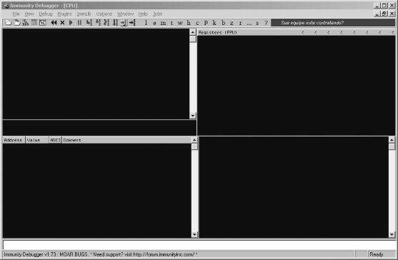
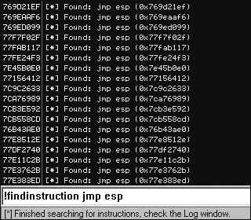
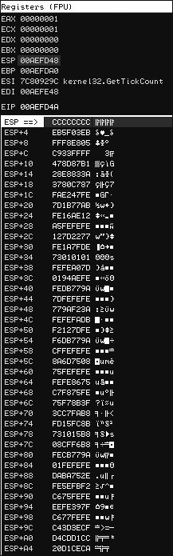
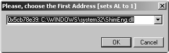
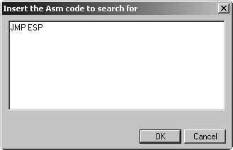
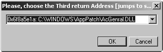

# 五、IMMUNITY----最好的调试器

# 5 IMMUNITY----最好的调试器

到目前为止我们已经创建了自己的调试器，还学会了对 PyDbg 的使用。是时候研究下 IMMUNITY 了。IMMUNITY 除了拥有完整的用户界面外，还拥有强大的 Python 库，使得它处 理漏洞挖掘，exploit 开发，病毒分析之类的工作变得非常简单。 IImmunity 很好的结合了动态调试和静态分析。还有纯 Python 图形算法实现的绘图函数。接下来让我们深入学习 Immunity 的使用，进一步的研究 exploit 的开发和病毒调试中的 bypass 技术。

# 5.1 安装 Immunity 调试器

## 5.1 安装 Immunity 调试器

Immunity 调试器提供了自由发行的版本，可以由 [`debugger.immunityinc.com/`](http://debugger.immunityinc.com/)下载。 下载 后的可执行程序包含了，依赖的文件，包括 python2.5。网速不行的同学下载国内的修 改版。

# 5.2 Immunity Debugger 101

## 5.2 Immunity Debugger 101

在研究强大的 immlib 库之前，先看下 Immunity 的界面。



图 5-1:Immunity 调试器主界面

调试器界面被分成 5 个主要的块。左上角是 CPU 窗口，显示了正在处理的代码的反汇 编指令。右上角是寄存器窗口，显示所有通用寄存器。左下角是内存窗口，以十六进制的形 式显示任何被选中的内存快。右下角是堆栈窗口，显示调用的堆栈和解码后的函数参数（任何原生的 API 调用）。最底下白色的窗口是命令栏，你能够像 WindDbg 一样使用命令控制调 试器，或者执行 PyCommands。

### 5.2.1 PyCommands

在 Immunity 中执行 Python 的方法即使用 PyCommands。PyCommands 就是一个个 python 脚本文件，存放在 Immunity 安装目录的 PyCommands 文件夹里。每个 python 脚本都执行一 个任务（hooking，静态分析等待），相当于一个 PyCommand。每个 PyCommand 都有一个 特定的结构。以下就是一个基础的模型:

```py
from immlib import * 
def main(args):
    # Instantiate a immlib.Debugger instance 
    imm = Debugger()
    return "[*] PyCommand Executed!" 
```

PyCommand 有两个必备条件。一个 main()函数，只接收一个参数（由所有参数组成的 python 列表）。另一个必备条件是在函数执行完成的时候必须返回一个字符串，最后更新在 调试器主界面的状态栏。执行命令之前必须在命令前加一个感叹号。

```py
!<scriptname> 
```

### 5.2.2 PyHooks

Immunity 调试器包含了 13 总不同类型的 hook。每一种 hook 都能单独实现，或者嵌入 PyCommand。

`BpHook/LogBpHook`

当一个断点被触发的时候，这种 hook 就会被调用。两个 hook 很相似，除了 BpHook 被 触发的时候，会停止被调试的进程，而 LogBpHook 不会停止被调试的进程。

`AllExceptHook`

所有的异常的都会触发这个 hook。

`PostAnalysisHook`

在一个模块被分析完成的时候，这种 hook 就会被触发。这非常有用，当你在在模块分 析完成后需要进一步进行静态分析的时候。记住，在用 immlib 对一个模块进行函数和基础 块的解码之前必须先分析这个模块。

`AccessViolationHook`

这个 hook 由访问违例触发。常用于在 fuzz 的时候自动化捕捉信息。

`LoadDLLHook/UnloadDLLHook`

当一个 DLL 被加载或者卸载的时候触发。

`CreateThreadHook/ExitThreadHook`

当一个新线程创建或者销毁的时候触发。

`CreateProcessHook/ExitProcessHook`

当目标进程开始或者结束的时候触发。

`FastLogHook/STDCALLFastLogHook`

这两种 hook 利用一个汇编跳转，将执行权限转移到一段 hook 代码用以记录特定的寄存 器，和内存数据。当函数被频繁的调用的时候这种 hook 非常有用；第六章将详细讲解。

以下的 LogBpHook 例子代码块能够作为 PyHook 的模板。

```py
from immlib import *
class MyHook( LogBpHook ): 
    def init ( self ):
        LogBpHook. init ( self )
    def run( regs ):
        # Executed when hook gets triggered 
```

我们重载了 LogBpHook 类，并且建立了 run()函数（必须）。当 hook 被触发的时候，所 有的 CPU 寄存器，以及指令都将被存入 regs，此时我们就可以修改它们了。regs 是一个字 典，如下访问相应寄存器的值：

```py
regs["ESP"] 
```

hook 可以定义在 PyCommand 里，随时调用。也可以写成脚本放入 PyHooks 目录。每 次启动 Immunity 都会制动加载这些目录。接下来看些实例。

# 5.3 Exploit 开发

## 5.3 Exploit 开发

发现漏洞只是一个开始，在你完成利用程序之前，还有很长的一段路要走。不 过 Immunity 专门为了这项任务做了许多专门的设计，相信能帮你减少不少的痛苦。接下来我 们要开发一些 PyCommands 以加速 exploit 的开发。这些 PyCommands 要完成的功能包括， 找到特定的指令将执行权限转移到 shellcode，当编码 shellcode 的时候判断是否有需要过滤 的有害字符。我们还将用 PyCommand 命令!findantidep 绕过 DEP（软件执行保护）。

### 5.3.1 找出友好的利用指令

在获得 EIP 的控制权之后，你就要将执行权限转移到 shellcode。典型的方式就是，你用 一个寄存器指向你的 shellcode。你的工作就是在可执行的代码里或者在加载的模块里找到跳 转到寄存器的代码。 Immunity 提供的搜索接口使这项工作变得很简单，它将贯穿整个程序 寻找需要的代码。接下来就试验下。

```py
# findinstruction.py 
from immlib import * 
def main(args):
    imm = Debugger() 
    search_code = " ".join(args)
    search_bytes = imm.Assemble( search_code ) 
    search_results = imm.Search( search_bytes )
    for hit in search_results:
        # Retrieve the memory page where this hit exists
        # and make sure it's executable
        code_page = imm.getMemoryPagebyAddress( hit ) 
        access = code_page.getAccess( human = True ) 
        if "execute" in access.lower():
        imm.log( "[*] Found: %s (0x%08x)" % ( search_code, hit ), address = hit )
    return "[*] Finished searching for instructions, check the Log window." 
```

我们先转化要搜索的代码（记得内存中可是没有汇编指令的 ），然后通过 Search()方法 在整个程序的内存空间中包含这个指令的地址。在返回的地址列表中，找到每个地址所属的 页。接着确认页面是可执行的。每找到一个符合上面条件的就打印到记录窗口。在调试器的 命令栏里执行如下格式的命令。

```py
!findinstruction <instruction to search for> 
```

脚本运行后输入以下测试参数，

```py
!findinstruction jmp esp 
```

输出将类似图 5-2



图 5-2 !findinstruction PyCommand 的输出

现在我们已经有了一个地址列表，这些地址都能使我们的 shellcode 运行起来（前提你 的 shellcode 地址放在 ESP 中）。每个利用程序都有些许差别，但我们现在已经有了一个能够 快输寻找指令地址的工具，很好很强大。

### 5.3.2 过滤有害字符

当你发送一段漏洞利用代码到目标系统，由于字符的关系，shellcode 也许没办法执行。 举个例子，如果我们从一个 strcpy()调用中发现了缓冲区溢出，我们的利用代码就不能包含 NULL 字 符(0x00).因 为 strcpy() 一 遇到 NULL 字 符就会停止拷贝数据。因此，就需要 将 shellcode 编码，在目标内存执行后再解码。然而，始终有各种原因导致 exploit 编写失败。比如程序中有多重的字符编码，或者被漏洞程序进行了各种意想不 到的处理，这下你就得哭了。

一般情况下，如果你获得了 EIP 的控制权限，然后 shellcode 抛出访问为例或者 crash 目 标，接着完成自己的伟大使命（反弹后门，转到另一个进程继续破坏，别的你能想得到的脏 活累活）。在这之前，最重要的事就是确认 shellcode 被准确的复制到内存。Immunity 使 的这项工作更容易。图 5-3 显示了溢出之后的堆栈。



Figure 5-3: 溢出之后 Immunity 栈窗口

如你所见，EIP 当前的值和 ESP 的一样。4 个字节的 0xCC 将使调试器简单的停止工作， 就像设置了在这里设置了断点（ 0xCC 和 INT3 的指令一样）。紧接着 4 个 INT3 指令，在 ESP+0x4 是 shellcode 的开始。我们将 shellcode 进行简单的 ASCII 编码，然后一个字节一个 字节的比较内存中的 shellcode 和我们发送 shellcode 有无差别，如果有一个字符不一样，说 明它没有通过软件的过滤。在之后的攻击总就必须将这个有害的字符加入 shellcode 编码中。

你能够从 CANVAS，Metasploit,或者你自己的制造的 shellcode。新建 badchar.py 文件， 输入以下代码。

```py
#badchar.py
from immlib import * 
def main(args):
    imm = Debugger() 
    bad_char_found = False
    # First argument is the address to begin our search 
    address = int(args[0],16)
    # Shellcode to verify
    shellcode = "<<COPY AND PASTE YOUR SHELLCODE HERE>>"
    shellcode_length = len(shellcode)
    debug_shellcode = imm.readMemory( address, shellcode_length ) debug_shellcode = debug_shellcode.encode("HEX") 
    imm.log("Address: 0x%08x" % address)
    imm.log("Shellcode Length : %d" % length)
    imm.log("Attack Shellcode: %s" % canvas_shellcode[:512]) 
    imm.log("In Memory Shellcode: %s" % id_shellcode[:512])
    # Begin a byte-by-byte comparison of the two shellcode buffers 
    count = 0
    while count <= shellcode_length:
        if debug_shellcode[count] != shellcode[count]: 
            imm.log("Bad Char Detected at offset %d" % count) 
            bad_char_found = True
            break 
        count += 1
    if bad_char_found: 
        imm.log("[***** | |] ")
        imm.log("Bad character found: %s" % debug_shellcode[count]) 
        imm.log("Bad character original: %s" % shellcode[count]) 
        imm.log("[***** | |] ")
    return "[*] !badchar finished, check Log window." 
```

在这个脚本中，我们只是从 Immunity 库中调用了 readMemory()函数。剩下的脚本只是 简单的字符串比较。现在你需要将你的 shellcode 做 ASCII 编码(如果你有字节 0xEB 0x09， 编码后后你的字符串将看着像 EB09），将代码贴入脚本，并且如下运行：

```py
!badchar <Address to Begin Search> 
```

在我们前面的例子中，我们将从 ESP+0x4 地址 (0x00AEFD4C) 寻找，所以要在 PyCommand 执行如下命令:

```py
!badchar 0x00AEFD4c 
```

我们的脚本在发现危险字符串的时候将立刻发出警戒，由此大大减少花在调试 shellcode 崩溃时间。

### 5.3.3 绕过 windows 的 DEP

DEP 是一种在 windows(XP SP2, 2003, Vista)下实现的的安全保护机制，用来防止代码 在栈或者堆上执行。这能阻止非常多的漏洞利用代码运行，因为大多的 exploit 都会把 shellcode 放在堆栈上。然而有一个技巧能巧妙的绕过 DEP，利用微软未公布的 API 函数 NtSetInformationProcess()。它能够阻止进程的 DEP 保护，将程序的执行权限转移到 shellcode。 Immunity 调试器提供了一个 PyCommand 命令 findantidep.py 能够很容易找到 DEP 的地址。让我们看一看这个 very very nice 的函数。

```py
NTSTATUS NtSetInformationProcess( 
    IN HANDLE hProcessHandle,
    IN PROCESS_INFORMATION_CLASS ProcessInformationClass, 
    IN PVOID ProcessInformation,
    IN ULONG ProcessInformationLength 
); 
```

为了使进程的 DEP 保护失效，需要将 NtSetInformationProcess()的 ProcessInformationClass 函数设置成 ProcessExecuteFlags (0x22)，将 ProcessInformation 参数 设置 MEM_EXECUTE_OPTION_ENABLE (0x2)。问题是在 shellcode 中调用这个函数将会出 现 NULL 字符。解决的方法是找到一个正常调用了 NtSetInformationProcess()的函数，再将 我们的 shellcode 拷贝到这个函数里。已经有一个已知的点就在 ntdll.dll 里。使用 Immunity 反汇编 ntdll.dll 找出这个地址。

```py
7C91D3F8 . 3C 01 CMP AL,1
7C91D3FA . 6A 02 PUSH 2
7C91D3FC . 5E POP ESI
7C91D3FD . 0F84 B72A0200 JE ntdll.7C93FEBA
...
7C93FEBA > 8975 FC MOV DWORD PTR SS:[EBP-4],ESI
7C93FEBD .^E9 41D5FDFF JMP ntdll.7C91D403
...
7C91D403 > 837D FC 00 CMP DWORD PTR SS:[EBP-4],0
7C91D407 . 0F85 60890100 JNZ ntdll.7C935D6D
...
7C935D6D > 6A 04 PUSH 4
7C935D6F . 8D45 FC LEA EAX,DWORD PTR SS:[EBP-4]
7C935D72 . 50 PUSH EAX
7C935D73 . 6A 22 PUSH 22
7C935D75 . 6A FF PUSH -1
7C935D77 . E8 B188FDFF CALL ntdll.ZwSetInformationProcess 
```

上面的代码就是调用 NtSetInformationProces 的必要过程。首先比较 AL 和 1，把 2 弹入 ESI，紧接着是条件跳转到 0x7C93FEBA。在这里将 ESI 拷贝进栈 EBP-4（记得 ESI 始终是 2）。接着非条件跳转到 7C91D403。在这里将确认堆栈 EBP-4 的值非零。非零则跳转 到 0x7C935D6D。从这里开始变得有趣，4 被第一个压入栈，EBP-4（始终是 2!）被加载进 EAX， 然后压入栈，接着 0x22 被压入，最后-1 被压入（-1 表示禁止当前进程的 DEP）。剩下调用 ZwSetInformationProcess（NtSetInformationProcess 的别称）。上面的代码完成的功能相当于 下面的函数调用：

```py
NtSetInformationProcess( -1, 0x22, 0x2, 0x4 ) 
```

Perfect！这样进程的 DEP 就被取消了。在这之前有两项是必须注意的。第一 exploit 代 码得和地址 0x7C91D3F8 结合。第二执行到 0x7C91D3F8 之前，确保 AL 设置成 1.一旦满 足了这些条件，我们就能通过 JMP ESP 将控制权转移给我们的 shellcode。现在回顾三个必 须的地址：

一个地址将 AL 设置成 1 然后返回。 一个地址作为一连串反 DEP 代码的首地址。 一个地址将执行权限返回到我们 shellcode

在平常你需要手工的获取这些地址，不过 Immunity 提供了 findantidep.py 辅助我们完成 这项 。最后你将得到一个 exploit 字符串，将它与你自己的 exploit 结合，就能够使用了。接 下来看看 findantidep.py 代码，接下来将会使用它进行测试。

```py
# findantidep.py 
import immlib 
import immutils 
def tAddr(addr):
    buf = immutils.int2str32_swapped(addr)
    return "\\x%02x\\x%02x\\x%02x\\x%02x" % ( ord(buf[0]) , 
        ord(buf[1]), ord(buf[2]), ord(buf[3]) )
DESC="""Find address to bypass software DEP""" 
def main(args):
    imm=immlib.Debugger() 
    addylist = []
    mod = imm.getModule("ntdll.dll") 
    if not mod:
        return "Error: Ntdll.dll not found!"
    # Finding the First ADDRESS ret = imm.searchCommands("MOV AL,1\nRET") 
    if not ret:
        return "Error: Sorry, the first addy cannot be found" 
    for a in ret:
        addylist.append( "0x%08x: %s" % (a[0], a[2]) )
    ret = imm.comboBox("Please, choose the First Address [sets AL to 1]", addylist)
    firstaddy = int(ret[0:10], 16)
    imm.Log("First Address: 0x%08x" % firstaddy, address = firstaddy)
    # Finding the Second ADDRESS ret = imm.searchCommandsOnModule( mod.getBase(), "CMP AL,0x1\n PUSH 0x2\n
    POP ESI\n" )
    if not ret:
        return "Error: Sorry, the second addy cannot be found" 
    secondaddy = ret[0][0]
    imm.Log( "Second Address %x" % secondaddy , address= secondaddy )
    # Finding the Third ADDRESS ret = imm.inputBox("Insert the Asm code to search for") 
    ret = imm.searchCommands(ret)
    if not ret:
        return "Error: Sorry, the third address cannot be found" 
    addylist = []
    for a in ret:
        addylist.append( "0x%08x: %s" % (a[0], a[2]) )
    ret = imm.comboBox("Please, choose the Third return Address [jumps to shellcode]", addylist)
    thirdaddy = int(ret[0:10], 16)
    imm.Log( "Third Address: 0x%08x" % thirdaddy, thirdaddy ) 
    imm.Log( 'stack = "%s\\xff\\xff\\xff\\xff%s\\xff\\xff\\xff\\xff" + "A" * 0x54 + "%s" + shellcode ' %\
        ( tAddr(firstaddy), tAddr(secondaddy), tAddr(thirdaddy) ) ) 
```

首先寻找指令"MOV AL,1\nRET",然后在地址列表中选择一个。接着在 ntdll.dll 里搜索反 DEP 代码。第三步寻找将执行权限转移给 shellcode 的代码，这个代码有用户输入，最后在 结果中挑一个。结果答应在 Log 窗口。图 5-4 到 5-6 就是整个流程。



Figure 5-4: 第一步，选择一个地址，并设置 AL 为 1



Figure 5-5:输入需要搜索的指令



Figure 5-6: 选择一个返回地址

最后看到的输出 i 结果如下:

```py
stack = "\x75\x24\x01\x01\xff\xff\xff\xff\x56\x31\x91\x7c\xff\xff\xff\xff" + "A" * 0x54 + "\x75\x24\x01\x01" + shellcode 
```

将生成的代码和你的 shellcdoe 组合之后，你就能将 exploit 移植到具有反 DEP 的系统。 现在只要用简单的 Python 脚本就能在很短的时间内开发出稳定的 exploit，再也不用花几个 小时苦苦寻找地址，最后花 30 秒试验。接下来学习如何用 immlib 绕过病毒的一般的反调试 机制。

# 5.4 搞定反调试机制

## 5.4 搞定反调试机制

现在的病毒是越来越狡猾了，无论是在感染，传播还是在反分析方面。一方面，将代码打包或者加密代码使代码模糊化，另一个方面使用反调试机制，郁闷调试者。接下来我们将 了解常用反调试机制，并用 Immunity 调试器和 Python 创造自己的脚本绕过反调试机制。

### 5.4.1 IsDebuggerPresent

现在最常用的反调试机制就是用 IsDebuggerPresent（由 kernel32.导出）。函数不需要参 数，如果发现有调试器附加到当前进程，就返回 1，否则返回 0.如果我们反汇编这个函数：

```py
7C813093 &gt;/$ 64:A1 18000000 MOV EAX,DWORD PTR FS:[18]
7C813099  &#124;. 8B40 30  MOV EAX,DWORD PTR DS:[EAX+30] 
7C81309C  &#124;. 0FB640 02  MOVZX EAX,BYTE PTR DS:[EAX+2] 
7C8130A0  \. C3  RETN 
```

代码通过不断的寻址找到能证明进程被调试的数据位，第一行，通过 FS 寄存器的第 0x18 位找到 TIB（线程信息块）的地址。第二行通过 TIB 的第 0x30 位找到 PEB(进程环境信息块) 的地址。第三行将 PEB 的 0x2 位置上的 BeingDebugged 变量存在 EAX 寄存器中，如果有调 试器附加到进程，该值为 0x1。Damian Gomez 提供了一个简单的方式绕过 IsDebuggerPresent， 可以很方便的在 Immunity 执行，或者在 PyCommand 中调用。

```py
imm.writeMemory( imm.getPEBaddress() + 0x2, "\x00" ) 
```

上面的代码将 PEB 的 BeingDebugged 标志就当的设置成 0.现在病毒无法使用 IsDebuggerPresent 来判断了调试器了，它傻了。

### 5.4.2 解决进程枚举

病毒会测试枚举所有运行的进程以确认是否有调试器在运行。举个例子，如果你正在用 Immunity 调试 一个病毒，就会注册一个名为 ImmunityDebugger.exe 的进程。病毒通过用 Process32First 查找第一个注册的进程，接着用 Process32Next 循环获取剩下的进程。这两个 函数调用会返回一个布尔值，告诉调用者函数是否执行成功。我们重要将函数的返回值（存 储在 EAX 寄存器中），就当的设置为 0 就能够欺骗那些调用者了。代码如下：

```py
process32first = imm.getAddress("kernel32.Process32FirstW") 
process32next = imm.getAddress("kernel32.Process32NextW") 
function_list = [ process32first, process32next ]
patch_bytes = imm.Assemble( "SUB EAX, EAX\nRET" ) 
for address in function_list:
    opcode = imm.disasmForward( address, nlines = 10 ) 
    imm.writeMemory( opcode.address, patch_bytes ) 
```

首先获取两个函数的地址，将它们放到列表中。然后将一段补丁代码汇编成操作码，代 码将 EAX 设置成 0，然后返回。接下来反汇编 Process32First 和 Process32Next 函数第十行 的代码。这样做的目的就是一些高级的病毒会确认函数的头部是否被修改过。我们在第 10 行再写入补丁，就能瞒天过海了。然后简单的将我们的补丁代码写入第 10 行，现在无论怎 么调用两个函数都会返回失败。

我们通过两个例子讲解了如何使用 Python 和 Immunity 调试器，使病毒无法发现我们。 越来越多的的反调试技术将在病毒中使用，对付他们的方法也不会完结。但是 Immunity 无 疑将会成为你对付病毒或者开发 exploit 的利器。

接下来看看在逆向工程中的 hooking 技术。