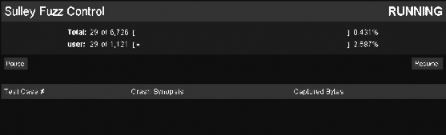
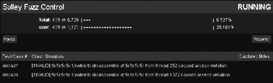

# 九、SULLEY

# 9 SULLEY

Sulley 名字来起源于电影《Monsters》， 一头毛绒绒的蓝色怪物。下面将要看到的 Sulley 也是一个怪物，强大的基于 Python 的 fuzzing 框架的怪物（在这里让我们感谢他们：Pedram Amini 和 Aaron Portnoy of TippingPoint）。Sulley 不仅仅是一个 fuzzer；它还有拥有优秀的崩 溃报告，自动虚拟化技术（VMWare automation）。在 fuzzing 的过程中你可以在任意时刻， 甚至是目标程序崩溃的时候，从新启动程序到前一刻，继续寻找 bug 之旅。In short, Sulley is badass.

Sulley 和 SPIKE（一款著名的协议 fuzzing 工具，当然它是免费的）一样使用了数据块 技术，所以生成的数据会更有“智慧”，不在是一群没头没脑的苍蝇。让我们看看什么是基 于块的 fuzzing 技术，在生成测试数据前，你必须针对协议或者是文件格式，完成一个数据 生成的框架，框架里尽可能详细的包含了协议（或者文件格式）的各个字段，数据类型，还 有长度信息，最后生成的测试数据就会非常有针对性。让后把这些测试数据传递给负责协议 测试的框架，用于 fuzzing。这项技术最早提出来的目的就是为了解决网络协议 fuzz 时的盲 目性。举个例子，在网络协议中，一般每个字段都有长度记录，如果我们发送的测试数据增 加了数据的长度，却没有改变长度记录，那服务端程序，就会根据长度记录，自动抛弃多余 的数据，这样在 fuzzing 的时候，就很难找出 bug 了。基于块的技术则是负责处理这些数据 块间的关系的，让生成的数据更标准，而不是像野蛮人。

接下来我们会详细的讲解 Sully，从安装到使用。先是快速的了解 Sulley 创建 protocol description（协议描述）的基础知识。接着再完成一个包含，fuzzing 框架，包捕获，以及崩溃报告的完整的 fuzzer。我们 fuzzing 的目标就是 WarFTPD，早期的版本存在栈溢出。测试 fuzzer 最常见方法就是，用有漏洞的程序喂它，如果它能咬出一个洞，说明你的 fuzzer 还不 傻，如果什么都没发现，那洗洗回去睡把。这次我们喂的是个怪物，如果你还没有饲养手册， 可以看看 Pedram 和 Aaron 写的 Sulley manual。好了，让我们继续。

# 9.1 安装 Sulley

## 9.1 安装 Sulley

在我们深入探索 Sulley 之前，先得找一头，栓起来。大家可以从 [`www.nostarch.com/ghpython.htm`](http://www.nostarch.com/ghpython.htm) 下载 zip 打包的 Sulley 源代码。（我估计是眼花，愣是 没找到，[`sulley.googlecode.com`](http://sulley.googlecode.com) 此地有货）。

下载完成后，解压 Sulley，在目录下找到 sulley，utils 和 requests 文件夹，然后复制到 C:\Python25\Lib\site-packages\目录下。这些就是 Sulley 的核心。接下来 安装其他依赖的文件。

第一个 WinPcap，一款开源的轻便简洁的网络库，用于 windows 平台下的包捕捉。有搞 过嗅探的同学，对这东西应该是非常熟悉了，建议搞渗透的都去看看它的手册，大饼级别的 黑客利器。Winpcap 被广泛的应用与各种网络工具，入侵检测系统。Sulley 使用它捕捉网络 数据。下载地址：[`www.winpcap.org/install/bin/WinPcap_4_0_2.exe`](http://www.winpcap.org/install/bin/WinPcap_4_0_2.exe)。

接下来安装两个 python 库：pcapy 和 impacket,，和上面的 WinPcap 库配合。它们都由 CORE Security 提供。Pcapy 是 WinPcap 的 Python 接口，impacket 则负责包的解码和创建。 pcap 的下载地址 [`oss.coresecurity.com/repo/pcapy-0.10.5.win32-py2.5.exe`](http://oss.coresecurity.com/repo/pcapy-0.10.5.win32-py2.5.exe).

mpacket 的下载地址 [`oss.coresecurity.com/repo/Impacket-stable.zip`](http://oss.coresecurity.com/repo/Impacket-stable.zip)。下载完后解压到 C:\ directory,进入目录执行以下命令：

```py
C:\Impacket-stable\Impacket-0.9.6.0&gt;C:\Python25\python.exe setup.py install 
```

一切就绪，主角登场！

# 9.2 Sulley primitives

## 9.2 Sulley primitives

在我们开始开始对目标动手前，必须先定义好所有的 building blocks（构建块），这些块 负责产生协议相关的测试数据。 Sulley 提供了所需的各种的数据格式，为我们创建简单高 效的 protocol descriptions 提供了便利。这些单独的数据组件叫做 primitives（原语）。我们先 简短讲解一些 fuzz WarFTPD 时候会用到的 primitives。一旦你理解了如何使用其中一个 primitives，那剩下的就很容易了。

### 9.2.1 Strings

字符串(Strings)是使用最多的 primitives。到处都有字符串；用户名，ip 地址，目录等等。

s_string()指令表示添加进测试数据的 primitives 是一个可 fuzz 的字符串。s_string()只有一个参数,就是有效的字符串，用于协议交互中的正常输入。比如，你 fuzzing 一个 email 地址：

```py
s_string("justin@immunityinc.com) 
```

Sulley 会把 justin@immunityinc.com 当作一个有效值，然后进行各种变形，最后扔给目 标程序。让我们看看 email 地址变成了什么样。

```py
justin@immunityinc.comAAAAAAAAAAAAAAAAAAAAAAAAAAAAAAAAAAAAAAAA AA
justin@%n%n%n%n%n%n.com
%d%d%d@immunityinc.comAAAAAAAAAAAAAAAAAAAAAAAAAAAAAAAAAAAAAA AAAA 
```

9.2.2 Delimiters

Delimiters(定界符)，用于将大的字符串分割成晓得容易管理的片段。还是用先前的 email 地址做例子，用 s_delim()指令能够将它分割成更多的 fuzz 字符串。

```py
s_string("justin") 
s_delim("@") 
s_string("immunityinc") 
s_delim(".",fuzzable=False) 
s_string("com") 
```

通过 s_delim()，我们将 email 地址分成了几个子串，并且告诉 Sulley，我们在 fuzzing 的时候不使用点(.)，但是会使用@ 。

### 9.2.3 Static and Random Primitives

s_static()和 s_random()，顾名思义，第一个使传入的数据不改变，第二个使数据随机的 改变。

```py
s_static("Hello,world!") 
s_static("\x41\x41\x41") 
```

s_random()可以随机产生变长的数据。

```py
s_random("Justin",min_length=6, max_length=256, num_mutations=10) 
```

min_length 和 max_length 告诉 Sully 变形后的数据的长度范围， num_mutations 为可选 参数，表示变形的次数，默认为 25 次。

在我们的例子，使用"Justin"作为源数据，经过 10 次变形，产生 6-256 个长度的字符。

### 9.2.4 Binary Data

Binary Data(二进制数据)是数据表示中的瑞士军刀。Sullyey 几乎能处理所有二进制数 据。当我们在处理一些未知协议的数据包的时候，你也许只是想看看服务器是如何回应我们 生成的这些没有意义的数据的，这时候 s_binary() 就非常有用了

```py
s_binary("0x00 \\x41\\x42\\x43 0d 0a 0d 0a") 
```

Sully 能识别出所有这类的数据，然后像将它们当作字符串使用。

### 9.2.5 Integers

Integers(整数)的应用无处不在，从能看的见的明文数据，到看不见的二进制协议，以及 数据长度，各种结构，等等。

表 9-1 列出了 Sulley 支持的主要几种整数类型。

```py
1 byte – s_byte(), s_char() 
2 bytes – s_word(), s_short()
4 bytes – s_dword(), s_long(), s_int() 
8 bytes – s_qword(), s_double() 
```

Listing 9-1: Sulley 支持的整数类型

所有的整数表达式都有几个重要的的选项。endian 项表示整数将以什么样的形式变现出 来，是小端- (<) 还是 大端- (>)格式 l 默认似乎小端。format 项有两个可选值，ascii 和 binary； 代表整数将被如何使用。举个例子，如果你有一个用 ASCII 格式 表示是 1，用 binary 表示 就是\x31。signed 项说明整数是有符号的还是无符号的，这个选项只有在 format 指定为 ascii 后有效，默认似乎 False。最后一个有趣的选项是 full_range，启用这个选项以后，Sulley 就 会在一个很广的范围内枚举可能的整数值。举个例子，如果我们传入的整数是一个无符号的 整数，把 full_range 设置成 True，这时候 Sulley 就会很智能的测试边界值(接近或者超过最 大值，或者接近最小值)，无符号的最大值是 65535，Sulley 就会试着使用 65534, 65535, 65536 去进行测试。full_range 默认为 False，因为可枚举的时间可是很长的。看看下面的例子。

```py
s_word(0x1234, endian=">", fuzzable=False) 
s_dword(0xDEADBEEF, format="ascii", signed=True) 
```

第一个例子，我们设置了一个 2 字节大小的值 0x1234，并且将表示方式设置成大端，同时作为一个静态值。第二个例子，我们设置了一个 4 字节（双字）大小的值 0xDEADBEEF， 并且将它作为有符号的整数，以 ASCII 形式表现。

### 9.2.6 Blocks and Groups

Blocks(块)Groups(组)是 Sulley 提供的强大的组织工具。Blocks 将独立的 primitives 组装 成一个的有序的块。Groups 中包含了一些特定的 primitives，一个 Group 和一个 Block 结合 后，每次 fuzzer 调用 Block 的时候，都会将 Group 中的数据循环的取出，组成不同的 Block。

下面就是一个使用块和组 fuzzing HTTP 的例子。

```py
# import all of Sulley's functionality. 
from sulley import *
# this request is for fuzzing: {GET,HEAD,POST,TRACE} /index.html HTTP/1.1
# define a new block named "HTTP BASIC". 
s_initialize("HTTP BASIC")
# define a group primitive listing the various HTTP verbs we wish to fuzz. 
s_group("verbs", values=["GET", "HEAD", "POST", "TRACE"])
# define a new block named "body" and associate with the above group. 
if s_block_start("body", group="verbs"):
    # break the remainder of the HTTP request into individual primitives. 
    s_delim(" ")
    s_delim("/") 
    s_string("index.html") 
    s_delim(" ") 
    s_string("HTTP") 
    s_delim("/")
    s_string("1")
    s_delim(".")
    s_string("1")
    # end the request with the mandatory static sequence. 
    s_static("\r\n\r\n")
# close the open block, the name argument is optional here. 
s_block_end("body") 
```

程序一开始我们就定义了一个叫 verbs 的组，其中包含了所有 HTTP 请求类型。之后定 义了一个叫 body 的块，并且和 verbs 组绑定。这意味着，以后 Sulley 每次调用 body 内的变 形数据的时候，都会循环的获取(GET, HEAD, POST, TRACE)5 种请求方式，这样一来，一 次 body 内的变形就相当于产生 5 个不同的 body。

到目前为止，我们已经讲解完了 Sulley 的基础知识。当然 Sulley 不仅仅如此，还有数 据解码，校验和计算，长度自动处理等等。想深入学习的同学可以看 Pedram 写的 Fuzzing: Brute Force Vulnerability Discovery (Addison-Wesley, 2007)，一本综合了 Sulley 和 fuzzing 相 关技术的好书。现在该开始对 WarFTPD 下手了。我们要先创建自己的 primitive 集合，然后

将它们传给负责构建测试的框架内。

# 9.3 猎杀 WarFTPD

## 9.3 猎杀 WarFTPD

在我们已经学会了如何使用 Sulley primitives 创建 protocol description(协议说明)之后。 现在可以拿个东西试试手了。这次的目标就是 WarFTPD 1.65。问题出在 USER 和 PASS 命 令身上，向他们传递过长的数据，就会引发栈溢出。这种漏洞很典型，出现问题的地方结构 也 很 清 晰 ， 作 为 入 手 的 case 再 好 不 过 。 先 从 ftp://ftp.jgaa.com/pub/products/Windows/WarFtpDaemon/1.6_Series/ward165.exe 下载程序。在 当前目录解压子之后，直接运行 warftpd.exe 就能启动 FTP 服务了。在使用 Sulley 书写协议 说明之前，让我们先了解下 FTP 协议的工作流程。

### 9.3.1 FTP 101

FTP 是一个简单轻便的文件传输协议，被广泛的使用于各种环境中，从 Web 服务器到 网络打印机。FTP 服务器默认在端口 21 上监听客户端发送的命令。现在我们要冒充成 FTP 客户端，向服务器发送变形过的命令数据，尝试获得服务器的权限。如果你顺利完成 了 WarFTPD 的 fuzzer， 别忘了用它去寻找新的倒霉蛋。

一个 FTP 服务器既可以设置成不需要密码的匿名访问或者是需要密码的认证访问。因 为 WarFTPD 的漏洞出在 USER 和 PASS 命令上，所以我们就假定服务区使用认证访问。FTP 认证命令的格式如下:

```py
USER <USERNAME> PASS <PASSWORD> 
```

一旦客户端传入了有效的用户名和密码后，服务器就会赋予客户端，传输文件，改变目 录，查询文件等各种权限。当然 USER 和 PASS 命令只是 FTP 服务器提供的功能中的一个 子集，在认证成功后还有很多别的功能，如表 9-2。这些新的命令都要加入到我们程序的协 议框架(protocol skeleton)中。FTP 协议详细的命令，请看 rfc959。

```py
CWD <DIRECTORY> - change working directory to DIRECTORY 
DELE <FILENAME> - delete a remote file FILENAME
MDTM <FILENAME> - return last modified time for file FILENAME 
MKD <DIRECTORY> - create directory DIRECTORY 
```

Listing 9-2:我们要额外 fuzz 的 FTP 命令

命令列表虽然不够详细，但还扩大了测试的范围，现在让我们动手把它们写成 protocol description

### 9.3.2 创建 FTP 协议框架

学以致用，学以致用啊！

```py
#ftp.py
from sulley import * 
s_initialize("user") 
s_static("USER") 
s_delim(" ") 
s_string("justin") 
s_static("\r\n") 
s_initialize("pass") 
s_static("PASS") 
s_delim(" ") 
s_string("justin") 
s_static("\r\n") 
s_initialize("cwd") 
s_static("CWD") 
s_delim(" ")
s_string("c: ") 
s_static("\r\n") 
s_initialize("dele") 
s_static("DELE") 
s_delim(" ") 
s_string("c:\\test.txt") 
s_static("\r\n") 
s_initialize("mdtm") 
s_static("MDTM") 
s_delim(" ") 
s_string("C:\\boot.ini") 
s_static("\r\n") 
s_initialize("mkd") 
s_static("MKD") 
s_delim(" ") 
s_string("C:\\TESTDIR") 
s_static("\r\n") 
```

protocol skeleton 完成之后，让我们开始创建 Sulley 会话，把所有的请求信息连起来， 同时启动网络嗅探和客户端调试。

### 9.3.3 Sulley 会话

Sulley 会话包含了请求数据整合，网络数据包的捕捉，进程调试，崩溃报告，和虚拟机 控制。先让我们定义一个会话文件，然后详细的分析每个部分。

```py
#ftp_session.py
from sulley import *
from requests import ftp # this is our ftp.py file 
def receive_ftp_banner(sock):
    sock.recv(1024) sess = sessions.session(session_filename="audits/warftpd.sess 
    target = sessions.target("192.168.244.133", 21) 
    target.netmon = pedrpc.client("192.168.244.133", 26001) 
    target.procmon = pedrpc.client("192.168.244.133", 26002)
    target.procmon_options = { "proc_name" : "war-ftpd.exe" }
    # Here we tie in the receive_ftp_banner function which receives
    # a socket.socket() object from Sulley as its only parameter
    sess.pre_send = receive_ftp_banner sess.add_target(target) 
    sess.connect(s_get("user")) 
    sess.connect(s_get("user"), s_get("pass"))
    sess.connect(s_get("pass"), s_get("cwd")) 
    sess.connect(s_get("pass"), s_get("dele")) 
    sess.connect(s_get("pass"), s_get("mdtm")) 
    sess.connect(s_get("pass"), s_get("mkd")) 
    sess.fuzz() 
```

receive_ftp_banner()是必须的，因为每个 FTP 服务器在客户端连接上的时候，都会发送 banner(标识)。我们将它和 sess.pre_send 绑定起来，这样 Sulley 发送 fuzzing 数据前的时候 就会先接收 FTP banner。和 receive_ftp_banner 一样，pre_send 也只接收一个由 Sulley 传递的 sock 对象。第一步我们创建一个会话文件，用于记录当前 fuzzer 的状态，同时控制 fuzzing 的启动和停止。第二部定义攻击的目标，包括 IP 地址和端口号。这里设置成 192.168.244.133 端口 21（这是我们运行 WarFTPD 虚拟机的 IP）。第三步，设置网络嗅探的端口为 26001， IP 地址和 FTP 服务器的地址一样，这个端口用于接受 Sulley 发出的命令。第四步，设置调 试器监听的端口 26002，这个端口用于接收 Sulley 发出的调试命令。procmon_options 选项 告诉调试器我们关注的进程是 war-ftpd.exe。第六步，在会话中加入定义好的目标对象。第 七步，将 FTP 请求指令有序的组织好。先是认证，然后将操作指令和需要的密码成对传入。 最后启动 Sulley 开始 fuzzing。

现在我们定义好了会话，组织好了请求指令。只剩下网络和监控脚本的设置了。当这一切都完成的时候，就可以去捕捉我们的猎物了。

### 9.3.4 网络和进程监控

Sulley 的优点之一就是能非常好的跟踪 fuzz 期间的数据交互，以及目标系统的崩溃信 息。这样我们就能在第一时间内分析出引起目标崩溃的数据包，然后快速的开发出 exploit。

在 Sulley 的主目录下可以找到 process_monitor.py 和 network_monitor.py 两个脚本，他 们分别负责网络监控和进程监控。

```py
python process_monitor.py
Output:
ERR> USAGE: process_monitor.py
<-c|--crash_bin FILENAME> filename to serialize crash bin class to
[-p|--proc_name NAME] process name to search for and attach to [-i|--ignore_pid PID] ignore this PID when searching for the
                      target process
[-l|--log_level LEVEL] log level (default 1), increase for more
                       verbosity
[--port PORT] TCP port to bind this agent to 
```

如下启动进程监控。

```py
python process_monitor.py -c C:\warftpd.crash -p war-ftpd.exe 
```

提示:我们已经设置了默认的监听端口 26002，所以不用-p 选项。

接下来看看 network_monitor.py。在这之前需要安装以下的库： WinPcap 4.0, pcapy, mpacket。

```py
python network_monitor.py Output:
ERR> USAGE: network_monitor.py
<-d|--device DEVICE #> device to sniff on (see list below) 
[-f|--filter PCAP FILTER] BPF filter string
[-P|--log_path PATH] log directory to store pcaps to
[-l|--log_level LEVEL] log level (default 1), increase for more verbosity 
[--port PORT] TCP port to bind this agent to
Network Device List:
[0] \Device\NPF_GenericDialupAdapter
[1] {83071A13-14A7-468C-B27E-24D47CB8E9A4} 192.168.244.133 
```

在这里我们需要使用第一个网络接口。如下启动网络监控。 python network_monitor.py -d 1 -f "src or dst port 21" -P C:\pcaps\ 提示：在启动之前必须先建立 C:\pcaps 目录。

一切就绪，开始猎食。

### 9.3.5 fuzzing 和 Web 界面

现在我们启动 Sulley，并使用内置的 Web 界面观察整个 fuzz 过程。

```py
python ftp_session.py 
```

输出如下：

```py
[07:42.47] current fuzz path: -> user 
[07:42.47] fuzzed 0 of 6726 total cases
[07:42.47] fuzzing 1 of 1121
[07:42.47] xmitting: [1.1]
[07:42.49] fuzzing 2 of 1121
[07:42.49] xmitting: [1.2]
[07:42.50] fuzzing 3 of 1121
[07:42.50] xmitting: [1.3] 
```

如果输出是这样的，说明一切正常。Sulley 正在繁忙的工作着。现在让我们看看 web 界面，它会提供更多信息。

用浏览器打开 [`127.0.0.1:26000`](http://127.0.0.1:26000) ，将看到类似图 9-1 的结果。



Figure 9-1: Sulley 的 web 界面

不断的刷新浏览器就能看到当前 fuzzing 的进程，以及正在使用的 primitive。如图 9-1 你会看到正在 fuzzing 的 primitive 是 user，这个命令存在漏洞，在不久之后就会看到如图 9-2 的崩溃报告。



Figure 9-2: Sulley web 界面显示的崩溃信息

很好，应该说非常好！我们已经成功的 Crash 了 WarFTPD，Sulley 也捕捉到了所有相关 的信息。我们看到两个测试用例的错误信息都是不能反汇编 0x5c5c5c5c 这个地址。0x5c 就 是 ASCII 字符\，这是由于传入的\字符过多，覆盖了别的内存区域，紧接这影响到 EIP。当 调试器尝试反汇编 EIP 指向的位置的时候，就会失败，因为 0x5c5c5c5c 不是一个有效的地 址。这意味我们已经能够控制 EIP 了，那接下来就是开发 exploit 了！激动吗？呵呵，可惜 这是我们之前就知道的漏洞。不过有了这次成功的测试，我们对 Sulley 的工作方式已经很 熟悉了，对于别的 fuzzing 对象也只要依葫芦画瓢就行了。Good Luck!

现在点击 test case 的数字，就会看到详细的崩溃信息。如表 9-3 PyDbg 崩溃信息格式在 60 页的"访问违例处理程序"中有详细的讲解。忘记的返回去看 看。

```py
[INVALID]:5c5c5c5c Unable to disassemble at 5c5c5c5c from thread 252 caused access violation
when attempting to read from 0x5c5c5c5c CONTEXT DUMP
EIP: 5c5c5c5c Unable to disassemble at 5c5c5c5c 
EAX: 00000001 ( 1) -> N/A
EBX: 5f4a9358 (1598722904) -> N/A 
ECX: 00000001 ( 1) -> N/A
EDX: 00000000 ( 0) -> N/A
EDI: 00000111 ( 273) -> N/A
ESI: 008a64f0 ( 9069808) -> PC (heap)
EBP: 00a6fb9c ( 10943388) -> BXJ_\'CD@U=@_@N=@_@NsA_@N0GrA_@N*A_0_C@ Ct^J_@_0_C@N (stack)
ESP: 00a6fb44 ( 10943300) -> ,,,,,,,,,,,,,,,,,, cntr User from
192.168.244.128 logged out (stack)
+00: 5c5c5c5c ( 741092396) -> N/A
+04: 5c5c5c5c ( 741092396) -> N/A
+08: 5c5c5c5c ( 741092396) -> N/A
+0c: 5c5c5c5c ( 741092396) -> N/A
+10: 20205c5c ( 538979372) -> N/A
+14: 72746e63 (1920233059) -> N/A
disasm around:
0x5c5c5c5c Unable to disassemble 
stack unwind:
war-ftpd.exe:0042e6fa 
MFC42.DLL:5f403d0e 
MFC42.DLL:5f417247 
MFC42.DLL:5f412adb 
MFC42.DLL:5f401bfd 
MFC42.DLL:5f401b1c 
MFC42.DLL:5f401a96 
MFC42.DLL:5f401a20 
MFC42.DLL:5f4019ca 
USER32.dll:77d48709
USER32.dll:77d487eb 
USER32.dll:77d489a5
USER32.dll:77d4bccc 
MFC42.DLL:5f40116f
SEH unwind:
00a6fcf4 -> war-ftpd.exe:0042e38c mov eax,0x43e548 
00a6fd84 -> MFC42.DLL:5f41ccfa mov eax,0x5f4be868 
00a6fdcc -> MFC42.DLL:5f41cc85 mov eax,0x5f4be6c0 
00a6fe5c -> MFC42.DLL:5f41cc4d mov eax,0x5f4be3d8 
00a6febc -> USER32.dll:77d70494 push ebp
00a6ff74 -> USER32.dll:77d70494 push ebp
00a6ffa4 -> MFC42.DLL:5f424364 mov eax,0x5f4c23b0 
00a6ffdc -> MSVCRT.dll:77c35c94 push ebp
ffffffff -> kernel32.dll:7c8399f3 push ebp 
```

Listing 9-3:#437 测试用例 产生的崩溃信息

Sulley 的主要应用已经讲解完成了。当然这些只是其中的一部分，还有很多很多的东西， 需要各位同学，自己去研究，比如崩溃数据的过滤，primitives 的图形化输出，等等。从今 以后，Sulley 不再是一头可怕的怪物，而是我们 bug-hunging 时的利器。在我们成功的完成 了远程服务的 fuzz 以后，接下来然我们 fuzz 本地的 Windows 下的驱动程序，这次我们用自 己的工具。