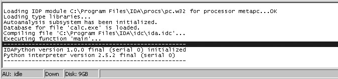
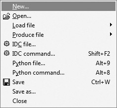
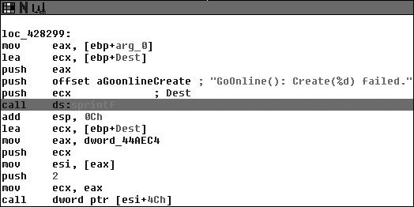

# 十一、IDAPYTHON --- IDA 脚本

# 11 IDAPYTHON --- IDA 脚本

IDA Pro(前身为 Ilfak Guilfanov)以其强大的静态分析功能当之无愧的成为逆向工程的首选。让我们记住它的缔造者，Hex-Rays SA (布鲁塞尔)。IDA 如今已经能够在大多数平台上运行，能够分析大部分平台的二进制文件，同时提供了一个内置的调试器。IDA 的扩展能力也是极其强大的， 提供了 IDC(IDA 的脚本语言)和 SDK(让开发者扩展方便 IDA 插件)。

2004 年 Gergely 和 Ero Carrera 开发了 IDAPython 插件，将强大的 Python 和 IDA 结合起 来，使得自动化分析变得异常简单。而如今 IDAPython 被广泛的使用于各种商业产品（ Zynamics 的 BinNavi ） 和 开 源 工 程 （ PaiMei 和 PyEm ） 中 。 这 一 章 ， 我 们 要 学 会 IDAPython(以 IDA Pro 5.2 为目标)的安装以及重要的函数的使用，最后通过几个简单的例子 进一步熟悉 IDA 自动化分析。

# 11.1 安装 IDAPython

## 11.1 安装 IDAPython

从 [`idapython.googlecode.com/files/idapython-1.0.0.zip`](http://idapython.googlecode.com/files/idapython-1.0.0.zip) 下载我们需要的压缩包。这个 版本比较早，建议大家安装 idapython-1.2.0_ida5.4_py2.5_win32.zip 的版本，这个版本也可以 用于 ida5.5。

下载完后解压缩，将主目录下的 python 文件夹，复制到 IDA 的安装目录下（默认为 C:\Program Files\IDA），将 plugins 目录下 python.plw 复制到 IDA 的 plugins 目录下（默认为 C:\Program Files\IDA\plugins.）。

就当的驱动 IDA，随意加载一个可执行文件，一旦初始化分析完成，就会看到底部的输 出窗口中包含了 IDAPython 的信息，记得不加载文件的时候是不会出现的。如图 11-1。





Figure 11-1: IDAPython 成功安装之后的 IDA Pro 的初始化信息 在文件菜单中将会看到多出两个选项，如图 11-2

Figure 11-2: IDAPython 成功安装后的 DA Pro 文件菜单

连个新的选项分别是 Python file 和 Python command，热键也设置好了。如果能够执行 一个简单的 Python 命令，只要单击 Python command 选项，就会出现一个窗口，输入命令后， 就会 IDA 的输出窗口中看到结果。Python file 选项用于执行独立的 IDAPython 脚本，这也 是这章要重点介绍的。先 IDAPython 已经成功安装，并且正常工作，接下来让我们了解下 常用的 DAPython 函数。

# 11.2 IDAPython 函数

## 11.2 IDAPython 函数

IDAPython 能够访问所有的 IDC 函数，我们只介绍一些会马上用到，为之后的 IDAPython

脚本编写做基础。IDC 总共有 100 多个函数，有兴趣的可以研究研究。

### 11.2.1 常用函数

以下的函数都是在编写脚本的时候经常用到的。

`ScreenEA()`

获取 IDA 调试窗口中，光标指向代码的地址。通过这个函数，我们就能够从一个已知 的点运行我们的脚本。

`GetInputFileMD5()`

返回 IDA 加载的二进制文件的 MD5 值，通过这个值能够判断一个文件的不同版本是否 有改变。

### 11.2.2 段

在 IDA 中二进制文件被分成了不同的段，这些段根据功能分成了不同的类型（ CODE, DATA, BSS, STACK, CONST,XTRN）。以下的函数用于分析获得各种段信息。

`FirstSeg()`

访问程序中的第一个段。

`NextSeg()`

访问下一个段，如果没有就返回 BADADDR。

`SegByName( string SegmentName )`

通过段名字返回段基址，举个例子，如果调用.text 作为参数，就会返回程序中代码段的开始 位置。

`SegEnd( long Address )`

通过段内的某个地址，获得段尾的地址。

`SegStart( long Address )`

通过段内的某个地址，获得段头的地址。

`SegName( long Address )`

通过段内的某个地址，获得段名。

`Segments()`

返回目标程序中的所有段的开始地址。

### 11.2.3 函数

循环访问程序中的所有函数，确定函数的范围，是脚本编程中会经常碰到的问题。下面 的函数对于处理函数非常有用。

`Functions( long StartAddress, long EndAddress )`

返回一个列表，包含了从 StartAddress 到 EndAddress 之间的所有函数。

`Chunks( long FunctionAddress )`

返回一个列表，包含了函数片段。每个列表项都是一个元组（chunk start, chunk end）

`LocByName( string FunctionName )`

通过函数名返回函数的地址。

`GetFuncOffset( long Address )`

通过任意一个地址，然后得到这个地址所属的函数名，以及给定地址和函数的相对位移。 然后把这些信息组成字符串以"名字+位移"的形式返回。

`GetFunctionName( long Address )`

通过一个地址，返回这个地址所属的函数。

### 11.2.4 交叉引用

找出代码和数据的交叉引用，在分析文件的执行流程时很重要，尤其是当我们分析感兴趣的代码块的时候，盲目的查找无意义字符会让你有一种想死的冲动，这也是为什么 IDA 依然会成为逆向工程的王者的原因。IDAPython 提供了一大堆函数用于各种交叉引用。最常 用的就是下面几种。

`CodeRefsTo( long Address, bool Flow )`

返回一个列表，告诉我们 Address 处代码被什么地方引用了，Flow 告诉 IDAPython 是否要 跟踪这些代码。

`CodeRefsFrom( long Address, bool Flow )`

返回一个列表，告诉我们 Address 地址上的代码引用何处的代码。

`DataRefsTo( long Address )`

返回一个列表，告诉我们 Address 处数据被什么地方引用了。常用于跟踪全局变量。

`DataRefsFrom( long Address )`

返回一个列表，告诉我们 Address 地址上的代码引用何处的数据。

### 11.2.5 Debugger Hooks

Debugger Hook 是 IDAPython 提供的另一个非常酷的功能，用于 Hook 住 IDA 内部的调 试器，同时处理各种调试事件。虽然 IDA 一般不用于调试任务，但是当需要动态调试的时 候，调用 IDA 内部调试器还是比外部的会方便很多。之后我们会用 debugger hooks 创建一 个代码覆盖率统计工具。使用 debugger hook 之前，先要睇你一个一个 hook 类然后在类里头 定义各种不同的处理函数。

```py
class DbgHook(DBG_Hooks):
    # Event handler for when the process starts
    def dbg_process_start(self, pid, tid, ea, name, base, size) 
        return
    # Event handler for process exit
    def dbg_process_exit(self, pid, tid, ea, code): 
        return
    # Event handler for when a shared library gets loaded def 
    dbg_library_load(self, pid, tid, ea, name, base, size):
        return
    # Breakpoint handler
    def dbg_bpt(self, tid, ea): 
        return 
```

这个类包含了我们在创建调试脚本时，会经常用到的几个调试事件处理函数。安装 hook 的方式如下:

```py
debugger = DbgHook() 
debugger.hook() 
```

现在运行调试器，hook 会捕捉所有的调试事件，这样就能非常精确的控制 IDA 调试器。 下面的函数在调试的时候非常有用:

`AddBpt( long Address )`

在指定的地点设置软件断点。

`GetBptQty()`

返回当前设置的断点数量。

`GetRegValue( string Register )`

通过寄存器名获得寄存器值。

`SetRegValue( long Value, string Register )`

设定寄存器的值。

# 11.3 脚本例子

## 11.3 脚本例子

我们先创建一些在逆向时候会经常用到的脚本。之后，大家可以在此基础上扩展它们，进一步完成功能更强大，针对性更强的脚步。接下来的脚本将展示如何收集危险函数的调用 信息，以及用 IDA 的 debugger hook 监视函数的代码覆盖率，还有所有函数的栈的大小。

### 11.3.1 收集危险函数的调用信息

当一个开发者在寻找软件漏洞 bug 的时候，首先会找一些常用的而且容易被错误使用的 函数。比如危险的字符串拷贝函数 (strcpy, sprintf)，内存拷贝函数(memcpy)等。在我们审核 程序的时候，需要很简单的就找出这些函数。下面的脚本，将跟踪这些危险的函数，找出调 用它们的地方，之后在这些地方的背景色设置成不同的颜色，我们在 IDA 窗口中就能很方 便的看出来。

```py
#cross_ref.py
from idaapi import *
danger_funcs = ["strcpy","sprintf","strncpy"] 
for func in danger_funcs:
    addr = LocByName( func ) 
    if addr != BADADDR:
        # Grab the cross-references to this address 
        cross_refs = CodeRefsTo( addr, 0 )
        print "Cross References to %s" % func 
        print "-------------------------------"
        for ref in cross_refs: 
            print "%08x" % ref
            # Color the call RED
            SetColor( ref, CIC_ITEM, 0x0000ff) 
```

我们先获得危险函数的地址，然后测试这些地址的有效性。接着获得这些函数的交叉引用信息，确认什么地方调用了它们，最后把它们打印出来，并在 IDA 中给它们上色。用之 前编译好的 war-ftpd.exe 做测试目标，将看到如下的输出:

```py
Cross References to sprintf
------------------------------- 
004043df
00404408
004044f9
00404810
00404851
00404896
004052cc
0040560d
0040565e
004057bd
004058d7
... 
```

Listing 11-1: cross_ref.py 的输出

上面这些被列出来的地址都是 sprintf 被调用的地方，如果在 IDA 中浏览这些地方 会看到它们都被上了色，如图 11-3。



Figure 11-3: sprintf 调用通过 cross_ref.py 上色之后

### 11.3.2 函数覆盖率

在执行动态分析的时候，明白我们真正进行的操作是由什么代码执行的，非常重要。无论是测试网络程序发送一个数据包，还是使用文档阅读器代开一份文档，代码覆盖率都能帮 我们很好的了解，程序做了什么。下面，我们将用 IDAPython 获取目标程序的所有函数， 并且在再每个函数的开始处都设置好断点。之后运行 IDA 调试器，debugger hook 会把每一 次断点触发的情况通知我们。

```py
#func_coverage.py
from idaapi import *
class FuncCoverage(DBG_Hooks):
    # Our breakpoint handler 
    def dbg_bpt(self, tid, ea):
        print "[*] Hit: 0x%08x" % ea 
        return
# Add our function coverage debugger hook 
debugger = FuncCoverage() 
debugger.hook()
current_addr = ScreenEA()
# Find all functions and add breakpoints
for function in Functions(SegStart( current_addr ), SegEnd( current_addr )): 
    AddBpt( function )
    SetBptAttr( function, BPTATTR_FLAGS, 0x0 ) 
num_breakpoints = GetBptQty()
print "[*] Set %d breakpoints." % num_breakpoints 
```

第一步安装 debugger hook ，调试事件发生的时候就会调用它。接着循环获取所有函数 的地址，在每个地址上设置断点。SetBptAttr 告诉调试器，遇到断点后，不用停下来，继续 执行；如果没有这样做，那我们就得手工恢复调试器了，不累死也得烦死。最后一部就是打 印出所有断点的数量。当一个断点被触发的时候， debugger hook 里的断点处理函数就会打 印出当前的地址，这个地址由变量 ea 提供，它引用当前 EIP 寄存器的值。现在运行调试器（热键 F9），你将清楚的看到什么函数被执行了，以及它们执行的顺序。

### 11.3.3 计算栈大小

有时当我们对一个程序进行漏洞评估的时候，了解函数调用的栈的大小是很重要的。我们必须明确的知道，传递给函数的是一个指针还是申请好的栈缓冲区，如果是后者，我们就 会很感兴趣,能传递多少数据给它,要知道溢出可是个精活，空间太小了尽管有漏洞也很难利 用。下面我们用一段简短的代码完成这项任务：枚举程序中所有的函数，然后收集这些函数的栈信息，如果栈缓冲区大小符合我们的要求，就打印出来。将这些和前面的脚本合并起来， 我们就能在调试程序的时候，很好的跟踪调试感兴趣的函数 。

```py
#stack_calc.py
from idaapi import *
var_size_threshold = 16 current_address = ScreenEA()
for function in Functions(SegStart(current_address), SegEnd(current_address) ): 
    stack_frame = GetFrame( function )
    frame_counter = 0
    prev_count = -1
    frame_size = GetStrucSize( stack_frame ) 
    while frame_counter < frame_size:
        stack_var = GetMemberName( stack_frame, frame_counter ) 
        if stack_var != "":
            if prev_count != -1:
                distance = frame_counter - prev_distance 
                if distance >= var_size_threshold:
                print "[*] Function: %s -> Stack Variable: %s (%d bytes)" % ( GetFunctionName(function), prev_member, distance )
            else:
                prev_count = frame_counter 
                prev_member = stack_var
            try:
                frame_counter = frame_counter + GetMemberSize(stack_frame, frame_counter)
            except:
                frame_counter += 1
        else:
            frame_counter += 1 
```

我们设置了一个阈值，用来衡量一个栈变量的大小是不适合我们的需求；这里设置成 16 个字节，不过大家也可以实验下各种不同的大小看看得出的结果。首先，循环获取所有 的函数，得到每个函数的栈框架对象。调用 GetStrucSize 计算出栈框架的大小。接着循环 获取栈中的变量。如果找到变量，就将当前变量的位置减去前一个变量的位置。然后通过之 间的差值计算出变量占据的空间大小。如果大小够大，就打印出来，如果不够大，就尝试计 算当前变量的大小，然后加上当前的位置，得到下一个变量的位置。如果无法确认变量的大 小，就在当前的位置简单的加一个字节，移动到下一个位置，然后继续循环。在脚本运行后， 我们就能看看难道类似如下的输出。

```py
[*] Function: sub_1245 -> Stack Variable: var_C(1024 bytes) 
[*] Function: sub_149c -> Stack Variable: Mdl (24 bytes) 
[*] Function: sub_a9aa -> Stack Variable: var_14 (36 bytes) 
```

Listing 11-2: stack_calc.py 的输出

现在我们有了 IDAPython 的基础知识，同时也动手实现了几个很容易扩展的脚本。这 些小小的脚本，将帮我们节省非常多的时间，在逆向工程中，最事件就是一切。下一章让我 们看一看 IDAPython 的实际应用：PyEmu，一个基于 Python 的 x86 仿真器。